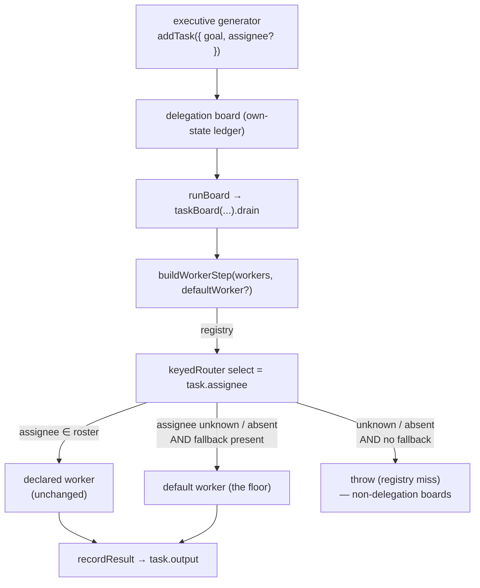

# FIX-940: On-demand default worker (delegation floor) — Implementation Spec

> **Issue:** [FIX-940](https://linear.app/fixpoint-labs/issue/FIX-940/on-demand-default-worker-delegation-floor) · **Epic:** [FIX-930](https://linear.app/fixpoint-labs/issue/FIX-930/delegation-substrate-host-model-roster-and-identity-and-worker-context) (Delegation substrate) · **Foundation decision:** [FIX-923](https://linear.app/fixpoint-labs/issue/FIX-923/research-delegation-host-model-manageric-separation-on-demand-vs-pre) (host model) · **Builds on:** [FIX-918](https://linear.app/fixpoint-labs/issue/FIX-918) (shipped delegation surface)
>
> **Necessity verdict:** Build as scoped (leanly). This composes machinery that already exists — the `keyedRouter` `fallback` slot, the uniform-worker path, and `materializeWorker` — into the delegation surface. FIX-923 already made the architectural call; this is a small, coherent wiring change, not a new subsystem.

---

## Part I — The Case

### 1. Problem — why it matters, why now

Today you cannot delegate work from a skill until you have hand-written a roster of workers. The delegation board dispatches each task by its `assignee`, and if a task names an assignee that was never declared — or names none at all — the board throws and the task is marked errored. So an author who just wants to say "farm this out to a capable worker" first has to enumerate every worker up front. That makes delegation feel like plumbing you assemble, not a feature you use.

**Why now:** the delegation surface shipped (FIX-918) and the host model is decided (FIX-923): the host is a coordinator that dispatches to an on-demand **default-worker floor**, with named workers as an optional specialization layer. This issue builds that floor. It also unblocks FIX-924 (roster-aware assignment validation), which needs the floor's semantics to exist before it can define "unknown assignee is valid, routes to the floor" vs. "reject the typo."

### 2. Solution in plain terms

Give every delegation board a **default worker**: a baseline, capable, generic worker that runs any task the roster doesn't claim. When a task's `assignee` matches a declared worker, nothing changes — that worker runs it, exactly as today. When the `assignee` is unknown or absent, the task routes to the default worker instead of throwing. The default worker runs on the board drain like any other worker and records its output on the task.

Two entry points, one mechanism:

- **Roster + floor:** a skill declares some agents and delegates to an undeclared/unnamed assignee → floor catches it.
- **No roster at all:** a skill turns on delegation with `delegation: true` and declares no agents → every task runs on the floor. "Delegation that just works," no roster required.

**The philosophy that led here.** This leans hardest on **tenet 2 (Composition over features)**: the substrate already carries every piece — `keyedRouter` takes an optional `fallback` block for unknown keys, `materializeWorker` already builds a board worker from a bare `{ prompt }` spec, and the board already routes a uniform worker over every task. FIX-923's research said it plainly: "the gap is a delegation-surface choice, not a substrate change." We wire the unused `fallback` slot rather than adding a dispatch concept. It also leans on **tenet 3 (Earn every addition)**: no new config concept — we reuse the existing `delegation` binding field (today only `false` is meaningful) to opt a rosterless skill in, and reuse the existing model-resolution chain rather than adding a "default worker model" knob.

### 3. Tradeoffs & alternatives

- **Uniform worker instead of a fallback (rejected).** The board already supports a single uniform worker that handles *every* task. We could route all delegation through it. But that discards the declared roster — named workers would stop getting their own persona/tools. The fallback slot is exactly the "declared workers win, floor catches the rest" shape we want, so it's strictly better here.
- **A bespoke default-worker block (rejected).** We could hand-write a dedicated worker block. But `materializeWorker` already turns a `{ prompt }` spec into a board worker with the right input schema, visibility, and model resolution. Reusing it means the floor is *the same kind of thing* a declared inline agent is — which is exactly what FIX-641 needs later when it gives the floor an identity. A parallel block would fork that path.
- **A new `defaultWorker`/`floor` config field (rejected).** Turning on rosterless delegation could take a new binding option. But `delegation?: boolean` already exists (currently a force-*off*). Extending it so `true` force-*ons* the floor adds no vocabulary.
- **Where the genuine complexity is:** not the happy path. It's (a) the behavior change — an unknown assignee that *errors* today now *runs on the floor*; we must confirm no consumer depends on the fail-late error (FIX-924 is the one that reintroduces strictness, as an opt-in), and (b) the gating change to let the surface install with an empty roster, since own-state fields and the board field are decided at build time and the tools resolve per execution — the "empty roster but floor on" path must still produce the tools.

### 4. Focus practices

- **Compose, don't add (tenet 2).** Reuse `keyedRouter`'s `fallback`, `materializeWorker`, and the existing `delegation` field. If a step introduces a new dispatch branch or a new config concept, stop — the substrate almost certainly already has the seam.
- **BP-030 / BP-035 — tolerate the old shape, walk the second path.** The default worker is opt-out of the *old* behavior for unknown assignees (error → floor-run). Test both the roster-hit path (unchanged) and the floor path, and confirm a board with **no** `defaultWorker` configured still throws on an unknown key (non-delegation boards, e.g. blackboard, must be untouched).
- **BP-003 — evidence.** A real-model goal check (delegate to an undeclared assignee, watch the floor run it and record output) plus a mocked-model CI test are both required.
- **Fallback stays a fallback (change-specific rule).** Declared workers must be byte-for-byte unaffected. The floor is only reached on a registry miss; prove a declared assignee never touches it.

### 5. What using it looks like

**Rosterless delegation — the new baseline.** A skill that delegates without declaring a single worker:

```yaml
---
description: Break a request into parts and farm each out.
---
You are a coordinator. Plan the work on your board:
1. addTask one task per part (leave assignee unset).
2. Call runBoard once. Synthesize the results.
```

```ts
// Empty roster: opt the floor in explicitly.
const skills = createSkillsLibrary({ catalog, initialSkills });
generator({ uses: [skills.with({ active: ["coordinator"], delegation: true })] });
// The generator gets taskTools + runBoard + a board whose only worker is the
// default floor. addTask({ goal }) with no assignee runs on the floor.
```

**Roster + floor.** A skill with named workers that also delegates to an unnamed assignee:

```ts
// research-lead declares agents: { researcher, writer }. Delegation installs
// automatically (agents: present). The floor is wired as the board's fallback.
await addTask({ goal: "Summarize the raw notes", assignee: "researcher" }); // declared → researcher
await addTask({ goal: "Draft a one-line TL;DR" });                          // no assignee → floor
await runBoard();
// Both tasks settle with output recorded. researcher behaves exactly as before.
```

**Before/after — unknown assignee.**

```ts
// Before: throws out of the worker router → task marked errored, no output.
await addTask({ goal: "…", assignee: "nobody-declared-this" });
// After: routes to the default worker → runs, output recorded on the task.
```

### 6. Decisions & rules — the sign-off surface

1. **Wire the default worker as the board's `keyedRouter` `fallback`.**
   - *Alternative rejected:* replace the registry with a uniform worker (loses declared workers), or add a new dispatch branch.
   - *Ramification:* declared workers are untouched; an unknown/absent assignee routes to the floor instead of throwing. The change lives at the worker-step + board-config seam, threaded from the delegation surface.

2. **Materialize the default worker via the existing `materializeWorker` from a synthetic baseline spec** (`{ prompt: <generic capable-worker body> }`, no tools/identity).
   - *Alternative rejected:* a bespoke default-worker block.
   - *Ramification:* the floor is the same kind of worker a declared inline agent is; FIX-641 later swaps the synthetic spec for an identity-bearing one on the same seam. Model resolution reuses the existing chain (`workerModelId` library option → neutral fallback) — **no new model knob**.

3. **The floor is on whenever the delegation surface installs; an unknown/absent assignee runs on it (was: error).**
   - *Alternative rejected:* keep throwing, or make the floor a per-skill opt-in even when a roster exists.
   - *Ramification:* changes today's fail-late error for unknown assignees into a floor-run — the intended "on-demand" posture from FIX-923. FIX-924 reintroduces strict-roster rejection as an explicit opt-in mode, so nothing loses the ability to reject typos; it just stops being the only behavior.

4. **Rosterless delegation opts in through the existing `delegation: true` binding field.**
   - *Alternative rejected:* a new `defaultWorker`/`floor` config field, or a skill-frontmatter flag.
   - *Ramification:* `delegation: true` installs the full surface (board + taskTools + runBoard + floor) even when no bound skill declares `agents:`. Reuses one existing field; the build-time gating (`delegationPossible`) and the per-execution tool builder both learn about the floor.

5. **Guidance + `addTask` copy advertise the floor.**
   - *Alternative rejected:* leave the roster-only guidance ("Your agents: …") and the "assignee names an agent" description as-is.
   - *Ramification:* the coordinator model is told `assignee` is optional and that an unnamed/unknown task runs on a default worker. Small prompt-copy change; sets up FIX-924's assignment wording. When the roster is empty, the guidance leads with the floor rather than an empty agent list.

**Non-goals:** personas/identities for the floor (FIX-641); roster-aware assignment validation / strict-reject mode (FIX-924); the over-spawning enqueue cap (FIX-931); any detached/background/durable execution (FIX-939); the manager/IC split itself (decided in FIX-923).

**Size:** Medium — multi-file, single PR, ~150–250 LOC (worker-step, board config, delegation surface, gating, guidance copy, tests, one docs page). No PR plan needed.

---

## Part II — The Build Plan

### 7. Technical design

The default worker slots into exactly one place in the dispatch path: the `keyedRouter` that `buildWorkerStep` builds for a worker registry. That router already accepts an optional `fallback` block for keys absent from the registry — the delegation board simply never passes one today. We pass one.



The pieces, and how they talk:

- **`keyedRouter`** (core utility) already routes unknown keys to `fallback` when given one. No change to the primitive.
- **`buildWorkerStep`** (task-board) builds the registry router. It gains an optional default-worker input; when present it (a) pre-connects it with the same `Task → TaskWorkerInput` adaptation the registry workers get, (b) passes it as the router's `fallback`, and (c) relaxes its "no assignee → throw" guard so an *absent* assignee also routes to the fallback **only when one is configured** (no fallback → keep throwing, preserving every non-delegation board).
- **`taskBoard(...)`** config gains an optional `defaultWorker` (a `TaskWorker`) threaded straight into `buildWorkerStep`. This is the board's public seam for a floor; other consumers (blackboard, patterns) simply don't set it and are unaffected.
- **The delegation surface** (`delegation-surface.ts` `buildTools` → `buildRunBoardTool`) materializes the floor via `materializeWorker` from a synthetic baseline `AgentSpec` and passes it as `taskBoard({ defaultWorker })`. The synthetic spec carries a generic capable-worker prompt, no `tools`, no `model` (so model resolution falls to the library's `workerModelId` then the neutral default). Because the floor is materialized here, it closes over the same drain board — its output records through the existing `recordResult` path with no special-casing.
- **Gating** (`library.ts`): `delegationPossible` becomes true when `delegation: true` even with an empty roster; the surface deps carry a "floor on" signal so `buildTools` returns the tool surface (taskTools + runBoard, floor as fallback) even when the materialized roster is empty — today it early-returns `[]` on an empty roster, which must yield to "empty roster but floor on → still build."
- **Guidance/copy**: the playbook + roster text (`buildGuidance`) and the `addTask` description gain the floor advisory; with an empty roster the guidance names the floor rather than an empty "Your agents:" list.

*Illustrative (a sketch, not the contract) — the router seam:*

```ts
// buildWorkerStep, registry path — the one behavioral edit:
utility.keyedRouter({
  blocks: connectedWorkers,
  ...(defaultWorker ? { fallback: connect(defaultWorker) } : {}),
  select: (task) => task.assignee
    ?? (defaultWorker ? UNMATCHED_SENTINEL /* → fallback */ : throwNoAssignee()),
});
```

### 8. Implementation sequence

Each step is independently testable; build in order (later steps consume earlier seams). All in one PR.

1. **`keyedRouter` fallback — verify, don't change.** Confirm (via a focused test if not already covered) that an unknown key with a `fallback` routes to it and a known key never does. This is the load-bearing primitive; pin it. *Test:* unit — known key → its block; unknown key + fallback → fallback; unknown key, no fallback → throws.

2. **`buildWorkerStep` + `taskBoard` config: thread an optional default worker.** Add the optional default-worker input to `buildWorkerStep`; pre-connect it, pass it as the router `fallback`, and relax the absent-assignee throw to route to the fallback only when configured. Add the optional `defaultWorker` to the board config and thread it through. *Test:* board-level — registry + `defaultWorker`: declared assignee → its worker; unknown assignee → default; absent assignee → default; **no** `defaultWorker` → unknown/absent still throws (regression guard for blackboard etc.).

3. **Delegation surface: materialize and wire the floor.** Define the synthetic baseline `AgentSpec` (a shared generic-worker prompt constant); in `buildTools`, materialize it via `materializeWorker` and pass it to `buildRunBoardTool` → `taskBoard({ defaultWorker })`. Ensure the empty-roster early-return no longer suppresses the tool surface when the floor is on. *Test:* surface — a delegation skill with a roster gets both its workers **and** a floor; an unknown-assignee task drains and records output.

4. **Gating for rosterless delegation (`library.ts`).** Extend `delegationPossible` so `delegation: true` installs the surface with zero declared agents; carry a "floor on" flag into `DelegationSurfaceDeps`. *Test:* a skill with no `agents:` bound with `delegation: true` exposes taskTools + runBoard; `addTask({ goal })` (no assignee) + `runBoard` runs on the floor and records output. Default (no `delegation` flag, no agents) installs nothing.

5. **Guidance + `addTask` copy.** Update `buildGuidance` (name the floor; handle empty roster) and the `addTask` tool description (assignee optional; unnamed → default worker). *Test:* guidance string contains the floor advisory with and without a roster.

6. **Docs + changeset** (see §11). Add the `.changeset/*.md` (minor — new user-facing capability).

**Removals:** none of substance — this is additive wiring. The one *subtraction* is the unconditional "empty roster → `[]`" early return in `buildTools`, which becomes conditional on the floor being off.

### 9. Edge cases & error handling

| Case | Expected behavior |
|---|---|
| `assignee` matches a declared worker | Declared worker runs it — **unchanged**. |
| `assignee` is an undeclared string | Routes to the default worker; output recorded. |
| `assignee` omitted | Routes to the default worker (when floor on); if floor off (non-delegation board), throws as today. |
| Delegation board with a roster (agents declared) | Floor auto-wired as fallback; roster workers win their keys. |
| `delegation: true`, empty roster | Surface installs; floor is the only worker. |
| No `delegation` flag, no `agents:` | Nothing installs — zero delegation overhead (unchanged). |
| `delegation: false` | Force-off even if agents declared — **unchanged**; no floor. |
| Non-delegation board (blackboard, pattern) with unknown assignee | Still throws (no `defaultWorker` configured) — regression guard. |
| Default worker throws mid-task | Handled by the existing worker `.rescue()` → `recordError` → task `errored` under the board's `onError` policy. No new error path. |
| Floor task fans out (default worker has no `taskTools`) | Baseline floor has no `taskTools`, so no mid-drain fan-out — deliberate; FIX-641/later can add it. |

Error taxonomy: no new error codes. The floor removes a throw (unknown assignee) on delegation boards and adds none. The `no_delegation_board` path (taskTools with no board) is untouched.

Second-path checklist (BP-035): **legacy** — persisted `PatternBinding`s without the floor still work (floor is derived at build/exec time, not persisted). **Null-boundary** — absent `assignee` is the primary new null path (covered above). **Multi-tenant** — the board is own-state/private; the floor is per-generator, no cross-tenant surface. **Off/new-state** — test `delegation: true` (new) and the default no-flag path (off). **Concurrency** — the floor runs as a normal route under the existing forEach/claim CAS path; no new shared state.

### 10. Testing strategy

- **Goal & goal check (real path, real model).** A delegation skill (rosterless, `delegation: true`) where the coordinator `addTask`s a task with no assignee and calls `runBoard`; assert the default worker ran it and its output is recorded on the task. `AI_GATEWAY_API_KEY` is available; a fresh worktree needs `pnpm install` first. This proves the outcome the issue cares about end to end. Seam: `fsdev run` on a small delegation flow, or an integration-tests entry.
- **CI specs (mocked, deterministic).** Discipline: `tdd` (feature), seam = vitest at the worker-step / board / delegation-surface layers with a mocked worker generator.
  - `keyedRouter`: unknown key + fallback → fallback; known key → its block; unknown, no fallback → throws.
  - `buildWorkerStep`/`taskBoard`: unknown & absent assignee → default worker; declared → declared worker; **no `defaultWorker`** → throws (regression guard).
  - delegation surface: roster + floor coexist; unknown-assignee task drains and records output.
  - gating: `delegation: true` + empty roster installs taskTools + runBoard; unnamed task runs on floor; no-flag no-agents installs nothing.
  - guidance: floor advisory present with and without a roster.

### 11. Documentation plan

*(Placement confirmed against the live category tree and page anchors via the docs-scoping pass. All four files sit under the top-level **Orchestration** category; no `sidebars.ts` edit and no new page — the floor is an option on an existing concept. There is no per-package API-reference page for orchestration.)*

- **EXTEND `apps/docs/docs/skills/delegation.md`** — new **"Default worker (the floor)"** section between **"Board and overrides"** and **"What the executive gets"** (that's where the empty-vs-declared-roster mental model and `delegation: false` already live, so the floor reads as the roster's lower bound before the tool walkthrough). This page also carries the **full `delegation: true` semantics** (extend the "Board and overrides" block so both boolean directions are documented: `false` suppresses a declared roster, `true` installs the floor with an empty/absent roster). Also touch the `addTask ... assignee (an agent key)` line so an unknown/omitted assignee is shown routing to the floor. Outline: one-line definition first, then the two entry points, then a small `addTask`-with-no-assignee example; note named workers are unaffected and strict typo-rejection is a later opt-in (reference by capability, not ticket, per the docs no-ID rule). Voice risks: lead with the definition, don't drift into numbered tutorial steps; avoid "powerful/just works"; introduce "floor" in plain terms; watch em-dashes.
- **EXTEND `apps/docs/docs/orchestration/task-board.md`** — under **"Worker registry"**, revise the current registry-miss sentence ("A task whose `assignee` doesn't match any worker fails per `onError`") to state the precedence as a rule: matched assignee wins; an unmatched/omitted assignee falls to `defaultWorker`; only with no `defaultWorker` configured does it fail per `onError`. Add `defaultWorker` to the config/`Defaults:` note ("no default worker unless configured"). Cross-link to the delegation page. Keep it contract-terse.
- **EXTEND `packages/orchestration/README.md`** — one clause in the **"Task board"** config sentence naming `defaultWorker` (fallback for unmatched/omitted assignee), and one sentence in **"Skills and delegation"** noting the floor materializes on demand so an empty roster still runs. No new heading; dense-reference voice.
- **EXTEND `apps/docs/docs/skills/binding.md`** — the `delegation` option is only *pointed at* here (the `with({ active })` "A preloaded skill can delegate" bullet), not fully documented. Extend that bullet with one clause: binding can force delegation on via `delegation: true` (relying on the default worker) even when the skill declares no `agents:`. Keep it a pointer; the full semantics stay in delegation.md. Frame `true`/`false` as explicit overrides of the default (install iff `agents:` declared), so the empty-roster floor doesn't read as default behavior.

### 12. Dependencies, open questions & follow-ups

**Dependencies:** none blocking — builds entirely on shipped FIX-918 surface and decided FIX-923 host model. No open PR touches the worker-step / delegation-surface seam (confirm at implementation start). This issue **gates** FIX-924 (assignment validation consumes the floor's "unknown → floor" semantics) and **blocks** FIX-641 (identity layered on this floor).

**Open questions:**
- *Generic-worker prompt body.* The exact baseline prompt for the floor is the implementer's to draft (a short capable-generalist system prompt); it's copy, not architecture. Keep it neutral and provider-agnostic.
- *`delegation: true` naming.* Reusing the existing boolean (`false` = off, `true` = force-on-with-floor) is the leanest call and the recommendation. If review prefers an explicit `defaultWorker: true` alias for readability, that's a copy-level choice, not a design change — flagged, not blocking.

**Follow-ups (flagged, not built):**
- FIX-924 must land the strict-roster / validate-but-allow-fallback modes that turn the floor from "always catches" into a choice.
- FIX-641 layers identity onto this floor (swaps the synthetic spec for an identity-bearing worker on the same `materializeWorker` seam).
- FIX-931 (over-spawning enqueue cap) is the natural guard once rosterless delegation makes fan-out cheaper — out of scope here.
- *Deepening note:* the delegation surface's `buildTools` empty-roster early-return and the "is the floor on" signal thread through several deps objects; if this area grows a third gating dimension, consider consolidating the delegation-eligibility flags — follow up via `improve-codebase-architecture`, not in this spec.

---

## Spec evolution

- **Spec drafted** — framed the floor as wiring the already-existing `keyedRouter` `fallback` into the delegation board (composition, tenet 2), materializing the floor through the existing `materializeWorker` from a synthetic baseline spec, and reusing the existing `delegation` binding field (`true` = force-on with empty roster) rather than adding config; single Medium PR, floor-always-on when delegation installs, with FIX-924 reintroducing strictness as an opt-in.
