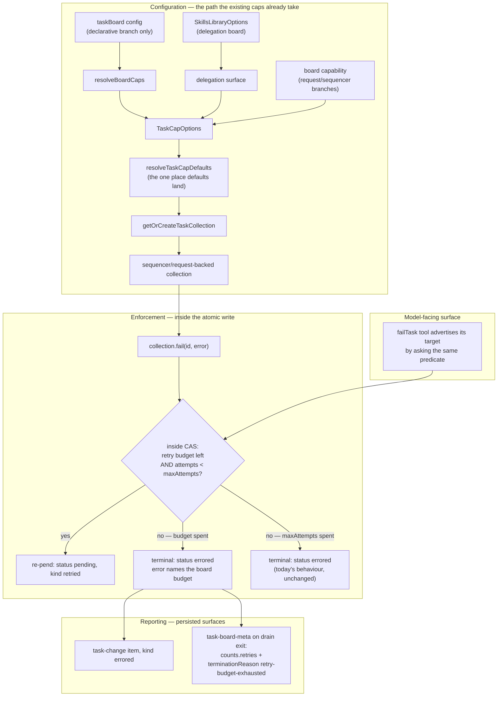

# FIX-948: `maxAttempts` retry storms are invisible to `maxTotalTasks` / `maxEnqueuedTasks` — Implementation Spec

**Linear:** [FIX-948](https://linear.app/fixpoint-labs/issue/FIX-948/maxattempts-retry-storms-are-invisible-to-maxtotaltasks) · **Epic:** [FIX-980 — Honest task substrate](https://linear.app/fixpoint-labs/issue/FIX-980) · **Epic-spec and its governing decisions:** [epic PR #983](https://github.com/fixpoint-labs/flow-state-dev/pull/983) · **Category:** Bug · **Size:** Medium

> The epic-spec lives on the `epic/honest-task-substrate` branch, not on `main` or on this
> spec branch, so it is linked by PR rather than by relative path.

---

## For reviewers — what this document is

This is a **direction document**, not an implementation. Reviewing it well means answering one question: **is this the right approach?**

**In scope to challenge:**

- The problem framing — are we solving the right thing?
- The approach — will it work, does it fit the architecture and `docs/philosophy.md`?
- Any numbered **Decision** in §6 — that's the sign-off surface.
- Missing constraints, edge cases, or dependencies that would **invalidate** the design.
- Scope — a deliverable that shouldn't ship, or one that's missing.

**Out of scope — deliberately unsettled here, and owned by the implementing agent:**

- Names, signatures, file paths, and module layout.
- Local structure: which helper, how a function is decomposed, error-message wording.
- Micro-optimizations and style preferences.
- Test names and internal test structure (the *behaviours* to test are in §10; the tests themselves are not).
- Anything Part II left open on purpose — it is directional by design, and a gap at that altitude is intended, not an omission.

Feedback in the second list is welcome and gets **recorded verbatim in §13** for the implementer to weigh against real code. It will not be argued with, and it will not be folded into the design prose. Please don't re-raise it: one mention is enough for it to land in §13.

**One factual correction up front, because the issue's own premise was wrong.** The issue and the epic both said nothing bounds a retry storm. That is *too strong*, and §1 states the corrected version. Reviewers should challenge the corrected framing, not the original.

---

# Part I — The Case

## 1. Problem — why it matters, why now

**In plain language.** A task board can retry a failing task. Each retry is a fresh model call, so retries cost real money. The board has two safety limits on how much work it will take on, but both of them only count *new* tasks — and a retry doesn't create a task, it re-runs one that already exists. So a task that keeps failing keeps costing money while both limits sit still, reporting that the board is well under its ceiling. There is no single number an operator can set that says "this board may retry at most N times."

**Why now — and the premise correction that matters.** This issue was `Backlog`/Low because the epic assumed a sibling issue (FIX-933, a spend cap) already bounded retry cost. It didn't: FIX-933 was closed `Done` having shipped no code, and is now `Canceled`. That reopened the question, and answering it honestly gives a *weaker but still sufficient* case than "nothing bounds this":

- **There is a bound today, but it is a product of two other knobs, and nobody chose it.** Total attempts on a board cannot exceed `maxTotalTasks × maxAttempts` — the claim FIX-931's own spec makes (`origin/spec/FIX-931:docs/specs/FIX-931.md:230`). With the defaults that is 500 × whatever each task carries. Nobody sets `maxTotalTasks: 500` intending "up to 1500 model calls," and the product appears in no config, no error, and no report.
- **That product stops being a bound at all if `maxAttempts` is unvalidated.** `TaskInit.maxAttempts` is a plain TypeScript `number` (`packages/orchestration/src/tasks/schema/task-init.ts:31`) copied straight onto the task with no runtime parse (`collection/internal.ts:55`), and the retry gate is a bare comparison, `task.attempts < task.maxAttempts` (`collection/internal.ts:83-86`). A large or infinite value re-pends forever. Whether an LLM replanner can actually put such a value there is **being settled by a separate POC** (see §12) — it is a *validation* defect, not this bound.
- **Either way the guardrail misreports.** `maxTotalTasks`/`maxEnqueuedTasks` are enforced only inside the creation CAS: `assertWithinCaps` (`collection/sequencer-backed.ts:156`) has exactly two call sites, `addTask` (`:262`) and `addTasks` (`:291`), and its own comment says transitions back to `pending` "never reach this, by design" (`:153-154`). Retry re-pends through `transitionTo(id, "pending", "retried", …)` (`:362`). So a board burning its way through a storm answers "how full are you?" with a number that has not moved. That is precisely this epic's defect family.

So the case is not "unbounded" — it is **"bounded only by an invisible product of two unrelated knobs, and not bounded at all if one of them is unvalidated."** That is worth one directly-expressed number.

## 2. Solution in plain terms

Add **one board-level budget on cumulative retries**: how many times, in total, this board may put a failed task back in the queue. Count it across the whole board, not per task, so it fires exactly where the creation caps can't.

When the budget is gone, a task that fails **settles as failed instead of retrying**. It is not parked, not held, not silently dropped — it ends in the same terminal `errored` state that running out of a task's own `maxAttempts` already produces, with an error saying the board's retry budget was the reason. The board's completion report gains the retry total and a distinct termination reason, so "we stopped retrying because the budget ran out" is visible rather than blended into "something failed."

The budget lives with the two existing caps, on the collection, and rides the same configuration path they already use.

**The philosophy that led here.**

- **Tenet 2 (composition over features).** No new mechanism. The budget reuses the collection's existing CAS write for atomicity and the one routing predicate that already decides retry-vs-terminal. A third axis on an existing options object, not a parallel guard.
- **Tenet 5 (one convergence point).** The retry decision already funnels through a single predicate consulted by both backings and the model-facing tool surface. The budget goes *there*, so every writer inherits it and none can be forgotten. §7 enumerates them.
- **Tenet 3 (earn every addition).** One option, one derived counter, no new task status, no new lifecycle transition, no new change-event kind. In mild tension with tenet 3: it *is* a third knob on a surface that already has two, and §3 argues why the alternatives are worse.

## 3. Tradeoffs & alternatives

**The simpler approach, and why it is insufficient.** Tell people to set a sane per-task `maxAttempts` and rely on `maxTotalTasks × maxAttempts`. This is the honest competitor and it nearly works — but the product is not a number anyone chose, it is not reported anywhere, and it is not what an operator wants to control. "At most 250 retries on this board" is one directly-expressed number; "at most 500 tasks, each retrying at most 3 times, so at most 1500 model calls" is arithmetic done by whoever thinks to do it. The bound also silently evaporates if `maxAttempts` is unvalidated.

**Validate `maxAttempts` instead, and stop there.** Clamping `maxAttempts` to a small positive integer *does* restore the product bound, and it is a genuinely good fix — but it is a **different defect** (a missing runtime parse), it is being confirmed by a separate POC, and it leaves the bound as an invisible product. The two compose: validation makes the product hold, this budget makes it *chosen and reported*. This spec does not do the validation work; §12 records why.

**A cost ceiling instead of an attempt count.** Deliberately not proposed here — attempts are this issue's scope. Recorded as a **recommendation** in §12 rather than silently rescoped, along with why the nearest existing ceiling doesn't substitute.

**Rejected: re-entry enforcement inside the existing creation caps.** Designed and rejected in FIX-931 (§6 decision 4), for four reasons, the first fatal. Not reopened. §6 Decision 3 explains why the behaviour chosen here is *not* the variant that was rejected — that distinction is the single most important thing to check in this spec.

**Where the genuine complexity is.** It *is* the counting, and the first draft of this spec got it wrong — see the Spec evolution entry. The trap: the obvious quantity, `attempts`, is written in exactly two places (`collection/internal.ts:54` at build, `:217` at claim) and **nowhere else**. So it moves when a retry is *later observed*, not when it is *authorized*, and it moves for re-claims that were never failure retries at all. A budget compared against it is both unenforceable and misattributing. §7 carries the corrected quantity. The other two are (a) making the routing decision atomic — the existing `fail()` reads outside the CAS and then writes — and (b) making sure the model-facing `failTask` tool doesn't advertise a retry the collection is about to refuse.

## 4. Focus practices

1. **Enumerate every writer through the convergence point (tenet 5).** The budget is an invariant. §7 lists all seven construction/forwarding sites and the four consumers of the routing predicate; a fix that lands at one of them is the expensive review class this epic keeps producing.
2. **Gate on a quantity that changes when the decision is made (BP-035, concurrent path).** Atomicity is necessary but *not sufficient*: a CAS write protects nothing if the number it reads doesn't move inside that write. The counted fact and the authorizing transition must be the same write, or the bound silently admits more than it permits.
3. **The bound must be observable at a *persisted* surface** (epic Decision 4). A guarantee visible only in a transient trace item is not a guarantee. The terminal task state and the board's completion item both persist; that is where the report goes.
4. **Verify before writing "bounded" (this epic's standing lesson).** Every behavioural claim here carries a `file:line` that was read. Three specs in this epic have had their own scope claims refuted, and this issue was itself mis-prioritised on an unchecked assumption.
5. **`null` is the opt-out; omission is not** (established by FIX-931, `collection/task-caps.ts:118-129`). A new cap with a default is a behaviour change, and the migration path has to be a real one.

## 5. What using it looks like

**Configuring it on a declarative board** — the knob sits beside the two it belongs with:

```ts
const board = taskBoard({
  name: "research",
  workers,
  maxTotalTasks: 500,      // existing: lifetime task count
  maxEnqueuedTasks: 100,   // existing: enqueue burst
  maxTotalRetries: 250,    // new: cumulative re-pends across the board
});
```

**Opting out**, the same way the existing caps do:

```ts
const board = taskBoard({ name: "long-lived", workers, maxTotalRetries: null });
```

**On the delegation board**, where the knob surfaces on the skills library rather than on `taskBoard` (the delegation surface constructs its own collection — the path FIX-931 established):

```ts
const library = skillsLibrary({ skills, maxTotalRetries: 100 });
```

**What the caller observes when the budget runs out.** A task that fails with retry budget still on it, on a board whose budget is spent, ends terminal rather than re-queued:

```ts
// before: task re-pends, attempts climb, board reports "under the cap"
// after:
const task = collection.get(id);
task.status;   // "errored"  (was: "pending")
task.error;    // names the board retry budget and the count, not the task's maxAttempts
```

Disabling retries entirely while still running every task once:

```ts
const board = taskBoard({ name: "one-shot", workers, maxTotalRetries: 0 });
```

And the board's completion item distinguishes it:

```ts
// task-board-meta, status: "completed"
{
  terminationReason: "retry-budget-exhausted",   // new member; was "blocked-by-failures"
  counts: { total: 12, completed: 9, errored: 3, retries: 250, /* … */ },
}
```

## 6. Decisions & rules — the sign-off surface

1. **The budget counts *authorized failure retries*, recorded by a per-task counter incremented in the same CAS write that re-pends the task.**
   *Alternative rejected:* deriving the count from `attempts` (`Σ max(0, attempts − 1)`), which the first draft proposed. **Rejected because it is doubly wrong, verified in code**, not because it was inelegant:
   - **It lags the decision it gates.** `attempts` is written in exactly two places — `collection/internal.ts:54` (init) and `:217` (`applyClaimToTask`) — and the retry patch at `collection/sequencer-backed.ts:362-372` does not touch it. So the retry being authorized contributes **zero** at the moment `fail()` decides. With `maxTotalRetries: 1`, two first-attempt failures both read a total of zero and **both** re-pend. This is not merely a race: it is a systematic lag that defeats the bound even when the two failures are strictly sequential, so no amount of atomicity fixes it.
   - **It counts things that are not failure retries.** `unblock` (`:394`) and `resumeFromReview` (`:406`) both route to `pending` without touching `attempts`, and `reclaim` likewise; the *next claim* then increments it. So a board could report its retry budget exhausted having **never retried a failure** — exactly the dishonest reporting this epic is named against.

   *Ramification:* the counted fact is now a ledger fact that changes **when the retry is authorized**, in the same write, and **only** in `fail()`'s retry branch. That makes the no-overshoot guarantee real (Decision 4 becomes load-bearing rather than cosmetic) and makes the number honest to its name: `unblock` / `resumeFromReview` / `reclaim` no longer consume it. The board total is still *derived* — a sum over the ledger — so it keeps the existing caps' lifetime story (`collection/task-caps.ts:27-71`) with no separate stored counter to persist. It stays independent of `maxTotalTasks` (no cross-cap ordering rule), and **it can never refuse a first attempt**, by construction. Cost: one new persisted field on `Task`, which brings BP-030 into play (§9). It also *strengthens* Decision 2 — a quantity derived after the fact is precisely what "observe the storm after the spend" looks like.

2. **The budget lives on the collection, beside the two creation caps — not on the board.**
   *Alternative rejected:* a board-level counter checked in the drain loop.
   *Ramification:* one guardrail model instead of two. The board total is a sum over the ledger (per Decision 1), exactly as `maxTotalTasks` is the map size and `maxEnqueuedTasks` the pending count, so it inherits their lifetime semantics and their one documentation section (`collection/task-caps.ts:27-71`) rather than needing a second, differently-scoped story. Decisive technical reason: `fail()` **is** a collection method and the board is not in the retry call path at all — workers and the delegation `failTask` tool call `collection.fail()` directly. A drain-loop check could only observe a storm *after* the spend, which is exactly the failure mode of the nearest existing ceiling (per-action `tokenBudget` is evaluated at `engine/src/execution/runAction.ts:1346-1376`, after the block already ran, so it reports overspend rather than preventing it). It also inherits the two known gaps of the existing caps rather than inventing a third posture: a **supplied** collection gets no budget (`task-board/index.ts:842-852` refuses cap options there), and resource-backed does not *enforce* — though it does still *account*, which Decision 5 keeps distinct.

3. **At the bound, the failing task settles terminal `errored` — it is not parked and the transition is not refused in place.**
   *Alternative rejected:* both variants FIX-931 rejected in its §6 decision 4 — park-and-promote, and refusing a breaching re-entry.
   *Ramification:* **this is the decision to scrutinise, because it looks like a reopening and is not.** FIX-931 rejected refusing a re-entry because it *strands* work: its caps are capacity limits that refresh, so a refused retry would have been fine moments later, and the task was left in a status the drain treats as unresolved. A cumulative retry budget never refunds, so there is no "later" — terminal is the only honest outcome, and it is the **same** outcome exhausting a task's own `maxAttempts` already produces. A settled task is not stranded: `in_progress → errored` is already in the canonical transition table, the drain counts it as resolved, and `complete-or-blocked` terminates correctly. Nothing is parked, no new status is introduced, and no lifecycle contract is widened.
   **Scope: attempt-owned failures only** — and this is a correctness requirement, not a nicety. `errored` is reachable from **exactly** `in_progress` and `awaiting_review` (`tasks/schema/task-status.ts:33,35`) and from **neither** `pending` nor `blocked` (`:32,34`). `shouldRetryOnFail` is status-blind, so a `fail()` on a `pending` or `blocked` task carrying `maxAttempts` takes the retry branch today and lands the legal `pending → pending` / `blocked → pending`; rerouting it to `errored` would attempt an **illegal transition and throw** instead of settling. So both the budget's accounting and its denial apply only when the failing task is in a status an attempt actually holds — which is precisely FIX-951's existing `ATTEMPT_OWNED_STATUSES` (`collection/internal.ts:94`), reused rather than reinvented. That set and the set of statuses from which `errored` is legal are the same two, so the reroute is legal exactly where it fires. Coherent with this decision's own logic: a settlement is only meaningful for a task that had an attempt to settle. **Widening the transition table is explicitly rejected** — permitting `pending → errored` would let a fresh, never-attempted task be failed outright, which is a new correctness hole rather than a fix.

4. **The routing decision *and* the counter increment happen in one atomic write.**
   *Alternative rejected:* keeping today's read-then-branch shape and accepting overshoot.
   *Ramification:* `fail()` currently reads the task outside the CAS and then calls `transitionTo`, which opens its own write (`collection/sequencer-backed.ts:360-362`). Together with Decision 1 this is now one mechanism, not two independent improvements: read the sum, decide, and record the grant inside a single mutator, so a concurrent failure re-runs against the winner's committed map and sees the grant already taken. That is what makes "the budget's worth lands, no overshoot" a claim we can actually hold — and it only holds because Decision 1 changed *what* is counted. Fixing this also removes a latent race on the existing per-task `maxAttempts` path: in scope by necessity, not scope creep.

5. **The bound is reported at two persisted surfaces: the task's terminal state, and the board's completion item — which gains a `retries` count, the **limit actually in force**, and a distinct `terminationReason`.**
   *Alternative rejected:* letting a budget-exhausted board report the existing generic `"blocked-by-failures"`; and reporting a bare count with no indication of whether any limit applied.
   *Ramification:* widens a public union (`task-board/blocks/board-meta.ts:109`) by one member, `"retry-budget-exhausted"`, and adds two fields to the completion item. Justified by this epic's objective and its Decision 4 (a guarantee must be observable at a persisted surface): a board that burned its entire retry budget reporting the same reason as "one task failed" is the dishonest reporting the epic exists to remove. No new `TaskChangeKind` — the task genuinely errored, so the existing `"errored"` kind is correct.
   **The termination reason is derived from a persisted *denial* fact, never from arithmetic.** `retries === limit` does **not** establish that anything was refused: a task can consume the last grant and then succeed, while an unrelated task carrying no `maxAttempts` fails normally — leaving the count at the limit, an errored task on the board, and **no retry ever denied**. The completion block only sees the final collection snapshot (`task-board/blocks/board-meta.ts:97-110`), so it must read an authoritative marker recorded on the task in the same write that denied it (Decision 1's write), not infer one. On this epic a termination reason that can lie is worse than no new reason at all — if the marker proves too costly, **drop the reason rather than infer it.**
   **Counting and enforcing are separate, and the report must not blur them.** The retry counter is *accounting* — a record of what happened — and it is maintained on **every** backing. The budget is *enforcement* — a limit on what is allowed — and it is only enforceable where the ledger supports an atomic all-tasks check (§9). Reporting the **limit in force** alongside the count is what keeps the pair unambiguous: `retries: 250, limit: 250` says the budget bound the board; `retries: 250, limit: null` says the count is real and nothing limited it. A caller must never have to infer enforcement from the count's existence, and `null` covers both the explicit opt-out and a backing that does not enforce, so no third state is invented.

6. **Posture: the default is a finite budget, with `null` as the documented opt-out — the same posture FIX-931 took.**
   *Alternative rejected:* defaulting to unbounded (opt-in).
   *Ramification:* a safety default protects boards whose authors never learn the knob exists, which is most of the value; opt-in protects almost nobody. It is a **behaviour change**: a board legitimately consuming more retries than the default starts settling tasks terminally with no call-site change. Accepted for the same reason FIX-931 accepted its own ("a deliberate safety default, not an oversight"), with the same real migration path — raise the number or pass `null`.
   *Deliberately stated without a value.* **This decision fixes the posture only.** The number is tracked as the single open question in §12 and is the owner's call; changing it later must never require a re-spec, so nothing in this document derives behaviour from a specific value. (Working proposal, not signed off: **250** — generous against the 500-task default, three orders of magnitude below a storm.)

7. **The option accepts a *nonnegative* finite integer, so `0` is expressible.**
   *Alternative rejected:* mirroring the existing caps' positive-integer validation (`collection/task-caps.ts:137-144`).
   *Ramification:* deliberately asymmetric with the two creation caps, and the asymmetry is justified rather than sloppy: `maxTotalTasks: 0` means "this board can do nothing," which is nonsense and rightly refused, whereas `maxTotalRetries: 0` means "run every task once, never retry" — a coherent and probably common configuration. Without it there is **no way to express it at all**: omission gives the finite default and `null` means unbounded. `0` is also the cleanest demonstration of Decision 1's invariant, since first attempts still run. `NaN` / `Infinity` / negative / fractional stay refused.

8. **The option is exposed exactly where tasks can actually retry — and nowhere else.** That means **adding** it to `supervisor`, `planAndExecute`, and `parallelTasks`, and **not** adding it to `SkillsLibraryOptions` or `eventActors`.
   *Alternative rejected:* mirroring FIX-931's placement mechanically (which put the knob on the delegation surface and on no pattern) — the exact inverse of where retries happen. Also rejected: exposing it on every board-building surface "for consistency."
   *Ramification:* **the earlier drafts had the reach precisely backwards, and this is the correction.** One rule decides every surface: *can a task on this board carry a `maxAttempts`?* If yes the knob is required, because the new finite default applies whether or not it is configurable. If no, the knob would be inert and is refused. Swept rather than inferred (`grep` for `taskBoard(` across `packages/*/src`), which found **four** board-building patterns, not the two under review:

   | Surface | Can its tasks retry? | Knob |
   |---|---|---|
   | `supervisor` | **Yes, by default** — `maxAttemptsPerTask` defaults to **3** (`patterns/src/supervisor/index.ts:262`) | **Required** |
   | `planAndExecute` | Yes when raised — defaults to `1` (`plan-and-execute/index.ts:599`), itself no retries | **Required** |
   | `parallelTasks` | **Yes** — no `maxAttemptsPerTask` option, but `createSeedTasksFromPlan` stamps `t.maxAttempts` straight from planner output (`shared/planning-entry.ts:150-151`) | **Required** |
   | `eventActors` | No — builds its inits directly (`eventActors/index.ts:297,407`), no `maxAttempts` path | Refused (inert) |
   | delegation (`SkillsLibraryOptions`) | No — `addTask` neither accepts nor stamps `maxAttempts` (`task-tools-capability.ts:349-359,382-389`), and the predicate returns `false` without it (`internal.ts:83-85`) | Refused (inert) |

   The consequence that makes this a P1 rather than tidiness: **`supervisor` retries by default**, so the new finite default binds it immediately, and without the knob there is **no way to raise it or opt out with `null`**. `parallelTasks` matters for the same reason one step removed — it can retry on unvalidated planner output. Refusing the knob on `eventActors` and delegation is the same judgement, not a different one: an option that can never bind is the FIX-989 "coverage claimed, not delivered" shape. **Refusing it is not enough on its own** — §7 also requires the axis to be *filtered out* at the delegation construction, which spreads the whole resolved cap object.

**Non-goals.** Re-entry enforcement inside the existing creation caps (rejected in FIX-931, not reopened). Adding `maxAttempts` support to the delegation `addTask` surface, or a retry knob to `eventActors` (Decision 8 — both would be inert today). Any change to `failTask`'s tool surface: it returns `{ ok: true }` and never advertises a target status, so there is nothing there to keep in step. Validating `maxAttempts` (a separate defect — §12). A cost/spend ceiling (recommendation only — §12). Enforcement on resource-backed collections (out of scope for the same reason FIX-931 scoped it out — §9). Bounding the other re-entry paths: `unblock`, `resumeFromReview`, `reclaim`.

**Size: Medium** — one PR, now spanning **two packages** (`orchestration` + `patterns`) after the Decision 8 sweep. At the upper end of Medium rather than the middle: the pattern-config work is three near-identical forwardings plus docs, so it adds breadth, not depth. Still no PR plan — splitting it would put the option and the surfaces that need it in separate PRs, which is worse than one slightly wider change.

---

# Part II — The Build Plan

## 7. Technical design

Three layers, all inside `packages/orchestration`. The budget is **configured** along the path the two existing caps already travel, **derived** from the ledger, **enforced** at the one predicate that routes `fail()`, and **reported** at two persisted surfaces.



**The convergence point (tenet 5).** The routing predicate `shouldRetryOnFail` (`collection/internal.ts:83-86`) is already the single place retry-vs-terminal is decided, and it already has **four** consumers. All four must pass the budget, and listing them is the point:

| Consumer | Location | What it does today |
|---|---|---|
| Sequencer-backed `fail()` | `collection/sequencer-backed.ts:361` | routes to `"pending"`/`"retried"` or terminal `errored` |
| Resource-backed `fail()` | `collection/resource-backed.ts:338` | same routing, separately maintained copy |
| Delegation `failTask` tool | `skills/task-tools-capability.ts:209` | computes the target it *advertises* to the model |
| (the predicate itself) | `collection/internal.ts:83` | the rule both backings are kept in lockstep by |

**The configuration path** — **five** of the seven sites the two existing caps thread through, so the new axis is a field addition rather than new plumbing: `TaskCapOptions` and `resolveTaskCapDefaults` (`collection/task-caps.ts:118-218`), the sequencer backing's option read (`collection/sequencer-backed.ts:86`), `getOrCreateTaskCollection` (`collection/get-or-create.ts:168,183`), `TaskBoardConfig` + `resolveBoardCaps` (`task-board/index.ts:327-340,832-863`), and the board capability's two constructing branches (`task-board/capability.ts:229,268`).

**Plus three pattern wrappers in `packages/patterns`** (Decision 8), each of which builds its own board and already forwards the two creation caps, so the new axis follows the identical shape: `supervisor` (`supervisor/index.ts:91-92` config, forwarded at `:353-355`), `planAndExecute` (`plan-and-execute/index.ts:175-176`, forwarded at `:708-710`), and `parallelTasks` (`parallelTasks/index.ts:43-44`, forwarded at `:109-111`).

**Refusing the option is not the same as keeping it out — the forwarding has to be filtered too.** This is the trap the last fold fell into. `resolveTaskCapDefaults` returns a `TaskCapOptions`, and the delegation surface **spreads the whole resolved object** into the collection constructor (`skills/delegation-surface.ts:580-583` resolves, `:596` spreads `...caps`). So adding the axis to the shared options type installs it on the delegation board *regardless* of whether `SkillsLibraryOptions` exposes it — producing an **inert, non-configurable cap that would silently activate** the moment delegation gained `maxAttempts`. Omitting the public option therefore does **not** satisfy Decision 8 on its own. Either split the retry axis out of the object the delegation surface spreads, or filter it explicitly at that construction; the implementer picks, but the *pass-through must be closed at the path*, not only at the declaration. Sweep the forwarding sites rather than patching the cited lines — `eventActors` (`eventActors/index.ts:248-249`) forwards the two caps the same way and needs the same treatment. Also clear out the residual requirements the previous shape left in this spec's own history: no `SkillsLibraryOptions` field, and no "delegation board is bounded by default" test.

**Transition legality is a hard constraint on the reroute (Decision 3).** The budget's denial turns a soft fail into `errored`, and `errored` is reachable from **exactly** `in_progress` and `awaiting_review`:

| Failing task's status | `→ errored` legal? | Under the budget |
|---|---|---|
| `in_progress` (`task-status.ts:33`) | Yes | Denial applies; reroute is legal |
| `awaiting_review` (`:35`) | Yes | Denial applies; reroute is legal |
| `pending` (`:32`) | **No** | Denial must **not** apply — today's legal `pending → pending` stands |
| `blocked` (`:34`) | **No** | Denial must **not** apply — today's legal `blocked → pending` stands |

Gate both the accounting and the denial on the task being in an attempt-owned status, reusing FIX-951's `ATTEMPT_OWNED_STATUSES` (`collection/internal.ts:94`) rather than writing a second list — those two statuses *are* the legal-reroute set, which is why the reuse is exact rather than coincidental. Without this gate the CAS throws `IllegalTaskTransitionError` on a reachable path instead of settling as promised. Note the failure mode differs by caller and both are wrong: the delegation tool boundary catches the illegality by type and returns a recoverable refusal (`task-status.ts:56-66`), so a model would be told it cannot fail a task it legitimately can; **every other caller — a drain's rescue path, user code driving the collection — gets the throw.**

**The counted fact (Decision 1) — this is the part to get right.** A **per-task counter of authorized failure retries**, incremented in the very patch that re-pends the task, and read as a sum across the ledger.

Why not `attempts`, restated here because it is the natural instinct and it fails: `attempts` is written at `collection/internal.ts:54` (init) and `:217` (claim) and **nowhere else** — grep-verified. Two consequences, both fatal to the guarantee:

| Property the bound needs | `Σ max(0, attempts − 1)` | per-task authorized-retry counter |
|---|---|---|
| Changes **when the retry is authorized** | No — only on the *next claim*, after `fail()` already re-pended. Budget 1 admits two retries even sequentially. | Yes — same write as the re-pend. |
| Counts **only** failure retries | No — `unblock` (`:394`), `resumeFromReview` (`:406`) and `reclaim` all re-pend, and the following claim increments `attempts`. | Yes — only `fail()`'s retry branch writes it. |
| Board total stays **derived** (no new stored counter) | Yes | Yes — summed over the ledger, so `task-caps.ts:27-71`'s lifetime story still applies unchanged. |

Keeping the total *derived* is what preserves the parallel with the two existing caps. The new per-task field is a persisted `Task` field, so **BP-030 applies**: a legacy task record predating it must read as zero via a `== null` guard, never `undefined`-arithmetic into `NaN`. Recording it per task is also honest reporting at the task level for free — "how many times was *this* task retried" becomes answerable, which `attempts` never did cleanly.

**Three backings, two implementations — enumerated, not assumed.** This spec has already been bitten once by fixing one path, so the count is traced through all three rather than the two in view. `get-or-create.ts` routes **`backing: "sequencer"` (`:161`) and `backing: "request"` (`:174`) into the *same* `createSequencerBackedTaskCollection`** — request merely passes `requestStateRef(ctx.request)` as the state ref. Only **`resource` (`:188`)** is a separate implementation with its own `fail()` and its own retry patch (`resource-backed.ts:325-364`). So:

| Backing | Implementation | Counter increments | Budget enforced |
|---|---|---|---|
| `sequencer` | `createSequencerBackedTaskCollection` | Yes | Yes |
| `request` | **same as `sequencer`** — covered for free | Yes | Yes |
| `resource` | `createResourceBackedTaskCollection` (separate `fail()`) | **Yes — must be added explicitly** | No (§9) |

**The resource backing must maintain the counter even though it does not enforce the budget.** The counter is a public `Task` field and feeds the board's `retries` report, so a durable board that skipped it would report **zero retries having actually retried** — a false statement on a public surface, which is exactly the defect class this epic exists to remove, not merely a coverage gap. Accounting is not enforcement: increment the field in that backing's retry patch, test it independently of the sequencer backing, and report the in-force limit as `null` there per Decision 5.

*(Note the naming trap `task-caps.ts:41-51` already warns about: `backing: "sequencer"` names the **state ref's shape**, not the host block. That is why "sequencer and request share an implementation" is a fact to verify in `get-or-create.ts` rather than infer from the option's name.)*

**One grant, one authorization — including when the retry never runs.** The counter increments at *authorization*, so if a re-pended task is never re-claimed (worker died, lease expired) the budget is spent on a retry that never executed. **Accepted deliberately**, for two reasons. It errs conservative: the bound can only under-spend relative to real model calls, never over-spend, which is the correct direction for a safety ceiling. And the alternative — refunding the grant when a lease expires — would require inferring abandonment from lease expiry, which the **epic's Decision 3 forbids outright** ("an expired lease is not evidence of abandonment; no issue in this set may assume otherwise"). Say this in the option's docs rather than leaving a reader to discover the budget is authorization-shaped.

**Atomicity (Decision 4).** Today `fail()` reads via `readTasks()` and branches, then `transitionTo` opens its own `casWrite` (`collection/sequencer-backed.ts:360-362`). The decision *and* the increment must move inside one mutator so both evaluate against the committed map on every CAS retry — the same discipline `assertWithinCaps` follows (`:146-151`), and the same location as the existing in-mutator advisory-decline hook (`shouldDeclineTransition`, called at `:208` inside the write). Note the existing hook *declines* (no-op); this one *reroutes and writes*, so it is the same seam, not the same hook.

*Illustrative — a sketch, not the contract:*

```ts
// one CAS write reads the sum, decides, and records the grant
await casWrite((tasks) => {
  const task = ownTask(tasks, id);
  const granted = retryBudgetLeft(tasks) && shouldRetryOnFail(task);
  // granted -> status "pending" AND increment this task's retry counter, together
  // otherwise -> status "errored", error names the board budget
});
```

## 8. Implementation sequence

1. **Extend the cap options and defaulting.** Add the third axis to `TaskCapOptions`, its validation (**nonnegative** finite integer or `null` — Decision 8, deliberately *not* `assertCapValue`'s positive rule), and its default in `resolveTaskCapDefaults`. *Test:* `0` is accepted; negative/fractional/`NaN`/`Infinity` refused; `null` survives defaulting; omission takes the default. No cross-cap ordering rule is needed (Decision 1).
2. **Add the per-task authorized-retry counter.** A new persisted `Task` field, defaulted at build alongside `attempts` (`collection/internal.ts:54`) and read through a `== null` guard so legacy records without it count as zero (BP-030). Add the ledger sum over it. **BP-030 also requires a cleanup pointer** so the transitional dual-read doesn't become permanent (`docs/contributing/best-practices.md:126`) — see step 7. *Test:* a task record lacking the field sums as zero rather than `NaN`; a fresh task starts at zero.
3. **Extend the predicate and enforce inside the sequencer backing's CAS — gated on attempt-owned status.** Widen the routing predicate so it answers "retry or terminal" from the task's own `maxAttempts`, the board's remaining budget, **and whether the task is in an attempt-owned status** (Decision 3, reusing `ATTEMPT_OWNED_STATUSES`). Then restructure `fail()` so the decision, the counter increment, and the denial marker happen in one atomic write (Decisions 4, 5). *Test:* the predicate in isolation (budget left / spent / `null` / `0` / no `maxAttempts`); a task re-pends while the budget has room and settles terminal once it doesn't; **concurrent *and sequential* failures at the boundary do not overshoot** — the sequential case is the one the rejected derivation failed, so assert it explicitly; and **`fail()` on a `pending` or `blocked` task at both a zero and an exhausted budget still re-pends and does not throw** — the reachable illegal-transition path, so it needs its own test at both budget states.
4. **Maintain the counter in the resource backing.** Increment the field in `resource-backed.ts`'s own retry patch (`:339-349`). **Accounting only — no budget enforcement here** (§9), so this step adds no cap check. Independent of step 3 and independently testable. *Test:* a durable board that retries reports a non-zero count, driven through the resource backing rather than the sequencer one; `request`-backed needs no separate work but gets a test asserting it inherits the sequencer path.
5. **Nothing to do on the `failTask` tool surface — deliberately.** Recorded as a step so it reads as a decision rather than an omission: `failTask` returns `{ ok: true }` and **never advertises a target status** (`skills/task-tools-capability.ts:427-430`, sharing the `okOrError` shape). `statusChangingTools` computes a target only to filter tool *names* into an illegal-transition recovery message (`:266-268`), and the target is never rendered (`:255`). With the attempt-owned gate the budget binds only from `in_progress`/`awaiting_review`, from which **both `pending` and `errored` are legal** (`task-status.ts:33,35`) — so the filtered list, and therefore the message, is byte-identical either way. **No code change and no test here.** Widening the tool's output to make an assertion possible would be inventing surface to satisfy a test.
6. **Report it — from the denial marker, not arithmetic.** Add the retry count, **the limit actually in force**, and the `"retry-budget-exhausted"` termination reason to the board completion item, choosing the reason by the presence of a denial marker in the snapshot (Decision 5). *Test:* a budget-exhausted board reports the new reason, a non-zero count, and a non-`null` limit; a cleanly-drained board still reports `"all-completed"`; a **resource-backed** board reports a true count with `limit: null`; and **the exact-limit-without-denial case** — last grant consumed by a task that then succeeds, plus an unrelated `maxAttempts`-less task failing — reports `"blocked-by-failures"`, **not** `"retry-budget-exhausted"`. That last one is the test that would have caught the round-3 finding.
7. **Thread the knob through the configuration path, and close the pass-through where it must not apply.** The **five** core sites in §7 — board config + `resolveBoardCaps` (declarative branch only; supplied-collection stays a construction error), the capability's two branches, and `getOrCreateTaskCollection`. Then **filter the retry axis out of the delegation construction's cap spread** (`delegation-surface.ts:596`) so refusing the public option actually refuses the cap, and check `eventActors`' forwarding (`:248-249`) for the same shape. *Test:* the knob reaches a declarative board's collection; passing it with a supplied collection throws; a **behavioural** assertion that a delegation board carries **no** retry budget even though `resolveTaskCapDefaults` supplies a default — the type-level "absent from `SkillsLibraryOptions`" check is necessary but **not sufficient**, since the previous fold passed it while the cap still installed.
8. **Forward the knob on the three retrying patterns.** `supervisor`, `planAndExecute`, `parallelTasks` — public config field plus board forwarding, mirroring how each already handles `maxTotalTasks`/`maxEnqueuedTasks` (Decision 8). **Not** `eventActors`. *Test:* each of the three can raise the budget and disable it with `null`; **`supervisor` specifically, since its `maxAttemptsPerTask` default of 3 means the new ceiling binds it out of the box** — a test that a supervisor plan large enough to exceed the default can still be configured past it is the one that proves this finding is fixed.
9. **Docs, changeset, and the BP-030 cleanup pointer** — §11, plus a `patch` changeset (BP-022) that covers **both** `@flow-state-dev/orchestration` and `@flow-state-dev/patterns`, since the pattern configs are a public surface change. The changeset must **name the retirement condition for the `== null` dual-read** added in step 2, so the compat path has a rollout endpoint instead of becoming permanent by default (`docs/contributing/best-practices.md:126`). Follow whichever form the repo's precedent uses — a `TODO(FIX-NNN)` against a filed follow-up, or an explicit changeset note; if a follow-up issue is the chosen form, file it via `issue-manager` rather than leaving a bare `TODO` with no ticket behind it. Verification for this step is that the pointer exists and names a condition, not just that a changeset was added.

**No removals.** Checked deliberately per tenet 3: nothing is subsumed. The two creation caps keep their exact meaning, `maxIterations` keeps its (§9), and `maxAttempts` is unchanged.

## 9. Edge cases & error handling

| Case | Expected behaviour |
|---|---|
| Budget spent, task has `maxAttempts` left | Terminal `errored`; error names the **board budget**, distinguishable from `maxAttempts` exhaustion. Not parked. |
| Budget spent, task has no `maxAttempts` | Unchanged — already terminal today (`internal.ts:84` returns `false` when unset). |
| Budget `null` | Unbounded on this axis; today's behaviour exactly. |
| Budget `0` | Every task runs once; no failure ever retries. Expressible only because of Decision 8. |
| First attempt of any task | Never affected — a first attempt authorizes no retry, so it increments nothing (Decision 1). |
| **`fail()` on a `pending` or `blocked` task carrying `maxAttempts`, budget spent or `0`** | **Re-pends as it does today; the budget does not apply and nothing throws.** `pending → errored` and `blocked → errored` are illegal (`task-status.ts:32,34`), so the denial is gated on attempt-owned status (Decision 3). Without the gate this is a reachable `IllegalTaskTransitionError`. Tested at both zero and exhausted budgets. |
| **Retry count exactly equals the limit, but nothing was denied** | Reports `"blocked-by-failures"`, not `"retry-budget-exhausted"`. The reason comes from a persisted denial marker, never from `retries === limit` (Decision 5). |
| **`supervisor` board at the default budget** | Binds out of the box — `maxAttemptsPerTask` defaults to `3` (`supervisor/index.ts:262`), so a large failing plan reaches the ceiling. **Must be raisable and `null`-able via supervisor's own config** (Decision 8); without that the default is an unopt-outable ceiling on an existing pattern. |
| **`parallelTasks` board** | Can retry even with no `maxAttemptsPerTask` option, because `createSeedTasksFromPlan` stamps `t.maxAttempts` from planner output (`shared/planning-entry.ts:150-151`). Gets the knob. |
| **`eventActors` board** | Cannot retry — no `maxAttempts` path. Knob refused, and the retry axis filtered out of its cap forwarding (`eventActors/index.ts:248-249`) so no inert cap installs. |
| **Task created through the delegation `addTask` tool** | Cannot retry at all — the tool neither accepts nor stamps `maxAttempts` (`task-tools-capability.ts:349-359,382-389`) and the predicate returns `false` without it (`internal.ts:83-85`). So the budget has no subject on that path, which is why the delegation option is dropped (Decision 8) rather than shipped inert — **and why the axis must also be filtered out of that surface's cap spread**, since refusing the option alone leaves the cap installed (§7). |
| Concurrent **or sequential** failures at the boundary | The grant is recorded in the same write as the decision, so the budget's worth lands and no more (Decision 4). The sequential case is called out because the rejected `attempts`-derived quantity failed it. |
| **Retry authorized, claim never happens** (worker died, lease expired) | The grant stays spent. Deliberate — conservative in the safe direction, and refunding would require inferring abandonment from lease expiry, which the epic's Decision 3 forbids. Documented on the option (§11). |
| Board budget below the retries already granted | The next failure settles terminal. No retroactive effect on tasks already re-pended — the sum is derived at check time, not enforced backwards. |
| Legacy task record predating the counter | Reads as zero via a `== null` guard (BP-030). Must not produce `NaN` in the sum. |
| **Resource-backed collection** | **Counted, not enforced** — the two are deliberately separated (Decision 5). *Enforcement* is absent for the same reason the existing caps are (`task-caps.ts:52-65`): the check must be atomic against the whole ledger and the resource layer has no CAS across instances. Keep the option off `ResourceBackingSpec` per FIX-931's precedent, so asking for it there is a compile error rather than an accepted-and-ignored ceiling; deferred to FIX-939 / FIX-917. *Accounting* is **not** absent: the counter increments in this backing's own retry patch, because a durable board reporting zero retries having retried is a false statement on a public surface. The completion item reports `limit: null` here so no caller can read the count as evidence a budget applied. |
| **Request-backed collection** | Identical to sequencer-backed — same implementation (`get-or-create.ts:174`), counted **and** enforced. Listed explicitly because the backing *names* suggest three separate paths and there are only two. |
| **Supplied collection** | No budget applied; passing the option alongside one is a construction error, exactly as for the existing caps (`task-board/index.ts:842-852`). |
| Other re-entry paths (`unblock`, `resumeFromReview`, `reclaim`) | Not bounded (non-goal), **and they do not consume this budget** — they never touch the authorized-retry counter. This is a correction: the first draft had them consuming it (via `attempts`) and called that acceptable. It is not — a board reporting "retry budget exhausted" having only ever been unblocked and re-claimed is precisely the misreporting this epic exists to remove. Locked by a test (§10). |
| Resumed sequencer-backed board | Count comes back with the ledger, same as the existing caps (`task-caps.ts:34-51`). Nothing new to specify. |

**Second-path checklist (BP-035).** *Concurrency* — Decision 4 puts the decision and the increment in one write; tested at the boundary, sequentially and concurrently. *Legacy/persisted shape* — **BP-030 does bite** (corrected from the first draft, which wrongly claimed the count was purely derived): the per-task counter is a new persisted field and needs a `== null` dual-read so pre-change task records count as zero. *Off/new state* — every test runs the budget unset, `null`, `0`, and set. *Multi-tenant* — per collection, i.e. per board, unchanged from the existing caps. *Cost observability* — the whole point; §10 asserts the reported retry count. *Cancel/error path* — a cancelled task keeps its granted retries in the sum, which is correct: those retries were authorized and the spend happened.

**Relationship to `maxIterations` — why the new bound is not redundant.** `maxIterations` (`task-board/index.ts:387`, default `10_000` at `:542`) is a **per-worker** `loopBack` circuit breaker: "each worker exits after this many iterations even if the board is non-empty" (`:382-386`). Three reasons it is not a retry budget:

- **Wrong unit.** It counts loop revolutions, not retries. An idle poll that claims nothing burns an iteration; so does a clean claim-and-complete. It cannot distinguish a healthy board from a storm.
- **Wrong scope.** Per worker, not per board. With the default `concurrency: 4` a board tolerates up to ~40 000 iterations before every worker has tripped, and a storm spread across workers trips none of them quickly.
- **Wrong altitude.** At 10 000 it is sized never to fire in normal operation — a last-resort deadlock breaker that stops an infinite loop, not a spend bound. Ten thousand model-backed attempts is astronomically past anything an operator would sanction.

They are complementary and both stay: `maxIterations` guarantees the board *terminates*; the retry budget bounds what it *spends* getting there. **This corrects a live doc claim** — `apps/docs/docs/orchestration/task-board.md:223` currently offers `maxIterations` as the thing that stops a re-pend loop, which overstates it (§11).

## 10. Testing strategy

**Goal.** *An operator can bound how much a task board spends on retries, and the board tells them when that bound is what stopped it.*

**Goal check — real path, model-free.** Run a real board via `fsdev run` with a deterministic always-failing worker and a permissive per-task `maxAttempts`, and assert the board terminates with the retry budget as the reported reason and the retry count at the budget. **No real model applies** and this is not a cost-driven skip: the bound is a substrate invariant over the ledger, and a real model would add spend and nondeterminism without adding evidence — a deterministic failing worker is a *stronger* probe because it makes the storm reproducible. The exercised path is the real board drain, not a mock.

**Discipline: `diagnose`** (Linear category is Bug). **The seam for the feedback loop is vitest** at two altitudes, matching where the existing caps are tested: collection-level invariants in `packages/orchestration/src/tasks/collection/tests/` (beside `task-caps.type-test.ts`), and board-seam behaviour in `packages/orchestration/test/task-board/` (beside `task-board-caps.test.ts`, whose `cappedCollection` + `createFakeSequencerState` helpers are the harness to reuse). Reproduce first: a test that drives a permissive `maxAttempts` into an unbounded re-pend loop and shows both creation caps sitting still is the regression test, and it should fail before the fix.

**CI specs — behaviours in observable terms.**

- Retry re-pends normally while the budget has room; settles terminal `errored` once it doesn't, with an error naming the board budget rather than `maxAttempts`.
- The task's terminal state and its `task-change` event (`kind: "errored"`) are the observable signal — no new change kind.
- A first attempt is never refused, at any budget value — including `0`.
- **Sequential** failures at the boundary land exactly the budget's worth. *This is the regression test for the rejected derivation:* with a budget of 1, two separate first-attempt failures must yield one retry and one terminal error. Under `Σ max(0, attempts − 1)` both would have retried.
- **Concurrent** failures at the boundary likewise land exactly the budget's worth.
- **The other re-entry paths do not consume the budget.** Drive `unblock` → claim, `resumeFromReview` → claim, and a `reclaim` → claim cycle, and assert the budget is untouched and no task was settled by it. Without this, the honest-reporting property silently regresses to the first draft's behaviour.
- A retry granted but never claimed keeps the grant spent (the documented authorization semantics), not refunded.
- A task record lacking the counter sums as zero, not `NaN` (BP-030).
- **The resource backing counts retries.** Drive a retry through the resource-backed `fail()` and assert the per-task counter and the board's reported count are non-zero. This is the test that would have caught round 2's finding, and it must exercise the durable path rather than the sequencer one.
- **The report distinguishes counted from enforced.** A resource-backed board reports a true retry count with `limit: null`; a sequencer/request-backed board with a budget reports the same count shape with a non-`null` limit. Asserting both together is what makes the pair unambiguous rather than merely documented.
- **Request-backed inherits the sequencer path** — counted and enforced, no separate implementation.
- **`fail()` on a `pending` and on a `blocked` task, at a zero budget and at an exhausted one** — re-pends, does not throw, and does not consume the budget. Four cases; the reachable illegal-transition path.
- **The termination reason cannot be produced without a denial.** The exact-limit-without-denial scenario in step 6 — this is the assertion that keeps `retry-budget-exhausted` from becoming a reason that can lie.
- **A delegation board carries no retry budget** — asserted *behaviourally*, not just as a type-level absence, because the cap installs via the spread at `delegation-surface.ts:596` independently of the public option. Same assertion for `eventActors`.
- **Each of `supervisor` / `planAndExecute` / `parallelTasks` can raise the budget and disable it with `null`**, with `supervisor` called out specifically: its `maxAttemptsPerTask` default of 3 means the new ceiling binds it by default, so "a plan large enough to exceed the default can still be configured past it" is the assertion that proves this is fixed.
- **No test on `failTask`'s outcome** — deliberately. The tool has no observable target status to assert (step 5).
- The board completion item reports `counts.retries` and `terminationReason: "retry-budget-exhausted"`; a clean drain still reports `"all-completed"`.
- Configuration: `0` accepted, negative/fractional/`NaN`/`Infinity` refused; `null` is unbounded; omission takes the default; the option with a supplied collection throws; a delegation board is **not** bounded (Decision 8).
- **Regression lock for the documented boundary:** the other re-entry paths stay unbounded, so a future change can't silently extend this to them (mirroring the test FIX-931 added for its own boundary at `docs/specs/FIX-931.md:187`).

## 11. Documentation plan

Three surfaces, all EXTEND — no new pages. This adds an option to a documented family, which is the "extend, don't fragment" case.

1. **EXTEND `apps/docs/docs/orchestration/task-board.md`.** Two edits, and one is a **correction**:
   - `:216` currently states *"There is no board-level retry cap."* This change makes that false. Replace with the new option, and keep the honest note that per-task `maxAttempts` is still the per-task knob.
   - `:223` currently offers `maxIterations` as what stops a re-pend loop. Overstated (§9). Reframe: `maxIterations` guarantees termination, the retry budget bounds spend, and say why the per-worker number is not a board-wide budget.
   - Add the new option to the caps list at `:229-230` and to the backing-support note at `:245` (not enforced on resource-backed).
   - *Cross-links:* from the delegation page; no new sidebar entry.
2. **EXTEND `apps/docs/docs/skills/delegation.md`** — **not to add a knob, but to state its absence and why.** This page documents the two creation caps on the delegation board, so a reader will reasonably expect a third. Say plainly that the retry budget is not offered there because a task created through the delegation `addTask` surface carries no per-task retry budget and therefore never retries. That is a genuine limitation of the delegation surface stated honestly, not a gap to paper over — and it is the sentence that stops the next author from "fixing the inconsistency" by adding an inert option.
3. **EXTEND the three pattern docs and `packages/patterns/README.md`** — `supervisor`, `planAndExecute`, and `parallelTasks` gain a public config option, so wherever each documents `maxTotalTasks`/`maxEnqueuedTasks` (reference pages under `Ecosystem → Patterns` plus the package README) the third axis goes beside them. **`supervisor`'s page carries the migration note**, because it is the one pattern the new default binds by default (`maxAttemptsPerTask: 3`): say plainly that a large failing plan may now settle tasks terminally where it previously kept retrying, and how to raise or disable the budget. That note is the user-visible face of this change and the likeliest thing to be missed.
4. **EXTEND `packages/orchestration/README.md`** — public option surface changed (BP-009). The new per-task counter is also a public `Task` field, so document it there alongside `attempts`, and be explicit that it counts **authorized** failure retries only (not re-claims after unblock/resume/reclaim, and not refunded if the retry never runs).

**Three things the option's docs must say plainly**, because all three are surprising and all three were design decisions rather than accidents:

1. `0` is legal and means "never retry."
2. The budget is spent at *authorization*, so a retry granted but never claimed still counts.
3. **On the durable (resource) backing the count is accurate but the limit is not enforced.** Say it at the option, at the `Task` field, and on the completion item's documented shape — a reader must not infer from a non-zero retry count that a budget was applied. The reported in-force limit (`null` there) is the structural half of this; the prose is the other half. The existing backing-support note at `task-board.md:245` is the natural place, and it already establishes the "neither bound is enforced" framing for the two creation caps — extend it rather than starting a new section, and be careful to distinguish *this* axis, where accounting is present and only enforcement is absent.

**Internal (not site-published):** the canonical cap commentary at `packages/orchestration/src/tasks/collection/task-caps.ts:1-82` is cited by other files rather than restated, so the new axis is described **there** and referenced elsewhere. Its `:17-21` paragraph ("those paths are deliberately **not** capped") needs updating: retry becomes bounded, while `unblock`/`resume`/`reclaim` stay uncapped.

**Voice risks** (`CLAUDE.md` → Writing Style): this topic pulls toward "powerful/robust guardrail" adjectives and toward em-dash chains — avoid both. Introduce "retry budget" in plain terms on first use. No issue or PR numbers in `apps/docs/` prose (BP-006 / the docs rule); FIX-948 belongs in the changeset and commits only.

## 12. Dependencies, open questions & follow-ups

**No blocking dependencies. The no-collision finding holds at the scope level — with one honest qualification the investigation did not name.**

| Issue | Status | Relationship |
|---|---|---|
| FIX-992 (`ResourceStateStore` CAS) | Urgent, being specced | No collision. Engine store layer (`expectedVersion` on the resource store), not the task-collection retry path. Not a prerequisite. |
| FIX-989 (write provenance) | Blocked on FIX-992 | No collision. Not a prerequisite. |
| FIX-990 (stale wake-predicate ref) | Impl in flight | No collision. Board wake predicate, not the retry path. |
| FIX-978 (stranded lease) | **ON HOLD** | No *scope* collision — it counts in-flight claim attempts and its tests assert `attempts` is **unchanged** (`docs/specs/FIX-978.md:905,973`). But it edits the **same file**, `collection/internal.ts` (`:155`). Merge adjacency, different function. Its recovery path also touches `→ pending`, so whoever lands second should re-read the other's diff. |
| FIX-931 | Done | The parent design. This extends its options object and honours its rejected decision 4 (§6 Decision 3). |
| FIX-933 | **Canceled** | Shipped no code; the assumption that it bounded retry spend is what mis-prioritised this issue. |

**Also worth stating plainly, because the epic-spec names it and the original collision check did not:** FIX-976, FIX-963, and FIX-964 are a constraint-sharing group that all touch `sequencer-backed.ts`, `resource-backed.ts`, and `task-tools-capability.ts` (epic-spec, "A1 is a shared constraint"). **This change touches all three of those files too**, plus `collection/internal.ts` (which **FIX-978 also edits**, at `:155` — a different function) and, as of round 1's fold, `tasks/schema/task.ts` for the new per-task counter. **Round 4 adds `packages/patterns/**` to the edit surface** — `supervisor/index.ts`, `plan-and-execute/index.ts`, `parallelTasks/index.ts`, and their docs (Decision 8). That is a **new package** in this change's footprint and outside the `packages/orchestration` area the epic's siblings contend over, so it *reduces* rather than increases collision risk — but the coordinator should know the footprint grew. Round 2 **deepened** the `resource-backed.ts` overlap specifically: this change now edits that backing's own `fail()` retry patch, not merely consumes a shared predicate from it. That is **file** collision, not scope collision — none of them changes retry routing — but it is a real rebase surface and `resource-backed.ts` is now the densest point of it, so it is the one to sequence deliberately. The epic's A1 rule (only FIX-976's `setAssignee` may guard the patch surface; whichever lands first must not leave a helper-level guard behind) applies to whoever sequences these. This is the kind of thing `cross-spec-review` exists to catch, and it now can run: this spec's existence was the gate (epic-spec `:557`).

**Open question — for the owner, and it may change this issue's shape (raised by the round-3 implementability pass).**

- **Should this ship at all while a delegation task cannot retry?** Decision 8 drops the inert delegation option and ships the board/collection bound, which is implementable today and protects the paths that *can* retry (app-authored `maxAttempts`, `initialTasks`, replanned tasks). But it means **the delegation board — the path the issue's framing leant on — was never a retry-storm vector**, because its tasks cannot retry. Three ways to go:
  - **(a) Ship as now specced** *(recommended)*. Honest, immediately implementable, and it bounds the real vectors. The delegation limitation is documented rather than hidden. Size and sequencing unchanged.
  - **(b) Add `maxAttempts` to the delegation `addTask` surface first, then bound it.** Makes the delegation option meaningful, but it *adds* a retry capability inside the issue meant to *bound* one, grows this from Medium, and needs the validation question below settled first. Would re-sequence behind that work.
  - **(c) Defer the whole issue** until delegation retries exist. Defensible only if the app-authored and replanner vectors are judged not worth bounding on their own — which I don't think holds, since `maxAttemptsPerTask` is a real knob and the replanner path is the one with no validation.

  **The awkward shape, stated plainly because it may drive the answer:** every surface that *can* retry today reaches `maxAttempts` through an **unvalidated** planner-output field — the replanner (`apply-replan.ts:121,207`) and, found in round 4, the shared pattern planning entry (`patterns/src/shared/planning-entry.ts:95,150-151`, likewise `z.number().optional()`), which is what lets `parallelTasks` retry at all. Meanwhile the surface that *has* schema validation (the delegation tool's zod input) **cannot retry**. So validation and reachability are on opposite sides. If (b) is chosen, adding `maxAttempts` to the delegation schema would land it *with* validation, which is why (b) and FIX-993 are naturally one piece of work rather than two.

**Open question (needs a decision at sign-off, not before implementation).**

- **The default budget value — open, with the owner.** Decision 6 fixes only the *posture* (finite default, `null` opt-out, accepted behaviour change) and deliberately carries no value, so settling this number requires **no re-spec**: nothing in this document derives behaviour from it. Options: `250` (working proposal — generous against the 500-task default, three orders below a storm); a higher `1000` (near-zero breakage, weaker guard); or `null` (no behaviour change, but the guardrail then protects only authors who go looking for it, forfeiting most of the value). Note `0` is a legal *configuration* (Decision 8) but would be a poor *default* — it would silently disable retries for every existing board.

**Settled claims — none.** No claim on this spec has needed a POC.

**Tracked as FIX-993, and *not* this spec's claim (recorded so a reader knows why it isn't folded in):** a POC is verifying whether a replanner can put an **unvalidated `maxAttempts`** on a task — `task-board/apply-replan.ts:121` accepts `z.number().optional()` (not `.int().positive()`), it is stamped at `:207`, and `taskSchema.maxAttempts` **is** `z.number().int().positive().optional()` (`tasks/schema/task.ts:39`) but is never `.parse()`d on write (`collection/internal.ts:55` is a raw copy). **Deliberately not folded in and not filed here — two different defects.** If confirmed, it is a *validation* fix: add the missing runtime parse. It **tightens** the product bound this spec's §1 describes; it does **not** replace this bound, because a validated product is still an invisible number nobody chose (§3). Not listed as a blocking open question, by design — it does not gate this implementation either way.

**Follow-ups (flagged, not built).**

- **Recommendation: a cost bound is probably what an operator ultimately wants, and attempts are the right first step.** Stated as a recommendation rather than a rescope, per this issue's scope. An attempt count is a *proxy* for spend: attempts differ wildly in cost, so 250 retries is not a dollar figure. The honest sequencing argument for doing attempts first is that an attempt count is enforceable **before** the spend, whereas the nearest existing ceiling is not — opt-in per-action `tokenBudget` (`core/src/types/flow.ts:219-223`) is evaluated at `engine/src/execution/runAction.ts:1346-1376`, *after* the action's block already ran, so it reports overspend rather than preventing it. A real spend cap needs a pre-flight estimate or mid-flight accounting, which is its own design. FIX-933 was the issue for this and is `Canceled`; a fresh one should be filed if wanted.
- **Validate `maxAttempts` at insertion** — the POC's subject above. FIX-931's own spec already flagged it as "Worth its own issue" (`docs/specs/FIX-931.md:217`). File after the verdict, not before.
- **Retire the `== null` dual-read on the retry counter** — the BP-030 cleanup pointer required by `docs/contributing/best-practices.md:126` and carried as sequence step 8. The compat path exists only for task records persisted before this change; once no such records can be in flight (which for the sequencer/request backings is bounded by request/ledger lifetime, and for the resource backing by whatever durable records exist), the guard can collapse to a plain read. This bullet is the named endpoint so it doesn't become permanent by default.
- **Let a delegation task opt into per-task retries** — the `addTask` tool neither accepts nor stamps `maxAttempts` (`task-tools-capability.ts:349-359,382-389`), so delegation tasks never retry. That is a real limitation of the delegation surface, surfaced by this spec and **not** filed as part of it (Decision 8). Naturally one piece of work with FIX-993's validation question, since adding the field to a zod input schema is where the validation would live. File it if the owner picks option (b) in the open question above; otherwise it stands as a documented limitation.
- **Enforce the budget on resource-backed collections** — accounting lands here, enforcement does not (§9). Same blocked-on as FIX-931's equivalent follow-up: FIX-939 / FIX-917. Worth noting the asymmetry is now *visible* in the reported in-force limit rather than silent, which is what makes deferring it honest.
- **Deepening opportunity (`improve-codebase-architecture`).** `fail()`'s retry routing is maintained as two separately-written copies (`sequencer-backed.ts:347-386`, `resource-backed.ts:325-364`) kept in lockstep only by the shared predicate and by comments warning against partial fixes (`sequencer-backed.ts:354-359`). This change adds a third concern to both. The comments are doing work a shared helper should. Not in scope; related to epic **OQ-D** (is `TaskCollectionRef` the wrong shape for an extension point — ~18 methods a custom store must re-derive), explicitly beyond this epic.

---

## Spec evolution

- **Spec drafted** — **Corrected the issue's own premise before designing to it:** the issue and epic said nothing bounds a retry storm, but `maxTotalTasks × maxAttempts` *is* a bound (FIX-931's spec claims it at `:230`) — it is just invisible, unchosen, and void if `maxAttempts` is unvalidated. Reframed the case on that weaker-but-sufficient footing rather than inheriting the false one. Chose a cumulative-**retry** budget (not attempts, so it can never refuse a first attempt) living on the **collection** beside the two creation caps, enforced at the one routing predicate `shouldRetryOnFail` that both backings and the model-facing `failTask` tool already consult — the board was rejected because `fail()` is a collection method the board isn't in the call path of, and a drain-loop check could only report a storm after the spend. Behaviour at the bound is terminal `errored`, argued explicitly as *not* the re-entry refusal FIX-931 rejected (a capacity cap refreshes so refusing strands work; a never-refunded budget has no "later", and terminal is what `maxAttempts` exhaustion already does). Pulled the routing decision inside the CAS, since a board-wide sum read outside the write races. Shaped as Medium / one PR, with the default value left as the single open question for sign-off.
- **After spec review (Codex, round 1)** — **the counted quantity was wrong and is replaced.** The draft derived the budget from `attempts` (`Σ max(0, attempts − 1)`); review found, and a code check confirmed, that `attempts` is written only at init and at claim (`internal.ts:54,217`), so it (a) moves only *after* `fail()` has already re-pended — letting a budget of 1 admit two retries even sequentially, which no amount of atomicity fixes — and (b) also moves for re-claims after `unblock`/`resumeFromReview`/`reclaim`, so a board could report its retry budget exhausted having never retried a failure. Replaced with a **per-task authorized-retry counter written in the same CAS patch as the re-pend**: it changes when the retry is authorized and only in `fail()`'s retry branch. The architecture is unchanged — still the collection, still converging at the `fail()` routing predicate — and the finding *strengthens* that choice, since a count derived after the fact is what "observe the storm after the spend" looks like. Consequences folded through: Decision 4 becomes load-bearing rather than cosmetic, BP-030 now applies (a new persisted field, `== null`-guarded), the `reclaim`-consumes-the-budget edge case was **reversed** (the draft called it correct; it was the misreporting this epic targets), and authorization-vs-execution semantics are stated with the epic's Decision 3 as the reason a grant is never refunded.
- **After spec review (Codex, round 1)** — the option now accepts a **nonnegative** integer so `0` ("run every task once, never retry") is expressible; previously omission gave the default and `null` gave unbounded, with no way to say zero. Deliberately asymmetric with the two creation caps, where `0` would be nonsense. Decision 6 was also split so the **posture** is signed off separately from the **value**, which is still with the owner — a different default now needs no re-spec.
- **After spec review (Codex, round 2)** — **the durable backing would have reported zero retries, and that is now fixed as a reporting defect rather than a coverage gap.** `resource-backed.ts` maintains its own `fail()` and its own retry patch (`:325-364`), and the draft's sequence only restructured the sequencer backing — so the new public per-task counter and the board's `retries` report would have read `0` for every resource-backed retry. Enforcement there stays out of scope (unchanged, and for the same atomicity reason as the existing caps), but **accounting is now separated from enforcement**: the counter increments on every backing, and the completion item additionally reports **the limit actually in force** (`null` where none is) so a caller can never read a non-zero count as evidence a budget applied. Prompted a full backing enumeration rather than fixing the two in view: there are **three backings but only two implementations** — `sequencer` and `request` both route through `createSequencerBackedTaskCollection` (`get-or-create.ts:161,174`), so `request` was already covered, and `resource` (`:188`) was the sole omission.
- **After spec review (Codex, round 2)** — added the **BP-030 cleanup pointer** the round-1 fold left out: `best-practices.md:126` requires a transitional dual-read to name its retirement condition, so the `== null` guard on the new counter now has a named follow-up in §12 and an explicit verification step in the sequence, rather than becoming permanent by default.
- **After spec review (Codex, round 3 — post-budget implementability pass, not a third design round)** — three findings, two of which said the feature **did not work as written**. (1) The denial rerouted a soft fail to `errored`, but `errored` is illegal from `pending` and `blocked` (`task-status.ts:32,34`), and the status-blind predicate reaches both — so the CAS would have **thrown** instead of settling. Fixed by scoping accounting *and* denial to attempt-owned failures, reusing FIX-951's `ATTEMPT_OWNED_STATUSES` (`internal.ts:94`), which is exactly the set from which the reroute is legal; widening the transition table was rejected as a worse hole (it would let a never-attempted task be failed outright). (2) `terminationReason` was to be inferred from `retries === limit`, which does **not** establish a denial — a task can consume the last grant then succeed while an unrelated `maxAttempts`-less task fails, so the new reason could have **lied about why the board stopped**. Now derived from a denial marker persisted in the same write, with the counter-example as a required test; on this epic a reason that can lie is worse than no new reason. (3) No design change, but the reach claim was corrected — see the next entry.
- **After spec review (Codex, round 3)** — **the delegation-facing option is dropped, because it would have been inert.** The delegation `addTask` tool neither accepts nor stamps `maxAttempts` (`task-tools-capability.ts:349-359,382-389`) and the retry predicate returns `false` without it (`internal.ts:83-85`), so **no task created through the delegation surface can ever retry** and a budget there would have had no reachable subject. Mirroring FIX-931's placement on `SkillsLibraryOptions` copied its syntax without its semantics — the same defect class as FIX-989's "coverage claimed for 16 methods, delivered for 2," and the fourth time in this epic a spec claimed reach it did not have. The bound's real subjects are app-authored `maxAttempts` (`initialTasks`, direct `addTask`) and replanned tasks. Raised as an owner question with three options, and the honest shape recorded: the surface that *can* retry (the replanner) is the one with **no** validation (FIX-993), while the surface that *has* validation cannot retry — so validation and reachability sit on opposite sides.
- **After spec review (Codex, round 4 — continued implementability pass)** — **the reach was backwards, not just short.** Round 3 dropped the inert delegation knob; round 4 found the option was *missing* from the surfaces where retries actually happen. A sweep for `taskBoard(` across `packages/*/src` (rather than trusting the two cited patterns) found **four** board-building patterns, and the deciding question for each is simply *can a task on this board carry a `maxAttempts`?* — **`supervisor` can by default** (`maxAttemptsPerTask: 3`, `supervisor/index.ts:262`), so the new finite default binds it immediately with no way to raise or `null` it; `planAndExecute` can when raised; **`parallelTasks` can** via `createSeedTasksFromPlan` stamping planner-supplied `maxAttempts` (`shared/planning-entry.ts:150-151`) — a fourth surface neither review nor the previous drafts had named; `eventActors` cannot. So the knob is added to the first three and refused on the fourth, by the same rule that refuses it on delegation. Adds `packages/patterns/**` to the edit surface and a migration note on supervisor's docs. Also recorded: `planning-entry.ts:95` is a second instance of the unvalidated `maxAttempts` shape FIX-993 is verifying, so *every* surface that can retry today reaches the field through an unvalidated path.
- **After spec review (Codex, round 4)** — **refusing an option is not the same as refusing the cap.** The delegation surface spreads the *entire* resolved `TaskCapOptions` into its collection constructor (`delegation-surface.ts:580-583,596`), so adding the axis to the shared type would have installed an **inert, non-configurable cap** on delegation boards regardless of `SkillsLibraryOptions` — silently activating if delegation ever gained `maxAttempts`. The same shape as the finding it was meant to fix: changed at the declaration, not at the path. The axis is now filtered at the construction, `eventActors`' identical forwarding gets the same treatment, and the test became **behavioural** — the previous type-level "absent from `SkillsLibraryOptions`" check would have passed while the cap still installed.
- **After spec review (Codex, round 4)** — **removed the `failTask` plumbing rather than widening an API to make it testable.** The tool returns `{ ok: true }` and never advertises a target status; `statusChangingTools` uses the target only to filter tool *names* into an illegal-transition recovery message (`task-tools-capability.ts:266-268`), never rendering it (`:255`). With the attempt-owned gate the budget binds only from `in_progress`/`awaiting_review`, from which both `pending` and `errored` are legal, so that message is byte-identical either way. The old Decision 7 asserted a coherence requirement that did not exist — deleted, along with its sequence step and test. Kept as an explicit no-op step so it reads as a decision rather than an omission.
