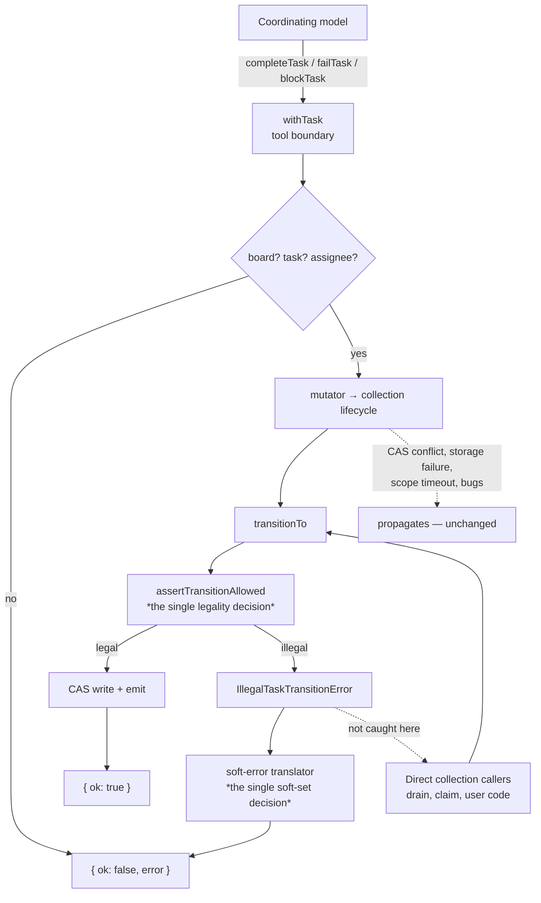

# FIX-950: Delegation task tools: illegal status transitions throw instead of returning the advertised soft error — Implementation Spec

**Linear:** [FIX-950](https://linear.app/fixpoint-labs/issue/FIX-950/delegation-task-tools-illegal-status-transitions-throw-instead-of) · **Epic:** [FIX-930](https://linear.app/fixpoint-labs/issue/FIX-930/delegation-substrate-host-model-roster-and-identity-and-worker-context) (delegation substrate) · **Category:** Bug

---

# Part I — The Case

## 1. Problem — why it matters, why now

A skill that delegates gets a task board and eight tools for driving it. Seven of those tools answer a bad call the same way: they hand the model a small result saying what went wrong, and the model tries again. Three of them — the ones that mark a task done, failed, or blocked — answer differently when the task isn't in a state that permits the change. They raise an error, which reaches the model as a bare line of internal text instead of the result shape everything else uses.

So the surface speaks two languages. An author who reads our own documentation and writes "if the tool comes back not-ok, do X" has written a rule that silently doesn't cover three of the eight tools.

**Why now.** We are documenting this surface right now. [PR #932](https://github.com/fixpoint-labs/flow-state-dev/pull/932) had to carve out an explicit exception in the reference docs — naming the three tools that behave differently and telling authors to sequence their calls to avoid the case. That carve-out is the cost of the inconsistency, written down. Fixing the behavior deletes the carve-out instead of teaching it.

**One correction to how this issue was filed, because it changes the argument.** The issue says these throws "end the turn." **They do not.** The generator catches every tool throw and feeds it back to the model as an error result (`packages/core/src/blocks/generator.ts:1346`, rendered at `:1417`); only a suspension re-throws. So the model already sees *something* and can already recover. What it sees is the raw internal string `[tasks] illegal status transition for task "t-3": pending → completed` — which names the rejected move but not the task's current status, not what *is* legal now, and not what to do about it.

That makes this a **coherence and message-quality fix, not a turn-saving fix.** It is smaller than filed. It is still worth doing, for the reason above: one surface, one contract, and an error that tells the model what to do instead of only what it did wrong.

## 2. Solution in plain terms

Give the transition guard its own error type instead of a generic one. At the tool boundary — the single shared helper all six by-id tools already route through — catch exactly that type and return the same not-ok result shape the rest of the surface uses, with a message that names the task's current status and the moves available from it. Everything else that can go wrong keeps propagating, untouched.

The state machine itself does not get more permissive. Code that calls the collection directly still gets an exception, because for that caller an illegal transition is a programming bug. Only the model-facing boundary translates.

**The philosophy that led here.**

- **Tenet 1 (coherence over local cleverness).** Incoherence is the failure we rank first. One tool surface answering the same class of question in two different shapes is exactly that, and it is already leaking into the docs as a special case authors must memorize.
- **Tenet 5 (fix at the owning layer — the owning layer is where the paths converge).** Two convergence points, each owning one job. `assertTransitionAllowed` is the single place that decides a transition is illegal, for both collection backings and every lifecycle method. `withTask` is the single place all six by-id tools pass through. The guard stays where it is; the *translation* goes where the model-facing contract is owned.
- **Tenet 3 (earn every addition).** This adds one error class and one catch, mirroring a precedent already on the same file. It also *subtracts*: the docs carve-out naming three exceptional tools goes away.

## 3. Tradeoffs & alternatives

**The main alternative: catch everything at the tool boundary.** Rejected, and it is the tempting one — a single `catch (err)` at the mutator call is three lines and closes every gap at once. It would also swallow scope-mutation timeouts, concurrent-modification conflicts on store-backed boards, raw storage failures, and ordinary bugs, converting each into a polite "that didn't work" the model reads as *its own mistake* and continues past. That is the documented "error swallowing / fail-plausible" failure class: the model narrates around a real infrastructure failure and nobody finds out for hours. The .NET Try-Parse guideline states the rule we're following: a non-throwing variant must have a strictly enumerated failure set, and anything outside it still throws.

**The simpler approach considered: pre-check the transition in `withTask` before calling the mutator.** Rejected on a concrete blocker, not on taste. `withTask` receives the mutator as an opaque closure and does not know its target status. Each tool would have to declare its target, duplicating state-machine knowledge at the tool layer — and it breaks outright on `failTask`, whose target depends on the task's retry budget at call time (`fail()` routes to `pending` when a `maxAttempts` budget remains, `errored` otherwise). A pre-check would have to re-derive that branch and would drift the moment either side changes.

**Where the genuine complexity is.** Not in the catch. It is in two places. First, the **error message**, which is the only part of this change the model actually consumes — and terminal statuses have *nothing* reachable, so the "here's what you can do instead" sentence needs a real second phrasing rather than an empty list. Second, the **docs merge order**: PR #932 is rewriting the exact lines this change falsifies, and landing these in parallel produces a clean merge that leaves the new prose wrong.

**Honest limits of the evidence.** Vendor guidance is unanimous that tool errors should be results, not exceptions, and that messages should name the next action (MCP's spec puts "business logic errors" explicitly in the return-as-result bucket; Anthropic's tool-use docs make the same point about instructive messages). But there is **no controlled study** isolating a bare error code against a state-naming sentence. We are following consistent guidance, not a measured result, and the spec should not pretend otherwise.

## 4. Focus practices

1. **Catch by type, never by `catch (err)`.** (Tenet 5, and the Try-Parse rule.) The enumerated soft set is a deliberate list. Anything not on it propagates.
2. **The error message is the deliverable.** (Tenet 7 — prove the outcome a user cares about.) The model is the consumer. A message that names the rejected move but not the current status or the legal alternatives has not fixed the problem, only reshaped it.
3. **BP-030 — tolerate the old shape.** `assertTransitionAllowed` gains a specific error type. It keeps the same message text, so the two existing tests that assert on `/illegal status transition/` keep passing, and any caller matching on the message is not broken.
4. **BP-003 — verification evidence.** Red-green is mandatory: a test seeding `pending` (not `in_progress`) that fails before the fix, with the failing output captured.
5. **BP-022 — changeset required.** This is observable behavior in a published package: a bug fix that changes a return value users key off.

## 5. What using it looks like

The surface a skill author writes against is the tool result. Today, two shapes; after, one.

**Before** — the model calls `completeTask` on a task it never drained. The tool raises, and the generator hands the model this:

```
[tasks] illegal status transition for task "t-3": pending → completed
```

No `ok` field, so a SKILL.md rule like "when a tool returns `ok: false`, call `listTasks` and re-plan" does not fire. The model is told the move was rejected, but not that the task needs claiming first.

**After** — same call, same board state:

```js
completeTask({ taskId: "t-3", output: "…" })
// → {
//     ok: false,
//     error: 'illegal_status_transition: task "t-3" is pending, so complete is not
//              available. From pending you can move it to: in_progress, blocked,
//              cancelled. Run the board to have a worker claim and finish it.'
//   }
```

**And the terminal case**, which needs its own phrasing because nothing is reachable:

```js
blockTask({ taskId: "t-7", reason: "waiting on legal" })
// → {
//     ok: false,
//     error: 'illegal_status_transition: task "t-7" is already completed and cannot
//              change status. Add a new task instead.'
//   }
```

Nothing changes for code that drives a collection directly — `collection.complete(id, output)` still throws on an illegal transition, because there the mistake is in the calling code, not in a model's guess.

## 6. Decisions & rules

1. **A dedicated error type carries the illegal transition; the tool boundary catches it by `instanceof`.** *Alternative rejected:* matching on the error message string, or a blanket `catch (err)`. *Ramification:* the soft set becomes an explicit, reviewable list. Infrastructure failures — CAS conflicts, scope-mutation timeouts, storage errors — keep propagating, which is the behavior we want and the behavior a blanket catch would have destroyed. Costs one new exported class.

2. **The guard stays in `assertTransitionAllowed`; only its error *type* changes, not its message or its semantics.** *Alternative rejected:* making the state machine itself lenient, or moving the check up into the tools. *Ramification:* every non-tool caller (the drain, `claim`, direct collection users, both backings) is unaffected and still gets a throw. The two existing tests asserting on the message text keep passing (BP-030).

3. **The error string is a code prefix followed by a guidance sentence — `illegal_status_transition: …` — mirroring `unknown_assignee`.** *Alternative rejected:* a bare `illegal_status_transition` token like `task_not_found`; or adding a separate structured `code` field. *Ramification:* the prefix stays greppable and test-assertable while the sentence carries the recovery guidance, and the shared `okOrError` output schema needs no change. Locks us into prose that must be maintained as the state machine evolves.

4. **The message names the task's current status and the statuses reachable from it, with a distinct phrasing for terminal statuses.** *Alternative rejected:* naming only the rejected `from → to` pair, as the current message does. *Ramification:* this is the part the model consumes; `allowedTransitionsFrom` is already exported, so no new surface. Terminal tasks return an empty reachable set and must not render as "you can move it to: ".

5. **`addTask`'s existing cap catch and the new transition catch route through one shared translator.** *Alternative rejected:* leaving two independent catch blocks. *Ramification:* "which throws may the model see as a result" becomes answerable in one place instead of enumerated per call site — which is precisely how this gap was born (tenet 5). Slightly more indirection at `addTask` than it has today.

6. **Tool descriptions are not changed.** *Alternative rejected:* stating the status preconditions in `completeTask`/`failTask`/`blockTask` descriptions. *Ramification:* the model cannot know a task's status without calling `listTasks`, so a precondition it cannot check is prompt weight on every turn to prevent a mistake the error already corrects at the moment it happens, with the concrete status in hand. (`addTask` names its cap codes, but that is next-action guidance about a board-level budget the model has been tracking, not a per-task precondition.)

7. **In the docs, the concept is a "recoverable tool result", not a "soft error".** *Alternative rejected:* calling it "soft" to match the source vocabulary. *Ramification:* `task-substrate.md` already uses "soft fail" for the retry-budget meaning, three lines from a line this change edits. Two meanings of "soft" on adjacent paragraphs would be exactly the incoherence tenet 1 ranks worst. `delegation.md:175` already uses "recoverable tool result".

8. **This change lands after PR #932, with the doc edit written against #932's prose.** *Alternative rejected:* landing in parallel, or fixing the docs first. *Ramification:* #932 rewrites `delegation.md`'s tool-contract section wholesale, so those lines are additions rather than edits — merging FIX-950 first would let #932 silently re-introduce the stale claim. Adds a sequencing dependency.

**Non-goals.** Re-litigating `ALLOWED_TRANSITIONS`. Changing `cancelTask`, which already never throws. Making the collection API itself non-throwing. Renaming any existing error code. The drain-containment bug in §12, which is a different layer with a different fix.

**Size: Small.** Two source files plus tests, well under 100 lines of production change. Single PR.

---
---

# Part II — The Build Plan

## 7. Technical design

Two layers, two responsibilities. The substrate keeps deciding legality and keeps throwing. The tool boundary translates one enumerated error class into the result shape the model already understands.



The two starred nodes are the convergence points. `assertTransitionAllowed` is reached by both collection backings and every lifecycle method, so typing its error there covers all of them at once. The translator is reached by `addTask` and by `withTask`'s six by-id tools, so the soft set is enumerated once.

**Surface added:** one error class carrying the task id, the source status, and the attempted target, exported alongside `TaskCapExceededError` from the tasks module (which the package root already re-exports). It extends `Error` and sets `name`, matching `TaskCapExceededError`'s established shape rather than inventing a new one.

**Surface unchanged:** the `okOrError` output schema (its `error` field is already `z.string()`), every existing error code, `allowedTransitionsFrom` (already exported), and every tool description.

## 8. Implementation sequence

Discipline is **`diagnose`** (Bug). The feedback loop is vitest against `packages/orchestration/test/skills/task-tools-capability.test.ts` — the light harness, since a transition error exists on every collection and needs none of the delegation-surface wiring the cap tests require.

1. **Reproduce (red).** Add the failing tests first. Seed `status: "pending"` and drive `completeTask`; assert a not-ok result. It fails today by throwing. Capture the failing output — this is the BP-003 evidence, and the issue's claim of "no test covers this" is confirmed: nothing in the suite exercises an illegal transition.

2. **Introduce the error type.** In the task-status module, add the class and throw it from `assertTransitionAllowed` in place of the generic `Error`. **Keep the message text byte-identical** so the two existing assertions on `/illegal status transition/` (`test/schema/task.test.ts:113`, `test/collection/collection.test.ts:339`) stay green — that is the BP-030 check, and it should be verified as its own step before moving on. Export it from the tasks module's index.

3. **Add the shared translator and wire both call sites.** One function mapping a caught error to either a soft result or a re-throw. Move `addTask`'s existing `TaskCapExceededError` branch onto it (**removal:** the inline `instanceof` check in `addTask`'s catch), and wrap `withTask`'s mutator call with it. Compose the transition message here, using `allowedTransitionsFrom` and branching on the terminal case.

4. **Green + widen.** Extend the tests across the full matrix in §9, including the retry-budget branch of `failTask` and the "still throws" cases.

5. **Rename the mis-named existing test.** `it("completeTask transitions a pending task to completed")` seeds `status: "in_progress"`. The name is wrong today. Rename it to match what it does. (Tenet 1, align-as-you-go — in scope and flagged, not a silent drive-by.)

6. **Docs + changeset.** Per §11. Rebased onto #932.

## 9. Edge cases & error handling

The throw matrix, computed from `ALLOWED_TRANSITIONS` and **verified empirically** by driving every tool against every status through the real tool objects. Every `THROW` cell becomes a recoverable result; no `ok` cell changes.

| tool | throws today from | after |
|---|---|---|
| `completeTask` | `pending`, `blocked`, `errored`, `cancelled` | recoverable result |
| `failTask` *(no retry budget)* | `pending`, `blocked`, `completed`, `cancelled` | recoverable result |
| `failTask` *(retry budget left)* | `completed`, `errored`, `cancelled` | recoverable result |
| `blockTask` | `in_progress`, `awaiting_review`, `completed`, `errored`, `cancelled` | recoverable result |
| `cancelTask` | **never** | unchanged |
| `addTask` / `assignTask` / `updateTask` / `listTasks` | never *(no transition)* | unchanged |

Two things this table corrects. The issue names only `pending` for complete/fail and `in_progress` for block — **terminal source statuses throw for all three tools** and were missed. And `failTask`'s set is **conditional on the retry budget**, because `fail()` targets `pending` when a `maxAttempts` budget remains, and `pending → pending` is a legal same-status move.

| Edge case | Expected behavior |
|---|---|
| Task already in the target status (`completeTask` on `completed`) | Legal same-status no-op, returns ok. Unchanged — **not** an error. |
| Terminal task, nothing reachable | Recoverable result with the distinct terminal phrasing. Must not render an empty "you can move it to:" list. |
| `cancelTask` on a terminal task | Silent no-op returning ok, via `allowTerminalNoop`. Unchanged. |
| CAS conflict / scope-mutation timeout / storage failure | **Still throws.** Explicitly out of the soft set. |
| `updateTask` partial apply | It issues up to five sequential patches; none transitions, so no transition error is reachable. Pre-existing partial-apply hazard on other throws is unchanged and out of scope. |
| Task removed between `withTask`'s existence pre-check and the CAS write | Still throws (a race, not a model mistake). Unchanged. |
| Direct collection callers | Still throw. This is the point of Decision 2. |

**BP-035 second-path checklist.** *Legacy shape:* the message text is preserved, so message-matching callers and the two existing tests are unaffected (step 2 verifies this in isolation). *Null boundary:* `allowedTransitionsFrom` returns `[]` for the three terminal statuses — the branch above. *Concurrent/409:* deliberately excluded from the soft set; a `ConcurrentModificationError` on a store-backed board must stay loud. *Cancel/error path:* `cancelTask` is verified unchanged by an explicit test. *Multi-tenant:* not applicable, the board is block-scoped. *New-flag off-state:* no flag added.

## 10. Testing strategy

**CI specs** (vitest, deterministic), in `test/skills/task-tools-capability.test.ts`, following `delegation-caps.test.ts`'s two-part assertion shape — assert the result, then assert the board was left untouched:

- Each of `completeTask` / `failTask` / `blockTask` against an illegal source status returns not-ok, with an `illegal_status_transition` prefix, and **the task's status is unchanged**.
- The message names the current status and the reachable set; the terminal case uses the terminal phrasing and contains no empty list.
- `failTask` on `pending` **with** a `maxAttempts` budget still succeeds (the retry branch) — this is the regression the matrix exists to protect.
- `cancelTask` returns ok from all seven statuses, including terminal.
- Legal transitions are unaffected; same-status no-ops still return ok.
- A non-transition throw from the mutator still propagates (the narrow-catch guarantee — the single most important test here, since it is what separates this from the rejected blanket catch).
- Substrate unchanged: `assertTransitionAllowed` still throws, and still matches the existing message assertions.

**Goal check — proposed, and flagged as an open question (§12).** The honest framing: because the current behavior already reaches the model as `error-text`, a check that only asserts "the coordinator recovered and the board finished" would likely **also pass before the fix**, and would be evidence of nothing. If a goal check is built, it must assert the *discriminating* property: after an illegal call, the coordinator's next task-tool call is a legal one — it claims or drains rather than re-issuing the same rejected call. Shape it on `goals/delegation-caps/bounds-a-runaway-coordinator/` (the sibling FIX-931 shipped for the same class of contract), with an anti-game control proving the coordinator genuinely issued an illegal transition rather than the run passing by never hitting the case. Model-backed via `AI_GATEWAY_API_KEY`.

**Changeset:** required, `@flow-state-dev/orchestration`. `patch` — this is a bug fix restoring the advertised contract, matching FIX-924's precedent for a comparable behavior change. One user-facing sentence, no issue ids in the body.

## 11. Documentation plan

Four extensions, no new pages. There is no new concept here — the delivery mechanism of an already-documented failure changes — and `delegation.md` already owns a section whose whole subject is this contract. **All line references are pre-#932; rebase before editing.**

| # | File | Change | Where | What |
|---|---|---|---|---|
| 1 | `apps/docs/docs/skills/delegation.md` | extend | the tool-contract section (`:168` on the #932 branch) | Rewrite the sentence naming `completeTask`/`failTask`/`blockTask` as exceptions that throw — after this change there are none. Add the illegal-transition case to the contract with a fenced example matching the house style, and state the boundary: the collection still throws, the tool translates. Cross-link the status state machine. |
| 2 | `apps/docs/docs/orchestration/task-substrate.md` | extend | `### The status state machine`, the "Illegal transitions throw" sentence (`:46`) | **The highest-value edit.** The sentence stays true (the substrate does throw) but becomes the wrong answer for a reader asking what a coordinator sees. Qualify it and link across to the delegation page. Observe Decision 7: "soft" is already taken at `:74` for retry budget. |
| 3 | `packages/orchestration/README.md` | extend | `## Skills and delegation` (`:152`) | Widen the single `no_delegation_board` sentence into the full recoverable set including the illegal transition, with a clause preserving the state machine's meaning. Do not edit the ASCII diagram at `:34-42`. BP-009. |
| 4 | `apps/docs/guides/agents-command-the-board.md` | extend | drop the trailing clause at `:196-197`; short paragraph under `## Assign tasks, then drain` | The guide points at delegation.md "including which of them can throw" — that clause becomes false and should simply go. Add one or two sentences in guide register on what a failed tool call does. Leave the tool table alone. |

**Considered and rejected:** `orchestration/task-board.md` (documents drain policy and the *code-facing* `board.capability`, which has no mutators — never states transition legality); `docs/architecture/*` (23 files, zero mentions of the task board or delegation; the status machine is not documented there); the blog (zero orchestration content; a changeset covers this); `overview.md` / `building-a-research-team.md` / `patterns/overview.md` (one-line tool summaries with no error prose); a new page (no new concept, and it would start with zero of the twelve existing inbound links to `delegation.md`).

**Voice risks to hold the implementer to** (`CLAUDE.md` → Writing Style): no internal issue or PR numbers in `apps/docs/` — write "previously", never "before FIX-950" (note `task-board.md:115` already leaks `FIX-626` and will tempt a copy); no "isn't just X — it's Y", which this topic invites almost irresistibly; minimal em-dashes, since `delegation.md` is already saturated with them; gloss "ends the turn" for a reader who doesn't know what a generator turn is.

**Anchor hygiene (BP-034):** three pages deep-link auto-generated anchors on `delegation.md` (`#board-and-overrides`, `#default-worker-the-floor`, `#running-a-board-as-a-tool`). Adding a heading is safe; renaming one silently breaks them.

## 12. Dependencies, open questions & follow-ups

**Dependencies.**
- **PR #932** (`fix/FIX-932`, docs-only, open + draft) rewrites `delegation.md`'s tool-contract section. Land it first; write the doc edit against its prose (Decision 8). No other open PR touches `packages/orchestration/src/**` or `packages/orchestration/test/**` — the code change is uncontested across all 15 open PRs.
- No blocking Linear issues. The epic (FIX-930) is approved and in development.

**Open questions.**

1. **Does the goal check earn its cost here?** (§10.) The premise correction in Part I §1 weakens the case: the model already receives the failure today, so the outcome a naive goal check would measure is not the outcome that changes. The discriminating check described in §10 is buildable but is a model-behavior assertion on a message-quality delta, which is inherently noisier than the cap check FIX-931 shipped. **Recommendation: build the CI specs, and treat the goal check as optional for this change** — with the reasoning recorded rather than the requirement quietly dropped. Owner's call.

2. **Should the error carry a structured field alongside the string?** Decision 3 puts the code in the message prefix, which needs no schema change. If we later want to count these in telemetry without string-matching, a `code` field on `okOrError` would be the move — but that is a shared-schema change affecting all six tools and should not ride along on a bug fix.

**Follow-ups (flagged, not built).**

- **[FIX-951](https://linear.app/fixpoint-labs/issue/FIX-951/task-board-drain-containment-breaks-when-a-worker-fails-after-its-own) — a more severe bug in the same family, found while speccing this and filed separately.** The drain contains worker failures with `.rescue([{ block: recordError }])`, and `recordError` writes the failure onto the task by calling `collection.fail(taskId, …)` (`task-board/blocks/record-result.ts:92`) **with no guard** — while `runRescue` (`core/src/blocks/sequencer.ts:674`) does not guard it either. Unlike `cancel()`, `fail()` does not pass `allowTerminalNoop`. So if a task reaches a terminal status while its worker is still running and that worker then throws, `recordError` throws out of the rescue, escapes containment, and **fails the whole drain** — a genuine turn-ending failure, unlike the one this spec addresses. Most plausible trigger: the coordinator cancels an `in_progress` task (a legal move), and the in-flight worker then errors. **Deliberately not in this spec's scope:** different owning layer (drain containment, not the tool surface) and a different correct fix (tolerate an already-terminal task, since recording a failure on it is moot). Tenet 5 says fix at the owning layer, and these are two different layers.
- `packages/orchestration/README.md`'s state machine and `task-substrate.md`'s are two hand-maintained copies of `ALLOWED_TRANSITIONS`. Neither is generated, and this spec touches the prose beside both. A drift check is a `polish-docs`-shaped follow-up.
- Seven internal issue ids are leaked into published docs (`state-operations.md`, `models.md`, `task-board.md:115`, `sequencer-state.md`, `idempotency.md`), against the standing rule in `CLAUDE.md`. Pre-existing, unrelated, worth a `polish-docs` ticket.

---

## Spec evolution

- **Spec drafted** — framed as a coherence and message-quality fix rather than the turn-saving fix the issue describes, after verifying that the generator already catches tool throws and surfaces them to the model; solution is a typed transition error caught by type at the one shared tool boundary, with the state machine left throwing for every other caller; build is a single small PR sequenced behind PR #932's docs rewrite.
