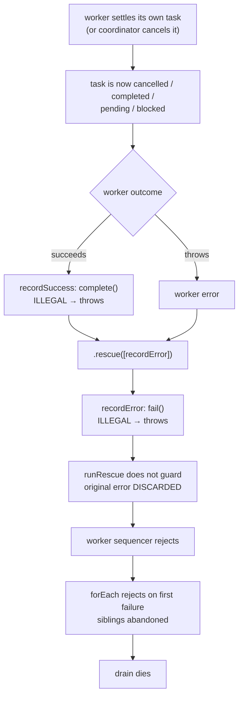
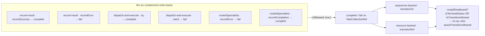

# FIX-951: Task-board drain containment breaks when a worker fails after its own task reached a terminal status — Implementation Spec

> **Linear:** [FIX-951](https://linear.app/fixpoint-labs/issue/FIX-951/task-board-drain-containment-breaks-when-a-worker-fails-after-its-own) · **Category:** Bug · **Priority:** High

## Spec evolution

- **Spec drafted** — framed as a containment defect in the substrate's own write-back path rather than a single unguarded `fail()` call. Research falsified two premises of the filed issue (the worker need not fail, and `allowTerminalNoop` does not close the bug) and found six exposed write-backs across three files and two collection backings. The fix widens the existing `allowTerminalNoop` flag and exposes it to callers as an advisory write option, evaluated inside the transition's own atomic write. No dependency on FIX-950.
- **After spec review** — three direction-level corrections, all of which changed the design rather than the prose. (1) The widened condition needs **two arms**, `already terminal` OR `transition rejected`: the state machine allows same-status moves, so `cancelled → cancelled` is legal-and-terminal, and a disallowed-only condition would have let a repeat `cancelTask` clobber the first one — a regression introduced by the fix itself. (2) Added **`expectAttempt`**, because transition legality cannot tell two attempts apart: after a lease reclaim, a stale worker's write-back is a *legal* `in_progress` transition that settles the replacement attempt. Deferring it was re-weighed openly and rejected, because containment alone increases that bug's reach. This adds the change's one genuinely new concept, so the earlier "net new concepts: zero" claim is withdrawn. (3) **Dropped** the requirement to emit a signal when an advisory write declines — the proposed API returns `void` and cannot express it, so requiring it would have smuggled a public return-contract decision in as an implementation detail.
- **A note on the pattern in those three** — all three trace to `isTransitionAllowed` treating `from === to` as allowed, and all three were missed by reasoning about the transition *table* instead of the *function*. Same-status is a distinct case, not a corner of "allowed."
- **After automated review** — four corrections, each verified in code before being taken. (1) `fail()` calls `transitionTo` **twice** — a status-blind retry branch and a hard-fail branch — so the flag has to reach both or the fix is partial for a cancelled task with retry budget (§8 step 4a, with the §10 case that catches it). Both backings were checked rather than assumed symmetric; they are. (2) `routedSpecialists` does **not** hold the claimed `Task` — it keeps `addTask`'s pre-claim task and discards `claim`'s return — so §7's instruction to "read `attempts` directly" was false there and would have broken every normal completion (§7, "where each writer gets its attempt from"). (3) The resource backing's declined path still persists and notifies, because `updateState` has no equality guard; six write-backs inheriting that would emit phantom `resource_change` events, so the decline now returns before `updateState` (§8 step 4b). **The diagnosis here was right and the remedy was wrong — the pre-read is withdrawn in the round below.** (4) The package README is back in the docs plan: the change alters a public signature, which is what AGENTS.md's README rule is for.
- **A note on the pattern in those four** — three of them are the *same* mistake as the note above, one altitude out: a property was verified of a **method** (`fail`, `transitionRef`, "the pattern claims its task") and asserted of the **call site**. An enumeration of writers is not an enumeration of writes.
- **After the second automated review** — two corrections, both against the previous round's own new material, and the more serious one **reverses** it. (1) The §8 step 4b pre-read is **withdrawn**. It was defended with an enumeration showing the pre-read can only cause a write to be *skipped*, never applied on stale data. Both halves of that defence fail: the pre-read does not suppress the notify when the status moves *after* the read (the in-updater check then declines and `updateState` persists and notifies exactly as before, so the defect it was written for survives), and it wrongly skips a legal write when a claim lands after the read — which the sequencer backing would apply, leaving the two backings disagreeing on whether a write landed. The enumeration's escape hatch ("`expectAttempt` declines it anyway") was true of this change's six call sites and asserted of a **public API** where the two guards are independent optionals. The phantom notify is now left as found, its widened exposure stated in §9, and the fix moved to §12.6 where the contract that owns it lives (new §6 decision 10). (2) The re-queue spin bound was stated as `maxIterations`; it is **`concurrency × maxIterations`**, because the cap applies to each worker sequencer's own `loopBack` while the drain fans out `concurrency` workers. The option's doc comment says "Per-worker" in the source the spec was citing. §10's aggregate assertion was therefore false at any concurrency above one, and is rewritten.
- **A note on the pattern in those two** — both are the *same* mistake once more, now committed by the corrections themselves. 4b verified a property of the **updater** and asserted it of `updateState`; the spin bound verified a property of the **loopBack** and asserted it of the **board**. Each time, a fact true one layer in was reported at the layer out. That this document has warned about the trap in three consecutive rounds and then fallen into it twice more is the finding worth keeping — the warning is not the guard. The guard is naming the layer a fact was established at, in the sentence that states it.
- **After the third automated review** — two corrections. (1) **`expectAttempt` was bound to the wrong thing, and §9 had blessed the resulting hole as correct.** `reclaim()` leaves `attempts` untouched in *both* backings (`sequencer-backed.ts:391–397`, `resource-backed.ts:369–375` — checked independently, they are symmetric), and it advances only on the next claim (`internal.ts:157`). So between a reclaim and the next claim a displaced worker matches the counter by construction. With retry budget, `fail()` takes the retry branch to `pending`, and since `blocked → pending` is legal, a stale write **silently unblocks work a coordinator deliberately parked**. The guard now scopes to *ownership* — the counter matches **and** the task is still `in_progress` or `awaiting_review` — costing no new option and no new persisted field; incrementing `attempts` in `reclaim()` was weighed and rejected because it makes a reclaim consume retry budget twice over. The defect is structural rather than a corner: `in_progress → blocked` is illegal (`task-status.ts:33`), so `blocked` is reachable only from `pending`, and a write-back sourced there *always* means the attempt was displaced. (2) **The spin bound was wrong again, in the same direction, for the third revision running.** `maxIterations` counts *re-executions*: the loop counter initialises when execution first reaches `loopBack` and permits `maxIterations` jumps *after* the initial pass (`packages/core/src/blocks/sequencer.ts:1551–1563`), so each worker runs its body up to `maxIterations + 1` times. The ceiling is `concurrency × (maxIterations + 1)`, and §10's previously-prescribed assertion would have **failed against a correct implementation** by exactly `concurrency` dispatches.
- **A note on the pattern in those two** — the layer error again, and this round says something the previous notes did not. The spin bound has now been restated three times (`maxIterations` → `concurrency × maxIterations` → `concurrency × (maxIterations + 1)`) and was wrong in the *same direction* every time: each revision fixed the layer it had just been shown and stopped, rather than re-deriving the quantity from the code that produces it. Finding 1 is the same shape one level deeper — `expectAttempt` was checked against the mechanism that *sets* `attempts` (claim) and never against the mechanism that *clears ownership* (reclaim). **Fixing an instance is not the same as re-deriving the claim**, and a correction is exactly as unverified as an original assertion. §4.1 carries the mechanical form; this is the evidence for why it needed one.

---

# Part I — The Case

## 1. Problem — why it matters, why now

A task board runs several workers at once. Each worker takes a task, does it, and the board writes the outcome back onto that task. Wrapped around every worker is a safety net whose one job is to make sure that if a worker goes wrong, only *its* task is affected and the rest of the board carries on.

That safety net is not safe. If a task gets settled while the worker holding it is still running — the coordinator cancelled it, or the worker marked it done itself through its task tools — the board's write-back is rejected by the task state machine and throws. The throw happens *inside* the safety net, so nothing catches it. Every other task on the board is abandoned, and the caller gets an error about an "illegal status transition" that has nothing to do with what actually went wrong.

**Why now.** This is a live correctness hole in the primitive that `supervisor`, `plan-and-execute`, `eventActors`, the goal-seek loop, and every delegation board are built on. There is no workaround a user can apply from outside: the failing write is the substrate's own, on a code path the user never calls.

### Three corrections to how this issue was filed

Each changes the argument, so they lead rather than hide in an appendix. All three were **verified by execution** against `origin/main`, not derived (probe script described in §10).

**1. The worker does not have to fail.** The issue frames the trigger as "the worker then throws." It doesn't need to. A worker that **succeeds** on a cancelled task kills the board just as dead: the success write-back (`complete`) is the illegal transition, it throws, the safety net catches *that*, and the net's own `fail` write then dies on the same task. Cancelling a task does not stop the worker already running it, so a healthy worker finishing normally is the **ordinary** case, not the exotic one. This roughly doubles the reachable surface of the bug and is the single most important correction here.

**2. Severity is layer-dependent — "ends the turn" is true at one layer and false at another.** The commissioning brief called this a genuine turn-ender. That is true of some callers and false of the one the issue's own title implies:

| Caller | What the escape does |
|---|---|
| `taskBoard` used directly, `supervisor`, `plan-and-execute`, `eventActors`, `goalSeekLoop` | Propagates to the action root. **The run dies.** |
| **Delegation** board (`runBoard` tool) | The coordinator generator's tool loop catches every tool throw. **The turn does not end.** The model gets an opaque internal error string instead of its board results and keeps looping. |

So on the delegation surface this lands in the *same* bucket as FIX-950 — a bad message, not a dead turn. It is still worse than FIX-950 there, because the board's results projection is skipped entirely and the remaining tasks are abandoned. And on the pattern surface it is genuinely fatal. **High priority stands**; the "most severe in the cluster" claim holds at the pattern layer, and should not be repeated unqualified at the delegation layer.

**3. `allowTerminalNoop` does not close the bug.** The obvious fix — mirror `cancel()`'s flag on `fail()` — leaves two live holes. Verified by execution: `pending → errored` and `blocked → errored` also throw. The full escape set is **every status except `in_progress` and `awaiting_review`**. Terminal statuses are the *majority* of the exposure, not all of it.

Related: **`recordError` is not the only exposed write.** Sweeping the containment paths found **six** write-backs with the same exposure across three files, and a **second collection backing** carrying its own duplicated copy of the transition wrapper. A fix to the one line the issue names would leave five siblings and half the substrate untouched.

One more thing the fix gets for free: because the rescue's throw currently **replaces** the error it was rescuing, the worker's real failure is discarded today. Stopping the write-back from throwing restores it.

## 2. Solution in plain terms

Make the substrate's own write-backs **advisory**: `complete` and `fail` accept an option meaning *"record this only if it still makes sense to; otherwise the write is moot — do nothing."* Two things have to hold for it to make sense. The task's state machine must accept the move, **and** this must still be the same attempt that produced the result — because after a lease is reclaimed and another worker takes over, a stale result is a perfectly legal write onto someone else's live attempt. Both checks are made **inside the same atomic write that performs the transition**, so there is no window between checking and writing.

The state machine itself does not get more permissive, and nothing changes for ordinary callers. Code that calls `collection.fail(id, msg)` still throws on an illegal transition, exactly as today. Only the substrate's own containment write-backs opt in.

Rather than adding a second flag beside `allowTerminalNoop`, the existing one is **widened into it**. The widened condition is *"the task is already terminal, **or** the state machine rejects this move"* — both arms, not just the second. Its only current user, `cancel()`, keeps today's behaviour exactly, and the narrower flag name goes away.

The two arms are both needed, and an earlier draft of this spec got that wrong in a way worth recording, because it is the same trap the rest of the document warns about. Disallowed-transition looks like it subsumes terminal-status. It does not: the state machine treats **same-status as allowed**, so `cancelled → cancelled` is a *legal* transition on a *terminal* task. Dropping the terminal arm would therefore make a second `cancelTask` call overwrite the first one's reason and timestamp and emit a duplicate lifecycle event — a regression introduced by the fix, in the one method that was already correct. Keep both arms.

**The philosophy that led here.**

- **Tenet 5 (fix at the owning layer — the owning layer is where the paths converge).** Six writers need this property. Guarding them one by one is patching call sites. The two transition wrappers — one per backing — are where all six converge, so that is where the flag lives.
- **Tenet 3 (earn every addition, and subtract as you go).** The transition-legality guard is a *widening* of `allowTerminalNoop`, not a second flag beside it, so that half costs no new concept. Attempt scoping does add one, and §3 argues openly for why it earns its place rather than being deferred — the tenet asks for the addition to be earned, not avoided.
- **Tenet 1 (coherence).** The task-board documentation states that under `onError: "skip"` a worker failure is recorded on its own task and siblings continue. The code does not do that. A doc/code mismatch is incoherence; the resolution here is to fix the code, because the doc describes the behaviour we actually want.

## 3. Tradeoffs & alternatives

**The alternative the issue's sibling invites: catch `IllegalTaskTransitionError` (FIX-950).** FIX-950's spec proposes exporting that type and names FIX-951 as a caller that would want it. **We are not taking it, and this issue does not depend on FIX-950.** Two reasons. First, sequencing a severe fix behind a message-quality fix would be a self-inflicted delay — and FIX-950's own Decision 3 already states that FIX-951 "is fixed at that caller rather than here," so both specs agree they are independent. Second, and more substantially, catching after the fact is strictly weaker than not throwing: by the time the exception surfaces, the atomic write has already been attempted and unwound, and the caller must decide what "already settled" means from *outside* the lock, with a status that may have moved again. Declining the write inside the CAS is both simpler and race-free. If FIX-950 lands first, nothing here changes.

**Pre-check the task's status in the rescue before calling `fail`.** Rejected on two counts. It is a genuine TOCTOU — `collection.get()` reads the last committed state, and only the CAS is authoritative, so a concurrent claim or cancel between read and write reopens the hole. And it forces the caller to re-derive which transitions are legal, which is precisely the layer trap FIX-950 documents at length: a table that is true of the collection and wrong where the caller stands.

This rejection has since been re-proven the expensive way. A later draft of this spec reintroduced a status pre-read one layer down — inside `transitionRef`, guarding `updateState` — believing that position was safe because it could only skip a write, never apply a stale one. It was not safe, in either direction (§8 step 4b). A pre-read outside the authoritative write is wrong wherever it is placed; moving it closer to the write shrinks the window and changes nothing else.

**Blanket `try/catch` around the rescue's write-back.** Rejected — this is the error-swallowing class. It would eat store failures on a resource-backed board, CAS exhaustion, and ordinary bugs, and the drain would sail on having silently lost work. `ifAllowed` has a strictly enumerated failure set: a disallowed transition no-ops; **everything else still throws.**

**The simpler approach considered: `allowTerminalNoop` on `fail()`, as the issue proposes.** Rejected **on evidence, not taste** — it leaves `pending → errored` and `blocked → errored` throwing (§1 correction 3). Worth being precise about how live that residue is: both are reached through `reclaim()` (lease expiry re-queues a running worker's task), which is exported public API with **no in-repo caller**. So the narrow fix would close every trigger the shipped code can reach today, and re-break the moment a user calls a method we ship and document. Since the broader flag is the same amount of code — `isTransitionAllowed(...)` where `isTerminalStatus(...)` stands — taking the narrow one buys nothing.

**Where the genuine complexity is.** Not the mechanism, which is a few lines. It is justifying that *dropping* the write is correct rather than merely convenient, per status — because a silently dropped failure record is a real cost. §9 walks each one. The short version: in every case the task's status is owned by someone with better information than the rescue (the coordinator cancelled it, the worker itself settled it, the lease reclaimer re-queued it for another attempt), so the rescue deferring is right. The one genuine loss — a worker that self-completes and *then* throws is recorded as a success with no trace of the throw — is called out in §9 and **accepted, not compensated for**. An earlier draft of this spec said the dropped error would be written onto the task's metadata instead. Decision 9 removed all signaling on a declined write, so no metadata path exists; the sentence survived the edit and is deleted here. §12.4 logs the return-contract change reporting it would need.

**The alternative that grew the change: ship containment now, fix attempt scoping later.** Re-weighed in the open after spec review, because it moves the cost. The tempting version of this fix is `{ ifAllowed: true }` alone — one option, no new concept, and it delivers the outcome the issue asks for (the drain stops dying). Attempt scoping is genuinely separable: the stale-worker clobber it prevents happens today, unchanged, with no flag involved.

We are **including it anyway**, on one argument: this fix *increases* that bug's exposure. Today the reclaim race mostly kills the drain before a stale write can land; afterwards the drain survives and the stale writes go through. Shipping the containment half alone would convert a loud crash into a quiet corruption of a live attempt, which is a worse failure even though it is a pre-existing one. A fix that makes an adjacent bug more reachable owns it.

The honest cost: one more field on the same options object, one more no-op arm in each transition wrapper, and one more value for the worker body to stamp. It also means **Decision 3's "net new concepts: zero" no longer holds** — attempt-scoped writes are a new idea in this substrate, and that is stated rather than preserved as a nicer-sounding sentence.

**The trade we are accepting.** A drain that today dies loudly on this race will, after the fix, keep going — and in one narrow shape (a task repeatedly returned to `pending` under a worker that keeps failing) that means a quiet re-dispatch loop bounded only by `maxIterations`. Note what that bounds: `maxIterations` is a **per-worker** cap counting *re-executions*, and the drain runs `concurrency` workers, so the aggregate ceiling is `concurrency × (maxIterations + 1)` — roughly forty thousand turns of a possibly model-backed worker at the defaults, not ten thousand (§9 shows the code). Trading a loud crash for a bounded-but-expensive loop is the right call for a containment fix, but it is a real trade, not a free win. §9 requires a test that the bound terminates.

**Honest limits of the evidence.** The six exposed write-backs were found by sweeping the containment paths and each was then read individually; two were additionally verified by execution. The `dispatchAndExecuteBlock` and `routedSpecialists` sites are included for **convergence** rather than because a live trigger was demonstrated for them: `dispatchAndExecuteBlock` is exported public API with no in-repo caller, and `routedSpecialists`' collection is sequencer-private, so nothing outside the pattern can settle a task in it at all (§7 walks that through). The sixth was missed by the first sweep and caught only on re-verification, which is a fair warning about how much confidence this table has earned.

## 4. Focus practices

1. **Ask at which layer each fact is true, and whether that is the layer your reader is standing on.** Every significant miss on this cluster has been a fact verified one layer away — including this issue's own "ends the turn" framing, which is true of patterns and false of delegation. Before asserting severity, name the caller. **The operative form of this practice is mechanical, because the warning alone has failed in every review round this spec has had, including the rounds that wrote the warning:** when you write a bound, a guarantee, or a "this is safe because", name in the same sentence the function you established it in. "`maxIterations` bounds the loop" passed review; "`maxIterations` bounds *each worker's* loop" would not have.
2. **Enumerate the writers, then verify each one independently — including the ones the pattern makes obvious.** (Tenet 5.) An enumeration is a hypothesis. The convergence point is only proven when every writer is shown to pass through it, in *both* backings.
3. **Advisory means enumerated, never blanket.** Exactly one failure mode may become a no-op: a transition the state machine rejects. Store failures, CAS exhaustion, and missing tasks keep throwing.
4. **BP-035 — walk the second path.** Test the flag *off* (direct callers still throw), the resource backing as well as the sequencer backing, and the `onError: "fail"` policy as well as `"skip"`.
5. **BP-022 — changeset required.** Observable behaviour change in a published package.

## 5. What using it looks like

Almost nothing changes for users writing code against the framework; the surface addition is one optional argument. What changes is what the board *does*.

**The collection API** — the new option, and the unchanged default:

```ts
// Unchanged: a direct caller still hears about an illegal transition.
await collection.fail(taskId, "worker blew up");
// → throws: [tasks] illegal status transition for task "t-3": cancelled → errored

// New: an advisory write-back. Records the failure only if the state
// machine will take it AND this is still the attempt that produced it.
// Declines quietly otherwise; never throws for either reason.
await collection.fail(taskId, "worker blew up", {
  ifAllowed: true,
  expectAttempt: claimedAttempt,
});
```

The two guards answer different questions, which is why both are needed. `ifAllowed` asks *"will the task's state machine accept this?"* — it stops a late result from overriding a cancel. `expectAttempt` asks *"do I still hold this task?"* — it stops a stale worker from writing onto a task that has moved on, which is often a **legal** transition and so invisible to the first guard.

Note the second question is about *ownership*, not about a matching number. A lease reclaim hands the task to someone else without changing `attempts`, so the write-back must also confirm the task is still in a status this attempt holds. §9 walks the race that makes the distinction load-bearing.

**What the board does** — a three-task board, `onError: "skip"`, where the worker on `poison` cancels its own task and then throws:

```
before:  drain error : [tasks] illegal status transition for task "poison": cancelled → errored
         workers ran : ["poison"]
         statuses    : { poison: "cancelled", sibling-a: "pending", sibling-b: "pending" }

after:   drain error : null
         workers ran : ["poison", "sibling-a", "sibling-b"]
         statuses    : { poison: "cancelled", sibling-a: "completed", sibling-b: "completed" }
```

**And the same board with `onError: "fail"`**, where the contract *is* to fail — note which error now surfaces:

```
before:  drain error : [tasks] illegal status transition for task "poison": cancelled → errored
after:   drain error : worker blew up
```

The board still fails, as configured. It now fails with the worker's actual error instead of a misleading one about the bookkeeping write.

## 6. Decisions & rules

1. **The substrate's own write-backs become advisory via an opt-in option on `complete` and `fail` — `{ ifAllowed: true, expectAttempt: n }`.** *Alternative rejected:* changing `fail()`'s semantics for everyone. *Ramification:* direct callers — including the model-facing `failTask` tool, which genuinely should hear about a bad call — keep today's throwing contract unchanged. The opt-in is visible at each call site, so the set of advisory writes is reviewable.

2. **The decision is made inside the transition's own atomic write, never by a pre-check at the caller.** *Alternative rejected:* reading the task's status in the rescue and branching. *Ramification:* race-free by construction rather than by timing luck, and callers never re-derive the state machine. Costs one flag threaded through two transition wrappers.

3. **`allowTerminalNoop` is widened into `noopIfDisallowed` — `already terminal` OR `transition rejected` — and the old flag name goes away.** *Alternative rejected:* adding a second flag beside it; and (an earlier draft of this spec) replacing the terminal arm with the disallowed arm on the false belief that it subsumed it. *Ramification:* both arms are load-bearing, because the state machine allows same-status moves: `cancelled → cancelled` is legal *and* terminal, so a disallowed-only condition would let a repeat `cancelTask` clobber the first cancel's reason and timestamp and double-emit. With both arms, `cancel()` behaves exactly as today, and an explicit settlement is never overwritten by a later incidental write of the same status. `isTerminalStatus` stays imported. Note this decision no longer claims "net new concepts: zero" — decision 8 adds one.

4. **Only a disallowed transition becomes a no-op. Every other failure still throws.** *Alternative rejected:* a `try/catch` around the write-back. *Ramification:* a store failure or CAS exhaustion on a resource-backed board still takes the drain down loudly, which is correct — we are fixing containment of *task-state* conflicts, not building a blanket suppressor.

5. **All six containment write-backs are converted, in both collection backings.** *Alternative rejected:* fixing only `recordError`, the line the issue names. *Ramification:* this is the tenet-5 convergence claim, and it is the failure mode this cluster keeps repeating — the sixth was itself missed on the first sweep of this spec. The six are enumerated in §7; the resource backing has its own copy of the transition wrapper and must change too.

6. **`recordSuccess`'s `complete()` is converted alongside `recordError`'s `fail()`.** *Alternative rejected:* treating the success path as out of scope because the issue names only the rescue. *Ramification:* this is what fixes the *succeeding*-worker trigger (§1 correction 1). Without it, a healthy worker on a cancelled task still routes through the failure path, and under `onError: "fail"` still kills the board. A cancelled task's output is deliberately discarded — the cancel wins.

7. **This issue does not depend on FIX-950, and does not consume `IllegalTaskTransitionError`.** *Alternative rejected:* catching the typed error FIX-950 proposes. *Ramification:* the two can land in either order with no conflict. If FIX-950 lands first, its error type is simply not used here. Stated so a reviewer does not reintroduce the sequencing.

8. **Advisory writes are scoped to the attempt that produced them (`expectAttempt`), and "the attempt" means *ownership*, not a matching counter.** The guard declines unless `task.attempts` matches **and** the task is still in a status this attempt holds — `in_progress` or `awaiting_review`. *Alternative rejected:* shipping `ifAllowed` alone and filing the stale-worker clobber separately — re-weighed openly in §3 after spec review; and (an earlier draft) binding to `Task.attempts` alone. *Ramification:* this is the one genuinely **new concept** the change introduces, so decision 3's earlier "net new concepts: zero" claim is withdrawn. The reason it is in scope rather than deferred: containment alone would *increase* the clobber's reach, and a fix that makes an adjacent bug more reachable owns it.

   The counter-only form was **wrong and would have shipped a fresh defect**: `reclaim()` leaves `attempts` untouched in both backings, so between a reclaim and the next claim a displaced worker matches by construction — and because `blocked` is reachable only from `pending`, its retry branch would have silently unblocked work a coordinator deliberately parked (§9, "the reclaim window"). *Alternative rejected:* incrementing `attempts` in `reclaim()`, which closes the window at the source but makes a reclaim consume retry budget twice over and redefines a persisted field. The ownership predicate needs no new option, no new persisted field, and no change to retry accounting — the worker body still stamps only the claimed attempt beside the `currentTaskId` it already stamps.

9. **No signal is emitted when an advisory write declines.** *Alternative rejected:* requiring `recordError` to report a declined write-back (an earlier draft of this spec did require it). *Ramification:* `complete` and `fail` return `void` and the wrapper consumes the decision internally, so the caller cannot learn what happened without either changing the public return contract on both backings or re-reading the status — and the re-read is the TOCTOU §3 rejects. Rather than smuggle an API decision in as an implementation detail, the signal is dropped and logged in §12 with the return-contract change it would need. The cost is bounded: the task's recorded status stays correct; only the fact that a throw *also* happened is lost, and only when a worker settled its own task and then failed.

10. **The resource backing's phantom `resource_change` on a declined write is left exactly as found, and owned by a follow-up rather than by this change.** *Alternative rejected:* pre-reading the task's status before `updateState` and returning early — specified by an earlier draft of §8 step 4b and **withdrawn**, because it fails in both race directions (it does not suppress the notify when the status moves after the pre-read, and it wrongly skips a legal write when a claim lands after the pre-read, leaving the two backings disagreeing on whether a write landed). *Ramification:* this change widens the misfire from one caller (`cancel()`) to seven, which §3's "a fix that makes an adjacent defect more reachable owns it" rule would normally put in scope. It is out of scope anyway on tenet 5: the write is the registry's, the guard has to live inside the registry's serialized section, and `ResourceRef.updateState` has no way to express an aborted write today (§12.6 gives the shape). A caller-side guard is not a smaller version of that fix; it is a broken one.

**Non-goals.** Re-litigating `ALLOWED_TRANSITIONS`. Making the collection API non-throwing for direct callers. Changing `onError` semantics. Fixing the three adjacent defects this research surfaced (§12) — each is real, none is this bug.

**Size: Medium.** Six source files plus the worker-body state schema and the routed-specialists control schema, tests, four documentation pages, the package README, one goal check, and a changeset. One PR. (Attempt scoping, added after spec review, is what pushes this to the upper half of Medium.)

---

# Part II — The Build Plan

## 7. Technical design

### The failure chain today



### The convergence point

Both backings funnel every lifecycle transition through one wrapper apiece. That wrapper already owns the "should this write happen at all?" question — it is where `allowTerminalNoop` lives today. Generalise the condition there, and expose it as an option on `complete` / `fail`.



**Why the condition has two arms.** The state machine treats same-status as allowed (`isTransitionAllowed` returns `true` when `from === to`). So "disallowed transition" does *not* cover "already terminal": `cancelled → cancelled` and `completed → completed` are both legal and both terminal. Without the terminal arm, a repeat `cancelTask` would overwrite the original cancel's reason and timestamp and emit a duplicate event, and a worker that self-completed would have its later return value overwrite the output it already recorded. Both arms, always.

**The six writers**, each verified individually:

| # | Location | Call | How verified |
|---|---|---|---|
| 1 | `task-board/blocks/record-result.ts` · `recordSuccess` | `complete` | by execution — the succeeding-worker trigger |
| 2 | `task-board/blocks/record-result.ts` · `recordError` | `fail` | by execution — the filed trigger |
| 3 | `tasks/helpers/dispatch-and-execute.ts` · `try` body | `complete` | read; exported public API, no in-repo caller |
| 4 | `tasks/helpers/dispatch-and-execute.ts` · `catch` body | `fail` | read; also masks the original worker error today |
| 5 | `patterns/routedSpecialists/index.ts` · `recordError` | `fail` | read; lowest exposure of the six — see the note below |
| 6 | `patterns/routedSpecialists/index.ts` · `recordCompletion` | `complete` | read; the success-path sibling of #5, same relationship as #1 is to #2 |

The sixth was **missed on the first sweep and found on re-verification** — the first pass enumerated the pattern's `fail` and stopped, exactly the "enumeration is a hypothesis" trap in §4.2. Verify each of the six independently rather than trusting this table.

**W5/W6 have no demonstrated trigger, and the reason is stronger than "specialists hold no task tools."** Their collection is resolved with `backing: "sequencer"` against `ctx.sequencer` (`routedSpecialists/index.ts:296–306`), so it lives on the pattern's own sequencer state and is not addressable from outside that sequencer — no external coordinator can `cancel` into it, whatever `collectionId` is configured. The other two settle-sources are closed too: specialists carry no task tools, and `reclaim()` has no in-repo caller. So W5/W6 are converted for **convergence** — one advisory-write contract across all six writers rather than a two-tier rule a future reader has to re-derive — and not because a live trigger was found. Said plainly so nobody upgrades them on family resemblance to W1–W4.

**Deliberately excluded, each checked:** the model-facing `completeTask` / `failTask` / `blockTask` tools in `skills/task-tools-capability.ts` (FIX-950's layer — these *should* report a bad call); and `patterns/debate` / `patterns/round-robin`, whose `complete` calls add, claim, and complete inside a single synchronous handler, so no other party can settle the task in between.

**The two backings.** `sequencer-backed.ts` (`transitionTo`) and `resource-backed.ts` (`transitionRef`) carry structurally parallel but **separately maintained** copies of the flag branch. Both import the shared state machine from `tasks/schema/task-status.ts`, so the *rules* are single-sourced; the plumbing is not. `backing: "request"` routes through the sequencer implementation and is not a third path.

**The condition.** `isTransitionAllowed` already exists in `task-status.ts` and already treats same-status as allowed. No new state-machine code.

### API surface

One exported options type on `TaskCollectionRef`, threaded into `complete` and `fail` as an optional trailing argument, carrying two independent guards:

- **`ifAllowed`** — decline when the task is already terminal, or the transition is rejected.
- **`expectAttempt`** — decline unless the caller still **owns** the task: `task.attempts` matches the attempt the caller ran under **and** the task is still `in_progress` or `awaiting_review` (decision 8). The status half is load-bearing, not belt-and-braces: `reclaim()` does not advance `attempts`, so the counter alone cannot see a displaced attempt (§9, "the reclaim window").

Both are evaluated **inside** the atomic write, alongside the existing `assertTransitionAllowed`. Both return `void` as today — nothing reports which guard fired (decision 9). The implementer owns exact naming and placement; `TaskTransitionOptions { ifAllowed?: boolean; expectAttempt?: number }` is the shape §5's examples assume. Prefer a name that says *transition* over a generic one like `WriteBackOptions` — on a public `TaskCollectionRef` this type governs two specific lifecycle calls, not write configuration in general.

The worker body needs to carry the claimed attempt so it can pass `expectAttempt`. It already stamps `currentTaskId` onto its own sequencer state on claim; stamp the attempt in the same place, and widen that state schema accordingly.

**Where each writer gets its attempt from — the three sites differ, and one of them needs a code change.** An earlier draft of this spec said `dispatch-and-execute` and `routedSpecialists` "both already hold the claimed `Task` and can read `attempts` directly." That is true of the first and **false** of the second, and an implementer who acts on it ships a routed-specialists board that never completes a task.

| Writer | Where the claimed attempt comes from |
|---|---|
| W1 / W2 (`record-result`) | The worker body's own sequencer state — stamp `attempts` beside `currentTaskId` (step 5). |
| W3 / W4 (`dispatch-and-execute`) | Already in hand: `const claimed = await options.dispatcher.claim(...)` at `dispatch-and-execute.ts:164`, so `claimed.attempts` is correct with no change. |
| W5 / W6 (`routedSpecialists`) | **Not in hand today.** `recordIteration` (`patterns/src/routedSpecialists/index.ts:383–396`) keeps the task returned by `addTask` — which is pre-claim, so `attempts === 0` — and **discards** the return value of `collection.claim(...)`, persisting only `currentTaskId`. Capture the claim result and stamp its `attempts` into `routedSpecialistsControlSchema` alongside `currentTaskId`, then read it in `recordError` / `recordCompletion`, which run in later handlers and have no `Task` of their own. |

The trap in the W5/W6 row is worth naming explicitly, because the wrong value is available and looks right: `applyClaimToTask` increments `attempts` (`internal.ts:157`) and `buildInitialTask` starts it at `0` (`internal.ts:53`). Reading `attempts` off `addTask`'s return therefore stamps `0` while the claimed task carries `1`, so **every** routed-specialist completion and failure — the normal path, not a race — would be declined against a mismatched attempt and leave the task stuck `in_progress`. A guard meant to catch a rare stale write would break the common one.

## 8. Implementation sequence

1. **Red first.** Add the regression test that reproduces the escape (§10). Capture the failing output. This is a Bug, so `diagnose` discipline applies: reproduce before fixing.
2. **Widen the flag in `sequencer-backed.ts`** — rename `allowTerminalNoop` → `noopIfDisallowed` and widen its condition from `isTerminalStatus(task.status)` to `isTerminalStatus(task.status) || !isTransitionAllowed(task.status, targetStatus)`, then update `cancel()`'s call site to the new name. **Keep** the `isTerminalStatus` import — it is still half the condition. (An earlier draft of this spec told you to swap the terminal check out and delete the import. That was wrong; see §6 decision 3.)
3. **Mirror it in `resource-backed.ts`.** Same rename, same two-arm condition, same `cancel()` update. Its declined path behaves differently from the sequencer backing's — read step 4b before deciding to "fix" that; the answer is that you don't, here.
4. **Thread the option through `complete` and `fail`** in both backings, and onto `TaskCollectionRef` in `tasks/collection/types.ts` with a doc comment naming the enumerated failure set (BP-007). `expectAttempt`'s check is **two conditions, not one** — the attempt number matches *and* the task's status is `in_progress` or `awaiting_review` (§6 decision 8). Implementing only the number comparison passes the obvious reclaim→re-claim test and still ships the reclaim-window defect §9 describes; the §10 case that catches it is the reclaimed-and-parked one.

   **4a. `fail()` has *two* `transitionTo` calls, and both must inherit the flag.** This is the step most likely to ship a partial fix, so it is called out rather than left to the reader of step 4. In `sequencer-backed.ts:311–331` and, identically, in `resource-backed.ts:277–300`, `fail()` branches before it transitions:

   ```
   fail(id, error, opts)
     ├─ shouldRetryOnFail(current)  → transitionTo(id, "pending",  "retried")   ← call #1
     └─ otherwise                   → transitionTo(id, "errored",  "errored")   ← call #2
   ```

   `shouldRetryOnFail` is **status-blind** — it reads only `attempts` vs `maxAttempts` (`tasks/collection/internal.ts:82–85`) and never looks at `task.status`. So a task that was cancelled mid-flight but still carries retry budget takes the **retry** branch and attempts `cancelled → pending`, which is disallowed. Thread `noopIfDisallowed` (and `expectAttempt`) into **both** calls. Threading only the hard-fail branch leaves the bug live for exactly that shape and passes a test suite that never sets `maxAttempts`. §10 requires a case that does.

   Both backings were checked for this independently rather than assumed symmetric: they *are* symmetric here — same two-branch shape, same status-blind predicate, differing only in how they read `current` (`readTasks()[id]` vs `readTaskState(mirror.get(id))`).

   **4b. On the resource backing, the declined path still persists and notifies. Leave it that way — do not pre-read.** Returning `current` from `transitionRef`'s updater is **not** a true no-op: `ResourceRef.updateState` (`packages/engine/src/context/resource-registry.ts:706–720`) calls `persistNamespaceInstanceState` unconditionally at `:716` — which itself has no equality guard, it just `safeParse`s and writes (`:619–628`) — and then `notifyInstanceChange` at `:719`, which fires `onInstanceUpdated` and `onResourceChanged` with no comparison of `prev` to `post` (`:662–672`). So a declined advisory write emits a `resource_change` for a write that did not happen, and can dispatch a `reactTo.stateUpdated` block.

   **An earlier draft of this step told you to fix that here, by evaluating the decline condition against the mirrored task before calling `updateState` and returning early. That instruction is withdrawn — it does not work, in both directions.** It is recorded rather than deleted because the reasoning that produced it is the trap this document keeps warning about, one more time: the guard was moved to where it could be written, not to where the state is authoritative.

   *It does not suppress the notify it was written to suppress.* The pre-read is outside `serializeResourceWrite`, so the status can move between the read and the write. Pre-read observes `in_progress`, does **not** skip; a queued cancel commits first; the in-updater check — which stays authoritative — declines by returning `current`; and `updateState` persists and notifies exactly as before. The window narrows, the defect remains. The same holds for `expectAttempt`: attempts matching at pre-read time and advancing before the write lands in the identical place.

   *And it introduces a worse defect than the one it targets.* `pending → completed` is disallowed (`ALLOWED_TRANSITIONS.pending = ["in_progress", "blocked", "cancelled"]`, `task-status.ts:32`), so a pre-read of `pending` fires the decline and returns with **no write at all**. If a claim commits before the write, the authoritative status is `in_progress`, and `in_progress → completed` is legal — the write should have applied. The sequencer backing, which has no pre-read, applies it. The two backings would then disagree on whether a legal write landed, which is worse than a redundant notification: one is noise, the other is divergent task state across backings.

   The earlier draft answered that second case with "`expectAttempt` declines it anyway." That holds for the six writers this spec converts, which all pass both guards — and **not** for the contract §7 defines, where `ifAllowed` and `expectAttempt` are independent optionals. A public caller passing `{ ifAllowed: true }` alone is exactly the asymmetry above. The enumeration was scoped to this change's own call sites and asserted of the API.

   **What to do instead: nothing, on the resource backing's decline path.** `transitionRef` returns `current` and `updateState` does what it does today. §9 records the widened exposure and §12.6 owns the fix, which belongs one layer down — see §6 decision 10.

   The sequencer backing needs no equivalent and has no such asymmetry to inherit: `casWrite`'s mutator returning `undefined` writes an empty state patch and emits nothing (`sequencer-backed.ts:128–130`).
5. **Widen the worker-body state schema** to carry the claimed attempt alongside `currentTaskId`, stamped by the same tap.
6. **Convert the six write-backs** to pass `{ ifAllowed: true, expectAttempt }`. W5/W6 need a code change first — see §7, "where each writer gets its attempt from."
7. **Green.** The regression tests pass; the full orchestration suite passes unchanged.
8. **Goal check** (§10), then docs (§11), then the changeset.

**Removals in this change:** the `allowTerminalNoop` flag name and the `isTerminalStatus` import in both backings, if orphaned.

## 9. Edge cases

**Is dropping the write correct? Per source status.** The rescue's write-back is advisory precisely because in every reachable case the current status was set by something with better information.

Rows marked *same-status* are the ones an earlier draft of this table omitted, and they are exactly where the terminal arm of the condition earns its place — a transition table alone marks them "legal" and lets the write through.

| Status when the write-back runs | Target | Arm that fires | Write happens? | Right? |
|---|---|---|---|---|
| `in_progress` | `errored` / `completed` | neither | yes | Yes — the normal path, unchanged. But see the cross-worker residual below. |
| `awaiting_review` | `errored` | neither | yes | Yes — unchanged. |
| `cancelled` | `errored` / `completed` | disallowed | no | **Yes.** The coordinator settled it deliberately; the cancel outranks a late worker result. |
| `cancelled` → `cancelled` *(same-status)* | `cancelled` | **terminal** | no | **Yes** — and this row is why the terminal arm exists. Without it a repeat cancel clobbers the first one's reason and timestamp. |
| `errored` | `completed` | disallowed | no | **Yes.** The failure is already recorded; a late success is stale. |
| `completed` → `completed` *(same-status)* | `completed` | **terminal** | no | **Yes.** A worker that self-completed via `completeTask` and then returned normally keeps the output it explicitly recorded; the incidental return value does not overwrite it. |
| `completed` | `errored` | disallowed | no | **Mostly.** The worker self-completed then threw. A real but narrow loss of signal — see below. |
| `pending` (re-queued by `reclaim`, **no** retry budget) | `errored` | disallowed | no | **Yes.** The task is queued for another attempt; erroring it would cancel a retry someone else scheduled. |
| `pending` → `pending` *(same-status, retry budget left)* | `pending` | **not owned** | no | **Yes, and this row is corrected.** An earlier draft said the write happens and called it `fail()`'s soft-retry branch doing its job. It is not: a write-back only reaches a `pending` task after that attempt was displaced (see below), so the `feedback` and `kind: "retried"` would be stamped by a worker that no longer holds the task. The task is already queued; declining is right for the same reason the no-budget row above declines. |
| `blocked` (**no** retry budget) | `errored` | disallowed | no | **Yes.** The coordinator parked it; erroring would fight that decision. |
| `blocked` (retry budget left) | `pending` | **not owned** | no | **Yes, and this row is corrected — it was blessed as a legal write and it is a live defect.** An earlier draft said `blocked → pending` is legal so the soft-retry branch re-queues it. Both halves are true and the conclusion is wrong: the write silently **unblocks work a coordinator deliberately parked**, on the say-so of a worker that no longer owns the task. See "the reclaim window" below. |

**`fail()` has two branches and they land differently.** With a `maxAttempts` budget remaining it targets `pending`, not `errored`, and `pending` is legal from more sources. One consequence for §1 correction 3: "`blocked → errored` throws" is true only on the *no-budget* branch. Any test or argument about this flag has to name which branch it is on. Both branches call `transitionTo` and both must carry the flag — §8 step 4a, the single most likely partial fix here.

**Which boards can actually reach the retry branch — narrower than "any board."** `shouldRetryOnFail` returns `false` when `maxAttempts` is `undefined` (`internal.ts:82–85`), and a task only carries one if something set it. Nothing model-facing does: the delegation board's `addTask` tool schema exposes `goal` / `assignee` / `deps` / `priority` / `input` / `metadata` and **no** `maxAttempts`, and `updateTask`'s patch schema covers `priority` / `metadata` / `assignee` / labels only. So a **delegation board never has retry budget and never takes the retry branch**, and the whole retry half of this flag is unreachable there.

The branch is reachable for boards constructed in code — `taskBoard` tasks that set `maxAttempts` directly, and `goalSeekLoop`'s `maxAttemptsPerTask` (`goal-seek-loop.ts:266`, default `1`, which yields no retry after the first claim and needs to be configured above 1 to matter) — and for replan-stamped tasks, where `apply-replan.ts:121` does accept `maxAttempts` from the replan output.

That scopes the §8 step 4a gap; it does not make it unreal. Nothing in this spec claims or implies otherwise, and nothing should: the pattern layer, where §1 correction 2 places the *fatal* severity, is exactly the code-constructed layer where the retry branch lives.

**The one genuine loss, and why no signal is being added for it.** A worker that calls `completeTask` on its own task and *then* throws is recorded as a success with no trace of the throw. An earlier draft of this spec required emitting a signal when a write-back no-ops. **That requirement is dropped**, because it cannot be met at the altitude Part I signed off on: `complete` and `fail` return `void`, so the caller cannot learn whether the write landed, and the only ways to find out are to change the public return contract on both backings (an API decision this spec does not make) or to pre-read the status (rejected in §3 as a TOCTOU). Neither is a wording choice.

So the loss is accepted and bounded: it is one row of the table above, it applies only when the worker settled its *own* task and then failed, and the task's recorded status is still correct — only the fact that a throw also occurred is lost. §12 logs the signal as a follow-up, together with the return-contract change it would need.

**Attempt scoping — why `ifAllowed` alone is not enough.** Transition legality cannot tell two *attempts* apart. If `reclaim()` re-queues a task and a second worker claims it, the task is `in_progress` again — and the first worker's late write-back sees a perfectly legal `in_progress → completed` / `→ errored`. The flag waves it through, and the stale worker settles or re-pends the **live** attempt belonging to someone else.

This is pre-existing: it happens today, identically, with no flag involved. But this fix **increases its exposure**, and that has to be said plainly. Before the fix, the reclaim race usually killed the drain outright at `pending → errored`; after it, the drain survives and keeps running, so more stale write-backs actually land. Shipping containment without attempt scoping would trade a loud crash for a quieter data corruption.

So the advisory write is scoped to the attempt that produced it: `{ ifAllowed: true, expectAttempt: n }`. Inside the same atomic write, the transition is declined when `task.attempts` no longer matches the attempt the caller ran under. `attempts` already exists on `Task` and is already incremented on claim, so there is a real value to bind to and no new bookkeeping — the caller only has to remember the attempt number it claimed at, which the worker body can stamp beside the `currentTaskId` it already stamps.

**The reclaim window — why matching `attempts` is not the same as owning the task.** An earlier draft of this spec bound `expectAttempt` to `Task.attempts` and treated a match as proof the write-back still owns the task. It is not, and the gap is a live defect the spec was about to bless.

`reclaim()` does **not** touch `attempts`. Both backings build the reset as `{ ...task, status: "pending", leaseUntil: undefined, updatedAt: at }` — `sequencer-backed.ts:391–397` and, checked independently rather than assumed symmetric, `resource-backed.ts:369–375`. `attempts` advances only in `applyClaimToTask` (`internal.ts:157`), i.e. when the *next* worker claims. So in the window between a reclaim and the next claim, a displaced worker's `expectAttempt` matches **by construction**.

That window is enough to do damage, and the `blocked` row above is where:

1. Worker A claims the task — `in_progress`, `attempts: 1`.
2. The lease expires and `reclaim()` returns it to `pending`. `attempts` is still `1`.
3. The coordinator parks it: `pending → blocked`.
4. Worker A, still running, fails. With retry budget left, `shouldRetryOnFail` (`internal.ts:82–85`, which reads only `attempts` vs `maxAttempts` and never the status) sends `fail()` down the **retry** branch, targeting `pending`.
5. `blocked → pending` is legal, so `ifAllowed` passes. `attempts` is still `1`, so `expectAttempt` passes.

The write lands. A stale worker has silently unblocked and re-dispatched work a coordinator deliberately parked — the exact class of harm attempt scoping exists to prevent, arriving through the guard meant to prevent it.

**This is structural, not a corner.** `in_progress → blocked` is not a legal transition (`task-status.ts:33`), so `blocked` is reachable **only** from `pending`. A containment write-back whose source status is `blocked` therefore *always* means the attempt was already displaced from `in_progress`. There is no live-attempt reading of that row to preserve.

**The fix: `expectAttempt` scopes to ownership, not to a counter.** The guard declines unless the attempt number matches **and** the task is still in a status this attempt holds — `in_progress` or `awaiting_review`. Any other source status means the attempt was displaced (reclaimed, re-queued, parked) or the task was settled by someone else, and in every one of those cases §9's table already says the rescue should defer.

Binding to `attempts` alone was the error: `attempts` is a *claim counter*, not an ownership token, and it is only incidentally the latter while the task sits in `in_progress`. The ownership form costs no new option and no new persisted field — it is a correction to what the existing guard means, and it makes the table above more coherent rather than less, since the "write happens" rows now collapse to exactly the two statuses an attempt can own.

**The alternative rejected: increment `attempts` inside `reclaim()`.** It closes the same window at the source and is the more obvious move, but it loses on a concrete cost. `shouldRetryOnFail` is `attempts < maxAttempts`, so making reclaim increment means a reclaim **consumes retry budget** — and since the following claim increments again, one interrupted attempt would burn two. A task with `maxAttempts: 3` reclaimed once would exhaust its retries roughly twice as fast. That is a change to retry accounting with nothing to do with containment, and it redefines a persisted field that `Task` exposes (BP-030). A dedicated claim-generation counter would avoid the arithmetic problem but adds a persisted field for what the status already tells us. The ownership predicate gets the same result with neither cost.

With attempt scoping in this form, the `in_progress` rows above read: the write happens **only** when it is still this worker's attempt *and* the worker still holds the task.

**`onError: "fail"` must still fail.** Verified by execution against the candidate fix: with `"fail"`, a throwing worker on a cancelled task still fails the drain — and now surfaces the worker's error rather than the transition error. A *succeeding* worker on a cancelled task no longer fails the drain, which is the fix, not a regression.

**Re-queue spin — narrower than it looks, but the bound is nominal.** The spin needs the write-back to land while the task is `pending`; if it lands on `in_progress`, which is the common case, `in_progress → errored` is legal and the task settles normally. The reproduction is specific: something must keep returning the task to `pending` under a worker that keeps failing. In spec research this was produced by a probe that called `reclaim()` on *every* worker invocation — an artificial shape, and the implementer should treat it as the seed rather than assume a natural one exists.

The board's `maxIterations` cap (default `10_000`) bounds it, and the honest bound is **`concurrency × (maxIterations + 1)`**. Two separate corrections got it there, both of which this spec previously stated one layer out from where they were established:

- **Per worker, not per board.** `maxIterations` is applied to each worker sequencer's own `.loopBack` inside `makeWorker` (`task-board/index.ts:768–770`), and the drain fans out `concurrency` of those workers (`:789–791`, `maxConcurrency: concurrency`). The option's own doc comment says so: "Per-worker `loopBack` safety cap. Each worker exits after this many iterations" (`:383–385`).
- **`maxIterations` counts re-executions, not executions.** The loop counter initialises only when execution first reaches `loopBack` (`packages/core/src/blocks/sequencer.ts:1551–1563`): it jumps while `currentCount < maxIterations`, so it permits exactly `maxIterations` jumps — *after* the initial pass through the body. Each worker therefore runs its body up to `maxIterations + 1` times.

At the defaults (`concurrency = 4`, `:537`; `maxIterations = 10_000`, `:542`) that is **40,004**, not 10,000. The extra four are immaterial to the cost argument and decisive to the assertion in §10, which is the only reason the off-by-one is worth this much ink.

That is not hypothetical for the surface most exposed to model-backed workers: the delegation board pins `concurrency: BOARD_CONCURRENCY` where `BOARD_CONCURRENCY = 4` (`skills/delegation-surface.ts:78`, `:329`) and sets no `maxIterations`, so it takes the default and carries the full 4× multiplier.

Be honest about what the bound buys: today the failure mode is a loud crash, and after the fix it is a quiet re-dispatch loop that can run roughly forty thousand model-backed worker turns at the defaults before stopping. That is a cost-observability regression in exchange for a correctness fix (BP-035), and it is worth an explicit test that the cap actually terminates the loop, not an assumption that it does. (The ceiling is an upper bound on dispatches, not a count — a worker iteration only runs the body when it claims, and idles otherwise via `.stepIf`.)

**A declined write is not silent on the resource backing, and this change does not make it silent.** The two backings decline differently. On the sequencer backing a declined write returns `undefined` from `casWrite`'s mutator, which patches nothing and emits nothing. On the resource backing the updater returns `current`, and `updateState` persists and notifies regardless — no equality guard at any layer — so a declined write announces a `resource_change` that did not happen and can wake a `reactTo.stateUpdated` block.

Today that misfires only for `cancel()` on an already-terminal task. Converting six write-backs widens it to seven callers, and that is a **real cost this change accepts**, stated rather than buried. Two things bound it: the exposure is one severity class down from the defects this spec exists to fix — a spurious notification, not wrong task state — and every one of the seven callers is the substrate's own write-back, so nothing a user wrote starts emitting phantom events.

**Why it is not fixed here, given §3's own rule that a fix making an adjacent defect more reachable owns it.** That rule is why `expectAttempt` is in scope, so declining to apply it here needs an argument rather than an exemption. The argument is tenet 5: the owning layer for "a no-op `updateState` persists and notifies" is `ResourceRef.updateState` in `@flow-state-dev/engine`, not the task collection that calls it. It cannot be fixed from this side — §8 step 4b walks through the attempt and shows the caller-side guard fails in both race directions, because the caller has no way to abort a write from inside the registry's serialized section. The mechanism that would own it is §12.6. Attempt scoping was includable because the substrate owned every part of it; this is not.

Note the same phantom notify already reaches `patchRef` (`resource-backed.ts:185–196`), whose `if (update === undefined) return current;` is the identical shape. That is further evidence the defect is the registry contract's, not this call site's.

**BP-035 second-path checklist.** Flag off: direct callers still throw (assert it). Both backings, not just the sequencer default. Both `onError` policies. `maxAttempts` retry budget still routes `fail` to `pending` correctly under the flag — and a cancelled task *with* budget declines on the retry branch rather than throwing.

## 10. Testing strategy

**Discipline:** Bug → `diagnose`. Reproduce, then fix, then regression-test.

**Red-green (mandatory).** The reproduction seeds the race deterministically without a model: a three-task board whose worker on the first task settles its own task through the collection and then either throws or returns. Assert the drain does **not** error and the sibling tasks reach `completed` — both fail before the fix. Cover, at minimum:

- cancelled mid-flight + worker throws (the filed trigger)
- **cancelled mid-flight + worker throws, with `maxAttempts > 1` on the fixture** — the branch-coverage case for §8 step 4a. With budget remaining, `fail()` takes the *retry* branch and attempts `cancelled → pending`; the write must decline rather than throw. Without `maxAttempts` on the fixture this case is indistinguishable from the row above and a fix that threads the flag to only the hard-fail branch passes anyway. Assert the task stays `cancelled` with its original reason, and that the drain does not error.
- cancelled mid-flight + worker **succeeds** (§1 correction 1)
- worker self-completes + then throws
- worker self-completes + then **returns normally** — the more common shape of correction 1, and the one that exercises the `completed → completed` same-status row
- reclaimed to `pending` + worker throws; and `blocked` + worker throws (§1 correction 3), on the **no-retry-budget** branch, and again **with** a budget so both `fail()` branches are covered
- `awaiting_review` + worker throws — the control; legal today, must stay legal
- control: worker throws with the task still `in_progress` — must behave exactly as today
- `onError: "fail"`: still fails, and with the worker's error
- flag off: `collection.fail` on a terminal task still throws
- the resource backing, not only the sequencer backing

**Two regression tests guarding the widened flag itself**, because these are what an earlier draft of this spec got wrong and what the existing suite does **not** cover:

- **`cancel` on an already-`cancelled` task stays a no-op** — asserting the original reason and timestamp survive and no second `task-change` is emitted. The one existing guard (`test/collection/collection.test.ts`, "cancel on terminal status is a no-op") reaches terminal via `complete()`, so the `cancelled → cancelled` path is untested today and a green suite proves nothing about it.
- **`complete` under `{ ifAllowed: true }` on an already-`completed` task does not overwrite the recorded output.** Assert on the **payload** — output, error, timestamps — not merely on the status, which is unchanged either way and so cannot fail.

**The re-queue spin's bound must be asserted, not assumed (§9) — and asserted against the *aggregate* bound, not `maxIterations`.** Seed the spin the way §9 describes — something returns the task to `pending` under a worker that keeps failing — and assert the loop **terminates at the cap**, by counting worker dispatches. Set `maxIterations` low in the fixture.

The assertion has to name a concurrency **and** count the initial dispatch, because `maxIterations` caps each worker sequencer separately, the drain runs `concurrency` of them, and the cap counts re-executions rather than executions (§9). The correct ceiling is `concurrency × (maxIterations + 1)`. Write it one of two ways, and say in the test which one it is:

- **Pin `concurrency: 1` in the fixture** and assert `dispatches <= maxIterations + 1`. Simplest, and it isolates the loop bound from the fan-out — but then it proves nothing about the multi-worker shape, so it should say so rather than imply generality.
- **Leave `concurrency > 1`** and assert either per-worker counts (`<= maxIterations + 1` each, keyed by worker id) or the aggregate `dispatches <= concurrency * (maxIterations + 1)`.

Prefer the second with per-worker counts: it is the shape that would actually catch a regression in the per-worker cap, and it does not bake the fan-out factor into a magic number.

**Do not write `<= maxIterations`, and do not write `<= concurrency * maxIterations` either.** Both were prescribed by earlier drafts of this spec and **both fail against a correct implementation** — the first at any concurrency above one, the second by exactly `concurrency` dispatches, because each worker's body runs once before its `loopBack` is ever reached. A test that fails against correct code is worse than no test: it gets "fixed" by loosening the bound until it passes, which is how the assertion this section exists to sharpen becomes decorative. Asserting only that the drain doesn't throw has the same end state by a different route — it would pass against an unbounded loop that happens to exit for another reason, which is the whole thing this test exists to rule out.

**And a routed-specialists happy-path regression**, because §7's W5/W6 row describes a change that can silently break the normal case: run a routed-specialists loop to convergence and assert each iteration's task reaches `completed`. If the implementer stamps the pre-claim `attempts` (`0`) instead of the claimed one (`1`), every completion declines and the tasks sit `in_progress` — a failure a race-focused test suite would not catch.

**And the attempt-scoping regressions (decision 8) — two cases, and the second is the one a counter-only implementation passes.**

- **Re-claimed.** Reclaim a task under a running worker, let a **second** worker claim it (so the task is `in_progress` again and `attempts` has advanced), then have the first worker's write-back fire. Assert the second attempt's task is untouched — its status, output, and lease are the second worker's. Without `expectAttempt` this transition is legal and the stale write lands, so this test fails against `ifAllowed` alone. Cover both the `complete` and `fail` write-backs.
- **Reclaimed and parked, never re-claimed** — the reclaim window (§9). Reclaim a task under a running worker, then `block` it, with **`maxAttempts > 1` on the fixture** so the retry branch is live, and **no second claim** so `attempts` never advances. Fire the first worker's `fail` write-back. Assert the task is **still `blocked`** with its original block reason. This is the case that distinguishes the two forms of the guard: `ifAllowed` passes (`blocked → pending` is legal) and a counter-only `expectAttempt` passes (`attempts` is unchanged), so an implementation that binds to `Task.attempts` alone goes green on the case above and silently unblocks the task here. Both `maxAttempts` and the absence of a second claim are load-bearing; drop either and the case stops discriminating.

*A throwaway probe during spec research covered nine scenarios and is a reasonable starting shape, but it ran against a **weaker, single-arm** condition than the one §7 now specifies. Its "full orchestration suite passes" result therefore does not carry over — re-establish it against the two-arm condition rather than citing the earlier run.*

**Goal check — required.** `goals/task-board/contains-a-worker-outcome-that-lands-on-a-settled-task/`. This is a **model-free** goal (the `goals/README.md` explicitly blesses these): the outcome is a real board draining its real work through the real path, and a model adds flakiness without adding discrimination, since the race has to be seeded deterministically to be tested at all.

- **Outcome:** a delegation-style board where one task is settled while its worker is still running finishes the rest of its work and returns results, instead of dying partway with an internal error.
- **Signal:** the run completes; every non-settled task reaches `completed` and carries a held-out salt from the fixture; the settled task holds the status its settler chose.
- **Anti-game (required):** a hollow pass is a board that never ran the siblings at all, so the check must assert sibling *outputs* carry the fixture's salt, not merely that the run didn't throw. A second hollow pass is asserting on the drain's return value alone — assert on the emitted `task-change` stream.
- **Must fail before the fix.** State this in `goal.md` and record the failing run in the verdict log.

**New describe folder.** `goals/` has no `task-board` describe yet. Placing it there rather than under `delegation*` is deliberate: the delegation layer *contains* this failure in its tool loop (§1 correction 2), so a delegation-framed goal would be the least discriminating place to prove the fix.

## 11. Documentation plan

Six files. The first two are the load-bearing ones; the two pattern pages carry containment prose that changes meaning.

| File | Change | Why |
|---|---|---|
| `apps/docs/docs/orchestration/task-substrate.md` (~`:46` and `:87`) | **Extend**, two spots. | `:46` currently says illegal transitions "throw rather than silently writing a bad state" — an unqualified claim the advisory write makes false, and false in exactly the direction the sentence exists to reassure about. Qualify it: a caller may opt a write-back into being advisory, in which case a rejected transition does nothing rather than throwing. `:87` is the **only published enumeration of `complete` / `fail`**, so this is where the new optional argument and its enumerated failure set belong. |
| `apps/docs/docs/orchestration/task-board.md` (after the `:212` "Concurrency and error handling" bullets) | **Extend** with a short paragraph. | "`skip` records the error on the offending task; siblings continue" is the claim this bug violates. Put the caveat *after* the bullet list, not inside it — the list is config knobs, this is behaviour. Tie it to the three neighbours it interacts with: `maxAttempts` (`:216`) and the reclaim discussion (`~:229`), both of which return a task to `pending`, and `maxIterations` (`:217`), which is what bounds a re-queue spin. When you reference that bound, say it is **per worker** — the page should not leave a reader computing a board-wide ceiling that is `concurrency` times too small (§9). Check whether `:217` already states this; if it doesn't, that clause is in scope here, because this paragraph is what gives the number its consequence. Don't reproduce the `+ 1` on the published page: it is decisive for §10's assertion and noise for a reader sizing a board. |
| `apps/docs/docs/patterns/supervisor.md` (`:41`) | **Extend** with one clause. | States an unconditional chain — `recordError` catches, then re-pends or goes terminal `errored`. There is now a third outcome (the write-back no-ops). Supervisor also *cancels tasks programmatically* (`:168`), so it is a live producer of this trigger, not a hypothetical one. |
| `apps/docs/docs/patterns/event-actors.md` (`:181`) | **Extend** with one clause. | "A failing actor records a failed `Task`" becomes conditionally false. The same sentence's second half — "the rest of the chain continues" — is what the bug currently falsifies and this fix repairs. |
| `packages/orchestration/README.md` (the `TaskCollection` paragraph, `~:44–59`) | **Extend** by one or two sentences. | The change adds an exported options type and alters the signatures of the public `TaskCollectionRef.complete` and `fail`. AGENTS.md (`:196–197`) requires a package README update when a package's exported surface materially changes, and BP-009 says keep package READMEs current — both fire here. Add the advisory-write contract to the existing paragraph: a caller may opt a write-back into being advisory, and a rejected transition then does nothing instead of throwing. |
| `.changeset/*.md` | **New**, `patch`. | BP-022: observable behaviour change in a published package. |

**On the README row** — an earlier draft of this plan excluded it, on the accurate observation that the README documents `TaskCollection` at one-paragraph-per-layer altitude and carries no per-method API list (`complete` and `fail` are not named anywhere in it today). The observation is right and the conclusion was wrong: "no per-method list" is a reason to add a sentence to the existing paragraph rather than a method table, not a reason to document a changed public signature only on the website. Keep the altitude, make the change.

**Considered and excluded, each checked rather than assumed:**
- `apps/docs/docs/skills/delegation.md` — **no change.** Its promise that "the settled board comes back with each task's output" (`:179`) is currently *broken* on the delegation surface (§1 correction 2). The fix makes the existing prose true, so there is nothing to edit.
- `docs/architecture/items.md` — **no change.** Decision 9 emits nothing at all when an advisory write declines, so no item type is added, changed, or classified differently. (Two superseded drafts each had a reason to revisit this file — one emitted a `status` item, the other wrote task metadata — and both mechanisms are gone. Re-check only if §9 starts emitting again.)
- No new page (one caveat under existing concepts; new pages fragment the sidebar), no guide (no new end-to-end workflow), no blog post, no other `docs/architecture/*` change (`ALLOWED_TRANSITIONS` is untouched, no locked contract moves).

**Voice risks to watch**, ordered by how likely they are to bite here:

1. **No internal issue or PR numbers** in anything under `apps/docs/`. This is the highest-probability violation: the paragraph is written straight out of FIX-951 research, and `task-board.md` **already violates this rule today** at `:115` ("the pre-FIX-626 default"). Do not pattern-match off the neighbouring line. (Fixing the pre-existing one is out of scope here — note it, don't sweep it.)
2. **No AI cadence — specifically the escalating list of three.** The natural content is exactly three settle-sources (a coordinator cancelled it, the worker settled it itself, a lease reclaim re-queued it). Write it as prose, not a rule-of-three flourish. Watch "This" as the default sentence opener too.
3. **Introduce terms for newcomers.** "Write-back", "no-op", and "settled" are all internal vocabulary; none appears in `task-board.md` or `task-substrate.md` today. Say what happens in plain terms before naming it, or don't name it.
4. Minimal em-dashes; avoid the banned adjectives (`powerful` / `frictionless` / `seamless` / `first-class`).

## 12. Dependencies, follow-ups, open questions

**Dependencies: none.** Explicitly **not** blocked by FIX-950 (§6 decision 7). No open PR touches `tasks/collection/` or `task-board/blocks/`; PR #934 is a docs-only spec PR for FIX-950.

**Follow-ups — adjacent defects surfaced by this research. Each is real, none is this bug. Recommend filing separately rather than absorbing.**

1. **A throwing rescue handler erases the error it was rescuing.** `runRescue` calls the handler unguarded, so a handler that throws replaces the original error — the `throw normalizedError` after it is never reached, and nothing is chained as `cause`. This fix stops *this* rescue from throwing; it does not stop the next one. Core-layer, framework-wide blast radius, and squarely its own issue.
2. **The drain's teardown clears run-state under still-running siblings.** `forEach` rejects on the first failure without cancelling the others, then the drain's rescue nulls the shared cache and ledger while those siblings are mid-flight.
3. **A failed drain leaves board meta stuck at `active`.** `boardMetaCompleted` is skipped when the `forEach` rejects, so the last write for the board's meta key says the board is still running. Any lifecycle UI reads a permanently active board.

4. **Reporting a declined advisory write needs a return-contract change.** Decision 9 drops the signal because `complete` / `fail` return `void`. If we later want it, the shape is an applied/declined discriminant carrying the observed status, returned from the CAS — non-breaking for callers that ignore it, but a public API change on both backings and therefore its own decision.
5. **`fail()` chooses its retry branch from a read taken outside the CAS.** `shouldRetryOnFail` is evaluated against a snapshot read before the atomic write, so the branch target can be chosen from a stale status. Pre-existing, and the new flag makes it strictly *less* harmful — but only because §8 step 4a puts the flag on **both** branches, which is what turns a stale branch choice into a declined write instead of a throw. It does not close the defect: the write can still be declined when the correctly-chosen branch would have applied. §3 rejects the pre-check alternative on precisely this TOCTOU ground, so it should not go unmentioned.

6. **`ResourceRef.updateState` cannot express an aborted write, so a no-op updater still persists and notifies.** An updater that declines has only one way to say so — return `current` — and `updateState` then calls `persistNamespaceInstanceState` (`resource-registry.ts:716`) and `notifyInstanceChange` (`:719`) regardless, neither of which compares `prev` to `post`. Every caller that conditionally declines inherits a `resource_change` for a write that did not happen, which can wake a `reactTo.stateUpdated` block. Two callers in this file alone: `transitionRef`'s flag branch and `patchRef`'s `update === undefined` branch. This change adds six more (§6 decision 10, §9).

   The shape, so the follow-up is actionable: widen the updater's return to carry an abort — `JsonObject | undefined`, or a sentinel — and in `updateState` skip both the persist and the notify when it fires. Around four lines in `resource-registry.ts` plus the type on `ResourceRef`. Non-breaking, since every existing updater returns a `JsonObject`. It is small, and it is still **a public contract change in a different package** than the one this bug lives in, which is why it is a separate issue and not a quiet extra commit here — the same reasoning decision 9 applies to the declined-write signal.

Also noted, and already owned elsewhere: FIX-950's `failTask` tool wants its own explicit pre-check so a model calling it on a settled task gets a recoverable result rather than a throw. That is FIX-950's layer, not this one.

**Verified-safe, listed so an independent sweep does not re-flag it:** `task-board/blocks/cascade-skip-dependents.ts` cancels dependents on a cleanup path, but lists only `pending` tasks before doing so, and `cancel` already carries the flag — no exposure.

**Not verifiable in-tree:** the FIX-950 citations in §3 and §6 refer to spec PR #934, which is unmerged, so `docs/specs/FIX-950.md` and `IllegalTaskTransitionError` do not exist on `main` yet.

**Open questions:** none blocking. The judgment calls genuinely left to the implementer are the option field names and the exact shape of the widened worker-body state; both guards' *semantics* are settled in §6 decisions 1, 3, and 8.
