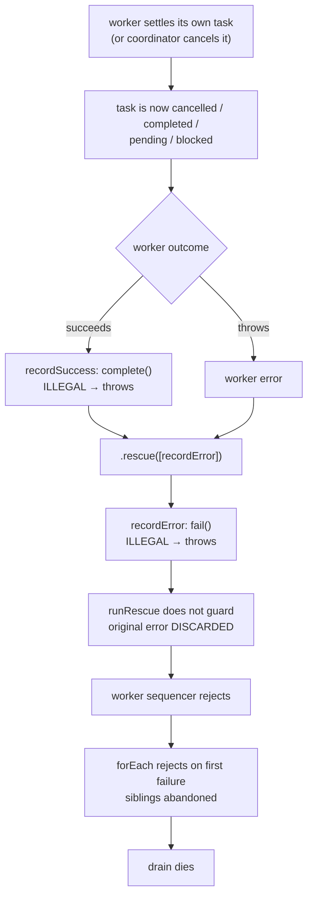
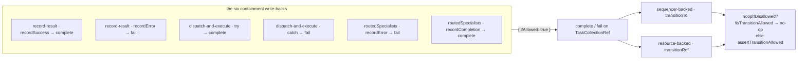

# FIX-951: Task-board drain containment breaks when a worker fails after its own task reached a terminal status — Implementation Spec

> **Linear:** [FIX-951](https://linear.app/fixpoint-labs/issue/FIX-951/task-board-drain-containment-breaks-when-a-worker-fails-after-its-own) · **Category:** Bug · **Priority:** High

## Spec evolution

- **Spec drafted** — framed as a containment defect in the substrate's own write-back path rather than a single unguarded `fail()` call. Research falsified two premises of the filed issue (the worker need not fail, and `allowTerminalNoop` does not close the bug) and found six exposed write-backs across three files and two collection backings. The fix generalises the existing `allowTerminalNoop` flag into `noopIfDisallowed` and exposes it to callers as an advisory `{ ifAllowed: true }` write option, evaluated inside the transition's own atomic write. No dependency on FIX-950.

---

# Part I — The Case

## 1. Problem — why it matters, why now

A task board runs several workers at once. Each worker takes a task, does it, and the board writes the outcome back onto that task. Wrapped around every worker is a safety net whose one job is to make sure that if a worker goes wrong, only *its* task is affected and the rest of the board carries on.

That safety net is not safe. If a task gets settled while the worker holding it is still running — the coordinator cancelled it, or the worker marked it done itself through its task tools — the board's write-back is rejected by the task state machine and throws. The throw happens *inside* the safety net, so nothing catches it. Every other task on the board is abandoned, and the caller gets an error about an "illegal status transition" that has nothing to do with what actually went wrong.

**Why now.** This is a live correctness hole in the primitive that `supervisor`, `plan-and-execute`, `eventActors`, the goal-seek loop, and every delegation board are built on. There is no workaround a user can apply from outside: the failing write is the substrate's own, on a code path the user never calls.

### Three corrections to how this issue was filed

Each changes the argument, so they lead rather than hide in an appendix. All three were **verified by execution** against `origin/main`, not derived (probe script described in §10).

**1. The worker does not have to fail.** The issue frames the trigger as "the worker then throws." It doesn't need to. A worker that **succeeds** on a cancelled task kills the board just as dead: the success write-back (`complete`) is the illegal transition, it throws, the safety net catches *that*, and the net's own `fail` write then dies on the same task. Cancelling a task does not stop the worker already running it, so a healthy worker finishing normally is the **ordinary** case, not the exotic one. This roughly doubles the reachable surface of the bug and is the single most important correction here.

**2. Severity is layer-dependent — "ends the turn" is true at one layer and false at another.** The commissioning brief called this a genuine turn-ender. That is true of some callers and false of the one the issue's own title implies:

| Caller | What the escape does |
|---|---|
| `taskBoard` used directly, `supervisor`, `plan-and-execute`, `eventActors`, `goalSeekLoop` | Propagates to the action root. **The run dies.** |
| **Delegation** board (`runBoard` tool) | The coordinator generator's tool loop catches every tool throw. **The turn does not end.** The model gets an opaque internal error string instead of its board results and keeps looping. |

So on the delegation surface this lands in the *same* bucket as FIX-950 — a bad message, not a dead turn. It is still worse than FIX-950 there, because the board's results projection is skipped entirely and the remaining tasks are abandoned. And on the pattern surface it is genuinely fatal. **High priority stands**; the "most severe in the cluster" claim holds at the pattern layer, and should not be repeated unqualified at the delegation layer.

**3. `allowTerminalNoop` does not close the bug.** The obvious fix — mirror `cancel()`'s flag on `fail()` — leaves two live holes. Verified by execution: `pending → errored` and `blocked → errored` also throw. The full escape set is **every status except `in_progress` and `awaiting_review`**. Terminal statuses are the *majority* of the exposure, not all of it.

Related: **`recordError` is not the only exposed write.** Sweeping the containment paths found **six** write-backs with the same exposure across three files, and a **second collection backing** carrying its own duplicated copy of the transition wrapper. A fix to the one line the issue names would leave five siblings and half the substrate untouched.

One more thing the fix gets for free: because the rescue's throw currently **replaces** the error it was rescuing, the worker's real failure is discarded today. Stopping the write-back from throwing restores it.

## 2. Solution in plain terms

Make the substrate's own write-backs **advisory**: `complete` and `fail` accept `{ ifAllowed: true }`, meaning *"record this if the state machine will take it; if it won't, the write is moot — do nothing."* The decision is made **inside the same atomic write that performs the transition**, so there is no window between checking and writing.

The state machine itself does not get more permissive, and nothing changes for ordinary callers. Code that calls `collection.fail(id, msg)` still throws on an illegal transition, exactly as today. Only the substrate's own containment write-backs opt in.

Rather than adding a second flag beside `allowTerminalNoop`, the existing one is **generalised into it**. Terminal-status is a strict subset of disallowed-transition, so `noopIfDisallowed` subsumes `allowTerminalNoop` with no behaviour change for its only user (`cancel()`), and the narrower concept is deleted.

**The philosophy that led here.**

- **Tenet 5 (fix at the owning layer — the owning layer is where the paths converge).** Five writers need this property. Guarding them one by one is patching call sites. The two transition wrappers — one per backing — are where all five converge, so that is where the flag lives.
- **Tenet 3 (earn every addition, and subtract as you go).** One option on an existing surface, and it *replaces* `allowTerminalNoop` rather than sitting next to it. Net new concepts: zero.
- **Tenet 1 (coherence).** The task-board documentation states that under `onError: "skip"` a worker failure is recorded on its own task and siblings continue. The code does not do that. A doc/code mismatch is incoherence; the resolution here is to fix the code, because the doc describes the behaviour we actually want.

## 3. Tradeoffs & alternatives

**The alternative the issue's sibling invites: catch `IllegalTaskTransitionError` (FIX-950).** FIX-950's spec proposes exporting that type and names FIX-951 as a caller that would want it. **We are not taking it, and this issue does not depend on FIX-950.** Two reasons. First, sequencing a severe fix behind a message-quality fix would be a self-inflicted delay — and FIX-950's own Decision 3 already states that FIX-951 "is fixed at that caller rather than here," so both specs agree they are independent. Second, and more substantially, catching after the fact is strictly weaker than not throwing: by the time the exception surfaces, the atomic write has already been attempted and unwound, and the caller must decide what "already settled" means from *outside* the lock, with a status that may have moved again. Declining the write inside the CAS is both simpler and race-free. If FIX-950 lands first, nothing here changes.

**Pre-check the task's status in the rescue before calling `fail`.** Rejected on two counts. It is a genuine TOCTOU — `collection.get()` reads the last committed state, and only the CAS is authoritative, so a concurrent claim or cancel between read and write reopens the hole. And it forces the caller to re-derive which transitions are legal, which is precisely the layer trap FIX-950 documents at length: a table that is true of the collection and wrong where the caller stands.

**Blanket `try/catch` around the rescue's write-back.** Rejected — this is the error-swallowing class. It would eat store failures on a resource-backed board, CAS exhaustion, and ordinary bugs, and the drain would sail on having silently lost work. `ifAllowed` has a strictly enumerated failure set: a disallowed transition no-ops; **everything else still throws.**

**The simpler approach considered: `allowTerminalNoop` on `fail()`, as the issue proposes.** Rejected **on evidence, not taste** — it leaves `pending → errored` and `blocked → errored` throwing (§1 correction 3). Worth being precise about how live that residue is: both are reached through `reclaim()` (lease expiry re-queues a running worker's task), which is exported public API with **no in-repo caller**. So the narrow fix would close every trigger the shipped code can reach today, and re-break the moment a user calls a method we ship and document. Since the broader flag is the same amount of code — `isTransitionAllowed(...)` where `isTerminalStatus(...)` stands — taking the narrow one buys nothing.

**Where the genuine complexity is.** Not the mechanism, which is a few lines. It is justifying that *dropping* the write is correct rather than merely convenient, per status — because a silently dropped failure record is a real cost. §9 walks each one. The short version: in every case the task's status is owned by someone with better information than the rescue (the coordinator cancelled it, the worker itself settled it, the lease reclaimer re-queued it for another attempt), so the rescue deferring is right. The one genuine loss — a worker that self-completes and *then* throws is recorded as a success with no trace of the throw — is called out in §9 and covered by an emitted status item rather than a thrown error.

**Honest limits of the evidence.** The six exposed write-backs were found by sweeping the containment paths and each was then read individually; two were additionally verified by execution. The `dispatchAndExecuteBlock` and `routedSpecialists` sites are on paths with **no in-repo caller** or with much lower exposure, and are included for convergence rather than because a live trigger was demonstrated for them. The sixth was missed by the first sweep and caught only on re-verification, which is a fair warning about how much confidence this table has earned.

## 4. Focus practices

1. **Ask at which layer each fact is true, and whether that is the layer your reader is standing on.** Every significant miss on this cluster has been a fact verified one layer away — including this issue's own "ends the turn" framing, which is true of patterns and false of delegation. Before asserting severity, name the caller.
2. **Enumerate the writers, then verify each one independently — including the ones the pattern makes obvious.** (Tenet 5.) An enumeration is a hypothesis. The convergence point is only proven when every writer is shown to pass through it, in *both* backings.
3. **Advisory means enumerated, never blanket.** Exactly one failure mode may become a no-op: a transition the state machine rejects. Store failures, CAS exhaustion, and missing tasks keep throwing.
4. **BP-035 — walk the second path.** Test the flag *off* (direct callers still throw), the resource backing as well as the sequencer backing, and the `onError: "fail"` policy as well as `"skip"`.
5. **BP-022 — changeset required.** Observable behaviour change in a published package.

## 5. What using it looks like

Almost nothing changes for users writing code against the framework; the surface addition is one optional argument. What changes is what the board *does*.

**The collection API** — the new option, and the unchanged default:

```ts
// Unchanged: a direct caller still hears about an illegal transition.
await collection.fail(taskId, "worker blew up");
// → throws: [tasks] illegal status transition for task "t-3": cancelled → errored

// New: an advisory write-back. Records the failure if the state machine
// will take it; no-ops if it won't. Never throws for that reason.
await collection.fail(taskId, "worker blew up", { ifAllowed: true });
```

**What the board does** — a three-task board, `onError: "skip"`, where the worker on `poison` cancels its own task and then throws:

```
before:  drain error : [tasks] illegal status transition for task "poison": cancelled → errored
         workers ran : ["poison"]
         statuses    : { poison: "cancelled", sibling-a: "pending", sibling-b: "pending" }

after:   drain error : null
         workers ran : ["poison", "sibling-a", "sibling-b"]
         statuses    : { poison: "cancelled", sibling-a: "completed", sibling-b: "completed" }
```

**And the same board with `onError: "fail"`**, where the contract *is* to fail — note which error now surfaces:

```
before:  drain error : [tasks] illegal status transition for task "poison": cancelled → errored
after:   drain error : worker blew up
```

The board still fails, as configured. It now fails with the worker's actual error instead of a misleading one about the bookkeeping write.

## 6. Decisions & rules

1. **The substrate's own write-backs become advisory via an opt-in `{ ifAllowed: true }` option on `complete` and `fail`.** *Alternative rejected:* changing `fail()`'s semantics for everyone. *Ramification:* direct callers — including the model-facing `failTask` tool, which genuinely should hear about a bad call — keep today's throwing contract unchanged. The opt-in is visible at each call site, so the set of advisory writes is reviewable.

2. **The decision is made inside the transition's own atomic write, never by a pre-check at the caller.** *Alternative rejected:* reading the task's status in the rescue and branching. *Ramification:* race-free by construction rather than by timing luck, and callers never re-derive the state machine. Costs one flag threaded through two transition wrappers.

3. **`allowTerminalNoop` is generalised into `noopIfDisallowed` and deleted, not supplemented.** *Alternative rejected:* adding a second flag beside it. *Ramification:* terminal-status is a strict subset of disallowed-transition, so `cancel()`'s behaviour is provably unchanged (`cancelled` is reachable from every non-terminal status, so `cancel` never threw either way). One concept where there were two. Verified: the full orchestration suite (567 tests) passes on the generalisation.

4. **Only a disallowed transition becomes a no-op. Every other failure still throws.** *Alternative rejected:* a `try/catch` around the write-back. *Ramification:* a store failure or CAS exhaustion on a resource-backed board still takes the drain down loudly, which is correct — we are fixing containment of *task-state* conflicts, not building a blanket suppressor.

5. **All six containment write-backs are converted, in both collection backings.** *Alternative rejected:* fixing only `recordError`, the line the issue names. *Ramification:* this is the tenet-5 convergence claim, and it is the failure mode this cluster keeps repeating — the sixth was itself missed on the first sweep of this spec. The six are enumerated in §7; the resource backing has its own copy of the transition wrapper and must change too.

6. **`recordSuccess`'s `complete()` is converted alongside `recordError`'s `fail()`.** *Alternative rejected:* treating the success path as out of scope because the issue names only the rescue. *Ramification:* this is what fixes the *succeeding*-worker trigger (§1 correction 1). Without it, a healthy worker on a cancelled task still routes through the failure path, and under `onError: "fail"` still kills the board. A cancelled task's output is deliberately discarded — the cancel wins.

7. **This issue does not depend on FIX-950, and does not consume `IllegalTaskTransitionError`.** *Alternative rejected:* catching the typed error FIX-950 proposes. *Ramification:* the two can land in either order with no conflict. If FIX-950 lands first, its error type is simply not used here. Stated so a reviewer does not reintroduce the sequencing.

**Non-goals.** Re-litigating `ALLOWED_TRANSITIONS`. Making the collection API non-throwing for direct callers. Changing `onError` semantics. Fixing the three adjacent defects this research surfaced (§12) — each is real, none is this bug.

**Size: Medium.** Five source files plus tests, one goal check, and a changeset. One PR.

---

# Part II — The Build Plan

## 7. Technical design

### The failure chain today



### The convergence point

Both backings funnel every lifecycle transition through one wrapper apiece. That wrapper already owns the "should this write happen at all?" question — it is where `allowTerminalNoop` lives today. Generalise the condition there, and expose it as an option on `complete` / `fail`.



**The five writers**, each verified individually:

| # | Location | Call | How verified |
|---|---|---|---|
| 1 | `task-board/blocks/record-result.ts` · `recordSuccess` | `complete` | by execution — the succeeding-worker trigger |
| 2 | `task-board/blocks/record-result.ts` · `recordError` | `fail` | by execution — the filed trigger |
| 3 | `tasks/helpers/dispatch-and-execute.ts` · `try` body | `complete` | read; exported public API, no in-repo caller |
| 4 | `tasks/helpers/dispatch-and-execute.ts` · `catch` body | `fail` | read; also masks the original worker error today |
| 5 | `patterns/routedSpecialists/index.ts` · `recordError` | `fail` | read; lower exposure (specialists hold no task tools) |
| 6 | `patterns/routedSpecialists/index.ts` · `recordCompletion` | `complete` | read; the success-path sibling of #5, same relationship as #1 is to #2 |

The sixth was **missed on the first sweep and found on re-verification** — the first pass enumerated the pattern's `fail` and stopped, exactly the "enumeration is a hypothesis" trap in §4.2. Verify each of the six independently rather than trusting this table.

**Deliberately excluded, each checked:** the model-facing `completeTask` / `failTask` / `blockTask` tools in `skills/task-tools-capability.ts` (FIX-950's layer — these *should* report a bad call); and `patterns/debate` / `patterns/round-robin`, whose `complete` calls add, claim, and complete inside a single synchronous handler, so no other party can settle the task in between.

**The two backings.** `sequencer-backed.ts` (`transitionTo`) and `resource-backed.ts` (`transitionRef`) carry structurally parallel but **separately maintained** copies of the flag branch. Both import the shared state machine from `tasks/schema/task-status.ts`, so the *rules* are single-sourced; the plumbing is not. `backing: "request"` routes through the sequencer implementation and is not a third path.

**The condition.** `isTransitionAllowed` already exists in `task-status.ts` and already treats same-status as allowed. No new state-machine code.

### API surface

One exported options type on `TaskCollectionRef`, threaded into `complete` and `fail` as an optional third/third argument. Name it for what it does — the write happens *if allowed* — and document that its failure set is exactly one thing. The implementer owns the exact naming and placement; `WriteBackOptions { ifAllowed?: boolean }` is the shape the examples in §5 assume.

## 8. Implementation sequence

1. **Red first.** Add the regression test that reproduces the escape (§10). Capture the failing output. This is a Bug, so `diagnose` discipline applies: reproduce before fixing.
2. **Generalise the flag in `sequencer-backed.ts`** — rename `allowTerminalNoop` → `noopIfDisallowed`, swap `isTerminalStatus(task.status)` for `!isTransitionAllowed(task.status, targetStatus)`, update `cancel()`'s call. **Remove** the now-unused `isTerminalStatus` import if nothing else in the file uses it (tenet 3: subtract in the same change).
3. **Mirror it in `resource-backed.ts`.** Same rename, same condition, same `cancel()` update, same import cleanup. Note the two files' no-op branches differ in an existing, unrelated way (the resource path returns `current` and still runs a redundant persist); leave that as found.
4. **Thread the option through `complete` and `fail`** in both backings, and onto `TaskCollectionRef` in `tasks/collection/types.ts` with a doc comment naming the enumerated failure set (BP-007).
5. **Convert the six write-backs** to pass `{ ifAllowed: true }`.
6. **Green.** The regression test passes; the full orchestration suite passes unchanged.
7. **Goal check** (§10), then docs (§11), then the changeset.

**Removals in this change:** the `allowTerminalNoop` flag name and the `isTerminalStatus` import in both backings, if orphaned.

## 9. Edge cases

**Is dropping the write correct? Per source status.** The rescue's write-back is advisory precisely because in every reachable case the current status was set by something with better information.

| Task status when the write-back runs | Target | Legal? | If we no-op, is that right? |
|---|---|---|---|
| `in_progress` | `errored` / `completed` | yes | n/a — the write happens, unchanged |
| `awaiting_review` | `errored` | yes | n/a — the write happens, unchanged |
| `cancelled` | either | no | **Yes.** The coordinator settled it deliberately; the cancel outranks a late worker result. |
| `completed` | `errored` | no | **Mostly.** The worker self-completed then threw. Real, small loss of signal — see below. |
| `errored` | `completed` | no | **Yes.** The failure is already recorded; a late success is stale. |
| `pending` (via `reclaim`) | `errored` | no | **Yes.** The task was re-queued for another attempt; erroring it would cancel a retry someone else scheduled. |
| `blocked` | `errored` | no | **Yes.** The coordinator parked it; erroring would fight that decision. |

**The one genuine loss, and where to put the signal.** A worker that calls `completeTask` on its own task and *then* throws is recorded as a success with no trace of the throw. Do not solve this by throwing, and **do not solve it with `ctx.emit.status`** — status items are a request-scoped single slot (latest wins) and are stripped before persistence, so under a concurrent drain N workers would overwrite each other and nothing would survive to the request record. Two constraints, one clean answer: record the dropped error **on the task itself** via `patchMetadata`, which routes through the patch path rather than the transition path and so performs **no** transition validation — it is legal from every status, including terminal ones. The signal lands durably next to the task it describes, rides the existing `task-change` stream, and needs no new item type (which `docs/architecture/items.md` explicitly discourages for lifecycle transitions). The implementer owns the metadata key and wording.

**`onError: "fail"` must still fail.** Verified by execution against the candidate fix: with `"fail"`, a throwing worker on a cancelled task still fails the drain — and now surfaces the worker's error rather than the transition error. A *succeeding* worker on a cancelled task no longer fails the drain, which is the fix, not a regression.

**Re-queue spin.** Because a `pending` task now no-ops rather than erroring, a task repeatedly re-queued under a deterministically-failing worker will be re-dispatched rather than settled. The board's `maxIterations` loop cap (default `10000`) is the intended bound. Confirm the bound holds — an unbounded probe that re-pended the task on every iteration did hang, so this needs an explicit test, not an assumption.

**BP-035 second-path checklist.** Flag off: direct callers still throw (assert it). Both backings, not just the sequencer default. Both `onError` policies. `maxAttempts` retry budget still routes `fail` to `pending` correctly under the flag.

## 10. Testing strategy

**Discipline:** Bug → `diagnose`. Reproduce, then fix, then regression-test.

**Red-green (mandatory).** The reproduction seeds the race deterministically without a model: a three-task board whose worker on the first task settles its own task through the collection and then either throws or returns. Assert the drain does **not** error and the sibling tasks reach `completed` — both fail before the fix. Cover, at minimum:

- cancelled mid-flight + worker throws (the filed trigger)
- cancelled mid-flight + worker **succeeds** (§1 correction 1)
- worker self-completes + then throws
- reclaimed to `pending` + worker throws; and `blocked` + worker throws (§1 correction 3)
- `awaiting_review` + worker throws — the control; legal today, must stay legal
- control: worker throws with the task still `in_progress` — must behave exactly as today
- `onError: "fail"`: still fails, and with the worker's error
- flag off: `collection.fail` on a terminal task still throws
- the resource backing, not only the sequencer backing

*The probe used during spec research covered eight of these and is a reasonable starting shape; it was thrown away rather than committed, so the implementer writes these fresh as proper assertions rather than console output.*

**Goal check — required.** `goals/task-board/contains-a-worker-outcome-that-lands-on-a-settled-task/`. This is a **model-free** goal (the `goals/README.md` explicitly blesses these): the outcome is a real board draining its real work through the real path, and a model adds flakiness without adding discrimination, since the race has to be seeded deterministically to be tested at all.

- **Outcome:** a delegation-style board where one task is settled while its worker is still running finishes the rest of its work and returns results, instead of dying partway with an internal error.
- **Signal:** the run completes; every non-settled task reaches `completed` and carries a held-out salt from the fixture; the settled task holds the status its settler chose.
- **Anti-game (required):** a hollow pass is a board that never ran the siblings at all, so the check must assert sibling *outputs* carry the fixture's salt, not merely that the run didn't throw. A second hollow pass is asserting on the drain's return value alone — assert on the emitted `task-change` stream.
- **Must fail before the fix.** State this in `goal.md` and record the failing run in the verdict log.

**New describe folder.** `goals/` has no `task-board` describe yet. Placing it there rather than under `delegation*` is deliberate: the delegation layer *contains* this failure in its tool loop (§1 correction 2), so a delegation-framed goal would be the least discriminating place to prove the fix.

## 11. Documentation plan

Five files. The first two are the load-bearing ones; the two pattern pages carry containment prose that changes meaning.

| File | Change | Why |
|---|---|---|
| `apps/docs/docs/orchestration/task-substrate.md` (~`:46` and `:87`) | **Extend**, two spots. | `:46` currently says illegal transitions "throw rather than silently writing a bad state" — an unqualified claim the advisory write makes false, and false in exactly the direction the sentence exists to reassure about. Qualify it: a caller may opt a write-back into being advisory, in which case a rejected transition does nothing rather than throwing. `:87` is the **only published enumeration of `complete` / `fail`**, so this is where the new optional argument and its enumerated failure set belong. |
| `apps/docs/docs/orchestration/task-board.md` (after the `:212` "Concurrency and error handling" bullets) | **Extend** with a short paragraph. | "`skip` records the error on the offending task; siblings continue" is the claim this bug violates. Put the caveat *after* the bullet list, not inside it — the list is config knobs, this is behaviour. Tie it to the three neighbours it interacts with: `maxAttempts` (`:216`) and the reclaim discussion (`~:229`), both of which return a task to `pending`, and `maxIterations` (`:217`), which is what bounds a re-queue spin. |
| `apps/docs/docs/patterns/supervisor.md` (`:41`) | **Extend** with one clause. | States an unconditional chain — `recordError` catches, then re-pends or goes terminal `errored`. There is now a third outcome (the write-back no-ops). Supervisor also *cancels tasks programmatically* (`:168`), so it is a live producer of this trigger, not a hypothetical one. |
| `apps/docs/docs/patterns/event-actors.md` (`:181`) | **Extend** with one clause. | "A failing actor records a failed `Task`" becomes conditionally false. The same sentence's second half — "the rest of the chain continues" — is what the bug currently falsifies and this fix repairs. |
| `.changeset/*.md` | **New**, `patch`. | BP-022: observable behaviour change in a published package. |

**Considered and excluded, each checked rather than assumed:**

- `packages/orchestration/README.md` — **no change.** It documents `TaskCollection` at one-paragraph-per-layer altitude (`:44–59`) and deliberately carries no per-method API list; `complete` and `fail` are not mentioned at all. The published lifecycle enumeration lives in `task-substrate.md:87`, which is why the API-surface row targets that instead. (An earlier draft of this plan misfiled it here.)
- `apps/docs/docs/skills/delegation.md` — **no change.** Its promise that "the settled board comes back with each task's output" (`:179`) is currently *broken* on the delegation surface (§1 correction 2). The fix makes the existing prose true, so there is nothing to edit.
- `docs/architecture/items.md` — **no change**, now that §9 records the dropped-failure signal as task metadata rather than a new item or a `status` item. Had §9 kept the status-item approach this file would have needed revisiting, so re-check this if §9's mechanism changes.
- No new page (one caveat under existing concepts; new pages fragment the sidebar), no guide (no new end-to-end workflow), no blog post, no other `docs/architecture/*` change (`ALLOWED_TRANSITIONS` is untouched, no locked contract moves).

**Voice risks to watch**, ordered by how likely they are to bite here:

1. **No internal issue or PR numbers** in anything under `apps/docs/`. This is the highest-probability violation: the paragraph is written straight out of FIX-951 research, and `task-board.md` **already violates this rule today** at `:115` ("the pre-FIX-626 default"). Do not pattern-match off the neighbouring line. (Fixing the pre-existing one is out of scope here — note it, don't sweep it.)
2. **No AI cadence — specifically the escalating list of three.** The natural content is exactly three settle-sources (a coordinator cancelled it, the worker settled it itself, a lease reclaim re-queued it). Write it as prose, not a rule-of-three flourish. Watch "This" as the default sentence opener too.
3. **Introduce terms for newcomers.** "Write-back", "no-op", and "settled" are all internal vocabulary; none appears in `task-board.md` or `task-substrate.md` today. Say what happens in plain terms before naming it, or don't name it.
4. Minimal em-dashes; avoid the banned adjectives (`powerful` / `frictionless` / `seamless` / `first-class`).

## 12. Dependencies, follow-ups, open questions

**Dependencies: none.** Explicitly **not** blocked by FIX-950 (§6 decision 7). No open PR touches `tasks/collection/` or `task-board/blocks/`; PR #934 is a docs-only spec PR for FIX-950.

**Follow-ups — three adjacent defects surfaced by this research. Each is real, none is this bug. Recommend filing separately rather than absorbing.**

1. **A throwing rescue handler erases the error it was rescuing.** `runRescue` calls the handler unguarded, so a handler that throws replaces the original error — the `throw normalizedError` after it is never reached, and nothing is chained as `cause`. This fix stops *this* rescue from throwing; it does not stop the next one. Core-layer, framework-wide blast radius, and squarely its own issue.
2. **The drain's teardown clears run-state under still-running siblings.** `forEach` rejects on the first failure without cancelling the others, then the drain's rescue nulls the shared cache and ledger while those siblings are mid-flight.
3. **A failed drain leaves board meta stuck at `active`.** `boardMetaCompleted` is skipped when the `forEach` rejects, so the last write for the board's meta key says the board is still running. Any lifecycle UI reads a permanently active board.

Also noted, and already owned elsewhere: FIX-950's `failTask` tool wants its own explicit pre-check so a model calling it on a settled task gets a recoverable result rather than a throw. That is FIX-950's layer, not this one.

**Open questions:** none blocking. The one judgment call left to the implementer is the exact wording and item kind of the "write-back was moot" status emission (§9).
