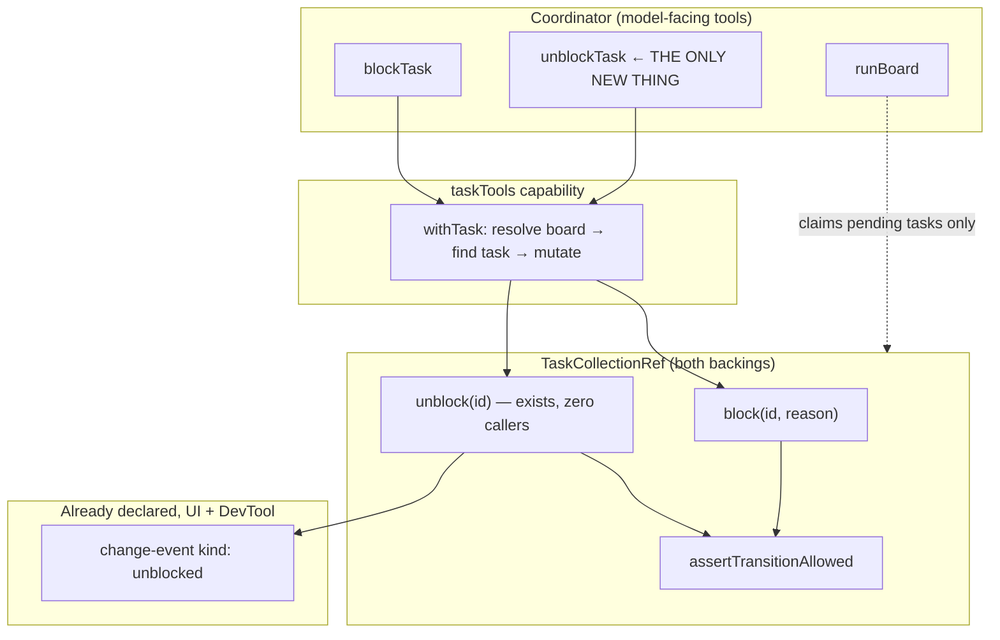
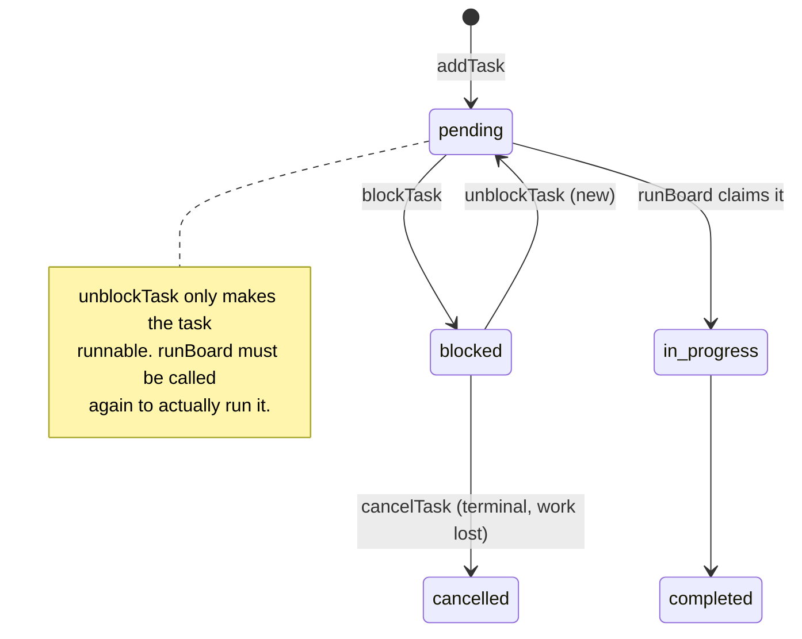

# FIX-953: blockTask has no path back to pending — a coordinator can park a task but never resume it — Implementation Spec

Linear issue: [FIX-953](https://linear.app/fixpoint-labs/issue/FIX-953)

---

## Part I — The Case *(for the human)*

### 1. Problem — why it matters, why now

**The problem, in plain language.** A coordinator running a delegating skill can park a piece of work while it waits on something outside its board — a human answer, a rate limit, a fact it does not have yet. The tool it uses to do that says exactly this: "Block a task pending an external condition." But once the condition resolves, there is no way to say so. The parked work cannot be un-parked. The coordinator's only clean move is to cancel it, throwing away the task and everything wired to it.

**Why now.** Two things make this the moment.

First, the machinery to fix it **already exists and has no consumer**. The task substrate has carried an `unblock` operation from the start: on the collection interface, implemented identically in both storage backings, emitting its own `unblocked` lifecycle event, with that event kind declared in three mirrored unions across the UI, the DevTool, and the kitchen sink. Its only caller in the entire repository is a unit test. The tool surface is the consumer that was never wired up.

Second, the dead end is actively being written into the documentation. PR #932 — open, CI-green, awaiting merge — adds prose stating that `blockTask` "does not pause a task you can later resume," that "the tool surface has no unblock," and a tool-table row reading "One-way — no task tool moves it back." Separately, FIX-950's approved spec composes a recovery message for a coordinator that made an illegal move, and for a parked task the only honest thing it could say was "cancel it"; it requires a test asserting the message *does not imply an unblock exists*. We are on the verge of documenting and testing a gap into permanence — while the operation that closes it sits implemented and unused one layer down.

**The workaround is worse than it looks.** A coordinator that loses a task can cancel it and add a replacement. That looks survivable until you notice dependencies resolve by task id and require the dependency to reach `completed`. A cancelled task never completes, and the replacement has a different id — so **every task that depended on the parked one becomes permanently unrunnable**, silently. The board reports `blocked` forever with nothing obviously wrong.

### 2. Solution in plain terms

Add one tool, `unblockTask`, to the delegation task-tools surface. It takes a task id and calls the substrate operation that already exists. A parked task returns to `pending`, keeping its id, its input, its history, and everything depending on it.

The tool also has to teach one thing the coordinator cannot guess: **un-parking does not restart the work.** The task becomes runnable again, but a drain that already ended has ended. The coordinator must call `runBoard` a second time. Without that, we would close one dead end and open a quieter one.

**The philosophy that led here.**

- **Tenet 2 (composition over features).** This adds no primitive. The state machine permits the move, the collection implements it, the change-event vocabulary names it, the UI and DevTool already declare it. Every piece of the composition exists except the one wire that reaches the model. We are finishing a composition, not growing the surface with a new concept.
- **Tenet 5 (fix at the owning layer).** The gap is at the tool layer, and only there. It is tempting to read `ALLOWED_TRANSITIONS.blocked = ["pending", "cancelled"]` and conclude the state machine is the thing under discussion. It is not — the state machine is already correct. The same tenet's second half applies to the fix: FIX-950's recovery list must derive from the tool set at one convergence point, so adding a tool updates the message rather than leaving a hand-maintained row to drift.
- **Tenet 3 (earn every addition), in tension.** This does grow the model-facing surface from eight tools to nine, and every tool is prompt weight on every delegating turn. We are paying it deliberately. The case: a coordinator that never parks work never needs the tool, the description is one line, and the alternative to paying it is a tool surface that invites a model into a state it cannot leave. Naming the tension rather than hiding it — the cost is real, it is just smaller than the dead end.

### 3. Tradeoffs & alternatives

**The alternative the issue named: make blocking honestly terminal-ish.** Drop `pending` from `blocked`'s allowed targets, rewrite `blockTask`'s description to promise only cancellation. This is off the table for the substrate, and the reason is concrete rather than aesthetic. Taking it means deleting `TaskCollectionRef.unblock` from the interface and both backings, deleting the `unblocked` change-event kind, and pruning it from three mirrored kind unions in the UI, the DevTool, and the kitchen sink. It also contradicts a decision already written down and shipped: the task-caps design names `unblock` as one of the live lifecycle paths back into `pending` and deliberately exempts it from the enqueue cap, and the sequencer backing repeats that reasoning at the cap check itself. That is not an accident of a permissive transition table. It is a built, documented capability whose only missing piece is a caller. Deleting working substrate to justify a missing wire is the wrong direction of travel.

**Extending `updateTask` instead of adding a tool.** `updateTask` is a pure field patcher today — priority, metadata, assignee, labels. Giving it a `status` field that accepts exactly one value (`"pending"`) is a worse lie than a ninth tool, not a smaller one: it advertises a general status setter and delivers a single special case, and the first model to try `status: "completed"` learns the surface is not what it looks like. It also breaks the shape the tool surface already has — lifecycle changes are named verbs (`completeTask`, `failTask`, `blockTask`, `cancelTask`), field edits are `updateTask`. `unblock` is a lifecycle verb at the collection layer; it should be one at the tool layer. Coherence with the established shape (tenet 1) beats saving one entry in a tool list.

**The third move: should the coordinator be parking tasks by hand at all?** Once you see how cheap exposing `unblock` is, the interesting question stops being "resume or terminal" and becomes whether "waiting on an external condition" is something the *board* should model, with no coordinator tool on either side. We looked at three versions of that and rejected all three, for different reasons.

*Let the board evaluate the condition.* Give a task a predicate the drain re-checks each pass. The conditions in question — a human answer, a rate-limit reset, a fact the coordinator was told — are by definition not observable to the board; evaluating them means calling back out to the coordinator. That is manual parking with a layer of machinery on top. Task-to-task waiting, the one kind the board *can* observe, is already modelled: that is what `deps` is. `blocked` is what remains after `deps`, which is exactly why the coordinator holds the information.

*Use run suspension instead.* The framework already suspends a whole run and resumes it on an external signal, which is the natural fit for "wait for a human." But it is per-**run**, and `blocked` is per-**task**: a board of ten tasks where one waits on a rate limit should drain the other nine, not suspend everything. These solve different problems and neither subsumes the other.

*Collapse the two park/resume pairs into one.* This is the sharpest version, because the substrate has **two** symmetric pairs — `block`/`unblock` (external condition) and `awaitReview`/`resumeFromReview` (human review) — and exposes exactly one half of one of them. Merging them looks like textbook subtract-then-add. It fails on behavior, not naming: the drain deliberately treats the two states in opposite ways. `awaiting_review` counts as in-flight and keeps the loop alive so workers idle-poll for the resume; `blocked` does not, so the drain exits and hands control back. That difference is the whole point of each state, and collapsing them would break the human-in-the-loop wake path. Two states, two pairs, kept.

What this analysis actually yields is the stopping line in Decision 8: the substrate has two park/resume pairs and the tool surface exposes one half of one. We are completing that half — not expanding to the other pair, and not inventing a third mechanism.

**The simpler approach: docs only.** Tell skill authors not to reach for `blockTask`. Insufficient. The tool is installed on every delegating board and describes itself as temporary; a model reading its own tool list will use it. And the failure mode it produces is not "the coordinator is stuck," it is "the dependency graph is silently corrupted by the obvious workaround." Documentation does not fix a trap you leave armed.

**Where the genuine complexity is.** Not the tool. The tool is a thin wrapper over an existing method, routed through the same helper the other six task mutators already use. The complexity is entirely in **the prose that counts to eight**. On `main` today: five sentences across the docs site and the package README assert the count (two enumerating all eight by name), one guide carries a tool table, and **seven source docstrings** repeat the count across three files — plus one more that counts the id-taking mutators rather than the tools. PR #932, open and CI-green, adds more, including "Seven more task tools." That PR also adds prose this change makes flatly false: that `blockTask` "does not pause a task you can later resume," that "the tool surface has no unblock," and a table row reading "One-way — no task tool moves it back." This change is small in code and wide in claims, which is exactly the failure class PR #932's own author named: a claim true in the instance examined and wrong across the full set.

### 4. Focus practices

1. **Verify every claim at the layer your reader is standing on.** This issue is a layer mismatch end to end, and the issue text itself contains one: it says `failTask` reaches `pending` "only with retry budget remaining." That is true of the *collection*, and it describes an escape hatch that **does not exist on a delegation board**. There, `maxAttempts` is never set — the `addTask` tool schema has no such parameter and the delegation surface never supplies one — so `shouldRetryOnFail` is always false, `failTask` on a parked task always attempts the illegal `blocked → errored`, and it **throws**. `cancelTask` is the only exit, full stop.

    But be precise about *which* board, because the tool layer is shared. `taskTools` is also exported standalone and can be pointed at a board built directly through `collection.addTask`, where tasks **can** carry `maxAttempts`. On such a board `failTask` on a parked task does take the retry branch and land on `pending` — a lossy resume that records a spurious error and consumes an attempt. So the honest statement is: *on a delegation board there is no resume path at all; on a directly-built board there is only a lossy one.* Both are fixed by the same tool. Every claim in this spec about "what a coordinator can do" is a claim about a specific board at the tool layer, and must be checked there. *(Tenet 5.)*
2. **A count is a claim about a set — enumerate the whole set.** Do not fix the tool list you happen to open. §11 names every site that counts or enumerates the tools; check them off. *(Tenet 1 — the incoherence here is thirteen statements drifting apart.)*
3. **The recovery list gets one convergence point.** FIX-950 derives recovery guidance from tool-reachable actions. If that derivation walks the tool set, adding `unblockTask` updates the `blocked` message for free and only the test assertion changes. If it hardcodes a `blocked` row, this change must move it to the derived path rather than editing the constant. Prefer the former; an invariant enforced at one writer is the point of tenet 5.
4. **The goal check must be able to fail.** Coordinator-observable behavior, real model, and it must go red on today's code — where the coordinator's only exits are cancelling the work or a throw. A goal check that would pass before the fix proves nothing. *(BP-003, tenet 7.)*
5. **Changeset required.** User-facing: a new model-facing tool. *(BP-022, `minor`.)*

### 5. What using it looks like

**The round trip a coordinator can finally make.** The parked task keeps its id, so its dependents stay wired.

```js
// Turn 1 — the coordinator learns it is missing an external fact.
blockTask({ taskId: "t-2", reason: "waiting on the customer's region" })
// → { ok: true }
runBoard({})
// → { status: "blocked", tasks: [ { id: "t-2", status: "blocked", … } ] }

// Turn 2 — the user supplies the region.
unblockTask({ taskId: "t-2" })
// → { ok: true }                     t-2 is pending again, same id, same input
runBoard({})                          // ← required; unblocking does not re-drain
// → { status: "drained", tasks: [ { id: "t-2", status: "completed", output: … } ] }
```

**What the workaround does to a dependency graph, and what the tool avoids.** `t-3` depends on `t-2`.

```js
// Before — cancel and re-add is the only non-throwing exit:
cancelTask({ taskId: "t-2" })            // → { ok: true }, t-2 is terminal
addTask({ goal: "…", assignee: "researcher" })
// → { ok: true, taskId: "t-9" }         a NEW id
runBoard({})
// → { status: "blocked", … }            t-3 deps on "t-2", which is cancelled and
//                                       will never complete. t-3 can never run.

// After — the id survives, so t-3 is untouched:
unblockTask({ taskId: "t-2" })           // → { ok: true }
runBoard({})                             // → { status: "drained", … } t-3 runs.
```

**Failures behave exactly like the sibling tools** — soft for a missing board or id, and, until FIX-950 lands, a throw on a genuinely illegal transition:

```js
unblockTask({ taskId: "t-404" })
// → { ok: false, error: "task_not_found", taskId: "t-404" }

unblockTask({ taskId: "t-1" })           // t-1 is already pending
// → { ok: true }                        same-status writes are legal and idempotent

unblockTask({ taskId: "t-8" })           // t-8 is completed — terminal
// → throws today, exactly as completeTask/failTask/blockTask do on an illegal
//   transition. Softened for every sibling at once when FIX-950 lands.
```

### 6. Decisions & rules — the sign-off surface

1. **Add a resume path; do not remove the transition.** *Alternative rejected:* the issue's second direction — drop `pending` from `blocked`'s allowed targets and make `blockTask` promise only cancellation. *Ramification:* that direction would delete `TaskCollectionRef.unblock` from the interface and both backings, delete the `unblocked` change-event kind and prune it from three mirrored kind unions, and contradict the task-caps design, which names `unblock` as a live lifecycle path into `pending` and deliberately exempts it from the enqueue cap. We keep all of it and add the missing caller. The state machine is not touched.

2. **A dedicated `unblockTask` tool, not a `status` field on `updateTask`.** *Alternative rejected:* extending `updateTask`'s patch with a single-valued status. *Ramification:* the tool surface keeps its shape — lifecycle changes are named verbs, `updateTask` stays a pure field patcher. Costs one entry in the model's tool list on every delegating turn. Locks in that any future status transition exposed to a coordinator is also a verb tool, not a patch field.

3. **The name is `unblockTask`.** *Alternative rejected:* `resumeTask`. *Ramification:* `unblockTask` is the inverse of `blockTask` by name, matches the collection method `unblock` and the existing `unblocked` change-event kind carried in the UI and DevTool unions, and avoids two live collisions — the `resumed` change kind (emitted by `resumeFromReview` and lease reclaim, a different transition) and the engine's suspension/resume domain. One vocabulary for one transition, top to bottom.

4. **The tool description states that the coordinator must call `runBoard` again.** *Alternative rejected:* a bare "Return a blocked task to pending," leaving the re-drain to the docs. *Ramification:* this is the one thing a model cannot infer and the one that turns a fix into a second dead end — a drain that already ended does not pick the task back up. This is a deliberate exception to FIX-950's Decision 6 (do not put preconditions in tool descriptions): that decision is about *preconditions the model cannot check*, and this is a *consequence it must act on*. Accepts a slightly longer description as prompt weight.

5. **`unblockTask` is a thin wrapper: same shared helper as its sibling mutators, same behavior, no status precondition of its own.** *Alternative rejected:* a guard that acts only when the task is `blocked` and soft-errors otherwise. *Ramification:* three consequences, all accepted deliberately. (a) It throws on a genuinely illegal transition today, exactly as `completeTask`/`failTask`/`blockTask` do, and is softened along with them when FIX-950 lands — they converge on one helper and one guard, and a private soft path here would be a second convergence point for the same invariant (tenet 5). (b) A same-status call on an already-`pending` task succeeds and **does** emit a change event; there is no no-op branch and no sibling has one. (c) The tool inherits the collection's permissiveness: `unblock` also succeeds from `in_progress` and `awaiting_review`, because both legally reach `pending`. On a delegation board neither is reachable when a coordinator holds control, so this is latent rather than live — but it is inherited, not introduced, and adding the guard would make this the only task tool with a status precondition. **If review tools for `awaiting_review` are ever exposed, this pair must be revisited** (§12). **FIX-950 is not a prerequisite** (§12).

6. **The board's caps are not consulted, and no cap check is added.** *Alternative rejected:* refusing to unblock when the board is at `maxEnqueuedTasks`. *Ramification:* none — this is already the specified behavior. The task-caps design states that lifecycle re-entries into `pending`, `unblock` among them, are deliberately uncapped and may transiently exceed the enqueue bound, with `maxTotalTasks` as the hard runaway bound. Unblocking creates no task. Cite that reasoning; do not restate or re-derive it.

7. **FIX-950 and this change are mutually exclusive in content but independent in code; whichever lands second owns the reconciliation.** *Alternative rejected:* declaring FIX-950 an upstream prerequisite. *Ramification:* FIX-950 is **not on `main`** — its spec PR closed unmerged (as spec PRs do) and no implementation PR is open — so this spec must not be written against code that does not exist. If this lands first, FIX-950's implementation is simply authored against a nine-tool surface: its `blocked` recovery names `unblockTask`, and the test it planned (asserting the message implies no unblock) is never written. If FIX-950 lands first, this change updates its `blocked` guidance *at the derivation point* — preferring to move a hardcoded `blocked` case onto the tool-set-derived path over editing a constant — and inverts that test. Implementation begins by checking which world it is in.

8. **Scope stays at the tool surface. `awaitReview` and `resumeFromReview` get no tools.** *Alternative rejected:* exposing every unexposed lifecycle method while we are here. *Ramification:* the invariant we are restoring is narrow and checkable — *a coordinator must be able to leave any status a coordinator tool can enter, without destroying the work.* `blocked` is the only violation, and for two independent reasons: no coordinator tool enters `awaiting_review`, **and** even if one did, `awaiting_review` already reaches `pending`, `completed`, `cancelled`, and `errored`, so `completeTask`/`failTask`/`cancelTask` would exit it. `blocked` reaches only `pending` and `cancelled`, and the tool surface held just the destructive one. That is the principled stopping line: we complete a half-exposed pair, we do not expose the other pair.

**Non-goals.** No change to the status state machine or its allowed transitions; no soft-error work (FIX-950); no drain-containment change (FIX-951); no tools for `awaitReview`/`resumeFromReview`/`reclaim`/`claim`; no change to how a drain treats `blocked`.

**Size estimate.** **Medium** — the tool itself is a handful of lines, but it carries a real-model goal check, six CI specs, and corrections across thirteen count assertions in six files. Single PR; no PR plan needed.

---

## Part II — The Build Plan *(for the implementing agent)*

### 7. Technical design

Everything below the tool boundary already exists. This change adds one node to the top layer.



The status path the coordinator drives, and the re-drain that is easy to miss:



**Surface.** One handler-shaped tool taking a task id, returning the surface's shared ok-or-error shape, wired into the tool list the capability factory builds, and declared alongside its siblings so both the hand-wired `taskTools` path and the delegation surface's capped-resolver path get it. Nothing about board resolution, roster validation, or state schema changes — the tool takes no assignee, so the roster gate stays inert.

**What must not change.** `task-status.ts` (the transition is already legal), both collection backings (`unblock` is already correct), the change-event vocabulary, the drain's treatment of `blocked`, and the caps.

### 8. Implementation sequence

1. **Add the tool.** Build it beside `blockTask` in the capability's tool factory, routed through the shared id-taking mutator helper so failure ordering matches its siblings. Include the re-drain consequence in the description (Decision 4). Add it to the returned tool list. *Test:* an unblock returns `{ ok: true }` and moves a blocked task to `pending`; an unknown id returns the not-found soft error; the tool appears on both the hand-wired capability and a delegation-surface board.

2. **Prove the round trip through the drain.** A test that parks a task, drains (asserting `runBoard` reports `blocked`), unblocks, drains again, and asserts the *same task id* reaches `completed`. This is the step most likely to surface something unexpected: verify a second `runBoard` invocation within one execution actually re-drains and does not carry stale per-run sequencer state from the first. If it does not, that is a finding to surface, not to work around.

3. **Prove dependents survive.** A test with `t-3` depending on `t-2`: park `t-2`, unblock it, drain, assert `t-3` runs. Then the negative that motivates the tool — cancel-and-re-add leaves `t-3` permanently unrunnable. Encode *why* it matters, not just the status values.

4. **The goal check** (§10) and a `minor` changeset. Reachable from step 3; do not park it behind the gated steps below.

**Steps 5 and 6 are gated on merges outside this change (§12). Steps 1–4 are not — start there.**

5. *(Gated on PR #932.)* **Documentation and count prose** — every site in §11, treated as one checklist rather than per-file edits. This is also where PR #932's "one-way / no unblock" prose is corrected, which is a semantic fix, not a numeric one.

6. *(Gated on FIX-950, in whichever direction it lands.)* If FIX-950 is already on `main`, update its `blocked` recovery guidance at the derivation point and invert the test that asserts no unblock exists. If it is not — which is the case as of this writing — there is nothing to do here, and FIX-950's own implementation picks up the nine-tool surface instead. Check which world applies before doing anything (Decision 7).

**Removals.** None. This change subtracts nothing, which is worth stating plainly given tenet 3: the subtraction that *would* be available here — deleting `unblock` and the transition — is the rejected direction, and Decision 1 explains why.

### 9. Edge cases & error handling

| Case | Expected behavior |
|---|---|
| No board, then unknown task id | `no_delegation_board`, then `task_not_found` — **board first**, matching the shared helper and every sibling. Do not reverse these; the order is the contract. |
| `unblockTask` on a terminal task (`completed` / `errored` / `cancelled`) | Genuinely illegal. Throws today, like its siblings; softened with them by FIX-950. No bespoke handling (Decision 5a). |
| `unblockTask` on an already-`pending` task | **Succeeds** — same-status writes are legal and idempotent in state. But an `unblocked` change event **is** emitted, with `prevStatus: "pending"`, and reaches the client plan stream. Neither backing has a no-op branch. Accept and assert it (Decision 5b); do not add a guard. |
| `unblockTask` on an `in_progress` or `awaiting_review` task | Legal per the state machine — both reach `pending` — so it succeeds and yanks the task back to the runnable pool. Inherited from `unblock`, not introduced here (Decision 5c). Latent on a delegation board: a coordinator holds control only between drains, and no tool enters `awaiting_review`. Reachable only by a fan-out worker holding board tools mid-drain. Pin with a test rather than a guard. |
| `blockTask` on an `in_progress` task | Already illegal — `in_progress` has no `blocked` target. **Parking is a between-drains move on work that has not started.** Not changed here, but it constrains the goal-check harness (§10): turn 1 must park before the first drain claims the task. |
| The block reason after unblocking | `block(id, reason)` stores the reason on the task's error field, and `unblock` **clears it** — the reason is destroyed, not archived, and `feedback` is left untouched. It was visible in the prior drain's settle output and is gone from the next. Existing `unblock` behavior; assert it so it is pinned rather than incidental. Whether the reason should survive is a follow-up (§12), not a change here. |
| Board at `maxEnqueuedTasks` when unblocking | Succeeds. `pending` may transiently exceed the enqueue bound; specified behavior for lifecycle re-entries, with `maxTotalTasks` as the hard bound. No cap check, no new task. |
| Unblocked but never re-drained | The task sits `pending` and nothing runs — nothing reports anything until `runBoard` is called, since the settle handler only runs inside an invocation. The *next* `runBoard` reports `blocked`, because `pending` counts as unresolved. Visible and recoverable; this is the reason for Decision 4. |
| A task parked *and* holding a failed dependency | Unblocking returns it to `pending`, but deps still gate it — they must be `completed`, and a failed dep is `errored`. The task will not run. Correct; worth a test so nobody later "fixes" it. |
| Unblocking a task whose dependents were cancelled meanwhile | Out of scope; no cascade behavior changes. |
| Second path (BP-035) | New-flag off-state: none, the tool is unconditional. Legacy shape: a board checkpointed before this change resumes fine — no schema change, and a `blocked` task reads identically either way. Concurrency: the mutation is CAS-safe through the existing helper; two coordinators unblocking the same task converge on the same state but emit two events (same root cause as the same-status row). Multi-tenant: board resolution unchanged. |

### 10. Testing strategy

**Discipline.** Linear category is **Bug**, so `issue-implement` routes to `diagnose`. The reproduction seam is `packages/orchestration/test/skills/` (delegation-surface tests) with the tool-level assertions in the task-tools tests — the existing delegation tests already have a park-then-drain case that stops exactly where this gap begins.

**Goal check** — required; this is coordinator-observable behavior. Model it on the delegation-caps harness, which is the closest analog (a real coordinator reacting to a tool-surface fact).

- **Outcome:** a coordinator that parks work on a fact it does not have, then receives that fact, resumes the same task and finishes the job — instead of abandoning it.
- **Signal:** two user turns over one skill. Turn 1 withholds an external fact the worker needs; turn 2 supplies it. Assert from the `task-change` stream that one task id goes `blocked` → `unblocked` → `claimed` → `completed`, that a second drain ran, and that the completed task's recorded output carries a **held-out salt** that lives only in the worker agent's prompt — so a coordinator narrating a resumed task it never ran cannot fabricate the pass.
- **A constraint the harness must respect:** `blockTask` is illegal on an `in_progress` task, so parking only works on work that has not started. Turn 1 must get the coordinator to park the task *before* a drain claims it — the natural shape is plan the board, park the one task that needs the missing fact, then drain the rest. A harness that drains first and parks second tests nothing.
- **Anti-game:** (1) the task must actually have been parked — no `blocked` event means anti-game-void, not pass, or a coordinator that simply never blocked would sail through; (2) the completed task must be **the same id** that was blocked, closing the cancel-and-re-add workaround, which is the likeliest thing a model finds today; (3) no `cancelled` event for that id.
- **Discriminating:** it must fail on today's code. It does — the coordinator has no unblock tool, so turn 2 leaves it cancelling the work (fails the same-id assertion) or calling `failTask`, which on a delegation board always attempts `blocked → errored` and throws. Run it red before writing the tool; a green pre-fix run means the harness is wrong.

**CI specs** (deterministic, mocked model):

- The tool returns `{ ok: true }` and the task is `pending`; an `unblocked` change event is emitted with `prevStatus: "blocked"`.
- Unknown id and no-board return the shared soft errors in the established order.
- Round trip through the real drain: park → drain reports `blocked` → unblock → drain → same id `completed`.
- A dependent of the parked task runs after the unblock, and does **not** after a cancel-and-re-add — the test that encodes why the tool exists.
- The tool is present on both a hand-wired `taskTools` capability and a delegation-surface board.
- FIX-950's `blocked` recovery message names `unblockTask` (replacing the assertion that it does not).

### 11. Documentation plan

**No new page, and no sidebar change.** This adds one entry to an already-documented tool surface, and the underlying transition is already drawn in the substrate page's status machine. A one-tool page would fragment a coherent section and duplicate the delegation reference.

**The canonical home** for the park-then-resume explanation is `apps/docs/docs/skills/delegation.md`. Everything else points at it or just drops a stale numeral.

**The count checklist.** Thirteen sites below assert the tool count or enumerate the tools — five in site docs and the package README, seven in source docstrings across three files, and one counting the id-taking mutators. **Treat it as one checklist** — the failure mode is fixing the file you opened and leaving the rest saying eight, and note that four of these live in files the tool is not even defined in. PR #932 rewrites several of these sections and adds more (§12), so **re-read each file at its merged state before editing**.

| File | Action | What changes |
|---|---|---|
| `apps/docs/docs/skills/delegation.md` | EXTEND | (a) The `taskTools` bullet enumerates all eight — add `unblockTask` immediately after `blockTask` so the pair reads together, with one clause: takes a task id, returns the task to `pending`. (b) **New short paragraph** after the `runBoard` paragraph: while any task is parked, the drain reports `status: "blocked"` rather than `"drained"`; `unblockTask` returns it to `pending` but starts nothing, so `runBoard` is called again. Mirror the sentence shape the page already uses for `addTask` ("writes a task — it does not execute anything by itself"); the reader has learned that rule once already. (c) The enqueue-bound paragraph already lists "an unblock" and needs no rewrite, but its phrase "come back to `pending` **on their own**" becomes slightly wrong once a coordinator can trigger it deliberately — soften minimally, do not expand. |
| `apps/docs/guides/agents-command-the-board.md` | EXTEND | (a) The tool table currently lumps `blockTask` / `cancelTask` into one row as "park … or drop it" — `unblockTask` must not be silently folded into that slash-pair; park and drop are opposites and the third verb needs its own visible entry. (b) Drop the numeral from "the eight `taskTools`". (c) One sentence in "Assign tasks, then drain": unblocking puts a task back on the plan, not into execution. Keep the full explanation in delegation.md and link across — this page is a tutorial. |
| `apps/docs/docs/orchestration/overview.md` | EXTEND | Drop the numeral from "eight tools like `addTask` and `completeTask`". Router page; no other change. |
| `apps/docs/guides/building-a-research-team.md` | EXTEND | Drop the numeral; the list is already elided. One-word edit. |
| `packages/orchestration/README.md` | EXTEND | Enumerates all eight — add `unblockTask` next to `blockTask` and drop the numeral. Keep the full explicit list here (BP-009) even though the site pages elide. Add the park-resume fact in one clause; the README already carries this level of behavioral detail for the cap errors. |
| `packages/orchestration/src/skills/task-tools-capability.ts` | EXTEND | Three docstrings say "eight" (file header with the slash-separated list, and both factory docstrings). **Plus a fourth count this file makes about itself**: the shared output shape is documented as serving "the six tasked-by-id mutators," which becomes seven. BP-007. |
| `packages/orchestration/src/skills/delegation-surface.ts` | EXTEND | **Three more "eight" assertions** — the file header enumerating the surface, and two inline ("the eight `taskTools` plus `runBoard`"; "the flat, model-facing eight tools"). Easy to miss because the tool is not defined here. |
| `packages/orchestration/src/skills/worker-materializer.ts` | EXTEND | One more — "gets the eight addTask/…/listTasks tools". |
| `apps/docs/docs/orchestration/task-substrate.md` | OPTIONAL | The status diagram already draws `blocked → pending (unblock)` and the lifecycle bullet already lists `block` / `unblock` — **both correct, do not touch**. Optionally add one clause noting the delegation surface exposes it as a tool. Keep the layer distinction: this page describes the collection, not the tool surface. |
| `apps/docs/docs/orchestration/task-board.md` | NO CHANGE | Its unblock mention is already correct, and it documents `taskBoard`, not the delegation `runBoard` tool. Listed so a reviewer sees it was checked, not skipped. |
| `packages/orchestration/CHANGELOG.md` | NO CHANGE | Historical record. |
| `.changeset/*.md` | CREATE | `minor` — a new user-facing tool, pre-1.0. |

**Cross-links.** New paragraph in `delegation.md` → the substrate page's status-machine anchor (that edge does not exist today and is the one a reader parking work will want). The guide's new sentence → the delegation reference, inline rather than only in "Where to go next". Deliberately **do not** link to `taskBoard`'s `onIdle` / termination docs — different mechanism, and linking there reinforces the conflation flagged below.

**Voice risks** (`CLAUDE.md` → Writing Style):

- **Issue IDs.** Highest risk. The source file being edited is dense with `FIX-` references and it is tempting to carry a rationale sentence across verbatim. Zero `FIX-` or `PR #` tokens anywhere under `apps/docs/`; grep the diff before opening the PR. They belong in the source docstrings, the changeset, and the commit.
- **Three meanings of "blocked."** The task *status*, `runBoard`'s result `status: "blocked"`, and `taskBoard`'s `terminationReason: "blocked-by-failures"` are three different things sharing a word, and a reader landing on the delegation page has not necessarily read the substrate page. Say "parked in the `blocked` status" on first mention and link the status machine. Never write bare "blocked" where it could be read as the termination reason.
- **Em-dashes.** The surrounding paragraphs in `delegation.md` and the README already lean on them; matching local style will overshoot the site rule. Two short sentences for the new note.
- **AI cadence.** The park-resume note invites "unblocking isn't execution — it's a state change." State it flatly instead: unblocking moves the task to `pending`; `runBoard` runs it. Drop "simply" / "just" / "seamlessly".
- **Prefer deleting the numeral to updating it.** This is the third time the count has had to change. Only the package README keeps an explicit enumeration, because there the full list is the point.

**Architecture docs — verified, no change.** All files under `docs/architecture/` were searched for `blockTask`, `unblock`, `taskTools`, `addTask`, `delegation`, and task status: zero matches. The tool surface and status machine are documented on the site and in the package README, not there. Related: `items.md` lists `task-change` as an item kind but never enumerates the change kinds, and the substrate page's list of kinds is explicitly open-ended ("and so on"), so the existing `unblocked` kind is already covered in both. No edit.

### 12. Dependencies, open questions & follow-ups

**Ordering (neither is a code dependency; both are content collisions).**

- **PR #932** (docs for the delegation tool surface) is **open and unmerged**, and it adds several more count assertions on top of the ones on `main`, including a tool table and a "Seven more task tools" sentence. Land this after it merges. Landing first means #932 re-introduces "Eight tools" and "Seven more" with no merge conflict to catch it — the same trap FIX-950 called out for the same reason. One specific consequence: `runBoard`'s `status: "drained" | "blocked"` result is documented **nowhere** on `main` but *is* documented by #932, so the park-resume note is an extension of an existing paragraph at merged state rather than a new explanation. Check which before writing it.
- **FIX-950 is approved but is *not on `main`*.** Its spec PR closed unmerged, as spec PRs do; `docs/specs/FIX-950.md` does not exist on `main` and **no implementation PR is open**. So it is not a prerequisite, and nothing in this spec may be written against its code. Whichever lands second owns the reconciliation, and Decision 7 states what that is in each direction. Verify which world applies at implementation time rather than assuming.

**Note on FIX-950's ratified position.** Its review explicitly settled that "`blocked` is a genuine dead end. No tool unblocks a task." That was a correct statement of the surface *as it stood*, made to keep an error message honest — and this issue was filed out of that same research as the gap to close. This spec supersedes that fact; it does not overturn a decision.

**Open questions.**

1. **Does a second `runBoard` call within one generator execution re-drain cleanly?** The round trip depends on it, and no existing test invokes `runBoard` twice against the same board in one execution — the current park-then-drain test calls it once. Step 2 verifies it. If it does not re-drain cleanly, that is a separate defect to surface, not something to route around inside this change.
2. **Should the block reason survive an unblock?** Today it is cleared outright rather than moved to `feedback`, so a reason visible in one drain's result is gone from the next (§9). This spec preserves existing behavior and asserts it. Changing it is a small, separable call the reviewer may want to make now rather than later.

**Follow-ups (flagged, not built).**

- **`assignTask` is fully subsumed by `updateTask`'s `assignee` patch** — both call the same collection setter. That redundancy is what makes "is the tool surface an orthogonal set?" a live question, and it is the natural place to pay back the prompt weight this change adds. Out of scope here (it would move surface FIX-950 and PR #932 are both actively editing). Worth an `improve-codebase-architecture` pass.
- **Two counts of "outstanding work" disagree about `blocked`.** The board loop's in-flight count excludes it, so a board holding only a parked task exits reporting `drained`; the delegation settle handler includes it and reports `blocked`. For this change the combination is *correct* — the drain should not spin waiting on an external condition, and the coordinator should be told work is outstanding — but the two definitions live apart and the naming invites a wrong "fix." Flagged for coherence review, not changed here.
- **`awaitReview` / `resumeFromReview` / `reclaim` have no tools.** Deliberate and not a gap (Decision 8). Recorded so a future reader does not re-derive it as a missing pair. **If review tools are ever exposed, revisit `unblockTask`'s inherited permissiveness** (Decision 5c): it currently succeeds from `awaiting_review`, which is harmless only because nothing reaches that state on a delegation board. Note also that `awaitReview` has the same profile `unblock` had before this change — implemented, exposed on the interface, zero production callers.

---

## Spec evolution

- **Spec drafted** — framed the gap at the tool layer rather than the state machine, after finding `TaskCollectionRef.unblock` already implemented in both backings with a unit test as its only caller; chose to add one `unblockTask` tool over removing the transition (which would delete working, documented substrate) or overloading `updateTask`; rejected three versions of "let the board model the condition," the last on the evidence that the drain treats `blocked` and `awaiting_review` oppositely on purpose; scoped the real work to thirteen count assertions and PR #932's "one-way" prose.
- **After pre-publication validation** — corrected three factual errors before review saw them: a same-status unblock does emit a change event (so the tool is thin and the event is accepted, rather than guarded), the shared helper checks board-before-task and the spec had it reversed, and `unblock` is declared in mirrored kind unions rather than "rendered" — which changes how the rejected alternative is priced. Also dropped FIX-950 as a prerequisite on finding it is not on `main`.
