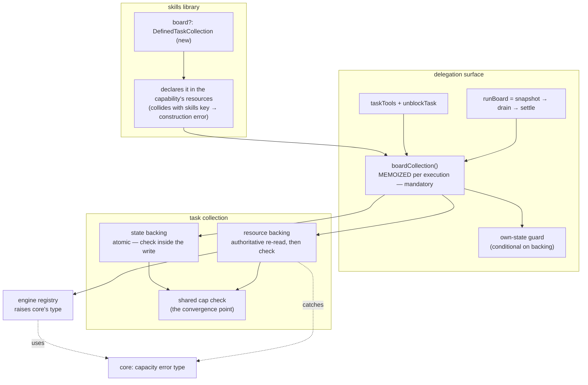

# FIX-957: Make the delegation board survive a turn — turn-scoped settle, in-turn parking dead ends, and cap enforcement across backings — Implementation Spec

> **Linear:** [FIX-957](https://linear.app/fixpoint-labs/issue/FIX-957/make-the-delegation-board-survive-a-turn-turn-scoped-settle-in-turn)
> **Epic:** [FIX-930](https://linear.app/fixpoint-labs/issue/FIX-930/delegation-substrate-host-model-roster-and-identity-and-worker-context) — delegation substrate
> **Category:** Bug → implementation follows `diagnose`

---

## For reviewers — what this document is

This is a **direction document**, not an implementation. Reviewing it well means answering one question: **is this the right approach?**

**In scope to challenge:** the problem framing, the approach, any numbered **Decision** in §6 (that's the sign-off surface), missing constraints that would *invalidate* the design, and scope.

**Out of scope — owned by the implementing agent:** names, signatures, file paths, module layout, local structure, error-message wording, micro-optimizations, test names.

Feedback in the second list is welcome and gets **recorded verbatim in §13** (BP-040). It will not be argued with and will not be folded into the design prose. One mention is enough.

**Two decisions in §6 are explicitly deferred to the repo owner and are not made here** — Decision 4 (reversing FIX-953's signed-off Decision 5c) and Decision 8 (sequencing FIX-960 ahead of this work). Both carry a recommendation; neither is enacted without sign-off.

---

## Part I — The Case *(for the human)*

### 1. Problem — why it matters, why now

**In plain language.** When a skill delegates work to a team of agents, the framework hands it a *board* — a to-do list its coordinator plans on and then runs. Today that board is erased at the end of every user turn. Ask a follow-up question and the coordinator starts from an empty list, with no way to reach the work it planned a minute ago.

That's a real limit, but it isn't the whole problem. The framework *already knows how* to keep a board alive across turns — `defineTaskCollection({ id, scope })` ships today, is documented for exactly this, and works when you build a board by hand in code. The delegation path just can't reach it: it is hardwired to the disposable option. So this is not a missing capability. It's an existing capability that one caller can't ask for.

**Why now.** Two of the delegation surface's own tool descriptions promise something the disposable board cannot deliver. `blockTask` says "block a task pending an external condition," and the `awaiting_review` status implies a human will look at the task later. The conditions those names evoke — a person answers, a rate limit resets, a fact arrives — all resolve *after* the turn ends, which is precisely when the board no longer exists. We are advertising cross-turn parking on a substrate that erases itself. Anyone building a delegating skill today is being pointed at a dead end.

There is also a live correctness hazard sitting behind the switch. Four things in the current code assume the board is disposable, and each one turns into a defect the moment it isn't. Flipping the scope without fixing them first would ship a board that survives *and* misreports, *and* is unbounded. That's why this issue is larger than a config field.

### 2. Solution in plain terms

Let the delegation board be given a durable home, and fix the four things that currently assume it doesn't have one.

The configuration itself is deliberately small. The skills library gains **one** option that accepts the collection `defineTaskCollection` already produces. Omit it and you get exactly today's behavior — a private, per-turn board — unchanged. Pass one and the same board lives at session, user, or org scope, with no new durability machinery invented anywhere.

The four fixes are where the actual work is:

1. **Report on the work this run actually engaged.** `runBoard` currently reports on every task the board has ever held. Once tasks survive, one parked task from last Tuesday makes every future run report "blocked" forever, and the coordinator is handed a growing pile of finished work it didn't ask about.
2. **Enforce the creation limits on the durable backing.** The two guards that bound runaway delegation are enforced only on the disposable backing. Turning durability on today would quietly remove the ceiling at the exact moment it starts mattering most.
3. **Make the storage-capacity limit answerable instead of fatal.** A durable board can hit a retention limit that currently throws a raw error straight through the model's tool boundary, where every other refusal on this surface is a readable result.
4. **Give a parked task a way out.** A task blocked mid-run has exactly one exit today: cancel it. Cancelling mints a new id if the coordinator re-adds the work, and anything that depended on the original silently becomes unrunnable forever.

**The philosophy that led here.**

- **Tenet 2 (composition over features, refine don't accrete).** The strongest thing about this change is what it *doesn't* add. `defineTaskCollection` already solves durable boards; the delegation surface just couldn't reach it. Wiring the existing primitive in beats inventing board persistence a second time, and it keeps one definition of "a durable board" rather than two that drift.
- **Tenet 5 (fix at the owning layer — find where paths converge).** The creation caps are an invariant with several writers: the coordinator's tools, a fan-out worker's tools, the drain, and internal batch callers. Today the guard sits in one backing's write path, so the other backing's writers walk past it. The fix moves the check to where every writer on both backings converges, rather than adding a second copy.
- **Tenet 3 (earn every addition).** One new library option; no new field on the shared task schema; and the justification paragraph that exists only to explain why caps *can't* apply to the durable backing gets deleted in the same change.

### 3. Tradeoffs & alternatives

**The simpler approach considered: just flip the backing and ship it.** Genuinely tempting — the durable primitive exists, and the wiring is a few lines. It's insufficient because each of the four blockers is a defect that only *appears* once the board survives, and three of them are silent. A board that reports "blocked" forever, or that has lost its runaway ceiling, is worse than one that forgets. The config change is the small part; it is not shippable alone.

**Alternative rejected — a `boardScope: "turn" | "session" | "user" | "org"` enum on the library.** More ergonomic on the surface (one word, no second import) and it was the obvious first shape. Rejected because it invents a parallel scope vocabulary beside `defineTaskCollection`'s, which means two ways to say "a durable task board" and two places for the definition to drift. Accepting the defined collection reuses the existing noun and stays honest that a durable board is a storage commitment, not a flag. If demand shows up for the shorthand later, it can be sugar over the same option.

**Alternative rejected — scoping the run's report by *which turn created each task*.** This was the first draft's approach and it is wrong. A task created in turn 1, unblocked and completed in turn 2, is neither "created this turn" nor "still unfinished" — so it would be dropped from turn 2's report, silently withholding the worker output for the one task turn 2 actually ran. That is the exact scenario this whole feature exists for. It would also have changed what today's per-turn board returns unless every default board stamped its tasks too. The replacement — report on the tasks *this run engaged* — is both correct and strictly smaller: no new field on the shared task schema, and no migration for already-persisted rows.

**Alternative rejected — adapt the durable collection to look like the disposable one.** This would have let one code path serve both and made the cap work trivial. It is not possible, and the reason is structural rather than effort: the disposable backing is a single atomic value, the durable one is many independently-written keys. Synthesizing the former from the latter needs a multi-key transaction the resource registry has no verb for, and it would regress the per-key write granularity that makes task claiming safe under concurrency. This was verified during the issue's architectural audit and is settled, not open.

**Where the genuine complexity is.** The cap check on the durable backing. On the disposable backing the check lives *inside* the atomic write, so a burst of concurrent adds serializes and lands exactly the cap's worth. The durable backing has no such write — it creates one key per task, and its read view is a mirror hydrated once when the collection reference is built, which by documented design never learns about tasks another reference inserted afterwards.

That last property is what makes a naive check unsafe in a way worth stating plainly: it is **not** a narrow race. Two long-lived references over a `user`- or `org`-scoped board can each admit up to the entire remaining budget without ever seeing the other's inserts, so the overshoot grows with the number of concurrent writers rather than staying within a few tasks. So the check reads authoritatively from the collection immediately before it decides, leaving only the decide-then-write instant racy. That restores a small, bounded overshoot, and it is a per-batch cost rather than per-task.

The second complexity is that the durable backing's hydration cost makes caching mandatory rather than optional, which in turn interacts with that same staleness. See Decision 3 and §12.

### 4. Focus practices

1. **Find the convergence point before writing the guard (tenet 5).** The cap invariant has writers on both backings: the coordinator's `addTask`, a fan-out worker's board-bound tools, the drain, and internal batch callers (seed, replan). Enumerate them and put the check where all of them pass through. A cap enforced at one entry point is the most expensive review class we have — the reviewer ends up finding the other writers.
2. **A durable board's rows outlive the deploy that wrote them (BP-030).** Once tasks persist at session/user/org scope, the stored task envelope becomes a real migration surface it never was when the board died every turn. Any change to that envelope must dual-read the old shape and `== null`-guard new optional fields. This spec deliberately adds no new field, which is the cheapest way to honor this — keep it that way unless something forces otherwise.
3. **Test the off state of the new option (BP-035).** The default path — no durable collection supplied — is the one every existing consumer is on, and it must be bit-for-bit unchanged, **including exactly which tasks `runBoard` returns**. Every behavior added here needs a test proving it is inert when the board is per-turn.
4. **A refusal the model can act on is a result, not a throw.** This surface's established contract is `{ ok: false, error }` with enough detail to recover. Any new refusal (capacity, a guarded unblock) joins that contract; nothing new throws through the tool boundary.
5. **Don't re-derive the audit (tenet 1).** The issue body carries an architectural audit already verified against `main`, including one finding that was wrong, corrected, and re-verified. Treat it as established. In particular: `maxInstances` is a live-capacity limit, not a lifetime ceiling, and `SkillsLibraryOptions.scope` scopes the *skills* collection, not the board. Both have already cost a cycle.

### 5. What using it looks like

**Today — unchanged, and still the default.** A delegating skill gets a private per-turn board with no configuration at all:

```ts
const skills = createSkillsLibrary({ collection: "skills", catalog });
// Coordinator plans with addTask, runs with runBoard. Board is erased at turn end.
```

**New — a board that survives the conversation.** One import, one option:

```ts
const delegationBoard = defineTaskCollection({ id: "delegation-board", scope: "session" });

const skills = createSkillsLibrary({
  collection: "skills",
  catalog,
  board: delegationBoard,        // ← the only new surface
});
```

Turn 1 plans three tasks and drains two; turn 2 resumes the third:

```
turn 1:  addTask("research")  → { ok: true, taskId: "t1" }
         addTask("draft")     → { ok: true, taskId: "t2" }
         addTask("review")    → { ok: true, taskId: "t3" }   // blocked on a human
         runBoard()           → { status: "blocked", tasks: [t1 completed, t2 completed, t3 blocked] }

turn 2:  unblockTask("t3")    → { ok: true }
         runBoard()           → { status: "drained", tasks: [t3 completed] }
                                 └─ t3 was unfinished when this run started, so it is
                                    this run's business and its output comes back.
                                    t1/t2 were already finished — not re-reported.
```

The second `runBoard` is the point of the whole change. Today turn 2's board is empty and `t3` is unreachable. With a naive durable board, turn 2 would report `blocked` (poisoned by `t3`) and hand back all three tasks including two the coordinator already consumed.

**New — a parked task's exit.** `unblockTask` returns a task to `pending` without minting a new id, so dependents survive:

```
blockTask("t3", "waiting on the customer's answer")   → { ok: true }
unblockTask("t3")                                      → { ok: true }
// t4 declared deps: ["t3"] — still runnable. Cancel-and-re-add would have
// stranded t4 permanently, with no error surfaced.
```

**New — capacity is answerable.** A durable board at its retention limit returns a result instead of throwing:

```
addTask({ goal: "…" })  → { ok: false, error: "board_at_capacity" }
```

### 6. Decisions & rules — the sign-off surface

1. **The delegation board's home is configurable through one library option that accepts a `defineTaskCollection` result; omitting it is today's per-turn board, unchanged.** The library also declares the supplied collection as one of its resources, since nothing else will.
   *Alternative rejected:* a `boardScope` enum on the library.
   *Ramification:* one new option, no new durability mechanism, and one definition of "durable task board" shared with the code-first path. Costs the caller one extra line and one import. A board id equal to the skills collection key is a construction-time error rather than a silent overwrite of one resource by the other.

2. **`runBoard` reports on the tasks this run engaged — those unfinished when the drain started, plus any created during it — captured as a snapshot inside `runBoard` before the drain. The verdict stays "any unfinished task ⇒ blocked."**
   *Alternative rejected:* scoping by which turn created each task. It drops a carried-over task that this run actually completed, which is the one scenario the feature exists for, and it would have required stamping every task (including on the default path) to avoid changing today's behavior.
   *Ramification:* finished work from earlier runs is not re-reported, so the coordinator's context doesn't grow without bound; work this run genuinely touched always comes back with its output. A still-stuck task reports `blocked` on every later run, which is correct and is now escapable via Decision 5. **No new task-schema field and no migration for persisted rows.** On the default per-turn board every task is unfinished at drain start, so the returned set is identical to today's by construction.

3. **The creation caps move to one backing-agnostic check that both backings call; the durable backing accepts cap options like the other one does, and reads an authoritative count from the collection immediately before each check.**
   *Alternative rejected:* a second copy of the check; also rejected, keeping the type-level ban on caps for that backing; also rejected, checking against the hydrated mirror alone.
   *Ramification:* the paragraph justifying why caps can't apply to the durable backing is deleted rather than amended. The mirror-only check was unsafe in a way that scales — separate long-lived references each admit the full remaining budget without seeing each other — so the authoritative re-read is what keeps overshoot bounded to the decide-then-write instant. Costs one extra collection read per batch add, on the durable backing only. Cap breaches are evaluated for a whole batch before anything is written, so a cap never lands half a batch on either backing; a store failure mid-batch still can, and that residual difference is documented rather than papered over with rollback machinery.

4. **⚠️ OWNER DECISION — whether to guard the `in_progress` / `awaiting_review` → `pending` transition. Not decided here.** Guarding it reverses FIX-953's signed-off Decision 5c ("`unblockTask` is a thin wrapper… no status precondition of its own"), so it needs the same sign-off weight that decision got. Two options:
   - **(A) Re-affirm 5c.** `unblockTask` stays a thin wrapper; the transition stays permissive. Cheapest, consistent with the record.
   - **(B) Guard it.** The unblock path refuses `in_progress` and `awaiting_review` sources.

   *Recommendation: (B).* 5c's stated reasoning was that no coordinator tool reaches `awaiting_review` today. That premise is weaker now: a fan-out worker holding board tools mid-drain is a real, reachable writer, and it can move a running task back to `pending` — manufacturing exactly the drain-containment failure FIX-951 exists to contain.
   *Ramification either way:* (B) closes a model-reachable path to a known drain failure and costs one refusal the coordinator may hit legitimately. (A) leaves it open and keeps the signed-off record intact.

5. **`unblockTask` ships in this issue, re-grounded on the two arguments that survive independent of turns, and is built in parallel rather than gating the durability work.** Those arguments are the mid-drain fan-out exit (a task blocked inside a drain otherwise has only `cancelTask`) and dependency corruption (cancel-and-re-add mints a new id; `deps` resolve by id and require `completed`, so every dependent becomes permanently unrunnable with no error surfaced).
   *Alternative rejected:* implementing FIX-953's spec as written, whose primary argument was a cross-turn case that didn't exist. Also rejected: moving the tool back out to FIX-953 — it landed here only because FIX-953 was closed as a duplicate, and moving it back invites it to be lost a second time, which has already happened once.
   *Ramification:* the coordinator gains a ninth task tool. Because it isn't a durability prerequisite, nothing in the durability path waits on it or on Decision 4.

6. **The storage-capacity limit becomes a typed, narrowable error whose type lives in `core`, mapped to its own soft code (`board_at_capacity`), and the three ceilings get a stated precedence.** Precedence: the two task-layer creation caps are checked first and bind first; the storage-retention limit is a distinct, lower-level refusal reported under its own code. A caller who sets retention below the task caps gets the retention refusal, and the message names which ceiling bound.
   *Alternative rejected:* putting the type in `@flow-state-dev/engine` — orchestration has engine only as a dev dependency and its layering is `core → orchestration → patterns`, so catching an engine-exported class at runtime would need either an undeclared runtime dependency or a layering inversion. Also rejected: message matching from the orchestration side, and reusing the total-cap code.
   *Ramification:* a small addition to `core`, which both packages already depend on, so no layering change. On a board using the delegation defaults the task caps usually bind first and this path is rare — it exists for the caller who sets retention deliberately, and for the honesty of not throwing a raw error at the model boundary, which is the defect the issue names.

7. **Tool descriptions and delegation docs state the board's real lifetime, and say it depends on how the board was configured. Documentation ships inside the PR that introduces each surface, not as a trailing docs PR.**
   *Alternative rejected:* correcting the descriptions to today's boundary as a separate early fix and again later; also rejected, a trailing docs-only sub-PR, which contradicts the repo's own rule that user-facing changes are documented in the same change set.
   *Ramification:* one description change instead of two, and no window where a shipped surface is undocumented. FIX-958 separately fixes the code comments that wrongly claim the ledger already survives.

8. **⚠️ OWNER DECISION — sequencing FIX-960 (rename the `sequencer` backing to `state`) ahead of this work. Not enacted here.**
   *Recommendation: yes, land FIX-960 first as a standalone mechanical rename.* It touches the same files this spec's cap work rewrites, it is a pure no-op rename with a mechanical review, and both changes delete the same justification paragraph for different reasons — landing them together makes that deletion ambiguous and buries three lines of real semantics in a ~22-call-site diff. *Ramification:* adds a short serial dependency on a small PR. If FIX-960 slips more than a day, unblock this and absorb the rename later.

**Non-goals.** Not building: durable non-sequencer *block* state (FIX-917's deferred follow-up — a different failure mode); detached/background jobs that run outside any request (FIX-939); a spend/cost ceiling (FIX-933 owns spend, and a row count is the wrong noun for it); a `pending`-subset bound derived from the resource registry (it has no notion of task status); retry-storm accounting (FIX-948 — see §12); FIX-950's soft-error contract.

**Size estimate: Large** (multi-PR, >500 LOC across `core`, `orchestration`, `engine`, and docs). **PR plan shape** (the detail is in §8): four sub-PRs. Three are independent and build in parallel — the shared cap check, the run's working set, and the `unblockTask` tool. The configurable board depends on the first two, because shipping durability before them means shipping an uncapped board with a poisoned report. Docs ship inside each PR.

---

## Part II — The Build Plan *(for the implementing agent)*

### 7. Technical design

Four packages are involved. **`core`** gains the shared, narrowable capacity-error type (it is the only package both of the others already depend on at runtime). The **task collection** layer (`@flow-state-dev/orchestration`, `tasks/collection/`) owns storage backings and the creation caps. The **delegation surface** layer (`orchestration`, `skills/`) owns the board's construction, the tools, and the drain. The **resource registry** (`@flow-state-dev/engine`) raises the capacity limit using `core`'s type.



**The board's home becomes a branch, not a constant.** Today the delegation surface builds its collection with a hardcoded state backing against the host generator's own state. It becomes: a supplied durable collection selects the resource backing; its absence keeps the state backing exactly as today.

Three consequences follow, and the third is easy to miss:

- The surface's early bail-out when the host generator has no own state must only fire on the state-backed branch — under a durable board the host's own state is irrelevant.
- The resolver handed to fan-out workers already flows from this one construction site (`boardTaskTools`, threaded through the worker materializers in both `orchestration` and `workforce`), so those call sites need **no change** — they inherit the configured backing for free.
- **The supplied collection must be declared as a resource, or it cannot be resolved.** `taskBoard` does register a `DefinedTaskCollection` handed to it directly — it builds an internal resource-declaring capability keyed on the collection id. But the delegation surface does not use that path: it passes `collection: () => boardCollection()`, a *factory*, which takes `taskBoard`'s factory branch and registers nothing. Meanwhile the skills library declares only its skills collection in its capability's resources. So a `board` option added without a matching resource declaration leaves the lookup empty at runtime. The library must declare it alongside the skills collection, and reject at construction when the board id equals the skills collection key rather than letting one silently overwrite the other in the same record.

> **Correction to the issue's framing, worth stating because it reduces scope.** The issue lists `defaultOwnStateResolver` returning `undefined` under non-own-state backing as a blocker "also hit via `worker-materializer.ts` and `workforce/src/materialize-agent.ts`." Reading those two sites: both already prefer the injected board capability and fall back to the own-state singleton only when none was supplied — which is correct for a standalone, boardless consumer. So `defaultOwnStateResolver` stays own-state-only and needs no change.

**Caching the resolved collection is mandatory, not an optimization.** `getOrCreateTaskCollection` never caches — every call builds a fresh reference, and on the resource branch each construction awaits a full collection listing to hydrate its mirror. `boardCollection()` is reached from many distinct places per turn: each of the flat task tools, each fan-out worker's board-bound capability, the board capability's accessor, the drain's per-worker resolution, and settle. Without a per-execution memo the durable branch pays a listing at each of them. The memo must be shared by all of those, or it only partly binds.

> One precision, because a reviewer stated the mechanism slightly too strongly: the drain's idle-wait path does *not* re-resolve on every worker-loop iteration — it caches the collection in a per-worker cell after the first resolve. The multiplicity comes from the number of distinct resolve *sites* listed above, not from loop iterations. The conclusion is unchanged.

**The run's working set replaces the turn stamp.** `runBoard` is already a sequencer (`drain` → `settle`). It gains a step before the drain that records which task ids exist and which of them are unfinished. Settle then reports on: the ids that were unfinished at that moment, plus any id present now that wasn't in the snapshot (created during the drain). The verdict is computed over unfinished tasks in that set, exactly as today.

This needs no field on the task schema, no stamping, and no migration — the snapshot is taken in-request and consumed in the same run. On the default per-turn board the board is fresh, so every task is unfinished at snapshot time and the returned set is today's set by construction.

> **Illustrative — a sketch, not the contract.**
> ```ts
> // before drain: { ids: Set<string>, unfinished: Set<string> }
> // at settle:    working = snapshot.unfinished ∪ (currentIds − snapshot.ids)
> //               verdict = working.some(unfinished) ? "blocked" : "drained"
> ```

**The cap check is lifted, not copied.** It currently lives inside the state backing's atomic write. It moves to the caps module — already the module that owns cap types, defaults, validation, and the typed breach — and both backings call it. The state backing keeps calling it from inside its write (unchanged semantics, still atomic and all-or-nothing). The resource backing refreshes an authoritative view from the collection, then evaluates the whole batch at once, then creates. The backing spec for resource collections starts extending the cap options, and the comment explaining why it deliberately doesn't is deleted.

**Capacity errors get a type in `core`.** The registry raises `core`'s narrowable type instead of a plain `Error`; the resource backing catches it and re-raises it as the collection layer's typed cap breach with a distinct kind; the tool boundary maps that kind to `board_at_capacity`. `core` is chosen because orchestration depends on it at runtime and on engine only for tests.

### 8. Implementation sequence

**PR plan.**

| sub-PR | deliverables | depends_on |
|---|---|---|
| a | Shared cap check lifted into the caps module; resource backing enforces both caps with an authoritative pre-check re-read; resource backing spec accepts cap options; batch evaluated whole so a cap never lands a partial batch; obsolete justification comment removed; ceiling precedence. Capacity error type in `core`, raised by the engine registry, re-raised as a typed cap breach, mapped to `board_at_capacity`. **Plus the docs for all of it.** | — (see Decision 8) |
| b | `runBoard` pre-drain snapshot; settle reports the run's working set; verdict unchanged. **Plus docs.** | — |
| c | `unblockTask` tool; the unblock guard per **Decision 4's outcome** (do not build the guard until the owner has chosen A or B). **Plus docs.** | — |
| d | The `board` option on the skills library; **resource declaration and the id-collision error**; backing branch at the construction site; own-state guard made conditional; mandatory shared memo for `boardCollection()`. **Plus docs.** | a, b |

`a`, `b`, `c` are independent and build in parallel. `d` is the integration point and must not land before `a` and `b` — that ordering is the whole reason this is sequenced rather than one PR. `d` does **not** wait on `c`: `unblockTask` is not a durability prerequisite. Branches follow `fix/FIX-957-<id>`; dependents branch off their dependency.

**Within each sub-PR.**

*a — caps.* Move the check to the caps module with no behavior change and confirm the state backing's tests still pass (this is the safety net for the lift). Then wire the resource backing to call it, with the authoritative re-read, batch-first. Then `core`'s capacity type, the engine raise, and the mapping. Test after each: the lift is a no-op; the resource backing refuses past both caps; a batch crossing a cap inserts nothing; capacity returns a result rather than throwing; the precedence holds when retention sits below the task caps.

*b — the working set.* Add the pre-drain snapshot step and the settle partition together — they're one behavior. Test: a carried-over task completed by this run comes back with its output; a task finished before this run does not; a task added mid-drain does; the verdict reflects only the working set; the default per-turn board's returned set is unchanged.

*c — unblockTask.* The tool, its soft-error contract, and the dependency-preservation behavior (the id is stable, so dependents stay runnable). The guard is gated on Decision 4 — **if the owner picks (A), the guard is not built and this PR is smaller.**

*d — the option.* The library option, the resource declaration, the collision error, the backing branch, the conditional guard, the memo. Test the off state hardest (BP-035): with no `board` supplied, every behavior above must be inert and today's path bit-for-bit unchanged.

**Removals** (tenet 3): the comment justifying caps-only-on-one-backing; the type-level ban on cap options for the resource backing; the cap check's old home inside the state backing (moved, not duplicated).

### 9. Edge cases & error handling

| Case | Expected behavior |
|---|---|
| No `board` option supplied (the default) | Identical to today in every respect — per-turn own-state board, same caps, same guard, and the **same set of tasks returned by `runBoard`**. This is the regression surface that matters most. |
| Carried-over task unblocked and completed by this run | Returned with its output, and does not set `blocked`. This is the §5 scenario and the goal check. |
| Task finished by an earlier run, untouched by this one | Not returned. Keeps the coordinator's context bounded. |
| Task created mid-drain by a fan-out worker | In the working set (present now, absent from the snapshot), so it is reported and counts toward the verdict. |
| Durable board, earlier run left a task `blocked`, still blocked | In the working set; sets `blocked`. Correct, and escapable via `unblockTask` / `cancelTask`. |
| Two long-lived references adding concurrently near a cap | The authoritative re-read means each sees the other's committed inserts; overshoot is bounded to the decide-then-write instant, not to the full remaining budget per reference. Must be exercised with fan-out workers sharing the board capability, not two direct `addTask` calls on one reference. |
| Batch add crossing a cap | Nothing inserted, on both backings. Typed cap breach → soft error. |
| Batch add hitting a store failure mid-batch, resource backing | A prefix may land. Documented residual difference; no rollback machinery. |
| Retention limit below the task caps | Retention refusal (`board_at_capacity`), and the message names which ceiling bound. |
| `board` id equals the skills collection key | Construction-time error, not a silent overwrite. |
| Own-state guard, durable board configured, host generator has no own state | Surface installs normally — the guard must not fire. This is the bug the conditional fixes. |
| Hand-wired `taskTools` (no skills binding) | Unchanged: own-state, uncapped, no roster. Explicitly out of scope. |

**Second-path checklist (BP-035).** *Legacy:* the persisted task envelope is a migration surface now that rows outlive deploys; this spec adds no field to it, which is the cheapest way to stay safe. *Null boundary:* the board option and the capacity error are optional/absent by default; guard each. *Concurrency:* the bounded overshoot above, plus the memo/staleness interaction in §12. *Multi-tenant:* a durable board at `user` or `org` scope is shared across sessions by construction — the caller's explicit choice, with `session` documented as the conservative default. *Cost observability:* more surviving tasks means more context replayed, which is exactly what Decision 2's working set bounds. *Flag off-state:* covered above and the hardest test target.

### 10. Testing strategy

**Discipline: `diagnose`** (Linear category: Bug). The feedback loop is vitest at the collection and surface seams — `packages/orchestration/src/tasks/collection/tests/` and the skills/delegation tests already exercise these paths including cap behavior, so the reproduction can be written before the fix in each sub-PR.

**Goal check (real path, real model).** A delegating skill configured with a session-scoped board, run over two turns through `fsdev run`: turn 1 plans three tasks, drains two, leaves one blocked; turn 2 unblocks and drains it. Passes when turn 2's `runBoard` reports `drained`, returns `t3` *with its worker output*, and the task id from turn 1 still resolves.

**Required: a mocked two-turn flow-integration scenario.** The cross-request contract must not rest on a manual real-model run — a unit test at the surface seam cannot catch a missing resource declaration or request-to-request composition, which are exactly the two failure modes sub-PR `d` introduces. Drive two actions against shared stores and one session id: turn 1 blocks a task, turn 2 unblocks and drains the same task, asserting the id resolves across the boundary and the output comes back.

**Required: a hydration call-count assertion.** Assert the number of collection listings per execution on the resource branch. A BP-035 off-state test passes whether or not the memo actually binds on the durable path, so without a call-count assertion the memo is untested — the test would prove it exists, not that it works.

**Other CI specs, in observable terms.** Default path returns the same task set with no `board` supplied. Caps refuse past both bounds on the resource backing. A cap-crossing batch inserts nothing on both backings. Capacity returns `board_at_capacity` rather than throwing, and precedence holds when retention sits below the task caps. Settle: carried-over-and-completed returned with output; finished-before-this-run omitted; added-mid-drain included; verdict from the working set only. `unblockTask` returns a blocked task to `pending` with a stable id and dependents still runnable. The own-state guard does not fire under a durable board. Board-id collision throws at construction. Per Decision 4(B) if chosen: the unblock path refuses `in_progress` / `awaiting_review`.

Tests must encode *why* (tenet 7 / CLAUDE.md §5) — e.g. the carried-over test asserts the output comes back *because* withholding it is what made the first draft's rule wrong, not merely that a filter has a particular shape.

### 11. Documentation plan

Docs changes are required: this adds a public option, a new tool, and a new soft error, and it makes an existing documented statement about board lifetime conditional. **Per Decision 7, each row ships in the sub-PR that introduces its surface** (last column).

| File | Action | Content | PR |
|---|---|---|---|
| `apps/docs/docs/skills/delegation.md` | EXTEND | The "own-state by default" statement (~line 51) becomes conditional; new subsection on giving the board a durable home with the §5 example and `session` as the conservative choice. Bounds subsection (~74–110) gains the durable backing being bounded, the ceiling precedence, and `board_at_capacity`. Tool table (~line 172) gains `unblockTask`. | d (board), a (bounds), c (tool) |
| `apps/docs/docs/orchestration/task-board.md` | EXTEND | "Durable boards that survive across turns" (~line 362) cross-links the delegation surface. "Bounding how much work a board takes on" (~225) and "Where the bounds apply" (~274) updated. **"How long the counts last" (~239) documents the old asymmetry and must be rewritten, not appended to.** | a, d |
| `apps/docs/docs/orchestration/task-substrate.md` | EXTEND | Per Decision 4's outcome, any change to the unblock transition. No task-schema change to document — the working set needs no new field. | c |
| `apps/docs/guides/board-lifecycle.md` | EXTEND | Correct any statement that a board's life ends with the turn. | d |
| `packages/orchestration/README.md` | EXTEND | The new library option, `unblockTask`, the new soft error (BP-009). | a, c, d |
| `packages/core/README.md` | EXTEND | The capacity error type now exported from core. | a |
| `docs/architecture/state-and-scopes.md` | EXTEND | Note the delegation board no longer necessarily rides block state — without claiming block state itself became durable, which it did not. | d |
| `.changeset/*.md` | CREATE | User-facing (BP-022). Pre-1.0 → `minor`. One per sub-PR. | a, b, c, d |

**No new pages.** Every affected concept has an existing home, and the guidance is to prefer extending.

**Cross-links.** `skills/delegation.md` → `orchestration/task-board.md`'s durable-boards section and `orchestration/task-substrate.md`. `task-board.md`'s durable-boards section → back to `skills/delegation.md`.

**Voice risks** (`CLAUDE.md` → Writing Style): this topic pulls hard toward em-dashes when contrasting per-turn against durable — restructure instead. Avoid "powerful" / "seamless". Introduce "board", "turn", and "scope" in plain terms on first use. **No issue or PR numbers anywhere under `apps/docs/`** — this spec's whole vocabulary is FIX-numbered and it will leak if not watched.

### 12. Dependencies, open questions & follow-ups

**Dependencies.** No blocking PR: no open PR touches `packages/orchestration/src/tasks/` or `skills/` (PR #866 is FIX-917's *spec*, a different failure mode; PR #873 is the delegation-substrate epic). The one proposed sequencing dependency is **FIX-960**, which is Decision 8 and is the owner's call.

**Open questions needing a decision before implementation.**

1. **Decision 4 — guard the `in_progress` / `awaiting_review` → `pending` transition?** Reverses FIX-953's signed-off Decision 5c. Recommendation (B), guard it. Blocks finishing sub-PR `c`, not starting it, and blocks nothing else.
2. **Decision 8 — sequence FIX-960 first?** Recommendation: yes. Affects when sub-PR `a` starts, nothing else.

*(A third question in the first draft — whether the turn stamp should be a task field or metadata — is dissolved: Decision 2 no longer needs a stamp.)*

**Follow-ups (flagged, not built).**

- **Memoization and FIX-939's staleness are one decision, not two.** The memo is *forced* by hydration cost, and its consequence is that a memoized reference at `user`/`org` scope will not observe another concurrent session's writes until the next turn. The caching this spec requires and the cross-worker visibility gap FIX-939 owns are the same tradeoff seen from two ends, and should be resolved together there rather than patched here.
- **FIX-948 (retry storms invisible to the creation caps) — recommend NOT absorbing.** Different axis: this spec asks "does this backing enforce creation caps at all," FIX-948 asks "should re-entry count against them." FIX-931 already analysed and rejected re-entry enforcement for a recorded reason (it would require parking retried tasks in a status the drain treats as unresolved), so reopening it carries its own sign-off weight — the same care Decision 4 is getting. FIX-948's own issue notes FIX-933 (spend) may subsume it. **What this spec owes it is one sentence, not a merge:** the new resource-backing enforcement is creation-time-only, exactly like the state backing, so FIX-948's gap is identical on both backings and is neither widened nor narrowed here. That sentence belongs in the caps module docs.
- **`addTask` exposes no `maxAttempts`,** so a delegation board never carries retry budget and `failTask` on a parked task always attempts an illegal transition. `unblockTask` is the exit this spec ships; whether the coordinator should also set a retry budget is a separate surface-widening question worth its own issue.
- **Deepening opportunity:** the delegation surface's `buildTools` is doing a lot — guard, caps, collection construction, roster, worker registry, two task-tool shapes. It reads as a function that has accreted responsibilities rather than one seam. Not in scope; a candidate for `improve-codebase-architecture` once this lands.

### 13. Review notes for the implementer

*Inputs, not instructions. Weigh each against real code; adopt, adapt, or discard — no justification owed for discarding one.*

- "The audit's `resource-registry.ts` path may be stale — enforcement appears to be asserted on the collection-ref/store path per `engine/test/resource-collection.test.ts`." — cursor ([#954](https://github.com/fixpoint-labs/flow-state-dev/pull/954))
- "Removing the type-level cap ban must flip the `@ts-expect-error` in `task-caps.type-test.ts`." — cursor ([#954](https://github.com/fixpoint-labs/flow-state-dev/pull/954)) *(Spot-checked: present at `task-caps.type-test.ts:58`, and the file's own header notes that adding `TaskCapOptions` to `ResourceBackingSpec` makes it report "unused" — so this is a build-breaking consequence, not a cosmetic one.)*
- "The advisory-overshoot test should exercise fan-out workers sharing `boardTaskTools` rather than two direct `addTask` calls." — cursor ([#954](https://github.com/fixpoint-labs/flow-state-dev/pull/954)) *(Also promoted into §9's edge-case row, since it changes what the test proves.)*

---

## Spec evolution

- **Spec drafted** — framed the problem as "an existing durability primitive the delegation path can't reach" rather than "build board persistence," so the fix reuses `defineTaskCollection` instead of inventing a second mechanism; settled the four blockers (turn-scoped settle, cross-backing caps, typed capacity error, a parked task's exit), accepted advisory rather than atomic cap enforcement on the durable backing as a deliberate weaker guarantee, and split the work into five sub-PRs with three building in parallel. Left two calls to the owner rather than deciding them: reversing FIX-953's Decision 5c, and sequencing FIX-960 first. Recommended not absorbing FIX-948, with the one sentence this spec owes it.
- **After spec review** — replaced the turn-stamp rule with "the tasks this run engaged," because two reviewers independently showed the stamp dropped a carried-over task the run had just completed (the one scenario the feature exists for) and would have changed the default path's output too; this also removed the task-schema field and its migration. Made the durable cap check re-read authoritatively before deciding, because the mirror-only check let overshoot scale with the number of writers rather than staying within a few tasks, which was the premise Decision 3 rested on. Moved the capacity error type to `core`, because orchestration has engine only as a dev dependency and catching an engine class at runtime would have inverted the layering. Added the resource declaration and id-collision rule to sub-PR `d`, because the supplied collection would otherwise be unresolvable at runtime. Folded docs into each feature PR and ungated `d` from `c`, dropping the plan to four sub-PRs.
