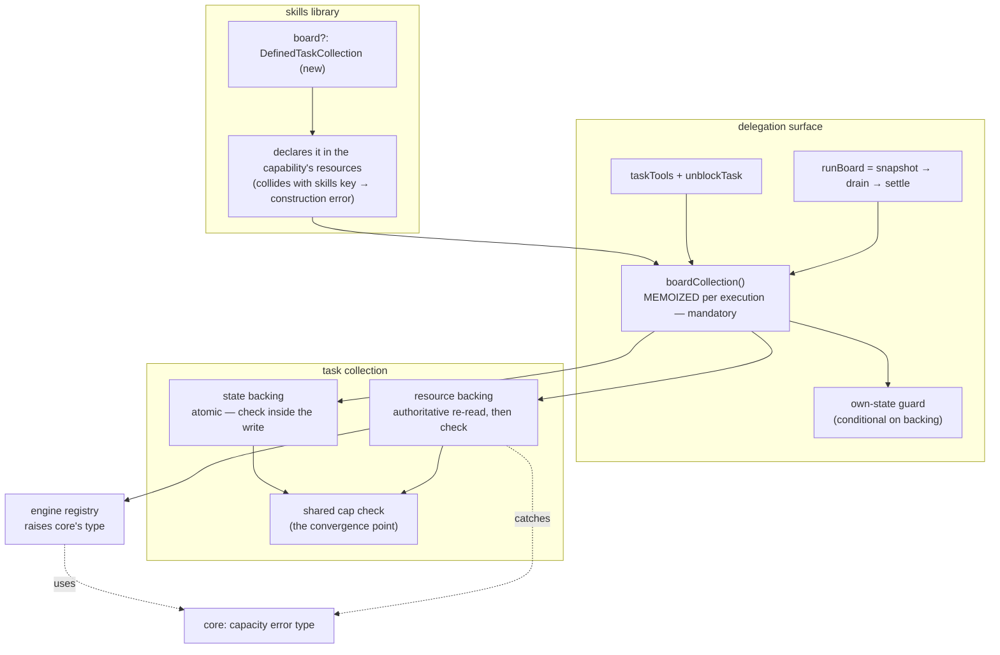

# FIX-957: Make the delegation board survive a turn — turn-scoped settle, in-turn parking dead ends, and cap enforcement across backings — Implementation Spec

> **Linear:** [FIX-957](https://linear.app/fixpoint-labs/issue/FIX-957/make-the-delegation-board-survive-a-turn-turn-scoped-settle-in-turn)
> **Epic:** [FIX-930](https://linear.app/fixpoint-labs/issue/FIX-930/delegation-substrate-host-model-roster-and-identity-and-worker-context) — delegation substrate
> **Category:** Bug → implementation follows `diagnose`

---

## For reviewers — what this document is

This is a **direction document**, not an implementation. Reviewing it well means answering one question: **is this the right approach?**

**In scope to challenge:** the problem framing, the approach, any numbered **Decision** in §6 (that's the sign-off surface), missing constraints that would *invalidate* the design, and scope.

**Out of scope — owned by the implementing agent:** names, signatures, file paths, module layout, local structure, error-message wording, micro-optimizations, test names.

Feedback in the second list is welcome and gets **recorded verbatim in §13** (BP-040). It will not be argued with and will not be folded into the design prose. One mention is enough.

**Two decisions in §6 are explicitly deferred to the repo owner and are not made here** — Decision 4 (reversing FIX-953's signed-off Decision 5c) and Decision 8 (sequencing FIX-960 ahead of this work). Both carry a recommendation; neither is enacted without sign-off.

---

## Part I — The Case *(for the human)*

### 1. Problem — why it matters, why now

**In plain language.** When a skill delegates work to a team of agents, the framework hands it a *board* — a to-do list its coordinator plans on and then runs. Today that board is erased at the end of every user turn. Ask a follow-up question and the coordinator starts from an empty list, with no way to reach the work it planned a minute ago.

That's a real limit, but it isn't the whole problem. The framework *already knows how* to keep a board alive across turns — `defineTaskCollection({ id, scope })` ships today, is documented for exactly this, and works when you build a board by hand in code. The delegation path just can't reach it: it is hardwired to the disposable option. So this is not a missing capability. It's an existing capability that one caller can't ask for.

**Why now.** Two of the delegation surface's own tool descriptions promise something the disposable board cannot deliver. `blockTask` says "block a task pending an external condition," and the `awaiting_review` status implies a human will look at the task later. The conditions those names evoke — a person answers, a rate limit resets, a fact arrives — all resolve *after* the turn ends, which is precisely when the board no longer exists. We are advertising cross-turn parking on a substrate that erases itself. Anyone building a delegating skill today is being pointed at a dead end.

There is also a live correctness hazard sitting behind the switch. Four things in the current code assume the board is disposable, and each one turns into a defect the moment it isn't. Flipping the scope without fixing them first would ship a board that survives *and* misreports, *and* is unbounded. That's why this issue is larger than a config field.

### 2. Solution in plain terms

Let the delegation board be given a durable home, and fix the four things that currently assume it doesn't have one.

The configuration itself is deliberately small. Each *binding* — one generator's use of the skills library — gains **one** option naming how long its board should live: `block` (today's behavior, the default) through `request`, `session`, `user`, `org`, plus an id for the durable values. The storage backing is derived from that answer rather than chosen, and the library builds and registers the collection. It mirrors the binding's existing `activeState` option exactly, which already asks a caller for a scope and a storage field for per-binding state. No new durability machinery is invented anywhere: the durable values resolve to the same `defineTaskCollection` primitive the code-first path already uses.

The four fixes are where the actual work is:

1. **Report on the work this run actually engaged.** `runBoard` currently reports on every task the board has ever held. Once tasks survive, one parked task from last Tuesday makes every future run report "blocked" forever, and the coordinator is handed a growing pile of finished work it didn't ask about.
2. **Enforce the creation limits on the durable backing.** The two guards that bound runaway delegation are enforced only on the disposable backing. Turning durability on today would quietly remove the ceiling at the exact moment it starts mattering most.
3. **Make the storage-capacity limit answerable instead of fatal.** A durable board can hit a retention limit that currently throws a raw error straight through the model's tool boundary, where every other refusal on this surface is a readable result.
4. **Give a parked task a way out.** A task blocked mid-run has exactly one exit today: cancel it. Cancelling mints a new id if the coordinator re-adds the work, and anything that depended on the original silently becomes unrunnable forever.

**The philosophy that led here.**

- **Tenet 2 (composition over features, refine don't accrete).** The strongest thing about this change is what it *doesn't* add. `defineTaskCollection` already solves durable boards; the delegation surface just couldn't reach it. Wiring the existing primitive in beats inventing board persistence a second time, and it keeps one definition of "a durable board" rather than two that drift.
- **Tenet 5 (fix at the owning layer — find where paths converge).** The creation caps are an invariant with several writers: the coordinator's tools, a fan-out worker's tools, the drain, and internal batch callers. Today the guard sits in one backing's write path, so the other backing's writers walk past it. The fix moves the check to where every writer on both backings converges, rather than adding a second copy.
- **Tenet 3 (earn every addition).** One new library option; no new field on the shared task schema; and the justification paragraph that exists only to explain why caps *can't* apply to the durable backing gets deleted in the same change.

### 3. Tradeoffs & alternatives

**The simpler approach considered: just flip the backing and ship it.** Genuinely tempting — the durable primitive exists, and the wiring is a few lines. It's insufficient because each of the four blockers is a defect that only *appears* once the board survives, and three of them are silent. A board that reports "blocked" forever, or that has lost its runaway ceiling, is worse than one that forgets. The config change is the small part; it is not shippable alone.

**Alternative rejected — accepting a `DefinedTaskCollection` as the option (this spec's first two drafts).** The stated reason for preferring it was that a lifetime enum would "invent a parallel scope vocabulary." That reason does not survive inspection, and the option lost on re-examination. The codebase already carries two vocabularies and neither is a lifetime: **backing** (`sequencer` / `request` / `resource`) names storage shape, and `ResourceScope` (`session` / `user` / `org`) names reach. `defineTaskCollection` already collapses both for the durable half. A lifetime axis doesn't add a third vocabulary — it finishes the one that exists, and it is the same insight FIX-960 is acting on internally (renaming `sequencer` → `state` precisely because that name describes storage rather than lifetime). See Decision 1 for the full comparison, including the two objections that survive and the defect the enum dissolves.

**Alternative rejected — scoping the run's report by *which turn created each task*.** This was the first draft's approach and it is wrong. A task created in turn 1, unblocked and completed in turn 2, is neither "created this turn" nor "still unfinished" — so it would be dropped from turn 2's report, silently withholding the worker output for the one task turn 2 actually ran. That is the exact scenario this whole feature exists for. It would also have changed what today's per-turn board returns unless every default board stamped its tasks too. The replacement — report on the tasks *this run engaged* — is both correct and strictly smaller: no new field on the shared task schema, and no migration for already-persisted rows.

**Alternative rejected — adapt the durable collection to look like the disposable one.** This would have let one code path serve both and made the cap work trivial. It is not possible, and the reason is structural rather than effort: the disposable backing is a single atomic value, the durable one is many independently-written keys. Synthesizing the former from the latter needs a multi-key transaction the resource registry has no verb for, and it would regress the per-key write granularity that makes task claiming safe under concurrency. This was verified during the issue's architectural audit and is settled, not open.

**Where the genuine complexity is.** The cap check on the durable backing. On the disposable backing the check lives *inside* the atomic write, so a burst of concurrent adds serializes and lands exactly the cap's worth. The durable backing has no such write — it creates one key per task, and its read view is a mirror hydrated once when the collection reference is built, which by documented design never learns about tasks another reference inserted afterwards.

That last property is what makes a naive check unsafe: a held reference never sees a sibling worker's inserts, so several fan-out workers in one drain can each admit the full remaining budget. Re-reading the collection at check time fixes that, because every reference in an execution reads the same live per-execution resource cache.

**But re-reading is not "authoritative," and it is worth being exact about what it buys.** The registry's eager `list()`/`count()` enumerate that per-execution cache; they never touch the store. The lazy variant loads once per prefix and then short-circuits. So the guarantee decomposes into three levels, and only the third is unfixable here:

- **Within one execution** (several fan-out workers, the drain, the coordinator's tools): the re-read sees every committed insert. Enforced.
- **Across sequential turns:** each execution loads the board's tasks from the store at start, so turn 2 sees turn 1's tasks and the lifetime ceiling binds. Enforced.
- **Across concurrently in-flight requests on the same board scope:** each execution loaded at its own start and neither sees the other. **Not enforced** — overshoot is bounded by the number of simultaneous requests, and no re-read can close it, because the registry offers no store-backed count and no multi-key atomic operation.

That third level is a real, permanent limit of the current substrate rather than something this spec can engineer around, so Decision 3 states it as a bounded guarantee instead of promising more. It matters most at `org` scope and least at `session` scope, which is the documented conservative default.

The second complexity is that the durable backing's hydration cost makes caching mandatory rather than optional, which in turn interacts with that same staleness. See Decision 3 and §12.

### 4. Focus practices

1. **Find the convergence point before writing the guard (tenet 5).** The cap invariant has writers on both backings: the coordinator's `addTask`, a fan-out worker's board-bound tools, the drain, and internal batch callers (seed, replan). Enumerate them and put the check where all of them pass through. A cap enforced at one entry point is the most expensive review class we have — the reviewer ends up finding the other writers.
2. **A durable board's rows outlive the deploy that wrote them (BP-030).** Once tasks persist at session/user/org scope, the stored task envelope becomes a real migration surface it never was when the board died every turn. Any change to that envelope must dual-read the old shape and `== null`-guard new optional fields. This spec deliberately adds no new field, which is the cheapest way to honor this — keep it that way unless something forces otherwise.
3. **Test the off state of the new option (BP-035).** The default path — no durable collection supplied — is the one every existing consumer is on, and it must be bit-for-bit unchanged, **including exactly which tasks `runBoard` returns**. Every behavior added here needs a test proving it is inert when the board is per-turn.
4. **A refusal the model can act on is a result, not a throw.** This surface's established contract is `{ ok: false, error }` with enough detail to recover. Any new refusal (capacity, a guarded unblock) joins that contract; nothing new throws through the tool boundary.
5. **Don't re-derive the audit (tenet 1).** The issue body carries an architectural audit already verified against `main`, including one finding that was wrong, corrected, and re-verified. Treat it as established. In particular: `maxInstances` is a live-capacity limit, not a lifetime ceiling, and `SkillsLibraryOptions.scope` scopes the *skills* collection, not the board. Both have already cost a cycle.

### 5. What using it looks like

**Today — unchanged, and still the default.** A delegating skill gets a private per-turn board with no configuration at all:

```ts
const skills = createSkillsLibrary({ collection: "skills", catalog });
// Coordinator plans with addTask, runs with runBoard. Board is erased at turn end.
```

**New — a board that survives the conversation.** One option, no second import and nothing to wire:

```ts
const skills = createSkillsLibrary({ collection: "skills", catalog });

// Per binding — one generator, one board. Mirrors the existing `activeState` option.
generator({
  uses: [skills.with({ board: { lifetime: "session", id: "researcher" } })],
  //                            ↑ block (default) | request | session | user | org
});
```

Turn 1 plans three tasks and drains two; turn 2 resumes the third:

```
turn 1:  addTask("research")  → { ok: true, taskId: "t1" }
         addTask("draft")     → { ok: true, taskId: "t2" }
         addTask("review")    → { ok: true, taskId: "t3" }   // blocked on a human
         runBoard()           → { status: "blocked", tasks: [t1 completed, t2 completed, t3 blocked] }

turn 2:  unblockTask("t3")    → { ok: true }
         runBoard()           → { status: "drained", tasks: [t3 completed] }
                                 └─ t3 was unfinished when this run started, so it is
                                    this run's business and its output comes back.
                                    t1/t2 were already finished — not re-reported.
```

The second `runBoard` is the point of the whole change. Today turn 2's board is empty and `t3` is unreachable. With a naive durable board, turn 2 would report `blocked` (poisoned by `t3`) and hand back all three tasks including two the coordinator already consumed.

**New — a parked task's exit.** `unblockTask` returns a task to `pending` without minting a new id, so dependents survive:

```
blockTask("t3", "waiting on the customer's answer")   → { ok: true }
unblockTask("t3")                                      → { ok: true }
// t4 declared deps: ["t3"] — still runnable. Cancel-and-re-add would have
// stranded t4 permanently, with no error surfaced.
```

**New — capacity is answerable.** A durable board at its retention limit returns a result instead of throwing:

```
addTask({ goal: "…" })  → { ok: false, error: "board_at_capacity" }
```

### 6. Decisions & rules — the sign-off surface

1. **The board is configured per *binding*, by one option naming its lifetime — `block` (default, today's behavior) | `request` | `session` | `user` | `org` — plus a caller-supplied id for the durable values. The storage backing is derived, not chosen, and the library constructs and registers the collection.**

   The five values are one monotonic ladder of lifetime-and-reach: `block` ⊂ `request` ⊂ `session` ⊂ `user` ⊂ `org`. Each maps to a backing that already exists — `block` to the host generator's own state (exactly today's board), `request` to request state, and the three durable values to a `defineTaskCollection` at that scope. The consumer answers "how long should this board live," which is the question they actually have; nobody picks a storage shape.

   **It lives on the binding, not the library, and that is load-bearing rather than cosmetic.** One library is installed once and bound per generator via `skills.with({ … })`. A board configured library-wide would give every binding of that library the same durable resource, so a task created by one generator could be listed or drained by another using a different roster and different workers — breaking the private-per-generator contract `apps/docs/docs/skills/delegation.md` states today ("scoped to the one generator that installed it, never shared with or namespaced against any other block"). An earlier draft of this decision derived the board id from the library's collection key and had exactly that defect.

   The shape mirrors the binding's existing `activeState?: { scope, field }`, which already asks a caller to name a scope and a storage field for per-binding state — so this introduces no new vocabulary and no new place to look. The id is caller-supplied rather than derived because a derived key (a block path, say) silently changes when a block is renamed, which for a durable board means losing the board.

   *Alternative rejected — accepting a `DefinedTaskCollection`* (this spec's first two drafts). It loses on four counts once examined. **(a)** It cannot register itself: a caller-supplied collection is never declared in the library's capability resources, so `ctx.resources[boardId]` is absent at runtime — a real defect this spec was carrying a fix for. When the library constructs the collection it declares it in the same record it already declares the skills collection in, and **the defect stops existing rather than getting fixed**. **(b)** The board id has to come from somewhere; derived from the library's collection key it is unique per library instance and, carrying a suffix, can never equal that key — so **the collision case disappears by construction** instead of needing a construction-time error. **(c)** The `stateSchema` objection — that an enum can't express a typed task-input payload — is inert *on this surface*: the only creator of a task on a delegation board is the `addTask` tool, whose `input` is `z.unknown()`, so a typed payload schema buys the delegation path nothing. **(d)** `maxInstances` is *not* an argument for the collection form either, but **not for the reason an earlier draft of this decision gave.** That draft said it was "superseded by the task-layer caps in Decision 3." That was false: it was verified against Decision 3 as written and asserted of Decision 3 as it turned out to be, and those caps do not hold on the durable backing. The true reason is that `maxInstances` does not hold there either — it is checked against the same per-execution cache, and that cache is written only *after* the store round-trip resolves, so a concurrent creator reads a stale count across the widest yield in the path (see Decision 3). Exposing it would buy a ceiling that doesn't bind. **Whether a durable board is bounded at all is Decision 3's problem, and it is currently unresolved — see the consequence stated there.**

   *Alternative rejected — a union accepting either the lifetime enum or a `DefinedTaskCollection`.* Each arm stays simple and it would cover the one case the enum can't (sharing a board with a code-first `taskBoard` over the same collection — the app writes tasks, the agent drains them). Rejected under tenet 3: that case is speculative today, two ways to configure one thing is a permanent cost, and **the enum-only choice is the reversible one** — adding the collection arm later is additive, whereas removing it is not. Enum-only also strictly expands what is possible today, so it regresses nothing.

   *Ramification:* one new option on a surface that already carries its twin, no second import, and the durable values reuse the same primitive as the code-first path. **"Nothing to wire" is overstated and was overstated in an earlier draft:** `block` and `request` need nothing, but a durable board costs one id — which is the honest expression of the point that a durable board is a storage commitment rather than a flag. That narrows the enum's margin over accepting a collection, though it still wins on registration, on the absent second import, and on not dragging `stateSchema`/`maxInstances` along. Two things are given up: a caller cannot hand in a pre-existing collection (so a board shared with code-first `taskBoard` is out until the union arm is added), and a caller cannot set a typed task-input schema or `maxInstances` on the delegation board. `request` is the least-motivated rung — a delegation board is already re-enterable within a turn at `block` scope — but it is included because a ladder with a rung missing is harder to reason about than a complete one, and the backing it maps to already exists and is already routed.

2. **The report is filtered for every lifetime except `block`, which is returned unfiltered exactly as today.** On a durable board it reports the tasks this run engaged — those unfinished when the drain started, plus any created during it — from a snapshot taken inside `runBoard` before the drain. The verdict stays "any unfinished task ⇒ blocked."
   *Alternative rejected:* scoping by which turn created each task (drops a carried-over task this run completed). Also rejected: applying the same filter on both branches and *arguing* it comes out equivalent on the per-turn board. Two rounds of review found two different counterexamples to that argument — most recently a task the coordinator adds and cancels before draining, which is terminal at snapshot time and would vanish from a report that today includes it. Branching is what makes BP-035's off-state requirement true by construction instead of by an equivalence proof that keeps failing. Also rejected: exempting everything non-durable. BP-035 only obliges the **default** path to be unchanged, and the default is `block`. A `request` board can outlive an earlier block invocation within the same turn, so a later drain would inherit tasks an earlier one already completed — the same defect as the durable case, and it exists only because the ladder added that rung.
   *Ramification:* the default path is untouched, which is the point. On a durable board, finished work from earlier runs is not re-reported, so the coordinator's context doesn't grow without bound; work this run touched comes back with its output. A still-stuck task reports `blocked` on every later run — correct, and escapable via Decision 5. A task created and cancelled by the coordinator *before* it calls `runBoard` on a durable board is not re-reported; the coordinator cancelled it itself this turn and already has the result. **No new task-schema field and no migration for persisted rows.**

3. **A durable delegation board is UNBOUNDED, and the spec stops claiming otherwise. The existing type-level ban on cap options for the resource backing was correct and stays. What this issue actually fixes there is one thing: the capacity limit becomes a typed refusal instead of a raw throw.**
   *Alternative rejected:* every previous formulation of this decision. It has been restated four times — "coherent across backings", then "advisory", then "bounded within an execution", then "bounded by the number of in-flight requests" — and each was wrong in the same direction, claiming more than the substrate delivers. The fourth was the worst, because it prescribed a **test** for its bound, which would have passed and certified a false guarantee. The bound and that test are deleted rather than corrected to a fifth number.

   **Why no cap holds.** Every check — the two task-layer caps and the registry's `maxInstances` alike — reads the per-execution resource cache, and that cache is written only *after* the store round-trip resolves (`persistResourceKey` awaits `stores.resourceState.set(...)`, then assigns on the next line). So a concurrent creator reads a stale count across the widest yield on the path. There is no collection-wide critical section: `serializeResourceWrite` chains per storage key. Two executions each seeing 500 free slots can each admit 500, so the excess is not additive in the number of requests — it is roughly `(requests − 1) ×` locally-visible headroom, which is why no honest number exists to test against.

   `maxInstances` was checked on its own terms, since the registry create branch is a different mechanism from the task-layer caps. It fails identically and with a *wider* window, so it is not a fallback ceiling and Decision 1's enum deliberately does not expose it.

   **⚠️ STATED CONSEQUENCE AT SIGN-OFF.** A `session`/`user`/`org` delegation board has no working ceiling of any kind — the over-spawning hazard FIX-931 exists to close, present at the durable tier. That may be an acceptable trade for the `session`-scoped default, but it is a trade to make deliberately, so the owner's options are: **(i)** ship durability unbounded and say so in the docs, deferring bounding to FIX-939; **(ii)** add task-layer serialization over the shared memo Decision 1's sub-PR `d` already makes mandatory — an ordinary in-process promise chain above the registry, needing no collection-level atomic, which would bound a board *within* an execution and leave it unbounded across concurrent ones, and whose guarantee would rest entirely on every writer resolving through that one ref (tenet 5's enumerate-every-writer, to verify rather than assert); or **(iii)** hold durability until FIX-939 lands a real ceiling. **This spec picks none.**

   *Ramification:* sub-PR `a` shrinks considerably. The FIX-931 rationale this spec previously proposed deleting — that a cap on the resource backing should be a compile error rather than a silently ignored ceiling — turns out to have been right, so it stays and the type-level ban stays with it. The state backing is untouched: its caps remain atomic inside the CAS write.

4. **⚠️ OWNER DECISION — whether to guard the `in_progress` / `awaiting_review` → `pending` transition. Not decided here.** Guarding it reverses FIX-953's signed-off Decision 5c ("`unblockTask` is a thin wrapper… no status precondition of its own"), so it needs the same sign-off weight that decision got. Two options:
   - **(A) Re-affirm 5c.** `unblockTask` stays a thin wrapper; the transition stays permissive. Cheapest, consistent with the record.
   - **(B) Guard it.** The unblock path refuses `in_progress` and `awaiting_review` sources.

   *Recommendation: (B).* 5c's stated reasoning was that no coordinator tool reaches `awaiting_review` today. That premise is weaker now: a fan-out worker holding board tools mid-drain is a real, reachable writer, and it can move a running task back to `pending` — manufacturing exactly the drain-containment failure FIX-951 exists to contain.
   *Ramification either way:* (B) closes a model-reachable path to a known drain failure and costs one refusal the coordinator may hit legitimately. (A) leaves it open and keeps the signed-off record intact.

5. **`unblockTask` ships in this issue, re-grounded on the two arguments that survive independent of turns, and is built in parallel rather than gating the durability work.** Those arguments are the mid-drain fan-out exit (a task blocked inside a drain otherwise has only `cancelTask`) and dependency corruption (cancel-and-re-add mints a new id; `deps` resolve by id and require `completed`, so every dependent becomes permanently unrunnable with no error surfaced).
   *Alternative rejected:* implementing FIX-953's spec as written, whose primary argument was a cross-turn case that didn't exist. Also rejected: moving the tool back out to FIX-953 — it landed here only because FIX-953 was closed as a duplicate, and moving it back invites it to be lost a second time, which has already happened once.
   *Ramification:* the coordinator gains a ninth task tool. Because it isn't a durability prerequisite, nothing in the durability path waits on it or on Decision 4.

6. **The storage-capacity limit becomes a typed, narrowable error whose type lives in `core`, mapped to its own soft code (`board_at_capacity`), and the three ceilings get a stated precedence.** Precedence: the two task-layer creation caps are checked first and bind first; the storage-retention limit is a distinct, lower-level refusal reported under its own code. A caller who sets retention below the task caps gets the retention refusal, and the message names which ceiling bound.
   *Alternative rejected:* putting the type in `@flow-state-dev/engine` — orchestration has engine only as a dev dependency and its layering is `core → orchestration → patterns`, so catching an engine-exported class at runtime would need either an undeclared runtime dependency or a layering inversion. Also rejected: message matching from the orchestration side, and reusing the total-cap code.
   *Ramification:* a small addition to `core`, which both packages already depend on, so no layering change. On a board using the delegation defaults the task caps usually bind first and this path is rare — it exists for the caller who sets retention deliberately, and for the honesty of not throwing a raw error at the model boundary, which is the defect the issue names.

7. **Tool descriptions and delegation docs state the board's real lifetime, and say it depends on how the board was configured. Documentation ships inside the PR that introduces each surface, not as a trailing docs PR.**
   *Alternative rejected:* correcting the descriptions to today's boundary as a separate early fix and again later; also rejected, a trailing docs-only sub-PR, which contradicts the repo's own rule that user-facing changes are documented in the same change set.
   *Ramification:* one description change instead of two, and no window where a shipped surface is undocumented. FIX-958 separately fixes the code comments that wrongly claim the ledger already survives.

8. **⚠️ OWNER DECISION — sequencing FIX-960 (rename the `sequencer` backing to `state`) ahead of this work. Not enacted here.**
   *Recommendation: yes, land FIX-960 first as a standalone mechanical rename.* It touches the same files this spec's cap work rewrites, it is a pure no-op rename with a mechanical review, and both changes delete the same justification paragraph for different reasons — landing them together makes that deletion ambiguous and buries three lines of real semantics in a ~22-call-site diff. *Ramification:* adds a short serial dependency on a small PR. If FIX-960 slips more than a day, unblock this and absorb the rename later.

**Non-goals.** Not building: durable non-sequencer *block* state (FIX-917's deferred follow-up — a different failure mode); detached/background jobs that run outside any request (FIX-939); a spend/cost ceiling (FIX-933 owns spend, and a row count is the wrong noun for it); a `pending`-subset bound derived from the resource registry (it has no notion of task status); retry-storm accounting (FIX-948 — see §12); FIX-950's soft-error contract.

**Size estimate: Large** (multi-PR, >500 LOC across `core`, `orchestration`, `engine`, and docs). **PR plan shape** (the detail is in §8): four sub-PRs. Three are independent and build in parallel — the shared cap check, the run's working set, and the `unblockTask` tool. The configurable board depends on the first two, because shipping durability before them means shipping an uncapped board with a poisoned report. Docs ship inside each PR.

---

## Part II — The Build Plan *(for the implementing agent)*

### 7. Technical design

Four packages are involved. **`core`** gains the shared, narrowable capacity-error type (it is the only package both of the others already depend on at runtime). The **task collection** layer (`@flow-state-dev/orchestration`, `tasks/collection/`) owns storage backings and the creation caps. The **delegation surface** layer (`orchestration`, `skills/`) owns the board's construction, the tools, and the drain. The **resource registry** (`@flow-state-dev/engine`) raises the capacity limit using `core`'s type.



**The board's home becomes derived, not a constant.** Today the delegation surface builds its collection with a hardcoded state backing against the host generator's own state. It becomes a mapping from the lifetime value: `block` → the host generator's own state (today's path, unchanged), `request` → request state, and `session`/`user`/`org` → a `defineTaskCollection` the library built at that scope.

Three consequences follow, and the third is easy to miss:

- The surface's early bail-out when the host generator has no own state must only fire on the state-backed branch — under a durable board the host's own state is irrelevant.
- The resolver handed to fan-out workers already flows from this one construction site (`boardTaskTools`, threaded through the worker materializers in both `orchestration` and `workforce`), so those call sites need **no change** — they inherit the configured backing for free.
- **The durable board must be declared as a resource, and under Decision 1 the library is what declares it.** This was a live defect while the option accepted a caller-supplied collection: `taskBoard` registers a `DefinedTaskCollection` handed to it *directly* (it builds an internal resource-declaring capability keyed on the collection id), but the delegation surface never takes that path — it passes a *factory*, which routes to `taskBoard`'s factory branch and registers nothing. A caller-supplied collection would therefore have been unresolvable at runtime. Under Decision 1 the library builds the collection from the lifetime value, so it declares it in the same `resources` record it already declares the skills collection in (`DeclaredResourceEntry` accepts a `DefinedResourceCollection`, which is what `defineTaskCollection` returns). **The defect dissolves rather than needing a fix, and the id-collision case with it** — a board id derived from the library's collection key with a suffix is unique per library instance and cannot equal that key.

> **Correction to the issue's framing, worth stating because it reduces scope.** The issue lists `defaultOwnStateResolver` returning `undefined` under non-own-state backing as a blocker "also hit via `worker-materializer.ts` and `workforce/src/materialize-agent.ts`." Reading those two sites: both already prefer the injected board capability and fall back to the own-state singleton only when none was supplied — which is correct for a standalone, boardless consumer. So `defaultOwnStateResolver` stays own-state-only and needs no change.

**Caching the resolved collection is mandatory, not an optimization.** `getOrCreateTaskCollection` never caches — every call builds a fresh reference, and on the resource branch each construction awaits a full collection listing to hydrate its mirror. `boardCollection()` is reached from many distinct places per turn: each of the flat task tools, each fan-out worker's board-bound capability, the board capability's accessor, the drain's per-worker resolution, and settle. Without a per-execution memo the durable branch pays a listing at each of them. The memo must be shared by all of those, or it only partly binds.

> One precision, because a reviewer stated the mechanism slightly too strongly: the drain's idle-wait path does *not* re-resolve on every worker-loop iteration — it caches the collection in a per-worker cell after the first resolve. The multiplicity comes from the number of distinct resolve *sites* listed above, not from loop iterations. The conclusion is unchanged.

**The run's working set replaces the turn stamp, and applies only on the durable branch.** `runBoard` is already a sequencer (`drain` → `settle`). On a durable board it gains a step before the drain that records which task ids exist and which of them are unfinished; settle then reports the ids unfinished at that moment plus any id present now that wasn't in the snapshot. On a per-turn board settle returns the full list exactly as it does today — no snapshot, no filter, nothing to prove.

Branching here is deliberate and is the lesson of two review rounds. Both earlier drafts applied one rule to both branches and argued it was equivalent to today's behavior on the per-turn board; both arguments were wrong, in different ways (the second missed a task the coordinator adds and cancels before draining, which is terminal at snapshot time). The equivalence isn't worth proving when the branch is one condition.

This needs no field on the task schema, no stamping, and no migration — the snapshot is taken in-request and consumed in the same run.

> **Illustrative — a sketch, not the contract.**
> ```ts
> // durable branch only:
> //   before drain: { ids: Set<string>, unfinished: Set<string> }
> //   at settle:    working = snapshot.unfinished ∪ (currentIds − snapshot.ids)
> // per-turn branch: working = every task, as today
> //   verdict (both): working.some(unfinished) ? "blocked" : "drained"
> ```

**The cap check is lifted, not copied.** It currently lives inside the state backing's atomic write. It moves to the caps module — already the module that owns cap types, defaults, validation, and the typed breach — and both backings call it. The state backing keeps calling it from inside its write (unchanged semantics, still atomic and all-or-nothing). The resource backing re-reads the collection, evaluates the whole batch at once, then creates. The backing spec for resource collections starts extending the cap options, and the comment explaining why it deliberately doesn't is deleted.

**The retention limit needs the same pre-check, for the same reason.** The task-layer caps can pass and the sequential create loop can then trip the storage-retention limit partway, persisting a prefix before raising — which would return a refusal for a batch that partly landed, and invite duplicate work on retry. The public collection surface exposes both `count()` and the collection's `config`, so the remaining retention headroom is readable before the loop starts. Pre-check it alongside the task caps so both ceilings refuse a batch whole. The same cross-request caveat applies: this is execution-accurate, not globally atomic.

**Capacity errors get a type in `core`.** The registry raises `core`'s narrowable type instead of a plain `Error`; the resource backing catches it and re-raises it as the collection layer's typed cap breach with a distinct kind; the tool boundary maps that kind to `board_at_capacity`. `core` is chosen because orchestration depends on it at runtime and on engine only for tests.

### 8. Implementation sequence

**PR plan.**

| sub-PR | deliverables | depends_on |
|---|---|---|
| a | Capacity limit becomes a typed, narrowable error in `core`, raised by the engine registry, re-raised as a typed cap breach, mapped to `board_at_capacity`. **The resource backing's cap options and its type-level ban are left exactly as they are** (Decision 3) — no cap lifting, no re-read, no retention pre-check. Capacity error type in `core`, raised by the engine registry, re-raised as a typed cap breach, mapped to `board_at_capacity`. **Plus the docs for all of it.** | — (see Decision 8) |
| b | `runBoard` pre-drain snapshot and working-set report for **every lifetime except `block`**; `block` left unfiltered; verdict unchanged. **Plus docs.** | — |
| c | `unblockTask` tool; the unblock guard per **Decision 4's outcome** (do not build the guard until the owner has chosen A or B). **Plus docs.** | — |
| d | The per-binding `board: { lifetime, id }` option mirroring `activeState`; **construct + declare one collection per durable binding**; backing derivation at the construction site; own-state guard made conditional; mandatory shared memo for `boardCollection()`. **Plus docs.** | b |

`a`, `b`, `c` are independent and build in parallel. `d` must not land before `b` — that ordering is the whole reason this is sequenced rather than one PR. `d` does **not** wait on `c`: `unblockTask` is not a durability prerequisite. Branches follow `fix/FIX-957-<id>`; dependents branch off their dependency.

**Within each sub-PR.**

*a — the capacity error.* `core`'s narrowable capacity type, the engine registry raising it, the resource backing re-raising it as a typed cap breach, and the tool boundary mapping it to `board_at_capacity`. Test: capacity returns a result rather than throwing at the model boundary. Nothing else in the cap surface changes — the state backing's atomic caps and the resource backing's type-level ban both stay as-is.

*b — the working set.* Add the pre-drain snapshot and the settle partition together, behind the not-`block` condition — they're one behavior. Test both branches separately: at `block` the filter must not run at all (including `addTask` → `cancelTask` → `runBoard`); at `request` and above, a carried-over task completed by this run comes back with its output, a task finished before this run does not, a task added mid-drain does, and the verdict reflects only the working set. `request` needs its own case — it is the rung that made "durable-only" wrong.

*c — unblockTask.* The tool, its soft-error contract, and the dependency-preservation behavior (the id is stable, so dependents stay runnable). The guard is gated on Decision 4 — **if the owner picks (A), the guard is not built and this PR is smaller.**

*d — the option.* The per-binding option, construction and declaration of the durable collection, the backing derivation, the conditional guard, the memo. Test the off state hardest (BP-035): at the default `block` lifetime every behavior above must be inert and today's path bit-for-bit unchanged. Test each rung resolves to the backing it should, and — the case that matters — that **two bindings of one library** get separate boards.

**Removals** (tenet 3): the comment justifying caps-only-on-one-backing; the type-level ban on cap options for the resource backing; the cap check's old home inside the state backing (moved, not duplicated).

### 9. Edge cases & error handling

| Case | Expected behavior |
|---|---|
| Default lifetime (`block`) | Identical to today in every respect. The settle filter does not run at all on this branch, so the returned set is today's by construction, not by argument. Includes the sequence `addTask` → `cancelTask` → `runBoard`, where the cancelled task is still reported. |
| Carried-over task unblocked and completed by this run | Returned with its output, and does not set `blocked`. This is the §5 scenario and the goal check. |
| Task finished by an earlier run, untouched by this one | Not returned. Keeps the coordinator's context bounded. |
| Task created mid-drain by a fan-out worker | In the working set (present now, absent from the snapshot), so it is reported and counts toward the verdict. |
| Durable board, earlier run left a task `blocked`, still blocked | In the working set; sets `blocked`. Correct, and escapable via `unblockTask` / `cancelTask`. |
| Any concurrent creation on a durable board | **No cap binds** — not the task-layer caps, not `maxInstances`. Stated consequence (Decision 3), not a bound to test. Do not write a test asserting a maximum overshoot; there is no true number to assert. |
| Two bindings of one library, both durable | Separate boards. Each binding names its own id, so neither can list or drain the other's tasks. This is the private-per-generator contract and the case a library-level option broke. |
| `boardLifetime: "request"`, second drain in the same request | Tasks the earlier drain completed are excluded from the later report — `request` is filtered like the durable rungs, not exempted with `block`. |
| Sequential turns on a durable board | Each execution loads the board from the store at start, so the lifetime ceiling binds across turns. |
| Batch add crossing a cap | Nothing inserted, on both backings. Typed cap breach → soft error. |
| Batch add hitting a store failure mid-batch, resource backing | A prefix may land. Documented residual difference; no rollback machinery. |
| Retention limit reached on a durable board | `board_at_capacity` soft result rather than a raw throw. It fires unreliably under concurrency (Decision 3) — the fix is the error *shape*, not a guarantee that it always fires. |
| Two durable bindings declaring the same board id | Build-time collision error, like any two resources claiming one key. |
| Own-state guard, durable board configured, host generator has no own state | Surface installs normally — the guard must not fire. This is the bug the conditional fixes. |
| Hand-wired `taskTools` (no skills binding) | Unchanged: own-state, uncapped, no roster. Explicitly out of scope. |

**Second-path checklist (BP-035).** *Legacy:* the persisted task envelope is a migration surface now that rows outlive deploys; this spec adds no field to it, which is the cheapest way to stay safe. *Null boundary:* the board option and the capacity error are optional/absent by default; guard each. *Concurrency:* the bounded overshoot above, plus the memo/staleness interaction in §12. *Multi-tenant:* a durable board at `user` or `org` scope is shared across sessions by construction — the caller's explicit choice, with `session` documented as the conservative default. *Cost observability:* more surviving tasks means more context replayed, which is exactly what Decision 2's working set bounds. *Flag off-state:* covered above and the hardest test target.

### 10. Testing strategy

**Discipline: `diagnose`** (Linear category: Bug). The feedback loop is vitest at the collection and surface seams — `packages/orchestration/src/tasks/collection/tests/` and the skills/delegation tests already exercise these paths including cap behavior, so the reproduction can be written before the fix in each sub-PR.

**Goal check (real path, real model).** A delegating skill configured with a session-scoped board, run over two turns through `fsdev run`: turn 1 plans three tasks, drains two, leaves one blocked; turn 2 unblocks and drains it. Passes when turn 2's `runBoard` reports `drained`, returns `t3` *with its worker output*, and the task id from turn 1 still resolves.

**Required: a mocked two-turn flow-integration scenario.** The cross-request contract must not rest on a manual real-model run — a unit test at the surface seam cannot catch a missing resource declaration or request-to-request composition, which are exactly the two failure modes sub-PR `d` introduces. Drive two actions against shared stores and one session id: turn 1 blocks a task, turn 2 unblocks and drains the same task, asserting the id resolves across the boundary and the output comes back.

**Required: a hydration call-count assertion.** Assert the number of collection listings per execution on the resource branch. A BP-035 off-state test passes whether or not the memo actually binds on the durable path, so without a call-count assertion the memo is untested — the test would prove it exists, not that it works.

**Deliberately NOT tested: any overshoot bound on a durable board.** There is no true bound to assert (Decision 3), so a test claiming one would pass and certify a false guarantee. If option (ii) is later chosen, the within-execution case becomes testable; nothing about the cross-execution case does.

**Other CI specs, in observable terms.** The `block` default returns the same task set as today, including for `addTask` → `cancelTask` → `runBoard`. Capacity returns `board_at_capacity` rather than throwing. The state backing's caps still refuse past both bounds and a cap-crossing batch still inserts nothing there. Settle: carried-over-and-completed returned with output; finished-before-this-run omitted; added-mid-drain included; verdict from the working set only. `unblockTask` returns a blocked task to `pending` with a stable id and dependents still runnable. The own-state guard does not fire under a durable board. Board-id collision throws at construction. Per Decision 4(B) if chosen: the unblock path refuses `in_progress` / `awaiting_review`.

Tests must encode *why* (tenet 7 / CLAUDE.md §5) — e.g. the carried-over test asserts the output comes back *because* withholding it is what made the first draft's rule wrong, not merely that a filter has a particular shape.

### 11. Documentation plan

Docs changes are required: this adds a public option, a new tool, and a new soft error, and it makes an existing documented statement about board lifetime conditional. **Per Decision 7, each row ships in the sub-PR that introduces its surface** (last column).

| File | Action | Content | PR |
|---|---|---|---|
| `apps/docs/docs/skills/delegation.md` | EXTEND | The "own-state by default" statement (~line 51) becomes conditional; new subsection presenting the lifetime ladder (`block` → `org`) with the §5 example, `session` as the conservative durable choice, and a note that the backing is derived rather than chosen. Bounds subsection (~74–110) gains the durable backing being bounded, the ceiling precedence, and `board_at_capacity`. Tool table (~line 172) gains `unblockTask`. | d (board), a (bounds), c (tool) |
| `apps/docs/docs/orchestration/task-board.md` | EXTEND | "Durable boards that survive across turns" (~line 362) cross-links the delegation surface. "Bounding how much work a board takes on" (~225) and "Where the bounds apply" (~274) updated. **"How long the counts last" (~239) documents the old asymmetry and must be rewritten, not appended to.** | a, d |
| `apps/docs/docs/orchestration/task-substrate.md` | EXTEND | Per Decision 4's outcome, any change to the unblock transition. No task-schema change to document — the working set needs no new field. | c |
| `apps/docs/guides/board-lifecycle.md` | EXTEND | Correct any statement that a board's life ends with the turn. | d |
| `packages/orchestration/README.md` | EXTEND | The new library option, `unblockTask`, the new soft error (BP-009). | a, c, d |
| `packages/core/README.md` | EXTEND | The capacity error type now exported from core. | a |
| `docs/architecture/state-and-scopes.md` | EXTEND | Note the delegation board no longer necessarily rides block state — without claiming block state itself became durable, which it did not. | d |
| `.changeset/*.md` | CREATE | User-facing (BP-022). Pre-1.0 → `minor`. One per sub-PR. | a, b, c, d |

**No new pages.** Every affected concept has an existing home, and the guidance is to prefer extending.

**Cross-links.** `skills/delegation.md` → `orchestration/task-board.md`'s durable-boards section and `orchestration/task-substrate.md`. `task-board.md`'s durable-boards section → back to `skills/delegation.md`.

**Voice risks** (`CLAUDE.md` → Writing Style): this topic pulls hard toward em-dashes when contrasting per-turn against durable — restructure instead. Avoid "powerful" / "seamless". Introduce "board", "turn", and "scope" in plain terms on first use. **No issue or PR numbers anywhere under `apps/docs/`** — this spec's whole vocabulary is FIX-numbered and it will leak if not watched.

### 12. Dependencies, open questions & follow-ups

**Dependencies.** No blocking PR: no open PR touches `packages/orchestration/src/tasks/` or `skills/` (PR #866 is FIX-917's *spec*, a different failure mode; PR #873 is the delegation-substrate epic). The one proposed sequencing dependency is **FIX-960**, which is Decision 8 and is the owner's call.

**Open questions needing a decision before implementation.**

1. **Decision 4 — guard the `in_progress` / `awaiting_review` → `pending` transition?** Reverses FIX-953's signed-off Decision 5c. Recommendation (B), guard it. Blocks finishing sub-PR `c`, not starting it, and blocks nothing else.
2. **Decision 8 — sequence FIX-960 first?** Recommendation: yes. Affects when sub-PR `a` starts, nothing else.

*(A third question in the first draft — whether the turn stamp should be a task field or metadata — is dissolved: Decision 2 no longer needs a stamp.)*

**Follow-ups (flagged, not built).**

- **Memoization and FIX-939's staleness are one decision, not two.** The memo is *forced* by hydration cost, and its consequence is that a memoized reference at `user`/`org` scope will not observe another concurrent session's writes until the next turn. The caching this spec requires and the cross-worker visibility gap FIX-939 owns are the same tradeoff seen from two ends, and should be resolved together there rather than patched here.
- **FIX-948 (retry storms invisible to the creation caps) — recommend NOT absorbing.** Different axis: this spec asks "does this backing enforce creation caps at all," FIX-948 asks "should re-entry count against them." FIX-931 already analysed and rejected re-entry enforcement for a recorded reason (it would require parking retried tasks in a status the drain treats as unresolved), so reopening it carries its own sign-off weight — the same care Decision 4 is getting. FIX-948's own issue notes FIX-933 (spend) may subsume it. **What this spec owes it is one sentence, not a merge:** the new resource-backing enforcement is creation-time-only, exactly like the state backing, so FIX-948's gap is identical on both backings and is neither widened nor narrowed here. That sentence belongs in the caps module docs.
- **`addTask` exposes no `maxAttempts`,** so a delegation board never carries retry budget and `failTask` on a parked task always attempts an illegal transition. `unblockTask` is the exit this spec ships; whether the coordinator should also set a retry budget is a separate surface-widening question worth its own issue.
- **Deepening opportunity:** the delegation surface's `buildTools` is doing a lot — guard, caps, collection construction, roster, worker registry, two task-tool shapes. It reads as a function that has accreted responsibilities rather than one seam. Not in scope; a candidate for `improve-codebase-architecture` once this lands.

### 13. Review notes for the implementer

*Inputs, not instructions. Weigh each against real code; adopt, adapt, or discard — no justification owed for discarding one.*

- "The audit's `resource-registry.ts` path may be stale — enforcement appears to be asserted on the collection-ref/store path per `engine/test/resource-collection.test.ts`." — cursor ([#954](https://github.com/fixpoint-labs/flow-state-dev/pull/954))
- "Removing the type-level cap ban must flip the `@ts-expect-error` in `task-caps.type-test.ts`." — cursor ([#954](https://github.com/fixpoint-labs/flow-state-dev/pull/954)) *(Spot-checked: present at `task-caps.type-test.ts:58`, and the file's own header notes that adding `TaskCapOptions` to `ResourceBackingSpec` makes it report "unused" — so this is a build-breaking consequence, not a cosmetic one.)*
- "The advisory-overshoot test should exercise fan-out workers sharing `boardTaskTools` rather than two direct `addTask` calls." — cursor ([#954](https://github.com/fixpoint-labs/flow-state-dev/pull/954)) *(Also promoted into §9's edge-case row, since it changes what the test proves.)*

---

## Spec evolution

- **Spec drafted** — framed the problem as "an existing durability primitive the delegation path can't reach" rather than "build board persistence," so the fix reuses `defineTaskCollection` instead of inventing a second mechanism; settled the four blockers (turn-scoped settle, cross-backing caps, typed capacity error, a parked task's exit), accepted advisory rather than atomic cap enforcement on the durable backing as a deliberate weaker guarantee, and split the work into five sub-PRs with three building in parallel. Left two calls to the owner rather than deciding them: reversing FIX-953's Decision 5c, and sequencing FIX-960 first. Recommended not absorbing FIX-948, with the one sentence this spec owes it.
- **After spec review** — replaced the turn-stamp rule with "the tasks this run engaged," because two reviewers independently showed the stamp dropped a carried-over task the run had just completed (the one scenario the feature exists for) and would have changed the default path's output too; this also removed the task-schema field and its migration. Made the durable cap check re-read authoritatively before deciding, because the mirror-only check let overshoot scale with the number of writers rather than staying within a few tasks, which was the premise Decision 3 rested on. Moved the capacity error type to `core`, because orchestration has engine only as a dev dependency and catching an engine class at runtime would have inverted the layering. Added the resource declaration and id-collision rule to sub-PR `d`, because the supplied collection would otherwise be unresolvable at runtime. Folded docs into each feature PR and ungated `d` from `c`, dropping the plan to four sub-PRs.
- **After spec review (round 2)** — stopped claiming the durable cap check is "authoritative" and replaced it with an explicitly bounded guarantee, because the registry's `list()`/`count()` enumerate a per-execution cache and never reach the store: the cap holds within an execution and across sequential turns, but cannot hold across concurrently in-flight requests without a store-backed count the substrate doesn't have. Added a retention-headroom pre-check, because the task caps could pass and the create loop then trip the storage limit partway, landing a prefix under a whole-batch promise. Made the settle filter apply **only on the durable branch**, because two successive attempts to prove one rule was equivalent to today's behavior on the per-turn board were both wrong — a branch makes it true by construction instead.
- **After spec review (round 3, owner)** — reversed Decision 1 to a lifetime enum (`block` → `org`) with the backing derived, after the owner reopened it and its rejection paragraph failed its own premise: an enum doesn't invent a vocabulary beside `defineTaskCollection`'s, it finishes the one already there, which is the same insight FIX-960 is acting on internally. Three of the objections to the enum turned out not to bind on this surface (`stateSchema` is inert because the model's `addTask` types `input` as unknown; `maxInstances` is superseded by the task-layer caps; the board id derives from the library's collection key). The fourth reversed direction entirely: because the library now constructs the collection, it can declare it in the resources record it already owns, so the unregistered-collection defect and the id-collision case both stop existing instead of needing fixes. A union with the collection form was weighed and rejected under tenet 3 as the non-reversible choice.
- **After spec review (round 4)** — resolved a hazard that lived only in the interaction of Decisions 1 and 3: D1 dropped `maxInstances` as "superseded by D3's task-layer caps," but those caps don't hold on the durable backing, so a durable board had no working ceiling at all — FIX-931's over-spawning hazard reintroduced at the durable tier. Checked whether `maxInstances` is enforceable there and it is not, for the same structural reason and with a wider window: it reads the same per-execution cache, and `persistResourceKey` writes that cache only *after* awaiting the store, so a concurrent creator reads a stale count across a full store round-trip. D1's rationale is corrected and the unbounded result is now a stated consequence in D3 with three options for the owner, rather than something derivable six months later.
- **After spec review (round 5)** — moved the board option from the library to the **binding**, mirroring the existing `activeState?: { scope, field }`, after review found the previous draft's library-derived id gave every binding of one library the same durable resource: one generator could have drained another's tasks with a different roster, breaking the private-per-generator contract the delegation docs state. Extended the settle filter to every lifetime except `block` — the `request` rung this spec's own ladder added can outlive an earlier drain in the same turn, and BP-035 only obliges the *default* to be unchanged. And stopped claiming a cap on the durable backing at all: `maxInstances` was checked on its own terms and fails the same way with a wider window, so the decision now states plainly that a durable board is unbounded, deletes the overshoot bound and the test that would have certified it, and keeps FIX-931's type-level ban — which turns out to have been right all along.
