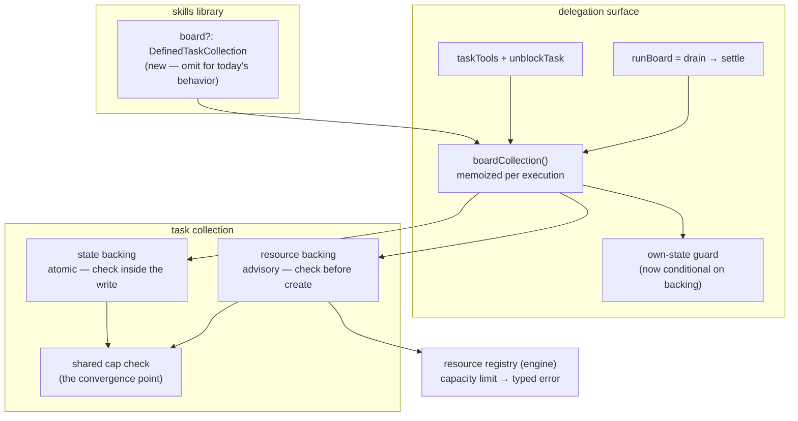

# FIX-957: Make the delegation board survive a turn — turn-scoped settle, in-turn parking dead ends, and cap enforcement across backings — Implementation Spec

> **Linear:** [FIX-957](https://linear.app/fixpoint-labs/issue/FIX-957/make-the-delegation-board-survive-a-turn-turn-scoped-settle-in-turn)
> **Epic:** [FIX-930](https://linear.app/fixpoint-labs/issue/FIX-930/delegation-substrate-host-model-roster-and-identity-and-worker-context) — delegation substrate
> **Category:** Bug → implementation follows `diagnose`

---

## For reviewers — what this document is

This is a **direction document**, not an implementation. Reviewing it well means answering one question: **is this the right approach?**

**In scope to challenge:** the problem framing, the approach, any numbered **Decision** in §6 (that's the sign-off surface), missing constraints that would *invalidate* the design, and scope.

**Out of scope — owned by the implementing agent:** names, signatures, file paths, module layout, local structure, error-message wording, micro-optimizations, test names.

Feedback in the second list is welcome and gets **recorded verbatim in §13**. It will not be argued with and will not be folded into the design prose. One mention is enough.

**Two decisions in §6 are explicitly deferred to the repo owner and are not made here** — Decision 4 (reversing FIX-953's signed-off Decision 5c) and Decision 8 (sequencing FIX-960 ahead of this work). Both carry a recommendation; neither is enacted without sign-off.

---

## Part I — The Case *(for the human)*

### 1. Problem — why it matters, why now

**In plain language.** When a skill delegates work to a team of agents, the framework hands it a *board* — a to-do list its coordinator plans on and then runs. Today that board is erased at the end of every user turn. Ask a follow-up question and the coordinator starts from an empty list, with no way to reach the work it planned a minute ago.

That's a real limit, but it isn't the whole problem. The framework *already knows how* to keep a board alive across turns — `defineTaskCollection({ id, scope })` ships today, is documented for exactly this, and works when you build a board by hand in code. The delegation path just can't reach it: it is hardwired to the disposable option. So this is not a missing capability. It's an existing capability that one caller can't ask for.

**Why now.** Two of the delegation surface's own tool descriptions promise something the disposable board cannot deliver. `blockTask` says "block a task pending an external condition," and the `awaiting_review` status implies a human will look at the task later. The conditions those names evoke — a person answers, a rate limit resets, a fact arrives — all resolve *after* the turn ends, which is precisely when the board no longer exists. We are advertising cross-turn parking on a substrate that erases itself. Anyone building a delegating skill today is being pointed at a dead end.

There is also a live correctness hazard sitting behind the switch. Four things in the current code assume the board is disposable, and each one turns into a defect the moment it isn't. Flipping the scope without fixing them first would ship a board that survives *and* misreports, *and* is unbounded. That's why this issue is larger than a config field.

### 2. Solution in plain terms

Let the delegation board be given a durable home, and fix the four things that currently assume it doesn't have one.

The configuration itself is deliberately small. The skills library gains **one** option that accepts the collection `defineTaskCollection` already produces. Omit it and you get exactly today's behavior — a private, per-turn board — unchanged. Pass one and the same board lives at session, user, or org scope, with no new durability machinery invented anywhere.

The four fixes are where the actual work is:

1. **Scope the board's verdict to the current turn.** `runBoard` currently reports on every task the board has ever held. Once tasks survive, one parked task from last Tuesday makes every future run report "blocked" forever, and the coordinator is handed a growing pile of finished work it didn't ask about.
2. **Enforce the creation limits on the durable backing.** The two guards that bound runaway delegation are enforced only on the disposable backing. Turning durability on today would quietly remove the ceiling at the exact moment it starts mattering most.
3. **Make the storage-capacity limit answerable instead of fatal.** A durable board can hit a retention limit that currently throws a raw error straight through the model's tool boundary, where every other refusal on this surface is a readable result.
4. **Give a parked task a way out.** A task blocked mid-run has exactly one exit today: cancel it. Cancelling mints a new id if the coordinator re-adds the work, and anything that depended on the original silently becomes unrunnable forever.

**The philosophy that led here.**

- **Tenet 2 (composition over features, refine don't accrete).** The strongest thing about this change is what it *doesn't* add. `defineTaskCollection` already solves durable boards; the delegation surface just couldn't reach it. Wiring the existing primitive in beats inventing board persistence a second time, and it keeps one definition of "a durable board" rather than two that drift.
- **Tenet 5 (fix at the owning layer — find where paths converge).** The creation caps are an invariant with several writers: the coordinator's tools, a fan-out worker's tools, the drain, and internal batch callers. Today the guard sits in one backing's write path, so the other backing's writers walk past it. The fix moves the check to where every writer on both backings converges, rather than adding a second copy.
- **Tenet 3 (earn every addition).** One new library option, and the justification paragraph that exists only to explain why caps *can't* apply to the durable backing gets deleted in the same change.

### 3. Tradeoffs & alternatives

**The simpler approach considered: just flip the backing and ship it.** Genuinely tempting — the durable primitive exists, and the wiring is a few lines. It's insufficient because each of the four blockers is a defect that only *appears* once the board survives, and three of them are silent. A board that reports "blocked" forever, or that has lost its runaway ceiling, is worse than one that forgets. The config change is the small part; it is not shippable alone.

**Alternative rejected — a `boardScope: "turn" | "session" | "user" | "org"` enum on the library.** More ergonomic on the surface (one word, no second import) and it was the obvious first shape. Rejected because it invents a parallel scope vocabulary beside `defineTaskCollection`'s, which means two ways to say "a durable task board" and two places for the definition to drift. Accepting the defined collection reuses the existing noun and stays honest that a durable board is a storage commitment, not a flag. If demand shows up for the shorthand later, it can be sugar over the same option.

**Alternative rejected — adapt the durable collection to look like the disposable one.** This would have let one code path serve both and made the cap work trivial. It is not possible, and the reason is structural rather than effort: the disposable backing is a single atomic value, the durable one is many independently-written keys. Synthesizing the former from the latter needs a multi-key transaction the resource registry has no verb for, and it would regress the per-key write granularity that makes task claiming safe under concurrency. This was verified during the issue's architectural audit and is settled, not open.

**Where the genuine complexity is.** Not the config, and not the turn-scoping. It's the cap check on the durable backing. On the disposable backing the check lives *inside* the atomic write, so a burst of concurrent adds serializes and lands exactly the cap's worth. The durable backing has no such write — it creates one key per task against a snapshot that a sibling worker's writes may already have invalidated. So the same check on that backing is **advisory**: two concurrent fan-out workers can both pass it and both insert. We are accepting a weaker guarantee, and it should be reviewed as a deliberate choice rather than discovered later. It's the right call because a creation cap is a breadth guard against runaway delegation, not a correctness invariant — being a handful over 500 harms nobody, whereas having no ceiling at all on the durable backing is the thing we're fixing.

The second real complexity is what "turn-scoped" should *mean*, which is a semantics question rather than a coding one. See Decision 2.

### 4. Focus practices

1. **Find the convergence point before writing the guard (tenet 5).** The cap invariant has writers on both backings: the coordinator's `addTask`, a fan-out worker's board-bound tools, the drain, and internal batch callers (seed, replan). Enumerate them and put the check where all of them pass through. A cap enforced at one entry point is the most expensive review class we have — the reviewer ends up finding the other writers.
2. **Tolerate the old shape (BP-030).** A durable board outlives the deploy that changes it. Tasks written before the turn stamp exists will be read after it does; `== null`-guard the new field and treat its absence as "predates this change," never as an error. The board's persisted task envelope is now a real migration surface — it wasn't when the board died every turn.
3. **Test the off state of the new option (BP-035).** The default path — no durable collection supplied — is the one every existing consumer is on, and it must be bit-for-bit unchanged. Every behavior added here needs a test proving it is inert when the board is per-turn.
4. **A refusal the model can act on is a result, not a throw.** This surface's established contract is `{ ok: false, error }` with enough detail to recover. Any new refusal (capacity, a guarded unblock) joins that contract; nothing new throws through the tool boundary.
5. **Don't re-derive the audit (tenet 1).** The issue body carries an architectural audit already verified against `main`, including one finding that was wrong, corrected, and re-verified. Treat it as established. In particular: `maxInstances` is a live-capacity limit, not a lifetime ceiling, and `SkillsLibraryOptions.scope` scopes the *skills* collection, not the board. Both have already cost a cycle.

### 5. What using it looks like

**Today — unchanged, and still the default.** A delegating skill gets a private per-turn board with no configuration at all:

```ts
const skills = createSkillsLibrary({ collection: "skills", catalog });
// Coordinator plans with addTask, runs with runBoard. Board is erased at turn end.
```

**New — a board that survives the conversation.** One import, one option:

```ts
const delegationBoard = defineTaskCollection({ id: "delegation-board", scope: "session" });

const skills = createSkillsLibrary({
  collection: "skills",
  catalog,
  board: delegationBoard,        // ← the only new surface
});
```

Turn 1 plans three tasks and drains two; turn 2 sees the third still pending and can drain it:

```
turn 1:  addTask("research")  → { ok: true, taskId: "t1" }
         addTask("draft")     → { ok: true, taskId: "t2" }
         addTask("review")    → { ok: true, taskId: "t3" }   // blocked on a human
         runBoard()           → { status: "blocked", tasks: [t1 completed, t2 completed, t3 blocked] }

turn 2:  unblockTask("t3")    → { ok: true }
         runBoard()           → { status: "drained", tasks: [t3 completed] }
                                 └─ t1/t2 are absent: finished, and not this turn's business
```

The second `runBoard` is the point of the whole change. Today turn 2's board is empty and `t3` is unreachable. With a naive durable board, turn 2 would report `blocked` (poisoned by `t3`) and hand back all three tasks including two the coordinator already consumed.

**New — a parked task's exit.** `unblockTask` returns a task to `pending` without minting a new id, so dependents survive:

```
blockTask("t3", "waiting on the customer's answer")   → { ok: true }
unblockTask("t3")                                      → { ok: true }
// t4 declared deps: ["t3"] — still runnable. Cancel-and-re-add would have
// stranded t4 permanently, with no error surfaced.
```

**New — capacity is answerable.** A durable board at its retention limit returns a result instead of throwing:

```
addTask({ goal: "…" })  → { ok: false, error: "board_at_capacity" }
```

### 6. Decisions & rules — the sign-off surface

1. **The delegation board's home is configurable through one library option that accepts a `defineTaskCollection` result; omitting it is today's per-turn board, unchanged.**
   *Alternative rejected:* a `boardScope` enum on the library.
   *Ramification:* one new option, no new durability mechanism, and one definition of "durable task board" shared with the code-first path. Costs the caller one extra line and one import. Locks us out of a one-word shorthand unless we later add it as sugar over this option.

2. **`runBoard`'s settle reports on the current turn's tasks plus every still-unfinished task, and its verdict stays "any unfinished task ⇒ blocked."**
   *Alternative rejected:* filtering strictly to the current turn's tasks, which would hide surviving parked work — the exact thing durability is for — and let the drain and the verdict disagree about what's on the board.
   *Ramification:* finished tasks from earlier turns stop being replayed to the model, so the coordinator's context doesn't grow without bound. A genuinely stuck task still reports `blocked` on every later turn, which is correct and is now escapable via Decision 5. Requires stamping each task with the turn that created it; absent stamp reads as carryover (BP-030).

3. **The creation caps move to one backing-agnostic check that both backings call, and the durable backing accepts cap options like the other one does.**
   *Alternative rejected:* a second copy of the check written for the durable backing; also rejected, keeping the current type-level ban on caps for that backing.
   *Ramification:* the paragraph justifying why caps can't apply to the durable backing is deleted rather than amended. **Enforcement there is advisory, not atomic** — concurrent writers can overshoot by a small margin. Cap breaches are checked for a whole batch before anything is written, so a cap never lands half a batch on either backing; a store failure mid-batch still can, and that residual difference is documented rather than papered over with rollback machinery.

4. **⚠️ OWNER DECISION — whether to guard the `in_progress` / `awaiting_review` → `pending` transition. Not decided here.** Guarding it reverses FIX-953's signed-off Decision 5c ("`unblockTask` is a thin wrapper… no status precondition of its own"), so it needs the same sign-off weight that decision got. Two options:
   - **(A) Re-affirm 5c.** `unblockTask` stays a thin wrapper; the transition stays permissive. Cheapest, consistent with the record.
   - **(B) Guard it.** The unblock path refuses `in_progress` and `awaiting_review` sources.
   *Recommendation: (B).* 5c's stated reasoning was that no coordinator tool reaches `awaiting_review` today. That premise is weaker now: a fan-out worker holding board tools mid-drain is a real, reachable writer, and it can move a running task back to `pending` — manufacturing exactly the drain-containment failure FIX-951 exists to contain.
   *Ramification either way:* (B) closes a model-reachable path to a known drain failure and costs one refusal the coordinator may hit legitimately. (A) leaves it open and keeps the signed-off record intact.

5. **`unblockTask` ships, re-grounded on the two arguments that survive independent of turns.** Those are the mid-drain fan-out exit (a task blocked inside a drain otherwise has only `cancelTask`) and dependency corruption (cancel-and-re-add mints a new id; `deps` resolve by id and require `completed`, so every dependent becomes permanently unrunnable with no error surfaced).
   *Alternative rejected:* implementing FIX-953's spec as written — its primary argument was cross-turn parking, which did not exist on the substrate at the time.
   *Ramification:* the coordinator gains a ninth task tool. With Decision 1's durable board configured, the cross-turn parking case becomes real again rather than aspirational.

6. **The storage-capacity limit becomes a typed, narrowable error at the layer that raises it, mapped to its own soft code (`board_at_capacity`), explicitly not onto `total_task_cap_exceeded`.**
   *Alternative rejected:* matching on the error message from the orchestration side; also rejected, reusing the existing total-cap code.
   *Ramification:* a small change in the engine package, which is the layer that owns the limit (tenet 5). Reusing the total-cap name would tell the coordinator "you hit your lifetime ceiling, stop planning" when the truth is "this board is full right now" — different recovery, so a different code.

7. **Tool descriptions and delegation docs state the board's real lifetime, and say it depends on how the board was configured.**
   *Alternative rejected:* correcting them to today's per-turn boundary as a separate early fix, then correcting them again once durability lands.
   *Ramification:* one description change instead of two. Until this ships, `blockTask`'s promise stays overstated; FIX-958 separately fixes the code comments that wrongly claim the ledger already survives.

8. **⚠️ OWNER DECISION — sequencing FIX-960 (rename the `sequencer` backing to `state`) ahead of this work. Not enacted here.**
   *Recommendation: yes, land FIX-960 first as a standalone mechanical rename.* It touches the same files this spec's cap work rewrites, it is a pure no-op rename with a mechanical review, and both changes delete the same justification paragraph for different reasons — landing them together makes that deletion ambiguous and buries three lines of real semantics in a ~22-call-site diff. *Ramification:* adds a short serial dependency on a small PR. If FIX-960 slips more than a day, unblock this and absorb the rename later.

**Non-goals.** Not building: durable non-sequencer *block* state (FIX-917's deferred follow-up — a different failure mode); detached/background jobs that run outside any request (FIX-939); a spend/cost ceiling (FIX-933 owns spend, and a row count is the wrong noun for it); a `pending`-subset bound derived from the resource registry (it has no notion of task status); retry-storm accounting (FIX-948 — see §12); FIX-950's soft-error contract.

**Size estimate: Large** (multi-PR, >500 LOC across `orchestration`, `engine`, `workforce`, and docs). **PR plan shape** (the detail is in §8): five sub-PRs. Three are independent and build in parallel — the shared cap check, the turn stamp + scoped settle, and the `unblockTask` tool. The configurable board depends on the first two, because shipping durability before them means shipping an uncapped board with a poisoned verdict. Docs land last, once the surface is settled.

---

## Part II — The Build Plan *(for the implementing agent)*

### 7. Technical design

Three layers are involved. The **task collection** layer (`@flow-state-dev/orchestration`, `tasks/collection/`) owns storage backings and the creation caps. The **delegation surface** layer (`orchestration`, `skills/`) owns the board's construction, the tools, and the drain. The **resource registry** (`@flow-state-dev/engine`) owns the storage-capacity limit. `@flow-state-dev/workforce` is touched only as a pass-through for the board-bound tool capability.



**The board's home becomes a branch, not a constant.** Today the delegation surface builds its collection with a hardcoded state backing against the host generator's own state. It becomes: a supplied durable collection selects the resource backing; its absence keeps the state backing exactly as today. Two consequences follow mechanically. The surface's early bail-out when the host generator has no own state must only fire on the state-backed branch — under a durable board the host's own state is irrelevant. And the resolver handed to fan-out workers already flows from this one construction site (`boardTaskTools`, threaded through the worker materializers in both `orchestration` and `workforce`), so those call sites need **no change** — they inherit the configured backing for free.

> **Correction to the issue's framing, worth stating because it reduces scope.** The issue lists `defaultOwnStateResolver` returning `undefined` under non-own-state backing as a blocker "also hit via `worker-materializer.ts` and `workforce/src/materialize-agent.ts`." Reading those two sites: both already prefer the injected board capability and fall back to the own-state singleton only when none was supplied — which is correct for a standalone, boardless consumer. So `defaultOwnStateResolver` stays own-state-only and needs no change; the only required fix is making the one construction site backing-aware. Verify this before assuming more work.

**The cap check is lifted, not copied.** It currently lives inside the state backing's atomic write. It moves to the caps module — already the module that owns cap types, defaults, validation, and the typed breach — and both backings call it. The state backing keeps calling it from inside its write (unchanged semantics, still atomic and all-or-nothing). The resource backing calls it against its hydrated mirror before creating anything, evaluating the whole batch at once so a cap refusal never lands a partial batch. The backing spec for resource collections starts extending the cap options, and the comment explaining why it deliberately doesn't is deleted.

**Turn identity comes from the request scope.** A "turn" is a request; `ctx.request.identity` already carries a stable id for its lifetime. The collection takes an optional origin-turn identifier at construction and stamps it on every task it creates — one convergence point, since all creation flows through the same initial-task builder. Non-delegation boards supply none and the field stays absent, so nothing else in the substrate changes shape.

Settle then partitions the board into *this turn's tasks* and *carryover*, returns their union, and computes the verdict over unfinished tasks as it does today. An unstamped task (written before this ships) reads as carryover.

> **Illustrative — a sketch, not the contract.** The settle partition:
> ```ts
> const mine = t.originTurnId === currentTurnId;
> const unfinished = !isTerminalStatus(t.status);
> // returned when: mine || unfinished     — verdict over: unfinished
> ```

**Capacity errors get a type at their source.** The registry's capacity throw becomes a narrowable error class exported from the engine, the resource backing catches it and re-raises it as the collection layer's typed cap breach with a distinct kind, and the tool boundary maps that kind to its own soft code.

### 8. Implementation sequence

**PR plan.**

| sub-PR | deliverables | depends_on |
|---|---|---|
| a | Shared cap check lifted into the caps module; resource backing enforces both caps against its mirror; resource backing spec accepts cap options; batch pre-check so a cap never lands a partial batch; the obsolete justification comment removed. Typed capacity error in the engine registry, re-raised as a typed cap breach, mapped to its own soft code at the tool boundary. | — (see Decision 8: recommended to follow FIX-960) |
| b | Optional origin-turn stamp on task creation, threaded from the request scope at the construction site; settle partitions into current-turn ∪ unfinished; verdict unchanged. | — |
| c | `unblockTask` tool on the delegation surface; the unblock guard per **Decision 4's outcome** (do not build until the owner has chosen A or B). | — |
| d | The `board` option on the skills library; backing branch at the construction site; own-state guard made conditional; `boardCollection()` memoized per execution. | a, b |
| e | Docs and tool-description truthfulness (§11). | c, d |

`a`, `b`, `c` are independent and build in parallel. `d` is the integration point and must not land before `a` and `b` — that ordering is the whole reason this is sequenced rather than one PR. Branches follow `fix/FIX-957-<id>`; dependents branch off their dependency.

**Within each sub-PR.**

*a — caps.* Move the check to the caps module with no behavior change and confirm the state backing's tests still pass (this is the safety net for the lift). Then wire the resource backing to call it, batch-first. Then the engine's typed capacity error and its mapping. Test after each: the lift is a no-op; the resource backing now refuses past both caps; a batch crossing a cap inserts nothing; capacity returns a result rather than throwing.

*b — turn scoping.* Add the optional stamp and prove it is absent unless supplied. Thread it at the delegation construction site. Then the settle partition. Test: an unfinished carryover task appears and sets the verdict; a finished carryover task appears in neither; an unstamped task reads as carryover.

*c — unblockTask.* The tool, its soft-error contract, and the dependency-preservation behavior (the id is stable, so dependents stay runnable). The guard is gated on Decision 4 — **if the owner picks (A), the guard is not built and this PR is smaller.**

*d — the option.* The library option and its threading; the backing branch; the conditional guard; memoization. Test the off state hardest (BP-035): with no `board` supplied, every behavior above must be inert and today's path bit-for-bit unchanged.

*e — docs.* Per §11.

**Removals** (tenet 3): the comment justifying caps-only-on-one-backing; the type-level ban on cap options for the resource backing; the cap check's old home inside the state backing (moved, not duplicated).

### 9. Edge cases & error handling

| Case | Expected behavior |
|---|---|
| No `board` option supplied (the default) | Identical to today in every respect — per-turn own-state board, same caps, same guard, same settle output. This is the regression surface that matters most. |
| Task written before the turn stamp exists | Read as carryover; never an error. `== null` guard, BP-030. |
| Durable board, turn 2, all turn-1 tasks finished | Settle returns only turn 2's tasks; verdict `drained`. |
| Durable board, turn 1 left a task `blocked` | Task appears in turn 2's settle and sets `blocked`. Correct, and escapable via `unblockTask` / `cancelTask`. |
| Two fan-out workers add concurrently near a cap on the durable backing | Both may pass the advisory check and insert; the board can overshoot by a small margin. Accepted (Decision 3). Must be an explicit test asserting the documented weaker guarantee, not an accident. |
| Batch add crossing a cap | Nothing inserted, on both backings. Typed cap breach → soft error. |
| Batch add hitting a store failure mid-batch, resource backing | A prefix may land. Documented residual difference; no rollback machinery. |
| Durable board at its retention limit | `board_at_capacity` soft result, not a throw. |
| Own-state guard, durable board configured, host generator has no own state | Surface installs normally — the guard must not fire. This is the bug the conditional fixes. |
| Hand-wired `taskTools` (no skills binding) | Unchanged: own-state, uncapped, no roster. Explicitly out of scope. |
| Durable board, `unblockTask` on a task from an earlier turn | Succeeds; dependents remain runnable because the id is unchanged. |

**Second-path checklist (BP-035).** *Legacy:* the persisted task envelope is now a real migration surface — unstamped tasks must round-trip. *Null boundary:* the stamp, the board option, and the capacity error are all optional/absent by default; guard each. *Concurrency:* the advisory-cap overshoot above, plus the pre-existing cross-worker mirror staleness (unchanged here; FIX-939 owns it). *Multi-tenant:* a durable board at `user` or `org` scope is shared across sessions by construction — the scope is the caller's explicit choice, and `session` is the conservative default to document. *Cost observability:* more surviving tasks means more context replayed, which is exactly what Decision 2's partition bounds. *Flag off-state:* covered above and called out as the hardest test target.

### 10. Testing strategy

**Discipline: `diagnose`** (Linear category: Bug). The feedback loop is vitest at the collection and surface seams — `packages/orchestration/src/tasks/collection/tests/` and the skills/delegation tests both already exercise these paths, including cap behavior, so the reproduction can be written before the fix in each sub-PR.

**Goal check (real path, real model).** A delegating skill configured with a session-scoped board, run over two turns through `fsdev run`: turn 1 plans three tasks, drains two, leaves one blocked; turn 2 unblocks and drains it. Passes when turn 2's `runBoard` reports `drained`, returns only the task it actually ran, and the task id from turn 1 still resolves. This is the outcome the whole issue is about, and it cannot be proven by mocks — it needs a real turn boundary.

**CI specs (mocked, deterministic), in observable terms.** Default path unchanged with no `board` supplied. Caps refuse past both bounds on the resource backing. A cap-crossing batch inserts nothing on both backings. Capacity returns `board_at_capacity` rather than throwing. Settle omits finished carryover, includes unfinished carryover, and sets the verdict from unfinished only. An unstamped task reads as carryover. `unblockTask` returns a blocked task to `pending` with a stable id and its dependents still runnable. The own-state guard does not fire under a durable board. Per Decision 4(B) if chosen: the unblock path refuses `in_progress` / `awaiting_review`.

Tests must encode *why* (tenet 7 / CLAUDE.md §5) — e.g. the carryover test asserts a stuck task stays visible *because* hiding it is what makes durable parking useless, not merely that a filter has a particular shape.

### 11. Documentation plan

Docs changes are required: this adds a public option, a new tool, and a new soft error, and it makes an existing documented statement about board lifetime conditional.

| File | Action | Content |
|---|---|---|
| `apps/docs/docs/skills/delegation.md` | EXTEND | The "own-state by default" statement (~line 51) becomes conditional. New subsection after the existing board/overrides material: how to give the board a durable home, the two-line example from §5, what changes across turns, and an honest note that `session` is the conservative choice. Extend the existing bounds subsection (~lines 74–110) with the durable backing now being bounded too, the weaker concurrency guarantee, and `board_at_capacity`. Extend the tool table (~line 172) with `unblockTask`. |
| `apps/docs/docs/orchestration/task-board.md` | EXTEND | "Durable boards that survive across turns" (§ at ~line 362) gains a cross-link noting the delegation surface can now use this same primitive. "Bounding how much work a board takes on" (~line 225) and "Where the bounds apply" (~line 274) are updated: the bounds now apply on the durable backing, advisory rather than atomic. **"How long the counts last" (~line 239) currently documents the old asymmetry and must be rewritten, not appended to.** |
| `apps/docs/docs/orchestration/task-substrate.md` | EXTEND | Task lifetime / status-machine material gains the origin-turn stamp and, per Decision 4's outcome, any change to the unblock transition. |
| `apps/docs/guides/board-lifecycle.md` | EXTEND | Check for and correct any statement that a board's life ends with the turn. |
| `packages/orchestration/README.md` | EXTEND | The new library option, `unblockTask`, and the new soft error in the public-surface listing (BP-009). |
| `docs/architecture/state-and-scopes.md` | EXTEND | The durability-boundary section is what the issue quotes as the source of the constraint. Note that the delegation board no longer necessarily rides block state — without claiming block state itself became durable, which it did not. |
| `.changeset/*.md` | CREATE | User-facing (BP-022). Pre-1.0 → `minor` for the new option and tool. |

**No new pages.** Every affected concept has an existing home, and the guidance is to prefer extending — a new page would fragment "how the delegation board works" across two places.

**Cross-links.** `skills/delegation.md` → `orchestration/task-board.md`'s durable-boards section (the primitive) and `orchestration/task-substrate.md` (the status machine). `task-board.md`'s durable-boards section → back to `skills/delegation.md`.

**Voice risks** (`CLAUDE.md` → Writing Style): this topic pulls hard toward em-dashes when contrasting per-turn against durable — restructure instead. Avoid "powerful" / "seamless" for the durability story. Introduce "board", "turn", and "scope" in plain terms on first use in the delegation page rather than assuming them. **No issue or PR numbers anywhere under `apps/docs/`** — this spec's whole vocabulary is FIX-numbered and it will leak if not watched.

### 12. Dependencies, open questions & follow-ups

**Dependencies.** No blocking PR: no open PR touches `packages/orchestration/src/tasks/` or `skills/` (checked against the open list; PR #866 is FIX-917's *spec* and is a different failure mode, PR #873 is the delegation-substrate epic). The one proposed sequencing dependency is **FIX-960**, which is Decision 8 and is the owner's call.

**Open questions needing a decision before implementation.**

1. **Decision 4 — guard the `in_progress` / `awaiting_review` → `pending` transition?** Reverses FIX-953's signed-off Decision 5c. Recommendation (B), guard it. Sub-PR `c` cannot be finished without the answer, though its main deliverable (`unblockTask`) can start.
2. **Decision 8 — sequence FIX-960 first?** Recommendation: yes. Affects when sub-PR `a` starts, nothing else.
3. **Should the durable board's origin-turn stamp be a first-class task field or carried in task metadata?** The spec assumes a first-class optional field, because `metadata` is model-writable through `updateTask`'s patch and a forgeable turn stamp is a decision derived from caller-controllable input (BP-031's spirit). Flagging it because it puts a delegation-motivated field on the shared task schema. If a reviewer prefers keeping the substrate clean, the alternative is a board-side sidecar — which then has to be made durable itself, which is why it isn't the recommendation.

**Follow-ups (flagged, not built).**

- **FIX-948 (retry storms invisible to the creation caps) — recommend NOT absorbing.** It is a different axis: this spec asks "does this backing enforce creation caps at all," FIX-948 asks "should re-entry count against them." FIX-931 already analysed and rejected re-entry enforcement inside the caps for a recorded reason (it would require parking retried tasks in a status the drain treats as unresolved), so reopening it carries its own sign-off weight — the same care Decision 4 is getting. FIX-948's own issue also notes FIX-933 (spend) may subsume it. **What this spec owes it is one sentence, not a merge:** the new resource-backing enforcement is creation-time-only, exactly like the state backing, so FIX-948's gap is identical on both backings and is neither widened nor narrowed here. That sentence belongs in the caps module docs.
- **`addTask` exposes no `maxAttempts`,** so a delegation board never carries retry budget and `failTask` on a parked task always attempts an illegal transition. `unblockTask` is the exit this spec ships; whether the coordinator should also be able to set a retry budget is a separate surface-widening question worth its own issue.
- **Resource-backed mirror staleness under concurrency** is pre-existing and unchanged here, but memoizing `boardCollection()` (sub-PR `d`) makes the window more visible. FIX-939 owns the real fix; note the interaction rather than patching it.
- **Deepening opportunity:** the delegation surface's `buildTools` is doing a lot — guard, caps, collection construction, roster, worker registry, two task-tool shapes. It reads as a function that has accreted responsibilities rather than one seam. Not in scope; a candidate for `improve-codebase-architecture` once this lands.

### 13. Review notes for the implementer

*(No spec-PR feedback yet — populated during review.)*

---

## Spec evolution

- **Spec drafted** — framed the problem as "an existing durability primitive the delegation path can't reach" rather than "build board persistence," so the fix reuses `defineTaskCollection` instead of inventing a second mechanism; settled the four blockers (turn-scoped settle, cross-backing caps, typed capacity error, a parked task's exit), accepted advisory rather than atomic cap enforcement on the durable backing as a deliberate weaker guarantee, and split the work into five sub-PRs with three building in parallel. Left two calls to the owner rather than deciding them: reversing FIX-953's Decision 5c, and sequencing FIX-960 first. Recommended not absorbing FIX-948, with the one sentence this spec owes it.
