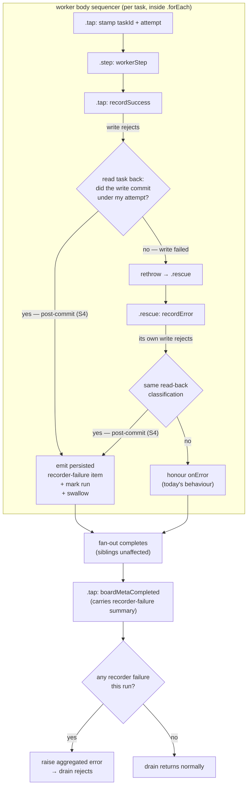

# FIX-963: Recorder failure after a task commits is swallowed; the drain reports success — Implementation Spec

**Linear:** [FIX-963](https://linear.app/fixpoint-labs/issue/FIX-963/recorder-failure-after-a-task-commits-is-swallowed-the-drain-reports) · **Epic:** [FIX-980 — Honest task substrate](https://linear.app/fixpoint-labs/issue/FIX-980) ([epic PR #983](https://github.com/fixpoint-labs/flow-state-dev/pull/983), epic-spec `docs/specs/_epics/honest-task-substrate.md`) · **Category:** Bug

---

## For reviewers — what this document is

This is a **direction document**, not an implementation. Reviewing it well means
answering one question: **is this the right approach?**

**In scope to challenge:**

- The problem framing — are we solving the right thing?
- The approach — will it work, does it fit the architecture and `docs/philosophy.md`?
- Any numbered **Decision** in §6 — that's the sign-off surface.
- Missing constraints, edge cases, or dependencies that would **invalidate** the design.
- Scope — a deliverable that shouldn't ship, or one that's missing.

**Out of scope — deliberately unsettled here, and owned by the implementing agent:**

- Names, signatures, file paths, and module layout.
- Local structure: which helper, how a function is decomposed, error-message wording.
- Micro-optimizations and style preferences.
- Test names and internal test structure (the *behaviours* to test are in §10; the tests
  themselves are not).
- Anything Part II left open on purpose — it is directional by design, and a gap at
  that altitude is intended, not an omission.

Feedback in the second list is welcome and gets **recorded verbatim in §13** for the
implementer to weigh against real code. It will not be argued with, and it will not be
folded into the design prose — that would pretend the spec can settle something it
can't. Please don't re-raise it: one mention is enough for it to land in §13.

---

## Part I — The Case *(for the human)*

### 1. Problem — why it matters, why now

A task board's job is to run a batch of work and then tell you how it went. Right now
it can lie to you in a specific way: the work finishes, the board writes the result
down, and then the machinery that *announces* the result falls over — and the board
still reports a clean run. The failure isn't quietly logged somewhere useful either.
It survives only on two diagnostic breadcrumbs that are never saved and never reach
the caller.

There is a second, uglier half that the ticket didn't describe. The same
announcement failure on the *error*-recording path doesn't get swallowed — it takes
the whole board down and abandons every task that hadn't started yet. So the same
root cause produces a silent success in one direction and a sibling-abandoning crash
in the other. Neither is honest.

**Why now.** This is reachable in ordinary production use, not a contrived case: the
announcement step runs the framework's reactive dispatch and resource-change hooks
inline, so any user block reacting to task changes can trigger it. It is also a
**verified regression** — before FIX-951 shipped, the swallowed case surfaced as an
error (see §3 for what that error actually was, because it matters). And it is the
one issue in the [FIX-980 epic](https://linear.app/fixpoint-labs/issue/FIX-980) whose
fix is not available from any other work in the set: the epic's decided contract
change cannot reach it, because this failure is a *rejection*, and a rejected promise
carries no return value to widen.

### 2. Solution in plain terms

**Let each recorder notice its own failure, and report it where a caller can actually
see it.**

Today the board wraps each worker in a safety net whose purpose is to contain a
*worker* going wrong. That net is also catching the board's own bookkeeping going
wrong, and it can't tell the two apart — so a policy written for "a task failed"
gets applied to "the substrate fell over," which is a different event with a
different right answer.

Three moves, in plain terms:

1. **Each recorder watches its own write.** When a recorder's write throws, the
   recorder checks whether the write actually landed. If it did, this is not a work
   failure — the work is durably recorded — it's an infrastructure failure that
   happened *after* the fact. The recorder now knows which of the two it is, at the
   only place where that is knowable for free.
2. **The report goes somewhere durable.** The recorder announces the failure as a
   saved stream item, not a throwaway diagnostic trace, and does so through a channel
   that doesn't depend on the machinery that just broke.
3. **The board raises it at the end, not in the middle.** Every remaining task still
   drains. Only once the whole batch is finished does the board surface the
   infrastructure failure. That is how the report gets to be both loud and contained,
   which the ticket correctly noted are not automatically compatible.

**The philosophy this leans on.**

- **Tenet 5 (fix at the owning layer), and specifically its convergence half.** Both
  recorders, both collection backings, and every caller-supplied custom collection
  funnel their write-backs through the same two recorder blocks. That is the
  convergence point. Fixing it there cures it once for all three backings and for
  custom refs, and it is why this spec changes neither backing.
- **Tenet 3 (earn every addition).** The honest report is a *default*, not a new
  option. No new config knob: a recorder falling over has no audience for whom
  silence is correct, so there is nothing to configure.
- **Tenet 1 (coherence).** The epic's Decision 4 says a guarantee must be observable
  at a persisted surface. This spec names its surface and verified that today's is
  not one.

### 3. Tradeoffs & alternatives

**The regression framing, honestly.** The ticket's central claim reproduced exactly
(§12, settled). But the pre-FIX-951 behaviour it compares against was *not* a good
report that we lost. Before FIX-951, the error that surfaced was
`IllegalTaskTransitionError: completed → errored` — an error about the board's own
bookkeeping write being refused, not about the thing that actually broke. And it got
there by abandoning every sibling task. So: **a real regression in visibility, but the
thing we regressed from was accidental loudness, not a designed report.** That matters
because it rules out "revert toward the old behaviour" as a direction — there is
nothing there worth reverting to. We are not restoring a lost report; we are building
the first honest one.

**Alternative 1 — inspect the error type inside the failure recorder.** Rejected, and
the ticket already argued why: a caller cannot reliably distinguish an infrastructure
rejection from a worker throwing something that looks similar, and it re-derives
provenance the pipeline *had* and discarded one step earlier. Reading the error is
guessing; asking the collection whether the write landed is knowing.

**Alternative 2 — narrow what the safety net covers.** Move the success recorder
outside the net so its failure propagates. This is the ticket's other named option and
it is genuinely simpler — but it buys loudness by giving up containment: the
propagation escapes the fan-out and abandons the siblings, which is exactly the bug
FIX-951 shipped to fix (epic Decision 5 makes that a non-negotiable bar for the whole
set). Rejected on those grounds. Note the two options are *not* symmetric, which the
ticket left open: this one trades away a property we've promised; the chosen one
doesn't.

**Alternative 3 — record the failure onto the task itself.** The most natural home,
and it survives the epic's A1 constraint (metadata patches on terminal tasks stay
legal, deliberately). Rejected for a specific reason: it writes the report back
through the same write chain that just rejected, so the report can fail the same way
the thing it reports did. A report that breaks under the condition it exists to report
is not a report.

**The simpler approach considered.** Do nothing but make the board's completion
summary carry a count. That is genuinely smaller — but it leaves the caller's
`result.error` reading `undefined` on a run where the substrate broke, which is the
precise dishonesty the ticket is about, and it does nothing at all for the
sibling-abandoning half.

**Where the genuine complexity is.** Not in detecting the failure — that turned out
cheap. It is in the *ordering*: the failure is discovered inside a fan-out, and the
honest response (fail the run) must not be taken there, because taking it there
abandons siblings. Deferring a decision made in one place to a boundary reached later
is the only hard part of this change, and it is where the review attention belongs.

### 4. Focus practices (1–5)

1. **Name the convergence point, not the call sites (tenet 5).** The claim "this covers
   both backings" is only true because the fix sits above the backing split. If the
   implementation ends up touching `resource-backed` *and* `sequencer-backed`, that is
   the signal the fix drifted below the convergence point — stop and re-read this.
2. **The persisted surface is the deliverable, not the detection (epic Decision 4).**
   A `transient: true` trace item is a breadcrumb. Any test asserting visibility must
   assert against something that survives, or it is testing the bug's own hiding place.
3. **Prove containment at composition level, not per block (epic Decision 5, tenet 7).**
   The escape only emerges from full `runAction` composition — worker sequencer →
   `.rescue()` → `.forEach` fan-out. A passing unit test here proves nothing about the
   property that matters.
4. **BP-035, second-path: exercise both halves of the discriminator.** The interesting
   path is not "the write committed then failed" — it's "the write did *not* commit and
   also failed," which must keep behaving exactly as it does today.
5. **BP-012 is a constraint on the shape, not a reason to give up the channel.** The
   success recorder is a `.tap()`-shaped block with no output schema, so it has no
   return channel. The report therefore rides the item stream, not a return value.

### 5. What using it looks like

The change alters no signature anyone calls. What changes is what a caller *reads back*
from a drain whose substrate fell over. Two before/afters.

**A caller branching on the drain result**

```ts
const result = await runAction("run", { userId });

// BEFORE — a run whose recorder fell over after committing:
//   result.status === "completed"
//   result.error  === undefined         ← the lie
//
// AFTER:
//   result.status === "failed"
//   result.error  names the recorder failure and the task it happened on
//   ...and every sibling task still drained to completion first
```

**A caller (or renderer) reading the stream for the detail**

```ts
// AFTER — a persisted component item carrying the recorder failure:
//   { collectionId, taskId, phase: "record-success", error: "..." }
//
// BEFORE the same information existed only on two `transient: true`
// block_trace items — not persisted, not in the action result, not branchable.
```

*(Shapes above are illustrative; the exact item type name and payload keys are the
implementer's, per §7.)*

### 6. Decisions & rules — the sign-off surface

1. **Classify by asking "do I still hold this task, unchanged?" — not by checking whether
   it reached a target status, and not by inspecting the error.** After its own write
   rejects, a recorder reads the task back. If the task is still in an attempt-owned
   status (`in_progress` / `awaiting_review`) with `attempts` equal to the attempt the
   recorder was scoped to, the write did **not** land. Anything else means it moved, so
   the write committed and the rejection is post-commit.
   *Alternative rejected:* sniffing error types/instances inside the failure recorder.
   *Also rejected — and this is the correction review bought:* "did it reach my target
   status?" That formulation is wrong for `fail()`, which has **two** durable outcomes.
   With retry budget left it commits to `pending` (kind `retried`), not terminal
   `errored`, and it leaves `attempts` untouched — so a target-status check misreads a
   committed retry as "never happened", rethrows, escapes the rescue, and abandons
   siblings. That is the exact FIX-951 regression this issue exists to fix.
   *Ramification:* the rule is the **inverse** of the substrate's existing
   attempt-ownership predicate, which makes both `fail()` branches correct by
   construction rather than by enumeration. It depends on the read-back reflecting the
   committed write — verified on the request backing and by construction in both
   built-in backings (§12). A custom ref whose reads don't reflect its own committed
   writes degrades to today's behaviour rather than misreporting.

2. **Both recorders are in scope, not just the success one.** The failure recorder's
   own post-commit rejection is the *uncontained* half of this bug and reinstates
   FIX-951's sibling abandonment.
   *Alternative rejected:* scoping to the success path as the ticket described.
   *Ramification:* widens the change beyond the filed description, and makes epic
   Decision 5 a live regression bar for this issue rather than a formality. This is the
   single most consequential departure from the ticket.

3. **The report is a persisted stream item emitted at the catch site, and it must not be
   attributable as worker output.** The board's per-task attribution buckets every
   `taskId`-stamped item into `TaskHandle.items()`, supervisor synthesis input, and the
   UI's task-output view, excluding only two named component types. A new type emitted
   inside the worker body would therefore surface as something the worker produced.
   *Alternative rejected:* writing it onto the task (same write chain that just
   failed); another `transient: true` trace (a breadcrumb, per epic Decision 4);
   emitting a fresh type and leaving attribution alone (it would pollute task outputs).
   *Ramification:* the implementer must pick one of the three remedies in §7 and, if it
   is a new component type, extend the canonical exclusion **with its tests and the
   architecture docs**. This is the one place where this change reaches outside
   `orchestration`.

   **This is the only persisted shape this change adds.** The board's completion summary
   is *not* extended with a recorder-failure count: it is fully derivable from the
   per-task items already persisted, and no known consumer reads the summary but not the
   items. A second shape owing compatibility for zero new information fails tenet 3.

4. **The drain fails, and it fails at the drain boundary — after the fan-out has
   drained.** Loud and contained, in that order.
   *Alternative rejected:* raising inside the worker body (loud, but reinstates sibling
   abandonment); reporting without failing (leaves `result.error === undefined`, the
   original dishonesty).
   *Ramification:* a run that previously reported success now reports failure. That is
   the intended behaviour change and the main thing to sign off on.

5. **`onError` is not consulted for a recorder failure.** It is a worker-failure
   policy; a recorder failure is not a work outcome.
   *Alternative rejected:* honouring `onError: "skip"` for recorder failures (today's
   behaviour — the bug), or adding a parallel `onRecorderError` knob.
   *Ramification:* `onError: "skip"` users see a new failure mode they could not
   previously see. No new option, per tenet 3 — if a real caller later needs silence
   here, that is a knob added on evidence, not speculation.

6. **Fix at the recorder layer; neither collection backing changes.**
   *Alternative rejected:* per-backing fixes in `resource-backed` / `sequencer-backed`.
   *Ramification:* one mechanism covers all three backings *and* caller-supplied custom
   refs. It also keeps this issue entirely off the shared patch-helper surface the epic's
   A1 constrains, and out of the file-collision set with FIX-976 / FIX-964.

**Non-goals.** Reopening FIX-951's worker-outcome containment; the epic's Decision 1
return-type widening (structurally cannot reach a rejection); adding any terminal guard
to the shared patch helper (epic A1); making the announcement chain itself
transactional or retryable.

**Size:** Medium (multi-file, single PR, ~100–300 LOC incl. tests). Single-node PR plan.

---

## Part II — The Build Plan *(for the implementing agent)*

### 7. Technical design

**Where the bug lives.** One package: `@flow-state-dev/orchestration`. The two recorder
blocks in the task-board worker pipeline, plus the drain's tail. No changes in
`tasks/collection/*` (either backing) and none in `skills/task-tools-capability.ts`.

**The mechanism.** A recorder's write is `await collection.<write>(...)`. In both built-in
backings the durable write commits and the change announcement is the *tail* of that same
call, so a rejection can arrive with the write already committed. The recorder therefore
cannot treat its own rejection as "the write didn't happen." It reads the task back
(synchronous, reflects latest committed state) and branches.



**Three seams the implementer settles.**

1. **The classification helper.** Shared by both recorders — same question, same answer.
   Given the collection, the task id, and the attempt the recorder was scoped to: **do I
   still hold this task unchanged?** If yes, my write did not land. If no, it did.

   State it that way round, not as "did it reach my target status". `fail()` has two
   durable outcomes — terminal `errored`, or `pending` when `shouldRetryOnFail` finds
   remaining budget — and the retry branch leaves `attempts` untouched, so a
   target-status check classifies a *committed* retry as not-committed and rethrows into
   the rescue. The inverted-ownership rule covers both branches by construction.

   Note the helper is the **inverse** of the substrate's existing attempt-ownership
   predicate (`internal.ts`), which is private today. Reuse it rather than restating the
   status set — a second copy of "which statuses an attempt holds" is exactly the drift
   the existing helper's own comment warns about.

2. **The report channel.** `ctx.emit.component(...)` with `transient` left at its
   persisted default. This is deliberately *not* the collection: the collection's write
   chain is the thing that just failed.

   **The attribution hazard, which constrains the choice.** The item is emitted inside the
   worker body, after `ctx._markTaskScope(task.id)`, so it carries that worker's `taskId`.
   The canonical per-task attribution in `@flow-state-dev/contracts` excludes exactly two
   component types — `task-change` and `task-board-meta` — and buckets everything else
   carrying a `taskId` into `TaskHandle.items()`, `attributeItemsToTasks` (supervisor
   synthesis, `<TaskPlan />`), and `collectAttributedItemIds`. So a *new* type would
   present the substrate's own failure as a worker emission. Three remedies, pick one:

   - **Emit as the already-excluded meta type** with a distinguishing field. Cheapest; no
     cross-package change. Costs a discriminated payload on a shared type.
   - **Emit outside task scope** so the item carries no `taskId`. Keeps attribution
     untouched, but loses the emit-time task stamp, so the payload must carry the task id
     itself.
   - **Extend the canonical exclusion** — and then its tests **and** `docs/architecture/items.md`
     change with it, per `AGENTS.md`'s documentation-maintenance protocol. Most correct,
     widest blast radius, and the only option that reaches outside `orchestration`.

   **Do not key it by `collectionId` alone**: the board's existing meta item is keyed that
   way and upserts, so a shared key would let the completion meta overwrite the failure
   report. Per-task keying or no key.

3. **Carrying "a recorder failed" from inside the fan-out to the drain's tail.** The
   discovery happens per-worker; the decision is taken at the drain boundary.

   **Re-read the emitted items at the drain tail.** The collection factory already accepts
   a `getItems` accessor onto the response's persistent item buffer, so the precedent
   exists, and it is per-request by construction.

   **It needs a drain-invocation boundary token to be correct.** A request-backed board
   supports **multiple `board.drain` invocations per request** (the collection survives
   re-entry, deliberately), and the item buffer is per-*request*, not per-drain. So a
   failure item persisted by an earlier drain is still visible to a later drain's tail
   scan, and a subsequent clean drain would report a stale failure. The scan must be
   bounded to the current invocation — a per-invocation token stamped on the item, or a
   high-water mark taken when the drain starts. Either works; the requirement is that the
   scan cannot see a prior invocation's failures.

   *Rejected: `BoardRunFlowState` (`runState`).* It already exists and is already torn
   down on both paths, but it is constructed once inside the `taskBoard(...)` factory at
   flow-definition time, so it is shared across concurrent requests to the same flow.
   Using it would require a shared-closure fix first — more complexity than the `getItems`
   re-read, plus a live cross-request correctness risk, for no benefit.

**Illustrative sketch (a sketch, not the contract)** — the shape of the recorder's new
wrapper, to pin seam 1:

```ts
try {
  await collection.complete(taskId, output, { ifAllowed: true, expectAttempt });
} catch (err) {
  // Note the direction: "I still hold it unchanged" ⇒ my write never landed.
  // No target status appears here, which is what makes fail()'s retry branch work.
  if (stillHoldsUnchanged(collection, taskId, expectAttempt)) throw err;
  reportRecorderFailure(ctx, { taskId, phase: "record-success", error: err });
  // fall through to the existing state cleanup — do not rethrow
}
```

Note the cleanup ordering that currently exists and must be preserved: the success
recorder clears `currentTaskId` / `currentAttempt` *after* its write. On the swallowed
path that cleanup must still run, or a stale id leaks into the next loop iteration.

### 8. Implementation sequence

`diagnose` discipline (Bug). The feedback loop is vitest at the integration tier — the
escape only appears under full `runAction` composition.

1. **Reproduce, red.** Add the integration scenario (§10) covering both halves: success-path
   recorder failure (currently silent success) and failure-path recorder failure (currently
   abandons siblings). Both must fail against `main`. *Verify:* the two new tests fail with
   exactly today's symptoms; the existing FIX-951 containment scenario still passes.
2. **Add the classification helper** next to the recorders, as the inverse of the
   substrate's attempt-ownership predicate. *Verify:* unit tests at the block tier for
   **all three** durable outcomes — `complete` → `completed`, `fail` hard → `errored`,
   `fail` with retry budget → `pending` — plus the not-committed case, on both backings.
   The retry case is the one that would otherwise reinstate FIX-951; it is not optional
   coverage.
3. **Wire the success recorder** to classify, report, and swallow the post-commit case.
   *Verify:* half 1 of step 1 goes green; sibling drain unaffected.
4. **Wire the failure recorder** to the same classification, so its post-commit rejection
   stops escaping. *Verify:* half 2 of step 1 goes green — siblings drain instead of being
   left `pending` — **with a `maxAttempts` variant**, so the retry branch is exercised at
   composition level and not only in the unit test.
5. **Settle the attribution remedy** (§7 seam 2) before wiring the report, since two of the
   three options change where the emit happens. *Verify:* the failure item does **not**
   appear in the affected task's `TaskHandle.items()`. If the chosen remedy extends the
   canonical exclusion, its tests and `docs/architecture/items.md` change in the same step.
6. **Carry the signal to the drain tail and raise there**, bounded to the current drain
   invocation. *Verify:* `result.error` is set, `result.status` is `failed`, every sibling
   reached `completed` in the same run, *and* a second clean `board.drain` in the **same
   request** reports success rather than re-reporting the first drain's failure.
7. **Subtract.** No code path is superseded outright by this change, so there is nothing to
   delete — say so explicitly in the PR rather than leaving the tenet-3 question unanswered.
   If step 6 makes any part of the existing `onError` plumbing unreachable for recorder
   failures, remove that branch rather than leaving both shapes side by side.
8. **Docs** per §11, and a changeset (`patch`, user-facing behaviour change — BP-022).

*(An earlier draft had a ninth step extending the board's completion summary with a
recorder-failure count. Dropped — see §6 Decision 3.)*

No PR plan: single-node.

### 9. Edge cases & error handling

| Case | Expected |
|---|---|
| Write rejects, task **did not** commit | Unchanged from today. Success path rethrows into `.rescue`; failure path honours `onError`. This is the second path BP-035 asks for and the one most likely to regress. |
| Write rejects, task **did** commit (S4) | Classified, reported on a persisted item, swallowed locally; drain raises at its tail. |
| **`fail()` with retry budget left, committed then rejected** | Committed — the task is durably `pending` (kind `retried`) with `attempts` unchanged. Must classify as committed. A target-status check would call this not-committed, rethrow, and abandon siblings. **The most dangerous case in this table**; needs coverage at both tiers. |
| Task moved for a reason **other than** my write (concurrent settle) plus a store-level rejection | Classified as committed → reported as a recorder failure when the write did not land. A false positive requiring two rare events at once, and it errs loud rather than silent. Accepted; not worth a second read to disambiguate. |
| **Second `board.drain` in the same request**, first drain had a recorder failure | The later drain must report on its own invocation only. Requires the boundary token in §7 seam 3. Without it a clean drain inherits a stale failure. |
| The failure report's own emit throws | Nothing further to do — do not recurse. Let it propagate; a broken item stream is not something this mechanism can report around. |
| Write is **declined** (`ifAllowed` / `expectAttempt`) and returns normally | Unchanged. A decline is not a rejection — this is FIX-951's containment property and epic S2, not S4. Must not be reported as a recorder failure. |
| Task committed, but under a **different attempt** | Not this recorder's write. Treated as not-committed → today's behaviour. Prevents a reclaim-displaced worker from claiming someone else's commit. |
| Both recorders fail post-commit in one run | Both reported; the drain's raised error aggregates rather than reporting only the first. |
| Recorder failure on **one** task, siblings healthy | Siblings drain to completion first; only then does the drain reject. Non-negotiable (epic Decision 5). |
| Custom `TaskCollectionRef` whose reads don't reflect its own committed write | Classified as not-committed → today's behaviour. Degrades, does not misreport. |
| Custom ref with a legacy two-arg `complete`/`fail` (FIX-964's shape) | Out of scope here. This spec must not *worsen* it: the pre-FIX-951 illegal-transition throw remains that ref's behaviour, and it still escapes. Flagged in §12. |
| `onError: "fail"` + a genuine worker failure | Unchanged — the worker's own error still surfaces, not a bookkeeping error. Existing FIX-951 assertion covers this. |
| Task cancelled mid-flight, worker returns normally | Unchanged — the decline path, not this one. |
| Multi-tenant / concurrent requests to the same board | True by construction once the carrier is the per-request item buffer (§7 seam 3) — no dedicated test. It would need one only if the carrier were ever moved back to a shared closure, which §7 rejects. The re-entry case above is the one that still needs asserting. |
| Persisted-item volume | One item per recorder failure. Bounded by task count; not a new unbounded emitter. |

### 10. Testing strategy

**Goal check.** No real-model goal check applies, and the reason is specific rather than a
punt: the outcome under test is a substrate failure mode with no model in the path.
Reproducing it requires *injecting* a post-commit rejection, so a real-model run cannot
exercise it. The equivalent-strength evidence is the integration tier, which is where the
escape actually emerges — the same justification FIX-951's own coverage uses.

**Integration specs** (`packages/integration-tests`, alongside the existing FIX-951
containment scenario — the two are siblings and should read as such):

- Success-path recorder failure: drain reports failure, `result.error` names the recorder
  failure, **and** every sibling task reached `completed` with its held-out salt in the
  output (anti-hollow-pass — a board that abandoned siblings could still report a status).
- Failure-path recorder failure: siblings drain instead of being left `pending`.
- The persisted-surface assertion: the recorder failure appears on an item that is **not**
  `transient: true`. This test is the one that would have caught the original bug and must
  fail if the report is downgraded to a trace.
- **The retry branch at composition level:** a task with `maxAttempts` remaining whose
  `fail()` commits to `pending` and then rejects. Siblings keep draining. This is the test
  that fails loudest if the classifier is written as a target-status check.
- **Same-request drain re-entry:** two sequential `board.drain` invocations on a
  request-backed board, the first with a recorder failure and the second clean. The second
  must report success. Distinct from the concurrent-request case below and not covered by it.
- FIX-951's containment scenario, unchanged and still green (epic Decision 5).

*(No cross-request-bleed test: the per-request item buffer makes it true by construction.
That was a guard on the rejected `runState` carrier, not on this one.)*

**Block-tier specs** (`packages/orchestration/test`, next to `advisory-write.test.ts`):

- The classifier across all three durable outcomes (`completed`, `errored`, retry-`pending`)
  plus the not-committed case, on both built-in backings.
- The failure item is **not** in the affected task's `TaskHandle.items()` (§7 seam 2). This
  is the regression guard on whichever attribution remedy is chosen.
- A decline is not reported as a recorder failure.
- Committed-under-a-different-attempt is treated as not-mine.
- The `currentTaskId` / `currentAttempt` cleanup still runs on the swallowed path.

### 11. Documentation plan

Two EXTENDs, no new page. This changes observable behaviour of a documented feature; it
introduces no new vocabulary a user would search for, so a new page would fragment the
sidebar for one section's worth of content.

1. **EXTEND `apps/docs/docs/orchestration/task-board.md`** → the existing
   *"Concurrency and error handling"* section (currently the `onError` explanation and the
   contained-drop paragraph). Add a short subsection after it: *"When the board's own
   bookkeeping fails."* Content: the distinction between a task failing and the substrate
   failing to record it; that `onError` governs the first and not the second; that the board
   finishes draining before it reports; where to read the detail. One minimal example —
   reading `result.error` plus the persisted item — nothing larger.
   *Cross-links:* to `task-substrate.md#recording-a-result-that-may-no-longer-apply` (the
   decline case, so readers don't conflate a decline with a rejection); back-link added from
   that section.
   *Voice risks:* this section already carries a dense contained-drop paragraph — match its
   register, resist a triumphant closer, and introduce "recorder" in plain terms on first
   use rather than assuming the internal term.

2. **EXTEND `apps/docs/docs/orchestration/task-substrate.md`** → the *"Recording a result
   that may no longer apply"* section. One added paragraph drawing the line the docs
   currently leave implicit: the advisory options cover a *declined* write; they do not
   cover a write that committed and then threw. This is the sentence whose absence let the
   two get conflated in the first place.
   *Voice risks:* keep it to a paragraph; do not restate the state machine.

3. **`packages/orchestration/README.md`** — check only. No public export changes, so
   likely no edit; if the README describes board failure semantics, keep it accurate.

4. **Architecture docs** — **conditional, and decided by §7 seam 2.** `TaskCollectionRef` is
   untouched, so nothing changes there. But if the chosen attribution remedy extends the
   canonical exclusion in `@flow-state-dev/contracts`, then `docs/architecture/items.md`
   describes that exclusion set and must change with it, per `AGENTS.md`'s
   documentation-maintenance protocol. The other two remedies need no architecture-doc
   change. Settle the remedy first, then this answer follows.

### 12. Dependencies, open questions & follow-ups

**Blocking dependencies: none.** This issue is explicitly **not** Decision-1-bound (epic
round 2). Confirmed independently while writing this spec: in both backings the durable
write commits before the change announcement, and the announcement is the tail call — so a
recorder failure is a *rejection*, and a rejected promise carries no outcome value for a
widened return type to inhabit. The epic's Decision 1 is a useful *ingredient* (a widened
`fail()` would let the failure recorder learn its own write was declined) and not a gate.

**Coordination, not dependency.** FIX-976 and FIX-964 touch the collection backings and the
tool boundary; this spec touches neither (Decision 6), so the file-collision surface is
smaller than the epic's §Decision 2 assumed — worth confirming at `cross-spec-review`, which
now runs over the full active set including FIX-978.

**Settled claims (empirical questions this spec no longer has open):**

- **Settled:** FIX-963 is a regression introduced by FIX-951 — **CONFIRMED**: same board,
  same custom ref whose `complete` awaits the inner write then throws. Post-FIX-951
  (advisory `fail`): `status: "completed"`, `result.error: undefined`, task `completed`.
  Pre-fix shape (a `fail` that discards the advisory options): `status: "failed"`,
  `error: FlowError: [tasks] illegal status transition for task "t1": completed → errored`.
  Matches the ticket's table exactly. **With the important qualification in §3:** the
  pre-fix error was about the bookkeeping write, not the real failure, and it arrived by
  abandoning siblings — accidental loudness, not a lost report.
- **Settled:** does any *persisted* surface carry the recorder error today? —
  **CONFIRMED (it does not)**: an audit of every item in the response found the error's
  message on exactly two items, both `type: "block_trace"` and both `transient: true` (the
  `record-success` probe and the `record-error` rescue). Zero persisted items carry it;
  `result.error` is `undefined`. This is epic Decision 4's concern, verified rather than
  assumed, and it is why §6 Decision 3 commits to a persisted item.
- **Settled:** can a recorder discriminate committed-then-failed from write-failed by
  reading the task back? — **CONFIRMED**: reading through the same ref immediately after
  the post-commit rejection returns `status=completed attempts=1`. The engine's
  `updateState` persists inside the serialized write and awaits the change notification
  *outside* it, so the commit is visible before the rejection propagates.
- **Settled:** is the failure recorder's own post-commit rejection contained? —
  **REFUTED (it is not)**: with `onError: "skip"`, a `fail` that commits then rejects
  escapes the per-worker rescue (a rescue does not cover its own rescue block), the fan-out
  rejects, and sibling tasks were left `pending` — never claimed. FIX-951's abandonment is
  still live through this path. **This is not in the filed ticket** and is the reason
  Decision 2 widens scope to both recorders.
- **Settled:** does `onError: "fail"` already surface the swallowed case? — **CONFIRMED**:
  it surfaces the recorder's real error today. But it does so by abandoning siblings, so it
  is loud-and-uncontained rather than a working path. The chosen design makes both `skip`
  and `fail` loud *and* contained, which is a strict improvement in both modes.

*(All five reproduced with throwaway integration harnesses against `origin/main`; the
harnesses are not committed. Step 1 of §8 re-establishes them as real tests.)*

**Open questions:** none blocking. The one call the ticket flagged as belonging to this
spec — *should the request fail when only the notification failed?* — is answered as
§6 Decision 4 (yes, at the drain boundary), with the alternatives and the ramification
recorded there for sign-off.

**Follow-ups (flagged, not built):**

- **The two recorder blocks have converged in shape** — both `transient: true`, both
  reading the same worker-body state, both doing write-then-cleanup, and after this change
  both doing the same classification. That is a deepening opportunity (a shared recorder
  seam), not in scope here; follow up via `improve-codebase-architecture`.
- **A legacy two-arg custom ref still throws an illegal-transition error that escapes.**
  That is FIX-964's territory (epic S3), not this one. This spec must not worsen it; it
  does not fix it.
- **The announcement chain is not transactional.** A durable write whose notification fails
  leaves reactive consumers un-notified with no retry. This spec makes that *visible*; it
  does not make it recoverable. A retry/outbox design is a separate, larger question.

### 13. Review notes for the implementer

Below-the-bar spec-PR feedback, recorded verbatim rather than folded into the design.
**These are inputs, not instructions** — weigh each against what you actually find in the
code; adopt, adapt, or discard, and you owe no justification for discarding one. The §6
Decisions are binding; these are not.

- "There's an existing precedent for a distinct component type here:
  `GOAL_SEEK_LOOP_TERMINATION_COMPONENT_TYPE` in `goal-seek-loop.ts` uses a distinct type, a
  `${collectionId}:...` key suffix, and sets `itemVisibility`. Worth mirroring that shape
  rather than inventing a new convention." — Cursor ([PR #992](https://github.com/fixpoint-labs/flow-state-dev/pull/992))
  *(Directly relevant to §7 seam 2 — the key-suffix and `itemVisibility` details are exactly
  the kind of thing to settle in code.)*
- "Co-locate the classifier next to `attemptOwnsTask` in `collection/internal.ts` rather than
  in the task-board layer, so the ownership rule and its inverse live together." — Cursor
  ([PR #992](https://github.com/fixpoint-labs/flow-state-dev/pull/992))
  *(§7 seam 1 says reuse the predicate but leaves placement open; this is a reasonable call
  for the implementer. Note it would move a private helper's blast radius.)*
- "Reuse the existing scaffolding in `task-board-drain-containment.test.ts` rather than
  standing up a parallel harness — the two scenarios are siblings." — Cursor
  ([PR #992](https://github.com/fixpoint-labs/flow-state-dev/pull/992))
  *(§10 already says the tests should read as siblings; this is the concrete form of it.)*
- "The spec carries roughly 20–30% redundant prose between Part I and Part II; several
  points are made twice." — Cursor ([PR #992](https://github.com/fixpoint-labs/flow-state-dev/pull/992))
  *(Noted. Part I and Part II address different readers, so some restatement is by design;
  no design consequence either way.)*

---

## Spec evolution

- **Spec drafted** — framed the problem as S4 (a write that committed and then threw), not as a missing return value; verified the FIX-951 regression claim, the absence of any persisted surface today, and the read-back discriminator against `origin/main`; found a second, unfiled half where the *failure* recorder's post-commit rejection abandons siblings, and widened scope to both recorders; chose classify-at-the-recorder over error-type sniffing and over narrowing the rescue, with the honest report raised at the drain boundary so it is loud and contained; kept the fix above the backing split so neither backing changes.
- **After spec review (round 1)** — reversed the classifier's rule from "did it reach my target status" to "do I still hold it unchanged", because `fail()` commits to `pending` on the retry branch and a target-status check would have misread a committed retry and reinstated the sibling abandonment this issue fixes; constrained the report channel because the canonical per-task attribution excludes only two named component types, so a new type would have surfaced the substrate's failure as worker output; collapsed the carrier fork to the `getItems` re-read and required a drain-invocation boundary token, because a request-backed board supports several drains per request and the item buffer is per-request; and dropped the completion-summary count as derivable from the per-task items already persisted.
