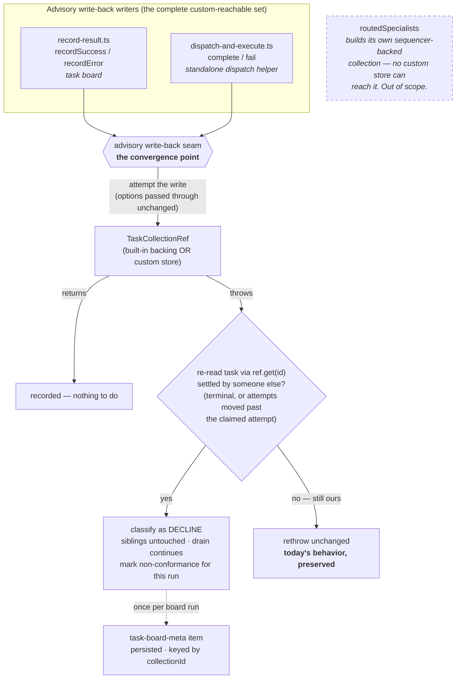

# FIX-964: Custom `TaskCollectionRef` implementations silently skip FIX-951's containment guards — Implementation Spec

> **Linear issue:** [FIX-964](https://linear.app/fixpoint-labs/issue/FIX-964/custom-taskcollectionref-implementations-silently-skip-fix-951s)
> **Epic:** [FIX-980 — Honest task substrate](https://linear.app/fixpoint-labs/issue/FIX-980) · epic-spec [`docs/specs/_epics/honest-task-substrate.md`](_epics/honest-task-substrate.md) · epic PR [#983](https://github.com/fixpoint-labs/flow-state-dev/pull/983)
> **Category:** Bug → implementation follows `diagnose`

---

## Part I — The Case

### 1. Problem — why it matters, why now

**In plain language.** The task board is the thing that runs a batch of work items in parallel. When one worker finishes, the board writes the result back onto that work item. Since FIX-951, the board asks for that write-back politely: *record my result only if this item is still mine and still open* — because by the time a slow worker finishes, someone else may have cancelled the item or handed it to a different worker. If the storage layer honours that request, a late result is quietly dropped and the other workers carry on. If it doesn't, the write-back raises an error that escapes the board's per-worker safety net and **every other work item on the board is abandoned, unfinished, forever.**

The framework's own storage honours the request. But the board also lets you supply *your own* storage — a documented, advertised extension point for external or custom stores. A store written before FIX-951, or written from the interface without reading the prose, ignores the request. Nothing tells you: it typechecks, it runs, and it takes the whole board down the first time a worker's result arrives late.

**Why now.** Three reasons, in ascending order of force.

1. **It is reproduced, not hypothetical.** A board on the documented factory pattern with a two-parameter write-back leaves both sibling tasks `pending` forever when one worker fails with an illegal transition. Typechecking the integration suite with that store in the tree **passed**.
2. **The workaround that shipped with FIX-951 is documentation.** A changeset note, a doc section, and a warning paragraph. That tells implementers to act; it does not make their boards safe. The epic's own definition of done rules this out explicitly — *"documentation telling implementers to remember is not a signal."*
3. **The failure class is already live in first-party code, which is the tell that the contract is too easy to get wrong.** `task-board/blocks/cascade-skip-dependents.ts:73-75` awaits `collection.cancel(...)` and then unconditionally labels the task `skipped` and cascades off it — if the cancel was declined, a task that is *not* cancelled is treated as though it were. That is now [FIX-985](https://linear.app/fixpoint-labs/issue/FIX-985) and is out of scope here, but it is evidence: when a write's outcome is unobservable, *we* get it wrong too, not just external implementers. And the test suite offers no protection — roughly fifty test call sites of these methods discard their results, so nothing in CI would notice a non-conforming store.

### 2. Solution in plain terms

**Stop trying to certify the storage, and make containment a property of the seam the board owns.**

FIX-951 made containment a property the *storage* must supply. That is the root of this defect: containment is something the **board** needs, and the board delegated it to a component it does not control and cannot inspect. Every mechanism proposed so far — a brand on the interface, an arity probe, making the option mandatory — is an attempt to *verify the delegation*. All of them verify what the author **declared**, and a declaration is precisely what a non-conforming author gets wrong.

So we move containment to the two places the substrate actually asks for an advisory write:

> Attempt the write. If it returns, we're done. If it **throws**, re-read the task. If the task turns out to be settled by someone else — already final, or its attempt counter has moved past the one we claimed under — the throw is **classified as a decline**: the outcome is recorded, the sibling tasks are untouched, and the drain continues. Anything else rethrows unchanged.

Three properties make this the right shape:

- **It observes a behavior, not a declaration.** The classification firing *is* the evidence that this store did not honour the advisory options. Nothing an author can satisfy with ceremony.
- **It reopens no race.** Nothing is read *before* the write. The write is attempted; the store decides atomically inside its own transaction; the seam only classifies *how the store reported the decision it already made*. The epic's binding constraint — the guard and its outcome come from the atomic mutation, never from a pre-check — holds, because the seam adds no guard at all. It adapts an error channel.
- **It costs nothing when the store conforms.** Both built-in backings honour the options and never throw on the enumerated cases, so the classification branch is unreachable on the built-in path. No behavior change for anyone who is already correct.

The board then records that the classification fired, once per run, on the `task-board-meta` item it already emits — a persisted, keyed, branchable surface (epic Decision 4). A caller can tell "this board ran on a store that does not honour advisory writes" from the board's own result.

**The philosophy this leans on.**

- **Tenet 5 — an invariant needs one convergence point, and every writer must pass through it.** This is the spec's spine. The advisory write-back is the convergence point, and §7 enumerates the *complete* writer set rather than the one the bug report happened to name. Getting that enumeration wrong is why FIX-951 only half-landed.
- **Tenet 2 — refine the substrate rather than add a concept beside it.** We add no certification vocabulary, no brand, no probe. We move an existing responsibility to where it can actually be held.
- **Tenet 7 — prove the goal, not the mock.** The evidence path is the issue's own reproduction run at integration level, not a unit test asserting a helper was called.

### 3. Tradeoffs & alternatives

**The decisive argument, and it came from the code rather than from preference.** Enumerating the writers turned up something that eliminates the entire certification family. There are **two** custom-reachable advisory write-back sites, and only one of them sees a factory:

| Writer | How it gets its store | Certifiable at a boundary? |
|---|---|---|
| `task-board/blocks/record-result.ts` (board recorders) | the board's `collection` factory config | yes |
| `tasks/helpers/dispatch-and-execute.ts` | handed a `TaskCollectionRef` **directly**, as an option | **no — there is no factory to certify at** |

A brand or an arity probe can only fire where the framework *constructs or receives* the store through a boundary it owns. `dispatchAndExecute` takes a ref as a plain option, so a factory-boundary check cannot protect it at all. **The seam is the only mechanism that covers the full writer set** — and it covers it without a boundary check anywhere.

*(Checked and deliberately excluded: `patterns/src/routedSpecialists/index.ts:444,473` looks like a third writer and is not one. It builds its own collection via `getOrCreateTaskCollection({ backing: "sequencer" })`, so no custom store can reach it. Its advisory writes are safe today and this spec does not touch them.)*

**The simpler approach considered — lean on Decision 1's return-type widening, plus docs.** Rejected on three counts. It is the approach the epic already downgraded from "closes it" to "substantially helps": a store that returns the new outcome while declaring only `(id, output)` compiles clean, because fewer-parameter assignability is untouched by a return-type change. It is ruled out by the epic's definition of done (#3, documentation is not a signal). And its cost picture worsened on re-measurement — roughly 22 sites across 4 files to be compile-clean, ~30 across 10 to be semantically complete. **A mechanism that is expensive *and* incomplete for this issue is a poor thing to make this issue depend on.** So this spec's mechanism deliberately does **not** require the widening to land; if it lands, §7 notes the free bonus it composes with.

**Where the genuine complexity is.** Not the classification — that's a dozen lines. It is the **rethrow path**. The seam must never convert a real failure into a silent decline: a store outage, CAS exhaustion, or an ordinary bug on a task that is *still ours* must propagate exactly as it does today. FIX-951's own docs draw this line ("a containment guard for task-state conflicts, not a blanket error suppressor") and the seam has to hold it. That is where the tests go.

### 4. Focus practices

1. **Verify a behavior, never certify a declaration.** *(change-specific; tenet 1.)* Any check this change adds must fire on what the store **did**, not on what its author wrote down. This is the rule that kills the brand, the arity probe, and the mandatory-parameter variants — apply it to anything new that gets proposed during implementation.
2. **Tenet 5 — enumerate every writer through the convergence point.** §7's writer set is the deliverable, not a footnote. If implementation finds a third custom-reachable advisory write, that is a spec gap: surface it, don't quietly route around it.
3. **BP-035, second-path — the off-state is the load-bearing one.** The seam's *rethrow* branch matters more than its classify branch. A store failure on a task still owned by this worker must propagate unchanged, and that needs its own test.
4. **BP-003 — the evidence path is the reproduction, not a unit assertion.** Epic Decision 5 makes containment an integration-level bar, because the escape only emerges from full `runAction` composition.
5. **BP-030 — tolerate the old shape.** The new field on `task-board-meta` is additive and optional; already-persisted board-meta records must still read cleanly.

### 5. What using it looks like

The public API does not change. What changes is what happens to a board built on a store that predates the contract — so the examples are behavioral, not syntactic.

**Before — a custom store on the documented factory pattern, missing the third argument.**

```ts
const board = taskBoard({
  name: "research",
  // Documented extension point: "(ctx) => TaskCollectionRef for
  // externally-managed / custom stores."
  collection: (ctx) => myExternalStore(ctx),
  workers: { researcher },
});
```

```
worker-2 fails with IllegalTaskTransitionError (cancelled → errored)
  → myExternalStore.fail() ignores the options and throws
  → the throw escapes the per-worker rescue
  → task-1 pending · task-3 pending        ← forever. The drain never finishes them.
```

**After — same store, unchanged.**

```
worker-2 fails with IllegalTaskTransitionError (cancelled → errored)
  → myExternalStore.fail() ignores the options and throws
  → the seam re-reads task-2: terminal, settled by someone else → classified as a decline
  → task-1 completed · task-3 completed    ← the board finishes its work.

task-board-meta { status: "completed", terminationReason: "all-completed",
                  advisoryWritesUnhonoured: { method: "fail", count: 1 } }
                                           ← persisted, keyed, branchable
```

**And the one thing that must *not* change** — a real failure on a task still ours:

```
myExternalStore.fail() throws because the store is unreachable
  → the seam re-reads task-2: still in_progress, still our attempt
  → rethrown unchanged. Exactly today's behavior.
```

### 6. Decisions & rules — the sign-off surface

1. **Containment moves to the substrate's advisory write-back seam; the storage interface is not certified.** *Alternative rejected:* certify the store at a boundary (brand, arity probe, capability probe). *Ramification:* the guarantee no longer depends on the store's cooperation, and it covers `dispatchAndExecute` — which no boundary check could reach, since it is handed a ref directly. We give up any *advance* warning that a store is non-conforming; we learn it the first time a write-back is declined, and we survive it.

2. **A throw from an advisory write-back is classified by re-reading the task, not by matching an error type.** *Alternative rejected:* catch only `IllegalTaskTransitionError`. *Ramification:* covers stores that throw their own error types (a custom store has no obligation to use ours), at the cost of one synchronous `get(id)` on the failure path only. The classification is a *report* decision, not a guard — the write already happened or didn't before we read.

3. **This spec does not depend on Decision 1's return-type widening.** *Alternative rejected:* build the runtime signal on an `undefined` return, which only exists once `complete`/`fail` widen. *Ramification:* FIX-964 is not blocked on FIX-976 and survives a scope-down of Option A. If the widening does land, an `undefined` return becomes an additional *earlier* tell (§7) — additive, never a precondition.

4. **The non-conformance signal lands on `task-board-meta`, once per board run.** *Alternative rejected:* a per-task item, or a thrown error, or a `console.warn`. *Ramification:* satisfies epic Decision 4 (persisted and branchable — `emit.component` defaults to persisted, and the item is already keyed by `collectionId`) without a new item type. Per-run rather than per-task keeps a board with fifty late results from emitting fifty signals. Costs a new optional field on a public item shape → BP-030 applies.

5. **The cast bypass is accepted as a knowing opt-out, and the existing cast in the tree is not treated as a defect.** *Alternative rejected:* chase casts (a lint rule, a nominal brand that a cast can't forge). *Ramification:* a cast now defeats only the *compile-time* early warning — it cannot defeat containment (the seam is untyped in effect: it runs however the ref was declared) and it cannot defeat the runtime signal (the classification is behavioral). The hole moves from *the guarantee* to *the warning*, which is what makes accepting it honest rather than resigned. Separately: `packages/orchestration/test/flow-policy.test.ts:45` casts a stub implementing only `list` and `get` — a read-only fixture for policy selectors, with no mutators at all, that never reaches a board or a write-back. It is not an instance of this problem and gets no change.

6. **"Make `options` non-optional" is eliminated on evidence, not on taste.** *Alternative rejected:* the deliberate-breaking-change variant the issue raised. *Ramification:* nobody re-walks it. Verified directly (`tsc 6.0.2`, under this repo's own compiler settings — `strictNullChecks`, `noImplicitAny`): a **two-parameter implementation remains assignable to a three-*required*-parameter signature**, in both annotated-object-literal and `class … implements` form. Fewer-parameter assignability is independent of the parameter's optionality, so making it required closes nothing — while breaking every store that is already correct. It is strictly worse than doing nothing.

7. **The writer set is exactly two sites, both in `@flow-state-dev/orchestration`, and `routedSpecialists` is excluded with a reason.** *Alternative rejected:* fix the board recorders only (what the bug report describes). *Ramification:* `dispatchAndExecute` gets the same containment, and the exclusion is recorded so a reviewer doesn't have to re-derive that `routedSpecialists` builds its own built-in-backed collection and is therefore unreachable by a custom store.

**Non-goals.** Implementing Decision 1's widening (FIX-976's). Installing any guard on the shared `patchRef` / `patchOne` helper — **epic constraint A1 is satisfied trivially: this issue touches that surface not at all.** Fixing FIX-985's cascade bug. Re-litigating FIX-951 on the built-in backings. Narrowing the extension point to a store-shaped interface (§12 follow-up).

**Size:** Medium — multi-file, one PR, ~150–250 LOC including tests.

---

## Part II — The Build Plan

### 7. Technical design

The change is one new substrate-internal seam plus two call sites routed through it. No public API changes.



**The seam's contract, in prose.** It takes the write to attempt, the task id, and the attempt the caller claimed under — everything it needs to answer "is this still ours?" — and returns a discriminated outcome the caller can branch on. It passes the advisory options through untouched, so a conforming store's behavior is bit-for-bit what it is today and the classification branch is dead code on that path.

Illustrative sketch of the seam's shape (**a sketch, not the contract** — names, signature, and placement are the implementer's):

```ts
// Attempt → on throw, classify by re-reading. Never a pre-check.
const outcome = await advisoryWriteBack(ref, taskId, claimedAttempt, (r) =>
  r.fail(taskId, message, { ifAllowed: true, expectAttempt: claimedAttempt })
);
// outcome: "recorded" | "declined-by-ref" | "declined-by-throw"
```

`"declined-by-throw"` is the interesting one: it means *containment held and this store is non-conforming*, which is both the fix and the signal in a single observation.

**Why `get(id)` is the right read.** It is **synchronous** on `TaskCollectionRef` (a committed-view read on both backings), it runs on the failure path only, and if the store is genuinely broken it will itself throw or return stale — in which case the seam rethrows, which is correct.

**Optional composition with Decision 1, if it lands.** Once `complete`/`fail` return a discriminated outcome, a store that predates the contract returns `undefined` where an outcome is required. That is a second, *earlier* tell — it fires on the first write-back rather than only when a task genuinely settles concurrently. Wire it as an additional input to the same non-conformance signal **behind a presence check**, never as a precondition. If Option A is scoped down, the seam is unaffected.

### 8. Implementation sequence

Discipline: `diagnose` (Linear category **Bug**). Build the feedback loop before the fix.

1. **Reproduce at integration level, red.** Stand up a board on the documented factory pattern with a two-parameter custom ref, three tasks, one worker failing with an illegal transition (`cancelled → errored`). Assert siblings reach `completed`. This fails today and is the goal check. *Depends on: nothing.*
2. **Add the seam** in the task-collection area, next to the advisory-write helpers it belongs with. Attempt → classify-on-throw → rethrow-otherwise. *Test:* the classify branch and, more importantly, the rethrow branch. *Depends on: 1.*
3. **Route the board recorders through it** (`task-board/blocks/record-result.ts`, both `recordSuccess` and `recordError`). Step 1 goes green here. *Depends on: 2.*
4. **Route `dispatchAndExecute` through it** (`tasks/helpers/dispatch-and-execute.ts`). Note its escape shape differs from the board's and needs its own coverage: a `complete()` throw is caught by the site's own `catch`, which then calls `fail()`, and a second throw from there escapes the handler **regardless of `onError`** — the `if (onError === "fail")` check sits *after* the `fail()` call. *Depends on: 2.*
5. **Emit the non-conformance signal** on `task-board-meta` (`task-board/blocks/board-meta.ts`), aggregated once per run. New field is **optional** (BP-030). *Depends on: 3.*
6. **Rewrite the docs the fix invalidates** (§11) and add the changeset. The FIX-951 warning paragraph is now half wrong and must be restated, not deleted. *Depends on: 3, 5.*

**No removals.** Unusually for a change of this shape (tenet 3), nothing is subtracted — the FIX-951 guards stay exactly as they are, and the seam is additive. The subtraction this change *enables* is the docs warning's imperative voice, handled in step 6.

**No PR plan** — single PR; the DAG above is intra-PR sequencing, not a split.

### 9. Edge cases & error handling

| Case | Expected |
|---|---|
| Conforming ref, task settled elsewhere | Store declines, returns normally. Seam returns `recorded`/`declined-by-ref`. **Unchanged from today.** |
| Non-conforming ref, task settled elsewhere | Store throws. Re-read shows terminal / attempt moved. Classified as decline; siblings unaffected; signal marked. **The fix.** |
| Non-conforming ref, task still ours, store outage | Store throws. Re-read shows `in_progress` and our attempt. **Rethrown unchanged.** The critical negative case. |
| `get(id)` itself throws or returns `undefined` | Cannot establish the task was settled elsewhere → **rethrow the original error**, not the read error. |
| Task genuinely missing (`"task not found"`) | Not an advisory-decline case. Rethrow. |
| Soft-fail path (retry budget left, `fail` → `pending`) | `expectAttempt` still governs; a re-pended task's attempt has not advanced, so the seam must not misread a legitimate retry as "settled elsewhere". Cover it. |
| Two workers both hit the classification in one run | Signal aggregates per run; count increments. No duplicate items (item is keyed). |
| Board with no factory (built-in backing) | Classification branch unreachable. Signal field absent — **not** `false`, so old readers and old records behave identically (BP-030). |

**Taxonomy.** Retryable/absorbable: exactly the FIX-951 enumerated set — a rejected transition and a lost claim, however the store reports it. Fatal: everything else, unchanged.

**Second-path walk (BP-035).** *Legacy:* old `task-board-meta` records lack the new field → optional, `== null`-guarded. *Null boundary:* `get(id)` returning `undefined`. *Concurrent:* the classification is itself the concurrency path. *Cancel/error:* the rethrow branch. *Flag off-state:* a board with no custom store must be byte-identical in behavior — assert it.

### 10. Testing strategy

**Goal & goal check (real path).** A board on the documented factory pattern with a two-parameter custom ref: three tasks, worker 2 fails with an `IllegalTaskTransitionError`, and the goal is that **workers 1 and 3 reach `completed`**. This is the issue's own reproduction, so the check proves the user-visible outcome rather than a helper's invocation. Runs at **integration** level per epic Decision 5 — the escape only emerges from full `runAction` composition, and per-backing unit tests provably do not catch it.

**CI specs (deterministic), in observable terms:**
- Non-conforming ref + settled-elsewhere task → siblings complete; `task-board-meta` carries the non-conformance field.
- Non-conforming ref + store outage on a task still ours → the original error propagates, unchanged, with its original message.
- Conforming ref (both built-in backings) → behavior and emitted items identical to before the change; the new field is **absent**.
- `dispatchAndExecute` on a non-conforming ref → the handler does not reject; covers the `onError: "skip"` path specifically, since the escape today bypasses `onError` entirely.
- Legitimate soft-fail retry → not misclassified as settled-elsewhere.

**Note on existing coverage.** There is none to lean on: ~50 existing test call sites of `complete`/`fail` discard their results, so nothing in CI today distinguishes a conforming store from a non-conforming one. Every test above is new signal, not a duplicate of something already green.

### 11. Documentation plan

Docs changes are required: the change alters observable behavior at a documented public extension point, and the existing prose actively states something that becomes false.

| Surface | Action | What |
|---|---|---|
| `apps/docs/docs/orchestration/task-board.md` (~360) | **EXTEND (rewrite)** | The FIX-951 warning paragraph currently ends *"that throw escapes the per-worker rescue and abandons the rest of the board's tasks."* That is the sentence this fix falsifies. Restate: the board now contains it, and what you still owe is honouring the guards for **correctness** (not clobbering a settlement someone recorded deliberately) rather than for the board's **survival**. Keep the existing direct voice — do not promote it to a warning admonition. |
| `apps/docs/docs/orchestration/task-substrate.md` § "Recording a result that may no longer apply" (~95) | **EXTEND** | One paragraph after the "only those two outcomes go quiet" passage: what the substrate does when a store doesn't cooperate, and where the signal surfaces. |
| `apps/docs/guides/board-lifecycle.md` (~174) | **EXTEND** | The "externally-managed store" bullet gains one clause pointing at the guarantee. |
| `packages/orchestration/src/tasks/collection/types.ts` (`TaskCollectionRef` § "Implementing this interface yourself") | **EXTEND (rewrite)** | *"The type system cannot hold you to this"* is now only half the story. Split what the substrate **guarantees** from what the implementer still **owes** (BP-007). |
| `.changeset/*.md` | **CREATE** | `minor` for `@flow-state-dev/orchestration` — behavior change at a documented extension point plus a new optional field on a public item shape. Pre-1.0, so `patch`/`minor` only (BP-022). |

**No new pages** — every affected concept already has a home, and a new page would fragment the orchestration sidebar for a behavioral fix. **No blog post.** **No `packages/orchestration/README.md` change** — the seam is substrate-internal and no public export changes.

**Cross-links:** `task-board.md` → `task-substrate.md#recording-a-result-that-may-no-longer-apply` already exists and stays. **Voice risks** (per CLAUDE.md): the topic invites "robust"/"seamless" — avoid both; introduce "advisory write" in plain terms on first use in the guide; keep em-dashes sparse in the rewritten warning paragraph, which is already dense.

### 12. Dependencies, open questions & follow-ups

**Blocking: none.** Decision 3 above makes this independent of FIX-976 and of Decision 1's widening. It can spec, build, and merge on its own.

**Coordination (not blocking) — expected collision surface with FIX-976,** which is being specced in parallel on the same interface. Flagged for `cross-spec-review`:

| Surface | Collision |
|---|---|
| `tasks/collection/types.ts` | **High, textual.** FIX-976 widens return types; FIX-964 rewrites the "Implementing this interface yourself" doc block. Same file, different regions. |
| `apps/docs/.../task-board.md`, `task-substrate.md` | **High, textual.** Both rewrite the advisory-write prose. |
| `resource-backed.ts`, `sequencer-backed.ts` | **None by construction** — FIX-964 touches neither. Recorded as a commitment so FIX-976 owns them cleanly. |
| `patchRef` / `patchOne` | **None** — A1 satisfied trivially; FIX-964 does not touch the patch surface. Worth noting the five methods routing through that helper stay `Promise<void>` and would silently drop an outcome, which is FIX-976's territory, not this issue's. |
| `record-result.ts` | **Low** — FIX-964 owns it; FIX-976's tools live in `skills/task-tools-capability.ts`. |
| *Semantic* | If FIX-976 lands the widening, FIX-964's optional `undefined`-return tell composes with it. If FIX-976 scopes `complete`/`fail` out, FIX-964 loses only that bonus. **Not a dependency in either direction.** |

**Settled claims:**

- **Settled:** widening `complete`/`fail`'s return type gives a compile-time signal against a legacy two-argument custom ref — **CONFIRMED**: errors at implementation-declaration time in all three declaration forms (annotated object literal, inline factory arrow, `class … implements`), because return types are strictly covariant in TS and the `void`-return special case runs the opposite direction. Two gaps survive it: a ref returning the new outcome while declaring no `options` parameter compiles clean, and a cast bypasses it. (Epic-spec §5; this spec's Decisions 1 and 5 are the response to those two gaps.)
- **Settled:** making the `options` parameter **non-optional** closes the options-parameter gap — **REFUTED**: a two-parameter implementation is still assignable to a three-required-parameter signature, in both object-literal and `class … implements` form, verified with `tsc 6.0.2` under this repo's compiler settings. Fewer-parameter assignability is independent of optionality. (Decision 6.)

**Follow-ups (flagged, not built):**

- **The extension point is at the wrong altitude — a deepening opportunity for `improve-codebase-architecture`.** `TaskCollectionRef` asks a custom-store author to implement ~18 methods carrying state-machine semantics, claim/lease semantics, CAS semantics, and advisory-write semantics. Most of that is substrate logic the author is being asked to re-derive, and every re-derivation is a chance to get containment (or dep resolution, or attempt accounting) wrong. The structurally right answer is a **narrower, store-shaped extension point** — read/CAS-write persistence only, with the substrate composing `TaskCollectionRef` on top of it — leaving the raw-ref factory for genuine full control. That is a new public surface and a much larger issue, so it is deliberately out of scope; this spec makes the existing extension point *safe*, not *smaller*.
- **FIX-985** — `cascade-skip-dependents.ts:73` treats a declined `cancel()` as success. Same defect family, separate issue, already filed.
- **~50 test call sites discard write results**, which is why CI has no signal here. Not worth a sweep on its own; a natural candidate for whichever issue lands the widened contract.

### 13. Review notes for the implementer

*(No spec-PR feedback yet — populated during Step 6.5.)*

---

## Spec evolution

- **Spec drafted** — framed the defect as *containment delegated to a component the board cannot inspect*, and rejected the whole certify-the-store family (brand / arity probe / mandatory parameter) on one code-derived argument: `dispatchAndExecute` is handed a ref directly, so no boundary check can reach it. Chose a substrate-owned advisory write-back seam that classifies a throw by re-reading the task, deliberately independent of Decision 1's widening. Enumerated the convergence point's complete writer set (two sites, plus `routedSpecialists` excluded with a reason) after finding the bug report named only one. Eliminated the mandatory-parameter candidate empirically rather than by argument.
