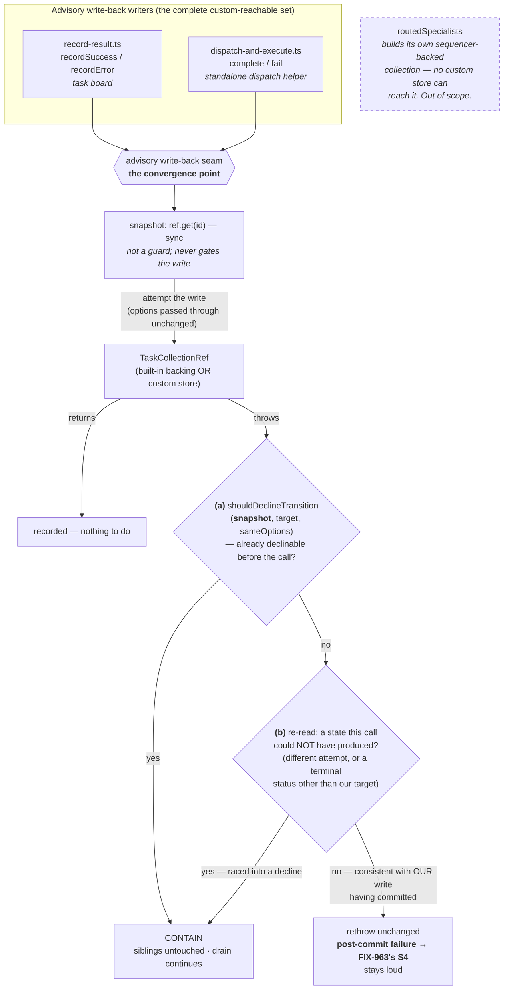

# FIX-964: Custom `TaskCollectionRef` implementations silently skip FIX-951's containment guards — Implementation Spec

> **Linear issue:** [FIX-964](https://linear.app/fixpoint-labs/issue/FIX-964/custom-taskcollectionref-implementations-silently-skip-fix-951s)
> **Epic:** [FIX-980 — Honest task substrate](https://linear.app/fixpoint-labs/issue/FIX-980) · epic-spec [`docs/specs/_epics/honest-task-substrate.md`](_epics/honest-task-substrate.md) · epic PR [#983](https://github.com/fixpoint-labs/flow-state-dev/pull/983)
> **Category:** Bug → implementation follows `diagnose`
>
> **Note for reviewers:** this spec cites the epic-spec's cross-cutting Decisions (1, 4, 5 and constraint A1) and its §5 settled claims. That document lives on the `epic/honest-task-substrate` branch and so is **not in this PR's tree** — read it on epic PR [#983](https://github.com/fixpoint-labs/flow-state-dev/pull/983) if you want to verify a citation.

---

## Part I — The Case

### 1. Problem — why it matters, why now

**In plain language.** The task board is the thing that runs a batch of work items in parallel. When one worker finishes, the board writes the result back onto that work item. Since FIX-951, the board asks for that write-back politely: *record my result only if this item is still mine and still open* — because by the time a slow worker finishes, someone else may have cancelled the item or handed it to a different worker. If the storage layer honours that request, a late result is quietly dropped and the other workers carry on. If it doesn't, the write-back raises an error that escapes the board's per-worker safety net and **every other work item on the board is abandoned, unfinished, forever.**

The framework's own storage honours the request. But the board also lets you supply *your own* storage — a documented, advertised extension point for external or custom stores. A store written before FIX-951, or written from the interface without reading the prose, ignores the request. Nothing tells you: it typechecks, it runs, and it takes the whole board down the first time a worker's result arrives late.

**Why now.** Three reasons, in ascending order of force.

1. **It is reproduced, not hypothetical.** A board on the documented factory pattern with a two-parameter write-back leaves both sibling tasks `pending` forever when one worker fails with an illegal transition. Typechecking the integration suite with that store in the tree **passed**.
2. **The workaround that shipped with FIX-951 is documentation.** A changeset note, a doc section, and a warning paragraph. That tells implementers to act; it does not make their boards safe. The epic's own definition of done rules this out explicitly — *"documentation telling implementers to remember is not a signal."*
3. **The failure class is already live in first-party code, which is the tell that the contract is too easy to get wrong.** `task-board/blocks/cascade-skip-dependents.ts:73-75` awaits `collection.cancel(...)` and then unconditionally labels the task `skipped` and cascades off it — if the cancel was declined, a task that is *not* cancelled is treated as though it were. That is now [FIX-985](https://linear.app/fixpoint-labs/issue/FIX-985) and is out of scope here, but it is evidence: when a write's outcome is unobservable, *we* get it wrong too, not just external implementers. And the test suite offers no protection — roughly fifty test call sites of these methods discard their results, so nothing in CI would notice a non-conforming store.

### 2. Solution in plain terms

**Stop trying to certify the storage, and make containment a property of the seam the board owns.**

FIX-951 made containment a property the *storage* must supply. That is the root of this defect: containment is something the **board** needs, and the board delegated it to a component it does not control and cannot inspect. Every mechanism proposed so far — a brand on the interface, an arity probe, making the option mandatory — is an attempt to *verify the delegation*. All of them verify what the author **declared**, and a declaration is precisely what a non-conforming author gets wrong.

So we move containment to the two places the substrate actually asks for an advisory write:

> Snapshot the task, attempt the write, and if it **throws**, ask one question: **is this throw attributable to a decline that a conforming store would have made *before* committing anything?** If yes, contain it — the siblings are untouched and the drain continues. If not, rethrow unchanged.

The question is deliberately narrow, and the narrowness is the point. A throw the seam *cannot* attribute to a pre-commit decline includes the case where the write **committed and something after it threw** — and that case belongs to FIX-963, whose whole purpose is to make it loud. So the seam contains only what is its own, and hands everything else on. §7 states the attribution rule and the composition contract.

The predicate itself is not re-derived: the substrate already has the one both backings evaluate inside their atomic write, and the seam calls **that**.

**What this guarantees, stated narrowly on purpose.** The seam fires on a **throw**. So the guarantee is *the board survives a non-conforming store*, not *a non-conforming store behaves like a conforming one*. A store that silently applies a stale write without throwing is still wrong and still uncaught — it corrupts one task's data, which is bad, but it does not abandon the other workers, which is the filed defect. Closing that second gap would mean reproducing FIX-951's full advisory semantics on the store's behalf, which is not possible from outside its atomic section and is explicitly not attempted here.

Three properties make this the right shape:

- **It observes a behavior, not a declaration.** The classification firing *is* the evidence that this store did not honour the advisory options. Nothing an author can satisfy with ceremony.
- **It reopens no race.** Nothing is read *before* the write. The write is attempted; the store decides atomically inside its own transaction; the seam only classifies *how the store reported the decision it already made*. The epic's binding constraint ([#983](https://github.com/fixpoint-labs/flow-state-dev/pull/983)) — the guard and its outcome come from the atomic mutation, never from a pre-check — holds, because the seam adds no guard at all. It adapts an error channel.
- **It costs nothing when the store conforms.** Both built-in backings honour the options and never throw on the enumerated cases, so the classification branch is unreachable on the built-in path. No behavior change for anyone who is already correct.

**Reporting the non-conformance is deliberately *not* in this change.** The first draft added a field to the board's `task-board-meta` item. Review pushed back and the pushback is right: the containment fix alone closes the filed bug, whereas the signal needs cross-worker aggregation out of isolated per-worker rescue handlers into a block that today re-derives its counts from `collection.list()` and has no channel for seam firings at all. That plumbing is plausibly larger than the seam it would describe. It is also **board-only** — `dispatchAndExecute`, the second writer and the one whose lack of a factory carries this spec's central argument, emits no board-meta item, so the signal would cover one writer while containment covers both. Deferred as a follow-up (§12) rather than half-specced here.

**The philosophy this leans on.**

- **Tenet 5 — an invariant needs one convergence point, and every writer must pass through it.** This is the spec's spine. The advisory write-back is the convergence point, and §7 enumerates the *complete* writer set rather than the one the bug report happened to name. Getting that enumeration wrong is why FIX-951 only half-landed.
- **Tenet 2 — refine the substrate rather than add a concept beside it.** We add no certification vocabulary, no brand, no probe. We move an existing responsibility to where it can actually be held.
- **Tenet 7 — prove the goal, not the mock.** The evidence path is the issue's own reproduction run at integration level, not a unit test asserting a helper was called.

### 3. Tradeoffs & alternatives

**The decisive argument, and it came from the code rather than from preference.** Enumerating the writers turned up something that eliminates the entire certification family. There are **two** custom-reachable advisory write-back sites, and only one of them sees a factory:

| Writer | How it gets its store | Certifiable at a boundary? |
|---|---|---|
| `task-board/blocks/record-result.ts` (board recorders) | the board's `collection` factory config | yes |
| `tasks/helpers/dispatch-and-execute.ts` | handed a `TaskCollectionRef` **directly**, as an option | **no — there is no factory to certify at** |

A brand or an arity probe can only fire where the framework *constructs or receives* the store through a boundary it owns. `dispatchAndExecute` takes a ref as a plain option, so a factory-boundary check cannot protect it at all. **The seam is the only mechanism that covers the full writer set** — and it covers it without a boundary check anywhere.

*(Checked and deliberately excluded: `patterns/src/routedSpecialists/index.ts:444,473` looks like a third writer and is not one. It builds its own collection via `getOrCreateTaskCollection({ backing: "sequencer" })`, so no custom store can reach it. Its advisory writes are safe today and this spec does not touch them.)*

**The simpler approach considered — lean on Decision 1's return-type widening, plus docs.** Rejected on three counts. It is the approach the epic already downgraded from "closes it" to "substantially helps": a store that returns the new outcome while declaring only `(id, output)` compiles clean, because fewer-parameter assignability is untouched by a return-type change. It is ruled out by the epic's definition of done (#3, documentation is not a signal). And its cost picture worsened on re-measurement — roughly 22 sites across 4 files to be compile-clean, ~30 across 10 to be semantically complete. **A mechanism that is expensive *and* incomplete for this issue is a poor thing to make this issue depend on.** So this spec's mechanism deliberately does **not** require the widening to land; if it lands, §7 notes the free bonus it composes with.

**Where the genuine complexity is.** Two places, and neither is the classification itself.

The first is the **rethrow path**. The seam must never convert a real failure into a silent decline: a store outage, CAS exhaustion, or an ordinary bug on a task that is *still ours* must propagate exactly as it does today. FIX-951's own docs draw this line ("a containment guard for task-state conflicts, not a blanket error suppressor") and the seam has to hold it. That is where the tests go.

The second is **telling a write that never committed apart from one that committed and then threw** — and getting it wrong here does not just misreport, it destroys a sibling issue's signal. In both backings `emit` runs after the commit and outside the write's try, so a failing `onChange` rejects `complete()` with the task already durably terminal. A read taken *after* the error cannot distinguish that from "someone else had already settled it," which is why this spec snapshots the task *before* the write and attributes the throw against the snapshot (§7). Contain only what was declinable pre-commit; rethrow everything else, because everything else is [FIX-963](https://linear.app/fixpoint-labs/issue/FIX-963)'s **S4** and has to stay loud. The two specs therefore *compose* rather than share a rule — the split point is the commit.

### 4. Focus practices

1. **Verify a behavior, never certify a declaration.** *(change-specific; tenet 1.)* Any check this change adds must fire on what the store **did**, not on what its author wrote down. This is the rule that kills the brand, the arity probe, and the mandatory-parameter variants — apply it to anything new that gets proposed during implementation.
2. **Tenet 5 — enumerate every writer through the convergence point.** §7's writer set is the deliverable, not a footnote. If implementation finds a third custom-reachable advisory write, that is a spec gap: surface it, don't quietly route around it.
3. **BP-035, second-path — the off-state is the load-bearing one.** The seam's *rethrow* branch matters more than its classify branch. A store failure on a task still owned by this worker must propagate unchanged, and that needs its own test.
4. **BP-003 — the evidence path is the reproduction, not a unit assertion.** Epic Decision 5 ([#983](https://github.com/fixpoint-labs/flow-state-dev/pull/983)) makes containment an integration-level bar, because the escape only emerges from full `runAction` composition.
5. **Single-source the decline predicate; never restate it.** *(change-specific; tenet 5.)* The seam calls `shouldDeclineTransition` — the same function both backings evaluate inside their atomic write. A hand-rolled equivalent is the failure mode here: this spec's own first draft hand-rolled one and got it wrong, and even a *correct* copy diverges the moment the transition table changes.

### 5. What using it looks like

The public API does not change. What changes is what happens to a board built on a store that predates the contract — so the examples are behavioral, not syntactic.

**Before — a custom store on the documented factory pattern, missing the third argument.**

```ts
const board = taskBoard({
  name: "research",
  // Documented extension point: "(ctx) => TaskCollectionRef for
  // externally-managed / custom stores."
  collection: (ctx) => myExternalStore(ctx),
  workers: { researcher },
});
```

```
worker-2 fails with IllegalTaskTransitionError (cancelled → errored)
  → myExternalStore.fail() ignores the options and throws
  → the throw escapes the per-worker rescue
  → task-1 pending · task-3 pending        ← forever. The drain never finishes them.
```

**After — same store, unchanged.**

```
worker-2 fails with IllegalTaskTransitionError (cancelled → errored)
  → seam snapshots task-2 first: already cancelled
  → myExternalStore.fail() ignores the options and throws
  → clause (a): shouldDeclineTransition(snapshot, ...) was already true
    → a conforming store would have declined before committing → CONTAINED
  → task-1 completed · task-3 completed    ← the board finishes its work.

task-board-meta { status: "completed", terminationReason: "blocked-by-failures",
                  counts: { total: 3, completed: 2, cancelled: 1, ... } }
```

`terminationReason` is `"blocked-by-failures"`, not `"all-completed"` — task-2 really is cancelled, and `createBoardMetaCompleted` classifies purely structurally on `counts.completed === counts.total`. **This spec changes neither the termination contract nor the board-meta shape**; it changes only whether task-1 and task-3 ever finish. Distinguishing "a task was cancelled" from "the store misbehaved" is what the deferred signal ([FIX-986](https://linear.app/fixpoint-labs/issue/FIX-986)) would add.

**And the two things that must *not* be contained.** A real failure on a task we still hold:

```
myExternalStore.fail() throws because the store is unreachable
  → snapshot was in_progress at our attempt → clause (a) false
  → re-read is still in_progress at our attempt → clause (b) false
  → rethrown unchanged. Exactly today's behavior.
```

And a write that *committed* before throwing — the case that belongs to FIX-963:

```
store commits errored, then its onChange throws while publishing the event
  → snapshot was in_progress at our attempt → clause (a) false
  → re-read is errored at OUR target and OUR attempt — consistent with our own
    write having landed → clause (b) false
  → rethrown unchanged. FIX-963's S4 stays loud; the seam does not eat it.
```

### 6. Decisions & rules — the sign-off surface

1. **Containment moves to the substrate's advisory write-back seam; the storage interface is not certified.** *Alternative rejected:* certify the store at a boundary (brand, arity probe, capability probe). *Ramification:* the guarantee no longer depends on the store's cooperation, and it covers `dispatchAndExecute` — which no boundary check could reach, since it is handed a ref directly. We give up any *advance* warning that a store is non-conforming; we learn it the first time a write-back is declined, and we survive it.

2. **The seam snapshots the task *before* the write and attributes a throw against that snapshot, calling the substrate's own `shouldDeclineTransition` rather than re-deriving it.** *Alternatives rejected:* classify from a post-error read alone (the round-1 design — it cannot tell "already settled" from "I settled it and then the emit threw", which is the flaw item 1 of round 2 found); catch only `IllegalTaskTransitionError` (misses stores that throw their own error types); hand-roll an ownership check (the original draft, which dropped the status half of attempt ownership). *Ramification:* one synchronous `get(id)` moves onto the happy path, and the seam evaluates exactly the predicate both backings evaluate inside their atomic write, so it cannot drift as the transition table evolves. **The snapshot is not a guard** — it never decides whether to write; the write always proceeds and the store's own atomic section always decides. It is read only to interpret a throw after the fact, which is why it does not reopen the check-then-write window the epic constraint forbids.

3. **A committed-then-threw write is *distinguished* from a pre-commit decline, and only the latter is contained.** *Alternative rejected:* round 1's "accept the ambiguity as a bounded limitation" — defensible for this issue read alone, and **wrong at epic level**, because the thing it silently swallowed is FIX-963's headline behaviour (its S4). Verified: in both backings `emit` runs *after* the commit and outside the write's try (`resource-backed.ts:203-212`, `sequencer-backed.ts:~202-221`), so a failing `onChange` rejects `complete()` with the task already durably terminal — and a post-error read of that state is indistinguishable from "someone else had already settled it" unless the pre-write state is known. *Ramification:* the seam contains only throws attributable to a **pre-commit** decline and rethrows everything else, so a post-commit recorder failure stays loud and reaches FIX-963. The residual is narrow and stated in §7: a third party setting exactly this call's target status at this call's attempt inside the snapshot→write window is rethrown as if it were a post-commit failure. The bias is deliberate — rethrowing something containable costs this board, whereas containing something loud costs a sibling issue its entire signal.

4. **This spec does not depend on Decision 1's return-type widening.** *Alternative rejected:* build the mechanism on the widened return value — detecting a legacy ref by its `undefined` return — which only exists once `complete`/`fail` widen. *Ramification:* FIX-964 is neither blocked on FIX-976 nor invalidated by a scope-down of Option A; the seam works against today's `Promise<void>` contract. The widening remains a useful *compile-time* early warning and, if it lands, an `undefined` return is a cheap extra input to the deferred signal (Decision 5) — additive, never a precondition.

5. **v1 ships containment only; reporting non-conformance is deferred to a follow-up.** *Alternative rejected:* add a field to `task-board-meta` in this change (the first draft's plan). *Ramification:* the filed bug closes and the change stays small — no new field on a public item shape, so BP-030 does not arise and the epic's Decision 4 obligation (a persisted, branchable surface) is deferred with the feature rather than partly met. The costs of deferring: a caller still cannot distinguish "a task was legitimately cancelled" from "the store misbehaved," and the epic's "what done looks like" #3 — *a board either gets containment or gets a signal that it doesn't* — is satisfied on its first limb only. Accepted because the aggregation plumbing (cross-worker, out of isolated rescue handlers, into a block with no channel for it) is plausibly larger than the seam, and because it would cover only one of the two writers. **Epic Decision 4 and the definition of done are on epic PR [#983](https://github.com/fixpoint-labs/flow-state-dev/pull/983).**

6. **The cast bypass is accepted as a knowing opt-out, and the existing cast in the tree is not treated as a defect.** *Alternative rejected:* chase casts (a lint rule, a nominal brand that a cast can't forge). *Ramification:* a cast defeats only the *compile-time* early warning. It cannot defeat containment, because the seam never consults the ref's declared type — it runs on whatever object it was handed, however that object was typed. The hole moves from *the guarantee* to *the warning*, which is what makes accepting it honest rather than resigned. Separately: `packages/orchestration/test/flow-policy.test.ts:45` casts a stub implementing only `list` and `get` — a read-only fixture for policy selectors, with no mutators at all, that never reaches a board or a write-back. It is not an instance of this problem and gets no change.

7. **"Make `options` non-optional" is eliminated on evidence, not on taste.** *Alternative rejected:* the deliberate-breaking-change variant the issue raised. *Ramification:* nobody re-walks it. Verified directly (`tsc 6.0.2`, under this repo's own compiler settings — `strictNullChecks`, `noImplicitAny`): a **two-parameter implementation remains assignable to a three-*required*-parameter signature**, in both annotated-object-literal and `class … implements` form. Fewer-parameter assignability is independent of the parameter's optionality, so making it required closes nothing — while breaking every store that is already correct. It is strictly worse than doing nothing.

8. **The writer set is exactly two sites, both in `@flow-state-dev/orchestration`, and `routedSpecialists` is excluded with a reason.** *Alternative rejected:* fix the board recorders only (what the bug report describes). *Ramification:* `dispatchAndExecute` gets the same containment, and the exclusion is recorded so a reviewer doesn't have to re-derive that `routedSpecialists` builds its own built-in-backed collection and is therefore unreachable by a custom store.

**Non-goals.** Implementing Decision 1's widening (FIX-976's). Installing any guard on the shared `patchRef` / `patchOne` helper — **epic constraint A1 ([#983](https://github.com/fixpoint-labs/flow-state-dev/pull/983)) is satisfied trivially: this issue touches that surface not at all.** Fixing FIX-985's cascade bug. Re-litigating FIX-951 on the built-in backings. Narrowing the extension point to a store-shaped interface (§12 follow-up).

**Size:** Medium — multi-file, one PR, ~150–250 LOC including tests.

---

## Part II — The Build Plan

### 7. Technical design

The change is one new substrate-internal seam plus two call sites routed through it. No public API changes.



#### The decline rule — call the substrate's own predicate, don't restate it

The seam snapshots the task, attempts the write, and on a throw asks whether the throw is attributable to a **pre-commit decline**. It contains only those. The rule, verbatim:

> **Snapshot.** Before the write, read the task (`ref.get(id)` — synchronous on both backings). This is **not a guard**: it never decides whether to write, so it does not reopen the check-then-write window the epic constraint forbids. The write always proceeds and the store's own atomic section always decides.
>
> **On a throw, contain if either:**
> **(a)** `shouldDeclineTransition(snapshot, targetStatus, sameOptions)` is already true — the task was settled or displaced *before* this call, so a conforming store would have declined and a throw means non-conformance; **or**
> **(b)** a re-read shows a state **this call could not have produced** — settled under a *different* attempt, or a terminal status *other than* the target this call was attempting (`cancelled` when attempting `completed`, say). That is a third party settling the task inside the snapshot→write window.
>
> **Otherwise rethrow unchanged.** This deliberately includes *terminal at this call's own target and attempt*, which is consistent with **our write having committed** — a post-commit failure, which is FIX-963's to report, not ours to swallow.

The predicate in (a) is not re-derived: `shouldDeclineTransition` in `tasks/collection/internal.ts` is exactly what both backings evaluate inside their atomic write. The seam must supply the target status the way the backings do — `completed` for `complete`; for `fail`, `shouldRetryOnFail(task) ? "pending" : "errored"`, exported from the same module — and pass the caller's own options, so the predicate sees the inputs it would have seen inside the write.

**Why single-sourcing that predicate matters even though the rule is not currently divergent.** `shouldDeclineTransition` has three decline arms (`ifAllowed` + terminal; `ifAllowed` + illegal transition; `expectAttempt` + `!attemptOwnsTask`). Round 1 cited an illegal transition from a non-terminal status (`pending → errored`, `blocked → errored`) as a gap; **verified not to be a live divergence**, because at `pending`/`blocked` the status half of `attemptOwnsTask` already fails. Under today's table the arms are logically equivalent for every target `complete`/`fail` can produce. So the reason to call the predicate is **drift, not a present bug** — the equivalence is a property of the transition table, not of the rule, and a hand-rolled copy diverges silently the moment the table changes while every test still passes.

#### Composition with FIX-963 — exactly one of us reports each throw

This is a contract between two specs, so it is stated as one:

> **The seam contains only throws it can attribute to a pre-commit decline. Every throw it cannot so attribute is rethrown unchanged, and classifying those is FIX-963's.** Neither side consumes the other's predicate, and neither needs to: the two questions are different. FIX-963 asks "my write **committed** and something after it threw — what landed?" This spec asks "would a conforming store have **declined** this call before committing anything?" The split point is the commit, and clause (b) exists precisely so a race does not push a pre-commit decline across it.

Verified why the split is necessary rather than merely tidy: in both backings `emit` runs **after** the commit and **outside** the write's try (`resource-backed.ts:203-212`, `sequencer-backed.ts:~202-221`), so a failing `onChange` rejects `complete()` with the task already durably terminal at the expected attempt. Round 1's post-error-read-only design classified that as "a conforming store would have declined" and contained it — silently eating FIX-963's S4. That is the bug this round fixes.

**Residual, stated rather than hidden.** If a third party sets *exactly* this call's target status at *exactly* this call's attempt inside the snapshot→write window, and the store is non-conforming, the throw is rethrown as though it were a post-commit failure — and the board dies as it does today. Narrow (it needs that double coincidence), and the bias is deliberate: rethrowing something containable costs this one board, whereas containing something loud costs a sibling issue its entire signal.

Illustrative sketch (**a sketch, not the contract** — names, signature, and placement are the implementer's):

```ts
const snapshot = ref.get(taskId);
const outcome = await advisoryWriteBack(ref, snapshot, target, (r) =>
  r.fail(taskId, message, { ifAllowed: true, expectAttempt: claimedAttempt })
);
// outcome: "recorded" | "declined-by-ref" | "contained-pre-commit-decline"
// a post-commit throw never reaches an outcome — it propagates
```

**Optional composition with Decision 1, if it lands.** Once `complete`/`fail` return a discriminated outcome, a store that predates the contract returns `undefined` where an outcome is required — a cheap extra input to the deferred signal ([FIX-986](https://linear.app/fixpoint-labs/issue/FIX-986)), behind a presence check, never a precondition. If Option A is scoped down, the seam is unaffected.

### 8. Implementation sequence

Discipline: `diagnose` (Linear category **Bug**). Build the feedback loop before the fix.

1. **Reproduce at integration level, red.** Stand up a board on the documented factory pattern with a two-parameter custom ref, three tasks, one worker failing with an illegal transition (`cancelled → errored`). Assert siblings reach `completed`. This fails today and is the goal check. *Depends on: nothing.*
2. **Add the seam** in the task-collection area, next to the advisory-write helpers it belongs with. Attempt → classify-on-throw → rethrow-otherwise. *Test:* the classify branch and, more importantly, the rethrow branch. *Depends on: 1.*
3. **Route the board recorders through it** (`task-board/blocks/record-result.ts`, both `recordSuccess` and `recordError`). Step 1 goes green here. *Depends on: 2.*
4. **Route `dispatchAndExecute` through it** (`tasks/helpers/dispatch-and-execute.ts`). Note its escape shape differs from the board's and needs its own coverage: a `complete()` throw is caught by the site's own `catch`, which then calls `fail()`, and a second throw from there escapes the handler **regardless of `onError`** — the `if (onError === "fail")` check sits *after* the `fail()` call. *Depends on: 2.*
5. **Rewrite the docs the fix invalidates** (§11) and add the changeset. The FIX-951 warning paragraph is now half wrong and must be restated, not deleted. *Depends on: 3, 4.*

*(No signal-emission step — deferred per Decision 5. Nothing in `task-board/blocks/board-meta.ts` changes.)*

**No removals.** Unusually for a change of this shape (tenet 3), nothing is subtracted — the FIX-951 guards stay exactly as they are, and the seam is additive. The subtraction this change *enables* is the docs warning's imperative voice, handled in step 6.

**No PR plan** — single PR; the DAG above is intra-PR sequencing, not a split.

### 9. Edge cases & error handling

| Case | Expected |
|---|---|
| Conforming ref, task settled elsewhere | Store declines, returns normally. **Unchanged from today.** |
| Non-conforming ref, task settled/displaced **before** the call | Store throws; clause (a) fires on the snapshot. **Contained** — siblings unaffected. **The fix.** |
| Non-conforming ref, third party settles inside the snapshot→write window to a status this call wasn't attempting | Store throws; clause (b) fires. **Contained.** |
| **Write commits, then `emit`/`onChange` throws** | Snapshot was ours and writable; re-read is terminal at our own target and attempt. Neither clause fires → **rethrown unchanged.** FIX-963's S4 stays loud. **The round-2 fix — assert this explicitly.** |
| Non-conforming ref, task still ours, store outage | Neither clause fires → **rethrown unchanged.** The critical negative case. |
| `get(id)` throws or returns `undefined` at snapshot time | No snapshot → clause (a) unavailable. Fall through to (b); if that cannot fire either, **rethrow the original error**, never the read error. |
| Task genuinely missing (`"task not found"`) | Not an advisory-decline case. Rethrow. |
| Soft-fail path (retry budget left, `fail` → `pending`) | Target is `pending`, non-terminal. A re-pended task's attempt has not advanced, so the seam must not misread a legitimate retry as a decline. Cover it. |
| Board with no factory (built-in backing) | Both clauses unreachable; no emitted item changes. Behaviour must be byte-identical to today. |

*(No signal-marking or per-run aggregation rows — deferred with the feature to [FIX-986](https://linear.app/fixpoint-labs/issue/FIX-986). Nothing in this change emits or counts anything.)*

**Taxonomy.** Retryable/absorbable: exactly the FIX-951 enumerated set — a rejected transition and a lost claim, however the store reports it. Fatal: everything else, unchanged.

**Second-path walk (BP-035).** *Legacy:* no persisted shape changes, so there is no dual-read obligation — a deliberate consequence of Decision 5. *Null boundary:* `get(id)` returning `undefined`. *Concurrent:* the snapshot→write window is itself the concurrency path, and clause (b) is what covers it. *Cancel/error:* the rethrow branch. *Flag off-state:* a board with no custom store must be byte-identical in behavior — assert it.

### 10. Testing strategy

**Goal & goal check (real path).** A board on the documented factory pattern with a two-parameter custom ref: three tasks, worker 2 fails with an `IllegalTaskTransitionError`, and the goal is that **workers 1 and 3 reach `completed`**. This is the issue's own reproduction, so the check proves the user-visible outcome rather than a helper's invocation. Runs at **integration** level per epic Decision 5 — the escape only emerges from full `runAction` composition, and per-backing unit tests provably do not catch it.

**CI specs (deterministic), in observable terms:**
- Non-conforming ref + task settled *before* the call → siblings complete, and the emitted items are unchanged from a conforming run apart from the tasks' own outcomes.
- **A write that commits and then fails in `onChange` propagates.** Wire a backing whose `onChange` throws, and assert `complete()` still rejects and the seam does *not* contain it. This is the composition contract with FIX-963 (§7) and the one test that would catch a regression toward round 1's design.
- Non-conforming ref + store outage on a task still ours → the original error propagates, unchanged, with its original message.
- Conforming ref (both built-in backings) → behavior and emitted items identical to before the change; the new field is **absent**.
- `dispatchAndExecute` on a non-conforming ref → the handler does not reject; covers the `onError: "skip"` path specifically, since the escape today bypasses `onError` entirely.
- Legitimate soft-fail retry → not misclassified as settled-elsewhere.

**Note on existing coverage.** There is none to lean on: ~50 existing test call sites of `complete`/`fail` discard their results, so nothing in CI today distinguishes a conforming store from a non-conforming one. Every test above is new signal, not a duplicate of something already green.

### 11. Documentation plan

Docs changes are required: the change alters observable behavior at a documented public extension point, and the existing prose actively states something that becomes false.

| Surface | Action | What |
|---|---|---|
| `apps/docs/docs/orchestration/task-board.md` (~360) | **EXTEND (rewrite)** | The FIX-951 warning paragraph currently ends *"that throw escapes the per-worker rescue and abandons the rest of the board's tasks."* That is the sentence this fix falsifies. Restate: the board now contains it, and what you still owe is honouring the guards for **correctness** (not clobbering a settlement someone recorded deliberately) rather than for the board's **survival**. Keep the existing direct voice — do not promote it to a warning admonition. |
| `apps/docs/docs/orchestration/task-substrate.md` § "Recording a result that may no longer apply" (~95) | **EXTEND** | One paragraph after the "only those two outcomes go quiet" passage: what the substrate does when a store doesn't cooperate — containment only. **Do not describe a signal surface**; there isn't one in this change (Decision 5, [FIX-986](https://linear.app/fixpoint-labs/issue/FIX-986)). |
| `packages/orchestration/README.md` | **EXTEND** | Owed. `AGENTS.md:196-197` requires a package README update when a package's *behavior* materially changes, not only its exported surface — and this is a behavior change at a documented public extension point, as §1 argues. Update the advisory-write contract description to state the containment guarantee and its limit (throws only; a silently-clobbering store is still uncaught). Keep the Purpose → Quick Start → API Surface → Scripts structure. |
| `apps/docs/guides/board-lifecycle.md` (~174) | **EXTEND** | The "externally-managed store" bullet gains one clause pointing at the guarantee. |
| `packages/orchestration/src/tasks/collection/types.ts` (`TaskCollectionRef` § "Implementing this interface yourself") | **EXTEND (rewrite)** | *"The type system cannot hold you to this"* is now only half the story. Split what the substrate **guarantees** from what the implementer still **owes** (BP-007). |
| `.changeset/*.md` | **CREATE** | **`patch`** for `@flow-state-dev/orchestration`. AGENTS.md is explicit for pre-1.0: *"choose `patch` for non-breaking, `minor` for breaking. Never `major`."* This is a bug fix with no public API break and (per Decision 5) no new field on any public shape, so `patch`. The first draft said `minor` and was wrong. (BP-022.) |

**No new pages** — every affected concept already has a home, and a new page would fragment the orchestration sidebar for a behavioral fix. **No blog post.** **No `packages/orchestration/README.md` change** — the seam is substrate-internal and no public export changes.

**Cross-links:** `task-board.md` → `task-substrate.md#recording-a-result-that-may-no-longer-apply` already exists and stays. **Voice risks** (per CLAUDE.md): the topic invites "robust"/"seamless" — avoid both; introduce "advisory write" in plain terms on first use in the guide; keep em-dashes sparse in the rewritten warning paragraph, which is already dense.

### 12. Dependencies, open questions & follow-ups

**Blocking: none.** Decision 3 above makes this independent of FIX-976 and of Decision 1's widening. It can spec, build, and merge on its own.

**Coordination (not blocking) — expected collision surface with FIX-976,** which is being specced in parallel on the same interface. Flagged for `cross-spec-review`:

| Surface | Collision |
|---|---|
| `tasks/collection/types.ts` | **High, textual.** FIX-976 widens return types; FIX-964 rewrites the "Implementing this interface yourself" doc block. Same file, different regions. |
| `apps/docs/.../task-board.md`, `task-substrate.md` | **High, textual.** Both rewrite the advisory-write prose. |
| `resource-backed.ts`, `sequencer-backed.ts` | **None by construction** — FIX-964 touches neither. Recorded as a commitment so FIX-976 owns them cleanly. |
| `patchRef` / `patchOne` | **None** — A1 satisfied trivially; FIX-964 does not touch the patch surface. Worth noting the five methods routing through that helper stay `Promise<void>` and would silently drop an outcome, which is FIX-976's territory, not this issue's. |
| `record-result.ts` | **Low** — FIX-964 owns it; FIX-976's tools live in `skills/task-tools-capability.ts`. |
| *Semantic* | If FIX-976 lands the widening, FIX-964's optional `undefined`-return tell composes with it. If FIX-976 scopes `complete`/`fail` out, FIX-964 loses only that bonus. **Not a dependency in either direction.** |

**Composition with FIX-963 — a contract, not a shared classifier.** Round 2 found that this spec's round-1 design would have *silently swallowed* FIX-963's headline case (S4: a write that commits, then throws in `emit`). The resolution is stated as a contract in §7 and repeated here because it binds both specs: **the seam contains only throws attributable to a pre-commit decline; everything else is rethrown and is FIX-963's to classify. Exactly one of the two reports each throw, and neither consumes the other's predicate.** The split point is the commit. An earlier attempt to *merge* the two rules is withdrawn — the questions genuinely differ ("would a conforming store have declined?" vs "my write committed, what landed?"), and merging them is what produced the swallow. Also shared, and owned by neither: what `undefined` from a legacy ref means once the write contract widens.

**Settled claims:**

- **Settled:** widening `complete`/`fail`'s return type gives a compile-time signal against a legacy two-argument custom ref — **CONFIRMED**: errors at implementation-declaration time in all three declaration forms (annotated object literal, inline factory arrow, `class … implements`), because return types are strictly covariant in TS and the `void`-return special case runs the opposite direction. Two gaps survive it: a ref returning the new outcome while declaring no `options` parameter compiles clean, and a cast bypasses it. (Epic-spec §5 on [#983](https://github.com/fixpoint-labs/flow-state-dev/pull/983); this spec's Decisions 1 and 6 are the response to those two gaps.)
- **Settled:** making the `options` parameter **non-optional** closes the options-parameter gap — **REFUTED**: a two-parameter implementation is still assignable to a three-required-parameter signature, in both object-literal and `class … implements` form, verified with `tsc 6.0.2` under this repo's compiler settings. Fewer-parameter assignability is independent of optionality. (Decision 6.)

**Follow-ups (flagged, not built):**

- **[FIX-986](https://linear.app/fixpoint-labs/issue/FIX-986) — report a store's advisory-write non-conformance at a persisted surface.** Cut from v1 by Decision 5, now filed. It carries: a channel from the seam (which fires inside isolated per-worker rescue handlers) out to a block that can aggregate across workers; what "once per run" means across `board.drain` re-entry; and an answer for `dispatchAndExecute`, which emits no board-meta item and so needs a different surface or an explicit board-only scope. **This is the limb of the epic's definition-of-done #3 that v1 leaves unmet** — every signal-specific requirement lives there, not in this spec's §9/§10/§11.
- **[FIX-987](https://linear.app/fixpoint-labs/issue/FIX-987) — `runState` is allocated per *definition*, so overlapping drains corrupt each other's cache, ledger and policy.** Out of scope, and not a dependency: this spec's seam holds no cross-drain state. Noted because it is the third sighting this cycle of *"scoped per-definition or per-request is not scoped per-drain"*, and because FIX-986's "once per run" question runs straight into it — whoever picks up FIX-986 should read FIX-987 first.
- **The extension point is at the wrong altitude — a deepening opportunity for `improve-codebase-architecture`.** `TaskCollectionRef` asks a custom-store author to implement ~18 methods carrying state-machine semantics, claim/lease semantics, CAS semantics, and advisory-write semantics. Most of that is substrate logic the author is being asked to re-derive, and every re-derivation is a chance to get containment (or dep resolution, or attempt accounting) wrong. The structurally right answer is a **narrower, store-shaped extension point** — read/CAS-write persistence only, with the substrate composing `TaskCollectionRef` on top of it — leaving the raw-ref factory for genuine full control. That is a new public surface and a much larger issue, so it is deliberately out of scope; this spec makes the existing extension point *safe*, not *smaller*.
- **FIX-985** — `cascade-skip-dependents.ts:73` treats a declined `cancel()` as success. Same defect family, separate issue, already filed.
- **~50 test call sites discard write results**, which is why CI has no signal here. Not worth a sweep on its own; a natural candidate for whichever issue lands the widened contract.

### 13. Review notes for the implementer

Recorded verbatim from spec-PR review, **not folded into the design.** Inputs, not instructions — weigh each against the code; you owe no justification for discarding one.

- "Place the seam beside `shouldDeclineTransition` in `tasks/collection/internal.ts`" — Cursor, spec PR #994. *(Fits: that is the module the predicate and `shouldRetryOnFail` already live in.)*
- "Extend `packages/orchestration/test/collection/advisory-write.test.ts` for the unit-level cases rather than starting a new file" — Cursor, spec PR #994. *(File confirmed to exist.)*
- "Extend `packages/integration-tests/src/scenarios/task-board-drain-containment.test.ts` — FIX-951's own containment scenario — with a two-parameter custom ref, rather than forking a parallel harness" — Cursor, spec PR #994. *(File confirmed to exist; this is where §10's goal check belongs.)*
- "The `expectAttempt`/`attemptOwnsTask` arm is largely dead on the throw path anyway, since legal `in_progress` writes don't throw" — Cursor, spec PR #994. *(Consistent with §7's finding; an argument for calling the shared predicate rather than reasoning about which arm fires.)*

---

## Spec evolution

- **Spec drafted** — framed the defect as *containment delegated to a component the board cannot inspect*, and rejected the whole certify-the-store family (brand / arity probe / mandatory parameter) on one code-derived argument: `dispatchAndExecute` is handed a ref directly, so no boundary check can reach it. Chose a substrate-owned advisory write-back seam that classifies a throw by re-reading the task, deliberately independent of Decision 1's widening. Enumerated the convergence point's complete writer set (two sites, plus `routedSpecialists` excluded with a reason) after finding the bug report named only one. Eliminated the mandatory-parameter candidate empirically rather than by argument.
- **After spec review (round 1)** — four changes of direction. The seam now calls the substrate's own `shouldDeclineTransition` instead of a hand-rolled ownership check, because the draft's check dropped the status half of attempt ownership and would have rethrown on a reclaimed or parked task. The non-conformance signal was **cut from v1** and filed as a follow-up, because its cross-worker aggregation plumbing is plausibly larger than the seam and would have covered only one of the two writers. The guarantee is restated as *board survival* rather than containment-equivalence, since the seam fires only on a throw and a silently-clobbering store stays uncaught. And the limit of a post-error read — correlation, not causation — was recorded as a bounded Decision rather than an unstated assumption (superseded in round 2, which distinguishes the cases instead of accepting the ambiguity). A cross-spec alignment of this rule with FIX-963 was attempted and **withdrawn**: the two answer different questions.
- **After spec review (round 2)** — the seam was **narrowed so it composes with FIX-963 instead of eating its signal.** Verified that in both backings `emit` runs after the commit and outside the write's try, so a failing `onChange` rejects `complete()` with the task already terminal at the expected attempt — which round 1's post-error-read-only design classified as a decline and contained, silently defeating FIX-963's S4. The seam now snapshots before the write and contains only throws attributable to a *pre-commit* decline, rethrowing everything else; Decision 3 changed from "accept the ambiguity" to "distinguish it," with a narrow stated residual. Also: signal-specific requirements left behind by v1's cut were moved to FIX-986, and `packages/orchestration/README.md` was added to the docs plan (AGENTS.md requires a README update on a material *behavior* change, not only an export change).
