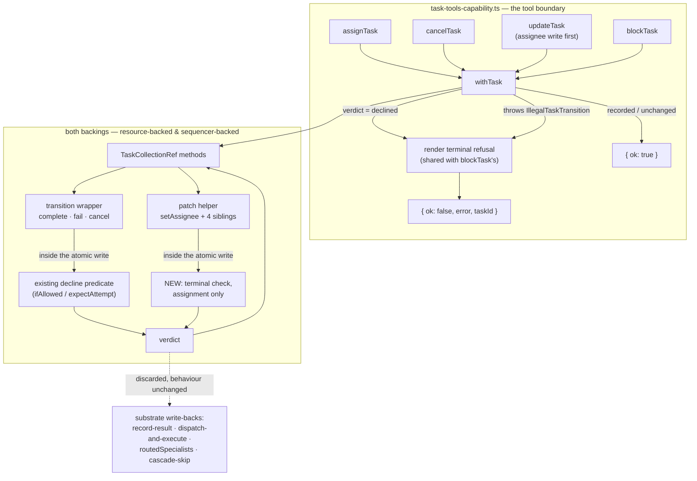

# FIX-976: `assignTask` silently rewrites a terminal task's assignee, and `cancelTask` silently no-ops on one — both report `ok: true` — Implementation Spec

**Linear:** [FIX-976](https://linear.app/fixpoint-labs/issue/FIX-976/assigntask-silently-rewrites-a-terminal-tasks-assignee-and-canceltask) · **Epic:** [FIX-980](https://linear.app/fixpoint-labs/issue/FIX-980/epic-honest-task-substrate-every-write-path-reports-what-it-actually) — *Honest task substrate* ([epic-spec](_epics/honest-task-substrate.md), epic PR [#983](https://github.com/fixpoint-labs/flow-state-dev/pull/983)) · **Category:** Bug

---

## For reviewers — what this document is

This is a **direction document**, not an implementation. Reviewing it well means
answering one question: **is this the right approach?**

**In scope to challenge:**

- The problem framing — are we solving the right thing?
- The approach — will it work, does it fit the architecture and `docs/philosophy.md`?
- Any numbered **Decision** in §6 — that's the sign-off surface.
- Missing constraints, edge cases, or dependencies that would **invalidate** the design.
- Scope — a deliverable that shouldn't ship, or one that's missing.

**Out of scope — deliberately unsettled here, and owned by the implementing agent:**

- Names, signatures, file paths, and module layout.
- Local structure: which helper, how a function is decomposed, error-message wording.
- Micro-optimizations and style preferences.
- Test names and internal test structure (the *behaviours* to test are in §10; the tests
  themselves are not).
- Anything Part II left open on purpose — it is directional by design, and a gap at
  that altitude is intended, not an omission.

Feedback in the second list is welcome and gets **recorded verbatim in §13** for the
implementer to weigh against real code. It will not be argued with, and it will not be
folded into the design prose — that would pretend the spec can settle something it
can't. Please don't re-raise it: one mention is enough for it to land in §13.

**One thing this spec inherits and does not re-decide.** The epic settled *Decision 1 —
Option A* (the shipped write contract gains a discriminated return value; the terminal
guard and the outcome reporting it are produced **inside** the atomic mutation, never at
a boundary pre-check), and its rider **A1** (that guard is **per-operation**, never
installed on the shared patch helper). Options B and C are recorded as rejected with
reasons in the epic-spec. Comments arguing for a boundary pre-check, or for a
helper-wide guard, are answered there — please read §2 of the epic-spec before raising
either.

---

## Part I — The Case *(for the human)*

### 1. Problem — why it matters, why now

A coordinator managing a board of delegated work has eight tools. Against a task that
has already finished — completed, failed, or been cancelled — three of those tools give
it three different answers, and only one of them is true. `blockTask` refuses honestly
and explains why. `cancelTask` says it worked and does nothing at all. `assignTask` says
it worked and *does* something: it writes the new assignee onto the dead task, whose
work will never run again.

So the moment a coordinator most needs the truth — a worker just failed, and it is
deciding whether to retry, reassign, or give up — is the moment the board is least
honest with it. Worse, the coordinator cannot detect this from tool results alone; it
has to separately re-read the task and notice the status never changed. A model reading
`{ ok: true }` will narrate "I've reassigned that to the backup researcher" and move on,
and the plan silently has a hole in it.

**Why now.** This is the issue the epic's central decision rests on — it is the one path
where a *model* reads the substrate's report directly and acts on it, so a dishonest
report becomes a wrong plan rather than a log line a human might notice. There is no
workaround a coordinator can adopt: the tool surface is all it has. And the same defect
shape has now been found in first-party code, not just in theory —
[FIX-985](https://linear.app/fixpoint-labs/issue/FIX-985) is a production block that
treats a declined `cancel()` as success and cascades off it.

### 2. Solution in plain terms

Make the write methods these tools call **say what they did**, and have the tool
boundary pass that answer through.

Three pieces, in plain terms:

1. **The substrate's relevant write methods stop returning "nothing" and start
   returning a small verdict** — *recorded*, *nothing needed changing*, or *declined,
   and here's why*. The verdict is produced **inside** the same atomic write that makes
   the decision, so it can't race the write it describes.
2. **Assignment learns to refuse a finished task.** Today nothing stops it. This is the
   one genuinely new guard, and it is scoped to assignment alone — labelling, priority,
   and metadata writes on a finished task stay legal, because tagging a failed task
   after the fact is a real and used thing (see Decision 2).
3. **The tools report the refusal the way `blockTask` already does** — `{ ok: false }`
   with a message naming the terminal status and what to do instead. The coordinator
   gets one consistent answer from all four tools instead of one refusal and two lies.

The substrate's own internal write-backs keep ignoring the verdict entirely, which is
what preserves the containment property FIX-951 shipped: a late worker result still
lands quietly on a settled task without taking down its siblings. **Reporting a decline
and acting on a decline are separated** — that separation is the whole mechanism.

**The philosophy that led here.**

- **Tenet 1 (coherence).** The defect is an incoherence, not a missing feature: three
  tools on one surface disagree about what a terminal task is. The fix makes them agree,
  and it makes the *return type* of a write method mean the same thing everywhere.
- **Tenet 5 (one convergence point).** Both backings already funnel every transition
  through one wrapper and every field patch through one helper. The verdict is produced
  at those two points, so no writer can produce an unreported outcome — rather than
  enumerating the four methods that happen to need it today.
- **Tenet 7 (prove the goal, not the mock).** The measured cost of this change is four
  times what the epic first recorded (§3), and the existing test suite would not have
  caught a single wrong verdict (§10). Both facts came from running the compiler, not
  from reading the code.

### 3. Tradeoffs & alternatives

**The alternative that looks simpler and is rejected upstream:** check
`isTerminalStatus` in the tool handler before writing. It is two lines and needs no
interface change. The epic refuted it and the code agrees: the check would sit *outside*
the atomic write, reopening exactly the check-then-write window FIX-951 closed. On the
cancel half it also doesn't work at all — the decline happens inside the CAS and is
absorbed by a bare `return`, so there is nothing for a boundary to observe.

**The genuine cost, and it is bigger than the epic recorded.** This is a breaking change
to a published interface, and the blast radius was under-measured. The epic-spec records
"6 call sites in 3 files." Re-measured across all four widened methods it is **~22 sites
in 4 files** that stop compiling, plus **10 more sites in 8 files** that compile fine
while silently discarding a verdict they arguably owe someone. The raw error count also
*understates* it, because fixing one file stops it erroring and reveals nothing about the
next. This spec makes that cost visible rather than repeating the old figure — see §7.

**Where the genuine complexity is.** Not the happy path, which is a type widening. It is
in three places:

- **Telling "widen the return type" apart from "install a guard."** The shared patch
  helper must widen (assignment routes through it) but must **not** be guarded (four
  sibling operations route through it too, and two production blocks depend on writing to
  terminal tasks). Conflating those two is the trap A1 exists to prevent.
- **`updateTask` patching several fields.** One boolean over five sequential writes can
  misreport in both directions. Decision 4 resolves it — and not with either of the two
  shapes the epic proposed.
- **The test suite provides no safety net.** ~50 existing call sites of these methods
  produce zero new type errors, because `await c.complete(...)` as a statement discards
  freely. Nothing today would catch a backing returning the wrong verdict. That coverage
  has to be built deliberately.

### 4. Focus practices (1–5)

- **The guard and its report come from inside the atomic write** (tenet 5). Never a
  pre-check. The decision and the verdict are produced in the same critical section, so
  they cannot disagree with each other or with the write.
- **Widening a return type is not installing a guard.** Every method on the patch surface
  may gain a verdict; exactly one gains a refusal. State, per operation, which it gets.
- **BP-030 — tolerate the old shape.** Every existing caller that ignores the verdict must
  keep working unchanged. A discarded return value is a supported way to call these
  methods, not a bug to be fixed.
- **BP-035 — walk the second path.** The interesting paths here are: the concurrent settle
  mid-sequence, the resource backing's "a no-op write still notifies" quirk, and the
  `expectAttempt` decline that must stay invisible to the tool boundary.
- **BP-003 — evidence.** Every claim about blast radius or behaviour in this spec is
  either cited to a line or measured. The two prior rounds on this epic established that
  inherited reports here are directionally useful and factually unreliable.

### 5. What using it looks like

**A coordinator reassigning a task that already failed** — the defect, before and after:

```ts
// A task that errored. Today:
assignTask({ taskId: "t_7", assignee: "backup-researcher" })
→ { ok: true }                    // ...and t_7.assignee is now "backup-researcher",
                                  //    on a task whose status is still "errored".
// After:
→ { ok: false, taskId: "t_7",
    error: 'task "t_7" is errored, which is terminal. Its assignee will not
            change. Add a new task instead.' }
```

**Cancelling the same task** — today a pure fiction, since nothing is written at all:

```ts
cancelTask({ taskId: "t_7", reason: "no longer needed" })
→ { ok: true }                    // today: nothing happened, nothing was written
→ { ok: false, taskId: "t_7", error: 'task "t_7" is errored, which is terminal. …' }
```

**Driving a collection from your own code** — the verdict is available, and ignoring it
still compiles and still behaves exactly as before:

```ts
const outcome = await tasks.cancel(id, "superseded");
if (outcome.outcome === "declined") {
  // declined.reason distinguishes "already settled" from "lost my claim"
}

await tasks.complete(id, output, { ifAllowed: true });  // unchanged: verdict discarded,
                                                        // decline still silent
```

**Labelling a finished task still works** — the regression bar for Decision 2:

```ts
// post-drain failure audit, on a terminal `errored` task
await tasks.addLabel(task.id, "worker-error");   // → recorded. Unchanged today and after.
```

### 6. Decisions & rules — the sign-off surface

1. **The write verdict is a three-variant discriminated outcome** — *recorded* /
   *unchanged* / *declined (with a reason and the status observed)* — produced inside the
   atomic write and returned by the widened methods.
   *Alternative rejected:* a boolean, or a thrown decline. A boolean cannot separate
   "nothing needed changing" from "refused," and a throw is what FIX-951 deliberately
   removed.
   *Ramification:* one outcome type across both the transition and patch paths. The
   *unchanged* variant is the one piece FIX-976 does not strictly need — it exists because
   the patch helpers genuinely return without writing when a field already holds the
   requested value, and reporting that as *recorded* would reintroduce this epic's own
   defect shape in miniature. It is the cheapest thing to cut if a reviewer disagrees.

2. **The new terminal guard is scoped to assignment, per-operation — never to the shared
   patch helper.** `setAssignee` refuses on a terminal task; `setPriority`, `addLabel`,
   `removeLabel`, `patchMetadata` keep today's behaviour exactly.
   *Alternative rejected:* a guard on `patchRef`/`patchOne`, which would decline all five.
   *Ramification:* **two production blocks keep working, and they are the regression bar** —
   `supervisor/blocks/label-failed-reviews.ts:48-60` labels terminal `errored` tasks (wired
   live at `supervisor/index.ts:413`), and `task-board/blocks/cascade-skip-dependents.ts:74`
   labels a task it cancelled on the line before. The epic named only the first; the second
   is in `orchestration` itself and its label is load-bearing for the block's own cascade
   re-entry logic (`:56-59`). This is epic constraint A1 and it binds the whole epic.

3. **The whole patch surface widens its return type; only assignment gains a guard.** All
   five patch methods return the verdict, not just `setAssignee`.
   *Alternative rejected:* widen `setAssignee` alone and leave four siblings `Promise<void>`.
   *Ramification:* one return convention across five methods that share one helper, rather
   than two conventions on one surface — which is the incoherence tenet 1 rejects, and
   would leave a custom-ref author (FIX-964's population) guessing. Costs four extra
   signature changes and no new behaviour.

4. **`updateTask` runs the guarded write first and short-circuits on a decline — it gets
   neither a batch patch nor a partial outcome.** This is the epic's open sub-question
   **A-i**, and the answer is a third shape the epic did not enumerate.
   *Alternatives rejected:* (a) one atomic batch patch — needs a new public method on an
   interface FIX-964 is already arguing is too easy to implement wrongly, and adds
   atomicity machinery; (b) an explicit per-field outcome — forks the shared tool result
   shape, hands the model a half-applied patch to reason about, and leaves the partial
   mutation in place while merely narrating it.
   *Why the third shape works:* under Decision 2 **exactly one** of the five writes can
   ever decline. Ordering it first makes a single boolean honest in both directions — if
   assignment declines, nothing else has run and nothing was mutated; if it succeeds, the
   remaining four are unguarded by design and land correctly even if the task settles
   underneath them, which is precisely what Decision 2 says *should* happen to a label or
   priority write on a terminal task.
   *Ramification:* zero new interface surface, strictly less code than today (one
   short-circuit), and the issue's own "no field mutation" criterion is met. It does **not**
   make a multi-field update atomic — see Non-goals.

5. **At the tool boundary a decline maps to the existing `{ ok: false, error }` result with
   its own error code. The shared tool output shape gains no third arm.**
   *Alternative rejected:* a structural `declined` arm on the tools' result union.
   *Ramification:* the model's contract is unchanged and matches the refusal `blockTask`
   already gives — which is what the issue asks for by name. The *reason* travels in the
   error code, where `illegalTransitionToolError` already carries it. Programmatic callers
   that need the structural distinction read the substrate verdict, which is where the
   distinction is actually useful. Reversible in one line if the human prefers the arm.

6. **Assignment's refusal is rendered by the same helper that renders `blockTask`'s.** One
   voice for "this task is terminal," not two.
   *Alternative rejected:* a separate bespoke message for assignment.
   *Ramification:* the existing terminal branch of `illegalTransitionToolError` is reused or
   lightly generalized, so the four tools cannot drift in how they say the same thing.

7. **Substrate-internal write-backs keep discarding the verdict.** No dispatcher, recorder,
   or reclaim path changes behaviour.
   *Alternative rejected:* making them act on declines, which is FIX-951 reverted.
   *Ramification:* containment survives by construction, and Decision 5 of the epic (the
   containment regression bar at integration level) is satisfiable rather than at risk.

8. **The build sequences the two halves independently, so a scope-down stays a contained
   edit.** `cancel` + `setAssignee` — the two methods FIX-976 actually needs — land as one
   step; `complete` + `fail`, which FIX-976 does not need and which widen for epic
   coherence and FIX-964's compile-time signal, land as a separate later step.
   *Alternative rejected:* widening all four in one undifferentiated pass.
   *Ramification:* if the epic later narrows Option A to just the two methods this issue
   requires, that is dropping one step, not a redesign.

**Non-goals.** Multi-field *isolation* (a concurrent reader may still observe a partially
applied `updateTask`; this spec fixes reporting, not atomicity) · FIX-963's post-commit
recorder error channel (a throw, not a decline — the epic moved it out of this set) ·
FIX-964's options-parameter gap and cast bypass · FIX-985's cascade bug · changing which
operations may write to a terminal task beyond assignment · reducing `updateTask`'s five
writes to one for efficiency (§12).

**Size estimate: Medium** — multi-file, **one PR**, ~450 LOC of which roughly half is new
test coverage. Deliberately *not* a multi-PR plan: the widening and its consumers must
land together or `main` sits in a half-widened state, and the natural split (substrate,
then boundary) is a two-node chain with no parallelism to buy. The internal sequencing in
§8 is ordered steps within the one PR.

---

## Part II — The Build Plan *(for the implementing agent)*

### 7. Technical design

Two packages, one seam each. `@flow-state-dev/orchestration` owns both the substrate
methods and the tool boundary; `@flow-state-dev/patterns` only *consumes* the widened
methods and must keep compiling untouched.

The verdict is produced at the **two convergence points** the backings already have — the
transition wrapper and the patch helper — and propagated outward. Nothing else produces
one.



**The API surface, at the level of what it exposes.** One new exported outcome type from
the tasks module, with three variants; a decline carries the reason (already-settled vs
lost-claim) and the status observed inside the write. Four methods change their declared
return from nothing to that outcome (`complete`, `fail`, `cancel`, `setAssignee`), and the
four sibling patch methods follow for consistency per Decision 3. The decline predicate
that exists today is unchanged in *behaviour*; it grows a way to say *which* arm fired so
the reason can be reported.

**The one genuinely new guard**, illustrative — *a sketch, not the contract*:

```ts
// inside the patch helper's atomic updater, evaluated on the freshest state.
// The policy is keyed by operation; only assignment passes a truthy guard.
if (guardTerminal && isTerminalStatus(task.status)) → decline("terminal", task.status)
```

Whether that arrives as a parameter threaded through the helper and passed only by
`setAssignee`, or as a policy table keyed by operation, is the implementer's call — the
epic explicitly left it open. What is **not** open: the four sibling operations must not
receive it.

**Two backing-specific hazards worth knowing before you start.**

- **The resource backing cannot express a decline by returning state unchanged.** Its
  `updateState` persists and notifies unconditionally without comparing before/after, so
  returning `current` announces a `resource_change` for a write that did not happen. The
  transition wrapper already solves this by throwing a module-private `TransitionDeclined`
  out of the updater and catching it around the call — the patch helper's decline must use
  the same mechanism. The reasoning is documented on that class; read it first.
- **The sequencer backing declines by returning `undefined` from its mutator**, which
  patches and emits nothing. Different mechanism, same contract. The two backings carry
  separately maintained copies of both wrappers, and a fix applied to one and not the other
  is the failure mode the existing advisory-write suite exists to catch.

**The cost, measured rather than inherited.** The epic-spec's "6 sites in 3 files" was
measured over `complete`/`fail` only and is wrong.

| Category | Sites | Files | Notes |
|---|---|---|---|
| Compile-breaking — backings | ~17 | 3 | interface signatures + the new type; 6 each in the two backings |
| Compile-breaking — tool boundary | 5–6 | 1 | the four tool call sites, `withTask`'s mutator type, the tools' result shape |
| Discard-only — compile-clean, semantically owed | 10 | 8 | see below |
| **Total to a complete change** | **~32** | **~12** | |

The discard-only set is where the review attention belongs, because the compiler will not
point at any of it: `task-board/blocks/record-result.ts:59,105` ·
`tasks/helpers/dispatch-and-execute.ts:184,191` · `patterns/routedSpecialists/index.ts:443,472`
· `task-tools-capability.ts:479` (`updateTask`'s own assignee write) · and two the
corrected measurement also missed, both discarding a `complete` with no options at all:
`patterns/round-robin/blocks/record-contribution.ts:65` and
`patterns/debate/blocks/record-argument.ts:60`. Per Decision 7 the right action for all ten
is **deliberately nothing** — but each should be *looked at* and left alone knowingly.

**One trap, stated plainly.** `withTask`'s mutator is typed as returning `Promise<void>`.
Widening it to `Promise<unknown>` silences all four tool-boundary type errors in a single
line — by throwing the verdict away and leaving the bug exactly as it is. The mutator must
carry the verdict out to `withTask`, which is the whole point of the issue.

### 8. Implementation sequence

Ordered. Steps 1–4 deliver FIX-976's outcome; step 5 is the epic-coherence half and is
independently droppable per Decision 8.

1. **Introduce the outcome type and teach the decline predicate to report its reason.**
   Add the three-variant outcome to the tasks module's type surface; extend the existing
   decline predicate so callers can learn which arm fired without re-deriving it. No
   behaviour change, nothing widened yet. *Test:* the predicate's reason is correct for
   terminal, disallowed, and lost-claim inputs, on the shared helper.

2. **Widen the transition wrapper in both backings to return the verdict, and propagate
   `cancel`'s decline.** The wrapper already decides; it now reports. This is where the
   resource backing's absorbed `TransitionDeclined` stops being a dead end and becomes a
   returned value. `cancel` returns the verdict; `complete`/`fail` are left alone in this
   step. *Test:* parameterized over **both** backings — a declined `cancel` on a settled
   task returns declined with reason *terminal*, emits no change item, and writes nothing.

3. **Widen the patch helper in both backings and add the assignment-only terminal guard.**
   The helper returns the verdict; `setAssignee` passes the guard; the four siblings pass
   nothing and keep today's behaviour. Use each backing's own decline mechanism (see §7).
   *Test:* the A1 regression bar — `addLabel` / `setPriority` / `removeLabel` /
   `patchMetadata` all still succeed on a terminal task, on both backings — alongside
   `setAssignee` declining on one.

4. **Map the verdict at the tool boundary, and reorder `updateTask`.** Carry the verdict
   through `withTask`'s mutator (not by widening it to `unknown`); render a decline via
   the same terminal-refusal helper `blockTask` uses; move `updateTask`'s assignee write
   to the front and short-circuit the remaining four on a decline. *Test:* `assignTask`,
   `cancelTask`, and `updateTask`-with-assignee all return `{ ok: false }` naming the
   terminal status; a label-only `updateTask` still succeeds on a terminal task; a
   declining `updateTask` mutates nothing.

5. **Widen `complete` and `fail`.** Not required by FIX-976 — these are for epic coherence
   and for the compile-time signal FIX-964 inherits. Mechanically the same as step 2 on the
   same wrapper. *Drop this step and steps 1–4 still ship a complete fix for this issue.*

6. **Docs and changeset.** §11. `minor` per BP-022 (a breaking interface change pre-1.0).

**Removals** (tenet 3): `updateTask`'s current five-in-a-row ordering goes away in step 4,
replaced by a guarded-first ordering with an early return — net less code. The resource
backing's bare `return` that swallows a decline (its transition wrapper's catch) stops
being a swallow point in step 2. No files are deleted.

**No PR plan** — single-node, per Decision 8.

### 9. Edge cases & error handling

| Case | Expected behaviour |
|---|---|
| `assignTask` on a terminal task | Declined inside the write; nothing mutated; `{ ok: false }` naming the status |
| `assignTask` on a live task, assignee already equals | *unchanged*; no write, no change item; `{ ok: true }` — the desired state holds |
| `cancelTask` on a terminal task | Declined (reason *terminal*); `{ ok: false }`. Was `{ ok: true }` |
| `cancelTask` on a live task | *recorded*, exactly as today |
| `updateTask` with assignee, task terminal | Assignee write runs first, declines, **remaining four never run**; nothing mutated |
| `updateTask` without assignee, task terminal | All writes land, `{ ok: true }` — unchanged, and required by Decision 2 |
| `updateTask`, task settles *after* assignee write succeeds | Remaining four land (they are A1-exempt); `{ ok: true }` is honest — every requested field was written |
| `addLabel` / `setPriority` / `patchMetadata` / `removeLabel` on a terminal task | *recorded*. **Unchanged — the regression bar** |
| Substrate write-back declines (`ifAllowed` / `expectAttempt`) | Verdict returned and discarded by the caller; silent no-op preserved; siblings unaffected |
| `expectAttempt` decline reaching a tool | Cannot happen — no tool passes `expectAttempt`. Reason variant exists so a decline is never mis-attributed to terminality |
| Task removed between `withTask`'s existence pre-check and the write | Still **throws** (not found), still propagates. Not in the soft-error set, unchanged |
| Store failure, CAS exhaustion, ordinary bug | Still throws. The soft set stays exactly {illegal transition, declined write} |
| Custom `TaskCollectionRef` returning `undefined` from a widened method | Treated as *recorded* (`== null` guard, BP-030) — a legacy two-arg ref must not be read as a decline. See §12 |
| Existing caller discarding the verdict | Compiles and behaves identically. Supported, not a defect (BP-030) |

**Error taxonomy.** Unchanged in shape: a *declined* write is not an error and never
throws — it is a value. An *illegal* transition still throws
`IllegalTaskTransitionError` for direct callers and is softened only at the tool
boundary. Everything else propagates. The one new mapping is declined → `{ ok: false }`
at the tool boundary only.

**Second-path notes (BP-035).** Legacy shape → the `== null` guard above. Null boundary →
a decline must be distinguishable from "method returned nothing." Concurrent → the
mid-sequence settle rows above. Multi-tenant → both backings, always parameterized.
Cancel/error → the resource backing's notify-on-no-op quirk (§7).

### 10. Testing strategy

**No goal check applies.** This is a bug fix on a programmatic tool surface with no model
in the loop — the observable outcome is a tool return value, fully determined by
mocked-collection tests. A model-driven goal check would add cost and nondeterminism
without testing anything the CI specs don't. Per Decision 7 the *containment* property is
the one thing that needs an integration-level check, and it already has one (below).

**Start here, and know why: the existing suite is not a safety net.** ~50 existing call
sites of these four methods produce **zero** new type errors under the widening, because
`await c.complete(...)` as a statement discards freely. Nothing in the tree today would
catch a backing returning the wrong verdict. This coverage is being created, not extended.

**CI specs** — behaviours in observable terms:

- *Substrate, parameterized over both backings* (extend the existing advisory-write suite,
  which is already shaped this way — two separately maintained wrapper copies is exactly
  the drift this suite guards):
  - a declined `cancel` on a settled task → verdict *declined*, reason *terminal*, no
    change item emitted, stored task byte-identical
  - `setAssignee` on each of the three terminal statuses → *declined*, assignee unwritten
  - `setAssignee` on a live task → *recorded*, change item emitted
  - `setAssignee` where the value already matches → *unchanged*, **no** change item
  - **the A1 bar:** each of `addLabel`, `removeLabel`, `setPriority`, `patchMetadata` on a
    terminal task → *recorded* and the field written
  - `complete`/`fail` with `ifAllowed` on a settled task → *declined*, still silent
  - `expectAttempt` decline → reason is *lost-claim*, not *terminal*
- *Tool boundary:*
  - `assignTask` / `cancelTask` on a terminal task → `{ ok: false }` whose message names the
    terminal status; assert it reads the same as `blockTask`'s on the same task (Decision 6)
  - `updateTask` with assignee on a terminal task → `{ ok: false }` **and** priority /
    metadata / labels all unchanged (the short-circuit, Decision 4)
  - `updateTask` without assignee on a terminal task → `{ ok: true }`, fields written
  - unchanged: `task_not_found`, `no_delegation_board`, unknown-assignee ordering
- *Regression, first-party consumers:* the supervisor suite's existing assertion that
  `failed-review` labels land on terminal tasks must pass untouched; the plan-and-execute
  cascade-skip path must still stamp `skipped`.
- *Containment, integration level* (epic Decision 5): `packages/integration-tests/src/scenarios/task-board-drain-containment.test.ts`
  passes unchanged — a worker outcome landing on a settled task still leaves siblings
  running. **Do not modify this test**; if it needs changing, the design is wrong.

**Discipline: `diagnose`** (Linear category *Bug*). The seam is vitest at
`packages/orchestration/test/collection/advisory-write.test.ts` for the substrate and
`packages/orchestration/test/skills/task-tools-capability.test.ts` for the boundary. Both
already exist with the right harnesses. Reproduce first: a failing test asserting
`assignTask` on a completed task does not rewrite the assignee, on both backings, before
touching `src`.

### 11. Documentation plan

Three surfaces. All are **EXTEND** — this introduces no new concept, it corrects the
documented contract of an existing one. No new pages, no sidebar changes.

1. **EXTEND `apps/docs/docs/orchestration/task-substrate.md`** — required, and it is
   currently *wrong* after this change. Two places state the advisory contract as
   terminal: "a declined write is a silent no-op and returns normally" and "only those two
   outcomes go quiet." Both must become "the write is still skipped, and the call now tells
   you it was." Also extend the status-machine section to say that assignment — not just
   status changes — is refused on a terminal task, and that labels, priority, and metadata
   are deliberately still writable, with the one-line reason (post-hoc failure audit).
   *Cross-links:* to the delegation page for the coordinator's view (already present).
   *Voice risks:* this section is dense and already good; resist rewriting it. Do not
   introduce "powerful" or "seamless." Keep em-dashes sparse. Explain *declined* on first
   use in plain terms rather than assuming the type name.

2. **EXTEND `apps/docs/docs/skills/delegation.md`** — required. The tool table's
   `assignTask`, `cancelTask`, and `updateTask` rows each need the terminal refusal noted.
   The illegal-transition section already tells the reader a terminal task "gets told that
   instead, with a suggestion to add a new task" — that sentence becomes true of four tools
   rather than one, which is a small edit with a good payoff. Add one short example of the
   refused `assignTask` result, matching the existing example's formatting.
   *Voice risks:* the existing table entries are terse one-liners; match that, don't expand
   them into paragraphs.

3. **EXTEND `packages/orchestration/README.md`** — required, same correction as (1) at
   package-reference terseness. Its `TaskCollection` section says "a declined write is a
   silent no-op," and its error-handling section says such a call "never becomes a tool
   result either" — the second is precisely what this issue changes and must be rewritten.

**Not changed, deliberately:** `docs/architecture/*` — the task substrate's locked
contracts are about block kinds, scopes, and item taxonomy; none of them names this return
type. No guide changes: the three guides that mention these tools use them on live tasks
and remain accurate. No blog post — this is a bug fix.

### 12. Dependencies, open questions & follow-ups

**Blocking: none.** Decision 1 is answered (Option A) and the epic's objective gate is
closed, so this issue may spec and build now. It is *not* gated on FIX-964 — the
dependency runs the other way (FIX-964 inherits this widening's compile-time signal).

**Coordination, not dependency — FIX-964.** Being specced in parallel and it touches the
same interface. Expected collision surface, for `cross-spec-review`:

- `tasks/collection/types.ts` — **certain overlap.** This spec widens four method return
  types there; FIX-964 needs a mechanism on the same interface for the options-parameter
  gap and the cast bypass that the epic's §5 POC proved the widening leaves open. Both
  specs must not independently invent a "custom ref conformance" story.
- The `== null`-guard row in §9 (a legacy ref returning nothing is read as *recorded*, not
  as a decline) is a **shared decision** the two specs must agree on — it is the
  compatibility half of FIX-964's signal, decided here only as far as this issue needs.
- `resource-backed.ts` / `sequencer-backed.ts` / `task-tools-capability.ts` — all three
  are in FIX-963's and FIX-964's collision set too, per epic Decision 2.
- **A1 is a shared constraint.** Whichever of the three lands first must not leave a
  helper-level terminal guard behind for the others to inherit.

**Open questions:** none blocking. Both questions this issue arrived with are answered as
Decisions — A-i by Decision 4, and the guard-scoping expression by Decision 2 delegating
it to the implementer as the epic intended.

**Settled claims:** none needed settling in this spec. (The epic's own settled claim — that
widening the return type gives FIX-964 a real but incomplete compile-time signal — is
recorded in the epic-spec §5 and is *input* here, not a claim this spec re-argues.)

**Follow-ups (flagged, not built):**

- **`updateTask` issues five CAS writes and emits five change items for one user action.**
  Decision 4 makes that *honest* without making it *efficient*. A single batched patch
  would cut both, and would also give multi-field isolation, which this spec lists as a
  non-goal. Worth doing on its own merits; route via `improve-codebase-architecture`.
- **`FIX-985`** — `cascade-skip-dependents.ts:73` labels and cascades off a task whose
  `cancel()` was declined. Filed separately, out of scope, and evidence for §1: once
  `cancel` returns a verdict, that block has something to check.
- **The five patch methods are near-identical sugar over one helper.** Once they all return
  the same verdict, the case for collapsing them toward one field-bag method gets stronger
  — and it interacts with FIX-964's "how does a custom ref implement all this correctly"
  problem. Deepening opportunity, not this issue.
- **`packages/orchestration/test/flow-policy.test.ts:45`** casts a partial ref through
  `as unknown as TaskCollectionRef`. Harmless here, but it is the cast bypass the epic's §5
  POC identified as surviving the widening. FIX-964's problem; noted so it is not
  "discovered" again.

### 13. Review notes for the implementer

*(No spec-PR feedback yet — this section is populated during review, per `issue-spec`
Step 6.5.)*

---

## Spec evolution

- **Spec drafted** — framed the problem as three tools giving three different answers about
  the same dead task, one of them honest; adopted the epic's decided Option A and scoped the
  one new guard to assignment per A1, verifying both regression paths in code (and finding a
  second one, `cascade-skip-dependents.ts`, that the epic-spec had missed). Answered open
  sub-question **A-i** with a third shape the epic did not enumerate — order the single
  guardable write first and short-circuit — because A1's per-operation scoping means exactly
  one of `updateTask`'s five writes can decline, which makes a plain boolean honest without a
  batch method or a partial-outcome protocol. Re-measured the blast radius at ~22 compile-
  breaking and ~32 total sites against the epic's recorded 6, and found the existing test
  suite catches none of it. Sequenced `cancel`/`setAssignee` separately from `complete`/`fail`
  so a later scope-down of Option A stays a dropped step rather than a redesign.
