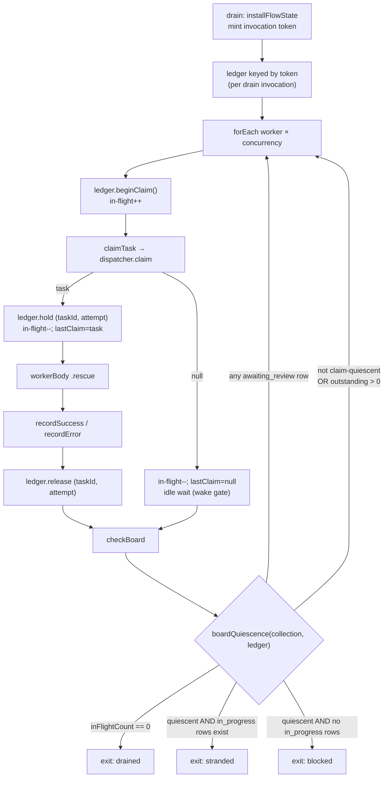

# FIX-978: Stranded `in_progress` lease with no reclaim path hangs any later drain for ~14 hours instead of failing fast — Implementation Spec

**Linear:** [FIX-978](https://linear.app/fixpoint-labs/issue/FIX-978) · **Epic:** [FIX-980 — Honest task substrate](https://linear.app/fixpoint-labs/issue/FIX-980) ([epic-spec](_epics/honest-task-substrate.md), [epic PR #983](https://github.com/fixpoint-labs/flow-state-dev/pull/983)) · **Category:** Bug

---

## For reviewers — what this document is

This is a **direction document**, not an implementation. Reviewing it well means
answering one question: **is this the right approach?**

**In scope to challenge:**

- The problem framing — are we solving the right thing?
- The approach — will it work, does it fit the architecture and `docs/philosophy.md`?
- Any numbered **Decision** in §6 — that's the sign-off surface.
- Missing constraints, edge cases, or dependencies that would **invalidate** the design.
- Scope — a deliverable that shouldn't ship, or one that's missing.

**Out of scope — deliberately unsettled here, and owned by the implementing agent:**

- Names, signatures, file paths, and module layout.
- Local structure: which helper, how a function is decomposed, error-message wording.
- Micro-optimizations and style preferences.
- Test names and internal test structure (the *behaviours* to test are in §10; the tests
  themselves are not).
- Anything Part II left open on purpose — it is directional by design, and a gap at
  that altitude is intended, not an omission.

Feedback in the second list is welcome and gets **recorded verbatim in §13** for the
implementer to weigh against real code. It will not be argued with, and it will not be
folded into the design prose — that would pretend the spec can settle something it
can't. Please don't re-raise it: one mention is enough for it to land in §13.

---

## Part I — The Case *(for the human)*

### 1. Problem — why it matters, why now

**In plain language.** A task board hands each unit of work to a worker, and marks that
work "in progress" while the worker runs. If the process dies at exactly the wrong
moment — a crash, a restart, a deploy — the work stays marked "in progress" forever,
because the thing that would clean it up is never called. The next time anything tries
to run that board, it waits for a worker that no longer exists. It waits for about
fourteen hours. Then it gives up and reports the wrong reason: it says the work is
*blocked on a dependency*, which is not what happened at all.

Two separate failures, and the second is the worse one. The wait is expensive. The
report is *dishonest* — a caller who reads it and acts on it acts on a false cause.

**Why now.** This is live today, not a future hazard. Any board built on a collection
that outlives a single turn reaches it — the code-first durable path
(`defineTaskCollection` + `taskBoard`) — and the framework ships that path as a
supported way to build a board. There is no workaround a caller can adopt without
taking a worse risk: the one recovery verb that exists, `reclaim()`, resets *any*
expired claim, and a healthy worker's claim expires as a matter of routine (see §3),
so calling it blindly re-runs live work and duplicates its side effects. The user is
currently choosing between a fourteen-hour hang and silent duplicate execution.

This is the fifth instance of the epic's shape: **the substrate's report diverges from
what happened and the caller cannot detect the divergence.** Here the divergence is
that the board reports `blocked` when it is actually stranded, and takes most of a day
to say so.

### 2. Solution in plain terms

The board already has an exit for "I cannot make progress" — the `complete-or-blocked`
mode exists to stop a drain that has nothing left it can run. That exit asks the wrong
question. It asks *"does the collection contain zero in-progress rows?"* when what it
means is *"is any worker of mine actually working?"* Those two questions have the same
answer right up until a row is held by something that isn't a live worker of this
drain — which is precisely the stranded case, and precisely when the board needs the
exit most.

**So: make the board measure the thing it was standing in for.** A drain knows which
tasks its own workers claimed, because every claim in a drain goes through one block.
Record them, per execution. Then the exit condition becomes: *no claim of mine is
outstanding, and nothing here is claimable.* When that is true the drain cannot
progress, whether the `in_progress` rows belong to a dead prior execution or a live
concurrent one — so it stops, promptly, and **names the real cause**: a claim is held
outside this run.

**One status is deliberately excluded: `awaiting_review`.** A task parked for human
review is *supposed* to keep the board alive until an external actor resumes it
(FIX-443 §10.1), and a parked row from a dead execution is genuinely
indistinguishable from a live park — nothing about it says whether the reviewer is
coming. So a review row is an explicit **keep going**, evaluated before the stranded and
blocked exits rather than merely omitted from the stranded test. See Decision 7.

**And "nothing here is claimable" has to be an observed outcome, not a re-derivation.**
The board already asks the dispatcher for work and gets a yes or no every iteration. That
answer is ground truth for every dispatcher, including ones we didn't write. Re-deriving
eligibility with a second, simpler predicate — as the board does today — silently
disagrees with any dispatcher that filters on more than status and dependencies. Reading
the outcome instead is the same move as the rest of this change: stop trusting a proxy,
measure the thing. See Decision 8.

What it deliberately does **not** do is decide whether that other claim's owner is
alive. It does not need to, because it never writes to the row. It reports and exits;
the row is left exactly as it was found. That is what makes this safe under the epic's
Decision 3 — the constraint is that expiry is not evidence of abandonment, and this
design never infers abandonment at all.

**The philosophy this leans on.**

- **Tenet 5 (fix at the owning layer, at the convergence point).** The hang is
  reproducible from the delegation surface, from `planAndExecute`, from a hand-built
  board — every one of them through `taskBoard`. `taskBoard` is where they converge, so
  the fix goes there and cures all of them, rather than each caller learning to call
  `reclaim()` defensively. The same tenet picks the seam *inside* the board: every claim
  passes through one claim block, so the ledger has exactly one writer.
- **Tenet 1 (coherence over local cleverness).** `count(in_progress) === 0` is not a
  weaker version of "no worker is active" — it is a different predicate that happened
  to agree. Replacing the proxy with the property removes an incoherence rather than
  adding a special case on top of it.
- **Tenet 3 (earn every addition).** The temptation here is to build the whole recovery
  mechanism: a claim-ownership field, lease renewal, an automatic sweeper. All three are
  already scoped as FIX-939 milestone 2 and none of them is needed to stop lying to the
  caller. This spec ships the honesty and leaves the recovery where it was already
  planned.

### 3. Tradeoffs & alternatives

**The simpler approach, and why it loses.** Call `collection.reclaim()` before each
drain. It is three lines, it exists today, and it makes the reported symptom go away. It
is also wrong, and this is the load-bearing fact of the whole issue:

- `DEFAULT_LEASE_DURATION_MS` is 30 seconds
  (`packages/orchestration/src/tasks/collection/internal.ts`).
- **Nothing renews a lease.** `leaseUntil` is stamped once by `applyClaimToTask` at claim
  time and thereafter only ever *cleared* on a terminal transition — never extended. A
  grep for `renew` / `heartbeat` / `extendLease` across `packages/orchestration/src/`
  returns nothing.
- A generator's model call routinely runs longer than 30 seconds.

Therefore **an expired lease is the normal state of a healthy long-running worker.**
A pre-drain `reclaim()` resets that worker's task to `pending`, a second worker claims
it, and the model call plus its side effects run twice — with the first worker's
eventual write-back declined by FIX-951's containment guard, silently. That trades a
loud fourteen-hour hang for silent duplicate execution, which is strictly worse. The
same objection kills the variant "teach the wake predicate to ignore expired leases":
same inference, same unsafety, one layer up.

**The bigger approach, and why it's not ours.** Stamp an execution identifier on each
claim and join it to real liveness, so "this owner is provably gone" becomes answerable
and recovery can be automatic. That is the right eventual design — and it is already
**FIX-939 milestone 2** ("Automated reclamation, joined to execution liveness … Closes
FIX-978"), which correctly points at the engine's existing request-liveness registry
(`stores.activeRequests`, a ~10s heartbeat, `listStale`, `createStaleRequestSweeper`)
rather than inventing a second notion of liveness. Two reasons this spec does not
pre-empt it: that registry lives in `@flow-state-dev/engine`, which
`@flow-state-dev/orchestration` does not and must not depend on; and landing a *partial*
ownership field here that FIX-939 then has to reconcile is exactly the "wrong in both
places for the same reason twice" hazard the issue warns about.

**Where the genuine complexity is.** Not the exit condition — that part is small. All
three hard parts are in the ledger, and spec review found two of them:

1. **Its lifetime.** A claim must be entered when the claim block succeeds and removed
   when the worker's outcome is recorded, including on the rescue path where the worker
   threw, and including when FIX-951's guard declines the write-back. A ledger that
   leaks an entry re-creates the hang inside a single drain; a ledger that drops an entry
   early makes a busy board exit as stranded.
2. **Its home has to be per-drain-invocation, and the two obvious slots are both too
   wide.** The board's `BoardRunFlowState` bag is allocated **once at `taskBoard()`
   construction**, so every execution shares it. The request bag is one scope better and
   still not enough: `.stepAll([board.drain, board.drain])` is ordinary public sequencer
   API, and `ctx.request` is shared by reference across every nested scope of a request —
   so two concurrent drains in one request would alias, clear, and release each other's
   entries. The ledger is keyed by the **drain invocation** (Decision 2).
3. **A claim is observable before it is recorded.** `collection.claim()` emits its
   `task-change` wake item *inside* the call, before its promise resolves — so there is a
   window where a task is `in_progress`, siblings have been woken, and the ledger has not
   yet been told. On a board whose last claimable task was just taken, a sibling reading
   that window sees "no claims, nothing claimable, an `in_progress` row" and would exit
   stranded while work is genuinely starting. Closed by counting claim *attempts* in
   flight, not just claims held (§7).

§9 walks all three.

A second, quieter cost: this design cannot tell a dead prior execution from a live
concurrent one, and will report both as "claimed outside this run." For a concurrent
durable board that is arguably the right answer anyway — this drain genuinely cannot
proceed and genuinely must not touch the row — but it is a real limitation and it is
named, not hidden.

### 4. Focus practices

1. **Find the convergence point before writing the guard (tenet 5 / BP-028).** The
   invariant is "every claim this drain makes is in the ledger." It holds only if the
   ledger's writer sits where all claims pass. Enumerate the claim sites and the
   release sites before coding; a release path missed on the rescue branch is the
   failure mode this change is most likely to ship.
2. **BP-035, second-path checklist, with the *cancel/error path* as the sharp one.** The
   worker body has a `.rescue()` scope. Test the thrown-worker path, the
   declined-write-back path, and the claim-then-immediately-cancelled path explicitly.
3. **BP-030 in the reader direction.** The new exit reason is an *additive* enum value on
   `checkBoardOutputSchema.reason` and on `task-board-meta`'s `terminationReason`.
   Anything switching on those values needs a total match or a defaulting arm — including
   in the devtool renderer, if it reads them.
4. **BP-003 with a falsifiable pre-fix baseline.** The goal check must be run against
   `origin/main` and recorded as FAIL before the fix, at shrunk timings. A check that
   passes on both sides proves nothing here, because the pre-fix behaviour is *eventual
   success* — just fourteen hours later.
5. **Never write to a task this drain does not own.** The strongest anti-game in §10:
   assert the stranded row is unchanged after the drain. This is the rule that keeps the
   fix inside epic Decision 3.

### 5. What using it looks like

The public API does not change. What changes is what a drain *returns* and how long it
takes to return it. Both examples are the same caller code before and after.

**Before — a durable board whose previous run died mid-claim:**

```ts
const board = taskBoard({
  name: "reports",
  collection: reportTasks,          // a durable, resource-backed collection
  workers: { writer },
  onIdle: "complete-or-blocked",
});

// ~14 hours later:
//   task-board-meta → { status: "completed",
//                       terminationReason: "blocked-by-failures",
//                       counts: { in_progress: 1, pending: 2, ... } }
```

Two lies in one item: it took most of a day, and `blocked-by-failures` says a
dependency failed. Nothing failed — a claim was stranded, and the two other tasks were
runnable the entire time.

**After — same code, same board:**

```ts
// seconds later:
//   task-board-meta → { status: "completed",
//                       terminationReason: "stranded-claim",
//                       counts: { in_progress: 1, completed: 2, ... } }
```

The two runnable tasks drained. The stranded row is untouched — same `status`, same
`attempts`, same `leaseUntil` — and the verdict names what actually stopped the board.

**Recovering — and why this spec no longer ships a recipe for it.** An earlier draft
showed a pre-drain `collection.reclaim()`, on the argument that a caller who knows their
deploy killed the previous run is making an informed decision the substrate can't. Review
showed that argument is wrong, and wrong by this spec's *own* Decision 3:

```ts
// NOT a recipe. reclaim() sweeps the whole collection, so on a durable
// collection shared with any other live execution it also re-pends that
// execution's healthy task — one whose lease expired simply because a model
// call ran past 30 seconds. Duplicate work, duplicate side effects.
await collection.reclaim();
```

Knowing *your* previous process died is not knowing that **no** execution holds a live
claim, and `reclaim()` needs the second fact, not the first. It is safe only against a
collection you can establish is quiescent — which a caller usually cannot. So there is no
safe general recovery verb today, and this spec does not invent one: it makes the board
*report* honestly and leaves recovery to FIX-939 milestone 2, where the liveness join
makes "provably gone" answerable per row. The docs say exactly this (§11), rather than
publishing a sweep that duplicates work.

(Also corrected from the draft: `board.drain` is a `SequencerDefinition` — a step you
compose with `.step(board.drain)`, not a function you `await`.)

### 6. Decisions & rules — the sign-off surface

1. **The `complete-or-blocked` exit condition stops asking "are there zero `in_progress`
   rows?" and starts asking "is any claim of this drain's own outstanding?"** The
   three-way decision (`drained` / `blocked` / `stranded`) lives in `checkBoard` alone;
   the wake predicate only gains the ledger as a second wake trigger.
   *Alternative rejected:* a pre-drain `reclaim()`, or teaching the wake predicate to
   disregard expired leases. Both infer abandonment from expiry, which epic Decision 3
   forbids and §3 shows to be unsound.
   *Ramification:* the board gains a bounded, honest exit without ever writing to a task
   it does not own. It also means a drain sharing a durable board with a *live*
   concurrent execution now exits promptly instead of waiting for it — reported, never
   reset.

2. **The ledger is keyed by the individual `board.drain` invocation — not by the request,
   and not by the board definition. No field is added to the `Task` schema.** The rule,
   stated so it can be checked against the sibling specs that need the same one:

   > **Ledger storage is keyed by the individual `board.drain` invocation, never by the
   > request.** A request may contain many drain invocations, sequential *or concurrent*,
   > and `ctx.request` is shared by reference across every nested scope of a request — so
   > a request-keyed slot aliases them. Each invocation of `board.drain` mints one token
   > at its `installFlowState` step; that token namespaces every ledger read and write for
   > that invocation, and teardown clears only that token's entry. Nothing keyed on
   > `collectionId`, `requestId`, or the board's construction-time closure is an
   > acceptable substitute — the first two are shared across invocations, the third across
   > executions.

   *Alternatives rejected:* stamping an execution id on the persisted task row (the
   direction the issue floats — that's FIX-939 m2's); `BoardRunFlowState`, allocated once
   per board definition; and the request bag, which round 1 chose and which is still one
   scope too wide, since `.stepAll([board.drain, board.drain])` is public API.
   *Ramification:* no persisted-schema change, no migration, no collision with FIX-939
   m2. Concurrent drains — across requests *or* within one — each reach their own honest
   verdict. Cost, accepted deliberately: the signal distinguishes "not this invocation's"
   but not "provably dead." Enough to exit honestly, not enough to recover automatically,
   which is the correct split.

3. **The honest outcome is a new, distinct exit reason — not a re-use of `blocked`.** It
   is carried on the drain's per-worker exit reason and on the persisted
   `task-board-meta` `terminationReason`.
   *Alternative rejected:* keep reporting `blocked` and let the caller disambiguate from
   `counts`. That is a breadcrumb, not observability — epic Decision 4 rules it out.
   *Ramification:* two additive enum widenings; every consumer that exhaustively matches
   those enums must gain an arm. The board's verdict becomes branchable by a caller.

4. **No automatic reclamation, no lease renewal, and no model-facing
   `in_progress → pending` tool ships in this issue.**
   *Alternative rejected:* shipping the deliberate recovery verb here, since epic
   Decision 3 explicitly leaves that direction untouched by the expiry constraint.
   *Ramification:* recovery on the code-first durable path stays the caller's explicit
   `collection.reclaim()` call, newly documented as the informed decision it is. The
   model-facing verb and the question of whether `in_progress` / `awaiting_review` →
   `pending` should be *guarded* stay with **FIX-957 Decision 4** and **FIX-939 milestone
   2**, so one transition surface is decided in one place rather than two.

5. **The change lands in the `taskBoard` primitive. The delegation surface is not
   touched.**
   *Alternative rejected:* also widening the delegation `runBoard` settle verdict
   (`drained | blocked`) to carry the new outcome.
   *Ramification:* delegation's board is turn-scoped today, so the stranded state is
   unreachable there — widening its enum now would ship a code path nothing can enter.
   Fixing the primitive means delegation inherits the behaviour the moment it gets a
   durable board lifetime (FIX-957 / FIX-939), leaving that work a one-value enum
   widening as its tail.

6. **Only `onIdle: "complete-or-blocked"` changes. `complete` and `wait` keep today's
   semantics exactly.**
   *Alternative rejected:* applying the new exit in every mode.
   *Ramification:* `complete` documents itself as "wait until everything settles, an
   external pump will resolve it" — and a caller who chose that cannot be told by the
   board that their pump is never coming. Waiting is the contract there. The fix lands
   only in the mode whose stated purpose is already "stop when this drain cannot
   progress." The residual is named in §9 and §12.

7. **An `awaiting_review` row is an explicit *keep going*, checked before both the
   stranded and the blocked exits.**
   *Alternative rejected:* the round-1 wording, which only removed `awaiting_review` from
   the *stranded* test. Review showed that states the decision without implementing it: a
   board holding just a review row falls through to the zero-`in_progress` branch and exits
   **`blocked`**, and one holding a review row plus an external claim exits **`stranded`**.
   Both end the drain before review resumes — the exact failure Decision 7 was added to
   prevent. Also rejected: the first draft's position that a parked row held outside this
   run is stranded; a parked row carries nothing distinguishing a live human-in-the-loop
   wait from a dead one.
   *Ramification:* the review contract is untouched, so this stays a `patch`, not a
   `minor`. The keep-alive must sit in the shared quiescence helper (Decision 8) so the
   wake predicate and the checker cannot drift apart on it again — a predicate that wakes
   while the checker says "continue" is a hot spin, not a hang. Accepted residual: a
   genuinely stranded `awaiting_review` row still hangs, and cannot be fixed at this
   altitude for the same reason the whole issue can't — that needs FIX-939 m2's liveness
   join. This resolves the earlier draft's OQ-2.

8. **"Nothing is claimable" is read from observed dispatcher outcomes, not re-derived by
   `hasClaimableTask`. The quiescence test becomes one shared helper that both the wake
   predicate and `checkBoard` consume.**
   *Alternative rejected:* keeping `hasClaimableTask` in the exit path and declaring the
   fix default-dispatcher-only. `shared.ts`'s `hasClaimableTask` tests pending status and
   dependencies alone, while `eventDispatcher` additionally filters on topic (and returns
   `null` when no topic is resolved) and `classifierDispatcher` can return `null` outright.
   So on those dispatchers a stranded claim plus a pending task the dispatcher will never
   pick keeps the predicate true and the hang survives — on exactly the boards least likely
   to be tested. A stated limitation was the cheaper option and was rejected: reading the
   claim outcome the board *already has* is both simpler and correct for every dispatcher,
   custom ones included.
   *Ramification:* `hasClaimableTask` leaves the exit path (it may stay as a wake hint).
   The helper is the convergence point tenet 5 asks for — and it retires the
   duplicated-exit-condition smell §12 had listed as a follow-up, which is now in scope
   because Decision 7 made it load-bearing. `onIdle: "wait"` and its `shouldExit` predicate
   are untouched.

**Non-goals.** Automatic lease reclamation, lease renewal/heartbeat, durable claim
ownership, cross-execution claim safety (all FIX-939) · a model-facing recovery tool and
the `in_progress` / `awaiting_review` → `pending` guard question (FIX-957 Decision 4) ·
any delegation-surface change · any change to `complete` or `wait` idle modes.

**Size estimate: Medium** — multi-file within `packages/orchestration`, one PR, plus docs,
tests, and a goal check. No PR plan; this is a single-node build. Round 2 added the
`boardQuiescence` extraction and the invocation token, and removed a docs recipe; the diff
grows modestly but the test matrix grows more (concurrent same-request drains, a
non-default dispatcher, a review-parked board), which is where the added effort lands.

---

## Part II — The Build Plan *(for the implementing agent)*

### 7. Technical design

One package, one layer: `packages/orchestration/src/task-board/`. The task substrate
(`src/tasks/`) is **not** touched — no schema change, no collection-method change, no new
transition. That is a deliberate consequence of Decision 2 and worth preserving as a
review check: a diff that reaches into `src/tasks/` has drifted.

**The seam, and the two scopes that are both too wide.** Getting this right took two
review rounds, so the reasoning is recorded rather than just the answer:

- `BoardRunFlowState` — a plain object created **once, at `taskBoard()` construction**,
  captured in the factory closure. Shared by every execution of that board. Wrong.
- The **request resolver bag** (`getRequestResolverBag(ctx)`) — attached to `ctx.request`,
  so every nested scope of one request sees it by reference. Better, and **still wrong**:
  `.stepAll([board.drain, board.drain])` puts two concurrent drains in one request, and
  they would alias.
- **The drain invocation** — the correct scope, per Decision 2's rule.

**What "keyed by the invocation" means mechanically** is the implementer's to settle;
two candidates, both of which satisfy the rule:

- A token minted in `installFlowState` and carried to nested scopes via
  `AsyncLocalStorage` — the mechanism this file *already* uses for per-worker isolation
  (`workerTaskIdStore`), whose comment says per-worker task id must never come from "a
  shared bag field, which would race under concurrency > 1." The request bag then holds a
  `Map<token, ledger>` rather than a single ledger.
- Deriving the token from the drain step's own `blockPath` / `ctx.idempotencyKey`
  (`${requestId}:${blockPath}`), which does distinguish `.stepAll` branches because
  `childBlockPath` includes the step index.

*Verify before committing to the first:* that a token established in the drain's leading
`.tap` is visible to the `.forEach` worker scopes that follow. The worker precedent
suggests it is, but that precedent sets the store *inside* the worker body, one level
deeper, so it is not the same claim.

> **Cross-spec constraint — do not resolve this differently from FIX-963.** FIX-963 hit the
> same underlying fact from another direction (a stale item scan spanning drains) and is
> landing a mandatory per-invocation token. **One request can contain multiple, and
> concurrent, `board.drain` invocations, so anything scoped per request is not scoped per
> drain.** Both specs adopt Decision 2's rule verbatim. If FIX-963 lands a different token
> mechanism, this spec adopts FIX-963's rather than standing a second one up beside it —
> two scoping answers in one codebase is what the cross-spec pass exists to catch.

**What the ledger holds.** Three things, because a claim becomes *visible* before it
becomes *recorded*, and because quiescence has to be observed rather than re-derived:

- **claims held** — keyed by `(taskId, attempt)`, not by task id alone. A per-task set
  collapses two live attempts of one task, and releasing the first would drop the second's
  live claim. Two simultaneous live attempts are a scenario the substrate already models —
  it is exactly what FIX-951's `expectAttempt` guard exists for.
- **claim attempts in flight** — a counter incremented before `collection.claim()` is
  called and decremented when it returns (converted into a held entry on success). This
  closes the window in §3: `claim()` emits its `task-change` wake item *inside* the call,
  so without the counter a sibling can observe "an `in_progress` row, no claims, nothing
  claimable" during a perfectly healthy claim and exit stranded. With it, "no claim of mine
  is outstanding" is false for the whole duration of any claim attempt.
- **Per-worker last-claim outcome** — did this worker's most recent `dispatcher.claim`
  return a task or `null`? This replaces `hasClaimableTask` in the exit path (Decision 8).
  It is ground truth for every dispatcher: `eventDispatcher` filters on topic and returns
  `null` when no topic resolves, `classifierDispatcher` can return `null`, and a custom
  dispatcher can do anything — none of which `hasClaimableTask` models. A board is
  claim-quiescent when every worker's last attempt came back `null`.

**Where the ledger is written and released.** Every claim in a drain goes through
`createClaimTask` — one writer (tenet 5). Release happens where the worker's outcome is
recorded (`createRecordSuccess` / `createRecordError`), which the worker body already
runs inside a `.rescue()` scope so both the normal and thrown paths reach a recorder.
Release must be unconditional on the *recorder running*, not on the write-back
succeeding: FIX-951's advisory guards can decline the write and return normally, and the
worker is finished with the task either way.



**One helper, two consumers.** `boardQuiescence` is the single definition of the exit
question; the wake predicate and `checkBoard` both call it, and neither restates it. This
is what "stay in agreement" has to mean — round 1 said "both read the ledger," which was
still two implementations of one rule, and Decision 7 slipped through the gap between them.
It also matters for a reason beyond tidiness: **a predicate that wakes while the checker
says "continue" is a hot spin, not a hang.** With `awaiting_review` now an explicit
keep-alive, a predicate that woke on `outstanding === 0` alone would spin a review-parked
board at full speed. Sharing the helper makes that impossible by construction.

**The predicate wakes; only the checker decides.** This is a correction to the first
draft, which claimed "if the predicate never wakes, the checker never gets to decide."
That is not how the hang accumulates. `.waitForCondition` has a `timeoutMs`, so
`checkBoard` runs on **every timeout** — roughly every 5s at defaults — and the ~14 hours
is precisely `maxIterations` of those timeouts. So:

- The predicate change buys **promptness and coherence, not correctness on its own.** It
  gains one wake trigger: `hasClaimableTask(collection) || outstanding === 0`. That is all
  it does.
- The **three-way decision lives only in `checkBoard`.** "The two must stay in agreement"
  means *both read the ledger* — not that both duplicate the disambiguation. Duplicating
  it would be the incoherence this change exists to remove.

**The decision, in order.** The ordering is load-bearing — round 1 got the *decision* right
and the *order* wrong, which is how a review-parked board still exited:

1. `inFlightCount === 0` → **`drained`**. Still dominates everything.
2. **any `awaiting_review` row → continue.** Explicit keep-alive, before either exit
   (Decision 7). This is the step round 1 was missing.
3. Not claim-quiescent, or any claim of this invocation outstanding → **continue**.
4. Quiescent, and `in_progress` rows exist → **`stranded`** (held outside this invocation).
5. Quiescent, no `in_progress` rows → **`blocked`** (dependency deadlock, unchanged).

> **Illustrative — a sketch, not the contract.**
>
> ```ts
> // The shared helper. checkBoard maps its verdict to a reason; the wake
> // predicate wakes only when it is not "continue".
> function boardQuiescence(c, ledger) {
>   if (inFlightCount(c) === 0) return "drained";
>   if (c.count({ status: ["awaiting_review"] }) > 0) return "continue";
>   if (ledger.outstanding() > 0 || !ledger.allWorkersIdle()) return "continue";
>   return c.count({ status: ["in_progress"] }) > 0 ? "stranded" : "blocked";
> }
> ```
>
> `ledger.allWorkersIdle()` reads the recorded per-worker claim outcomes — not
> `hasClaimableTask` (Decision 8).

**The reported surfaces.** Two, both already persisted and both currently saying the
wrong thing:

- `checkBoardOutputSchema.reason` — the drain's per-worker exit reason, and the code-first
  caller's branchable value.
- `createBoardMetaCompleted`'s `terminationReason` on the `task-board-meta` component
  item, today a two-value `all-completed | blocked-by-failures` recomputed from counts.
  It gains the third outcome, and it must be **threaded the run's verdict rather than
  recomputing from counts.**

  The first draft justified that badly — it claimed counts cannot separate stranded from
  blocked. Under `complete-or-blocked` at meta-emit time they *can*. **The real reason is
  cross-mode safety:** under `wait` and `complete` a board can exit while holding
  `in_progress` rows that are *this execution's own* — `wait` exits whenever `shouldExit`
  says so, and `complete` can trip `maxIterations`. A counts-only rule would look at those
  rows and label an ordinary `wait`-mode exit `stranded`. Threading the verdict is what
  keeps Decision 6 true; an implementer who builds counts-based disambiguation here ships
  a `wait`-mode regression.

**What is deliberately absent.** No `reclaim()` call anywhere in the drain. No read of
`leaseUntil` in any new code. If either appears in the diff, the design has been
misread — expiry is not an input to this fix.

### 8. Implementation sequence

Single PR. Ordered so each step is independently testable.

1. **Reproduce first (`diagnose`).** Stand up a failing test at shrunk timings
   (`idlePollMs` small, `maxIterations` small) over a durable collection with one seeded
   `in_progress` row past its lease plus one drainable sibling. Assert the drain rides
   the iteration ceiling and reports `blocked`. This is the feedback loop for everything
   below. *Test:* the reproduction fails on `main` in the intended way, not by timing out
   the test runner.
2. **Mint the invocation token and add the ledger keyed by it** (Decision 2's rule) — an
   in-flight attempt counter around `dispatcher.claim()`, held entries keyed by
   `(taskId, attempt)`, per-worker last-claim outcomes, released by both recorders.
   Nothing reads it yet. *Test:* the ledger is empty after a normal drain; after a worker
   throws; after a write-back declined by FIX-951's guards; two workers never collide; the
   in-flight counter is non-zero for the whole duration of a claim attempt; **two
   concurrent drains in one request via `.stepAll([board.drain, board.drain])` keep
   separate ledgers**; and **two concurrent executions of one board definition** do too.
   Those last two are the tests that would have caught both scoping bugs, and neither was
   in the round-1 plan.
3. **Extract `boardQuiescence` as the one shared exit test** (Decisions 7 and 8) and have
   both the wake predicate and `checkBoard` consume it. The predicate wakes only when the
   helper is not `continue`; `checkBoard` maps the verdict to a reason. `hasClaimableTask`
   comes out of the exit path. *Test:* step 1's reproduction exits in the low seconds; a
   healthy board is bit-for-bit unchanged; a dependency-deadlocked board still reports
   `blocked`; a board whose last claimable task is being claimed right now does **not**
   exit stranded; **a review-parked board keeps going and does not spin**; **an
   `eventDispatcher` board with a topic-mismatched pending task plus a stranded claim
   exits stranded** rather than riding `maxIterations`.
4. **Widen the two reported enums** and thread the verdict into the meta block. *Test:*
   the `task-board-meta` item carries the new `terminationReason` in the stranded case and
   the old values in every other case.
5. **Assert the non-write invariant.** The stranded row is unchanged after the drain.
   *Test:* status, `attempts`, `leaseUntil`, `startedAt` all identical to what was seeded.
6. **Goal check + docs + changeset.**

**Removals (tenet 3).** The `count({ status: ["in_progress", "awaiting_review"] }) === 0`
test in `whenBoardClaimable`'s `complete-or-blocked` arm and in `createCheckBoard`'s, and
the count-derived `terminationReason` computation in `createBoardMetaCompleted`. These are
replaced, not supplemented — leaving either in place beside the new condition reinstates
the bug on one of the two paths.

Plus `hasClaimableTask`'s use in the `complete-or-blocked` **exit path** (Decision 8); it
may remain as a wake hint and stays untouched in `complete` and `wait`.

**Note on what is *not* removed.** `awaiting_review`'s keep-alive is not weakened anywhere —
it moves from being one term in a composite count to being an explicit, earlier `continue`
in the shared helper (Decision 7). The composite `["in_progress","awaiting_review"]` count
leaves the two `complete-or-blocked` sites; the *contract* it was implementing survives, in
a place where both consumers see it.

### 9. Edge cases & error handling

| Case | Expected behaviour |
|---|---|
| **Healthy board, worker mid-model-call, lease long expired** | Unchanged. The claim is in this drain's ledger, so the board keeps waiting exactly as today. **This is the case the naive fix breaks, and it is the sharpest regression test in the set.** |
| **Stranded row from a dead prior execution + drainable siblings** | Siblings drain; board exits promptly with the stranded verdict; the stranded row is untouched. The headline case. |
| **Stranded row, nothing else on the board** | Same exit, `counts.completed === 0`. Not an error — the drain is reporting, not failing. |
| **Live concurrent execution holds a claim on a shared durable board** | Reported as stranded and exited. Honest but imprecise: this drain genuinely cannot proceed and genuinely must not touch the row. Named as the accepted limitation of Decision 2. |
| **Worker throws** | Recorder runs on the `.rescue()` path → ledger entry released. A leaked entry here would hang the drain from inside, so this path is tested directly, not by inference. |
| **Write-back declined by FIX-951's `ifAllowed` / `expectAttempt`** | Ledger entry released anyway. Release is conditioned on the recorder running, not on the write landing. |
| **Task cancelled by a coordinator while its worker runs** | Ledger entry released by the recorder as usual; the row is terminal so it does not count toward the stranded check. FIX-951's containment property is unaffected — nothing in this change touches the recorders' guards. |
| **`awaiting_review` row, parked by this drain or held from a prior one** | **Keeps the board alive, in every mode — unchanged from today.** An explicit `continue` evaluated *before* both exits (Decision 7), not merely an omission from the stranded test. **And it must not spin:** the wake predicate reads the same helper, so a review-parked board sleeps rather than busy-looping. Accepted residual: a genuinely stranded `awaiting_review` row still hangs, unfixable without FIX-939 m2's liveness join. |
| **`awaiting_review` row *plus* an `in_progress` row held outside this drain** | Continues. The review keep-alive is checked first and wins — this is the ordering round 1 got wrong, where the same board would have exited `stranded`. |
| **Two concurrent drains inside one request** (`.stepAll([board.drain, board.drain])`) | Each keeps its own ledger, keyed by its own invocation token. Neither can release, clear, or observe the other's entries. Without invocation keying they alias through the shared `ctx.request` bag and either can report the other's live work as stranded. |
| **Two concurrent executions of the same `taskBoard()` definition** | Same isolation, one scope out. Without it, one execution's `teardownFlowState` wipes the other's live ledger. |
| **Non-default dispatcher** (`eventDispatcher` with a topic filter, `classifierDispatcher` returning `null`) | Quiescence is read from actual claim outcomes, so a pending task the dispatcher will never pick does not keep the board awake. Under `hasClaimableTask` the fix would silently not apply here — the hang (or, with the predicate true, a hot spin) would survive on precisely these boards. Custom dispatchers are covered for the same reason. |
| **A sibling evaluates the exit while another worker is inside `collection.claim()`** | Not stranded. `claim()` emits its wake item before its promise resolves, so the in-flight attempt counter — not the held-claims set — is what covers this window. On a one-claimable-task board this is the common path, not an exotic race. |
| **One task with two live attempts** (a displaced worker, per FIX-951's `expectAttempt`) | Both attempts are separate ledger entries, keyed by `(taskId, attempt)`. Releasing the older attempt does not drop the newer one's live claim. A task-id-keyed set would collapse them and exit stranded while work runs. |
| **`onIdle: "complete"` with a stranded row** | Unchanged — still rides to `maxIterations`. Decision 6; residual noted in §12. |
| **`onIdle: "wait"`** | Unchanged; defers to `shouldExit` as today. |
| **Legacy checkpointed worker/board state from before this change** | The ledger is run-scoped and rebuilt per drain, so there is no persisted shape to dual-read (BP-030 not engaged on the write side). The *read* side is engaged: consumers matching the widened enums need a defaulting arm. |
| **`concurrency: 1`** | Ledger has at most one entry; all conditions collapse correctly. Worth a case because a single-worker board is where an off-by-one in release shows up as a hang. |

Error taxonomy: nothing in this change introduces a throw. The stranded outcome is a
*verdict*, not an error — the drain returns normally and the caller decides.

### 10. Testing strategy

**Goal check (real path, model-free).**
`goals/task-board/reports-a-stranded-claim-instead-of-hanging/`, modelled on the existing
`goals/task-board/contains-a-worker-outcome-that-lands-on-a-settled-task/` (same area,
same model-free justification: the failure is a substrate race that has to be seeded
deterministically, and a model would add flakiness without adding discrimination).

- **Signal:** one `runAction` over a real durable, resource-backed collection on a real
  SQLite file, seeded with one `in_progress` row whose lease is well past, plus two
  runnable sibling tasks. Shrunk idle timings so the pre-fix baseline is minutes rather
  than fourteen hours.
- **Assertions:** the run reaches `completed` in seconds; both siblings reach `completed`
  and their recorded output carries a **held-out fixture salt**; the verdict on the
  persisted `task-board-meta` item names the stranded outcome; and the seeded row's
  `status`, `attempts`, `leaseUntil` and `startedAt` are **identical to what was seeded**.
- **Anti-game.** (1) A board that exits fast without running anything — closed by the
  salt-carrying sibling outputs. (2) A board that "fixed" it by reclaiming — closed by the
  unchanged-row assertion, which is the Decision 3 guard made executable. (3) Asserting on
  the drain's return value only — assertions read the persisted item stream off the
  request record, per the sibling goal's precedent.
- **Must fail before the fix**, and the FAIL must be recorded against `origin/main` in the
  verdict log before the PR opens (BP-003). At shrunk timings the pre-fix baseline exits
  eventually, so the check has to assert the *fast* path and the *verdict*, not merely
  eventual completion.

**CI specs (mocked, deterministic), in observable terms.**

- `whenBoardClaimable` under `complete-or-blocked` wakes when this drain holds no claim
  and does not wake when it does, with an expired-lease row present in both cases.
- `checkBoard` returns the stranded verdict when the ledger is empty, nothing is
  claimable, and non-terminal rows exist; returns `blocked` when no such rows exist;
  returns `drained` when `inFlightCount` is zero (drained still dominates).
- Ledger release on: normal completion, thrown worker, declined write-back, cancelled task.
- Healthy long-running worker with an expired lease is *not* treated as stranded.
- **Two concurrent drains in one request** (`.stepAll([board.drain, board.drain])`) keep
  independent ledgers; neither's teardown clears the other's. Same for two concurrent
  executions of one board definition.
- **A review-parked board continues and does not spin** — assert both the `continue` verdict
  and that the worker actually slept (iteration count stays low over a fixed interval).
- **`eventDispatcher` board, topic-mismatched pending task + stranded claim** → exits
  `stranded` promptly. The regression bar for Decision 8; this is the case
  `hasClaimableTask` gets wrong.
- **The claim window:** a board with exactly one claimable task does not exit stranded
  while that task is being claimed.
- **`(taskId, attempt)` keying:** releasing an older displaced attempt leaves a newer live
  attempt's claim outstanding.
- **`awaiting_review` keeps the board alive** in `complete-or-blocked` as well as
  `complete` and `wait` — the FIX-443 §10.1 regression bar for this change.
- Dependency-deadlock board still reports `blocked` — the pre-existing FIX-621 behaviour
  does not regress.
- `task-board-meta` carries the right `terminationReason` in each of the three outcomes.
- `onIdle: "complete"` and `"wait"` behaviour is unchanged (BP-035 off-state).

**Discipline:** `diagnose`. The seam for the feedback loop is vitest at
`packages/orchestration/test/task-board/`, where the existing board tests already stand up
real collections and drains; the goal check is the real-path proof on top.

### 11. Documentation plan

No new pages, no new sidebar entries, no guide, no blog post. Three extensions — two of
which correct statements that are currently misleading.

| File | Action | What changes |
|---|---|---|
| `apps/docs/docs/orchestration/task-board.md` | **EXTEND** | A short subsection near the existing `onIdle` / termination material: what a stranded claim is, and that `complete-or-blocked` now exits on it promptly with its own termination reason. **Do not publish a `reclaim()` recovery recipe** — see §5. State honestly that recovery is the caller's to arrange today, that `reclaim()` sweeps the whole collection and is safe only against one no other execution is using, and that automatic recovery is coming separately. A recipe here would be copy-pasted into exactly the concurrent durable setups where it duplicates work. Also note that a review-parked task still keeps the board alive. Cross-link to `task-substrate.md`'s lease section. |
| `apps/docs/docs/orchestration/task-substrate.md` | **EXTEND (correction)** | Line ~38 currently reads `leaseUntil` as "Timestamp after which a stale claim can be reclaimed," which implies expiry means staleness. Nothing renews a lease and the default is 30s, so a healthy worker's lease expires routinely. State that plainly, and that nothing calls `reclaim()` automatically. This is the single most load-bearing docs fix in the set: the current wording is what leads people to the unsafe pre-drain `reclaim()`. |
| `packages/orchestration/README.md` | **EXTEND (correction)** | Same lease honesty correction at the `Task` field list and the state diagram's `(reclaim — stale lease)` annotation. Terse; the README is a reference, not a guide. |

**Cross-links.** `task-board.md` → `task-substrate.md` lease section (new, both directions).
No orphan pages, since nothing new is created.

**Voice risks to watch** (`CLAUDE.md` → Writing Style): no issue or PR numbers in
`apps/docs/` prose — refer to the behaviour, not to FIX-978 or FIX-939. Introduce "lease"
and "claim" in plain terms on first use in the task-board page, since a reader may arrive
there without having read the substrate page. Keep em-dashes sparse; the draft above
leans on them and the prose should not. Resist a triumphant closer on the new subsection.

**Changeset (BP-022):** user-facing behaviour change → **`patch`**, naming the new
termination reason and the corrected lease semantics. It stays `patch` specifically
*because* Decision 7 leaves the `awaiting_review` keep-alive contract intact — the earlier
draft, which took the stranded exit on `awaiting_review` rows, would have changed a
documented contract and required `minor`.

### 12. Dependencies, open questions & follow-ups

**Blocking dependencies: none.** This is reachable and fixable on today's `main`.

**Coordination points (not blockers).**

- **FIX-939 milestone 2** is the eventual owner of automatic reclamation and durable claim
  ownership, and its own text names FIX-978 as what it closes. This spec deliberately
  closes only the *honesty* half and leaves the recovery half there, so the two do not
  land conflicting shapes. Whoever picks up that milestone should read Decision 2.
- **FIX-957 Decision 4** is the open owner question on whether the
  `in_progress` / `awaiting_review` → `pending` transition should be *guarded*. This spec
  adds no such transition and no tool that performs one, so it neither pre-empts nor is
  blocked by that decision.

**Two corrections to inherited context, verified in this research** (both propagate to the
epic-spec and the issue body, and matter because the wrong version is actively steering
readers):

- The FIX-978 issue body's *Related* section — written against `spec/FIX-957 @ 8ff157f38`
  — says FIX-957 sub-PR `d` plans a pre-drain `reclaim()` for this defect. **That is no
  longer true.** FIX-957 has since factored the durable board out to FIX-939
  (`cefb7ec`, "factor the durable board out to FIX-939"); its current non-goals explicitly
  list "lease reclamation" as FIX-939's, and it now covers `block` and `request` lifetimes
  only. The overlap the issue warns about has largely dissolved; what remains is FIX-957
  Decision 4 above.
- The epic-spec's Decision 3 states "*(FIX-957 has no spec document; check the Linear
  issue, not `docs/specs/`.)*" **`docs/specs/FIX-957.md` does exist** — on branch
  `origin/spec/FIX-957`, currently at `bf52b39`, 400 lines. It is not on `main` (spec PRs
  are never merged), which is presumably where the confusion came from. Raised on the epic
  PR as a non-blocking comment rather than decided here.

**Open questions.**

- **OQ-1 — should the stranded exit also apply under `onIdle: "complete"`?** *Recommend
  no* (Decision 6): `complete` documents itself as "wait, an external pump will resolve
  this," and a caller who chose it has asked the board not to give up. The cost of "no" is
  that a `complete`-mode board with a stranded row still rides `maxIterations`. The cost of
  "yes" is breaking a documented contract for callers who legitimately wait on an external
  actor. Answerable at implementation time if the code argues otherwise; not a blocker.
- **OQ-2 — RESOLVED in round-1 review.** The question was whether an `awaiting_review` row
  held outside this run belongs in the stranded exit. It does not: see **Decision 7**. Two
  independent reviewers converged on the FIX-443 §10.1 keep-alive contract, which the
  earlier draft would have broken. Kept here as a resolved entry rather than deleted, so a
  later reader does not re-open it.

**Consistency requirement with a sibling spec — now a hard one.** FIX-963 independently hit
the same underlying fact from another direction: **one request can contain multiple, and
concurrent, `board.drain` invocations, so anything scoped per request is not scoped per
drain.** FIX-963 met it as a stale item scan spanning drains; this spec met it as an aliased
ledger. Both land **Decision 2's rule verbatim** — storage keyed by the drain invocation,
never by the request — and FIX-963 is making its per-invocation token mandatory rather than
optional. The epic's cross-spec pass runs over the full active set (FIX-978, FIX-976,
FIX-963, FIX-964) before implementation; two different scoping answers in one codebase is
what it exists to catch. If FIX-963 lands a different token *mechanism*, this spec adopts
FIX-963's rather than adding a second.

**Follow-ups (flagged, not built).**

- The delegation surface's `runBoard` settle verdict (`drained | blocked`) will need the
  third value once delegation gets a durable board lifetime. One enum value; belongs to
  whichever of FIX-957 / FIX-939 lands that lifetime, not here (Decision 5).
- **Formerly a follow-up, now in scope (round 2):** `whenBoardClaimable` and
  `createCheckBoard` each held their own spelling of the same exit condition. Round 1 listed
  consolidating them as a later `improve-codebase-architecture` pass, on the argument that
  it would enlarge a bug-fix diff. Round 2 withdrew that: Decision 7 slipped through the gap
  between the two spellings, and with `awaiting_review` as an explicit keep-alive a
  disagreement between them is a hot spin rather than a cosmetic issue. It is the
  convergence point tenet 5 asks for, so it ships here as `boardQuiescence` (Decision 8)
  rather than being deferred.

### 13. Review notes for the implementer

Below-the-bar spec-PR feedback, recorded verbatim, **not** folded into the design. These are
*inputs, not instructions* — each is one reviewer's guess at the code, made without having
read it. Weigh each against what you find; adopt, adapt, or discard, and you owe no
justification for discarding one.

- "Anchor `claims.add` / `claims.delete` on the existing `currentTaskId` set/clear sites
  (`index.ts:667-675`) plus both recorders, rather than threading `runState` into
  `claimTask`." — Cursor ([PR #990](https://github.com/fixpoint-labs/flow-state-dev/pull/990))
- "Make `claims` non-optional — initialize it to `new Set()` and `.clear()` it in teardown —
  so read sites don't need `?.size ?? 0`." — Cursor ([PR #990](https://github.com/fixpoint-labs/flow-state-dev/pull/990))
- "'Expiry is not abandonment' is restated roughly five times across the document; once in
  §3 with a pointer would do." — Cursor ([PR #990](https://github.com/fixpoint-labs/flow-state-dev/pull/990))
- "Drop the BP-030 exhaustive-enum audit as a required step — no in-repo consumer
  exhaustively matches `terminationReason` or `checkBoardOutputSchema.reason` today. Keep
  the schema widening itself." — Cursor ([PR #990](https://github.com/fixpoint-labs/flow-state-dev/pull/990))

---

## Spec evolution

- **Spec drafted** — framed the defect as two failures rather than one (a fourteen-hour
  wait *and* a verdict that names the wrong cause), and traced the wait to a proxy: the
  `complete-or-blocked` exit tests `count(in_progress) === 0` where it means "is any
  worker of mine active." Chose to correct the proxy with a run-scoped ledger of the
  drain's own claims — which answers "is this claim mine?" without ever asking "is its
  owner alive?", so the fix satisfies epic Decision 3 by construction rather than by
  argument. Deliberately left automatic reclamation, lease renewal and durable claim
  ownership to FIX-939 milestone 2, and the `in_progress → pending` guard question to
  FIX-957 Decision 4, so neither is decided twice. Single PR, Medium.
- **After spec review (round 1)** — the direction held, and four verified findings sharpened
  the mechanism. Added **Decision 7**: `stranded` keys on `in_progress` only, because two
  reviewers independently showed the draft would have broken FIX-443 §10.1's
  `awaiting_review` keep-alive and silently turned a human-in-the-loop board into one that
  gives up — this also resolves OQ-2 and keeps the changeset at `patch`. Moved the claim
  ledger out of `BoardRunFlowState` into the per-execution request bag, because
  `taskBoard()` allocates that closure **once per board definition**, so concurrent
  executions would have shared one ledger. Added an in-flight claim counter, because
  `collection.claim()` emits its wake item before resolving, leaving a window where a
  healthy claim reads as stranded. Keyed held claims by `(taskId, attempt)` so two live
  attempts of one task don't collapse. Also corrected two of the draft's own arguments: the
  predicate change buys promptness and coherence rather than correctness (`checkBoard`
  already runs on every ~5s timeout, which is *how* the 14h accumulates), and the reason to
  thread the verdict into `board-meta` is cross-mode safety, not counts being unable to
  disambiguate.
- **After spec review (round 2)** — four more verified findings, two of them serious, and one
  of the fixes came from the spec contradicting itself. **Decision 7 was stated but not
  implemented:** the round-1 algorithm still exited a review-parked board (`blocked` with
  only a review row, `stranded` with a review row plus an external claim), so
  `awaiting_review` became an explicit `continue` checked *before* both exits, and the
  ordering is now written down. **The ledger's scope was still one level too wide:** round 1
  moved it off the construction-time closure to the request bag, but
  `.stepAll([board.drain, board.drain])` puts two concurrent drains in one request, so it is
  now keyed by the drain invocation — the same rule FIX-963 needs for a stale scan spanning
  drains, and stated verbatim in Decision 2 so the two specs can be checked against each
  other. **New Decision 8:** quiescence reads observed dispatcher outcomes instead of
  `hasClaimableTask`, which models only status and dependencies and so silently excluded
  `eventDispatcher` and `classifierDispatcher` boards from the fix; this also folds the two
  duplicated exit conditions into one shared helper, withdrawing that from §12's follow-ups
  because Decision 7 had already fallen through the gap between them. **And the recovery
  recipe was cut:** a collection-wide `reclaim()` re-pends any healthy task whose lease
  merely expired, so §5's own example violated this spec's Decision 3 — knowing your process
  died is not knowing the collection is quiescent. There is no safe general recovery verb
  today, the docs now say so instead of publishing one, and that is further motivation for
  FIX-939 m2 rather than something to patch here.
