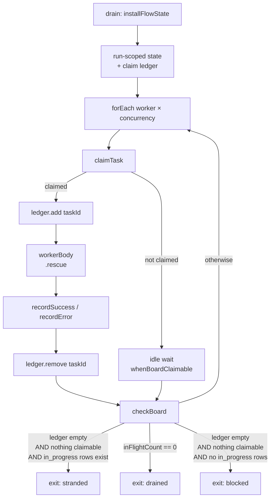

# FIX-978: Stranded `in_progress` lease with no reclaim path hangs any later drain for ~14 hours instead of failing fast — Implementation Spec

**Linear:** [FIX-978](https://linear.app/fixpoint-labs/issue/FIX-978) · **Epic:** [FIX-980 — Honest task substrate](https://linear.app/fixpoint-labs/issue/FIX-980) ([epic-spec](_epics/honest-task-substrate.md), [epic PR #983](https://github.com/fixpoint-labs/flow-state-dev/pull/983)) · **Category:** Bug

---

## For reviewers — what this document is

This is a **direction document**, not an implementation. Reviewing it well means
answering one question: **is this the right approach?**

**In scope to challenge:**

- The problem framing — are we solving the right thing?
- The approach — will it work, does it fit the architecture and `docs/philosophy.md`?
- Any numbered **Decision** in §6 — that's the sign-off surface.
- Missing constraints, edge cases, or dependencies that would **invalidate** the design.
- Scope — a deliverable that shouldn't ship, or one that's missing.

**Out of scope — deliberately unsettled here, and owned by the implementing agent:**

- Names, signatures, file paths, and module layout.
- Local structure: which helper, how a function is decomposed, error-message wording.
- Micro-optimizations and style preferences.
- Test names and internal test structure (the *behaviours* to test are in §10; the tests
  themselves are not).
- Anything Part II left open on purpose — it is directional by design, and a gap at
  that altitude is intended, not an omission.

Feedback in the second list is welcome and gets **recorded verbatim in §13** for the
implementer to weigh against real code. It will not be argued with, and it will not be
folded into the design prose — that would pretend the spec can settle something it
can't. Please don't re-raise it: one mention is enough for it to land in §13.

---

## Part I — The Case *(for the human)*

### 1. Problem — why it matters, why now

**In plain language.** A task board hands each unit of work to a worker, and marks that
work "in progress" while the worker runs. If the process dies at exactly the wrong
moment — a crash, a restart, a deploy — the work stays marked "in progress" forever,
because the thing that would clean it up is never called. The next time anything tries
to run that board, it waits for a worker that no longer exists. It waits for about
fourteen hours. Then it gives up and reports the wrong reason: it says the work is
*blocked on a dependency*, which is not what happened at all.

Two separate failures, and the second is the worse one. The wait is expensive. The
report is *dishonest* — a caller who reads it and acts on it acts on a false cause.

**Why now.** This is live today, not a future hazard. Any board built on a collection
that outlives a single turn reaches it — the code-first durable path
(`defineTaskCollection` + `taskBoard`) — and the framework ships that path as a
supported way to build a board. There is no workaround a caller can adopt without
taking a worse risk: the one recovery verb that exists, `reclaim()`, resets *any*
expired claim, and a healthy worker's claim expires as a matter of routine (see §3),
so calling it blindly re-runs live work and duplicates its side effects. The user is
currently choosing between a fourteen-hour hang and silent duplicate execution.

This is the fifth instance of the epic's shape: **the substrate's report diverges from
what happened and the caller cannot detect the divergence.** Here the divergence is
that the board reports `blocked` when it is actually stranded, and takes most of a day
to say so.

### 2. Solution in plain terms

The board already has an exit for "I cannot make progress" — the `complete-or-blocked`
mode exists to stop a drain that has nothing left it can run. That exit asks the wrong
question. It asks *"does the collection contain zero in-progress rows?"* when what it
means is *"is any worker of mine actually working?"* Those two questions have the same
answer right up until a row is held by something that isn't a live worker of this
drain — which is precisely the stranded case, and precisely when the board needs the
exit most.

**So: make the board measure the thing it was standing in for.** A drain knows which
tasks its own workers claimed, because every claim in a drain goes through one block.
Record them. Then the exit condition becomes: *no claim of mine is outstanding, and
nothing here is claimable.* When that is true the drain cannot progress, whether the
in-progress rows belong to a dead prior execution or a live concurrent one — so it
stops, promptly, and **names the real cause**: a claim is held outside this run.

What it deliberately does **not** do is decide whether that other claim's owner is
alive. It does not need to, because it never writes to the row. It reports and exits;
the row is left exactly as it was found. That is what makes this safe under the epic's
Decision 3 — the constraint is that expiry is not evidence of abandonment, and this
design never infers abandonment at all.

**The philosophy this leans on.**

- **Tenet 5 (fix at the owning layer, at the convergence point).** The hang is
  reproducible from the delegation surface, from `planAndExecute`, from a hand-built
  board — every one of them through `taskBoard`. `taskBoard` is where they converge, so
  the fix goes there and cures all of them, rather than each caller learning to call
  `reclaim()` defensively. The same tenet picks the seam *inside* the board: every claim
  passes through one claim block, so the ledger has exactly one writer.
- **Tenet 1 (coherence over local cleverness).** `count(in_progress) === 0` is not a
  weaker version of "no worker is active" — it is a different predicate that happened
  to agree. Replacing the proxy with the property removes an incoherence rather than
  adding a special case on top of it.
- **Tenet 3 (earn every addition).** The temptation here is to build the whole recovery
  mechanism: a claim-ownership field, lease renewal, an automatic sweeper. All three are
  already scoped as FIX-939 milestone 2 and none of them is needed to stop lying to the
  caller. This spec ships the honesty and leaves the recovery where it was already
  planned.

### 3. Tradeoffs & alternatives

**The simpler approach, and why it loses.** Call `collection.reclaim()` before each
drain. It is three lines, it exists today, and it makes the reported symptom go away. It
is also wrong, and this is the load-bearing fact of the whole issue:

- `DEFAULT_LEASE_DURATION_MS` is 30 seconds
  (`packages/orchestration/src/tasks/collection/internal.ts`).
- **Nothing renews a lease.** `leaseUntil` is stamped once by `applyClaimToTask` at claim
  time and thereafter only ever *cleared* on a terminal transition — never extended. A
  grep for `renew` / `heartbeat` / `extendLease` across `packages/orchestration/src/`
  returns nothing.
- A generator's model call routinely runs longer than 30 seconds.

Therefore **an expired lease is the normal state of a healthy long-running worker.**
A pre-drain `reclaim()` resets that worker's task to `pending`, a second worker claims
it, and the model call plus its side effects run twice — with the first worker's
eventual write-back declined by FIX-951's containment guard, silently. That trades a
loud fourteen-hour hang for silent duplicate execution, which is strictly worse. The
same objection kills the variant "teach the wake predicate to ignore expired leases":
same inference, same unsafety, one layer up.

**The bigger approach, and why it's not ours.** Stamp an execution identifier on each
claim and join it to real liveness, so "this owner is provably gone" becomes answerable
and recovery can be automatic. That is the right eventual design — and it is already
**FIX-939 milestone 2** ("Automated reclamation, joined to execution liveness … Closes
FIX-978"), which correctly points at the engine's existing request-liveness registry
(`stores.activeRequests`, a ~10s heartbeat, `listStale`, `createStaleRequestSweeper`)
rather than inventing a second notion of liveness. Two reasons this spec does not
pre-empt it: that registry lives in `@flow-state-dev/engine`, which
`@flow-state-dev/orchestration` does not and must not depend on; and landing a *partial*
ownership field here that FIX-939 then has to reconcile is exactly the "wrong in both
places for the same reason twice" hazard the issue warns about.

**Where the genuine complexity is.** Not the exit condition — that part is small. It is
in the ledger's *lifetime*: a claim must be entered when the claim block succeeds and
removed when the worker's outcome is recorded, including on the rescue path where the
worker threw, and including when FIX-951's guard declines the write-back. A ledger that
leaks an entry re-creates the hang inside a single drain; a ledger that drops an entry
early makes a busy board exit as stranded. §9 walks those.

A second, quieter cost: this design cannot tell a dead prior execution from a live
concurrent one, and will report both as "claimed outside this run." For a concurrent
durable board that is arguably the right answer anyway — this drain genuinely cannot
proceed and genuinely must not touch the row — but it is a real limitation and it is
named, not hidden.

### 4. Focus practices

1. **Find the convergence point before writing the guard (tenet 5 / BP-028).** The
   invariant is "every claim this drain makes is in the ledger." It holds only if the
   ledger's writer sits where all claims pass. Enumerate the claim sites and the
   release sites before coding; a release path missed on the rescue branch is the
   failure mode this change is most likely to ship.
2. **BP-035, second-path checklist, with the *cancel/error path* as the sharp one.** The
   worker body has a `.rescue()` scope. Test the thrown-worker path, the
   declined-write-back path, and the claim-then-immediately-cancelled path explicitly.
3. **BP-030 in the reader direction.** The new exit reason is an *additive* enum value on
   `checkBoardOutputSchema.reason` and on `task-board-meta`'s `terminationReason`.
   Anything switching on those values needs a total match or a defaulting arm — including
   in the devtool renderer, if it reads them.
4. **BP-003 with a falsifiable pre-fix baseline.** The goal check must be run against
   `origin/main` and recorded as FAIL before the fix, at shrunk timings. A check that
   passes on both sides proves nothing here, because the pre-fix behaviour is *eventual
   success* — just fourteen hours later.
5. **Never write to a task this drain does not own.** The strongest anti-game in §10:
   assert the stranded row is unchanged after the drain. This is the rule that keeps the
   fix inside epic Decision 3.

### 5. What using it looks like

The public API does not change. What changes is what a drain *returns* and how long it
takes to return it. Both examples are the same caller code before and after.

**Before — a durable board whose previous run died mid-claim:**

```ts
const board = taskBoard({
  name: "reports",
  collection: reportTasks,          // a durable, resource-backed collection
  workers: { writer },
  onIdle: "complete-or-blocked",
});

// ~14 hours later:
//   task-board-meta → { status: "completed",
//                       terminationReason: "blocked-by-failures",
//                       counts: { in_progress: 1, pending: 2, ... } }
```

Two lies in one item: it took most of a day, and `blocked-by-failures` says a
dependency failed. Nothing failed — a claim was stranded, and the two other tasks were
runnable the entire time.

**After — same code, same board:**

```ts
// seconds later:
//   task-board-meta → { status: "completed",
//                       terminationReason: "stranded-claim",
//                       counts: { in_progress: 1, completed: 2, ... } }
```

The two runnable tasks drained. The stranded row is untouched — same `status`, same
`attempts`, same `leaseUntil` — and the verdict names what actually stopped the board.

**Recovering, once you know the prior process is gone** (unchanged API, newly documented
as the deliberate move it is):

```ts
// You know your deploy killed the previous run. That is information the
// substrate does not have — so you make the call, not it.
await collection.reclaim();   // expired claims → pending
await board.drain(...);       // now drains normally
```

### 6. Decisions & rules — the sign-off surface

1. **The `complete-or-blocked` exit condition stops asking "are there zero `in_progress`
   rows?" and starts asking "is any claim of this drain's own outstanding?"**
   *Alternative rejected:* a pre-drain `reclaim()`, or teaching the wake predicate to
   disregard expired leases. Both infer abandonment from expiry, which epic Decision 3
   forbids and §3 shows to be unsound.
   *Ramification:* the board gains a bounded, honest exit without ever writing to a task
   it does not own. It also means a drain sharing a durable board with a *live*
   concurrent execution now exits promptly instead of waiting for it — reported, never
   reset.

2. **The drain's own claims are tracked in the board's existing run-scoped state. No
   field is added to the `Task` schema.**
   *Alternative rejected:* stamping an execution/run identifier onto the persisted task
   row (the direction the issue itself floats).
   *Ramification:* no persisted-schema change, no migration, and no collision with
   FIX-939 milestone 2, which will add durable claim ownership joined to real execution
   liveness. Cost, accepted deliberately: the signal is per-drain, so it distinguishes
   "not mine" but not "provably dead." That is enough to exit honestly and not enough to
   recover automatically — which is the correct split of responsibility here.

3. **The honest outcome is a new, distinct exit reason — not a re-use of `blocked`.** It
   is carried on the drain's per-worker exit reason and on the persisted
   `task-board-meta` `terminationReason`.
   *Alternative rejected:* keep reporting `blocked` and let the caller disambiguate from
   `counts`. That is a breadcrumb, not observability — epic Decision 4 rules it out.
   *Ramification:* two additive enum widenings; every consumer that exhaustively matches
   those enums must gain an arm. The board's verdict becomes branchable by a caller.

4. **No automatic reclamation, no lease renewal, and no model-facing
   `in_progress → pending` tool ships in this issue.**
   *Alternative rejected:* shipping the deliberate recovery verb here, since epic
   Decision 3 explicitly leaves that direction untouched by the expiry constraint.
   *Ramification:* recovery on the code-first durable path stays the caller's explicit
   `collection.reclaim()` call, newly documented as the informed decision it is. The
   model-facing verb and the question of whether `in_progress` / `awaiting_review` →
   `pending` should be *guarded* stay with **FIX-957 Decision 4** and **FIX-939 milestone
   2**, so one transition surface is decided in one place rather than two.

5. **The change lands in the `taskBoard` primitive. The delegation surface is not
   touched.**
   *Alternative rejected:* also widening the delegation `runBoard` settle verdict
   (`drained | blocked`) to carry the new outcome.
   *Ramification:* delegation's board is turn-scoped today, so the stranded state is
   unreachable there — widening its enum now would ship a code path nothing can enter.
   Fixing the primitive means delegation inherits the behaviour the moment it gets a
   durable board lifetime (FIX-957 / FIX-939), leaving that work a one-value enum
   widening as its tail.

6. **Only `onIdle: "complete-or-blocked"` changes. `complete` and `wait` keep today's
   semantics exactly.**
   *Alternative rejected:* applying the new exit in every mode.
   *Ramification:* `complete` documents itself as "wait until everything settles, an
   external pump will resolve it" — and a caller who chose that cannot be told by the
   board that their pump is never coming. Waiting is the contract there. The fix lands
   only in the mode whose stated purpose is already "stop when this drain cannot
   progress." The residual is named in §9 and §12.

**Non-goals.** Automatic lease reclamation, lease renewal/heartbeat, durable claim
ownership, cross-execution claim safety (all FIX-939) · a model-facing recovery tool and
the `in_progress` / `awaiting_review` → `pending` guard question (FIX-957 Decision 4) ·
any delegation-surface change · any change to `complete` or `wait` idle modes.

**Size estimate: Medium** — multi-file within `packages/orchestration`, one PR, plus docs,
tests, and a goal check. No PR plan; this is a single-node build.

---

## Part II — The Build Plan *(for the implementing agent)*

### 7. Technical design

One package, one layer: `packages/orchestration/src/task-board/`. The task substrate
(`src/tasks/`) is **not** touched — no schema change, no collection-method change, no new
transition. That is a deliberate consequence of Decision 2 and worth preserving as a
review check: a diff that reaches into `src/tasks/` has drifted.

**The seam.** The board already installs a run-scoped state bag at the top of the drain
(`createInstallBoardFlowState` → `BoardRunFlowState`), attached to `ctx.request` so every
nested scope — each `forEach` worker iteration, each worker sequencer, each generator
tool loop — sees the same object by reference, and torn down symmetrically on both the
success and rescue paths. That bag is the convergence point for the claim ledger: it
already has exactly the lifetime a drain has, and it already survives the nesting the
workers introduce.

**Where the ledger is written and released.** Every claim in a drain goes through
`createClaimTask` — one writer (tenet 5). Release happens where the worker's outcome is
recorded (`createRecordSuccess` / `createRecordError`), which the worker body already
runs inside a `.rescue()` scope so both the normal and thrown paths reach a recorder.
Release must be unconditional on the *recorder running*, not on the write-back
succeeding: FIX-951's advisory guards can decline the write and return normally, and the
worker is finished with the task either way.



**The predicate and the checker move together.** `whenBoardClaimable`'s
`complete-or-blocked` arm and `createCheckBoard`'s `complete-or-blocked` arm both
currently test `collection.count({ status: ["in_progress", "awaiting_review"] }) === 0`.
They are two spellings of one condition and must stay in agreement — if the predicate
never wakes, the checker never gets to decide, which is half of today's bug. Both read
the ledger instead.

**Disambiguating the two exits.** Once "no claim of mine is outstanding and nothing is
claimable" is true, the board distinguishes:

- collection has no `in_progress` / `awaiting_review` rows → today's `blocked`
  (dependency deadlock), unchanged.
- collection *does* have such rows, none of them this drain's → the new stranded exit.

> **Illustrative — a sketch, not the contract.**
>
> ```ts
> // complete-or-blocked, after `inFlightCount === 0` has been ruled out:
> const mine = runState.claims.size > 0;
> if (!mine && !hasClaimableTask(collection)) {
>   return collection.count({ status: ["in_progress", "awaiting_review"] }) > 0
>     ? { shouldContinue: false, reason: "stranded" }
>     : { shouldContinue: false, reason: "blocked" };
> }
> ```

**The reported surfaces.** Two, both already persisted and both currently saying the
wrong thing:

- `checkBoardOutputSchema.reason` — the drain's per-worker exit reason, and the code-first
  caller's branchable value.
- `createBoardMetaCompleted`'s `terminationReason` on the `task-board-meta` component
  item, today a two-value `all-completed | blocked-by-failures` recomputed from counts.
  It gains the third outcome. Recomputing it from counts alone is not sufficient — a
  stranded row and a dependency deadlock produce different `counts` but the current
  derivation collapses them, so the meta block needs the run's verdict rather than only
  the ledger snapshot.

**What is deliberately absent.** No `reclaim()` call anywhere in the drain. No read of
`leaseUntil` in any new code. If either appears in the diff, the design has been
misread — expiry is not an input to this fix.

### 8. Implementation sequence

Single PR. Ordered so each step is independently testable.

1. **Reproduce first (`diagnose`).** Stand up a failing test at shrunk timings
   (`idlePollMs` small, `maxIterations` small) over a durable collection with one seeded
   `in_progress` row past its lease plus one drainable sibling. Assert the drain rides
   the iteration ceiling and reports `blocked`. This is the feedback loop for everything
   below. *Test:* the reproduction fails on `main` in the intended way, not by timing out
   the test runner.
2. **Add the claim ledger to the run-scoped board state**, written by the claim block and
   released by both recorders. Nothing reads it yet. *Test:* ledger is empty after a
   normal drain; empty after a drain where a worker throws; empty after a drain where a
   write-back is declined by FIX-951's guards; entries are per-task and two workers never
   collide.
3. **Switch the `complete-or-blocked` wake predicate and exit check to read the ledger**,
   with the two exits disambiguated as in §7. *Test:* step 1's reproduction now exits in
   the low seconds; a healthy board's behaviour is bit-for-bit what it was; a
   dependency-deadlocked board still reports `blocked`.
4. **Widen the two reported enums** and thread the verdict into the meta block. *Test:*
   the `task-board-meta` item carries the new `terminationReason` in the stranded case and
   the old values in every other case.
5. **Assert the non-write invariant.** The stranded row is unchanged after the drain.
   *Test:* status, `attempts`, `leaseUntil`, `startedAt` all identical to what was seeded.
6. **Goal check + docs + changeset.**

**Removals (tenet 3).** The `count({ status: ["in_progress", "awaiting_review"] }) === 0`
test in `whenBoardClaimable`'s `complete-or-blocked` arm and in `createCheckBoard`'s, and
the count-derived `terminationReason` computation in `createBoardMetaCompleted`. These are
replaced, not supplemented — leaving either in place beside the new condition reinstates
the bug on one of the two paths.

### 9. Edge cases & error handling

| Case | Expected behaviour |
|---|---|
| **Healthy board, worker mid-model-call, lease long expired** | Unchanged. The claim is in this drain's ledger, so the board keeps waiting exactly as today. **This is the case the naive fix breaks, and it is the sharpest regression test in the set.** |
| **Stranded row from a dead prior execution + drainable siblings** | Siblings drain; board exits promptly with the stranded verdict; the stranded row is untouched. The headline case. |
| **Stranded row, nothing else on the board** | Same exit, `counts.completed === 0`. Not an error — the drain is reporting, not failing. |
| **Live concurrent execution holds a claim on a shared durable board** | Reported as stranded and exited. Honest but imprecise: this drain genuinely cannot proceed and genuinely must not touch the row. Named as the accepted limitation of Decision 2. |
| **Worker throws** | Recorder runs on the `.rescue()` path → ledger entry released. A leaked entry here would hang the drain from inside, so this path is tested directly, not by inference. |
| **Write-back declined by FIX-951's `ifAllowed` / `expectAttempt`** | Ledger entry released anyway. Release is conditioned on the recorder running, not on the write landing. |
| **Task cancelled by a coordinator while its worker runs** | Ledger entry released by the recorder as usual; the row is terminal so it does not count toward the stranded check. FIX-951's containment property is unaffected — nothing in this change touches the recorders' guards. |
| **`awaiting_review` row parked by an external actor** | Under `complete-or-blocked`, an `awaiting_review` row held outside this run reads the same as a stranded `in_progress` one: this drain cannot advance it. It takes the stranded exit rather than waiting out the ceiling. Callers who intend to wait for review across a drain boundary are on `complete` or `wait`, which are unchanged. **Flag for the implementer: confirm this against the FIX-443 §10.1 review semantics before locking it in; if it reads wrong in code, surface it rather than following the spec.** |
| **`onIdle: "complete"` with a stranded row** | Unchanged — still rides to `maxIterations`. Decision 6; residual noted in §12. |
| **`onIdle: "wait"`** | Unchanged; defers to `shouldExit` as today. |
| **Legacy checkpointed worker/board state from before this change** | The ledger is run-scoped and rebuilt per drain, so there is no persisted shape to dual-read (BP-030 not engaged on the write side). The *read* side is engaged: consumers matching the widened enums need a defaulting arm. |
| **`concurrency: 1`** | Ledger has at most one entry; all conditions collapse correctly. Worth a case because a single-worker board is where an off-by-one in release shows up as a hang. |

Error taxonomy: nothing in this change introduces a throw. The stranded outcome is a
*verdict*, not an error — the drain returns normally and the caller decides.

### 10. Testing strategy

**Goal check (real path, model-free).**
`goals/task-board/reports-a-stranded-claim-instead-of-hanging/`, modelled on the existing
`goals/task-board/contains-a-worker-outcome-that-lands-on-a-settled-task/` (same area,
same model-free justification: the failure is a substrate race that has to be seeded
deterministically, and a model would add flakiness without adding discrimination).

- **Signal:** one `runAction` over a real durable, resource-backed collection on a real
  SQLite file, seeded with one `in_progress` row whose lease is well past, plus two
  runnable sibling tasks. Shrunk idle timings so the pre-fix baseline is minutes rather
  than fourteen hours.
- **Assertions:** the run reaches `completed` in seconds; both siblings reach `completed`
  and their recorded output carries a **held-out fixture salt**; the verdict on the
  persisted `task-board-meta` item names the stranded outcome; and the seeded row's
  `status`, `attempts`, `leaseUntil` and `startedAt` are **identical to what was seeded**.
- **Anti-game.** (1) A board that exits fast without running anything — closed by the
  salt-carrying sibling outputs. (2) A board that "fixed" it by reclaiming — closed by the
  unchanged-row assertion, which is the Decision 3 guard made executable. (3) Asserting on
  the drain's return value only — assertions read the persisted item stream off the
  request record, per the sibling goal's precedent.
- **Must fail before the fix**, and the FAIL must be recorded against `origin/main` in the
  verdict log before the PR opens (BP-003). At shrunk timings the pre-fix baseline exits
  eventually, so the check has to assert the *fast* path and the *verdict*, not merely
  eventual completion.

**CI specs (mocked, deterministic), in observable terms.**

- `whenBoardClaimable` under `complete-or-blocked` wakes when this drain holds no claim
  and does not wake when it does, with an expired-lease row present in both cases.
- `checkBoard` returns the stranded verdict when the ledger is empty, nothing is
  claimable, and non-terminal rows exist; returns `blocked` when no such rows exist;
  returns `drained` when `inFlightCount` is zero (drained still dominates).
- Ledger release on: normal completion, thrown worker, declined write-back, cancelled task.
- Healthy long-running worker with an expired lease is *not* treated as stranded.
- Dependency-deadlock board still reports `blocked` — the pre-existing FIX-621 behaviour
  does not regress.
- `task-board-meta` carries the right `terminationReason` in each of the three outcomes.
- `onIdle: "complete"` and `"wait"` behaviour is unchanged (BP-035 off-state).

**Discipline:** `diagnose`. The seam for the feedback loop is vitest at
`packages/orchestration/test/task-board/`, where the existing board tests already stand up
real collections and drains; the goal check is the real-path proof on top.

### 11. Documentation plan

No new pages, no new sidebar entries, no guide, no blog post. Three extensions — two of
which correct statements that are currently misleading.

| File | Action | What changes |
|---|---|---|
| `apps/docs/docs/orchestration/task-board.md` | **EXTEND** | A short subsection near the existing `onIdle` / termination material: what a stranded claim is, that `complete-or-blocked` now exits on it promptly with its own termination reason, and the recovery recipe — `await collection.reclaim()` **when you know the prior process is gone**, framed as the caller's informed decision. Cross-link to `task-substrate.md`'s lease section. |
| `apps/docs/docs/orchestration/task-substrate.md` | **EXTEND (correction)** | Line ~38 currently reads `leaseUntil` as "Timestamp after which a stale claim can be reclaimed," which implies expiry means staleness. Nothing renews a lease and the default is 30s, so a healthy worker's lease expires routinely. State that plainly, and that nothing calls `reclaim()` automatically. This is the single most load-bearing docs fix in the set: the current wording is what leads people to the unsafe pre-drain `reclaim()`. |
| `packages/orchestration/README.md` | **EXTEND (correction)** | Same lease honesty correction at the `Task` field list and the state diagram's `(reclaim — stale lease)` annotation. Terse; the README is a reference, not a guide. |

**Cross-links.** `task-board.md` → `task-substrate.md` lease section (new, both directions).
No orphan pages, since nothing new is created.

**Voice risks to watch** (`CLAUDE.md` → Writing Style): no issue or PR numbers in
`apps/docs/` prose — refer to the behaviour, not to FIX-978 or FIX-939. Introduce "lease"
and "claim" in plain terms on first use in the task-board page, since a reader may arrive
there without having read the substrate page. Keep em-dashes sparse; the draft above
leans on them and the prose should not. Resist a triumphant closer on the new subsection.

**Changeset (BP-022):** user-facing behaviour change → `patch`, naming the new termination
reason and the corrected lease semantics.

### 12. Dependencies, open questions & follow-ups

**Blocking dependencies: none.** This is reachable and fixable on today's `main`.

**Coordination points (not blockers).**

- **FIX-939 milestone 2** is the eventual owner of automatic reclamation and durable claim
  ownership, and its own text names FIX-978 as what it closes. This spec deliberately
  closes only the *honesty* half and leaves the recovery half there, so the two do not
  land conflicting shapes. Whoever picks up that milestone should read Decision 2.
- **FIX-957 Decision 4** is the open owner question on whether the
  `in_progress` / `awaiting_review` → `pending` transition should be *guarded*. This spec
  adds no such transition and no tool that performs one, so it neither pre-empts nor is
  blocked by that decision.

**Two corrections to inherited context, verified in this research** (both propagate to the
epic-spec and the issue body, and matter because the wrong version is actively steering
readers):

- The FIX-978 issue body's *Related* section — written against `spec/FIX-957 @ 8ff157f38`
  — says FIX-957 sub-PR `d` plans a pre-drain `reclaim()` for this defect. **That is no
  longer true.** FIX-957 has since factored the durable board out to FIX-939
  (`cefb7ec`, "factor the durable board out to FIX-939"); its current non-goals explicitly
  list "lease reclamation" as FIX-939's, and it now covers `block` and `request` lifetimes
  only. The overlap the issue warns about has largely dissolved; what remains is FIX-957
  Decision 4 above.
- The epic-spec's Decision 3 states "*(FIX-957 has no spec document; check the Linear
  issue, not `docs/specs/`.)*" **`docs/specs/FIX-957.md` does exist** — on branch
  `origin/spec/FIX-957`, currently at `bf52b39`, 400 lines. It is not on `main` (spec PRs
  are never merged), which is presumably where the confusion came from. Raised on the epic
  PR as a non-blocking comment rather than decided here.

**Open questions.**

- **OQ-1 — should the stranded exit also apply under `onIdle: "complete"`?** *Recommend
  no* (Decision 6): `complete` documents itself as "wait, an external pump will resolve
  this," and a caller who chose it has asked the board not to give up. The cost of "no" is
  that a `complete`-mode board with a stranded row still rides `maxIterations`. The cost of
  "yes" is breaking a documented contract for callers who legitimately wait on an external
  actor. Answerable at implementation time if the code argues otherwise; not a blocker.
- **OQ-2 — does an `awaiting_review` row held outside this run belong in the stranded
  exit, or should it keep the board alive?** §9 takes the first position. Flagged because
  FIX-443 §10.1 gave `awaiting_review` deliberate keep-alive semantics and the implementer
  is better placed than this spec to judge whether they should survive here.

**Follow-ups (flagged, not built).**

- The delegation surface's `runBoard` settle verdict (`drained | blocked`) will need the
  third value once delegation gets a durable board lifetime. One enum value; belongs to
  whichever of FIX-957 / FIX-939 lands that lifetime, not here (Decision 5).
- **Deepening opportunity, out of scope:** `whenBoardClaimable` and `createCheckBoard`
  each hold their own spelling of the same three-mode exit condition, and this change has
  to edit both in lockstep to stay correct. That duplication is a shallow-seam smell worth
  a later `improve-codebase-architecture` pass — a single exit-condition module both
  consume. Not in scope here; consolidating it under a bug fix would enlarge the diff at
  exactly the moment it needs to be reviewable.

### 13. Review notes for the implementer

*(none yet — populated from spec-PR review)*

---

## Spec evolution

- **Spec drafted** — framed the defect as two failures rather than one (a fourteen-hour
  wait *and* a verdict that names the wrong cause), and traced the wait to a proxy: the
  `complete-or-blocked` exit tests `count(in_progress) === 0` where it means "is any
  worker of mine active." Chose to correct the proxy with a run-scoped ledger of the
  drain's own claims — which answers "is this claim mine?" without ever asking "is its
  owner alive?", so the fix satisfies epic Decision 3 by construction rather than by
  argument. Deliberately left automatic reclamation, lease renewal and durable claim
  ownership to FIX-939 milestone 2, and the `in_progress → pending` guard question to
  FIX-957 Decision 4, so neither is decided twice. Single PR, Medium.
