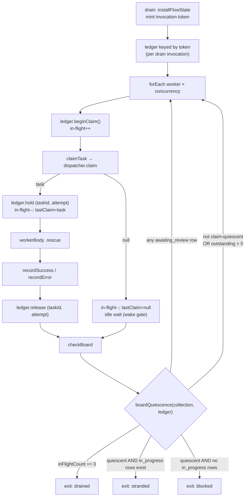

# FIX-978: Stranded `in_progress` lease with no reclaim path hangs any later drain for ~14 hours instead of failing fast — Implementation Spec

**Linear:** [FIX-978](https://linear.app/fixpoint-labs/issue/FIX-978) · **Epic:** [FIX-980 — Honest task substrate](https://linear.app/fixpoint-labs/issue/FIX-980) · **Epic-spec and its governing decisions:** [epic PR #983](https://github.com/fixpoint-labs/flow-state-dev/pull/983) · **Category:** Bug

> The epic-spec lives on the `epic/honest-task-substrate` branch, not on `main` or on this
> spec branch, so it is linked by PR rather than by relative path — a relative link would be
> broken for anyone reading this from the spec PR.

---

## For reviewers — what this document is

This is a **direction document**, not an implementation. Reviewing it well means
answering one question: **is this the right approach?**

**In scope to challenge:**

- The problem framing — are we solving the right thing?
- The approach — will it work, does it fit the architecture and `docs/philosophy.md`?
- Any numbered **Decision** in §6 — that's the sign-off surface.
- Missing constraints, edge cases, or dependencies that would **invalidate** the design.
- Scope — a deliverable that shouldn't ship, or one that's missing.

**Out of scope — deliberately unsettled here, and owned by the implementing agent:**

- Names, signatures, file paths, and module layout.
- Local structure: which helper, how a function is decomposed, error-message wording.
- Micro-optimizations and style preferences.
- Test names and internal test structure (the *behaviours* to test are in §10; the tests
  themselves are not).
- Anything Part II left open on purpose — it is directional by design, and a gap at
  that altitude is intended, not an omission.

Feedback in the second list is welcome and gets **recorded verbatim in §13** for the
implementer to weigh against real code. It will not be argued with, and it will not be
folded into the design prose — that would pretend the spec can settle something it
can't. Please don't re-raise it: one mention is enough for it to land in §13.

---

## Part I — The Case *(for the human)*

### 1. Problem — why it matters, why now

**In plain language.** A task board hands each unit of work to a worker, and marks that
work "in progress" while the worker runs. If the process dies at exactly the wrong
moment — a crash, a restart, a deploy — the work stays marked "in progress" forever,
because the thing that would clean it up is never called. The next time anything tries
to run that board, it waits for a worker that no longer exists. It waits for about
fourteen hours. Then it gives up and reports the wrong reason: it says the work is
*blocked on a dependency*, which is not what happened at all.

Two separate failures, and the second is the worse one. The wait is expensive. The
report is *dishonest* — a caller who reads it and acts on it acts on a false cause.

**Why now.** This is live today, not a future hazard. Any board built on a collection
that outlives a single turn reaches it — the code-first durable path
(`defineTaskCollection` + `taskBoard`) — and the framework ships that path as a
supported way to build a board. There is no workaround a caller can adopt without
taking a worse risk: the one recovery verb that exists, `reclaim()`, resets *any*
expired claim, and a healthy worker's claim expires as a matter of routine (see §3),
so calling it blindly re-runs live work and duplicates its side effects. The user is
currently choosing between a fourteen-hour hang and silent duplicate execution.

This is the fifth instance of the epic's shape: **the substrate's report diverges from
what happened and the caller cannot detect the divergence.** Here the divergence is
that the board reports `blocked` when it is actually stranded, and takes most of a day
to say so.

### 2. Solution in plain terms

The board already has an exit for "I cannot make progress" — the `complete-or-blocked`
mode exists to stop a drain that has nothing left it can run. That exit asks the wrong
question. It asks *"does the collection contain zero in-progress rows?"* when what it
means is *"is any worker of mine actually working?"* Those two questions have the same
answer right up until a row is held by something that isn't a live worker of this
drain — which is precisely the stranded case, and precisely when the board needs the
exit most.

**So: make the board measure the thing it was standing in for.** A drain knows which
tasks its own workers claimed, because every claim in a drain goes through one block.
Record them, per execution. Then the exit condition becomes: *no claim of mine is
outstanding, and nothing here is claimable.* When that is true the drain cannot
progress, whether the `in_progress` rows belong to a dead prior execution or a live
concurrent one — so it stops, promptly, and **names the real cause**: a claim is held
outside this run.

What it deliberately does **not** do is decide whether that other claim's owner is
alive. It does not need to, because it never writes to the row. It reports and exits;
the row is left exactly as it was found. That is what makes this safe under the epic's
Decision 3 — the constraint is that expiry is not evidence of abandonment, and this
design never infers abandonment at all.

Two refinements make that skeleton correct, and both came out of review.

**One status is deliberately excluded: `awaiting_review`.** A task parked for human
review is *supposed* to keep the board alive until an external actor resumes it
(FIX-443 §10.1), and a parked row from a dead execution is genuinely
indistinguishable from a live park — nothing about it says whether the reviewer is
coming. So a review row is an explicit **keep going**, evaluated before the stranded and
blocked exits rather than merely omitted from the stranded test. See Decision 7.

**In the automatic-idle modes only.** An earlier draft said "in every mode," which contradicts
Decision 6: under `onIdle: "wait"` the checker returns `{ shouldContinue: false, reason: "exit" }`
the moment `shouldExit(collection)` is true, **without consulting the collection** (verified at
round 6, `check-board.ts:99-102`) — so a keep-alive there would suppress a *caller-controlled*
exit. `wait` hands the exit decision to the caller by definition, and a review row is not the
board's business to override. The keep-alive therefore applies to `complete-or-blocked` and
`complete`, the two modes where the board decides for itself.

**And "nothing here is claimable" has to be an observed outcome — a *fresh* one.**
The board already asks the dispatcher for work and gets a yes or no every iteration. That
answer is ground truth for every dispatcher, including ones we didn't write. Re-deriving
eligibility with a second, simpler predicate — as the board does today — silently
disagrees with any dispatcher that filters on more than status and dependencies.

But an observation is only ground truth *as of when it was taken*. The dispatcher contract
says `null` means "nothing is ready **right now**," explicitly permitting backoff — so a
recorded `null` is a fact about a moment, not a verdict about the board. An exit that rests
on a stale "not right now" will end a drain that has since become runnable, and the sharpest
case is the one Decision 7 exists to protect: a review resuming. So recorded outcomes carry
the collection version they were taken at, and any mutation retires them. See Decision 8.

What it deliberately does **not** do is decide whether that other claim's owner is
alive. It does not need to, because it never writes to the row. It reports and exits;
the row is left exactly as it was found. That is what makes this safe under the epic's
Decision 3 — the constraint is that expiry is not evidence of abandonment, and this
design never infers abandonment at all.

**The philosophy this leans on.**

- **Tenet 5 (fix at the owning layer, at the convergence point).** The hang is
  reproducible from the delegation surface, from `planAndExecute`, from a hand-built
  board — every one of them through `taskBoard`. `taskBoard` is where they converge, so
  the fix goes there and cures all of them, rather than each caller learning to call
  `reclaim()` defensively. The same tenet picks the seam *inside* the board: every claim
  passes through one claim block, so the ledger has exactly one writer.
- **Tenet 1 (coherence over local cleverness).** `count(in_progress) === 0` is not a
  weaker version of "no worker is active" — it is a different predicate that happened
  to agree. Replacing the proxy with the property removes an incoherence rather than
  adding a special case on top of it.
- **Tenet 3 (earn every addition).** The temptation here is to build the whole recovery
  mechanism: a claim-ownership field, lease renewal, an automatic sweeper. All three are
  already scoped as FIX-939 milestone 2 and none of them is needed to stop lying to the
  caller. This spec ships the honesty and leaves the recovery where it was already
  planned.

### 3. Tradeoffs & alternatives

**The simpler approach, and why it loses.** Call `collection.reclaim()` before each
drain. It is three lines, it exists today, and it makes the reported symptom go away. It
is also wrong, and this is the load-bearing fact of the whole issue:

- `DEFAULT_LEASE_DURATION_MS` is 30 seconds
  (`packages/orchestration/src/tasks/collection/internal.ts`).
- **Nothing renews a lease.** `leaseUntil` is stamped once by `applyClaimToTask` at claim
  time and thereafter only ever *cleared* on a terminal transition — never extended. A
  grep for `renew` / `heartbeat` / `extendLease` across `packages/orchestration/src/`
  returns nothing.
- A generator's model call routinely runs longer than 30 seconds.

Therefore **an expired lease is the normal state of a healthy long-running worker.**
A pre-drain `reclaim()` resets that worker's task to `pending`, a second worker claims
it, and the model call plus its side effects run twice — with the first worker's
eventual write-back declined by FIX-951's containment guard, silently. That trades a
loud fourteen-hour hang for silent duplicate execution, which is strictly worse. The
same objection kills the variant "teach the wake predicate to ignore expired leases":
same inference, same unsafety, one layer up.

**The bigger approach, and why it's not ours.** Stamp an execution identifier on each
claim and join it to real liveness, so "this owner is provably gone" becomes answerable
and recovery can be automatic. That is the right eventual design — and it is already
**FIX-939 milestone 2** ("Automated reclamation, joined to execution liveness … Closes
FIX-978"), which correctly points at the engine's existing request-liveness registry
(`stores.activeRequests`, a ~10s heartbeat, `listStale`, `createStaleRequestSweeper`)
rather than inventing a second notion of liveness. Two reasons this spec does not
pre-empt it: that registry lives in `@flow-state-dev/engine`, which
`@flow-state-dev/orchestration` does not and must not depend on; and landing a *partial*
ownership field here that FIX-939 then has to reconcile is exactly the "wrong in both
places for the same reason twice" hazard the issue warns about.

**Where the genuine complexity is.** Not the exit condition — that part is small. All
three hard parts are in the ledger, and spec review found two of them:

1. **Its lifetime.** A claim must be entered when the claim block succeeds and removed
   when the worker's outcome is recorded, including on the rescue path where the worker
   threw, and including when FIX-951's guard declines the write-back. A ledger that
   leaks an entry re-creates the hang inside a single drain; a ledger that drops an entry
   early makes a busy board exit as stranded.
2. **Its home has to be per-drain-invocation, and the two obvious slots are both too
   wide.** The board's `BoardRunFlowState` bag is allocated **once at `taskBoard()`
   construction**, so every execution shares it. The request bag is one scope better and
   still not enough: `.stepAll([board.drain, board.drain])` is ordinary public sequencer
   API, and `ctx.request` is shared by reference across every nested scope of a request —
   so two concurrent drains in one request would alias, clear, and release each other's
   entries. The ledger is keyed by the **drain invocation** (Decision 2).
3. **A claim is observable before it is recorded.** `collection.claim()` emits its
   `task-change` wake item *inside* the call, before its promise resolves — so there is a
   window where a task is `in_progress`, siblings have been woken, and the ledger has not
   yet been told. On a board whose last claimable task was just taken, a sibling reading
   that window sees "no claims, nothing claimable, an `in_progress` row" and would exit
   stranded while work is genuinely starting. Closed by counting claim *attempts* in
   flight, not just claims held (§7).

4. **An observed outcome can go stale, and the exit path is where that bites.** Round 2
   replaced a proxy with recorded dispatcher outcomes to be dispatcher-correct, and in doing
   so made the exit depend on observations that expire. `null` means "not right now"; if a
   review resumes, a dep completes, or a task is added *after* every worker recorded `null`,
   those recordings are obsolete and an exit taken on them ends a runnable board. Closed by
   versioning the outcomes against the collection (§7). This is the hazard that cost a third
   review round, and it was introduced by the fix for the second.

§9 walks all four.

A second, quieter cost: this design cannot tell a dead prior execution from a live
concurrent one, and will report both as "claimed outside this run." For a concurrent
durable board that is arguably the right answer anyway — this drain genuinely cannot
proceed and genuinely must not touch the row — but it is a real limitation and it is
named, not hidden.

### 4. Focus practices

1. **Find the convergence point before writing the guard (tenet 5 / BP-028).** The
   invariant is "every claim this drain makes is in the ledger." It holds only if the
   ledger's writer sits where all claims pass. Enumerate the claim sites and the
   release sites before coding; a release path missed on the rescue branch is the
   failure mode this change is most likely to ship.
2. **BP-035, second-path checklist, with the *cancel/error path* as the sharp one.** The
   worker body has a `.rescue()` scope. Test the thrown-worker path, the
   declined-write-back path, and the claim-then-immediately-cancelled path explicitly.
3. **BP-030 in the reader direction.** The new exit reason is an *additive* enum value on
   `checkBoardOutputSchema.reason` and on `task-board-meta`'s `terminationReason`.
   Anything switching on those values needs a total match or a defaulting arm — including
   in the devtool renderer, if it reads them.
4. **BP-003 with a falsifiable pre-fix baseline.** The goal check must be run against
   `origin/main` and recorded as FAIL before the fix, at shrunk timings. A check that
   passes on both sides proves nothing here, because the pre-fix behaviour is *eventual
   success* — just fourteen hours later.
5. **Never write to a task this drain does not own.** The strongest anti-game in §10:
   assert the stranded row is unchanged after the drain. This is the rule that keeps the
   fix inside epic Decision 3.

### 5. What using it looks like

The public API does not change. What changes is what a drain *returns* and how long it
takes to return it. Both examples are the same caller code before and after.

**Before — a durable board whose previous run died mid-claim:**

```ts
const board = taskBoard({
  name: "reports",
  collection: reportTasks,          // a durable, resource-backed collection
  workers: { writer },
  onIdle: "complete-or-blocked",
});

// ~14 hours later:
//   task-board-meta → { status: "completed",
//                       terminationReason: "blocked-by-failures",
//                       counts: { in_progress: 1, pending: 2, ... } }
```

Two lies in one item: it took most of a day, and `blocked-by-failures` says a
dependency failed. Nothing failed — a claim was stranded, and the two other tasks were
runnable the entire time.

**After — same code, same board:**

```ts
// seconds later:
//   task-board-meta → { status: "completed",
//                       terminationReason: "stranded-claim",
//                       counts: { in_progress: 1, completed: 2, ... } }
```

The two runnable tasks drained. The stranded row is untouched — same `status`, same
`attempts`, same `leaseUntil` — and the verdict names what actually stopped the board.

**Recovering — and why this spec no longer ships a recipe for it.** An earlier draft
showed a pre-drain `collection.reclaim()`, on the argument that a caller who knows their
deploy killed the previous run is making an informed decision the substrate can't. Review
showed that argument is wrong, and wrong by this spec's *own* Decision 3:

```ts
// NOT a recipe. reclaim() sweeps the whole collection, so on a durable
// collection shared with any other live execution it also re-pends that
// execution's healthy task — one whose lease expired simply because a model
// call ran past 30 seconds. Duplicate work, duplicate side effects.
await collection.reclaim();
```

Knowing *your* previous process died is not knowing that **no** execution holds a live
claim, and `reclaim()` needs the second fact, not the first. It is safe only against a
collection you can establish is quiescent — which a caller usually cannot. So there is no
safe general recovery verb today, and this spec does not invent one: it makes the board
*report* honestly and leaves recovery to FIX-939 milestone 2, where the liveness join
makes "provably gone" answerable per row. The docs say exactly this (§11), rather than
publishing a sweep that duplicates work.

(Also corrected from the draft: `board.drain` is a `SequencerDefinition` — a step you
compose with `.step(board.drain)`, not a function you `await`.)

### 6. Decisions & rules — the sign-off surface

1. **The `complete-or-blocked` exit condition stops asking "are there zero `in_progress`
   rows?" and starts asking "is any claim of this drain's own outstanding?"** The
   three-way decision (`drained` / `blocked` / `stranded`) lives in `checkBoard` alone;
   the wake predicate's exit-shaped disjunct becomes a call to that same shared helper (§7).
   *Alternative rejected:* a pre-drain `reclaim()`, or teaching the wake predicate to
   disregard expired leases. Both infer abandonment from expiry, which epic Decision 3
   forbids and §3 shows to be unsound.
   *Ramification:* the board gains a bounded, honest exit without ever writing to a task
   it does not own. It also means a drain sharing a durable board with a *live*
   concurrent execution now exits promptly instead of waiting for it — reported, never
   reset.

2. **The ledger is keyed by the individual `board.drain` invocation — not by the request,
   and not by the board definition. No field is added to the `Task` schema.** The rule,
   stated so it can be checked against the sibling specs that need the same one:

   > **Ledger storage is keyed by the individual `board.drain` invocation, never by the
   > request.** A request may contain many drain invocations, sequential *or concurrent*,
   > and `ctx.request` is shared by reference across every nested scope of a request — so
   > a request-keyed slot aliases them. Each invocation of `board.drain` mints one token
   > at its `installFlowState` step; that token namespaces every ledger read and write for
   > that invocation, and teardown clears only that token's entry. Nothing keyed on
   > `collectionId`, `requestId`, or the board's construction-time closure is an
   > acceptable substitute — the first two are shared across invocations, the third across
   > executions.

   *Alternatives rejected:* stamping an execution id on the persisted task row (the
   direction the issue floats — that's FIX-939 m2's); `BoardRunFlowState`, allocated once
   per board definition; and the request bag, which round 1 chose and which is still one
   scope too wide, since `.stepAll([board.drain, board.drain])` is public API.
   *Ramification:* no persisted-schema change, no migration, no collision with FIX-939
   m2. Concurrent drains — across requests *or* within one — each reach their own honest
   verdict. Cost, accepted deliberately: the signal distinguishes "not this invocation's"
   but not "provably dead." Enough to exit honestly, not enough to recover automatically,
   which is the correct split.

3. **The honest outcome is a new, distinct exit reason — not a re-use of `blocked`.** It
   is carried on the drain's per-worker exit reason and on the persisted
   `task-board-meta` `terminationReason`.
   *Alternative rejected:* keep reporting `blocked` and let the caller disambiguate from
   `counts`. That is a breadcrumb, not observability — epic Decision 4 rules it out.
   *Ramification:* two additive enum widenings; every consumer that exhaustively matches
   those enums must gain an arm. The board's verdict becomes branchable by a caller.

4. **No automatic reclamation, no lease renewal, and no model-facing
   `in_progress → pending` tool ships in this issue.**
   *Alternative rejected:* shipping the deliberate recovery verb here, since epic
   Decision 3 explicitly leaves that direction untouched by the expiry constraint.
   *Ramification:* **this issue ships no recovery path at all, and does not recommend one.**
   `collection.reclaim()` stays available and stays undocumented as a recipe: it sweeps the
   whole collection, so it re-pends any healthy claim whose 30s lease merely expired, and it
   is safe **only** against a collection the caller can prove no other execution is using —
   a fact a caller usually cannot establish (§5, §11). An earlier draft of this decision told
   the implementer to retain and newly document it as "the caller's informed decision"; that
   contradicted this spec's own Decision 3 and is withdrawn. The model-facing verb and the
   question of whether `in_progress` / `awaiting_review` → `pending` should be *guarded* stay
   with **FIX-957 Decision 4** and **FIX-939 milestone 2**, so one transition surface is
   decided in one place rather than two. Consequence to accept at sign-off: after this ships,
   a stranded board is *reported* honestly and still needs a human or FIX-939 to clear it.

5. **The change lands in the `taskBoard` primitive. The delegation surface is not
   touched.**
   *Alternative rejected:* also widening the delegation `runBoard` settle verdict
   (`drained | blocked`) to carry the new outcome.
   *Ramification:* delegation's board is turn-scoped today, so the stranded state is
   unreachable there — widening its enum now would ship a code path nothing can enter.
   Fixing the primitive means delegation inherits the behaviour the moment it gets a
   durable board lifetime (FIX-957 / FIX-939), leaving that work a one-value enum
   widening as its tail.

6. **Only `onIdle: "complete-or-blocked"` changes. `complete` and `wait` keep today's
   semantics exactly.**
   *Alternative rejected:* applying the new exit in every mode.
   *Ramification:* `complete` documents itself as "wait until everything settles, an
   external pump will resolve it" — and a caller who chose that cannot be told by the
   board that their pump is never coming. Waiting is the contract there. The fix lands
   only in the mode whose stated purpose is already "stop when this drain cannot
   progress." The residual is named in §9 and §12.

7. **An `awaiting_review` row is an explicit *keep going*, checked before both the
   stranded and the blocked exits — in the two automatic-idle modes (`complete-or-blocked`
   and `complete`), not under `wait`.**
   *Alternative rejected:* the round-1 wording, which only removed `awaiting_review` from
   the *stranded* test. Review showed that states the decision without implementing it: a
   board holding just a review row falls through to the zero-`in_progress` branch and exits
   **`blocked`**, and one holding a review row plus an external claim exits **`stranded`**.
   Both end the drain before review resumes — the exact failure Decision 7 was added to
   prevent. Also rejected: the first draft's position that a parked row held outside this
   run is stranded; a parked row carries nothing distinguishing a live human-in-the-loop
   wait from a dead one.
   *Ramification:* the `awaiting_review` **behaviour** is unchanged by this decision.
   **That does not set the changeset severity, and an earlier draft wrongly concluded
   `patch` from it.** Severity is driven by the **exported type**, not by behaviour: the
   change is **`minor`** because adding `stranded` to `CheckBoardOutput["reason"]` — exported
   from the publishable `@flow-state-dev/orchestration/task-board` subpath — is
   source-breaking for a downstream exhaustive `switch`, and pre-1.0 breaking is `minor`
   (`AGENTS.md` → Release notes). Decision 3 already concedes exhaustive consumers must add
   an arm, which *is* the admission that source compatibility breaks. Two different
   questions; do not re-derive `patch` from the behaviour argument. The keep-alive must sit
   in the shared quiescence helper (Decision 8) so the
   wake predicate and the checker cannot drift apart on it again — a predicate that wakes
   while the checker says "continue" is a hot spin, not a hang. Accepted residual: a
   genuinely stranded `awaiting_review` row still hangs, and cannot be fixed at this
   altitude for the same reason the whole issue can't — that needs FIX-939 m2's liveness
   join. This resolves the earlier draft's OQ-2.

8. **"Nothing is claimable" is read from observed dispatcher outcomes, not re-derived by
   `hasClaimableTask` — and the observation is recorded once per *board*, not once per
   worker. The quiescence test is one shared helper that both the wake predicate and
   `checkBoard` consume.**

   *Validated and revised by POC (§12).* The **intent survived**: reading dispatcher outcomes
   instead of a dispatcher-blind predicate was confirmed correct, and the spin it fixes was
   measured (30+ `checkBoard` traces in under a second, turned into a sleep by 8a's gate).
   The **unit changed**: from a per-worker quorum to one board-level slot, because a POC
   measured the quorum permanently unsatisfiable once any worker exits — its entry freezes and
   the survivor loops to its iteration cap with the ghost task still `in_progress`. A quorum
   needs input from a participant that has stopped existing, so it cannot be fixed in place.
   *Alternative rejected:* keeping `hasClaimableTask` in the exit path and declaring the
   fix default-dispatcher-only. `shared.ts`'s `hasClaimableTask` tests pending status and
   dependencies alone, while `eventDispatcher` additionally filters on topic (and returns
   `null` when no topic is resolved) and `classifierDispatcher` can return `null` outright.
   So on those dispatchers a stranded claim plus a pending task the dispatcher will never
   pick keeps the predicate true and the hang survives — on exactly the boards least likely
   to be tested. A stated limitation was the cheaper option and was rejected: reading the
   claim outcome the board *already has* is both simpler and correct for every dispatcher,
   custom ones included.
   *Ramification:* `hasClaimableTask` leaves the **exit path** entirely, and survives only as
   the wake predicate's promptness disjunct **gated on the same freshness rule** — a worker
   already refused at the current collection version does not re-wake on it. Ungated it
   hot-spins a review-parked board to death in seconds (§7), so the gate is not an
   optimization detail but the thing that makes the hint admissible at all.
   The helper is the convergence point tenet 5 asks for — and it retires the
   duplicated-exit-condition smell §12 had listed as a follow-up, which is now in scope
   because Decision 7 made it load-bearing. `onIdle: "wait"` and its `shouldExit` predicate
   are untouched.

   **8a. The recorded outcome is valid only at the collection version it was taken at. Any
   task-change retires it, and no wake decision — exit test or promptness hint — may rest on a
   retired one.** *(Unchanged in substance by the POC, which confirmed both that the gate
   converts the spin into a sleep and that a dependency completing still wakes a gated worker
   in single-digit ms against a 3000ms timeout. Only the noun moved: "every recorded outcome"
   is now "the recorded outcome," singular and board-level.)*
   *Alternative rejected:* re-probing the dispatcher from `checkBoard` before exiting.
   `dispatcher.claim` is select-and-CAS — it *mutates* — and there is no read-only probe verb
   on the interface. A probe that succeeded would have claimed a task inside a pure
   exit-decision handler, and the loop would then claim again at the top of the next
   iteration, so the probe either leaks a claim or double-handles one. Invalidation gets the
   same guarantee without a side effect in a decision block.
   *Ramification:* the ledger carries a monotonic version **bumped at the collection's mutation
   seam** — each backing's single `emit(...)`/`onChange` funnel, composed by the board — so it
   advances synchronously with the write and **never depends on a subscription being installed**.
   An earlier version of this line directed the bump from the `onTaskChangeFor` wake filter and
   claimed no new plumbing was needed; **that is withdrawn.** A wake filter fires only while an
   idle-wait subscription exists, so an exited worker plus a survivor completing a task that
   unlocks a dependent would advance nothing and read a stale `null` as current — a version that
   only advances while someone is listening is a notification, not a version. §7 carries the
   mechanism and the caller-supplied-ref sub-case. Retired outcomes read as "not idle," which
   yields `continue`, which sends workers back to the dispatcher — the invalidation and the
   recovery are the same motion. *Declared residual:* a dispatcher whose eligibility depends on state
   **outside** the collection can flip from `null` to claimable with no task-change and so no
   version bump — `eventDispatcher`'s `topic` may be `() => string | undefined`, read at claim
   time. Such a board can exit while its external state could still change. `complete-or-blocked`
   cannot see external state and does not promise to; boards pumped from outside belong on
   `onIdle: "wait"` with `shouldExit`, which is exactly what that mode is for. Documented,
   not silently accepted.

**Non-goals.** Automatic lease reclamation, lease renewal/heartbeat, durable claim
ownership, cross-execution claim safety (all FIX-939) · a model-facing recovery tool and
the `in_progress` / `awaiting_review` → `pending` guard question (FIX-957 Decision 4) ·
any delegation-surface change · any change to `complete` or `wait` idle modes.

**Size estimate: Medium** — multi-file within `packages/orchestration`, one PR, plus docs,
tests, and a goal check. No PR plan; this is a single-node build. Round 2 added the
`boardQuiescence` extraction and the invocation token, and removed a docs recipe; the diff
grows modestly but the test matrix grows more (concurrent same-request drains, a
non-default dispatcher, a review-parked board), which is where the added effort lands.

---

## Part II — The Build Plan *(for the implementing agent)*

### 7. Technical design

One package, one layer: `packages/orchestration/src/task-board/`. The task substrate
(`src/tasks/`) is **not** touched — no schema change, no collection-method change, no new
transition. That is a deliberate consequence of Decision 2 and worth preserving as a
review check: a diff that reaches into `src/tasks/` has drifted.

**The seam, and the two scopes that are both too wide.** Getting this right took two
review rounds, so the reasoning is recorded rather than just the answer:

- `BoardRunFlowState` — a plain object created **once, at `taskBoard()` construction**,
  captured in the factory closure. Shared by every execution of that board. Wrong.
- The **request resolver bag** (`getRequestResolverBag(ctx)`) — attached to `ctx.request`,
  so every nested scope of one request sees it by reference. Better, and **still wrong**:
  `.stepAll([board.drain, board.drain])` puts two concurrent drains in one request, and
  they would alias.
- **The drain invocation** — the correct scope, per Decision 2's rule.

**What "keyed by the invocation" means mechanically** is the implementer's to settle;
two candidates, both of which satisfy the rule:

- A token minted in `installFlowState` and carried to nested scopes via
  `AsyncLocalStorage` — the mechanism this file *already* uses for per-worker isolation
  (`workerTaskIdStore`), whose comment says per-worker task id must never come from "a
  shared bag field, which would race under concurrency > 1." The request bag then holds a
  `Map<token, ledger>` rather than a single ledger.
- Deriving the token from the drain step's own `blockPath` / `ctx.idempotencyKey`
  (`${requestId}:${blockPath}`), which does distinguish `.stepAll` branches because
  `childBlockPath` includes the step index.

*Verify before committing to the first:* that a token established in the drain's leading
`.tap` is visible to the `.forEach` worker scopes that follow. The worker precedent
suggests it is, but that precedent sets the store *inside* the worker body, one level
deeper, so it is not the same claim.

> **Cross-spec constraint — do not resolve this differently from FIX-963.** FIX-963 hit the
> same underlying fact from another direction (a stale item scan spanning drains) and is
> landing a mandatory per-invocation token. **One request can contain multiple, and
> concurrent, `board.drain` invocations, so anything scoped per request is not scoped per
> drain.** Both specs adopt Decision 2's rule verbatim. If FIX-963 lands a different token
> mechanism, this spec adopts FIX-963's rather than standing a second one up beside it —
> two scoping answers in one codebase is what the cross-spec pass exists to catch.

**What the ledger holds.** Three things, because a claim becomes *visible* before it
becomes *recorded*, and because quiescence has to be observed rather than re-derived:

- **claims held** — keyed by `(taskId, attempt)`, not by task id alone. A per-task set
  collapses two live attempts of one task, and releasing the first would drop the second's
  live claim. Two simultaneous live attempts are a scenario the substrate already models —
  it is exactly what FIX-951's `expectAttempt` guard exists for.
- **claim attempts in flight** — a counter incremented before `collection.claim()` is
  called and decremented when it returns (converted into a held entry on success). This
  closes the window in §3: `claim()` emits its `task-change` wake item *inside* the call,
  so without the counter a sibling can observe "an `in_progress` row, no claims, nothing
  claimable" during a perfectly healthy claim and exit stranded. With it, "no claim of mine
  is outstanding" is false for the whole duration of any claim attempt.
- **One board-level last-observed outcome, stamped with the collection version it was taken
  at.** Not per worker. A single shared slot: *"the last worker to ask the dispatcher got
  `<task | null>`, at version `<N>`."* **Whichever** worker asks last writes it; no worker owns
  a share of it and no roster has to agree.

  Reading dispatcher outcomes rather than a dispatcher-blind predicate is Decision 8, and the
  POC confirmed that part: `eventDispatcher` filters on topic and returns `null` when no topic
  resolves, `classifierDispatcher` can return `null`, and a custom dispatcher can do anything —
  none of which `hasClaimableTask` models. The version stamp is Decision 8a, and it is what
  makes the reading *safe* rather than merely accurate: `TaskDispatcher.claim`'s contract is
  "returns `null` when nothing is ready to dispatch **right now** (loop should exit or back
  off)", so a bare `null` cannot carry an exit decision.

  **The version is bumped at the collection's mutation seam — not off a subscription.** Each
  backing funnels *every* mutation through a single `emit(...)` helper that calls the
  collection's `onChange` callback (`resource-backed.ts:146`, `sequencer-backed.ts:101`), which
  `getOrCreateTaskCollection` wires to `ctx.emit.component`. The version must increment there, so
  it advances **synchronously with the write**.

  > **⚠️ This requirement is currently unreachable within §7's stated scope — read §13 before
  > building it.** `onChange` is constructed *inside* `getOrCreateTaskCollection` and never
  > accepted from a caller, so the board cannot compose it. Installing the bump needs one
  > optional parameter on `GetOrCreateTaskCollectionOptions`, which the scope statement above
  > forbids. **Do not substitute a wrapper around the public async mutators** — that bumps after
  > the promise resolves and reintroduces the listener-dependency this seam exists to remove.
  > The resolution is the owner's (widen the scope, or change the mechanism), not the
  > implementer's.

  An earlier draft bumped it off the `onTaskChangeFor` wake filter, and that was wrong in a way
  worth stating: a wake filter only fires while an idle-wait subscription is installed. When one
  worker has recorded `null` and exited at its loop cap while another is still executing, there
  may be **no active subscription** at the moment the survivor completes its task — so a
  completion that unlocks a dependent would not advance the version, and the survivor's next
  `checkBoard` would read the stale `null` as current and return `blocked`. **A version that
  only advances while someone is listening is not a version; it is a notification.** The
  mutation seam has no such dependency, and it is the convergence point every writer already
  passes through (tenet 5) — so this removes the failure rather than adding a read-side
  exception for it.

  *One sub-case the implementer must settle rather than assume:* a **caller-supplied**
  `TaskCollectionRef` (`taskBoard({ collection: (ctx) => … })`) is constructed outside the
  board, so the board cannot compose its `onChange`. Either wrap the supplied ref so its
  mutating methods bump the version, or declare supplied refs outside the promptness guarantee
  and say so at the call site. Do not leave it implicit — a supplied ref that never bumps the
  version reads as permanently quiescent.

  **A single current-version `null` is not sufficient evidence of quiescence.** The dispatcher
  contract makes `null` mean "nothing ready **right now** … exit or back off," and
  `classifierDispatcher` genuinely exercises the second reading: `ClassifyFn` returns
  `Promise<string | null>` and its own docs say `null` is "to back off", while the candidate set
  is recomputed from `collection.list()` on every `claim` call — so a classifier can decline
  once and pick a task on its next call **with the same candidates and no mutation in between**.
  Quiescence therefore requires **two consecutive `null`s at the same version**, and while the
  count is 1 the predicate wakes immediately so the second attempt happens without waiting out
  `timeoutMs`. The count is bounded (0 → 1 → 2 → exit), so this is one extra claim attempt
  before an exit decision, not a spin — and it costs no added latency on a `blocked` exit.
  *Follow-up, not taken here:* the cleaner fix is at the owning layer — let a dispatcher declare
  its `null` durable, so deterministic dispatchers skip the retry. That is a public
  `TaskDispatcher` change and not this issue's to make unilaterally (§12).

  **What changed, and why a per-worker quorum was unfixable.** Earlier drafts asked whether
  *every* worker's last attempt returned `null` at the current version. A POC measured that
  design failing: when one worker exits (its `loopBack` cap trips, or its body throws past the
  rescue) its ledger entry **freezes**, and a quorum over "every worker" can never again be
  satisfied — the surviving worker made exactly `maxIterations + 1` `checkBoard` calls, *every
  one* returning `continue`, with the ghost task still `in_progress` at the end. That is this
  issue's own 14-hour hang, reproduced one layer up, inside the fix for it.

  A quorum cannot be repaired from inside a per-worker design, because satisfying it needs
  input from a participant that no longer runs. So the unit moves rather than the logic: a
  board-level signal has **no "who is still around" bookkeeping to get wrong**, which removes
  the entire class this defect belongs to instead of patching its latest instance.

**Where the ledger physically lives, stated because a sibling issue makes it load-bearing.**
The `Map<invocationToken, ledger>` lives in the **request resolver bag**, *not* in
`BoardRunFlowState`, and each invocation's teardown removes **only its own token's entry**.
This matters because FIX-987 reports that `BoardRunFlowState` is allocated per board
*definition*, so overlapping drains corrupt each other's cache, ledger and policy and either
one's teardown wipes the other. Keeping the map out of that container is what makes FIX-987 a
**neighbour rather than a sequencing dependency** for this issue — see §12. An implementer who
puts the map inside `BoardRunFlowState` reintroduces exactly the aliasing Decision 2 exists to
prevent, one layer down, and would then be blocked on FIX-987.

**Where the ledger is written and released.** Every claim in a drain goes through
`createClaimTask` — one writer (tenet 5). Release happens where the worker's outcome is
recorded (`createRecordSuccess` / `createRecordError`), which the worker body already
runs inside a `.rescue()` scope so both the normal and thrown paths reach a recorder.
Release must be unconditional on the *recorder running*, not on the write-back
succeeding: FIX-951's advisory guards can decline the write and return normally, and the
worker is finished with the task either way.



**One helper, two consumers.** `boardQuiescence` is the single definition of the exit
question; the wake predicate and `checkBoard` both call it, and neither restates it. This
is what "stay in agreement" has to mean — round 1 said "both read the ledger," which was
still two implementations of one rule, and Decision 7 slipped through the gap between them.
It also matters for a reason beyond tidiness: **a predicate that wakes while the checker
says "continue" is a hot spin, not a hang.** With `awaiting_review` now an explicit
keep-alive, a predicate that woke on `outstanding === 0` alone would spin a review-parked
board at full speed. Sharing the helper makes that impossible by construction.

**The predicate wakes; only the checker decides.** This is a correction to the first
draft, which claimed "if the predicate never wakes, the checker never gets to decide."
That is not how the hang accumulates. `.waitForCondition` has a `timeoutMs`, so
`checkBoard` runs on **every timeout** — roughly every 5s at defaults — and the ~14 hours
is precisely `maxIterations` of those timeouts. So:

- The predicate change buys **promptness and coherence, not correctness on its own.**
- The **three-way decision lives only in `checkBoard`.** "The two must stay in agreement"
  means *both read the same helper* — not that both duplicate the disambiguation.
  Duplicating it would be the incoherence this change exists to remove.

**The wake condition, exactly.** Under `complete-or-blocked`:

> **`(hasClaimableTask(collection) && ledger.versionAdvancedSinceLastRefusal()) ||
> boardQuiescence(collection, ledger) !== "continue"`**
>
> Where `versionAdvancedSinceLastRefusal()` is true unless the **board's** last recorded claim
> attempt returned `null` **at the collection's current version** — the same single shared
> observation `boardQuiescence` reads, not a per-worker one. The governing invariant:
> **no wake decision — promptness hint or exit test — may rest on an observation older than
> the current collection version.**

Two earlier formulations were wrong, and both failed on the path Decision 7 protects.

**Round 1's `outstanding === 0` second disjunct.** On an `awaiting_review`-only board
`hasClaimableTask` is false but `outstanding === 0` is true, so the predicate fires,
`.waitForCondition` returns immediately, `checkBoard` says `continue`, and the loop comes
straight back. Any hand-written wake formula is a second implementation of the exit condition
and will drift from it, so the second disjunct is the helper itself.

**An ungated `hasClaimableTask` first disjunct — and this one was a considered divergence that
was simply wrong.** The failing case: an `awaiting_review` row coexisting with a
dependency-ready `pending` row the configured dispatcher refuses (an `eventDispatcher` topic
mismatch). Then `hasClaimableTask` is **true** — it checks pending status and deps and
consults neither the topic nor the dispatcher — while `boardQuiescence` **must** return
`continue`, because Decision 7's review keep-alive guarantees it. So the predicate skips the
wait, the worker claims `null`, `checkBoard` continues, and it repeats at once.

The defence offered for the divergence was "one wasted attempt, then a terminal verdict." That
holds **only when no review row is present.** With one, Decision 7 guarantees there *is* no
terminal verdict to reach, so the loop's only exit is the iteration cap — and because nothing
sleeps, ~10,000 iterations burn through in seconds. **The drain ends almost immediately and
review never resumes**, which is worse than the hang this issue is about, not better. The
optimization reintroduced exactly the failure Decision 7 exists to prevent.

**The gate keeps the latency win without the spin.** A worker that has just been refused does
not re-wake on the hint until something actually changes; a dep completing or a task being
added bumps the version and releases the gate immediately, so the happy path keeps its prompt
wake and pays no `timeoutMs`. In the pathological case every worker's gate stays shut, the
board sleeps its `timeoutMs` per iteration, and the review keep-alive holds — a waiting board
rather than one that spins itself to death.

*Bounded, as today:* a review-parked board still ends at `maxIterations` (now ~14h of sleeping
rather than seconds of spinning). That is today's `awaiting_review` behaviour and this spec does
not change it; making the keep-alive unbounded, or the cap honest about why it tripped, is out
of scope (§12).

**The generalisation worth keeping.** This is Decision 8a's freshness rule applied to the hint
as well as the exit — one principle, both consumers, rather than a strict exit beside a lax
hint. The two failures above are the same mistake twice: reasoning locally about a new
mechanism without re-checking it against the invariant just added. That is the §4 focus
practice, earned rather than asserted.

**The decision, in order.** The ordering is load-bearing — round 1 got the *decision* right
and the *order* wrong, which is how a review-parked board still exited:

1. `inFlightCount === 0` → **`drained`**. Still dominates everything.
2. **any `awaiting_review` row → continue.** Explicit keep-alive, before either exit
   (Decision 7). This is the step round 1 was missing.
3. Not claim-quiescent **as of the current version**, or any claim of this invocation
   outstanding → **continue**. A retired outcome is not quiescence.
4. Quiescent, and `in_progress` rows exist → **`stranded`** (held outside this invocation).
5. Quiescent, no `in_progress` rows → **`blocked`** (dependency deadlock, unchanged).

> **Illustrative — a sketch, not the contract.**
>
> ```ts
> // The shared helper. checkBoard maps its verdict to a reason; the wake
> // predicate wakes only when it is not "continue".
> function boardQuiescence(c, ledger) {
>   if (inFlightCount(c) === 0) return "drained";
>   if (c.count({ status: ["awaiting_review"] }) > 0) return "continue";
>   if (ledger.outstanding() > 0) return "continue";
>   // The board's ONE last-observed outcome: the last worker to ask got
>   // `null`, and asked at the current version. A resume, a dep completing,
>   // or an add bumps the version and retires that observation — so this is
>   // false again until some worker has actually re-asked the dispatcher.
>   // Deliberately not "every worker": see the quorum failure above.
>   // Two consecutive nulls at the current version — one is not enough,
>   // because a classifier may decline transiently with no mutation.
>   if (!ledger.lastObservationIsIdleAtCurrentVersion(/* minConsecutive */ 2))
>     return "continue";
>   return c.count({ status: ["in_progress"] }) > 0 ? "stranded" : "blocked";
> }
> ```
>
> The idle check reads the board's single recorded claim outcome and its version stamp — not
> `hasClaimableTask` (Decision 8), not an unversioned `null` (Decision 8a), and not a quorum
> over workers (the POC's C4 finding).

**Why the resume path is the case that matters.** Without the version stamp, the sequence is:
board holds one `awaiting_review` row → all workers have recorded `null` → keep-alive returns
`continue` correctly → `resumeFromReview()` moves the row to `pending` and emits its wake →
the keep-alive no longer applies, but every worker's `null` is *still on file* → the helper
falls through to `blocked` and the drain ends **before any worker re-asks the dispatcher**.
The resumed task is never claimed. Decision 7's keep-alive is defeated one step after it
fires, which is why this needed fixing rather than noting.

**The reported surfaces.** Two, both already persisted and both currently saying the
wrong thing:

- `checkBoardOutputSchema.reason` — the drain's per-worker exit reason, and the code-first
  caller's branchable value.
- `createBoardMetaCompleted`'s `terminationReason` on the `task-board-meta` component
  item, today a two-value `all-completed | blocked-by-failures` recomputed from counts.
  It gains the third outcome, and it must be **threaded the run's verdict rather than
  recomputing from counts.**

  The first draft justified that badly — it claimed counts cannot separate stranded from
  blocked. Under `complete-or-blocked` at meta-emit time they *can*. **The real reason is
  cross-mode safety:** under `wait` and `complete` a board can exit while holding
  `in_progress` rows that are *this execution's own* — `wait` exits whenever `shouldExit`
  says so, and `complete` can trip `maxIterations`. A counts-only rule would look at those
  rows and label an ordinary `wait`-mode exit `stranded`. Threading the verdict is what
  keeps Decision 6 true; an implementer who builds counts-based disambiguation here ships
  a `wait`-mode regression.

**The aggregation rule — stated, because `.forEach` makes "thread the verdict" ambiguous.**
The drain's `.forEach` yields an array of independently-terminating worker results, so there
is no single verdict to thread: worker A can exit `stranded`, the external claim can then
complete, and worker B exits `drained`. Neither `any(stranded)` nor picking an element is
defensible. **So the meta block does not aggregate worker verdicts at all** — per-worker
`reason` values stay per-worker (they are useful in traces and are not summed).

Instead it re-derives once, at meta time, from **fresh collection state, the still-live
ledger, and the board's configured `onIdle` mode.** The first two are available: the drain is
`… .forEach(workers) .tap(boardMetaCompleted) .tap(teardownFlowState)`, so
`boardMetaCompleted` runs after every worker has exited and **before** teardown clears the
ledger. The third has to be passed in — see the constraint below.

**Extend the existing classification; do not re-derive it.** Today's rule is
`counts.completed === counts.total ? "all-completed" : "blocked-by-failures"`. The new reason is
inserted into the *else* branch and nothing else moves. Deterministic precedence:

1. `counts.completed === counts.total` → **`all-completed`**. Today's condition, byte for byte.
2. **`onIdle === "complete-or-blocked"`** *and* any `in_progress` row **not held by this
   invocation's ledger** → **`stranded-claim`**. The one genuinely new case.
3. Otherwise → **`blocked-by-failures`**. Today's fallback, unchanged.

This preserves every existing reason **by construction** rather than by re-derivation, which is
the point: steps 1 and 3 are literally today's two branches, so no board that reports something
today can start reporting something else unless it hits step 2.

**`inFlightCount` must not appear in this classification, and an earlier draft's use of it was a
real defect.** That draft's step 1 was `inFlightCount === 0 → all-completed`. But
`inFlightCount` counts only `pending`, `in_progress` and `awaiting_review` — it **excludes**
`completed`, `errored`, `cancelled` *and* `blocked`. So a board whose every task errored has
`inFlightCount === 0` and would have been reported **`all-completed`**: the fix for a substrate
that misreports failure as success, itself misreporting failure as success. `inFlightCount` is
the right predicate for the *exit* decision — it answers "is there work this loop must wait
on?" — and the wrong one for *classification*, which asks "what was the outcome?" Two different
questions; conflating them is what produced the bug.

**Step 2's mode guard is Decision 6, not a refinement of it.** Without it the rule silently
changes `wait` and `complete`, which Decision 6 says it must not:

- Under **`wait`**, `checkBoard` returns `{ shouldContinue: false, reason: "exit" }` the moment
  `shouldExit` fires, *regardless of what the collection holds*. If another execution owns an
  `in_progress` row at that moment, it has no entry in this invocation's ledger — so an
  unguarded step 2 flips the persisted reason from today's `blocked-by-failures` to
  `stranded-claim` on an ordinary, correct `wait`-mode exit.
- Under **`complete`**, the same flip happens when the drain trips `maxIterations` (which
  Decision 6 deliberately leaves in place for that mode).

So the mode must reach the classification. `taskBoard` already has `onIdle` in scope where the
meta block is constructed, so this is a construction-time argument, not new plumbing.

This is deterministic and *fresher* than any worker verdict — it resolves the
A-stranded-then-B-drained case as `all-completed`, which is correct, where `any(stranded)`
would report a condition that had already resolved. Step 2 reads the **ledger** rather than
counts, so a `complete-or-blocked` board exiting with its *own* `in_progress` rows also lands
on `blocked-by-failures`.

*Known residual, pre-existing and out of scope:* a board that hits `maxIterations` while
holding an `awaiting_review` row still reports `blocked-by-failures`. That is today's
behaviour and this spec does not add a fourth value for it (§12).

**What is deliberately absent.** No `reclaim()` call anywhere in the drain. No read of
`leaseUntil` in any new code. If either appears in the diff, the design has been
misread — expiry is not an input to this fix.

### 8. Implementation sequence

Single PR. Ordered so each step is independently testable.

1. **Reproduce first (`diagnose`).** Stand up a failing test at shrunk timings
   (`idlePollMs` small, `maxIterations` small) over a durable collection with one seeded
   `in_progress` row past its lease plus one drainable sibling. Assert the drain rides
   the iteration ceiling and reports `blocked`. This is the feedback loop for everything
   below. *Test:* the reproduction fails on `main` in the intended way, not by timing out
   the test runner.
2. **Mint the invocation token and add the ledger keyed by it** (Decision 2's rule), in the
   request resolver bag rather than `BoardRunFlowState` (§7). It holds exactly what §7 lists —
   an in-flight attempt counter around `dispatcher.claim()`, held entries keyed by
   `(taskId, attempt)` released by both recorders, and **one board-level last-observed claim
   outcome with its version stamp and consecutive-`null` count. Not per-worker outcomes** — a
   per-worker quorum is the design the POC refuted, and anything storing per-worker outcomes
   rebuilds the measured hang (exited worker freezes its entry, survivors loop to
   `maxIterations`, ghost task still `in_progress`).

   **Bump the version at the collection's mutation seam, not off a subscription** (§7). Nothing
   reads the ledger yet. *Test:* the ledger is empty after a normal drain; after a worker
   throws; after a write-back declined by FIX-951's guards; two workers never collide; the
   in-flight counter is non-zero for the whole duration of a claim attempt; **the version
   advances on a mutation with no idle-wait subscription installed**; **two concurrent drains in
   one request via `.stepAll([board.drain, board.drain])` keep separate ledgers**; and **two
   concurrent executions of one board definition** do too.
3. **Extract `boardQuiescence` as the one shared exit test** (Decisions 7, 8, 8a) and have both
   the wake predicate and `checkBoard` consume it. `checkBoard` maps the verdict to a reason.
   `hasClaimableTask` comes out of the **exit path** but stays in the predicate as its
   freshness-gated promptness disjunct — the predicate is the full formula from §7, verbatim:

   > `(hasClaimableTask(collection) && ledger.versionAdvancedSinceLastRefusal()) || boardQuiescence(collection, ledger) !== "continue"`

   **Both disjuncts are load-bearing.** Quiescence deliberately returns `continue` until some
   worker re-asks the dispatcher, so a predicate that woke *only* on a terminal verdict would
   never wake on a task-change and newly-claimable work would wait out the full `timeoutMs`.

   *Test:* step 1's reproduction exits in the low seconds; a healthy board is bit-for-bit
   unchanged; a dependency-deadlocked board still reports `blocked`; a board whose last
   claimable task is being claimed right now does **not** exit stranded; **a review-parked board
   keeps going and does not spin**; **an `eventDispatcher` board with a topic-mismatched pending
   task plus a stranded claim exits stranded** rather than riding `maxIterations`; **a
   task-change wakes a worker promptly** (the promptness disjunct is present); and **the
   wait→resume→claim sequence runs the resumed task** rather than exiting `blocked` on stale
   outcomes (Decision 8a — flow-integration tier, not unit tier).
4. **Widen the two reported enums** and thread the verdict into the meta block. *Test:*
   the `task-board-meta` item carries the new `terminationReason` in the stranded case and
   the old values in every other case.
5. **Assert the non-write invariant.** The stranded row is unchanged after the drain.
   *Test:* status, `attempts`, `leaseUntil`, `startedAt` all identical to what was seeded.
6. **Goal check + docs + changeset.**

**Removals (tenet 3).** The `count({ status: ["in_progress", "awaiting_review"] }) === 0`
test in `whenBoardClaimable`'s `complete-or-blocked` arm and in `createCheckBoard`'s, and
the count-derived `terminationReason` computation in `createBoardMetaCompleted`. These are
replaced, not supplemented — leaving either in place beside the new condition reinstates
the bug on one of the two paths.

Plus `hasClaimableTask`'s use in the `complete-or-blocked` **exit path** (Decision 8); it
remains only as the wake predicate's **freshness-gated** promptness disjunct, and stays
untouched in `complete` and `wait`.

**Note on what is *not* removed.** `awaiting_review`'s keep-alive is not weakened anywhere —
it moves from being one term in a composite count to being an explicit, earlier `continue`
in the shared helper (Decision 7). The composite `["in_progress","awaiting_review"]` count
leaves the two `complete-or-blocked` sites; the *contract* it was implementing survives, in
a place where both consumers see it.

### 9. Edge cases & error handling

| Case | Expected behaviour |
|---|---|
| **Healthy board, worker mid-model-call, lease long expired** | Unchanged. The claim is in this drain's ledger, so the board keeps waiting exactly as today. **This is the case the naive fix breaks, and it is the sharpest regression test in the set.** |
| **Stranded row from a dead prior execution + drainable siblings** | Siblings drain; board exits promptly with the stranded verdict; the stranded row is untouched. The headline case. |
| **Every task on the board failed** (all `errored` / `cancelled`, or all `blocked`) | Reports **`blocked-by-failures`**, as today. `inFlightCount` excludes terminal statuses *and* `blocked`, so an `inFlightCount`-based "nothing unfinished ⇒ `all-completed`" rule would have called a total failure a total success — the epic's own defect class, inside this spec's aggregation rule. The precedence keeps `counts.completed === counts.total` for that branch instead. Covered by an existing test (§10). |
| **Stranded row, nothing else on the board** | Same exit, `counts.completed === 0`. Not an error — the drain is reporting, not failing. |
| **Live concurrent execution holds a claim on a shared durable board** | Reported as stranded and exited. Honest but imprecise: this drain genuinely cannot proceed and genuinely must not touch the row. Named as the accepted limitation of Decision 2. |
| **Worker throws** | Recorder runs on the `.rescue()` path → ledger entry released. A leaked entry here would hang the drain from inside, so this path is tested directly, not by inference. |
| **Write-back declined by FIX-951's `ifAllowed` / `expectAttempt`** | Ledger entry released anyway. Release is conditioned on the recorder running, not on the write landing. |
| **Task cancelled by a coordinator while its worker runs** | Ledger entry released by the recorder as usual; the row is terminal so it does not count toward the stranded check. FIX-951's containment property is unaffected — nothing in this change touches the recorders' guards. |
| **`awaiting_review` row, parked by this drain or held from a prior one** | **Keeps the board alive in the automatic-idle modes (`complete-or-blocked`, `complete`) — unchanged from today.** An explicit `continue` evaluated *before* both exits (Decision 7), not merely an omission from the stranded test. **Not under `wait`**, where `shouldExit` is the caller's decision and the checker returns `exit` without consulting the collection (`check-board.ts:99-102`); overriding it there would contradict Decision 6. **And it must not spin:** the wake predicate reads the same helper, so a review-parked board sleeps rather than busy-looping. Accepted residual: a genuinely stranded `awaiting_review` row still hangs, unfixable without FIX-939 m2's liveness join. |
| **`awaiting_review` row *plus* an `in_progress` row held outside this drain** | Continues. The review keep-alive is checked first and wins — this is the ordering round 1 got wrong, where the same board would have exited `stranded`. |
| **Two concurrent drains inside one request** (`.stepAll([board.drain, board.drain])`) | Each keeps its own ledger, keyed by its own invocation token. Neither can release, clear, or observe the other's entries. Without invocation keying they alias through the shared `ctx.request` bag and either can report the other's live work as stranded. |
| **Two concurrent executions of the same `taskBoard()` definition** | Same isolation, one scope out. Without it, one execution's `teardownFlowState` wipes the other's live ledger. |
| **`awaiting_review` resumed mid-drain** (`resumeFromReview()` → `pending`) | **The resumed task is claimed and run.** The version bump from the task-change retires every recorded `null`, so the helper returns `continue` and the workers re-ask the dispatcher. Without the version stamp this exits `blocked` on stale outcomes and the resumed task never runs — Decision 7's keep-alive defeated one step after it fires. Round-3 regression bar; **flow-integration tier**, since it needs the real wait→resume→claim sequence rather than a unit-level helper call. |
| **`awaiting_review` row + a dependency-ready `pending` row the dispatcher refuses** | Board sleeps its `timeoutMs` per iteration and the review keep-alive holds. The promptness hint is suppressed because this worker was already refused at the current version, so it cannot cause an immediate re-wake. **Ungated this is the sharpest failure in the spec:** `hasClaimableTask` is true, Decision 7 guarantees no terminal verdict, so the worker spins ~10,000 iterations in *seconds* and the drain ends before review can resume. Round-5 regression bar; integration tier. |
| **A dep completes, or a task is added, right after every worker recorded `null`** | Same mechanism, same outcome: the version bump retires the observations, the board continues. `null` means "not right now," never "not ever." |
| **Transient dispatcher decline** (`classifierDispatcher` returning `null` "to back off", then picking on its next call with the same candidates and no mutation between) | **Retried, not treated as a verdict.** Quiescence needs **two consecutive `null`s at the same version**, and while the count is 1 the predicate wakes at once so the retry costs no `timeoutMs`. An earlier draft claimed "if nothing in the collection changes, nothing will make the task claimable" — false for a classifier, whose decision is its own and not a function of collection state, and it contradicted this table's own promise that a transient refusal is not a verdict. |
| **Dispatcher whose eligibility depends on state *outside* the collection** (`eventDispatcher`'s `topic` as `() => string \| undefined`, flipped with no task mutation) | **Declared limitation** (Decision 8a): no task-change means no version bump, so the board can exit while that external state could still change. `complete-or-blocked` cannot observe external state and does not promise to. Such boards belong on `onIdle: "wait"` + `shouldExit`. Documented rather than silently accepted. |
| **Non-default dispatcher** (`eventDispatcher` with a topic filter, `classifierDispatcher` returning `null`) | Quiescence is read from actual claim outcomes, so a pending task the dispatcher will never pick does not keep the board awake. Under `hasClaimableTask` the fix would silently not apply here — the hang (or, with the predicate true, a hot spin) would survive on precisely these boards. Custom dispatchers are covered for the same reason. |
| **A sibling evaluates the exit while another worker is inside `collection.claim()`** | Not stranded. `claim()` emits its wake item before its promise resolves, so the in-flight attempt counter — not the held-claims set — is what covers this window. On a one-claimable-task board this is the common path, not an exotic race. |
| **One task with two live attempts** (a displaced worker, per FIX-951's `expectAttempt`) | Both attempts are separate ledger entries, keyed by `(taskId, attempt)`. Releasing the older attempt does not drop the newer one's live claim. A task-id-keyed set would collapse them and exit stranded while work runs. |
| **`onIdle: "complete"` with a stranded row** | Unchanged — still rides to `maxIterations`. Decision 6; residual noted in §12. |
| **`onIdle: "wait"`, `shouldExit` fires while another execution owns an `in_progress` row** | Reports **`blocked-by-failures`**, exactly as today. The meta rule's stranded step is gated on `onIdle === "complete-or-blocked"`; ungated it would flip this to `stranded-claim`, since the other execution's row is absent from this invocation's ledger. `checkBoard` returns `reason: "exit"` here without consulting the collection at all, so the exit itself is untouched. |
| **`onIdle: "complete"` trips `maxIterations` with a foreign `in_progress` row** | Reports **`blocked-by-failures`**, as today — same mode guard. Decision 6 leaves the iteration-cap path in place for this mode, so its reporting must stay put too. |
| **`onIdle: "wait"`** | Otherwise unchanged; defers to `shouldExit` as today. |
| **Legacy checkpointed worker/board state from before this change** | The ledger is run-scoped and rebuilt per drain, so there is no persisted shape to dual-read (BP-030 not engaged on the write side). The *read* side is engaged: consumers matching the widened enums need a defaulting arm. |
| **`concurrency: 1`** | Ledger has at most one entry; all conditions collapse correctly. Worth a case because a single-worker board is where an off-by-one in release shows up as a hang. |

Error taxonomy: nothing in this change introduces a throw. The stranded outcome is a
*verdict*, not an error — the drain returns normally and the caller decides.

### 10. Testing strategy

**Goal check (real path, model-free).**
`goals/task-board/reports-a-stranded-claim-instead-of-hanging/`, modelled on the existing
`goals/task-board/contains-a-worker-outcome-that-lands-on-a-settled-task/` (same area,
same model-free justification: the failure is a substrate race that has to be seeded
deterministically, and a model would add flakiness without adding discrimination).

- **Signal:** one `runAction` over a real durable, resource-backed collection on a real
  SQLite file, seeded with one `in_progress` row whose lease is well past, plus two
  runnable sibling tasks. Shrunk idle timings so the pre-fix baseline is minutes rather
  than fourteen hours.
- **Assertions:** the run reaches `completed` in seconds; both siblings reach `completed`
  and their recorded output carries a **held-out fixture salt**; the verdict on the
  persisted `task-board-meta` item names the stranded outcome; and the seeded row's
  `status`, `attempts`, `leaseUntil` and `startedAt` are **identical to what was seeded**.
- **Anti-game.** (1) A board that exits fast without running anything — closed by the
  salt-carrying sibling outputs. (2) A board that "fixed" it by reclaiming — closed by the
  unchanged-row assertion, which is the Decision 3 guard made executable. (3) Asserting on
  the drain's return value only — assertions read the persisted item stream off the
  request record, per the sibling goal's precedent.
- **Must fail before the fix**, and the FAIL must be recorded against `origin/main` in the
  verdict log before the PR opens (BP-003). At shrunk timings the pre-fix baseline exits
  eventually, so the check has to assert the *fast* path and the *verdict*, not merely
  eventual completion.

**CI specs (mocked, deterministic), in observable terms.**

- `whenBoardClaimable` under `complete-or-blocked` evaluates **both** disjuncts: it wakes on a
  freshness-gated `hasClaimableTask`, and on a terminal `boardQuiescence` verdict — and does
  *not* wake when quiescence says `continue` and the hint is gated, with an expired-lease row
  present throughout.
- `checkBoard` returns the stranded verdict when no claim of this invocation is outstanding, the
  board is claim-quiescent (two consecutive `null`s at the current version), and `in_progress`
  rows exist; returns `blocked` when no such rows exist; returns `drained` when `inFlightCount`
  is zero (drained still dominates).
- **A single `null` is not quiescence:** one recorded `null` at the current version yields
  `continue`, and a classifier that declines once then picks gets its task rather than a verdict.
- Ledger release on: normal completion, thrown worker, declined write-back, cancelled task.
- Healthy long-running worker with an expired lease is *not* treated as stranded.
- **Two concurrent drains in one request** (`.stepAll([board.drain, board.drain])`) keep
  independent ledgers; neither's teardown clears the other's. Same for two concurrent
  executions of one board definition.
- **A review-parked board continues and does not spin** — assert both the `continue` verdict
  and that the worker actually slept (iteration count stays low over a fixed interval).
- **`eventDispatcher` board, topic-mismatched pending task + stranded claim** → exits
  `stranded` promptly. The regression bar for Decision 8; this is the case
  `hasClaimableTask` gets wrong.
- **A recorded `null` does not survive a mutation** — assert directly that the version stamp
  retires it, so the guard is tested as a property and not only through the scenario below.
- **A worker exiting does not freeze quiescence.** One worker exits (its `loopBack` cap trips)
  while a ghost `in_progress` row is present; a surviving worker must still reach a terminal
  verdict in a couple of checks rather than looping to its own cap. This is the POC's C4 finding
  turned into a standing regression test — a board-level signal makes it pass by construction,
  and any future drift back toward per-worker bookkeeping fails it.

**Flow integration — two scenarios, and neither reduces to a unit test.** Both are combined
task-board + dispatcher paths, which is the gap that let two wrong wake formulations look safe.

*(i) The resume sequence (round-3 regression bar).* A board parks a task `awaiting_review`,
every worker goes idle, an actor in the same request calls `resumeFromReview()`, and **the
resumed task must run to completion**. Assert it reaches `completed` with its worker's output
and the verdict is `drained`, not `blocked`. Unit-tier coverage of `boardQuiescence` cannot
catch this: the stale observation is only stale relative to a mutation between two calls.

*(ii) Review row + dispatcher-refused pending row (round-5 regression bar).* An
`eventDispatcher` board whose resolved topic matches nothing, holding one `awaiting_review`
task **and** one `pending` task with satisfied deps that the dispatcher will therefore refuse.
Assert three things, because the first two alone would pass the broken version:

- The drain **does not end promptly** — this is the failure mode, and it is fast: ungated, the
  worker spins ~10,000 iterations in seconds and the drain is over before anything can resume.
- The worker **actually slept** — assert the iteration count stays low over a fixed interval,
  not merely that the run eventually finished. A spin and a wait both terminate; only the
  iteration count distinguishes them.
- A `resumeFromReview()` during that window gets the review task **claimed and completed**.

This is the scenario whose absence made the ungated hint look safe. It needs the real
dispatcher, the real board, and a real review row simultaneously — no two of the three
reproduce it.

*(iii) Exited worker + a dependent unlocked by the survivor (the mutation-seam bar).* One worker
records `null` and exits at its `loopBack` cap while a second is still executing a task that
**another task depends on**. When the survivor completes it, the dependent becomes claimable —
and there may be **no idle-wait subscription installed at that instant**. Assert the dependent
**runs to completion** and the drain reaches `drained`. Against a subscription-derived version
this exits `blocked`, because the completion never advances the version and the exited worker's
stale `null` reads as current.

This is C4-adjacent, and C4 was reachable only by running a board where a worker exits — so this
shape is the one most likely to hide the next defect. It belongs at integration tier because it
turns on *when* the subscription exists relative to a mutation, which no unit-level call of
`boardQuiescence` can express.
- **The claim window:** a board with exactly one claimable task does not exit stranded
  while that task is being claimed.
- **`(taskId, attempt)` keying:** releasing an older displaced attempt leaves a newer live
  attempt's claim outstanding.
- **`awaiting_review` keeps the board alive** in `complete-or-blocked` and `complete` — the
  automatic-idle modes, and the FIX-443 §10.1 regression bar for this change. Assert
  separately that **`wait` is unchanged**: when `shouldExit` fires, the board exits without
  consulting collection status, review rows included. Per Decision 7, `wait` hands the exit
  decision to the caller by definition, so a keep-alive assertion there would contradict it.
- **The meta rule's mode guard:** a `wait`-mode drain whose `shouldExit` fires while a foreign
  `in_progress` row is present reports `blocked-by-failures`, not `stranded-claim`; same for a
  `complete`-mode drain at the iteration cap. Assert the persisted `terminationReason`, since
  this is a reporting regression rather than a control-flow one and no exit-path test sees it.
- **A wholly-failed board still reports `blocked-by-failures`. Existing coverage suffices — do
  not add a duplicate.** `packages/orchestration/test/task-board/task-board.test.ts` →
  `it("counts errored tasks on completion")` drains two tasks that both throw under
  `onError: "skip"` and asserts `terminationReason === "blocked-by-failures"` with
  `counts.completed === 0`. That board has `inFlightCount === 0`, so it is exactly the case the
  earlier `inFlightCount`-based step 1 would have reported as `all-completed` — **this existing
  test fails against that draft**, which is why the precedence above keeps
  `counts.completed === counts.total` rather than re-deriving. Run it as the regression check;
  writing a second one adds nothing.
- Dependency-deadlock board still reports `blocked` — the pre-existing FIX-621 behaviour
  does not regress.
- `task-board-meta` carries the right `terminationReason` in each of the three outcomes.
- `onIdle: "complete"` and `"wait"` behaviour is unchanged (BP-035 off-state).

**Discipline:** `diagnose`. The seam for the feedback loop is vitest at
`packages/orchestration/test/task-board/`, where the existing board tests already stand up
real collections and drains; the goal check is the real-path proof on top.

### 11. Documentation plan

No new pages, no new sidebar entries, no guide, no blog post. Three extensions — two of
which correct statements that are currently misleading.

| File | Action | What changes |
|---|---|---|
| `apps/docs/docs/orchestration/task-board.md` | **EXTEND** | A short subsection near the existing `onIdle` / termination material: what a stranded claim is, and that `complete-or-blocked` now exits on it promptly with its own termination reason. **Do not publish a `reclaim()` recovery recipe** — see §5. State honestly that recovery is the caller's to arrange today, that `reclaim()` sweeps the whole collection and is safe only against one no other execution is using, and that automatic recovery is coming separately. A recipe here would be copy-pasted into exactly the concurrent durable setups where it duplicates work. Also note that a review-parked task still keeps the board alive. Cross-link to `task-substrate.md`'s lease section. |
| `apps/docs/docs/orchestration/task-substrate.md` | **EXTEND (correction)** | Line ~38 currently reads `leaseUntil` as "Timestamp after which a stale claim can be reclaimed," which implies expiry means staleness. Nothing renews a lease and the default is 30s, so a healthy worker's lease expires routinely. State that plainly, and that nothing calls `reclaim()` automatically. This is the single most load-bearing docs fix in the set: the current wording is what leads people to the unsafe pre-drain `reclaim()`. |
| `packages/orchestration/README.md` | **EXTEND (correction)** | Same lease honesty correction at the `Task` field list and the state diagram's `(reclaim — stale lease)` annotation. Terse; the README is a reference, not a guide. |

**Every statement that becomes false when `terminationReason` gains a third value.** Round 2's
plan listed three files and was **incomplete** — review named two more, and a repo-wide sweep
for the two existing literals (`all-completed`, `blocked-by-failures`) found more still. The
sweep, not the enumeration, is the deliverable here: run it and fix every hit that *states the
set*, since an added value silently falsifies any closed enumeration.

| File | Why it becomes false |
|---|---|
| `packages/patterns/README.md:122` | Declares the field as `"all-completed" \| "blocked-by-failures"` — a closed enumeration on a **public package README**. |
| `apps/docs/guides/agents-command-the-board.md:325,329,332` | States `blocked-by-failures` is reported "whenever any task is not completed" and repeats it twice more. Becomes flatly wrong for a stranded board. |
| `apps/docs/docs/orchestration/task-board.md:97-98,107` | Enumerates exactly the two values as a bulleted list plus a code comment. Same page as the EXTEND above; this is the specific correction, not just an addition. |
| `packages/orchestration/src/task-board/index.ts:44,355-356` | **Public JSDoc on `taskBoard`** naming the two values (BP-007 — exported API docs must be accurate). |
| `packages/orchestration/src/task-board/blocks/board-meta.ts:77-83` | The doc comment above the derivation, including the claim that a `pending` task "will report `blocked-by-failures` even though nothing failed" — which is precisely the dishonesty this issue fixes. |

**Deliberately *not* touched, and both worth stating so an implementer doesn't over-sweep:**

- `.changeset/fix-626-task-board-complete-or-blocked.md` — a shipped release record. It was
  accurate when written; editing history is not a docs fix.
- `apps/docs/guides/building-a-research-team.md:389` and
  `examples/guides/research-team/README.md:51` — both mention a literal but only about a
  *specific* scenario ("if an analyst fails…", "both drain to `all-completed`"). Those remain
  true. Scenario-specific mentions survive an enum widening; closed enumerations don't.

Test assertions in `packages/orchestration/test/task-board/task-board.test.ts` (4 sites) pin
the current two values. They are not docs, but they encode the old contract and need reviewing
alongside — per AGENTS.md's documentation-maintenance protocol, docs move in the same change
set as the behaviour.

**Cross-links.** `task-board.md` → `task-substrate.md` lease section (new, both directions).
No orphan pages, since nothing new is created.

**Voice risks to watch** (`CLAUDE.md` → Writing Style): no issue or PR numbers in
`apps/docs/` prose — refer to the behaviour, not to FIX-978 or FIX-939. Introduce "lease"
and "claim" in plain terms on first use in the task-board page, since a reader may arrive
there without having read the substrate page. Keep em-dashes sparse; the draft above
leans on them and the prose should not. Resist a triumphant closer on the new subsection.

**Changeset (BP-022): `minor`.** Pre-1.0 breaking is `minor`, never `major`
(`AGENTS.md` → Release notes). The single fact that drives it: **`CheckBoardOutput` is
exported from the publishable `@flow-state-dev/orchestration/task-board` subpath, so adding
`stranded` to its `reason` union is source-breaking for a downstream exhaustive `switch`.**
Same for `terminationReason` where a consumer narrows it. The note should name the new
termination reason, the new exit reason, and the corrected lease semantics.

*Why an earlier draft said `patch`, recorded so it isn't re-derived:* it reasoned from
Decision 7 leaving the `awaiting_review` **behaviour** intact. That is true and irrelevant —
behaviour compatibility and type compatibility are different questions, and only the second
sets severity here. Decision 3 already required exhaustive consumers to add an arm, which was
the admission that source compatibility breaks.

### 12. Dependencies, open questions & follow-ups

**Blocking dependencies: one — FIX-990.** (The POC block is discharged; its verdicts are folded
into §7 and recorded below.)

> **FIX-990 blocks FIX-978.** The wake predicate reads a `cell.collection` resolved **once** per
> invocation, and `createResourceBackedTaskCollection` hydrates its sync mirror once at
> construction (`resource-backed.ts:133-143` — the mirror tracks the *set* of refs; live getters
> keep each ref's state fresh, but a task **added** after construction is simply absent). So on a
> resource-backed board the predicate is already blind to externally-added work — measured at
> ~487–500ms against a 500ms timeout, versus ~4–6ms request-backed.
>
> **Every promptness claim in Decisions 7, 8 and 8a rests on that predicate, on exactly the
> durable boards this issue is about.** Those guarantees do **not** hold on a resource-backed
> board until FIX-990 lands. The correctness claims (the stranded verdict itself, the
> keep-alive, the meta-rule precedence) do not depend on it — only the promptness ones.
>
> Do not attempt to fix FIX-990 here.

**⚠️ A live, shipped instance of this issue's own defect class, found while scoping the above —
independent of anything this spec changes.** Today's `whenBoardClaimable` exit-shaped disjunct
reads that same cached collection ref, so on a resource-backed board it can already reach a
stale `blocked` or `drained` verdict: the board reports an outcome that diverges from what
actually happened, which is the epic's objective stated exactly. It is not caused by this
change and is not fixed by it. Worth routing deliberately rather than leaving in a spec
paragraph — FIX-990's surface is where it belongs.

**Everything else is implementable now** — the invocation-keyed ledger placement (Decision 2),
the `awaiting_review` keep-alive (Decision 7), §7's board-level quiescence mechanism, the
meta-rule precedence and its `onIdle` gate, the docs sweep, and the lease-semantics
corrections. Otherwise reachable and fixable on today's `main`.

**Settled claims (empirical questions this spec no longer has open).**

- **Settled:** the subscribe-after-claim race — a `task-change` emitted between a worker's
  `null` and its wake-filter subscription is missed, so the version never advances for it —
  **REFUTED**: `waitForCondition`'s initial synchronous predicate check and its
  `response.subscribeToItems(...)` sit in the **same synchronous stretch** (the Promise executor
  body runs synchronously, not deferred), and `ResponseEmitter.emitItemAdded` /
  `emitItemUpdated` write `itemsById.set(...)` **before** `fanoutItemEvent`, both synchronous.
  There is no tick in which the check and the subscribe straddle a mutation. This was the P1
  that triggered the settlement and it was a false alarm; **no guard is needed and none should
  be added.** ([POC verdict, PR #990](https://github.com/fixpoint-labs/flow-state-dev/pull/990))
- **Settled:** the review-parked spin, and that round 5's freshness gate fixes it —
  **CONFIRMED (both halves)**: measured 30+ `checkBoard` traces in under 1s on today's code; the
  gate converts it to a sleep. ([POC verdict, PR #990](https://github.com/fixpoint-labs/flow-state-dev/pull/990))
- **Settled:** that the gate does not regress wake latency when work becomes claimable —
  **CONFIRMED**: dependency completion wakes a gated worker in single-digit ms against a 3000ms
  timeout. ([POC verdict, PR #990](https://github.com/fixpoint-labs/flow-state-dev/pull/990))
- **Settled:** that a per-worker quiescence quorum is safe — **REFUTED**: an exited worker's
  frozen entry poisons the quorum permanently. Measured: the exited worker made 1 `checkBoard`
  call returning `stranded`; the survivor made exactly `maxIterations + 1` calls, **every one
  `continue`**, ghost task still `in_progress` at the end. Anti-gamed — re-run with the exited
  worker excluded from the quorum, the survivor resolved in **2** checks instead of 5, so the
  check discriminates a fix from the bug. This drove §7's move to a board-level signal.
  ([POC verdict, PR #990](https://github.com/fixpoint-labs/flow-state-dev/pull/990))
- **Settled:** "the invocation token cannot reach the wake predicate" — **PARTIALLY REFUTED by
  inspection**. The half that holds: the predicate signature takes no `ctx`. The half that does
  not: `.forEach` invokes its `blockOrFactory(item, index, ctx)` **inside `run()`**
  (`sequencer.ts:~1293`), fresh per drain execution, so `makeWorker`'s `cell` closure is already
  reconstructed per invocation and already carries per-invocation values (`cell.collection`,
  `cell.wakeFilter`) into the ctx-less predicate. **The existing `cell` pattern is the reachable
  seam** — use it rather than treating this as a wall.

**Third instance of the same root cause — state keyed at the wrong granularity.** Worth stating
because it is the strongest available argument for §7's shape, and it is a cross-spec finding
rather than three coincidences:

1. `BoardRunFlowState` keyed per board *definition* (round 2) — concurrent executions alias.
2. The ledger keyed per *request* (round 3) — concurrent drains in one request alias.
3. Quiescence keyed per *worker* (this round) — an exited participant freezes the quorum.

Each was locally reasonable and each broke because the unit was one level away from the thing
whose lifetime actually mattered. FIX-987 is a fourth sighting.

**The suspension/resume finding (§13) is a fifth, and it widens the pattern onto a second axis.**
The first four are all *scope* mismatches — definition vs request vs invocation vs worker. This
one is a **durability** mismatch: the ledger is **transient** (an in-memory request bag,
deliberately excluded from state snapshots because it holds functions), while the claim it
describes is **persisted on the task row**. A resume rebuilds the description and keeps the fact,
so they disagree — the same error as the other four, made against a different dimension.

So the corrective generalises further than "pick the right scope":

> **Match the state's lifetime to the fact it describes — in both scope *and* durability.** If
> the fact is persisted, a transient description of it will eventually disagree with it. If the
> fact is shared, a per-participant description of it will eventually be missing a participant.

And prefer a signal with no participant bookkeeping at all when one is available, which is what
the board-level slot is — though note that the board-level slot addresses only the scope axis;
it is exactly as transient as its predecessors, which is why the suspension gap survives it.

**Three of the four NOT-FOLDED findings in §13 share one cause, and naming it is evidence for
the sequencing decision rather than a recommendation this spec is making.** (The fourth,
suspension/resume, is a different and more serious case — see §13 and the durability axis below.)
The three trace to the
same structural choice: **the exit condition is derived from dispatcher refusals and global
collection reads rather than from the fan-out's own state.** Under a fan-out-local exit — idle
workers equal `concurrency` at the current revision, and no claim of this run scope is
outstanding — *"how many refusals mean quiescence"* is not a question that arises, because the
exit never asks a dispatcher to speak for the board. Neither is a supplied ref's revision,
because the exit never asks the collection whether work exists. The two-`null` cutoff, the
pre-dispatch stamp, and the external-mutation hole are all artifacts of asking a *global*
question through a *per-refusal* channel.

Two further facts belong with that, because they bear on what the machinery is worth: the
refusal-count problem exists to serve **`classifierDispatcher`**, and the revision problem to
serve the **supplied-ref extension point**, and **neither has a production consumer** — verified
as definitions, the barrel export, tests and docs only. So the complexity these three findings
would add is currently carried for two unexercised surfaces.

This is offered as input, not as a proposal: the second-opinion research pass recommends building
the owner-liveness port first and re-deriving §7 afterwards, and that decision is the repo
owner's. If it lands, these three questions likely dissolve rather than needing answers.

**The pattern is not only the spec's — two recorded findings trace to coordination instructions
given without verifying the mechanism, and that is worth stating rather than absorbing.** The
two-`null` cutoff was authorized as a fix, and `2` is not a correct answer to a question that has
no correct count. The mutation-seam bump was instructed as non-negotiable *and* asserted reachable,
and the reachability was wrong — `onChange` is not exposed to callers. Both were reasoned from the
design rather than checked against the code, which is precisely the failure mode this spec kept
committing at the section level (round 2's Decision 8 against staleness, round 4's hint against
Decision 7). **It is the same error one layer up in the process**, and it is recorded here because
"the spec was wrong eleven times" is a misleading summary if two of those were instructions the
spec was told to follow. The generalisable correction is the same in both directions: **verify the
seam before asserting a mechanism, including when you are directing someone else to build it.**

**A second recurring pattern, and the mitigation has to be widened.** Five times now a
correction has landed in one part of this document and not propagated to another that a reader
consults separately: Decision 4 kept a directive §5 had withdrawn; Decision 7 argued changeset
severity from behaviour after §11 had settled it on the exported type; FIX-964's §2/§3 overclaim
was the same shape in a sibling spec; the round-9 mechanism rewrite reached §7 and Decision 8 but
left **§8's build plan** telling the implementer to store per-worker outcomes; and **Decision 8a
still directed the version bump from `onTaskChangeFor`** a full round after §7 moved it to the
mutation seam.

The round-6 mitigation ("after any prose pivot, diff the decision list against the sections it
summarises") was too narrow, and round 10 widened it to cover the build plan and test plan.
**It fired late here**: the widened check caught §8 but the same round's §7 correction did not get
re-checked against Decision 8a, so the fifth instance landed on the *sign-off surface* — the one
place a human reads to approve. The check has to run over **every** summary of a changed
mechanism, in one pass, including the decision list even when the decision's *subject* did not
change. §7 is the design, §8 is the instruction, and the decision list is the contract; a stale
copy in any of the three is a shipped defect rather than a documentation one.

**Follow-up, flagged not built: let a dispatcher declare its `null` durable.** The
consecutive-`null` retry above exists because `TaskDispatcher.claim`'s `null` conflates "nothing
is eligible" with "I am backing off," and the board cannot tell them apart. Deterministic
dispatchers (`fifo`, `topological`, `priority`) pay one needless claim attempt per exit for a
distinction only `classifierDispatcher` needs. The clean fix is at the owning layer — a flag or a
second return shape on the dispatcher interface — but that is a public interface change on
`TaskDispatcher` and not this issue's to make unilaterally.

**Coordination points (not blockers).**

- **FIX-939 milestone 2** is the eventual owner of automatic reclamation and durable claim
  ownership, and its own text names FIX-978 as what it closes. This spec deliberately
  closes only the *honesty* half and leaves the recovery half there, so the two do not
  land conflicting shapes. Whoever picks up that milestone should read Decision 2.
- **FIX-957 Decision 4** is the open owner question on whether the
  `in_progress` / `awaiting_review` → `pending` transition should be *guarded*. This spec
  adds no such transition and no tool that performs one, so it neither pre-empts nor is
  blocked by that decision.

**Two corrections to inherited context, verified in this research** (both propagate to the
epic-spec and the issue body, and matter because the wrong version is actively steering
readers):

- The FIX-978 issue body's *Related* section — written against `spec/FIX-957 @ 8ff157f38`
  — says FIX-957 sub-PR `d` plans a pre-drain `reclaim()` for this defect. **That is no
  longer true.** FIX-957 has since factored the durable board out to FIX-939
  (`cefb7ec`, "factor the durable board out to FIX-939"); its current non-goals explicitly
  list "lease reclamation" as FIX-939's, and it now covers `block` and `request` lifetimes
  only. The overlap the issue warns about has largely dissolved; what remains is FIX-957
  Decision 4 above.
- The epic-spec's Decision 3 states "*(FIX-957 has no spec document; check the Linear
  issue, not `docs/specs/`.)*" **`docs/specs/FIX-957.md` does exist** — on branch
  `origin/spec/FIX-957`, currently at `bf52b39`, 400 lines. It is not on `main` (spec PRs
  are never merged), which is presumably where the confusion came from. Raised on the epic
  PR as a non-blocking comment rather than decided here.

**Open questions.**

- **OQ-1 — should the stranded exit also apply under `onIdle: "complete"`?** *Recommend
  no* (Decision 6): `complete` documents itself as "wait, an external pump will resolve
  this," and a caller who chose it has asked the board not to give up. The cost of "no" is
  that a `complete`-mode board with a stranded row still rides `maxIterations`. The cost of
  "yes" is breaking a documented contract for callers who legitimately wait on an external
  actor. Answerable at implementation time if the code argues otherwise; not a blocker.
- **OQ-2 — RESOLVED in round-1 review.** The question was whether an `awaiting_review` row
  held outside this run belongs in the stranded exit. It does not: see **Decision 7**. Two
  independent reviewers converged on the FIX-443 §10.1 keep-alive contract, which the
  earlier draft would have broken. Kept here as a resolved entry rather than deleted, so a
  later reader does not re-open it.

**The wake / claim / version interaction was settled empirically and §7 is rewritten from the
verdicts.** The POC has returned; its four findings are in the settled-claims block above and
the mechanism they produced is in §7. The block it imposed on implementing that mechanism is
**discharged** — §7 is buildable, subject only to FIX-990 for its *promptness* claims.

The settlement was worth its cost: it refuted the P1 that triggered it (no guard was needed),
confirmed two things the spec had asserted without evidence, and refuted the per-worker quorum
that five rounds of prose review had not caught. That last one is the argument for reaching for a
POC earlier next time — the defect was reachable only by running the board with a worker that
exits, which no amount of reading the design would have surfaced.

The trigger was not a single finding but a pattern: **five review rounds, each of which found a
real defect in the interaction between this mechanism's own invariants** — scope of storage,
then freshness of observation, then the hint-versus-keep-alive interaction, then the
aggregation-versus-mode interaction. Every round's fix was correct in isolation and broke
something the previous round had established. That is the signature of a design at the edge of
what prose can settle, and the right response is to run it rather than read it a sixth time
(tenet 7 — prove the goal, not the mock). §7 stands until the verdict arrives; no further prose
formulation should be attempted from review notes in the meantime.

**Decision 8a's freshness guarantee holds only within one request. Cross-request resume is
the uncovered case.** Stated plainly because it is a real gap and it is *not* solvable inside
this spec.

`onTaskChangeFor` (`tasks/collection/predicates.ts:32-41`) is **a filter over `OutputItem`s,
not a collection subscription** — it tests `item.type === "component"`, the component type, and
a matching `collectionId`, against the item stream of the *current* request. So the version
counter Decision 8a rides only ever advances on mutations this request emitted. A
`resumeFromReview()` (or any other mutation) performed by a **different** request is invisible
to a running drain: the version does not bump, the recorded `null` outcomes stay stamped as
current, and the board exits `blocked` exactly as it did before Decision 8a.

- **Covered:** a resume, dep completion, or add originating **in the same request** as the
  drain — including from an outer sequencer step, a sibling step, or the coordinating model's
  own tool call. This is the common shape for a delegation-style board and for the
  wait→resume→claim sequence in §10.
- **Not covered:** any mutation from another request or another process. The drain cannot see
  it, so it cannot invalidate on it.

Closing this needs something this spec does not have and should not invent: a **collection- or
store-visible revision** the drain can poll, or a genuine cross-request observer. Both belong
with **FIX-939 milestone 2**, which is already standing up cross-execution machinery for this
substrate, and neither is a small addition. Naming the limit is the honest move; a version
counter that silently only counts local mutations would read as a general guarantee.

**Note the shape, because it is this epic's recurring one:** inferring a shared fact from a
request-local signal. FIX-963 and FIX-964 hit the same class from the *write* side; this is the
*read* side of it. That makes it a cross-spec observation rather than four independent bugs, and
worth carrying to the epic rather than patching four times.

**FIX-987 is a neighbour, not a dependency — and here is the condition that keeps it one.**
FIX-987 reports that `BoardRunFlowState` is allocated per board *definition*, so overlapping
drains corrupt each other's cache, ledger and policy, and one drain's teardown wipes the
other's. That sits *underneath* this spec's re-keyed ledger, and the coordinator asked whether
it makes FIX-987 a sequencing dependency. **It does not, provided §7's placement is honoured:**
the `Map<invocationToken, ledger>` lives in the request resolver bag, not in
`BoardRunFlowState`, and each teardown removes only its own token's entry. Nothing in this
spec's ledger needs `BoardRunFlowState` to survive a sibling drain's teardown, so the two can
land in either order.

**The condition is load-bearing, so treat it as a build constraint, not a preference.** An
implementer who puts the map inside `BoardRunFlowState` — the locally obvious place, since
that is where `installFlowState` already writes — inherits FIX-987 wholesale and this issue
becomes blocked on it. That is the fourth sighting of this scoping pattern in the set
(FIX-978's two, FIX-963's, and FIX-987's), which is why §7 states the placement explicitly
rather than leaving it to the diff.

**Consistency requirement with a sibling spec — now a hard one.** FIX-963 independently hit
the same underlying fact from another direction: **one request can contain multiple, and
concurrent, `board.drain` invocations, so anything scoped per request is not scoped per
drain.** FIX-963 met it as a stale item scan spanning drains; this spec met it as an aliased
ledger. Both land **Decision 2's rule verbatim** — storage keyed by the drain invocation,
never by the request — and FIX-963 is making its per-invocation token mandatory rather than
optional. The epic's cross-spec pass runs over the full active set (FIX-978, FIX-976,
FIX-963, FIX-964) before implementation; two different scoping answers in one codebase is
what it exists to catch. If FIX-963 lands a different token *mechanism*, this spec adopts
FIX-963's rather than adding a second.

**Follow-ups (flagged, not built).**

- The delegation surface's `runBoard` settle verdict (`drained | blocked`) will need the
  third value once delegation gets a durable board lifetime. One enum value; belongs to
  whichever of FIX-957 / FIX-939 lands that lifetime, not here (Decision 5).
- **Formerly a follow-up, now in scope (round 2):** `whenBoardClaimable` and
  `createCheckBoard` each held their own spelling of the same exit condition. Round 1 listed
  consolidating them as a later `improve-codebase-architecture` pass, on the argument that
  it would enlarge a bug-fix diff. Round 2 withdrew that: Decision 7 slipped through the gap
  between the two spellings, and with `awaiting_review` as an explicit keep-alive a
  disagreement between them is a hot spin rather than a cosmetic issue. It is the
  convergence point tenet 5 asks for, so it ships here as `boardQuiescence` (Decision 8)
  rather than being deferred.

### 13. Review notes for the implementer

Below-the-bar spec-PR feedback, recorded verbatim, **not** folded into the design. These are
*inputs, not instructions* — each is one reviewer's guess at the code, made without having
read it. Weigh each against what you find; adopt, adapt, or discard, and you owe no
justification for discarding one.

- "Anchor `claims.add` / `claims.delete` on the existing `currentTaskId` set/clear sites
  (`index.ts:667-675`) plus both recorders, rather than threading `runState` into
  `claimTask`." — Cursor ([PR #990](https://github.com/fixpoint-labs/flow-state-dev/pull/990))
- "Make `claims` non-optional — initialize it to `new Set()` and `.clear()` it in teardown —
  so read sites don't need `?.size ?? 0`." — Cursor ([PR #990](https://github.com/fixpoint-labs/flow-state-dev/pull/990))
- "'Expiry is not abandonment' is restated roughly five times across the document; once in
  §3 with a pointer would do." — Cursor ([PR #990](https://github.com/fixpoint-labs/flow-state-dev/pull/990))
- "Drop the BP-030 exhaustive-enum audit as a required step — no in-repo consumer
  exhaustively matches `terminationReason` or `checkBoardOutputSchema.reason` today. Keep
  the schema widening itself." — Cursor ([PR #990](https://github.com/fixpoint-labs/flow-state-dev/pull/990))
> **Six findings below are recorded and deliberately NOT FOLDED, pending the sequencing decision
> now with the repo owner.** Three of them now block building this spec as specified: the
> suspension/resume ledger loss, the mutation-seam scope conflict (which round 14 escalated — see
> below: no seam outside the atomic write can satisfy it, so it needs FIX-989 first), and the wake
> gate's contradiction of §9. A second-opinion research pass concluded the task board's shape is right
> but rests on four missing primitives, and recommends building the owner-liveness port first —
> one optional field plus one injected predicate — then re-deriving how much of §7 remains,
> predicting less than half. Investing further in §7's mechanism before that decision would be
> building on ground that may not survive it. Each is real; none is dismissed.
>
> **They are not equivalent, and should not be read as one bucket.** Three of them
> (two-`null` cutoff, pre-dispatch version, supplied refs) are design questions in machinery
> serving surfaces with **no production consumer** — if the mechanism goes, they go with it.
> **Two are different and both need an answer if this spec is built as specified:**
> suspension/resume is a gap against a shipped first-party feature (`ctx.suspend()`), and the
> unreachable mutation seam is a **scope conflict** — §7 requires a bump the substrate offers no
> way to install, so either §7's scope widens by one optional parameter or the mechanism changes.
> Filing all five under one "pending" header without that distinction would misrepresent the risk.

- "The two-consecutive-`null`s cutoff is arbitrary. `TaskDispatcher.claim` defines `null` as
  *either* exit or backoff, and `ClassifyFn` bounds consecutive backoffs at nothing — a
  classifier may decline twice and pick on the third call with the same candidates and the same
  version." — Codex ([PR #990](https://github.com/fixpoint-labs/flow-state-dev/pull/990))
  **NOT FOLDED — pending the sequencing decision.** The reviewer is right and the point is
  stronger than a tuning complaint: **no count is correct**, so this cannot be fixed by choosing
  a better number. Round 10 adopted `2` and that was wrong; recording it rather than papering
  over it. The reviewer's own remedy — a durable-empty signal on the dispatcher — is a public
  `TaskDispatcher` change, and it exists to serve `classifierDispatcher`, which has **no
  production consumer** (verified: definition, barrel export at `tasks/index.ts:93`, tests, docs).
- "Refusals need the **pre-dispatch** version. Two concurrent claims read candidates at N, a
  mutation advances to N+1 while both await, and both `null`s stamped on return count at N+1 —
  satisfying the threshold without either having probed the newly runnable task." — Codex
  ([PR #990](https://github.com/fixpoint-labs/flow-state-dev/pull/990))
  **NOT FOLDED — pending the sequencing decision.** A genuine async-boundary defect in the retry
  mechanism: the stamp must be taken before the dispatcher call, not after it returns.
- "**The wake gate closes on the refusal it is supposed to retry.** `versionAdvancedSinceLastRefusal()`
  goes false the moment the first `null` is recorded, and `boardQuiescence` still returns
  `continue` at a count of 1. Both wake disjuncts are therefore false, so the worker waits the
  full `timeoutMs` — 5s by default, longer with a configured `idlePollMs` — before it can take
  the second refusal and report `blocked`/`stranded`." — Codex
  ([PR #990](https://github.com/fixpoint-labs/flow-state-dev/pull/990))
  **NOT FOLDED — pending the sequencing decision. This one is a spec self-contradiction, and the
  contradicted sentence is mine.** §9's transient-decline row (the `classifierDispatcher` back-off
  case) promises *"while the count is 1 the predicate wakes at once so the retry costs no
  `timeoutMs`"* — the wake formula as specified does the opposite. One of the two has to give.

  Note the shape rather than patching it: the count-based cutoff was **already** recorded in §12
  as unsound (`ClassifyFn` bounds consecutive backoffs at nothing, so *no* fixed count is
  correct, and I authorized the two-null cutoff anyway in round 10). This finding is that
  cutoff's second consequence, not an independent defect — the gate cannot be "held open below
  the threshold" when the threshold itself has no principled value. Fixing the wake gate in
  isolation would make the spec self-consistent while leaving it wrong, which is worse than the
  visible contradiction.
- "Caller-supplied refs lose **correctness**, not just promptness. A mutation through another
  holder of an external ref bypasses the board's wrapper, so recorded `null`s stay current and
  quiescence can return `blocked`/`stranded` while runnable work exists." — Codex
  ([PR #990](https://github.com/fixpoint-labs/flow-state-dev/pull/990))
  **NOT FOLDED — pending the sequencing decision.** This escalates the sub-case §7 flagged: it
  was recorded there as a promptness gap and the reviewer is right that it is a correctness one.
  The supplied-ref extension point also has **no production consumer** (verified: no
  `collection: (ctx) => …` call site outside `packages/orchestration/src` and its tests).
- "The mutation seam is not reachable from the board. `onChange` is constructed **inside**
  `getOrCreateTaskCollection` and passed down to the backings; the factory does not accept one
  from its caller, so the board cannot compose it." — Codex
  ([PR #990](https://github.com/fixpoint-labs/flow-state-dev/pull/990))
  **NOT FOLDED — pending the sequencing decision. This is a scope conflict, not a coding
  problem.**

  *Verified — and this correction is owed, because round 10 asserted the opposite.* `onChange` is
  a local `const` built at `get-or-create.ts:141` and threaded to the three backing constructors
  at `:165`, `:180` and `:191`. The backings do accept it as an option
  (`sequencer-backed.ts:52`, `resource-backed.ts:99`), but `GetOrCreateTaskCollectionOptions`
  exposes no way to supply one, so there is nothing for the board to compose. **Round 10's claim
  that "the seam was reachable so there was no honest reason to reach for a conditional" was
  wrong on the reachability half.** The requirement it justified — bump synchronously at the
  mutation, never off a listener — still stands and is still right; what fails is the assumption
  that §7's stated scope can deliver it.

  *Why it is a scope conflict.* Closing it needs a **substrate change**: one additional optional
  parameter on `GetOrCreateTaskCollectionOptions`, threaded into the existing `onChange`
  composition. That is small, but §7's own scope statement forbids it — *"The task substrate
  (`src/tasks/`) is **not** touched … a diff that reaches into `src/tasks/` has drifted."* So
  either the scope widens by that one parameter, or the mechanism changes. Both are the owner's
  call, not the implementer's.

  *The plausible-looking alternative is rejected — do not take it.* Wrapping the collection's
  public async mutators bumps the version **after** their promises resolve, not synchronously at
  the mutation. That reintroduces exactly the listener-dependency the mutation seam was chosen to
  eliminate (round 10's finding: a version that only advances while someone is listening is a
  notification, not a version), and it would pass a scope review precisely *because* it stays out
  of `src/tasks/`. It is the wrong fix that fits the stated constraint, which is the most likely
  thing for an implementer to reach for. **Named here so it is refused deliberately rather than
  chosen by default.**

  *Round 14 escalation — the scope widening would not be enough either. Verified.* Exposing
  `onChange` on `GetOrCreateTaskCollectionOptions` still fails the requirement, because **both
  backings call `emit` after the atomic write has already resolved**: `sequencer-backed.ts:203-220`
  emits after `await casWrite`, and `resource-backed.ts:191-212` after `await ref.updateState`.
  So a mutation is visible to a reader *before* any listener-driven bump lands, which is exactly
  the window the requirement exists to close — an idle worker can run `checkBoard` in between and
  exit on a stale refusal while the commit is already readable. Credit: Codex
  ([PR #990](https://github.com/fixpoint-labs/flow-state-dev/pull/990)).

  **What this means for the sequencing decision.** The requirement is not satisfiable by *any*
  seam outside the write: the revision has to advance **as part of the successful atomic
  mutation**, which is the store-visible revision §12 named and declined. That is the same
  primitive as **FIX-989** (durable write provenance), which the owner has already made a
  prerequisite. So this finding does not need a §7 redesign — it needs FIX-989 first, and then
  §7's freshness mechanism is largely redundant rather than merely rescoped. It is the strongest
  single piece of evidence for the researcher's ordering.
- "The ledger does not survive suspension/resume. A worker calling `ctx.suspend()` raises
  `SuspensionError`, which bypasses the worker and outer rescue handlers. Durable resume
  reconstructs persisted traces and sequencer state, but the ledger lives in the request bag, so
  it is rebuilt **without** the `(taskId, attempt)` claimed before suspension. The resumed worker
  re-enters the transient claim step, finds its own task already `in_progress`, and the new
  `complete-or-blocked` logic can report that **live, resumable** task as `stranded` rather than
  resuming its body." — Codex ([PR #990](https://github.com/fixpoint-labs/flow-state-dev/pull/990))
  **NOT FOLDED — pending the sequencing decision. ⚠️ But unlike the three above, this one is a
  gap against a real, shipped first-party feature and needs an answer if this spec is built as
  specified.** `ctx.suspend()` from an approval tool is documented and in use; there is no
  "unexercised surface" argument available here.

  *Verified, not taken on faith:* `SuspensionError` **does** bypass rescue — `sequencer.ts:572`
  guards the rescue path with `&& !(error instanceof SuspensionError)`, and `:882-886` treats it
  as "a control-flow signal, not a block failure." Resume **re-invokes the action**
  (`types/suspension.ts:5-9`), so `installFlowState` runs again and produces a fresh, empty ledger
  under a fresh invocation token, while the task row is still persisted `in_progress`. And the
  ledger is *deliberately* non-persistable: `installFlowState`'s own comment says it avoids
  `ctx.request.state` "because that gets structured-cloned for state snapshots, and functions
  can't be cloned." So the ledger cannot survive a resume by construction, and neither recorder
  runs to release the entry because rescue is bypassed. **One part left for the implementer to
  confirm rather than assume:** the exact replay semantics of the transient claim step on resume —
  whether the resumed worker re-enters it and what it observes. The failure does not depend on
  that detail (an empty ledger beside a persisted `in_progress` row is sufficient), but the
  precise path does.

  *Open question for whoever implements the fan-out-local design, recorded as a question and not
  a claim:* a fan-out-local exit **may** be immune, because a resumed worker is *executing*
  rather than idle, so an idle-count exit would not fire. Neither I nor the coordinator has
  verified that, and it should be answered where the design is built rather than guessed here.

*(The subscribe-after-claim race that was recorded here is gone: a POC **REFUTED** it — the
check and the subscribe are in one synchronous stretch, so no guard is needed. It is recorded
with its mechanism in §12's settled-claims block so it is not re-raised. Do not add a guard for
it.)*
- "`onTaskChangeFor` is a filter over the current request's response items, not a collection
  subscription, so a `resumeFromReview()` from another request is invisible to your running
  drain and your recorded `null` outcomes stay stamped as current." — Codex
  ([PR #990](https://github.com/fixpoint-labs/flow-state-dev/pull/990))
  **Verified TRUE** (`tasks/collection/predicates.ts:32-41`) and **deliberately not fixed** —
  the limit is stated in §12 instead, because closing it needs a store-visible revision or a
  cross-request observer, neither of which belongs in this issue. Recorded here so the
  implementer knows the guarantee's boundary was measured rather than assumed, and does not
  widen the version counter thinking it covers more than it does.

---

## Spec evolution

- **Spec drafted** — framed the defect as two failures rather than one (a fourteen-hour
  wait *and* a verdict that names the wrong cause), and traced the wait to a proxy: the
  `complete-or-blocked` exit tests `count(in_progress) === 0` where it means "is any
  worker of mine active." Chose to correct the proxy with a run-scoped ledger of the
  drain's own claims — which answers "is this claim mine?" without ever asking "is its
  owner alive?", so the fix satisfies epic Decision 3 by construction rather than by
  argument. Deliberately left automatic reclamation, lease renewal and durable claim
  ownership to FIX-939 milestone 2, and the `in_progress → pending` guard question to
  FIX-957 Decision 4, so neither is decided twice. Single PR, Medium.
- **After spec review (round 1)** — the direction held, and four verified findings sharpened
  the mechanism. Added **Decision 7**: `stranded` keys on `in_progress` only, because two
  reviewers independently showed the draft would have broken FIX-443 §10.1's
  `awaiting_review` keep-alive and silently turned a human-in-the-loop board into one that
  gives up — this also resolves OQ-2 and keeps the changeset at `patch`. Moved the claim
  ledger out of `BoardRunFlowState` into the per-execution request bag, because
  `taskBoard()` allocates that closure **once per board definition**, so concurrent
  executions would have shared one ledger. Added an in-flight claim counter, because
  `collection.claim()` emits its wake item before resolving, leaving a window where a
  healthy claim reads as stranded. Keyed held claims by `(taskId, attempt)` so two live
  attempts of one task don't collapse. Also corrected two of the draft's own arguments: the
  predicate change buys promptness and coherence rather than correctness (`checkBoard`
  already runs on every ~5s timeout, which is *how* the 14h accumulates), and the reason to
  thread the verdict into `board-meta` is cross-mode safety, not counts being unable to
  disambiguate.
- **After spec review (round 2)** — four more verified findings, two of them serious, and one
  of the fixes came from the spec contradicting itself. **Decision 7 was stated but not
  implemented:** the round-1 algorithm still exited a review-parked board (`blocked` with
  only a review row, `stranded` with a review row plus an external claim), so
  `awaiting_review` became an explicit `continue` checked *before* both exits, and the
  ordering is now written down. **The ledger's scope was still one level too wide:** round 1
  moved it off the construction-time closure to the request bag, but
  `.stepAll([board.drain, board.drain])` puts two concurrent drains in one request, so it is
  now keyed by the drain invocation — the same rule FIX-963 needs for a stale scan spanning
  drains, and stated verbatim in Decision 2 so the two specs can be checked against each
  other. **New Decision 8:** quiescence reads observed dispatcher outcomes instead of
  `hasClaimableTask`, which models only status and dependencies and so silently excluded
  `eventDispatcher` and `classifierDispatcher` boards from the fix; this also folds the two
  duplicated exit conditions into one shared helper, withdrawing that from §12's follow-ups
  because Decision 7 had already fallen through the gap between them. **And the recovery
  recipe was cut:** a collection-wide `reclaim()` re-pends any healthy task whose lease
  merely expired, so §5's own example violated this spec's Decision 3 — knowing your process
  died is not knowing the collection is quiescent. There is no safe general recovery verb
  today, the docs now say so instead of publishing one, and that is further motivation for
  FIX-939 m2 rather than something to patch here.
- **After spec review (round 3)** — one finding, and it was a defect in the mechanism round 2
  introduced, on the path Decision 7 exists to protect. Decision 8 replaced a proxy with
  recorded dispatcher outcomes; those outcomes can go **stale**. With all workers holding a
  recorded `null` and a task sitting `awaiting_review`, `resumeFromReview()` moves the row to
  `pending`, the keep-alive stops applying, and the helper falls through to `blocked` on
  observations taken before the resume — so the drain ends and the resumed task never runs.
  **Decision 8a:** an outcome is valid only at the collection version it was taken at, any
  task-change retires every outcome, and no exit may rest on a retired one; the version rides
  the `onTaskChangeFor` subscription the board already has. Re-probing from `checkBoard` was
  rejected because `dispatcher.claim` mutates and there is no read-only probe verb, so a
  successful probe would leak or double-handle a claim. Declared the residual honestly: a
  dispatcher keyed on state outside the collection can still flip with no version bump, and
  those boards belong on `onIdle: "wait"`. Also widened the docs plan from a three-file list to
  a repo-wide sweep — review named two more false consumers and the sweep found two beyond
  those, including public JSDoc — and replaced the broken relative epic-spec link with the epic
  PR, since the epic-spec is on a branch this one can't reach.
- **Final pass** — three findings, two folded and one recorded as a limit. The **wake formula
  went**: round 1's `hasClaimableTask || outstanding === 0` hot-spins an
  `awaiting_review`-only board through `maxIterations`, so the exit-shaped disjunct is now a
  call to `boardQuiescence` itself. `hasClaimableTask` stays as the promptness disjunct — a
  considered divergence from "wake only on a terminal verdict," which would have cost 5s of
  claim latency per task on every board; the asymmetry is that a loose *hint* wastes one claim
  attempt while a loose *exit* ends a live board. **Verdict aggregation is now specified**
  rather than left to the implementer: `.forEach` yields independently-terminating worker
  results, so the meta block aggregates nothing and instead re-derives once from fresh
  collection state plus the still-live ledger, with a stated three-step precedence. And
  **Decision 8a's guarantee was scoped honestly**: `onTaskChangeFor` filters the current
  request's items rather than subscribing to the collection, so freshness holds only within one
  request and cross-request resume is named as uncovered — the read-side instance of this
  epic's recurring "shared fact from a request-local signal" shape.
- **After spec review (round 5)** — withdrew the previous pass's one considered divergence,
  which was wrong. Keeping `hasClaimableTask` **ungated** as the wake predicate's first disjunct
  hot-spins a board holding an `awaiting_review` row alongside a dependency-ready `pending` row
  the dispatcher refuses: the hint is true, Decision 7 guarantees `boardQuiescence` returns
  `continue`, so no terminal verdict exists and the loop's only exit is the iteration cap —
  reached in seconds, ending the drain before review can resume. The defence offered for it
  ("one wasted attempt, then a terminal verdict") held only when no review row was present. The
  hint is now **gated on the same freshness rule as the exit**: a worker refused at the current
  collection version does not re-wake on it, which keeps the latency win on the happy path and
  removes the spin. Generalised to one invariant — no wake decision, hint or exit, may rest on
  an observation older than the current collection version. Added the missing combined
  board + dispatcher + review integration scenario, whose absence is what made the divergence
  look safe.
- **After spec review (round 6)** — two self-contradictions closed, and the freshness mechanism
  deliberately left alone. **Decision 4 still carried the recovery directive** the round-3 prose
  had already withdrawn — it told the implementer to retain and newly document
  `collection.reclaim()` as "the caller's informed decision" while §§5 and 11 established the
  sweep duplicates side effects. Numbered decisions are the sign-off surface, so that was the
  version the repo owner would have read; narrowed to "this issue ships no recovery path and
  recommends none." **The meta rule ignored `onIdle`**, so an ordinary `wait`-mode exit whose
  `shouldExit` fired while another execution held an `in_progress` row would have flipped the
  persisted reason from `blocked-by-failures` to `stranded-claim` — verified against
  `check-board.ts`, where the `wait` arm returns `reason: "exit"` without consulting the
  collection. Step 2 of the rule is now gated on `complete-or-blocked`, restoring Decision 6.
  And the newly-raised subscribe-after-claim race is **recorded as pending a POC rather than
  fixed**: five rounds of prose each fixed a real defect in this one interaction, so it is being
  settled empirically instead of reformulated a seventh time.
- **After spec review (round 7)** — the aggregation rule's step 1 used `inFlightCount === 0` for
  `all-completed`, and `inFlightCount` excludes terminal `errored` / `cancelled` rows *and*
  `blocked` ones. So a board whose every task failed would have been reported **`all-completed`**:
  the fix for a substrate that misreports failure as success, itself misreporting failure as
  success. Replaced by **extending** today's classification rather than re-deriving it —
  `counts.completed === counts.total` keeps `all-completed`, `blocked-by-failures` stays the
  fallback, and `stranded-claim` is inserted between them as the one new case, still gated on
  `complete-or-blocked`. Every existing reason is now preserved by construction. The lesson worth
  keeping: `inFlightCount` answers "is there work this loop must wait on?" (an exit question) and
  was borrowed for "what was the outcome?" (a reporting question); reusing an exit-path predicate
  in a reporting path is what produced all three defects in this rule. An existing test
  (`task-board.test.ts` → "counts errored tasks on completion") already covers it.
- **After spec review (round 8)** — two corrections, neither to the mechanism. **The changeset
  is `minor`, not `patch`.** The earlier reasoning derived `patch` from Decision 7 leaving the
  `awaiting_review` *behaviour* intact, which is true and irrelevant: severity here is set by
  the *exported type*, and `CheckBoardOutput` ships from the publishable
  `@flow-state-dev/orchestration/task-board` subpath, so widening its `reason` union is
  source-breaking for an exhaustive `switch` (pre-1.0 breaking ⇒ `minor`). Decision 3 had
  already conceded consumers must add an arm, which was the admission. **And the POC's blocking
  status is now split explicitly** — non-blocking for spec *approval*, blocking for
  *implementation* of §7's mechanism — because a bare "non-blocking" contradicted §13's own
  instruction to wait. Stated in the blocking-dependencies list as well as the notes, and
  scoped to §7 rather than the whole issue.
- **After POC settlement** — §7's freshness mechanism is rewritten, because the run refuted the
  design rather than a detail of it. Quiescence moves from a **per-worker quorum** to **one
  board-level last-observed-outcome-and-version, written by whichever worker asks last**: the POC
  measured the quorum permanently unsatisfiable once any worker exits — its entry freezes, and
  the survivor logged exactly `maxIterations + 1` checks, every one `continue`, with the ghost
  task still `in_progress`. That is this issue's own hang reproduced inside its fix, and it
  cannot be patched from within a per-worker design, since satisfying the quorum needs a
  participant that no longer runs. Decision 8's *intent* survived and was confirmed (read
  dispatcher outcomes, not a dispatcher-blind predicate); only its *unit* changed. Decision 8a's
  freshness invariant survived unchanged in substance, now enforced board-wide. The POC also
  **refuted the subscribe-after-claim race** that triggered it — check and subscribe are one
  synchronous stretch — so that §13 note is deleted and recorded as REFUTED with its mechanism;
  no guard should be added. And it surfaced a hard prerequisite: **FIX-990 blocks this issue**,
  because the wake predicate reads a once-hydrated resource-backed mirror, so every promptness
  claim in Decisions 7/8/8a fails on exactly the durable boards this issue targets until it
  lands. Named in §12 as the third instance of one root cause — state keyed at the wrong
  granularity — which is the strongest argument for the board-level shape.
- **After spec review (round 10 — first review of the new mechanism)** — four findings, all real.
  **§8's build plan had not caught up with the round-9 rewrite**: it still told the implementer to
  store per-worker last-claim outcomes (rebuilding the exact hang the POC measured) and had
  dropped the predicate's promptness disjunct (so a task-change would wake nobody and work would
  wait out `timeoutMs`). Both corrected against §7 line for line — the most dangerous instance
  yet of a correction not propagating, because §8 is what gets built, so §12's mitigation is
  widened from "diff the decision list" to "diff the build plan and the test plan too."
  **The version now increments at the collection's mutation seam** (each backing's single
  `emit`/`onChange` funnel) rather than off the `onTaskChangeFor` wake filter: a filter fires only
  while an idle-wait subscription is installed, so an exited worker plus a survivor completing a
  task that unlocks a dependent could advance nothing and read a stale `null` as current. A
  version that only advances while someone is listening is a notification, not a version. Added
  as integration scenario (iii), and flagged the caller-supplied-ref sub-case for the implementer
  to settle rather than assume. **And a single current-version `null` is no longer accepted as
  quiescence**: `classifierDispatcher`'s `null` is documented as "to back off" and its candidates
  are recomputed per call, so it can decline transiently with no mutation — quiescence now needs
  two consecutive `null`s at the same version, with the predicate waking at once while the count
  is 1 so the retry costs no latency. The cleaner fix (let a dispatcher declare its `null`
  durable) is a public `TaskDispatcher` change and is flagged as a follow-up, not taken.
- **After spec review (round 11 — recording, not folding)** — one correction and three deliberate
  non-folds. **Decision 8a still directed the version bump from `onTaskChangeFor`** a round after
  §7 moved it to the mutation seam, so the doc contradicted itself on the surface a human signs
  off from; corrected, and logged in §12 as the *fifth* instance of a correction not reaching its
  summary, with the note that round 10's widened diff check fired late rather than not at all.
  **Three P1s are recorded in §13 as NOT FOLDED, pending the sequencing decision** now with the
  repo owner: the two-`null` cutoff is arbitrary and no count is correct (round 10 adopted `2`;
  that was wrong); refusals need the pre-dispatch version, not the post-return one; and
  caller-supplied refs lose correctness rather than only promptness. All three are design
  questions inside machinery a second-opinion research pass recommends deleting — it advises
  building the owner-liveness port first and predicts under half of §7 survives — so §12 now names
  their shared cause (**the exit is derived from dispatcher refusals and global collection reads
  rather than from the fan-out's own state**) and records that the two surfaces they serve,
  `classifierDispatcher` and the supplied-ref extension point, have **no production consumer**.
  Framed as input to that decision, not as a proposal.
- **After spec review (round 12 — one recording)** — a fourth P1 recorded NOT FOLDED: **the ledger
  does not survive suspension/resume**, so a worker that suspends from an approval tool can have
  its own live, resumable task reported `stranded`. Verified the mechanism rather than inheriting
  it: `SuspensionError` bypasses rescue by an explicit guard (`sequencer.ts:572`), resume
  re-invokes the action so `installFlowState` rebuilds an empty ledger, and the ledger is
  deliberately non-persistable because it holds functions. **Recorded as distinct from the other
  three**, which serve surfaces with no production consumer: `ctx.suspend()` is a shipped
  first-party path, so this one needs an answer if the spec is built as specified rather than
  possibly being deleted with the mechanism. It is also the **sixth instance of the epic's root
  pattern and the first on a second axis** — the previous five were *scope* mismatches, this is a
  **durability** mismatch (transient ledger describing a persisted claim), so §12's corrective is
  widened to "match the state's lifetime to the fact it describes, in both scope and durability."
  Noted, as a question rather than a claim, that a fan-out-local exit may be immune because a
  resumed worker is executing rather than idle.
- **After spec review (round 13 — one fix, one recording)** — **Decision 7's keep-alive is
  restricted to the automatic-idle modes.** It had claimed "every mode," which contradicts
  Decision 6: under `wait` the checker returns `exit` the moment `shouldExit` is true *without
  consulting the collection* (`check-board.ts:99-102`), so a keep-alive there would suppress a
  caller-controlled exit. And **a fifth P1 is recorded NOT FOLDED: the mutation seam is not
  reachable from the board.** `onChange` is a local `const` at `get-or-create.ts:141` threaded to
  the backings at `:165`/`:180`/`:191`, and `GetOrCreateTaskCollectionOptions` accepts none — so
  round 10's assertion that the seam was reachable was wrong on that half, though the requirement
  it justified still stands. Closing it needs one optional parameter on the substrate factory,
  which §7's own scope statement forbids: a **scope conflict** for the owner, not a coding problem.
  The wrapper-around-public-mutators alternative is explicitly rejected — it bumps after the
  promise resolves and restores the listener-dependency the seam exists to remove, while passing a
  scope review precisely because it stays out of `src/tasks/`. §12 also now records that two of the
  five findings trace to coordination instructions issued without verifying the mechanism, which is
  this spec's own failure mode one layer up in the process.
