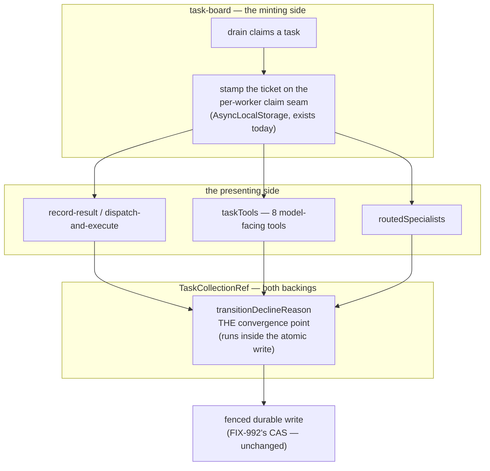

# FIX-981: Two executions over one durable board can both claim a task and both pass a creation cap — Implementation Spec

> **Linear issue:** [FIX-981](https://linear.app/fixpoint-labs/issue/FIX-981/two-executions-over-one-durable-board-can-both-claim-a-task-and-both) · **Epic:** [FIX-939](https://linear.app/fixpoint-labs/issue/FIX-939) — Durable jobs & detached-task substrate (M1 of 5; objective gate **APPROVED 2026-08-06**) · **Blocked by:** [FIX-992](https://linear.app/fixpoint-labs/issue/FIX-992) (**MERGED**) · **Epic-spec:** `docs/specs/_epics/durable-jobs.md` on `epic/durable-jobs`
>
> Every `file:line` in this spec was opened on `spec/FIX-981`, branched from `origin/main` at **`26664927`** — which has FIX-992's three merges (#1035 / #1036 / #1039) as ancestors. **That matters more here than usual:** the epic-spec's write-path analysis was written *before* FIX-992 merged, and this spec re-derives it against the merged tree. Where the two disagree, the re-derivation is the one that was run.

## Spec evolution *(the change story, not an audit log)*

- **Spec drafted** — Re-derived the ownership write-path table against merged `main` rather than inheriting the epic's pre-FIX-992 version, and the re-derivation moves the problem: FIX-992 routed `ResourceRef.updateState` through a CAS driver that **re-runs the mutator against refreshed state**, so the *lost-update* half of the epic's evidence is plausibly already closed and the *guard* half plainly is not. Framed the remaining defect as **the token, not the write** — `attemptOwnsTask` compares a bare integer and is not bound to the task it was issued for, and the model-facing `taskTools` surface passes no token at all. Chose a bound claim ticket carried on the board's existing per-worker `AsyncLocalStorage` seam over a new persisted task field or a new context field. Scoped 1b (cap admission) out per the epic's OQ-D deferral, with no bound claimed and the attach point named.

---

## For reviewers — what this document is

This is a **direction document**, not an implementation. Reviewing it well means
answering one question: **is this the right approach?**

**In scope to challenge:**

- The problem framing — are we solving the right thing?
- The approach — will it work, does it fit the architecture and `docs/philosophy.md`?
- Any numbered **Decision** in §6 — that's the sign-off surface.
- Missing constraints, edge cases, or dependencies that would **invalidate** the design.
- Scope — a deliverable that shouldn't ship, or one that's missing.

**Out of scope — deliberately unsettled here, and owned by the implementing agent:**

- Names, signatures, file paths, and module layout.
- Local structure: which helper, how a function is decomposed, error-message wording.
- Micro-optimizations and style preferences.
- Test names and internal test structure (the *behaviours* to test are in §10; the tests
  themselves are not).
- Anything Part II left open on purpose — it is directional by design, and a gap at
  that altitude is intended, not an omission.
- **The solution sketch, at the line level.** The sketch in §7 is pseudocode. It is
  knowingly incomplete, is not real code, and is not what will ship. **Review it for
  directional viability only.** Do not report that it lacks error handling, omits edge
  cases, or names things that don't exist in the repo — all of that is true on purpose.

**One request, if you are an automated reviewer:** the two lists above are the whole
difference between a useful review of this document and a long one. Volume is not signal
here — a single finding above the line is worth more than twenty below it.

Feedback in the second list is welcome and gets **recorded verbatim in §13** for the
implementer to weigh against real code. It will not be argued with, and it will not be
folded into the design prose. Please don't re-raise it: one mention is enough.

---

## Parts worth reviewing closely

> **1. Decision 7 — the premise that FIX-992 already closed part of this.**
> *Where:* §1 and §10's characterization step. *The question:* the epic's measured
> evidence ("two drains both settle one task", "`attempts` rolls 1 → 0") was taken
> against pre-FIX-992 code. Reading merged `main`, `ResourceRef.updateState` now runs
> through `runResourceCAS`, whose `mutate` intent refreshes and **re-runs the mutator**
> on conflict — which is exactly what makes a losing `claim` re-check eligibility against
> the winner's row and stand down. If that reading is right, the claim-exclusivity half
> of this milestone is already delivered and this spec's real content is the token and
> the tool surface. *What a wrong answer costs:* either we build a second fence beside
> one that already works, or we ship a spec whose baseline test passes for the wrong
> reason. This is why the first PR in the plan is a characterization, not a fix.
>
> **2. Decision 4 — the deliberate hole at the tool surface.**
> *Where:* §6 Decision 4, §9. *The question:* when a `taskTools` call happens **outside**
> a claimed-worker scope (a coordinator's own board), there is no ticket, and this spec
> lets the write proceed unguarded rather than refusing it. Is "no claim to check" a
> coherent statement of the contract, or a silent degrade wearing a justification? It is
> also the seam M3 must stamp, and if M3 forgets, the degrade is silent again.
> *What a wrong answer costs:* the epic's rule 5 says a guarantee not enforced on the
> `taskTools` path is not enforced — getting this line wrong means claiming a guarantee
> we don't have, which is the exact failure FIX-980 exists to eliminate.
>
> **3. Decision 1 — replacing `expectAttempt` rather than adding beside it.**
> *Where:* §6 Decision 1, §8 PR b. *The question:* `expectAttempt` is documented public
> API with three first-party call sites. Replacing it is a `minor` break; adding `claim`
> beside it is additive but leaves two guards on one options object, one of which is
> known not to discriminate targets. *What a wrong answer costs:* a permanently ambiguous
> public guard surface, or an unnecessary migration for third-party callers.
>
> **Where I am unsure:** whether the ABA case in §9 (a task deleted and recreated under
> the same id, resetting `attempts` to 0) is worth closing by putting `createdAt` in the
> ticket. It is unreachable from the `TaskCollectionRef` surface today but reachable
> through the underlying resource collection.
>
> **Deliberately absent:** any cap/cardinality mechanism (Decision 5), any reclaim or
> heartbeat work (FIX-978/FIX-1005), and any construction-time refusal of a durable board
> (Decision 6).

---

## Part I — The Case *(for the human)*

### 1. Problem — why it matters, why now

Two things running at the same time over one shared, durable to-do list can both believe
they own the same job, and the loser's late "I finished it" can land on the winner's row.
Nothing on that list stops them. The list was built when only one thing at a time ever
read it, and that assumption is now wrong.

Concretely: a worker picks up a task, goes away for several minutes to run a model, and
comes back to record its result. Meanwhile the task was handed to somebody else. The
worker's write-back is supposed to be refused, and the check that would refuse it asks
*"is the task still on the attempt I claimed?"* — a bare integer. Attempt numbers are
small and collide constantly across a board, so the check can be satisfied by **a
different task that happens to be on the same attempt**. And the model-facing tools that
are the normal way an agent touches a board (`completeTask`, `failTask`, `cancelTask`,
`blockTask`, `updateTask`) pass **no** ownership token at all, so for them the check never
runs.

**Why now.** Conductor M2 — running many issues in parallel under one epic on a shared
board — is blocked on this. Its coordinator and its workers are separate executions
sharing one durable board by construction, so what used to be a rare interleaving becomes
the default path. The cost of getting it wrong is not a hang: it is two agents running the
same spec-authoring phase, two PRs, and duplicate model spend, discovered later by a human.

**What is already covered, and this is the part the epic's own evidence predates.**
[FIX-992](https://linear.app/fixpoint-labs/issue/FIX-992) merged and gave resource state a
real conditional write on all four adapters, driven from the registry's read/mutate seam
by a CAS driver that refreshes and **re-runs the caller's mutator** on conflict
(`engine/src/stores/resource-cas.ts`). That mechanism is not a reading — FIX-992 shipped a
goal check for it (`goals/resource-concurrency/two-contexts-patching-one-resource-both-land`),
which runs three overlapping execution contexts against one SQLite file and shows all
three writes landing, one version bump each. Read against merged `main`, the same driver
appears to close the *lost-update* half of the epic's measured evidence and to make a
losing `claim()` stand down on its own, because `claim`'s eligibility re-check runs
*inside* the mutator that gets re-run.

That check deliberately has each context write a **different field** — same-field
contention would have been a hollow pass for what FIX-992 was proving. Same-*task*
contention is precisely what this milestone is about, so the mechanism is corroborated and
the outcome is not. And FIX-992's own non-goals say it "enables both, closes neither": its
scope was the primitive, not the protocol. So the honest statement is: **the write is
fenced; the ownership question the write is supposed to answer is still asked with the
wrong token, and on the tool surface it isn't asked at all.** §10's first step re-measures
rather than assumes.

### 2. Solution in plain terms

Give a claim a **ticket**, and make every write that depends on ownership present it.

Today a worker carries a number ("I claimed attempt 1") and the substrate checks the
number. Instead, when a worker claims a task it gets a ticket naming *which board, which
task, and which attempt* — and a write that presents a ticket for a different task is
refused out loud rather than quietly applied. The ticket rides the seam the board already
uses to tell each worker which task it is on, so nothing new has to be threaded through
the context, and the model-facing tools pick it up without the model ever seeing it: the
model still names a task id, and the substrate refuses when that id is not the one the
caller holds.

Two things this deliberately does **not** do. It does not add a cardinality mechanism —
two executions can still each admit tasks past a configured ceiling, and this spec claims
no bound on that (Decision 5). And it does not refuse to construct a board on any storage
backend; the guarantee is stated per adapter instead (Decision 6).

**Philosophy** — **tenet 5 (fix at the owning layer, and specifically its convergence
half)**: the guard already has one convergence point, `transitionDeclineReason` in the
shared task internals, consulted from inside both backings' atomic writes. The defect is
that it is asked the wrong question there, and that several writers reach the row without
passing through it at all. The fix is to correct the question at that one point and route
the remaining writers through it — not to add a check at each call site. **Tenet 3 (earn
every addition)**: no new persisted task field, no new `BlockContext` surface, and one
public option replaced rather than a second added beside it. **Tenet 7 (prove the goal,
not the mock)**: the epic's evidence harness is gone, and the first deliverable here is a
falsification baseline that fails against today's code before anything is fixed.

### 3. Tradeoffs & alternatives

**Alternative: an opaque, unguessable claim token minted at claim time and stored on the
task.** Strictly stronger — it survives a delete-and-recreate under the same id, and it
cannot be reconstructed by a caller. Rejected because it adds a persisted field to the
`Task` schema (with the BP-030 dual-read, the clear-on-settle, and the clear-on-reclaim
that come with it) to close a case unreachable from the task surface. The
`(collectionId, taskId, attempt)` tuple is already fully present on data the substrate
holds; nothing has to be stored.

**The simpler approach: keep `expectAttempt` and just forward it automatically from the
worker's context to whatever task the caller names.** This is the obvious next step from
where the code is, it needs no new type, and it is **the specific thing that must not be
built.** It is what turns a dormant weakness into an active one: the moment a worker's
attempt number is auto-attached to a model-chosen task id, worker A holding task A at
attempt 1 can settle task B at attempt 1 and the guard *passes*. The token has to name its
target before it is safe to forward.

**Alternative: make the guardless transitions coordinator-only instead of giving them a
token** (the epic's fork (ii), which the owner's cancellation model supports). Rejected at
this layer: the collection has no notion of "coordinator" to test — every caller is just a
caller — so enforcing it here would mean inventing an identity concept the substrate does
not have. Narrowing *which tools a worker is handed* is a real and cheaper answer to the
same worry, it lives at the capability layer, and taking (i) now does not foreclose it.

**Where the complexity is:** not the ticket, and not the guard. It is the **coverage
question** — which writers can change who owns a task — and the fact that the answer moved
under FIX-992. Enumerating those paths has already been got wrong three times in this
epic's history, which is why §7 re-derives the table against merged code rather than
citing it, and why §10 leads with a characterization rather than a fix.

### 4. Focus practices (1–5)

1. **One convergence point for the ownership guard** (tenet 5). `transitionDeclineReason`
   is consulted from inside both backings' atomic writes and is the only place the
   question is asked. Every ownership-sensitive writer must reach it — a guard added at a
   call site is a guard the next call site won't have.
2. **BP-035 (second-path checklist).** The second path here is *the losing writer*. A
   suite that only exercises one execution proves nothing about this change; every
   behaviour in §10 is asserted from the displaced worker's side.
3. **BP-003 (verification evidence).** The epic's harness is gone and its numbers survive
   only as text. Every claim this spec makes about what is or isn't already fixed has to
   be re-measured, with a control that could produce the disproving result.
4. **BP-022, and call the break what it is.** Replacing `expectAttempt` is
   source-incompatible and the tool-surface refusal is behaviourally new. `minor`, with a
   migration note — never `patch` on the grounds that "it only rejects wrong writes".
5. **Refuse loudly, never silently proceed** (this change's own rule, from the epic's
   review). Every defect this epic surfaced was silent. A ticket that does not match its
   target is a refusal the caller can read, not a no-op.

### 5. What using it looks like (1–5 examples)

**A worker recording its result** *(what this spec proposes; today the same call passes a
bare `expectAttempt: task.attempts`, which cannot tell one task from another):*

```ts
const task = await tasks.claim("worker-1");
// … minutes of model work …
await tasks.complete(task.id, output, {
  ifAllowed: true,
  claim: currentClaim(),   // { collectionId, taskId, attempt } — stamped at claim
});
```

**The refusal this buys (before / after):**

```
before  worker holds task "a" at attempt 1
        worker calls complete("b", …, { expectAttempt: 1 })
        task "b" is also at attempt 1 → guard PASSES → "b" is settled by a stranger

after   same call, presenting a ticket for "a"
        → { outcome: "declined", reason: "not-my-task", status: "in_progress" }
        → nothing written to "b"
```

**A model settling a task through `taskTools`, from inside a worker body** — the model's
input is unchanged; the ticket is supplied by the substrate and never enters the prompt:

```ts
// model calls: completeTask({ taskId: "b", output: … })
// worker holds "a"
→ { ok: false, taskId: "b",
    error: 'task_write_declined: you hold task "a", not "b"' }
```

**A transition that could not carry a token at all, and now can:**

```ts
// today: block(id, reason?) — no third parameter exists, so no guard is possible
await tasks.block(task.id, "waiting on review", { claim: currentClaim() });
```

### 6. Decisions & rules — the sign-off surface

1. **The ownership token is a bound claim ticket — `(collectionId, taskId, attempt)` —
   and it replaces `expectAttempt` rather than joining it.**
   *Rejected:* keeping `expectAttempt: number` and auto-forwarding it from the worker's
   context (§3 — that is the change that makes the flaw exploitable); and an opaque
   persisted claim token (§3 — a new `Task` field for an unreachable case).
   *Locks in:* the guard becomes safe to forward automatically, which is the precondition
   for fencing the tool surface at all. Three first-party call sites migrate; a
   third-party caller passing `expectAttempt` gets a **type error**, not a silent
   semantic change. Changeset is `minor` with a migration note.

2. **The ticket is stamped by the board at claim time onto the seam that already carries
   the worker's current task, and read from there — callers do not construct one.**
   *Rejected:* returning it from `claim()` (changes a return type every dispatcher
   depends on), and a new field on `BlockContext` (which a capability cannot legally name
   — the epic's N18).
   *Locks in:* one place mints a ticket and one place reads it, so a caller cannot forge
   a mismatch by accident. It also fixes where M3 must stamp for a detached worker: the
   same seam, at spawn. **The ticket is server-derived and never caller-supplied**
   (BP-031, the epic's rule 9): it is built from the claim the substrate just committed,
   so a model naming a task id supplies the *target* of a check and never the *authority*
   for it.

3. **Every worker-callable lifecycle transition accepts the ticket (the epic's fork (i)),
   and the substrate stays caller-agnostic.**
   *Rejected:* fork (ii), making those paths coordinator-only at the collection layer —
   the collection has no identity concept to test against, so "coordinator-only" cannot
   be expressed there. Narrowing which tools a worker is handed remains available later
   at the capability layer, and this decision does not foreclose it.
   *Locks in:* `block` / `unblock` / `awaitReview` / `resumeFromReview` gain an options
   parameter they do not have today, and `cancel` stops hard-coding its guards. All five
   are additive at the call site.

4. **`taskTools` forwards the ticket and refuses a call naming a task the caller does not
   hold. Outside a claimed-worker scope there is no claim, so nothing is checked and
   behaviour is unchanged.**
   *Rejected:* leaving the tool surface unfenced until M3 (violates the epic's rule 5 for
   every board that exists *today*), and failing closed on a missing ticket (breaks the
   shipped default `taskTools` instance, which a coordinator holds against its own board
   with no claim of any kind).
   *Locks in:* the guarantee is real now rather than pending on M3 — and the honest
   converse, which must be stated in the docs rather than implied: a coordinator settling
   a task it never claimed is not a stale owner and is not guarded. **M3 inherits an
   obligation:** a detached worker's request must stamp the ticket at spawn, or its tool
   calls silently return to the unguarded posture.

5. **Cap admission (criterion 1b) is out of scope, and this spec claims no bound on
   overshoot.** Per the epic's rule 6, stated plainly: on a resource-backed collection,
   `maxInstances` is checked against the *per-execution* cache before a create, and
   concurrent admissions write **distinct keys** — so two executions each admit up to the
   ceiling and the conditional write cannot see it. Overshoot is neither narrowed nor
   bounded by anything in this change. It scales with the number of concurrent admitters.
   *Rejected:* building a counter row, a reservation, or an authoritative count under a
   lock — forbidden by the epic's OQ-D deferral and by its rule 4 (no board-wide
   serialization).
   *Locks in:* per the OQ-D condition, the attach point is named and not foreclosed —
   a future arbiter belongs at the registry's create path, where the count is taken, and
   ownership and cardinality are different keys, so nothing here has to be redone.

6. **The per-adapter guarantee is declared, not enforced by refusing construction.**
   This change delivers exclusivity for **two concurrent executions in one process**,
   which every adapter satisfies (filesystem via a per-key mutex on the store instance).
   It does **not** deliver it across two OS processes on filesystem, which compares under
   an in-process lock only.
   *Rejected:* refusing a resource-backed board on filesystem — it would break local dev
   for boards that are correct today; and refusing a *detached* board, which is the
   epic's stated shape but cannot be written here, because detachment does not exist
   until M3.
   *Locks in:* the epic's filesystem "done" row is explicitly routed to FIX-982 rather
   than silently claimed here, and the cross-process caveat is documented at the board's
   own surface, not only on the store's.

7. **The first deliverable is a rebuilt two-execution characterization, re-measured
   against merged `main` — not a fix.**
   *Rejected:* inheriting the epic's §8 numbers, which were taken before FIX-992 merged
   and against a harness that no longer exists.
   *Locks in:* the falsification baseline is written first and must fail on today's code
   for the right reason. If it shows claim exclusivity already delivered by FIX-992, PRs
   b–e are unchanged and the *claim* fix narrows to an assertion; if it shows the
   conditional write itself leaking, that is a FIX-992 regression routed back to its
   owner, not absorbed here.

**Non-goals** — the reclaim/heartbeat sweeper (FIX-978, and M2's recovery half,
FIX-1005); the out-of-request executor and Workstream spawn (FIX-982); board lifetimes
and the `session`/`user`/`org` enum values; cap and ceiling enforcement of any kind
(Decision 5); `flowIsolation` forwarding; and any change to the `request` / `sequencer`
backings' *behaviour* — they inherit the guard because it is shared, and that is the
extent of it.

**And one non-goal worth stating as a property of the design rather than a boundary**
(the epic's rule 1): nothing here infers abandonment from an expired lease. The guard
reads `attempts` and `status` and never reads `leaseUntil` — a healthy worker whose lease
lapsed mid-model-call still holds its claim, and still settles it. Trading the hang for a
silent duplicate is the failure this milestone exists to prevent, not a shortcut it may
take.

**Size:** Large (multi-package, multi-PR — see the §8 PR plan, whose shape is fixed by
Decision 1's convergence point: the ticket type must land before anything can carry it).

---

## Part II — The Build Plan *(for the implementing agent)*

### 7. Technical design

The change is confined to `@flow-state-dev/orchestration`. Nothing in `engine` moves —
FIX-992 already put the conditional write where it belongs, and this builds on it.



- **The guard, one place.** `transitionDeclineReason` (`tasks/collection/internal.ts`) is
  already called from inside both backings' atomic writes, so it evaluates against the
  freshest state by construction. It gains the target-bound question and a new decline
  reason for a mismatched target. `attemptOwnsTask`'s counter-plus-status logic is
  **correct and stays** — the epic is right that the guard was starved of a fresh read
  rather than wrong, and FIX-992 fed it. What changes is that it now also asks *which
  task*.
- **The API surface** widens by one options field (replacing one), and five methods that
  take no options today gain one. `TaskCollectionRef`'s own doc comment already warns
  implementers that `complete`/`fail` must honour the options argument; that warning
  extends to the five.
- **The carrier** is the board's existing per-worker `AsyncLocalStorage`
  (`task-board/flow-policy-wiring.ts`), which today holds a bare task id so cacheable
  tools attribute writes correctly. Its header already argues why it is an ALS and not a
  shared bag — a shared field races under `concurrency > 1`. Widening what it carries
  reuses that argument rather than re-litigating it, and it means a `taskTools` call made
  from inside a generator's tool loop inherits the ticket through the same await chain
  that already carries the task id.
- **Untouched:** every store adapter, the resource registry, the CAS driver, the task
  status state machine, `reclaim`, and the item/streaming layer.

**The epic's named reuse seams, each taken or refused (its rule 13).** *Taken:* the
two-tier dispatch architecture (`stores/scope-lock.ts`) — this completes it rather than
adding a third tier, and it is why no board-wide lock appears anywhere here; the CAS seam
itself, consumed through FIX-992 and not re-derived; the `task-caps.ts` + `resource-backed.ts`
cap/claim analysis, which Decision 5 builds on rather than restating; and the
drain-containment + `testFlow` shared-registry harness, extended in §10 rather than rebuilt.
*Refused, with the reason:* `ScheduleIndex.claimDue` (`scheduled/src/scheduleIndex.ts`) is
listed as a shape precedent for atomic claim-and-advance, and the shape does not transfer
— it is documented **at-most-once**, which is the opposite trade from the one the epic's
objective takes for tasks, and its atomicity lives in a single-key index rather than in a
per-record fence. Copying its shape would import a guarantee this substrate has explicitly
decided against.

**The write-path table, re-derived against `26664927`.** This is the epic's required
deliverable, and it does not match the epic's pre-FIX-992 version — three of its rows
moved.

| # | Path | Fenced at the durable boundary? | Ownership-guarded? |
|---|---|---|---|
| 1 | `claim` → `updateState` | **Yes** (CAS; the eligibility re-check runs inside the re-run mutator) | n/a — the claim *is* the boundary |
| 2–4 | `complete` · `fail` (both branches) · `cancel` → `transitionRef` | Yes | **Only when a token is passed.** `cancel` hard-codes `{ ifAllowed: true }` and cannot receive one — **PR b/c** |
| 5–8 | `block` · `unblock` · `awaitReview` · `resumeFromReview` → `transitionRef` | Yes | **No — no options parameter exists** — **PR c** |
| 9 | `setAssignee` → `patchRef` | Yes | **No.** Declines on terminal only; `assignee` is an ownership field — **PR c** |
| 10–13 | `setPriority` · `addLabel` · `removeLabel` · `patchMetadata` → `patchRef` | Yes | **No, and no longer needs to be.** The epic's concern was that these persist the *whole* task and revert `attempts`. Post-FIX-992 the patch is applied to the **refreshed** task, so none of them can touch `attempts`/`status`/`leaseUntil`/`assignee`. Left unguarded on purpose — FIX-980's A1 depends on a live block labelling terminal tasks |
| 14 | `reclaim` → `updateState` | Yes | Out of scope — FIX-978/FIX-1005, per the epic's Decision 1 |
| 15 | `addTask`/`addTasks` → `collection.create` | Yes (create-if-absent; same-id loser is terminal) | Cardinality, not ownership — Decision 5 |
| 16 | **`taskTools` — all eight tools** | Yes (they call the above) | **No token on any of them** — **PR d** |

Row 10–13 is the row to check hardest, and §10 pins it with a test rather than leaving it
as a reading.

**Sketch — pseudocode. Illustrative, not the contract. React to the shape.**

```
at the one guard, inside the atomic write:

    if a ticket was presented:
        if ticket names a different board or a different task than this write:
            decline — reason: "not my task"          ← the new refusal
        if this task's attempt != ticket's attempt:
            decline — reason: "lost claim"           ← today's check, unchanged
        if this task's status is not attempt-owned:
            decline — reason: "lost claim"           ← today's check, unchanged
    otherwise:
        no claim was presented, so there is nothing to check  ← decision 4

at the board, where a worker's task is already stamped:

    on claim success:  stamp { this board, this task, this attempt }
                       (replacing today's bare task-id stamp)

at each task tool:

    ticket ← whatever is stamped for this worker, or nothing
    call the collection with the model's taskId AND the ticket
    a decline becomes a model-readable refusal, not a silent ok
```

What this asks a reviewer: *is the refusal decided at the guard (so every caller inherits
it) rather than at the tool (where the model's id is first seen)?* Deciding it at the tool
would read fresher-looking but would leave every non-tool caller unfenced, which is the
call-site-patching shape tenet 5 warns about.

### 8. Implementation sequence

1. **Rebuild the two-execution harness and characterize.** Extend the drain-containment
   scenario's shape (`integration-tests`) to a **resource-backed** board with two
   `testFlow` calls over one shared `StoreRegistry`, run concurrently. Re-measure the
   epic's three findings. *Test:* the three assertions in §10's baseline. *Depends on:*
   nothing. *(Decision 7.)*
2. **The bound ticket and the guard.** Introduce the ticket type, teach the shared guard
   the target-bound question and the new decline reason, replace `expectAttempt`, and
   migrate the three first-party callers. **Remove** `expectAttempt` and its
   documentation. *Test:* the cross-task refusal, from both backings. *Depends on:* 1.
   *(Decisions 1, 3.)*
3. **Coverage.** Give `block` / `unblock` / `awaitReview` / `resumeFromReview` an options
   parameter, and stop `cancel` hard-coding its guards so a caller's ticket reaches the
   guard. *Test:* each of the five refuses a ticket for another task and a stale ticket
   for its own. *Depends on:* 2. *(Decision 3.)*
4. **The carrier.** Widen the board's per-worker claim seam from a task id to the ticket;
   stamp it where the drain stamps the id today; **remove** the now-redundant bare-id
   stamp and its accessor if nothing else reads it. *Test:* two workers on one board under
   `concurrency > 1` read their own tickets, not each other's. *Depends on:* 2. *(Decision 2.)*
5. **The tool surface.** Every `taskTools` tool that mutates a task reads the ticket from
   the seam and presents it; a decline becomes a model-readable refusal naming the task
   the caller actually holds. *Test:* the §5 refusal; and a coordinator-context call with
   no ticket behaving exactly as today. *Depends on:* 3, 4. *(Decision 4.)*
6. **Corrections and docs.** Fix the four false claims about CAS and exactly-once dispatch
   (`task-board/blocks/claim-task.ts`, `tasks/collection/resource-backed.ts`'s header,
   `tasks/dispatchers/types.ts`, `tasks/dispatchers/classifier.ts`) and the docs claim
   that contention already yields exactly one winner. Document the guarantee, its
   per-adapter limit (Decision 6) and the unguarded-coordinator posture (Decision 4).
   Changeset. *Depends on:* 5.

**PR plan.**

| sub-PR | deliverables | depends_on |
|---|---|---|
| a | step 1 — the characterization harness and its baseline | — |
| b | step 2 — the ticket type, the guard, `expectAttempt` removed, callers migrated | a |
| c | step 3 — the five guardless transitions accept a ticket | b |
| d | step 4 — the per-worker carrier | b |
| e | steps 5–6 — the tool surface, corrections, docs, changeset | c, d |

### 9. Edge cases & error handling

| Case | Expected |
|---|---|
| No ticket presented (coordinator, or a direct caller) | Write proceeds unguarded, exactly as today — Decision 4. Documented, not silent |
| Ticket names a different task | **Declined**, new reason, nothing written. The behaviour this change exists for |
| Ticket names a different collection | Declined the same way — two boards may both hold a task id, and a coordinator may legitimately file the same id on both |
| Ticket is stale on its own task (reclaimed, re-queued, parked) | Declined as `lost-claim` — today's behaviour, unchanged |
| Task deleted and recreated under the same id, resetting `attempts` to 0 | **ABA: a stale ticket can match again.** Unreachable from `TaskCollectionRef` (it has no delete) but reachable through the underlying resource collection and through capacity eviction. Not closed; see the §6 note and §12 |
| CAS retry budget exhausted under heavy contention on one task | `ConcurrentModificationError` propagates. `taskTools` catches by *type* and does not soften it, so it surfaces as an error rather than a model-readable result. Unchanged by this spec; named so it is not mistaken for new |
| A transition that is illegal against the **refreshed** row, with no `ifAllowed` | Throws, as today — and now more often, because FIX-992 made the read fresh. A caller presenting a ticket should pass `ifAllowed` alongside it, as the first-party callers already do |
| Two executions creating **different** task ids past a ceiling | Both succeed. No bound is claimed — Decision 5 |
| Filesystem adapter, two OS processes | Not covered. Documented per Decision 6 |
| A custom `TaskCollectionRef` that ignores the options argument | Structurally satisfies the interface and gives no verdict. Already true of `complete`/`fail`; the existing BP-030 `== null` handling at the tool boundary carries it |

**Taxonomy:** every ownership refusal is a **value**, not an error — `declined` on the
existing `TaskWriteOutcome`, so a caller that discards it behaves as it does today. Store
failures, CAS exhaustion, missing tasks, and illegal transitions without `ifAllowed`
remain throws. Nothing in this change converts a throw into a decline or the reverse.

### 10. Testing strategy

**Goal & goal check.** Two concurrent real executions over one durable board, one task,
real model in the worker body: exactly one worker starts, exactly one settlement lands,
and the loser's late write-back is refused rather than applied. `goals/durable-claim-safety/two-executions-one-task/run.mts`.
The real-model half matters because the failure mode is *duration* — a worker that returns
in milliseconds never outlives its claim, and a mocked worker cannot reproduce the window
this whole milestone is about.

Build it from `goals/resource-concurrency/two-contexts-patching-one-resource-both-land`
(FIX-992's), which already stands up overlapping execution contexts over one SQLite file
and reads back through a **reopened** connection. Its anti-game notes transfer directly and
one of them inverts: that check needs *distinct* fields to avoid a hollow pass, and this
one needs the *same* task, because contention on one key is the whole question here. Its
construct-all-contexts-up-front rule and its read-through-a-reopened-store rule carry over
unchanged — building the second execution lazily turns the race into a sequence, which a
broken implementation also survives.

**The falsification baseline (PR a), and it must fail before it passes.** Three
assertions on one two-executions-over-one-board setup, each with a control that could
produce the disproving result:

- **only one `claim()` succeeds — equivalently, only one worker starts.** The claim is the
  exclusivity boundary. A check that asserts only "they cannot both settle" is passable by
  an implementation that fences settlement and leaves `claim` open, and that
  implementation costs a duplicated model run per task.
- **a stale owner's settlement is refused, and the winner's outcome stands.**
- **the epic's lost-update finding, re-measured**: `attempts` must not roll backwards
  under a concurrent patch. Expected to pass on merged `main` (see the §7 table, row
  10–13). **If it fails, the design changes** and that is the point of running it first.

**CI specs** (behaviours, not test names):

- one behaviour per Decision in §6, from **the losing writer's** side (BP-035)
- the cross-task refusal on *every* method that takes a ticket — the whole surface, not
  the two that have options today, because "claim and settlement" is the phrase this epic
  has already been burned by
- **the refusal is observable**: it returns a decline naming the mismatch. A guard that
  quietly declines a mismatched target is the same silent shape as the defect
- **what must not change**: a caller presenting no ticket behaves byte for byte as today,
  on all four backings' worth of call sites; the `request` and `sequencer` backings'
  behaviour is unchanged except for inheriting the shared guard
- **the invariant that is easy to state wrongly**: a losing claim resolves to **no task**,
  not to an error. Asserting a throw would pass against an implementation that turns a
  lost race into a drain-killing exception — which is the failure FIX-951's containment
  work already fixed once

**Discipline:** `tdd`. Two seams, both reachable without a server: the shared guard in
`tasks/collection/internal.ts` (unit), and full `runAction` composition via `testFlow`
with a shared store registry (integration) — the same composition
`task-board-drain-containment.test.ts` uses, extended to a resource backing and two
concurrent calls. The epic is explicit that this harness largely exists and a spike redo
must not be budgeted.

### 11. Documentation plan

- **EXTEND** `apps/docs/docs/orchestration/task-substrate.md` — the load-bearing page.
  Three edits: rewrite "Recording a result that may no longer apply" around the ticket
  (the `expectAttempt` snippet there is the exact call this change replaces); extend "What
  a write reports" with the new decline reason; and **correct** the Dispatchers section's
  "under contention exactly one worker wins the task", which is true within one request
  and was not true across two. Add a short subsection under "The three backings" stating
  the durable board's claim guarantee, its per-adapter limit, and the unguarded-coordinator
  posture. One minimal example — the §5 worker-recording-its-result call.
  *Cross-links:* ← from `apps/docs/docs/orchestration/task-board.md` where the drain is
  described; → to `apps/docs/docs/persistence/` for the adapter table.
  *Voice risks:* "exactly-once" is the wrong word and will be reached for — the contract
  is at-least-once with one current owner. Avoid "guarantees" as a bare verb; say what is
  and isn't covered. Introduce "claim" in plain terms on first use in the new subsection.
- **EXTEND** `packages/orchestration/README.md` — the task-collection entry gains one line
  on the ticket, and the `expectAttempt` mention is removed rather than left beside it.
- **No new page.** This is one section under an existing concept, not a term users will
  search for on its own; a new page would fragment a sidebar that already carries the
  substrate across two pages.
- **Architecture docs:** none. No locked contract changes — the store contract is
  FIX-992's and is unmoved.
- **Changeset:** `minor`. Two user-visible facts: `expectAttempt` is replaced (migration
  note, with the three-line before/after), and a model-facing tool can now refuse a
  settlement it previously performed. Describe the second as *source-compatible but
  behaviourally new*, never as "not breaking".

### 12. Dependencies, open questions & follow-ups

**Dependencies:** [FIX-992](https://linear.app/fixpoint-labs/issue/FIX-992) — **MERGED**,
and this consumes it. Nothing else blocks: the epic's create-if-absent and
parent-session-filter prerequisites belong to FIX-982's branch, not this one. FIX-957 is a
relation, not a dependency — it widens a board-lifetime enum this spec does not touch.

**Open questions for the gate:**

1. **The epic's filesystem "done" criterion cannot be written here** (Decision 6). It asks
   for a *detached* durable board to be refused at construction, and detachment does not
   exist until FIX-982. Confirm it is routed there rather than dropped.
2. **The ABA case in §9** — close it by putting `createdAt` in the ticket (one more field,
   makes the ticket total), or accept it as unreachable from the task surface? Recommended:
   accept, and record it.
3. **Decision 4's unguarded-coordinator posture.** Is "no claim presented means nothing to
   check" the contract we want, given the epic's rule 5? The alternative refuses a durable
   settlement without a ticket and breaks the shipped uncapped `taskTools` default.

**Follow-ups (flagged, not built):**

- **Cardinality arbitration** — Decision 5. Blocked on the epic's OQ-D-i / OQ-D-ii. The
  attach point is the resource registry's create path; nothing here forecloses it.
- **`reclaim()` has no production callers** and this spec adds none. Owned by FIX-1005;
  the epic's rule 1 (an expired lease is not evidence of abandonment) is why this spec
  does not touch it.
- **Deepening:** the two backings carry separately maintained copies of the transition
  wrapper while sharing the guard through `internal.ts` — a shape that has already let
  rules drift once. Out of scope; follow up via `improve-codebase-architecture`.
- **M3 obligation, not a follow-up here:** FIX-982 must stamp the ticket at spawn for a
  detached worker (Decision 4). Recorded so it is inherited rather than rediscovered.
