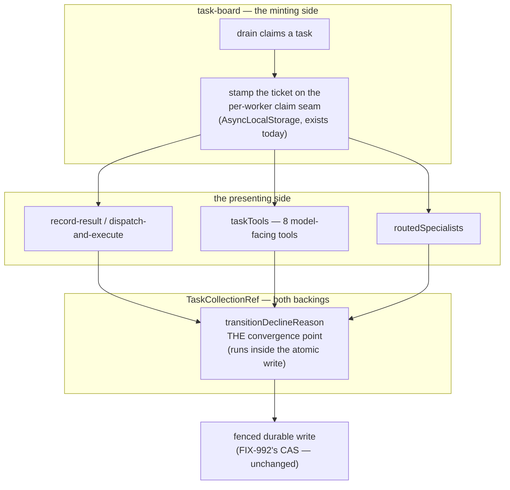

# FIX-981: Two executions over one durable board can both claim a task and both pass a creation cap — Implementation Spec

> **Linear issue:** [FIX-981](https://linear.app/fixpoint-labs/issue/FIX-981/two-executions-over-one-durable-board-can-both-claim-a-task-and-both) · **Epic:** [FIX-939](https://linear.app/fixpoint-labs/issue/FIX-939) — Durable jobs & detached-task substrate (M1 of 5; objective gate **APPROVED 2026-08-06**) · **Blocked by:** [FIX-992](https://linear.app/fixpoint-labs/issue/FIX-992) (**MERGED**) · **Epic-spec:** `docs/specs/_epics/durable-jobs.md` on `epic/durable-jobs`
>
> Every `file:line` here was opened on `spec/FIX-981`, branched from `origin/main` at **`26664927`** — which has FIX-992's three merges (#1035 / #1036 / #1039) as ancestors. **That matters more than usual:** the epic-spec's write-path analysis predates FIX-992, and this spec re-derives it against the merged tree. Where the two disagree, the re-derivation is the one that was run.

## Spec evolution *(the change story, not an audit log)*

- **Spec drafted** — Re-derived the ownership write-path table against merged `main` rather than inheriting the epic's pre-FIX-992 version, and the re-derivation moves the problem: FIX-992 routed `ResourceRef.updateState` through a CAS driver that **re-runs the mutator against refreshed state**, so the *lost-update* half of the epic's evidence is plausibly already closed and the *guard* half plainly is not. Framed the remaining defect as **the token, not the write** — `attemptOwnsTask` compares a bare integer and is not bound to the task it was issued for, and `taskTools` passes no token at all. Chose a bound claim ticket on the board's existing per-worker `AsyncLocalStorage` seam over a new persisted task field or a new context field. Scoped 1b (cap admission) out per the epic's OQ-D deferral, with no bound claimed and the attach point named.
- **Review round 1** — Three changes that move the approach. **Decision 4 is gate-settled** — it was an open question, it is now a contract, and the settlement is mechanical rather than a policy choice (§6.4). **The baseline's primary assertion is now the cross-task token pass**, not "both settle", which is passable by fencing settlement and leaving `claim` open. **The real model leaves the goal check** and becomes optional soak: the defect is a binding failure, not a duration one (§10). Also folded — `not-my-task` named as an explicit deliverable with a dedicated tool branch, and row 9's unguarded `setAssignee` marked intentional so it is not "fixed" into conflict with the epic. Prose trimmed and Decision 4 reduced from three appearances to one.

---

## For reviewers — what this document is

This is a **direction document**, not an implementation. Reviewing it well means
answering one question: **is this the right approach?**

**In scope to challenge:**

- The problem framing — are we solving the right thing?
- The approach — will it work, does it fit the architecture and `docs/philosophy.md`?
- Any numbered **Decision** in §6 — that's the sign-off surface.
- Missing constraints, edge cases, or dependencies that would **invalidate** the design.
- Scope — a deliverable that shouldn't ship, or one that's missing.

**Out of scope — deliberately unsettled here, and owned by the implementing agent:**

- Names, signatures, file paths, and module layout.
- Local structure: which helper, how a function is decomposed, error-message wording.
- Micro-optimizations and style preferences.
- Test names and internal test structure (the *behaviours* to test are in §10; the tests
  themselves are not).
- Anything Part II left open on purpose — it is directional by design, and a gap at
  that altitude is intended, not an omission.
- **The solution sketch, at the line level.** The sketch in §7 is pseudocode. It is
  knowingly incomplete, is not real code, and is not what will ship. **Review it for
  directional viability only.** Do not report that it lacks error handling, omits edge
  cases, or names things that don't exist in the repo — all of that is true on purpose.

**One request, if you are an automated reviewer:** the two lists above are the whole
difference between a useful review of this document and a long one. Volume is not signal
here — a single finding above the line is worth more than twenty below it.

Feedback in the second list is welcome and gets **recorded verbatim in §13** for the
implementer to weigh against real code. It will not be argued with, and it will not be
folded into the design prose. Please don't re-raise it: one mention is enough.

---

## Parts worth reviewing closely

> **1. Decision 7 — the premise that FIX-992 already closed part of this.** *(§1, §6.7,
> §10.)* The epic's measured evidence ("two drains both settle one task", "`attempts`
> rolls 1 → 0") predates FIX-992. On merged `main`, `runResourceCAS`'s `mutate` intent
> refreshes and **re-runs the mutator** on conflict — exactly what would make a losing
> `claim` re-check eligibility against the winner's row and stand down. If that reading
> holds, claim exclusivity is already delivered and this spec's real content is the token
> and the tool surface. *Cost of a wrong answer:* a second fence beside one that works, or
> a baseline that passes for the wrong reason. Hence a characterization first, not a fix.
>
> **2. Decision 1 — replacing `expectAttempt` rather than adding beside it.** *(§6.1, §8
> PR b.)* It is documented public API with three first-party call sites. Replacing it is a
> `minor` break; adding `claim` beside it is additive but leaves two guards on one options
> object, one of which is known not to discriminate targets. *Cost of a wrong answer:* a
> permanently ambiguous public guard surface, or an unnecessary migration.
>
> **Where I am unsure:** whether the ABA case in §9 (a task deleted and recreated under the
> same id, resetting `attempts` to 0) is worth closing by putting `createdAt` in the ticket.
> Unreachable from `TaskCollectionRef` today; reachable through the resource collection.
>
> **Settled in round 1, please don't re-open:** Decision 4's unguarded-coordinator posture
> (§6.4 — now a contract with a mechanical rule, a doc deliverable and a test), and the
> real-model goal check (§10 — optional soak, with the condition that would raise it again
> named).
>
> **Deliberately absent:** any cap/cardinality mechanism (Decision 5), any reclaim or
> heartbeat work (FIX-978/FIX-1005), and any construction-time refusal of a durable board
> (Decision 6).

---

## Part I — The Case *(for the human)*

### 1. Problem — why it matters, why now

Two things running at the same time over one shared, durable to-do list can both believe
they own the same job, and the loser's late "I finished it" can land on the winner's row.
Nothing on that list stops them. The list was built when only one thing at a time ever read
it, and that assumption is now wrong.

Concretely: a worker picks up a task, goes away to run a model, and comes back to record its
result. Meanwhile the task was handed to somebody else. The write-back is supposed to be
refused, and the check that would refuse it asks *"is the task still on the attempt I
claimed?"* — a bare integer. Attempt numbers are small and collide constantly across a
board, so the check can be satisfied by **a different task that happens to be on the same
attempt**. And the model-facing tools that are the normal way an agent touches a board
(`completeTask`, `failTask`, `cancelTask`, `blockTask`, `updateTask`) pass **no** ownership
token at all, so for them the check never runs.

**Why now.** Conductor M2 — many issues in parallel under one epic on a shared board — is
blocked on this. Its coordinator and its workers are separate executions sharing one durable
board by construction, so what used to be a rare interleaving becomes the default path. The
cost of getting it wrong is not a hang: it is two agents running the same spec-authoring
phase, two PRs, and duplicate model spend, discovered later by a human.

**What is already covered, and this is the part the epic's own evidence predates.**
[FIX-992](https://linear.app/fixpoint-labs/issue/FIX-992) merged and gave resource state a
real conditional write on all four adapters, driven from the registry's read/mutate seam by
a CAS driver that refreshes and **re-runs the caller's mutator** on conflict
(`engine/src/stores/resource-cas.ts`). It shipped a goal check
(`goals/resource-concurrency/two-contexts-patching-one-resource-both-land`), so the driver
is corroborated rather than merely read. But that check has each context write a **different
field** — same-field contention would have been a hollow pass for what it was proving — and
same-*task* contention is exactly this milestone. So the mechanism is corroborated and the
outcome is not, and FIX-992's own non-goals say it "enables both, closes neither". The
honest statement: **the write is fenced; the ownership question the write is supposed to
answer is still asked with the wrong token, and on the tool surface it isn't asked at all.**
§10's first step re-measures rather than assumes.

### 2. Solution in plain terms

Give a claim a **ticket**, and make every write that depends on ownership present it.

Today a worker carries a number ("I claimed attempt 1") and the substrate checks the number.
Instead, when a worker claims a task it gets a ticket naming *which board, which task, and
which attempt* — and a write presenting a ticket for a different task is refused out loud
rather than quietly applied. The ticket rides the seam the board already uses to tell each
worker which task it is on, so nothing new has to be threaded through the context, and the
model-facing tools pick it up without the model ever seeing it: the model still names a task
id, and the substrate refuses when that id is not the one the caller holds.

It deliberately adds no cardinality mechanism (Decision 5) and refuses no board on any
storage backend (Decision 6).

**Philosophy** — **tenet 5 (fix at the owning layer, convergence half)**: the guard already
has one convergence point, `transitionDeclineReason`, consulted from inside both backings'
atomic writes. The defect is that it is asked the wrong question there, and that several
writers reach the row without passing through it at all. Correct the question at that one
point and route the remaining writers through it — don't add a check per call site.
**Tenet 3 (earn every addition)**: no new persisted task field, no new `BlockContext`
surface, one public option replaced rather than a second added beside it. **Tenet 7 (prove
the goal, not the mock)**: the epic's evidence harness is gone, and the first deliverable is
a falsification baseline that fails against today's code before anything is fixed.

### 3. Tradeoffs & alternatives

**The simpler approach, and the one that must not be built: keep `expectAttempt` and forward
it automatically from the worker's context to whatever task the caller names.** It is the
obvious next step from where the code is and needs no new type. It is also what turns a
dormant weakness into an active one — the moment a worker's attempt number is auto-attached
to a model-chosen task id, worker A holding task A at attempt 1 can settle task B at attempt
1 and the guard *passes*. **The token has to name its target before it is safe to forward**,
and that ordering is the whole design.

Two more were weighed and rejected. An **opaque persisted claim token** is strictly stronger
(it survives delete-and-recreate) but pays a `Task` schema field plus its BP-030 dual-read,
clear-on-settle and clear-on-reclaim, to close a case unreachable from the task surface —
while `(collectionId, taskId, attempt)` is already present on data the substrate holds.
Making the guardless transitions **coordinator-only** (the epic's fork (ii)) cannot be
expressed at this layer at all: the collection has no notion of "coordinator" to test.
Narrowing *which tools a worker is handed* is the real version of that worry, lives at the
capability layer, and fork (i) does not foreclose it.

**Where the complexity is:** not the ticket, and not the guard. It is the **coverage
question** — which writers can change who owns a task — and the fact that the answer moved
under FIX-992. Enumerating those paths has already been got wrong three times in this epic's
history, which is why §7 re-derives the table against merged code and §10 leads with a
characterization.

### 4. Focus practices (1–5)

1. **One convergence point for the ownership guard** (tenet 5). A guard added at a call site
   is a guard the next call site won't have.
2. **BP-035 (second-path checklist).** The second path here is *the losing writer*. A suite
   that exercises one execution proves nothing; every behaviour in §10 is asserted from the
   displaced worker's side.
3. **BP-003 (verification evidence).** The epic's harness is gone and its numbers survive
   only as text. Every claim about what is or isn't already fixed is re-measured, with a
   control that could produce the disproving result.
4. **BP-022, and call the break what it is.** Replacing `expectAttempt` is
   source-incompatible and the tool-surface refusal is behaviourally new. `minor`, with a
   migration note — never `patch` because "it only rejects wrong writes".
5. **Refuse loudly, never silently proceed.** Every defect this epic surfaced was silent. A
   ticket that does not match its target is a refusal the caller can read, not a no-op.

### 5. What using it looks like (1–5 examples)

**A worker recording its result** *(today the same call passes a bare
`expectAttempt: task.attempts`, which cannot tell one task from another):*

```ts
const task = await tasks.claim("worker-1");
// … minutes of model work …
await tasks.complete(task.id, output, {
  ifAllowed: true,
  claim: currentClaim(),   // { collectionId, taskId, attempt } — stamped at claim
});
```

**The refusal this buys** — also §10's primary baseline assertion:

```
before  worker holds task "a" at attempt 1
        worker calls complete("b", …, { expectAttempt: 1 })
        task "b" is also at attempt 1 → guard PASSES → "b" is settled by a stranger

after   same call, presenting a ticket for "a"
        → { outcome: "declined", reason: "not-my-task", status: "in_progress" }
        → nothing written to "b"
```

**The same thing through `taskTools`, from inside a worker body** — the model's input is
unchanged and the ticket never enters the prompt; and **`block`, which could not carry a
token at all, now can**:

```ts
// model calls: completeTask({ taskId: "b", output: … }) while the worker holds "a"
→ { ok: false, taskId: "b", error: 'task_write_declined: you hold task "a", not "b"' }

// today block(id, reason?) takes no third parameter, so no guard is possible
await tasks.block(task.id, "waiting on review", { claim: currentClaim() });
```

### 6. Decisions & rules — the sign-off surface

1. **The ownership token is a bound claim ticket — `(collectionId, taskId, attempt)` — and
   it replaces `expectAttempt` rather than joining it.**
   *Rejected:* keeping `expectAttempt: number` and auto-forwarding it from the worker's
   context (§3 — the change that makes the flaw exploitable); an opaque persisted claim
   token (§3 — a new `Task` field for an unreachable case).
   *Locks in:* the guard becomes safe to forward automatically, which is the precondition
   for fencing the tool surface at all. Three first-party call sites migrate; a third-party
   caller passing `expectAttempt` gets a **type error**, not a silent semantic change.
   Changeset `minor` with a migration note.

2. **The ticket is stamped by the board at claim time onto the seam that already carries the
   worker's current task, and read from there — callers do not construct one.**
   *Rejected:* returning it from `claim()` (changes a return type every dispatcher depends
   on); a new field on `BlockContext` (which a capability cannot legally name — epic N18).
   *Locks in:* one place mints a ticket and one place reads it, so a caller cannot forge a
   mismatch by accident. It also fixes where M3 must stamp for a detached worker: the same
   seam, at spawn. **The ticket is server-derived and never caller-supplied** (BP-031, the
   epic's rule 9) — built from the claim the substrate just committed, so a model naming a
   task id supplies the *target* of a check and never the *authority* for it.

3. **Every worker-callable lifecycle transition accepts the ticket (the epic's fork (i)),
   and the substrate stays caller-agnostic.**
   *Rejected:* fork (ii), coordinator-only paths at the collection layer — there is no
   identity concept to test against, so it cannot be expressed there. Narrowing which tools
   a worker is handed stays available at the capability layer.
   *Locks in:* `block` / `unblock` / `awaitReview` / `resumeFromReview` gain an options
   parameter they lack today, and `cancel` stops hard-coding its guards. All five are
   additive at the call site.

4. **`taskTools` forwards the ticket and refuses a call naming a task the caller does not
   hold. A call with no ticket is unguarded — and that is the accepted contract, not an open
   question.** *(Gate-settled in review round 1. This is the only place Decision 4 is
   stated; §12 no longer carries it as an OQ.)*
   **The rule is mechanical, not a policy an implementer picks.** The ticket is read from the
   board's per-worker `AsyncLocalStorage` scope, which has exactly **one** stamp site: the
   drain's worker-body tap (`task-board/index.ts:704`, via `stampCurrentTaskId`). Inside a
   claimed-worker scope there is always a ticket; outside one there is never a stamp to read.
   So *"no ticket presented"* and *"not a claimed worker"* are the same condition and cannot
   drift apart — which is why the narrow phrasing ("guard only when the seam carries a stamp;
   coordinator contexts never stamp") and the broad one describe the same behaviour, and why
   there is no third option to invent here.
   *Rejected:* leaving the tool surface unfenced until M3 — violates the epic's rule 5 for
   every board that exists *today*. And **failing closed on a missing ticket**, which buys no
   stronger durable guarantee: it breaks the shipped default `taskTools` instance, which a
   coordinator holds against its own board with no claim of any kind.
   *Locks in* — three things, and the second is what makes this a contract rather than a
   degrade: (i) the guarantee is real now rather than pending on M3; (ii) **the converse is
   documented and tested, not implied** — "a coordinator settling a task it never claimed is
   not a stale owner and is not guarded" ships as the §11 doc subsection **in the same PR as
   the guard** (PR e), and §10 pins it with a coordinator-context test asserting today's
   behaviour byte for byte, so PR e is not done without both; (iii) **M3 inherits an
   obligation** — FIX-982 must stamp the ticket at spawn for a detached worker, or its tool
   calls silently return to the unguarded posture.
   *Worth knowing:* boards default to `concurrency = 4`, so this seam is already the
   multi-worker path in production — widening what it carries is not a new risk surface, it
   is the one `flow-policy-wiring.ts:99` already reasons about.

5. **Cap admission (criterion 1b) is out of scope, and this spec claims no bound on
   overshoot.** Per the epic's rule 6: on a resource-backed collection `maxInstances` is
   checked against the *per-execution* cache before a create, and concurrent admissions write
   **distinct keys** — so two executions each admit up to the ceiling and the conditional
   write cannot see it. Overshoot is neither narrowed nor bounded here; it scales with the
   number of concurrent admitters.
   *Rejected:* a counter row, a reservation, or an authoritative count under a lock —
   forbidden by the epic's OQ-D deferral and its rule 4 (no board-wide serialization).
   *Locks in:* per the OQ-D condition the attach point is named and not foreclosed — a future
   arbiter belongs at the registry's create path, where the count is taken, and ownership and
   cardinality are different keys, so nothing here has to be redone.

6. **The per-adapter guarantee is declared, not enforced by refusing construction.** This
   delivers exclusivity for **two concurrent executions in one process**, which every adapter
   satisfies (filesystem via a per-key mutex on the store instance). It does **not** deliver
   it across two OS processes on filesystem, which compares under an in-process lock only.
   *Rejected:* refusing a resource-backed board on filesystem (breaks local dev for boards
   correct today); refusing a *detached* board, which is the epic's stated shape but cannot
   be written here because detachment does not exist until M3.
   *Locks in:* the epic's filesystem "done" row is routed to FIX-982 rather than silently
   claimed, and the cross-process caveat is documented at the board's own surface.

7. **The first deliverable is a rebuilt two-execution characterization, re-measured against
   merged `main` — not a fix.**
   *Rejected:* inheriting the epic's §8 numbers, taken before FIX-992 merged and against a
   harness that no longer exists.
   *Locks in:* the baseline is written first and must fail on today's code for the right
   reason. If it shows claim exclusivity already delivered by FIX-992, PRs b–e are unchanged
   and the *claim* fix narrows to an assertion; if it shows the conditional write itself
   leaking, that is a FIX-992 regression routed back to its owner, not absorbed here.

**Non-goals** — the reclaim/heartbeat sweeper (FIX-978, and M2's recovery half, FIX-1005);
the out-of-request executor and Workstream spawn (FIX-982); board lifetimes and the
`session`/`user`/`org` enum values; cap and ceiling enforcement of any kind (Decision 5);
`flowIsolation` forwarding; and any change to the `request` / `sequencer` backings'
*behaviour* — they inherit the guard because it is shared, and that is the extent of it.

**And one non-goal worth stating as a property of the design** (the epic's rule 1): nothing
here infers abandonment from an expired lease. The guard reads `attempts` and `status` and
never reads `leaseUntil` — a healthy worker whose lease lapsed mid-model-call still holds its
claim, and still settles it. Trading the hang for a silent duplicate is the failure this
milestone exists to prevent, not a shortcut it may take.

**Size:** Large (multi-package, multi-PR — see §8, whose shape is fixed by Decision 1's
convergence point: the ticket type must land before anything can carry it).

---

## Part II — The Build Plan *(for the implementing agent)*

### 7. Technical design

The change is confined to `@flow-state-dev/orchestration`. Nothing in `engine` moves —
FIX-992 already put the conditional write where it belongs, and this builds on it.



- **The guard, one place.** `transitionDeclineReason` (`tasks/collection/internal.ts:298`)
  already runs inside both backings' atomic writes. It gains the target-bound question and a
  new decline reason.

  > **Correction, measured at implementation.** An earlier version of this bullet said the
  > guard "evaluates against the freshest state by construction". That is **false**, and the
  > characterization built in PR (a) falsified it — see its fourth scenario, "a stale basis
  > can refuse a cross-task write for the WRONG reason". The guard does run inside the
  > mutator, but the mutator's first pass runs on the execution's cached basis and a decline
  > throws `WriteDeclined` **before** `persist`, so the conditional write never conflicts,
  > never refreshes, and never re-runs. Being inside the write buys freshness against other
  > writers mid-flight, not against a basis the caller resolved minutes ago.
  >
  > The consequence is a design change, not a wording one, and it is why the implemented
  > precedence is `terminal → not-my-task → disallowed → lost-claim` rather than appending
  > the ownership arm last. Two arms are sound on a stale basis — `not-my-task` reads no
  > mutable task state, and terminality is absorbing — and `disallowed` is not, because a
  > stale `pending` makes an ordinary settlement look illegal. With the ownership arm last,
  > the same cross-task write is refused as `disallowed` on one ordering and as
  > `not-my-task` on another. §10's "the refusal is observable" and §5's model-facing
  > message both need the one answer.
  `attemptOwnsTask`'s counter-plus-status logic is **correct and stays** — the epic is right
  that the guard was starved of a fresh read rather than wrong, and FIX-992 fed it. What
  changes is that it now also asks *which task*.
- **The refusal is a named union member, not a string.** `TaskWriteDeclineReason`
  (`tasks/collection/types.ts:26`) is `"terminal" | "disallowed" | "lost-claim"` today and
  gains **`"not-my-task"`** — an explicit deliverable in PR b, not an implication of the
  guard change, with its tool-surface mapping in PR e (§8 step 5). **The precedence order
  changes with it**, per the correction above: `terminal → not-my-task → disallowed →
  lost-claim`. That is a deliberate change to documented behaviour, taken pre-1.0 where it
  is cheapest, and it ships with the docs stating the order and a test pinning it on both
  interleavings.
- **The API surface** widens by one options field (replacing one), and five methods that take
  no options today gain one. `TaskCollectionRef`'s doc comment already warns implementers
  that `complete`/`fail` must honour the options argument; that warning extends to the five.
- **The carrier** is the board's existing per-worker `AsyncLocalStorage`
  (`task-board/flow-policy-wiring.ts:106`), which today holds a bare task id so cacheable
  tools attribute writes correctly. Its header already argues why it is an ALS and not a
  shared bag — a shared field races under `concurrency > 1`, and the default is 4. Widening
  what it carries reuses that argument rather than re-litigating it, and a `taskTools` call
  made inside a generator's tool loop inherits the ticket through the same await chain that
  already carries the task id.
- **Untouched:** every store adapter, the resource registry, the CAS driver, the task status
  state machine, `reclaim`, and the item/streaming layer.

**The epic's named reuse seams (its rule 13).** *Taken:* the two-tier dispatch architecture
(`stores/scope-lock.ts`) — this completes it rather than adding a third tier, which is why no
board-wide lock appears here; the CAS seam, consumed through FIX-992 and not re-derived; the
`task-caps.ts` + `resource-backed.ts` cap/claim analysis Decision 5 builds on; and the
drain-containment + `testFlow` shared-registry harness, extended in §10 rather than rebuilt.
*Refused:* `ScheduleIndex.claimDue` (`scheduled/src/scheduleIndex.ts`), listed as a shape
precedent for atomic claim-and-advance — it is documented **at-most-once**, the opposite trade
from the one the epic's objective takes for tasks, and its atomicity lives in a single-key
index rather than a per-record fence. Copying it would import a guarantee this substrate has
explicitly decided against.

**The write-path table, re-derived against `26664927`** — the epic's required deliverable. It
does not match the epic's pre-FIX-992 version; three rows moved.

| # | Path | Fenced at the durable boundary? | Ownership-guarded? |
|---|---|---|---|
| 1 | `claim` → `updateState` | **Yes** (CAS; the eligibility re-check runs inside the re-run mutator) | n/a — the claim *is* the boundary |
| 2–4 | `complete` · `fail` (both branches) · `cancel` → `transitionRef` | Yes | **Only when a token is passed.** `cancel` hard-codes `{ ifAllowed: true }` and cannot receive one — **PR b/c** |
| 5–8 | `block` · `unblock` · `awaitReview` · `resumeFromReview` → `transitionRef` | Yes | **No — no options parameter exists** — **PR c** |
| 9 | `setAssignee` → `patchRef` | Yes | **No, and intentionally so — see the footnote.** Declines on terminal only |
| 10–13 | `setPriority` · `addLabel` · `removeLabel` · `patchMetadata` → `patchRef` | Yes | **No, and no longer needs to be.** The epic's concern was that these persist the *whole* task and revert `attempts`; post-FIX-992 the patch applies to the **refreshed** task, so none can touch `attempts`/`status`/`leaseUntil`/`assignee`. Unguarded on purpose — FIX-980's A1 needs a live block labelling terminal tasks |
| 14 | `reclaim` → `updateState` | Yes | Out of scope — FIX-978/FIX-1005, per the epic's Decision 1 |
| 15 | `addTask`/`addTasks` → `collection.create` | Yes (create-if-absent; same-id loser is terminal) | Cardinality, not ownership — Decision 5 |
| 16 | **`taskTools` — all eight tools** | Yes (they call the above) | **No token on any of them** — **PR d** |

> **Footnote, row 9 — `setAssignee` stays unguarded on purpose. Do not "fix" it.** `assignee`
> is an ownership field, so the row looks like an oversight and is not. It never travels the
> transition path: its terminal guard is a separate patch-hook on the patch helper, which
> `tasks/collection/internal.ts:294` already documents as deliberately *not* a fourth arm of
> `transitionDeclineReason` — **FIX-976 / epic constraint A1**. Adding a ticket check here
> would collide with FIX-980's A1, which depends on a live block relabelling tasks it does not
> hold. If it ever needs guarding, that is a FIX-980 decision, not this one's.

Row 10–13 is the row to check hardest, and §10 pins it with a test rather than a reading.

**Sketch — pseudocode. Illustrative, not the contract. React to the shape.**

```
at the one guard, inside the atomic write:

    if a ticket was presented:
        if ticket names a different board or a different task than this write:
            decline — reason: "not my task"          ← the new refusal
        if this task's attempt != ticket's attempt:
            decline — reason: "lost claim"           ← today's check, unchanged
        if this task's status is not attempt-owned:
            decline — reason: "lost claim"           ← today's check, unchanged
    otherwise:
        no claim was presented, so there is nothing to check  ← decision 4

at the board, where a worker's task is already stamped:

    on claim success:  stamp { this board, this task, this attempt }
                       (replacing today's bare task-id stamp)

at each task tool:

    ticket ← whatever is stamped for this worker, or nothing
    call the collection with the model's taskId AND the ticket
    a decline becomes a model-readable refusal, not a silent ok
```

What this asks a reviewer: *is the refusal decided at the guard (so every caller inherits it)
rather than at the tool (where the model's id is first seen)?* Deciding it at the tool would
read fresher but would leave every non-tool caller unfenced — the call-site-patching shape
tenet 5 warns about.

### 8. Implementation sequence

1. **Rebuild the two-execution harness and characterize.** Extend the drain-containment
   scenario's shape (`integration-tests`) to a **resource-backed** board with two `testFlow`
   calls over one shared `StoreRegistry`, run concurrently, with a worker that stalls
   deterministically between claim and write-back. Re-measure the epic's findings. *Test:*
   §10's baseline, whose **primary** assertion is the cross-task token pass. *Depends on:*
   nothing. *(Decision 7.)*
2. **The bound ticket and the guard.** Introduce the ticket type, add **`"not-my-task"` to
   the `TaskWriteDeclineReason` union**, teach the shared guard the target-bound question,
   replace `expectAttempt`, migrate the three first-party callers. **Remove** `expectAttempt`
   and its documentation. *Test:* the cross-task refusal, from both backings. *Depends on:*
   1. *(Decisions 1, 3.)*
3. **Coverage.** Give `block` / `unblock` / `awaitReview` / `resumeFromReview` an options
   parameter, and stop `cancel` hard-coding its guards so a caller's ticket reaches the guard.
   *Test:* each of the five refuses a ticket for another task and a stale ticket for its own.
   *Depends on:* 2. *(Decision 3.)*
4. **The carrier.** Widen the board's per-worker claim seam from a task id to the ticket;
   stamp it where the drain stamps the id today; **remove** the now-redundant bare-id stamp
   and its accessor if nothing else reads it. *Test:* two workers on one board under
   `concurrency > 1` read their own tickets, not each other's. *Depends on:* 2. *(Decision 2.)*
5. **The tool surface.** Every `taskTools` tool that mutates a task reads the ticket from the
   seam and presents it. **`not-my-task` gets a dedicated branch in `declinedWriteToolError`
   (`skills/task-tools-capability.ts:332`), like `terminal` already has** — the generic
   `(reason)` path cannot express §5's message, because it receives only the *target* id, the
   reason and the status, and the refusal has to name the task the caller actually **holds**
   for the model to correct itself. Focus practice 5 and §10's "the refusal is observable"
   both fail on the generic string. *Test:* the §5 refusal; and a coordinator-context call
   with no ticket behaving exactly as today. *Depends on:* 3, 4. *(Decision 4.)*
6. **Corrections and docs.** Fix the four false claims about CAS and exactly-once dispatch
   (`task-board/blocks/claim-task.ts`, `tasks/collection/resource-backed.ts`'s header,
   `tasks/dispatchers/types.ts`, `tasks/dispatchers/classifier.ts`) and the docs claim that
   contention already yields exactly one winner. **Also correct `declinedWriteToolError`'s own
   comment**, which states the non-terminal branch is "unreachable from today's eight tools" —
   true today, false the moment step 5 lands. Document the guarantee, its per-adapter limit
   (Decision 6) and the unguarded-coordinator posture (Decision 4). Changeset. *Depends on:* 5.

**PR plan.**

| sub-PR | deliverables | depends_on |
|---|---|---|
| a | step 1 — the characterization harness and its baseline | — |
| b | step 2 — the ticket type, `not-my-task`, the guard, `expectAttempt` removed, callers migrated | a |
| c | step 3 — the five guardless transitions accept a ticket | b |
| d | step 4 — the per-worker carrier | b |
| e | steps 5–6 — the tool surface, corrections, docs, changeset | c, d |

**On keeping c and d separate.** They could be one PR — both are orchestration internals over
disjoint files with no user-visible surface until e. **The split is for parallel assignment,
not logical boundaries:** c and d are independent children of b and get built concurrently in
separate worktrees under `issue-multi-pr`, so merging them serializes two independent branches
into one worktree and saves a review round only by spending a build slot. If this issue is
implemented single-threaded instead, collapsing c+d is a fine call for the implementer.

> **What shipped.** (a) merged on its own. **b–e were collapsed into one PR** on the owner's
> call, under the clause above: the work ran single-threaded, so the split bought no
> parallelism and cost three review cycles over a surface that is only coherent once the
> tool boundary lands with the guard.

### 9. Edge cases & error handling

| Case | Expected |
|---|---|
| No ticket presented (coordinator, or a direct caller) | Write proceeds unguarded, exactly as today — Decision 4. Documented and tested, not silent |
| Ticket names a different task | **Declined**, `not-my-task`, nothing written. The behaviour this change exists for |
| Ticket names a different collection | Declined the same way — two boards may both hold a task id, and a coordinator may legitimately file the same id on both |
| Ticket is stale on its own task (reclaimed, re-queued, parked) | Declined as `lost-claim` — today's behaviour, unchanged |
| Task deleted and recreated under the same id, resetting `attempts` to 0 | **ABA: a stale ticket can match again.** Unreachable from `TaskCollectionRef` (no delete) but reachable through the resource collection and capacity eviction. Not closed; see §6 and §12 |
| CAS retry budget exhausted under heavy contention on one task | `ConcurrentModificationError` propagates. `taskTools` catches by *type* and does not soften it, so it surfaces as an error, not a model-readable result. Unchanged; named so it is not mistaken for new |
| A transition that is illegal against the **refreshed** row, with no `ifAllowed` | Throws, as today — and now more often, because FIX-992 made the read fresh. A caller presenting a ticket should pass `ifAllowed` alongside it, as the first-party callers do |
| Two executions creating **different** task ids past a ceiling | Both succeed. No bound is claimed — Decision 5 |
| Filesystem adapter, two OS processes | Not covered. Documented per Decision 6 |
| A custom `TaskCollectionRef` that ignores the options argument | Structurally satisfies the interface and gives no verdict. Already true of `complete`/`fail`; the existing BP-030 `== null` handling at the tool boundary carries it |

**Taxonomy:** every ownership refusal is a **value**, not an error — `declined` on the existing
`TaskWriteOutcome`, so a caller that discards it behaves as it does today. Store failures, CAS
exhaustion, missing tasks, and illegal transitions without `ifAllowed` remain throws. Nothing
here converts a throw into a decline or the reverse.

### 10. Testing strategy

**Goal & goal check.** Two concurrent real executions over one durable board — real SQLite,
full `runAction` composition, read back through a **reopened** connection — one task: exactly
one worker starts, exactly one settlement lands, and the loser's late write-back is refused
rather than applied. `goals/durable-claim-safety/two-executions-one-task/run.mts`.

Build it from FIX-992's `goals/resource-concurrency/two-contexts-patching-one-resource-both-land`.
Its anti-game rules carry over — construct all contexts up front (building the second lazily
turns the race into a sequence, which a broken implementation also survives) and read back
through a reopened store. One **inverts**: that check needs *distinct* fields to avoid a hollow
pass; this one needs the *same* task, because contention on one key is the whole question.

**On the real model in the worker body — downgraded to optional soak.** An earlier draft made a
real model load-bearing on the grounds that the failure mode is *duration*. That is wrong for
this milestone, and the correction matters enough to state plainly: **there is no assertion in
FIX-981 that only a real model can falsify.** The defect is a *binding* failure — worker A holds
task A and presents a token that satisfies task B, both at attempt 1 — and it reproduces at any
latency, including zero. The window a stale settlement needs is supplied deterministically by a
`testFlow` worker that awaits a released promise between claim and write-back, which is
**stricter** than a real model because the interleaving is chosen rather than hoped for. So the
goal check runs with a deterministic stalling worker and is part of the falsification baseline;
a real-model variant remains available as **optional soak**, gates no PR in §8, and would only
add evidence about model-latency distributions that nothing here asserts. What would raise it
back: if M3's detached workers introduce a spawn boundary an in-process stalling worker cannot
model, FIX-982 owns re-raising it.

**The falsification baseline (PR a), and it must fail before it passes.** Four assertions on one
two-executions-over-one-board setup, each with a control that could produce the disproving
result. The first is primary — the discriminating shape, and the one no existing test covers:

1. **The cross-task token pass, today.** Worker holds task `a`; it calls
   `complete("b", …, { expectAttempt: a.attempts })` with `b` at the same attempt, and **the
   write lands**. That is the defect, stated as a passing assertion against current code; after
   PR b it must decline with `not-my-task`. Existing collection tests (`advisory-write.test.ts`)
   cover same-id `lost-claim` after reclaim — they do **not** cover a token issued for one task
   satisfying a write to another, which is why the bug is invisible to the suite today.
2. **Only one `claim()` succeeds — the anti-game control on assertion 1.** Without it, a
   characterization can go green by fencing settlement while leaving `claim` open, which costs a
   duplicated model run per task and still satisfies "they cannot both settle". The claim is the
   exclusivity boundary; assert it as one.
3. **A stale owner's settlement is refused, and the winner's outcome stands.**
4. **The epic's lost-update finding, re-measured:** `attempts` must not roll backwards under a
   concurrent patch. Expected to pass on merged `main` (§7 table, row 10–13). **If it fails, the
   design changes** — that is the point of running it first.

**CI specs** (behaviours, not test names):

- one behaviour per Decision in §6, from **the losing writer's** side (BP-035)
- the cross-task refusal on *every* method that takes a ticket — the whole surface, not the two
  that have options today, because "claim and settlement" is the phrase this epic has already
  been burned by
- **the refusal is observable**: it returns a decline naming the mismatch, and at the tool
  boundary names the task the caller holds (§8 step 5). A guard that quietly declines a
  mismatched target is the same silent shape as the defect
- **what must not change**: a caller presenting no ticket behaves byte for byte as today —
  including the coordinator-context `taskTools` call Decision 4 leaves unguarded, which is
  asserted, not assumed; the `request` and `sequencer` backings are unchanged except for
  inheriting the shared guard
- **the invariant that is easy to state wrongly**: a losing claim resolves to **no task**, not
  to an error. Asserting a throw would pass against an implementation that turns a lost race
  into a drain-killing exception — the failure FIX-951's containment work already fixed once

**Discipline:** `tdd`. Two seams, both reachable without a server: the shared guard in
`tasks/collection/internal.ts` (unit), and full `runAction` composition via `testFlow` with a
shared store registry (integration). The epic is explicit that this harness largely exists and
a spike redo must not be budgeted.

### 11. Documentation plan

- **EXTEND** `apps/docs/docs/orchestration/task-substrate.md` — the load-bearing page. Rewrite
  "Recording a result that may no longer apply" around the ticket (the `expectAttempt` snippet
  there is the exact call this replaces); extend "What a write reports" with `not-my-task`; and
  **correct** the Dispatchers section's "under contention exactly one worker wins the task",
  true within one request and not across two. Add a short subsection under "The three backings"
  stating the durable board's claim guarantee, its per-adapter limit, and **the
  unguarded-coordinator posture** — that subsection is a Decision 4 deliverable and ships with
  PR e, not after it. One minimal example: the §5 worker-recording-its-result call.
  *Cross-links:* ← `apps/docs/docs/orchestration/task-board.md`; → `apps/docs/docs/persistence/`.
  *Voice risks:* "exactly-once" is wrong and will be reached for — the contract is at-least-once
  with one current owner. Avoid "guarantees" as a bare verb; introduce "claim" plainly on first use.
- **EXTEND** `packages/orchestration/README.md` — the task-collection entry gains one line on
  the ticket, and the `expectAttempt` mention is removed rather than left beside it.
- **No new page.** One section under an existing concept, not a term users search for alone.
- **Architecture docs:** none. No locked contract changes — the store contract is FIX-992's.
- **Changeset:** `minor`. Two user-visible facts: `expectAttempt` is replaced (migration note,
  with the three-line before/after), and a model-facing tool can now refuse a settlement it
  previously performed. Describe the second as *source-compatible but behaviourally new*,
  never as "not breaking".

### 12. Dependencies, open questions & follow-ups

**Dependencies:** [FIX-992](https://linear.app/fixpoint-labs/issue/FIX-992) — **MERGED**, and
this consumes it. Nothing else blocks: the epic's create-if-absent and parent-session-filter
prerequisites belong to FIX-982's branch. FIX-957 is a relation, not a dependency — it widens a
board-lifetime enum this spec does not touch.

**Gate questions — ANSWERED (jhoffner, 2026-08-07). Both are decisions now, not questions.**

1. **The epic's filesystem "done" criterion** (Decision 6) — **routed to FIX-982, not dropped.**
   It asks for a *detached* durable board to be refused at construction, and detachment does not
   exist until FIX-982, so it is recorded there as an inherited obligation alongside the M3
   spawn-stamp obligation below. This spec documents the per-adapter limit instead.
2. **The ABA case in §9** — **closed. `createdAt` goes in the ticket.** The ticket type is
   `(collectionId, taskId, attempt, createdAt)`, the guard compares `createdAt` too, and §9's ABA
   row is closed rather than accepted.

   ⚠️ **This answer overrides the recommendation still written in §6 and §9.** Those sections
   recommend accepting the ABA case as unreachable from the task surface; that recommendation was
   **not** taken. Where they disagree with this section, this section wins — implement the total
   ticket. The prose in §6/§9 is left as the reasoning that was weighed, not as instruction.

*(A third open question — Decision 4's unguarded-coordinator posture — was settled in review
round 1 and now lives only in §6.4.)*

**Follow-ups (flagged, not built):**

- **Cardinality arbitration** — Decision 5. Blocked on the epic's OQ-D-i / OQ-D-ii. The attach
  point is the resource registry's create path; nothing here forecloses it.
- **`reclaim()` has no production callers** and this spec adds none. Owned by FIX-1005; the
  epic's rule 1 (an expired lease is not evidence of abandonment) is why this spec leaves it.
- **Deepening:** the two backings carry separately maintained copies of the transition wrapper
  while sharing the guard through `internal.ts` — a shape that has already let rules drift once.
  Out of scope; follow up via `improve-codebase-architecture`.
- **M3 obligation, not a follow-up here:** FIX-982 must stamp the ticket at spawn for a detached
  worker (Decision 4). Recorded so it is inherited rather than rediscovered.
- **Optional soak, not a gate:** the real-model variant of the §10 goal check.

### 13. Implementer notes *(recorded from review; not folded into the design)*

Below-the-line feedback, kept for the implementer to weigh against real code rather than argued
with here.

- **Endorsement, no action** *(Cursor, round 1)*: the bound ticket on the existing per-worker
  `AsyncLocalStorage` seam is *"the cleanest fix I see that: does not add a persisted `Task`
  field, does not invent a `BlockContext` field (epic N18), avoids the rejected 'auto-forward
  bare `expectAttempt`' path … routes model-facing tools through the same guard as
  `dispatch-and-execute` / `record-result`. I did not find a simpler third-party package angle
  here; this is substrate protocol, not generic locking."*
- **Performance, no action** *(Cursor, round 1)*: *"No hot-path concerns: one ALS read per tool
  call, guard still inside atomic write."* Reuse of the drain-containment harness, the FIX-992
  goal-check shape and `transitionDeclineReason` judged appropriate; the `ScheduleIndex.claimDue`
  refusal judged well reasoned.
- **ABA** *(Cursor, round 1)*: recommends **accept as written** — the persisted opaque token is
  *"stronger for ABA, but schema + dual-read + clear-on-settle cost for a case the spec argues is
  unreachable from `TaskCollectionRef`"*. §12 OQ 2 still carries it to the gate; this is a vote,
  not a settlement.
