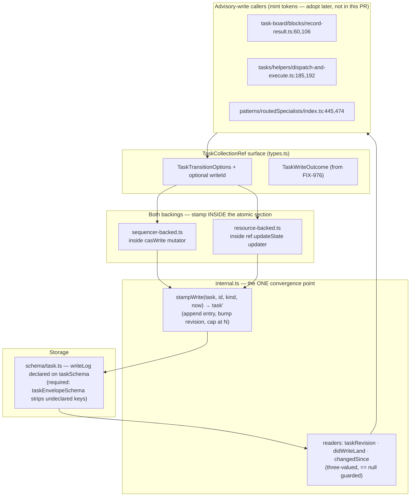

# FIX-989: Durable write provenance — a task write must record what it did, so a caller can tell a committed write from one that never landed — Implementation Spec

> **Linear:** [FIX-989](https://linear.app/fixpoint-labs/issue/FIX-989/durable-write-provenance-a-task-write-must-record-what-it-did-so-a) ·
> **Epic:** [FIX-980 — Honest task substrate](https://linear.app/fixpoint-labs/issue/FIX-980/epic-honest-task-substrate-every-write-path-reports-what-it-actually) ([epic PR #983](https://github.com/fixpoint-labs/flow-state-dev/pull/983))
> **Blocks:** FIX-963, FIX-964 · **Unblocks:** two of FIX-978's four blocking findings

---

## For reviewers — what this document is

This is a **direction document**, not an implementation. Reviewing it well means
answering one question: **is this the right approach?**

**In scope to challenge:**

- The problem framing — are we solving the right thing?
- The approach — will it work, does it fit the architecture and `docs/philosophy.md`?
- Any numbered **Decision** in §6 — that's the sign-off surface.
- Missing constraints, edge cases, or dependencies that would **invalidate** the design.
- Scope — a deliverable that shouldn't ship, or one that's missing.

**Out of scope — deliberately unsettled here, and owned by the implementing agent:**

- Names, signatures, file paths, and module layout.
- Local structure: which helper, how a function is decomposed, error-message wording.
- Micro-optimizations and style preferences.
- Test names and internal test structure (the *behaviours* to test are in §10; the tests
  themselves are not).
- Anything Part II left open on purpose — it is directional by design, and a gap at
  that altitude is intended, not an omission.

Feedback in the second list is welcome and gets **recorded verbatim in §13** for the
implementer to weigh against real code. It will not be argued with, and it will not be
folded into the design prose — that would pretend the spec can settle something it
can't. Please don't re-raise it: one mention is enough for it to land in §13.

---

## Part I — The Case *(for the human)*

### 1. Problem — why it matters, why now

**The problem, in plain language.** When a task's write succeeds and *then* something
downstream of it blows up, nobody can tell afterwards whether the write actually happened.
The work item's data changed, then the notification about that change threw, so the caller
receives an error and has no way to learn that its write did land. Read the item back and
you get an answer that fits two completely different stories equally well: *"my write
committed and then a different worker picked the item up"* and *"my write never landed at
all, the lease expired, and a different worker picked the item up."* Those need opposite
responses — the first is a real failure somebody has to hear about, the second is routine —
and today the substrate offers no way to separate them.

**Why now.** Two other bug fixes in this epic each built a guessing machine to work around
this, and each one accumulated provable blind spots over several rounds of review. FIX-963
must report loudly when a result recorder falls over after committing; its classifier cannot
separate the two stories above, so its headline guarantee is a coin flip on exactly the path
it exists to cover. FIX-964 must contain a badly-behaved custom store's error; its classifier
can suppress a genuine store outage, and can suppress the very post-commit failure FIX-963
exists to expose. Both specs independently reached the same conclusion in the same review
round, from opposite directions, and both wrote down the same remedy in almost the same
words: **"mutation-originated provenance rather than inferred state"** (FIX-964 §12) and
**"an atomic write outcome from the backing … durable enough to survive the next claim"**
(FIX-963 §12). This spec builds that. A third issue, FIX-978, is currently on hold with
roughly eleven rounds of its spec spent approximating it.

**Why a return value cannot close this — the constraint that shapes everything below.**
A rejected promise carries no value. So widening a method's return type, which is what
[FIX-976](https://github.com/fixpoint-labs/flow-state-dev/pull/1004) does, fixes only the
path where the call *returns* a refusal. It does nothing for the path where the call
*throws* — and throwing after a successful commit is precisely the case here. In both
backings the change announcement is the tail call, strictly after the durable write
resolves: `sequencer-backed.ts:203-220` emits after `await casWrite`, and
`resource-backed.ts:191-212` emits after `await ref.updateState`. So the commit is readable
before any notification lands, and the notification is what fails.

**And there is no seam outside the write to put the answer in.** The delegation surface
writes to one storage through three separate refs —
`skills/delegation-surface.ts:315` (the drain), `:620` (a worker's fan-out capability), and
`:693` (the executive's task tools) — because each calls a `boardCollection()` helper that
constructs a fresh ref every time; the code says so at `:682-684` (*"`getOrCreateTaskCollection`
never caches"*). Anything recorded on a single ref object is bypassed by construction. And
the one existing hook that *is* threaded into both backings, `onChange`
(`get-or-create.ts:141`, wired at `:165`/`:180`/`:191`), is never exposed to callers.

Together those two facts force the conclusion: the answer has to be produced **inside the
atomic write**, and it has to be **stored where the task is stored**. That is the whole
design constraint, and it is why this is a substrate primitive rather than a helper.

### 2. Solution in plain terms

**Every committed task write appends one short entry recording what it did, onto the task
itself, inside the same atomic write that changed it.**

A caller that is about to make a write it may need to ask about later mints a token and
passes it in. The write stamps that token into a small, bounded log on the task record,
alongside a monotonically increasing revision number. If the call then throws, the caller
reads the task back and looks for its own token. Present means *my write committed*. Absent
means *my write did not change anything*. No inference, no comparing attempt counters
against status, no guessing.

Two properties do the real work:

- **It is stamped inside the atomic write**, so the record cannot disagree with the change it
  describes, and it needs no second write to store it. This is the same discipline FIX-976
  already established for its return value; we are moving that verdict from a value that dies
  on a rejection to a record that survives one.
- **It is a short log, not a single slot.** A single "last write" field is overwritten by the
  next write, and *"a different worker then claimed the item"* is exactly the case FIX-963
  says inference cannot handle. A bounded log survives the next claim, which is the stated
  requirement.

**And it answers a second question for free.** Because each entry carries a revision, a
reader holding an old revision can ask *"has this task changed since I looked?"* — which is
the freshness signal FIX-978 §7 spent eleven rounds trying to synthesize outside the write.

**The honest limit, stated up front because the docs currently over-promise.** This is
exact **within one process**. Across processes it is a **detector, not a guarantee** — and
the reason is that the durable backing has no cross-process concurrency control at all
today. See Decision 3, which states the tradeoff plainly and names the store-interface change
that would lift it.

**The philosophy this leans on.**

- **Tenet 2 — composition over features, and refine the substrate rather than add beside it.**
  This does not add a concept next to the existing ones; it supplies the fact three of them
  were approximating. `expectAttempt`'s attempts-plus-status ownership heuristic
  (`internal.ts:96-109`, which its own comment concedes is *"only incidentally an ownership
  token"*), FIX-963's three-way inferential classifier, and FIX-964's snapshot-plus-clauses
  attribution are all reconstructions of a fact the write could simply state. The framework
  gets more capable without getting bigger.
- **Tenet 5 — fix at the owning layer.** The write is the only place that knows what the
  write did. Every mechanism proposed so far in this epic sat outside it, and every one of
  them was shown to be bypassable. There is exactly one convergence point and §7 enumerates
  every writer through it.
- **Tenet 3 — earn every addition, and a change that supersedes a path deletes it.** §7 names
  what this makes redundant, and §12 carries the deletion list as a deliverable rather than
  an aside.
- **Tenet 7 — prove the goal, not the mock.** The evidence path is FIX-963's own two
  indistinguishable histories, reproduced and then separated. If the primitive cannot tell
  them apart on the real path, it has not worked.

### 3. Tradeoffs & alternatives

**The simpler approach considered — and why it is not enough.** Ship FIX-976's widened return
type and stop there. This is genuinely appealing: it is already built, already approved, and
it *does* make declines observable. It fails for one reason that no amount of care fixes —
**the throw path carries no return value.** FIX-963 verified this independently and recorded
it as the reason its issue exists; FIX-964 recorded the same conclusion. A second simpler
variant, *"just re-read the task after the throw,"* is what both downstream specs already
tried; three review rounds each proved it cannot separate the two histories, and both specs
now describe that as a ceiling rather than a defect. So the simpler paths are not merely
weaker here, they are the two things already demonstrated not to work.

**The main alternative weighed — a separate write-log record, rather than fields on the task.**
Rejected, and the reason is decisive rather than aesthetic. On the resource backing each task
is its own resource instance (`resource-backed.ts:244-253` creates one per task); there is no
board-level record to write to. A separate log would therefore be a *second* resource
instance, and `persistNamespaceInstanceState` is a blind put per key
(`resource-registry.ts:619-628`), so the task write and the log write could not be made
atomic with each other. That reintroduces exactly the divergence this issue exists to close,
one layer down. Putting the record on the task makes atomicity free, because the backing
already writes the whole task object in one operation.

**The second alternative — a per-task revision counter only, with no write tokens.** Cheaper
(one integer, no array) and it does answer FIX-978's freshness question. It does **not**
answer *"did my write land"*: after a throw the caller knows only that the revision advanced,
not whether its own write is among the writes that advanced it. That is precisely FIX-963's
ambiguity, so the tokens are what make this a fix rather than a partial one.

**Where the genuine complexity is.** Three places, none of them the log itself.

1. **The persisted-schema strip.** A durable task is validated by
   `taskEnvelopeSchema` = `taskSchema.extend({ input })`
   (`define-task-collection.ts:41-43`), and `persistNamespaceInstanceState` runs that schema's
   `safeParse` and persists `parsed.data` (`resource-registry.ts:624-627`). Zod object schemas
   strip unknown keys, so a provenance field that is not declared on `taskSchema` itself is
   **silently dropped on every durable write** — the field would appear to work perfectly on
   the two in-memory backings and vanish on the one that persists. This is the single most
   likely way to ship this broken.
2. **Not stamping on a no-op.** If provenance were stamped unconditionally, a write that
   changes nothing (`setPriority` to the same value) would start producing a real state
   change, which would defeat FIX-976's `unchanged` outcome and start firing spurious
   `resource_change` notifications. Provenance is stamped only on a committed change, and the
   consequence — an `unchanged` write leaves no trace — is a deliberate part of the contract
   (Decision 5), not an oversight.
3. **Mixed writers.** The log is trustworthy only if every writer to the storage maintains
   it. A hand-written custom ref does not, so a board with both kinds of writer has a log
   that is silently behind. This is stated as a precondition rather than defended against,
   because it cannot be defended against from inside the substrate — and the three-valued
   read (Decision 4) is what keeps a consumer from mistaking "unavailable" for "did not land".

### 4. Focus practices

1. **BP-030 — the persisted shape changes, and one of the two directions is a trap.**
   *(tenet 1.)* Reading old records is the easy half: the field is optional and readers
   `== null`-guard it. The hard half is the *write* direction described above — declare the
   field on `taskSchema` or the durable backing strips it. Any test that only exercises the
   sequencer or request backing will pass while durable boards silently carry no provenance.
2. **Tenet 5 — enumerate every writer through the convergence point.** *(change-specific.)*
   Both backings maintain the log, and every mutating method in both must route through the
   one stamping helper. A method that writes a task without stamping is a hole that reads as
   "your write did not land." §7 carries the writer enumeration; getting it wrong is how
   FIX-951 only half-landed.
3. **BP-003 — the evidence is the two histories, not a unit assertion.** *(tenet 7.)* The
   pass criterion is that FIX-963's two read-identical histories become distinguishable on a
   real board. A test asserting "the log has one entry" proves nothing about the defect.
4. **BP-031-adjacent — provenance tokens are never accepted from model or tool input.**
   *(change-specific.)* A token is a claim about who wrote something. The task tools take a
   model-supplied `taskId` already; if a token were also model-supplied, a model could assert
   authorship of someone else's write. Tokens are minted by first-party callers only.
5. **BP-035, second path — the absent state is load-bearing.** *(tenet 1.)* The behaviour to
   test hardest is the *legacy* task with no log and the *custom ref* that maintains none.
   Both must read as "unavailable", distinctly from "did not land."

### 5. What using it looks like

The public read surface is what changes; existing calls keep working untouched.

**A caller that needs to survive its own post-commit failure** — this is the FIX-963 shape,
and the substrate's own recorders are the callers that will adopt it.

```ts
const writeId = mintTaskWriteId();          // first-party, never model-supplied
try {
  await tasks.complete(task.id, output, { ifAllowed: true, expectAttempt, writeId });
} catch (err) {
  // The write may already have committed — the throw came from the change
  // announcement, which runs after the durable write resolves.
  const landed = didWriteLand(tasks.get(task.id), writeId);
  if (landed === true)  throw new PostCommitRecorderFailure(err);   // real: report it
  if (landed === false) return;                                     // never landed: routine
  // landed === undefined → this ref keeps no provenance; fall back and say so.
}
```

Observable result, against the two histories the issue names — both of which read
`attempts = expectAttempt + 1`, `status: "in_progress"` today:

```
history 1 — my write committed, then the notify threw, then another worker claimed it
  task.writeLog → [ …, { id: "w-mine", revision: 4 }, { id: "w-claim-2", revision: 5 } ]
  didWriteLand(task, "w-mine") → true    ← reported. Today: silently called "displaced".

history 2 — my write never landed; lease expired, reclaim, another worker claimed
  task.writeLog → [ …, { id: "w-reclaim", revision: 4 }, { id: "w-claim-2", revision: 5 } ]
  didWriteLand(task, "w-mine") → false   ← correctly routine.
```

**A reader asking the freshness question** (the FIX-978 §7 shape):

```ts
const before = taskRevision(tasks.get(id));       // number | undefined
// … await something …
changedSince(tasks.get(id), before);              // true | false | undefined
```

**Before / after for an existing call site.** Nothing changes for a caller that does not
opt in — no signature is broken, `writeId` is an optional addition to the options object
already threaded through both backings, and a call that omits it behaves exactly as today
(the log records the write with a substrate-minted id, so revisions still advance).

### 6. Decisions & rules — the sign-off surface

1. **Provenance is stamped inside the backing's atomic write, onto the task record itself.**
   *Alternative rejected:* a separate write-log record or a board-level slot. *Ramification:*
   atomicity is free and needs no new storage, but provenance is now part of a persisted
   schema (`taskSchema`), so it inherits BP-030 obligations and must be declared there or the
   durable backing strips it. It also means provenance is exactly as durable as the task —
   no more, no less.

2. **The record is a bounded log of recent writes, not a single "last write" slot.**
   *Alternative rejected:* one `lastWriteId` field plus a revision. *Ramification:* the
   answer survives subsequent writes, which is the stated requirement ("durable enough to
   survive the next claim"). The cost is a bounded array on every task and a **retention
   limit measured in writes, not time** — a caller that asks after more than N subsequent
   writes gets "unavailable", not a wrong answer. N is a fixed constant in v1, not
   configurable.

3. **This primitive is honest within a process. It is a detector, not a guarantee, across
   processes — and we do not fix that here.** *Alternative rejected:* growing
   `ResourceStateStore` a compare-and-swap in this issue. *Ramification and the reasoning,
   because this is the load-bearing call:* the durable backing has **no cross-process
   concurrency control of any kind.** `serializeResourceWrite` is an in-process promise chain
   over a local `Map` (`resource-registry.ts:530-546`); `persistNamespaceInstanceState` is a
   blind put (`:619-628`); `ResourceStateStore.set` is documented "Creates or overwrites"
   with no expected-version parameter (`stores/types.ts:550-551`); and the SQLite adapter's
   own header says last-write-wins, *"matching the interface contract and the Postgres
   reference"* (`store-sqlite/src/resource-state-store.ts:16-20`). So two processes can both
   commit and one silently overwrites the other — **the task itself is already not
   cross-process-safe, independent of this change.** Provenance does not make that worse; it
   makes it *detectable*, because a caller can now find its token missing and know the write
   was lost, where today it assumes success. Note the asymmetry that makes this fixable
   later: the *scope*-state layer one level over already has genuine CAS with
   `expectedVersion` and a store-visible version (`stores/cas.ts:119-174`,
   `state-container.ts:390-405`); the resource layer simply never adopted it. The honest fix
   is therefore to bring `ResourceStateStore` up to the contract its sibling already has —
   filed as a named follow-up in §12 with its shape, **not** built here, because no current
   consumer needs it and it touches every store adapter (tenet 3).

4. **The read surface is three-valued: landed / did not land / provenance unavailable.**
   *Alternative rejected:* a boolean, treating a missing log as "did not land".
   *Ramification:* consumers must handle the third case, which is more work for them — and it
   is the whole point. Collapsing "this ref keeps no provenance" into "your write did not
   land" would reintroduce a confident wrong answer, which is the defect class this epic
   exists to remove. It also means a custom ref needs no migration and no brand: absence of a
   log *is* the unavailable signal.

5. **Provenance is stamped only on a write that committed a change.** *Alternative rejected:*
   stamping on every call. *Ramification:* a no-op write leaves no trace, so "my token is
   absent" means "my write changed nothing", which subsumes both "never landed" and "was
   already in the desired state". That is the correct answer to *"did my write change this
   task"* — the question this primitive is chartered to answer — but it is **not** on its own
   sufficient to decide contain-versus-rethrow, so FIX-964's seam still needs its own decline
   attribution. Stated here so that composition is not discovered at integration time.

6. **Tokens are minted by first-party callers and never accepted from model or tool input.**
   *Alternative rejected:* exposing `writeId` on the task tools so a coordinator could
   correlate its own writes. *Ramification:* the task-tool surface is unchanged, and a model
   cannot assert authorship of a write it did not make. A caller that omits a token still
   gets a log entry with a substrate-minted id, so revisions stay monotonic for readers who
   only care about freshness.

7. **`expectAttempt`'s ownership heuristic is superseded but not migrated in this issue.**
   *Alternative rejected:* replacing `expectAttempt` with a claim-token comparison here.
   *Ramification:* named in §12's deletion list with the reasoning, and filed. Doing it here
   would change a public option on `TaskCollectionRef` and touch six call sites for no
   benefit this issue's consumers need, which is scope creep dressed as thoroughness. The
   spec commits to *naming* the supersession, per tenet 3, not to executing it.

8. **The documentation's durability promise is corrected in this change.** *Alternative
   rejected:* leaving the docs and filing the correction. *Ramification:* the task-substrate
   page currently advertises "an org work pool that accepts tasks across sessions" and "for
   anything that has to persist between requests, use `resource`"
   (`apps/docs/docs/orchestration/task-substrate.md:162,164`) with no statement that
   concurrent writers across processes silently clobber one another. Shipping a primitive
   whose guarantee is per-backing while the docs imply a stronger one is the band-aid this
   issue exists not to apply, so the correction ships here.

**Non-goals.** FIX-963's and FIX-964's classifiers (they consume this and get re-specced);
FIX-978's §7 mechanism; a cross-process CAS in the resource store; migrating `expectAttempt`;
exposing provenance on the model-facing task tools; time-based retention or pruning
configuration.

**Size: Medium** — multi-file, one PR, ~400–500 LOC including tests and docs. No PR plan:
the schema, the two backings and the read helpers are one primitive, and splitting them would
ship a field nothing maintains. Consumer adoption is deliberately *not* in this PR (Decision 7,
Non-goals), which is what keeps it Medium.

---

## Part II — The Build Plan *(for the implementing agent)*

### 7. Technical design

**Where it lives.** Entirely inside `@flow-state-dev/orchestration`'s task-collection module,
plus the persisted task schema. No engine change, no store change, no new package.



**The shape of the record.** One optional field on the task: a bounded, newest-last array of
short entries, each carrying the write's id, its revision, and the change kind that produced
it. The task's current revision is the last entry's revision, so no separate counter field is
needed. Illustrative — **a sketch, not the contract**:

```ts
// on taskSchema — declared HERE or the durable backing strips it
writeLog: z.array(z.object({
  id: z.string(), revision: z.number().int(), kind: /* see note */ z.string(), at: z.number(),
})).optional()
```

The `kind` reuses the existing `TaskChangeKind` (`collection/change-event.ts:16-30`), which
both backings already compute and pass to `emit` — so it costs nothing to record and makes the
log self-describing in traces. It is also what a later `expectAttempt` collapse would read
(Decision 7); if a reviewer wants it struck, that is a live call and Decision 7 is where it
lands.

**Note for the implementer, because it is a real trap:** `TaskChangeKind` is a bare TypeScript
union today with **no Zod counterpart** in the repo. Declaring it on a *persisted* schema needs
one, and it should be **permissive on read** (BP-030): an entry whose `kind` came from a newer
version must not fail `safeParse`, because
`persistNamespaceInstanceState` falls back to `{}` on a failed parse
(`resource-registry.ts:624-625`) — a strict enum here would turn one unrecognised kind into a
**wiped task record**. Either keep the persisted field a permissive string and narrow at the
read helpers, or add an enum that tolerates unknown members. The choice is the implementer's;
the constraint is not.

**The convergence point (tenet 5).** One helper in `internal.ts` performs the stamp, beside
the transition rules that already live there (`transitionDeclineReason`, `applyTransition`,
`shouldRetryOnFail`). Every mutating path in both backings routes through it, called from
*inside* the atomic section:

| Backing | Atomic section | Paths that must stamp |
|---|---|---|
| `sequencer-backed.ts` (also serves `backing: "request"`) | the `casWrite` mutator, `:127-143` | `addTask`, `addTasks`, `claim`, `transitionTo`, `patchOne`, `reclaim` |
| `resource-backed.ts` | the `ref.updateState` updater | `addTask`, `addTasks`, `claim`, `transitionRef`, `patchRef`, `reclaim` |

The two backings carry separately maintained copies of their transition wrappers, which is
exactly why the *rule* is single-sourced — `internal.ts:111-124` already records that
reasoning for `transitionDeclineReason`, and this follows it.

**How the stamp composes with FIX-976's outcome.** FIX-976 gives this spec its shape for
free: both wrappers already capture a verdict inside the mutator and return it after the
write, with reset-on-CAS-replay discipline (`sequencer-backed.ts:188-236` on
`origin/fix/FIX-976`). Provenance rides the same captured value. Concretely — the `recorded`
branch stamps; `unchanged` and `declined` do not (Decision 5). That mapping is the whole
integration, and it is why this extends FIX-976 rather than duplicating it.

**What FIX-976 does not give, and this adds.** FIX-976's verdict is a *return value*, so it is
lost on a rejection, and it is *transient*, so it is gone by the next read. This adds (a) the
durable record, (b) the revision, and (c) the three-valued read surface. Nothing in FIX-976 is
re-implemented.

**Reads.** Three helpers, all `== null`-guarded and all three-valued where the answer can be
unknown. They are the only sanctioned way to interpret the log — consumers must not index it
directly, so the retention rule and the "unavailable" semantics have one home.

### 8. Implementation sequence

1. **Declare the field on `taskSchema`** (`tasks/schema/task.ts`) as optional. Verify it
   round-trips through `taskEnvelopeSchema` (`define-task-collection.ts:41-43`) and survives
   `persistNamespaceInstanceState`'s `safeParse` (`resource-registry.ts:624-627`). *Test:* a
   durable resource-backed task retains its log across a persist/read cycle — this is the
   step that catches the strip described in §3, and it must be a resource-backing test, not a
   sequencer one.
2. **Add the stamp helper and the three readers to `internal.ts`.** Pure functions, no I/O.
   *Test:* cap enforcement at N, monotonic revision, newest-last ordering, and the three-valued
   reads over `undefined` / empty / populated logs.
3. **Stamp in `sequencer-backed.ts`**, inside the `casWrite` mutator, on every path in the
   table above. Reset on CAS replay exactly as FIX-976's `captured`/`declined` do. *Test:*
   a CAS retry leaves exactly one entry for the winning attempt, not one per attempt.
4. **Stamp in `resource-backed.ts`**, inside the `updateState` updater, same paths. *Test:*
   parity with step 3, plus that an `unchanged` write still short-circuits at
   `persistResourceKey`'s `deepEqual` guard (`createExecutionContext.ts:1402`) and fires no
   `resource_change`.
5. **Thread the optional `writeId` through `TaskTransitionOptions`** (`collection/types.ts`)
   and document the contract there — including the retention limit, the three-valued read,
   and the mixed-writer precondition. *Test:* a call omitting `writeId` still advances the
   revision.
6. **Docs and README** (§11), including the Decision 8 durability correction.
7. **Changeset** — `minor` (new public read surface on a pre-1.0 package), per BP-022.

**Removals in this change (tenet 3):** none in code. That is the honest answer and it is a
consequence of sequencing this issue *first* — the machinery this supersedes is mostly
unbuilt, so what this deletes is three specs' worth of planned inference rather than shipped
lines. §12 carries that list, which is where the deletion deliverable lives.

### 9. Edge cases & error handling

| Case | Expected behaviour |
|---|---|
| Legacy task persisted before this change | No log. Readers return `undefined` (unavailable), never `false`. |
| Custom `TaskCollectionRef` that maintains no log | Same as above — absence *is* the unavailable signal (Decision 4). No brand, no probe, no migration. |
| Mixed writers (one built-in ref + one hand-written ref over the same storage) | Log is silently behind. Documented precondition, not defended against — it cannot be, from inside the substrate. Named in §11's docs plan. |
| Write commits, then `emit` / `onChange` throws | The stamp is already committed (it is inside the write). Caller reads back and finds its token. **This is the headline case.** |
| Write declines (`ifAllowed` / `expectAttempt`) | No stamp, no revision bump (Decision 5). FIX-976's `declined` verdict is unchanged. |
| Write is a no-op (`setPriority` to the same value) | No stamp. FIX-976's `unchanged` verdict is unchanged, and no spurious `resource_change` fires. |
| CAS retry on the sequencer backing | Exactly one entry, for the winning attempt. Reset the captured stamp on every mutator entry, as FIX-976 does. |
| More than N subsequent writes before the caller reads back | Token evicted; reader returns `undefined` (unavailable), not `false`. Retention is in writes, not time. |
| Two processes write concurrently to a durable board | One silently overwrites the other, including its log entry. The loser's reader returns `undefined`/`false` and can *detect* the loss — which is the improvement. Not a guarantee. Decision 3. |
| `ctx.suspend()` / resume across requests | The log is on the persisted task, so it survives. This is why it helps FIX-978's suspension finding — see §12. |

**Second-path checklist (BP-035).** Legacy shape: covered above. Null boundary: every reader
`== null`-guards. Concurrent: the CAS-replay and cross-process rows. Cancel/error: the
decline and throw rows. Multi-tenant: provenance is per-task within an already-scoped
collection; no cross-scope reach. New-flag off-state: a caller omitting `writeId` is the
off-state and has its own test (step 5).

### 10. Testing strategy

**Goal & goal check (BP-003, tenet 7).** The goal is FIX-963's two histories becoming
distinguishable on a real board. Reproduce both against a running task board — a recorder
that commits and then throws from its change announcement, followed by another worker
claiming the task — and assert that the two, which read *identically* today
(`attempts = expectAttempt + 1`, `status: "in_progress"`), now return `true` and `false`
respectively from the provenance read. **Pass criteria:** history 1 → `landed === true`;
history 2 → `landed === false`; a legacy/no-log ref → `undefined`. Seam:
`packages/integration-tests/src/scenarios/` (FIX-963's §12 records these harnesses as
already reproduced but not committed; this is where they graduate to real tests). Anti-gaming:
the check must fail if the primitive is stubbed to always return `true`, so both arms are
asserted in one test.

**CI specs (deterministic).** Behaviours, in observable terms: durable round-trip retains the
log (step 1 — the strip guard); cap eviction returns unavailable rather than false; revision
is monotonic across all mutating paths in both backings; declined and no-op writes leave no
entry; a CAS retry leaves one entry; a call omitting `writeId` still advances the revision;
all three readers return `undefined` on a log-less task. Extend
`packages/orchestration/test/collection/advisory-write.test.ts` (exists; FIX-976 already
extends it) rather than starting a new file.

**Discipline:** `diagnose` — this is Linear-labelled **Bug**. The feedback loop is vitest at
`packages/orchestration` for the unit layer and the integration scenario for the goal check.
**BP-006:** no `fix989-`-style prefixes in identifiers, file names, or test names.

### 11. Documentation plan

| Surface | Action | What |
|---|---|---|
| `apps/docs/docs/orchestration/task-substrate.md` | **EXTEND** | New subsection after "recording a result that may no longer apply" (~`:99-110`, where the advisory-write contract is already explained) covering: how to tell whether your write landed after a throw, the three-valued answer, and the retention-in-writes limit. **Plus the Decision 8 correction** to the three-backings table and prose (`:162,164`): state plainly that a resource-backed collection is durable across requests but has **last-write-wins semantics across processes**, with no CAS. Cross-link both directions with `task-board.md`. |
| `apps/docs/docs/orchestration/task-board.md` | **EXTEND** | The custom-ref section (`:360`) already warns that a hand-written ref must honour `TaskTransitionOptions`; add that it should also maintain provenance, and what a consumer sees if it does not (unavailable, not false). |
| `packages/orchestration/README.md` | **EXTEND** | Public read surface: the field and the three helpers, terse. BP-009. |
| `docs/architecture/*` | **No change** | This alters no locked contract; it extends a package-local interface. |
| Blog | **No change** | Not an announcement. |

**Voice risks** (CLAUDE.md writing style): the topic invites "guarantee" and "durable" as
marketing words — the docs must stay honest about the per-backing limit, which is the whole
point of Decision 8. No internal issue or PR numbers anywhere under `apps/docs/`. Introduce
"provenance" in plain terms on first use.

### 12. Dependencies, open questions & follow-ups

**Blocking dependency: FIX-976 ([PR #1004](https://github.com/fixpoint-labs/flow-state-dev/pull/1004),
Linear `In Review`, verified NOT merged to `main` at `20701e7e`).** This spec extends its
`TaskWriteOutcome` and both wrappers' capture-inside-the-mutator shape. Build on top of it;
do not duplicate or re-invent it. If FIX-976 were dropped, this spec still stands but would
have to introduce the capture discipline itself.

**What this dissolves downstream — stated per finding, including the ones it does not.**

FIX-978 §13 records four findings that block building it as specified:

| FIX-978 blocking finding | Dissolved? |
|---|---|
| **The mutation seam** — no seam outside the atomic write can satisfy §7's version requirement | **Yes, directly.** This is that seam. A per-task revision produced inside the write is exactly what round 14 concluded was needed. |
| **Supplied refs** — a mutation through another holder bypasses the board's wrapper, so recorded refusals stay current (a *correctness* gap) | **Yes, for the shipped consumer.** The revision lives in the storage, not on a ref object, so all three delegation-surface refs (`:315`/`:620`/`:693`) read and advance the same one. **Not** for a genuinely hand-written ref that writes the same storage without stamping — see the mixed-writer row in §9. |
| **Suspension/resume ledger loss** — a transient in-memory ledger describes a fact persisted on the task row, so a resume keeps the fact and loses the description | **Partially — enabled, not delivered.** This puts the description on the *same persisted record* as the fact, which removes the durability mismatch FIX-978 identified as the root. But FIX-978 must be re-specced to read provenance instead of its ledger; this spec does not do that for it. Reported as partial rather than closed. |
| **The wake gate** — it closes on the refusal it exists to retry, and the count-based threshold has no principled value | **No.** This is a different missing primitive: `TaskDispatcher.claim`'s `null` conflates "nothing eligible" with "I am backing off", and a revision cannot fix it (a classifier may decline twice and pick on the third call at the *same* revision). It needs a dispatcher-side declaration, which FIX-978 §12 already names as a follow-up. Untouched by this spec. |

**FIX-963** gets exactly what its §12 asks for — *"an atomic write outcome from the backing …
durable enough to survive the next claim"* — and its three-way inferential classifier should
not be built. **FIX-964** gets the commit half of its attribution made exact, so its two
recorded misclassification histories close *when provenance is present*; its seam still needs
its own decline attribution (Decision 5), and for its actual target population — a
non-conforming custom store that maintains no log — the answer is honestly `undefined` rather
than exact. That is a real improvement over guessing, and it is not a complete answer. Both
specs are re-specced after this lands, per this issue's scope boundary.

**What becomes deletable (tenet 3) — the deliverable list.** Mostly unbuilt machinery, which
is the point of sequencing this first: we delete planned inference rather than shipped lines.

1. **FIX-963's three-outcome classifier** (`displaced` / `unchanged` / `committed` inferred
   from a post-write read-back) — **do not build.** Replaced by a provenance read.
2. **FIX-964's snapshot-plus-clauses attribution**, for the commit half — **do not build**
   that half. The decline half survives.
3. **FIX-978 §7's version counter riding `onTaskChangeFor`**, its per-worker quiescence
   quorum, and its pre-dispatch version stamp — **do not build.** FIX-978's own §12 predicts
   less than half of §7 survives; the request-scoped-filter limitation it documents
   (`predicates.ts:32-41`, local mutations only) is dissolved by a storage-resident revision.
4. **Shipped, and genuinely superseded: `expectAttempt` + `attemptOwnsTask` +
   `ATTEMPT_OWNED_STATUSES`** (`internal.ts:94-109`, `types.ts:77`, six call sites). The
   attempts-plus-status pair exists only because `attempts` is a claim counter being used as
   an ownership token — its own comment concedes this. A claim's log entry is a real ownership
   token, so the heuristic collapses to a token comparison. **Named, filed, not migrated
   here** (Decision 7).
5. **Not deletable, but worth the implementer knowing:** `casWrite` discards
   `atomicState`'s `Promise<boolean>` "committed" signal (`sequencer-backed.ts:132`,
   `state-container.ts:390-405`) — a free honesty signal already thrown away. Not needed by
   this design; noted so it is not rediscovered as a finding.

**Follow-ups (flagged, not built).**

- **Bring `ResourceStateStore` up to its sibling's CAS contract** — the cross-process half of
  Decision 3. Shape: `set` grows an expected-version parameter and returns a conflict result,
  mirroring the `persist(next, expectedVersion, hint) → { ok, version, currentState,
  currentVersion }` contract that `runWithCAS` (`stores/cas.ts:119-174`) already relies on for
  scope state. Touches the interface (`stores/types.ts:546-570`), `persistResourceKey`
  (`createExecutionContext.ts:1399-1405`), the three instance write ops
  (`resource-registry.ts:682-720`), and every adapter including the Postgres reference. **File
  it; do not fold it in.** No current consumer needs it, and shipping an unconsumed
  cross-process CAS would violate tenet 3.
- **A related honesty hole found while verifying Decision 3, independent of this change:**
  `persistResourceKey` short-circuits on `deepEqual(stateRef.current[key], value)`
  (`createExecutionContext.ts:1402`) against the **in-process cache**. If another process has
  written, a write matching the stale cache is silently skipped. Same defect family as this
  epic (a write reporting success for something that did not happen), different layer. Worth
  its own issue rather than a paragraph here.
- **Deepening opportunity, already recorded by FIX-964 §12 and confirmed here:**
  `TaskCollectionRef` asks a custom-store author to implement ~18 methods carrying
  state-machine, claim/lease, CAS and advisory-write semantics — and now provenance too. This
  change adds one more thing to re-derive, which strengthens the existing argument for a
  narrower store-shaped extension point. Follow up via `improve-codebase-architecture`; not
  in scope.

**Collision with FIX-990, being specced in parallel.** **No file overlap** — FIX-990 fixes the
wake predicate's stale collection *view* in `task-board/index.ts` and `check-board.ts`; this
spec touches `tasks/collection/*` and `tasks/schema/task.ts` and neither of those two files.
**One semantic interaction worth both specs knowing, and it is a genuine bound on what this
primitive delivers:** on the resource backing there is no board-level record — each task is
its own resource instance — so a *board-level* "nothing changed anywhere" signal has no atomic
home, and this spec deliberately provides only a **per-task** revision (§3, alternative two).
A reader that aggregates per-task revisions into a board-level answer is limited by which
tasks its ref can see, and `createResourceBackedTaskCollection` hydrates its mirror once at
construction (`resource-backed.ts:133-144`, with the caveat stated at `:39-42`) — which is
FIX-990's defect. So **per-task freshness is sound after this lands; board-level freshness
additionally needs FIX-990.** Neither blocks the other, and neither should try to fix the
other.

**Open questions:** none blocking. Decision 3 is the call the repo owner asked to be made
explicitly rather than left open, and it is made — in-process exact, cross-process detector,
store CAS filed with its shape.

### 13. Review notes for the implementer

*(No spec-PR review yet — this section is populated during Step 6.5 with below-the-bar
feedback recorded verbatim.)*

---

## Spec evolution

- **Spec drafted** — framed the problem as the substrate inferring a fact only the write can
  state, and verified both halves of that from the code (both backings emit after their
  atomic write resolves; the delegation surface writes one storage through three refs).
  Chose a bounded per-task write log stamped inside the atomic write over a separate log
  record (no atomicity available on the resource backing) and over a revision counter alone
  (cannot answer "did *my* write land"). Made the in-process/cross-process call explicitly:
  exact in-process, detector across processes, with the `ResourceStateStore` CAS filed rather
  than folded in because no current consumer needs it. Recorded which of FIX-978's four
  blocking findings this dissolves (two fully, one partially, one not at all) and carried the
  supersession list as a deliverable.
