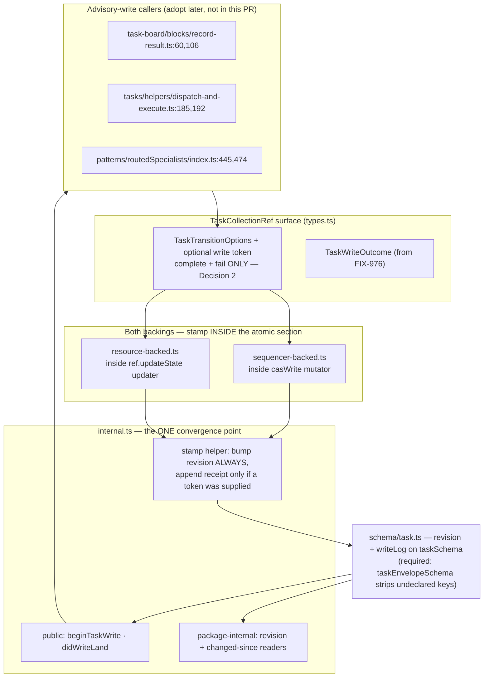
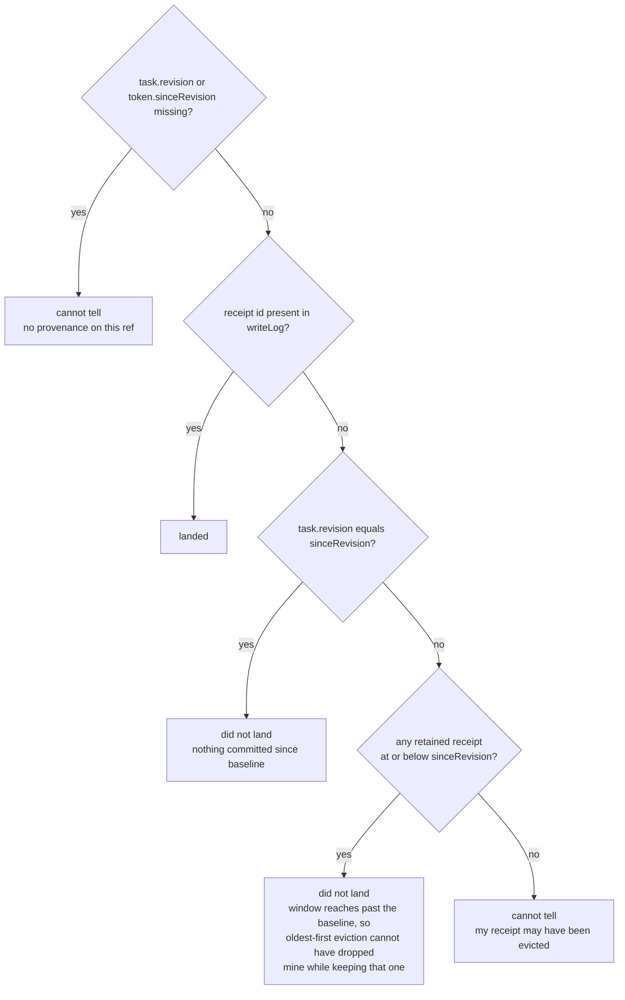

# FIX-989: Durable write provenance — a task write must record what it did, so a caller can tell a committed write from one that never landed — Implementation Spec

> **Linear:** [FIX-989](https://linear.app/fixpoint-labs/issue/FIX-989/durable-write-provenance-a-task-write-must-record-what-it-did-so-a) ·
> **Epic:** [FIX-980 — Honest task substrate](https://linear.app/fixpoint-labs/issue/FIX-980/epic-honest-task-substrate-every-write-path-reports-what-it-actually) ([epic PR #983](https://github.com/fixpoint-labs/flow-state-dev/pull/983))
> **Blocks:** FIX-963, FIX-964 · **Unblocks:** two of FIX-978's four blocking findings

---

## For reviewers — what this document is

This is a **direction document**, not an implementation. Reviewing it well means
answering one question: **is this the right approach?**

**In scope to challenge:**

- The problem framing — are we solving the right thing?
- The approach — will it work, does it fit the architecture and `docs/philosophy.md`?
- Any numbered **Decision** in §6 — that's the sign-off surface.
- Missing constraints, edge cases, or dependencies that would **invalidate** the design.
- Scope — a deliverable that shouldn't ship, or one that's missing.

**Out of scope — deliberately unsettled here, and owned by the implementing agent:**

- Names, signatures, file paths, and module layout.
- Local structure: which helper, how a function is decomposed, error-message wording.
- Micro-optimizations and style preferences.
- Test names and internal test structure (the *behaviours* to test are in §10; the tests
  themselves are not).
- Anything Part II left open on purpose — it is directional by design, and a gap at
  that altitude is intended, not an omission.

Feedback in the second list is welcome and gets **recorded verbatim in §13** for the
implementer to weigh against real code. It will not be argued with, and it will not be
folded into the design prose — that would pretend the spec can settle something it
can't. Please don't re-raise it: one mention is enough for it to land in §13.

---

## Part I — The Case *(for the human)*

### 1. Problem — why it matters, why now

**The problem, in plain language.** When a task's write succeeds and *then* something
downstream of it blows up, nobody can tell afterwards whether the write actually happened.
The work item's data changed, then the notification about that change threw, so the caller
receives an error and has no way to learn that its write did land. Read the item back and
you get an answer that fits two completely different stories equally well: *"my write
committed and then a different worker picked the item up"* and *"my write never landed at
all, the lease expired, and a different worker picked the item up."* Those need opposite
responses — the first is a real failure somebody has to hear about, the second is routine —
and today the substrate offers no way to separate them.

**Why now.** Two other bug fixes in this epic each built a guessing machine to work around
this, and each one accumulated provable blind spots over several rounds of review. FIX-963
must report loudly when a result recorder falls over after committing; its classifier cannot
separate the two stories above, so its headline guarantee is a coin flip on exactly the path
it exists to cover. FIX-964 must contain a badly-behaved custom store's error; its classifier
can suppress a genuine store outage, and can suppress the very post-commit failure FIX-963
exists to expose. Both specs independently reached the same conclusion in the same review
round, from opposite directions, and both wrote down the same remedy in almost the same
words: **"mutation-originated provenance rather than inferred state"** (FIX-964 §12) and
**"an atomic write outcome from the backing … durable enough to survive the next claim"**
(FIX-963 §12). This spec builds that. A third issue, FIX-978, is **on hold** with roughly
eleven rounds of its spec spent approximating it.

**Why a return value cannot close this — the constraint that shapes everything below.**
A rejected promise carries no value. So widening a method's return type, which is what
[FIX-976](https://github.com/fixpoint-labs/flow-state-dev/pull/1004) does, fixes only the
path where the call *returns* a refusal. It does nothing for the path where the call
*throws* — and throwing after a successful commit is precisely the case here. In both
backings the change announcement is the tail call, strictly after the durable write
resolves: `sequencer-backed.ts:203-220` emits after `await casWrite`, and
`resource-backed.ts:191-212` emits after `await ref.updateState`. So the commit is readable
before any notification lands, and the notification is what fails.

**And there is no seam outside the write to put the answer in.** The delegation surface
writes to one storage through three separate refs —
`skills/delegation-surface.ts:315` (the drain), `:620` (a worker's fan-out capability), and
`:693` (the executive's task tools) — because each calls a `boardCollection()` helper that
constructs a fresh ref every time; the code says so at `:682-684` (*"`getOrCreateTaskCollection`
never caches"*). Anything recorded on a single ref object is bypassed by construction. And
the one existing hook that *is* threaded into both backings, `onChange`
(`get-or-create.ts:141`, wired at `:165`/`:180`/`:191`), is never exposed to callers.

Together those two facts force the conclusion: the answer has to be produced **inside the
atomic write**, and it has to be **stored where the task is stored**. That is the whole
design constraint, and it is why this is a substrate primitive rather than a helper.

### 2. Solution in plain terms

**The task record grows two things, both written inside the same atomic write that changes
the task:**

1. **A revision** — a counter bumped on *every* committed write, whoever made it.
2. **A short, bounded log of write receipts** — appended only when a caller asked to be able
   to correlate its own write later.

A caller that needs to survive its own post-commit failure opens a write against the task it
is about to change. That hands back a small token carrying a fresh id **and the revision the
caller observed** — and the observed revision is load-bearing, not bookkeeping (see below).
The caller passes the token in. If the call then throws, the caller reads the task back and
asks whether its write landed. It gets one of three answers: **yes**, **no**, or **cannot
tell** — and the third is honest rather than a shrug.

**Why the observed revision matters, and why a bounded log alone would not have worked.**
A bounded log evicts. So a task whose receipt was *never written* and a task whose receipt
was *written and later evicted* look identical — a populated log without my id. Answering
"no" to both would be exactly the confident wrong answer this primitive exists to remove.
The observed revision closes it: because eviction is oldest-first and revisions only ever
increase, a retained receipt older than the caller's baseline **proves** the retained window
still reaches back past the moment the caller started. If it does and my id is absent, my
write genuinely did not land. If it doesn't, the honest answer is "cannot tell". The rule
needs no knowledge of the cap, which also means it stays correct if the cap ever changes.

**What this deliberately does *not* cover, stated here rather than discovered later.**
Correlation is available on the **advisory write-backs** — the two methods that already carry
an options argument. Every other mutating method still bumps the revision, so the "has this
changed" question is answered everywhere, but a caller of `claim`, `cancel`, `addTask` or a
metadata mutator cannot hand in a token in this version. That matches the issue's own outcome
statement (*"after any advisory task write"*) and it matches where all six of the substrate's
existing advisory call sites live. Decision 2 says so plainly and names the uncovered
methods, because quietly claiming coverage we don't have is the failure mode this epic exists
to fix.

**The honest limit on durability.** This is exact **within one process**. Across processes it
is a **detector, not a guarantee** — the durable backing has no cross-process concurrency
control at all today. Decision 6 states the tradeoff and names the store-interface change
that would lift it.

**The philosophy this leans on.**

- **Tenet 2 — composition over features, and refine the substrate rather than add beside it.**
  This does not add a concept next to the existing ones; it supplies the fact three of them
  were approximating. FIX-963's three-way inferential classifier and FIX-964's
  snapshot-plus-clauses attribution are both reconstructions of a fact the write could simply
  state. The framework gets more capable without getting bigger.
- **Tenet 5 — fix at the owning layer.** The write is the only place that knows what the
  write did. Every mechanism proposed so far in this epic sat outside it, and every one was
  shown to be bypassable. There is exactly one convergence point and §7 enumerates every
  writer through it.
- **Tenet 3 — earn every addition, and a change that supersedes a path deletes it.** The
  persisted receipt carries two fields, not four — §7 records what was cut and why — and §12
  carries the supersession list as a deliverable rather than an aside.
- **Tenet 7 — prove the goal, not the mock.** The evidence path is FIX-963's own two
  indistinguishable histories, reproduced and then separated. If the primitive cannot tell
  them apart on the real path, it has not worked.

### 3. Tradeoffs & alternatives

**The simpler approach considered — and why it is not enough.** Ship FIX-976's widened return
type and stop there. This is genuinely appealing: it is already built, already reviewed, and
it *does* make declines observable. It fails for one reason that no amount of care fixes —
**the throw path carries no return value.** FIX-963 verified this independently and recorded
it as the reason its issue exists; FIX-964 recorded the same conclusion. A second simpler
variant, *"just re-read the task after the throw,"* is what both downstream specs already
tried; three review rounds each proved it cannot separate the two histories, and both specs
now describe that as a ceiling rather than a defect. So the simpler paths are not merely
weaker here, they are the two things already demonstrated not to work.

**A receipt on every committed write, versus only on writes a caller asked to correlate.**
We take the second. An earlier draft minted a substrate receipt on every write so that
revisions would advance — but the revision is now its own field, so the receipt has no
second job to do, and minting one for `claim` / `reclaim` / every metadata edit would put
entries in a bounded log that nothing will ever query, evicting the entries that matter. Cost
of the choice: the log is no longer an audit trail of all activity. That is acceptable —
`task-change` events already carry the full activity stream, and an audit trail was never
this issue's charter.

**A separate write-log record, rather than fields on the task.** Rejected, and the reason is
decisive rather than aesthetic. On the resource backing each task is its own resource
instance (`resource-backed.ts:244-253` creates one per task); there is no board-level record
to write to. A separate log would therefore be a *second* resource instance, and
`persistNamespaceInstanceState` is a blind put per key (`resource-registry.ts:619-628`), so
the task write and the log write could not be made atomic with each other. That reintroduces
exactly the divergence this issue exists to close, one layer down. Putting both fields on the
task makes atomicity free, because the backing already writes the whole task object in one
operation.

**A revision counter with no receipts at all.** Cheaper, and it answers "has this changed".
It cannot answer *"did my write land"*: after a throw the caller knows only that the revision
advanced, not whether its own write is among the writes that advanced it. That is precisely
FIX-963's ambiguity. The two halves are both needed, and each covers a hole the other leaves
— which is why the record has two parts rather than one.

**Where the genuine complexity is.** Three places, none of them the log itself.

1. **The persisted-schema strip.** A durable task is validated by
   `taskEnvelopeSchema` = `taskSchema.extend({ input })`
   (`define-task-collection.ts:41-43`), and `persistNamespaceInstanceState` runs that schema's
   `safeParse` and persists `parsed.data` (`resource-registry.ts:624-627`). Zod object schemas
   strip unknown keys, so a provenance field that is not declared on `taskSchema` itself is
   **silently dropped on every durable write** — the fields would appear to work perfectly on
   the two in-memory backings and vanish on the one that persists. This is the single most
   likely way to ship this broken. It is also why the receipt carries no enum: a `safeParse`
   failure persists `{}` (`resource-registry.ts:624-625`), so a strict enum on a persisted
   field would turn one unrecognised value into a **wiped task record**.
2. **Telling eviction from absence.** Covered in §2 and pinned by Decision 3. The reason it
   is complexity rather than detail: the naive read is a membership test, the naive membership
   test is wrong in a way that only shows up for a delayed caller, and being wrong there
   produces a confidently false "your write did not land."
3. **Mixed writers.** The record is trustworthy only if every writer to the storage maintains
   it. A hand-written custom ref does not, so a board with both kinds of writer has a record
   that is silently behind. This is stated as a precondition rather than defended against,
   because it cannot be defended against from inside the substrate — and the three-valued
   read (Decision 4) is what keeps a consumer from mistaking "cannot tell" for "did not land".

### 4. Focus practices

1. **BP-030 — the persisted shape changes, and one of the two directions is a trap.**
   *(tenet 1.)* Reading old records is the easy half: both fields are optional and readers
   `== null`-guard them. The hard half is the *write* direction — declare them on `taskSchema`
   or the durable backing strips them, and keep the receipt free of any strict enum. Any test
   that only exercises the sequencer or request backing will pass while durable boards
   silently carry no provenance.
2. **Tenet 5 — enumerate every writer through the convergence point.** *(change-specific.)*
   Both backings maintain the record, and every mutating method in both must route through
   the one stamping helper. A method that writes a task without bumping the revision is a hole
   that makes a *later* eviction judgment wrong, not just its own. §7 carries the writer
   enumeration; getting it wrong is how FIX-951 only half-landed.
3. **The read must be exact about what it cannot know.** *(change-specific; tenet 1.)* Three
   answers, and the third is a first-class result. Any implementation that reduces this to a
   membership test has reintroduced the defect — see Decision 3 for the rule and §10 for the
   test that holds it.
4. **BP-003 — the evidence is the two histories, not a unit assertion.** *(tenet 7.)* The
   pass criterion is that FIX-963's two read-identical histories become distinguishable on a
   real board. A test asserting "the log has one entry" proves nothing about the defect.
5. **BP-035, second path — the unknowable states are load-bearing.** *(tenet 1.)* Test
   hardest the *legacy* task with no record, the *custom ref* that maintains none, and the
   *evicted* receipt. All three must read as "cannot tell", distinctly from "did not land."

### 5. What using it looks like

The public surface is two functions. Existing calls keep working untouched.

**A caller that needs to survive its own post-commit failure** — the FIX-963 shape, and the
substrate's own recorders are the callers that will adopt it.

```ts
const write = beginTaskWrite(tasks.get(taskId));   // token: fresh id + observed revision
try {
  await tasks.complete(taskId, output, { ifAllowed: true, expectAttempt, write });
} catch (err) {
  // The write may already have committed — the throw came from the change
  // announcement, which runs after the durable write resolves.
  switch (didWriteLand(tasks.get(taskId), write)) {
    case true:      throw new PostCommitRecorderFailure(err);  // real: report it
    case false:     return;                                    // never landed: routine
    case undefined: throw new UndeterminedWriteOutcome(err);   // say so; never guess
  }
}
```

Observable result, against the two histories the issue names — both of which read
`attempts = expectAttempt + 1`, `status: "in_progress"` today:

```
history 1 — my write committed, then the notify threw, then another worker claimed it
  revision 3 -> 4 (my write, receipt w-mine) -> 5 (the claim, no receipt)
  didWriteLand(task, write) -> true      <- reported. Today: silently "displaced".

history 2 — my write never landed; lease expired, reclaim, another worker claimed
  revision 3 -> 4 (reclaim, no receipt) -> 5 (the claim, no receipt)
  a retained receipt sits at revision <= 3, so the window covers the baseline
  didWriteLand(task, write) -> false     <- correctly routine.

history 3 — my receipt was evicted before I got to ask
  every retained receipt is newer than my baseline of 3
  didWriteLand(task, write) -> undefined <- "cannot tell", not a false "no".
```

**Before / after for an existing call site.** Nothing changes for a caller that does not opt
in — no signature is broken, and the token is an optional addition to the options object
`complete` and `fail` already accept. A call that omits it still bumps the revision.

*(No freshness example: reading "has this task changed since" is package-internal in this
version — see Decision 5.)*

### 6. Decisions & rules — the sign-off surface

> **Numbering shifted in round 1 — cite by title, not by number, when carrying a comment
> forward.** Two decisions merged into one and two were added. Round 1 → now: record shape +
> cap `1,2 → 1`; in-process/cross-process `3 → 6`; three-valued read `4 → 4`; stamp only on a
> committed change `5 → 7`; public surface `6 → 5`; `expectAttempt` `7 → 8`; docs correction
> `8 → 9`. **New:** `2` (correlation narrowed to the advisory write-backs) and `3` (the
> eviction rule).

1. **The task record carries a revision bumped on every committed write, plus a bounded log
   of caller-requested write receipts. Both are stamped inside the backing's atomic write.
   Receipt shape is `{ id, revision }`; the cap is 4.** *Alternative rejected:* a substrate
   receipt on every write (array traffic nothing queries, and it evicts the entries that
   matter); a separate write-log record (no atomicity available on the resource backing); a
   richer receipt carrying the change kind and a timestamp. *Ramification:* no read helper
   consumes a kind or a timestamp, the change kind already travels on `TaskChangeEvent`
   (`change-event.ts:40`), and persisting a kind is what would invite the strict-enum trap in
   §3 — so both are cut. **The cap is 4** because in this version only `complete` / `fail`
   mint receipts, so a task accrues at most one per attempt, and 4 covers a full retry budget
   with margin; note the read rule (Decision 3) does **not** depend on the cap, so this is a
   size knob rather than a correctness parameter. Provenance is now part of a persisted schema
   (`taskSchema`) and inherits BP-030 obligations.

2. **Correlation is available on the advisory write-backs only. The contract is narrowed
   explicitly, not implied.** *Alternative rejected:* threading an options argument through
   every mutating method. *Ramification:* at `origin/fix/FIX-976@c5b5c882` exactly **2 of 16**
   mutating methods on `TaskCollectionRef` accept `TaskTransitionOptions` — `complete`
   (`types.ts:221`) and `fail` (`:246`). The other fourteen — `addTask`, `addTasks`, `claim`
   (which takes the unrelated `ClaimOptions`), `block`, `unblock`, `awaitReview`,
   `resumeFromReview`, `cancel`, `reclaim`, and the five patch methods — take no options
   object, so **a caller of those cannot correlate its own write in this version.** They all
   still bump the revision. This is where the substrate's six existing advisory call sites
   live, and it matches the issue's own outcome statement ("after any advisory task write"),
   so the narrowing costs no named consumer. Widening means adding an options argument to
   fourteen public methods on an interface FIX-964 already flags as too large — filed as a
   follow-up for when a consumer needs it, not done pre-emptively (tenet 3).


3. **The read never lies about eviction: absence means "did not land" only when the retained
   window provably covers the caller's baseline.** *Alternative rejected:* a membership test
   (returns a confident "did not land" for an evicted receipt); an eviction watermark field.
   *Ramification:* the token carries the revision the caller observed, and the rule is —
   receipt present → landed; revision unchanged since the baseline → did not land; some
   retained receipt at or below the baseline (so oldest-first eviction has not reached past
   it) → did not land; otherwise → cannot tell. It needs no knowledge of the cap, which is
   what keeps it correct if the cap ever changes.

   **The rule is sound but deliberately incomplete, and the asymmetry is the point.** It never
   returns a wrong answer, but it can return "cannot tell" where an unbounded log would have
   said "did not land" — concretely: my write never landed, and enough later receipts then
   evicted everything at or below my baseline. Closing that would mean retaining evicted ids,
   which defeats bounding. So the failure mode is **withholding an answer, never inventing
   one**, which is the only direction this epic can afford to err in. It also means a caller
   must open the write *before* making it — a token cannot be minted after the fact, which is
   a real constraint on consumers and the reason `beginTaskWrite` takes the task.

4. **The read is three-valued, and the prescribed posture on "cannot tell" is to report it,
   never to guess.** *Alternative rejected:* a boolean treating a missing or evicted record as
   "did not land"; leaving the posture to each consumer. *Ramification:* a consumer that
   cannot determine the outcome must surface that as its own distinct condition — for a
   FIX-963 recorder, fail loud and labelled *undetermined*, not fall back to today's
   inference. Prescribing it here is deliberate: the epic's objective is that silence be a
   named contract, and leaving the arm unspecified is how one consumer quietly picks "assume
   it landed" and another picks the opposite. It also means a custom ref needs no migration
   and no brand: absence of a record *is* the cannot-tell signal.

5. **The public surface is `beginTaskWrite` + `didWriteLand`. The freshness readers stay
   package-internal.** *Alternative rejected:* also exporting the revision reader and a
   "changed since" predicate now. *Ramification:* FIX-978's freshness mechanism is a non-goal
   here and **FIX-978 is on hold**, so exporting a public freshness API now would commit to a
   shape before its consumer re-specs, and changing it later would be a breaking change. The
   *field* is what FIX-978 needs and the field ships; only the helper is deferred. This is
   also why the token carries the observed revision rather than the caller reading it — the
   headline case needs no public revision accessor at all. Tokens are minted by first-party
   callers from a task they hold, never accepted from model or tool input, so a model cannot
   assert authorship of a write it did not make.

6. **This primitive is honest within a process. It is a detector, not a guarantee, across
   processes — and we do not fix that here.** *Alternative rejected:* growing
   `ResourceStateStore` a compare-and-swap in this issue. *Ramification and the reasoning,
   because this is the load-bearing call:* the durable backing has **no cross-process
   concurrency control of any kind.** `serializeResourceWrite` is an in-process promise chain
   over a local `Map` (`resource-registry.ts:530-546`); `persistNamespaceInstanceState` is a
   blind put (`:619-628`); `ResourceStateStore.set` is documented "Creates or overwrites" with
   no expected-version parameter (`stores/types.ts:550-551`); and the SQLite adapter's own
   header says last-write-wins, *"matching the interface contract and the Postgres reference"*
   (`store-sqlite/src/resource-state-store.ts:16-20`). So two processes can both commit and
   one silently overwrites the other — **the task itself is already not cross-process-safe,
   independent of this change.** Provenance does not make that worse; it makes it *detectable*,
   because a caller can now find its receipt missing and know the write was lost, where today
   it assumes success. Note the asymmetry that makes this fixable later: the *scope*-state
   layer one level over already has genuine CAS with `expectedVersion` and a store-visible
   version (`stores/cas.ts:119-174`, `state-container.ts:390-405`); the resource layer simply
   never adopted it. The honest fix is to bring `ResourceStateStore` up to the contract its
   sibling already has — filed in §12 with its shape, **not** built here, because no current
   consumer needs it and it touches every store adapter (tenet 3).

7. **Provenance is stamped only on a write that committed a change.** *Alternative rejected:*
   stamping on every call. *Ramification:* a no-op write leaves no trace and does not advance
   the revision, so "my receipt is absent" means "my write changed nothing", which subsumes
   both "never landed" and "was already in the desired state". That is the correct answer to
   *"did my write change this task"* — the question this primitive is chartered to answer —
   but it is **not** on its own sufficient to decide contain-versus-rethrow, so FIX-964's seam
   still needs its own decline attribution. Stated here so that composition is not discovered
   at integration time. It also keeps FIX-976's `unchanged` verdict honest and avoids firing
   spurious `resource_change` notifications.

8. **`expectAttempt`'s ownership heuristic is superseded in principle but not migrated, and
   the narrowing in Decision 2 is why it cannot be yet.** *Alternative rejected:* replacing
   `expectAttempt` with a token comparison here. *Ramification:* a real ownership token would
   have to be minted by `claim`, and `claim` is one of the fourteen methods that carries no
   token in this version — so the collapse needs Decision 2 widened first, or `claim` stamping
   and returning a receipt of its own. Recorded in §12's supersession list with that
   precondition attached rather than claimed as freely available.

9. **The documentation's durability promise is corrected in this change.** *Alternative
   rejected:* leaving the docs and filing the correction. *Ramification:* the task-substrate
   page currently advertises "an org work pool that accepts tasks across sessions" and "for
   anything that has to persist between requests, use `resource`"
   (`apps/docs/docs/orchestration/task-substrate.md:162,164`) with no statement that
   concurrent writers across processes silently clobber one another. Shipping a primitive
   whose guarantee is per-backing while the docs imply a stronger one is the band-aid this
   issue exists not to apply, so the correction ships here.

**Non-goals.** FIX-963's and FIX-964's classifiers (they consume this and get re-specced);
FIX-978's §7 mechanism and any public freshness API; a cross-process CAS in the resource
store; correlation on the fourteen methods named in Decision 2; migrating `expectAttempt`;
exposing provenance on the model-facing task tools; an audit trail of all task activity;
time-based retention or pruning configuration.

**Size: Medium** — multi-file, one PR, ~400–500 LOC including tests and docs. No PR plan:
the schema, the two backings and the read helpers are one primitive, and splitting them would
ship fields nothing maintains. Consumer adoption is deliberately *not* in this PR
(Non-goals), which is what keeps it Medium.

---

## Part II — The Build Plan *(for the implementing agent)*

Part II is **directional**: it carries the shape and sequence, not the finished design. The
implementer owns the exact signatures, code, and line-level choices.

### 7. Technical design

**Where it lives.** Entirely inside `@flow-state-dev/orchestration`'s task-collection module,
plus the persisted task schema. No engine change, no store change, no new package.



**The shape of the record.** Two optional fields on the task: a monotonic integer, and a
bounded newest-last array of receipts carrying only an id and the revision they landed at.
Illustrative — **a sketch, not the contract**:

```ts
// on taskSchema — declared HERE or the durable backing strips them
revision: z.number().int().optional(),
writeLog: z.array(z.object({ id: z.string(), revision: z.number().int() })).optional(),
```

No enum anywhere in the persisted shape — deliberate, per §3's wiped-record trap. No change
kind (already on `TaskChangeEvent`, `change-event.ts:40`) and no timestamp (no reader consumes
one; `task.updatedAt` already carries the newest write's time, and older receipts' times are
history nothing asks for).

**The read rule, which is the part worth getting right.** Given a task and a token carrying
`{ id, sinceRevision }`:



Two properties are what make the "did not land" arms *sound* rather than a guess: **eviction
is oldest-first**, and **revisions only ever increase**. Preserve both, or the middle arms
start lying. The rule reads no cap constant, so changing the cap later cannot silently make
old records misread — deliberate, and worth keeping if the implementation is restructured. It
is sound but not complete: see Decision 3 for the case it answers "cannot tell" on, and why
that asymmetry is deliberate.

**The convergence point (tenet 5).** One helper in `internal.ts` performs the stamp, beside
the transition rules that already live there (`transitionDeclineReason`, `applyTransition`,
`shouldRetryOnFail`). Every mutating path in both backings routes through it, called from
*inside* the atomic section:

| Backing | Atomic section | Paths that must bump the revision |
|---|---|---|
| `sequencer-backed.ts` (also serves `backing: "request"`) | the `casWrite` mutator, `:127-143` | `addTask`, `addTasks`, `claim`, `transitionTo`, `patchOne`, `reclaim` |
| `resource-backed.ts` | the `ref.updateState` updater | `addTask`, `addTasks`, `claim`, `transitionRef`, `patchRef`, `reclaim` |

Of those, only the `complete` / `fail` routes through `transitionTo` / `transitionRef` can
carry a caller token (Decision 2). Everything else bumps the revision and appends nothing.
The two backings carry separately maintained copies of their transition wrappers, which is
exactly why the *rule* is single-sourced — `internal.ts:111-124` already records that
reasoning for `transitionDeclineReason`.

**How this composes with FIX-976.** FIX-976 gives this spec its shape for free: both wrappers
already capture a verdict inside the mutator and return it after the write, with
reset-on-CAS-replay discipline (`sequencer-backed.ts:188-236` on
`origin/fix/FIX-976@c5b5c882`). Provenance rides the same captured value — the `recorded`
branch stamps; `unchanged` and `declined` do not (Decision 7). Nothing in FIX-976 is
re-implemented. **It is not merged**; build on top of it.

**Reads.** `beginTaskWrite` and `didWriteLand` are the public pair. The revision reader and a
changed-since predicate exist but stay package-internal (Decision 5). Consumers must not index
the log directly, so the eviction rule and the cannot-tell semantics have one home.

### 8. Implementation sequence

1. **Declare both fields on `taskSchema`** (`tasks/schema/task.ts`) as optional, with no enum
   in the receipt. Verify they round-trip through `taskEnvelopeSchema`
   (`define-task-collection.ts:41-43`) and survive `persistNamespaceInstanceState`'s
   `safeParse` (`resource-registry.ts:624-627`). *Test:* a durable resource-backed task
   retains its revision and log across a persist/read cycle — this catches the strip in §3,
   and it must be a resource-backing test, not a sequencer one.
2. **Add the stamp helper and the readers to `internal.ts`.** Pure functions, no I/O. Reuse
   the existing id-generator pattern (`internal.ts:16-20`) for token ids. *Test:* revision
   monotonic, receipt appended only with a token, cap enforced at 4 with oldest-first
   eviction, and **every arm of the read rule** — including both paths to "did not land" and
   both to "cannot tell".
3. **Stamp in `sequencer-backed.ts`**, inside the `casWrite` mutator, on every path in the
   table above. Reset on CAS replay exactly as FIX-976's `captured` / `declined` do. *Test:*
   a CAS retry advances the revision by exactly one and leaves at most one receipt.
4. **Stamp in `resource-backed.ts`**, inside the `updateState` updater, same paths. *Test:*
   parity with step 3, plus that an unchanged write still short-circuits at
   `persistResourceKey`'s `deepEqual` guard (`createExecutionContext.ts:1402`) and fires no
   `resource_change`.
5. **Thread the optional token through `TaskTransitionOptions`** (`collection/types.ts`) — it
   reaches `complete` and `fail` and nothing else, which is Decision 2. Document the contract
   there: the narrowed coverage with the uncovered methods named, the cannot-tell semantics,
   the prescribed consumer posture, and the mixed-writer precondition. *Test:* a call omitting
   the token still bumps the revision.
6. **Docs and README** (§11), including the Decision 9 durability correction.
7. **Changeset** — `minor` (new public read surface on a pre-1.0 package), per BP-022.

**Removals in this change (tenet 3):** none in code. That is the honest answer and it is a
consequence of sequencing this issue *first* — the machinery this supersedes is mostly
unbuilt, so what this deletes is three specs' worth of planned inference rather than shipped
lines. §12 carries that list, which is where the deletion deliverable lives.

### 9. Edge cases & error handling

| Case | Expected behaviour |
|---|---|
| Legacy task persisted before this change | No revision, no log. Readers return cannot-tell, never "did not land". |
| Custom `TaskCollectionRef` that maintains no record | Same — absence *is* the cannot-tell signal (Decision 4). No brand, no probe, no migration. |
| Mixed writers (one built-in ref + one hand-written ref over the same storage) | Record silently behind. Documented precondition, not defended against — it cannot be, from inside the substrate. |
| Write commits, then `emit` / `onChange` throws | Receipt is already committed (it is inside the write). Caller reads back and finds it. **The headline case.** |
| Caller's receipt evicted before it asks | **Cannot tell**, via Decision 3's rule — *not* a false "did not land". This is the case a membership test gets wrong. |
| Write did *not* land, and later receipts then evicted the window past the caller's baseline | **Cannot tell**, even though the truth is "did not land". The rule is sound, not complete (Decision 3) — it withholds rather than invents. Must be asserted as cannot-tell, not quietly relied on to answer "did not land". |
| No write at all since the caller's baseline | "Did not land", definitively — the revision is unchanged. The common routine case. |
| Caller never opened a write (no token) | Cannot correlate; the revision still advanced. `beginTaskWrite` must be called before the write, not after (Decision 3). |
| Caller of one of the fourteen uncovered methods | Cannot correlate in this version (Decision 2). Revision still bumps. |
| Write declines (`ifAllowed` / `expectAttempt`) | No receipt, no revision bump (Decision 7). FIX-976's `declined` verdict unchanged. |
| Write is a no-op (`setPriority` to the same value) | No receipt, no revision bump. FIX-976's `unchanged` verdict unchanged; no spurious `resource_change`. |
| CAS retry on the sequencer backing | Revision advances by exactly one; at most one receipt. Reset the captured stamp on every mutator entry. |
| Two processes write concurrently to a durable board | One silently overwrites the other, including its receipt. The loser can *detect* the loss. Not a guarantee — Decision 6. |
| `ctx.suspend()` / resume across requests | Both fields are on the persisted task, so they survive. This is why it helps FIX-978's suspension finding — §12. |
| Cap changes in a future version | Old records still read correctly: the rule reads no cap constant (Decision 3). |

**Second-path checklist (BP-035).** Legacy shape and null boundary: the first two rows, and
every reader `== null`-guards. Concurrent: the CAS-replay and cross-process rows. Cancel/error:
the decline and throw rows. Multi-tenant: provenance is per-task inside an already-scoped
collection. New-flag off-state: a caller omitting the token is the off-state and has its own
test (step 5).

### 10. Testing strategy

**Goal & goal check (BP-003, tenet 7).** The goal is FIX-963's two histories becoming
distinguishable on a real board. Reproduce both against a running task board — a recorder that
commits and then throws from its change announcement, followed by another worker claiming the
task — and assert the two, which read *identically* today
(`attempts = expectAttempt + 1`, `status: "in_progress"`), now separate. **Pass criteria:**
history 1 → landed; history 2 → did not land; a no-record ref → cannot tell; **an evicted
receipt → cannot tell, not "did not land"**. Seam:
`packages/integration-tests/src/scenarios/` (FIX-963's §12 records these harnesses as already
reproduced but not committed; this is where they graduate). Anti-gaming: all four arms in one
test, so a stub that always answers "landed" — or a membership test that answers "did not
land" on eviction — fails.

**CI specs (deterministic).** Durable round-trip retains both fields (step 1 — the strip
guard, and it must exercise real `persistNamespaceInstanceState`, not a fake); revision
monotonic across all mutating paths in both backings; receipt appended only when a token is
supplied; oldest-first eviction at the cap; declined and no-op writes leave no trace and no
bump; a CAS retry advances by exactly one; each arm of the read rule in isolation, including
that a *full* log whose oldest receipt predates the baseline still answers "did not land", and
that the sound-but-incomplete case (write never landed, window evicted past the baseline)
answers **cannot tell** — pin that one deliberately, so a later "optimisation" that turns it
into "did not land" fails a test rather than shipping a lie.
Extend `packages/orchestration/test/collection/advisory-write.test.ts` (exists; FIX-976
already extends it) rather than starting a new file.

**Discipline:** `diagnose` — Linear-labelled **Bug**. Feedback loop: vitest at
`packages/orchestration` for the unit layer, the integration scenario for the goal check.
**BP-006:** no `fix989-`-style prefixes in identifiers, file names, or test names.

### 11. Documentation plan

| Surface | Action | What |
|---|---|---|
| `apps/docs/docs/orchestration/task-substrate.md` | **EXTEND** | New subsection after "recording a result that may no longer apply" (~`:99-110`, where the advisory-write contract already lives) covering: how to tell whether your write landed after a throw, the three answers and what to do about the third, that the token must be opened before the write, and **which methods support correlation** (Decision 2). **Plus the Decision 9 correction** to the three-backings table and prose (`:162,164`): a resource-backed collection is durable across requests but **last-write-wins across processes**, with no CAS. Cross-link with `task-board.md`. |
| `apps/docs/docs/orchestration/task-board.md` | **EXTEND** | The custom-ref section (`:360`) already warns that a hand-written ref must honour `TaskTransitionOptions`; add that it should also maintain the provenance fields, and what a consumer sees if it does not (cannot tell, not "did not land"). |
| `packages/orchestration/README.md` | **EXTEND** | The two public functions only — not the internal readers. Terse. BP-009. |
| `docs/architecture/*` | **No change** | Alters no locked contract; extends a package-local interface. |
| Blog | **No change** | Not an announcement. |

**Voice risks** (CLAUDE.md writing style): the topic invites "guarantee" and "durable" as
marketing words — the docs must stay honest about the per-backing limit and the narrowed
correlation surface. No internal issue or PR numbers anywhere under `apps/docs/`. Introduce
"provenance" in plain terms on first use.

### 12. Dependencies, open questions & follow-ups

**Blocking dependency: FIX-976 ([PR #1004](https://github.com/fixpoint-labs/flow-state-dev/pull/1004),
Linear `In Review`, at `c5b5c882`, verified NOT merged to `main`).** This spec extends its
`TaskWriteOutcome` and both wrappers' capture-inside-the-mutator shape. If FIX-976 were
dropped, this spec still stands but would have to introduce the capture discipline itself.

**What this dissolves downstream — per finding, including the ones it does not.**

FIX-978 (**on hold**) §13 records four findings that block building it as specified:

| FIX-978 blocking finding | Dissolved? |
|---|---|
| **The mutation seam** — no seam outside the atomic write can satisfy §7's version requirement | **Yes, directly.** This is that seam: a per-task revision produced inside the write. Note the *field* ships and the public freshness *helper* does not (Decision 5) — FIX-978 exports the shape it wants when it re-specs. |
| **Supplied refs** — a mutation through another holder bypasses the board's wrapper, so recorded refusals stay current (a *correctness* gap) | **Yes, for the shipped consumer.** The revision lives in the storage, not on a ref object, so all three delegation-surface refs (`:315`/`:620`/`:693`) read and advance the same one. **Not** for a genuinely hand-written ref that writes the same storage without stamping — see the mixed-writer row in §9. |
| **Suspension/resume ledger loss** — a transient in-memory ledger describes a fact persisted on the task row | **Partially — enabled, not delivered.** This puts the description on the *same persisted record* as the fact, removing the durability mismatch FIX-978 identified as the root. But FIX-978 must be re-specced to read it; this spec does not do that for it. |
| **The wake gate** — closes on the refusal it exists to retry, and the count-based threshold has no principled value | **No.** A different missing primitive: `TaskDispatcher.claim`'s `null` conflates "nothing eligible" with "backing off", and a revision cannot fix it (a classifier may decline twice and pick on the third call at the *same* revision). Needs a dispatcher-side declaration, which FIX-978 §12 already names. Untouched. |

**FIX-963** gets exactly what its §12 asks for — *"an atomic write outcome from the backing …
durable enough to survive the next claim"* — and its three-way inferential classifier should
not be built. Decision 4 also settles the posture its re-spec would otherwise have to
litigate. **FIX-964** gets the commit half of its attribution made exact *where provenance is
present*; its seam still needs its own decline attribution (Decision 7), and for its actual
target population — a non-conforming custom store maintaining no record — the answer is
honestly cannot-tell rather than exact. That is a real improvement over guessing and it is not
a complete answer. Both are re-specced after this lands.

**What becomes deletable (tenet 3) — the deliverable list.** Mostly unbuilt machinery, which
is the point of sequencing this first: we delete planned inference rather than shipped lines.

1. **FIX-963's three-outcome classifier** (`displaced` / `unchanged` / `committed` inferred
   from a post-write read-back) — **do not build.** Replaced by a provenance read.
2. **FIX-964's snapshot-plus-clauses attribution**, for the commit half — **do not build**
   that half. The decline half survives.
3. **FIX-978 §7's version counter riding `onTaskChangeFor`**, its per-worker quiescence
   quorum, and its pre-dispatch version stamp — **do not build.** Its own §12 predicts less
   than half of §7 survives; the request-scoped-filter limitation it documents
   (`predicates.ts:32-41`, local mutations only) is dissolved by a storage-resident revision.
4. **Shipped, and superseded in principle: `expectAttempt` + `attemptOwnsTask` +
   `ATTEMPT_OWNED_STATUSES`** (`internal.ts:94-109`, `types.ts:77`, six call sites). The
   attempts-plus-status pair exists only because `attempts` is a claim counter used as an
   ownership token — its own comment concedes it. A receipt would be a real token, **but
   `claim` mints none in this version** (Decision 2), so this collapse is blocked on widening
   correlation to `claim`, or on `claim` returning a receipt of its own. Named and filed with
   that precondition, not migrated here (Decision 8).
5. **Not deletable, but worth knowing:** `casWrite` discards `atomicState`'s
   `Promise<boolean>` "committed" signal (`sequencer-backed.ts:132`,
   `state-container.ts:390-405`) — a free honesty signal already thrown away. Not needed by
   this design; noted so it is not rediscovered as a finding.

**Follow-ups (flagged, not built).**

- **Widen correlation beyond the advisory write-backs** — Decision 2's other half. Needs an
  options argument on up to fourteen public methods; do it when a consumer needs it, and
  weigh it against FIX-964's finding that `TaskCollectionRef` is already too large. Carries
  the `expectAttempt` collapse (supersession item 4) with it.
- **Bring `ResourceStateStore` up to its sibling's CAS contract** — the cross-process half of
  Decision 6. Shape: `set` grows an expected-version parameter and returns a conflict result,
  mirroring the `persist(next, expectedVersion, hint) → { ok, version, currentState,
  currentVersion }` contract `runWithCAS` (`stores/cas.ts:119-174`) already relies on for
  scope state. Touches the interface (`stores/types.ts:546-570`), `persistResourceKey`
  (`createExecutionContext.ts:1399-1405`), the three instance write ops
  (`resource-registry.ts:682-720`), and every adapter including the Postgres reference.
  **File it; do not fold it in.**
- **A related honesty hole found while verifying Decision 6, independent of this change:**
  `persistResourceKey` short-circuits on `deepEqual(stateRef.current[key], value)`
  (`createExecutionContext.ts:1402`) against the **in-process cache**. If another process has
  written, a write matching the stale cache is silently skipped. Same defect family as this
  epic, different layer. Worth its own issue.
- **Deepening opportunity, recorded by FIX-964 §12 and confirmed here:** `TaskCollectionRef`
  asks a custom-store author to implement ~18 methods carrying state-machine, claim/lease, CAS
  and advisory-write semantics — and now provenance too. This strengthens the existing
  argument for a narrower store-shaped extension point. Follow up via
  `improve-codebase-architecture`; not in scope.

**Collision with FIX-990, specced in parallel.** **No file overlap** — FIX-990 fixes the wake
predicate's stale collection *view* in `task-board/index.ts` and `check-board.ts`; this spec
touches `tasks/collection/*` and `tasks/schema/task.ts`. **One semantic interaction worth both
specs knowing, and it bounds this primitive:** on the resource backing there is no board-level
record — each task is its own resource instance — so a board-level "nothing changed anywhere"
signal has no atomic home, and this spec deliberately provides only a **per-task** revision.
A reader aggregating per-task revisions into a board-level answer is limited by which tasks its
ref can see, and `createResourceBackedTaskCollection` hydrates its mirror once at construction
(`resource-backed.ts:133-144`, caveat at `:39-42`) — which is FIX-990's defect. So **per-task
freshness is sound after this lands; board-level freshness additionally needs FIX-990.**
Neither blocks the other.

**Open questions:** none blocking. Decision 6 is the call the repo owner asked to be made
explicitly rather than left open, and it is made.

### 13. Review notes for the implementer

Below-the-bar spec-PR feedback, recorded verbatim, **not** folded into the design. These are
*inputs, not instructions* — each is one reviewer's guess at the code, made without having
read it. Weigh each against what you find; adopt, adapt, or discard, and you owe no
justification for discarding one.

- "Part I §1–§3 could lose ~15–20% without losing decisions — optional editorial pass, not a
  direction blocker." — Cursor ([PR #1005](https://github.com/fixpoint-labs/flow-state-dev/pull/1005))
- "Reuse path is clean: `generateTaskId()` for `mintTaskWriteId`, FIX-976 `captured` reset
  discipline, existing orchestration test fakes." — Cursor ([PR #1005](https://github.com/fixpoint-labs/flow-state-dev/pull/1005))
  *(The id-generator pointer is carried into step 2; the naming is the implementer's.)*
- "Durable round-trip must hit real `persistNamespaceInstanceState` — fakes won't catch the
  Zod strip." — Cursor ([PR #1005](https://github.com/fixpoint-labs/flow-state-dev/pull/1005))
  *(Carried into §10's CI specs; kept here because it is a test-construction detail.)*
- "Unifying the two backing wrapper copies (pre-existing smell; out of scope)" — Cursor
  ([PR #1005](https://github.com/fixpoint-labs/flow-state-dev/pull/1005))

---

## Spec evolution

- **Spec drafted** — framed the problem as the substrate inferring a fact only the write can
  state, and verified both halves of that from the code (both backings emit after their
  atomic write resolves; the delegation surface writes one storage through three refs).
  Chose a bounded per-task write log stamped inside the atomic write over a separate log
  record (no atomicity available on the resource backing) and over a revision counter alone
  (cannot answer "did *my* write land"). Made the in-process/cross-process call explicitly:
  exact in-process, detector across processes, with the `ResourceStateStore` CAS filed rather
  than folded in. Recorded which of FIX-978's four blocking findings this dissolves (two
  fully, one partially, one not at all) and carried the supersession list as a deliverable.
- **After spec review (round 1)** — split the record into a revision bumped on every committed
  write plus a receipt log appended only for callers who ask, because the two reviewers'
  findings resolved each other: with the revision as its own field the receipt has no second
  job, and it is what makes a *sound* eviction answer possible. Added the eviction rule (the
  token now carries the caller's observed revision) because a membership test returns a
  confident "did not land" for an evicted receipt — the defect class this primitive exists to
  remove. Narrowed the correlation contract to the advisory write-backs and named the fourteen
  uncovered methods, after verifying only 2 of 16 mutating methods accept an options argument;
  the earlier draft implied coverage it did not have. Pinned the cap at 4, cut the change-kind
  and timestamp from the receipt (no reader consumed them, and a persisted enum invites the
  wiped-record trap), deferred the public freshness helpers while still shipping the field,
  and prescribed the cannot-tell posture so FIX-963's re-spec need not litigate it. The
  `expectAttempt` supersession was downgraded to "blocked on widening", since `claim` mints no
  receipt under the narrowed contract.
