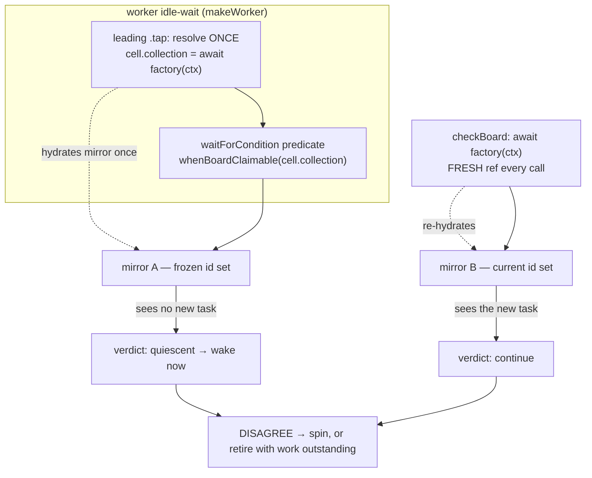
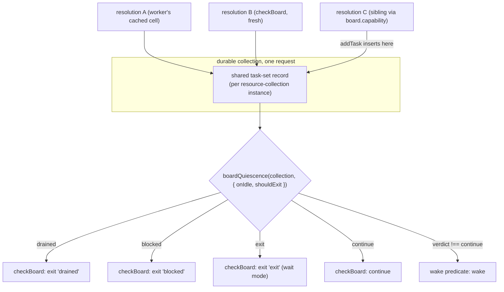

# FIX-990: Task-board wake predicate reads a stale collection ref, so durable boards never wake on a sibling add — Implementation Spec

**Linear:** [FIX-990](https://linear.app/fixpoint-labs/issue/FIX-990/task-board-wake-predicate-reads-a-stale-collection-ref-so-durable)
**Epic:** [FIX-980 — honest-task-substrate](https://github.com/fixpoint-labs/flow-state-dev/pull/983)
**Category:** Bug · **Size:** Medium (multi-file within `packages/orchestration`, one PR)

---

## For reviewers — what this document is

This is a **direction document**, not an implementation. Reviewing it well means
answering one question: **is this the right approach?**

**In scope to challenge:**

- The problem framing — are we solving the right thing?
- The approach — will it work, does it fit the architecture and `docs/philosophy.md`?
- Any numbered **Decision** in §6 — that's the sign-off surface.
- Missing constraints, edge cases, or dependencies that would **invalidate** the design.
- Scope — a deliverable that shouldn't ship, or one that's missing.

**Out of scope — deliberately unsettled here, and owned by the implementing agent:**

- Names, signatures, file paths, and module layout.
- Local structure: which helper, how a function is decomposed, error-message wording.
- Micro-optimizations and style preferences.
- Test names and internal test structure (the *behaviours* to test are in §10; the tests
  themselves are not).
- Anything Part II left open on purpose — it is directional by design, and a gap at
  that altitude is intended, not an omission.

Feedback in the second list is welcome and gets **recorded verbatim in §13** for the
implementer to weigh against real code. It will not be argued with, and it will not be
folded into the design prose — that would pretend the spec can settle something it
can't. Please don't re-raise it: one mention is enough for it to land in §13.

> **Note on §12's settled claims.** Four empirical questions on this issue were settled by
> POC *before* this spec was drafted, including the "hot spin" one the Linear comment
> recorded as PLAUSIBLE-not-confirmed. They are recorded with measurements in §12. Please
> don't reopen them from prose — one of them was **refuted in its strong form** and the
> correction is already folded into the framing.

---

## Part I — The Case *(for the human)*

### 1. Problem — why it matters, why now

**In plain language.** A task board can hand work to several workers at once, and it is
supposed to notice immediately when new work shows up. On a **durable** board — one whose
tasks are saved so they outlive a single request — it doesn't. A worker that goes idle takes
a private snapshot of the task list and then keeps consulting that snapshot instead of the
real one. Work added afterwards by anything other than that same worker is invisible to it.

Two things go wrong as a result, and the second is worse than the one the issue was filed for:

1. **The board is slow to pick up new work.** The event-driven wake-up the pattern advertises
   never fires for this case, so the board falls back to its full polling delay every time.
   Measured at ~500ms against a 500ms timeout, versus ~4–6ms on a non-durable board.
2. **The board can declare itself finished while work is still outstanding.** The check that
   decides "am I done?" and the check that decides "should I wake up?" read *different*
   snapshots, so they can disagree. When they do, the board reports it is out of work,
   retires its workers, and abandons tasks that are still waiting. **Verified, not
   theoretical** — see §12.

**Why now.** Symptom 2 is live on `main` and is the epic's stated objective inverted: a board
reporting an outcome that isn't what happened. The documentation already promises the
behaviour that's broken — `apps/docs/docs/orchestration/task-board.md:380` tells users a
sibling action sharing the board's capability "reads and writes the same durable tasks."
It doesn't. There is no workaround a user can apply from outside the framework, and
[FIX-978](https://github.com/fixpoint-labs/flow-state-dev/pull/990) has already stalled
against this: every promptness guarantee in its spec rests on this predicate.

### 2. Solution in plain terms

The board reads its own state through **two independently-built views**, and classifies that
state with **two independently-written rules**. Each duplication can produce a wrong answer
on its own; today both exist, stacked. So the fix closes both, at the layer that owns them:

- **One view.** Two resolutions of the same durable collection inside one request now share a
  single record of *which tasks exist*. Adding a task through any one of them is immediately
  visible to all of them. This makes the assumption the worker's cache already states — *"same
  collectionId → same ref"* — actually true, rather than deleting the cache and paying a
  re-lookup on every wake.
- **One rule.** The wake test and the exit test become two consumers of a *single* board-state
  classifier. Neither restates the other's logic, so they cannot disagree.

**Why not one or the other.** Fixing only the view leaves two hand-written spellings of one
rule that will drift again — FIX-978's own review caught a decision slipping through exactly
that gap. Fixing only the rule leaves both call sites agreeing on a rule while reading
different data. Neither alone closes "the board declares itself finished with work
outstanding," which is the defect that matters.

**The philosophy this leans on.**

- **Tenet 5 (fix at the owning layer), specifically its second half:** *"the owning layer is
  where the paths converge... an invariant with five writers is not enforced until the guard
  sits where all five pass through."* This bug is that sentence: the invariant is "the board's
  verdict reflects the board's actual state," and it has two writers that never converge. The
  fix creates the convergence point rather than correcting each site.
- **Tenet 3 (earn every addition — subtract as you go):** the change is net-subtractive in the
  predicate layer. Two spellings of the exit condition collapse to one; nothing new is
  configurable.
- **Tenet 1 (coherence):** a code comment asserting an idempotence the code does not have is
  doc/code incoherence. Tenet 1 says resolve it deliberately — here, by making the code match
  the comment.

### 3. Tradeoffs & alternatives

**The simpler approach, and why it is insufficient.** The obvious minimal fix is to drop the
`cell.collection === undefined` guard so the worker re-resolves the collection before each
wait. **It does not fix the reported bug.** The staleness that matters happens *during* a
single wait: the worker enters the wait, a sibling adds a task, and the predicate is
re-evaluated many times against the snapshot it entered with. Re-resolving at wait *entry*
leaves that window wide open, so symptom 1 survives untouched. It would partially mask
symptom 2 while leaving the divergence that causes it in place — which is the definition of
the band-aid this issue was asked not to ship.

**Alternative: make the wait predicate asynchronous** (`waitForCondition` awaits it, so it can
re-resolve on every evaluation). Rejected. It is a change to a core sequencer primitive on
behalf of one caller, it puts an `await` and a full collection re-hydration on a hot path that
was deliberately optimised in the other direction (the `wakeOn` filter exists precisely to
avoid a collection scan per fan-out event), and it introduces overlapping-evaluation
semantics that don't exist today. FIX-978's own settlement work concluded the per-worker
`cell` is the reachable seam and to use it rather than treat it as a wall; this spec agrees.

**Alternative: make the durable collection's sync view fully live** — every read re-queries the
store. Rejected as out of proportion: reads are synchronous by contract, the store query is
async, and the only thing actually stale is *the set of task ids*. Each task's data is already
live (the mirror holds refs whose `.state` is a live getter), so sharing the set is both
sufficient and complete for this bug.

**Where the genuine complexity is.** Not the sharing itself — it's the *scoping* of what gets
shared. Share too widely and two tenants, or two sessions, see each other's tasks. That is the
one place this change could do real harm, and it's why §6 Decision 2 pins the key to the
per-request, per-scope-instance resource registry rather than anything global, and why §10
requires a multi-tenant isolation test rather than treating it as an edge case.

The second genuine complexity is a **coordination conflict, not a technical one**: FIX-978 is
already specced to build the same convergence point. See Decision 5 — this is the decision
most worth your attention.

### 4. Focus practices

1. **Tenet 5's convergence test is the acceptance bar for this change.** After the fix it must
   be *structurally impossible* for the wake test and the exit test to disagree — not merely
   unlikely because both were corrected. If a reviewer can point at two places that both
   decide "is the board done?", the fix is incomplete.
2. **BP-035, the multi-tenant path, is not optional here.** Introducing shared state keyed on
   anything is exactly the change class that leaks across scope instances. Test the isolation
   directly; don't reason about it.
3. **BP-003 — the merged tripwire is corroborating evidence, never primary.** The existing
   characterization test can false-pass (the file says so itself at
   `task-board-resource-wake-stale-ref.test.ts:182-185`). Every deliverable needs a
   mechanism-level assertion that cannot pass for the wrong reason.
4. **BP-030 — tolerate the old shape.** A shared view changes what a resolved ref observes
   mid-request. Anything that reasonably relied on per-ref snapshot semantics (notably the
   creation caps) must be checked, not assumed.
5. **BP-006 — no tracking labels in code or test identifiers.** Issue ids belong in commits,
   changesets, and file-header provenance, not in test names or symbols.

### 5. What using it looks like

This is a bug fix that restores documented behaviour; no public API changes and no new
options. The observable change is what already-valid code *does*. The example below is the
pattern the docs already describe and that silently under-delivers today.

**A sibling adds work to a durable board while the board is draining.** Unchanged user code:

```ts
const board = taskBoard({
  name: "reviewBoard",
  collection: defineTaskCollection({ id: "reviews", scope: "session", stateSchema: reviewSchema }),
  concurrency: 2,
  workers: reviewWorker,
});

// A separate action, sharing the board's capability — the documented sibling pattern.
const enqueue = handler({
  name: "enqueue-review",
  uses: [board.capability],
  execute: async (_input, ctx) => {
    await ctx.cap.reviewBoard.addTask({ goal: "review PR 41", input: { prId: 41 } });
  },
});
```

| | before | after |
|---|---|---|
| idle worker picks the task up in | ~500ms (the full wait timeout) | single-digit ms (the wake fires) |
| board's own verdict while that task is parked for review | may report `drained` / `blocked` and retire its workers | reports `continue` until the task actually settles |

**And the same divergence, reduced to two lines** — this is the mechanism, with no timing in
it. Today the second count is `0`; after the fix both are `1`:

```ts
const refA = await ctx.cap.reviewBoard.tasks();
const refB = await ctx.cap.reviewBoard.tasks();   // second resolution, same collection
await refA.addTask({ id: "t1", goal: "g1", input: { prId: 1 } });
refA.count(); // 1
refB.count(); // 0 today — must be 1 after the fix
```

### 6. Decisions & rules — the sign-off surface

1. **Fix both surfaces in one change, as one root cause.** The wake predicate's stale view and
   the `whenBoardClaimable` / `checkBoard` exit divergence are the same defect — board state
   read through two views and classified by two rules.
   *Alternative rejected:* two independent local patches, or deferring the exit-path
   divergence to a follow-up.
   *Ramification:* the diff spans the predicate layer and the durable-collection layer rather
   than one file. In exchange, the divergence becomes structurally impossible instead of
   currently-corrected.

2. **One view: two resolutions of the same durable collection in one request share the record
   of which tasks exist**, keyed per resource-collection instance (therefore per request and
   per scope instance). Each task's data is already live; only the id set is shared.
   *Alternative rejected:* re-resolving per wait entry (doesn't fix it — §3); an async wait
   predicate (core change for one caller); a fully live sync view (disproportionate).
   *Ramification:* `makeWorker`'s per-worker cache becomes correct rather than being removed,
   and durable boards get *cheaper* (fewer re-hydrations), not more expensive. The sync view
   becomes live for **same-request** resolutions only — a writer in a *different* request is
   still not visible, and that boundary must be documented rather than implied.

3. **One rule: a single board-state classifier is the only definition of the exit question**,
   consumed by both the wake predicate and `checkBoard`. `checkBoard` maps its verdict to a
   `reason`; the wake predicate wakes when the verdict is not "keep going."
   *Alternative rejected:* leaving two mirrored implementations and fixing both.
   *Ramification:* the two `onIdle` arms in `check-board.ts` and the matching arms in
   `predicates.ts` collapse into one place. Adding a future `onIdle` mode, or a new keep-alive
   status, becomes a one-site change — which is also what makes FIX-978 cheaper (Decision 5).

4. **The merged characterization test is inverted, not removed** — `toBeGreaterThan` becomes
   `toBeLessThan` against the CONTROL test's threshold in the same file — and it is treated as
   *corroborating* evidence only. Primary evidence is mechanism-level.
   *Alternative rejected:* deleting, skipping, or loosening it; or accepting it flipping as
   sufficient proof.
   *Ramification:* the suite keeps a real end-to-end latency guard, and its documented
   false-pass mode is covered by assertions that can't false-pass. The file's header and its
   `KNOWN DEFECT` comment are rewritten to describe the fixed behaviour.

5. **FIX-990 creates the shared classifier; FIX-978 extends it.** FIX-978's Decision 8 currently
   specs *extracting* this same convergence point as `boardQuiescence`, bundled with its claim
   ledger — and FIX-978's own spec records that mechanism as blocked on **FIX-989, which the
   owner has placed ON HOLD**. This spec ships the classifier **ledger-free**, so the
   convergence point stops waiting on an on-hold issue.
   *Alternative rejected:* leaving the consolidation to FIX-978 (parks a live correctness fix
   behind an on-hold dependency); or building a second, differently-named helper beside it
   (two convergence points is the bug again).
   *Ramification:* **FIX-978's spec needs an edit it should make itself, not one this spec
   makes for it** — its Decision 8 changes from "extract" to "extend," and its §7 formula and
   §9 diagram reference a helper that already exists. Flagged for the owner in §12, not edited
   here; PR #990 is under review. Naming is deliberately aligned with FIX-978's `boardQuiescence`
   so the extension is additive.

6. **The durable board's creation caps are allowed to become more complete, and this is
   deliberate.** With a shared view, a capped ref's count includes tasks inserted through a
   sibling resolution in the same request.
   *Alternative rejected:* preserving today's per-ref count exactly.
   *Ramification:* caps get *harder* to bypass accidentally, which is the documented intent.
   The enforcement boundary itself is unchanged — an *uncapped* ref still enforces nothing —
   so `task-caps.ts`'s stated boundary stays true and its wording needs a small correction,
   not a rewrite.

**Non-goals.** FIX-978's claim ledger, quorum, freshness-gated `hasClaimableTask`, and
`stranded` verdict; making the durable sync view reflect writes from *other* requests or
processes; changing `onIdle` semantics, adding an `onIdle` mode, or changing any public
`taskBoard` option; FIX-987's per-definition `BoardRunFlowState` keying; anything requiring
FIX-989.

**Size estimate: Medium** — multi-file within `packages/orchestration`, one PR, plus tests,
docs, and a changeset. Single-node build; no PR plan.

---

## Part II — The Build Plan *(for the implementing agent)*

### 7. Technical design

Two layers change. The **substrate layer** (`tasks/collection`) gains a shared per-request
record of a durable collection's task set. The **board's predicate layer**
(`task-board/predicates.ts` + `task-board/blocks/check-board.ts`) collapses two spellings of
the exit question into one classifier.

**Today — two views, two rules:**



**After — one view, one rule:**



**The shared record.** The insight that keeps this small: `createResourceBackedTaskCollection`
already holds refs whose `.state` is a **live getter** — its own header says the mirror "only
tracks the SET of refs, never a frozen snapshot of their data"
(`resource-backed.ts:28-42`). So the *only* stale thing is set membership, and sharing the
`Map` of id → ref between resolutions of the same collection makes every read current,
synchronously, with no new async on any read path.

The key must be the **resource-collection instance**, which is created per execution context
with a `scopeId` (`createExecutionContext.ts:1649-1682`), and which is verified to be a
**stable object across repeated resolutions inside one request** (§12, settled). Keying on it
gives per-request, per-scope-instance sharing and cross-tenant isolation for free, and the
record becomes collectable with the request. A module-level `WeakMap` keyed on that instance
is the obvious shape; the implementer owns whether that or a registry-side slot reads better.

*Illustrative sketch, not the contract* — the classifier's shape, ledger-free so FIX-978 can
add its disjuncts without restructuring:

```ts
// One definition of the exit question. checkBoard maps the verdict to a reason;
// the wake predicate wakes on anything that isn't "continue".
function boardQuiescence(c, { onIdle, shouldExit }) {
  if (onIdle === "wait") return shouldExit?.(c) === true ? "exit" : "continue";
  if (inFlightCount(c) === 0) return "drained";
  if (onIdle === "complete") return "continue";
  return c.count({ status: ["in_progress", "awaiting_review"] }) === 0 && !hasClaimableTask(c)
    ? "blocked"
    : "continue";
}
```

Note this is *not* a mechanical union of today's two functions: today's wake predicate wakes
on `count({in_progress, awaiting_review}) === 0` alone, whereas the exit path additionally
requires `!hasClaimableTask` before declaring `blocked`. That asymmetry is the divergence
itself, and collapsing it is the point — the wake predicate keeps `hasClaimableTask` as a
*promptness* disjunct (wake when work is claimable) while the *exit* question consults it as
part of one verdict.

**Unchanged and load-bearing:** `getOrCreateTaskCollection` still builds a fresh
`TaskCollectionRef` per call — only the task-set record is shared. Cap closures, `onChange`
wiring, and the `getItems` accessor stay per-ref, so the enforcement boundary documented in
`task-caps.ts:73-81` and asserted by `task-board-caps.test.ts` holds.

### 8. Implementation sequence

Bug-fix discipline (`diagnose`): the feedback loop is a **vitest unit test in
`packages/orchestration`** asserting two resolutions agree — fast, mechanism-level, and red
before any fix. Reach for `packages/integration-tests` only for the concurrency-dependent
scenarios in steps 5–6, and `fsdev run` for the flow-level check (§10).

1. **Red, at the mechanism.** Unit test: resolve one durable collection twice in a request,
   add through one, assert both see it. This is the primary regression guard and it must fail
   first. (Verified failing today — §12.)
2. **One view.** Give the durable collection a shared per-instance task-set record and have
   `createResourceBackedTaskCollection` adopt it instead of hydrating a private `Map`.
   Rewrite the `resource-backed.ts` header caveat — it currently documents the bug as an
   accepted tradeoff, and leaving that text in place would re-assert the thing being fixed.
   Verify step 1 goes green.
3. **One rule.** Extract the single board-state classifier; make `predicates.ts` and
   `check-board.ts` consume it. **Remove** both superseded spellings — the `complete` /
   `complete-or-blocked` / `wait` arms duplicated across
   `whenBoardClaimable` (`predicates.ts:46-61`) and `createCheckBoard`
   (`check-board.ts:76-104`). Tenet 3: the old paths go in the same change.
4. **Correct the cache comment at the seam.** `makeWorker`'s justification
   (`task-board/index.ts:694-700`) is the false claim that started this. It becomes true in
   step 2 — restate *why* (the shared record), so the next reader doesn't re-derive it. Keep
   the cache.
5. **Invert the merged tripwire** (`task-board-resource-wake-stale-ref.test.ts:193`) to
   `toBeLessThan` at the CONTROL's threshold (`:217`), and rewrite the file header plus the
   `KNOWN DEFECT` block (`:187-192`) to describe fixed behaviour. Do not delete, skip, or
   loosen.
6. **Add the two behavioural regressions** the old suite has no coverage for: the
   abandonment case and the bounded-iteration case (§10).
7. **Docs, changeset, caps wording** (§11). Re-run the full `packages/orchestration` and
   `packages/integration-tests` suites plus `pnpm typecheck`.

### 9. Edge cases & error handling

| Case | Expected behaviour |
|---|---|
| Two sessions (or users/orgs) with the same `collectionId` | Fully isolated — separate records. The key is the per-scope-instance resource collection, never the `collectionId` string. **Tested, not reasoned about.** |
| Two concurrent drains of one board in one request (`.stepAll([board.drain, board.drain])`) | Share the task-set record (same request, same collection) — correct, and what makes both drains agree. Their *board state* is separate and untouched by this change. |
| Writer in a **different** request / process | Still not visible to an already-resolved ref. Unchanged, now documented explicitly rather than implied. |
| Request-backed / sequencer-backed boards | Untouched — no mirror exists; they already read live state. They remain the control in the tests. |
| A resolved ref's `list()` grows without that caller writing | Now possible by design. Freshness is already the documented contract (`capability.ts:166-173`, `task-board.md:336`), so this aligns code with docs. |
| Creation caps on a durable board | Count becomes more complete (Decision 6). *Enforcement* boundary unchanged — an uncapped ref still enforces nothing. `task-caps.ts:73-81` wording needs a small correction. |
| `awaiting_review` parked task, no worker in flight | Board reports `continue`, workers stay asleep until the task settles. This is the abandonment bug's fix path. |
| Board genuinely drained/blocked | Unchanged verdicts. Regression risk is a board that now *fails to exit*; the existing exit tests plus a `maxIterations` bound guard it. |
| `onIdle: "wait"` with a caller `shouldExit` | `shouldExit` is now called with one consistent view. Today the two call sites can hand it different collections and get different answers — a caller-visible inconsistency this removes. |

**BP-035 second-path walk.** *Legacy:* no persisted shape changes; no stored field added, so
no dual-read needed. *Null boundary:* the record is created on first resolution — the
absent-then-present transition needs the same `== null` care the current mirror gets.
*Concurrent:* two resolutions inserting simultaneously must not lose an entry; per-task CAS
is unchanged and still rides `ResourceRef.updateState`. *Cancel/error:* record lifetime is the
request's; a failed drain must not leave a poisoned record for a retry in the same request.
*Multi-tenant:* the row above, tested. *Cost/observability:* strictly fewer
`collection.list()` calls; no new items or trace fields.

### 10. Testing strategy

**Goal & goal check.** Real path, no mocked collection: a durable board drains while a
sibling action adds a task through `board.capability` mid-drain, and a second scenario parks a
task for review and resumes it late. Pass criteria: the added task is claimed promptly and
the board does not report completion until every task has settled. Run via `fsdev run` per
`AGENTS.md`, reading the NDJSON trace for the board's verdicts — not a unit harness, because
the defect only appears under genuine interleaving.

**CI specs (mocked, deterministic), in observable terms.**

1. **Two resolutions agree (the mechanism backstop).** Add through one resolution of a durable
   collection; both resolutions' `count()`/`list()` include it. *Cannot false-pass — no timing.*
   Currently `refA.count()=1, refB.count()=0`.
2. **Cross-scope isolation.** Two sessions, same `collectionId`; a task added in one is absent
   from the other's view and count.
3. **The board does not abandon outstanding work.** External actor parks a task after every
   worker has taken its snapshot, then resumes it well after the board would otherwise have
   exited. Assert the drain is still alive at resume and the task reaches `completed`.
   *Behavioural, not timing.* Today: durable board leaves it `pending` and ends the drain
   (§12).
4. **Worker loop iterations stay bounded.** In the same scenario, per-worker claim attempts
   stay far below `maxIterations`. Today a worker pins 20/20 at near-zero wall-clock cost.
   Guards the spin directly — `maxIterations` exhaustion is otherwise **silent**
   (`sequencer.ts:1553-1556`), which is why this bug was invisible.
5. **Wake test and exit test never disagree.** Table-driven over board states × `onIdle`
   modes: the wake verdict and `checkBoard`'s verdict are consistent for every row. This is
   the test that encodes *why* the classifier exists (tenet 7) and would fail if a future
   change reintroduced a second spelling.
6. **Existing exit semantics unregressed.** `drained`, `blocked`, `exit`, and the
   `awaiting_review` keep-alive behave as they do today across all three `onIdle` modes.
7. **Caps unregressed.** `task-board-caps.test.ts` passes unchanged; add durable-board
   coverage for Decision 6's more-complete count.
8. **The inverted tripwire** passes with the CONTROL's threshold, and the request-backed
   CONTROL is unchanged. Corroborating only — never cited as sole evidence (BP-003).

### 11. Documentation plan

A docs change **is** required: the fix restores a promise the site already makes, and one page
documents the bug as intended behaviour.

| File | Action | What changes |
|---|---|---|
| `packages/orchestration/src/tasks/collection/resource-backed.ts` | **EXTEND** (header) | The "Caveat: tasks created by *other* blocks after construction will not appear" paragraph (`:39-42`, restated `:133-144`) documents the defect. Replace with the real contract: within one request, resolutions share the task set; across requests they do not. Load-bearing — this text is what the false comment in `makeWorker` was trusting. |
| `packages/orchestration/src/task-board/index.ts` | **EXTEND** (comment) | `makeWorker`'s "the collection factory is idempotent" justification (`:694-700`) restated to cite the shared record. |
| `packages/orchestration/src/tasks/collection/task-caps.ts` | **EXTEND** (header) | `:73-81` enforcement-boundary paragraph: keep the boundary, correct the durable-board counting claim (Decision 6). |
| `apps/docs/docs/orchestration/task-board.md` | **EXTEND** | `:334` currently scopes sibling adds to "*before* `board.drain` runs" — extend to mid-drain, which is now true for durable boards too. `:336`'s "re-hydrates on every call" cost note needs softening (the re-hydration is cheaper now); keep the "grab the ref once" advice, since it's still good practice. `:380`'s sibling promise becomes accurate — add one sentence naming the same-request boundary. |
| `apps/docs/guides/board-lifecycle.md` | **EXTEND** | `:169` makes the same sibling claim; align with the above. |
| `apps/docs/docs/orchestration/task-substrate.md` | **EXTEND** | `:160` backing-comparison table: the durable row should state the same-request freshness boundary so the table doesn't imply request-backing is the only one safe for mid-drain adds. |
| `docs/architecture/resource-collections.md` | **REVIEW** | Confirm nothing there asserts the snapshot semantics being changed; update only if it does. |
| `.changeset/*.md` | **CREATE** | `patch`, `@flow-state-dev/orchestration`. User-facing: durable boards wake promptly on external adds and no longer report completion with work outstanding. |

**No new pages, no sidebar changes** — every affected concept already has a home, and a new
page would fragment the orchestration section for what is a correctness fix to documented
behaviour.

**Voice risks** (`CLAUDE.md` → Writing Style): no issue or PR numbers anywhere under
`apps/docs/` (BP-006); introduce "resolution" in plain terms on first use rather than assuming
the reader knows a collection can be resolved more than once; keep em-dashes sparse; resist
"correctly"/"properly" as filler — state the behaviour.

### 12. Dependencies, open questions & follow-ups

**Blocking: none.** This is buildable on today's `main`. It deliberately depends on **nothing**
from FIX-978, FIX-989 (ON HOLD), or FIX-987.

**Direction affecting another open spec — needs the owner, does not block this build.**
FIX-978's spec (PR #990) Decision 8 specs *extracting* `boardQuiescence`, bundled with its
claim ledger, and its own §12 records that mechanism as blocked on FIX-989. If FIX-990 ships
Decision 3, three parts of FIX-978's spec become stale — Decision 8 ("extract" → "extend"),
its §7 wake formula, and its §9 diagram. Recommended routing: **land FIX-990 first**, then
FIX-978 rewrites those three parts as an extension. That strictly reduces FIX-978's scope and
removes one FIX-989-blocked item from its critical path. Flagged rather than edited — PR #990
is under active review and it should make its own edit. Note the relation FIX-978 already
records ("FIX-990 blocks FIX-978") stays true and gets stronger.

**Settled claims (empirical questions this spec no longer has open).**

- **Settled:** the wake predicate's cached ref cannot see a task added through another
  resolution — **CONFIRMED**: two `TaskCollectionRef`s over one durable collection in one
  request; after `refA.addTask(...)`, `refA.count()=1` and `refB.count()=0`, while a freshly
  resolved `refC.count()=1`. Direct, no timing. (POC run during spec authoring.)
- **Settled:** the "hot spin" recorded on the issue as PLAUSIBLE-and-not-confirmed —
  **CONFIRMED as a mechanism**: with an external actor adding, claiming and parking a task
  after a worker's cell hydrated, that worker burned **20 of 20** `maxIterations` at
  near-zero wall-clock cost and retired silently (`concurrency=2` and `3`, both reproduced).
  `waitForCondition` does an eager synchronous predicate eval on entry
  (`sequencer.ts:2102-2106`), so a stale-true predicate returns instantly and the loop never
  sleeps. (POC run during spec authoring.)
- **Settled:** that the same spin "ends the drain before review resumes" — **REFUTED in its
  strong form, CONFIRMED in a narrower one.** It does *not* follow whenever a task is parked:
  if a board *worker* held the task that kept the board alive, that worker hydrates its cell
  *after* the external add and correctly sleeps, keeping the drain alive — measured, work
  completed normally. It **does** happen when no worker is the keep-alive, so every worker's
  snapshot predates the add: durable board ended its drain at **83ms** while the parked task
  was resumed at **347ms**, final status `pending`, **never processed**; the request-backed
  control in the identical scenario resumed at 320ms, ended at 332ms, status `completed`. So
  the abandonment is real but conditional, and the framing in §1 reflects the narrower claim.
  (POC run during spec authoring.)
- **Settled:** that a shared record can be keyed safely — **CONFIRMED**:
  `resolveResourceCollection(ctx, key)` returns the **same object** on repeated calls in one
  request, and the registry holding it is built per execution context with a `scopeId`
  (`createExecutionContext.ts:1649-1682`), so the key is per-request and per-scope-instance.
  (POC run during spec authoring.)
- **Corroborating, from FIX-978's own settlement:** a predicate/checker disagreement produces
  a spin rather than a cosmetic issue — **CONFIRMED** there independently (30+ `checkBoard`
  traces in under 1s). Different trigger, same failure shape.
  ([POC verdict, PR #990](https://github.com/fixpoint-labs/flow-state-dev/pull/990))

**Open questions:** none blocking. One judgement call is left to the implementer: whether the
shared record lives in a module-level `WeakMap` keyed on the resource-collection instance or in
a slot on the registry side. Both satisfy Decision 2's scoping; pick from what the code reads
better and record why.

**Follow-ups (flagged, not built).**

- **FIX-987** (`BoardRunFlowState` keyed per board *definition*) is the third instance of the
  same root-cause family — state cached at a granularity that doesn't match how it's used.
  FIX-978's spec already names all three. Not in scope here; worth keeping the family visible
  when FIX-987 is specced.
- **Deepening opportunity:** `hasClaimableTask` (`shared.ts:88-94`) previews dispatcher
  eligibility by reimplementing the *default* eligibility rule, so it disagrees with any
  custom dispatcher — a board using an `eventDispatcher` can report claimable work its
  dispatcher will refuse. Independent of this bug and untouched here; FIX-978's §7 reasoning
  runs into the same thing. Route via `improve-codebase-architecture`.
- **`maxIterations` exhaustion is silent** (`sequencer.ts:1553-1556`) — a worker that burns its
  budget retires with no item, no warning, no trace. That silence is why this bug went
  unnoticed. Making it observable is a core-sequencer concern well outside a task-board bug
  fix, but it is a genuine observability gap worth its own issue.

### 13. Review notes for the implementer

*(No spec-PR feedback yet — populated during review.)*

---

## Spec evolution

- **Spec drafted** — framed FIX-990 as one root cause with two symptoms (stale wake view, and
  a wake/exit divergence that lets a board retire with work outstanding) rather than two local
  bugs; chose the foundational fix on both axes — share the durable collection's task set
  per request, and collapse the two exit-condition spellings into one classifier — after
  confirming the obvious minimal fix (re-resolve per wait entry) does not close the reported
  window. Verified all four load-bearing empirical claims by POC before drafting, including
  refuting the strong form of the hot-spin consequence. Resolved the FIX-978 collision by
  having FIX-990 create the convergence point ledger-free so it stops waiting on
  ON-HOLD FIX-989, with FIX-978 extending it.
