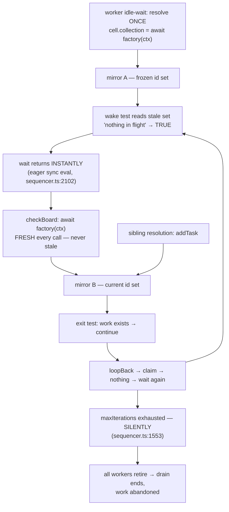
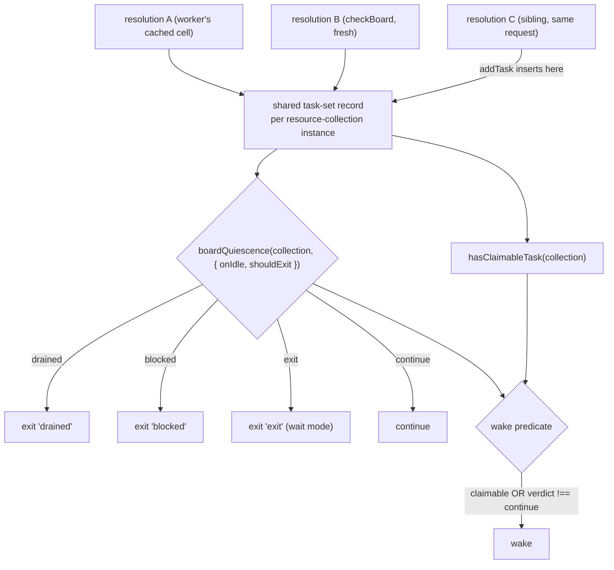

# FIX-990: Task-board wake predicate reads a stale collection ref, so durable boards never wake on a sibling add — Implementation Spec

**Linear:** [FIX-990](https://linear.app/fixpoint-labs/issue/FIX-990/task-board-wake-predicate-reads-a-stale-collection-ref-so-durable)
**Epic:** [FIX-980 — honest-task-substrate](https://github.com/fixpoint-labs/flow-state-dev/pull/983)
**Category:** Bug · **Size:** Medium (multi-file within `packages/orchestration`, one PR)

---

## For reviewers — what this document is

This is a **direction document**, not an implementation. Reviewing it well means
answering one question: **is this the right approach?**

**In scope to challenge:**

- The problem framing — are we solving the right thing?
- The approach — will it work, does it fit the architecture and `docs/philosophy.md`?
- Any numbered **Decision** in §6 — that's the sign-off surface.
- Missing constraints, edge cases, or dependencies that would **invalidate** the design.
- Scope — a deliverable that shouldn't ship, or one that's missing.

**Out of scope — deliberately unsettled here, and owned by the implementing agent:**

- Names, signatures, file paths, and module layout.
- Local structure: which helper, how a function is decomposed, error-message wording.
- Micro-optimizations and style preferences.
- Test names and internal test structure (the *behaviours* to test are in §10; the tests
  themselves are not).
- Anything Part II left open on purpose — it is directional by design, and a gap at
  that altitude is intended, not an omission.

Feedback in the second list is welcome and gets **recorded verbatim in §13** for the
implementer to weigh against real code. It will not be argued with, and it will not be
folded into the design prose — that would pretend the spec can settle something it
can't. Please don't re-raise it: one mention is enough for it to land in §13.

> **§12 carries six settled empirical claims** — four POC-run before drafting, two corrected
> in review. Please don't reopen them from prose: **two were refuted in their strong form**
> and both corrections are already folded into the framing below.

---

## Part I — The Case *(for the human)*

### 1. Problem — why it matters, why now

**In plain language.** A task board hands work to several workers at once and is supposed to
notice immediately when new work appears. On a **durable** board — one whose tasks are saved
so they outlive a single request — it doesn't. A worker that goes idle takes a private
snapshot of *which tasks exist* and then keeps consulting that snapshot. A task added
afterwards through any other route stays invisible to it for as long as it sleeps.

That one stale snapshot produces two failures, and the second is worse than the one this
issue was filed for:

1. **The board is slow to pick up new work.** The event-driven wake-up the pattern advertises
   never fires for this case, so the board falls back to its full polling delay. Measured at
   ~500ms against a 500ms timeout, versus ~4–6ms on a non-durable board.
2. **The board can retire while work is still outstanding.** The stale snapshot makes the
   worker's wake test read "nothing left in flight," so its wait returns *instantly* instead
   of sleeping. The exit check disagrees — correctly — and says keep going, so the worker
   loops, hits its wake test again, and spins. It burns its whole iteration budget in
   milliseconds and then stops looping **silently**, because budget exhaustion emits nothing.
   Once every worker has retired, the drain ends and the outstanding task is abandoned.
   **Verified, measured** — §12.

**One correction worth stating up front,** because the issue's own framing implies otherwise:
the exit check is **never** stale. It re-resolves the collection on every call
(`check-board.ts:73`), so it always reads true state. The damage runs entirely through the
stale *wake* test and the silent budget exhaustion it causes. That shrinks the correctness
story to a single root cause, and it determines what the fix has to be.

**Why now.** Symptom 2 is live on `main` and is the epic's objective inverted: a board
reporting an outcome that isn't what happened. There is no user-side workaround — the
staleness is internal to a worker's wait. And the docs already over-promise:
`apps/docs/docs/orchestration/task-board.md:380` and `guides/board-lifecycle.md:169` tell
users a sibling sharing the board's capability "reads and writes the same durable tasks," with
no hint that a mid-drain add is invisible.

### 2. Solution in plain terms

**Two resolutions of the same durable collection inside one request share a single record of
which tasks exist.** Adding a task through any of them is immediately visible to all of them,
synchronously. That is the whole correctness fix, and it closes both symptoms above.

It works because the staleness is narrower than it looks. The durable collection already holds
task refs whose `.state` is a **live getter** — its own header says the mirror "only tracks the
SET of refs, never a frozen snapshot of their data" (`resource-backed.ts:28-42`). Every task's
*data* is already current; only *set membership* is stale. Share the set and every read is
current, with no new async on any read path. It also makes the assumption the worker's cache
already asserts — *"same collectionId → same ref"* — actually true, instead of deleting the
cache and paying a re-lookup on every wake.

**Shipping alongside it, and labelled honestly: one shared exit rule.** The wake test
(`predicates.ts:39-62`) and the exit test (`check-board.ts:76-104`) are two hand-written
spellings of one question, and they have **already drifted** — the wake test treats "no
in-flight worker" as terminal, while the exit test additionally requires "and nothing is
claimable" before declaring `blocked`. Collapsing them into one classifier both consume is
**behaviour-preserving DRY, not part of the correctness proof.** It earns its place in this PR
on three grounds: it is net-subtractive, it removes a live drift risk in the exact pair of
functions this bug taught us to distrust, and it is the convergence point FIX-978 will need
when it resumes. It is *maintainability*, and this spec does not pretend otherwise.

**The philosophy this leans on.**

- **Tenet 5 (fix at the owning layer).** The stale set belongs to the durable collection, not
  to the board, so fixing it there cures every consumer at once rather than teaching each
  caller to re-resolve. The consolidation is tenet 5's second half — *"the owning layer is
  where the paths converge"* — applied to the exit rule.
- **Tenet 3 (earn every addition — subtract as you go).** Nothing new is configurable, and the
  predicate layer comes out smaller: two spellings become one.
- **Tenet 1 (coherence).** A comment asserting an idempotence the code does not have is
  doc/code incoherence. Resolve it deliberately — here, by making the code match the comment.

### 3. Tradeoffs & alternatives

**The simpler fix, and why it is insufficient.** Drop the `cell.collection === undefined` guard
so the worker re-resolves before each wait (`task-board/index.ts:716-721`). **It does not fix
the reported bug.** The staleness that matters happens *during* a single wait: the worker
enters the wait, a sibling adds a task, and the predicate is re-evaluated many times against
the snapshot it entered with. Re-resolving at wait *entry* leaves that window fully open, so
symptom 1 survives untouched while symptom 2 is only partly masked.

**Alternative: make the wait predicate asynchronous** so it can re-resolve on every evaluation.
Rejected — a change to a core sequencer primitive on behalf of one caller, adding an `await`
and a full re-hydration to a path deliberately optimised the other way (the `wakeOn` filter
exists precisely to avoid a collection scan per fan-out event), plus overlapping-evaluation
semantics that don't exist today.

**Alternative: make the durable sync view fully live**, re-querying the store on every read.
Rejected as disproportionate: reads are synchronous by contract, the store query is async, and
only set membership is stale.

**Where the genuine complexity is.** Two places, neither of them the sharing itself.

1. **Scoping.** Share too widely and two sessions or tenants see each other's tasks. That is
   the one way this change could do real harm, which is why Decision 2 pins the key to the
   per-request, per-scope-instance resource collection and §10 requires an isolation test
   rather than an argument.
2. **The boundary is real and has to be stated, not implied.** This fixes writers **inside one
   request**. A *concurrently running separate action* is a separate request with its own
   execution context and its own collection instance, so an already-waiting drain still won't
   see its write. That isn't laziness: FIX-989 establishes that the durable backing has **no
   cross-process concurrency control at all** — blind puts, `set` documented as "creates or
   overwrites," last-write-wins — so cross-request freshness isn't a feature we're deferring,
   it's undefined at the store layer today (§12).

### 4. Focus practices

1. **BP-035, the multi-tenant path, is not optional here.** Introducing shared state keyed on
   anything is exactly the change class that leaks across scope instances. Test the isolation
   directly; don't reason about it.
2. **BP-003 — the merged tripwire is corroborating evidence, never primary.** That test can
   false-pass, and says so itself (`task-board-resource-wake-stale-ref.test.ts:182-185`). Every
   deliverable needs an assertion that cannot pass for the wrong reason.
3. **Don't let the wake test lose its fast path.** It must still wake on newly claimable work.
   A consolidation that wakes only on a terminal verdict recreates exactly the promptness
   defect this issue fixes — see Decision 3.
4. **Claims stay scoped to what was measured.** Two claims here were refuted in their strong
   form during review (§12). Prefer a narrower true statement to a broader plausible one; the
   epic is named for that.
5. **BP-006 — no tracking labels in code or test identifiers.** Issue ids belong in commits,
   changesets, and file-header provenance, not in test names or symbols.

### 5. What using it looks like

A bug fix restoring documented behaviour: no public API changes, no new options. What changes
is what already-valid code *does*.

**A sibling step adds work while the board drains — same action, same request.** This is the
shape the merged repro test exercises, and the one this fix covers:

```ts
const board = taskBoard({
  name: "reviewBoard",
  collection: defineTaskCollection({ id: "reviews", scope: "session", stateSchema: reviewSchema }),
  concurrency: 2,
  workers: reviewWorker,
});

const enqueue = handler({
  name: "enqueue-review",
  uses: [board.capability],
  execute: async (_input, ctx) => {
    await ctx.cap.reviewBoard.addTask({ goal: "review PR 41", input: { prId: 41 } });
  },
});

// Both run in ONE action, so both resolve the collection in the same request.
sequencer({ name: "review-root", stateSchema: taskBoardStateSchema })
  .stepAll([board.drain, enqueue]);
```

| | before | after |
|---|---|---|
| idle worker picks the task up in | ~500ms (the full wait timeout) | single-digit ms (the wake fires) |
| a task parked for review while no worker holds work | workers spin, burn the iteration budget, drain retires and abandons it | workers sleep; the drain stays alive until the task settles |

**Explicitly still not covered:** a *different, concurrently running* action adding to the same
durable board while this drain waits. That is a separate request and behaves as it does today.
A sibling action running *before* or *after* the drain has always worked and still does — it
resolves fresh and reads the persisted state.

**The mechanism, in two lines, no timing involved.** Today the second count is `0`; after the
fix both are `1`:

```ts
const refA = await ctx.cap.reviewBoard.tasks();
const refB = await ctx.cap.reviewBoard.tasks();   // second resolution, same collection
await refA.addTask({ id: "t1", goal: "g1", input: { prId: 1 } });
refA.count(); // 1
refB.count(); // 0 today — must be 1 after the fix
```

### 6. Decisions & rules — the sign-off surface

1. **One shared view is the correctness fix, and it is sufficient on its own.** Two resolutions
   of the same durable collection in one request share the record of which tasks exist, keyed
   per resource-collection instance (therefore per request, per scope instance). Only the id
   set is shared; each task's data is already live.
   *Alternative rejected:* re-resolving per wait entry (doesn't close the window — §3); an async
   wait predicate (core change for one caller); a fully live sync view (disproportionate).
   *Ramification:* `makeWorker`'s per-worker cache becomes correct rather than removed, and
   durable boards get *cheaper* (fewer re-hydrations). Both symptoms — latency and premature
   retirement — are closed by this alone.

2. **The freshness guarantee is scoped to one request, and the boundary is documented rather
   than implied.** A concurrently running separate action is a separate request and still sees
   nothing; sequential access across requests already works and is unaffected.
   *Alternative rejected:* designing cross-request invalidation.
   *Ramification:* the headline promise is narrower than the docs currently imply, so the docs
   get corrected **down to the truth** (§11) rather than the code stretched to meet them.
   Lifting this would first require cross-process concurrency control in the resource store,
   which does not exist today (FIX-989, §12) — out of scope for a structural reason, not an
   effort one.

3. **One shared exit rule ships in the same PR, labelled as maintainability, not correctness.**
   A single classifier becomes the only definition of the exit question; the exit check maps
   its verdict to a `reason`, and **the wake test wakes on `hasClaimableTask(collection) ||
   verdict !== "continue"`** — the claimable disjunct is retained explicitly.
   *Alternative rejected:* leaving two mirrored implementations (they have already drifted);
   waking only on a non-`continue` verdict (drops the claimable fast path and recreates the
   promptness defect — caught in review, §12); deferring the consolidation to FIX-978 (leaves
   the drift in place while FIX-978 sits in Backlog).
   *Ramification:* behaviour-preserving and net-subtractive. It is **not** part of the
   correctness proof and this spec does not claim it is. A future `onIdle` mode or keep-alive
   status becomes a one-site change.

4. **The merged characterization test is inverted, not removed** — `toBeGreaterThan` becomes
   `toBeLessThan` against the CONTROL test's threshold in the same file — and is treated as
   *corroborating* evidence only.
   *Alternative rejected:* deleting, skipping, or loosening it; or accepting its flip as
   sufficient proof.
   *Ramification:* the suite keeps a real end-to-end latency guard while its documented
   false-pass mode is covered by assertions that can't false-pass. The file header and the
   `KNOWN DEFECT` comment (`:187-192`) are rewritten to describe fixed behaviour.

5. **FIX-978 coordination only — no dependency in either direction.** FIX-978 is in **Backlog
   (on hold)**, and its Decision 8 plans the same convergence point bundled with its claim
   ledger. Shipping the classifier here means FIX-978 *reshapes* rather than *extracts* when it
   resumes.
   *Alternative rejected:* waiting for FIX-978; or building a second, differently-named helper
   beside it.
   *Ramification:* **this is a signature reshape, not a drop-in.** Ours is
   `boardQuiescence(collection, { onIdle, shouldExit })`; FIX-978's is
   `boardQuiescence(collection, ledger)` and adds a `stranded` verdict, so it must thread the
   ledger and widen the verdict union. Flagged in §12 for whoever resumes it, not edited here.

**Non-goals.** FIX-978's claim ledger, quorum, freshness-gated `hasClaimableTask`, and
`stranded` verdict; cross-request or cross-process freshness; any change to `onIdle` semantics
or to any public `taskBoard` option; **creation caps on durable boards — the resource backing
enforces none today and none are added here** (§9); FIX-987's per-definition
`BoardRunFlowState` keying.

**Size estimate: Medium** — multi-file within `packages/orchestration`, one PR, plus tests,
docs, and a changeset. Single-node build; no PR plan.

---

## Part II — The Build Plan *(for the implementing agent)*

### 7. Technical design

Two layers change. The **substrate layer** (`tasks/collection`) gains a shared per-request
record of a durable collection's task set — the correctness fix. The **board's predicate
layer** collapses two spellings of the exit question into one classifier — the DRY change.

**Today — one stale view, and the silent spin it causes:**



**After — one shared view, one shared rule:**



**The shared record.** Key it on the **resource-collection instance** — verified to be a stable
object across repeated resolutions inside one request, and created per execution context with a
`scopeId` (`createExecutionContext.ts:1649-1682`), which buys per-request and per-tenant
isolation for free (§12). A module-level `WeakMap` keyed on that instance is the house pattern
for exactly this: `skills/seeding.ts:24,29` memoizes per `collection` ref that way, and
`skills/internal/delegation-memo.ts:84` does the same with a doc-comment template worth
copying.

*Illustrative sketch, not the contract* — note the wake predicate is **two disjuncts**, and
that the classifier alone would leave a newly claimable task asleep:

```ts
// One definition of the exit question.
function boardQuiescence(c, { onIdle, shouldExit }) {
  if (onIdle === "wait") return shouldExit?.(c) === true ? "exit" : "continue";
  if (inFlightCount(c) === 0) return "drained";
  if (onIdle === "complete") return "continue";
  return c.count({ status: ["in_progress", "awaiting_review"] }) === 0 && !hasClaimableTask(c)
    ? "blocked"
    : "continue";
}

// The wake test keeps its promptness disjunct. Dropping it would leave a worker
// asleep on newly claimable work until timeout — the defect this issue fixes.
const wake = (c) => hasClaimableTask(c) || boardQuiescence(c, opts) !== "continue";
```

**Unchanged and load-bearing:** `getOrCreateTaskCollection` still builds a fresh
`TaskCollectionRef` per call — only the task-set record is shared. `onChange` wiring and the
`getItems` accessor stay per-ref.

### 8. Implementation sequence

Bug-fix discipline (`diagnose`); the feedback loop is a **vitest unit test in
`packages/orchestration`** asserting two resolutions agree — fast and mechanism-level. Reach
for `packages/integration-tests` only for the concurrency-dependent scenarios, and `fsdev run`
for the flow-level check (§10).

1. **Red, at the mechanism.** Two resolutions of one durable collection in a request; add
   through one, assert both see it. Must fail first (verified failing today — §12).
2. **One view.** Give the durable collection a shared per-instance task-set record; have
   `createResourceBackedTaskCollection` adopt it instead of hydrating a private `Map`. Rewrite
   the `resource-backed.ts` header caveat, which currently documents the bug as an accepted
   tradeoff. Verify step 1 goes green, **and that the abandonment regression (§10.3) goes green
   with no predicate-layer change yet** — that is what substantiates Decision 1's "sufficient
   on its own."
3. **One rule.** Extract the classifier; have `predicates.ts` and `check-board.ts` consume it,
   keeping the wake test's `hasClaimableTask` disjunct. **Remove** both superseded spellings
   (`predicates.ts:46-61`, `check-board.ts:76-104`). Expect **no behaviour change** — the
   §10.5/§10.6 tests should pass before and after.
4. **Correct the cache comment** at `task-board/index.ts:694-700` — the false idempotence claim
   that started this. It becomes true in step 2; restate *why* (the shared record). Keep the
   cache.
5. **Invert the merged tripwire** (`:193` → `toBeLessThan` at the CONTROL's threshold, `:217`)
   and rewrite its header and `KNOWN DEFECT` block. Do not delete, skip, or loosen.
6. **Add the two behavioural regressions** §10.3 and §10.4.
7. **Docs and changeset** (§11). Re-run `packages/orchestration` and
   `packages/integration-tests` suites plus `pnpm typecheck`.

### 9. Edge cases & error handling

| Case | Expected behaviour |
|---|---|
| Two sessions / users / orgs, same `collectionId` | Fully isolated — separate records. The key is the per-scope-instance resource collection, never the `collectionId` string. **Tested, not reasoned about.** |
| Concurrent separate action (separate request) writing mid-drain | Still invisible to an already-waiting drain. Unchanged, and now documented (Decision 2). |
| Sequential access across requests | Already correct; unaffected. A fresh resolution reads persisted state. |
| Two concurrent drains of one board in one request | Share the record — correct, and what makes both agree. Their board *state* is separate and untouched. |
| Request-backed / sequencer-backed boards | Untouched; no mirror exists. They remain the control in the tests. |
| A resolved ref's `list()` grows without that caller writing | Now possible by design. Freshness is already the documented contract (`capability.ts:166-173`), so this aligns code with docs. |
| **Creation caps on a durable board** | **No interaction — the resource backing enforces no caps at all.** `ResourceBackingSpec` omits `TaskCapOptions` deliberately, and `get-or-create.ts:47-56` says so: it "builds a different constructor and enforces nothing, so asking for a cap there is a type error." The durable analogue, `defineTaskCollection({ maxInstances })`, is a registry capacity limit counted over live instances, not this record. Nothing to change, nothing to test. |
| `awaiting_review` parked task, no worker in flight | Board reports `continue`, workers sleep until it settles. This is the abandonment fix path. |
| Board genuinely drained / blocked | Unchanged verdicts. The regression risk is a board that now *fails to exit*; existing exit tests plus an iteration-count bound guard it. |
| `onIdle: "wait"` with a caller `shouldExit` | Now called with one consistent view. Today the two call sites can hand it different collections and get different answers — a caller-visible inconsistency this removes. |

**BP-035 second-path walk.** *Legacy:* no persisted shape change; no stored field added, so no
dual-read. *Null boundary:* the record is created on first resolution — the absent-then-present
transition needs the same `== null` care the current mirror gets. *Concurrent:* two resolutions
inserting simultaneously must not lose an entry; per-task CAS is unchanged. *Cancel/error:*
record lifetime is the request's; a failed drain must not leave a poisoned record for a retry
in the same request. *Multi-tenant:* the first row, tested. *Cost/observability:* strictly fewer
`collection.list()` calls; no new items or trace fields.

### 10. Testing strategy

**Goal & goal check.** Real path, no mocked collection: a durable board drains while a sibling
**step in the same action** adds a task through `board.capability`, and a second scenario parks
a task for review and resumes it late. Pass criteria: the added task is claimed promptly, and
the board does not report completion until every task has settled. Run via `fsdev run` per
`AGENTS.md`, reading the NDJSON trace for the board's verdicts — the defect only appears under
genuine interleaving.

**CI specs (mocked, deterministic), in observable terms.**

1. **Two resolutions agree (the mechanism backstop).** Add through one resolution of a durable
   collection; both include it. *No timing.* Currently `refA.count()=1, refB.count()=0`.
2. **Cross-scope isolation.** Two sessions, same `collectionId`; a task added in one is absent
   from the other's view and count.
3. **The board does not abandon outstanding work.** External actor parks a task after every
   worker has taken its snapshot, then resumes it well after the board would otherwise have
   exited. Assert the drain is still alive at resume and the task reaches `completed`.
   *Behavioural, not timing.* **Must pass after step 2 alone** (Decision 1).
4. **Worker loop iterations stay bounded.** Same scenario: per-worker claim attempts stay far
   below `maxIterations`. Today a worker pins 20/20 at near-zero wall-clock cost. Guards the
   spin directly, since budget exhaustion is otherwise silent (`sequencer.ts:1553-1556`).
5. **A newly claimable task still wakes a sleeping worker promptly**, in every `onIdle` mode.
   The regression guard for the fast path Decision 3 retains — it fails if the wake test is
   reduced to the classifier's verdict.
6. **Wake test and exit test agree**, table-driven over board states × `onIdle` modes. Encodes
   *why* the classifier exists and fails if a second spelling reappears. Should pass before and
   after step 3 — a DRY guard, not a bug guard.
7. **Existing exit semantics unregressed:** `drained`, `blocked`, `exit`, and the
   `awaiting_review` keep-alive across all three `onIdle` modes.
8. **The inverted tripwire** passes at the CONTROL's threshold, with the request-backed CONTROL
   unchanged. Corroborating only — never sole evidence (BP-003).

### 11. Documentation plan

Docs changes **are** required: the fix restores part of a promise the site makes, narrows
another part, and one code header documents the bug as intended behaviour.

| File | Action | What changes |
|---|---|---|
| `packages/orchestration/src/tasks/collection/resource-backed.ts` | **EXTEND** (header) | The "tasks created by *other* blocks after construction will not appear" caveat (`:39-42`, restated `:133-144`) documents the defect. Replace with the real contract: within one request, resolutions share the task set; across requests they do not. Load-bearing — this is the text the false comment in `makeWorker` was trusting. |
| `packages/orchestration/src/task-board/index.ts` | **EXTEND** (comment) | `makeWorker`'s "the collection factory is idempotent" justification (`:694-700`) restated to cite the shared record. |
| `apps/docs/docs/orchestration/task-board.md` | **EXTEND** | `:334` scopes sibling adds to "*before* `board.drain` runs" — extend to mid-drain for same-request siblings. `:336`'s "re-hydrates on every call" cost note softens (re-hydration is cheaper now); keep the "grab the ref once" advice. `:380`'s sibling promise becomes accurate **and narrower** — one sentence naming the same-request boundary. |
| `apps/docs/guides/board-lifecycle.md` | **EXTEND** | `:169` makes the same sibling claim; align with the above. |
| `apps/docs/docs/orchestration/task-substrate.md` | **EXTEND** | `:160`'s backing-comparison table should state the same-request freshness boundary, so it doesn't imply request-backing is the only one safe for mid-drain adds. Coordinate with FIX-989, which also edits this page (§12). |
| `docs/architecture/resource-collections.md` | **REVIEW** | Confirm nothing asserts the snapshot semantics being changed; update only if it does. |
| `.changeset/*.md` | **CREATE** | `patch`, `@flow-state-dev/orchestration`. Durable boards wake promptly on same-request adds and no longer retire with work outstanding. |

**Not changing `task-caps.ts`.** An earlier draft planned a correction there. Verified
unnecessary: `:52-65` already states "**Resource-backed** — neither cap is enforced" and
correctly attributes `maxInstances` to the registry's live instance count. The header is
accurate; editing it would be churn.

**No new pages, no sidebar changes** — every affected concept has a home, and a correctness fix
to documented behaviour shouldn't fragment the orchestration section.

**Voice risks** (`CLAUDE.md` → Writing Style): no issue or PR numbers under `apps/docs/`
(BP-006); introduce "resolution" in plain terms on first use; keep em-dashes sparse; resist
"correctly"/"properly" as filler.

### 12. Dependencies, open questions & follow-ups

**Blocking: none.** Buildable on today's `main`, and deliberately independent of FIX-978
(Backlog / on hold), FIX-989, and FIX-987.

**FIX-989 (PR #1005, In Spec Review) — no collision, and it corroborates Decision 2.** It adds
a per-task revision and write log stamped inside the atomic write. That answers *"has **this**
task changed?"*; FIX-990 answers *"does a task I have never seen exist?"* A per-task revision
cannot answer the latter — you cannot ask for the revision of a task whose id you don't hold —
so the mechanisms are complementary, not overlapping. Two contact points: (a) its Decision 3
establishes the durable backing has **no cross-process concurrency control at all**, which is
the structural reason Decision 2's boundary sits where it does; (b) both edit
`resource-backed.ts` (its stamping inside `transitionRef`, ours in mirror construction) and
both edit `task-substrate.md`. Different regions, low conflict risk — worth a rebase check, not
a dependency.

**FIX-978 — coordination note for whoever resumes it.** In Backlog / on hold, so nothing here
waits on it and nothing here unblocks a live path. Its Decision 8 plans to *extract*
`boardQuiescence`; after this ships it *reshapes* one instead. **Not a drop-in:** ours is
`boardQuiescence(collection, { onIdle, shouldExit })`, theirs is
`boardQuiescence(collection, ledger)` plus a `stranded` verdict, so it must thread the ledger
and widen the verdict union. Its §7 formula and §9 diagram need the same edit. Flagged, not
edited — that spec should make its own change.

**Settled claims (empirical questions this spec no longer has open).**

- **Settled:** the wake predicate's cached ref cannot see a task added through another
  resolution — **CONFIRMED**: after `refA.addTask(...)`, `refA.count()=1` and `refB.count()=0`,
  while a freshly resolved `refC.count()=1`. No timing. (POC, spec authoring.)
- **Settled:** the "hot spin" the issue recorded as PLAUSIBLE — **CONFIRMED as a mechanism**: a
  worker whose snapshot predated an external add+park burned **20 of 20** `maxIterations` at
  near-zero wall-clock cost and retired silently (reproduced at concurrency 2 and 3).
  `waitForCondition` evaluates its predicate eagerly on entry (`sequencer.ts:2102-2106`), so a
  stale-true predicate never sleeps. (POC, spec authoring.)
- **Settled:** that the spin "ends the drain before review resumes" — **REFUTED in the strong
  form, CONFIRMED narrowly.** It does not follow whenever a task is parked: if a board *worker*
  held the keep-alive task, that worker re-snapshots after the add and correctly sleeps, and
  work completes normally. It **does** happen when no worker is the keep-alive: durable board
  ended its drain at **83ms** while the parked task was resumed at **347ms**, final status
  `pending`, never processed; the request-backed control resumed at 320ms, ended at 332ms,
  status `completed`. (POC, spec authoring.)
- **Settled:** the shared record can be keyed safely — **CONFIRMED**:
  `resolveResourceCollection(ctx, key)` returns the **same object** on repeated calls in one
  request, and its registry is built per execution context with a `scopeId`
  (`createExecutionContext.ts:1649-1682`). (POC, spec authoring.)
- **Settled (review round 1):** that *both* axes are needed for correctness — **REFUTED.**
  Abandonment routes only through the worker loop retiring on silent `maxIterations`
  exhaustion; the exit check re-resolves fresh on every call (`check-board.ts:73`) and is never
  stale, and the wake test cannot itself end a drain. So **one shared view closes both
  symptoms**, and the shared exit rule is behaviour-preserving DRY. §1, §2 and Decisions 1/3
  were rewritten to say so.
  (Cursor, [PR #1006](https://github.com/fixpoint-labs/flow-state-dev/pull/1006))
- **Settled (review round 1):** that durable boards have creation caps this change would affect
  — **REFUTED.** `ResourceBackingSpec` omits `TaskCapOptions` by design and
  `get-or-create.ts:47-56` states the resource backing "enforces nothing." The decision and its
  planned test were removed rather than reworded.
  (Codex + Cursor, [PR #1006](https://github.com/fixpoint-labs/flow-state-dev/pull/1006))
- **Corroborating, from FIX-978's own settlement:** a predicate/checker disagreement produces a
  spin rather than a cosmetic issue — **CONFIRMED** there independently (30+ `checkBoard` traces
  in under 1s). Different trigger, same failure shape.
  ([PR #990](https://github.com/fixpoint-labs/flow-state-dev/pull/990))

**Open questions:** none. *(Where the shared record lives was previously open; house precedent
settles it — `skills/seeding.ts:24,29` and `skills/internal/delegation-memo.ts:84` both key a
`WeakMap` on the collection ref for per-request memoization.)*

**Follow-ups (flagged, not built).**

- **Cross-request freshness for durable boards** — would require cross-process concurrency
  control in `ResourceStateStore`, which FIX-989 §12 already files with its shape. Deliberately
  not attempted here.
- **FIX-987** (`BoardRunFlowState` keyed per board *definition*) is the third instance of the
  same family: state cached at a granularity that doesn't match how it is used. Worth keeping
  the family visible when FIX-987 is specced.
- **Deepening opportunity:** `hasClaimableTask` (`shared.ts:88-94`) previews dispatcher
  eligibility by reimplementing the *default* rule, so it disagrees with any custom dispatcher —
  a board using an `eventDispatcher` can report claimable work its dispatcher will refuse.
  Independent of this bug and untouched. Route via `improve-codebase-architecture`.
- **`maxIterations` exhaustion is silent** (`sequencer.ts:1553-1556`) — a worker that burns its
  budget retires with no item, no warning, no trace. That silence is why this bug went unnoticed
  and why §10.4 exists. Making it observable is a core-sequencer concern outside a task-board
  bug fix, but it is a real observability gap worth its own issue.

### 13. Review notes for the implementer

Below-the-bar spec-PR feedback, **recorded verbatim, not folded into the design.** These are
*inputs, not instructions* — weigh each against real code; adopt, adapt, or discard, and you
owe no justification for discarding one.

- "Don't evaluate `hasClaimableTask` twice per wake evaluation in `complete-or-blocked` mode."
  — via coordinator ([PR #1006](https://github.com/fixpoint-labs/flow-state-dev/pull/1006))

---

## Spec evolution

- **Spec drafted** — framed FIX-990 as one root cause with two symptoms (stale wake view, and a
  wake/exit divergence that lets a board retire with work outstanding); chose the foundational
  fix on both axes after confirming the minimal fix (re-resolve per wait entry) does not close
  the reported window. Verified four load-bearing empirical claims by POC, including refuting
  the strong form of the hot-spin consequence.
- **After spec review** — **narrowed the headline to same-request siblings**, because a separate
  action is a separate request and the shared record cannot reach it, so the advertised
  cross-action behaviour would not have worked. **Reframed the second axis as maintainability,
  not correctness**, because abandonment routes solely through the stale wake view and silent
  budget exhaustion — the exit check is never stale, so one shared view is sufficient.
  **Restored the wake test's `hasClaimableTask` disjunct**, which the illustrative classifier
  had dropped, recreating the promptness defect. **Removed the durable-caps decision and its
  test** as a verified non-path, along with a planned `task-caps.ts` edit whose target text is
  already accurate. Closed the storage open question on house precedent and trimmed repeated
  boundary and coordination prose.
