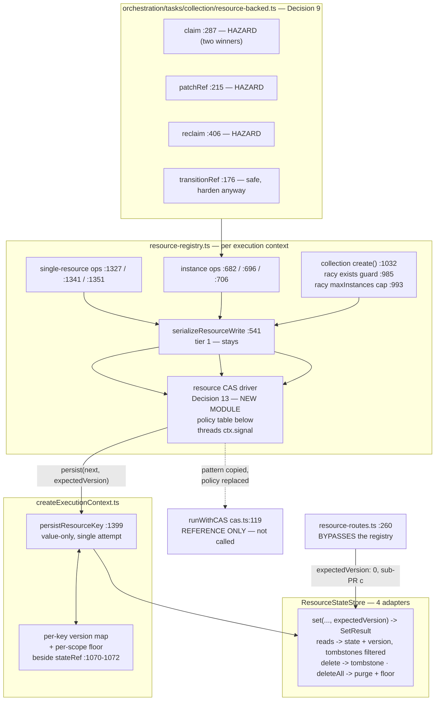

# FIX-992: `ResourceStateStore` was built as `ContentStore`'s LWW twin, and that model is wrong for task state — Implementation Spec

> **Linear issue:** [FIX-992](https://linear.app/fixpoint-labs/issue/FIX-992/resourcestatestoreset-has-no-expectedversion-the-fix-400-cas-contract) · **Epic:** [FIX-980](https://linear.app/fixpoint-labs/issue/FIX-980/epic-honest-task-substrate-every-write-path-reports-what-it-actually) — Honest task substrate

## Spec evolution *(the change story, not an audit log)*

- **Spec drafted** — Framed as an unfinished refactor, scoped as copying `ExpectedVersion` / `SetResult` onto the sibling store across four adapters, with CAS placed at `persistResourceKey`. Large / 3 sub-PRs.
- **Framing corrected before review, and the issue has since been retitled to match.** `FIX-400` appears nowhere in `stores/types.ts`; the store's header calls itself *"the state-layer twin of `ContentStore` (FIX-689)"* (`:537`) with *"plain per-key last-write-wins (no CAS), matching `ContentStore`"* (`:542`). **The wrong model was deliberately chosen, not a contract dropped.** Separately verified: FIX-492 did **not** remove the CAS retry loop (Decision 6).
- **Replay hazard pulled into scope** (Decision 9) — retrying re-runs the caller's updater, and three resource-backed updaters keep a result from a previous attempt; `claim`'s case makes two workers both believe they won.
- **After spec review (round 1) — CAS moved off `persistResourceKey`, and the version's meaning pinned.** `persistResourceKey` is value-only (`resource-registry.ts:473`) and the write ops materialize the next object before calling it, so a retry there would **clobber a concurrent writer's field** — the merge this spec claims. Moved to the registry's read/mutate seam (Decision 10). The version was underspecified, producing an ABA hole and a legacy-row collision (Decision 11). Also folded: the create route's content-before-state ordering (Decision 12), and two writers the audit had missed.
- **After spec review (round 2) — the "reuse `runWithCAS`" cost argument was wrong, and it is corrected rather than defended.** Four of five findings converge on one root: `runWithCAS`'s **conflict-resolution policy is wrong for this store**, and no amount of call-site patching fixes that. It falls back to the container's stale state when the store reports no current value (`cas.ts:158-159`), which with a tombstone present **resurrects a deleted resource**; it retries create-if-absent writes that must fail instead; and it threads no `AbortSignal`, so an aborted action can persist after cancellation. **Resource state gets its own CAS driver** (Decision 13) — the types, the container and the store idiom stay shared, the retry *policy* does not. The honest cost is in §2 and §3: this was cheap as a store change and is not cheap as a whole. Decision 11 also simplified — `expectedVersion: 0` now means **"no live row"**, dissolving the rollback-versus-tombstone contradiction round 2 found between Decisions 11 and 12. And **the fifth finding refuted a scope claim of mine**: `deleteAll` does *not* lack a surviving observer, because session deletion never quiesces in-flight executions (`session-routes.ts:183-188`) and session ids are **caller-supplied and reusable** (`:104`). Fixed with a per-scope version floor (Decision 14). **That is the fourth spec in this epic to have its own "safe/unaffected" claim refuted** — §12 now carries the check as a standing list rather than a habit.
- **Design budget spent.** Round 2 of 2 is the convergence point. Remaining review lands in §13 as implementer notes.

---

## For reviewers — what this document is

This is a **direction document**, not an implementation. Reviewing it well means answering one question: **is this the right approach?**

**In scope to challenge:**

- The problem framing — are we solving the right thing?
- The approach — will it work, does it fit the architecture and `docs/philosophy.md`?
- Any numbered **Decision** in §6 — that's the sign-off surface.
- Missing constraints, edge cases, or dependencies that would **invalidate** the design.
- Scope — a deliverable that shouldn't ship, or one that's missing.

**Out of scope — deliberately unsettled here, and owned by the implementing agent:**

- Names, signatures, file paths, and module layout.
- Local structure: which helper, how a function is decomposed, error-message wording.
- Micro-optimizations and style preferences.
- Test names and internal test structure (the *behaviours* to test are in §10; the tests themselves are not).
- Anything Part II left open on purpose — it is directional by design, and a gap at that altitude is intended, not an omission.

**The two-round design budget is spent** (both rounds produced spec-level change, recorded above). Further feedback is recorded verbatim in §13 for the implementer rather than folded into the design. Please don't re-raise a §13 note; one mention is enough for it to land.

**One request specific to this spec.** **§7's writer table and driver-policy table are the completeness surfaces.** Round 1's writer table had seven rows and was missing two; round 2 found four conflict cases the shared retry driver handles wrongly. Both are now enumerated. A tenth writer, or a fifth mishandled conflict case, is the most useful thing a reviewer could still report — and it goes to §13 now, not into the design.

---

## Part I — The Case *(for the human)*

### 1. Problem — why it matters, why now

**In plain language.** When two pieces of work running at the same time both update the same stored item, one of them silently disappears. Each reads the item, each makes its change, each saves — and whoever saves second wins, overwriting the first without any error. The framework already prevents this for session, request, user and org data. The store that holds *resource* data doesn't, because it was modelled on a different store where the machinery isn't needed.

**Why now.** Two things. First, it is a live data-loss path, not a theoretical one: the write serialization that looks like it protects these writes is built per execution context, so two concurrent requests in a single Node process are not serialized against each other at all. Second, it now blocks work. [FIX-989](https://linear.app/fixpoint-labs/issue/FIX-989) needs to tell a caller whether its own write landed; it cannot answer that soundly on the durable backing while an overwrite can silently erase the evidence. FIX-989's spec wrote that fork up as its own blocking open question — degrade the answer, or fix the store — and **the owner chose to fix the store.** This issue is that decision.

No workaround covers it. The one that looks like it does is the per-context write queue, and §3 explains why it can't.

### 2. Solution in plain terms

**The accurate framing, which the issue's title now carries.** `ResourceStateStore`'s header describes itself as *"the state-layer twin of `ContentStore` (FIX-689)"* (`stores/types.ts:537`) and states its concurrency posture as a decision: *"plain per-key last-write-wins (no CAS), matching `ContentStore`"* (`:542`). `FIX-400` appears nowhere in the file. Nothing was dropped by a refactor. **A model was chosen — the content store's — and it was the wrong one for what this store ended up holding.**

Last-write-wins is *correct* for content: nothing merges a document body against a prior read, so a later write legitimately wins. It is *wrong* for structured state that concurrent workers read-modify-write, which is what resource state became when it started backing task boards. **One store is serving two access patterns with one concurrency model.**

**The fix.** Give resource state a versioned-write contract, put the retry where the caller's intent still exists, and give it a conflict policy that fits a store with deletions and create-if-absent writes.

Every stored row carries a version. A reader gets the version with the state. A writer says "write this, only if the version is still what I read", and on a mismatch gets the current state and version back so it can **re-run its own change against the truth** — a merge, not a blind overwrite.

**And here is the cost correction, because this spec twice inherited an optimism it should have checked.** The first draft argued this was cheap because "it invents nothing" — the contract, the conflict shape, and the retry driver all already exist. The types and the shape do transfer:

- `ExpectedVersion` (`:166`) and `SetResult` (`:174-179`) are live exported types, used verbatim.
- `StateContainer` (`core/src/types/state.ts:15-24`) is the right per-key cache abstraction, used verbatim.
- The store-level CAS statement idiom transfers directly (`sqlite-store.ts:179-228`, `pg-store.ts:225-260`).
- The two-tier dispatch — serialize in front, CAS at the durable boundary — is the established shape (Decision 6).

**The retry driver does not transfer, and claiming it did was wrong.** `runWithCAS` encodes a conflict *policy* built for records that are created once and never tombstoned: on a conflict reporting no current value it falls back to the container's stale cached state (`cas.ts:158-159`) and retries, it retries every conflict including ones that must be terminal, and it carries no cancellation. Each of those is correct for scope records and wrong here. So resource state gets its own driver (Decision 13), and the accurate cost is: **a store-contract change that is genuinely cheap, plus a new concurrency-policy module that is not, plus the filesystem factory split that was already the largest mechanical item.** Round 2 established that, and the spec says so rather than inheriting the earlier framing.

**The philosophy that led here.**

- **Tenet 1 (coherence over local cleverness).** Still the governing tenet, with a sharper reading than the first draft's. Coherence means matching the established *shape* — versioned writes, a container, two-tier dispatch, the store idiom — not force-fitting a shared *implementation* whose semantics differ. Round 1 caught the draft deviating from the shape (CAS at a value-only persister); round 2 caught it over-conforming to an implementation (a driver whose policy is wrong). Both are the same tenet.
- **Tenet 5 (fix at the owning layer, and find where paths converge).** §7 names the convergence point, all nine writers, the two that bypass it, and one invariant (the instance cap) that per-key CAS honestly cannot close.
- **Tenet 3 (earn every addition).** Two genuine additions — a delete tombstone and a per-scope version floor — each justified by a specific named failure it prevents (Decisions 11, 14), not by symmetry.

### 3. Tradeoffs & alternatives

**The alternative the owner rejected: degrade the read.** FIX-989 could have avoided this work by never returning a definitive "your write did not land" on the resource backing. That was option (a) in its OQ-1, and its own spec recommended it on tenet-3 grounds. **The owner rejected it**, and the reason is the stronger argument: the epic's objective is an honest substrate, and (a) leaves the *durable* backing least able to answer the question the epic is about. It also fixes nothing else, where this fixes the lost update itself.

**The simpler approach considered, and why it is insufficient.** "We already serialize resource writes — just widen it." `serializeResourceWrite` chains writes per storage key (`resource-registry.ts:530-546`) and looks sufficient. It is not, and structurally so: `resourceWriteChains` is a `const` **inside** `createScopeResourceRegistry` (`:540`), registries are per execution context (`createExecutionContext.ts:1649`, `:1664`, `:1682`), the state caches are per-context locals (`:1070-1072`), and `persistResourceKey` blind-`set`s then updates **only its own** cache (`:1399-1405`). Two contexts both read revision N and the second overwrites the first. Widening the queue to process scope would mean a process-global lock on every resource write — a bigger behavioural change than CAS, and still wrong across processes.

**Rejected in round 1: conflict *detection* without merge.** Keeping CAS at the value-only persister is much less code. It detects conflicts reliably — and resolves every one by overwriting the competing field, since the retry re-writes a value computed from stale state. That is the error surface without the correctness, and worse than either alternative because callers would believe conflicts were handled.

**Rejected in round 2: extend `runWithCAS` for everyone instead of writing a resource driver.** Genuinely defensible, and it would fix the cancellation gap for scope state too. Rejected because the other three things it would need — an absent-state policy, terminal (non-retryable) conflicts, and tombstone awareness — are semantics **only** resource state has. Pushing them into the shared driver would put four scope stores' conflict handling behind flags they never set, to serve one caller. The narrow slice that *is* genuinely shared — cancellation — is filed as its own fix for `runWithCAS` (§12), because an aborted action persisting scope state after cancellation is a real bug today, independent of this issue.

**Rejected in round 2: a per-scope monotonic version sequence instead of per-key counters plus tombstones.** Elegant on paper — one counter per scope makes delete-and-recreate monotonic for free, with no tombstones and no read filtering, and it would close the scope-altitude ABA (Decision 14) with the same mechanism. Rejected on the hot path: every write in a scope would contend on one counter row, and the workload this exists to serve is a task board with concurrent workers hammering one scope. Trading per-key contention for per-scope contention would undo the benefit. Per-key versions keep the hot path uncontended; the floor row is touched only on scope deletion.

**Where the genuine complexity is.** Not the CAS statements. In order:

1. **The resource CAS driver's policy (Decision 13).** Four conflict cases the shared driver gets wrong, each with a specific failure. This is now the heart of the change.
2. **The replay hazard (Decision 9).** Retrying re-runs the caller's updater; three resource-backed updaters emit stale outcomes, including two workers both believing they claimed one task. The only part that makes correct code wrong.
3. **Version identity across deletion, at two altitudes (Decisions 11, 14).** Per-key tombstones, plus a per-scope floor because scope deletion doesn't quiesce observers and session ids are reusable.
4. **The filesystem adapter, which the issue originally estimated as the cheapest.** Its 27 lines delegate to a **484-line factory shared with `ContentStore`** (`KeyedResourceStore<T>` at `filesystem-resource-store.ts:61-72`, consumed by `content-store.ts:17` and `resource-state-store.ts:20`). Since content keeps LWW the shapes **diverge for the first time**, and that factory plus the shared conformance runner (`resource-store-conformance.ts:180-207`) both assume they match. No atomic CAS primitive either: `set` is temp-write-then-`rename` (`:376-388`).
5. **The read shape.** The engine hydrates most resource state through the *bulk* readers, so the version must come back from all three reads or the fix is inert for eagerly-declared resources — the default.

### 4. Focus practices (1–5)

- **Reuse shapes, not policies (tenet 1).** A shared helper transfers only if its *decisions* transfer. `runWithCAS`'s retry policy assumes records that are never tombstoned and writes that are always retryable; both are false here. This is the round-2 lesson and the one most likely to generalize.
- **Put the retry where the intent lives (tenet 1/5).** A retry over a materialized value can only overwrite, never merge. The round-1 lesson.
- **Reset captured state on every closure invocation.** Corollary: any closure a retry may replay must treat each invocation as the first. `sequencer-backed.ts` is the reference (`:209`, `:237`, `:314`, rule at `:435`).
- **Check the shared state before writing "unaffected" or "safe".** §12 carries this as a standing check with a concrete list, because this spec asserted `deleteAll` had "no surviving observer" and was wrong — the fourth such refutation in this epic.
- **BP-030 / BP-035 — the old shape and the second path.** Legacy rows must not read as *absent*; and the conflict, replay, delete-recreate, cancellation and scope-recreation paths all need explicit behaviour.

### 5. What using it looks like

The public flow-authoring API does not change: nobody writes `expectedVersion` in flow code. These are the **framework-internal** surfaces adapter authors and engine code write against.

**Before / after — the store contract.**

```ts
// before: a blind put, no way to detect a lost update
await stores.resourceState.set("session", sessionId, "tasks/t1", nextState);

// after: write only if nobody moved it since we read
const read = await stores.resourceState.get("session", sessionId, "tasks/t1");
//    read is now { state, version } | undefined  (was: JsonObject | undefined)
const result = await stores.resourceState.set(
  "session", sessionId, "tasks/t1", nextState, read?.version ?? 0
);
if (!result.ok) {
  // result.conflict.currentValue / .currentVersion — re-apply against the truth
}
```

**Opting out is explicit, not implicit:**

```ts
await stores.resourceState.set("session", sessionId, key, value, "any"); // deliberate LWW
```

**What changes for a flow author: nothing they write, and one thing that stops being wrong.** Two contexts patching *different fields* of one resource today lose one field; after this they merge, because the losing writer re-runs its patch against the winner's state:

```ts
// unchanged flow code, in two concurrent execution contexts
await ctx.sessionResources.task.patchState({ claimedBy: "worker-a" });  // context 1
await ctx.sessionResources.task.patchState({ note: "in progress" });    // context 2
// before: one of the two fields is silently gone
// after:  both present
```

**Two behaviours callers must now expect** — both cases where the old code silently did the wrong thing:

```ts
// 1. Patching a resource another context deleted no longer resurrects it.
await ctx.sessionResources.task.patchState({ note: "x" });
//    -> rejects (the resource is gone); it does NOT recreate it from a stale read

// 2. Creating something that already exists fails, and does not retry into an overwrite.
await ctx.sessionResources.tasks.create("t1");
//    -> rejects if a live "t1" exists, whether it was there before or won a race
```

**The one rule updater authors must follow.** An updater may run more than once, so anything it captures must be reset each time:

```ts
// BEFORE — correct today, wrong once the write retries:
let claimed: Task | undefined;
await ref.updateState((current) => {
  if (!eligible(current)) return current;   // replay lands here after losing the race…
  claimed = next;                            // …but `claimed` still holds attempt 1's task
  return next;
});
if (claimed) emit("claimed", claimed);       // two workers both think they won

// AFTER — reset on entry, as the sequencer backing already does:
await ref.updateState((current) => {
  claimed = undefined;                       // every invocation is the first
  if (!eligible(current)) return current;
  claimed = next;
  return next;
});
```

### 6. Decisions & rules — the sign-off surface

Fourteen. **10–12 came from round-1 review, 13–14 from round 2**, and 11 was revised by round 2. Those five are where the design actually settled.

1. **Reuse `ExpectedVersion` and `SetResult<JsonObject>` as types; do not spell the contract a second time.** *Rejected:* a resource-specific conflict type, or a `compareAndSet` taking an expected *state*. *Ramification:* the store reads as a sibling. Two *semantics* diverge deliberately and are documented rather than left implicit — `expectedVersion: 0` means "no live row" rather than "no row ever" (Decision 11), and some conflicts are terminal rather than retryable (Decision 13). The types are shared; the policy is not.

2. **Widen the existing six methods; no parallel versioned trio, and `expectedVersion` is required.** *Rejected:* 12 methods, or an optional parameter. *Ramification:* a **breaking change to an internal store interface** — ~10 read call sites and every adapter in lockstep — deliberately, because an optional parameter lets a *new* caller silently get last-write-wins, the exact failure being fixed. Required makes the compiler enumerate every caller. Not published API; no external consumer breaks.

3. **`ContentStore` keeps last-write-wins and the two stores diverge — because LWW is right for content, not because content is out of budget.** *Rejected:* versioning both for symmetry. *Ramification:* the generic `KeyedResourceStore<T>` factory and the generic conformance runner each grow a version-aware variant or split. This is what resolves "one store, two access patterns": we split the *model*, not the store.

4. **Per-adapter guarantee, stated honestly: real CAS on memory / SQLite / Postgres, same-process-only on filesystem.** *Rejected:* an atomic filesystem CAS via `link()`/`EEXIST`, and equally, no filesystem CAS at all. *Ramification:* a per-key mutex on the store **instance** plus compare-under-lock closes the defect this issue reports (two execution contexts, one process) and does **not** protect two OS processes over one directory. Documented, not implied — the honesty the docs already apply to this adapter (`persistence/overview.md:66`) and the rule FIX-989 set for itself. Cross-process filesystem CAS is filed.

5. *(merged into 4; number retained so round-1 review references stay resolvable.)*

6. **`serializeResourceWrite` stays — it is the sibling architecture, not a compromise.** *Rejected:* removing it and letting retries absorb all contention. *Ramification:* the original framing warned against "reintroducing the retry loop FIX-492 removed", and that is **incorrect**: FIX-492 built a **two-tier dispatch** (`state-container.ts:109-167`) where in-memory containers serialize (`withScopeLock`) and external stores still run `runWithCAS` — `scope-lock.ts:3-4` says so outright, and the published docs carry it under *"External-store scopes still use CAS"* (`mutation-model.md:39-43`). The queue is the analog of `withScopeLock`. Keeping it is load-bearing: `mutation-model.md:35` records that *"concurrent task-board workers create predictable, sustained contention, and the retry budget exhausts long before all writers can land"* — and those are this issue's consumers. It also **reduces how often Decision 9's replay path runs.**

7. **Every writer gets an explicitly decided posture; none defaults.** *Rejected:* defaulting unconverted callers to `"any"` implicitly. *Ramification:* §7's table assigns all nine. The `maxInstances` cap is explicitly **not** closed — a *set*-level invariant a per-key CAS cannot enforce.

8. **Write ops report whether they committed, and the change notification fires only when they did.** *Rejected:* leaving the notification unconditional and filing it. *Ramification:* lands here rather than in FIX-989 because the CAS produces the trustworthy answer (`runWithCAS` already returns `{ committed }` — `cas.ts:112-115`), and it matches `ScopeStateOps`, which already returns that boolean and suppresses the paired emit (`core/src/types/state.ts:26-33`). Fixes the spurious `resource_change` on a deep-equal write (`resource-registry.ts:706-719`).

9. **Replay hardening ships before the guarantee is switched on.** *Rejected:* treating it as the consumers' problem (blind writes never replay, so only this change breaks it), and hardening in the same PR that activates CAS. *Ramification:* `claim` (`resource-backed.ts:287-303`), `patchRef` (`:215-238`) and `reclaim` (`:406-449`) leave a captured result set on a non-committing branch; `claim`'s makes **two workers both believe they won**. `transitionRef` (`:176-212`) is safe but only incidentally. The reset is a no-op pre-CAS, so it ships in sub-PR **a** — no window where retries are live and updaters are unhardened. A **contended** test is mandatory (§10).

10. **CAS lives at the registry's read/mutate seam, not at `persistResourceKey`.** *(Round 1.)* *Rejected:* the draft's placement, and widening the persister to carry mutation intent. *Ramification:* `persistResourceKey` is value-only (`resource-registry.ts:473`, provided at `createExecutionContext.ts:1399`) and the write ops materialize the complete next object first (`:690`, `:715`, `:1335`, `:1362`), so a retry there re-writes a value computed from stale state and **two contexts patching different fields still lose one.** Each write op drives the retry with its real mutator over a per-key `StateContainer`; `persistResourceKey` becomes the single-attempt persist callback. Cost: the registry's option contract changes, and its four test mocks with it (`test/context/resource-registry.spec.ts:61`, `:84`, `:113`, `:143`). `setState`'s intent is *replace*, so its retry re-applies the same value — conflict detected, no merge attempted, correct for replace.

11. **A version is monotonic per key, never reused, and `expectedVersion: 0` means "no live row".** *(Round 1, revised in round 2.)* *Rejected:* the draft's "restarts at 1 after delete"; accepting ABA on sibling-parity grounds; and round 2's "0 means never existed", which contradicted Decision 12. *Ramification:* a first create writes 1 and each committed write increments by 1. **`delete` leaves a version-carrying tombstone** and a recreate continues from it, so a pre-delete observer's version never matches a post-recreate row — the ABA fix. A tombstone **never satisfies a positive `expectedVersion`**, and reads treat it as absent (`get` → `undefined`, excluded from bulk reads). `expectedVersion: 0` therefore means *no live row* — absent **or** tombstoned — which is what lets a rollback's own tombstone be recreated over (round 2 found the "never existed" reading turning Decision 12's advertised retry into a permanent 409 against its own rollback). **Legacy rows migrate to 1, not 0**: an existing row must never read as absence. Sibling-parity was rejected because the exposure isn't comparable — session ids are unique per session, while resource keys are routinely recreated at the *same* key (`resolveCollectionKey(pattern, topic)`). Cost: reads filter tombstones in all four adapters, and tombstones accumulate per distinct key until `deleteAll`.

12. **The create route reserves state first, then writes content, and rolls back only if still at its reserved version.** *(Round 1, sharpened in round 2.)* *Rejected:* today's content-before-state order; declaring it out of scope as pre-existing; and an unconditional rollback delete. *Ramification:* today content is written at `resource-routes.ts:257` before state at `:260`, so under CAS both concurrent creates write content and the **rejected** request's content can stay attached to the winner's state. So: reserve the key with `expectedVersion: 0`, return 409 on conflict **without writing content at all**, write content, and on content failure delete the reserved row — **conditionally, at the reserved version**, because round 2 noted an unconditional delete would destroy newer state if another request patched the item in between. Its test asserts the **persisted content**, not just 201/409.

13. **Resource state gets its own CAS driver; `runWithCAS` is the reference, not the dependency.** *(Round 2 — the root of four findings.)* *Rejected:* reusing `runWithCAS` as-is (the first draft's cost argument), and extending it with absent-state, terminal-conflict and cancellation semantics for all five stores. *Ramification, and this is the correction the spec owes:* `runWithCAS` encodes a conflict policy for records that are created once and never tombstoned, and three of its behaviours are wrong here. (a) On a conflict reporting no current value it falls back to the container's **stale cached state** (`cas.ts:158-159`) and retries — with a tombstone present the retried write's `expectedVersion` *matches the tombstone*, so it **resurrects a deleted resource** from a pre-delete snapshot. (b) It retries every conflict, but a create-if-absent write that loses its race must be **terminal** — retrying refreshes to the winner's version and then overwrites the winner, or silently no-ops on identical state, and neither preserves `create()`'s already-exists behaviour. (c) It takes no `AbortSignal` and its backoff `wait()` (`cas.ts:96-104`) is an unabortable timer, so an aborted action can **persist after cancellation**. The new driver's policy table is in §7; it threads `ctx.signal` and checks it before both backoff and persistence. Extending the shared driver was rejected because (a) and (b) are semantics only this store has, and pushing them behind flags four scope stores never set would serve one caller at everyone's cost. **The cancellation gap is genuinely shared and is filed separately as a `runWithCAS` bug** (§12) — an aborted action persisting scope state is real today, independent of this issue.

14. **A per-scope version floor survives scope deletion, because `deleteAll` does not quiesce its observers.** *(Round 2 — this refuted a claim of mine.)* *Rejected:* the draft's assertion that `deleteAll` has "no surviving observer to fool"; per-key tombstones surviving `deleteAll` (unbounded); requiring observer quiescence before a hard purge; and a per-scope monotonic sequence for every write (§3 — hot-path contention). *Ramification:* the claim was false in both premises. Session deletion hard-purges resource state with **no quiescing of in-flight executions** (`session-routes.ts:183-188`), and session ids are **caller-supplied and reusable** (`:104` — `getString(body.sessionId) ?? generateId("sess")`), so the *same storage key* comes back. An execution holding version 1 can therefore write into a recreated session's fresh version-1 row: the same ABA, at scope altitude, reachable from caller-controlled input. Fix: `deleteAll` hard-purges the keys **and** records a per-scope version floor that survives; new keys in that scope start above it. One row per scope, written on scope deletion and read once per execution context at hydration — off the per-write hot path, which is why this beats a per-scope sequence. Quiescence was rejected as a much larger change to session lifecycle that also wouldn't help the multi-process case.

**Non-goals.** Cross-record / multi-key transactional boundaries ([FIX-854](https://linear.app/fixpoint-labs/issue/FIX-854)). Cross-execution claim safety at the *protocol* level, and the `maxInstances` cap race ([FIX-981](https://linear.app/fixpoint-labs/issue/FIX-981) — this **enables** closing them and closes neither). `ContentStore` versioning. Cross-process filesystem CAS. Cancellation for `runWithCAS`'s existing scope-state callers (filed). Any change to the public flow-authoring API. FIX-989's provenance mechanism. Fixing the `deepEqual`-against-stale-cache write *skip* (Decision 8 fixes only the notification half).

**Size: Large — multi-PR, and larger than the first draft claimed.** The store-contract change is cheap; the CAS driver, the two-altitude version identity, the filesystem factory split, the replay hardening and the route rewrite are not. Well over 500 LOC across three packages. PR plan in §8.

---

## Part II — The Build Plan *(for the implementing agent)*

### 7. Technical design

Three layers change: the **store** grows the contract and tombstones, the **registry** gains a resource-specific CAS driver, and one **consumer** package is hardened for replay.



**The resource CAS driver's policy table (Decision 13).** This is the heart of the change and the reason `runWithCAS` isn't called. Each row names the failure the shared driver would produce.

| Conflict case | Resource driver | `runWithCAS` would | Failure avoided |
|---|---|---|---|
| Conflict, **live row** at a newer version | Refresh the container from `conflict.currentValue` / `currentVersion`, re-run the mutator, retry with backoff | same | — (the shared behaviour is right here) |
| Conflict, **no live row** (deleted or tombstoned), op is patch/update | **Terminal.** Abort with a resource-deleted error; never recreate | Falls back to the container's **stale cached state** (`cas.ts:158-159`) and retries; the tombstone's version *matches*, so the write succeeds | **Resurrecting a deleted resource** from a pre-delete snapshot |
| Conflict, op is **create-if-absent** (`expectedVersion: 0`) | **Terminal.** Surface already-exists; never retry | Refreshes to the winner's version and retries → **overwrites the winner**, or silently no-ops on identical state | Losing the winner's create, and `create()` losing its already-exists contract |
| `ctx.signal` aborted | Stop before backoff **and** before persisting | No signal parameter; `wait()` is an unabortable timer | **Persisting state after cancellation** |
| Retry budget exhausted | `ConcurrentModificationError`, as scope state does | same | — |

What the driver still reuses verbatim: `ExpectedVersion`, `SetResult`, `StateContainer`, the deep-equal no-op short-circuit (`cas.ts:143-145`), exponential backoff, and `ConcurrentModificationError`. What it replaces is the conflict-resolution block (`cas.ts:153-168`). Keep it beside `cas.ts` and cross-reference both ways, so the next reader sees two drivers and why.

**Why the boundary is where it is (Decision 10).** `persistResourceKey` is `(key, value) => Promise<void>` (`resource-registry.ts:473`); the write ops compute the next object first (`:690` / `:1335`, `:715` / `:1362`), so by the time it runs the intent is gone. The loop belongs where `readState()` and the mutation function are both in scope. Blast radius: one production provider (`createExecutionContext.ts:1399`), three registry call sites (`:615`, `:627`, `:1032`), four test mocks (`test/context/resource-registry.spec.ts:61`, `:84`, `:113`, `:143`).

**Writer table — all nine paths. Round 1's had seven and missed two; this is the completeness surface.**

| # | Writer | Reaches the CAS boundary? | Posture | Sub-PR |
|---|---|---|---|---|
| 1–3 | single-resource `patchState` / `setState` / `updateState` `:1327` / `:1341` / `:1351` → `persistResourceState` `:615` | yes | merge via retry; `setState` = replace, detect only | b |
| 4–6 | instance `patchState` / `setState` / `updateState` `:682` / `:696` / `:706` → `persistNamespaceInstanceState` `:627` | yes | merge via retry | b |
| 7 | **collection `create()` / `create({ replace })` `:1032`** — *missed in round 1* | yes | `expectedVersion: 0`, **terminal on conflict** (replaces the racy `exists && !replace` throw at `:985`); `"any"` for `replace` | b |
| 8 | create-collection-item route `resource-routes.ts:260` | **no — direct store call, outside registry and queue** | `expectedVersion: 0`, real 409, state-before-content, version-checked rollback (Decision 12) | c |
| 9 | `evictInstance` `:1004` → `deleteResourceKey` | delete path | leaves a version tombstone (Decision 11) | a |

**One invariant this change honestly does not close.** `create()` checks `maxInstances` by counting instances at `:993-1003` — a **read-then-act on a set**. Two concurrent creates of *different* keys both count N−1 and both succeed, exceeding the cap. A per-key CAS cannot fix that; it needs a set-level primitive (a counter row under CAS, or FIX-854's cross-record boundary). Out of scope, filed. Recorded here because the writer table would otherwise imply the cap is covered.

**Replay audit — the four resource-backed updaters (Decision 9).**

| Updater | Captured outside | Non-committing branch | Verdict under replay |
|---|---|---|---|
| `claim` `:287-303` | `claimed`, `prevStatus` | `if (!eligibility(task)) return current` `:293` — silent, no reset | **HAZARD, worst case.** Loser emits a stale `claimed` and returns it; two workers both believe they won |
| `patchRef` `:215-238` | `nextTask` | `if (update === undefined) return current` `:229` — silent, no reset | **HAZARD.** Stale `nextTask` emitted. Reached by `assignTask` `:453`, `setPriority` `:459`, `addLabel` `:465`, `removeLabel` `:473`, `setMetadata` `:481` |
| `reclaim` `:406-449` | `next` | status/lease re-check `return current` `:428` — silent, no reset | **HAZARD.** Stale `resumed` emit, and `reclaimed.length` over-reports its return |
| `transitionRef` `:176-212` | `prevStatus`, `nextTask` | **none silent** — every non-committing branch throws (`:195`, `:196`) and the `catch` returns before the emit (`:202-207`) | **Safe today, but only incidentally.** Harden it too, so the invariant is uniform rather than emergent |

Reference discipline: `sequencer-backed.ts` resets `captured = undefined` at `:209`, `:237`, `:314`, with the rule at `:435` and semantics at `:123-124`. Copy that shape.

**Version identity, stated once so every adapter implements the same thing.**

- `0` means **no live row** — absent or tombstoned. `expectedVersion: 0` is *create-if-absent*, and a conflict against it is terminal.
- A first create writes `1`; each committed write increments by exactly 1.
- `delete` leaves a **tombstone carrying the last version**. Reads treat it as absent (`get` → `undefined`, excluded from `getAll` / `getByPrefix`). A tombstone **never satisfies a positive `expectedVersion`**. A recreate continues from `tombstone.version + 1`.
- `deleteAll` **hard-purges keys and tombstones, and records a per-scope version floor** that survives (Decision 14). New keys in that scope start above the floor. The floor is read once per execution context at hydration, never per write.
- **Legacy rows migrate to `1`, not `0`** — an existing row must never read as absence.

**Readers that must carry the version** (mechanical, sub-PR **a**): `createExecutionContext.ts:1186`, `:1213`, `:939`, `:986`, `:1279`, `resources/internal.ts:195` / `:209` / `:219`, `routes/state-routes.ts:153-155`, `routes/resource-routes.ts:429-430` / `:522` / `:317` / `:239`.

**Deliberately unchanged, verified rather than assumed.** `resource-routes.ts:317` reads state only as an existence probe then writes `ContentStore` (`:323`) — no version needed. The sequencer and request task backings route through `atomicState` → real CAS already and are already replay-safe. `ContentStore` is untouched.

**The `deepEqual` short-circuit at `:1402` stays.** It skips the write when the value equals the *cached* value, so a write matching a stale cache never reaches the CAS. A real honesty hole — FIX-989's third filed follow-up — but **pre-existing and unchanged**, and the driver keeps the identical short-circuit, so removing it would diverge from the sibling. Decision 8 fixes only the *notification* half.

**Rewrite the interface doc comment.** `types.ts:537` and `:542-544` document the LWW posture as a decision; all three statements become wrong. Replace with §2's account, and document the two deliberate semantic divergences from the siblings (Decision 1).

### 8. Implementation sequence

**PR plan.**

| sub-PR | deliverables | depends_on |
|---|---|---|
| a | Contract on `ResourceStateStore` (`ExpectedVersion` + `SetResult`, versioned reads, tombstones, per-scope floor); Decision 11/14 semantics in all four adapters; SQLite + Postgres migrations defaulting to **1**; split/parameterize the shared filesystem factory and conformance runner; CAS + tombstone + ABA (key and scope altitude) conformance cases; **replay-safety hardening of the four resource-backed updaters**; ~10 read call sites and all writers updated to explicit `"any"` — **no behaviour change at runtime** | — |
| b | The resource CAS driver (Decision 13) with its policy table and `ctx.signal` threading; per-key `StateContainer` + per-key version map + floor in the registry; `persistResourceKey` reduced to a single-attempt persist; registry option contract + four test mocks; collection `create()` → terminal `expectedVersion: 0`; `committed` surfaced and `notifyInstanceChange` gated on it | a |
| c | Create route: state-reserved-first, real 409, **version-checked** rollback (Decision 12); drop the racy `:239` pre-read; docs corrections (§11) | a |

Branches `fix/FIX-992-a` / `-b` / `-c`; **b** and **c** are independent and build in parallel off **a**.

**Why the hardening is in `a`.** Everything in **a** is behaviour-preserving, including the resets (no replay exists yet). That guarantees no commit where retries are live and updaters are unhardened, and keeps **b**'s diff reviewable without a concurrency audit riding along.

**Sub-PR a.**

1. Widen `ResourceStateStore`; rewrite the stale concurrency comment; document Decision 11/14 semantics and the two divergences (BP-007). → *test:* typecheck failures **are** the reader/writer audit.
2. Split or parameterize `KeyedResourceStore<T>` / the filesystem factory so a versioned variant exists without changing `ContentStore`. The delicate step. → *test:* `ContentStore` conformance and the filesystem guard-conformance suite green untouched.
3. Memory adapter: `{ state, version }` plus tombstones and the floor. → *test:* CAS + tombstone + ABA cases.
4. Filesystem adapter: version in the `.json` envelope, missing field reads as **1**; tombstone as a version-only envelope; floor as a per-scope sidecar; per-key mutex on the store instance + compare-under-lock. Do **not** bump `LAYOUT_VERSION`. → *test:* a pre-existing versionless file reads as 1 and updates without a wipe.
5. SQLite: `ADD COLUMN version INTEGER NOT NULL DEFAULT 1` behind a `pragma_table_info` probe (copy `schema.ts:106-119`); nullable `state` for tombstones; a per-scope floor table; CAS statements per `sqlite-store.ts:179-228`. → *test:* migration idempotent across two boots; legacy row reads at 1 and `expectedVersion: 0` against it conflicts.
6. Postgres: same via `ADD COLUMN IF NOT EXISTS ... DEFAULT 1` (`schema.ts:302-303`) and `pg-store.ts:225-260`.
7. Split the conformance runner so the state suite gains the CAS/tombstone/ABA cases and the content suite does not. All four adapters already call the state suite (`engine/test/resource-state-store.test.ts:225`, `store-sqlite/test/resource-durability.test.ts:47`, `store-postgres/test/resource-stores.test.ts:55`) — the evidence path, nearly free.
8. **Harden the four updaters** per §7, mirroring `sequencer-backed.ts`. → *test:* invoke each closure twice, second pass on a non-committing branch; assert the captured result is cleared. Testable without retries being live, which is why it lands here.
9. Update all readers; pass `"any"` at every writer. → *test:* full suite green, no behavioural diffs.

**Sub-PR b.** Write the driver against the §7 policy table, beside `cas.ts` and cross-referenced. Build the per-key `StateContainer` (`read` from cache, `getVersion` from the version map, `commit` updating both), drive it from each write op with the op's real mutator, thread `ctx.signal`, and reduce `persistResourceKey` to a single-attempt persist returning a result. Keep `serializeResourceWrite` in front. Convert collection `create()` to a terminal `expectedVersion: 0`, replacing the `:985` throw. Surface `committed`; gate `notifyInstanceChange`.

**Sub-PR c.** Invert the create route: reserve state, 409 from the conflict, content after, version-checked delete on content failure. Drop the `:239` pre-read — safe because `expectedVersion: 0` now fails against a live row including a legacy one.

**What gets removed.** The stale concurrency comment (`types.ts:537`, `:542-544`). The route's `:239` pre-read and the registry's `:985` throw, both replaced by real conflicts. `serializeResourceWrite` is explicitly *retained* (Decision 6), stated so nobody hunts for a subtraction that isn't coming.

### 9. Edge cases & error handling

| Case | Expected behaviour |
|---|---|
| Legacy SQL row, no version column before migration | Migration adds `DEFAULT 1`; row reads as 1 — **never as absent**; no backfill; second boot a no-op |
| Legacy filesystem `.json` with no version field | Reads as 1; layout marker untouched, store not refused |
| `expectedVersion: 0` against a live or legacy row | **Terminal conflict.** Create-if-absent must fail; no retry |
| Never existed, two writers both `expectedVersion: 0` | One inserts at 1; the other's insert hits the PK → **terminal** conflict (already-exists), not a retry-overwrite |
| **Delete then recreate; pre-delete observer writes with its old version (key ABA)** | Tombstone preserved the version and never satisfies a positive `expectedVersion` → conflict. Decision 11 |
| **Patch racing a delete** | Conflict with no live row → **terminal**; the resource is **not** resurrected from the stale cache. Decision 13's first fix |
| Read after delete | `get` → `undefined`; excluded from bulk reads. The tombstone is invisible to readers |
| Reservation rollback, then retry the create | Rollback left a tombstone; `expectedVersion: 0` means *no live row*, so the retry **succeeds**. Decision 11's round-2 revision |
| Rollback when another request patched the reserved item | Rollback is **version-checked** at the reserved version → does not fire; newer state survives |
| **`deleteAll`, session recreated under the same caller-supplied id, in-flight context writes (scope ABA)** | Per-scope floor survived the purge; the recreated key starts above it, so the stale version conflicts. Decision 14 |
| `deleteAll` then recreate with no surviving observer | Same path; the floor costs one row. No correctness dependence on observer absence |
| **Action aborted mid-retry** | Driver checks `ctx.signal` before backoff and before persisting → stops; **no write after cancellation**. Decision 13's third fix |
| `expectedVersion: "any"` | Plain upsert, today's behaviour. Every pre-existing caller after sub-PR **a** |
| **Two contexts patch different fields of one resource** | Loser's mutator re-runs against the winner's state; **both fields present** |
| Two contexts `setState` the same resource | Conflict detected, retry re-applies the same value; last writer wins *by intent* |
| **Updater replayed, second pass on a non-committing branch** | Captured result must be `undefined` → no emit, no stale return. Decision 9 |
| **Two workers `claim` the same task** | Exactly one `claimed` emit; the loser returns null or claims another candidate. Never two winners |
| `reclaim` replayed on an already-reclaimed task | No `resumed` emit, not counted in the returned total |
| Retry budget exhausted | `ConcurrentModificationError`, as scope state. Made rarer by tier 1 (Decision 6) |
| Same-value write | No store write, no version bump, no `resource_change` (Decision 8) |
| Two concurrent creates via the route | Exactly one 201 and one 409, **and the stored content is the winner's** (Decision 12) |
| Two concurrent `create()`s of *different* keys at `maxInstances - 1` | **Cap can be exceeded.** Not closed by this change (§7); FIX-981/FIX-854 territory |
| Two OS processes over one filesystem store | **Not protected.** Documented limit (Decision 4), filed |
| Multi-tenant | Version is per `(scope_type, scope_id, resource_key)`; tenancy sits inside `scope_id` via `resolveResourceStorageScopeId`. The floor is per scope, so per tenant. No new tenancy surface |

**Second-path checklist (BP-035).** Legacy — three rows. Null boundary — `get` → `undefined` must stay distinguishable from state `{}` at a live version, and a tombstone reads as `undefined` while carrying a version; `== null`-guard, never truthy-check. Concurrent-409 — the route, registry `create()`, and the whole replay block. **Cancel/error — now explicit** (the abort row and the route rollback), which is where round 2 found a real gap. Multi-tenant — above. Cost/observability — no new round trips on the happy path; the conflict path costs one extra read; tombstones bounded per scope; the floor is one row read once per context. Flag off/new state — `"any"` is the off state, tested explicitly.

### 10. Testing strategy

**Goal check.** The outcome a user cares about is *"two concurrent execution contexts patching one durable resource both land"*. Prove it on the real path: a flow whose action dispatches two concurrent contexts against one SQLite-backed resource key, each patching a **different field**, then read back and assert **both fields survive**. The different-field detail is the point — a same-field test passes under the rejected value-only design too. **Model-free is correct**: this is a storage-concurrency guarantee. Run via `fsdev run` against SQLite per `AGENTS.md`.

**Contended tests are mandatory.** Every decision here fails invisibly under an uncontended suite: the value-only design passes every happy-path CAS test, the stale-capture hazard needs a replay, ABA needs a delete between read and write, and the resurrection bug needs a delete racing a patch.

**CI specs (observable behaviours).**

- **Store conformance, all four adapters:** CAS success bumps by exactly 1; a stale `expectedVersion` conflicts with current state and version; `"any"` always writes; `expectedVersion: 0` inserts when there is no live row and **conflicts against a live or legacy row**; a tombstoned key reads as absent; **recreate-after-delete does not reuse a version and a pre-delete `expectedVersion` conflicts**; a tombstone never satisfies a positive `expectedVersion`; `deleteAll` preserves the floor so a recreated key starts above it.
- **Driver policy, one test per row of §7's table** — the sub-PR **b** centrepiece:
  - **patch racing a delete → terminal, resource not resurrected** (the `runWithCAS` fallback bug).
  - **create losing its race → terminal already-exists**, with both the different-initial-state and identical-state variants, since the shared driver fails those differently (overwrite vs. silent no-op).
  - **abort mid-retry → no persistence after cancellation**, asserted on the store, not just the return value.
  - conflict with a live row → retries and merges; budget exhaustion → `ConcurrentModificationError`.
- **Merge semantics (the Decision 10 regression):** two writers patching **different fields** — both present after the loser retries.
- **Scope-altitude ABA (Decision 14):** delete a session, recreate it **with the same caller-supplied id**, and have a context holding a pre-delete version write — must conflict. This is the test the refuted claim would never have produced.
- **Replay safety, per updater (sub-PR a, no retries needed):** drive each closure twice, second pass on its non-committing branch; assert the captured result is cleared.
- **Real contention (sub-PR b):** two contexts racing one key; **two workers calling `claim` → exactly one winner**; `reclaim` racing another reclaimer.
- **Migrations:** idempotent across two boots; a pre-migration row reads at **1** and `expectedVersion: 0` against it conflicts.
- **Filesystem:** versionless legacy file reads as 1 and is not refused; two concurrent in-process writers serialize.
- **Notification (Decision 8):** same-value write emits no `resource_change`; a real change emits exactly one.
- **Route (sub-PR c):** two concurrent creates → one 201, one 409, **and the persisted content is the winner's** (assert the body); content failure after reservation leaves no row; rollback does not fire if the item was patched in between.
- **Regression:** full existing resource suite green after **a**.

**Discipline.** Linear category is **Bug**, so `diagnose`. Seams: the shared conformance suite (`pnpm --filter @flow-state-dev/engine test` plus the two adapter packages), `pnpm --filter @flow-state-dev/orchestration test` for the hardening, `fsdev run` for the goal. Write four failing tests first: the two-context different-field race, two-workers-both-win, patch-racing-delete, and the scope-recreation ABA.

### 11. Documentation plan

Warranted: this changes a documented concurrency guarantee, and two published pages over-promise.

| Page | Action | Content |
|---|---|---|
| `apps/docs/docs/state/mutation-model.md` | **EXTEND** | New subsection after "External-store scopes still use CAS" (`:39-43`): resource state's two-tier dispatch and per-adapter guarantees; **why it has its own retry driver** (deletion and create-if-absent need conflicts the scope driver treats as retryable); the updater-replay rule; and what a version means (monotonic, never reused after delete). Keeps the page's framing intact. |
| `apps/docs/docs/persistence/overview.md` | **EXTEND / correct** | `:66` says in-memory and filesystem stores "serialize writes, which works for single-process development" — true for scope state, misleading for resource state. State the per-adapter CAS matrix plainly, including the filesystem cross-process limit. |
| `docs/architecture/state-and-scopes.md` | **EXTEND** | `:3` and `:72` describe CAS as covering the four scopes. Add resource state, the two drivers and why, and the version/tombstone/floor semantics. Internal, not published. |
| `packages/engine/README.md` | **EXTEND** | `ResourceStateStore` contract — versioned reads, `set(expectedVersion)`, tombstones, the scope floor, and that content vs. state now differ in concurrency model. |
| `packages/store-sqlite/README.md`, `packages/store-postgres/README.md` | **EXTEND** | The `version` column, automatic migration, tombstones on delete, and the per-scope floor row. |
| `.changeset/*.md` | **CREATE** | `minor` — store-interface change with a schema migration. BP-022. |

No new pages: the concurrency story lives in one place and a new page would fragment it.

**Voice risks** (per CLAUDE.md): no issue IDs under `apps/docs/` — say "versioned writes on resource state". Watch em-dash density. Introduce "compare-and-swap" in plain terms on the persistence page. Avoid "robust" / "seamless".

### 12. Dependencies, open questions & follow-ups

**Blocking: none.** The store-layer target files are stable on `origin/main` (last change to `stores/types.ts` / `resource-registry.ts` / `createExecutionContext.ts` was PR #829), and no open PR touches the store adapters, the schema files, or `createExecutionContext.ts`.

**One coordination point, not a blocker.** Sub-PR **a** edits `orchestration/src/tasks/collection/resource-backed.ts`, which the open task-substrate work also touches ([#1004](https://github.com/fixpoint-labs/flow-state-dev/pull/1004) FIX-976, and the FIX-963 / FIX-964 / FIX-978 specs). The edits are confined to resetting captured variables inside four existing closures, so conflicts should be textual rather than semantic — but this is the **one file with real overlap**; rebase before starting **a**.

**The standing check this epic keeps paying for.** Round 2 refuted this spec's claim that `deleteAll` had "no surviving observer" — **the fourth spec in this epic whose own "safe / unaffected / separate" claim was later refuted.** The practice from FIX-990's review is: before writing that something is unaffected, read the shared state it would have to touch. For this area specifically, that means checking **(a)** whether a lifecycle hook purges or resets the state (`session-routes.ts:183-188`), **(b)** whether any identifier involved is **caller-supplied** and therefore reusable (`:104`), and **(c)** whether in-flight executions are quiesced before the purge (they are not). All three made the claim false, and none were in the code the claim was reasoned from. Carry it into implementation: the same check applies to any "this path is unaffected" note in a PR description.

**Relationship to FIX-989.** FIX-992 blocks FIX-989, and FIX-989's scope says cross-process concurrency control is out of its scope and "filed separately" — this issue. Both are consistent: FIX-989 needs a per-key version it can read and compare; this delivers it and the write guarantee under it. **Decisions 11 and 14 are what make that requirement actually hold** — without the tombstone and the scope floor, a delete-and-recreate at either altitude would let a stale observation compare equal, which is precisely the inference FIX-989 must not make. **This resolves FIX-989's OQ-1 as option (b)**, so its spec should stop carrying the (a)/(b) fork once this is approved. Its §8 step 4 independently reached Decision 9's reset-on-replay requirement.

**Consumers that justify the work (tenet 3):**

- **[FIX-989](https://linear.app/fixpoint-labs/issue/FIX-989)** — blocked on this; its durable-backing read is unsound without a versioned write underneath. Consumes Decision 8's `committed` signal and depends on 11 and 14.
- **[FIX-981](https://linear.app/fixpoint-labs/issue/FIX-981)** — two halves, treated differently. The **claim** half: this makes the storage safe and hardens the claim closure, but the claim *protocol* stays FIX-981's. The **cap** half: per-key CAS cannot close it at all (§7). So this **enables** FIX-981 and closes neither half.
- **[FIX-854](https://linear.app/fixpoint-labs/issue/FIX-854)** — cross-*record* atomicity, adjacent and separate. The `maxInstances` cap is a concrete case wanting FIX-854's primitive rather than this one.

**Open questions: none blocking.** The one fork that would have been one — degrade the read or fix the store — the owner decided before this spec was written; it is §3's rejected alternative.

**Follow-ups (flagged, not built):**

- **`runWithCAS` has no cancellation, and that is a bug for scope state today.** No `AbortSignal`, and `wait()` (`cas.ts:96-104`) is an unabortable timer, so an aborted action can persist scope state after cancellation. Found while deciding Decision 13, **out of scope here** (this spec's driver threads its own signal), and worth its own issue since it affects session / request / user / org writes independently of resource state.
- **The `maxInstances` cap race** (`resource-registry.ts:993-1003`) — a set-level invariant this change deliberately does not close. File against FIX-981 / FIX-854 with §7 as the description.
- **Cross-process filesystem CAS** (Decision 4's limit). The `link()`/`EEXIST` pattern the factory already uses for its layout marker (`:293-305`) is the candidate.
- **`persistResourceKey`'s `deepEqual` short-circuit against the in-process cache** (`createExecutionContext.ts:1402`). Filed by FIX-989's spec; confirmed here, not fixed. Decision 8 fixes the notification half only.
- **Tombstone and floor retention.** Decision 11 leaves a row per distinct key deleted in a scope (purged by `deleteAll`), and Decision 14 leaves one floor row per scope that is never purged. Bounded and acceptable; if a workload churns scopes hard, a retention sweep is the follow-up — compare `pruneTerminalBefore` on `SuspensionStore` (`types.ts:653-660`) for the established shape.
- **`ContentStore` has the same structural exposure with no defect behind it today.** Nothing merges a content body against a prior read. If a future feature does, this is where to look, so Decision 3's asymmetry is a known choice.
- **"Reset captured state on every closure invocation" is a candidate BP**, and so is **"reuse shapes, not policies"** (§4). Both were reasoned from scratch here, and `sequencer-backed.ts:435` shows the first was reasoned from scratch once already. Raise with `distill-lessons` after this lands rather than adding BPs mid-spec.
- **Deepening opportunity.** The shared `KeyedResourceStore<T>` factory and the shared conformance runner both assumed content and state stay shape-identical; this is the first change to break that. Once split, a version-awareness type parameter may be cleaner than two variants. Follow up via `improve-codebase-architecture`.

### 13. Review notes for the implementer

Below-the-bar spec-PR feedback, recorded verbatim, **not** folded into the design. These are *inputs, not instructions* — weigh each against what you find; adopt, adapt, or discard, and you owe no justification for discarding one.

*Rounds 1 and 2 produced nine findings and **all nine were spec-level** — they became Decisions 10–14, the writer-table expansion, and the driver policy table. Nothing from either round landed below the bar, so this section carries no notes yet. That is unusual, and stating it is more useful than an empty heading: both reviews were aimed at the design rather than the prose, which is why the two-round budget was spent on design and not defended.*

**The design budget is now spent.** Further review feedback belongs here rather than in the design — including a tenth writer or a fifth mishandled conflict case, which are the two things §7 most invites. Record them; do not re-open §6.
