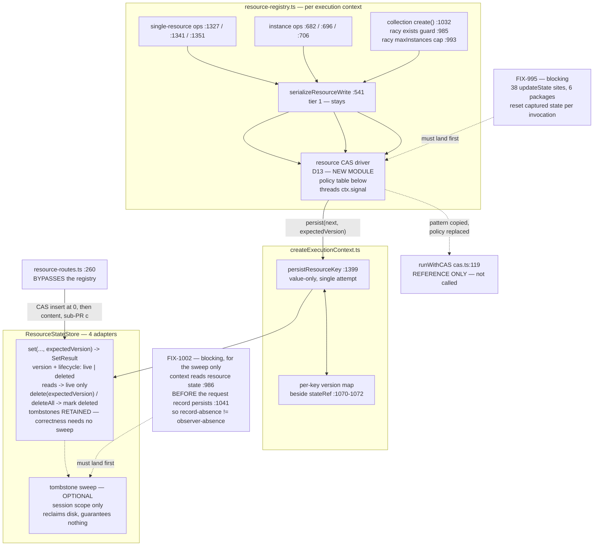

# FIX-992: `ResourceStateStore` was built as `ContentStore`'s LWW twin, and that model is wrong for task state — Implementation Spec

> **Linear issue:** [FIX-992](https://linear.app/fixpoint-labs/issue/FIX-992/resourcestatestoreset-has-no-expectedversion-it-was-built-as) · **Epic:** [FIX-980](https://linear.app/fixpoint-labs/issue/FIX-980/epic-honest-task-substrate-every-write-path-reports-what-it-actually) — Honest task substrate · **Blocked by:** [FIX-995](https://linear.app/fixpoint-labs/issue/FIX-995/updatestate-callbacks-capture-results-outside-the-callback-so-a-cas) (the guarantee) · [FIX-1002](https://linear.app/fixpoint-labs/issue/FIX-1002/execution-context-reads-resource-state-before-its-in-progress-request) (the optional sweep only — §12)

## Spec evolution *(the change story, not an audit log)*

- **Spec drafted** — Framed as an unfinished refactor, scoped as copying `ExpectedVersion` / `SetResult` onto the sibling store across four adapters, with CAS placed at `persistResourceKey`. Large / 3 sub-PRs.
- **Framing corrected before review, and the issue has since been retitled to match.** `FIX-400` appears nowhere in `stores/types.ts`; the store's header calls itself *"the state-layer twin of `ContentStore` (FIX-689)"* (`:537`) with *"plain per-key last-write-wins (no CAS), matching `ContentStore`"* (`:542`). **The wrong model was deliberately chosen, not a contract dropped.** Separately verified: FIX-492 did **not** remove the CAS retry loop (Decision 6).
- **After spec review (round 1) — CAS moved off `persistResourceKey`, and the version's meaning pinned.** The persister is value-only (`resource-registry.ts:473`) and the write ops materialize the next object before calling it, so a retry there would **clobber a concurrent writer's field** (Decision 10). Version semantics pinned against an ABA hole and a legacy-row collision (Decision 11). Also folded: the create route's content-before-state ordering (Decision 12), and two writers the audit had missed.
- **After spec review (round 2) — the "reuse `runWithCAS`" cost argument was wrong, and it is corrected rather than defended.** Four findings converged on one root: `runWithCAS`'s conflict *policy* is wrong for this store — a stale-state fallback (`cas.ts:158-159`) that **resurrects a deleted resource**, retries for conflicts that must be terminal, and no cancellation. **Resource state gets its own driver** (Decision 13). The fifth finding refuted this spec's claim that `deleteAll` had "no surviving observer": session deletion never quiesces in-flight executions (`session-routes.ts:183-188`) and session ids are **caller-supplied and reusable** (`:104`).
- **After a post-budget implementability pass (round 3) — two findings said the plan could not be built as written, so they were fixed as buildability, not design churn.** (1) **The null-state tombstone was unwritable**: `resource_state.state` is `TEXT NOT NULL` (`store-sqlite/src/schema.ts:202`) and `JSONB NOT NULL` (`store-postgres/src/schema.ts:176`), so every delete would have failed on an upgraded database. (2) **Round 2's per-scope floor didn't actually close ABA** without linearizing purge-versus-write, which the per-key filesystem mutex cannot provide. Both dissolve into **one added lifecycle column** (`pending` / `live` / `deleted`) rather than three mechanisms: the migration becomes purely additive `ADD COLUMN` (no `DROP NOT NULL`, no SQLite table rebuild), the CAS predicate's `lifecycle = 'live'` **is** the barrier so the floor is deleted entirely, and an invisible `pending` reservation removes the partial-create failure mode round 3 also found. Net: **simpler than round 2 and three findings closed structurally.** (3) The replay audit was **~10x too narrow** — 4 callbacks in 1 file against a verified **38 `updateState` call sites across 10 first-party files in 6 packages**, including `@flow-state-dev/memory`, a consumer this spec never considered. That is now **[FIX-995](https://linear.app/fixpoint-labs/issue/FIX-995), a separate blocking issue**, which makes this spec's scope *smaller*.
- **After a second post-budget buildability pass (round 4) — three findings showed round 3's mechanism claims more than a per-key predicate can deliver, and the delete surface was under-enumerated.** All four share one root: **a predicate can only fence a row that exists**, and three of the things this design needs to fence are not rows — an absence, a claim on a key nobody owns yet, and a row about to be removed. (1) The `pending` reservation had **no owner**, so nothing stopped a second creator taking over the row the first believed it held — and the loser's content could still land under the winner's published state, *the exact failure D12 was invented to fix*. `pending` is **deleted**: the route inserts the state row under `expectedVersion: 0` (terminal on conflict) and writes content only after winning, so a loser never writes content at all. (2) **`deleteAll` cannot fence a create.** `expectedVersion: 0` means *no live row* (D11), which a never-existed key satisfies trivially, and a bulk mark only touches rows that already exist — so a create racing a scope purge still lands in a deleted, caller-reusable session. D14 now claims only what it delivers, and the residual is named and filed. (3) **Retention rested on a bound that does not exist** — nothing enforces a maximum action lifetime, so no wall-clock window is provably longer than every observer. Retention becomes an **observable condition** the request store already answers. (4) The delete surface is **two writers, not one** (`collection.delete()` as well as `evictInstance`), and neither carried a posture; both now take an `ExpectedVersion`. Net: one lifecycle value, one protocol and one deliverable removed — **there is less to build than after round 3.**
- **After POC settlement (round 5) — the retention sweep's observer registry was refuted by running it, and retention is demoted from a mechanism to an optimization.** Round 4 rested tombstone retention on "the scope has no non-terminal request", asserting that every execution context owns such a record before it can hold a version. That claim was asserted and counter-asserted, so it was settled by running rather than arguing ([`settle-claim`](../contributing/orchestration.md), §12): a paired A/B POC on the unmodified `createExecutionContext` + `createInMemoryStores` returned **CONFIRMED** — the context loads resource state (`createExecutionContext.ts:986`) **before** it persists its `in_progress` record (`:1041`), and the pre-write stub that closes the window is only written on the `concurrency: "queue"` and external-dispatcher paths. **The default path writes no stub at all** (`createInboundTransportHost.ts:270`), and neither does CLI entry or BullMQ native cron. Filed as **[FIX-1002](https://linear.app/fixpoint-labs/issue/FIX-1002)** and made a blocking dependency, the same extraction FIX-995 got. Two things then changed here: retention is **correct without any sweep** (a tombstone kept forever is always sound), so the sweep is now an explicitly optional reclamation pass; and the sweep is **scoped to session-scoped tombstones**, because a resource `scopeId` is not invertible into the request store's filters for user scope and has no filter at all for org (D14). Round 5 also scoped D12's recovery claim: the content PATCH route it advertises is gated on `client.content.update` (`resource-routes.ts:294-296`), so a create-only collection has no repair route.
- **Status: implementable.** Design budget spent at round 2; rounds 3 and 4 were buildability passes; round 5 was a POC settlement plus one claim scoping. Remaining review lands in §13.

---

## For reviewers — what this document is

This is a **direction document**, not an implementation. Reviewing it well means answering one question: **is this the right approach?**

**In scope to challenge:** the problem framing · the approach · any numbered **Decision** in §6 · missing constraints that would **invalidate** the design · scope.

**Out of scope — deliberately unsettled, owned by the implementing agent:** names, signatures, file paths, module layout · local structure, which helper, error-message wording · micro-optimizations and style · test names and internal test structure (the *behaviours* are in §10) · anything Part II left open on purpose.

Feedback in the second list is recorded verbatim in **§13**. It will not be argued with and will not be folded into the design prose. One mention is enough for it to land.

**Where this spec is in its lifecycle.** The two-round design budget was spent at round 2. **Rounds 3–5 were post-budget implementability passes, not design rounds** — each was accepted because its findings established that the plan could not execute as written (a schema constraint, a missing linearization, a mechanism that doesn't fence what it claims to, an unenumerated writer, an observer registry that isn't one), which is a different category from design churn. That distinction matters for what happens next: further findings of the *"this cannot be built"* kind will still be acted on; further findings of the *"consider this alternative"* kind go to §13.

**Round 5 is the round where this stopped replacing mechanisms.** Rounds 1–4 each broke the previous round's ABA fix and put a different mechanism in its place — version-carrying tombstone, per-scope floor, lifecycle column, request-record sweep. Round 5 did not. The refuted piece was the *sweep*, and the sweep turned out not to be part of the correctness argument at all: **retention is what closes ABA, and a tombstone retained forever is always sound.** So the sweep was demoted to an optional reclamation pass and scoped to where the request store can actually answer the question, and the ordering defect underneath it was extracted as [FIX-1002](https://linear.app/fixpoint-labs/issue/FIX-1002) — a bounded, local reorder in one function, the same extraction that made FIX-995 a dependency rather than scope. **No fifth mechanism was added.**

**Two things a reviewer can still usefully break.** §7's **writer table** and **driver-policy table** are the completeness surfaces, and both have been wrong before — the writer table shipped at seven rows when it needed nine, then ten; the audit boundary was off by a factor of ten. An eleventh writer, a fifth mishandled conflict case, or a constraint that stops a migration are the highest-value reports. The sharpest question to ask of any remaining guarantee: **what row does this predicate match, and does that row exist at the moment it has to fence?** Three of round 4's four findings came from asking it. **The highest-value target now is the cost round 5 accepted rather than engineered around:** `resource_state` becomes append-mostly outside session scope, because nothing reclaims a user- or org-scoped tombstone (D14). That is a storage argument, not a correctness one — but if it is wrong at production cardinality, it is worth knowing before this is built.

---

## Part I — The Case *(for the human)*

### 1. Problem — why it matters, why now

**In plain language.** When two pieces of work running at the same time both update the same stored item, one of them silently disappears. Each reads the item, each makes its change, each saves — and whoever saves second wins, overwriting the first without any error. The framework already prevents this for session, request, user and org data. The store that holds *resource* data doesn't, because it was modelled on a different store where the machinery isn't needed.

**Why now.** It is a live data-loss path: the write serialization that looks like it protects these writes is built per execution context, so two concurrent requests in a single Node process are not serialized against each other at all. And it blocks work — [FIX-989](https://linear.app/fixpoint-labs/issue/FIX-989) cannot soundly tell a caller whether its write landed while an overwrite can silently erase the evidence. FIX-989's spec raised that fork as its own blocking open question, and **the owner chose to fix the store.**

### 2. Solution in plain terms

**The accurate framing, which the issue's title now carries.** `ResourceStateStore`'s header calls itself *"the state-layer twin of `ContentStore` (FIX-689)"* (`stores/types.ts:537`) and states its posture as a decision: *"plain per-key last-write-wins (no CAS), matching `ContentStore`"* (`:542`). `FIX-400` appears nowhere in the file. **A model was chosen — the content store's — and it was wrong for what this store ended up holding.** LWW is correct for content, since nothing merges a document body against a prior read. It is wrong for structured state that concurrent workers read-modify-write, which is what resource state became when it started backing task boards. **One store, two access patterns, one concurrency model.**

**The fix.** A versioned-write contract; the retry placed where the caller's intent still exists; a conflict policy that fits a store with deletions and create-if-absent writes; and **one lifecycle column** that carries per-key deletion and scope purge uniformly.

**The cost, corrected five times, stated plainly.** The first draft called this cheap because "it invents nothing". Each review round found that optimism wrong somewhere different, and the record matters more than the reassurance:

| Round | What grew | Why the estimate was wrong |
|---|---|---|
| draft | — | "Reuse what exists" |
| 1 | CAS boundary moved up a layer | The persister is value-only, so a retry there can't merge |
| 2 | A new concurrency-policy module | `runWithCAS`'s *policy* doesn't transfer, only its shape |
| 3 | Scope **shrank** — replay hardening left to [FIX-995](https://linear.app/fixpoint-labs/issue/FIX-995) | The audit boundary was an assumption, not a search: 4 callbacks vs. 38 sites in 6 packages |
| 4 | Scope **shrank again** — the reservation protocol and the timed sweep both deleted | A per-key predicate was asked to fence an absence, an unowned claim and an unversioned delete; it can't |
| 5 | Scope **shrank a third time** — the sweep became optional and session-only; the ordering fix left to [FIX-1002](https://linear.app/fixpoint-labs/issue/FIX-1002) | Retention was priced as a mechanism when it is a cost. A POC on the real path showed the sweep's observer registry doesn't observe: a context holds a version before its request record exists, and on the default path no such record is written in front of it at all |

What genuinely transfers: `ExpectedVersion` (`:166`) and `SetResult` (`:174-179`) verbatim; `StateContainer` (`core/src/types/state.ts:15-24`) verbatim; the store-level CAS statement idiom (`sqlite-store.ts:179-228`, `pg-store.ts:225-260`); the two-tier dispatch shape (Decision 6). What does **not**: the retry policy (`cas.ts:153-168`).

**The net effect of all three post-budget rounds is subtraction.** Round 3 collapsed three of round 2's mechanisms — a null-state tombstone, a per-scope version floor, and a visible reservation — into one lifecycle column. Round 4 deleted the invisible reservation too, and replaced the timed tombstone sweep with a condition the runtime looked able to observe. Round 5 found that it can't, and rather than reaching for a fifth mechanism, **took the sweep off the correctness path entirely** — retention closes ABA, and forgetting is an optimization. What remains is a versioned row with two lifecycle states, a driver, and a create route that wins its key before it writes anything else. **There is materially less to build than at round 2**, and it covers more failure modes while claiming fewer.

**The philosophy that led here.**

- **Tenet 1 (coherence over local cleverness).** Coherence means matching the established *shape*, not force-fitting a shared *implementation* whose semantics differ. Round 1 caught the draft deviating from the shape; round 2 caught it over-conforming to an implementation; round 3 caught it inventing three mechanisms where one serves; round 4 caught the survivor claiming a guarantee it couldn't express; round 5 caught it *pricing* a guarantee it didn't need. Same tenet, five failure modes.
- **Tenet 5 (fix at the owning layer, and find where paths converge).** §7 names the convergence point, all ten writers, the two that bypass it, and two invariants (the instance cap, and fencing a scope generation) that per-key CAS honestly cannot close. The round-5 defect is the same principle applied one layer down: the read-before-record ordering is `createExecutionContext`'s, not this store's, so it is fixed there ([FIX-1002](https://linear.app/fixpoint-labs/issue/FIX-1002)).
- **Tenet 3 (earn every addition).** All three post-budget rounds are subtractions: one column replaced three mechanisms, then the reservation and the timed sweep went, then the conditional sweep stopped being load-bearing — and two workstreams moved to their own issues.

### 3. Tradeoffs & alternatives

**Rejected by the owner: degrade the read.** FIX-989's OQ-1 option (a), which its own spec recommended on tenet-3 grounds. The owner rejected it: the epic's objective is an honest substrate, and (a) leaves the *durable* backing least able to answer the question the epic is about.

**The simpler approach considered.** "Just widen the existing serialization." Structurally insufficient: `resourceWriteChains` is a `const` **inside** `createScopeResourceRegistry` (`resource-registry.ts:540`), registries are per execution context (`createExecutionContext.ts:1649`/`:1664`/`:1682`), caches are per-context locals (`:1070-1072`), and `persistResourceKey` blind-`set`s then updates only its own cache (`:1399-1405`).

**Rejected in round 1: conflict detection without merge.** Detects every conflict, resolves each by clobbering the competing field. The error surface without the correctness.

**Rejected in round 2: extend `runWithCAS` for everyone.** Would fix cancellation for scope state too, but absent-state policy, terminal conflicts and lifecycle awareness are semantics **only** resource state has. The genuinely shared slice — cancellation — is filed as its own bug.

**Rejected in round 3: a SQLite table rebuild plus a Postgres `DROP NOT NULL`.** The direct way to allow a null-state tombstone. SQLite has no `DROP NOT NULL`, so it needs the twelve-step rebuild — create a new table, copy every row, drop, rename, recreate indexes — on live user data, to gain nothing a flag column doesn't. Rejected: the tombstone doesn't need a null state, it needs *to be distinguishable*, and a column does that with a purely additive migration.

**Rejected in round 3: keeping the per-scope floor and adding a scope-level barrier.** Round 2's floor only closes ABA if purge, floor-advance and CAS writes are linearized. SQL could do it with a transaction; **the filesystem adapter would need a scope-level read/write barrier it doesn't have**, and inventing one there — for the third mechanism in a row that the filesystem adapter struggles with — was the wrong trade. Removing the floor removes the requirement: with `deleteAll` marking each key's lifecycle, every write's `lifecycle = 'live'` predicate *is* the barrier, per key, which is exactly the granularity the existing per-key mutex already provides. **So the honest answer to "can the filesystem adapter provide a scope-level barrier cheaply" is: it can't, and now it doesn't have to.**

**Rejected in round 4: giving the reservation an owner token instead of deleting it.** The reservation's hole is that a takeover is indistinguishable from a hand-off, and a token does fix *that*. It does not fix the failure the reservation exists for: the content write goes to a different store, so an owner that stalls past its lease can still clobber the new owner's content, and no token can fence a write to an unfenced store. Closing it properly means making content publication atomic with the owned transition — content keyed by the reservation token, published by the flip — which is cross-record atomicity ([FIX-854](https://linear.app/fixpoint-labs/issue/FIX-854)), an explicit non-goal here. **So the reservation was solving a problem this spec had already declared out of scope, badly.** Deleting it leaves per-key CAS doing exactly what it can do — hand exactly one writer the key — and the route writes content only after winning (D12).

**Rejected in round 4: fencing scope generations so a create cannot land in a purged scope.** The clean fix for a create racing `deleteAll` is to stop reusing a scope's durable namespace: mint a per-session storage nonce so a recreated session reads a different namespace and any straggler row is unreachable garbage. It is the right shape, and it is **not this issue** — `resolveSessionStorageKey` (`stores/scope-keys.ts:75-82`) has ten call sites across routes, the transport host, debug snapshots and `runAction`, several of which derive the key without loading the session record, plus an inverse used to shape HTTP responses. Rewriting session identity inside a resource-store concurrency fix would undo two rounds of narrowing. Filed instead, and D14 stops claiming what it can't deliver.

**Rejected in round 4: a wall-clock retention window.** Round 3 priced tombstone retention as "a window exceeding the maximum execution lifetime". There is no such maximum: `runAction` enforces no deadline, `ToolsConfig.defaults.timeoutMs` (`core/src/types/flow.ts:114-118`) is per-tool and opt-in, `scope-lock.ts:40` documents that its own timeout doesn't even cancel the in-flight mutation, and the only hard deadline in the repo is one adapter's platform config (`vercel/src/config.ts:25`). A number picked without a bound to exceed is a guess dressed as a policy. The sweep now runs on a condition the runtime can observe (D14).

**Settled in round 5 by running, not arguing: request records are not an observer registry.** Round 4's retention rule rested on a claim about how the system behaves — that every execution context owns a durable non-terminal request record *before* it can hold a resource version. It was asserted and counter-asserted, which is the point where prose has demonstrably failed, so it was decided with a throwaway POC on the real path instead of a third exchange (`settle-claim`; evidence and the paired A/B in §12). **Verdict: CONFIRMED — the window is real, and it is the default path**, not an edge case. That is a fact about `createExecutionContext`'s ordering, so it is filed and fixed there ([FIX-1002](https://linear.app/fixpoint-labs/issue/FIX-1002)) rather than worked around here.

**Rejected in round 5: inventing a fifth mechanism to carry retention.** The tempting reads of the POC verdict are "build a real observer registry", "put a lease on every context", or "go back to a timer". All three add a mechanism to a design whose last four rounds were spent removing them, and none is necessary, because **retention does not need a sweep to be correct** — a tombstone that is never removed always fences a stale observer. The sweep only ever reclaimed disk. So it stops being a guarantee and becomes an optional pass that runs where the request store can answer soundly (session scope, once FIX-1002 lands) and simply does not run elsewhere. The design gets smaller and the correctness argument gets shorter.

**Rejected in round 5: sweeping user- and org-scoped tombstones too.** A resource `scopeId` is not the request store's key. For session scope it is `${tenantId}:${sessionId}` (`stores/scope-keys.ts:75-82`) against a **bare** `RequestRecord.sessionId`, which `toBareSessionId` (`:91`) plus `RequestListOptions.tenantId` decomposes exactly. For user and org scope it is `resolveResourceScopeId` (`:154-160`) — `${identityId}` or `${identityId}:${flowKind}`, over an `identityId` that may itself be tenant-namespaced — so a colon-joined key of two or three tokens with no marker cannot be split back into filter fields unambiguously. **And `RequestListOptions` has no `orgId` filter at all** (`stores/types.ts:110-147`). Adding one, or an inverse resolver per scope type, is a request-store change made to serve a disk optimization. Rejected: the sweep covers session scope, which is where the churn is, and user/org tombstones are retained. Not-swept was already the conservative side of this design (§9) — the failure mode is a storage leak, never a resurrection.

**Rejected in round 5: rolling back the state row when the create route's content write fails, or letting an item's creator repair it regardless of the collection's permissions.** Round 5 found D12's advertised recovery is not universal: the content PATCH route is gated on `client.content.update` (`resource-routes.ts:294-296`) and the DELETE route on `client.content.delete` (`:677`), so a collection that grants only `create` leaves an authorized creator with a visible empty item and no route to repair or remove it. The rollback is the mechanism round 3 already rejected (a version-checked rollback whose retry 409s forever behind a concurrent patch). Widening the permission check so a creator can PATCH what it created is a change to the resource permission model, decided somewhere other than a store concurrency fix, and it makes an authorization decision from a fact about the request rather than the declared config (BP-031's neighbourhood). **So D12 stops claiming the recovery is available and names the configuration where it isn't** — the same correction round 4 applied to D14. A collection that wants the recovery grants `content.update`; that is a one-line answer available to the flow author today.

**Rejected in round 3: absorbing the repo-wide replay hardening.** 38 sites across 6 packages, in a defect class of its own, in packages this spec otherwise doesn't touch. Filed as [FIX-995](https://linear.app/fixpoint-labs/issue/FIX-995) and made a blocking dependency instead — it must land before the guarantee is switched on, but it is independently testable and reviewable, and folding it in would make both changes harder to review.

**Where the genuine complexity is.** In order:

1. **The resource CAS driver's policy (Decision 13).** Four conflict cases the shared driver gets wrong, each with a specific failure.
2. **The filesystem adapter — implicated for the third time.** Its 27 lines delegate to a **484-line factory shared with `ContentStore`** (`KeyedResourceStore<T>` at `filesystem-resource-store.ts:61-72`), which now diverges for the first time; it has no atomic CAS primitive (`set` is temp-write-then-`rename`, `:376-388`); and its `deleteAll` changes from one `rm -rf` (`:443-470`) to enumerate-and-mark. **This is the riskiest part of the change and the place to expect the most iteration.**
3. **Lifecycle semantics across four adapters** — reads filtering to `live`, and tombstones retained rather than reclaimed on a schedule.
4. **The read shape.** The engine hydrates through the *bulk* readers, so all three reads must carry the version or the fix is inert for eagerly-declared resources — the default.

### 4. Focus practices (1–5)

- **A stated constraint beats an assumed one — and an absent one is not a bound (tenet 1).** Round 3's decisive findings were both *declared* in code: `NOT NULL` in two schema files, and the absence of a scope-level lock. Round 4's was the inverse — a design leaning on a "maximum execution lifetime" that nothing enforces. Read the constraint before designing against it, and grep for it before pricing against it.
- **A predicate fences a row, not an absence.** Every guarantee here is a `WHERE` clause over one key's current row. That cannot fence a key that doesn't exist yet, a claim nobody owns, or a delete that names no generation. The round-4 lesson, and the question to ask of the next mechanism.
- **Reuse shapes, not policies; put the retry where the intent lives.** A shared helper transfers only if its *decisions* transfer (round 2), and a retry over a materialized value can only overwrite, never merge (round 1).
- **Separate the guarantee from the optimization before you price either.** Round 4 spent its retention argument defending a *sweep condition*, when the guarantee was retention itself and the sweep only reclaimed disk. Once they were separated, a refuted sweep cost a paragraph instead of a redesign. Ask of any mechanism: if this stopped running entirely, would the design still be correct? If yes, it is an optimization and it does not get to shape the design.
- **When a claim about behaviour comes back a second time, run it.** Round 5's decisive finding was not reasoned out — it was executed, on the unmodified path, with a paired A/B that showed the check could discriminate. The prose case for the sweep had already survived one round; a third exchange would have been the expensive way to be wrong. `settle-claim` costs no review round, and it is what turned "the registry doesn't exist" into "the registry exists and is written a hundred lines too late".
- **Check the shared state before writing "unaffected" — and treat an audit boundary as a claim.** §12 carries this as a concrete list. Four times now a boundary was asserted rather than searched: `deleteAll`'s observers (round 2), the replay audit's 38 sites (round 3), the maximum execution lifetime that turned out not to exist (round 4), and "every context owns a request record first" (round 5, refuted by running it).
- **BP-030 / BP-035.** Legacy rows must not read as *absent*; the conflict, replay, delete-recreate, cancellation, scope-purge and partial-create paths all need explicit behaviour.

### 5. What using it looks like

Public flow-authoring API unchanged; nobody writes `expectedVersion` in flow code.

```ts
// before: a blind put, no way to detect a lost update
await stores.resourceState.set("session", sessionId, "tasks/t1", nextState);

// after: write only if nobody moved it since we read
const read = await stores.resourceState.get("session", sessionId, "tasks/t1");
//    read is now { state, version } | undefined  (undefined = no LIVE row)
const result = await stores.resourceState.set(
  "session", sessionId, "tasks/t1", nextState, read?.version ?? 0
);
if (!result.ok) { /* conflict.currentValue / .currentVersion — re-apply */ }

// opting out is explicit:
await stores.resourceState.set("session", sessionId, key, value, "any");
```

**What a flow author sees: nothing they write, and one thing that stops being wrong.**

```ts
// two concurrent execution contexts, unchanged flow code
await ctx.sessionResources.task.patchState({ claimedBy: "worker-a" });
await ctx.sessionResources.task.patchState({ note: "in progress" });
// before: one field silently gone.  after: both present
```

**Two behaviours callers must now expect**, both cases where the old code silently did the wrong thing:

```ts
await ctx.sessionResources.task.patchState({ note: "x" });
//  -> rejects if another context deleted it; does NOT resurrect it from a stale read
await ctx.sessionResources.tasks.create("t1");
//  -> rejects if a live "t1" exists, whether pre-existing or the winner of a race
```

**The rule updater authors must follow** — an updater may run more than once. This is [FIX-995](https://linear.app/fixpoint-labs/issue/FIX-995)'s deliverable, shown here because it is the behavioural precondition for everything above:

```ts
await ref.updateState((current) => {
  claimed = undefined;                     // every invocation is the first
  if (!eligible(current)) return current;  // a replay lands here after losing the race
  claimed = next;
  return next;
});
// without the reset: the loser reports work that never committed
```

### 6. Decisions & rules — the sign-off surface

Fourteen — still fourteen after three post-budget rounds, because all three were subtractions. **10–12 from round 1, 13–14 from round 2, 11 / 12 / 14 rewritten by round 3, 12 / 14 rewritten again by round 4** (12 lost its reservation, 14 lost its overclaim and its timer), **and 12 / 14 scoped once more by round 5** (12's recovery route is not universal, 14's sweep is not a guarantee). Those are where the design settled.

1. **Reuse `ExpectedVersion` and `SetResult` as types; no second spelling.** *Rejected:* a resource-specific conflict type, or a `compareAndSet` taking an expected *state*. *Ramification:* the store reads as a sibling. Two *semantics* diverge deliberately and are documented: `expectedVersion: 0` means "no live row" (D11), and some conflicts are terminal (D13). Types shared; policy not.

2. **Widen the existing six methods; `expectedVersion` required, not optional.** *Rejected:* 12 methods, or an optional parameter. *Ramification:* a breaking internal-interface change on purpose — optional lets a *new* caller silently get LWW, the exact failure being fixed. Not published API.

3. **`ContentStore` keeps LWW and the two stores diverge — because LWW is right for content**, not because content is out of budget. *Rejected:* versioning both for symmetry. *Ramification:* the generic factory and the generic conformance runner each grow a version-aware variant or split. We split the *model*, not the store.

4. **Per-adapter guarantee, stated honestly: real CAS on memory / SQLite / Postgres, same-process-only on filesystem.** *Rejected:* an atomic filesystem CAS via `link()`/`EEXIST`; and no filesystem CAS at all. *Ramification:* a per-key mutex on the store **instance** plus compare-under-lock closes the defect this issue reports and does **not** protect two OS processes over one directory. Documented, not implied. Round 3 confirmed this granularity is sufficient once the floor is gone (D14) — the per-key mutex is not asked to generalize.

5. *(merged into 4; number retained so round-1 references resolve.)*

6. **`serializeResourceWrite` stays — it is the sibling architecture.** *Rejected:* removing it. *Ramification:* the "FIX-492 removed the retry loop" premise is **wrong**: FIX-492 built a two-tier dispatch (`state-container.ts:109-167`, `scope-lock.ts:3-4`, published as *"External-store scopes still use CAS"*, `mutation-model.md:39-43`). `mutation-model.md:35` records why the queue exists — task-board contention exhausts retry budgets. It also **reduces how often the replay path runs**, which is FIX-995's hazard.

7. **Every writer gets an explicit posture; none defaults — and that includes the delete writers.** *Rejected:* defaulting unconverted callers to `"any"`; and round 3's unconditional delete, which round 4 showed is a posture-free write in disguise — a stale eviction would tombstone a replacement generation, bypassing the version map and defeating the very delete/recreate protection D11 promises. *Ramification:* §7's table assigns all **ten**, `deleteResourceKey` takes an `ExpectedVersion` like every other write, and both delete writers (`collection.delete()` and `evictInstance`) pass the version they observed. The `maxInstances` cap is explicitly **not** closed — a *set*-level invariant per-key CAS cannot enforce.

8. **Write ops report `committed`; the change notification fires only when they did.** *Rejected:* leaving it unconditional and filing it. *Ramification:* the CAS produces the trustworthy answer (`cas.ts:112-115`), and it matches `ScopeStateOps`, which already returns that boolean and suppresses the paired emit (`core/src/types/state.ts:26-33`). Fixes the spurious `resource_change` on a deep-equal write (`resource-registry.ts:706-719`).

9. **Replay-safety hardening is [FIX-995](https://linear.app/fixpoint-labs/issue/FIX-995), a separate blocking issue — not carried here.** *(Round 2 as in-scope; round 3 moved it out.)* *Rejected:* hardening four callbacks in `resource-backed.ts` and calling the audit done — the boundary round 2 asserted; and absorbing all 38 sites into this spec. *Ramification:* a repo-wide search found the same stale-capture hazard in **38 `updateState` call sites across 10 first-party files in 6 packages**, verified — `evict()` in `memory/src/working-memory-helpers.ts:159-173` leaves `found` true for an entry it didn't remove, and `cullByTTL()` in `episodic-memory-helpers.ts:107-145` **accumulates** episode IDs across attempts into an array the caller records as culled, which is worse than a stale boolean. `@flow-state-dev/memory` was a consumer this spec never considered. It must land **before** the guarantee is switched on, so it is a blocking dependency rather than a follow-up, and this spec is smaller for it.

10. **CAS lives at the registry's read/mutate seam, not at `persistResourceKey`.** *(Round 1.)* *Rejected:* the draft's placement; widening the persister to carry mutation intent. *Ramification:* the persister is value-only (`:473`) and the ops materialize the next object first (`:690`, `:715`, `:1335`, `:1362`), so a retry there **still loses a concurrent writer's field**. Each write op drives the retry with its real mutator over a per-key `StateContainer`. Cost: the registry's option contract and its four test mocks (`test/context/resource-registry.spec.ts:61`, `:84`, `:113`, `:143`).

11. **One added lifecycle column carries deletion and scope purge; a version is monotonic per key and never reused; `expectedVersion: 0` means "no live row".** *(Round 1, revised in rounds 2–4.)* *Rejected:* the draft's "restarts at 1 after delete"; round 2's **null-state tombstone**, which round 3 showed is **unwritable** — `state` is `TEXT NOT NULL` (`store-sqlite/src/schema.ts:202`) and `JSONB NOT NULL` (`store-postgres/src/schema.ts:176`), so every delete would fail on an upgraded database; the schema surgery to permit it (see §3); and round 3's third lifecycle value, `pending`, dropped in round 4 with the reservation it existed for (D12). *Ramification:* a row carries `version` plus a lifecycle of `live` | `deleted`, and **both migrations are purely additive `ADD COLUMN … DEFAULT`** — no `DROP NOT NULL`, no SQLite table rebuild, indexes untouched, legacy rows preserved. Reads return **only `live`**. `delete` sets `deleted` and keeps the version, so a pre-delete observer's version never matches a post-recreate row (the ABA fix), and a tombstone never satisfies a positive `expectedVersion`. `expectedVersion: 0` therefore means *no live row*, so a tombstoned key can be recreated over. **Legacy rows migrate to `live` at version 1** — an existing row must never read as absence. **A tombstone keeps its version and drops its state**, writing `{}` rather than the last value: round 3 kept the payload because "it costs nothing and keeps the column non-null", and round 5 inverted the first half of that — under indefinite retention (D14) the payload *is* the cost, and `{}` satisfies `NOT NULL` just as well. The version is the only thing a tombstone has to carry. Cost: reads filter lifecycle in all four adapters, and tombstones are **retained**, not reclaimed on a schedule (D14).

12. **The create route wins the key first, then writes content — no reservation.** *(Round 1, rewritten in rounds 2–4.)* *Rejected:* today's content-before-state order (round 2 showed the **rejected** request's content could stay attached to the winner's state — and it stays rejected, because under content-first both racers write content and the winner's state can end up pointing at the loser's); round 2's *visible* reservation plus a version-checked rollback (round 3: a **visible state-only item** whose retry 409s forever when a concurrent patch blocks the rollback); and round 3's *invisible* `pending` reservation, which round 4 showed has **no owner** — nothing distinguishes a takeover from a hand-off, so the first reserver could still write content under the second's published state, reproducing the round-2 failure the reservation was invented to fix. An owner token doesn't close it either (see §3). *Ramification:* the route does one CAS insert at `expectedVersion: 0`, terminal on conflict, and writes content **only after winning**, so a loser never touches `ContentStore` and no reservation, rollback, takeover or `pending` lifecycle value is needed. The honest residual, stated rather than engineered around: if the state insert commits and the content write then fails, the item exists with empty content, and the retry's 409 is *correct* because the item really does exist. It is **visible, and repairable through the existing content PATCH route** (`resource-routes.ts:317-323`, which requires exactly the live state row that now exists) — **but only when the collection grants `client.content.update`.** Round 5 found this claim was unscoped: the PATCH route is gated at `:294-296` and the DELETE route at `:677`, so a collection declaring `client.content.create` alone leaves an authorized creator with a visible empty item and no route to repair or remove it. **That configuration is named, not fixed here** (§3 prices the two ways to fix it and rejects both as belonging to the permission model or to FIX-854). The remedy available today is a flow-author one: a collection that wants the repair path grants `content.update` alongside `create`, and the docs say so (§11). That is the trade per-key CAS can actually make; making the pair atomic is cross-record atomicity ([FIX-854](https://linear.app/fixpoint-labs/issue/FIX-854)), a declared non-goal. The test asserts the **persisted content is the winner's**, that the loser wrote none, and that a create-only collection's half-written item is reachable in a listing rather than invisible.

13. **Resource state gets its own CAS driver; `runWithCAS` is the reference, not the dependency.** *(Round 2 — root of four findings.)* *Rejected:* reusing `runWithCAS` as-is (the draft's cost argument); extending it for all five stores. *Ramification:* (a) its stale-state fallback (`cas.ts:158-159`) **resurrects a deleted resource** once a tombstone makes the version matchable; (b) create-if-absent losers must be **terminal**, not retried into an overwrite or a silent no-op; (c) no `AbortSignal`, and `wait()` (`cas.ts:96-104`) is an unabortable timer, so an aborted action can **persist after cancellation**. Policy table in §7; the driver threads `ctx.signal`. The shared cancellation gap is filed separately.

14. **`deleteAll` marks every key's lifecycle instead of purging — which fences every key that existed at purge time, and honestly cannot fence one that didn't.** *(Replaces round 2's Decision 14; scoped and re-costed in round 4.)* *Rejected:* round 2's per-scope version floor — round 3 showed it **only closes ABA if purge, floor-advance and writes are linearized**, and the filesystem adapter's per-key mutex cannot provide a scope-level barrier. Also rejected: a scope-level barrier or transaction per adapter; observer quiescence before purge; and (round 4) minting a per-session storage nonce, which is the right fix for the residual below and the wrong size for this issue (§3). *Ramification:* `deleteAll` becomes a single bulk lifecycle mark, and every CAS write predicates on `lifecycle = 'live'` — so for **a key that already existed**, whichever commits second observes the other, per key, at exactly the granularity the existing mutex provides. That closes the key-altitude delete/recreate ABA and the scope-altitude one round 2 found (`session-routes.ts:183-188` purging without quiescing, plus caller-supplied reusable session ids at `:104`): the marked row retains its version, so a stale observer from the previous generation never matches. **The residual, named because round 4 found this spec claiming otherwise:** a create of a *previously-absent* key racing `deleteAll` still lands. `expectedVersion: 0` means "no live row" (D11), which a never-existed key satisfies trivially, and a bulk mark only touches rows that exist — so the row is inserted into a scope the purge has already swept, and a session recreated under the same caller-supplied id inherits it. A per-key predicate has nothing to match on for a key that does not exist; closing it needs a scope generation, filed as [FIX-1000](https://linear.app/fixpoint-labs/issue/FIX-1000). Two costs, stated: the filesystem adapter's `deleteAll` changes from one `rm -rf` (`filesystem-resource-store.ts:443-470`) to enumerate-and-mark, N writes instead of one for a large scope; and **tombstones are retained.**

**Retention is the guarantee; sweeping is an optimization, and round 5 is where those stopped being the same sentence.** What closes ABA is that the version survives the delete. **A tombstone that is never removed is always sound** — it costs a row, and it can never resurrect anything. So this spec's *correctness* obligation is only "do not remove tombstones", which every adapter satisfies for free by doing nothing. Round 3 priced retention as a wall-clock window and round 4 replaced it with a condition — *"a tombstone may be swept once its scope has no non-terminal request"* — resting on the claim that every execution context owns such a record before it can hold a version. **A POC settled that claim CONFIRMED-as-broken** (§12): `createExecutionContext` loads resource state at `:986` and persists the record at `:1041`, and the pre-write stub that would close the gap exists only on the `concurrency: "queue"` path (`createInboundTransportHost.ts:252-256`) and the external-dispatcher path (`:316-320`) — **not on the default path** (`:270`), CLI entry, or BullMQ native cron. So the sweep as round 4 wrote it would remove a tombstone out from under a live observer.

**The sweep therefore survives only as an optional reclamation pass, under two conditions, and the design does not depend on it running.** (1) It requires **[FIX-1002](https://linear.app/fixpoint-labs/issue/FIX-1002)** — the ordering fix that persists the initial request record before the resource-state load — as a blocking dependency, which is where that defect belongs and is a bounded reorder inside one function rather than a registry this runtime lacks. (2) It runs on **session-scoped tombstones only.** The observer query must be built from a resource `scopeId`, and only session scope inverts cleanly: `toBareSessionId` (`stores/scope-keys.ts:91`) plus `RequestListOptions.tenantId` recovers exactly the fields the request store filters on, against a bare `RequestRecord.sessionId`. User and org scope do not (`resolveResourceScopeId`, `:154-160`), and `RequestListOptions` carries no `orgId` at all (`stores/types.ts:110-147`) — so **user- and org-scoped tombstones are simply never swept** (§3). Not-swept was already the conservative side of this design: the failure mode is a storage leak, never a resurrection. Precedent for the sweep's shape, unchanged: `SuspensionStore.pruneTerminalBefore` (`types.ts:653-660`).

**The cost this accepts, stated plainly rather than engineered around:** `resource_state` becomes append-mostly outside session scope, and a purged session's rows persist until its scope is swept. A tombstone is one row carrying a key, a version and `{}` (D11 drops the payload for exactly this reason), so the growth is small per entry and real in aggregate. **The reclamation story that makes it go away is already filed:** [FIX-1000](https://linear.app/fixpoint-labs/issue/FIX-1000)'s per-session storage nonce makes a purged generation *unreachable*, and unreachability — unlike quiescence — needs no observer question, so a dead generation can be dropped wholesale. This spec does not block on it.

**Non-goals.** Cross-record atomicity ([FIX-854](https://linear.app/fixpoint-labs/issue/FIX-854)) — which is why the create route stops trying to approximate it (D12) · fencing a scope generation, so a create racing a scope purge cannot land in a deleted, reusable session, and so a dead generation becomes reclaimable (D14's named residual, filed as [FIX-1000](https://linear.app/fixpoint-labs/issue/FIX-1000)) · the read-before-record ordering inside `createExecutionContext` ([FIX-1002](https://linear.app/fixpoint-labs/issue/FIX-1002) — blocking dependency for the sweep, not scope) · reclaiming user- and org-scoped tombstones, and any request-store query surface that would make it possible (D14) · widening the resource permission model so a create-only collection can repair its own half-written item (D12) · claim *protocol* safety and the `maxInstances` cap race ([FIX-981](https://linear.app/fixpoint-labs/issue/FIX-981) — enables both, closes neither) · the repo-wide replay hardening ([FIX-995](https://linear.app/fixpoint-labs/issue/FIX-995) — blocking dependency, not scope) · `ContentStore` versioning · cross-process filesystem CAS · cancellation for `runWithCAS`'s existing scope callers (filed) · any change to the public flow-authoring API · FIX-989's provenance mechanism · the `deepEqual`-against-stale-cache write *skip* (D8 fixes only the notification half).

**Size: Large — 3 required PRs plus one optional fourth, and smaller again after round 5.** The replay hardening left for FIX-995, one lifecycle column replaced three mechanisms, then the reservation protocol and the timed sweep went, and now the conditional sweep is split out as an optional sub-PR **d**: session-only, gated behind FIX-1002, and droppable without touching the guarantee. Still Large: four adapters, two migrations, a new policy module, the filesystem factory split, and the route rewrite.

---

## Part II — The Build Plan *(for the implementing agent)*

### 7. Technical design

Two layers change here: the **store** grows the contract and the lifecycle column, and the **registry** gains a resource-specific CAS driver. Replay safety is FIX-995's, landing first.



**The resource CAS driver's policy table (D13).** The reason `runWithCAS` isn't called. Each row names the failure the shared driver would produce.

| Conflict case | Resource driver | `runWithCAS` would | Failure avoided |
|---|---|---|---|
| Conflict, **live row** at a newer version | Refresh from `conflict.currentValue` / `currentVersion`, re-run the mutator, retry with backoff | same | — (shared behaviour is right here) |
| Conflict, **no live row** (deleted / tombstoned), op is patch/update | **Terminal.** Abort with a resource-deleted error; never recreate | Falls back to the container's **stale cached state** (`cas.ts:158-159`) and retries; the tombstone's version *matches*, so the write succeeds | **Resurrecting a deleted resource** from a pre-delete snapshot |
| Conflict, op is **create-if-absent** (`expectedVersion: 0`) | **Terminal.** Surface already-exists; never retry | Refreshes to the winner's version and retries → **overwrites the winner**, or silently no-ops on identical state | Losing the winner's create, and `create()` losing its already-exists contract |
| `ctx.signal` aborted | Stop before backoff **and** before persisting | No signal parameter; `wait()` is an unabortable timer | **Persisting state after cancellation** |
| Retry budget exhausted | `ConcurrentModificationError`, as scope state does | same | — |

Reused verbatim: `ExpectedVersion`, `SetResult`, `StateContainer`, the deep-equal no-op short-circuit (`cas.ts:143-145`), exponential backoff, `ConcurrentModificationError`. Replaced: the conflict-resolution block (`cas.ts:153-168`). Keep the driver beside `cas.ts`, cross-referenced both ways, so the next reader sees two drivers and why.

**Lifecycle and version semantics (D11, D14) — stated once so every adapter implements the same thing.**

| Rule | Behaviour |
|---|---|
| Lifecycle values | `live` (visible) · `deleted` (tombstone, invisible, version retained). Two values — round 3's `pending` went with the reservation (D12) |
| Reads | `get` / `getAll` / `getByPrefix` return **`live` only**. `get` → `undefined` for an absent row and a tombstone alike |
| `0` | Means **no live row**. `expectedVersion: 0` is create-if-absent; conflict against it is **terminal** |
| Version | First create writes `1`; each committed write +1; **never reused**. A recreate continues from the tombstone's version + 1 |
| `delete` | Takes an `ExpectedVersion` like every other write. Sets `deleted`, retains `version`, **writes `{}` as the state** (the version is all a tombstone carries; `{}` keeps the column non-null under indefinite retention — D11); conflict is **terminal** |
| `deleteAll` | **Bulk-marks every key `deleted` in one statement.** No purge, no floor, no expected version — it is a scope operation, not a key operation |
| Migration | Purely additive `ADD COLUMN` for both `version` and lifecycle. Legacy rows become **`live` at version 1** |
| Retention | **Tombstones are retained. Retention is the guarantee; the sweep is an optimization** (D14). Nothing in this design's correctness depends on a tombstone ever being removed |
| Sweep *(optional, and not on the correctness path)* | Session-scoped tombstones only, and **only after [FIX-1002](https://linear.app/fixpoint-labs/issue/FIX-1002) merges**. Condition: the scope has no non-terminal request. User- and org-scoped tombstones are never swept — their `scopeId` does not invert into the request store's filters, and there is no `orgId` filter (D14) |

**What the predicate fences, and what it does not.** `deleteAll` is a single bulk statement and every CAS write predicates on `lifecycle = 'live'`, so for a key that **already exists** the two serialize per key: `deleteAll` first → the write's predicate fails → terminal, no resurrection; the write first → `deleteAll` marks it after. Per-key atomicity is sufficient there, and per-key is exactly what the filesystem mutex and the SQL row lock already give — which is what made round 2's scope-level barrier unnecessary rather than merely hard.

**It is not sufficient for a key that does not exist yet.** A create carries `expectedVersion: 0` = *no live row*, which a never-existed key satisfies against a purged scope as easily as a fresh one, and the bulk mark had no row to touch. So a create can commit into a scope `deleteAll` has already swept, and since session ids are caller-supplied and reusable (`session-routes.ts:104`), a session recreated under the same id inherits it. **This hole stays open in this issue.** It is a cross-key invariant ("no live rows in a purged scope"), and no per-key `WHERE` clause expresses one; the fix is to stop reusing the scope namespace (§3, filed as [FIX-1000](https://linear.app/fixpoint-labs/issue/FIX-1000)). Two things bound it meanwhile: the row is reachable only through id reuse, and it is the exposure the store already has today — this change neither creates nor closes it.

**The sweep's observer query, and why it only covers session scope.** The sweep asks "does any live execution still hold a version in this scope?" and the request store is the only thing that could answer. Two facts constrain it, both verified rather than assumed after round 4's version of this rule was refuted by running it (§12).

| Resource scope | `scopeId` shape | Invertible into `RequestListOptions`? |
|---|---|---|
| `session` | `resolveSessionStorageKey` (`stores/scope-keys.ts:75-82`) → `${tenantId}:${sessionId}` or bare | **Yes, exactly.** `toBareSessionId` (`:91`) recovers the bare id — which is what `RequestRecord.sessionId` holds — and the tenant goes to `RequestListOptions.tenantId`, whose present-vs-absent exact-match semantics (`stores/types.ts:114-127`) are the isolation this needs. **Passing the `scopeId` straight through as a `sessionId` filter matches nothing for any tenant scope**, which reads as "no live observer" — the exact false negative the sweep must never produce |
| `user` | `resolveResourceScopeId` (`:154-160`) → `${identityId}` or `${identityId}:${flowKind}`, over an `identityId` that may itself be tenant-namespaced | **No.** Two or three colon-joined tokens with no marker; the split is ambiguous |
| `org` | same resolver | **No, and there is no filter to invert into** — `RequestListOptions` has `flowKind` / `sessionId` / `userId` / `tenantId` and no `orgId` (`stores/types.ts:110-147`) |

So the sweep takes session scope and leaves the rest retained (D14). Two implementation consequences worth stating because getting either wrong is silent: build the filter from the **decomposed** key, never from the raw `scopeId`; and "no non-terminal request" needs the complement of the terminal statuses, which `RequestListOptions.status` expresses one status at a time — a scope must be treated as **occupied** whenever that determination cannot be made cleanly, never as empty.

**Why the boundary is where it is (D10).** `persistResourceKey` is `(key, value) => Promise<void>` (`resource-registry.ts:473`); the write ops compute the next object first (`:690`/`:1335`, `:715`/`:1362`), so by the time it runs the intent is gone. Blast radius: one production provider (`createExecutionContext.ts:1399`), three registry call sites (`:615`, `:627`, `:1032`), four test mocks.

**Writer table — all ten paths. It shipped at seven, then nine, and was wrong both times; this is the completeness surface.**

| # | Writer | Reaches the CAS boundary? | Posture | Sub-PR |
|---|---|---|---|---|
| 1–3 | single-resource `patchState` / `setState` / `updateState` `:1327` / `:1341` / `:1351` → `persistResourceState` `:615` | yes | merge via retry; `setState` = replace, detect only | b |
| 4–6 | instance `patchState` / `setState` / `updateState` `:682` / `:696` / `:706` → `persistNamespaceInstanceState` `:627` | yes | merge via retry | b |
| 7 | **collection `create()` / `create({ replace })` `:1032`** | yes | `expectedVersion: 0`, **terminal on conflict** (replaces the racy `exists && !replace` throw at `:985`); `"any"` for `replace` | b |
| 8 | create-collection-item route `resource-routes.ts:260` | **no — direct store call, outside registry and queue** | `expectedVersion: 0`, terminal → 409; content only after winning (D12) | c |
| 9 | **collection `delete()` `:1145` → `deleteNamespaceInstance` `:630`** | delete path | passes the observed version, **terminal on conflict**; replaces the stale-cache `!(storageKey in resources)` guard at `:1148` | b |
| 10 | `evictInstance` `:1002` → `:1463` → `deleteResourceKey` | delete path | passes the observed version, **terminal on conflict** — the eviction target is chosen from the per-context cache (`createExecutionContext.ts:1064-1075`), so an unconditional mark would tombstone a newer generation | b |

**Both delete writers were one row, and it was the wrong shape.** Round 3 gave `evictInstance` the posture "marks `deleted`, retains version" — a description of the *store's* behaviour, not a posture, since `deleteResourceKey: (key: string) => Promise<void>` (`:475`) has no version to state. Round 4 found the second writer and what they share: a delete chosen from a stale per-context snapshot tombstones whatever generation is live *now*, routing around the version map and defeating for deletes the exact delete/recreate protection D11 builds for writes. `deleteResourceKey` therefore takes an `ExpectedVersion`; `"any"` stays available for sub-PR **a**'s pre-conversion callers.

**The second invariant this change honestly does not close** (the first is the purged-scope create, above). `create()` checks `maxInstances` by counting instances at `:993-1003` — a **read-then-act on a set**. Two concurrent creates of *different* keys both count N−1 and both succeed. Per-key CAS cannot fix that; it needs a set-level primitive. Out of scope, filed. Recorded because the writer table would otherwise imply coverage.

**Replay safety is FIX-995's, and this is the evidence it was scoped from.** 38 `updateState` call sites across 10 first-party files: `core/src/graph/resource-edges.ts` (5), `engine/src/context/resource-registry.ts`, `memory/src/{working-memory-helpers (6), semantic-memory-helpers (5), episodic-memory-helpers (4), memory-system-blocks (4), digest-blocks (1), janitor-blocks (1)}`, `orchestration/src/tasks/collection/resource-backed.ts` (5), `patterns/src/rlm/index.ts` (1), `thought-fabric-core/src/identity/perspective-helpers.ts` (6). Many are pure spreads and already safe; the audit classifies all of them and fixes the capturing subset. The reference discipline is `sequencer-backed.ts` (`:209`, `:237`, `:314`, rule at `:435`), which has always run under retries. **Do not start this spec's sub-PR b until FIX-995 has merged.**

**Deliberately unchanged, verified rather than assumed.** `resource-routes.ts:317` reads state only as an existence probe then writes `ContentStore` (`:323`) — no version needed. The sequencer and request task backings route through `atomicState` → real CAS already. `ContentStore` is untouched.

**The `deepEqual` short-circuit at `:1402` stays.** Pre-existing and unchanged; the driver keeps the identical short-circuit (`cas.ts:143-145`). D8 fixes only the *notification* half.

**Rewrite the interface doc comment.** `types.ts:537` and `:542-544` document the LWW posture as a decision; all three statements become wrong. Replace with §2's account, plus the lifecycle table and the two deliberate divergences from the siblings (D1).

### 8. Implementation sequence

**PR plan.** [FIX-995](https://linear.app/fixpoint-labs/issue/FIX-995) and [FIX-1002](https://linear.app/fixpoint-labs/issue/FIX-1002) are external blocking dependencies, not nodes here — and they block *different* things, so they are not interchangeable. FIX-995 gates sub-PR **b**, where the guarantee is switched on. FIX-1002 gates **only the optional sweep**, which round 5 moved out of the correctness path; if it has not landed, sub-PR **d** simply does not ship and everything else is unaffected.

| sub-PR | deliverables | depends_on |
|---|---|---|
| a | Contract on `ResourceStateStore` (`ExpectedVersion` + `SetResult`, versioned reads, lifecycle, **`delete(expectedVersion)`**); D11/D14 semantics in all four adapters, tombstones **retained** with `{}` state; SQLite + Postgres **`ADD COLUMN`-only** migrations; `deleteAll` → bulk mark; split/parameterize the shared filesystem factory and conformance runner; CAS + tombstone + ABA (key and scope altitude) conformance cases; ~10 read call sites and all writers — deletes included — to explicit `"any"` — **no behaviour change at runtime** | — |
| b | The resource CAS driver (D13) with its policy table and `ctx.signal` threading; per-key `StateContainer` + version map; `persistResourceKey` reduced to a single-attempt persist; registry option contract + four test mocks; collection `create()` → terminal `expectedVersion: 0`; **both delete writers (`:1145`, `:1002`) → version-conditional, terminal on conflict**; `committed` surfaced and `notifyInstanceChange` gated on it | a, **FIX-995 merged** |
| c | Create route: CAS insert at `expectedVersion: 0` → 409 on conflict → content only after winning (D12); drop the racy `:238-241` pre-read; docs corrections (§11) | a |
| d *(optional)* | Session-scoped tombstone sweep gated on "no non-terminal request", with the decomposed observer query (§7); the retention tests. **Ships only if FIX-1002 has merged; drop it otherwise** — it reclaims disk and guarantees nothing | a, **FIX-1002 merged** |

Branches `fix/FIX-992-a` / `-b` / `-c` / `-d`; **b**, **c** and **d** are independent of each other.

**Sub-PR a.**

1. Widen `ResourceStateStore`; rewrite the stale concurrency comment; document the lifecycle table and the two divergences (BP-007). → *test:* typecheck failures **are** the reader/writer audit.
2. Split or parameterize `KeyedResourceStore<T>` / the filesystem factory so a versioned variant exists without changing `ContentStore`. The delicate step. → *test:* `ContentStore` conformance and the filesystem guard-conformance suite green untouched.
3. Memory adapter: `{ state, version, lifecycle }`. → *test:* CAS + tombstone + ABA cases.
4. Filesystem adapter: version and lifecycle in the `.json` envelope, a missing lifecycle reading as **`live` at version 1**; `deleteAll` changes from `rm -rf` (`:443-470`) to **enumerate-and-mark**, which must respect the legacy-layout guard; per-key mutex + compare-under-lock. Do **not** bump `LAYOUT_VERSION`. → *test:* a pre-existing versionless file reads as live/1 and updates without a wipe; `deleteAll` leaves marked tombstones, not an empty tree.
5. SQLite: `ADD COLUMN version INTEGER NOT NULL DEFAULT 1` and `ADD COLUMN lifecycle TEXT NOT NULL DEFAULT 'live'` behind `pragma_table_info` probes (copy `schema.ts:106-119`). **`state` stays `TEXT NOT NULL` — no table rebuild.** CAS statements per `sqlite-store.ts:179-228`, predicating on `lifecycle`. → *test:* migration idempotent across two boots; legacy row reads live/1; `expectedVersion: 0` against it conflicts.
6. Postgres: same via `ADD COLUMN IF NOT EXISTS … DEFAULT` (`schema.ts:302-303`) and `pg-store.ts:225-260`. **No `DROP NOT NULL`.**
7. **No sweep in this sub-PR.** Tombstones are retained, which is what makes them correct; reclamation is sub-PR **d** and is optional (D14). Round 4's version of this step told the implementer to *confirm* that every path reaching `createExecutionContext` (`runAction.ts:1020`) has a durable non-terminal request record first. That confirmation was run, and it came back **negative** (§12) — which is why the sweep moved out rather than shipping here.
8. Split the conformance runner so the state suite gains the CAS/lifecycle/ABA cases and the content suite does not. All four adapters already call the state suite (`engine/test/resource-state-store.test.ts:225`, `store-sqlite/test/resource-durability.test.ts:47`, `store-postgres/test/resource-stores.test.ts:55`) — the evidence path, nearly free.
9. Update all readers; pass `"any"` at every writer. → *test:* full suite green, no behavioural diffs.

**Sub-PR b.** Write the driver against §7's policy table, beside `cas.ts`. Build the per-key `StateContainer`, drive it from each write op with the op's real mutator, thread `ctx.signal`, reduce `persistResourceKey` to a single-attempt persist. Keep `serializeResourceWrite` in front. Convert `create()` to a terminal `expectedVersion: 0`, replacing the `:985` throw. Give both delete writers the version they observed and make their conflict terminal, replacing the stale-cache guard at `:1148`. Surface `committed`; gate `notifyInstanceChange`.

**Sub-PR c.** One CAS insert at `expectedVersion: 0`; 409 on conflict, before any content write; content after winning; drop the `:238-241` pre-read.

**Sub-PR d (optional, only after FIX-1002).** The session-scoped sweep. Build the observer filter by decomposing the resource `scopeId` with `toBareSessionId` + `tenantId` — never pass the raw `scopeId` as a `sessionId` filter (§7). Skip user and org scopes entirely. Treat a scope as occupied whenever liveness cannot be determined cleanly. **If FIX-1002 has not merged, do not ship this and do not substitute a timer** — round 3 tried that, and there is no bound to exceed (§3).

**What gets removed.** The stale concurrency comment (`types.ts:537`, `:542-544`). The route's `:238-241` pre-read, its content-before-state ordering comment (`:250-255`, whose "no recovery" premise is false once the item is a committed live row the content PATCH route can fill in), and the registry's `:985` throw and `:1148` cache guard. The filesystem `deleteAll` `rm -rf` path. `serializeResourceWrite` is explicitly *retained* (D6).

### 9. Edge cases & error handling

| Case | Expected behaviour |
|---|---|
| Legacy SQL row, before migration | `ADD COLUMN` defaults it to **live at version 1** — never absent; no backfill; second boot a no-op |
| Legacy filesystem `.json`, no lifecycle field | Reads as live at version 1; layout marker untouched |
| `expectedVersion: 0` against a live or legacy row | **Terminal conflict.** Create-if-absent must fail |
| Never existed, two writers both `expectedVersion: 0` | One inserts at 1; the other's insert hits the PK → **terminal** already-exists, not a retry-overwrite |
| **Delete then recreate; pre-delete observer writes (key ABA)** | Tombstone retained the version and never satisfies a positive `expectedVersion` → conflict |
| **Patch racing a delete** | Conflict, no live row → **terminal**; **not** resurrected from the stale cache (D13) |
| **`deleteAll` racing a CAS write to an existing key** | Whichever commits second observes the other via `lifecycle = 'live'`; the write conflicts rather than resurrecting a row into a deleted scope. **No barrier or transaction needed** (D14) |
| **`deleteAll` racing a create of a previously-absent key** | **The create lands, in a purged scope.** `expectedVersion: 0` is satisfied by a key that never existed, and the bulk mark had no row to touch. Not closed here — needs a scope generation (D14, filed). The row is reachable only if the caller-supplied session id is reused |
| **`deleteAll`, session recreated under the same caller-supplied id, in-flight context writes (scope ABA)** | For a key that existed at purge: `deleted` with its version retained, so the stale version conflicts — same mechanism as key-altitude. For a key created after the purge: see the row above |
| Read of a `deleted` row | `undefined`; excluded from bulk reads |
| **Create route: state commits, content write then fails** | The item exists with empty content — visible, and fixable through the content PATCH route (`resource-routes.ts:317-323`). The caller's retry gets an honest 409, because the item does exist (D12). Accepted: the pair is not atomic, and this spec does not pretend it is |
| **…on a collection granting `client.content.create` but not `update`** | **No repair route.** PATCH 403s at `resource-routes.ts:294-296` and DELETE at `:677`, so the committed empty item cannot be filled or removed by an otherwise-authorized creator. Named, not fixed (D12, §3): the flow-author remedy is to grant `content.update` alongside `create`, and §11 documents it. The item stays visible in listings — it is never silently lost |
| **Two concurrent creates through the route** | One 201, one 409 **before it writes any content**, so the persisted content is always the winner's (D12) |
| **Delete or evict racing another context's write** | The delete carries the version it observed → conflict → terminal. A stale eviction never tombstones a newer generation (D7, writers 9–10) |
| **Action aborted mid-retry** | Driver checks `ctx.signal` before backoff and before persisting → **no write after cancellation** (D13) |
| `expectedVersion: "any"` | Plain upsert, today's behaviour. Every pre-existing caller after sub-PR **a** |
| **Two contexts patch different fields** | Loser's mutator re-runs against the winner's state; **both fields present** |
| Two contexts `setState` the same resource | Conflict detected, retry re-applies the same value; last writer wins *by intent* |
| **Updater replayed on a non-committing branch** | Captured result cleared → no stale report. **FIX-995's guarantee**, and this spec depends on it |
| Retry budget exhausted | `ConcurrentModificationError`. Made rarer by tier 1 (D6) |
| Same-value write | No store write, no version bump, no `resource_change` (D8) |
| **Tombstone, no sweep shipped (the default state of this design)** | Retained indefinitely. **Correct** — a retained tombstone always fences a stale observer, and can never resurrect anything. Costs one row carrying key + version + `{}` (D11) |
| Tombstone in a **session** scope with no non-terminal request, sweep shipped | Swept — but only once [FIX-1002](https://linear.app/fixpoint-labs/issue/FIX-1002) has made record-absence mean observer-absence. A scope with a running request keeps its tombstones, however old (D14) |
| **Tombstone in a `user`- or `org`-scoped resource** | **Never swept.** The `scopeId` does not invert into the request store's filters, and there is no `orgId` filter at all (§7). Retained; a storage cost, not a correctness one |
| Tombstone in a scope whose request record is stuck non-terminal (crashed process) | **Not swept.** Conservative by design: the failure mode is a storage leak, not a resurrection. Reaping stuck request records is that store's problem, not this one's |
| **Sweep runs against a tenant-namespaced session scope** | The observer query is built from the **decomposed** key (`toBareSessionId` + `tenantId`), never the raw `scopeId`. Passing the `scopeId` through as a `sessionId` filter matches no records and reads as "no live observer" — a false empty, and the one way this sweep could resurrect something (§7) |
| `deleteAll` on a scope with many keys (filesystem) | N marking writes instead of one `rm -rf` — accepted cost of removing the floor (D14) |
| Two concurrent `create()`s of *different* keys at `maxInstances - 1` | **Cap can be exceeded.** Not closed (§7) |
| Two OS processes over one filesystem store | **Not protected.** Documented limit (D4) |
| Multi-tenant | Version and lifecycle are per `(scope_type, scope_id, resource_key)`; tenancy sits inside `scope_id`. No new tenancy surface |

**Second-path checklist (BP-035).** Legacy — two rows plus the `expectedVersion: 0` case. Null boundary — `get` → `undefined` must stay distinguishable from state `{}` at a live version, and a tombstone reads `undefined` while retaining a version; `== null`-guard, never truthy-check. Concurrent-409 — the route, `create()`, both delete writers, `deleteAll`-versus-write, and the replay dependency. Cancel/error — the abort row, and the create route's half-written pair. Multi-tenant — above. Cost/observability — no new round trips on the happy path; conflict costs one extra read; filesystem `deleteAll` gets more expensive; **`resource_state` grows monotonically wherever tombstones are retained, which is everywhere until sub-PR d and permanently for user/org scope** (D14) — the sweep, where it runs, costs one request-store query per scope. Flag off/new state — `"any"` is the off state, tested explicitly.

### 10. Testing strategy

**Goal check.** *"Two concurrent execution contexts patching one durable resource both land."* A flow whose action dispatches two concurrent contexts against one SQLite-backed resource key, each patching a **different field**; read back and assert **both survive**. The different-field detail is the point — a same-field test passes under the rejected value-only design. **Model-free is correct.** Run via `fsdev run` against SQLite per `AGENTS.md`.

**Contended tests are mandatory.** Every decision here fails invisibly under an uncontended suite: the value-only design passes every happy-path CAS test, ABA needs a delete between read and write, resurrection needs a delete racing a patch, and the `deleteAll` hole needs a purge racing a write.

**CI specs (observable behaviours).**

- **Store conformance, all four adapters:** CAS success bumps by exactly 1; stale `expectedVersion` conflicts with current state and version; `"any"` always writes; `expectedVersion: 0` inserts when there is no live row and **conflicts against a live or legacy row**; tombstoned rows read as absent; **recreate-after-delete does not reuse a version and a pre-delete `expectedVersion` conflicts**; a tombstone never satisfies a positive `expectedVersion`; **a stale-version `delete` conflicts instead of tombstoning the current row.**
- **The `deleteAll` interleaving, both directions (D14's reason to exist, and its named limit):** (i) force an **update** to pass its version check, run `deleteAll`, then let it commit — it must conflict and no row may reappear; (ii) run `deleteAll`, then let a **create of a key that never existed** commit — it **succeeds**, and the test asserts that, so the residual is pinned by a test rather than carried as prose someone re-derives later. Both against all four adapters — the interleaving is where round 2's design failed on filesystem specifically, and (ii) is the case round 3 never tested.
- **Driver policy, one test per row of §7's table** — the sub-PR **b** centrepiece: patch racing a delete → terminal, not resurrected; create losing its race → terminal already-exists, in **both** the different-initial-state and identical-state variants (the shared driver fails those differently); abort mid-retry → **no persistence after cancellation**, asserted on the store; conflict with a live row → retries and merges; exhaustion → `ConcurrentModificationError`.
- **Merge semantics (D10's regression):** two writers patching **different fields** — both present.
- **Migrations:** idempotent across two boots; a pre-migration row reads **live at version 1**; `expectedVersion: 0` against it conflicts; **`state` remains `NOT NULL` and no table was rebuilt** (assert the constraint survived, since that is what round 3 caught).
- **Create route (sub-PR c):** two concurrent creates → one 201, one 409, **the persisted content is the winner's**, and the loser wrote no content at all (assert on `ContentStore`, not just the status codes — the status codes were already right in the design round 4 rejected); a content failure after a committed state insert leaves an item with empty content that the content PATCH route can fill, and the create retry 409s. **Both permission shapes:** on a collection granting `content.update`, the PATCH repairs it; on a create-only collection, the PATCH 403s (`resource-routes.ts:294-296`) and the item stays visible in the listing — asserted so D12's residual is pinned by a test rather than by prose, the same treatment D14's residual got in round 4.
- **Delete postures (sub-PR b):** an eviction chosen from a stale cache conflicts instead of tombstoning the newer generation; `collection.delete()` with a stale version conflicts; both are terminal, not retried.
- **Retention, sub-PR a — the case that must hold with no sweep at all:** delete a key, recreate it, and assert a pre-delete `expectedVersion` still conflicts after an arbitrary interval and after a store reopen. **This is the retention guarantee**, and it passes precisely because nothing removes the tombstone. Also assert a tombstone's persisted state is `{}`, not the last value (D11).
- **Sweep, sub-PR d only:** a session-scoped tombstone with a non-terminal request in its scope is **not** swept, however old; the same tombstone is swept once that request reaches a terminal status; sweeping does not resurrect anything. **The tenant case is the one that catches the real bug:** a tombstone in a scope whose `scopeId` is `${tenantId}:${sessionId}`, with a live request for that tenant, must **not** be swept — an implementation that filters on the raw `scopeId` passes every non-tenant test and fails this one. And: `user`- and `org`-scoped tombstones are never swept, asserted directly rather than left implicit.
- **Filesystem specifics:** a versionless legacy file reads as live/1 and is not refused; `deleteAll` leaves marked tombstones rather than an empty tree; two concurrent in-process writers to one key serialize.
- **Notification (D8):** same-value write emits no `resource_change`; a real change emits exactly one.
- **Regression:** full existing resource suite green after **a**.

**Discipline.** Linear category is **Bug**, so `diagnose`. Seams: the shared conformance suite (`pnpm --filter @flow-state-dev/engine test` plus the two adapter packages), `fsdev run` for the goal. Write five failing tests first: the two-context different-field race, patch-racing-delete, both `deleteAll` interleavings, and the scope-recreation ABA.

### 11. Documentation plan

Warranted: this changes a documented concurrency guarantee, and two published pages over-promise.

| Page | Action | Content |
|---|---|---|
| `apps/docs/docs/state/mutation-model.md` | **EXTEND** | New subsection after "External-store scopes still use CAS" (`:39-43`): resource state's two-tier dispatch and per-adapter guarantees; **why it has its own retry driver** (deletion and create-if-absent need conflicts the scope driver treats as retryable); the updater-replay rule; what a version means (monotonic, never reused after delete). |
| `apps/docs/docs/persistence/overview.md` | **EXTEND / correct** | `:66` says in-memory and filesystem stores "serialize writes, which works for single-process development" — true for scope state, misleading for resource state. State the per-adapter CAS matrix, including the filesystem cross-process limit. |
| `docs/architecture/state-and-scopes.md` | **EXTEND** | `:3` and `:72` describe CAS as covering the four scopes. Add resource state, the two drivers and why, and the lifecycle/version semantics. Internal. |
| `packages/engine/README.md` | **EXTEND** | `ResourceStateStore` contract — versioned reads, `set(expectedVersion)`, the lifecycle column, retention, and that content vs. state now differ in concurrency model. |
| `packages/store-sqlite/README.md`, `packages/store-postgres/README.md` | **EXTEND** | The `version` and lifecycle columns, that migration is automatic and additive, and that **deletes leave a retained tombstone row** — an operator-visible storage characteristic, so say plainly what is reclaimed (session scopes with no work in flight, where the sweep runs) and what is not (user and org scopes). |
| `apps/docs/docs/resources/client-access.md` | **EXTEND** | One short note on the `client.content` grants: a collection that allows `create` without `update` has no route to repair an item whose content write failed. Frame it as guidance for the flow author choosing grants, not as a bug report (outsider rule — `docs/contributing/user-docs.md`). |
| `.changeset/*.md` | **CREATE** | `minor` — store-interface change with a schema migration. BP-022. |

No new pages. **Voice risks:** no issue IDs under `apps/docs/`; watch em-dash density; introduce "compare-and-swap" plainly on the persistence page; avoid "robust" / "seamless".

### 12. Dependencies, open questions & follow-ups

**Blocking: [FIX-995](https://linear.app/fixpoint-labs/issue/FIX-995)** — the repo-wide `updateState` replay-safety hardening (38 sites, 6 packages), filed out of this spec's round-3 pass. It must merge before sub-PR **b** switches the guarantee on; sub-PR **a** can proceed in parallel. Verified evidence in §7.

**Blocking, for the optional sweep only: [FIX-1002](https://linear.app/fixpoint-labs/issue/FIX-1002)** — `createExecutionContext` reads resource state before its `in_progress` request record persists, so request-record presence is not a sound liveness signal. Filed out of round 5's POC settlement (below), Bug / Urgent, under the same epic. **It is a narrower dependency than FIX-995 and should not be read as the same weight:** FIX-995 gates the guarantee itself, so nothing ships without it; FIX-1002 gates only sub-PR **d**, a disk-reclamation pass this design's correctness does not use (D14). If FIX-1002 slips, FIX-992 ships without **d** and tombstones are retained — which is sound, just more expensive. The fix belongs in `createExecutionContext`, not here: it is a local reorder of two steps inside one function, which is why it was extracted rather than folded (tenet 5).

**Settled claims (empirical, decided by running).**

| Claim | How | Verdict |
|---|---|---|
| *An execution context captures a resource-state version **before** its `in_progress` request record is persisted, so a tombstone sweep using request records as its observer registry can conclude "no live observer" for a context that holds a version, remove the tombstone, and allow version reuse (ABA).* | A throwaway paired-A/B POC (`settle-claim`) on the **real path** — unmodified `createExecutionContext` + `createInMemoryStores`, nothing about the mechanism mocked. Verified against `origin/main` at `cb8629b3`. | **CONFIRMED** |

The run, and the discrimination check that makes it evidence rather than an assertion — writing a stub record before the load closes the window, not writing one leaves it open:

```
[no_stub]   preWriteStub=false  observedAtLoadTime=absent   windowOpen=true
[with_stub] preWriteStub=true   observedAtLoadTime=present  windowOpen=false
```

**Why this was run instead of argued.** The claim was asserted and counter-asserted across rounds — the point at which prose has demonstrably failed and another exchange is predictably wasted. `settle-claim` costs no review round, so the spec kept converging while it ran. **The verdict is settled fact on this spec and is not reopened** by a later reviewer restating either side, however framed.

**Where the window opens** (`packages/engine/src/context/createExecutionContext.ts`, `origin/main`): the resource-state load at `:986` (an earlier one at `:939`, the scope-bucket path, widens it further) precedes the initial record persist at `:1041`, which itself only runs in the branch where no record already exists. A later load at `:1307` is after the persist and is unaffected.

**Which paths are actually exposed — and the reason this is not an edge case:**

| Window | Path |
|---|---|
| **CLOSED** | `createInboundTransportHost.ts:252-256` — stub written before `gateStart`, **only when the action declares `concurrency: "queue"`** |
| **CLOSED** | External `FlowDispatcher` (BullMQ via `createBullMQDispatcher` + host) — stub at `:316-320`, before `dispatch()` |
| **OPEN** | **Default concurrency** — no `concurrency` declared (`"allow"`), or `"reject"`: `createInboundTransportHost.ts:270` is `} else { finished = gateStart(startRun); }`, **no stub write at all** |
| **OPEN** | CLI direct entry — `packages/cli/src/commands/run.ts`, `packages/cli/src/chat/turn.ts` → `runAction`, no host in front |
| **OPEN** | BullMQ **native cron** (`schedule-index.ts`, `schedules.ts`) and raw `createBullmqRuntime().enqueueAction()` → `createFlowJobProcessor` → `runAction` (`worker.ts`, `runtime.ts`) — no stub ever |

**What it changed here.** Not the ABA fix — that was never the sweep, it was retention, and retention holds without one. What it changed is that the sweep stopped being a guarantee this spec makes, and became an optional pass with a blocking prerequisite (D14). Round 4's §8 step 7 had *instructed the implementer to confirm this exact precondition before relying on it*; the confirmation was run, and it came back negative. **That is the check working, one round earlier than implementation.**

**A second observation from the same area, noted rather than settled — it was not POC'd and does not carry the primary finding's weight.** Resource `scopeId` is `${tenantId}:${sessionId}` (`stores/scope-keys.ts:75-82`) while `RequestRecord.sessionId` is bare, so a sweep keyed on a tombstone's `scopeId` used directly as a request `sessionId` filter would match nothing for any tenant scope — reading as "no live observer" precisely where live observers exist. It is avoidable with code that already exists (`toBareSessionId` at `:91`, plus `RequestListOptions.tenantId`), and folding it surfaced the larger constraint: user and org scopes do not invert at all (§7, D14).

**Otherwise unblocked.** The store-layer target files are stable on `origin/main` (last change to `stores/types.ts` / `resource-registry.ts` / `createExecutionContext.ts` was PR #829), and no open PR touches the store adapters, the schema files, or `createExecutionContext.ts`. **Round 3 also removed this spec's only file-overlap coordination point** — the `resource-backed.ts` edits it shared with the open task-substrate work ([#1004](https://github.com/fixpoint-labs/flow-state-dev/pull/1004) and the FIX-963/964/978 specs) are now FIX-995's, so FIX-992 no longer touches `packages/orchestration` at all.

**The standing check this epic keeps paying for.** Four of this spec's own boundary claims were refuted: that `deleteAll` had "no surviving observer" (round 2), that the replay audit's four callbacks were the surface (round 3, off by ~10x), that a retention window could exceed "the maximum execution lifetime" (round 4 — there is no such maximum, and the claim was never checked), and that every execution context owns a request record before it can hold a version (round 5 — refuted by running it, above). The practice from FIX-990's review generalizes: **before asserting a boundary, search for it.** Concretely, for this area: **(a)** does a lifecycle hook purge or reset the state (`session-routes.ts:183-188`)? **(b)** is any identifier involved **caller-supplied** and therefore reusable (`:104`)? **(c)** are in-flight executions quiesced before a purge (they are not)? **(d)** for any "the callers are X" claim, is X a grep result or a guess? **(e)** for any bound a cost or safety argument rests on — a lifetime, a retry cap, a window — is it *enforced* somewhere, or merely conventional? **(f)** for any record used as a *registry* of live things, is it written before or after the thing it registers starts observing — and on **every** entry path, including the default one? All six produced a refutation here. Carry them into implementation for any "this path is unaffected" note.

**Relationship to FIX-989.** FIX-992 blocks FIX-989. Both scopes are consistent: FIX-989 needs a per-key version it can read and compare; this delivers it and the write guarantee under it. **D11 and D14 are what make that requirement hold** — without a retained version across deletion at both altitudes, a delete-and-recreate would let a stale observation compare equal, precisely the inference FIX-989 must not make. **This resolves FIX-989's OQ-1 as option (b)**, so its spec should stop carrying the (a)/(b) fork once this is approved.

**Consumers that justify the work (tenet 3):** **[FIX-989](https://linear.app/fixpoint-labs/issue/FIX-989)** (blocked on this; also consumes D8's `committed`) · **[FIX-981](https://linear.app/fixpoint-labs/issue/FIX-981)** — the **claim** half gets safe storage but the *protocol* stays FIX-981's, and the **cap** half per-key CAS cannot close at all, so this **enables** it and closes neither · **[FIX-854](https://linear.app/fixpoint-labs/issue/FIX-854)** — cross-*record* atomicity, adjacent and separate; the `maxInstances` cap wants its primitive, not this one.

**Open questions: none blocking.**

**Follow-ups (flagged, not built):**

- **`runWithCAS` has no cancellation, and that is a bug for scope state today.** No `AbortSignal`, and `wait()` (`cas.ts:96-104`) is an unabortable timer, so an aborted action can persist scope state after cancellation. Out of scope here (this driver threads its own signal); worth its own issue since it affects session / request / user / org writes independently.
- **Fencing a scope generation — [FIX-1000](https://linear.app/fixpoint-labs/issue/FIX-1000).** The residual D14 names: a create of a previously-absent key can commit into a scope `deleteAll` has purged, and a session recreated under the same caller-supplied id (`session-routes.ts:104`) inherits it. The fix is a per-session storage nonce so a recreated session reads a different namespace; the cost is `resolveSessionStorageKey` (`stores/scope-keys.ts:75-82`) and its ten call sites, several of which derive the key without loading the session record. It is a session-identity issue, not a resource-store one, which is why it isn't folded here. **Round 5 gave it a second payoff:** it is also the clean reclamation story for retained tombstones. A nonced generation is *unreachable* once purged, and unreachability needs no observer question at all — so a dead generation can be dropped wholesale, including the user/org scopes the sweep can never cover (D14).
- **The background work pool is not drained on the abort / disconnect / error paths — [FIX-1001](https://linear.app/fixpoint-labs/issue/FIX-1001)** (`runAction.ts:88-96`, drained only at `:1409`). For abort and disconnect the driver's `ctx.signal` check already stops the write (D13), so the exposure is the **error** path: a task that outlives its terminal request record could still write with a version a sweep has stopped protecting. **Round 5 shrank this considerably** — with retention no longer depending on a sweep, this is an exposure only for a deployment that ships the optional sub-PR **d**, and only in session scope. It stays filed because FIX-1002 does not cover it: FIX-1002 fixes when the record is *written*, this is about work that outlives when it is *closed*.
- **The `maxInstances` cap race** (`resource-registry.ts:993-1003`) — a set-level invariant this change deliberately does not close. File against FIX-981 / FIX-854 with §7 as the description.
- **Cross-process filesystem CAS** (D4's limit). The `link()`/`EEXIST` pattern the factory already uses for its layout marker (`:293-305`) is the candidate.
- **`persistResourceKey`'s `deepEqual` short-circuit against the in-process cache** (`createExecutionContext.ts:1402`). Filed by FIX-989's spec; confirmed here, not fixed.
- **`ContentStore` has the same structural exposure with no defect behind it today.** Nothing merges a content body against a prior read. If a future feature does, this is where to look, so D3's asymmetry is a known choice.
- **Five candidate BPs, all earned by this spec's own review history:** *reuse shapes, not policies*; *reset captured state on every closure invocation* (FIX-995 makes this repo-wide, and `sequencer-backed.ts:435` shows it was reasoned from scratch once already); *treat an audit boundary as a claim to be searched, not asserted* — including a **bound** a cost argument rests on; *a per-key predicate cannot fence an absence*, the shape behind three separate findings here; and — round 5's — *separate the guarantee from the optimization before pricing either*, since four rounds were spent defending a retention **sweep** when the guarantee was retention itself and a refuted sweep should have cost a paragraph. Raise with `distill-lessons` after this lands rather than adding BPs mid-spec.
- **Deepening opportunity.** The shared `KeyedResourceStore<T>` factory and the shared conformance runner both assumed content and state stay shape-identical; this is the first change to break that. Once split, a version-awareness type parameter may be cleaner than two variants. Follow up via `improve-codebase-architecture`.

### 13. Review notes for the implementer

Below-the-bar spec-PR feedback, recorded verbatim, **not** folded into the design. These are *inputs, not instructions* — weigh each against what you find; adopt, adapt, or discard, and you owe no justification for discarding one.

*Five rounds produced twenty findings and **all twenty were spec-level**: rounds 1 and 2 became Decisions 10–14 and the driver policy table; round 3 rewrote D11/D12, replaced D14, and moved the replay hardening out to FIX-995; round 4 deleted D12's reservation, scoped D14's claim to what it delivers, replaced its retention rule, and took the writer table to ten; round 5 settled D14's retention claim empirically (§12), demoted the sweep out of the correctness path, scoped it to session scope, and scoped D12's recovery claim to collections that grant `content.update`. Nothing has landed below the bar, so this section still carries no notes. Worth stating rather than leaving blank: every round was aimed at the design or at buildability, which is why the budget was spent rather than defended.*

**The design budget is spent, and rounds 3–5 were buildability and settlement passes, not design rounds.** Further *"this cannot be built"* or *"this claims more than it delivers"* findings — a schema constraint, a missing linearization, an unenumerated writer, a bound that doesn't exist, a registry that doesn't register — will still be acted on, because those aren't design churn. Further *"consider this alternative"* findings belong here.

**Two things are closed and do not reopen.** (1) **Whether request-record presence is a sound liveness signal** — settled by running, CONFIRMED-as-broken, filed as FIX-1002, recorded with evidence in §12. A restatement of either side is not a new finding. (2) **Whether retention needs a sweep** — it does not; retention is the guarantee and the sweep reclaims disk. A proposal to make the sweep load-bearing again needs to defeat that, not restate the hazard.
