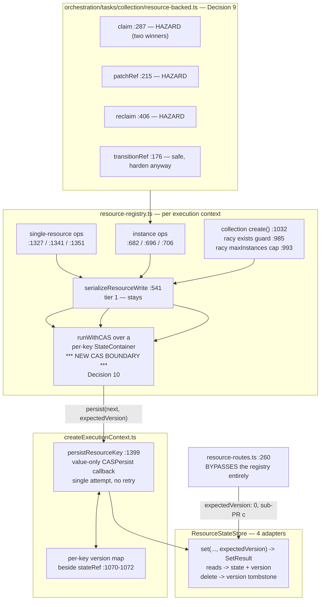

# FIX-992: `ResourceStateStore.set` has no `expectedVersion` — the CAS contract its sibling stores carry — Implementation Spec

> **Linear issue:** [FIX-992](https://linear.app/fixpoint-labs/issue/FIX-992/resourcestatestoreset-has-no-expectedversion-the-fix-400-cas-contract) · **Epic:** [FIX-980](https://linear.app/fixpoint-labs/issue/FIX-980/epic-honest-task-substrate-every-write-path-reports-what-it-actually) — Honest task substrate

## Spec evolution *(the change story, not an audit log)*

- **Spec drafted** — Framed as an unfinished refactor (the issue's framing: a contract dropped by the FIX-689 split), scoped as copying `ExpectedVersion` / `SetResult` onto the sibling store across four adapters, with CAS placed at `persistResourceKey`. Large / 3 sub-PRs.
- **Framing corrected before review.** The issue's title attributes the gap to *"the FIX-400 CAS contract wasn't carried through the FIX-689 split."* `FIX-400` appears nowhere in `stores/types.ts`; the store's own header calls itself *"the state-layer twin of `ContentStore` (FIX-689)"* (`:537`) with *"plain per-key last-write-wins (no CAS), matching `ContentStore`"* (`:542`). **The wrong model was deliberately chosen, not a contract dropped** — one store serving two access patterns with one concurrency model. §2 carries it; the title is left as the owner wrote it, with the correction flagged on the issue. Separately verified: FIX-492 did **not** remove the CAS retry loop (Decision 6).
- **Replay hazard pulled into scope.** Real CAS replays the updater, and three resource-backed task updaters capture results outside the closure without resetting — a losing worker would emit a stale claim and both workers would believe they won. Correct today, broken the moment CAS lands, so it is this change's to own (Decision 9), hardened in sub-PR **a** ahead of the switch.
- **After spec review (round 1) — CAS moved off `persistResourceKey`, and the version's meaning pinned.** Two roots, both folded because both invalidated the design as drafted. (1) `persistResourceKey` is **value-only** (`resource-registry.ts:473`), and the write ops materialize the complete next object *before* calling it — so a retry there would re-write a stale value and **clobber a concurrent writer's different field**, defeating the merge this spec claims to deliver. CAS moved to the registry's **read/mutate seam**, driven by `runWithCAS` over a per-key `StateContainer`, which is the scope layer's existing architecture rather than an approximation of it (Decision 10). (2) The version was underspecified, which produced two symptoms: an **ABA hole** (delete + recreate restarting at 1 let a stale `expectedVersion: 1` succeed against a different object — a hole this spec's own §10 had asserted as correct behaviour) and a **legacy-row collision** (a legacy row defaulting to 0 made `expectedVersion: 0` match an existing item). Both resolve from one definition: monotonic, never reset, tombstoned on delete, with **0 reserved exclusively for absence** and legacy rows migrating to **1** (Decision 11). Also folded: the create route's content-before-state ordering (Decision 12), and **two writers round 1's audit had missed** — collection `create()` at `resource-registry.ts:1032` and the `maxInstances` cap at `:993`, the latter being a *set*-level invariant a per-key CAS cannot close (§7).

---

## For reviewers — what this document is

This is a **direction document**, not an implementation. Reviewing it well means answering one question: **is this the right approach?**

**In scope to challenge:**

- The problem framing — are we solving the right thing?
- The approach — will it work, does it fit the architecture and `docs/philosophy.md`?
- Any numbered **Decision** in §6 — that's the sign-off surface.
- Missing constraints, edge cases, or dependencies that would **invalidate** the design.
- Scope — a deliverable that shouldn't ship, or one that's missing.

**Out of scope — deliberately unsettled here, and owned by the implementing agent:**

- Names, signatures, file paths, and module layout.
- Local structure: which helper, how a function is decomposed, error-message wording.
- Micro-optimizations and style preferences.
- Test names and internal test structure (the *behaviours* to test are in §10; the tests themselves are not).
- Anything Part II left open on purpose — it is directional by design, and a gap at that altitude is intended, not an omission.

Feedback in the second list is welcome and gets **recorded verbatim in §13** for the implementer to weigh against real code. It will not be argued with, and it will not be folded into the design prose — that would pretend the spec can settle something it can't. Please don't re-raise it: one mention is enough for it to land in §13.

**Three requests specific to this spec.**

1. Several claims **correct** what the Linear issue asserts, each carrying a `file:line` that was read. If you disagree with one, point at the line rather than the claim. **The issue's title is among them** (§2); it has not been rewritten, and the correction is flagged on the issue for the owner.
2. **Decisions 10 and 11 are the crux and both came from round-1 review.** 10 places the CAS boundary; 11 defines what a version means. Everything else follows from them, so a reviewer pressure-testing those two is doing the highest-value thing available here.
3. **§7's writer table is the completeness surface.** Round 1's table had seven rows and was wrong — two writers were missing. If you can find a ninth path that reaches resource state, that is the single most useful thing you can report.

---

## Part I — The Case *(for the human)*

### 1. Problem — why it matters, why now

**In plain language.** When two pieces of work running at the same time both update the same stored item, one of them silently disappears. Each reads the item, each makes its change, each saves — and whoever saves second wins, overwriting the first without any error. The framework already has the machinery to prevent exactly this, and uses it for session, request, user and org data. The store that holds *resource* data doesn't have it, because it was modelled on a different store where the machinery isn't needed.

**Why now.** Two things make this the moment. First, it is a live data-loss path, not a theoretical one: the write serialization that looks like it protects these writes is built per execution context, so two concurrent requests in a single Node process are not serialized against each other at all. Second, it now blocks work. [FIX-989](https://linear.app/fixpoint-labs/issue/FIX-989) needs to tell a caller whether its own write landed; it cannot answer that soundly on the durable backing while an overwrite can silently erase the evidence. FIX-989's spec wrote that fork up as its own blocking open question — degrade the answer, or fix the store — and **the owner chose to fix the store.** This issue is that decision.

No workaround covers it. The one that looks like it does is the per-context write queue, and §3 explains why it can't.

### 2. Solution in plain terms

**First, the accurate framing — because the issue's own title gets it wrong, and the accurate version is a better argument.**

The issue says the CAS contract *"wasn't carried through the FIX-689 split"* — a refactor dropping a guarantee. The code says otherwise. `ResourceStateStore`'s header describes itself as *"the state-layer twin of `ContentStore` (FIX-689)"* (`stores/types.ts:537`) and states its concurrency posture as a decision: *"plain per-key last-write-wins (no CAS), matching `ContentStore`"* (`:542`). `FIX-400` appears nowhere in the file. Nothing was dropped. **A model was chosen — the content store's — and it was the wrong one for what this store ended up holding.**

That distinction shapes the whole fix. Last-write-wins is *correct* for content: nothing merges a document body against a prior read, so a later write legitimately wins. It is *wrong* for structured state that concurrent workers read-modify-write, which is what resource state became when it started backing task boards. **One store is serving two access patterns with one concurrency model.** The header's rationale was also narrower than it reads — per-resource keying did remove the whole-*map* clobber it claims, and left the per-*key* lost update untouched.

**The fix.** Give resource state the same versioned-write contract its four sibling stores already have, and put the retry loop where the mutation intent still exists.

Every stored row carries a version. A reader gets the version with the state. A writer says "write this, only if the version is still what I read", and on a mismatch gets the current state and version back so it can **re-run its own change against the truth** — a merge, not a blind overwrite. None of it is invented here: `ExpectedVersion` (`stores/types.ts:166`) and `SetResult` (`:174-179`) are live exported types; `SessionStore` / `RequestStore` / `UserStore` / `OrgStore` all take `expectedVersion` and return the conflict shape (`:261-268`, `:277-281`, `:428-432`, `:440-444`) against `ResourceStateStore.set`'s bare `Promise<void>` (`:550-551`); and `runWithCAS` (`stores/cas.ts:119-175`) is the driver, consumed exactly as `state-container.ts:159` consumes it. `ContentStore` keeps last-write-wins, because for content that is the right model.

**The philosophy that led here.**

- **Tenet 1 (coherence over local cleverness).** The strongest argument for this change is that it invents nothing. The contract, the conflict shape, the retry driver, the container abstraction it drives, the two-tier dispatch, the SQL migration idiom, the cross-adapter conformance harness, and even the reset-on-replay discipline Decision 9 needs all exist in this repo. The review bar is "does it match the sibling", not "is this concurrency design correct". Round 1 confirmed the value of that bar the hard way: the one place the draft *deviated* from the sibling — putting CAS at a value-only persister instead of at a read/mutate seam with a container — is exactly where it broke.
- **Tenet 5 (fix at the owning layer, and find where paths converge).** The lost update is in the storage layer, so the guard belongs there. §7 names the convergence point, every writer that reaches it, the two that bypass it, and one invariant (the instance cap) that per-key CAS honestly cannot close.
- **Tenet 3 (earn every addition).** No new concept and no new knob for callers. The one genuine addition — a delete tombstone (Decision 11) — is justified by the specific requirement it protects, not by symmetry.

### 3. Tradeoffs & alternatives

**The alternative the owner rejected: degrade the read.** FIX-989 could have avoided this work by never returning a definitive "your write did not land" on the resource backing — falling back to "cannot tell" whenever an overwrite could have erased the evidence. That was option (a) in FIX-989's OQ-1, and its own spec recommended it on tenet-3 grounds (no consumer yet). **The owner rejected it**, and the reason is the stronger argument: the epic's objective is an honest substrate, and (a) leaves the *durable* backing — the one the docs advertise for cross-session boards — least able to answer the question the epic exists to answer. It also fixes nothing else, where this fixes the lost update itself.

**The simpler approach considered, and why it is insufficient.** The obvious cheaper move is "we already serialize resource writes — just make that serialization wider." `serializeResourceWrite` chains writes per storage key (`resource-registry.ts:530-546`) and looks sufficient. It is not, and the reason is structural rather than a tuning problem: `resourceWriteChains` is a `const` **inside** `createScopeResourceRegistry` (`:540`), and registries are constructed per execution context (`createExecutionContext.ts:1649`, `:1664`, `:1682`). The state caches are per-context locals too (`:1070-1072`), and `persistResourceKey` blind-`set`s then updates **only its own** cache (`:1399-1405`). So two contexts both read revision N and the second overwrites the first. Widening the queue to process scope would mean a process-global lock on every resource write — a bigger behavioural change than CAS, and still wrong across processes.

**A second simpler approach, considered and rejected in round 1: conflict *detection* without merge.** Leaving CAS at the value-only `persistResourceKey` and retrying with the already-computed value is much less code. It reliably detects conflicts — and then resolves every one of them by overwriting the competing field, because the retry re-writes a value computed from stale state. That delivers the error surface without the correctness, which is worse than either doing it properly or not doing it: callers would see conflicts handled and still lose data. Decision 10 takes the honest route.

**Where the genuine complexity is.** Not the CAS statements. Five places, in descending order:

1. **Moving the CAS boundary (Decision 10).** The retry must re-run the *mutator*, which means the loop belongs above the value-only persister, in the registry where `readState()` and the mutation function both exist. That touches the registry's option contract and every write op — the largest structural change here.
2. **The replay hazard this creates (Decision 9).** Once the mutator re-runs, three resource-backed task updaters emit stale outcomes, including two workers both believing they claimed one task. The only part of this change that makes correct code wrong.
3. **Version semantics, including a delete tombstone (Decision 11).** "Monotonic and never reset" is easy to say and requires `delete` to leave something behind, which touches every adapter's read filtering.
4. **The filesystem adapter, which the issue estimated as the cheapest.** Its own file is 27 lines because its `set` lives in a **484-line generic factory shared with `ContentStore`** (`filesystem/filesystem-resource-store.ts`, `KeyedResourceStore<T>` at `:61-72`, consumed by `content-store.ts:17` and `resource-state-store.ts:20`). Since `ContentStore` keeps LWW, the two shapes **diverge for the first time** — and that factory plus the shared conformance runner (`stores/testing/resource-store-conformance.ts:180-207`, one generic `runKeyedResourceStoreConformance<T>` serving both) both assume they match. There is also no atomic CAS primitive on a filesystem: `set` is temp-write-then-`rename` (`:376-388`). Decision 5 scopes it.
5. **The read shape.** Callers can only CAS against a version they were given, and the engine hydrates most resource state through the *bulk* readers, not the single-key one — so the version must come back from all three reads or the fix is inert for eagerly-declared resources, which are the default.

### 4. Focus practices (1–5)

- **Put the retry where the intent lives (tenet 1/5).** A retry loop over a materialized value cannot merge; it can only overwrite. Any CAS boundary must sit where the mutator can be re-run. This is the rule round 1 caught the draft breaking, and it generalizes past this issue.
- **Reset captured state on every closure invocation (tenet 1).** Not yet a BP, and the corollary of the above. Any closure a CAS may replay must treat each invocation as the first: nothing captured outside it may survive a non-committing branch. `sequencer-backed.ts` already does this (`:209`, `:237`, `:314`, reason at `:435`) and is the reference.
- **BP-030 — tolerate the old shape.** Load-bearing twice, and Decision 11 is where round 1 found the draft getting it wrong: a legacy row must not be readable as *absent*, so it migrates to version 1, not 0.
- **Tenet 5's convergence rule.** §7 enumerates all nine writers. Round 1's table had seven and shipped two misses, which is the evidence that enumerating is not optional here.
- **BP-035 — walk the second path.** The conflict path, the replay path, the legacy path, the delete-recreate path, and the *off* state (`"any"`).

### 5. What using it looks like

The public flow-authoring API does not change: nobody writes `expectedVersion` in flow code. These are the **framework-internal** surfaces adapter authors and engine code write against.

**Before / after — the store contract.**

```ts
// before: a blind put, no way to detect a lost update
await stores.resourceState.set("session", sessionId, "tasks/t1", nextState);

// after: write only if nobody moved it since we read
const read = await stores.resourceState.get("session", sessionId, "tasks/t1");
//    read is now { state, version } | undefined  (was: JsonObject | undefined)
//    undefined means never existed OR deleted; either way expectedVersion 0 is wrong
//    if a tombstone carries a version — see Decision 11
const result = await stores.resourceState.set(
  "session", sessionId, "tasks/t1", nextState, read?.version ?? 0
);
if (!result.ok) {
  // result.conflict.currentValue / .currentVersion — re-apply against the truth
}
```

**Opting out is explicit, not implicit.** Every caller that genuinely wants last-write-wins says so, and the compiler makes anyone who forgets choose:

```ts
await stores.resourceState.set("session", sessionId, key, value, "any"); // deliberate LWW
```

**What actually changes for a flow author: nothing they write, and one thing that stops being wrong.** Two contexts patching *different fields* of one resource today lose one field. After this they merge, because the losing writer re-runs its patch against the winner's state:

```ts
// unchanged flow code, in two concurrent execution contexts
await ctx.sessionResources.task.patchState({ claimedBy: "worker-a" });  // context 1
await ctx.sessionResources.task.patchState({ note: "in progress" });    // context 2
// before: one of the two fields is silently gone
// after:  both present
```

**The one rule updater authors must now follow — and the bug it prevents.** An updater may run more than once, so anything it captures must be reset each time:

```ts
// BEFORE — correct today, wrong once the write is a CAS:
let claimed: Task | undefined;
await ref.updateState((current) => {
  if (!eligible(current)) return current;   // replay lands here after losing the race…
  claimed = next;                            // …but `claimed` still holds attempt 1's task
  return next;
});
if (claimed) emit("claimed", claimed);       // two workers both think they won

// AFTER — reset on entry, as the sequencer backing already does:
await ref.updateState((current) => {
  claimed = undefined;                       // every invocation is the first
  if (!eligible(current)) return current;
  claimed = next;
  return next;
});
```

### 6. Decisions & rules — the sign-off surface

1. **Reuse `ExpectedVersion` and `SetResult<JsonObject>` verbatim; do not spell the contract a second time.** *Alternative rejected:* a resource-specific conflict type, or a bespoke `compareAndSet` taking an expected *state*. *Ramification:* the store reads as a sibling, and `runWithCAS`'s `CASPersistResult` (`cas.ts:70-82`) is a field-name adaptation rather than a new integration. Locks us to a version number as the concurrency token, which every sibling already uses.

2. **Widen the existing six methods; do not add a parallel versioned trio.** `get` / `getAll` / `getByPrefix` return state **and** version; `set` takes `expectedVersion` as a **required** parameter and returns `SetResult`. *Alternative rejected:* adding `getVersioned` / `setVersioned` beside the current six (12 methods), or making `expectedVersion` optional. *Ramification:* a **breaking change to an internal store interface** — ~10 read call sites and every adapter in lockstep — and that is deliberate. An optional parameter or a parallel method lets a *new* caller silently get last-write-wins, the exact failure being fixed; required makes the compiler enumerate every caller so each posture is a decision. The store interface is not published API; no external consumer breaks.

3. **`ContentStore` keeps last-write-wins and the two stores diverge — because LWW is right for content, not because content is out of budget.** *Alternative rejected:* versioning both to keep the shared factory and conformance runner symmetric. *Ramification:* the generic `KeyedResourceStore<T>` factory and the generic conformance runner must each grow a version-aware variant or split — the largest mechanical cost in sub-PR **a**. Accepted because content bodies have no read-modify-write hazard. This is the decision that resolves "one store serving two access patterns" (§2): we split the *model*, not the store.

4. **The guarantee is per-adapter and stated honestly: real CAS on memory / SQLite / Postgres, same-process-only on filesystem.** *Alternative rejected:* an atomic filesystem CAS via exclusive-create (`link()` + `EEXIST`, the trick the factory already uses for its layout marker at `:293-305`), and equally, refusing filesystem CAS entirely. *Ramification:* filesystem CAS is a per-key mutex on the store **instance** plus a compare-under-lock — closing exactly the defect this issue reports (two execution contexts, one process) and **not** protecting two OS processes over one directory. Documented, not implied: the same honesty the docs already apply to this adapter (`persistence/overview.md:66`) and the rule FIX-989 set for itself. Cross-process filesystem CAS is filed (§12), not silently skipped.

5. *(merged into Decision 4 — kept as a number so round-1 review references stay resolvable: see Decision 4.)*

6. **`serializeResourceWrite` stays, and this is not a compromise — it is the sibling architecture.** *Alternative rejected:* removing it and letting CAS retries absorb all contention. *Ramification:* the issue framing warned against "reintroducing the retry loop FIX-492 removed", and **that framing is incorrect in a way that decides this.** FIX-492 did not remove the retry loop; it built a **two-tier dispatch** (`state-container.ts:109-167`) where in-memory containers serialize (`withScopeLock`) and external stores still run `runWithCAS` — `scope-lock.ts:3-4` says so outright ("CAS retries still apply at the durable boundary in `runWithCAS`"), and the published docs carry it under *"External-store scopes still use CAS"* (`apps/docs/docs/state/mutation-model.md:39-43`). The conformant shape is *both* tiers, and `serializeResourceWrite` is the resource-layer analog of `withScopeLock`. Keeping it is load-bearing, not tidy: `mutation-model.md:35` records why the queue exists — *"concurrent task-board workers create predictable, sustained contention, and the retry budget exhausts long before all writers can land"* — and task-board workers are this issue's consumers. It also **reduces how often Decision 9's replay path runs**, which is a correctness argument as well as a performance one.

7. **Every writer gets an explicitly decided posture; none is left to a default.** *Alternative rejected:* defaulting unconverted callers to `"any"` implicitly. *Ramification:* §7's table assigns all nine. Six registry ops merge via CAS; collection `create()` and the create route become `expectedVersion: 0` with real conflicts; the `maxInstances` cap is explicitly **not** closed by this change (it is a *set*-level invariant — see §7 and FIX-981).

8. **Write ops report whether they committed, and the change notification fires only when they did.** *Alternative rejected:* leaving the notification unconditional and filing the spurious emit. *Ramification:* `persistResourceKey` skips the write when the value deep-equals the cache (`createExecutionContext.ts:1402`) but `updateState` calls `notifyInstanceChange` unconditionally after (`resource-registry.ts:706-719`), so a same-value write emits `resource_change` today. This lands **here, not in FIX-989**, because the CAS is what produces a trustworthy answer (`runWithCAS` already returns `{ committed }` — `cas.ts:112-115`), and it matches the sibling exactly: `ScopeStateOps` methods already return that boolean and suppress the paired `state_change` emit (`core/src/types/state.ts:26-33`). FIX-989's Decision 7 consumes it rather than reimplementing it.

9. **This change makes replay real, so every closure a CAS may replay is hardened first — and the hardening ships before the switch.** *Alternative rejected:* treating it as the consumers' problem (it is not — blind writes never replay, so the pattern is correct today and only this change breaks it), and equally, hardening in the same PR that activates CAS. *Ramification:* three resource-backed updaters capture their result outside the closure and leave it set on a non-committing branch. The worst is `claim` (`resource-backed.ts:287-303`): attempt 1 sets `claimed`, the CAS conflicts because another worker won, the replay's eligibility re-check returns early **without clearing `claimed`**, and the loser emits a stale `claimed` and returns it — **both workers believe they won.** `patchRef` (`:215-238`) and `reclaim` (`:406-449`) share the shape; `transitionRef` (`:176-212`) is safe but only incidentally. §7 enumerates all four. The reset is a **no-op before CAS exists**, so it ships in sub-PR **a**: no ordering window in which CAS is live and updaters are unhardened, and the hardening gets reviewed on its own merits. A **contended** test is mandatory (§10).

10. **CAS lives at the registry's read/mutate seam, not at `persistResourceKey`.** *Alternative rejected:* the draft's placement — CAS inside `persistResourceKey` — and the "widen the persister to carry mutation intent" variant. *Ramification, and this is the load-bearing call:* `persistResourceKey` is declared value-only (`resource-registry.ts:473`, provided at `createExecutionContext.ts:1399`), and the write ops materialize the complete next object before calling it (`:690`, `:715`, `:1335`, `:1362`). A retry at that boundary re-writes a value computed from stale state, so **two contexts patching different fields would still lose one** — the exact merge this spec promises. Moving the loop up to where `readState()` and the mutator both exist makes the retry re-run the *intent*. Concretely: each write op drives `runWithCAS` with a per-key `StateContainer`, and `persistResourceKey` becomes the single-attempt `CASPersist` callback (gaining `expectedVersion` and a result, staying value-only). That is `state-container.ts:159`'s architecture applied one layer down, so the alternative — teaching a value-only persister to express "retry this intent" — was rejected as inventing a second mechanism for something `runWithCAS` already does. Cost: the registry's option contract changes, and its four test mocks (`test/context/resource-registry.spec.ts:61`, `:84`, `:113`, `:143`) update with it. `setState`'s intent is *replace*, so its retry re-applies the same value — conflict still detected, no merge attempted, which is correct for replace semantics.

11. **A version is monotonic per key, never reset, and 0 means "never existed" and nothing else.** *Alternative rejected:* the draft's "restarts at 1 after delete" (which §10 had asserted as *correct*), and separately, accepting ABA because the sibling stores have the same exposure. *Ramification:* two round-1 findings collapse into this one definition. (a) **ABA:** a reader observes version 1, another context deletes and recreates the key, recreation restarts at 1, and the stale `expectedVersion: 1` write **succeeds against a different object** — defeating the "an earlier observation detects intervening change" requirement FIX-989 depends on. So `delete` leaves a **version-carrying tombstone** and a recreate continues from it; `deleteAll` (whole-scope teardown) hard-purges, since there is no surviving observer to fool. (b) **Legacy rows:** they must never read as absent, so the migration default is **1, not 0** — which also means `expectedVersion: 0` correctly *fails* on an upgraded item, so the create route's racy pre-read can be dropped (Decision 12) rather than kept as a permanent transitional crutch. The sibling-parity argument was rejected because the exposure is not comparable: session ids are unique per session, while resource keys are routinely deleted and recreated at the *same* key (`resolveCollectionKey(pattern, topic)`). Cost: reads filter tombstones in all four adapters, and tombstones accumulate per distinct key ever used in a scope until `deleteAll`.

12. **The create route reserves state first, then writes content, and rolls back on content failure.** *Alternative rejected:* keeping today's content-before-state order, and separately, declaring this out of scope as a pre-existing bug. *Ramification:* today `handleCreateCollectionItem` writes content at `resource-routes.ts:257` before state at `:260`, with a comment explaining why (a failed state write leaves recoverable orphaned content). Under CAS that ordering produces a **worse** outcome than it fixes: both concurrent creates write content, one state CAS loses and returns 409, and the **rejected** request's content stays attached to the winner's state. It is genuinely pre-existing — today both requests also return 201 — but sub-PR **c** is already rewriting this handler's concurrency behaviour, and shipping "the 409 is now correct but the stored content may be the loser's" is precisely the half-honest fix this epic exists to avoid. So: reserve the key with `expectedVersion: 0` first, return 409 on conflict **without writing content at all**, then write content, and delete the reserved row if the content write fails. Its test must assert the **persisted content**, not just the status codes — a 201/409 assertion passes with the wrong body stored, which is the trap.

**Non-goals.** Cross-record / multi-key transactional boundaries ([FIX-854](https://linear.app/fixpoint-labs/issue/FIX-854)). Cross-execution task-claim safety at the *protocol* level and the `maxInstances` cap race ([FIX-981](https://linear.app/fixpoint-labs/issue/FIX-981) — this **enables** closing them and does not close them; §7). `ContentStore` versioning. Cross-process filesystem CAS. Any change to the public flow-authoring API. FIX-989's provenance mechanism. Fixing the `deepEqual`-against-stale-cache write *skip* (§7 — Decision 8 fixes only the notification half).

**Size: Large — multi-PR.** Well over 500 LOC across three packages: the contract and four adapters, tombstones, two migrations, the conformance-harness split, the CAS boundary move, the replay hardening, the route rewrite, and tests. FIX-989's spec predicted this when it filed the work. PR plan in §8.

---

## Part II — The Build Plan *(for the implementing agent)*

### 7. Technical design

Three layers change: the **store** grows the contract, the **registry** gains the CAS loop, and one **consumer** package is hardened for replay.



**Why the boundary moved (Decision 10).** `persistResourceKey` is `(key, value) => Promise<void>` (`resource-registry.ts:473`). The write ops compute the complete next object first — `updateObjectState(prev, updates)` at `:690` / `:1335`, `await updater(readState())` at `:715` / `:1362` — so by the time the persister runs, the *intent* is gone and only a value derived from a possibly-stale read remains. Retrying there re-writes that stale value. The loop therefore belongs where both `readState()` and the mutation function are in scope, which is inside the write ops. `runWithCAS({ container, mutator, persist })` consumes exactly that shape, so the registry builds a per-key `StateContainer` (`core/src/types/state.ts:15-24` — `read` / `getVersion` / `commit`) and `persistResourceKey` becomes the `persist` callback. Blast radius of the option-contract change: one production provider (`createExecutionContext.ts:1399`), three registry call sites (`:615`, `:627`, `:1032`), four test mocks (`test/context/resource-registry.spec.ts:61`, `:84`, `:113`, `:143`).

**Writer table — all nine paths. Round 1's version had seven and missed two; treat this as the completeness surface.**

| # | Writer | Reaches the CAS boundary? | Posture | Sub-PR |
|---|---|---|---|---|
| 1–3 | single-resource `patchState` / `setState` / `updateState` `:1327` / `:1341` / `:1351` → `persistResourceState` `:615` | yes | merge via CAS retry (`setState` = replace, detect only) | b |
| 4–6 | instance `patchState` / `setState` / `updateState` `:682` / `:696` / `:706` → `persistNamespaceInstanceState` `:627` | yes | merge via CAS retry | b |
| 7 | **collection `create()` / `create({ replace })` `:1032`** — *missed in round 1* | yes | `expectedVersion: 0` for create (replaces the racy `exists && !replace` throw at `:985`); `"any"` for `replace` | b |
| 8 | create-collection-item route `resource-routes.ts:260` | **no — direct store call, outside the registry and the queue** | `expectedVersion: 0`, real 409, state-before-content (Decision 12) | c |
| 9 | `evictInstance` `:1004` → `deleteResourceKey` | delete path | leaves a version tombstone (Decision 11) | a |

**One invariant this change honestly does not close — say so rather than let a reader assume.** `create()` checks `maxInstances` by counting instances at `:993-1003` before writing. That is a **read-then-act on a set**, and a per-key CAS cannot make it safe: two concurrent creates of *different* keys both count N−1 and both succeed, exceeding the cap. This is the registry-level twin of [FIX-981](https://linear.app/fixpoint-labs/issue/FIX-981)'s "both pass a creation cap", it needs a set-level primitive (a counter row under CAS, or FIX-854's cross-record boundary), and it is **out of scope**. Recorded here because the writer table would otherwise imply the cap is covered.

**Replay audit — the four resource-backed updaters (Decision 9).** Enumerated individually, because one is already safe and the reason matters.

| Updater | Captured outside | Non-committing branch | Verdict under replay |
|---|---|---|---|
| `claim` `:287-303` | `claimed`, `prevStatus` | `if (!eligibility(task)) return current` `:293` — silent, no reset | **HAZARD, worst case.** Loser emits a stale `claimed` and returns it; two workers both believe they won |
| `patchRef` `:215-238` | `nextTask` | `if (update === undefined) return current` `:229` — silent, no reset | **HAZARD.** Stale `nextTask` emitted. Reached by `assignTask` `:453`, `setPriority` `:459`, `addLabel` `:465`, `removeLabel` `:473`, `setMetadata` `:481` |
| `reclaim` `:406-449` | `next` | status/lease re-check `return current` `:428` — silent, no reset | **HAZARD.** Stale `resumed` emit, and `reclaimed.length` over-reports the count it returns |
| `transitionRef` `:176-212` | `prevStatus`, `nextTask` | **none silent** — every non-committing branch throws (`TransitionDeclined` `:195`, `assertTransitionAllowed` `:196`) and the `catch` returns before the emit `:202-207` | **Safe today, but only incidentally.** Its safety rests on no branch ever returning quietly. Harden it too, so the invariant is uniform rather than emergent |

**The reference discipline already exists in-repo.** `sequencer-backed.ts` replays its mutator through `casWrite` and resets on every non-committing branch — `captured = undefined` at `:209`, `:237`, `:314` — with the rule stated at `:435` (*"Reset on every CAS retry — `casWrite` may replay this closure"*) and the semantics at `:123-124`. Copy that shape.

**Version semantics (Decision 11), stated once so every adapter implements the same thing.**

- `0` means **never existed**. It is never a live row's version. `expectedVersion: 0` therefore means *create-if-absent*, exclusively.
- A first create writes version `1`. Each committed write increments by exactly 1.
- `delete` **does not remove the version**: it leaves a tombstone carrying the last version. Reads treat a tombstone as absent (`get` → `undefined`; excluded from `getAll` / `getByPrefix`), but a recreate continues from `tombstone.version + 1` — so a pre-delete observer's `expectedVersion` never matches a post-recreate row. That is the ABA fix.
- `deleteAll` (whole-scope teardown) hard-purges tombstones. The scope is gone; no surviving observer can be fooled.
- **Legacy rows migrate to `1`, not `0`** — a pre-existing row exists, and must not be readable as absence.

**Readers that must carry the version** (mechanical, sub-PR **a**): `createExecutionContext.ts:1186`, `:1213`, `:939`, `:986`, `:1279`, `resources/internal.ts:195` / `:209` / `:219`, `routes/state-routes.ts:153-155`, `routes/resource-routes.ts:429-430` / `:522` / `:317` / `:239`. Most discard it; the ones feeding the context cache keep it.

**Deliberately unchanged, verified rather than assumed.** `resource-routes.ts:317` reads resource *state* only as an existence probe and then writes `ContentStore` (`:323`) — it never calls `resourceState.set`, so it needs no version. The sequencer and request task backings route through `atomicState` → real CAS already, and are already replay-safe. `ContentStore` is untouched.

**The `deepEqual` short-circuit at `:1402` stays.** It skips the store write when the value equals the *cached* value, so a write matching a stale cache never reaches the CAS. A real honesty hole — FIX-989's third filed follow-up — but **pre-existing and unchanged here**, and `runWithCAS` carries the identical no-op short-circuit (`cas.ts:143-145`), so removing it would diverge from the sibling. Decision 8 fixes the *notification* firing on a skipped write; the skip being computed against a stale cache stays filed.

**Rewrite the interface doc comment.** `types.ts:537` and `:542-544` document the LWW posture as a decision. All three statements become wrong. Replace them with §2's account: this store is the twin of `ContentStore` in *storage layout* and of the scope stores in *concurrency model*. A comment contradicting the code is itself incoherence (tenet 1).

### 8. Implementation sequence

**PR plan.**

| sub-PR | deliverables | depends_on |
|---|---|---|
| a | Contract on `ResourceStateStore` (`ExpectedVersion` + `SetResult`, versioned reads, delete tombstones); version semantics per Decision 11 in all four adapters; SQLite + Postgres `version` migrations defaulting to **1**; split/parameterize the shared filesystem factory and conformance runner; CAS + tombstone + ABA conformance cases across all four adapters; **replay-safety hardening of the four resource-backed updaters**; ~10 read call sites and all writers updated to explicit `"any"` — **no behaviour change at runtime** | — |
| b | CAS boundary move (Decision 10): per-key `StateContainer` + `runWithCAS` in the registry write ops; `persistResourceKey` becomes the value-only single-attempt `CASPersist`; per-key version tracking beside the context caches; registry option contract + four test mocks; collection `create()` → `expectedVersion: 0`; `committed` surfaced and `notifyInstanceChange` gated on it (Decision 8) | a |
| c | Create route: state-reserved-first with `expectedVersion: 0`, real 409, rollback on content failure (Decision 12); drop the racy `:239` pre-read; docs corrections (§11) | a |

Branches `fix/FIX-992-a` / `-b` / `-c`; **b** and **c** are independent of each other and build in parallel off **a**.

**Why the hardening is in `a`, not `b`.** Everything in **a** is behaviour-preserving, including the resets (no replay exists yet, so they cannot change an outcome). That guarantees no commit exists in which CAS is live and an updater is unhardened, and keeps **b**'s diff reviewable without a concurrency audit riding along.

**Sub-PR a.**

1. Widen `ResourceStateStore` in `stores/types.ts`; rewrite the stale concurrency comment; write Decision 11's semantics into the interface doc (BP-007). → *test:* typecheck fails at every caller that must decide; that failure list **is** the reader/writer audit.
2. Split or parameterize `KeyedResourceStore<T>` / the filesystem factory so a versioned variant exists without changing `ContentStore` behaviour. The delicate step; the rest of **a** is mechanical. → *test:* `ContentStore` conformance and the filesystem guard-conformance suite stay green untouched.
3. Memory adapter: `{ state, version }` in the Map; delete leaves `{ state: undefined, version }`. → *test:* CAS + tombstone + ABA cases.
4. Filesystem adapter: version inside the `.json` envelope, missing field reads as **1** (an existing file is an existing row — BP-030); tombstone as a version-only envelope; per-key mutex on the store instance + compare-under-lock. Do **not** bump `LAYOUT_VERSION`. → *test:* CAS cases; a pre-existing versionless file reads as 1 and updates without a wipe.
5. SQLite: `ADD COLUMN version INTEGER NOT NULL DEFAULT 1` behind a `pragma_table_info` probe (copy `schema.ts:106-119`); nullable `state` for tombstones; CAS statements per the `sqlite-store.ts:179-228` idiom. → *test:* CAS cases; migration idempotent across two boots; legacy row reads at 1 and `expectedVersion: 0` against it conflicts.
6. Postgres: same via `ADD COLUMN IF NOT EXISTS ... DEFAULT 1` (`schema.ts:302-303`) and the `pg-store.ts:225-260` idiom. → *test:* as above.
7. Split the conformance runner so `createResourceStateStoreConformanceTests` gains the CAS/tombstone/ABA cases and `createContentStoreConformanceTests` does not. All four adapters already call the state suite (`engine/test/resource-state-store.test.ts:225`, `store-sqlite/test/resource-durability.test.ts:47`, `store-postgres/test/resource-stores.test.ts:55`) — the evidence path for "every adapter honours the contract", nearly free.
8. **Harden the four updaters** in `orchestration/.../resource-backed.ts` per §7, mirroring `sequencer-backed.ts`. → *test:* per updater, invoke the closure twice with the second pass on a non-committing branch; assert the captured result is cleared. Testable without CAS being live, which is why it lands here.
9. Update all readers; pass `"any"` at every writer. → *test:* full existing suite green, no behavioural diffs.

**Sub-PR b.** Build the per-key `StateContainer` in the registry (`read` from the cache, `getVersion` from the new per-key version map, `commit` updating both), drive `runWithCAS` from each write op with the op's real mutator, and reduce `persistResourceKey` to a single-attempt persist returning a result. Adapt `SetResult` → `CASPersistResult` (field naming only). Keep `serializeResourceWrite` in front. Convert collection `create()` to `expectedVersion: 0`, replacing the `:985` throw with a conflict-derived error. Surface `committed`; gate `notifyInstanceChange` on it. → *test:* §10's contention block.

**Sub-PR c.** Invert the create route to reserve state first, return 409 from the conflict, write content after, and delete the reserved row on content failure. Drop the `:239` pre-read — safe only because Decision 11 makes `expectedVersion: 0` fail on a legacy row. Docs per §11.

**What gets removed.** The stale concurrency doc comment (`types.ts:537`, `:542-544`) is replaced. The route's `:239` pre-read and the registry's `:985` `exists && !replace` throw are both replaced by real conflicts. `serializeResourceWrite` is explicitly *retained* (Decision 6) — stated so a reviewer doesn't hunt for a subtraction that isn't coming.

### 9. Edge cases & error handling

| Case | Expected behaviour |
|---|---|
| Legacy SQL row, no version column before migration | Migration adds `DEFAULT 1`; row reads as version 1 — **never as absent**; no backfill; second boot is a no-op |
| Legacy filesystem `.json` with no version field | Reads as 1 (BP-030 dual-read); layout marker untouched, store not refused |
| `expectedVersion: 0` against a legacy row | **Conflicts.** A legacy row exists, so create-if-absent must fail. This is what lets the route's pre-read be dropped |
| Row never existed, two writers both `expectedVersion: 0` | First inserts at 1; second's CAS matches nothing and its insert hits the PK → conflict |
| **Delete then recreate; a pre-delete observer writes with its old version (ABA)** | Tombstone preserved the version, recreate continued from it, so the stale `expectedVersion` **does not match** → conflict. Decision 11's core case |
| Read after delete | `get` → `undefined`; key excluded from `getAll` / `getByPrefix`. The tombstone is invisible to readers |
| `deleteAll` then recreate the same key | Versions restart at 1. Accepted: whole-scope teardown leaves no observer to fool |
| `expectedVersion: "any"` | Plain upsert, today's behaviour exactly. Every pre-existing caller after sub-PR **a** |
| **Two contexts patch different fields of one resource** | Loser's mutator re-runs against the winner's state; **both fields present**. The merge Decision 10 exists to deliver |
| Two contexts `setState` the same resource | Conflict detected, retry re-applies the same value; last writer wins *by intent*. No merge attempted, correctly |
| **Updater replayed, second pass takes a non-committing branch** | Captured result must be `undefined` → no emit, no stale return. Decision 9's core case |
| **Two workers `claim` the same task** | Exactly one `claimed` emit; the loser returns null or claims a different candidate. Never two winners |
| `reclaim` replayed on a task another worker already reclaimed | No `resumed` emit for it, and it is not counted in the returned total |
| Conflict budget exhausted | `ConcurrentModificationError`, as scope state does. Reduced in likelihood by tier 1 (Decision 6) |
| Same-value write | No store write, no version bump, no `resource_change` (Decision 8) — matching `ScopeStateOps`' `false` |
| **Two concurrent creates via the route** | Exactly one 201 and one 409, **and the stored content is the winner's** (Decision 12) |
| Route content write fails after state reserved | Reserved row deleted, error surfaced; a retry can create cleanly |
| Two concurrent `create()`s of *different* keys at `maxInstances - 1` | **Cap can be exceeded.** Not closed by this change (§7); out of scope, FIX-981/FIX-854 territory |
| Two OS processes over one filesystem store | **Not protected.** Documented limit (Decision 4), filed |
| Concurrent `delete` between read and CAS write | Tombstone present at a higher version → conflict with `currentValue: undefined` and the tombstone's version |
| Multi-tenant | Version is per `(scope_type, scope_id, resource_key)`; tenancy already sits inside `scope_id` via `resolveResourceStorageScopeId`. No new tenancy surface |
| Cancel / abort mid-retry | Inherited from `runWithCAS`; no new cancellation path |

**Second-path checklist (BP-035).** Legacy — three rows. Null boundary — `get` → `undefined` must stay distinguishable from state `{}` at a live version, and a tombstone must read as `undefined` while still carrying a version; `== null`-guard rather than truthy-check. Concurrent-409 — the route, the registry `create()`, and the whole replay block. Cancel/error — inherited, plus the route's rollback. Multi-tenant — above. Cost/observability — no new round trips on the happy path; the conflict path costs one extra read; tombstones add rows bounded by distinct keys per scope. Flag off/new state — `"any"` is the off state, tested explicitly.

### 10. Testing strategy

**Goal check.** The outcome a user cares about is *"two concurrent execution contexts patching one durable resource both land"*. Prove it on the real path: a flow whose action dispatches two concurrent contexts against one SQLite-backed resource key, each patching a **different field**, then read back and assert **both fields survive**. Today the second silently erases the first. The different-field detail is the point — a same-field test would pass under the rejected value-only design too. **Model-free is correct**: this is a storage-concurrency guarantee, and a generator would add nondeterminism without exercising anything. Run via `fsdev run` against SQLite per `AGENTS.md`.

**Contended tests are mandatory, not optional.** Decisions 9, 10 and 11 all fail invisibly under an uncontended suite: the value-only design passes every happy-path CAS test, the stale-capture hazard needs a replay, and ABA needs a delete between read and write. Every behaviour below has a conflict case.

**CI specs (observable behaviours).**

- **Store conformance, all four adapters:** CAS success bumps the version by exactly 1; a stale `expectedVersion` returns a conflict carrying current state and version; `"any"` always writes; `expectedVersion: 0` inserts when absent and **conflicts when a row or a legacy row exists**; a tombstoned key reads as absent; **recreate-after-delete does not reuse a version, and a pre-delete `expectedVersion` conflicts** (ABA); `deleteAll` then recreate restarts at 1.
- **Merge semantics (the Decision 10 regression):** two writers patching **different fields** of one key — both fields present after the loser retries. This is the test the rejected design fails.
- **Replay safety, per updater (sub-PR a, no CAS needed):** drive each of the four closures twice, second pass on its non-committing branch; assert the captured result is cleared — no stale emit, no stale return, no inflated `reclaim` count.
- **Real contention (sub-PR b):** two contexts racing one key; **two workers calling `claim` on one task → exactly one winner**; `reclaim` racing another reclaimer; retry exhaustion raises `ConcurrentModificationError`.
- **Migrations:** idempotent across two boots; a pre-migration row reads at **1** and `expectedVersion: 0` against it conflicts (SQLite and Postgres).
- **Filesystem:** a versionless legacy file reads as 1 and is not refused; two concurrent in-process writers to one key serialize correctly.
- **Notification (Decision 8):** a same-value write emits no `resource_change`; a real change emits exactly one.
- **Route (sub-PR c):** two concurrent creates → exactly one 201 and one 409, **and the persisted content is the winner's** (assert the body, not just the codes); a content-write failure after reservation leaves no row behind.
- **Regression:** the full existing resource suite green after sub-PR **a**, no behavioural change.

**Discipline.** Linear category is **Bug**, so `diagnose`. Feedback-loop seams: the shared conformance suite (`pnpm --filter @flow-state-dev/engine test` plus the two adapter packages) for the store layer, `pnpm --filter @flow-state-dev/orchestration test` for the replay hardening, `fsdev run` for the goal. Write three failing tests before touching anything: the two-context different-field race, the two-workers-both-win case, and the ABA case.

### 11. Documentation plan

Warranted: this changes a documented concurrency guarantee, and two published pages over-promise. Correcting them is in scope for the same reason FIX-989 put its Decision 9 in scope.

| Page | Action | Content |
|---|---|---|
| `apps/docs/docs/state/mutation-model.md` | **EXTEND** | New subsection after "External-store scopes still use CAS" (`:39-43`): resource state now uses the same two-tier dispatch, with per-adapter guarantees. Add the updater-replay rule — an updater may run more than once, so don't capture results outside it — and what a version means (monotonic, never reused after delete). Keeps the page's framing intact. |
| `apps/docs/docs/persistence/overview.md` | **EXTEND / correct** | `:66` says in-memory and filesystem stores "serialize writes, which works for single-process development". True for scope state, misleading for resource state (that serialization was per execution context). State the per-adapter CAS matrix plainly, including the filesystem cross-process limit. |
| `docs/architecture/state-and-scopes.md` | **EXTEND** | `:3` and `:72` describe CAS as covering the four scopes. Add resource state, and the version/tombstone semantics. Internal, not published. |
| `packages/engine/README.md` | **EXTEND** | `ResourceStateStore` contract — versioned reads, `set(expectedVersion)`, tombstones, and that content vs. state now differ in concurrency model. |
| `packages/store-sqlite/README.md`, `packages/store-postgres/README.md` | **EXTEND** | The `resource_state.version` column, automatic migration, and that deletes leave a version tombstone. |
| `.changeset/*.md` | **CREATE** | `minor` — store-interface change with a schema migration. BP-022. |

No new pages: every affected concept has a home, and a new page would fragment the concurrency story `mutation-model.md` tells in one place.

**Voice risks** (per CLAUDE.md): no issue IDs anywhere under `apps/docs/` — say "versioned writes on resource state", never FIX-992. Watch em-dash density. Introduce "compare-and-swap" in plain terms on the persistence page, whose audience is less deep than `mutation-model.md`'s. Avoid "robust" / "seamless".

### 12. Dependencies, open questions & follow-ups

**Blocking: none.** Verified: the store-layer target files are stable on `origin/main` (last change to `stores/types.ts` / `resource-registry.ts` / `createExecutionContext.ts` was PR #829), and no open PR touches the store adapters, the schema files, or `createExecutionContext.ts`.

**One coordination point, not a blocker.** Sub-PR **a** edits `orchestration/src/tasks/collection/resource-backed.ts`, which the concurrently-open task-substrate work also touches ([#1004](https://github.com/fixpoint-labs/flow-state-dev/pull/1004) FIX-976, and the FIX-963 / FIX-964 / FIX-978 specs). The edits are confined to resetting captured variables inside four existing closures, so conflicts should be textual rather than semantic — but this is the **one file with real overlap**, and it is worth rebasing on whatever has landed before starting **a**.

**Relationship to FIX-989 — precise, because it is easy to get backwards.** FIX-992 is recorded as *blocking* FIX-989, and FIX-989's scope says cross-process concurrency control is out of its scope and "filed separately" — this issue. Both are consistent: FIX-989 needs a per-key version it can read and compare ("a reader holding an earlier observation can tell whether a task has changed since"); this delivers that version and the write guarantee under it. **Decision 11 is what makes that requirement actually hold** — without the tombstone, a delete-and-recreate would let a stale observation compare equal, which is precisely the inference FIX-989 must not make. FIX-989 does not need cross-process filesystem locking, which Decision 4 leaves open. **This resolves FIX-989's OQ-1 as option (b)**, so its spec should stop carrying the (a)/(b) fork once this is approved. Its §8 step 4 independently reached Decision 9's reset-on-replay requirement.

**Consumers that justify the work (tenet 3):**

- **[FIX-989](https://linear.app/fixpoint-labs/issue/FIX-989)** — blocked on this; its durable-backing read is unsound without a versioned write underneath. Also consumes Decision 8's `committed` signal and depends on Decision 11's no-reuse guarantee.
- **[FIX-981](https://linear.app/fixpoint-labs/issue/FIX-981)** — "two executions over one durable board can both claim a task and both pass a creation cap." Two halves, and this change treats them differently, which is worth being exact about. The **claim** half: this makes the storage safe and hardens the claim closure against replay, but the claim *protocol* stays FIX-981's. The **cap** half: per-key CAS cannot close it at all (§7) — it needs a set-level primitive. So this **enables** FIX-981 and closes neither half of it.
- **[FIX-854](https://linear.app/fixpoint-labs/issue/FIX-854)** — adjacent and deliberately separate: cross-*record* atomicity. This is one record's versioned write. Neither subsumes the other; the `maxInstances` cap above is a concrete case that wants FIX-854's primitive rather than this one.

**Open questions: none blocking.** The one fork that would have been an open question — degrade the read vs. fix the store — was decided by the owner before this spec was written, and is recorded as the rejected alternative in §3.

**Follow-ups (flagged, not built):**

- **The `maxInstances` cap race** (`resource-registry.ts:993-1003`). A set-level invariant this change deliberately does not close. File it against FIX-981/FIX-854 with §7 as the description.
- **Cross-process filesystem CAS** (Decision 4's stated limit). Needs an exclusive-create protocol — the `link()`/`EEXIST` pattern the factory already uses for its layout marker (`:293-305`) is the candidate.
- **`persistResourceKey`'s `deepEqual` short-circuit against the in-process cache** (`createExecutionContext.ts:1402`). A write matching a stale cache silently skips the store, so CAS never runs. Filed by FIX-989's spec; confirmed here and explicitly not fixed. Decision 8 fixes the notification half only.
- **Tombstone retention.** Decision 11 leaves a row per distinct key ever deleted in a scope, purged only by `deleteAll`. Bounded and acceptable now; if a workload churns keys hard, a retention sweep is the follow-up (compare `pruneTerminalBefore` on `SuspensionStore`, `types.ts:653-660`, for the established shape).
- **`ContentStore` has the same structural exposure with no defect behind it today.** Nothing merges a content body against a prior read. If a future feature does, this is where to look — so Decision 3's asymmetry is a known choice rather than an oversight.
- **"Reset captured state on every closure invocation" is a candidate BP.** Decision 9 is the second time this hazard has been reasoned about from scratch (`sequencer-backed.ts:435` was the first), and a third is likely as more write paths become CAS. Raise with `distill-lessons` after this lands rather than adding a BP mid-spec.
- **Deepening opportunity.** The shared `KeyedResourceStore<T>` factory and the shared conformance runner both assumed content and state stay shape-identical, and this is the first change to break that. Once split, a version-awareness type parameter may be cleaner than two variants. Follow up via `improve-codebase-architecture`.

### 13. Review notes for the implementer

Below-the-bar spec-PR feedback, recorded verbatim, **not** folded into the design. These are *inputs, not instructions* — weigh each against what you find; adopt, adapt, or discard, and you owe no justification for discarding one.

*Round 1 (Codex, on `c7099b18`) produced four findings and all four were spec-level — they became Decisions 10, 11 and 12 and the §7 writer-table expansion. Nothing from round 1 landed below the bar, so this section is empty of round-1 notes. That is unusual and worth stating plainly rather than leaving the section blank: the review was well-aimed at the design, not at the prose.*
