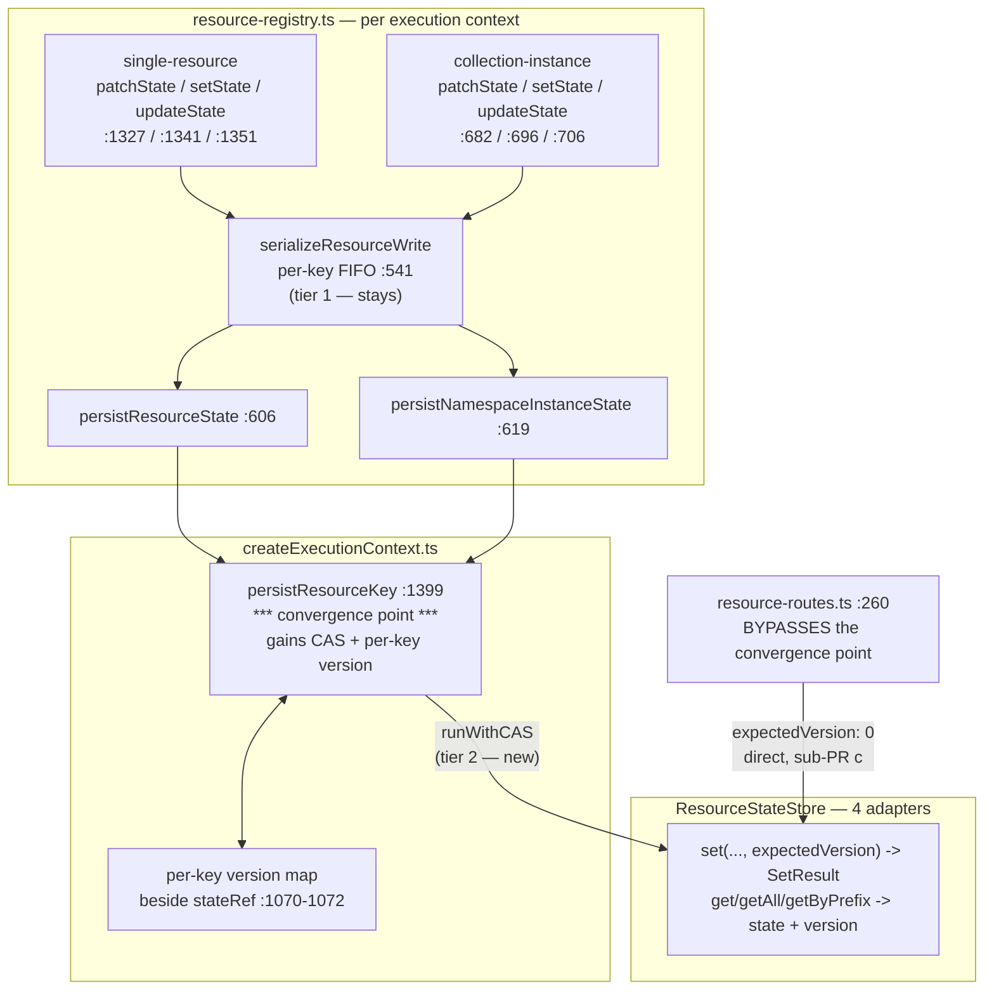

# FIX-992: `ResourceStateStore.set` has no `expectedVersion` — the FIX-400 CAS contract wasn't carried through the FIX-689 split — Implementation Spec

> **Linear issue:** [FIX-992](https://linear.app/fixpoint-labs/issue/FIX-992/resourcestatestoreset-has-no-expectedversion-the-fix-400-cas-contract) · **Epic:** [FIX-980](https://linear.app/fixpoint-labs/issue/FIX-980/epic-honest-task-substrate-every-write-path-reports-what-it-actually) — Honest task substrate

## Spec evolution *(the change story, not an audit log)*

- **Spec drafted** — Framed as an unfinished refactor: the CAS contract FIX-400 shipped for the four scope stores exists and is exported, and FIX-689 built `ResourceStateStore` beside it without it. The build copies that contract into the sibling store across all four adapters, then teaches the resource write path to use it. Two framing claims in the issue were checked and one was **corrected**: FIX-492 did *not* remove the CAS retry loop at the durable boundary — it introduced a **two-tier dispatch** where the queue serves in-memory scopes and `runWithCAS` still serves external stores. That makes reusing CAS-at-the-durable-boundary the *conformant* choice rather than a reversal, and it decides the conflict posture and the fate of `serializeResourceWrite` by precedent instead of preference. Shaped as **Large / 3 sub-PRs** (contract+adapters → engine integration ‖ route fix+docs), matching the prediction FIX-989's own spec made when it filed this.

---

## For reviewers — what this document is

This is a **direction document**, not an implementation. Reviewing it well means answering one question: **is this the right approach?**

**In scope to challenge:**

- The problem framing — are we solving the right thing?
- The approach — will it work, does it fit the architecture and `docs/philosophy.md`?
- Any numbered **Decision** in §6 — that's the sign-off surface.
- Missing constraints, edge cases, or dependencies that would **invalidate** the design.
- Scope — a deliverable that shouldn't ship, or one that's missing.

**Out of scope — deliberately unsettled here, and owned by the implementing agent:**

- Names, signatures, file paths, and module layout.
- Local structure: which helper, how a function is decomposed, error-message wording.
- Micro-optimizations and style preferences.
- Test names and internal test structure (the *behaviours* to test are in §10; the tests themselves are not).
- Anything Part II left open on purpose — it is directional by design, and a gap at that altitude is intended, not an omission.

Feedback in the second list is welcome and gets **recorded verbatim in §13** for the implementer to weigh against real code. It will not be argued with, and it will not be folded into the design prose — that would pretend the spec can settle something it can't. Please don't re-raise it: one mention is enough for it to land in §13.

**One request specific to this spec.** Several claims below are corrections to what the issue body asserts, each carrying a `file:line` that was read. If you disagree with one, please point at the line rather than at the claim — this epic has already produced three specs whose scope claims were refuted late, and the cheapest place to catch a fourth is here.

---

## Part I — The Case *(for the human)*

### 1. Problem — why it matters, why now

**In plain language.** When two pieces of work running at the same time both update the same stored item, one of them silently disappears. Each reads the item, each makes its change, each saves — and whoever saves second wins, overwriting the first without any error. The framework already has the machinery to prevent exactly this, and uses it for session, request, user and org data. The store that holds *resource* data was built later and never got it.

**Why now.** Two things make this the moment. First, it is a live data-loss path, not a theoretical one: the write serialization that looks like it protects these writes is built per execution context, so two concurrent requests in a single Node process are not serialized against each other at all. Second, it now blocks work. [FIX-989](https://linear.app/fixpoint-labs/issue/FIX-989/durable-write-provenance-a-task-write-must-record-what-it-did-so-a-caller-can-tell-a-committed-write-from-one-that-never-landed) needs to tell a caller whether its own write landed; it cannot answer that soundly on the durable backing while an overwrite can silently erase the evidence. FIX-989's spec wrote that fork up as its own blocking open question — degrade the answer, or fix the store — and **the owner chose to fix the store.** This issue is that decision.

No workaround covers it. The one that looks like it does is the per-context write queue, and §3 explains why it can't.

### 2. Solution in plain terms

Give the resource-state store the same versioned-write contract its four sibling stores already have, and then use it.

Concretely: every stored resource-state row carries a version number. A reader gets the version along with the state. A writer says "write this, and only if the version is still what I read" — and gets back either the new version or a conflict carrying the current state and version, so it can re-apply its change against the truth. That is not a new idea being invented here; it is `ExpectedVersion` and `SetResult`, already exported from `packages/engine/src/stores/types.ts` (`:166`, `:174-179`), already implemented by `SessionStore` / `RequestStore` / `UserStore` / `OrgStore` (`:258-272`, `:274-281`, `:426-436`, `:438-448`), and already driven by a retry loop the framework ships and documents (`stores/cas.ts:119-175`).

Then the resource write path adopts it, at the one place every resource-state write already converges.

**The philosophy that led here.**

- **Tenet 1 (coherence over local cleverness).** The strongest argument for this change is that it invents nothing. The contract, the conflict shape, the retry driver, the two-tier dispatch, the SQL migration idiom, and the cross-adapter conformance harness all exist in this repo. This is conformance work, and the review bar should be "does it match the sibling" rather than "is this concurrency design correct".
- **Tenet 5 (fix at the owning layer, and find where paths converge).** The lost update is in the storage layer, so the guard belongs there — not in each of the six registry write ops, and not in the consumers. §7 names the convergence point and every writer that reaches it, including the one that bypasses it.
- **Tenet 3 (earn every addition).** This adds no new concept and no new knob; it widens one existing contract onto one more store. It is justified by named consumers (§12), not by symmetry for its own sake.

### 3. Tradeoffs & alternatives

**The alternative the owner rejected: degrade the read.** FIX-989 could have avoided this work by never returning a definitive "your write did not land" on the resource backing — falling back to "cannot tell" whenever an overwrite could have erased the evidence. That was option (a) in FIX-989's OQ-1, and its own spec recommended it on tenet-3 grounds (no consumer yet). **The owner rejected it**, and the reason is worth restating because it is the stronger argument: the epic's objective is an honest substrate, and (a) leaves the *durable* backing — the one the docs advertise for cross-session boards — least able to answer the question the epic exists to answer. It also fixes nothing else, where this fixes the lost update itself.

**The simpler approach considered, and why it is insufficient.** The obvious cheaper move is "we already serialize resource writes — just make that serialization wider." `serializeResourceWrite` chains writes per storage key (`resource-registry.ts:530-546`) and would look sufficient. It is not, and the reason is structural rather than a tuning problem: `resourceWriteChains` is a `const` **inside** `createScopeResourceRegistry` (`:540`), and registries are constructed per execution context (`createExecutionContext.ts:1649`, `:1664`, `:1682`). The state caches are per-context locals too (`:1070-1072`), and `persistResourceKey` blind-`set`s and then updates **only its own** cache (`:1399-1405`). So two contexts both read revision N and the second overwrites the first. Widening the queue to process scope would mean a process-global lock on every resource write, which is both a bigger behavioural change than CAS and still wrong across processes.

**Where the genuine complexity is.** Not the CAS. Three places, in descending order:

1. **The filesystem adapter, which the issue estimated as the cheapest.** Its own file is 27 lines because its `set` lives in a **484-line generic factory shared with `ContentStore`** (`filesystem/filesystem-resource-store.ts`, `KeyedResourceStore<T>` at `:61-72`, consumed by `content-store.ts:17` and `resource-state-store.ts:20`). `ContentStore` is explicitly out of scope and stays last-write-wins, so the two stores' shapes **diverge for the first time** — and the shared factory plus the shared cross-adapter conformance runner (`stores/testing/resource-store-conformance.ts:180-207`, one generic `runKeyedResourceStoreConformance<T>` serving both) both currently assume they match. That divergence, not the version column, is the real cost centre of this change.
2. **Filesystem CAS has no atomic primitive.** The factory's `set` is temp-write-then-`rename` (`:376-388`); there is no compare-and-swap. Decision 5 scopes what we guarantee there and what we explicitly don't.
3. **The read shape.** Callers can only CAS against a version they were given, and the engine hydrates most resource state through the *bulk* readers (`getAll` / `getByPrefix`), not the single-key one. So the version has to come back from all three reads or the fix is inert for eagerly-declared resources — which are the default. That widens ten call sites (§7).

### 4. Focus practices (1–5)

- **BP-030 — tolerate the old shape (tenet 1).** Load-bearing here, twice: existing SQL rows have no version column, and existing filesystem `.json` files have no version. Decision 4 states how a legacy row is read and first written without a backfill and without failing closed.
- **Tenet 5's convergence rule.** A versioned write is an invariant, and an invariant enforced at one writer is not enforced. §7 enumerates all seven resource-state writers and names the one that bypasses the convergence point.
- **BP-035 — walk the second path.** Specifically the concurrent-conflict path and the legacy-row path, and the *off* state: every existing caller keeps today's behaviour by passing `"any"` explicitly, and that must be tested as deliberately as the new path.
- **Tenet 3 — subtract as you go.** No parallel "versioned" methods living beside unversioned ones. One contract, widened. §6 Decision 2.
- **BP-006 — no tracking identifiers in code or tests.** No `fix992-` prefixes anywhere.

### 5. What using it looks like

The public, user-facing API does not change: nobody writes `expectedVersion` in flow code. These examples are the **framework-internal store contract** — the surface adapter authors and engine code write against.

**Before / after — the store contract.**

```ts
// before: a blind put, no way to detect a lost update
await stores.resourceState.set("session", sessionId, "tasks/t1", nextState);

// after: write only if nobody moved it since we read
const read = await stores.resourceState.get("session", sessionId, "tasks/t1");
//    read is now { state, version } | undefined  (was: JsonObject | undefined)
const result = await stores.resourceState.set(
  "session", sessionId, "tasks/t1", nextState, read?.version ?? 0
);
if (!result.ok) {
  // result.conflict.currentValue / .currentVersion — re-apply against the truth
}
```

**Opting out is explicit, not implicit.** Every existing caller that genuinely wants last-write-wins says so, and the compiler makes anyone who forgets choose:

```ts
await stores.resourceState.set("session", sessionId, key, value, "any"); // deliberate LWW
```

**What a flow author sees: nothing new, and one thing that stops being wrong.** Two concurrent contexts patching the same resource today lose one write silently. After this, the losing write is retried against the current state and both land:

```ts
// unchanged flow code
await ctx.sessionResources.tasks.instance("t1").patchState({ claimedBy: "worker-a" });
```

### 6. Decisions & rules — the sign-off surface

1. **Reuse `ExpectedVersion` and `SetResult<JsonObject>` verbatim; do not spell the contract a second time.** *Alternative rejected:* a resource-specific conflict type, or a bespoke `compareAndSet` taking an expected *state* instead of a version. *Ramification:* the resource store becomes readable by anyone who knows the scope stores, and `runWithCAS`'s existing `CASPersistResult` bridge (`cas.ts:70-82`) is a shape adaptation rather than a new integration. Locks us to "version number" as the concurrency token, which is what every sibling already uses.

2. **Widen the existing six methods; do not add a parallel versioned trio.** `get` / `getAll` / `getByPrefix` return state **and** version; `set` takes `expectedVersion` as a **required** parameter and returns `SetResult`. *Alternative rejected:* keeping the six as-is and adding `getVersioned` / `setVersioned` beside them (12 methods), or making `expectedVersion` optional. *Ramification:* this is a **breaking change to an internal store interface** — ~10 read call sites and every adapter update in lockstep — and that is deliberate. An optional parameter or a parallel method lets a *new* caller silently get last-write-wins, which is the exact failure this issue is fixing; a required parameter makes the compiler enumerate every caller so each one's posture is a decision (tenet 3: old and new side by side is how incoherence starts). The store interface is not published API — no external consumer breaks.

3. **`ContentStore` is untouched and the two stores are allowed to diverge.** *Alternative rejected:* versioning both to keep the shared filesystem factory and shared conformance runner symmetric. *Ramification:* the generic `KeyedResourceStore<T>` factory and the generic conformance runner must each grow a version-aware variant or split — the largest single cost in sub-PR **a** (§3). We accept it because content bodies have no read-modify-write hazard: nothing merges a content body against a prior read. Versioning them would be surface with no defect behind it.

4. **A legacy row is version 0, by column default, with no backfill.** *Alternative rejected:* a data migration stamping every existing row, or bumping the filesystem layout marker to force a clean break. *Ramification:* `ADD COLUMN version ... NOT NULL DEFAULT 0` (SQLite via the `pragma_table_info` probe at `store-sqlite/src/schema.ts:106-119`; Postgres via `ADD COLUMN IF NOT EXISTS` at `store-postgres/src/schema.ts:302-303`) makes every pre-existing row read back at 0, which is already the contract's "initial" value — so a caller that reads 0 and writes with `expectedVersion: 0` updates the legacy row correctly, and a caller racing it gets a real conflict. This deliberately conflates "row absent" with "legacy row at version 0"; §9 shows all four interleavings resolve correctly, which is why the conflation is safe rather than merely convenient. Filesystem stores the version inside the `.json` envelope and treats a missing field as 0 (BP-030 dual-read) — the layout marker is **not** bumped, so no existing store is refused.

5. **The guarantee is per-adapter and stated honestly: real CAS on memory / SQLite / Postgres, and same-process-only on filesystem.** *Alternative rejected:* an atomic filesystem CAS via exclusive-create (`link()` + `EEXIST`, the trick the factory already uses for its layout marker at `:293-305`), and equally, refusing to implement filesystem CAS at all. *Ramification:* filesystem CAS is enforced by a per-key mutex on the store **instance** plus a compare-under-lock, which closes exactly the defect this issue reports (two execution contexts, one process) and does **not** protect two OS processes over one directory. That limit is documented, not implied — the same honesty the docs already apply to this adapter (`persistence/overview.md:66`) and the same rule FIX-989 set for itself: never promise more durability than the storage provides. Cross-process filesystem CAS is filed (§12), not silently skipped.

6. **`serializeResourceWrite` stays, and this is not a compromise — it is the sibling architecture.** *Alternative rejected:* removing it and letting CAS retries absorb all contention. *Ramification:* the issue framing warned against "reintroducing the retry loop FIX-492 removed", and **that framing is incorrect in a way that decides this decision.** FIX-492 did not remove the retry loop; it built a **two-tier dispatch** (`state-container.ts:109-167`) where in-memory containers serialize (`withScopeLock`) and external stores still run `runWithCAS` — `scope-lock.ts:3-4` says so outright ("CAS retries still apply at the durable boundary in `runWithCAS`"), and the published docs carry it under the heading *"External-store scopes still use CAS"* (`apps/docs/docs/state/mutation-model.md:39-43`). So the conformant shape is *both* tiers, and `serializeResourceWrite` is the resource-layer analog of `withScopeLock`. Keeping it is also load-bearing rather than tidy: `mutation-model.md:35` records why the queue exists — *"concurrent task-board workers create predictable, sustained contention, and the retry budget exhausts long before all writers can land"* — and task-board workers are precisely this issue's consumers. Removing the queue would push same-context contention onto the retry budget and manufacture the `ConcurrentModificationError` storm FIX-492 was fixing.

7. **Every existing caller gets an explicitly decided posture; none is left to a default.** *Alternative rejected:* defaulting unconverted callers to `"any"` implicitly. *Ramification:* §7's table assigns each of the seven writers a posture. Six keep today's semantics via the queue-plus-CAS path in sub-PR **b**; the one genuine check-then-act bug — the collection-item create route, which reads for existence at `resource-routes.ts:239` and writes at `:260`, so two concurrent POSTs both pass the 409 guard and both create — is converted to a real `expectedVersion: 0` in sub-PR **c**. That is a user-visible bug fix falling out of this work, and it is the cheapest proof the contract is wired correctly.

8. **Ships as three PRs: contract+adapters, then engine integration and the route fix in parallel.** *Alternative rejected:* one PR (too large to review; the adapter change and the engine change fail differently), or splitting per adapter (the conformance suite is shared, so per-adapter PRs would each rewrite it). *Ramification:* sub-PR **a** is behaviour-preserving on its own — every caller passes `"any"`, nothing changes at runtime — which makes it independently reviewable and independently revertable. **b** and **c** both depend only on **a** and are independent of each other.

**Non-goals.** Cross-record / multi-key transactional boundaries ([FIX-854](https://linear.app/fixpoint-labs/issue/FIX-854) — atomicity *across* records; this is one record's versioned write, and the two stay separate). Cross-execution task-claim safety for board consumers ([FIX-981](https://linear.app/fixpoint-labs/issue/FIX-981) — this **enables** closing it, and does not close it; see §12). `ContentStore` versioning. Cross-process filesystem CAS. Any change to the public flow-authoring API. FIX-989's provenance mechanism itself.

**Size: Large — multi-PR.** Well over 500 LOC across three packages including migrations, the conformance-harness split, and tests. FIX-989's spec predicted exactly this when it filed the work ("it becomes **Large and multi-PR** — a store-interface change across every adapter"). PR plan in §8.

---

## Part II — The Build Plan *(for the implementing agent)*

### 7. Technical design

Two layers change. The **store layer** grows the contract; the **engine layer** uses it. Nothing above the engine changes.



**The convergence point is `persistResourceKey`** (`createExecutionContext.ts:1399-1405`). All six registry write ops reach it — the single-resource three via `persistResourceState` (`:606-616`) and the collection-instance three via `persistNamespaceInstanceState` (`:619-628`); `getOrPatchState` reaches it through `patchState`. Putting the CAS there cures all six at once (tenet 5).

**One writer bypasses it** and must be handled separately: `resource-routes.ts:260` calls `ctx.stores.resourceState.set` directly, outside the registry and outside the queue. It is the check-then-act bug from Decision 7. This is the writer an "enumerate the entry point" fix would have missed.

**Writer table — the posture each one gets.**

| # | Writer | Reaches convergence point? | Posture | Sub-PR |
|---|---|---|---|---|
| 1 | single-resource `patchState` `:1327` | yes | queue + CAS retry | b |
| 2 | single-resource `setState` `:1341` | yes | queue + CAS retry | b |
| 3 | single-resource `updateState` `:1351` | yes | queue + CAS retry | b |
| 4 | instance `patchState` `:682` | yes | queue + CAS retry | b |
| 5 | instance `setState` `:696` | yes | queue + CAS retry | b |
| 6 | instance `updateState` `:706` | yes | queue + CAS retry | b |
| 7 | create-collection-item route `resource-routes.ts:260` | **no — direct** | `expectedVersion: 0`, conflict → real 409 | c |

**Readers that must carry the version** (all mechanical, all in sub-PR **a**): `createExecutionContext.ts:1186` (lazy single), `:1213` (lazy prefix), `:939` / `:986` / `:1279` (declared-state loads via `loadDeclaredResourceState`), `resources/internal.ts:195` / `:209` / `:219`, `routes/state-routes.ts:153-155`, `routes/resource-routes.ts:429-430` / `:522` / `:317` / `:239`. Most discard the version; the ones feeding the context cache keep it.

**Deliberately unchanged, verified rather than assumed.** `resource-routes.ts:317` reads resource *state* only as an existence probe and then writes to `ContentStore` (`:323`) — it never calls `resourceState.set`, so it needs no version. The sequencer and request task backings route through `atomicState` → real CAS already and are untouched. `ContentStore` is untouched throughout.

**The `deepEqual` short-circuit at `:1402` is left as-is, deliberately.** It skips the store write when the new value equals the *cached* value, so a write matching a stale cache never reaches the CAS. That is a real honesty hole — it is FIX-989's third filed follow-up — but it is **pre-existing and unchanged by this work**, and `runWithCAS` carries the identical no-op short-circuit (`cas.ts:143-145`), so removing it here would diverge from the sibling. Left in place; the gap stays filed (§12). Do not "fix" it in this issue.

**Illustrative sketch of the widened contract** *(a sketch, not the contract — signatures are the implementer's)*:

```ts
// packages/engine/src/stores/types.ts — ResourceStateStore
get(scopeType, scopeId, resourceKey): Promise<{ state: JsonObject; version: number } | undefined>;
set(scopeType, scopeId, resourceKey, state: JsonObject,
    expectedVersion: ExpectedVersion): Promise<SetResult<JsonObject>>;
```

Note the one place reuse is not literal: for the scope stores the new version rides *on the record* (`value.version`), because a `SessionRecord` has a version field. Resource state is a bare `JsonObject` with nowhere to put one — and it must stay bare, because `persistNamespaceInstanceState` re-parses state through `stateSchema.safeParse` (`resource-registry.ts:624-625`), which would strip an injected `__version` key. So the version is **store-assigned and out-of-band**: `set` returns the new version in `SetResult.version`, and the store owns the increment. Say so in the interface doc comment (BP-007), because it is the one asymmetry with the siblings.

**Also update the interface's own doc comment.** `types.ts:542-544` currently documents the *absence* as a decision — "plain per-key last-write-wins (no CAS), matching `ContentStore`. Per-resource keying structurally removes the whole-map clobber hazard". That reasoning was narrower than it read: per-resource keying did remove the whole-*map* clobber, and left the per-*key* lost update. Replace it rather than leaving it to contradict the code (tenet 1).

### 8. Implementation sequence

**PR plan.**

| sub-PR | deliverables | depends_on |
|---|---|---|
| a | Contract on `ResourceStateStore` (`ExpectedVersion` + `SetResult`, versioned reads); all four adapters; SQLite + Postgres `version` column migrations; split/parameterize the shared filesystem factory and the shared conformance runner; CAS conformance cases across all four adapters; all ~10 read call sites and all existing writers updated to explicit `"any"` — **no behaviour change at runtime** | — |
| b | Engine integration: per-key version tracking beside the context state caches; `persistResourceKey` becomes a real read-modify-CAS driven by `runWithCAS`; `serializeResourceWrite` retained as tier 1 | a |
| c | Create-collection-item route converted to `expectedVersion: 0` with a real 409; docs corrections (§11) | a |

Branches `fix/FIX-992-a` / `-b` / `-c`; **b** and **c** are independent of each other and build in parallel off **a**.

**Sub-PR a — the contract and the adapters.**

1. Widen `ResourceStateStore` in `stores/types.ts` and rewrite the stale concurrency doc comment. → *test:* typecheck fails everywhere a caller must decide; that failure list **is** the writer/reader audit.
2. Split or parameterize `KeyedResourceStore<T>` / the filesystem factory so a versioned variant exists without changing `ContentStore`'s behaviour. This is the step to do carefully; everything else in **a** is mechanical. → *test:* existing `ContentStore` conformance and the filesystem guard-conformance suite stay green untouched.
3. Memory adapter: store `{ state, version }` in the Map. → *test:* new CAS conformance cases.
4. Filesystem adapter: version inside the `.json` envelope, missing field reads as 0; per-key mutex on the store instance + compare-under-lock. Do **not** bump `LAYOUT_VERSION`. → *test:* CAS cases; a pre-existing versionless file reads as 0 and updates without a wipe.
5. SQLite: `ALTER TABLE resource_state ADD COLUMN version INTEGER NOT NULL DEFAULT 0` behind a `pragma_table_info` probe (copy `schema.ts:106-119`); CAS statements copying the `sqlite-store.ts:179-228` idiom — CAS `UPDATE ... WHERE version = ?`, then `expectedVersion === 0` falls back to `INSERT`, PK conflict → load conflict. → *test:* CAS cases; migration idempotent across two boots; a legacy row survives.
6. Postgres: same via `ADD COLUMN IF NOT EXISTS` (`schema.ts:302-303`) and the `pg-store.ts:225-260` idiom. → *test:* as above.
7. Split the conformance runner so `createResourceStateStoreConformanceTests` gains CAS cases while `createContentStoreConformanceTests` does not. All four adapters already call the state suite (`engine/test/resource-state-store.test.ts:225`, `store-sqlite/test/resource-durability.test.ts:47`, `store-postgres/test/resource-stores.test.ts:55`) — that is the evidence path for "every adapter honours the contract", and it comes almost free.
8. Update all readers and pass `"any"` at all seven writers. → *test:* the full existing suite green with no behavioural diffs.

**Sub-PR b — engine integration.** Add a per-key version map beside `sessionStateRef` / `userStateRef` / `orgStateRef` (`:1070-1072`), populated by every read that hydrates the cache. Make `persistResourceKey` read the cached version, `set` with it, and on conflict refresh the cache from `conflict.currentValue` / `currentVersion` and re-apply — via `runWithCAS`, adapting `SetResult` to `CASPersistResult` (they differ only in field naming: `conflict.currentValue`/`currentVersion` vs `currentState`/`currentVersion`). The registry's per-key `StateContainer`-shaped view is the natural seam; `state-container.ts:126-167` is the pattern to mirror. Keep `serializeResourceWrite` in front. → *test:* two simulated execution contexts racing one key both land; `ConcurrentModificationError` on budget exhaustion.

**Sub-PR c — the route and the docs.** Convert `handleCreateCollectionItem` to `expectedVersion: 0` and return the 409 from the conflict rather than from the racy pre-read. Consider whether the pre-read at `:239` can be dropped entirely now that the write itself refuses. Docs per §11.

**Nothing is removed.** Unusual for this repo (tenet 3 asks) and stated so a reviewer doesn't hunt for it: the only *replacement* is the stale doc comment at `types.ts:542-544`, and the only thing that could have been removed — `serializeResourceWrite` — is retained for the reason in Decision 6.

### 9. Edge cases & error handling

| Case | Expected behaviour |
|---|---|
| Legacy SQL row, no version column before migration | Migration adds `DEFAULT 0`; row reads as version 0; no backfill; second boot is a no-op |
| Legacy filesystem `.json` with no version field | Reads as version 0 (BP-030 dual-read); first CAS write stamps 1; layout marker untouched, store not refused |
| Row absent, two writers both `expectedVersion: 0` | First inserts at 1; second's CAS update matches nothing, insert hits PK conflict → conflict with current state/version |
| **Legacy row at 0**, two writers both `expectedVersion: 0` | First CAS-updates 0→1; second matches nothing, insert hits PK conflict → conflict. *This is why conflating "absent" and "legacy at 0" is safe: both route through the same expect-0 path and both resolve correctly* |
| `expectedVersion: "any"` | Plain upsert, today's behaviour exactly. Every pre-existing caller after sub-PR **a** |
| Conflict inside `runWithCAS` | Cache refreshed from the conflict payload, mutator re-applied, exponential backoff, `ConcurrentModificationError` on exhaustion — identical to scope state |
| Write equals the **stale** cached value | Short-circuited at `:1402` before the CAS, as today. Pre-existing gap, filed (§12), explicitly not fixed here |
| Two OS processes over one filesystem store | **Not protected.** Documented limit (Decision 5), filed as a follow-up |
| Concurrent `delete` between read and CAS write | Row absent; CAS update matches nothing; `expectedVersion > 0` → conflict with `currentValue: undefined`, `currentVersion: 0`. Matches `loadConflict` in the siblings |
| Multi-tenant | Version is per `(scope_type, scope_id, resource_key)`; tenancy is already inside `scope_id` via `resolveResourceStorageScopeId`. No new tenancy surface |
| Cancel / abort mid-retry | Inherited from `runWithCAS`; no new cancellation path |

**Second-path checklist (BP-035).** Legacy — four rows above. Null boundary — `get` returning `undefined` must be distinguishable from state `{}` at version 0; both adapters and callers must `== null`-guard rather than truthy-check. Concurrent-409 — the create route, now a real conflict. Cancel/error — inherited. Multi-tenant — above. Cost/observability — no new store round trips on the happy path; the conflict path costs one extra read, as in the siblings. Flag off/new state — `"any"` is the off state and is tested explicitly.

### 10. Testing strategy

**Goal check.** The user-visible outcome is *"two concurrent execution contexts patching one durable resource both land"*. Prove it on the real path: a flow whose action dispatches two concurrent contexts against one SQLite-backed resource key, each patching a distinct field, then read back and assert both fields are present. Today the second silently erases the first. **Model-free is correct here** — this is a storage-concurrency guarantee and a generator would add nondeterminism without exercising anything. Run via `fsdev run` against the SQLite store per `AGENTS.md`.

**CI specs (observable behaviours).**

- The shared conformance suite, run against all four adapters: CAS success bumps the version by one; stale `expectedVersion` returns a conflict carrying current state and version; `"any"` always writes; `expectedVersion: 0` inserts when absent and conflicts when present; version survives delete-then-recreate (restarts at 1).
- Migration: idempotent across two boots; a pre-migration row reads at 0 and updates without loss. (SQLite and Postgres.)
- Filesystem: a versionless legacy file reads as 0 and is not refused; two concurrent in-process writers to one key serialize correctly.
- Engine: two contexts racing one key both land; retry exhaustion raises `ConcurrentModificationError`; a write equal to cached state still short-circuits.
- Route: two concurrent creates of the same collection item produce exactly one 201 and one 409.
- Regression: the full existing resource suite green after sub-PR **a** with no behavioural change.

**Discipline.** Linear category is **Bug**, so `diagnose`. The seam for the feedback loop is the shared conformance suite (`pnpm --filter @flow-state-dev/engine test`, plus the two adapter packages) for the store layer, and `fsdev run` for the goal. Start by writing the failing two-context race as a regression test before touching the contract.

### 11. Documentation plan

Docs changes are warranted: this changes a documented concurrency guarantee, and two published pages currently over-promise. Correcting them is in scope for the same reason FIX-989 put its Decision 9 in scope — shipping a per-backing guarantee while the docs imply a stronger one is the band-aid this epic exists not to apply.

| Page | Action | Content |
|---|---|---|
| `apps/docs/docs/state/mutation-model.md` | **EXTEND** | New subsection after "External-store scopes still use CAS" (`:39-43`): resource state now uses the same two-tier dispatch — per-key FIFO in front, CAS at the durable boundary — and per-adapter guarantees. Keeps the page's existing framing intact rather than reworking it. Cross-link to the persistence overview. |
| `apps/docs/docs/persistence/overview.md` | **EXTEND / correct** | `:66` says in-memory and filesystem stores "serialize writes, which works for single-process development". Correct for scope state, misleading for resource state (the serialization was per execution context). State the per-adapter CAS matrix plainly, including the filesystem cross-process limit. |
| `docs/architecture/state-and-scopes.md` | **EXTEND** | `:3` and `:72` describe CAS as covering the four scopes. Add resource state to the CAS section. Internal doc, not published. |
| `packages/engine/README.md` | **EXTEND** | `ResourceStateStore` contract entry — versioned reads and `set(expectedVersion)`. |
| `packages/store-sqlite/README.md`, `packages/store-postgres/README.md` | **EXTEND** | Note the `resource_state.version` column and that the migration is automatic. |
| `.changeset/*.md` | **CREATE** | `minor` — store-interface change with a schema migration. BP-022. |

No new pages: every affected concept already has a home, and a new page would fragment the concurrency story that `mutation-model.md` currently tells in one place.

**Voice risks** (per CLAUDE.md): no issue IDs anywhere under `apps/docs/` — refer to "versioned writes on resource state", never FIX-992 or FIX-400. Watch em-dash density in the new subsection. Introduce "compare-and-swap" in plain terms on first use on the persistence page, which has a less technical audience than `mutation-model.md`. Avoid "robust" / "seamless".

### 12. Dependencies, open questions & follow-ups

**Blocking: none.** Nothing must merge first. Verified: the target files are stable on `origin/main` (last change to `stores/types.ts` / `resource-registry.ts` / `createExecutionContext.ts` was PR #829), and no open PR touches the store adapters, the schema files, or `createExecutionContext.ts`. The concurrently-open task-substrate work ([#1004](https://github.com/fixpoint-labs/flow-state-dev/pull/1004) FIX-976, spec PRs for FIX-963 / FIX-964 / FIX-978) lives in `packages/orchestration/src/tasks/*` and consumes the resource layer without touching it — **no file overlap.**

**Relationship to FIX-989 — precise, because it is easy to get backwards.** FIX-992 is recorded as *blocking* FIX-989, and FIX-989's own scope says cross-process concurrency control is out of its scope and "filed separately" — this issue. Both are true and consistent: FIX-989 needs a per-key version it can read and compare ("a reader holding an earlier observation can tell whether a task has changed since"); this delivers that version and the write guarantee under it. FIX-989 does not need us to solve cross-process filesystem locking, which Decision 5 leaves open. **This resolves FIX-989's OQ-1 as option (b)**, which is why FIX-989's spec should stop carrying the (a)/(b) fork once this is approved.

**Consumers that justify the work (tenet 3):**

- **[FIX-989](https://linear.app/fixpoint-labs/issue/FIX-989)** — blocked on this; its durable-backing read is unsound without a versioned write underneath.
- **[FIX-981](https://linear.app/fixpoint-labs/issue/FIX-981)** — "two executions over one durable board can both claim a task and both pass a creation cap." This is the consumer-level symptom of the same gap. **It does not close it — it makes closing it possible.** A safe claim also needs the claim itself expressed as a conditional write at the task layer, which is FIX-981's work and is not absorbed here.
- **[FIX-854](https://linear.app/fixpoint-labs/issue/FIX-854)** — adjacent and deliberately separate: cross-*record* atomicity. This is one record's versioned write. Neither subsumes the other, and shipping this does not shrink FIX-854.

**Open questions: none blocking.** The one fork that would have been an open question — degrade the read vs. fix the store — was decided by the owner before this spec was written, and is recorded as the rejected alternative in §3.

**Follow-ups (flagged, not built):**

- **Cross-process filesystem CAS** (Decision 5's stated limit). Needs an exclusive-create protocol — the `link()`/`EEXIST` pattern the factory already uses for its layout marker (`:293-305`) is the obvious candidate. File it with Decision 5 as the reason it exists.
- **`persistResourceKey`'s `deepEqual` short-circuit against the in-process cache** (`createExecutionContext.ts:1402`). A write matching a stale cache silently skips the store, so CAS never runs. Already filed by FIX-989's spec as its own issue; this spec confirms it and explicitly does not fix it (§7).
- **`ContentStore` has the same structural exposure with no defect behind it today.** Nothing merges a content body against a prior read, so there is no lost-update hazard — but if a future feature does read-modify-write on content, this is where to look. Recorded so the asymmetry Decision 3 creates is a known choice rather than an oversight.
- **Deepening opportunity.** The shared `KeyedResourceStore<T>` factory and the shared conformance runner both assumed content and state would stay shape-identical, and this change is the first to break that. Once split, the seam is worth a look — a version-awareness type parameter may be cleaner than two variants. Follow up via `improve-codebase-architecture`; not in scope.

### 13. Review notes for the implementer

*Empty at drafting. Below-the-bar spec-PR feedback lands here verbatim, as inputs rather than instructions — weigh each against the real code; you owe no justification for discarding one.*
