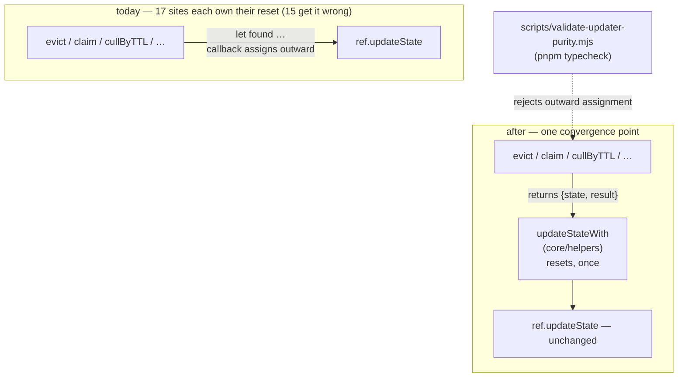

# FIX-995: `updateState` callbacks capture their result outside the callback, so a replayed write reports work that never committed — Implementation Spec

> **Linear issue:** [FIX-995](https://linear.app/fixpoint-labs/issue/FIX-995/updatestate-callbacks-capture-results-outside-the-callback-so-a-cas) · **Epic:** [FIX-980](https://linear.app/fixpoint-labs/issue/FIX-980/epic-honest-task-substrate-every-write-path-reports-what-it-actually) — Honest task substrate · **Blocks:** [FIX-992](https://linear.app/fixpoint-labs/issue/FIX-992/resourcestatestoreset-has-no-expectedversion-it-was-built-as)
>
> Every `file:line` in this spec was opened on `spec/FIX-995`, branched from `origin/main` at **`05d1eed4`** — which has **`39e6626c`** (PR #1009) as an ancestor.

## Spec evolution *(the change story, not an audit log)*

- **Spec drafted** — Re-derived the scope from scratch rather than inheriting it: **36** call sites, not 38, and **5** packages, not 6 (`engine` implements `updateState`; it never calls it). Classified them into 15 unsafe / 2 benign / 19 safe, plus 3 sites in a *separate* stale-read class the issue doesn't name. Rejected the implied 15-site reset sweep in favour of one composed helper at the convergence point plus a repo-wide static check, because a sweep leaves the invariant unenforced exactly where this issue has already been burned once. Four of the unsafe sites were **proven** by running them under a replaying double, not asserted by reading.

---

## For reviewers — what this document is

This is a **direction document**, not an implementation. Reviewing it well means
answering one question: **is this the right approach?**

**In scope to challenge:**

- The problem framing — are we solving the right thing?
- The approach — will it work, does it fit the architecture and `docs/philosophy.md`?
- Any numbered **Decision** in §6 — that's the sign-off surface.
- Missing constraints, edge cases, or dependencies that would **invalidate** the design.
- Scope — a deliverable that shouldn't ship, or one that's missing.

**Out of scope — deliberately unsettled here, and owned by the implementing agent:**

- Names, signatures, file paths, and module layout.
- Local structure: which helper, how a function is decomposed, error-message wording.
- Micro-optimizations and style preferences.
- Test names and internal test structure (the *behaviours* to test are in §10; the tests
  themselves are not).
- Anything Part II left open on purpose — it is directional by design, and a gap at
  that altitude is intended, not an omission.
- **The solution sketch, at the line level.** A spec may include a rough pseudocode sketch
  showing the *shape* of the proposed solution. It is knowingly incomplete, is not real
  code, and is not what will ship. **Review it for directional viability and key design
  aspects only** — is this the right shape, in the right layer, composing the right way?
  Do **not** report that it lacks error handling, omits edge cases, names things that
  don't exist in the repo, or wouldn't build: all of that is true on purpose, and the
  names are deliberately not real. A sketch that has to survive line-level review stops
  being cheap, and then nobody writes one.

**One request, if you are an automated reviewer:** the two lists above are the whole
difference between a useful review of this document and a long one. Volume is not signal
here — a single finding above the line is worth more than twenty below it.

Feedback in the second list is welcome and gets **recorded verbatim in §13** for the
implementer to weigh against real code. It will not be argued with, and it will not be
folded into the design prose — that would pretend the spec can settle something it
can't. Please don't re-raise it: one mention is enough for it to land in §13.

**The one exception is the sketch.** Line-level feedback on it is *dropped*, not recorded
— there is nothing for an implementer to weigh about code that isn't shipping, and a §13
note would imply otherwise. Sketch feedback that is about **direction** is not line-level
and is treated like any other above-the-bar finding.

---

## Part I — The Case *(for the human)*

### 1. Problem — why it matters, why now

Across the framework, a function that updates stored state does it by handing a small
callback to the storage layer, and then reports back to its caller what it did — "yes I
removed that entry", "here are the seven records I deleted". The way it reports is by
setting a variable that lives *outside* the callback.

That works only as long as the callback runs exactly once. It does today.

The next change in this epic makes a storage write **retry on a conflict**, and a retry
re-runs the callback. The second run usually takes a different branch — the entry another
worker already deleted isn't there any more, so there's nothing to do. But the variable
from the *first* run is still sitting there holding the old answer. The function returns
it. **It reports work that was never saved.**

**Why now** — this is not a hypothetical about a future refactor. Retrying writes is
[FIX-992](https://linear.app/fixpoint-labs/issue/FIX-992), which is specced, in review,
and formally blocked on this issue. The owner is ready to approve FIX-992 and FIX-989 and
is waiting on this. There is no workaround: every caller of these helpers trusts what they
return, and the wrong answer is indistinguishable from the right one.

The stakes are not uniform. The worst case found is not a stale boolean — it is a task
being handed to a **second worker as successfully claimed** while a first worker already
holds it, and a janitor writing a **permanent record** of records it deleted that includes
records it did not delete, some of them listed twice.

### 2. Solution in plain terms

The 15 broken sites all make the same mistake, and it is a mistake the shape of the API
invites: the callback has no way to *return* an answer, so every author reaches outside it
for one. So rather than patching 15 callbacks to remember to reset themselves, we give the
callback a way to return its answer, in **one** small helper that wraps the existing write.
The helper does the reset, once, in one place, correctly — and every caller inherits it.

Then we make it stick: a repo-wide check, run by `pnpm typecheck`, that fails if any
storage callback assigns to a variable declared outside itself. After the migration there
are zero violations, so the rule is bright-line and needs no judgement call — which matters,
because "reset on every branch that doesn't commit" *is* a judgement call, and 15 of 17
authors got it wrong.

**Philosophy** — tenet 5 (*fix at the owning layer*), and specifically its second half:
"an invariant with five writers is not enforced until the guard sits where all five pass
through." The convergence point for every one of these callbacks is the write itself, not
the 15 call sites. Tenet 2 (*composition over features*): the helper composes over the
existing `updateState` primitive rather than changing its contract, so no public type, no
test double, and no adapter moves. Tenet 3 (*earn every addition*): one exported helper,
and the sites it replaces are subtracted in the same change.

### 3. Tradeoffs & alternatives

**The simpler approach: reset the captured variable at the top of each callback.** This is
what the issue's framing implies and it is genuinely tempting — 15 one-line edits,
behaviour-preserving, and there is already a working precedent in-repo
(`sequencer-backed.ts:198-200`, which resets `captured` and `declined` on every mutator
entry because it has always run under retries).

Rejected, and the reason is not that it is bigger — it is smaller. It is that it leaves
the class alive. There is no enforcement, the next callback written in the old style
regresses silently, and the rule it asks authors to internalise is a per-branch
dominance argument rather than a bright line. **This epic has already been burned by
exactly that.** FIX-992's own audit covered four callbacks in one file and asserted that
was the surface; a search found roughly ten times as much. Patching call sites is the
failure mode tenet 5 names by name, and review will keep finding more of them.

**Alternative: change `updateState` itself to return the callback's outcome.** Cleanest in
the abstract, and rejected on cost. `updateState` is declared on both `ResourceRef` and
`ResourceContext` (`packages/core/src/types/resource.ts:249`, `:309`), and **50 hand-rolled test doubles
across 20 files** in `core`, `engine`, `memory`, and `orchestration` implement it (e.g.
`packages/memory/test/working-memory.test.ts:55`, `packages/memory/test/digest.test.ts:60`).
Worse, the common double shape
`async (fn) => { state = await fn(state) }` returns `undefined`, so a migrated helper
running against an unmigrated double would get `undefined` back and **fail silently** —
the exact defect we are fixing, reintroduced by the fix. A composed helper touches none of
them, because it only ever calls `updateState`.

**Where the complexity is:** not the helper, which is about ten lines. It is (a) deciding
that the two *currently-benign* capturing sites migrate anyway — they are safe today only
by non-obvious arguments, and one of them is safe purely because its non-committing branch
`throw`s instead of returning (`resource-backed.ts:391`), which a future edit could
innocently undo — and (b) the static check's precision, which is why Decision 4 defines the
rule as *no outward assignment at all* rather than the fuzzier *reset on every branch*.

### 4. Focus practices (1–5)

1. **One convergence point (tenet 5)** — the reset lives in the helper, not in 15
   callbacks. If the implementer finds a site that "can't use the helper," that is a
   finding about the helper's shape, not a licence to hand-reset.
2. **BP-003 (verification evidence)** — a site is proven unsafe by a test that forces the
   callback to re-run and observes the stale report, not by reading it. §10 and §12 make
   this concrete; four sites are already proven this way.
3. **BP-035 (second-path checklist)** — the replay *is* the second path. A test that runs
   each helper once proves nothing here; every behaviour must be exercised on a re-run.
4. **Subtract in the same change (tenet 3)** — every migrated site's outer `let` is
   deleted, not left beside the new shape.
5. **Behaviour-preserving (change-specific)** — this lands *before* the guarantee that
   makes it load-bearing. Single-invocation behaviour must be identical, or it is not
   hardening, it is a behaviour change wearing hardening's clothes.

### 5. What using it looks like (1–5 examples)

**A helper that reports what it removed — before and after** *(what this spec proposes;
the "before" is `packages/memory/src/working-memory-helpers.ts:160-174` today):*

```ts
// before — `found` survives the callback, so a replay reports the previous attempt's answer
export async function evict(ref: WmRef, id: string): Promise<boolean> {
  let found = false
  await ref.updateState((s) => {
    const idx = s.entries.findIndex((e) => e.id === id)
    if (idx < 0) return s          // ← replay lands here; `found` is still true
    found = true
    return { ...s, entries: withoutIndex(s.entries, idx) }
  })
  return found
}

// after — the answer travels out with the state it belongs to; there is nothing to capture
export async function evict(ref: WmRef, id: string): Promise<boolean> {
  return updateStateWith(ref, (s) => {
    const idx = s.entries.findIndex((e) => e.id === id)
    if (idx < 0) return { state: s, result: false }
    return { state: { ...s, entries: withoutIndex(s.entries, idx) }, result: true }
  })
}
```

**What the caller sees, under a replayed write:**

```
before  evict("wm_1") on an entry a concurrent writer already removed → true   (wrong)
after   evict("wm_1") on an entry a concurrent writer already removed → false
before  cullByTTL(...) losing one round → ["ep_a", "ep_b", "ep_b"]             (wrong; accumulated + duplicated)
after   cullByTTL(...) losing one round → ["ep_b"]
```

**What the enforcement check rejects:**

```
packages/memory/src/working-memory-helpers.ts:167
  updater assigns to `found`, declared outside the updater at :161.
  An updater may run more than once. Return the value instead — see updateStateWith.
```

*(`updateStateWith` is a placeholder name. Naming is the implementer's — Decision 1 fixes
the shape, not the identifier.)*

### 6. Decisions & rules — the sign-off surface

1. **The outcome travels out through the write's return value, via one shared helper
   composed over `updateState` — not through a closure variable reset per site.**
   *Rejected:* resetting the captured variable at the top of each of the 15 unsafe
   callbacks (§3).
   *Locks in:* the reset exists in exactly one place. Every future caller that needs an
   outcome gets it right by default, and the enforcement rule in Decision 4 can be a
   bright line rather than a dominance analysis.

2. **`ResourceRef.updateState` / `ResourceContext.updateState` keep their current
   signature.**
   *Rejected:* widening `updateState` to return the updater's outcome.
   *Locks in:* zero churn across 20+ hand-rolled test doubles and zero silent-`undefined`
   failure mode (§3); and FIX-992 stays free to add its `committed` signal to the same
   surface later without colliding with this change.

3. **All 17 capturing sites migrate — the 15 unsafe ones *and* the 2 currently-benign
   ones.**
   *Rejected:* migrating only the 15 that are provably broken.
   *Locks in:* the check in Decision 4 is "an updater assigns nothing outward", with no
   exemptions to maintain. It also removes a real trap: `resource-backed.ts:387` is safe
   only because its non-committing branches `throw` rather than `return`, which is not a
   property anyone editing it later would think to preserve.

4. **A repo-wide static check enforces that an updater passed to `updateState` or
   `atomicState` assigns to no binding declared outside it. It ships in `scripts/`,
   `ts-morph`-based, wired into `pnpm typecheck` beside `validate-package-boundaries.mjs`.**
   *Rejected:* (a) no enforcement, relying on review; (b) introducing ESLint, which this
   repo does not use; (c) a smarter check that permits outward assignment when every
   return path is dominated by one — that is the judgement call this issue exists because
   people get wrong, and it would need suppressions.
   *Locks in:* the rule is mechanical and false-positive-free after the migration, and it
   covers `atomicState` too, so the scope-state sites that are correct today stay correct.

5. **Three sites in an adjacent class — a value derived from state read *outside* the
   callback and then committed inside it — are fixed here by moving the read inside.**
   The sites are `working-memory-helpers.ts:128` (reads `state.currentTurn` at `:113`),
   `perspective-helpers.ts:227` (reads `state.turnCounter` at `:216`), and
   `perspective-helpers.ts:349` (reads `ref.state.positions.length` at `:337` — the very
   array a conflict would have changed).
   *Rejected:* filing them separately.
   *Locks in:* these do not *report* phantom work, so they are genuinely a different
   defect; but they have the same root cause, live in the same functions, and would
   otherwise leave a known-stale read behind a spec that claims this area is hardened.
   Total additional cost: three lines.

6. **This lands behaviour-preserving and is proven *before* FIX-992 exists, using a test
   double that invokes the updater twice.**
   *Rejected:* waiting for FIX-992's machinery to test against.
   *Locks in:* the issue is independently verifiable and independently reviewable, which
   is the reason it was split out. It also means the CI specs keep working unchanged after
   FIX-992 lands.

7. **Single PR.**
   *Rejected:* splitting the helper, the migration, and the check.
   *Locks in:* the check cannot land before the sites conform without breaking
   `typecheck`, and the sites cannot migrate before the helper exists — the DAG is a
   straight line with no parallelism to win, so splitting buys nothing and costs two
   review cycles on the critical path of three issues.

> **Non-goals** — FIX-992's versioned-write guarantee and any change to write semantics ·
> `patchState` / `setState`, which take values rather than callbacks and cannot exhibit
> this defect · application code outside this repo · the `atomicState` call sites
> themselves, which are already correct (the check covers them; no migration) ·
> `getOrPatchState`, whose `compute` callback runs at most once by contract
> (`resource.ts:310-326`).
>
> **Size:** Large by file count, Medium by risk — 17 mechanical site migrations, one
> ~10-line helper, one ~80-line check script. One PR (Decision 7); **no PR plan.**

---

## Part II — The Build Plan *(for the implementing agent)*

### 7. Technical design

The helper is the only new thing, and it sits between the existing helpers and the
existing `updateState`. Nothing below `updateState` changes; nothing about the storage
layer, the resource registry, or any adapter is touched.



- **`@flow-state-dev/core`** — gains the helper, exported from the existing
  `@flow-state-dev/core/helpers` subpath (already a declared export;
  `packages/core/package.json`). It takes anything with an `updateState` method, so it
  works against `ResourceRef`, `ResourceContext`, collection instance refs, and the
  existing test doubles alike. Also migrates its own capturing site
  (`src/graph/resource-edges.ts:209`).
- **`@flow-state-dev/memory`**, **`@thought-fabric/core`**,
  **`@flow-state-dev/orchestration`** — migrate their capturing sites (§8). All three
  already depend on `@flow-state-dev/core` (`workspace:*`), so no new dependency edge.
- **`scripts/`** — the new check, wired into the root `typecheck` script alongside
  `node scripts/validate-package-boundaries.mjs`. `ts-morph` is already a root devDep.
- **Untouched:** `@flow-state-dev/engine` (it *implements* `updateState` at
  `src/context/resource-registry.ts:706` and `:1351`; it calls it nowhere),
  `@flow-state-dev/patterns` (its one site at `src/rlm/index.ts:144` captures nothing),
  every store adapter, and the public `ResourceRef` / `ResourceContext` types.

**The reference discipline already in-repo.** `packages/orchestration/src/tasks/collection/sequencer-backed.ts`
is the sibling backing of the same `TaskCollectionRef` interface, and it already runs under
a CAS retry loop (`:121-124`). It solves this by hand: the rule is stated at `:198-200`
("Both `captured` and `declined` are reset on every mutator entry … so they describe the
winning attempt, not an earlier one") and applied at `:221`, `:225`, `:266`, `:270`,
`:273`, `:351`. **That file is the proof this is solvable and the proof it doesn't stick:**
its own twin, `resource-backed.ts`, implements the same interface and gets it wrong in
three of four places. Reason from that file's *intent*, not its mechanism — the helper is
that intent, hoisted to where it can't be forgotten.

**Solution sketch — pseudocode. Illustrative, not the contract. React to the shape.**

```
the shared helper, in core:

    updateStateWith(the resource, the caller's updater):
        outcome ← nothing                  ← the reset, in the ONE place it can live
        call the resource's existing updateState with:
            given the current state:
                outcome ← nothing          ← and again per invocation, for the replay
                (nextState, result) ← the caller's updater(current state)
                outcome ← result
                yield nextState
        return outcome

a migrated call site:

    evict(id):
        return updateStateWith(the resource, given state:
            if the entry is absent:  yield (state unchanged, answer = false)
            otherwise:               yield (state without it, answer = true))

the check, over every updater passed to updateState / atomicState:
    if the updater assigns to any binding declared outside it → fail
    (the helper itself is the single audited exception)
```

What this asks a reviewer: *is a composed helper the right layer, or should the outcome
channel be part of `updateState`'s own contract?* §3 argues for the helper on test-double
cost and a silent-failure mode; that argument is the thing to push on. Whether the helper
takes a tuple, an object, or a discriminated result is the implementer's.

### 8. Implementation sequence

1. **Add the helper** in `@flow-state-dev/core`, exported from the `helpers` subpath.
   *Test:* an updater invoked once returns its result; an updater invoked twice returns the
   **second** invocation's result, including when the second returns "nothing to report";
   an updater that throws propagates and reports nothing. *Depends on:* nothing.
2. **Migrate `@flow-state-dev/core`'s own site** — `src/graph/resource-edges.ts:209`
   (`pruneDangling`). Benign today; migrated per Decision 3. *Depends on:* 1.
3. **Migrate `@flow-state-dev/memory`** — 9 sites: `working-memory-helpers.ts` `:163`
   `:188` `:217` `:246`; `episodic-memory-helpers.ts` `:114` `:160`;
   `semantic-memory-helpers.ts` `:56` `:94` `:166`. **Remove** each site's outer `let` /
   `const culled: string[] = []`. *Test:* the replay behaviours in §10. *Depends on:* 1.
4. **Migrate `@thought-fabric/core`** — 3 sites: `identity/perspective-helpers.ts` `:244`
   `:373` `:398`. *Depends on:* 1.
5. **Migrate `@flow-state-dev/orchestration`** — 4 sites in
   `tasks/collection/resource-backed.ts`: `:443` (`patchRef`), `:518` (`claim`), `:651`
   (`reclaim`), and `:387` (`transitionRef`, benign today — Decision 3). This is the
   highest-stakes step; see §9. *Depends on:* 1.
6. **Fix the three stale-read sites** per Decision 5 — move the outside-the-callback read
   inside: `working-memory-helpers.ts:128`, `perspective-helpers.ts:227` and `:349`.
   *Depends on:* 3, 4 (same functions).
7. **Add the check** and wire it into the root `typecheck` script. *Test:* it flags a
   deliberately-reverted site and passes on the migrated tree. *Depends on:* 2–6 — it must
   land last or it fails on the unmigrated sites.
8. **Docs and changeset** per §11. BP-022: user-facing (a new exported helper), so a real
   `.changeset/*.md`, `patch`.

*(Each step cites the decision it implements rather than restating it — the contract lives
in §6 alone.)*

### 9. Edge cases & error handling

| Case | Expected |
|---|---|
| Updater throws on the replay after committing on attempt 1 | The throw propagates; the helper reports nothing. `resource-backed.ts:399-404` catches `WriteDeclined` and returns `declined` — that must survive the migration unchanged |
| `claim` re-runs and the candidate is no longer eligible (`:522`) | Returns `null` and emits nothing. **Today it returns the task as claimed and emits `claimed`** — two workers believing they hold one lease. The single highest-stakes row in this table |
| `patchRef` re-runs and the patch is now a no-op (`:449`) | `{ outcome: "unchanged" }`, no `task-change` emit. Today: `{ outcome: "recorded" }` plus a spurious emit — which silently undoes FIX-976's honest-verdict work for `setAssignee` / `setPriority` / `addLabel` / `removeLabel` |
| `reclaim` re-runs and the lease is no longer expired (`:658`) | Not counted, no `resumed` emit. Today: both |
| An accumulating array (`cullByTTL`, `markStale`, `cullByEffectiveConfidence`) | Reports only the committed attempt's IDs. Today it concatenates every attempt's, **including duplicates** — and `janitor-blocks.ts:148-150` writes all three of those arrays onto the janitor resource as a durable record |
| A migrated updater with no outcome to report (the 19 safe sites) | Unchanged — they keep plain `updateState`. The helper is not a blanket replacement |
| An updater that is `async` (`rlm/index.ts:144`, `resource.ts:249`) | The helper must await it; the updater signature is `TState \| Promise<TState>` |
| Check encounters an updater assigning to a binding it declared *itself* | Passes. The rule is about bindings declared in an **enclosing** scope |

**Taxonomy:** nothing here is a new error path. Every change either narrows a return value
or suppresses an emit that should not have fired. The one genuinely fatal path —
`ConcurrentModificationError` on retry exhaustion — is FIX-992's and is untouched.

**Second-path checklist (BP-035).** *Legacy* — none; no persisted shape changes.
*Null boundary* — "nothing to report" must be distinguishable from "reported `undefined`";
`== null`-guard, and note `pin`/`evict` legitimately report `false`. *Concurrent-409* —
this issue **is** that path. *Cancel/error* — the throwing updater row above.
*Multi-tenant* — n/a. *Cost/observability* — no extra round trips; the helper adds one
closure per write. *Flag off/new state* — no flag; the "off" state is the 19 unmigrated
safe sites, which the check must pass unchanged.

### 10. Testing strategy

**Goal check.** No real-model goal check applies — this change involves no generator, no
prompt, and no model call, and its outcome is not observable in a transcript. The
equivalent "real path" evidence is the **replay harness** below, which runs the actual
first-party helpers (not mocks of them) under the actual double-invocation the CAS driver
performs; §12 records the run that already did this for four sites.

**How a site is *proven* unsafe (BP-003).** Not by reading it. By a test double whose
`updateState` invokes the updater **twice** — once against the pre-conflict state, whose
result is discarded exactly as a losing CAS attempt's is, then against the winner's state,
which commits. That double mirrors `runWithCAS` (`packages/engine/src/stores/cas.ts:131-160`,
mutator re-invoked at `:135`), so it is the real replay shape, not an invented one. Every
one of the 15 unsafe sites gets a spec of this form; each **must fail on `main`** before
the fix and pass after. A site that cannot be made to fail this way is not unsafe and
should be reclassified in the spec, not "fixed" anyway.

**CI specs** (the behaviours, not the test names):

- **One behaviour per unsafe site** — stated as what the *caller* observes: the boolean,
  the returned record, the array, the count, the `TaskWriteOutcome`, and for the
  orchestration sites the `task-change` items **not** emitted.
- **The accumulator behaviours are distinct from the boolean ones** and must be asserted
  as exact arrays, not lengths — the observed failure is `["ep_a","ep_b","ep_b"]` for an
  expected `["ep_b"]`, which a length check would catch but an `includes` check would not.
- **What must not change:** every helper's single-invocation behaviour, byte for byte.
  Run the existing suites for `memory`, `orchestration`, `patterns`, `core`, and
  `thought-fabric-core` unchanged — this is hardening, and an existing test that needs
  editing is a signal the migration changed semantics.
- **The two benign sites migrate without behaviour change** — `pruneDangling`'s count and
  `transitionRef`'s declined/recorded verdicts are identical before and after, on both a
  single run and a replay.
- **The check itself:** passes on the migrated tree; fails with a useful message on a
  deliberately-reverted site; does **not** flag a binding the updater declares itself, and
  does **not** flag the 19 unmigrated safe sites.

**Discipline:** `diagnose` (the Linear category is a bug). The feedback loop is vitest with
the replaying double — no HTTP, no store adapter, no model. Every site is reachable from a
unit spec, so reproduce → fix → regression-test is a fast local cycle.

### 11. Documentation plan

- **EXTEND** `apps/docs/docs/state/mutation-model.md` — a new top-level section, "Writing
  an updater that may run twice", after "Two-tier dispatch" (`:11-43`) and before
  "Mutation timeout" (`:45`). Covers: why a mutator can run more than once (the CAS path
  at `:39-43` already says it retries; the page never draws the consequence for the
  callback's author), the rule, and the helper. One minimal example — the `evict`
  before/after from §5, trimmed to the callback.
  **Coordinate with FIX-992,** whose docs plan extends this same page with a subsection
  *after* "External-store scopes still use CAS". FIX-995 lands first and establishes this
  section; FIX-992's addition should reference it rather than restate the rule.
  *Voice risk:* this is the page most likely to attract "simply" and "just" — the reader
  is being told their intuition is wrong, so state the rule and show it, don't reassure.
  Also: introduce "updater" before using it; the page currently says "mutator".
- **EXTEND** `packages/core/README.md` — one entry for the new helper next to the existing
  `ResourceRef` bullet (`:180`), which already enumerates `patchState` / `setState` /
  `updateState` / `getOrPatchState`.
- **EXTEND** `docs/architecture/resources-and-client-data.md` — the two worked
  `updateState` examples at `:163` and `:201` should show the outcome-returning shape where
  they report a result, so the architecture reference does not model the pattern this
  change removes.
- **No new page.** This is one rule about an existing primitive, not a term users will
  search for on its own. A page for it would fragment the state sidebar and would be found
  by nobody who didn't already know to look.
- **No `apps/docs` guide.** No new end-to-end workflow is unlocked.

### 12. Dependencies, open questions & follow-ups

**Dependencies: none.** This is the *blocking* end of the relation — FIX-992 waits on it,
not the reverse (FIX-992 spec §12: "It must merge before sub-PR **b** switches the
guarantee on"). Verified against open PRs: **no open PR touches any of the 10 files**.
FIX-992's spec explicitly removed its own overlap here — "the `resource-backed.ts` edits it
shared with the open task-substrate work … are now FIX-995's, so FIX-992 no longer touches
`packages/orchestration` at all." The FIX-963 / FIX-964 / FIX-976 / FIX-978 specs (PRs
#992, #994, #995, #990) are all still specs, unimplemented.

**Coordination, not a dependency:** FIX-976 already landed the `TaskWriteOutcome`
verdicts in `resource-backed.ts` that step 5 makes honest under replay. Do not change what
those verdicts *mean*; only stop them being reported for an attempt that lost.

**Open questions:** none blocking. One judgement call is delegated deliberately: whether
the helper takes `{ state, result }`, a tuple, or a discriminated union is the
implementer's, settled in code (§7).

**Settled claims**

- **Settled:** the callback really is re-invoked on a conflict, so this defect is real
  rather than theoretical — **CONFIRMED** by reading, not inference:
  `packages/engine/src/stores/cas.ts:119-164` loops `while (attempt <= maxRetries)` and
  calls `await mutator(current)` at `:135` on every pass. FIX-992 §7 specifies the same
  for resource state: "Refresh from `conflict.currentValue` / `currentVersion`, **re-run
  the mutator**, retry with backoff."
- **Settled:** four of the unsafe sites report work that never committed — **CONFIRMED**
  by execution, not by reading. A throwaway vitest spec on this branch
  (`packages/memory/test/_fix995-replay-poc.test.ts`, committed to the never-merged spec
  branch, touching no `src/`) runs the **real** helpers under a double that replays the
  updater once. On `05d1eed4`: `evict()` returned `true` for an entry it did not remove;
  `pin()` returned `true` when the pin slots filled up underneath it; `cullByTTL()` and
  `markStale()` each returned `["ep_a","ep_b","ep_b"]` for an expected `["ep_b"]` —
  accumulated *and* duplicated. The remaining 11 unsafe sites are classified by reading
  against the identical shape and each gets its own such spec in step 3–5.

  Each case is written with **`it.fails`**, so the suite is green while the defect exists
  (`Test Files 1 passed (1) · Tests 4 passed (4)`, and 492/492 for the package). The body
  of each case asserts the *correct post-fix* behaviour, so it is self-verifying in both
  directions: make a helper replay-safe and its case starts failing here, because a
  passing body under `it.fails` is a failure. Drop `.fails` to see the raw assertion
  output quoted on the spec PR. **The implementer should expect this file to go red as
  step 3 lands — that is the intended signal, and the file does not ship.**

**The verified enumeration — 36 sites, 10 files, 5 packages.** Re-derived on this branch,
not inherited. The issue's "38 sites across 6 packages" is close but wrong in a way that
matters for sizing: the raw count included doc-comment mentions, and `@flow-state-dev/engine`
was counted as a caller when it is the *implementer* (`resource-registry.ts:706`, `:1351`)
and calls `updateState` nowhere. Reproduce with
`grep -rn "\.updateState(" --include=*.ts packages/*/src labs`, discarding comment lines.

| # | Site | Captured | Class |
|---|---|---|---|
| 1 | `memory/src/working-memory-helpers.ts:163` `evict` | `found` (`:161`) | **unsafe** — proven |
| 2 | `memory/src/working-memory-helpers.ts:188` `pin` | `success` (`:186`) | **unsafe** — proven |
| 3 | `memory/src/working-memory-helpers.ts:217` `unpin` | `found` (`:215`) | **unsafe** |
| 4 | `memory/src/working-memory-helpers.ts:246` `refresh` | `found` (`:244`) | **unsafe** |
| 5 | `memory/src/episodic-memory-helpers.ts:114` `cullByTTL` | `culled[]` (`:113`), pushes at `:137` | **unsafe** — accumulator, proven |
| 6 | `memory/src/episodic-memory-helpers.ts:160` `markStale` | `marked[]` (`:159`), pushes at `:170` | **unsafe** — accumulator, proven |
| 7 | `memory/src/semantic-memory-helpers.ts:56` `updateFact` | `updatedFact` (`:54`) | **unsafe** |
| 8 | `memory/src/semantic-memory-helpers.ts:94` `reinforce` | `updatedFact` (`:92`) | **unsafe** |
| 9 | `memory/src/semantic-memory-helpers.ts:166` `cullByEffectiveConfidence` | `culled[]` (`:165`), pushes at `:172` | **unsafe** — accumulator |
| 10 | `thought-fabric-core/src/identity/perspective-helpers.ts:244` `removePerspectiveObservation` | `removed` (`:242`) | **unsafe** |
| 11 | `thought-fabric-core/src/identity/perspective-helpers.ts:373` `challengePerspectivePosition` | `challenged` (`:371`) | **unsafe** |
| 12 | `thought-fabric-core/src/identity/perspective-helpers.ts:398` `removePerspectivePosition` | `removed` (`:396`) | **unsafe** |
| 13 | `orchestration/src/tasks/collection/resource-backed.ts:443` `patchRef` | `nextTask` (`:440`); `return current` at `:449` | **unsafe** — reports `recorded` + emits |
| 14 | `orchestration/src/tasks/collection/resource-backed.ts:518` `claim` | `claimed` (`:515`); `return current` at `:522` | **unsafe** — double-claim |
| 15 | `orchestration/src/tasks/collection/resource-backed.ts:651` `reclaim` | `next` (`:650`); `return current` at `:658` | **unsafe** |
| 16 | `core/src/graph/resource-edges.ts:209` `pruneDangling` | `removed` (`:208`) | **benign** — assigned unconditionally at `:212`; no early-return branch |
| 17 | `orchestration/src/tasks/collection/resource-backed.ts:387` `transitionRef` | `prevStatus`/`nextTask` (`:383-384`) | **benign** — every non-committing path `throw`s (`:391`, `:393`) rather than returning. Fragile: a future `return current` breaks it silently |
| 18–36 | 19 sites | — | **safe** — no outward assignment at all |

The 19 safe sites, for completeness: `core/src/graph/resource-edges.ts` `:161` `:175`
`:184`; `memory/src/working-memory-helpers.ts` `:128` `:271`;
`memory/src/episodic-memory-helpers.ts` `:45` `:186`;
`memory/src/semantic-memory-helpers.ts` `:32` `:122`; `memory/src/memory-system-blocks.ts`
`:771` `:826` `:1278` `:1284`; `memory/src/janitor-blocks.ts` `:143`;
`memory/src/digest-blocks.ts` `:376`; `patterns/src/rlm/index.ts` `:144`;
`thought-fabric-core/src/identity/perspective-helpers.ts` `:227` `:280` `:349`.

**What makes each class what it is.** *Unsafe* — the callback has at least one branch that
returns without assigning the captured binding, so a replay taking that branch leaves the
previous attempt's value in place. *Benign* — every path through the callback either
assigns the binding or leaves the callback by throwing, so the last invocation always
overwrites. *Safe* — the callback assigns nothing outside itself; most are pure spreads
(`(s) => ({ ...s, … })`), and the few that return a value (`add`, `encode`, `addFact`)
build it from their arguments, independent of the state the callback receives.

**Why the blast radius is not theoretical.** `memory/src/janitor-blocks.ts` calls three of
the accumulator sites (`:98`, `:132`, `:137`) and writes all three arrays onto the janitor
resource at `:148-150` as `lastCulledFactIds` / `lastCulledEpisodeIds` /
`lastMarkedStaleEpisodeIds`. A replay does not just return a wrong value to a caller that
might ignore it — it **persists** a durable record of deletions that did not happen.

**Follow-ups (flagged, not built):**

- **Coherence:** `resource-backed.ts` and `sequencer-backed.ts` implement the same
  `TaskCollectionRef` interface with materially different replay discipline — the latter
  reasons the rule out from scratch at `:198-200`, the former does not have it. This change
  makes both correct but does not merge the duplication between them. Out of scope; follow
  up via `improve-codebase-architecture`.
- **Candidate BP, deferred to `distill-lessons` (as FIX-992 §12 also proposes):** *an
  outcome from inside a retryable callback travels out through the return value, never
  through a captured binding.* Do not add a BP mid-spec; Decision 4's check enforces it
  mechanically in the meantime, which is the stronger instrument anyway.
- **Already noted by FIX-992's review:** *treat an audit boundary as a claim to be
  searched, not asserted.* This spec is the third consecutive instance in this epic — the
  inherited "38 across 6" was itself unverified. The count moved only slightly; the
  **classification** moved a lot, and that is what sizing depended on.
