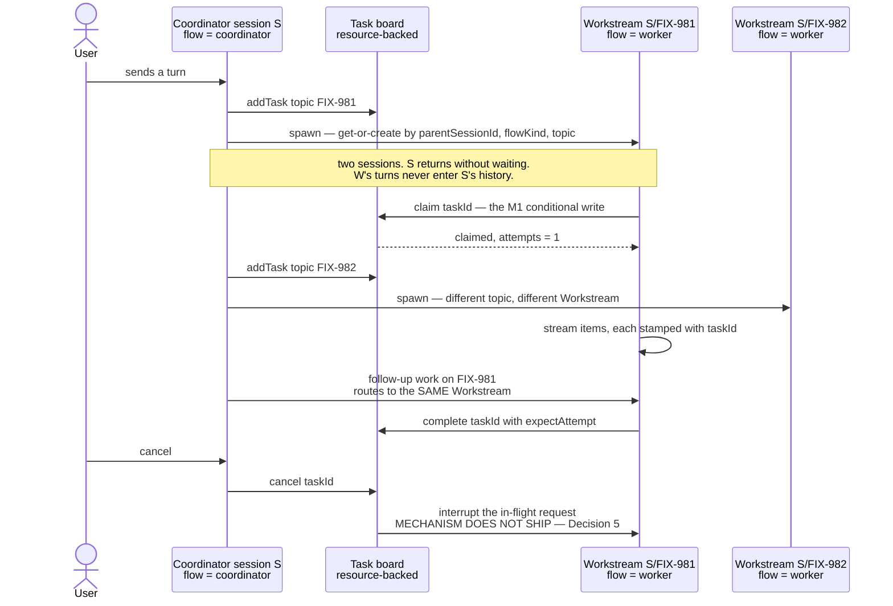
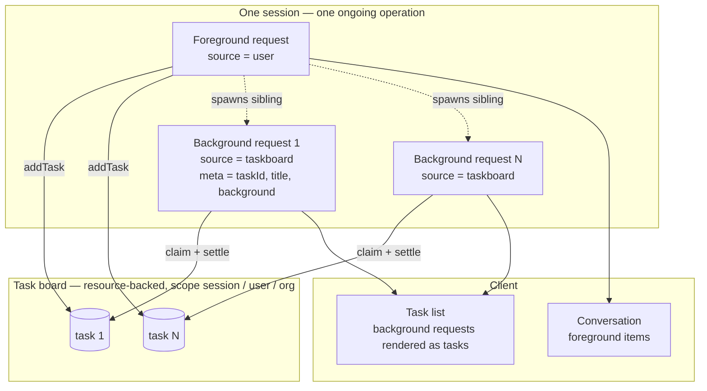

# Epic: Durable jobs & detached-task substrate

**Epic issue:** [FIX-939](https://linear.app/fixpoint-labs/issue/FIX-939) · **Epic PR:** [#993](https://github.com/fixpoint-labs/flow-state-dev/pull/993) · **Project:** Orchestration Primitives · **Branch:** `epic/durable-jobs`

> A coordination artifact for a set of related issues, not an implementing spec. Issues here
> reference and align to it; they do not derive from it. It exists so the decisions that cut
> across the set aren't made four times in four vacuums. Reviewed at spec altitude: fold what
> changes the objective or a cross-cutting decision, route everything else to the issue it
> belongs to. See [`orchestration.md`](../../contributing/orchestration.md).

---

## 1. In plain language

We want a unit of work — authoring a spec, implementing a PR — to keep running after the request
that started it has returned. Today it can't: a task's life is pinned to the execution that
created it.

**A detached task runs in a Workstream — a sub-session dedicated to one body of work.** That is the
decided shape. We are not building a job runner; the pieces already ship:

- The **task board** is the durable ledger of what work exists, and it is already cross-request.
- A **session** already groups many requests as one ongoing operation, and already isolates their
  history from every other session.
- A **request** is already the framework's unit of out-of-request execution.
  `@flow-state-dev/bullmq` runs one in another process today, from a serializable envelope, with
  sequence-number stream resume (`bullmq/src/worker.ts:81-95`).

A **Workstream** is a session carrying a `parentSessionId` and a `topic`. It holds one ongoing body
of work — one Linear issue, one investigation — and accumulates its own turns as that work
progresses. The session that spawned it coordinates; the Workstream does the work. Follow-up needs
no new concept: it is simply another request into the same Workstream.

> **Terminology.** A **background request** throughout this document is the request executing inside
> a Workstream. The term is unchanged from earlier drafts; what changed is *where* it runs. Anywhere
> the text says a background request is a sibling in the parent's session, that statement is
> superseded by this section.

Two things the diagram cannot show, and both are binding: a Workstream may run a **different flow**
than its parent, so the routing key is `(parentSessionId, flowKind, topic)` and not topic alone —
`SessionRecord.flowKind` binds a session to a flow at creation, so keying on topic alone can return
a Workstream whose flow lacks the action being dispatched; and the read model a UI needs already
exists — `RequestStore.list({ sessionId, … })` (`engine/src/stores/types.ts:283`, `:110-147`).

> **Why a sub-session and not a sibling request in the same session.** The alternative — a request
> tagged `background`, running beside the user's turns — was built and measured (§8), and rejected.
> Cross-turn history is loaded by `stores.request.list({ sessionId, tenantId, status: "completed",
> limit: historyWindowTurns, orderBy: "startedAtMs", withItems: true })`
> (`engine/src/context/createExecutionContext.ts:519-537`) — session, tenant and status only, with
> **no foreground/background dimension**. A *completed* background request is therefore
> indistinguishable from a user turn, and no field on `RequestListOptions` (`flowKind`, `sessionId`,
> `tenantId`, `status`, `limit`, `orderBy`, `withItems`) can separate them. The window also counts
> **requests, not tokens**: 50 background turns evict the user's own turn from a 50-turn window
> entirely. Separating them would mean a new filter dimension implemented across all four store
> adapters — and thereafter a filter every future reader of history must remember to apply.
> **A Workstream needs none of it.** A distinct session id is excluded by the `sessionId` filter that
> already exists and is already correct in every adapter. The isolation becomes a boundary that
> cannot be forgotten rather than a filter that must be remembered.

**What that leaves as real work.** Three things, and they are the epic:

1. **Claim safety** (M1). Two executions are two resource registries, so they race the same task
   row. This is the one thing the model does not dissolve — it makes it necessary.
2. **The seam** (M3), now measured rather than assumed. A block already has `ctx.stores` and its own
   `ctx.flow` (40 ctx keys, §8). What it lacks is exactly two things: a registry to resolve
   *another* flow by kind, and an executor to invoke. That is an injection, not a new mechanism.
3. **A create-if-absent primitive** (new, and a prerequisite). Workstream routing is get-or-create,
   and the store layer cannot express it: `ExpectedVersion = number | "any"` has no "must not exist"
   value, and `casWriteToMap` treats a missing record and a version-0 record identically. `set` is an
   upsert; there is no insert. Both keying schemes race, and a composite session id does **not**
   rescue it — the second create silently clobbers the first (§8).

Everything else in the original decomposition shrinks or dissolves — §5.

**What gates the epic: OQ-A** — whether we give resource state a conditional write at the durable
boundary — and **OQ-E**, where the consumer surface (S1–S5) lives, because one of its items is a
server-side correctness fix rather than additive polish. §6 has both.

---

## 2. The objective

### The gated statement

**A unit of work can outlive the request that created it — with exactly one owner at a time, a
progress surface that survives the request, and no way to strand it — on the task board we
already have.**

Three clauses, in dependency order:

1. **Exclusive ownership per attempt, and at-least-once execution.** At any moment a task has at
   most one *current* owner: only one execution may successfully claim it, and a stale owner's
   settlement is rejected rather than applied. Today neither holds across executions — measured,
   §8. **Cap admission is not promised by this clause** — see C1b.
2. **Reports what it is doing.** A task running outside its originating request has a durable
   progress surface. Delivered by the model: a background request has its own persisted item
   stream with sequence-number resume, so progress is "read the background request's items." No
   new progress mechanism is required.
3. **Steered, and never stranded.** A live coordinator can read the board and act on it; a
   coordinator that is gone does not strand the work. The non-stranding half is FIX-978's
   mechanism, consumed here.

**Why "per attempt" and not "exactly once."** `reclaim()` returns an expired `in_progress` task to
`pending` (`resource-backed.ts:406-450`), so a second worker can repeat any side effect the first
performed before dying. Conditional writes guarantee one current owner and reject a stale
settlement; they cannot make execution exactly-once without side-effect fencing, which is a much
larger mechanism and is not adopted here. **So a task body under this epic must be safe to run
more than once.** Deliberate contrast with the scheduled substrate, which chose the other side:
`ScheduleIndex` is documented **at-most-once** (`scheduled/src/scheduleIndex.ts:14-17`). Tasks want
the opposite trade, because a retried spec-authoring phase is recoverable and a silently dropped
one is not.

### Conditionality — the complete set

Anything not listed here is unconditional.

| | Clause / criterion | Conditional on | If the permitted outcome is taken |
|---|---|---|---|
| **C1** | clause 1 ownership · criterion 1 | **OQ-A** · the store adapter · the backing | Ownership holds only on a board the framework can fence. If the gate refuses the conditional write it is not delivered generally; on a store without the verb (filesystem) the durable board is refused rather than guaranteed; a `factory`-backed board is unverifiable and out of scope by default (Decision 3). |
| **C1b-i** | criterion 1b-i — **task ceilings** (`maxTotalTasks` / `maxEnqueuedTasks`) | **OQ-A** · **OQ-D-i** | May be narrowed-but-unbounded, or not delivered. Neither ceiling is enforced on a resource-backed board today (`tasks/collection/task-caps.ts:52-65`). |
| **C1b-ii** | criterion 1b-ii — **the `maxInstances` registry race** | **OQ-A** · **OQ-D-ii** | May be narrowed-but-unbounded, or not delivered. This is the contract §8 measured. |
| **C3** | clause 3 non-stranding · criterion 3 | **FIX-978** (external, not an OQ) | This epic consumes reclamation and does not build it. If FIX-978 does not land, work can still strand. |

**C1b-i and C1b-ii are independent.** Two ceilings, two files, two enforcement points: task
ceilings are the task layer's (`task-caps.ts`), `maxInstances` is the resource registry's
(`resource-registry.ts:989-1003`). Fixing one leaves the other unsafe.

### What "done" looks like

1. **Ownership (conditional — C1). Claim exclusivity asserted first, settlement second.** Under
   contention over one resource-backed board, where the guarantee is fenced: **only one `claim()`
   succeeds — equivalently, only one worker starts** (the claim is the exclusivity boundary), and a
   stale owner's settlement is rejected rather than applied. Both demonstrated by checks that *fail*
   against today's code (§8 is the falsification baseline).

   A check asserting only that two executions "cannot both settle" is passable by an implementation
   that violates the guarantee: fence settlement, leave `claim` unfenced, and two workers run to
   completion while one settlement lands. The cost is duplicate model execution — minutes to an hour
   per duplicated Conductor phase.

   **Where the guarantee is not fenced, "done" is defined differently.** No permitted outcome is left
   without a check:

   | Permitted outcome | What "done" means instead |
   |---|---|
   | OQ-A refuses the conditional write → guarantee is topological (queue dedup) | Assert exactly one execution can reach the board for a given task, **and** assert the escape hatches: a `taskTools` call and a `reclaim` from outside the queue must be shown impossible by construction or fenced another way. |
   | Store lacks the verb (filesystem) | Assert the durable board is refused at construction, loudly and by name. A silent degrade fails this criterion. |
   | `factory`-backed board | Assert it is refused or explicitly unsupported for detached jobs (Decision 3). |

1b. **Cap admission — two independent contracts, each with its own outcome, owner and check.** Task
   ceilings live in the task layer (`task-caps.ts`, neither enforced on a resource-backed board
   today, `:52-65`); the `maxInstances` race lives in the resource registry
   (`resource-registry.ts:989-1003`, enforced but from the per-execution cache). If OQ-A chooses exact
   arbitration, the check asserts the ceiling is never exceeded. If it chooses narrowed-but-unbounded
   overshoot, the check asserts the window narrowed and **must not** assert a maximum — a correct
   implementation would fail that. If a contract is scoped out, state which, and that the epic claims
   no guarantee for it. If both are deferred, this criterion reduces to criterion 1 alone.

2. **A task continues to execute after the request that created it has ended**, in a background
   request inside a Workstream, and the thing running it is not the originating request's drain.
3. **(Conditional — C3.) Redelivery, not merely reclamation.** A stranded claim returns to the
   queue with no human intervening — via FIX-978's mechanism — **and a worker actually starts on it
   again, with no manual dispatch.** Asserting only the status flip tests FIX-978's write and
   nothing about this substrate's liveness. **A pending task with no live initiating request has no
   wake source, and FIX-978 closes none of the three ways one arises** — including the admission
   window, which is unconditional rather than C3-conditional because no lease ever existed to
   reclaim. See Decision 6.
4. **A detached task's progress is readable from a durable surface**, not from a `transient: true`
   trace item and not from the originating request's emitter. Satisfied by reading the background
   request's persisted items (`RequestStore.getEvents(requestId, fromSequence)`, `subscribeToEvents`).
4b. **A detached task's own emitted items are retrievable from every execution that emitted them —
   including across a reclaim/retry, not merely across one boundary. Unconditional.** This is the
   existing `TaskHandle.items()` contract, which is explicit: *"Retries do NOT reset the start; all
   attempts append to the same window"* (`tasks/collection/types.ts:98-100`), pinned by
   `test/items/extract-window.test.ts:167`. So the check spans request A (attempt 1) and request B
   (attempt 2 after reclaim) — an implementation mapping a task only to its *latest* request would pass
   a weaker check while silently dropping attempt 1's items. Owned by
   [FIX-991](https://linear.app/fixpoint-labs/issue/FIX-991), which is what makes this satisfiable.
5. The in-request `.work` / `.waitForWork` flavour still works, and any break is a declared, versioned
   break with a migration note — not a silent behavior change.
6. **No new persistence backend, and no second work registry.** The board remains the single source of
   truth for what work exists. A transport that carries wake-ups is fine; a second place that
   *defines* the work is not.

### What this epic is not doing

- **No sibling job registry.** The board is the ledger. A second place defining what work exists
  would be two sources of truth for one question. A queue used purely as transport is not that.
- **No new durable store.** One durable task per issue on a resource-backed `TaskCollection` needs
  no store that doesn't exist.
- **Not replacing the in-request sidechain.** `.work` / `.waitForWork` stays as the lightweight,
  ephemeral, in-request flavour. Two flavours coexist by design.
- **Not task-events-as-dispatch-triggers.** The board's `task-change` events are a UI notification
  channel. Turning them into a dispatch trigger is net-new wiring, belongs to Conductor M3, and is
  outside this decomposition (FIX-825, §7).

### The forcing function

[Conductor](https://linear.app/fixpoint-labs/issue/FIX-966) M2
([FIX-969](https://linear.app/fixpoint-labs/issue/FIX-969) — run many issues in parallel under an
epic via the task board) is blocked on this substrate. A conductor phase runs many minutes to an
hour and cannot be bound to a tick's request.

**This gates scale, not the fast path.** Conductor M0/M1 ship before this epic: one issue,
per-tick drain, phase work in-request. What is stalled is running *many* issues at once. That sets
the bar a milestone must clear: not "is this useful" but "does parallel-at-scale fail without it."

---

## 3. Rules binding on every issue in this epic

Collected here so no issue has to hunt for them. Each is argued where it is decided.

1. **No issue may infer "abandoned" from lease expiry alone.** An expired lease is the normal state
   of a healthy worker — nothing renews a lease during execution and `DEFAULT_LEASE_DURATION_MS` is
   30s while a model call routinely exceeds it. Inferring abandonment trades a hang for silent
   duplicate execution. (Decision 1.)
2. **Every ownership-sensitive write must be fenced at the durable boundary** — not only `claim` and
   settlement, and including a write whose intent is another field but which persists the whole
   task. (Decision 2.)
3. **A conditional write is necessary but not sufficient.** Every worker-callable lifecycle
   transition additionally needs an ownership guard, or must be made coordinator-only. (Decision 2.)
4. **No issue may serialize a whole board to obtain claim safety.** Per-record, not per-board. A
   single-key cardinality counter is a coarse lock by another name. (Decision 2.)
5. **Any guarantee not enforced on the `taskTools` path is not enforced.** That path is the normal
   way boards get mutated in an agent framework, not an edge case. (Decision 4.)
6. **No mechanism may claim a bound it does not enforce.** Either name a mechanism enforcing a hard
   maximum on concurrent admitters, or say plainly that overshoot is narrowed but unbounded.
   (Decision 2.)
7. **Do not add a scope vocabulary.** `session` / `user` / `org` already exist on
   `defineTaskCollection`. An issue defining a second way to say "which durable partition" has found
   a conflict to surface, not a design choice. (Decision 3.)
8. **State explicitly which backings your guarantee covers.** Never treat `backing: "resource"` as a
   proxy for "durable" — `factory` is a second durable path. (Decision 3.)
9. **`source` is transport-set; `metadata` is not trusted.** Nothing may route or authorize on
   caller-supplied request metadata. (Decision 5.)
10. **A background request must target a drain-only action**, never the producer action. (Decision 5.)
11. **State how your persisted items' lifetime relates to the board's.** Item storage lifetime must
    not be shorter than the board's. (Decision 5.)
12. **Name your persisted surface.** Any issue claiming it made progress or failure visible states
    which persisted surface carries it. A `transient: true` trace item is not observability.
13. **Build on the named reuse seam (§9) or state in your spec why it doesn't fit.**

---

## 4. Cross-cutting decisions

### Decision 0 — a detached task runs in a Workstream, a sub-session dedicated to one body of work

**DECIDED by the repo owner.** The shape is §1. What follows is the verification, because three of
this epic's worst defects were load-bearing premise errors and this premise carries the
restructure. Unlike earlier rounds, this one was **executed rather than read** — three POCs on the
real path, §8.

**Confirmed against the tree:**

| | Finding |
|---|---|
| A request can be created against a **caller-chosen session id** | `runAction.ts:518` (`requestId`), `:642-658` (session binding); `InboundRequestEnvelope.sessionId` is documented *"Existing session, or undefined for a new session"* |
| Fire-and-forget is a supported shape | `InboundRequestEnvelope.responseEmitter?: ResponseEmitter \| null` — *"other adapters may pass `null` for fire-and-forget"* |
| A request already executes **out of request, in another process**, and resumes its stream | `bullmq/src/worker.ts:81-95` calls `runAction` from the envelope with `sessionId`, `requestId`, `source`, `metadata`, `startSequenceNumber` |
| **A Workstream's history is isolated with no new query surface** | Proven end-to-end: parent session sees only its own action, the Workstream only its own (§8). The existing `sessionId` filter does all the work |
| **A Workstream may run a different flow than its parent** | Proven end-to-end with two separately defined flows (§8). Flow-based resource isolation is **opt-in**: `toIsolationFlow` defaults `isolateUserState`/`isolateOrgState` to `false` (`resources/internal.ts:264-269`), and `resolveResourceScopeId` returns the bare `identityId` unless isolated (`stores/scope-keys.ts:154-160`) — so user/org resources are shared across flows by default, and `flowIsolation` can lock an individual resource (`:140-147`) |
| **Reuse accumulates** | A second task on the same topic routes to the same Workstream and appends to its history while the parent is untouched (§8) |

**Refuted — and narrower than previously stated.** The earlier claim was that nothing inside a
request can reach the machinery at all. A runtime probe of the execution context (40 keys, §8)
shows otherwise:

> A block **already has `ctx.stores`** and **already has its own `ctx.flow`**. It lacks exactly two
> things: a registry to resolve **another** flow by kind, and an executor to invoke
> (`runAction`/`dispatch` are absent). Every actual `runAction` call site remains a transport
> adapter or route — chat-sdk event handlers (`chat-sdk/src/event-handlers.ts:393`), the MCP adapter
> (`mcp/src/createMcpTransportAdapter.ts:410`), scheduled routes (`scheduled/src/routes.ts:205`),
> action routes (`routes/action-routes.ts:167`), the BullMQ worker, the CLI — but the gap is an
> injection over two missing pieces, not store plumbing.

Two structural facts follow, and they constrain FIX-982:

- **The seam lives in `engine`; the board lives in `orchestration`, which has
  `@flow-state-dev/engine` as a *devDependency only*** (`packages/orchestration/package.json`). The
  board cannot reach the seam by import even in principle. Spawning must arrive as a capability
  injected onto the execution context — a `core` type implemented by `engine` — which keeps the
  package boundary intact.
- **The two existing in-request background primitives are not this.** `.work` /
  `_requestBackgroundSignal` stays inside one request and its pool is drained before terminal status
  (`core/src/types/block.ts:517`, `:633`; `execution/request-work-pool.ts:4`), and reactive dispatch
  runs blocks inline in the mutating turn via `executeBlock` (`context/reactive-dispatch.ts:1-16`).
  Both are intra-request concurrency; neither detaches.

**So the premise holds: the mechanism ships, and what is missing is an in-request handle to it.**
The POC dispatches into a Workstream from *outside* the request, standing in for that handle — which
is what makes the remaining risk precise. Everything downstream of the spawn is demonstrated; the
spawn itself is the one unbuilt piece.

**One recorded constraint, not a defect.** Workstream get-or-create races if two coordinators target
one topic concurrently (§8 measures duplicate Workstreams). The repo owner's decision is that **the
parent session agent is the sole coordinator**, which removes the race by construction. It is
recorded here because it is an assumption a future multi-coordinator flow would silently violate,
and because the underlying store gap (no create-if-absent) is real regardless — §1, item 3.

### Decision 1 — M2 stays with FIX-980; this epic consumes reclamation

**DECIDED by the repo owner.** The description's M2 ("automated reclamation, joined to execution
liveness") has no issue here. That work is
**[FIX-978](https://linear.app/fixpoint-labs/issue/FIX-978)**, parented under epic
**[FIX-980](https://linear.app/fixpoint-labs/issue/FIX-980)** ("Honest task substrate", epic PR
[#983](https://github.com/fixpoint-labs/flow-state-dev/pull/983)). **FIX-978 is currently
`Backlog`** — the owner moved it back from Spec Approved on 2026-07-30.

The reasoning worth keeping: FIX-980's epic-spec establishes against the code that an expired lease
is the *normal* state of a healthy worker, so any fix inferring abandonment from lease expiry alone
trades a hang for silent duplicate execution — strictly worse, and counter to this epic's objective
too. That reasoning is written down, reviewed, and binding on FIX-978 (rule 1). Two epics owning it
would produce two mechanisms for one question.

**FIX-978's outcome is a dependency of FIX-982, not a deliverable of FIX-939.** This epic designs no
lease renewal or heartbeat and wires no reclaim sweeper. It does assume, as a precondition of M3,
that a stranded claim has a recovery path.

**Sequencing risk across both epics.** FIX-981 owns the conditional-write primitive; FIX-978 owns
converting `reclaim` (`resource-backed.ts:406-450`) to use it. The conversion cannot land before the
primitive exists, but no dependency is recorded between them and FIX-981 is scoped to claim and
settlement. **So both can complete, each correct within its own scope, with `reclaim` still on the
unconditional write** — and then two workers race across a reclaim with neither issue's tests
covering it. A `blocked-by` relation is **proposed, pending the owner's decision**, not wired:
making FIX-981 block FIX-978 would gate another epic's work on this epic's ungated objective.

### Decision 2 — does this epic change `ResourceStateStore`? (recommendation; awaiting the gate)

Settled here rather than inside FIX-981's spec, because option (b) is FIX-982's territory and
option (a) is FIX-981's — the decision picks the shape of two milestones.

#### The premise: there is no cross-execution CAS

The description previously asserted the board has a "CAS claim" and that Conductor could take
"leases, CAS claim, attempts … as-is." **It cannot**, and the error was load-bearing: it is why the
epic once concluded no work was needed here. Cross-execution claim safety is net-new work, not an
inherited property. That is M1, and it is why M1 is `Large`.

Resource state has tier 1 of a two-tier design and no tier 2. `scope-lock.ts:1-5` states the
architecture: *"Per-`StateContainer` async FIFO mutation queue. The two-tier dispatch lives in
`applyMutation`; CAS retries still apply at the durable boundary in `runWithCAS`."* Scope state has
both tiers; resource state has only the in-process one (`serializeResourceWrite`,
`resource-registry.ts:540-546`) — `ResourceStateStore.set` is an unconditional upsert
(`stores/types.ts:550-551`).

Tier 1 doesn't reach, because that promise chain lives in a `Map` on the `ResourceRegistry` and a
registry is built **per execution** (`createExecutionContext.ts:1649`, `:1664`, `:1682`). Two
writers in one execution serialize correctly; two writers in two executions share nothing, both read
`pending`, and both write `in_progress`. `claim` inherits this because its whole guard runs inside
`candidateRef.updateState` (`resource-backed.ts:270-308`).

**Under Decision 0 this stops being an edge case.** A coordinator and its Workstreams are separate
`runAction` calls, hence separate execution contexts and separate resource registries, and they
share one board. Turn-based requests made the race rare; parallel Workstreams make it the default
path. **Session isolation does not help here** — the board is a resource, not history, so moving
execution into a sub-session changes who reads the conversation, not who writes the task row.

Three code comments assert the opposite and must be corrected by whoever lands FIX-981:
`task-board/blocks/claim-task.ts:12-14` (*"The substrate's CAS retry inside `collection.claim`
guarantees exactly-once dispatch"* — there is no CAS and no retry in that path),
`tasks/collection/resource-backed.ts:6-7, 22-26` (true within one execution, false across two, and
the sentence does not say which), and `TaskDispatcher`'s header (same false claim).

#### Direction: yes to (a), additively, reusing a shipped precedent

**This is not greenfield.** The scope stores already ship the whole pattern one layer down:
`runWithCAS` (`engine/src/stores/cas.ts:119-175`), version-gated `set(id, value, expectedVersion)`
(`stores/types.ts:258-281`), and `DeltaStoreOps` (`stores/types.ts:181-256`) whose header is
decisive — *"Adapters MAY implement none, some, or all of these. The CAS persist callback
feature-detects per call and falls back to `set` with the full record when a verb is absent
(capability advertisement). … the optional-in-v1 stance is a migration concession to existing SQLite
and filesystem adapters."* Optional verb + feature-detect + fall back is the established house
pattern for exactly this problem, adopted for exactly this reason, so the recommendation applies a
shipped pattern to the one store left out of it.

> **The direction, which is all this epic decides:** give resource state a conditional write at the
> durable boundary, added **additively** so no existing caller and no third-party adapter is forced
> to change, and reuse the scope-store precedent rather than inventing a parallel mechanism. **The
> shape is FIX-981's to design.**

**What the gate is being asked to accept**, priced against the tree:

| | Cost |
|---|---|
| **Surface** | The store verb is the small part. The signal a correct `claim` needs lives one layer up, and `updateState` returns `Promise<void>` (`core/src/types/resource.ts:249`, `:309`) — it cannot report that an update did not apply. It has 47 non-test references across 13 source files in 6 packages. Adding a *sibling* method instead of changing `updateState` keeps all 47 untouched. |
| **Compatibility** | Additive is **not** non-breaking. An optional verb preserves TypeScript *source* compatibility, not behavioral: a third-party adapter without the verb backs a durable board that worked before the upgrade. **Decided: refuse to construct a durable board on an adapter lacking the verb** — loud, named, at construction — rather than degrade with a warning, because a board that appears to have claim safety and does not is the exact defect FIX-980 exists to eliminate. So: a declared adapter migration, stated in the changeset and adapter docs. In-request and non-durable boards are untouched. |
| **Filesystem cannot do this today** | Its safety is per-handle and per-process *by design*: the write lock is an in-memory `Map` per store handle, *"atomic within one process"* (`stores/filesystem/shared.ts:247-273`); *"There is NO inter-process locking … Use SQLite or Postgres for any multi-process or production deployment"* (`filesystem/request-store.ts:86-91`); and the `ResourceStateStore` adapter is weaker still — write-temp-then-`rename` with no lock at all (`filesystem-resource-store.ts:376-382`), which prevents torn files, not lost updates. Either a named cross-process protocol, or exclusion. **If excluded, durable boards require SQLite or Postgres, including in local dev** — a developer-experience cost the gate should price. |
| **The shape is undecided** | `ResourceStateStore.get()` returns a bare `JsonObject` (`stores/types.ts:548`) and resource refs carry no version at all (`core/src/types/resource.ts` contains zero occurrences of "version"), while `runWithCAS` requires an `expectedVersion`. So "mirror `runWithCAS`" is a direction, not a design: a versioned-read envelope, expected-value CAS, and an atomic mutate verb are different public and adapter contracts, not variants of one. **FIX-981 picks, and states the consequences.** |

*Per-adapter mechanics, the conformance suite's new shape (its one-handle-per-test setup cannot
express contention), and the naming of any new verb are FIX-981's design work — routed to its
implementer notes, not decided here.*

#### Option (b) — queue-level dedup, and why it fails

(b) is: never let two executions contend for one board. No store change; a guarantee that "holds
only for work routed through the queue." Three paths reach a board *without* the queue today:
`taskTools`, the model-facing tool surface — eight tools (`skills/task-tools-capability.ts:560-585`)
a generator holds via `uses: [taskTools]`, explicitly supporting a shared board, so an LLM calling
`completeTask` is not work routed through the queue; the default `taskTools` instance, which is
uncapped (`:588-600`, FIX-931) and which (b) cannot fix at all; and `reclaim()`, which flips
`in_progress → pending` outside any dispatcher.

Not sufficient for Conductor M2 either — its phases are agents holding `taskTools` against a shared
board, and its crashed-worker criterion runs through `reclaim`. And (b) has a disqualifying
sequencing problem: the queue it depends on is milestone 3, so (b) means M1's guarantee is delivered
by M3's machinery, inverting the sequence or collapsing M1 into M3. **If the gate refuses the store
change, the honest consequence is not (b) — it is that M1 and M3 merge** and the sequence is
restated. Option (c), neither, blocks the epic and relocates the Conductor M2 block upward, leaving
§8's measured defects shipped; it is right only if the objective isn't worth pursuing, which is the
gate's question.

#### Clause 1 needs two mechanisms — and per-key CAS covers only one

| Clause | Contended thing | Per-key CAS enough? |
|---|---|---|
| **1a** — two executions cannot both win one task | one task's row | **Yes.** Same key, so a version guard discriminates. |
| **1b** — two executions cannot both admit past a creation cap | the collection's **cardinality** | **No.** Different task IDs are different keys; two CAS writes to different keys both succeed. |

`ResourceCollectionRef.create()` (`resource-registry.ts:981-1004`) counts from
`options.readResources()` — the per-execution cache — so execution B cannot see the row execution A
just created; and unlike `set`/`patchState`/`updateState` (`:685`, `:699`, `:711`), **the `create`
path is not wrapped in `serializeResourceWrite` at all.** That is §8's first row: 8 rows against
`maxInstances: 4`, two executions admitting four each.

##### The write-path principle — a principle, because enumerating paths has failed three times

> **Every ownership-sensitive write must be fenced at the durable boundary — not only `claim` and
> settlement.** An ownership-sensitive write is any write that can change or overwrite the fields
> establishing who owns a task (`attempts`, `status`, `leaseUntil`, `assignee`), **including a write
> whose intent is some other field but which persists the whole task.**

**Exhaustive enumeration of the paths carrying that invariant is a required deliverable of
FIX-981's spec**, done against the code. Known instances — **known-so-far, explicitly not
exhaustive**:

| # | Path | Fenced by 1a as scoped? |
|---|---|---|
| 1 | `claim` → `updateState` | yes |
| 2–4 | `complete` · `fail` (both branches) · `cancel` → `transitionRef` | yes |
| 5–8 | `block` · `unblock` · `awaitReview` · `resumeFromReview` → `transitionRef` | **No — and routing them through the conditional write does not fix them.** They accept no ownership token at all (`types.ts:177-180`); see the sufficiency correction below. `unblock` is additionally FIX-957's Decision 4 surface. |
| 9–13 | `setAssignee` · `setPriority` · `addLabel` · `removeLabel` · `patchMetadata` → `patchRef` | **No — all five** |
| 14 | `reclaim` → `updateState` | **FIX-978's**, per Decision 1 |
| 15 | `addTask`/`addTasks` → `collection.create` | 1b's path, not ownership |

**Nine of the thirteen sit outside "claim and settlement."** `patchRef`
(`resource-backed.ts:215-239`) **takes no guard parameter at all** and does
`applyTransition(task, update, now())` inside `ref.updateState`, returning the whole task. It reads
the stale execution mirror and rewrites every field: a reclaimed attempt-1 worker calling any of
those five overwrites attempt 2's `attempts` and `status`, **undoing the ownership guarantee even
when claim and settlement are fenced.** Intent is irrelevant — the write is whole-task. `addLabel`
matters most in practice: FIX-980's A1 identifies
`patterns/src/supervisor/blocks/label-failed-reviews.ts` as a live post-drain block that labels
terminal tasks, so it is a real caller. And rows 5–8 sit in the ambiguity of the phrase "claim and
settlement" — they are neither, and they mutate `status`. **1a means "route `transitionRef` through
the fenced write," not "claim + settlement."**

##### A conditional write is necessary but not sufficient

> **Every worker-callable lifecycle transition additionally needs an ownership guard. Fencing the
> write is not enough on its own.**

`block`, `unblock`, `awaitReview`, `resumeFromReview` take **no options parameter at all**
(`types.ts:177-180`), unlike `fail(id, error, options?)`; and `cancel(id, reason?)` (`types.ts:181`)
**hard-codes `{ ifAllowed: true }`** at the call site (`resource-backed.ts:391-403`), so a caller
cannot supply `expectAttempt` even in principle. `ifAllowed` only makes an *illegal* transition
advisory — `attemptOwnsTask` is consulted only when `expectAttempt` is supplied — so these paths get
no ownership check.

**Consequence: CAS enables the write rather than preventing it.** A conflict refresh re-reads
attempt 2's row and then applies the stale caller's transition, which is *legal* from there
(`pending → blocked`, `in_progress → cancelled`). So a stale worker calling `taskTools.blockTask` or
`cancelTask` still lands on the new owner's row. Fresh state is exactly what lets it through.

**The fork FIX-981 must resolve — named, not chosen here:** (i) add an ownership guard to those APIs
(an `options` parameter carrying `expectAttempt`, as `complete`/`fail` already have), or (ii) make
those paths explicitly coordinator-only — a worker arguably has no business cancelling or blocking
its own task.

**The owner's model actively supports (ii).** Decision 0 describes cancellation as flowing
coordinator → task → request: the initiating request cancels the *task*, and the task's cancellation
interrupts the background request. Under that shape a worker never needs to cancel or block its own
task, so coordinator-only is a narrowing of the API rather than a lost capability. Recorded as
support, not as the decision — FIX-981 still chooses, and (ii) has a prerequisite of its own
(Decision 5, cancellation).

**Compose with FIX-951, never replace it.** `ifAllowed` / `expectAttempt` / `TransitionDeclined` /
`shouldDeclineTransition` are the shipped in-request half of this guard and the logic is *correct*:
`attemptOwnsTask` is `task.attempts === expectAttempt && ATTEMPT_OWNED_STATUSES.has(task.status)`
(`internal.ts:107-109`). What fails is the *read* feeding it — `current` comes from the calling
execution's own mirror, so a displaced worker evaluates a correct guard against a stale view. The
guard is starved of a fresh read, not wrong.

**Coordinate with FIX-976, do not collide.** FIX-976 (under FIX-980) is already *"`assignTask`
silently rewrites a terminal task's assignee"* — the same path from the honesty angle — and
FIX-980's A1 constrains any guard there to be per-operation, never installed on the shared patch
helper (a blanket guard would break the live labelling block).

##### 1b — cap admission · constraint only; this epic names no mechanism

> **FIX-981's spec must not include 1b implementation until OQ-D-i / OQ-D-ii are decided,
> separately, per contract.** The task ceilings may already be FIX-957's (OQ-D-i), and the
> `maxInstances` race may not belong here at all (OQ-D-ii). Build 1a; leave 1b's mechanism unbuilt
> and its decision cited. If 1b is deferred, criterion 1b is relaxed away.

**The only thing this epic decides about 1b** is rule 6. An authoritative read immediately before the
decision narrows *when* the race happens and bounds nothing about how much — any number of executions
can each observe remaining capacity before any of them writes, and because the writes go to distinct
keys none of them conflicts. Overshoot scales with concurrency, so calling it "bounded" would be a
guarantee this epic cannot honour.

> **Cross-issue finding for the owner; nothing here edits FIX-957.** FIX-957's spec chose the same
> authoritative-re-read mechanism and described the result as *"a small, bounded overshoot."* By the
> argument above that mechanism does not bound — and FIX-957's own spec makes the case against
> itself, having rejected the mirror-only check because *"the overshoot grows with the number of
> concurrent writers rather than staying within a few tasks."* **This bears on OQ-D-ii (the registry
> race), not OQ-D-i (the task ceilings)** — a different mechanism in a different file, not impugned
> by it. "Inherit FIX-957's answer" is conditional on FIX-957's bound being real. Route to FIX-957's
> owner; not edited here.

**FIX-981 inherits one contention harness with three assertions**, on the same
two-executions-over-one-board setup: (1) only one `claim()` succeeds / only one worker starts —
same-ID contention, guarding 1a's exclusivity boundary; (2) a stale owner's settlement is rejected;
(3) the distinct-ID cap behaviour OQ-A actually selected — two executions creating *different* task
IDs against one capped collection, which the same-ID shape cannot catch because both writes succeed
and the failure shows only in the final row count. Assertion 3 is skipped if 1b is deferred.

**Coarse locks are rejected here, not in a child spec.** A global board lock collapses throughput
under parallel Conductor — the opposite of why this epic exists. The house pattern is two-tier for
exactly that reason: in-process FIFO queueing per record + per-record version-gated CAS at the
durable boundary (`scope-lock.ts:1-5`).

*Recorded as **OQ-A**. When the gate answers, this heading changes to DECIDED and the rejected
options stay recorded with their reasons.*

### Decision 3 — board lifetime and collection scope are two axes, not one

| Axis | Controls | Values today | Where |
|---|---|---|---|
| **Backing** — the lifetime lever | how long the board lives | `request` \| `resource` \| `sequencer` \| `factory` | `TaskBoardBacking`, `task-board/index.ts:442` |
| **Scope** — the identity partition | which durable partition holds it | `session` \| `user` \| `org` | required on `DefineTaskCollectionOptions` (`define-task-collection.ts:65`) |

The docs say it outright — *"Backings set the lifetime"*
(`apps/docs/guides/board-lifecycle.md:122-137`), then *"The scope lives on the collection, not the
board"* (`:172-173`). **No `lifetime` field exists anywhere in `packages/orchestration/src`** —
verified. Any description or paraphrase speaking of a `lifetime` enum, or of "widening
`block | request` with `session`/`user`/`org`", is **stale**: those are orthogonal axes, and
FIX-957's spec ([#954](https://github.com/fixpoint-labs/flow-state-dev/pull/954)) explicitly
**rejected** a parallel `boardScope` enum because *"it invents a parallel scope vocabulary beside
`defineTaskCollection`'s, which means two ways to say 'a durable task board' and two places for the
definition to drift."* Treat the spec as canonical.

**The decision.** "Extend, never fork" survives, but the axis extended is `backing`, and the durable
rungs come from `scope`, which already ships. Rules 7 and 8 are the binding halves. Additionally:
the durable board this epic secures is backing `resource` + a scoped collection (but see 3.b — not
the only durable shape); if a `lifetime` option ever appears it replaces or wraps `backing`, and
whoever lands it says what happens to the four existing values; **watch FIX-960 on this axis**, not
FIX-957 — it renames the `sequencer` backing to `state`, so any issue here reading or writing a
backing value must expect that; and there is **no dependency in either direction with FIX-957**,
because the durable rungs are already shipped.

#### 3.b — `factory`-backed boards are a second durable path

A caller using the documented `(ctx) => TaskCollectionRef` factory path to resolve an
externally-managed durable collection gets `backing: "factory"`, not `"resource"`
(`task-board/index.ts:911-923`). Binding FIX-981 and FIX-982 to the `resource` discriminant alone
leaves a supported durable shape outside claim-safety and detached-executor semantics.

It cannot simply be included, because `factory` is opaque by design — the type's own doc calls it
*"caller-opaque"* and the capability *"defer[s] entirely to the user's factory"*
(`index.ts:436-441`, `:468-474`). The framework cannot verify that a factory-supplied ref is durable,
is fenced, or is even the same collection across executions.

**Decision: detached-job guarantees attach only to a board whose durability the framework can
verify.** `factory` boards are out of scope for detached jobs by default — not "broken"; the
framework cannot guarantee a ref it cannot inspect. Supporting them requires advertising two
contracts: (a) conditional-write capability (can ownership writes be fenced?) and (b) stable
re-resolution / durability identity (will a later, independent execution resolve *the same* durable
collection?). **(b) is load-bearing and new**: a factory returning a fresh in-memory but fully
CAS-capable ref per execution satisfies (a) completely while the detached executor resolves a
*different, empty* collection — the task stranded with every fence intact. Advertisement for fencing
alone is explicitly rejected; if (b) is not offered, factory boards stay unsupported for detached
jobs, which remains defensible. How a ref advertises either contract is FIX-981's design decision
under the shape fork above.

### Decision 4 — `taskTools` is the path guarantees escape through

It has broken an assumption in this document three separate times, each found independently: it
bypasses option (b)'s dedup, its default instance is uncapped (`task-tools-capability.ts:588-600`),
and its settlement tools carry **no ownership token at all** —
`completeTask → withTask(ctx, id, (c) => c.complete(input.taskId, input.output))` (`:415-423`) and
`failTask` likewise (`:425-433`). No third argument, so no `expectAttempt` and no `ifAllowed`. Making
`transitionRef` conditional does not fence the model-facing settlement path, and CAS arguably makes
it worse: a conflicting write refreshes to the current row (attempt 2, `in_progress`), the guardless
transition is legal from there, and the stale attempt-1 tool call settles the new owner's task.

**A background request's tool context must therefore carry an attempt or owner token**, so its
settlement calls are fenced the way `dispatchAndExecuteBlock` and `recordResult` already fence theirs
(`expectAttempt: claimed.attempts`, `dispatch-and-execute.ts:186,193`). Whoever owns the background
request's context owns this.

**Consequence — M1 alone does not close the ownership guarantee.** That token lives in the background
request's context, which is M3's territory, while the sequence treats M1 as having delivered
ownership before M3 starts. In the gap, an attempt-1 model calls `completeTask` after reclamation and
attempt 2's claim, and the guardless tool call settles the new owner's row even though every direct
collection settlement is fenced.

**The document's position: M1's completion claim stays explicitly pending on M3.** M1 ships the
primitive and fences the collection surface; it does not close the guarantee until the tool surface
is fenced too. Chosen because it is a statement of fact rather than a design choice. Two alternatives
exist and FIX-981 may take either — carry the token through every existing `taskTools` context
(widens M1 a fourth time on the same axis), or fail closed at the substrate: on a durable board, a
settlement with no ownership token is refused rather than applied, which makes M1's guarantee real
immediately but breaks `taskTools.completeTask` on durable boards until a token exists.

### Decision 5 — what a background request carries, and what it must not re-run

**Owner: FIX-982 (M3).** Under Decision 0 the "execution coordinate" problem dissolves rather than
needing a new invention: `DispatchEnvelope` requires `actionName: string` and `input: unknown` as
non-optional fields (`transports/dispatcher.ts:16-26`) while a task stores only
`assignee: z.string().optional()` (`tasks/schema/task.ts:41`), so a task cannot be dispatched from
`assignee` alone — but **"enough to start a request" *is* that envelope.** Persisting the envelope on
the task replaces inventing a coordinate. **A bare `requestId` does not**, and does not qualify — see
the recoverability requirement in Decision 6.

**Carry the bare identity fields, never a derived key.** `createExecutionContext` derives the storage
key from `(sessionId, tenantId)`, so passing an already-derived key as `sessionId` either
double-prefixes it or loses the tenant binding — either way resolving a different session partition
than the one holding the board. The fields are `flowKind` + bare `sessionId` + `tenantId` + `userId` /
`orgId`, as separate fields, which is the shape `DispatchEnvelope` already carries.

**`flowIsolation` is re-derived, not forwarded.** It is declared only on resource/collection
definitions (`core/src/types/resource.ts:186`; `resource-collection.ts:59`) with flow-level
`isolateUserState` / `isolateOrgState` defaults (`types/flow.ts:489-499`), appears nowhere on a
request, and `createExecutionContext` already recomputes it from config + flow defaults + identity
(`:867-880`, via `scope-keys.ts:140-160`). Carrying a copy on the task would be a bug: it would
diverge from the definition and from the shared-prefix conflict rule that *throws* when collections
disagree (`createExecutionContext.ts:818-861`). To re-derive, the executor loads the full config map
for that scope (canonicalization and the prefix check are whole-map decisions), the flow definition,
and the identity fields above.

#### The producer-repeat hazard — the primary design constraint under this model

> **A background request that re-enters the originating action re-runs that action's producer
> steps.** The shipped supervisor pipeline is `captureAndPlan → board.drain → cascadeSkipDependents`
> (`patterns/src/supervisor/index.ts:13`). So a background request pointed at the producer action
> **re-runs the planner**, re-seeding tasks and duplicating exactly the work the board exists to
> track.

Under requests-as-jobs this is no longer a footnote. "Start a request" is the whole mechanism, so
*which action it targets* is the whole design. **Rule 10: a background request must target a
worker/drain-only action, never the producer action.** The clean shape is a dedicated, re-enterable
drain action with no producer steps to repeat — it trades generality for a coordinate that is
trivially stable. FIX-982 chooses how to constrain this; the constraint itself is not optional.

#### Two further constraints on the drain action

**A request is not bound 1:1 to a task today.** `dispatcher.claim(collection, workerId(ctx), ctx)`
takes **no task-id filter** (`task-board/blocks/claim-task.ts:55`) — the worker takes whatever the
dispatcher selects — and the drain loops back:
`.loopBack(claimStepName, { when: shouldContinue === true, maxIterations })` (`task-board/index.ts:777`).
So a request spawned "for task A" may go on to execute B and C, breaking two things the model
promises: cancelling task A would abort unrelated work, and `metadata.taskId` stops identifying what
produced the items after the first iteration. **Requirement: a task-id-filtered single claim with no
loop-back on the detached path** — or make the background request **board-level rather than
task-level** and drop the per-task framing. FIX-982 chooses; both are coherent, but only the second
survives without a claim-by-id.

**A drain action in `flow.actions` is publicly addressable.** `resolveActionCore` branches on the
`webhook` / `chat` / `scheduled` sources (`execution/resolve-action-core.ts:79`, `:91`, `:99`) and
otherwise falls through to `flow.actions[actionName]` (`:107`), so any authenticated caller can POST
the drain action over HTTP or MCP and start claiming board work. **Requirement: a source-gated
binding or another private, re-resolvable coordinate** — those three branches are the shipped
precedent for building one, so copy that shape rather than inventing another.

#### Metadata, and what may be trusted

**`InboundSource` is an open string (`core/src/types/auth.ts:19`), so `taskboard` needs no type
change.** Rule 9 has an in-repo precedent that settles it: the concurrency arbiter's event check
*"must gate on the trusted transport `source` (set by the adapter, never the caller) AND the metadata
coordinate … `metadata` alone is caller-controllable over HTTP, so trusting it would let a caller
spoof `metadata.webhook` to skip a public action's reject/queue policy"*
(`transports/concurrency/arbiter.ts` → `resolve`). **Metadata is fine for display; it is not a trust
boundary** (BP-031).

#### Cancellation — the half of the model that does not ship

The model says the initiating request cancels the task and the task's cancellation interrupts the
in-flight background request. **The interrupt half does not exist for a clientless request except
in-process**, and this is FIX-982's most substantive remaining work:

- `abortRequest(requestId)` fires an **in-memory** `AbortController`, so it works only on the
  instance running the request (`execution/abort-registry`, called from `routes/abort-routes.ts:60-63`).
- Cross-instance, setting `abortRequested: true` is **not itself a cancellation**. The route's own
  contract: the flag *"tells the running instance to treat the next client disconnect as an
  intentional abort"*, and the abort happens *"when the client closes the SSE connection and
  `request.signal` fires"* (`abort-routes.ts:17-27`, `:65-68`).
- **A background request has no client and no SSE connection** — it is dispatched fire-and-forget
  with `responseEmitter: null`. There is nothing to disconnect, so the flag has no consumer that can
  interrupt it.

So FIX-982 must name how a cancelled task interrupts its background request, and may not assume the
existing abort flag does it. This is also the prerequisite for Decision 2's coordinator-only fork
(ii): coordinator-only cancellation is a real capability only if coordinator cancellation actually
stops the worker.

#### Lifetime — the constraint this model makes sharper

Retention **operates at request granularity — entire old requests are removed, not individual items
within a request — and the current request is never evicted**
(`engine/src/execution/retention.ts:33-37`). If a task's items live in its background request,
ordinary request retention can empty a task's item window while the board still references the
task, and `items()` returns `[]` rather than throwing.

**Precisely, because overstating this would be its own defect.** `applyRetentionPolicy` lists only
`status: "completed"` requests for the session and excludes `currentRequestId` (`retention.ts:48-66`).
So a *live* background request is not a retention candidate — a task mid-execution is safe. But
**attempt 1's completed request is a candidate while the task is still alive**, which is exactly
criterion 4b's cross-attempt union: evict it and attempt 1's items vanish from a window the shipped
contract says all attempts append to. And "the current request is never evicted" protects only the
foreground request — a completed background sibling has no such protection, so a completed task's
items are evictable while the board still references the task.

**So a background request's lifetime must be bounded by the *board's*, not by session request
retention.** Bounding the cross-request contract to request retention is rejected: it would make a
user/org task's `items()` return `[]` once the emitting request is evicted, violating unconditional
criterion 4b and silently weakening a shipped contract that `extract-window.test.ts:167` pins — and
the failure mode is a silent `[]` rather than an error, the exact shape this epic exists to remove.
**Pinning or copying the relevant items for the board's lifetime is required** (rule 11). If
unbounded growth on a long-lived org board is the concern — a fair one — the answer is a board-scoped
retention bound stated in the contract, not inheritance of the request's: bounded, but bounded at the
board's granularity and declared, so `items()` never silently contradicts itself. How to pin, copy,
or bound is FIX-991's mechanism.

### Decision 6 — the admission wake is request creation; the reclamation wake is not

Under Decision 0, most of "name your wake model" collapses: **the wake is request creation.** An
initiating request creates a background sibling, and that request runs the task. No scheduler, no
board-to-queue producer, no polling loop.

**One path does not collapse, and clause 3 depends on it: a pending task with no *live* initiating
request has no wake source.** Two ways in, and FIX-978 closes neither:

| How a task gets there | Why FIX-978 does not help |
|---|---|
| FIX-978's own reclamation returned it to `pending` | Reclamation is what put it there; nothing then creates a request. |
| **The admission window** — the task was persisted, and the Workstream's request never was: the coordinating request crashed in the gap, **or the dispatch was rejected at the concurrency gate** | **No worker ever claimed it, so there is no expired lease to reclaim.** `reclaim` skips any task that is not `in_progress` with a past `leaseUntil` — checked twice, on the mirror read (`resource-backed.ts:412-418`) and again inside `updateState` (`:422-428`). A never-claimed `pending` task is invisible to it by construction. |

**The window is not crash-only — N1's `concurrency: "reject"` triggers it deterministically.** The
envelope is assembled at `createInboundTransportHost.ts:129-142`; the gate at `:157` for `reject`
*"synchronously claims the action's key and throws `ConcurrencyRejectedError` here… so a dropped
caller never materializes a run"*; the first `stores.request.set` is not until `:251`. On rejection the
envelope exists only in memory and is discarded — so stranding is a **predictable outcome of a
supported configuration**, not an unlucky interleaving.

**Two requirements, both FIX-982's.** (1) **The durable task or outbox row retains a re-dispatchable
envelope *template*, and each attempt mints a fresh `requestId`** associated with the task. The
template carries `flowKind`, `actionName`, `input`, `userId`, `sessionId`, `orgId`, `tenantId`,
`source`, `metadata`. **A bare `requestId` does not qualify** — it points at a record that will never
be written, with no `actionName` and no `input` to re-dispatch from — but **re-dispatching a stored
envelope verbatim is equally wrong**, because the envelope carries `requestId` and reusing it
destroys the prior attempt:

| Store | Event persistence | Attempt 1's events once attempt 2 reuses the id |
|---|---|---|
| **SQLite** | `PRIMARY KEY (request_id, sequence_number)` (`store-sqlite/src/schema.ts:165-170`) + `INSERT OR REPLACE` (`request-store.ts:206`); traces the same via `ON CONFLICT … DO UPDATE` (`trace-store.ts:40-42`) | **destroyed** |
| **Postgres** | same primary key (`store-postgres/src/schema.ts:186-191`) + `ON CONFLICT (request_id, sequence_number) DO UPDATE SET event_data = $3` (`request-store.ts:437-439`) | **destroyed** |
| **Memory** | plain append — `existing.push(...events)`, no key (`engine/src/stores/memory/request-store.ts:96-103`) | **preserved** |

A second attempt restarting its sequence numbers **upserts over attempt 1 with no conflict, no error
and no trace** — so criterion 4b's cross-attempt union does not merely become hard to read (§5's
accessor fork), **the data ceases to exist.** Note which stores: the two that destroy it are the
production ones and the one that preserves it is the test one, so a suite on in-memory passes 4b while
every real deployment fails it. **This also pushes on §5's accessor fork** — the union must span a
*set* of attempt ids, favouring the board-owned projection over a synchronous accessor; still
FIX-991's choice. (2) **Name a mechanism that makes a pending task reachable without a live initiating
request, and state its cost** — outbox, reconciliation pass, or a pending-task wake source; this epic
does not choose. Without both, the unconditional "no way to strand it" half is undelivered.

**Binding on FIX-982: name the reclamation wake explicitly and state its cost.** Two live candidates:
*liveness-triggered*, hooking onto FIX-978's reclaim/sweeper pass, which is already walking exactly
these tasks — the natural fit, at the cost of coupling M3's wake to FIX-978's cadence; or a *bounded
poll*, legitimate if declared (state the interval, the scan cost, and the idle-board behaviour) and
illegitimate as a silent default. Three others are available but priced higher than they look:
event-driven `task-change` → dispatch *is* FIX-825 / Conductor M3, which §2 excludes; a schedule tick
needs an externally configured scheduler plus a new beat-to-board mapping, because FSD supplies no
scheduler loop (*"The framework does not run a cron daemon, retry queue, or scheduler loop"*,
`docs/architecture/scheduled-actions.md:15-19`); and native BullMQ delivery observes neither board
admission nor reclamation (repeatable jobs exist only after an explicit schedule-row `upsert`,
`bullmq/src/schedule-index.ts:39-40`, and a flow job is enqueued only when a caller invokes
`dispatch`, `bullmq/src/dispatcher.ts:36`), so it needs a board-to-queue producer that does not exist
plus recovery for the dual-write hazard where a crash between the store write and the enqueue strands
the task.

**Reuse `ScheduleIndex.claimDue`'s loop shape, never its contract.** It advances rows under a
documented at-most-once guarantee (`scheduled/src/scheduleIndex.ts:14-17`); this substrate is
at-least-once with reclaim. The shapes rhyme; the delivery semantics are opposites.

---

## 5. The milestones under this model

M1–M5 are the epic description's milestones. **M2 has no issue here on purpose** — Decision 1.

| Milestone | Issue | Under this model | Size |
|---|---|---|---|
| **M1** — cross-execution claim safety | FIX-981 | **Unchanged, and more necessary.** | Large |
| **M2** — reclamation joined to liveness | *(none — FIX-978, under FIX-980)* | Consumed, not built. | — |
| **M3** — the Workstream spawn seam | FIX-982 | **Reframed and narrowed twice:** inject a capability over the two measured missing pieces — resolve another flow by kind, and invoke it — plus routing by `(parentSessionId, flowKind, topic)` and interrupt on task cancellation. | Medium |
| **M4** — blocking / background disposition | FIX-983 | **Halved.** Disposition is request metadata; cross-request *waiting* survives. | Small |
| **M5** — progress across the request boundary | FIX-984 | **Mostly dissolved.** | ~none |
| **(no milestone)** — `items()` across the boundary | FIX-991 | **Principled rather than a patch**, and it absorbs M5's residue. | Medium |
| **(new prerequisite)** — create-if-absent at the store boundary | *(unfiled — §6)* | **Blocks Workstream routing.** `set` is an upsert; `ExpectedVersion` cannot say "must not exist". | Small |

**Execution sequence: create-if-absent → FIX-981 → (FIX-978, elsewhere) → FIX-982 → FIX-991, then
FIX-983.** FIX-991 is in the sequence because unconditional criterion 4b depends on it.
Create-if-absent leads because Workstream get-or-create is the routing primitive M3's seam
dispatches through, and it is shared store surface (`ExpectedVersion`) that FIX-992 is concurrently
building on — so the two must agree on the sentinel rather than discover each other later.

**The new prerequisite — create-if-absent.** `ExpectedVersion = number | "any"` (`stores/types.ts:166`)
documents `"any"` as what creates use, i.e. an unconditional write, and `casWriteToMap` computes
`current?.version ?? 0` — so a **missing** record and a record **at version 0** are
indistinguishable. Two creates at `expectedVersion: 0` both succeed and the second clobbers the
first (measured, §8). This is not specific to Workstreams; it is a hole under every create in the
system. Recommended shape: extend `ExpectedVersion` to `number | "any" | "absent"`, which maps onto
`INSERT … ON CONFLICT DO NOTHING` in sqlite/postgres and `current === undefined` in memory. It needs
its own issue — folding it into FIX-982 would repeat the unindexed-prerequisite pattern this epic
has already hit twice (FIX-991's execution sequence, S1–S4's placement).

**M1 / FIX-981 — survives unchanged; the one thing this model does not dissolve.** Two concurrent
executions are two `runAction` calls, hence two execution contexts and two resource registries, so
they still race the same task row. The measured lost update (`attempts` 1 → 0, §8) is about
concurrent writes, not about who executes — relocating execution into a Workstream does not touch
it, because the board is shared state and session isolation only partitions history.
Without M1, two conductor executions can both claim one issue and both run a
spec-authoring agent on it: duplicate model spend and duplicate PRs, a worse failure than the hang it
replaces. **OQ-A remains open and remains the objective gate.**

**M3 / FIX-982 — reframed; the coordinate problem dissolves** (Decision 5). What remains is genuinely
M3's: the spawn seam as an injected capability (Decision 0), Workstream routing, and cancellation,
which does not ship. Decision 6's wake model collapses except on the reclamation path.

The seam is now **measured rather than estimated**. A runtime probe of the execution context (§8)
shows a block already holds `ctx.stores` and its own `ctx.flow`; only flow-resolution-by-kind and an
executor are absent. So FIX-982's surface is roughly `ctx.spawn(flowKind, action, input, { topic })`
over those two pieces — and everything downstream of it (cross-flow execution, history isolation,
topic reuse) is already demonstrated on the real path. **The drain-only-action constraint hardens
here rather than dissolving**: an action dispatched into a Workstream must be resolvable on the
*target* flow, and `resolve-action-core.ts` branches on webhook/chat/scheduled and otherwise resolves
`flow.actions[actionName]` — so a Workstream action that is meant to be internal-only has no private
coordinate to arrive through. Cross-flow dispatch makes that gap load-bearing rather than latent.

**M4 / FIX-983 — halves.** Disposition becomes request metadata rather than a mechanism. The
*waiting* half survives: `.waitForCondition` throws *"waitForCondition requires a response emitter on
the context"* when `ctx.response` is undefined and wakes only on **that** request's item stream
(`core/src/blocks/sequencer.ts:2083-2100`), so it cannot observe a detached completion. In-request
blocking ships; cross-request blocking does not exist, and a predicate helper over
`.waitForCondition` does not create it. FIX-983 is scoped to cross-request waiting.

**M5 / FIX-984 — mostly dissolves.** A background request already has an item stream with
sequence-number resume (`RequestStore.getEvents(requestId, fromSequence)`, `subscribeToEvents`,
`startSequenceNumber` in `bullmq/src/worker.ts`), and the UI already renders requests. Persisted
per-delta progress was the expensive part — one write per emitted item — and it is no longer needed.
What remains is a *lifetime* question, not a progress one: Decision 5's constraint, FIX-991's
mechanism. Keeping M5 would build a second progress surface beside the request item stream, the
two-sources-of-truth shape §2 rules out. **Recommended: close FIX-984, residue to FIX-991** (§7).

**FIX-991 — principled rather than a patch.** Under this model the rule follows from the shape: **a
task's items are the items of the request that executed it, unioned across attempt requests** — not a
special case bolted onto `TaskHandle` but what the shipped contract already says (criterion 4b).
Today the accessor closes over the *constructing* request's emitter, reading
`options.ctx.response.getItems()` (`tasks/collection/get-or-create.ts:134-139`), so `items()` returns
the items of whichever request built the ref, not the request that ran the task — and returns `[]`
rather than erroring. A shipped consumer depends on it for exactly this purpose:
`patterns/src/supervisor/blocks/synthesize.ts:59-63` builds `items: [...t.items()]`. That call site
uses `backing: "request"` (`:51`), so it is **not** broken today; what it proves is that harvesting a
task's outputs via `items()` is load-bearing in shipped code, so the contract matters. FIX-991 also
owns the board-scoped lifetime bound (Decision 5, rule 11).

**But that principle is not implementable behind today's accessor, and FIX-991 must choose a shape.**
`items()` is documented **live** — *"re-reads the response item log on every call"* — and **"Sync,
throw-free"** (`tasks/collection/types.ts:92-110`), typed `items(): readonly OutputItem[]` (`:109`),
while `RequestStore` reads are async and request A's mirror does not observe request B's writes
(Decision 2). Attribution is *not* the problem — it already travels. The gap is the accessor shape,
and the candidates are a **versioned async API** beside the sync one (every existing caller,
`synthesize.ts` included, must be shown to survive) or an **eagerly refreshed board-owned
projection** keeping `items()` sync by loading cross-request items at board hydration (no signature
change, but "live" weakens to as-of-hydration and that must be declared). **Criterion 4b stays
unconditional** — this constrains how it is met, not whether.

**Set-level verdict: the substrate set does not overbuild, and the model made it leaner.** The four
surviving substrate surfaces are distinct — claim/CAS, dispatch seam, cross-request waiting, item
lifetime — and none subsumes another. But see the next subsection: leaner substrate is not a leaner
epic.

### The consumer surface — every issue here is substrate

**Nothing in the current membership covers how a developer declares background work through the
normal API, or how a client treats it differently.** Under requests-as-jobs that surface is where
the value lands: "list a session's requests, sort background from foreground, render background as
tasks" is the outcome, and no indexed issue owns any part of it. Recorded here because a substrate
that no one can reach is not the objective.

**What already exists, so the surface work is smaller than it looks.** Item-to-task attribution
already travels across requests: attribution is by **execution scope**, stamped at emit time
(`ctx._markTaskScope` → `OutputItem.taskId`), and *"a re-claim — a retry, or resuming after
`awaiting_review` — runs in a fresh scope but marks the same task id, so all attempts union under
that task"* (`docs/architecture/items.md` → Item windows). One shared algorithm
(`attributeItemsToTasks` / `itemsForTask` / `extractTaskItems`) backs both the substrate and the UI
and is exported from the browser-safe `@flow-state-dev/orchestration/tasks` subpath, so **the client
needs no new attribution mechanism.** And `task-change` / `task-board-meta` are keyed, non-transient,
client-visible snapshots that replay on reload (`items.md` → Transient × keyed matrix).

**The classification decision, made deliberately rather than by accident.** Background-ness is a
**request-level** property, not an item-level one: items carry `requestId` and `taskId`, and the
background flag lives on the request's `metadata` / `source`. So **no new item type and no new
visibility category is added** — the client splits at the request level and reuses `taskId`
attribution inside it. The precedent for a deliberate side-channel is already there: `useSession`
tracks `resource_change` notices *"independent of the `items` filter … so subscribers can react to
in-flight resource mutations without setting `includeTransient: true`"*
(`react/src/hooks/useSession.ts:140-147`, `:323-329`). Whatever background surface lands makes the
same kind of explicit choice rather than inheriting the transient filter by omission.

**The structural gap in `react`: `useSession` holds `latestRequest: SessionRequestSummary | null` —
singular** (`useSession.ts:321`), and its `resourceChanges` array is per-request-scoped. The hook is
built around one request per session, which is exactly the convention Decision 0 breaks.

Surfaces to price, respecting the locked boundaries — `react` wraps `client` with no transport logic
in `react`, and `engine` never depends on `client` or `react`:

| Layer | What has to exist |
|---|---|
| **`engine`** | Request metadata + trusted `source` on the create/dispatch path and the HTTP action routes. Whether "a session's requests, filtered/sorted by background" is a new route or an extension of the existing session-requests route — `RequestStore.list` already supports `sessionId` / `status` / `orderBy`, so this is likely a route-level projection, not a store change. |
| **`client`** | Declaring a background request, and enumerating a session's requests with their background disposition. Isomorphic, so it is the single place transport shape is decided. |
| **`react`** | How `useSession` exposes the foreground/background split — plural requests, and a deliberate classification decision per the paragraph above. Wraps `client`; no transport logic. |
| **`apps/kitchen-sink`** | The demo that proves it: a flow that launches background work, plus a UI that visually distinguishes foreground conversation from background tasks. |
| **Docs** | `packages/*/README.md` for the new public API, plus `apps/docs` pages for the concept and guide. No issue IDs in anything under `apps/docs`. |

**Verification path and pass criteria (BP-003), stated because "add a demo" is not evidence.**
Evidence path: `apps/kitchen-sink` flow run via `fsdev run` for the flow half, and the kitchen-sink
UI in a browser for the render half (the one case where a browser is the right check, per
`AGENTS.md`). Pass criteria: (1) a foreground turn returns while its background work is still
running; (2) `GET` the session's requests and see the background one with `source: taskboard` and its
`taskId` in metadata; (3) the background request's items are retrievable by task id from a *different*
request than the one that emitted them, including across a reclaim (criterion 4b); (4) cancelling the
task terminates the background request, observably, not just flipping a flag; (5) the UI renders the
background request as a task, distinct from the conversation.

---

---

## 6. Open questions

Four remain, plus one placement decision that now blocks alongside them.

| | Question | State |
|---|---|---|
| **OQ-A** | Does this epic change `ResourceStateStore`? | **OPEN — the gate.** A human decides. |
| **OQ-E** | **Where do S1–S5 live** — filed and sequenced under FIX-939, or a follow-on epic? | **OPEN, and blocking.** See below. A human decides. |
| **OQ-B** | Does the blocking/background disposition need to be durable? | **Answered by the owner's decision** (Decision 0): disposition is request metadata, not a durable task field. Cross-request *waiting* remains, as FIX-983's scope. |
| **OQ-C** | What is M5's real necessity argument? | **Answered by the owner's decision** (Decision 0), narrowing: a background request already has a persisted item stream, so no new progress surface is needed. Residue is lifetime, not progress. |
| **OQ-D-i** | Who owns the **task ceilings** (`maxTotalTasks` / `maxEnqueuedTasks`)? | **OPEN.** A human decides. |
| **OQ-D-ii** | Who owns the **`maxInstances` registry race**, and is it in scope here at all? | **OPEN.** A human decides. |

**OQ-E is a blocking condition, not a note.** S1–S4 are called prerequisites in §5 while sitting
outside the membership table and the execution sequence, so as written **every indexed issue can
complete while S1's history policy is unbuilt and S4 — the epic's own BP-003 evidence path — has
never run.** Explicitly: **this epic cannot wrap, and the objective gate is not fully answerable,
until OQ-E is decided.** Either S1–S5 are filed and sequenced here, or they move to a follow-on epic
**and the completion criteria are conditioned accordingly** — a criterion depending on unowned work is
not a criterion. Nothing here picks; placement is the owner's call, open rather than overlooked.

> **Third instance of one defect class: an unindexed dependency lets the epic satisfy its wrap
> condition while an unconditional criterion goes unmet.** FIX-991 missing from the execution sequence
> was the first two. The transferable lesson for the lessons pass: **"prerequisite" in prose has no
> mechanical effect** — the membership table and the execution sequence are what the coordinator reads.

**OQ-A, in two parts** — evidence and pricing are in Decision 2, not repeated:

| | Recommendation | If the gate refuses it |
|---|---|---|
| **1a — ownership** | **Yes — (a), additively**, reusing the scope-store precedent, covering claim **and** settlement. The **shape** is not decided here: resource state has no version to gate on, so it is FIX-981's first design fork. | **M1 merges into M3** — (b)'s dedup can only live where the queue is. Not a smaller epic; a resequenced one. |
| **1b — cap admission** (two contracts) | **No mechanism recommended for either.** Name one that enforces a hard maximum on concurrent admitters, or state honestly that overshoot is narrowed but unbounded. Answer per contract. | The relevant half of criterion 1b is relaxed away and the epic claims no guarantee for that contract. |

Also for the gate: the recommended path carries a declared adapter migration, and **durable boards
would require SQLite or Postgres, including in local dev**, if filesystem is excluded.

**And "ship 1a alone" is weaker than it looks.** 1a cannot close its own guarantee until M3 lands,
because the ownership token lives in the background request's context (Decision 4). So deferring 1b
yields a primitive plus a partial guarantee, not a self-contained deliverable. A third path opens from
that: is cap admission in FIX-981's scope at all, or its own milestone (or FIX-957's)? Splitting lets
1a ship without waiting on cap-arbitration design; the cost is that the two shared one two-execution
harness. Framed, not resolved.

**OQ-D-i and OQ-D-ii cannot share one answer.** `maxInstances` is *"a CAPACITY limit and NOT a
lifetime ceiling, so it does not substitute for `maxTotalTasks`"*, and the registry *"counts instances
and has no notion of a task's status"* (`task-caps.ts:52-65`) — so it structurally cannot express
`maxEnqueuedTasks`. FIX-957's task-cap work can land with the `maxInstances` race intact, and fixing
that race can leave the pending/lifetime ceilings unsafe. *OQ-D-i:* FIX-957's spec PR
[#954](https://github.com/fixpoint-labs/flow-state-dev/pull/954) carries this as its own Decision 3,
already decided, while this epic's description lists the same work as having moved here — both cannot
own it, and most likely the description is stale. *OQ-D-ii:* this lives in `engine`, not
`orchestration`, so its plausible answers differ — FIX-981, a new engine-side issue, or explicitly out
of scope. **FIX-981 must not start cap work until these are answered.**

### Newly exposed — not open questions, but not yet owned

**Two of these dissolved when the model moved from sibling requests to Workstreams**, and are kept
with their resolution recorded rather than deleted, so a later reader does not re-derive them.

| | Finding | Should land with |
|---|---|---|
| **N1** | **DISSOLVED as a self-collision.** The arbiter's default key is `"session"` (`arbiter.ts:89-94`), so a Workstream — a distinct session — never contends with its parent, and the foreground-waiting-on-queued-background self-deadlock cannot arise. What survives is narrower and is a *choice*, not a hazard: concurrent requests **within one Workstream** default to `policy: "allow"`, which interleaves them. Continuation semantics almost certainly want `"queue"` (FIFO — one lane per Workstream). FIX-982 must state which it sets and why. | FIX-982 |
| **N2** | **DISSOLVED.** `latestRequestId` is a per-session field (`runAction.ts:642-658`), and a Workstream has its own, so it cannot steal the parent's auto-resume pointer. No issue needed; the previously proposed candidate should not be filed. | — |
| **N3** | **Reframed.** `ActiveRequestRegistry` still has no per-session query (`stores/types.ts:471-489`), but the question is now "what Workstreams are live under this session," which a `parentSessionId` filter answers at the session store rather than by filtering `listAll` globally (BP-033). | FIX-982 |
| **N4** | **The reclamation wake does not collapse** (Decision 6). Criterion 3 still needs a named wake source, since a reclaimed task has no initiating request. | FIX-982 |
| **N5** | **NEW — no create-if-absent primitive.** `ExpectedVersion = number \| "any"` (`stores/types.ts:166`) cannot express "must not exist", and `casWriteToMap` conflates a missing record with a version-0 one, so `set` is an upsert. Workstream get-or-create is therefore unsafe, and a composite session id does not rescue it (§8). Recommended shape and reasoning in §5. | **new issue — must be filed** |
| **N6** | **NEW — a Workstream action must be publicly resolvable on its target flow.** `resolve-action-core.ts` branches on webhook/chat/scheduled and otherwise resolves `flow.actions[actionName]`, so an action intended as internal-only has no private coordinate to be dispatched through. Latent under same-session siblings; load-bearing once dispatch crosses flows. | FIX-982 |

---

## 7. Running index

Durable audit log of every PR under this epic, refreshed from the coordinator's status table. Empty
columns mean not yet reached. **Epic PR:**
[#993](https://github.com/fixpoint-labs/flow-state-dev/pull/993) · never merged, open for the life
of the epic.

**Active set** — runs an `issue-lifecycle` once the objective gate passes; holds at `NEEDS_SPEC`
until then (`orchestration.md` → Gates). OQ-A still awaits that gate, so no lifecycle is dispatched:

| Issue | M | Title (short) | Linear state | Spec PR | Impl PR |
|---|---|---|---|---|---|
| **FIX-981** | M1 | Two executions over one durable board can both claim a task | Backlog | — | — |

**FIX-981 does not close the ownership guarantee on its own** — it ships the primitive and fences
the collection surface, but the `taskTools` settlement path is fenced only once the background
request's context carries an ownership token, which is M3's (Decision 4). M1's *completion claim* is
pending on FIX-982 even though M1 is not *blocked by* it.

**Filed, held as blocked** — no lifecycle until their dependency lands:

| Issue | M | Title (short) | Blocked by | Linear state | Spec PR | Impl PR |
|---|---|---|---|---|---|---|
| **FIX-982** | M3 | No out-of-request executor — a leased task can't run outside its request | FIX-981 **+** FIX-978 | Backlog | — | — |
| **FIX-983** | M4 | Tasks have no blocking/background disposition | FIX-982 | Backlog | — | — |
| **FIX-984** | M5 | A detached task can't stream progress — `ctx.emit` doesn't survive | FIX-982 | Backlog | — | — |
| **FIX-991** | — | `TaskHandle.items()` returns the wrong request's items once tasks execute out-of-request | FIX-982 | Backlog | — | — |

**Tracked, not active** — parented here (or depended on) but running no lifecycle under this epic:

| Issue | Relationship | Linear state | Why it is not in the active set |
|---|---|---|---|
| **FIX-957** | sub-issue of FIX-939 | Backlog | Retains the in-request half after the 2026-07-29 split. Durable scope/backing already ship, so there is no enum to coordinate — the real coordination point is **FIX-960** (`sequencer` → `state` rename). Blocks nothing here, but **see OQ-D**: it may still own cap enforcement. |
| **FIX-825** | sub-issue of FIX-939 | Backlog | Topic notification subscribers that bubble up into the flow — the reactive-dispatch concern. Parented per the owner's explicit instruction, but it sits in the task-events-as-dispatch gap §2 puts out of this decomposition. Review argued `relates-to` models this better than parenting; re-parenting is destructive, so it is left as-is and flagged for the gate. Decision 6 is where its eventual capability is depended upon. |
| **FIX-978** | **not** a sub-issue — owned by epic **FIX-980**, blocks **FIX-982** | **Backlog** (moved back from Spec Approved on 2026-07-30) | The M2 hole. Reclamation stays with FIX-980 per Decision 1; this epic consumes its outcome. Spec activity is on FIX-980's epic PR [#983](https://github.com/fixpoint-labs/flow-state-dev/pull/983). **Sequencing risk — Decision 1:** it owns *converting* `reclaim` while FIX-981 owns the *primitive*, with no dependency recorded between them. |

### Membership

| Set | Size | Members |
|---|---|---|
| **Sub-issues** — parented under FIX-939 | **7** | FIX-981, FIX-982, FIX-983, FIX-984, FIX-991, FIX-957, FIX-825 |
| **Active set** — once the gate passes | 1 | FIX-981 (M1) |
| **Filed, held as blocked** | 4 | FIX-982, FIX-983, FIX-984, FIX-991 |
| **Parented, out of the active set** | 2 | FIX-957, FIX-825 |
| **External dependency** — owned by FIX-980, blocks FIX-982 | 1 | FIX-978 |
| **Indexed rows** = sub-issues + external dependency | **8** | — |

**FIX-991 carries no milestone number** — it is not one of M1–M5 but a correctness gap the
decomposition exposed, and **criterion 4b depends on it**, so it appears in the membership table,
the index, and the execution sequence (§5) alike.

**Coordinator obligation before the first post-approval wake:** `epic-wake` builds its `discovered`
set from Linear children absent from the carried rows, filtered only by terminal state, and enters
each at `NEEDS_SPEC` — so FIX-957 and FIX-825, both Backlog and both parented here but deliberately
outside the active set, **would auto-start specs on the first wake after the objective gate passes.**
That is coordinator wiring to fix, not a document defect; re-parenting or closing either issue is the
owner's call and is not done here.

### Proposed issue-scope changes — awaiting the owner's approval, not applied

The restructure changes what M3, M4 and M5 mean. **No Linear issue has been modified**; re-scoping
gate-held issues is the owner's call.

**Re-scoping existing issues:**

| Issue | Proposed change |
|---|---|
| **FIX-982** (M3) | Re-scope from "out-of-request executor / board→queue bridge" to: expose the shipped dispatch seam **in-request** as an injected capability, carry task metadata + trusted `source`, constrain to a drain-only action, and **name the task-cancellation → request-interrupt mechanism** (which does not ship). Add N1, N3, N4. |
| **FIX-983** (M4) | Narrow to **cross-request waiting** only. Drop the durable-disposition machinery. |
| **FIX-984** (M5) | **Close as dissolved**, moving its residue (item lifetime / board-scoped retention bound) to FIX-991. Alternative: retain as a thin issue for the retention bound alone, which then overlaps FIX-991. |
| **FIX-991** | Re-scope from "fix the accessor" to the principle: **a task's items are the items of the request(s) that executed it, unioned across attempts, with a board-scoped lifetime.** Raise its prominence — criterion 4b is unconditional. |
| *(new)* | **N2** — `latestRequestId` under concurrent siblings. Candidate for a new issue; not filed. |

**New issues for the consumer surface** (§5 → "The consumer surface"). None filed. The first three
are **prerequisites** — the kitchen-sink demo cannot exist without them; the last two are additive on
top:

| | Proposed issue | Packages | Sequence | Prerequisite or polish? |
|---|---|---|---|---|
| **S1** | Request metadata + trusted `source` on the create/dispatch path; a session-requests read filtered/sorted by background disposition; **and the conversation-history policy** — §1's history-poisoning finding, which is server-side in the store query and so cannot be fixed anywhere above this layer | `engine` | after FIX-982 | **Prerequisite, and the heaviest of the five.** Nothing above it can see a background request, and without the history policy the model actively regresses the foreground conversation. |
| **S2** | Declare a background request, and enumerate a session's requests with their background disposition | `client` | after S1 | **Prerequisite.** The isomorphic surface every consumer goes through. |
| **S3** | `useSession` exposes the foreground/background split — plural requests, with a deliberate item-classification decision (no new item type) | `react` | after S2 | **Prerequisite** for the UI half of the demo. Carries the `latestRequest`-is-singular gap (N2's read-side twin). |
| **S4** | Kitchen-sink demo: a flow that launches background work plus a UI that visually distinguishes it — the epic's end-to-end evidence path | `apps/kitchen-sink` | after S3, and after FIX-991 for criterion 4b | **Prerequisite for the epic's own verification**, not for the substrate. Pass criteria in §5. |
| **S5** | Document the surface: package READMEs for the public API + `apps/docs` concept and guide pages | `packages/*`, `apps/docs` | after S4 | **Polish**, but required by the "document new user-facing functionality" rule before the epic wraps. |

**Already filed:** [FIX-996](https://linear.app/fixpoint-labs/issue/FIX-996) — in the DevTool,
background requests are indistinguishable from conversational turns and have no link to their origin.
Deliberately **unparented** pending OQ-E; not touched here.

> **This makes the epic bigger, not smaller, and the owner should see that trade.** The reframe
> *removes* substrate work — M5 dissolves, M4 halves, M3 narrows from a subsystem to a seam — but it
> *adds* five consumer-facing items across four packages, three of them prerequisites. Net: fewer hard
> problems, more surface. The hard problems were the risky part (M1 is still `Large` and still gated),
> so this is a favourable trade on risk and an unfavourable one on headcount-days. **It is not
> recorded as decided** — the owner may equally choose to ship the substrate under this epic and put
> S1–S5 in a follow-on epic, which would keep FIX-939 as-is and make the consumer surface its own
> objective. Naming it here so the choice is explicit rather than discovered at wrap time.

---

## 8. Evidence on record

Measured findings this epic's premise rests on. **The harness that produced them is gone** — the
`spike/durable-board-claims` branch is not on `origin` (verified: 253 remote heads, no `spike/*` ref
of any kind), though FIX-939's description cites it as "do not delete." The numbers survive as text;
the re-runnable rig does not.

The harness was a throwaway carried over from FIX-957: real `runAction` executions, real
per-execution resource registries, the real resource-backed collection, a real SQLite file on disk;
only the worker body was stubbed. Every experiment had a falsification condition fixed **before** the
run, and each carried a control that could produce the disproving result.

| Finding | Measurement |
|---|---|
| Creation caps do not hold across concurrent executions | **8 rows** written against `maxInstances: 4` |
| Two drains both settle one task | both report `completed`; the stored row still reads `attempts: 1` |
| Recovery writes lose updates | `attempts` rolls **1 → 0** — a later write reverts an earlier one |
| A stranded lease has no reclaim path | **~13.9 hours** before a later drain proceeds (extrapolated) — see [FIX-978](https://linear.app/fixpoint-labs/issue/FIX-978) |

**Treat these as established.** Re-deriving them is exactly the cost four wrong readings already
paid. What is *not* established is anything they don't cover — a spec needing a new measurement
rebuilds the harness, and that is declared work.

**The third row is the one to read twice.** `attempts` rolling 1 → 0 is a **lost update**, not a
lock-contention symptom: the store's write path is read-modify-write with no conditional. That is the
fact Decision 2 has to price, and the fact Decision 0's model does not dissolve.

**Corroborated in the tree.** The mechanism explaining these numbers is located in current code —
Decision 2's two-tier finding. The numbers say what happened; the mechanism says why it had to.
**Why they live here rather than in a Linear description:** a description is unversioned,
unreviewable, and not diffable — a poor home for the evidence an epic's premise rests on.

**The harness FIX-981 needs largely exists, so it must not budget a spike redo.**
`integration-tests/src/scenarios/task-board-drain-containment.test.ts` already proves a board
property through full `runAction` composition via `testFlow`, and `testFlow`'s seeding is
deliberately idempotent so multiple calls can share one store registry
(`testing/src/test-utilities/testFlow.ts:80-82`) — which *is* the two-executions-over-one-board
setup. The gap is "resource-backed + two concurrent executions": an extension, plus 1b's distinct-ID
contention test.

### Workstream evidence — re-runnable, and committed alongside this spec

The model in §1 and Decision 0 was **executed, not read**. Unlike the harness above, these live in
the tree, so the mistake that section opens with is not repeated:

| POC | Establishes |
|---|---|
| `packages/engine/test/spike-background-isolation.test.ts` | Why a sub-session rather than a background sibling |
| `packages/engine/test/poc-workstream-routing.test.ts` | `(parentSessionId, topic)` routing, and the create race |
| `packages/engine/test/poc-workstream-execution.test.ts` | Cross-flow Workstreams on the real `runAction` path |

Run: `npx vitest run test/spike-background-isolation.test.ts test/poc-workstream-routing.test.ts
test/poc-workstream-execution.test.ts` from `packages/engine` (build `contracts` then `core` first —
`core/src/items/types.ts` is a re-export shim). 15 tests, all passing.

| Finding | Measurement |
|---|---|
| A completed background sibling is indistinguishable from a user turn | Returned by the verbatim `createExecutionContext.ts:526-536` query; survives every filter `RequestListOptions` exposes |
| The history window counts requests, not tokens | `window=50 returned=50 oldest-user-turn-present=false` — 50 background turns evict the user's own turn entirely |
| A Workstream is isolated with no new query surface | Parent sees `["plan"]`, Workstream sees `["execute"]`, on real `runAction` executions across two flows |
| Topic reuse accumulates in place | A second task on one topic yields `["execute","execute"]` in the same Workstream; the parent still sees `["plan"]` |
| Concurrent get-or-create duplicates | `distinct ids=true workstreams-for-FIX-981=2` — two Workstreams for one topic, thereafter diverging silently |
| A composite session id does **not** prevent it | `first.ok=true second.ok=true` — the second create clobbers the first; `set` is an upsert |
| The spawn gap is two pieces, not store plumbing | 40 ctx keys; `stores=true flow=true runAction=false dispatch=false` |

**What they do not establish.** The dispatch in the execution POC is performed **outside** the
request, standing in for the capability FIX-982 will build. Everything downstream of the spawn is
demonstrated; the spawn itself is not. That is the honest boundary of this evidence, and it is
exactly the shape of M3's remaining work.

---

## 9. Reuse seams — cite these, or say why not

| Seam | Where | Who should reuse it |
|---|---|---|
| **CAS**: `runWithCAS`, version-gated `set`, `DeltaStoreOps` capability advertisement | `engine/src/stores/cas.ts:119-175`, `stores/types.ts:181-272` | **FIX-981** — the precedent to reuse rather than invent beside. Resource state has **no version to gate on**, so it is a direction, not a drop-in. |
| **Two-tier dispatch**: in-process FIFO queue + CAS at the durable boundary | `engine/src/stores/scope-lock.ts:1-5` | **FIX-981** — the architecture being completed, and why coarse locks are rejected. |
| **Request dispatch**: `DispatchEnvelope`, `FlowDispatcher`, `StreamBridge`, `host.dispatch` | `engine/src/transports/dispatcher.ts`, `transports/host/createInboundTransportHost.ts:122` | **FIX-982** — the seam to expose in-request, not to rebuild. Its spec states compose vs rebuild. |
| **Out-of-request execution, shipped**: `createWorkerDispatcher` + the flow-run worker | `bullmq/src/dispatcher.ts`, `bullmq/src/worker.ts:81-95` | **FIX-982** — proof a request already executes elsewhere from a serializable envelope with sequence resume. |
| **Per-session request read model**: `RequestStore.list({ sessionId, … })`, `getEvents`, `subscribeToEvents` | `engine/src/stores/types.ts:283`, `:110-147`, `:345`, `:358-361` | **FIX-982 / FIX-991** — the background-request progress and UI surface; no new one is needed. |
| **Liveness**: `LeaseStore` (4 adapters), `durability-sweeper`, interrupted-request detection | `engine/src/stores/{memory,filesystem}/lease-store.ts`, `store-{sqlite,postgres}/src/lease-store.ts`, `engine/src/durability/durability-sweeper.ts` | **FIX-978 / FIX-980** — align "gone vs slow" with these rather than inventing a parallel liveness notion. |
| **Atomic claim-and-advance across executions**: `ScheduleIndex.claimDue` | `scheduled/src/scheduleIndex.ts:48-61` | **FIX-981** (shape precedent). Its contract is at-most-once; tasks want at-least-once. |
| **Cap/claim analysis**: `task-caps.ts` + `resource-backed.ts` | `orchestration/src/tasks/collection/` | **FIX-981** — build on this analysis rather than restating it. FIX-957's spec has already moved much of it (OQ-D). |
| **Board integration harness**: drain-containment scenario + `testFlow` shared-registry seeding | `integration-tests/src/scenarios/task-board-drain-containment.test.ts`, `testing/src/test-utilities/testFlow.ts:80-82` | **FIX-981** — extend, don't rebuild (§8). |
