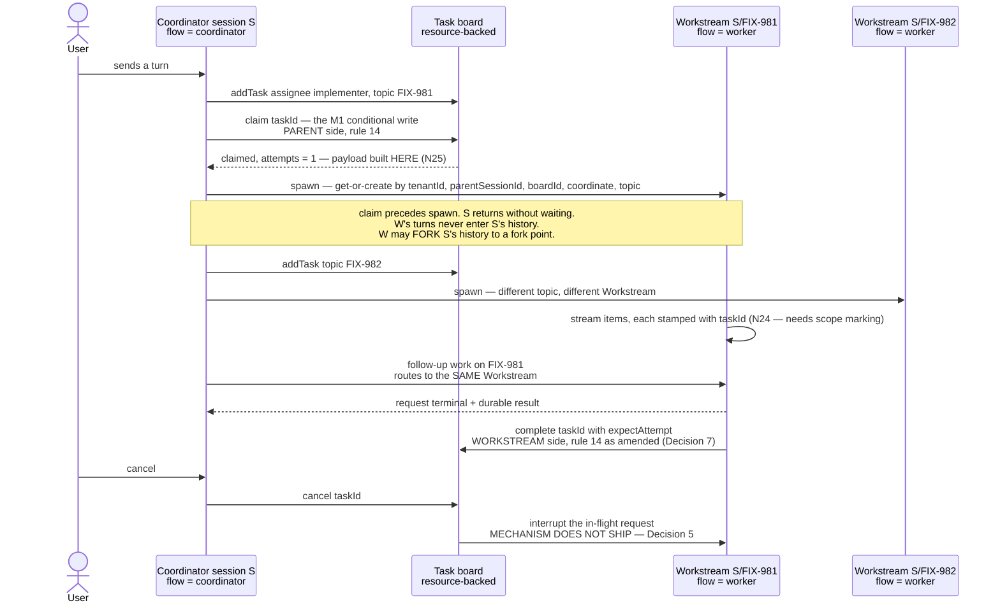
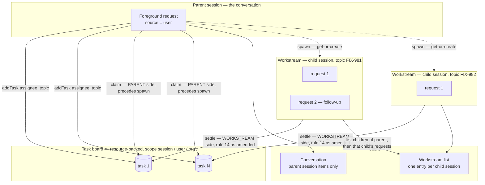

# Epic: Durable jobs & detached-task substrate

**Epic issue:** [FIX-939](https://linear.app/fixpoint-labs/issue/FIX-939) · **Epic PR:** [#993](https://github.com/fixpoint-labs/flow-state-dev/pull/993) · **Project:** Orchestration Primitives · **Branch:** `epic/durable-jobs`

> A coordination artifact for a set of related issues, not an implementing spec. Issues here
> reference and align to it; they do not derive from it. It exists so the decisions that cut
> across the set aren't made four times in four vacuums. Reviewed at spec altitude: fold what
> changes the objective or a cross-cutting decision, route everything else to the issue it
> belongs to. See [`orchestration.md`](../../contributing/orchestration.md).

---

## 1. In plain language

We want a unit of work — authoring a spec, implementing a PR — to keep running after the request
that started it has returned. Today it can't: a task's life is pinned to the execution that
created it.

**A detached task runs in a Workstream — a sub-session dedicated to one body of work.** That is the
decided shape. We are not building a job runner; the pieces already ship:

- The **task board** is the durable ledger of what work exists, and it is already cross-request.
- A **session** already groups many requests as one ongoing operation, and already isolates their
  history from every other session.
- A **request** is already the framework's unit of out-of-request execution.
  `@flow-state-dev/bullmq` runs one in another process today, from a serializable envelope, with
  sequence-number stream resume (`bullmq/src/worker.ts:81-95`).

A **Workstream** is a session carrying a `parentSessionId` and a `topic`. It holds one ongoing body
of work — one Linear issue, one investigation — and accumulates its own turns as that work
progresses. The session that spawned it coordinates; the Workstream does the work. Follow-up needs
no new concept: it is simply another request into the same Workstream.

> **Terminology.** A **background request** throughout this document is the request executing inside
> a Workstream. The term is unchanged from earlier drafts; what changed is *where* it runs. Anywhere
> the text says a background request is a sibling in the parent's session, that statement is
> superseded by this section.



Two things the diagram cannot show, and both are binding: the routing key is
`(tenantId, parentSessionId, boardId, coordinate, topic)` — not topic alone, and **not `flowKind`**
(see below), where `coordinate` is the tagged form of `assignee`; and the
read model a UI needs already exists — `RequestStore.list({ sessionId, … })`
(`engine/src/stores/types.ts:283`, `:110-147`).

**"Get-or-create" is doing more work in that diagram than it looks.** It is not safe as written, and
it takes two changes rather than one: the Workstream's session id must be **derived** from the four
caller coordinates so racing callers target one key, *and* the store needs a **create-if-absent**
insert so one of them loses. Either alone still ends with a broken uniqueness guarantee — measured
both ways in §8. The store half is N5(a) and needs its own issue; the derivation is FIX-982's, and
§5 carries the recommended encoding.

**The board configures disposition, not a target.** DECIDED by the repo owner. The board already
declares *what* runs: `TaskWorkerRegistry = Record<string, TaskWorker>`
(`tasks/workers/types.ts:85`), accepted by `taskBoard({ workers })` (`task-board/index.ts:288`) and
routed by `task.assignee`. Naming a `(flowKind, action)` beside it would be a **second source of
truth for one fact** — the shape §2 rules out. So the board gains exactly one thing: **where** a
task runs.

```ts
taskBoard({
  collection: workBoardCollection,                 // a defineTaskCollection(…) — REQUIRED to detach
  workers: {
    summarize: summarizeBlock,                     // bare value = inline, as today
    implement: { worker: implementBlock, dispatch: { mode: "detached" } }
  },
  dispatch: { mode: "inline" }                     // board default; per-worker overrides
})
```

> **The `collection` value is the `defineTaskCollection(…)` itself, not a wrapper.** An earlier draft
> of this snippet wrote `{ backing: "resource", collection: workBoardCollection }`, which is not one of
> the four accepted shapes — `TaskBoardConfig.collection` takes a `DefinedTaskCollection`, a
> request spec, a sequencer spec, or a `(ctx) => collection` factory (`task-board/index.ts:276-280`),
> and only the `isDefinedTaskCollection` branch (`:929`) selects resource backing. Measured: that
> literal does not compile — `Type '"resource"' is not assignable to type '"sequencer" | "request" |
> undefined'` — so an implementer copying it gets a build error rather than a silently request-backed
> board. Wrong either way, and corrected above.
>
> **The `collection` line is not decoration — omit it and the feature cannot work.** An omitted
> `collection` selects the **request** backing, which is `taskBoard`'s documented default
> (`task-board/index.ts:205,219`) and whose **lifetime is the request**
> (`collection/get-or-create.ts:86-89`). Every guarantee this epic makes assumes the task row outlives
> the request that admitted it: the template is re-read after a restart, the parent settles the task
> when the Workstream finishes, reclamation finds a dropped claim, N37's sweep finds a lost wake. On a
> request-backed board there is no row left to re-read — the board dies with the request that detached
> the work, and the detached Workstream runs with nothing on the other end able to settle or even
> observe it. **Rule 15: a board with any detached worker must be constructed on a durable backing,
> and a non-durable one must be refused at construction, by name.** Silently accepting it is the worst
> outcome, because the failure appears only after the first restart. Note rule 8's caveat still
> applies — `backing: "resource"` is not itself a proof of durability; the *store* under it must have
> the verbs (§5's C1 row), so the refusal is a two-part check.

Three properties, measured (§8):

- **Existing boards are untouched.** A bare `TaskWorker` value keeps meaning inline, so the change is
  additive at the value position (BP-030 legacy shape). No board in the tree needs editing.
- **Disposition is orthogonal to the worker.** The same block definition runs inline or detached with
  no change to the block — which is what makes this a disposition rather than a target.
- **The routing coordinate derives from `assignee`, which is already authored and validated.**
  `checkAssignee` rejects an unknown assignee against the declared `WorkerRoster`
  (`skills/task-tools-capability.ts:131-170`), so a bad coordinate fails loudly at plan time instead
  of silently minting a stray Workstream. `flowKind` would not do — and block identity is worse
  still, since `buildBlockInstanceId` is `${requestId}:${path}:${attempt}` over positional paths
  (`contracts/src/block-instance-id.ts:50-75`), so it is request-scoped and changes when a sequencer
  is reordered. It is a **tagged coordinate rather than the raw string**, because two of the
  shipped routing cases have no assignee at all: `workers` is a union — `TaskWorker |
  TaskWorkerRegistry` (`task-board/index.ts:288`), and a uniform worker names nobody — and
  `defaultWorker` is the delegation floor that runs any task whose assignee is *"unknown or
  absent"* (`:290-299`). Reserved strings do not work here: assignees are unrestricted, so a board
  may legally declare one named `__uniform__` and would then share a key with the floor, routing
  two different workers into one history. `{ kind: "assignee", name } | { kind: "uniform" } |
  { kind: "floor" }` cannot collide with any authored name. Measured end to end in §8, through
  resolution into real session records — an unknown assignee and an absent one land in the *same*
  floor Workstream, and neither fabricates an assignee the task never carried.
- **`boardId` is required in the key, not optional.** An earlier draft argued that because
  `assignee` is board-scoped, two boards under one session could not collide, and dropped the board
  coordinate. **That inverted the implication.** `assignee` is unique only *within* a registry,
  which is exactly what makes it ambiguous *across* registries: two boards may each legitimately
  declare an `implement` worker, and a coordinator may file `FIX-981` on both. A 3-part
  `(parentSessionId, assignee, topic)` key routes both into one Workstream — mixing two boards'
  histories and leaving the executor unable to tell which registry supplies the worker. Measured in
  §8: the two collide on the 3-part key and separate on the 4-part one. **But nothing on the board
  supplies this value today** — `TaskBoardConfig` has a per-flow `name` and a `collectionId` that is
  the literal `"factory-supplied"` for every factory-backed board. That is N15, and it is unresolved:
  the coordinate is required, its source is not yet defined, and it lands in a persisted id.
- **`tenantId` leads the key, and every lookup must filter by it at the store.** Session record ids
  are already tenant-namespaced and every history read exact-matches the tenant (FIX-682) precisely
  because a bare session id is caller-chosen and can repeat across tenants. A key without the tenant
  **aliases two tenants** that reuse the same parent session id, board, assignee and topic — handing
  one tenant another's child session and its history. Measured in §8. The same applies to the
  parent-to-child read S1 adds: `list({ parentSessionId })` without a tenant filter is the same bug
  one layer up.

**The envelope still carries a re-resolvable coordinate — that is not a second source of truth.**
"Disposition, not target" governs **authoring**: a task author names no flow and no action. But the
board's registry values are `BlockDefinition`s — closures, not serializable — while
`InboundRequestEnvelope` carries `flowKind: string` and `action: string`
(`transports/types.ts:71-72`) and **cannot carry a block**. A detached request that crosses BullMQ or
survives a restart therefore cannot be handed its registry entry; it must re-resolve one from
strings. So the spawn **derives** `(flowKind, action)` from the board binding for `assignee` and
persists that alongside `(boardId, assignee)` — a projection of the registry, not a competing
declaration of it. Measured in §8: the binding round-trips through `JSON` and re-resolves against a
registry rebuilt from static flow definitions.

**Consequence FIX-982 must state explicitly:** a Workstream's worker has to be **addressable from
static configuration**. A board or worker that exists only inside a closure the definitions cannot
reconstruct is not durably dispatchable — that case must either be rejected at build time or the
feature restricted to in-process execution, and the spec should say which.

**Topic is task data, not board config.** The two facts are known by different parties at different
times: the *skill author* declares statically whether a participant detaches; the *coordinator* names
per task which body of work it belongs to. So `addTask({ goal, assignee, topic })` carries it,
alongside the `goal / assignee / deps / priority / input / metadata` it already takes. Absent a
topic, it falls back to `taskId` — one Workstream per task, so **continuity is opted into, never
accidental**. An earlier draft made topic a board-config *function*, which SKILL.md frontmatter
cannot express; a YAML path mini-language is the scope creep FIX-925's own spec rejected for dep
inputs.

**Per-task targeting stays available later, additively.** Board-level first is the reversible order.
*Recorded cost:* heterogeneous work on one board needs two boards, and because dependencies are
board-scoped that can fragment a dependency graph that wanted to be whole. That is the signal to add
a per-task override — not a reason to build one now.

> **Why a sub-session and not a sibling request in the same session.** The alternative — a request
> tagged `background`, running beside the user's turns — was built and measured (§8), and rejected.
> Cross-turn history is loaded by `stores.request.list({ sessionId, tenantId, status: "completed",
> limit: historyWindowTurns, orderBy: "startedAtMs", withItems: true })`
> (`engine/src/context/createExecutionContext.ts:519-537`) — session, tenant and status only, with
> **no foreground/background dimension**. A *completed* background request is therefore
> indistinguishable from a user turn, and no field on `RequestListOptions` (`flowKind`, `sessionId`,
> `tenantId`, `status`, `limit`, `orderBy`, `withItems`) can separate them. The window also counts
> **requests, not tokens**: 50 background turns evict the user's own turn from a 50-turn window
> entirely. Separating them would mean a new filter dimension implemented across all four store
> adapters — and thereafter a filter every future reader of history must remember to apply.
> **A Workstream needs none of it.** A distinct session id is excluded by the `sessionId` filter that
> already exists and is already correct in every adapter. The isolation becomes a boundary that
> cannot be forgotten rather than a filter that must be remembered.

### Isolation is partial by design: forked Workstreams

A Workstream isolates **writes** unconditionally — its turns never become the parent's history. It
may, optionally, inherit the parent's history for **reads**, up to a **fork point**. That is the
whole read/write split: `contextSupply: "conversation"` (`core/src/types/skill.ts:92`) already lets a
worker see the delegating conversation, bounded, and *isolation is already its default* — the
materializer states it outright: *"`"conversation"` is the only value; isolation is the default,
expressed by omitting the field."* Forking is how that survives detachment. Without it, a detached
worker declaring `contextSupply: "conversation"` would need the parent session id threaded into its
history slot by hand; a fork gives it structurally.

> **Recommendation: ship isolated Workstreams first and defer forking, and this is a scope call the
> owner should take rather than FIX-982.** Forking is optional by construction — nothing in §5's
> completion criteria references it or `contextSupply` — yet it is where most of FIX-982's incidental
> weight sits: a cursor on a surface the caller cannot write (N17), an awaited immutable content
> snapshot of the spawning turn whose retention contradicts the reason COPY was rejected (N19, N32),
> a history-window budget that composes across a chain rather than per read, and now either a batched
> store read across four adapters or an accepted N+1 (N36). Five sub-problems, all serving a read
> convenience. Meanwhile Decision 7 already requires a claim-time payload built parent-side, which is
> a working channel for whatever context the worker actually needs — narrower than the parent's whole
> history, and it is the channel a coordinator controls deliberately.
>
> **The one thing a deferral must do is fail loudly.** `contextSupply: "conversation"` is a shipped
> field (`core/src/types/skill.ts:92`), so a detached participant declaring it while forking is
> unbuilt must be **refused at build or admission by name**, not run silently with an empty history —
> a worker that has quietly forgotten the conversation it was delegated from is the failure mode
> hardest to see from the outside. Everything measured about forking (§8) stays on record and stays
> correct; deferring it costs a re-read of that evidence later, not a re-derivation.

**Two implementations were built and measured (§8). REFERENCE is the recommendation, but it does
not win on every axis — it wins on correctness, retention and provenance, and *loses* on steady-state
read cost:**

| | COPY — duplicate the prefix into the fork | REFERENCE — store `forkedFrom { sessionId, cursor }` and union at load |
|---|---|---|
| Fork cost, 40-turn parent | **40 record writes, once — and that is the in-memory figure only.** On any persistent adapter it is 40 `set` **plus** 40 `persistItems` plus a flush: `set()` **strips `RequestRecord.items`** by design (`store-sqlite/src/request-store.ts:279`, `store-postgres/src/request-store.ts:301` — *"Items live in `request_items`; keep them out of `requests.data`"*), so a copy written through `set` alone reloads **with no messages**. See N51 | **0 writes**, but **41 store calls per child turn** (1 list + 1 `get` per cursor member; 6 at depth 2). Not constant — corrected in §8 |
| Rows read per child turn | the fork's own window only | **bounded by the cursor, but only if the ancestor is read BY ID.** A list-then-discard read costs the parent's whole lifetime every turn: against a 500-turn parent with a 3-id cursor, **500 rows with items vs 3** (§8). Same answer, unbounded cost |
| Request ids | must be **rewritten** — ids are primary keys, so copies are not the same records and provenance is lost without a back-reference | untouched |
| Retention (opt-in; `resolveRetentionPolicy` returns `undefined` unless `maxItems`/`maxAge` is set) | **defeats the policy** — the duplicate lives where the parent's rule cannot reach, so data an operator asked to delete survives | **honors it** — the prefix stays in the parent and is pruned by the parent's rule |
| Fork of a fork | re-copy per level | resolves by walking the chain |

**The read cost is a prerequisite, not a footnote, and FIX-982 owns the call.** COPY pays 40 writes
once and then reads like any other session; REFERENCE pays nothing at fork time and then **41 store
calls on every child turn**, because `RequestStore` has no batch-by-id read — `get(id)` is one id
(`stores/types.ts:275`) and `RequestListOptions` carries no `ids` predicate (`:110-140`), so a
3-id cursor at depth 2 is 6 calls and an N-id cursor is N+1. Reading by id is also not optional: the
list-then-discard alternative costs the parent's whole lifetime per turn (500 rows vs 3, §8). So the
recommendation is REFERENCE **conditional on a batched cursor read** — either `RequestListOptions`
gains an `ids` predicate across the four adapters, or the fork read is a documented N+1 whose cost
grows with cursor width and chain depth. **Pick one in FIX-982's spec; do not leave it implied.**
Choosing COPY instead is not foreclosed, but it re-opens retention (a duplicate outside the parent's
prune rule) and provenance (rewritten ids), which is why it is not the recommendation.

Both satisfy the correctness property, verified in both directions: **the fork point holds** — the
parent's post-fork turns are invisible to the fork, and the fork is never visible to the parent.
A grandchild inherits exactly what its parent could see, so it cannot reach turns its own parent
never had.

> **The fork point must be an immutable cursor, not a wall-clock timestamp.** A `atMs` comparison
> is applied to a list already filtered to `status: "completed"`, so a parent request that
> *started* before the fork but *completed* after it is absent at fork time and then **appears on a
> later load** — the fork's prefix grows after creation, which is precisely what the invariant
> forbids. A post-fork request sharing the fork's millisecond leaks the same way. Snapshotting the
> ancestor's visible request **ids** is exact, costs ids rather than records, and removes the
> ceiling arithmetic from the chain walk: each level's snapshot *is* what that level could see.
> Measured in §8 — under a timestamp rule the late-completing request is admitted; under the
> cursor it never is.
>
> **And put it somewhere the caller cannot write.** `SessionRecord.metadata` is the obvious home and
> the wrong one: it is a shallow-merge bag exposed on the session-metadata PATCH route and on
> `ctx.session.setMetadata`, both unconditional writes. Emptying the cursor strips the fork's
> inherited history; repointing its `sessionId` hands the fork a session it was never forked from
> (§8). That is N17.
>
> **Persist that cursor as an array, not a `Set`.** The fork ref lives on the Workstream's session
> record, which every adapter stores as JSON, and `JSON.stringify(new Set([...]))` is `{}` — a
> 3-id cursor serializes to nothing, with no throw and no warning at write time. Reloaded, the fork
> inherits nothing and resumes with no memory of the work it was forked to continue; the only
> symptom is a worker that has forgotten its own context. Store a sorted `string[]` and rehydrate
> on read (sorted so re-storing an unchanged cursor is byte-identical and not a spurious version
> bump on a CAS'd record). Measured both ways in §8.

> **One implementation constraint the POC exposed, and it belongs to whoever builds this.** The
> history window does **not** compose across a fork chain. Each read is bounded by
> `historyWindow.turns` (default 50), but the union is not — a depth-2 chain returned **80 turns**.
> The window must be budgeted **across** the chain, not per read, or a forked Workstream hands the
> generator more history than its flow allows.

**Workstreams need no other configuration, and they do not auto-close** — but *deletion* is a
separate question from *closing*, and it is open (N21): `DELETE /sessions/:id` removes a parent's
record and its session-scoped resource state without enumerating children, which orphans the
Workstreams and, for a session-scoped board, erases the task ledger out from under a live worker.
Not auto-closing is a decision; not handling an explicit delete is a gap.

**On configuration:** Every knob one might reach
for already exists a level up: conversation inheritance is `contextSupply`; **serialization does
not** — see below; resource carry-over is the three-tier scope rule plus `isolateUserState` /
`flowIsolation`; history depth is `flow.session?.historyWindow?.turns`. An earlier draft proposed a
lifetime rule that closed a Workstream once its lineage had no open tasks. **Dropped** — parent
sessions have exactly that same property and have never needed closing, and a later task landing on
an existing topic is the intended behaviour rather than a resurrection to guard against.

> **Serialization is the exception to "every knob exists a level up", and an earlier draft listed it
> as if it did not.** It recommended the flow/action `concurrency` policy, *"and a continuation lane
> almost certainly wants `queue`"*. That advice does not work on the path this epic keeps: the
> concurrency arbiter runs for the **in-process dispatcher only** — with an external dispatcher the
> host skips arbitration entirely and defers to the durable substrate
> (`transports/concurrency/arbiter.ts:22-26`, `docs/architecture/inbound-transports.md:153`). So
> setting `queue` on a detached Workstream's flow buys nothing and, worse, reads as a solution, so an
> implementer who sets it stops looking. Two overlapping requests in one Workstream remain possible.
> **Serialization must be enforced at the board**, which is what Decision 8 requires and what the
> unresolved lane owner (N46) is for. Named here so the configuration summary does not quietly
> contradict the decision that supersedes it.

**What that leaves as real work.** Three things, and they are the epic:

1. **Claim safety** (M1). Two executions are two resource registries, so they race the same task
   row. This is the one thing the model does not dissolve — it makes it necessary.
2. **The seam** (M3), now measured rather than assumed. A block already has `ctx.stores` and its own
   `ctx.flow` at RUNTIME (40 ctx keys, §8) — though **not on the public `BlockContext` a capability
   receives** (N18), which is the third piece. What it lacks: a public injection seam, a registry to resolve
   *another* flow by kind, and an executor to invoke. That is an injection, not a new mechanism.
3. **A create-if-absent primitive** (new, and a prerequisite). Workstream routing is get-or-create,
   and the store layer cannot express it: `ExpectedVersion = number | "any"` has no "must not exist"
   value, and `casWriteToMap` treats a missing record and a version-0 record identically. `set` is an
   upsert; there is no insert. Both keying schemes race, and a composite session id does **not**
   rescue it — the second create silently clobbers the first (§8).

Everything else in the original decomposition shrinks or dissolves — §5.

**What gated the epic: OQ-A** — whether resource state gets a conditional write at the durable
boundary — **is now answered, and not by this epic.** [FIX-992](https://linear.app/fixpoint-labs/issue/FIX-992)
owns that change under epic FIX-980, so this epic **consumes** the primitive and no longer decides it.
What remained was a **scheduling** constraint rather than an open question — `FIX-995 → FIX-992 →
FIX-981` — and **that is satisfied too: FIX-995 and FIX-992 are both DONE** (2026-08-03, 2026-08-06),
so **FIX-981 is unblocked and startable.** **OQ-E** (where the consumer surface S1–S5 lives) is
answered too. §6 has both.

---

## 2. The objective

> ## ✅ OBJECTIVE GATE: APPROVED — 2026-08-06
>
> The repo owner signed off the gated statement below and the cross-cutting decisions in §4, on
> the spec as of `660920ad`. **The active set is released** — see §7. Approval was given with the
> four open judgment calls named and accepted: N38 (defer forking), N52 (defer FIX-983), the
> fact-not-policy scoping of FIX-1005, and N62's "port, not invention" sizing of the scope-store
> create-if-absent — the last of which is flagged as this document's least-supported claim, since
> `ResourceStateStore` derives create-if-absent from a tombstone lifecycle that `SessionStore`
> (hard `delete(id): Promise<void>`, no version, no tombstone) does not have.
>
> Approval does **not** cover the unfiled blockers — they must be filed before FIX-982 starts.
> **Both are filed as of 2026-08-07** — create-if-absent is [FIX-1007](https://linear.app/fixpoint-labs/issue/FIX-1007) and S1a is
> [FIX-1009](https://linear.app/fixpoint-labs/issue/FIX-1009) — so this carve-out is spent, not standing.
>
> **AMENDED 2026-08-07 — clause 2, within the approved objective.** The owner answered **OQ-C**:
> in-flight generator deltas are **out of scope and documented as a known limit**, not fixed. The
> approval above is not re-opened and the outcome the gate signed off is unchanged for **items**;
> what changed is that clause 2's delta half is now closed by acceptance rather than left open. Whether
> that narrowing warrants the owner re-confirming the gate is **the owner's call, not this document's**
> — flagged on [#993](https://github.com/fixpoint-labs/flow-state-dev/pull/993).

### The gated statement

**A unit of work can outlive the request that created it — with exactly one owner at a time, a
progress surface that survives the request, and no way to strand it — on the task board we
already have.**

Three clauses, in dependency order:

1. **Exclusive ownership per attempt, and at-least-once execution.** At any moment a task has at
   most one *current* owner: only one execution may successfully claim it, and a stale owner's
   settlement is rejected rather than applied. Today neither holds across executions — measured,
   §8. **Cap admission is not promised by this clause** — see C1b.
2. **Reports what it is doing — in completed items.** A task running outside its originating request
   has a durable progress surface: a background request has its own persisted item stream with
   sequence-number resume, so progress is "read the background request's items."
   **In-flight generator text is explicitly OUT OF SCOPE, and is a documented known limit rather than
   an open residue.** `content.delta` is non-replayable and excluded from the persisted events log
   (`response-emitter.ts:804-838`, `streaming.md:186`), and the request-stream route live-tails an
   **in-process** subscription (`stream-routes.ts:122-160`) — so **a client attaching to an
   out-of-process generator gets no in-flight text; completed items only.** Those three citations are
   **N35**, and they now evidence the *limit*: they are the reason it exists, not an open question about
   whether to close it. **The owner accepted this gap on 2026-08-07 (OQ-C).** Two consequences bind the
   rest of this document: **M5 / FIX-984 does not stay in scope for deltas** and closes as dissolved
   (§5, §7), and **this epic names no snapshot-aware polling or live-tail surface** — an issue proposing
   one has found new scope, not a gap this clause left it. Clause 2 is **delivered, unconditionally**;
   what it promises is items. The limit carries a **documentation obligation** — see §6's N35 row.
3. **Steered, and never stranded.** A live coordinator can read the board and act on it; a
   coordinator that is gone does not strand the work. **The non-stranding half is
   [FIX-1005](https://linear.app/fixpoint-labs/issue/FIX-1005)'s mechanism — M2, in this epic — with
   FIX-978 as its *prerequisite*, not its owner.** This clause credited FIX-978 with the whole of it
   until 2026-08-07, and FIX-978 says otherwise in writing: its Decision 4 ships *no recovery path at
   all and does not recommend one*, and its non-goals route automatic lease reclamation, lease renewal
   and durable claim ownership back here (N61). FIX-978 converts `reclaim` to the fenced primitive;
   **FIX-1005 joins reclamation to liveness and redelivers**, which is what this clause requires.
   **Read the old way, the epic could be called delivered once FIX-978 landed, with its non-stranding
   mechanism never built** — the exact failure N61 was filed to prevent, sitting in the gated
   statement itself while the C3 row below already had it right.

**Why "per attempt" and not "exactly once."** `reclaim()` returns an expired `in_progress` task to
`pending` (`resource-backed.ts:406-450`), so a second worker can repeat any side effect the first
performed before dying. Conditional writes guarantee one current owner and reject a stale
settlement; they cannot make execution exactly-once without side-effect fencing, which is a much
larger mechanism and is not adopted here. **So a task body under this epic must be safe to run
more than once.** Deliberate contrast with the scheduled substrate, which chose the other side:
`ScheduleIndex` is documented **at-most-once** (`scheduled/src/scheduleIndex.ts:14-17`). Tasks want
the opposite trade, because a retried spec-authoring phase is recoverable and a silently dropped
one is not.

### Conditionality — the complete set

Anything not listed here is unconditional.

| | Clause / criterion | Conditional on | If the permitted outcome is taken |
|---|---|---|---|
| **C1** | clause 1 ownership · criterion 1 | ~~OQ-A~~ ~~FIX-992 landing~~ **RESOLVED — FIX-992 merged** · the store adapter · the backing | Ownership holds only on a board the framework can fence, and the fence now exists: `ResourceStateStore.set/delete` take `expectedVersion` and return `SetResult` on all four adapters. **The filesystem caveat here was wrong and is corrected** — an earlier draft said a store *without* the verb refuses the durable board. Filesystem **has** the verb (`filesystem/resource-state-store.ts` uses the shared `checkWriteVersion`), but guards it with a per-key mutex held on the **store instance**: *"closes the in-process race … and does **not** protect two OS processes over one directory"* (`:44-47`). Since Decision 8 puts out-of-process in scope, that is **silently weaker, not refused** — the more dangerous shape. §4's filesystem row already said this; this row had not caught up. A `factory`-backed board is unverifiable and out of scope by default (Decision 3). |
| **C1b-i** | criterion 1b-i — **task ceilings** (`maxTotalTasks` / `maxEnqueuedTasks`) | **OQ-D-i** only — **no longer conditional on OQ-A** | May be narrowed-but-unbounded, or not delivered. Neither ceiling is enforced on a resource-backed board today (`tasks/collection/task-caps.ts:52-65`). |
| **C1b-ii** | criterion 1b-ii — **the `maxInstances` registry race** | **OQ-D-ii** only — **no longer conditional on OQ-A** | May be narrowed-but-unbounded, or not delivered. This is the contract §8 measured. |
| **C3** | clause 3 non-stranding · criterion 3 | **[FIX-1005](https://linear.app/fixpoint-labs/issue/FIX-1005)** (M2, in this epic) — with **FIX-978** (external) as its *prerequisite*, not its owner | **Corrected (N71): this row named FIX-978 alone, and FIX-978 explicitly excludes automatic recovery** (N61). FIX-978 converts `reclaim` to the fenced primitive; **FIX-1005 owns liveness-joined reclamation and redelivery**, which is what clause 3 actually requires. Read the old way, a coordinator could mark non-stranding **satisfied once FIX-978 landed** and wrap the epic with the mechanism unbuilt — the precise failure N61 was filed to prevent. **The owner attribution above still holds; the FIX-978 prerequisite does NOT, and is now UNDECIDED (2026-08-09).** Two changes landed under it. [#1083](https://github.com/fixpoint-labs/flow-state-dev/pull/1083) closed unmerged, replacing registry-oracle liveness with **lease renewal on the task row the worker owns** — a different mechanism, which may or may not need a fenced `reclaim` underneath it; and that PR's closure split the task-scoped `reclaim()` defect out as **[FIX-1023](https://linear.app/fixpoint-labs/issue/FIX-1023)** (unparented, Todo, `related` to FIX-978), which is where that verb's behaviour is now being fixed. **No `blocked-by` edge to FIX-978 exists in Linear and none is asserted here** — inventing one is the defect this index was rebuilt to remove. What FIX-1005 consumes is genuinely unknown until it is re-specced, which is already owner work (§7 → "What needs the owner"), and #1083 had itself moved FIX-978's conversion *into* FIX-1005 precisely because FIX-978 is frozen. |

> **OQ-A's answer does not reach criterion 1b, and this table used to imply it did.** Both 1b rows were conditional on the conditional write arriving. It arrives (FIX-992) and they are **still open**, because
> FIX-992's Decision 7 states the position outright: the `maxInstances` cap is *"explicitly not closed — a **set**-level invariant per-key CAS cannot enforce."* That is the same distinction §4 draws between
> **1a** (one task's row — same key, so a version guard discriminates) and **1b** (the collection's cardinality — different task ids are different keys, so two CAS writes to different keys both succeed).
> **A per-key conditional write was never the mechanism 1b needed**, so no answer to OQ-A could have closed it. The rows now depend on OQ-D alone, and binding rule 6 still applies: name a mechanism that
> enforces a hard maximum on concurrent admitters, or say plainly that overshoot is narrowed but unbounded.

**C1b-i and C1b-ii are independent.** Two ceilings, two files, two enforcement points: task
ceilings are the task layer's (`task-caps.ts`), `maxInstances` is the resource registry's
(`resource-registry.ts:989-1003`). Fixing one leaves the other unsafe.

### What "done" looks like

1. **Ownership (conditional — C1). Claim exclusivity asserted first, settlement second.** Under
   contention over one resource-backed board, where the guarantee is fenced: **only one `claim()`
   succeeds — equivalently, only one worker starts** (the claim is the exclusivity boundary), and a
   stale owner's settlement is rejected rather than applied. Both demonstrated by checks that *fail*
   against today's code (§8 is the falsification baseline).

   A check asserting only that two executions "cannot both settle" is passable by an implementation
   that violates the guarantee: fence settlement, leave `claim` unfenced, and two workers run to
   completion while one settlement lands. The cost is duplicate model execution — minutes to an hour
   per duplicated Conductor phase.

   **Where the guarantee is not fenced, "done" is defined differently.** No permitted outcome is left
   without a check:

   | Permitted outcome | What "done" means instead |
   |---|---|
   | FIX-992 does not land → no conditional write → guarantee is topological (queue dedup) | Assert exactly one execution can reach the board for a given task, **and** assert the escape hatches: a `taskTools` call and a `reclaim` from outside the queue must be shown impossible by construction or fenced another way. |
   | **Filesystem adapter** — *reworded: it will have the verb, with a weaker guarantee* | FIX-992's Decision 4 gives filesystem a per-key mutex on the store **instance** plus compare-under-lock: real CAS **within one process, not across two**. Under Decision 8 out-of-process execution is in scope, so a same-process fence is exactly the case a detached board cannot rely on. **Assert the durable *detached* board is refused at construction, loudly and by name** — the same check as before, but now justified by an insufficient guarantee rather than an absent verb, and it must not be silently satisfied by the fact that `set` now accepts `expectedVersion`. A silent degrade fails this criterion. |
   | `factory`-backed board | Assert it is refused or explicitly unsupported for detached jobs (Decision 3). |

1b. **Cap admission — two independent contracts, each with its own outcome, owner and check.** Task
   ceilings live in the task layer (`task-caps.ts`, neither enforced on a resource-backed board
   today, `:52-65`); the `maxInstances` race lives in the resource registry
   (`resource-registry.ts:989-1003`, enforced but from the per-execution cache). **OQ-A does not decide this** (FIX-992's D7: per-key CAS cannot enforce a set-level invariant) — **OQ-D does.** If OQ-D chooses exact
   arbitration, the check asserts the ceiling is never exceeded. If it chooses narrowed-but-unbounded
   overshoot, the check asserts the window narrowed and **must not** assert a maximum — a correct
   implementation would fail that. If a contract is scoped out, state which, and that the epic claims
   no guarantee for it. If both are deferred, this criterion reduces to criterion 1 alone.

2. **A task continues to execute after the request that created it has ended**, in a background
   request inside a Workstream, and the thing running it is not the originating request's drain.
3. **(Conditional — C3.) Redelivery, not merely reclamation.** A stranded claim returns to the
   queue with no human intervening — **via FIX-1005's mechanism, over FIX-978's fenced `reclaim`
   verb** — **and a worker actually starts on it again, with no manual dispatch.** Asserting only the
   status flip tests FIX-978's write and nothing about this substrate's liveness. **This criterion
   said "via FIX-978's mechanism" until 2026-08-07**, which is the same misattribution clause 3
   carried: FIX-978 ships the verb, FIX-1005 ships the recovery. **"Over FIX-978's fenced `reclaim` verb" is now provisional — see C3.** The mechanism it described was superseded when [#1083](https://github.com/fixpoint-labs/flow-state-dev/pull/1083) closed unmerged, and whether the replacement consumes that verb is not decided anywhere. **A pending task with no live initiating request has no
   wake source, and FIX-978 closes none of the three ways one arises** — including the admission
   window, which is unconditional rather than C3-conditional because no lease ever existed to
   reclaim. See Decision 6.
4. **A detached task's progress is readable from a durable surface**, not from a `transient: true`
   trace item and not from the originating request's emitter. Satisfied by reading the background
   request's persisted items (`RequestStore.getEvents(requestId, fromSequence)`, `subscribeToEvents`).
   **"Progress" here means completed items and nothing more.** A check that also asserts in-flight
   generator text is observable across the process boundary is asserting something this epic
   deliberately does not deliver (clause 2, OQ-C) — it would fail a correct implementation.
4b. **A detached task's own emitted items are retrievable from every execution that emitted them —
   including across a reclaim/retry, not merely across one boundary. Unconditional.** This is the
   existing `TaskHandle.items()` contract, which is explicit: *"Retries do NOT reset the start; all
   attempts append to the same window"* (`tasks/collection/types.ts:98-100`), pinned by
   `test/items/extract-window.test.ts:167`. So the check spans request A (attempt 1) and request B
   (attempt 2 after reclaim) — an implementation mapping a task only to its *latest* request would pass
   a weaker check while silently dropping attempt 1's items. Owned by
   [FIX-991](https://linear.app/fixpoint-labs/issue/FIX-991), which is what makes this satisfiable.
5. The in-request `.work` / `.waitForWork` flavour still works, and any break is a declared, versioned
   break with a migration note — not a silent behavior change.
6. **No new persistence backend, and no second work registry.** The board remains the single source of
   truth for what work exists. A transport that carries wake-ups is fine; a second place that
   *defines* the work is not.

### What this epic is not doing

- **No sibling job registry.** The board is the ledger. A second place defining what work exists
  would be two sources of truth for one question. A queue used purely as transport is not that.
- **No new durable store.** One durable task per issue on a resource-backed `TaskCollection` needs
  no store that doesn't exist.
- **Not replacing the in-request sidechain.** `.work` / `.waitForWork` stays as the lightweight,
  ephemeral, in-request flavour. Two flavours coexist by design.
- **Not task-events-as-dispatch-triggers.** The board's `task-change` events are a UI notification
  channel. Turning them into a dispatch trigger is net-new wiring, belongs to Conductor M3, and is
  outside this decomposition (FIX-825, §7).

### The forcing function

[Conductor](https://linear.app/fixpoint-labs/issue/FIX-966) M2
([FIX-969](https://linear.app/fixpoint-labs/issue/FIX-969) — run many issues in parallel under an
epic via the task board) is blocked on this substrate. A conductor phase runs many minutes to an
hour and cannot be bound to a tick's request.

**This gates scale, not the fast path.** Conductor M0/M1 ship before this epic: one issue,
per-tick drain, phase work in-request. What is stalled is running *many* issues at once. That sets
the bar a milestone must clear: not "is this useful" but "does parallel-at-scale fail without it."

---

## 3. Rules binding on every issue in this epic

Collected here so no issue has to hunt for them. Each is argued where it is decided.

1. **No issue may infer "abandoned" from lease expiry alone.** An expired lease is the normal state
   of a healthy worker — nothing renews a lease during execution and `DEFAULT_LEASE_DURATION_MS` is
   30s while a model call routinely exceeds it. Inferring abandonment trades a hang for silent
   duplicate execution. (Decision 1.)
2. **Every ownership-sensitive write must be fenced at the durable boundary** — not only `claim` and
   settlement, and including a write whose intent is another field but which persists the whole
   task. (Decision 2.)
3. **A conditional write is necessary but not sufficient.** Every worker-callable lifecycle
   transition additionally needs an ownership guard, or must be made coordinator-only. (Decision 2.)
4. **No issue may serialize a whole board to obtain claim safety.** Per-record, not per-board. A
   single-key cardinality counter is a coarse lock by another name. (Decision 2.)
5. **Any guarantee not enforced on the `taskTools` path is not enforced.** That path is the normal
   way boards get mutated in an agent framework, not an edge case. (Decision 4.)
6. **No mechanism may claim a bound it does not enforce.** Either name a mechanism enforcing a hard
   maximum on concurrent admitters, or say plainly that overshoot is narrowed but unbounded.
   (Decision 2.)
7. **Do not add a scope vocabulary.** `session` / `user` / `org` already exist on
   `defineTaskCollection`. An issue defining a second way to say "which durable partition" has found
   a conflict to surface, not a design choice. (Decision 3.)
8. **State explicitly which backings your guarantee covers.** Never treat `backing: "resource"` as a
   proxy for "durable" — `factory` is a second durable path. (Decision 3.)
9. **`source` is transport-set; `metadata` is not trusted.** Nothing may route or authorize on
   caller-supplied request metadata. (Decision 5.)
10. **A detached request runs a board worker resolved by the tagged `coordinate`** — never the producer
    action, and never a **caller-authored** `(flowKind, action)` target. **`coordinate`, not `assignee`:**
    the shipped board contract has three worker paths, and only one of them has an assignee at all —
    `workers: TaskWorker | TaskWorkerRegistry` (`task-board/index.ts:288`) means a **bare value is the
    uniform worker every task runs through**, and `defaultWorker` is the **delegation floor** for a task
    whose assignee is *unknown or absent* (`:290-299`, FIX-940). Resolving "by assignee" fails outright on
    a uniform board and routes a floor-bound task to the wrong Workstream — or to none. §1's `Coordinate`
    is already the three-case tag this needs (`{kind:"assignee";name} | {kind:"uniform"} | {kind:"floor"}`,
    N12), and it is what the routing key carries. This rule now matches it; an earlier wording said
    `assignee` and silently excluded two valid board shapes. The prohibition is on the
    *authorship*, not the storage: a task author cannot name the action, but the substrate **must**
    persist the binding it derived from the registry, because a process that restarted has no claim
    context to re-derive it from and `DispatchEnvelope` requires `flowKind` + `actionName`
    (`transports/dispatcher.ts:16-26`). A derived, server-written projection is trusted input under
    BP-031; a task field a caller can set is not. **This is the narrow reading — the earlier absolute
    one forbade the only artifact that makes N6 and N9 solvable at all.** (Decision 5, as amended by
    §1; the derivation surface itself is N9, still unresolved.)
11. **State how your persisted items' lifetime relates to the board's.** Item storage lifetime must
    not be shorter than the board's. (Decision 5.)
12. **Name your persisted surface.** Any issue claiming it made progress or failure visible states
    which persisted surface carries it. A `transient: true` trace item is not observability.
    **And no issue may claim in-flight generator text is observable out-of-process** — that gap is an
    accepted, documented limit (OQ-C, decided 2026-08-07), so an issue that needs it has found new
    scope to raise with the owner, not a defect to fix inside this epic. (Clause 2 / §2.)
13. **Build on the named reuse seam (§9) or state in your spec why it doesn't fit.**
14. **A Workstream writes to the dispatching board for exactly one thing: settling its own task.**
    Its `taskTools` bind to its own board, and the parent's board otherwise stays the coordinator's
    alone. Any *other* reach back into the dispatching board must be stated and justified.
    (Decision 7.) **Amended** — this rule read *"a Workstream never writes to the board that
    dispatched it… the parent's task is settled on the parent side"* until Decision 7 was corrected
    to Workstream-side settlement, which makes settling that write. The rule's **reason** is
    untouched: the coordinator's outstanding-work list must not grow with entries it never planned,
    and settling a task it *did* plan adds none. Every such write is fenced with `expectAttempt`.
15. **A board with any detached worker requires a durable backing AND a reachable, cross-process
    fenceable store, checked at construction.** The default backing is `request`, whose lifetime is
    the request — every guarantee here assumes the task row outlives it. Refuse a non-durable
    detached board by name; never degrade silently. (Decision 0 / §1's example.) **Two additions the
    reviewing pass established, both construction-time refusals:**
    - **Scope: DECIDED (owner, 2026-08-07 — option A of N68). Session scope is PRESERVED, and the
      Workstream reaches the parent's board through a narrow trusted settlement seam.** The
      alternative an earlier revision of this rule prescribed — user/org scope with `flowIsolation:
      false` — is **rejected**: `resolveResourceScopeId(identityId, flowKind, false)` returns the
      bare `identityId` (`stores/scope-keys.ts`) and task rows carry no parent-session partition of
      their own, so two coordinator sessions for one user sharing a collection id would share one
      ledger and either could claim, cancel, or settle the other's tasks. Isolation is the default
      every caller assumes; buying settlement with it was the worse trade. **So a detached board may
      be session-, user-, or org-scoped as the author chooses** — the ordinary resource rules apply,
      and this rule imposes no scope constraint at all. What it imposes instead is on FIX-982: build
      the seam (below).
    - **Adapter:** *"has the conditional-write verb"* is **not** a sufficient check, and any issue
      writing one must not assume it is. Every adapter implements the same `ResourceStateStore`
      (`stores/types.ts`), which carries **no capability surface** — no cross-process flag, no
      isolation level — so filesystem, whose per-key mutex is held on the store *instance*, passes
      the same verb check sqlite and postgres pass. `taskBoard(config)` also receives a
      `DefinedTaskCollection`, not a resolved adapter. Excluding filesystem therefore needs an
      **adapter guarantee advertisement** (a capability the adapter declares and construction reads)
      or an explicit deployment restriction. Naming the verb is not a mechanism; this is scoped work,
      and FIX-982's Decision 11 depends on it existing.

---

## 4. Cross-cutting decisions

### Decision 0 — a detached task runs in a Workstream, a sub-session dedicated to one body of work

**DECIDED by the repo owner.** The shape is §1. What follows is the verification, because three of
this epic's worst defects were load-bearing premise errors and this premise carries the
restructure. Unlike earlier rounds, this one was **executed rather than read** — three POCs on the
real path, §8.

**Confirmed against the tree:**

| | Finding |
|---|---|
| A request can be created against a **caller-chosen session id** | `runAction.ts:518` (`requestId`), `:642-658` (session binding); `InboundRequestEnvelope.sessionId` is documented *"Existing session, or undefined for a new session"* |
| Fire-and-forget is a supported shape | `InboundRequestEnvelope.responseEmitter?: ResponseEmitter \| null` — *"other adapters may pass `null` for fire-and-forget"* |
| A request already executes **out of request, in another process**, and resumes its stream | `bullmq/src/worker.ts:81-95` calls `runAction` from the envelope with `sessionId`, `requestId`, `source`, `metadata`, `startSequenceNumber` |
| **A Workstream's history is isolated with no new query surface** | Proven end-to-end: parent session sees only its own action, the Workstream only its own (§8). The existing `sessionId` filter does all the work |
| **A Workstream may run a different flow than its parent** | Proven end-to-end with two separately defined flows (§8). Flow-based resource isolation is **opt-in**: `toIsolationFlow` defaults `isolateUserState`/`isolateOrgState` to `false` (`resources/internal.ts:264-269`), and `resolveResourceScopeId` returns the bare `identityId` unless isolated (`stores/scope-keys.ts:154-160`) — so user/org resources are shared across flows by default, and `flowIsolation` can lock an individual resource (`:140-147`) |
| **Reuse accumulates** | A second task on the same topic routes to the same Workstream and appends to its history while the parent is untouched (§8) |

**Refuted — and narrower than previously stated.** The earlier claim was that nothing inside a
request can reach the machinery at all. A runtime probe of the execution context (40 keys, §8)
shows otherwise:

> A block **already has `ctx.stores`** and **already has its own `ctx.flow`** — at runtime, and *not*
> on the exported `BlockContext` a capability's `fns` receives (N18, which makes it three). It lacks two
> things: a registry to resolve **another** flow by kind, and an executor to invoke
> (`runAction`/`dispatch` are absent). Every actual `runAction` call site remains a transport
> adapter or route — chat-sdk event handlers (`chat-sdk/src/event-handlers.ts:393`), the MCP adapter
> (`mcp/src/createMcpTransportAdapter.ts:410`), scheduled routes (`scheduled/src/routes.ts:205`),
> action routes (`routes/action-routes.ts:167`), the BullMQ worker, the CLI — but the gap is an
> injection over those pieces plus the public seam N18 names, not store plumbing.

Two structural facts follow, and they constrain FIX-982:

- **The seam lives in `engine`; the board lives in `orchestration`, which has
  `@flow-state-dev/engine` as a *devDependency only*** (`packages/orchestration/package.json`). The
  board cannot reach the seam by import even in principle. Spawning must arrive as a capability
  injected onto the execution context — a `core` type implemented by `engine` — which keeps the
  package boundary intact.
- **The two existing in-request background primitives are not this.** `.work` /
  `_requestBackgroundSignal` stays inside one request and its pool is drained before terminal status
  (`core/src/types/block.ts:517`, `:633`; `execution/request-work-pool.ts:4`), and reactive dispatch
  runs blocks inline in the mutating turn via `executeBlock` (`context/reactive-dispatch.ts:1-16`).
  Both are intra-request concurrency; neither detaches.

**So the premise holds: the mechanism ships, and what is missing is an in-request handle to it.**
The POC dispatches into a Workstream from *outside* the request, standing in for that handle — which
is what makes the remaining risk precise. Everything downstream of the spawn is demonstrated; the
spawn itself is the one unbuilt piece.

**One recorded constraint, not a defect.** Workstream get-or-create races if two coordinators target
one topic concurrently (§8 measures duplicate Workstreams). The repo owner's decision is that **the
parent session agent is the sole coordinator**, which narrows the race — **it does not remove it, and
an earlier draft of this paragraph said it did.** One logical coordinator is not one execution: the
request concurrency policy defaults to `allow` (`transports/concurrency/arbiter.ts:89-93`; per-action
resolution `action.concurrency ?? flow.request?.concurrency ?? "allow"`, `types/flow.ts:260-264`), so
two overlapping requests in the same parent session — two tabs, a client retry, a re-dispatch — both
run and both can target the same topic. The arbiter is also in-process only (Decision 8), so it is
not the fence on the path that matters here. **Create-if-absent is therefore load-bearing, not a
belt-and-braces addition**, and no issue may scope it out on the strength of the sole-coordinator
assumption. That assumption is still worth recording, because a future multi-coordinator flow would
violate it in a second way that the store primitive alone does not describe.

### Decision 1 — M2 stays with FIX-980; this epic consumes reclamation

**DECIDED by the repo owner.** The description's M2 ("automated reclamation, joined to execution
liveness") has no issue here. That work is
**[FIX-978](https://linear.app/fixpoint-labs/issue/FIX-978)**, parented under epic
**[FIX-980](https://linear.app/fixpoint-labs/issue/FIX-980)** ("Honest task substrate", epic PR
[#983](https://github.com/fixpoint-labs/flow-state-dev/pull/983)). **FIX-978 is currently
`Backlog`** — the owner moved it back from Spec Approved on 2026-07-30.

The reasoning worth keeping: FIX-980's epic-spec establishes against the code that an expired lease
is the *normal* state of a healthy worker, so any fix inferring abandonment from lease expiry alone
trades a hang for silent duplicate execution — strictly worse, and counter to this epic's objective
too. That reasoning is written down, reviewed, and binding on FIX-978 (rule 1). Two epics owning it
would produce two mechanisms for one question.

**FIX-978's outcome is a dependency of FIX-982, not a deliverable of FIX-939.** This epic designs no
lease renewal or heartbeat and wires no reclaim sweeper. It does assume, as a precondition of M3,
that a stranded claim has a recovery path.

> **CORRECTED (N61, and the correction reached this section on 2026-08-07).** The paragraph above is
> the decision as taken, and its *first* sentence still holds — FIX-978's outcome is consumed, not
> built here. **The last two sentences do not.** FIX-978's own scope boundaries exclude recovery
> (its Decision 4: no recovery path, none recommended) and route reclamation, renewal and durable
> claim ownership back to this epic, where they are **[FIX-1005](https://linear.app/fixpoint-labs/issue/FIX-1005)** — M2, filed, a
> sub-issue here. **So this epic does wire liveness-joined reclamation; what it consumes from FIX-978
> is the fenced `reclaim` verb.** The heading's *"this epic consumes reclamation"* is true only of
> that verb. Left as written above with the correction beside it, because the *decision* — one owner
> for the conversion, no second mechanism — is unchanged; only the boundary moved.

**Sequencing risk across both epics.** FIX-981 owns the conditional-write primitive; FIX-978 owns
converting `reclaim` (`resource-backed.ts:406-450`) to use it. The conversion cannot land before the
primitive exists, but no dependency is recorded between them and FIX-981 is scoped to claim and
settlement. **So both can complete, each correct within its own scope, with `reclaim` still on the
unconditional write** — and then two workers race across a reclaim with neither issue's tests
covering it. A `blocked-by` relation is **proposed, pending the owner's decision**, not wired:
making FIX-981 block FIX-978 would gate another epic's work on this epic's ungated objective.

### Decision 2 — does this epic change `ResourceStateStore`? (recommendation; awaiting the gate)

Settled here rather than inside FIX-981's spec, because option (b) is FIX-982's territory and
option (a) is FIX-981's — the decision picks the shape of two milestones.

#### The premise: there is no cross-execution CAS

The description previously asserted the board has a "CAS claim" and that Conductor could take
"leases, CAS claim, attempts … as-is." **It cannot**, and the error was load-bearing: it is why the
epic once concluded no work was needed here. Cross-execution claim safety is net-new work, not an
inherited property. That is M1, and it is why M1 is `Large`.

Resource state has tier 1 of a two-tier design and no tier 2. `scope-lock.ts:1-5` states the
architecture: *"Per-`StateContainer` async FIFO mutation queue. The two-tier dispatch lives in
`applyMutation`; CAS retries still apply at the durable boundary in `runWithCAS`."* Scope state has
both tiers; resource state has only the in-process one (`serializeResourceWrite`,
`resource-registry.ts:540-546`) — `ResourceStateStore.set` is an unconditional upsert
(`stores/types.ts:550-551`).

Tier 1 doesn't reach, because that promise chain lives in a `Map` on the `ResourceRegistry` and a
registry is built **per execution** (`createExecutionContext.ts:1649`, `:1664`, `:1682`). Two
writers in one execution serialize correctly; two writers in two executions share nothing, both read
`pending`, and both write `in_progress`. `claim` inherits this because its whole guard runs inside
`candidateRef.updateState` (`resource-backed.ts:270-308`).

**Under Decision 0 this stops being an edge case.** A coordinator and its Workstreams are separate
`runAction` calls, hence separate execution contexts and separate resource registries, and they
share one board. Turn-based requests made the race rare; parallel Workstreams make it the default
path. **Session isolation does not help here** — the board is a resource, not history, so moving
execution into a sub-session changes who reads the conversation, not who writes the task row.

Three code comments assert the opposite and must be corrected by whoever lands FIX-981:
`task-board/blocks/claim-task.ts:12-14` (*"The substrate's CAS retry inside `collection.claim`
guarantees exactly-once dispatch"* — there is no CAS and no retry in that path),
`tasks/collection/resource-backed.ts:6-7, 22-26` (true within one execution, false across two, and
the sentence does not say which), and `TaskDispatcher`'s header (same false claim).

#### Direction: yes to (a), additively, reusing a shipped precedent

**This is not greenfield.** The scope stores already ship the whole pattern one layer down:
`runWithCAS` (`engine/src/stores/cas.ts:119-175`), version-gated `set(id, value, expectedVersion)`
(`stores/types.ts:258-281`), and `DeltaStoreOps` (`stores/types.ts:181-256`) whose header is
decisive — *"Adapters MAY implement none, some, or all of these. The CAS persist callback
feature-detects per call and falls back to `set` with the full record when a verb is absent
(capability advertisement). … the optional-in-v1 stance is a migration concession to existing SQLite
and filesystem adapters."* Optional verb + feature-detect + fall back is the established house
pattern for exactly this problem, adopted for exactly this reason, so the recommendation applies a
shipped pattern to the one store left out of it.

> **The direction, which is all this epic decides:** give resource state a conditional write at the
> durable boundary, added **additively** so no existing caller and no third-party adapter is forced
> to change, and reuse the scope-store precedent rather than inventing a parallel mechanism.
>
> **⚠️ HISTORICAL as of FIX-992's merge (N70).** This section is the *argument* that produced the
> direction, and it read *"the shape is FIX-981's to design"* — which is no longer true. **FIX-992
> shipped the primitive** (#1035/#1036/#1039); OQ-A is CLOSED, §5's milestone row and §6 all say so.
> **FIX-981 CONSUMES it and does not design or add it.** Scoping FIX-981 from this section as
> written would duplicate landed store work or stand up a competing contract instead of building the
> claim protocol. What remains FIX-981's is the fencing work on top: the claim protocol itself, and
> the ownership guard on every worker-callable transition. Read this section for *why* the primitive
> looks as it does, not for what to build.

**What the gate is being asked to accept**, priced against the tree:

| | Cost |
|---|---|
| **Surface** | The store verb is the small part. The signal a correct `claim` needs lives one layer up, and `updateState` returns `Promise<void>` (`core/src/types/resource.ts:249`, `:309`) — it cannot report that an update did not apply. It has 47 non-test references across 13 source files in 6 packages. Adding a *sibling* method instead of changing `updateState` keeps all 47 untouched. |
| **Compatibility** | Additive is **not** non-breaking. An optional verb preserves TypeScript *source* compatibility, not behavioral: a third-party adapter without the verb backs a durable board that worked before the upgrade. **Decided: refuse to construct a durable board on an adapter lacking the verb** — loud, named, at construction — rather than degrade with a warning, because a board that appears to have claim safety and does not is the exact defect FIX-980 exists to eliminate. So: a declared adapter migration, stated in the changeset and adapter docs. In-request and non-durable boards are untouched. |
| **Filesystem cannot do this today** | Its safety is per-handle and per-process *by design*: the write lock is an in-memory `Map` per store handle, *"atomic within one process"* (`stores/filesystem/shared.ts:247-273`); *"There is NO inter-process locking … Use SQLite or Postgres for any multi-process or production deployment"* (`filesystem/request-store.ts:86-91`); and the `ResourceStateStore` adapter is weaker still — write-temp-then-`rename` with no lock at all (`filesystem-resource-store.ts:376-382`), which prevents torn files, not lost updates. Either a named cross-process protocol, or exclusion. **If excluded, durable boards require SQLite or Postgres, including in local dev** — a developer-experience cost the gate should price. |
| **The shape is undecided** | `ResourceStateStore.get()` returns a bare `JsonObject` (`stores/types.ts:548`) and resource refs carry no version at all (`core/src/types/resource.ts` contains zero occurrences of "version"), while `runWithCAS` requires an `expectedVersion`. So "mirror `runWithCAS`" is a direction, not a design: a versioned-read envelope, expected-value CAS, and an atomic mutate verb are different public and adapter contracts, not variants of one. **FIX-981 picks, and states the consequences.** |

*Per-adapter mechanics, the conformance suite's new shape (its one-handle-per-test setup cannot
express contention), and the naming of any new verb are FIX-981's design work — routed to its
implementer notes, not decided here.*

#### Option (b) — queue-level dedup, and why it fails

(b) is: never let two executions contend for one board. No store change; a guarantee that "holds
only for work routed through the queue." Three paths reach a board *without* the queue today:
`taskTools`, the model-facing tool surface — eight tools (`skills/task-tools-capability.ts:560-585`)
a generator holds via `uses: [taskTools]`, explicitly supporting a shared board, so an LLM calling
`completeTask` is not work routed through the queue; the default `taskTools` instance, which is
uncapped (`:588-600`, FIX-931) and which (b) cannot fix at all; and `reclaim()`, which flips
`in_progress → pending` outside any dispatcher.

Not sufficient for Conductor M2 either — its phases are agents holding `taskTools` against a shared
board, and its crashed-worker criterion runs through `reclaim`. And (b) has a disqualifying
sequencing problem: the queue it depends on is milestone 3, so (b) means M1's guarantee is delivered
by M3's machinery, inverting the sequence or collapsing M1 into M3. **If the gate refuses the store
change, the honest consequence is not (b) — it is that M1 and M3 merge** and the sequence is
restated. Option (c), neither, blocks the epic and relocates the Conductor M2 block upward, leaving
§8's measured defects shipped; it is right only if the objective isn't worth pursuing, which is the
gate's question.

#### Clause 1 needs two mechanisms — and per-key CAS covers only one

| Clause | Contended thing | Per-key CAS enough? |
|---|---|---|
| **1a** — two executions cannot both win one task | one task's row | **Yes.** Same key, so a version guard discriminates. |
| **1b** — two executions cannot both admit past a creation cap | the collection's **cardinality** | **No.** Different task IDs are different keys; two CAS writes to different keys both succeed. |

`ResourceCollectionRef.create()` (`resource-registry.ts:981-1004`) counts from
`options.readResources()` — the per-execution cache — so execution B cannot see the row execution A
just created; and unlike `set`/`patchState`/`updateState` (`:685`, `:699`, `:711`), **the `create`
path is not wrapped in `serializeResourceWrite` at all.** That is §8's first row: 8 rows against
`maxInstances: 4`, two executions admitting four each.

##### The write-path principle — a principle, because enumerating paths has failed three times

> **Every ownership-sensitive write must be fenced at the durable boundary — not only `claim` and
> settlement.** An ownership-sensitive write is any write that can change or overwrite the fields
> establishing who owns a task (`attempts`, `status`, `leaseUntil`, `assignee`), **including a write
> whose intent is some other field but which persists the whole task.**

**Exhaustive enumeration of the paths carrying that invariant is a required deliverable of
FIX-981's spec**, done against the code. Known instances — **known-so-far, explicitly not
exhaustive**:

| # | Path | Fenced by 1a as scoped? |
|---|---|---|
| 1 | `claim` → `updateState` | yes |
| 2–4 | `complete` · `fail` (both branches) · `cancel` → `transitionRef` | yes |
| 5–8 | `block` · `unblock` · `awaitReview` · `resumeFromReview` → `transitionRef` | **No — and routing them through the conditional write does not fix them.** They accept no ownership token at all (`types.ts:177-180`); see the sufficiency correction below. `unblock` is additionally FIX-957's Decision 4 surface. |
| 9–13 | `setAssignee` · `setPriority` · `addLabel` · `removeLabel` · `patchMetadata` → `patchRef` | **No — all five** |
| 14 | `reclaim` → `updateState` | **FIX-978's**, per Decision 1 |
| 15 | `addTask`/`addTasks` → `collection.create` | 1b's path, not ownership |

**Nine of the thirteen sit outside "claim and settlement."** `patchRef`
(`resource-backed.ts:215-239`) **takes no guard parameter at all** and does
`applyTransition(task, update, now())` inside `ref.updateState`, returning the whole task. It reads
the stale execution mirror and rewrites every field: a reclaimed attempt-1 worker calling any of
those five overwrites attempt 2's `attempts` and `status`, **undoing the ownership guarantee even
when claim and settlement are fenced.** Intent is irrelevant — the write is whole-task. `addLabel`
matters most in practice: FIX-980's A1 identifies
`patterns/src/supervisor/blocks/label-failed-reviews.ts` as a live post-drain block that labels
terminal tasks, so it is a real caller. And rows 5–8 sit in the ambiguity of the phrase "claim and
settlement" — they are neither, and they mutate `status`. **1a means "route `transitionRef` through
the fenced write," not "claim + settlement."**

##### A conditional write is necessary but not sufficient

> **Every worker-callable lifecycle transition additionally needs an ownership guard. Fencing the
> write is not enough on its own.**

`block`, `unblock`, `awaitReview`, `resumeFromReview` take **no options parameter at all**
(`types.ts:177-180`), unlike `fail(id, error, options?)`; and `cancel(id, reason?)` (`types.ts:181`)
**hard-codes `{ ifAllowed: true }`** at the call site (`resource-backed.ts:391-403`), so a caller
cannot supply `expectAttempt` even in principle. `ifAllowed` only makes an *illegal* transition
advisory — `attemptOwnsTask` is consulted only when `expectAttempt` is supplied — so these paths get
no ownership check.

**Consequence: CAS enables the write rather than preventing it.** A conflict refresh re-reads
attempt 2's row and then applies the stale caller's transition, which is *legal* from there
(`pending → blocked`, `in_progress → cancelled`). So a stale worker calling `taskTools.blockTask` or
`cancelTask` still lands on the new owner's row. Fresh state is exactly what lets it through.

**The fork FIX-981 must resolve — named, not chosen here:** (i) add an ownership guard to those APIs
(an `options` parameter carrying `expectAttempt`, as `complete`/`fail` already have), or (ii) make
those paths explicitly coordinator-only — a worker arguably has no business cancelling or blocking
its own task.

**The owner's model actively supports (ii).** Decision 0 describes cancellation as flowing
coordinator → task → request: the initiating request cancels the *task*, and the task's cancellation
interrupts the background request. Under that shape a worker never needs to cancel or block its own
task, so coordinator-only is a narrowing of the API rather than a lost capability. Recorded as
support, not as the decision — FIX-981 still chooses, and (ii) has a prerequisite of its own
(Decision 5, cancellation).

**Compose with FIX-951, never replace it.** `ifAllowed` / `expectAttempt` / `TransitionDeclined` /
`shouldDeclineTransition` are the shipped in-request half of this guard and the logic is *correct*:
`attemptOwnsTask` is `task.attempts === expectAttempt && ATTEMPT_OWNED_STATUSES.has(task.status)`
(`internal.ts:107-109`). What fails is the *read* feeding it — `current` comes from the calling
execution's own mirror, so a displaced worker evaluates a correct guard against a stale view. The
guard is starved of a fresh read, not wrong.

**Coordinate with FIX-976, do not collide.** FIX-976 (under FIX-980) is already *"`assignTask`
silently rewrites a terminal task's assignee"* — the same path from the honesty angle — and
FIX-980's A1 constrains any guard there to be per-operation, never installed on the shared patch
helper (a blanket guard would break the live labelling block).

##### 1b — cap admission · constraint only; this epic names no mechanism

> **FIX-981's spec must not include 1b implementation until OQ-D-i / OQ-D-ii are decided,
> separately, per contract.** The task ceilings may already be FIX-957's (OQ-D-i), and the
> `maxInstances` race may not belong here at all (OQ-D-ii). Build 1a; leave 1b's mechanism unbuilt
> and its decision cited. If 1b is deferred, criterion 1b is relaxed away.

**The only thing this epic decides about 1b** is rule 6. An authoritative read immediately before the
decision narrows *when* the race happens and bounds nothing about how much — any number of executions
can each observe remaining capacity before any of them writes, and because the writes go to distinct
keys none of them conflicts. Overshoot scales with concurrency, so calling it "bounded" would be a
guarantee this epic cannot honour.

> **Cross-issue finding for the owner; nothing here edits FIX-957.** FIX-957's spec chose the same
> authoritative-re-read mechanism and described the result as *"a small, bounded overshoot."* By the
> argument above that mechanism does not bound — and FIX-957's own spec makes the case against
> itself, having rejected the mirror-only check because *"the overshoot grows with the number of
> concurrent writers rather than staying within a few tasks."* **This bears on OQ-D-ii (the registry
> race), not OQ-D-i (the task ceilings)** — a different mechanism in a different file, not impugned
> by it. "Inherit FIX-957's answer" is conditional on FIX-957's bound being real. Route to FIX-957's
> owner; not edited here.

**FIX-981 inherits one contention harness with three assertions**, on the same
two-executions-over-one-board setup: (1) only one `claim()` succeeds / only one worker starts —
same-ID contention, guarding 1a's exclusivity boundary; (2) a stale owner's settlement is rejected;
(3) the distinct-ID cap behaviour **OQ-D** selects (not OQ-A — see §5's conditional-criteria note) — two executions creating *different* task
IDs against one capped collection, which the same-ID shape cannot catch because both writes succeed
and the failure shows only in the final row count. Assertion 3 is skipped if 1b is deferred.

**Coarse locks are rejected here, not in a child spec.** A global board lock collapses throughput
under parallel Conductor — the opposite of why this epic exists. The house pattern is two-tier for
exactly that reason: in-process FIFO queueing per record + per-record version-gated CAS at the
durable boundary (`scope-lock.ts:1-5`).

*Recorded as **OQ-A**, now **ANSWERED**: [FIX-992](https://linear.app/fixpoint-labs/issue/FIX-992) takes the conditional write, under epic FIX-980 rather than this one. The rejected options stay recorded with their reasons; the option taken is FIX-992's, and its own review moved the CAS off `persistResourceKey` for the same reason recorded here.*

### Decision 3 — board lifetime and collection scope are two axes, not one

| Axis | Controls | Values today | Where |
|---|---|---|---|
| **Backing** — the lifetime lever | how long the board lives | `request` \| `resource` \| `sequencer` \| `factory` | `TaskBoardBacking`, `task-board/index.ts:442` |
| **Scope** — the identity partition | which durable partition holds it | `session` \| `user` \| `org` | required on `DefineTaskCollectionOptions` (`define-task-collection.ts:65`) |

The docs say it outright — *"Backings set the lifetime"*
(`apps/docs/guides/board-lifecycle.md:122-137`), then *"The scope lives on the collection, not the
board"* (`:172-173`). **No `lifetime` field exists anywhere in `packages/orchestration/src`** —
verified. Any description or paraphrase speaking of a `lifetime` enum, or of "widening
`block | request` with `session`/`user`/`org`", is **stale**: those are orthogonal axes, and
FIX-957's spec ([#954](https://github.com/fixpoint-labs/flow-state-dev/pull/954)) explicitly
**rejected** a parallel `boardScope` enum because *"it invents a parallel scope vocabulary beside
`defineTaskCollection`'s, which means two ways to say 'a durable task board' and two places for the
definition to drift."* Treat the spec as canonical.

**The decision.** "Extend, never fork" survives, but the axis extended is `backing`, and the durable
rungs come from `scope`, which already ships. Rules 7 and 8 are the binding halves. Additionally:
the durable board this epic secures is backing `resource` + a scoped collection (but see 3.b — not
the only durable shape); if a `lifetime` option ever appears it replaces or wraps `backing`, and
whoever lands it says what happens to the four existing values; **watch FIX-960 on this axis**, not
FIX-957 — it renames the `sequencer` backing to `state`, so any issue here reading or writing a
backing value must expect that; and there is **no dependency in either direction with FIX-957**,
because the durable rungs are already shipped.

#### 3.b — `factory`-backed boards are a second durable path

A caller using the documented `(ctx) => TaskCollectionRef` factory path to resolve an
externally-managed durable collection gets `backing: "factory"`, not `"resource"`
(`task-board/index.ts:911-923`). Binding FIX-981 and FIX-982 to the `resource` discriminant alone
leaves a supported durable shape outside claim-safety and detached-executor semantics.

It cannot simply be included, because `factory` is opaque by design — the type's own doc calls it
*"caller-opaque"* and the capability *"defer[s] entirely to the user's factory"*
(`index.ts:436-441`, `:468-474`). The framework cannot verify that a factory-supplied ref is durable,
is fenced, or is even the same collection across executions.

**Decision: detached-job guarantees attach only to a board whose durability the framework can
verify.** `factory` boards are out of scope for detached jobs by default — not "broken"; the
framework cannot guarantee a ref it cannot inspect. Supporting them requires advertising two
contracts: (a) conditional-write capability (can ownership writes be fenced?) and (b) stable
re-resolution / durability identity (will a later, independent execution resolve *the same* durable
collection?). **(b) is load-bearing and new**: a factory returning a fresh in-memory but fully
CAS-capable ref per execution satisfies (a) completely while the detached executor resolves a
*different, empty* collection — the task stranded with every fence intact. Advertisement for fencing
alone is explicitly rejected; if (b) is not offered, factory boards stay unsupported for detached
jobs, which remains defensible. How a ref advertises either contract is FIX-981's design decision
under the shape fork above.

### Decision 4 — `taskTools` is the path guarantees escape through

It has broken an assumption in this document three separate times, each found independently: it
bypasses option (b)'s dedup, its default instance is uncapped (`task-tools-capability.ts:588-600`),
and its settlement tools carry **no ownership token at all** —
`completeTask → withTask(ctx, id, (c) => c.complete(input.taskId, input.output))` (`:415-423`) and
`failTask` likewise (`:425-433`). No third argument, so no `expectAttempt` and no `ifAllowed`. Making
`transitionRef` conditional does not fence the model-facing settlement path, and CAS arguably makes
it worse: a conflicting write refreshes to the current row (attempt 2, `in_progress`), the guardless
transition is legal from there, and the stale attempt-1 tool call settles the new owner's task.

**A background request's tool context must therefore carry an attempt or owner token**, so its
settlement calls are fenced the way `dispatchAndExecuteBlock` and `recordResult` already fence theirs
(`expectAttempt: claimed.attempts`, `dispatch-and-execute.ts:186,193`). Whoever owns the background
request's context owns this.

**Consequence — M1 alone does not close the ownership guarantee.** That token lives in the background
request's context, which is M3's territory, while the sequence treats M1 as having delivered
ownership before M3 starts. In the gap, an attempt-1 model calls `completeTask` after reclamation and
attempt 2's claim, and the guardless tool call settles the new owner's row even though every direct
collection settlement is fenced.

**The document's position: M1's completion claim stays explicitly pending on M3.** M1 ships the
primitive and fences the collection surface; it does not close the guarantee until the tool surface
is fenced too. Chosen because it is a statement of fact rather than a design choice. Two alternatives
exist and FIX-981 may take either — carry the token through every existing `taskTools` context
(widens M1 a fourth time on the same axis), or fail closed at the substrate: on a durable board, a
settlement with no ownership token is refused rather than applied, which makes M1's guarantee real
immediately but breaks `taskTools.completeTask` on durable boards until a token exists.

### Decision 5 — what a background request carries, and what it must not re-run

**Owner: FIX-982 (M3).** Under Decision 0 the "execution coordinate" problem dissolves rather than
needing a new invention: `DispatchEnvelope` requires `actionName: string` and `input: unknown` as
non-optional fields (`transports/dispatcher.ts:16-26`) while a task stores only
`assignee: z.string().optional()` (`tasks/schema/task.ts:41`), so a task cannot be dispatched from
`assignee` alone — but **the envelope's *shape* is what "enough to start a request" means.** The
envelope is the target, not the stored artifact.

**Only half of it can be written at admission, and it is the half without `input`.** The envelope's
two halves are known at different times: the routing coordinates and identity are known when the task
is admitted; `input` is a **claim-time** artifact — `packWorkerInput` materializes dep outputs from
the live collection, plus the claimed task's `attempts` and `feedback`, *after* the claim
(`dispatch-and-execute.ts:173`), and `priorWork` is a claim-time policy selection. So what the task
carries is a **template** (`flowKind` + `actionName` + `sessionId` + `tenantId` + `userId`/`orgId`),
and the payload is built per attempt on the parent side and handed to the spawn. Persisting a whole
envelope at admission would freeze an `input` that is wrong for any task with deps and wrong again
for any retry. That is N25, stated in full under Decision 7; it makes the atomic-write requirement
*smaller*, since only the coordinate set has to be written atomically. **A bare `requestId` is not a
template either**, and does not qualify — see the recoverability requirement in Decision 6.

**Carry the bare identity fields, never a derived key.** `createExecutionContext` derives the storage
key from `(sessionId, tenantId)`, so passing an already-derived key as `sessionId` either
double-prefixes it or loses the tenant binding — either way resolving a different session partition
than the one holding the board. The fields are `flowKind` + bare `sessionId` + `tenantId` + `userId` /
`orgId`, as separate fields, which is the shape `DispatchEnvelope` already carries.

**`flowIsolation` is re-derived, not forwarded.** It is declared only on resource/collection
definitions (`core/src/types/resource.ts:186`; `resource-collection.ts:59`) with flow-level
`isolateUserState` / `isolateOrgState` defaults (`types/flow.ts:489-499`), appears nowhere on a
request, and `createExecutionContext` already recomputes it from config + flow defaults + identity
(`:867-880`, via `scope-keys.ts:140-160`). Carrying a copy on the task would be a bug: it would
diverge from the definition and from the shared-prefix conflict rule that *throws* when collections
disagree (`createExecutionContext.ts:818-861`). To re-derive, the executor loads the full config map
for that scope (canonicalization and the prefix check are whole-map decisions), the flow definition,
and the identity fields above.

#### The producer-repeat hazard — the primary design constraint under this model

> **A background request that re-enters the originating action re-runs that action's producer
> steps.** The shipped supervisor pipeline is `captureAndPlan → board.drain → cascadeSkipDependents`
> (`patterns/src/supervisor/index.ts:13`). So a background request pointed at the producer action
> **re-runs the planner**, re-seeding tasks and duplicating exactly the work the board exists to
> track.

Under requests-as-jobs this is no longer a footnote. "Start a request" is the whole mechanism, so
*what it runs* is the whole design. **Rule 10: a detached request runs a board-registry worker
resolved by the tagged `coordinate` (rule 10 — **not `assignee`**, which two of the three shipped worker paths do not have), never the producer action.** §1 supersedes the framing below wherever it
speaks of the task carrying a target: the registry supplies the worker, so there is no action for
a task author to point wrongly. The clean shape is a dedicated, re-enterable
drain action with no producer steps to repeat — it trades generality for a coordinate that is
trivially stable. FIX-982 chooses how to constrain this; the constraint itself is not optional.

#### Two further constraints on the drain action

**A request is not bound 1:1 to a task today.** `dispatcher.claim(collection, workerId(ctx), ctx)`
takes **no task-id filter** (`task-board/blocks/claim-task.ts:55`) — the worker takes whatever the
dispatcher selects — and the drain loops back:
`.loopBack(claimStepName, { when: shouldContinue === true, maxIterations })` (`task-board/index.ts:777`).
So a request spawned "for task A" may go on to execute B and C, breaking two things the model
promises: cancelling task A would abort unrelated work, and `metadata.taskId` stops identifying what
produced the items after the first iteration.

**The requirement this paragraph originally stated is now obsolete, and the ordering fix is what
retired it.** It asked for *"a task-id-filtered single claim with no loop-back on the detached
path"*, or a board-level drain instead. Under claim-before-spawn (N25, N30) **the detached action
does not claim at all**: the parent claims the task, builds that attempt's payload with
`packWorkerInput`, and hands it to the spawn. By the time the Workstream's request starts, the task
is already `in_progress` with a lease, so a task-id-filtered claim would select **nothing** and the
Workstream would run no work. The board-level-drain alternative fails for a different reason — it
contradicts both the per-attempt handed payload and the per-task cancellation model.

> **Requirement, restated: the detached action executes the payload it was handed and performs no
> claim of its own.** It is a worker invocation, not a drain. This also disposes of the claim-by-id
> gap rather than filling it — no claim on that path means no filter is needed — and keeps
> `metadata.taskId` identifying exactly one task for the request's whole life, which is what
> cancellation and item attribution both rely on. The loop-back (`task-board/index.ts:777`) belongs to
> the in-process drain and must not be part of the detached action's shape.

**A drain action in `flow.actions` is publicly addressable.** `resolveActionCore` branches on the
`webhook` / `chat` / `scheduled` sources (`execution/resolve-action-core.ts:79`, `:91`, `:99`) and
otherwise falls through to `flow.actions[actionName]` (`:107`), so any authenticated caller can POST
the drain action over HTTP or MCP and start claiming board work. **Requirement: a source-gated
binding or another private, re-resolvable coordinate** — those three branches are the shipped
precedent for building one, so copy that shape rather than inventing another.

#### Metadata, and what may be trusted

**`InboundSource` is an open string (`core/src/types/auth.ts:19`), so `taskboard` needs no type
change.** Rule 9 has an in-repo precedent that settles it: the concurrency arbiter's event check
*"must gate on the trusted transport `source` (set by the adapter, never the caller) AND the metadata
coordinate … `metadata` alone is caller-controllable over HTTP, so trusting it would let a caller
spoof `metadata.webhook` to skip a public action's reject/queue policy"*
(`transports/concurrency/arbiter.ts` → `resolve`). **Metadata is fine for display; it is not a trust
boundary** (BP-031).

#### Cancellation — the half of the model that does not ship

The model says the initiating request cancels the task and the task's cancellation interrupts the
in-flight background request. **The interrupt half does not exist for a clientless request except
in-process**, and this is FIX-982's most substantive remaining work:

- `abortRequest(requestId)` fires an **in-memory** `AbortController`, so it works only on the
  instance running the request (`execution/abort-registry`, called from `routes/abort-routes.ts:60-63`).
- Cross-instance, setting `abortRequested: true` is **not itself a cancellation**. The route's own
  contract: the flag *"tells the running instance to treat the next client disconnect as an
  intentional abort"*, and the abort happens *"when the client closes the SSE connection and
  `request.signal` fires"* (`abort-routes.ts:17-27`, `:65-68`).
- **A background request has no client and no SSE connection** — it is dispatched fire-and-forget
  with `responseEmitter: null`. There is nothing to disconnect, so the flag has no consumer that can
  interrupt it.

So FIX-982 must name how a cancelled task interrupts its background request, and may not assume the
existing abort flag does it. This is also the prerequisite for Decision 2's coordinator-only fork
(ii): coordinator-only cancellation is a real capability only if coordinator cancellation actually
stops the worker.

#### Lifetime — the constraint this model makes sharper

Retention **operates at request granularity — entire old requests are removed, not individual items
within a request — and the current request is never evicted**
(`engine/src/execution/retention.ts:33-37`). If a task's items live in its background request,
ordinary request retention can empty a task's item window while the board still references the
task, and `items()` returns `[]` rather than throwing.

**Precisely, because overstating this would be its own defect.** `applyRetentionPolicy` lists only
`status: "completed"` requests for the session and excludes `currentRequestId` (`retention.ts:48-66`).
So a *live* background request is not a retention candidate — a task mid-execution is safe. But
**attempt 1's completed request is a candidate while the task is still alive**, which is exactly
criterion 4b's cross-attempt union: evict it and attempt 1's items vanish from a window the shipped
contract says all attempts append to. And "the current request is never evicted" protects only the
foreground request — a completed background sibling has no such protection, so a completed task's
items are evictable while the board still references the task.

**So a background request's lifetime must be bounded by the *board's*, not by session request
retention.** Bounding the cross-request contract to request retention is rejected: it would make a
user/org task's `items()` return `[]` once the emitting request is evicted, violating unconditional
criterion 4b and silently weakening a shipped contract that `extract-window.test.ts:167` pins — and
the failure mode is a silent `[]` rather than an error, the exact shape this epic exists to remove.
**Pinning or copying the relevant items for the board's lifetime is required** (rule 11). If
unbounded growth on a long-lived org board is the concern — a fair one — the answer is a board-scoped
retention bound stated in the contract, not inheritance of the request's: bounded, but bounded at the
board's granularity and declared, so `items()` never silently contradicts itself. How to pin, copy,
or bound is FIX-991's mechanism.

### Decision 6 — the admission wake is request creation; the reclamation wake is not

Under Decision 0, most of "name your wake model" collapses: **the wake is request creation.** An
initiating request creates a background sibling, and that request runs the task. No scheduler, no
board-to-queue producer, no polling loop.

**One path does not collapse, and clause 3 depends on it: a pending task with no *live* initiating
request has no wake source.** Two ways in, and FIX-978 closes neither:

| How a task gets there | Why FIX-978 does not help |
|---|---|
| FIX-978's own reclamation returned it to `pending` | Reclamation is what put it there; nothing then creates a request. |
| **The admission window** — the task was persisted, and the Workstream's request never was: the coordinating request crashed in the gap, its dependencies were unsatisfied at admission, or a soft-fail retry returned it to `pending`. **Concurrency-rejected dispatch is NOT in this set** — under claim-before-spawn it is already `in_progress` with a lease, so FIX-978 reclaims it; see the paragraph below | **No worker ever claimed it, so there is no expired lease to reclaim.** `reclaim` skips any task that is not `in_progress` with a past `leaseUntil` — checked twice, on the mirror read (`resource-backed.ts:412-418`) and again inside `updateState` (`:422-428`). A never-claimed `pending` task is invisible to it by construction. |

**Claim precedes spawn, and the ordering is load-bearing.** An earlier draft of §1's diagram spawned
the Workstream first. That is wrong twice over: the claim *is* the exclusivity boundary, so spawning
ahead of it lets two contenders both start work when only one will go on to claim; and the payload
does not exist until after the claim (N25), so the early-spawned request has nothing correct to run
on. Order is **addTask → claim (+ build payload) → spawn**. The crash-after-claim window is what
reconciliation covers; it is not a reason to spawn early.

**The `concurrency: "reject"` case moved when the ordering changed, and this section had not caught
up.** It was classified here as a never-claimed `pending` row with no lease — invisible to `reclaim`
by construction. Under **claim-before-spawn** that is no longer true: the task is already
`in_progress` **with a lease** when the arbiter rejects the dispatch, so FIX-978 reclaims it on lease
expiry like any other abandoned claim. It is a *slow* recovery, not a stranding. **What remains in
the no-lease admission hole is the genuinely pre-claim set** — a crash between admission and claim,
a task whose dependencies were unsatisfied at admission, and a soft-fail retry returned to `pending`
— and those still need the wake this section requires. Rejection is removed from that set.

**The pre-claim window is not crash-only.** The
envelope is assembled at `createInboundTransportHost.ts:129-142`; the gate at `:157` for `reject`
*"synchronously claims the action's key and throws `ConcurrencyRejectedError` here… so a dropped
caller never materializes a run"*; the first `stores.request.set` is not until `:251`. On rejection the
envelope exists only in memory and is discarded — so stranding is a **predictable outcome of a
supported configuration**, not an unlucky interleaving.

**Two requirements, both FIX-982's.** (1) **The durable task or outbox row retains a re-dispatchable
envelope *template*, and each attempt mints a fresh `requestId`** associated with the task. The
template carries **routing and identity only**: `flowKind`, `actionName`, `userId`, `sessionId`,
`orgId`, `tenantId`, `source`. **`input` is deliberately absent** — it is a claim-time artifact
(`packWorkerInput` materializes dep outputs, `attempts`, `feedback` and `priorWork` *after* the
claim), so a template carrying it re-dispatches a task with deps, or any retry, from stale or empty
data. That is N25, and an earlier draft of this very list included `input`, which is the failure it
warns about. The payload is built per attempt on the parent side and handed to the spawn; its
JSON-safety is checked there, not here (N33). **A bare `requestId` does not qualify** either — it
points at a record that will never be written, with no `actionName` to re-dispatch from — and
**re-dispatching a stored envelope verbatim is equally wrong**, because the envelope carries
`requestId` and reusing it destroys the prior attempt:

| Store | Event persistence | Attempt 1's events once attempt 2 reuses the id |
|---|---|---|
| **SQLite** | `PRIMARY KEY (request_id, sequence_number)` (`store-sqlite/src/schema.ts:165-170`) + `INSERT OR REPLACE` (`request-store.ts:206`); traces the same via `ON CONFLICT … DO UPDATE` (`trace-store.ts:40-42`) | **destroyed** |
| **Postgres** | same primary key (`store-postgres/src/schema.ts:186-191`) + `ON CONFLICT (request_id, sequence_number) DO UPDATE SET event_data = $3` (`request-store.ts:437-439`) | **destroyed** |
| **Memory** | plain append — `existing.push(...events)`, no key (`engine/src/stores/memory/request-store.ts:96-103`) | **preserved** |

A second attempt restarting its sequence numbers **upserts over attempt 1 with no conflict, no error
and no trace** — so criterion 4b's cross-attempt union does not merely become hard to read (§5's
accessor fork), **the data ceases to exist.** Note which stores: the two that destroy it are the
production ones and the one that preserves it is the test one, so a suite on in-memory passes 4b while
every real deployment fails it. **This also pushes on §5's accessor fork** — the union must span a
*set* of attempt ids, favouring the board-owned projection over a synchronous accessor; still
FIX-991's choice. (2) **The template must be written in the SAME atomic write as the task's admission, not beside it.**
The three mechanisms below are not interchangeable on this point: a **separately persisted outbox
row** reopens the very window it is meant to close, because there is no cross-store transaction
anywhere in `StoreRegistry` — a crash between the task-board mutation and the outbox insert leaves a
`pending` task with no request, no lease **and no template**, which the reconciliation pass cannot
recover because there is nothing to re-dispatch from and `reclaim` skips it by construction (the
table above). The template therefore belongs **on the task row**, inside the board's own write, or
FIX-982 must define an equivalent transactional or self-reconciling protocol and say what makes it
recoverable. (3) **Name a mechanism that makes a pending task reachable without a live initiating
request, and state its cost** — outbox, reconciliation pass, or a pending-task wake source; this epic
does not choose. Without both, the unconditional "no way to strand it" half is undelivered.

> **And requirement (2) is subject to rule 5, which this document states and had not applied here.**
> "Written with admission" is only a guarantee if **every** admission path writes it, and two shipped
> paths admit tasks without ever seeing the board: `taskTools.addTask` resolves a bare
> `TaskCollectionRef` and calls `collection.addTask({goal, assignee, deps, priority, input,
> metadata})` directly (`skills/task-tools-capability.ts:365-389`) — no registry, no dispatch
> binding, nothing from which a template could be derived — and the board capability hands out
> `tasks(): Promise<TaskCollectionRef>` as *"the escape hatch for the whole API"*
> (`task-board/capability.ts:151-152`), after which any caller has the same unmediated `addTask`.
> A template minted in a board-level wrapper is therefore absent from exactly the admissions an agent
> makes at runtime, which is the normal case rather than an edge one. Those tasks are `pending`,
> leaseless and template-less: invisible to `reclaim` (it skips non-`in_progress`) and useless to
> N37's reconciler (nothing to re-dispatch from). **FIX-982 either converges every admission on one
> board-aware point, or prohibits the raw paths on a detached board and fails loudly when they are
> used.** A third option — deriving the template lazily at reconcile time — needs the registry the
> raw path never had, so it is not free either. This is N43, and it is the same shape as Decision 4:
> a guarantee enforced anywhere but the `taskTools` path is not enforced.

**Binding on FIX-982: name the reclamation wake explicitly and state its cost.** Two live candidates:
*liveness-triggered*, hooking onto FIX-978's reclaim/sweeper pass, which is already walking exactly
these tasks — the natural fit, at the cost of coupling M3's wake to FIX-978's cadence; or a *bounded
poll*, legitimate if declared (state the interval, the scan cost, and the idle-board behaviour) and
illegitimate as a silent default. Three others are available but priced higher than they look:
event-driven `task-change` → dispatch *is* FIX-825 / Conductor M3, which §2 excludes; a schedule tick
needs an externally configured scheduler plus a new beat-to-board mapping, because FSD supplies no
scheduler loop (*"The framework does not run a cron daemon, retry queue, or scheduler loop"*,
`docs/architecture/scheduled-actions.md:15-19`); and native BullMQ delivery observes neither board
admission nor reclamation (repeatable jobs exist only after an explicit schedule-row `upsert`,
`bullmq/src/schedule-index.ts:39-40`, and a flow job is enqueued only when a caller invokes
`dispatch`, `bullmq/src/dispatcher.ts:36`), so it needs a board-to-queue producer that does not exist
plus recovery for the dual-write hazard where a crash between the store write and the enqueue strands
the task.

**Reuse `ScheduleIndex.claimDue`'s loop shape, never its contract.** It advances rows under a
documented at-most-once guarantee (`scheduled/src/scheduleIndex.ts:14-17`); this substrate is
at-least-once with reclaim. The shapes rhyme; the delivery semantics are opposites.

### Decision 7 — a Workstream owns its own board, and settles its own task

DECIDED by the repo owner. A board is **the coordinator's instrument for managing work it planned.**
A task on that board *commands* a Workstream; it does not hand the Workstream the board. If a
Workstream decides its work needs decomposing, it opens **its own** board for that internal work.

**The reason is the coordinator's view of its own ledger.** A Workstream writing tasks back to the
parent's board would grow the coordinator's outstanding-work list with entries it never planned,
authored by an agent it delegated *to*. "What is left to do" would stop being the coordinator's own
answer. Isolation of the task ledger is the same argument as isolation of history (§1), one level up.

**The shipped mechanics already do this, with no work.** `taskTools` resolves its collection from
`ctx.parent` — the block's own sequencer state (`defaultOwnStateResolver`,
`task-tools-capability.ts:93-111`) — so inside a Workstream it binds to the Workstream's own board.
And `resolveConfigScopeId` returns the **current** request's session key
(`createExecutionContext.ts:867-879`), so a session-scoped board declared in a worker flow hydrates
fresh, per Workstream. Nothing reaches across.

**This retires N10 and N13, which were filed backwards.** Both described a detached worker hydrating
an *empty* board rather than the parent's ledger, and both called that a stranding hazard. Under this
decision that is the correct behaviour; the finding existed only because an earlier draft assumed the
worker claims its task **from** the parent's board. Recorded rather than deleted so the reasoning is
not re-derived: the mechanism reports are accurate, the conclusion drawn from them was not.

**What survives is one cross-boundary operation, and it is a requirement rather than a freebie.** The
parent's task still has to be **settled**. Today the *pattern* settles it — the worker returns and
`dispatchAndExecute` calls `collection.complete(taskId, output)`; workers never touch the board, which
`workers/types.ts:14-16` states outright. Detached, there is no return to settle from. So:

> **The template is not the payload, and only one of them can be written at admission.**
> `packWorkerInput(claimed, collection)` runs **after** the claim (`dispatch-and-execute.ts:173`) and
> materializes dep outputs from the live collection, plus the claimed task's `attempts` and
> `feedback`; flow-policy `priorWork` is likewise a claim-time selection. So an admission-time
> template **cannot** contain the worker's input — a task with deps, or a retry after a soft failure,
> would be re-dispatched with stale or empty data, and Decision 7 forbids the Workstream reading the
> parent board to repair it. Split them: the **template** (routing coordinates and identity) is
> written atomically with admission; the **payload** is built at claim time on the parent side and
> handed to the spawn, per attempt. That is N25, and it makes the atomic-admission requirement
> *smaller* rather than larger — the thing that must be atomic is the coordinate set, not the data.
>
> **Terminal is not the same as successful, and each terminal state maps to a different board
> transition.** Observing that the Workstream's request ended says nothing about *which* transition
> the parent owes the task. Success is `complete(taskId, output)`. **A throw or an abort is
> `fail(id, error)`, which is not a synonym**: `fail` is what applies the retry budget — with
> `maxAttempts` left it is a *soft* fail that returns the task to `pending`, captures the error on
> `feedback`, and lets the next claim increment `attempts`; exhausted, it is a *hard* fail to
> terminal `errored` (`tasks/collection/types.ts:160-176`). Skip it and a failed detached worker
> leaves the task `in_progress` until reclamation, which restores it without ever consuming the
> retry policy — a task that can be reclaimed indefinitely while its budget never moves.
> Cancellation needs its own mapping again, distinct from both. **And "terminal" is six statuses, not
> four:** `isTerminalRequestStatus` is `completed | failed | incomplete | interrupted | aborted |
> suspended` (`stores/subscribe-helpers.ts:15-24`). Two of those are **not settlements at all** —
> process-loss recovery durably marks an active request `interrupted`, and both `interrupted` and
> `suspended` requests can continue on the same request id. Settling them would consume retry budget
> for work that is about to resume; leaving them unhandled strands the task until unrelated
> reclamation. **FIX-982 maps all six — settle, fail, or await-continuation — and fences each
> settlement** (Decision 4's attempt token). A map that stops at success/failure/abort/cancel is
> incomplete in both directions.
>
> **SETTLEMENT HAPPENS INSIDE THE WORKSTREAM — DECIDED by the repo owner, and this paragraph
> previously said the opposite.** The owner's reasoning: *the assignee of the task is effectively the
> owner of the workstream, and the owner of the task, so why shouldn't the workstream settle its own
> task.* The decision was given in conversation and, through an omission on the coordinating side,
> was never folded here until [FIX-982's spec](https://github.com/fixpoint-labs/flow-state-dev/pull/1063)
> flagged the contradiction. **N63b — the same defect class as N61: a decision that exists but is not
> where the reader looks.** It is the more dangerous direction, because a spec author following this
> document faithfully would have built the wrong thing.
>
> *The superseded text, kept so the reasoning is not re-derived:* settlement was to happen on the
> **parent** side, driven by observing the Workstream's request reach a terminal state, needing the
> wake source (N4 / Decision 6) and the task output crossing the request boundary (FIX-991).
>
> **Why the owner's answer is also the better one, on evidence gathered after it was given.**
> Parent-side settlement names an operation with **no addressable surface**: every
> `TaskCollectionRef` constructor requires a live `BlockContext`, and once the initiating request ends
> nothing holds one (N26). Inside the Workstream a live context exists by construction. It also
> collapses the six-terminal-status map above to **three** in-Workstream outcomes — success →
> `complete`, throw → `fail`, abort → the canceller already settled — because the Workstream knows
> what happened directly instead of inferring it from a request status written identically on a
> retryable and a final attempt (N41).
>
> **The cost, and the one place the two documents still disagree.** This narrows binding rule 14: a
> Workstream now writes to the board that dispatched it. This paragraph previously asserted that
> letting the worker settle directly makes **N10/N13 return exactly as filed**; FIX-982's spec argues
> instead that the rule's *reason* is untouched (the coordinator's outstanding-work list does not grow
> with entries it never planned — settling a task it *did* plan adds nothing), so the rule holds in
> spirit and is amended in letter. **That disagreement is live and belongs to FIX-982's spec review**,
> not to this document. Every such write is fenced with `expectAttempt`.
>
> **And "reached a terminal state" is not the same as "finished" once BullMQ is the transport.**
> `attempts` defaults to **3** (`bullmq/src/retry.ts:12`), every attempt calls `runAction` with the
> **same `requestId`** (`bullmq/src/worker.ts:78-86`, and `:60-71` resumes sequence numbering because
> of it), and what the retry path suppresses is only the **bridge terminal** — the processor
> deliberately skips `publishTerminal` while `willRetry` (`:108-143`). The request *record* is still
> written `failed` by the attempt that threw. So a parent observing request status settles on attempt
> one: it calls `fail(id, error)`, consumes a board retry, and returns the task to `pending` or drives
> it to terminal `errored` — while attempts two and three are still queued against that same request
> id and may yet succeed and complete a task that has already been re-pended or failed hard.
> **Two independent retry budgets are being applied to one task**, and neither knows about the other.
>
> **The board owns retries; the transport must not have its own.** `maxAttempts` plus `fail`'s soft/
> hard split (`tasks/collection/types.ts:160-176`) is already the retry policy this epic reasons
> about — `attempts`, `feedback` and the reclaim path all hang off it. Stacking BullMQ's three
> attempts underneath it multiplies the real attempt count by three and makes `attempts` on the task
> row a lie. **Dispatch detached task requests with `attempts: 1`** and let a failure settle through
> the board, which re-admits it as a fresh claim under the board's own budget. The alternative —
> settling only on a durable final-attempt signal — keeps the transport's retries but requires a
> signal that does not exist on the request record today, since `failed` is written identically on a
> retryable and a final attempt. FIX-982 states which, and if it takes the second it names the signal.
>
> **And `attempts: 1` is not currently expressible per dispatch (N60).** `createWorkerDispatcher` computes
> `jobOpts = toJobOptions(retryConfig)` **once at construction** (`bullmq/src/dispatcher.ts:32-33`) and passes
> that same object to every `queue.add` (`:61`); `DispatchEnvelope` carries no per-job options. So setting it on
> the shared dispatcher disables transport retries for **every** flow using it, and leaving it alone keeps the
> three-attempt default and the double-settlement above. **FIX-982 scopes the seam**: either a **dedicated
> dispatcher/queue for detached work** constructed with its own `retryConfig` — config only, no new surface, and
> the cheaper option — or a **substrate-set per-dispatch override** on the envelope, which must be server-derived
> rather than caller-supplied (BP-031). Recommending the value without the seam was the gap.

**Three consequences.**

- **`boardId` stays in the routing key, and its role narrows to exactly that.** It is a
  disambiguator for *which Workstream a task means*, never a handle the worker reads: `coordinate` is
  unique only *within* a registry, so two boards under one parent session may each declare
  `implement` and a coordinator may file `FIX-981` on both (§8). This **softens N15** — the board
  identifier does not have to be a durable identity a worker re-resolves after a deploy. It does not
  dissolve it: the value still lands in the derived session id, so a rename still re-keys live
  Workstreams.
- **Nested Workstreams are the normal case, not an edge one.** A Workstream's own board can dispatch
  detached in turn, so the shape is a tree. The routing key handles it — `parentSessionId` is the
  *immediate* parent — but S1/S2/S3's enumeration is a tree walk rather than one level.
- **Visibility is a deliberate default, and it is the opposite of the parent's.** A coordinator
  should **not** see a Workstream's internal tasks by default; that is the isolation this decision
  buys. A UI drilling into a Workstream is a separate, explicit read — S2/S3 own its shape.

**It also narrows Decision 4.** `taskTools`' unfenced settlement path is still the hazard that
decision describes, but inside a Workstream those tools address the Workstream's **own** ledger, so
the blast radius is that Workstream's tasks rather than the coordinator's. The ownership token is
still required on whatever settles the *parent's* task.

### Decision 8 — out-of-process stays in scope, kept lite: the board is the truth, the queue is a wake

DECIDED by the repo owner: *"Out of process is in scope as of now but I'd like to find a solution
that keeps this lite and simple. Sessions and task boards are already durable and we have BullMQ
support so it seems like the primitives are already there."*

**That reading is mostly right, and the shape it implies is the lighter one.** If the durable task
row already carries the re-dispatchable template (§5's requirement (2)), then **the board is the
source of truth and the queue is only a wake.** A lost, duplicated or late queue message should cost
a delay rather than a stranded task, because the task is still on a durable board. That inverts the
usual queue-centric design — and it is why "lite" is achievable rather than a hope. It also softens
two findings that only bite on a queue-as-truth model: **N14** (a binding that must survive a deploy)
becomes "re-resolve from the task row", and **N9**'s serialization pressure lands on the task row
rather than the envelope.

> **But the reconciliation that makes it true does not exist for the case that needs it most.** An
> earlier draft of this decision said the lost wake is found by "the same reconciliation FIX-978
> already performs." That is wrong, and it is wrong in the direction that strands work. `reclaim()`
> iterates the mirror and `continue`s on every task that is not `in_progress` **with an expired
> lease** (`resource-backed.ts:406-428`) — by construction it only rescues tasks a worker already
> claimed and then dropped. A task admitted to the board and never claimed is `pending`, has no
> lease, and is therefore invisible to reclamation forever. That is precisely the state a dropped
> queue message leaves behind. **So on the lost-wake path the queue *is* the only truth, which is the
> design this decision claims to avoid.** Decision 6 and N4 already say criterion 3 needs a named
> wake source for reclaimed tasks; this is the same gap one step earlier, for tasks that were never
> claimed at all.
>
> **FIX-982 owns a pending-task reconciler, and the lite model is not lite without it.** The shape is
> small — a periodic sweep for `pending` tasks on a detached board older than some threshold with no
> in-flight request, re-enqueuing the wake — and it is idempotent for free, because re-waking an
> already-claimed task loses the claim race and no-ops. It is not free of design: it needs the
> liveness query N3 says does not exist (`ActiveRequestRegistry` has no per-session predicate), or it
> re-wakes on a timer and relies on the claim to deduplicate. **Pick one in FIX-982's spec.** What is
> not available is the current text's assumption that FIX-978 covers it.

**One primitive is missing at the *store* layer — but it is not the only thing that does not exist,
and an earlier draft of this paragraph said "exactly one."** Sessions are durable, boards are durable,
BullMQ is wired. What the store layer lacks is **create-if-absent** (N5a) — `set` is an upsert, so
Workstream get-or-create has no way to lose a race. It is sized Small and it is the first thing in
the execution sequence.

**Two further mechanisms are absent, and this same section requires both.** They are not store verbs,
which is why they escaped the count, but M3 cannot deliver its objectives without them:

| Missing | Required by | Status |
|---|---|---|
| **A per-session liveness query** — "does this Workstream have an in-flight request?" | N37's pending-task reconciler (immediately above) *and* N3's cancellation/reclamation paths | `ActiveRequestRegistry` has no per-session predicate (`stores/types.ts:471-489`). The fallback is a timer plus claim-dedupe, which is legitimate **if declared** |
| **A durable, renewable, request-checkable lane owner** | the serialization rule immediately below — "do not claim a task whose Workstream already has an in-flight request" | Unresolved. `LeaseStore` has no renew and is keyed on `requestId`; `SessionRecord` is caller-clobberable (N17). Three candidates were proposed and withdrawn; §4 records the constraint set rather than a mechanism |

**So "the primitives are there" holds for durability and does not hold for coordination.** The owner's
reading — sessions and boards are durable, BullMQ is wired, so this should be lite — is correct about
storage and is the reason the design is achievable. It is not a statement that M3 is only
create-if-absent away. **Scoping or estimating FIX-982 from the single-primitive claim would release
M3 without the mechanisms its own non-stranding and serialized-continuation objectives depend on.**

**Serialization within a Workstream is a board-level rule, not a transport-level policy.** The
concurrency arbiter enforces `policy` for the **in-process dispatcher only** — with an external
dispatcher the host skips arbitration entirely and defers enforcement to the durable substrate
(`transports/concurrency/arbiter.ts:22-26`, `docs/architecture/inbound-transports.md:153`). So
setting `policy: "queue"` buys nothing on the path this decision keeps in scope, and N1's surviving
half cannot be answered there. **Answer it at the board instead — but a liveness *check* is not a fence.** "Do not claim a task whose
Workstream already has an in-flight request" is a **cross-task** predicate, and FIX-981 fences a
**single task row**. Two workers claiming two *different* pending tasks that route to the same
Workstream both observe no in-flight request, then both CAS their own rows successfully, and the
continuations interleave anyway. Per-task fencing cannot make a cross-task, cross-store liveness
predicate atomic.

**The lane needs its own durable record, and the two obvious candidates both fail — the second one
is a candidate this document proposed one revision ago and now retracts.**

- **The Workstream's `SessionRecord`** carries a `version`, so a version-gated claim looks free.
  It is not: three shipped writers persist the **whole record unconditionally** — `latestRequestId`
  (`runAction.ts:645-656`), `ctx.session.setMetadata` (`createExecutionContext.ts:1882-1927`) and the
  metadata PATCH route (`session-routes.ts:211-222`), all `set(..., "any")`. Any of them would erase a
  lane field written by a CAS'd claim, from a stale in-memory copy. This is the same unconditional
  write path N17 already documents; proposing the session record as a lock while N17 says the record
  is caller-clobberable was incoherent, and that is on this document rather than on the reviewer.
- **`LeaseStore`** is the right *shape* — `acquire` / `release` / `pruneExpired` with expiry — and its
  key is a **`requestId`** (`stores/types.ts:668-687`), so a lane would need the key generalized. That
  is not sufficient either: there is **no `renew`**, and no fence the *running* side checks. A
  Workstream action is model-paced, and this document already records that healthy model calls
  routinely outlive leases — so the lease expires under a still-running action, another process
  acquires the freed key, and the next continuation starts alongside the first. Generalizing the key
  buys a lock that lets go while you are holding it.

> **UNRESOLVED — and this document is done proposing mechanisms for it.** Three candidates have now
> been named here and withdrawn on inspection: the session record (unconditional writers erase the
> field), a bare liveness check (a cross-task predicate against a per-task fence), and `LeaseStore`
> (no renewal, no fence on the running side). Each looked right until it was read closely, and each
> cost a review round. **The constraint set is what this epic can honestly contribute:** a Workstream
> lane needs ownership that is *durable*, *cross-process*, *renewable for the lifetime of a
> model-paced action*, and *checkable by the running request* so a superseded owner stops rather than
> races. **FIX-982 either meets that set — with a POC behind it, not a paragraph — or drops the
> serialized-continuation guarantee and says so in the criteria.** It may not keep the guarantee on an
> unfenced field, a liveness check, or an expiring lock.

### The worker's result — RESOLVED by subtraction, and this section is superseded

**Status: the obligation this section imposed is withdrawn.** It is kept rather than deleted because
FIX-982's spec, FIX-1008, and §5/§7 below were all written against it, and a silently-vanished
requirement is how a stale constraint gets re-derived a month later.

**What it said.** Parent-side settlement needs the worker's result, and `RequestRecord` persists
status and items but **not** `ExecutionResult.output`. A bare return value is gone after a restart,
so `collection.complete(taskId, output)` could not be reconstructed. The interim rule was therefore:
*a detached worker's result must be represented on a surface that survives a restart* — an emitted
item, or a shared task-keyed user/org resource — because a bare return is not durable. That rule then
had to carry two caveats of its own: the emitted-item option needed N24's attribution fix first, and
the resource option needed `flowIsolation: false` plus a canonical typed projection that nobody had
defined (N31).

**Why it is gone.** Every clause above depends on the result crossing a **request boundary**, and
Decision 7 was corrected (commit `27a4e86b`) so that it doesn't: the **Workstream settles its own
task**. The WorkstreamFlow runs the worker and calls `complete(taskId, output)` from a live context,
holding the return value in hand. Nothing is written down and read back, so there is no surface to
choose, no projection to define, and no attribution precondition on settlement.

The durable home was already the obvious one and needed nothing built: **`Task.output`**
(`packages/orchestration/src/tasks/schema/task.ts:47`), written by `complete(id, output, options?)`
(`tasks/collection/types.ts:159`) — the same field an inline worker's result lands on.

**Consequences, each undoing something this section caused:**

- **FIX-1008 is cancelled** (see N64). It existed to persist `ExecutionResult.output` on the request
  record precisely so parent-side settlement could recover it. With no boundary crossing there is
  nothing to recover.
- **§1's orthogonality claim is restored in full.** This section had narrowed it: the same block runs
  inline or detached, *but* the result contract diverged, and a detached worker carried one extra
  obligation. It no longer does. A block behaves the same inline or detached, results included.
- **Attribution (N24) is no longer a precondition of settlement.** It stays required for criterion 4b
  and for FIX-991b's accessor union, and FIX-982 still marks the root execution scope — but nothing
  about settling a task waits on it.
- **N31's "canonical typed projection" requirement is met by not having a projection.** Both options
  it faulted are withdrawn along with the rule that needed them.
- **OQ-F stays open and is unaffected.** Whether a parent may read a *sub-session-scoped* resource was
  always about exposing something richer than a result — a working draft, a scratch artifact — and
  that question is untouched by where the result itself lands.

**Workstream-side settlement carries a constraint neither document stated, and it is load-bearing.**
Verified on `origin/main`, not reasoned: `scopeIdentityId` (`createExecutionContext.ts:808-809`)
resolves `session` to `sessionKey` — the **current** session — while `user` and `org` resolve to
`userId` / `resolvedOrgId`. A Workstream runs under its own `sessionKey`, so:

- **A session-scoped board is NOT reachable from its Workstream.** Resolving it there hydrates a
  fresh, empty board keyed on `ws_…`, and `complete(taskId, output)` would settle that unrelated
  board or find no task — leaving the coordinator's row `in_progress` forever. Silently.
- **A user- or org-scoped board IS reachable**, because the Workstream shares the parent's `userId` /
  `orgId` — **provided the board's resource is `flowIsolation: false`**, since
  `resolveResourceScopeId` otherwise keys it `${identityId}:${flowKind}` and the Workstream's flow
  kind differs (N13's mechanism, correct for boards and fatal here).

**DECIDED (owner, 2026-08-07 — N68 option A): session scope is preserved and FIX-982 builds a narrow
trusted parent-board settlement seam.** An earlier revision of this paragraph concluded the opposite
— *"a detached board must be user- or org-scoped with `flowIsolation: false`… no trusted
parent-board mutation seam is needed"* — and that was wrong in the expensive direction: it bought
settlement reachability by removing the session partition, so two coordinator sessions for one user
would share one ledger (N68). Isolation is the default every caller assumes.

The seam is **settlement-only and server-derived**, which is what keeps it narrow enough to be worth
having: it resolves the dispatching board from the routing coordinate the Workstream already carries
on its claim-time payload, and it exposes `complete`/`fail` on that board and nothing else. The
coordinate is framework-derived, never caller-authored (BP-031), and every write through it is fenced
with `expectAttempt`. It is **not** a general "read any other session's resources" API — OQ-F remains
deferred and untouched. `getOrCreateTaskCollection` already takes an already-resolved
`ResourceCollectionRef` for `backing: "resource"`, so what the seam supplies is the *resolution* of
that ref against a session other than the current one; the mutation path underneath is unchanged.

*This constraint is the seventh instance of the defect below, and it is mine.* The
`flowIsolation: false` requirement was stated in the section this one supersedes — as a condition on
the **withdrawn** shared-resource result option. Superseding that section dropped a fact that had
just become load-bearing for a different reason. A withdrawn rule's *evidence* can outlive the rule.

**One thing this leaves genuinely uncovered, deliberately unfiled:** an observer that wants a
Workstream's result *without* reading the task row. FIX-1008 would have supplied that as a side
effect of its real purpose. With the purpose gone, no consumer has asked for the read path on its own
merits, so it is not being re-filed under a new name.

**And a finding worth keeping, because the shortcut looks correct.** A result must never be
reconstructed from a **block trace**. Block trace output is one of three shapes
(`engine/src/context/createExecutionContext.ts:3006-3012`): `inline` carries the value, `ref` points
at another item (resolvable, one hop), and `structure` records **shape only, with the value elided**.
Reading "the last non-tapped block's output" therefore works in every test anyone would think to
write and returns a shape-only object wherever `structure` applies — silently, with no error. This is
the same defect class this epic keeps recording: a path that is right on the cases you test and wrong
on the case you don't.

---


## 5. The milestones under this model

M1–M5 are the epic description's milestones. **M2 now has an issue — [FIX-1005](https://linear.app/fixpoint-labs/issue/FIX-1005) — and until this revision it had none, wrongly.** Decision 1 routed M2's *reclamation conversion* to FIX-978 under epic FIX-980, which is still right. What it missed is that FIX-978's own scope boundaries push the recovery half back here. See N61.

| Milestone | Issue | Under this model | Size |
|---|---|---|---|
| **M1** — cross-execution claim safety | FIX-981 | **Unchanged, and more necessary.** | Large |
| **M2** — reclamation joined to liveness | **[FIX-1005](https://linear.app/fixpoint-labs/issue/FIX-1005)** | **NOT consumed — an earlier draft of this row said it was, and FIX-978 says otherwise in writing (N61).** FIX-978 ships the honest-reporting half only; its scope boundaries put reclamation, renewal and liveness-joined ownership *here*, at M2. Now filed. | Medium |
| **M3** — the Workstream spawn seam | FIX-982 | **Reframed and narrowed three times:** inject a capability over the **three** measured missing pieces — resolve a worker, invoke it, and **consume** the public injection seam for the engine-only `stores`/`flow` a capability cannot legally name (N18) — plus routing by `(tenantId, parentSessionId, boardId, coordinate, topic)` over a **derived** session id, the fork decision, and *requesting* interrupt on task cancellation. **M4 folds into this**: disposition is the same axis seen from the other side. **Two deliverables this row used to claim are owned elsewhere, and FIX-982 must not build either:** the N18 seam itself is **FIX-999's** (in implementation on `fix/FIX-999`) — FIX-982 P2 populates `flow.workstream` *through* it and defines no second runtime contract; and **cross-process interrupt delivery is FIX-1026's** (in implementation). | Medium |
| **M4** — blocking / background disposition | FIX-983 | **Halved, and the surviving half re-homed.** Disposition is board worker config (§1), so it lands with M3 rather than being its own mechanism. What remains under FIX-983 is cross-request *waiting* only. | Small |
| **M5** — progress across the request boundary | FIX-984 | **DISSOLVED — fully, as of the owner's OQ-C decision (2026-08-07).** Completed-item progress is the background request's own item stream; the in-flight-delta residue (N35) is **accepted as a known limit and documented**, not built. FIX-984 closes as dissolved; the *lifetime* residue moves to FIX-991 as it always did. | none |
| **(no milestone)** — `items()` across the boundary | FIX-991 | **Principled rather than a patch**, and it absorbs M5's **lifetime** residue (never the delta one — that is not built by anyone). | Medium |
| **(new prerequisite)** — create-if-absent at the **scope** store boundary | **[FIX-1007](https://linear.app/fixpoint-labs/issue/FIX-1007)** *(filed; In Spec Review)* | **Still blocks Workstream routing, but halved by FIX-992 (N62).** `ResourceStateStore` now has it: `expectedVersion: 0` means *no live row*, satisfied by absent or tombstoned and conflicting against a live one (`resource-state-predicate.ts:119`), on all four adapters. The **scope** stores did not get it — `casWriteToMap` still reads `current?.version ?? 0` (`memory/shared.ts:19`), so `0` cannot tell absent from live-at-0. Workstream get-or-create is a `SessionStore` write, so the gap is real. **An earlier draft called it a port of FIX-992's pattern; that was wrong and is corrected in N62** — the two stores disagree about `0` for a structural reason, so a distinct `"absent"` sentinel is needed. Owned by **[FIX-1007](https://linear.app/fixpoint-labs/issue/FIX-1007)**, specced, **Medium**. | Medium |
| **(no milestone)** — declare a tool as a board participant | FIX-925 | **Moved in by the owner; spec written and reviewed but its PR is unmerged (§7), implementation never built.** The registry's other end — see §7. | Medium |

**Execution sequence — two branches converging on FIX-982, not one total order:**

- **Claim-safety branch: `(FIX-995 → FIX-992, external) → FIX-981` — and the external half is DONE**
  (FIX-995 2026-08-03, FIX-992 2026-08-06). That was FIX-981's *entire* upstream, so **FIX-981's
  upstream is now empty and the branch starts at FIX-981.**
- **M3-prerequisite branch, parallel to it:** `create-if-absent + S1a (the parent-session store
  filter)`, plus `(FIX-978, elsewhere)`. These are **FIX-982's** blockers, per its row in §7 — none of
  them is a blocker of FIX-981. **FIX-991a is no longer among them:** the result-read surface was
  filed as FIX-1008 and then cancelled once Workstream-side settlement removed the boundary crossing
  (N64), so FIX-991 needs no split and stays one issue, wholly after FIX-982.
- **Both branches must land before FIX-982**, then `FIX-991 (the accessor fix, unsplit — N64) →
  S1b → S2 → S3 → S4 → S5`.
- **FIX-983 is NOT in the chain** (N69). The gate accepted **N52** — cross-request waiting has no
  caller, and *"the primitive is absent"* is not a reason to build it — yet this chain kept it as a
  prerequisite for S1b and therefore for the entire consumer and evidence path. A coordinator
  following the old line would have blocked required epic work on deliberately deferred speculative
  scope. Same shape as the forking row N66 fixed: the deferral was accepted at the gate and the
  sequence never applied it.
- **FIX-984 is NOT in the chain, and this is a CLOSURE, not a deferral or a block** (owner, OQ-C,
  2026-08-07 — superseding N69's correction, which put it in the chain while the delta residue was
  still open). M5 dissolves wholly: **N35's delta gap is accepted and documented, not built.** So
  FIX-984 has no successor state — it is not "deferred until a consumer appears" like FIX-983 and not
  "blocked on FIX-982" as §7's table used to say. **The three non-scheduled states are different and a
  coordinator must not collapse them:** *closed as dissolved* (FIX-984 — never becomes eligible),
  *deferred* (FIX-983 — eligible when a concrete consumer appears), *blocked* (FIX-991, FIX-1005 —
  eligible when the dependency lands). Clause 2 is satisfiable **without** FIX-984, because clause 2
  now promises items only; reaching S5 and wrapping with FIX-984 unbuilt is the intended outcome, not
  the failure N69 guarded against.
- **M2 — [FIX-1005](https://linear.app/fixpoint-labs/issue/FIX-1005) — sits on the claim-safety
  branch, after FIX-981 and parallel to FIX-982.** It was absent from this sequence until N66, so a
  coordinator following it could reach the consumer work and wrap **without ever dispatching M2** —
  the epic finishing with its non-stranding mechanism unbuilt, which is the exact failure N61 was
  filed to prevent. FIX-981's fenced primitive is **Done**, and it does not gate FIX-982.
  **It is not dispatchable, and "nothing else here" is no longer true (2026-08-09):** its spec PR
  [#1083](https://github.com/fixpoint-labs/flow-state-dev/pull/1083) closed **unmerged** when the
  mechanism changed under it — registry-oracle liveness became lease renewal on the task row the
  worker owns — and Linear records **FIX-999** as its one live `blocked-by` edge. So M2 is **owner
  work before it is coordinator work**: it needs re-speccing or dropping (§7 → "What needs the
  owner"). Dispatching it against this sequence alone would build against a design that no longer
  exists.

**FIX-925 runs independently of both branches** and may start any
time after the gate.

> **An earlier draft wrote this as one arrow chain with create-if-absent and S1a ahead of FIX-981,
> which over-constrained it in the harmful direction.** Nothing gates FIX-981 on either: §5's own
> milestone row says create-if-absent *"blocks Workstream routing"*, §7 assigns both to FIX-982, and
> §7's active set after the gate is **FIX-981 + FIX-925**. Read literally, the old line had a
> coordinator leave the one startable issue idle while implementing two *unfiled* prerequisites it
> does not need. The justifications below are the tell — each ties its item to FIX-992 or FIX-982,
> and neither mentions FIX-981. **Same defect class this epic keeps recording, in its less common
> direction: not a stale summary contradicting a correction, but a compressed notation asserting a
> constraint no section it summarises actually claims.**

**FIX-991 is NOT split, and an earlier revision of this line said it was.** The split existed because
Decision 7 then put **parent-side** settlement in FIX-982, and that needed a cross-boundary result
read — so the result-read half had to land first. Decision 7 was corrected (`27a4e86b`) to
Workstream-side settlement, which holds the value in a live context and writes `Task.output`
directly; the result-read half was filed as FIX-1008 and cancelled (N64). FIX-991 is one issue, and
the `TaskHandle.items()` accessor fix genuinely does depend on out-of-request execution, so the whole
of it sits **after** FIX-982. See §6's dissolved-cycle note.
**FIX-995 and FIX-992 led the chain, are owned elsewhere (epic FIX-980), and are both DONE** — so this paragraph is now the *record of why the ordering mattered*, not a constraint anyone still waits on. FIX-981's entire premise is fencing the durable board, and FIX-992 builds the primitive it fences with — starting M1 first means building the conditional write twice or shipping M1 unfenced. FIX-995 is FIX-992's own blocker: **38 `updateState` call sites across 10 first-party files in 6 packages** capture results outside the callback, and its rule — *an updater may run more than once; reset captured state per invocation* — is load-bearing here, because the claim protocol's callback captures `claimed`. Linear now carries `FIX-995 → FIX-992 → FIX-981`.
**S1–S5 are in the sequence because OQ-E put them in this epic**, and **S4 gates the wrap**: it is the
epic's BP-003 evidence path, so "every issue merged" is not "the epic is done" until S4 has run.
**All six are filed** (S1a **FIX-1009** · S1b **FIX-1010** · S2 **FIX-1011** · S3 **FIX-1012** ·
S4 **FIX-1013** · S5 **FIX-1014**), and **this chain is a dependency order, not a dispatch list**:
the owner deferred S1b, S2, S3 and S5 on 2026-08-07 and carried only S4. A coordinator must not read
`S1b → S2 → S3` as work to start when FIX-991 lands — those are deferred, which is not the same as
ready. That S4 is carried while the three it stands on are deferred is **OQ-H**, open for the owner.
FIX-991 is in the sequence because unconditional criterion 4b depends on it — and it appears twice
because only its second half depends on FIX-982.
Create-if-absent is on the prerequisite branch because Workstream get-or-create is the routing
primitive M3's seam dispatches through. It should start **early within that branch**, not because
FIX-981 waits on it, but because it is shared store surface (`ExpectedVersion`) that FIX-992 is
concurrently building on — so the two must agree on the sentinel rather than discover each other
later. That argues for concurrency with FIX-992, which the branch structure gives it.

**The parent-session filter is on the same branch, and an earlier draft had it backwards.** S1
was sequenced *after* FIX-982 while N3 assigned FIX-982 the job of finding a session's Workstreams
through exactly that filter — a cycle. **The get-or-create lookup is *not* a second reason, contrary
to an earlier draft** — routing resolves the derived id with a keyed `SessionStore.get`, not a list.
(The routing POC scans `list({ tenantId })` and filters in memory; that is fine for a POC and would
be a full tenant scan per dispatch in production, BP-033 — but the production shape is the keyed get,
so it needs no filter.) So **S1 splits into two issues, S1a and S1b**: the `parentSessionId` field,
its default and their four adapters are a prerequisite *of* FIX-982 (on N3 and N16 grounds); the
route, the client hop and the request-metadata plumbing stay after it. Left as written, FIX-982 would have had to scan every
session, duplicate S1, or ship its cancellation path incomplete — the unindexed-prerequisite pattern
this epic has now hit three times.

**FIX-925 — independent, and it does not block M3.** The raw `taskBoard({ workers })` API already
accepts tool-shaped workers directly, so the spawn seam can dispatch a deterministic participant
without FIX-925; what FIX-925 adds is the *skill-authoring declaration* path (`tool:` on an `agents:`
entry) that puts one into the registry from frontmatter. It carries two properties no other member
has: **its spec is already written and reviewed** (`docs/specs/FIX-925.md`, PR #900) — **though not
merged; it is on `origin/spec/FIX-925` only, see §7** — so it must not re-enter at `NEEDS_SPEC` (§7)
but its spec PR must land before it starts; and its own flagged follow-up — *runtime dep-output for tools*,
scoped out of 925 as "a tool receives the input the coordinator fixes at plan time" — **is the same
problem as FIX-991**, getting a completed task's output across a boundary. Whoever picks up either
should check the other rather than solve it twice.

**The new prerequisite — create-if-absent.** `ExpectedVersion = number | "any"` (`stores/types.ts:166`)
documents `"any"` as what creates use, i.e. an unconditional write, and `casWriteToMap` computes
`current?.version ?? 0` — so a **missing** record and a record **at version 0** are
indistinguishable. Two creates at `expectedVersion: 0` both succeed and the second clobbers the
first (measured, §8). This is not specific to Workstreams; it is a hole under every create in the
system. Recommended shape: extend `ExpectedVersion` to `number | "any" | "absent"`, which maps onto
`INSERT … ON CONFLICT DO NOTHING` in sqlite/postgres and `current === undefined` in memory. It needs
its own issue — folding it into FIX-982 would repeat the unindexed-prerequisite pattern this epic
has already hit twice (FIX-991's execution sequence, S1–S4's placement).

**...and the half that is FIX-982's: the Workstream's session id must be DERIVED, not generated.**
The sentinel above rejects a second insert *at the same key*. Get-or-create as first drafted mints a
fresh opaque id per caller, so two racing callers aim at two different keys, the sentinel never
fires, and both inserts succeed — measured (§8), and it means create-if-absent landing first would
**not** by itself close the uniqueness hole this epic opened it for. The id has to be a function of
the routing coordinates:

```ts
const canonical = JSON.stringify([parentSessionId, boardId, coordinateKey(coordinate), topic]);
const id = `ws_${sha256(canonical).slice(0, 32)}`;
```

— **and the hash is mandatory, not a fallback for stores with short key columns.** The coordinates
are unbounded caller/model strings and this value becomes a primary key, so the derivation has to be
*total* and *bounded*: an earlier draft used `encodeURIComponent`, which **throws `URIError` on a
lone UTF-16 surrogate** — a value `JSON.parse` and `z.string()` both accept — and expands rather than
bounds the length. That throw lands *after* the task is admitted, which is precisely the stranding
path this epic exists to close. Well-formed `JSON.stringify` escapes lone surrogates instead
(ES2019), and hashing fixes the length: measured at 35 characters for a 7-character topic and for a
100,000-character one. Debuggability is the cost, and the Workstream record's own
`parentSessionId` / `boardId` / `coordinate` / `topic` fields pay it back. **`coordinateKey`
is not optional there either.** The coordinate is a tagged union (§1), so handing it to
`encodeURIComponent` directly stringifies *every* variant to `%5Bobject%20Object%5D` — every
assignee, the uniform worker and the floor would derive one id and mix their histories and bindings.
Serialize the tag, then serialize the tuple. The array form is what makes it canonical — session ids
already carry a "must not contain `:` ambiguously" caveat (`scope-keys.ts:69-71`), and under a raw
join a separator moves between fields: assignee `"a:b"` + topic `"c"` and assignee `"a"` + topic
`"b:c"` both produce `S:B:a:a:b:c` (measured, §8). `JSON.stringify` of an array has delimiters no
coordinate value can forge. (A trailing *empty* field still contributes a separator under a raw
join, so the collisions to defend against are the ones between two non-empty fields.) `tenantId` stays out of the derivation and does its work through the storage namespace
(`${tenantId}:${id}`, `resolveSessionStorageKey`), which is where every other tenant separation in
the system already happens; the consequence is that two tenants' Workstreams carry the **same** bare
session id, so the tenant filter on the history read is load-bearing rather than belt-and-braces —
omitting it hands one tenant the other's turns, silently, because `matchesTenantFilter`
short-circuits on an absent key (§8). **Neither half is a fix alone.** Derivation without the
sentinel gives one Workstream whose record the loser overwrites; the sentinel without derivation
gives two Workstreams. FIX-982 owns (b) and is blocked on (a).

**M1 / FIX-981 — survives unchanged; the one thing this model does not dissolve.** Two concurrent
executions are two `runAction` calls, hence two execution contexts and two resource registries, so
they still race the same task row. The measured lost update (`attempts` 1 → 0, §8) is about
concurrent writes, not about who executes — relocating execution into a Workstream does not touch
it, because the board is shared state and session isolation only partitions history.
Without M1, two conductor executions can both claim one issue and both run a
spec-authoring agent on it: duplicate model spend and duplicate PRs, a worse failure than the hang it
replaces. **OQ-A is answered — [FIX-992](https://linear.app/fixpoint-labs/issue/FIX-992) delivers the conditional write M1 fences with, and now `blocks` FIX-981 in Linear. What gates M1 is that dependency landing, not an open question.**

**M3 / FIX-982 — reframed; the coordinate problem dissolves** (Decision 5). What remains is genuinely
M3's: the spawn seam as an injected capability (Decision 0), Workstream routing, and cancellation,
which does not ship. Decision 6's wake model collapses except on the reclamation path.

The seam is **partly measured, and an earlier draft over-read the measurement.** A runtime probe of
the execution context (§8) shows a block already holds `ctx.stores` and its own `ctx.flow` — but that
enumerates *runtime keys*, which is not the same question as *what a capability may read*.
`ExecutionContext = BlockContext & { flow, actionName, requestRuntime, stores, … }`
(`engine/src/context/types.ts:25-43`): those are the **engine's** additions, and a capability's
`fns(ctx)` is typed against `BlockContext`, declared in `@flow-state-dev/core`. `core` cannot depend
on `engine` — a locked package boundary — so it cannot even name `StoreRegistry` or `FlowInstance`.
The POC reaches them through a cast, which is not something FIX-982 may ship. **So the count is not
two.** Flow-resolution-by-kind and an executor are still absent, *and* the stores/flow the spawn
needs have no public injection seam. That is N18, and it moves FIX-982's sizing.
Everything *downstream* of the spawn — cross-flow execution, history isolation, topic reuse — is
demonstrated on the real path and is not in question.

Because the board configures disposition rather than a target (§1), the caller-facing surface is
roughly `ctx.spawn({ assignee, topic, input })` (the board it belongs to is implicit in the caller) —
the worker block comes from the registry entry the `assignee` already names, so a task author names
no action.

**But the drain-only-action constraint does NOT dissolve — it survives, and the durable binding is
what keeps it alive.** An earlier draft claimed a spawn does not arrive through the public-resolution
path. That was wrong. To be re-resolvable after a restart the binding must name a real
`(flowKind, action)` (§1), and `runAction` resolves it through the same
`resolve-action-core.ts` branch every non-event source uses — `flow.actions[actionName]`. So if the
worker's flow is mounted on an HTTP or MCP host, **its internal worker action is caller-addressable**
like any other. Durability and privacy pull in opposite directions here: the coordinate has to be
nameable to survive a restart, and anything nameable on a mounted flow is reachable.

**FIX-982 must therefore supply one of two things, and say which:** a trusted-`source` gate on the
worker action so only a board dispatch may enter it (rule 9's mechanism, applied to admission rather
than display), or a worker-only registry resolved outside `flow.actions` — re-resolvable by string
but never routable from a transport. This is N6, un-dissolved.

FIX-982 must also decide **whether the Workstream forks** (§1) and pick the fork strategy; the
measured comparison is in §8 and points at the reference form **on correctness, retention and
provenance — not on read cost, where it loses (N36)**. Taking it therefore comes with a second
decision: batch the cursor read or accept and bound the N+1. If it forks, the **window budget
across the fork chain** is its problem to solve, not the fork's caller's.

**M4 / FIX-983 — halves.** Disposition becomes request metadata rather than a mechanism. The
*waiting* half survives: `.waitForCondition` throws *"waitForCondition requires a response emitter on
the context"* when `ctx.response` is undefined and wakes only on **that** request's item stream
(`core/src/blocks/sequencer.ts:2083-2100`), so it cannot observe a detached completion. In-request
blocking ships; cross-request blocking does not exist, and a predicate helper over
`.waitForCondition` does not create it. FIX-983 is scoped to cross-request waiting.

> **But nothing in this epic asks to block across requests, so FIX-983 should be deferred rather than
> narrowed — an owner call.** The reasoning above establishes that cross-request waiting *does not
> exist*; it never establishes that anything *needs* it. No completion criterion mentions waiting,
> and the epic's own evidence path runs the other way: **S4 requires the originating turn to return
> while work continues.** A later turn observes the durable board and the Workstream by reading them,
> which needs no blocking primitive. So FIX-983 as scoped builds a new public API whose only
> justification is that its absence was measured — which is how speculative surface gets built. **The
> recommendation is to hold FIX-983 until a concrete blocking consumer appears**, and to let the
> reasoning above stand as the record of *why* it doesn't exist, so the next person does not
> re-derive it. Deferring costs nothing here: no other issue depends on FIX-983, and FIX-984 already
> dissolved out of its neighbourhood. This is a scope decision, so it is recorded rather than taken.

**M5 / FIX-984 — dissolves, and the owner closed the remainder on 2026-08-07.** A background request already has an item stream with
sequence-number resume (`RequestStore.getEvents(requestId, fromSequence)`, `subscribeToEvents`,
`startSequenceNumber` in `bullmq/src/worker.ts`), and the UI already renders requests. Persisted
per-delta progress was the expensive part — one write per emitted item — and it is no longer needed.
What remains is a *lifetime* question, not a progress one: Decision 5's constraint, FIX-991's
mechanism. Keeping M5 would build a second progress surface beside the request item stream, the
two-sources-of-truth shape §2 rules out. **DECIDED (owner, 2026-08-07): close FIX-984 as dissolved,
lifetime residue to FIX-991, and the in-flight-delta residue (N35) accepted as a documented limit
rather than owned by anyone** (§7). This was a recommendation until that date; it is no longer
conditional on choosing between "M5 stays in scope" and "the epic names a live-tail surface" — the
owner took a third option, which is to accept the gap.

**FIX-991 — principled rather than a patch.** Under this model the rule follows from the shape: **a
task's items are the items of the request that executed it, unioned across attempt requests** — not a
special case bolted onto `TaskHandle` but what the shipped contract already says (criterion 4b).
Today the accessor closes over the *constructing* request's emitter, reading
`options.ctx.response.getItems()` (`tasks/collection/get-or-create.ts:134-139`), so `items()` returns
the items of whichever request built the ref, not the request that ran the task — and returns `[]`
rather than erroring. A shipped consumer depends on it for exactly this purpose:
`patterns/src/supervisor/blocks/synthesize.ts:59-63` builds `items: [...t.items()]`. That call site
uses `backing: "request"` (`:51`), so it is **not** broken today; what it proves is that harvesting a
task's outputs via `items()` is load-bearing in shipped code, so the contract matters. FIX-991 also
owns the board-scoped lifetime bound (Decision 5, rule 11).

**But that principle is not implementable behind today's accessor, and FIX-991 must choose a shape.**
`items()` is documented **live** — *"re-reads the response item log on every call"* — and **"Sync,
throw-free"** (`tasks/collection/types.ts:92-110`), typed `items(): readonly OutputItem[]` (`:109`),
while `RequestStore` reads are async and request A's mirror does not observe request B's writes
(Decision 2). The **accessor shape** is one gap, and the candidates are a **versioned async API**
beside the sync one (every existing caller, `synthesize.ts` included, must be shown to survive) or an
**eagerly refreshed board-owned projection** keeping `items()` sync by loading cross-request items at
board hydration (no signature change, but "live" weakens to as-of-hydration and that must be
declared). **Criterion 4b stays unconditional** — this constrains how it is met, not whether.

**Attribution is the second gap, and an earlier draft of this paragraph said it was not a gap at
all** — *"attribution is not the problem, it already travels."* That holds only on the **in-request**
path, where the worker-body sequencer marks the scope. It is false on the detached path this epic
exists for: `_markTaskScope` has exactly one call site (`task-board/index.ts:700`, verified), a
registry worker invoked as a top-level Workstream action never reaches it, and `taskId` in request
metadata does not stamp `OutputItem.taskId`. **So FIX-991 has two obligations, not one** — scoped
from the old wording it could ship a correct async accessor that still returns an empty item set for
every detached worker, which is criterion 4b failing while looking delivered. The precondition is
**N24**: the spawn marks the root execution scope with the task id, or FIX-991 defines a
request-to-task attribution that does not depend on scope marking. The algorithm is reusable; the
stamping is not automatic.

**Set-level verdict: the substrate set does not overbuild, and the model made it leaner.** The four
surviving substrate surfaces are distinct — claim/CAS, dispatch seam, cross-request waiting, item
lifetime — and none subsumes another. But see the next subsection: leaner substrate is not a leaner
epic.

### The consumer surface — every issue here is substrate

**Nothing in the current membership covers how a developer declares background work through the
normal API, or how a client treats it differently.** No indexed issue owns any part of it. Recorded
here because a substrate that no one can reach is not the objective.

> **The Workstream model changes what this surface is, and S1–S3 below were written for the rejected
> one.** Under sibling requests the client's job was *"list a session's requests and split them by
> background disposition."* That no longer works at all: detached requests live in **child sessions**,
> so `RequestStore.list({ sessionId: parent })` cannot see them and neither can `useSession(parent)`.
> There is nothing in the parent to filter. The surface is now **two hops — enumerate a parent's
> Workstreams, then read each one's requests** — which needs a parent-to-child read that does not
> exist today (`SessionListOptions` is `flowKind / userId / tenantId / limit`, with no
> `parentSessionId`). S1–S3 are restated accordingly below; their *sizes* have not been re-estimated.



**What already exists — with one gap that an earlier draft of this section missed.** Item-to-task
attribution travels across requests by **execution scope**, stamped at emit time
(`ctx._markTaskScope` → `OutputItem.taskId`), and *"a re-claim — a retry, or resuming after
`awaiting_review` — runs in a fresh scope but marks the same task id, so all attempts union under
that task"* (`docs/architecture/items.md` → Item windows). One shared algorithm
(`attributeItemsToTasks` / `itemsForTask` / `extractTaskItems`) backs both the substrate and the UI
and is exported from the browser-safe `@flow-state-dev/orchestration/tasks` subpath, so **the client
needs no new attribution *algorithm*.**

**But the scope is never marked on the detached path.** `_markTaskScope` has exactly one call site —
`task-board/index.ts:700`, inside the task-board's worker-body sequencer. A registry worker invoked as
a **top-level Workstream action** never passes through it, and putting `taskId` in request metadata
does not stamp `OutputItem.taskId`: metadata is on the request, the attribution is on the item. So the
existing algorithm would return **no worker items** for a detached task, and criterion 4b and the UI
attribution path both fail. That is N24: the spawn must mark the root execution scope with the task
id, or FIX-991 must define a request-to-task attribution that does not depend on scope marking. The
algorithm is reusable; the stamping is not automatic. And `task-change` / `task-board-meta` are keyed, non-transient,
client-visible snapshots that replay on reload (`items.md` → Transient × keyed matrix).

**The classification decision, made deliberately rather than by accident.** Background-ness is a
**request-level** property, not an item-level one: items carry `requestId` and `taskId`, and the
background flag lives on the request's `metadata` / `source`. So **no new item type and no new
visibility category is added** — the client splits at the request level and reuses `taskId`
attribution inside it. The precedent for a deliberate side-channel is already there: `useSession`
tracks `resource_change` notices *"independent of the `items` filter … so subscribers can react to
in-flight resource mutations without setting `includeTransient: true`"*
(`react/src/hooks/useSession.ts:140-147`, `:323-329`). Whatever background surface lands makes the
same kind of explicit choice rather than inheriting the transient filter by omission.

**There is no structural `react` gap here, and an earlier draft claimed one.** `useSession` holds
`latestRequest: SessionRequestSummary | null` (`useSession.ts:321`), but singular means *most
recent*, not *only* — ordinary sessions already accumulate many requests and `listSessionRequests`
is the client's enumeration (`client/src/session-client/sessions.ts:92,170`). Decision 0 breaks no
convention here: a Workstream is a **separate session**, so it does not add requests to the parent's
session at all. The claim survived from the pre-Workstream draft, where background work *was* a
sibling request in the same session; under this model it is simply false, and leaving it in would
inflate S3 into a multi-request React state redesign it does not need. **§7's S3 row is the correct
one** — the `latestRequest`-is-singular gap dissolved with N2 and the model change. What S3 does need
is unchanged and smaller: a parent's Workstreams exposed as a distinct axis from its own items.

Surfaces to price, respecting the locked boundaries — `react` wraps `client` with no transport logic
in `react`, and `engine` never depends on `client` or `react`:

| Layer | What has to exist |
|---|---|
| **`engine`** | A **parent-to-child Workstream read** — `SessionListOptions` gains **one tri-state parentage predicate** (always tenant-filtered), implemented across the four adapters, with a route to match — **not** an optional `parentSessionId`, which is two-state and cannot express the three modes S1a's authoritative row requires: top-level-only (the new **default**), children-of-a-given-parent, and the legacy unrestricted listing recovery and admin callers still need. A two-state shape either drops unrestricted listing or smuggles it back as an undocumented sentinel. **The narrower `boardId` / `coordinate` / `topic` predicates are deferred** — routing resolves by derived id, so nothing in this epic lists by them (see S1a). If they are ever added, it is **`coordinate`, not `assignee`:** a uniform-worker or floor-routed Workstream has no assignee by construction (§1), so an `assignee` filter cannot select or classify those children at all. Plus the **default** N16 requires — omitting the filter must not start returning Workstreams to existing callers — and request metadata on the create/dispatch path (**the trusted `source` gate belongs to FIX-982**, not here — see S1b). This **is** a store change, not a route-level projection: `RequestStore.list({ sessionId: parent })` cannot see a child session's requests at all. |
| **`client`** | Declaring detached work, and enumerating a session's **Workstreams** — then each Workstream's requests. Two hops, not one filtered list. Isomorphic, so it is the single place transport shape is decided. |
| **`react`** | How `useSession` exposes a parent's Workstreams as a distinct axis from its own items — a child session is not a filtered view of the parent, so this is a new read rather than a split of an existing one. Wraps `client`; no transport logic. |
| **`apps/kitchen-sink`** | The demo that proves it: a flow that launches background work, plus a UI that visually distinguishes foreground conversation from background tasks. |
| **Docs** | `packages/*/README.md` for the new public API, plus `apps/docs` pages for the concept and guide. No issue IDs in anything under `apps/docs`. **Plus one obligation that is not an API doc: the accepted OQ-C limit** — *a client attaching to an out-of-process generator gets no in-flight text; completed items only*. It ships with **FIX-982**, not with the deferred S5 (N35). |

**Verification path and pass criteria (BP-003), stated because "add a demo" is not evidence.**
Evidence path: `apps/kitchen-sink` flow run via `fsdev run` for the flow half, and the kitchen-sink
UI in a browser for the render half (the one case where a browser is the right check, per
`AGENTS.md`). Pass criteria: (1) a foreground turn returns while its background work is still
running; (2) `GET` the parent session's **Workstreams**, then that Workstream's requests, and see the
detached one with `source: taskboard` and its `taskId` in metadata — the parent's own request list
must NOT contain it; (3) the background request's items are retrievable by task id from a *different*
request than the one that emitted them, including across a reclaim (criterion 4b); (4) cancelling the
task terminates the background request, observably, not just flipping a flag; (5) the UI renders the
background request as a task, distinct from the conversation.

---

---

## 6. Open questions

**Exactly one is open and needs the owner: OQ-H.** OQ-A, OQ-C, OQ-E and OQ-G are decided; OQ-B is
answered; OQ-D-i/ii and OQ-F are deferred (D-i/ii with a design condition that binds every issue).
OQ-C and OQ-E were both answered on **2026-08-07**, and OQ-H is what OQ-E's answer exposed.

| | Question | State |
|---|---|---|
| **OQ-A** | Does this epic change `ResourceStateStore`? | **CLOSED — [FIX-992](https://linear.app/fixpoint-labs/issue/FIX-992) is MERGED (#1035/#1036/#1039), and everything below is now verified against `origin/main` rather than against its spec.** Owned by it, not by this epic, under epic FIX-980. It gives `ResourceStateStore` `expectedVersion` + `SetResult` across all four adapters, with the retry at the registry's read/mutate seam rather than `persistResourceKey` (its Decision 10 — the persister is value-only, so a retry there overwrites a concurrent writer's field, which is the same conclusion this epic reached when it sized the change). **So the conditional write arrives, and this epic consumes it rather than building it.** Three consequences, folded below: FIX-992 *enables but does not close* claim safety (its own non-goal names FIX-981); it settles criterion 1b **negatively and unconditionally** (D7); and it changes what the filesystem outcome means (D4). FIX-992 is itself blocked by **[FIX-995](https://linear.app/fixpoint-labs/issue/FIX-995)**, so the real chain into this epic is `FIX-995 → FIX-992 → FIX-981`. |
| **OQ-E** | **Where do S1–S5 live** — in FIX-939's scope, or a follow-on epic? | **ANSWERED (scope): here.** S1–S5 are in scope and sequenced under FIX-939. S1 splits into **two separate issues** (S1a leads FIX-982, S1b follows — not two phases of one); S4 is this epic's BP-003 evidence path and gates the wrap. **ANSWERED (filing + scheduling), 2026-08-07: all six are FILED and parented; only S4 is carried, the rest are deferred.** S1a=**FIX-1009** · S1b=**FIX-1010** · S2=**FIX-1011** · S3=**FIX-1012** · S4=**FIX-1013** · S5=**FIX-1014** — verified against Linear 2026-08-07, all sub-issues of FIX-939. The owner's scheduling call: **S4 is carried; S1b, S2, S3 and S5 are deferred** (filed, not scheduled). See OQ-H — S4's own prerequisites are among the deferred set. |
| **OQ-B** | Does the blocking/background disposition need to be durable? | **Answered by the owner's decision** (Decision 0): disposition is request metadata, not a durable task field. Cross-request *waiting* remains, as FIX-983's scope. |
| **OQ-C** | What is M5's real necessity argument? | **ANSWERED AND CLOSED by the owner, 2026-08-07 — accept the gap and document it.** Decision 0 narrowed it correctly for **items**: a background request has a persisted item stream with sequence-number resume, so completed-item progress needs no new surface. It does **not** hold for in-flight generator text (N35) — and the owner's call is that it does not have to. **Detached generators do not stream live in-flight text; only completed items are observable. That is an accepted limit, documented, not fixed.** So: **M5 / FIX-984 does not stay in scope for deltas** and closes as dissolved; **the epic names no snapshot-aware polling or live-tail surface**; N35 stands as a documented limitation rather than an open residue. The only residue anyone still owns is **lifetime**, which was always FIX-991's. This row previously read *"PARTLY answered, and REOPENED for one residue"* — that reopening is settled. |
| **OQ-D-i** | Who owns the **task ceilings** (`maxTotalTasks` / `maxEnqueuedTasks`)? | **DEFERRED by the owner, with a condition** — see below. |
| **OQ-D-ii** | Who owns the **`maxInstances` registry race**, and is it in scope here at all? | **DEFERRED by the owner, with a condition** — see below. |
| **OQ-G** | **How does a detached board stay reachable for settlement *and* isolated per session?** (N68) | **DECIDED by the owner, 2026-08-07 — option A.** Session scope is **preserved**; the Workstream reaches the dispatching board through a **narrow trusted settlement seam** (resolve by the routing coordinate it already carries; expose `complete`/`fail` only; server-derived, `expectAttempt`-fenced). The user/org + `flowIsolation: false` alternative is rejected — it shares one ledger across all of that user's sessions. **The seam is FIX-982's scope**, and rule 15 no longer constrains a detached board's scope at all. |
| **OQ-F** | **Can a parent session read a sub-session-scoped resource?** | **DEFERRED by the owner** (Decision 8). Not needed for the interim result path; revisit when a Workstream needs to expose more than its result. |
| **OQ-H** | **S4 gates the wrap and three of its four prerequisites are deferred — so what unblocks finishing?** (exposed by OQ-E's scheduling answer) | **OPEN — needs the owner.** S4/FIX-1013 is the epic's BP-003 evidence path and gates the wrap; its own row sequences it *after S3 and after FIX-991*, and S1b/S2/S3 are **prerequisites** — the kitchen-sink demo cannot exist without the route, the client hop and the react hop. Those three are now **deferred**. Carrying S4 while deferring what it stands on means the wrap condition is unreachable until something gives. **Two permitted outcomes, neither taken here and neither priced:** (a) S1b/S2/S3 come off deferral before the wrap, in which case "deferred" means "later in this epic" and the sequence is unchanged; or (b) S4's pass criteria narrow to what exists without them, which changes what the epic's evidence proves and should be stated against §5's five pass criteria. **This is recorded, not decided** — it is a scheduling call the owner owns, and this document must not pick for them. |

**OQ-D is deferred with a design condition, which is not the same as unanswered.** The owner's call:
*"push these until later as long as we have confidence the design can accommodate them, but we need
to keep them in mind so that it does."* So D-i and D-ii do not gate execution, **and no issue under
this epic may foreclose them.** Concretely, FIX-981 and FIX-982 must not adopt a claim or admission
design that makes a later hard ceiling — or a later fix to the `maxInstances` registry race —
impossible to add without redoing them. Any spec that reaches an admission or capacity decision
states, in a sentence, how the deferred ceilings would attach. A reviewer may reject a design that
closes that door; they may not demand the ceiling be built.

**OQ-E — ANSWERED: S1–S5 belong to this epic, all six are filed, and only S4 is carried.** They were
called prerequisites in §5 while sitting outside the membership table and the execution sequence, which
meant every indexed issue could complete while S4 — the epic's own BP-003 evidence path — had never
run. The owner's answer closed the scope question: **S1–S5 are in FIX-939's scope and sequenced here**,
rather than deferred to a follow-on epic. **The filing half is now closed too, and closed differently
from how this section anticipated.** Every row has an id and is parented under FIX-939 — S1a
**FIX-1009**, S1b **FIX-1010**, S2 **FIX-1011**, S3 **FIX-1012**, S4 **FIX-1013**, S5 **FIX-1014**
(verified against Linear, 2026-08-07). What remains is a **scheduling** decision, and the owner took it
on 2026-08-07: **S4 is carried now; S1b, S2, S3 and S5 are deferred.**

**"Deferred" here means filed-but-not-scheduled, which is a third state this document now uses three
times** — FIX-983 (N52), FIX-984 (closed as dissolved, OQ-C), and these four. It is **not** "blocked",
and a coordinator that renders it as a dependency will wait for a landing that is not coming. The
distinction is mechanical: a blocked issue starts when its blocker lands; a deferred issue starts when
the owner says so.

> **Third instance of one defect class: an unindexed dependency lets the epic satisfy its wrap
> condition while an unconditional criterion goes unmet.** FIX-991 missing from the execution sequence
> was the first two. The transferable lesson for the lessons pass: **"prerequisite" in prose has no
> mechanical effect** — the membership table and the execution sequence are what the coordinator reads.
>
> **The filing gate this section built is now spent, and leaving it armed would be the same defect in
> its mirror image.** Condition (2b) in §7 gated the wrap on the six rows *having ids*. They have ids.
> A gate whose condition is permanently satisfied reads as protection while protecting nothing, so §7
> restates (2b) against the fact that actually gates finishing: **S4/FIX-1013 having run.**

**OQ-A, in two parts — retained as the record of what this epic recommended before [FIX-992](https://linear.app/fixpoint-labs/issue/FIX-992) took the work.** FIX-992's own design lands in the same place on the load-bearing point (CAS above the value-only persister). Evidence and pricing are in Decision 2, not repeated:

| | Recommendation | If FIX-992 had not taken it |
|---|---|---|
| **1a — ownership** | **Yes — (a), additively**, reusing the scope-store precedent, covering claim **and** settlement. The **shape** is not decided here: resource state has no version to gate on, so it is FIX-981's first design fork. | **M1 merges into M3** — (b)'s dedup can only live where the queue is. Not a smaller epic; a resequenced one. |
| **1b — cap admission** (two contracts) | **No mechanism recommended for either.** Name one that enforces a hard maximum on concurrent admitters, or state honestly that overshoot is narrowed but unbounded. Answer per contract. | The relevant half of criterion 1b is relaxed away and the epic claims no guarantee for that contract. |

Also for the gate: the recommended path carries a declared adapter migration, and **durable boards
would require SQLite or Postgres, including in local dev**, if filesystem is excluded.

**And "ship 1a alone" is weaker than it looks.** 1a cannot close its own guarantee until M3 lands,
because the ownership token lives in the background request's context (Decision 4). So deferring 1b
yields a primitive plus a partial guarantee, not a self-contained deliverable. A third path opens from
that: is cap admission in FIX-981's scope at all, or its own milestone (or FIX-957's)? Splitting lets
1a ship without waiting on cap-arbitration design; the cost is that the two shared one two-execution
harness. Framed, not resolved.

**OQ-D-i and OQ-D-ii cannot share one answer.** `maxInstances` is *"a CAPACITY limit and NOT a
lifetime ceiling, so it does not substitute for `maxTotalTasks`"*, and the registry *"counts instances
and has no notion of a task's status"* (`task-caps.ts:52-65`) — so it structurally cannot express
`maxEnqueuedTasks`. FIX-957's task-cap work can land with the `maxInstances` race intact, and fixing
that race can leave the pending/lifetime ceilings unsafe. *OQ-D-i:* FIX-957's spec PR
[#954](https://github.com/fixpoint-labs/flow-state-dev/pull/954) carries this as its own Decision 3,
already decided, while this epic's description lists the same work as having moved here — both cannot
own it, and most likely the description is stale. *OQ-D-ii:* this lives in `engine`, not
`orchestration`, so its plausible answers differ — FIX-981, a new engine-side issue, or explicitly out
of scope. **FIX-981 must not start cap work until these are answered.**

### Newly exposed — the findings appendix (N1–N71)

**Moved out of this document — [`durable-jobs-findings.md`](durable-jobs-findings.md), same
directory, same branch.** At ~86,000 characters the table was a quarter of the epic-spec and the
only reason the Linear mirror could not carry the full text. Nothing was dropped.

**Still unresolved — seven rows, all routed to FIX-982:** **N1** the per-Workstream request lane ·
**N3** an activity query (*which Workstreams are live*, which FIX-1009's parentage filter does not
answer) · **N4** the reclamation wake source · **N9** the restart-safe binding surface · **N15** the
canonical board identifier · **N18** the missing public seam · **N37** the pending-task reconciler.
**N3, N4 and N37 are the non-stranding half.** Every other finding is recorded there as resolved,
dissolved, or superseded.

---

## 7. Running index

**Where every issue stands, what it is waiting on, and who moves it next.** The durable audit log —
membership, PR links, and one blocker per row. Per-wake coordinator state (phase detail, worktree,
gate-pending) is private working memory in the gitignored `.orchestration/`, not here
(`orchestration.md` → "The two coordination stores"). **Every row was verified against Linear and
GitHub on 2026-08-09**, not carried forward from the previous revision.

**Epic PR** [#993](https://github.com/fixpoint-labs/flow-state-dev/pull/993) — never merged, open for
the life of the epic. **Objective gate: APPROVED** (`epic approved`, 2026-08-06), so the set is
released and conditions (1), (2a) and (3) are all spent.

**Four states, deliberately not interchangeable:** *blocked* starts when its blocker lands ·
*deferred* starts when the owner says so · *dissolved* never starts · *done* is merged. Rendering a
deferral as a dependency is the error this document has made twice.

### The set — FIX-939's 18 sub-issues

| Issue | Delivers | Spec PR | Impl PR | State | Waiting on | Next move |
|---|---|---|---|---|---|---|
| **FIX-999** | **Owns and builds** the public injection seam (N18) — a capability can reach the runtime legally — plus the interrupt verb and the fan-out ceiling | [#1092](https://github.com/fixpoint-labs/flow-state-dev/pull/1092) approved | in flight on `fix/FIX-999` | **In Development** | — | agent |
| **FIX-1026** | **Owns** cross-process interrupt *delivery* — a detached request on another worker can be cancelled | [#1095](https://github.com/fixpoint-labs/flow-state-dev/pull/1095) approved | in flight | **In Development** | — | agent |
| **FIX-982** (M3) | Out-of-request executor — a leased task runs outside the request that claimed it | [#1063](https://github.com/fixpoint-labs/flow-state-dev/pull/1063) closed, was approved | P1 [#1093](https://github.com/fixpoint-labs/flow-state-dev/pull/1093) **merged** | In Development | **No Linear blocker left.** P2 populates `flow.workstream` through FIX-999's seam — a practical gate, not a recorded one | agent |
| **FIX-1005** (M2) | Reclamation joined to execution liveness — the non-stranding mechanism | [#1083](https://github.com/fixpoint-labs/flow-state-dev/pull/1083) **closed unmerged 2026-08-08** | — | Backlog | Blocked by **FIX-999** — the only `blocked-by` edge Linear records. Registry-oracle liveness was superseded by **lease renewal on the task row the worker owns**, which never reads `ActiveRequestRegistry`, so adapter sharedness is not a dependency of this issue at all | **owner** — re-spec or drop |
| **FIX-1013** (S4) | Kitchen-sink demo — the epic's BP-003 evidence path | — | — | Backlog · **carried, gates the wrap** | S1b/S2/S3, all deferred → **OQ-H** | **owner** |
| **FIX-991** | `TaskHandle.items()` returns the wrong request's items once tasks run out-of-request | — *(bug — no spec by design)* | — | Backlog | FIX-982 | — |
| **FIX-983** (M4) | Blocking/background task disposition | — | — | Backlog · **deferred**, not blocked | The owner, not a landing (N52/N71) | **owner** |
| **FIX-1010** (S1b) | Parent-to-child read route and request metadata | — | — | Backlog · **deferred** 2026-08-07 | The owner (also Linear-blocked by FIX-982) | **owner** |
| **FIX-1011** (S2) | `client` — declare detached work, enumerate a session's Workstreams | — | — | Backlog · **deferred** 2026-08-07 | The owner | **owner** |
| **FIX-1012** (S3) | `useSession` exposes a parent's Workstreams as their own axis | — | — | Backlog · **deferred** 2026-08-07 | The owner | **owner** |
| **FIX-1014** (S5) | Docs corpus polish for the durable-jobs surface | — | — | Backlog · **deferred** 2026-08-07 | The owner | **owner** |
| **FIX-984** (M5) | *(detached-task progress — no remaining scope)* | — | — | Backlog · **dissolved** (OQ-C) | Nothing. It never becomes eligible | **owner** — close in Linear |
| **FIX-1008** | *(result-read surface — the boundary crossing it served is gone)* | — | — | **Canceled** (N64) | — | — |
| **FIX-981** (M1) | Claim safety — a task write is bound to the task it claimed | [#1062](https://github.com/fixpoint-labs/flow-state-dev/pull/1062) approved | [#1077](https://github.com/fixpoint-labs/flow-state-dev/pull/1077) + [#1085](https://github.com/fixpoint-labs/flow-state-dev/pull/1085) **merged** | **Done** 2026-08-08 | — | — |
| **FIX-1027** | epic-wake cost — 12 → 3 agents per wake | — *(no spec; the cuts were decided on the issue)* | [#1097](https://github.com/fixpoint-labs/flow-state-dev/pull/1097) **merged** 2026-08-09 | **Done** | — | — |
| **FIX-1009** (S1a) | Session listing defaults to top-level, with a parentage filter | [#1058](https://github.com/fixpoint-labs/flow-state-dev/pull/1058) approved | [#1078](https://github.com/fixpoint-labs/flow-state-dev/pull/1078) **merged** | **Done** | — | — |
| **FIX-1007** | Scope stores can express create-if-absent, so get-or-create stops racing | [#1060](https://github.com/fixpoint-labs/flow-state-dev/pull/1060) approved | [#1079](https://github.com/fixpoint-labs/flow-state-dev/pull/1079) **merged** | **Done** | — | — |
| **FIX-925** | A board task assigned directly to a tool | ~~[#900](https://github.com/fixpoint-labs/flow-state-dev/pull/900)~~ closed `wontfix`; the spec shipped inside the impl PR | [#1064](https://github.com/fixpoint-labs/flow-state-dev/pull/1064) **merged** | **Done** | — | — |

*A `bug` row carries no spec PR by design — it routes straight to implementation
([`orchestration.md`](../../contributing/orchestration.md) → "Which issues get a spec"). An empty
Spec PR cell on FIX-991 is correct, not a gap.*

**FIX-982's PR plan:** P1 ✅ → P2 → P3a *(needs P1 **and** P2)* → P3b → P4 · P5.

**Three issues now run in parallel on one seam, so the boundary is stated once here and binds all
three.** Two deliverables were claimed by both a milestone row and an index row, and with FIX-999,
FIX-1026 and FIX-982 all in implementation simultaneously that is competing runtime contracts, not
a documentation tidy:

| Deliverable | Owner | Everyone else |
|---|---|---|
| The public injection seam for `stores`/`flow` (**N18**) | **FIX-999** | FIX-982 P2 **consumes** it to populate `flow.workstream`. It does not define a second contract |
| **Cross-process** interrupt delivery | **FIX-1026** | FIX-999 ships the interrupt *verb* over it; FIX-982 *requests* cancellation through that verb |

**Cross-process cancellation is therefore OUT of FIX-982's completion contract** — it may be marked
complete without it. M3 and Decision 5 require task cancellation to interrupt a clientless request
across instances, and FIX-982 owns none of the delivery mechanism, so leaving that in its contract
would either block a complete issue or invite it to build FIX-1026 a second time. **Removed rather
than added as a dependency**, because FIX-982 does not consume the delivery path directly — it calls
FIX-999's verb, and that verb's own contract already reports `signalled` versus `recorded`. The
epic's clause is satisfied when FIX-1026 lands, which the index tracks on FIX-1026's own row.

### Depended on, not members

| Issue | Relationship | State |
|---|---|---|
| **FIX-978** | External, epic **FIX-980**. Converts `reclaim` to the fenced primitive; explicitly excludes recovery | Backlog; spec [#990](https://github.com/fixpoint-labs/flow-state-dev/pull/990) **`on hold`**. The hold lifts only after **FIX-989** ships, and FIX-989 is *Spec Approved* but unimplemented — **so the condition is unmet.** Linear no longer records FIX-978 as blocking FIX-982 |
| **FIX-989** | External, epic **FIX-980** | *Spec Approved* ([#1005](https://github.com/fixpoint-labs/flow-state-dev/pull/1005)), unimplemented. The condition FIX-978's hold turns on |
| **FIX-1023** | **Unparented, Todo.** Task-scoped `reclaim()`, split out of FIX-1005 | `related` to FIX-978. Belongs to no epic |
| **FIX-933** | **Not a sub-issue — parented under FIX-930.** The token-budget spend brake: the owner's long-term replacement for FIX-999's count-based fan-out ceiling, which ships as an explicit stopgap | Backlog; `related` to FIX-999 |
| **FIX-992** · **FIX-995** | Satisfied external dependencies, kept for the audit log | Both **Done** (2026-08-06 / 2026-08-03). Gate nothing |

**Not in this epic — do not re-add:** **FIX-957** (re-parented to FIX-930) · **FIX-825**
(unparented) · **FIX-996** (unparented, Backlog) · **FIX-1020** (closed **Duplicate** 2026-08-09 —
FIX-999's Decision 10 ships the adapter sharedness flag; a previous revision of this index listed it
as blocking FIX-1005, which was wrong twice over: lease renewal never reads
`ActiveRequestRegistry`).

### What needs the owner

1. **FIX-1005 has no live spec, and its dependency set is now undecided.**
   [#1083](https://github.com/fixpoint-labs/flow-state-dev/pull/1083) closed unmerged when the
   mechanism changed under it — registry-oracle liveness became lease renewal on the task row the
   worker owns — and the task-scoped `reclaim()` half split out as **FIX-1023**. It is blocked on
   FIX-999, and **whether it still consumes FIX-978's fenced `reclaim` is unanswerable until it is
   re-specced** (C3). Re-spec or drop — it is M2, so silence leaves clause 3 unowned.
2. **OQ-H is open** (§6) — S4 gates the wrap and three of its four prerequisites are deferred.

*The two missing `spec approved` labels this list carried on 2026-08-09 are spent: FIX-999 and
FIX-1026 are both **In Development**.*

**The wrap condition** *(what condition 2b was restated as, and §6 points here for it)*: the epic is
not done when every issue has merged. It is done when **S4/FIX-1013 has RUN and produced §5's five
pass criteria.** That is **not satisfiable today** — S4's prerequisites S1b/S2/S3 are deferred, which
is exactly OQ-H.

### Proposed issue-scope changes — awaiting the owner's approval, not applied

The restructure changes what M3, M4 and M5 mean. **No Linear issue has been modified**; re-scoping
gate-held issues is the owner's call.

**Re-scoping existing issues:**

| Issue | Proposed change |
|---|---|
| **FIX-982** (M3) | Re-scope from "out-of-request executor / board→queue bridge" to: expose the shipped dispatch seam **in-request** as an injected capability, carry task metadata + trusted `source`, resolve the worker from the board by the **tagged `coordinate`** (rule 10 — not `assignee`, which the uniform and floor paths do not have), **persist the substrate-derived restart-safe binding** the reconciler needs (rule 10 as narrowed — the earlier "no stored `(flowKind, action)`" wording forbade the one artifact N9 requires; the prohibition is on *caller-authored* targets), **refuse** forking by name (see below), **build the narrow trusted parent-board settlement seam** (N68 option A — resolve the dispatching board from the Workstream's server-derived routing coordinate, expose `complete`/`fail` on it and nothing else, fence every write with `expectAttempt`; NOT a general cross-session resource read, which stays OQ-F), and **name the task-cancellation → request-interrupt mechanism** (which does not ship). Add N1, N3, N4, N6, N7, N8, N9, N11, N12, N14, N15, N17, N18, N19, N20, N21, N22, N23, N24, N25, N26, N27, N28, N29, N30, N31, N32, N33, N34, N35, N36, N37, N39, N40, N41, N42, N43, N45, N46, N47, N48, N50, N51, N53, N54, N55, N56, N57, N58, N59, N60, N5(b) — the derived session id — and N10's surviving half — **now the Workstream-side settlement path**, per Decision 7 as corrected (`27a4e86b`), not the parent-side one this row named until N66. **N26 is in that list for the seam only:** its two prescribed remedies (a re-resolvable `(flowKind, action)` settlement action, a store-level board-mutation seam) are superseded by the same correction, and FIX-982 builds the narrow trusted parent-board seam instead. **N38 WAS TAKEN** — the objective gate (§2, 2026-08-06) records the owner accepting the deferral of forking — so **N17, N19, N32 and N36 have left this issue**, exactly as this row's own conditional said they would. What remains is the loud refusal of `contextSupply: "conversation"` on a detached participant, which FIX-982's Decision 6 already defines. Fork-cursor security, snapshot retention, and the batched cursor read are **out of scope**, and with N36 gone the conditional adapter blocker (a batched `RequestListOptions.ids` read) does not activate. **Fifty-two findings, three of them unresolved design gaps (N9's binding surface, N15's board identifier, N18's missing public seam — which also re-sizes the capability from two missing pieces to three), two security boundaries (N6's caller-addressable worker action, N17's caller-writable fork cursor), one unbudgeted store cost (N36's N+1 cursor read), one missing mechanism the epic's own "lite" premise assumed existed (N37's pending-task reconciler), two destructive-path holes on the public session route (N21's parent delete, N40's child delete), one double-counted retry budget (N41), one guarantee that two shipped admission paths bypass (N43), and two coordination mechanisms the 'primitives are there' count omitted (N46). It is still sized Medium; **the missing-mechanism count is now the argument for splitting it, not its finding count.** **N35 is in that list but changed kind on 2026-08-07: it is no longer a design gap for FIX-982 to close, it is an accepted limit for FIX-982 to DOCUMENT** (OQ-C). Its definition of done gains the user-facing statement *"a client attaching to an out-of-process generator gets no in-flight text; completed items only"* — written through `docs-writer`/`docs-editor`, no issue ids under `apps/docs`. Building a live-tail or snapshot-polling surface to answer N35 is now **out of scope**, not an option.** |
| **FIX-983** (M4) | Narrow to **cross-request waiting** only. Drop the durable-disposition machinery. |
| **FIX-984** (M5) | **CLOSE AS DISSOLVED — decided by the owner 2026-08-07 (OQ-C), and this row said "Do NOT close yet" until then.** The hold existed because the dissolution argument was incomplete for **in-flight generator text** (N35): `content.delta` is non-replayable and excluded from the persisted events log, and the stream route live-tails an in-process subscription, so a client attaching to an out-of-process generator gets no in-flight text. **The owner accepted that gap as a documented limit instead of buying either option this row offered** — M5 does not stay in scope, and the epic names no snapshot-aware polling / live-tail surface. The *other* residue (item lifetime / board-scoped retention bound) moves to FIX-991, as it always did. The limit's **documentation** obligation is FIX-982's, with S5 carrying the corpus half (N35). **Closing it in Linear is the owner's/coordinator's action; this pass modified no issue.** |
| **FIX-991** | **NOT split — one issue, wholly after FIX-982** (N64/N66; an earlier version of this row resurrected a result-read half ahead of FIX-982, which would recreate the dissolved cycle and put work on a cancelled surface). Re-scope from "fix the accessor" to the principle: **a task's items are the items of the request(s) that executed it, unioned across attempts, with a board-scoped lifetime.** Raise its prominence — criterion 4b is unconditional. **And split it in two:** the *result-read surface* lands **before** FIX-982 (settlement depends on it — §6's cycle note), the *accessor fix* after. **Carry N24 as a precondition of the accessor half**: `_markTaskScope` has one call site (`task-board/index.ts:700`) inside the worker-body sequencer, so a top-level Workstream action never marks the scope and the existing attribution returns no items for a detached task. Scoped as accessor-shape-only, FIX-991 can ship a correct async API that still yields an empty set for every detached worker — criterion 4b failing while looking delivered. |
| *(none)* | **N2 — RESOLVED, do not file.** `latestRequestId` is per-session, so a Workstream has its own and cannot steal the parent's auto-resume pointer. The earlier candidate is withdrawn; the findings appendix ([`durable-jobs-findings.md`](durable-jobs-findings.md)) is authoritative. |

**The consumer surface** (§5 → "The consumer surface"). **All six are filed as of 2026-08-07** —
S1a **FIX-1009** · S1b **FIX-1010** · S2 **FIX-1011** · S3 **FIX-1012** · S4 **FIX-1013** · S5
**FIX-1014**, every one parented under FIX-939 (this table was headed "New issues… None filed"). The
first three are **prerequisites** — the kitchen-sink demo cannot exist without them; the last two are
additive on top. **Scheduling (owner, 2026-08-07): S4 is carried; S1b, S2, S3 and S5 are deferred.**
That combination is what **OQ-H** asks about, since S4 stands on three of the deferred four:

| | Proposed issue | Packages | Sequence | Prerequisite or polish? |
|---|---|---|---|---|
| **S1a** · **FIX-1009** *(spec approved, [#1058](https://github.com/fixpoint-labs/flow-state-dev/pull/1058) — carried)* | **The parent-session store filter.** `SessionListOptions` gains **one parentage predicate**, implemented across the four adapters, **and changes the DEFAULT, not only adds a filter (N16)** — an omitted filter is unrestricted today, so shipping the positive filter alone puts every Workstream into existing session pickers and recovery scans; top-level-only by default, with an explicit opt-in for listing children. **It must be tri-state, not an optional string.** N16 needs three modes — top-level only (the new default), children of a named parent, and *everything* (today's unrestricted behaviour, which admin/debug and recovery callers still need) — and `parentSessionId?: string` expresses only two, so shipping that shape either drops the all-sessions capability or smuggles it back as an undocumented sentinel (`"*"`, `null`, empty string). Name the third state explicitly: a discriminated option (e.g. `parentage: "top-level" \| "all" \| {parentOf: string}`) or a separate `includeChildren` boolean alongside the id. **FIX-982's own recovery scans are in the "everything" mode**, so this is not a hypothetical caller. **The `boardId` / `coordinate` / `topic` predicates are dropped**: get-or-create resolves by the *derived* session id (`SessionStore.get(ws_…)`, §1), so routing never lists by those fields, and no other consumer in this epic asks for them — four adapter implementations with no caller. Add them when something needs them. Note this filter enumerates children; it does **not** report liveness (N3) | `engine` | **before FIX-982** | **Prerequisite** — on N16/BP-030 grounds only. FIX-982 does not *read* through this filter; it needs the default fixed before it starts creating Workstreams that existing listings would otherwise show. |
| **S1b** · **FIX-1010** *(deferred 2026-08-07)* | **The parent-to-child read surface.** The route over S1a's filter, and request **metadata** on the create/dispatch path. **The trusted `source` plumbing is NOT here — it moves to FIX-982**, because N6's admission gate is what keeps a worker action from being callable by any authenticated HTTP/MCP caller, and S1b lands *after* FIX-982. Leaving it here let a coordinator ship the worker action before its own authorization prerequisite existed, or build the same engine plumbing twice. Authorization travels with the surface it protects. **A separate issue from S1a, not a second phase of one** — S1a lands before FIX-982 and S1b after it, and an issue cannot stay open across another issue's whole lifecycle. Separate ids, separate PRs. **Lighter than an earlier draft:** the conversation-history policy S1 used to carry is no longer needed — isolation is structural under this model, not a filter (§1). | `engine` | after FIX-982 | **Prerequisite** for S2 upward. |
| **S2** · **FIX-1011** *(deferred 2026-08-07)* | Declare detached work, and enumerate a session's **Workstreams** — then each Workstream's requests. Two hops, not one filtered list | `client` | after **S1b** (the route, not S1a's predicate) | **Prerequisite.** The isomorphic surface every consumer goes through. |
| **S3** · **FIX-1012** *(deferred 2026-08-07)* | `useSession` exposes a parent's Workstreams as a distinct axis from its own items — a child session is not a filtered view of the parent, so this is a new read rather than a split of an existing one (still no new item type) | `react` | after S2 | **Prerequisite** for the UI half of the demo. The `latestRequest`-is-singular gap no longer applies here — N2 dissolved with the model change. |
| **S4** · **FIX-1013** *(CARRIED — gates the wrap)* | Kitchen-sink demo: a flow that launches background work plus a UI that visually distinguishes it — the epic's end-to-end evidence path | `apps/kitchen-sink` | after S3, and after FIX-991 for criterion 4b | **Prerequisite for the epic's own verification**, not for the substrate. Pass criteria in §5. **Its "after S3" sequencing now points into the deferred set — that is OQ-H, and it is open.** |
| **S5** · **FIX-1014** *(deferred 2026-08-07)* | **Corpus polish only** — cross-page navigation, a coherent concept narrative across the new pages, and the epic-level guide that no single issue owns. **NOT the per-API documentation**, which ships with each API (see below). | `apps/docs` | after S4 | **Polish.** The always-document rule is satisfied issue-by-issue, not here. |

> **Documentation ships with the API that introduces it, not in a trailing issue — and S5 as
> originally scoped violated the rule it cited.** It collected "package READMEs for the public API +
> `apps/docs` concept and guide pages" and sequenced them after S4, which means every new `engine`,
> `client` and `react` surface could merge, and release, with no README entry and nothing user-facing
> describing it. The repo rule is same-change-set: *"New/changed end-user functionality is documented
> in the same change set: relevant `packages/*/README.md` for public API changes, and `apps/docs`
> pages for concepts/guides/APIs end users reference."* **So each of S1b, S2, S3 and FIX-982 carries
> its own README and docs updates as part of its definition of done**, and S5 keeps only what is
> genuinely corpus-level: navigation, the cross-package narrative, and the guide that spans surfaces
> no single issue owns. This also removes a real failure mode — a trailing docs issue is the one most
> likely to be cut when an epic runs long, taking the whole surface's documentation with it.

**Already filed:** [FIX-996](https://linear.app/fixpoint-labs/issue/FIX-996) — in the DevTool,
background requests are indistinguishable from conversational turns and have no link to their origin.
Deliberately **unparented** pending OQ-E; not touched here.

> **This makes the epic bigger, not smaller, and the owner should see that trade.** The reframe
> *removes* substrate work — M5 dissolves, M4 halves, M3 narrows from a subsystem to a seam — but it
> *adds* five consumer-facing items across four packages, three of them prerequisites. Net: fewer hard
> problems, more surface. The hard problems were the risky part (M1 is still `Large` and still gated),
> so this is a favourable trade on risk and an unfavourable one on headcount-days. **The owner has since
> decided it: S1–S5 live here** (OQ-E), so the trade above is the one taken rather than one of two
> options. The follow-on-epic alternative is recorded only as the path not chosen — the membership
> index and the execution sequence are authoritative, and S4 gates the wrap.

---

## 8. Evidence on record

Measured findings this epic's premise rests on. **The harness that produced them is gone** — the
`spike/durable-board-claims` branch is not on `origin` (verified: 253 remote heads, no `spike/*` ref
of any kind), though FIX-939's description cites it as "do not delete." The numbers survive as text;
the re-runnable rig does not.

The harness was a throwaway carried over from FIX-957: real `runAction` executions, real
per-execution resource registries, the real resource-backed collection, a real SQLite file on disk;
only the worker body was stubbed. Every experiment had a falsification condition fixed **before** the
run, and each carried a control that could produce the disproving result.

| Finding | Measurement |
|---|---|
| Creation caps do not hold across concurrent executions | **8 rows** written against `maxInstances: 4` |
| Two drains both settle one task | both report `completed`; the stored row still reads `attempts: 1` |
| Recovery writes lose updates | `attempts` rolls **1 → 0** — a later write reverts an earlier one |
| A stranded lease has no reclaim path | **~13.9 hours** before a later drain proceeds (extrapolated) — see [FIX-978](https://linear.app/fixpoint-labs/issue/FIX-978) |

**Treat these as established.** Re-deriving them is exactly the cost four wrong readings already
paid. What is *not* established is anything they don't cover — a spec needing a new measurement
rebuilds the harness, and that is declared work.

**The third row is the one to read twice.** `attempts` rolling 1 → 0 is a **lost update**, not a
lock-contention symptom: the store's write path is read-modify-write with no conditional. That is the
fact Decision 2 has to price, and the fact Decision 0's model does not dissolve.

**Corroborated in the tree.** The mechanism explaining these numbers is located in current code —
Decision 2's two-tier finding. The numbers say what happened; the mechanism says why it had to.
**Why they live here rather than in a Linear description:** a description is unversioned,
unreviewable, and not diffable — a poor home for the evidence an epic's premise rests on.

**The harness FIX-981 needs largely exists, so it must not budget a spike redo.**
`integration-tests/src/scenarios/task-board-drain-containment.test.ts` already proves a board
property through full `runAction` composition via `testFlow`, and `testFlow`'s seeding is
deliberately idempotent so multiple calls can share one store registry
(`testing/src/test-utilities/testFlow.ts:80-82`) — which *is* the two-executions-over-one-board
setup. The gap is "resource-backed + two concurrent executions": an extension, plus 1b's distinct-ID
contention test.

### Workstream evidence — partly retired, and the findings outlived the harnesses

The model in §1 and Decision 0 was **executed, not read**. Two POCs still live in the tree; **three
were retired on 2026-08-09** and their findings are recorded below and in the specs that consumed
them.

| POC | Establishes | State |
|---|---|---|
| `packages/engine/test/spike-background-isolation.test.ts` | Why a sub-session rather than a background sibling | **Live** — reads `RequestStore`, untouched by the change below |
| `packages/engine/test/poc-forked-session-history.test.ts` | Forked sessions — both strategies, and the fork point | **Live** — same reason |
| ~~`packages/engine/test/poc-workstream-routing.test.ts`~~ | Keyed get-or-create, and the create race | **Retired 2026-08-09** |
| ~~`packages/engine/test/poc-workstream-execution.test.ts`~~ | Cross-flow Workstreams on the real `runAction` path | **Retired 2026-08-09** |
| ~~`packages/orchestration/test/poc-worker-dispatch-config.test.ts`~~ | The board's worker config surface | **Retired 2026-08-09** |

**Why the three were retired, precisely: [FIX-1009](https://linear.app/fixpoint-labs/issue/FIX-1009)'s
top-level-only session-listing default, which the POC lookups predate.** Each of the three found an
existing Workstream with `sessionStore.list({ tenantId })` and no `parentage` mode. Since #1078
merged, absence of `parentage` means `"top-level"`, and `matchesParentageFilter` reads top-level as
`parentSessionId == null` — so a lookup for child sessions returns **nothing**. Every failure was an
empty result (`length 2 → 0`, `ws_3` where `ws_2` was expected because the reuse lookup never found
its Workstream), never a contradicted assertion.

**That is rot, not falsification, and the one-word repair is the proof**: passing
`parentage: "all"` restores all eleven tests. They were deleted rather than repaired because a
throwaway harness that breaks whenever a listing default moves has ongoing maintenance cost and no
ongoing benefit — the direction it validated is approved and being implemented now. **Nothing they
established was lost:** the measurements are in the table below, and the load-bearing one (*a derived
id collapses both callers onto one key*) is the evidence under **FIX-999's Decision 2**, whose
reasoning is written into that spec's own text. A POC's job is to settle a direction; these did.

Run the two live ones with `npx vitest run test/spike-background-isolation.test.ts
test/poc-forked-session-history.test.ts` from `packages/engine`.

**The measurements below are the record.** The last five came from the three retired harnesses and
are no longer re-runnable from this branch; they are kept because they are what the POCs were for,
and because a reader finding the files gone should see the results rather than wonder whether a
failing POC was quietly hidden. The first two still re-run.

| Finding | Measurement |
|---|---|
| A completed background sibling is indistinguishable from a user turn | Returned by the verbatim `createExecutionContext.ts:526-536` query; survives every filter `RequestListOptions` exposes |
| The history window counts requests, not tokens | `window=50 returned=50 oldest-user-turn-present=false` — 50 background turns evict the user's own turn entirely |
| A Workstream is isolated with no new query surface | Parent sees `["plan"]`, Workstream sees `["execute"]`, on real `runAction` executions across two flows |
| Topic reuse accumulates in place | A second task on one topic yields `["execute","execute"]` in the same Workstream; the parent still sees `["plan"]` |
| Concurrent get-or-create duplicates | `distinct ids=true workstreams-for-FIX-981=2` — two Workstreams for one topic, thereafter diverging silently |
| A composite session id does **not** prevent it | `first.ok=true second.ok=true` — the second create clobbers the first; `set` is an upsert |
| **A create-if-absent sentinel does not prevent it either, on its own** | Modelled in its strongest form — an insert that fails whenever the key is occupied — and raced over generated ids: `both inserts ok=true`. Two callers mint two ids, so no key ever collides and the sentinel never fires. N5(a) landing alone would leave the hole open |
| **A derived id is the sentinel's missing precondition** | `same key=true workstreams-for-FIX-981=1` — deriving the id from `(parentSessionId, boardId, coordinate, topic)` collapses both callers onto one key. Still not a fix by itself (the composite-id row above: last writer wins), but it is the only condition under which an `"absent"` insert can reject one of them |
| **The derivation must be canonically encoded** | Under a raw join, assignee `"a:b"` + topic `"c"` and assignee `"a"` + topic `"b:c"` both produce `S:board_research:a:a:b:c` — one id for two workers. The collision is asserted *before* the encoding is checked, so the test cannot pass vacuously; the same holds one field over, for a separator inside the board id. (A trailing *empty* field still contributes a separator, so `("a:b", "")` vs `("a", "b")` is **not** a collision — an earlier draft used that non-example) |
| **The coordinate must be serialized before it is encoded** | It is a tagged union, so `encodeURIComponent(coordinate)` yields `%5Bobject%20Object%5D` for every variant. Passing `coordinateKey(...)` instead, an assignee named `u`, the uniform worker and the floor derive **3 distinct ids**; without it they would derive one and mix histories and bindings |
| The spawn gap is three pieces, not store plumbing | 40 ctx keys; `stores=true flow=true runAction=false dispatch=false` at runtime — and `stores`/`flow` asserted ABSENT from the exported `BlockContext` via `@ts-expect-error`, which is the third piece (N18) |
| **Fork cost — corrected, and it changes the comparison** | 40-turn parent → COPY `writes=40` **once**; REFERENCE `writes=0` but **`reads=41` on EVERY child turn** (one `list` for the fork's own turns + one `get` per cursor member); depth-2 chain `reads=6`. An earlier draft counted chain *levels* and reported `reads=2`/`3`, which is how "the reference strategy's cost is constant" entered this document. **It is not constant** — it is O(cursor) store calls per turn, and no adapter has a batch-by-id surface. REFERENCE still wins on retention, provenance and fork-of-fork; it does **not** win on read cost, and §1's table is corrected accordingly |
| **An ancestor read must fetch its cursor, not scan the session** | 500-turn parent, 3-id cursor: a list-then-discard read pulls **500 rows with items** on *every* child turn and discards 497; fetching the cursor's ids pulls **3**. Same answer either way — the scan is not more correct, only unboundedly more expensive, and it grows with the parent forever (BP-033). The POC reads by id; the adapters want a batch/id-predicate read rather than N round trips |
| **A blank topic does not create accidental continuity** | `""`, `"   "` and `"\n\t"` each fall back to the task id, so two such tasks get **different** Workstreams; a real topic still gives continuity, and `" FIX-981 "` matches `"FIX-981"` rather than forking on incidental whitespace |
| **The derived id is total and bounded** | `encodeURIComponent` throws `URIError` on a lone surrogate that `JSON.parse` accepts; the canonical `JSON.stringify` form escapes it and derives cleanly. Length is fixed: **35 characters for a 7-character topic and for a 100,000-character one**, so no coordinate can overflow a key column or throw after the task is admitted |
| **A request-id cursor cannot carry the spawning turn** | With the in-flight request's id added to the snapshot: *during* the parent's turn the fork sees `p1,w1` — the member fetch filters to `completed`; *after* it completes the fork sees `p1,p_now,w1` **including content the parent emitted post-fork** (`post-fork content leaked=true`). Filtering to the item ids visible at dispatch gives the ask without the continuation |
| **A fork taken mid-request permanently omits the delegating turn** | The parent is `in_progress` when `addTask` spawns the Workstream, so the cursor snapshots `p1` only; after the parent's turn completes the fork still sees `p1,w1` and never `p_now`. Adding the current turn to the snapshot yields `p1,p_now,w1` — the fix is a snapshot at dispatch, not a wait |
| **`stores` and `flow` are runtime-present but not on the public context type** | Asserted both ways: the probe finds them at runtime, and `@ts-expect-error` confirms neither is a key of the exported `BlockContext`. `core` cannot name `StoreRegistry`/`FlowInstance` — it does not depend on `engine` |
| **A Workstream that does not inherit the parent's org fails two ways** | `unbound + envelope orgId = throw` · `unbound + omitted = silent` (the worker runs with no org, losing every org-scoped resource) · `inherited = ok`. Measured on the real `runAction` path across both branches |
| **A prototype-member assignee is not a worker** | `constructor` / `toString` / `valueOf` / `hasOwnProperty` / `__proto__` all route to the delegation floor, and throw `unknown_assignee` on a board without one. The test also asserts the hazard is real — `workers["constructor"]` **is** a function, and `Object.hasOwn` is what rejects it |
| **A cursor in `metadata` is caller-writable, and that breaks the fork point** | Modelling the exact shallow merge both public paths perform: emptied → the fork sees only `w1`, its whole inherited prefix gone; repointed at an unrelated session → the fork sees `w1,z1`, reading a turn from a session it never forked from. The by-id re-check does not save this, because the cursor's declared parent is the thing being tampered with |
| **A persisted cursor is not a read primitive** | `get` applies neither the session nor the tenant filter, so each fetched member is re-checked against both: a snapshot naming another session's request and another tenant's request returns **only** the one that belongs (BP-031) |
| **The fork point holds, both directions** | The parent's post-fork turns are invisible to the fork; the fork is never visible to the parent; a depth-2 walk inherits exactly what the intermediate fork could see |
| **A timestamp fork point does not hold; a cursor does** | A parent request that started before the fork and completed after it is admitted by `startedAtMs <= atMs` but excluded by the id snapshot — the fork's prefix would otherwise grow after creation |
| **Retention direction reverses the intuition** | Parent pruned 2 → reference fork sees 2 (**policy honored**), copy fork sees 4 (**policy defeated** — data an operator asked to delete survives in a session the rule cannot reach) |
| **The window does not compose across a fork chain** | `limit=50` per read, depth-2 chain → **returned=80** |
| A bare worker value still means inline | Existing boards need no edit; the object form adds disposition at the same value position (BP-030) |
| Disposition is orthogonal to the worker | One block definition, two dispositions, asserted by identity — no change to the block |
| Continuity is opted into | With no topic named, the topic falls back to `taskId`, so each task gets its own Workstream |
| **`boardId` is required in the key** | Two boards under one session, both declaring `implement`, both filed `FIX-981`: they **collide on the 3-part key** `(parent, assignee, topic)` and separate only on the 4-part one |
| **`tenantId` is required in the key** | Two tenants reusing parent session id, board, assignee and topic are **identical on the 4-part key** and separate only once the tenant leads it; the lookup filters at the store, as every history read already does |
| **...and with a derived id the two tenants share a bare session id** | `publicIdOf(a) === publicIdOf(b)` — the id that lands in `RequestRecord.sessionId` (bare, per `runAction.ts:618`) is the *same string* for both. The tenant filter on the history read is what separates them; omitting it returns `["r_a","r_b"]` — one tenant's turns handed to the other, silently, because `matchesTenantFilter` short-circuits on an absent key (`scope-keys.ts:131`) |
| **The delegation floor survives detachment** | An unknown assignee routes to `defaultWorker` rather than throwing, and a uniform-worker board resolves every task to one tagged coordinate; without a floor a miss still fails loudly |
| **...and it routes end to end, not just at resolution** | Driven through `resolveDispatch` → `routeToWorkstream` on real session records: an unknown assignee and an absent one land in the **same** Workstream (`coordinate=f`) — the floor is one participant, not one per misspelling — and a declared worker on the same board and topic gets its own. A uniform board routes every task to `coordinate=u` and fabricates no assignee for a task that never had one |
| **Workstream records persist tenant-namespaced** | The public id stays bare (what a caller hands `runAction`), the record lives under `${tenantId}:${id}`, and a bare-id lookup misses — the silent second-session bug |
| **The ctx capability gap is asserted, not logged** | `stores=true flow=true runAction=false dispatch=false`, each asserted, since M3's scope is derived from exactly these four |
| **The block discriminator must check values, not keys** | A registry whose assignees are named `kind` and `config` passes a presence test and would be invoked as if it were the block; checking that `kind` is one of the four block kinds and `config` is an object separates them |
| **The union discriminator needs a required `dispatch`** | `{ worker: <block> }` is indistinguishable from a registry whose single assignee is named `worker`; requiring the discriminant removes the ambiguity, and a legacy bare `TaskWorker` (no top-level `execute` — `block.ts:886`) still resolves as a uniform worker |
| **The record's `id` is its storage key** | Matching `id: sessionKey` (`createExecutionContext.ts:584`), so later `appendJournal`/`setMetadata` writes keyed on `sessionRef.current.id` hit the canonical record instead of forking a bare-keyed duplicate |
| **The binding surface does not exist (asserted)** | §1's per-worker entry is exactly `{ worker, dispatch }` — no `flowKind`, no `action` — and the block value exposes neither, so the POC's binding map is invented and the restart evidence is conditional on one being supplied |
| **A tagged coordinate cannot collide with an authored assignee** | A registry legally declaring `__uniform__` alongside a `defaultWorker` keeps a distinct key (`a:__uniform__` vs `u`); a reserved string would have merged two workers into one history |
| **A fork's inherited prefix survives a parent that outruns the window** | With the cursor filtered *before* the limit, a parent producing 50 post-fork turns still leaves the fork its 3 pre-fork turns; filtering after would have returned none of them |
| **The dispatch binding survives a restart** | The persisted binding is strings only, round-trips through `JSON`, and re-resolves its worker against a registry rebuilt from static flow definitions; an assignee that names nothing on the board throws |
| **A fork history read that hard-codes its tenant inherits nothing** | Against a tenant-scoped parent, an untenanted read gives `cursor=0 ids, fork sees=(nothing)` — an empty cursor is a legal cursor, so no error is raised and the fork simply resumes with no memory of the work it was forked to continue. Threaded through cursor creation **and every chain read**, the same fork sees `p1,p2,p3,w1`, and a second tenant reusing the bare session id contributes nothing. The loaders take the tenant as a required argument for this reason |
| **Per-worker disposition beats the board default, in both directions** | The two values are made to **disagree** — an inline worker under a detached board default, then the reverse — so an implementation that preferred `config.dispatch` fails. An earlier draft had both set to `detached`, which could not fail either way |
| **A fork cursor held as a `Set` does not survive persistence** | `JSON.stringify` of the live ref yields `visible={}` from a 3-id cursor — no throw, no warning. Reloaded, the fork inherits nothing and resumes with no memory of the work it was forked to continue. Persisted as a sorted `string[]` it round-trips exactly (`p1,p2,p3`), rehydrates to the same visible history, and re-persists byte-identically, so re-storing an unchanged cursor is not a spurious version bump on a CAS'd session record |

**What they do not establish.** The dispatch in the execution POC is performed **outside** the
request, standing in for the capability FIX-982 will build. Everything downstream of the spawn is
demonstrated; the spawn itself is not. That is the honest boundary of this evidence, and it is
exactly the shape of M3's remaining work.

---

## 9. Reuse seams — cite these, or say why not

| Seam | Where | Who should reuse it |
|---|---|---|
| **CAS**: `runWithCAS`, version-gated `set`, `DeltaStoreOps` capability advertisement | `engine/src/stores/cas.ts:119-175`, `stores/types.ts:181-272` | **FIX-981** — the precedent to reuse rather than invent beside. Resource state has **no version to gate on**, so it is a direction, not a drop-in. |
| **Two-tier dispatch**: in-process FIFO queue + CAS at the durable boundary | `engine/src/stores/scope-lock.ts:1-5` | **FIX-981** — the architecture being completed, and why coarse locks are rejected. |
| **Request dispatch**: `DispatchEnvelope`, `FlowDispatcher`, `StreamBridge`, `host.dispatch` | `engine/src/transports/dispatcher.ts`, `transports/host/createInboundTransportHost.ts:122` | **FIX-982** — the seam to expose in-request, not to rebuild. Its spec states compose vs rebuild. |
| **Out-of-request execution, shipped**: `createWorkerDispatcher` + the flow-run worker | `bullmq/src/dispatcher.ts`, `bullmq/src/worker.ts:81-95` | **FIX-982** — proof a request already executes elsewhere from a serializable envelope with sequence resume. |
| **Per-session request read model**: `RequestStore.list({ sessionId, … })`, `getEvents`, `subscribeToEvents` | `engine/src/stores/types.ts:283`, `:110-147`, `:345`, `:358-361` | **FIX-982 / FIX-991** — the background-request progress and UI surface; no new one is needed. |
| **Liveness**: `LeaseStore` (4 adapters), `durability-sweeper`, interrupted-request detection | `engine/src/stores/{memory,filesystem}/lease-store.ts`, `store-{sqlite,postgres}/src/lease-store.ts`, `engine/src/durability/durability-sweeper.ts` | **FIX-978 / FIX-980** — align "gone vs slow" with these rather than inventing a parallel liveness notion. |
| **Atomic claim-and-advance across executions**: `ScheduleIndex.claimDue` | `scheduled/src/scheduleIndex.ts:48-61` | **FIX-981** (shape precedent). Its contract is at-most-once; tasks want at-least-once. |
| **Cap/claim analysis**: `task-caps.ts` + `resource-backed.ts` | `orchestration/src/tasks/collection/` | **FIX-981** — build on this analysis rather than restating it. FIX-957's spec has already moved much of it (OQ-D). |
| **Board integration harness**: drain-containment scenario + `testFlow` shared-registry seeding | `integration-tests/src/scenarios/task-board-drain-containment.test.ts`, `testing/src/test-utilities/testFlow.ts:80-82` | **FIX-981** — extend, don't rebuild (§8). |
