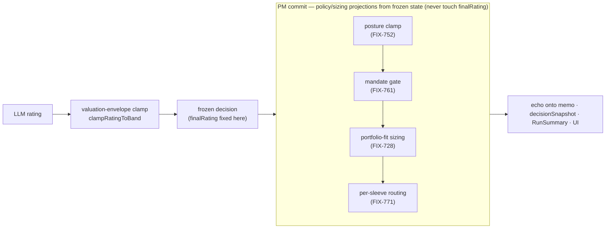
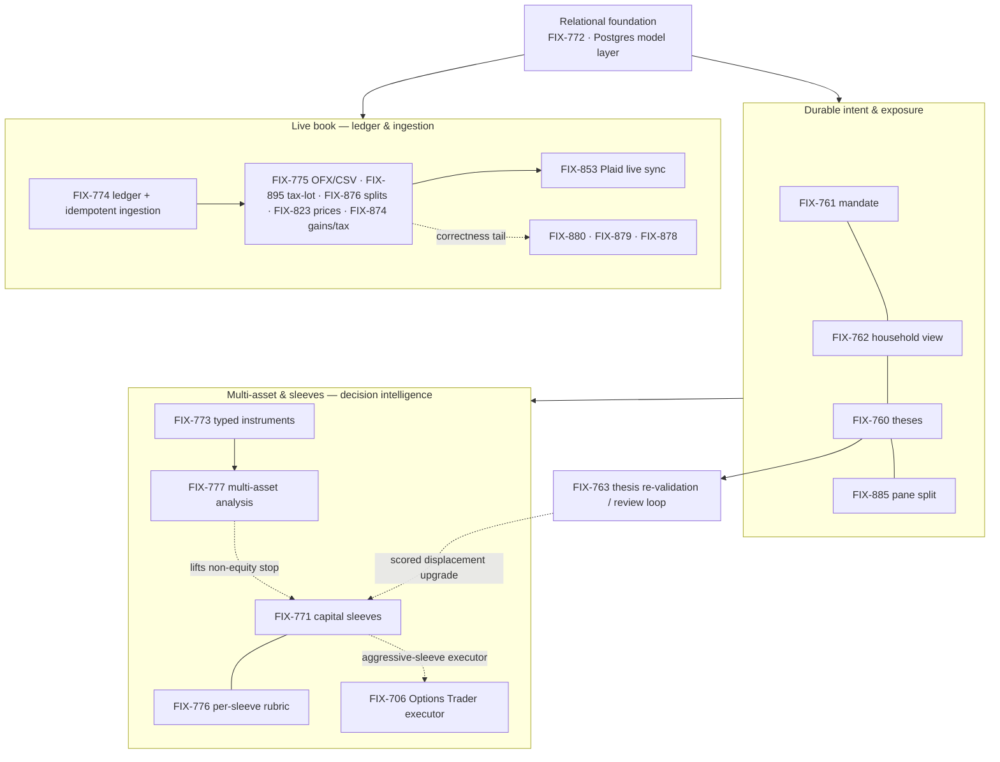

# Epic — Portfolio Management: the desk as a system of record

> **Linear Epic issue:** _pending creation (objective sign-off first)_ · **Branch:** `epic/portfolio-system-of-record` (authored on `claude/fix-771-epic-context-ypnsl9` pending adoption) · **Epic PR:** _never-merged; opened as the objective sign-off surface_
>
> **Project:** [Trading Desk Lab](https://linear.app/fixpoint-labs/project/trading-desk-lab-41f2ecb0fd1a) · **Milestone:** Portfolio Management (system of record) · **Initiative:** Build a high performing portfolio management system
>
> This is an **epic-spec** — a coordination artifact for a set of related issues, per [`docs/contributing/orchestration.md`](../../contributing/orchestration.md). It is **not** an implementing spec. The issues below do not derive from it; they *reference and align* to it. Its job is to keep cross-cutting decisions from being made in a vacuum.

---

## 1. Purpose & objective *(the gated sign-off surface)*

**Plain-language summary.** The trading desk started life as a one-shot demo: give it a ticker and a date, and five agent teams argue their way to a Buy/Hold/Sell call. That's a good story, but it reasons about a stock in a vacuum. It doesn't know what you already own, what you're trying to do with your money, or whether you even have cash to act on its verdict. This epic is the arc that turns the desk from *"analyze a stock"* into *"manage a book"* — a durable, multi-account, multi-asset portfolio with stated intent, a live transaction ledger as its source of truth, and analysis that answers **"is this trade right for my book, and can I afford it"** rather than just "is this a good stock in the abstract."

**Why this body of work.** Every capability here closes one gap: a stock verdict is only actionable against a book. Absent the book, its intent, its memory, and its full asset shape, the desk is giving advice into a vacuum. Supplying those turns it into a system of record — the durable substrate a real portfolio-management product, or a serious personal book, is built on. The observable outcome below names the four axes concretely.

**Observable outcome (the end state this epic is done against).**

- The book is **live and durable**: positions come from an idempotent transaction ledger fed by file import (OFX/CSV/tax-lot) and live sync (Plaid), correct across corporate actions (splits) and corrections (void-and-reimport), valued from last-known prices without a live refresh.
- The book has **stated intent**: a durable portfolio mandate carries goals, target allocation, a per-decision risk posture, and multiple capital sleeves (named strategies, each with its own posture, cap, and eligibility). Intent is declared once and reused every run.
- Analysis is **portfolio-aware**: a run answers per-sleeve fit and capital availability, sizes against the real book, reasons about all held asset types (bonds, cash funds, ETFs, crypto, options — not equities alone), and weights its rubric to the mandate it's serving.
- The book has **memory and a conscience**: every position carries a durable thesis (entry rationale, invalidation conditions), and a review loop re-validates theses and flags drift over time.
- Every one of these is **inspectable** in the DevTool UI — the project's central thesis (no black boxes) holds at portfolio altitude, not just at analysis altitude.

**Evidence path (BP-003).** Each constituent issue's spec carries its own goal check; the end-to-end proof the whole arc is done against is a `fsdev run` of the analyze action over a seeded multi-account, multi-sleeve book, read back through the `runSummary` action (`verify-trading-desk`).

**Holistic necessity check** *(the `issue-spec` Step 3.5 lens, raised to the whole set).* Each issue earns its place; the honest question is whether the *arc* overbuilds. Assessment:

- **The core arc is coherent and non-redundant.** Ledger → mandate → portfolio-aware decision → multi-asset → review loop is a single dependency spine where each layer is load-bearing for the next. Nothing in the spine is speculative.
- **Two deliberate restraints are already baked in.** The mandate is the *single* container for all durable intent (posture and sleeves extend it rather than spawning parallel resources), and every portfolio-aware refinement is a *deterministic projection of one LLM decision* rather than a second model call. These keep the arc from ballooning into a policy engine.
- **Where the set risks over-reach, and the call.** The ledger-correctness tail (currency-in-fingerprint, void/in-flight serialization, OFX proceeds-unknown correction — FIX-880/879/878, all Backlog/Low) is genuine correctness debt but is *not* core to the arc; it should stay low-priority and not gate the intelligence work. The scored/ranked displacement judgment and per-sleeve cash sub-ledger are explicitly deferred (they need the review loop and a shadow ledger respectively). This is the right 80/20 line: ship listing before ranking, account-anchored caps before sub-ledgers, equity-first before all-asset.

**The one boundary question the human should settle at sign-off:** whether market-intelligence work belongs in *this* epic or a sibling one. This spec draws the line at the **system of record itself** and treats that work as adjacent; the specifics and recommendation are §4 Q1. Confirm or redraw.

---

## 2. Themes & long-horizon direction

Cross-cutting decisions that live above any single issue. New issues joining this epic align to these; a change to one of these is a change to the epic, not to an issue.

### T1 — One policy model: durable intent lives on the mandate, and only there

All durable portfolio intent — target allocation, constraints, risk posture, capital sleeves, and (future) per-sleeve rubric weighting — lives as config-as-data on the **one** `portfolioMandate` resource. New intent **extends the mandate schema**; it does not spawn a parallel resource. FIX-761 shipped the flat mandate deliberately coordinated as the container the later work grows into (BP-038 — don't pre-build the container, but don't fork it either). Sleeves proved the pattern (`sleeves[]` on the mandate); the per-sleeve rubric (FIX-776) should follow it (a `weightingProfile` on the sleeve), not introduce a second policy store.

### T2 — Decide once, then project deterministically; policy and sizing never touch the frozen rating

The load-bearing architectural invariant of the whole desk, in two layers. **First the rating is formed:** the LLM produces one rating, which is bounded to the model-implied valuation envelope (`clampRatingToBand`) and then **frozen** — so `finalRating` *is* shaped after the LLM, but only by rating/valuation logic, and only before the freeze. **Then policy and sizing project from the frozen decision:** every portfolio-aware refinement — posture clamp (FIX-752), mandate gate (FIX-761), portfolio-fit sizing (FIX-728), sleeve routing (FIX-771) — is a **deterministic projection** computed at PM commit from *frozen* state, in the same commit handler (`mandate-gates.ts` / `policy-gate.ts`), and it is **downward-only sizing/routing that never touches the frozen `finalRating`**.

The dividing line tells you which layer a feature belongs to. If it changes *what the desk thinks of the name*, it shapes the **rating before the freeze** — the valuation spine today, a configurable rubric (FIX-776) or multi-asset analysis (FIX-777) tomorrow — an analysis/rating change, not a policy gate. If it only changes *how much fits and where*, it is a **policy/sizing projection after the freeze** and must not move the rating. That split is why sleeve routing could be added as a projection of the single decision rather than a second model pass — and it is the first test any new "portfolio-aware" idea has to pass.

### T3 — Relational truth in `app.*`; flat documents and policy as resources; computed views never frozen

The dividing line is **shape, not importance**. Data with foreign keys and cross-account rollups — accounts, holdings, the transaction ledger — earned **Postgres `app.*` tables** (FIX-772 is the substrate that gates every query-heavy consumer). Flat `household × key` documents and durable **policy** stay **FSD resources**: the **mandate** (intent) and **per-position theses** (FIX-760 — a flat `household × ticker` document with no join, and agent-facing state the analysis seed reads) are user-scoped resources, which also buys the live client read path for free. Computed views — household aggregation, sleeve utilization, portfolio health — are **derived at read time and never frozen**, so they always reflect the current book. So: relational facts are tabled, flat facts and policy are resources, exposure is computed.

### T4 — The ledger is the system of record; ingestion is idempotent and correction-safe

Holdings are **derived from the transaction ledger**, not stored independently. Every ingestion path — OFX/CSV/tax-lot file import, Plaid live sync — is **idempotent by content fingerprint** (FIX-774's contract), so re-importing is a no-op. Corrections are **void-and-reimport**, not in-place edits (FIX-878). Corporate actions (splits) **rebase FIFO lots** rather than being patched (FIX-876). Each position has **exactly one owning account** (kills double-counting and cash-attribution ambiguity). Prices persist with an **as-of** so the book values without a live refresh (FIX-823). The correctness tail (currency in the fingerprint FIX-880, void/in-flight serialization FIX-879) hardens this contract but does not block the intelligence layers above it. Holdings are **full-recompute-on-ingest** today (`materializePositions` re-derives), so every ingestion path must batch a window into a *single* ingest call rather than firing per transaction — FIX-853's Plaid sync especially, where per-event materialization goes super-linear as history grows.

### T5 — Equity-first, multi-asset by extension — never silent mis-handling

The analysis pipeline is **equity-gated today** (`checkAssetTypeSupported`). Multi-asset support lands as a **typed instrument model first** (FIX-773 — represent/price bonds, MMF/cash, ETFs, crypto, options), **then multi-asset analysis** (FIX-777). Until FIX-777 lifts the stop, a non-equity name is an **explicit exclusion axis** (e.g. a sleeve's `assetClasses` marks it `not-eligible`), **never a silent mislabel**. This is why FIX-771 routes on a *constant* `equity` candidate class rather than calling a provider-blind classifier: correctness over premature generality.

### T6 — Shared vocabulary and the sequencing DAG

The domain vocabulary is fixed and shared across every issue: **book** (the whole portfolio), **account** (an ownership container), **ledger** (the transaction system of record), **holding/position** (derived), **mandate** (durable intent), **posture** (per-decision risk appetite), **sleeve** (a named capital strategy on the mandate), **thesis** (a position's durable rationale), **household** (cross-account aggregate). New issues use these terms as defined; a term that needs a new meaning is a cross-cutting question (§4), not a local choice.

The internal sequencing (blocking where marked) — this is the epic's dependency spine:

> The DAG is the **structural spine** — it owns the dependency *edges*; §3's index owns per-issue status and PR handles. Its issue IDs are low-churn (the spine rarely changes), so they stay rather than collapsing to cluster nodes.

---

## 3. Running index

The durable audit log of every issue under the epic — for humans and issue agents to navigate from one place. A **projection**: the hand-maintained value is the **Spec/Impl PR** columns; **Status is Linear-derived** (the Epic-parent query owns it — do not hand-edit, it will drift). 21 issues.

| Issue | Title (abbrev.) | Cluster | Status | Spec / Impl PR |
|---|---|---|---|---|
| **FIX-772** | Postgres + relational model layer | Foundation | Done | — |
| **FIX-761** | Durable portfolio mandate (goals, allocation, constraints) | Intent | Done | — |
| **FIX-760** | Per-position thesis records | Intent | Done | — |
| **FIX-762** | Household-level view (exposure, concentration, drift) | Intent | Done | — |
| **FIX-885** | Portfolio pane sidebar split (Gains&Taxes / Accounts) | Intent | Done | — |
| **FIX-763** | Thesis re-validation & portfolio review loop | Review loop | Todo | — |
| **FIX-773** | Typed instrument model (bonds, MMF, ETF, crypto, options) | Multi-asset | Done | — |
| **FIX-777** | Multi-asset trade-quality & sleeve-fit analysis | Multi-asset | Backlog | — |
| **FIX-771** | Multi-strategy capital sleeves + routing + funding-source | Sleeves | In Review | spec [#803](https://github.com/fixpoint-labs/flow-state-dev/pull/803) |
| **FIX-776** | Configurable per-profile / per-sleeve decision rubric | Sleeves | Backlog | — |
| **FIX-706** | Options Trader — directional decision → options trade | Executor | Todo | — |
| **FIX-774** | Transaction ledger substrate + idempotent ingestion contract | Live book | Done | — |
| **FIX-775** | OFX-family / broker-CSV historical import | Live book | Done | — |
| **FIX-895** | Tax-lot CSV import (realized + unrealized) | Live book | Done | — |
| **FIX-876** | Stock splits / corporate actions, FIFO rebasing | Live book | Done | — |
| **FIX-823** | Persist last-known price + as-of | Live book | Done | — |
| **FIX-874** | Realized-gains / current-year tax view | Live book | Done | — |
| **FIX-853** | Plaid Investments live sync (durable worker-hosted) | Live book | Todo | — |
| **FIX-880** | Currency in the ledger content fingerprint | Correctness tail | Backlog | — |
| **FIX-879** | Serialize void vs in-flight ingest (lock before insert) | Correctness tail | Backlog | — |
| **FIX-878** | Void-and-reimport for OFX proceeds-unknown sells | Correctness tail | Backlog | — |

**Shipped foundations referenced but off-milestone** (not epic sub-issues, but the arc rests on them): FIX-752 (risk posture — reused per sleeve), FIX-728 (portfolio-fit sizing), FIX-736 (portfolio domain split into its own flow), FIX-725/726 (portfolio domain + PDF import).

---

## 4. Open cross-cutting questions

Raised by the necessity check and by the constituent specs. None blocks the objective sign-off; each needs a human decision before the issue it touches is built.

1. **Epic boundary — is market intelligence in or out?** Opportunity scanner (FIX-902/937), Alpha Vantage data layer (FIX-934), and the MCP control surface (FIX-768) are theme-adjacent but arguably a *distinct* spine (candidate generation & data breadth, vs. the system of record itself). **Recommendation:** keep this epic scoped to the system of record; open a sibling epic for market intelligence if that work coordinates enough to warrant one. **Owner to confirm.**
2. **Graduate to a dedicated Linear project ("Spine B")?** The milestone description already flags this set as large enough for its own project, held as a milestone only because project creation needs explicit approval. This epic-spec gives the coordination layer without the project; whether to also graduate the project is the maintainer's call.
3. **The per-sleeve rubric coupling (FIX-776 ↔ FIX-771).** T1 says the rubric weighting should extend the sleeve schema (`weightingProfile`), which couples FIX-776 to the FIX-771 schema. Confirm the rubric lives on the sleeve (one policy model) rather than as a standalone profile store, and sequence FIX-776 after FIX-771's schema stabilizes.
4. **Scored displacement is the shared upgrade point.** FIX-771 ships funding-source as an *unscored incumbent list*; the scored/ranked "which holding is weakest" judgment needs the thesis re-validation loop (FIX-763). Both name this as the coordination seam — keep them sequenced so the upgrade lands once, in FIX-763, and FIX-771 doesn't grow a throwaway scorer. When FIX-763 is specced, pin whether drift detection is deterministic arithmetic (cheap, fits T2) or a per-position model re-analysis (needs batching) — very different cost shapes.
5. **Sleeve cash model.** Two deferred sub-decisions on the same seam: (a) whether the residual *unsleeved* capital becomes a first-class named sleeve (recommend implicit for v1), and (b) when a per-sleeve cash **sub-ledger** becomes necessary. Account-anchored hard caps are the honest v1 (no intra-account partition); name the trigger for the sub-ledger — intra-account sleeves, or cash-attribution disputes — rather than building it speculatively.

---

## Spec evolution

- **Epic-spec drafted** — bounded the epic to the 21-issue "Portfolio Management (system of record)" milestone; framed the objective as turning the desk from stock-analysis into a book system-of-record; extracted six cross-cutting themes (one-policy-model, decide-once-project-deterministically, relational-truth, idempotent-ledger, equity-first-by-extension, shared-vocabulary+DAG); recorded the market-intelligence boundary and the rubric/displacement coupling as the open questions for human sign-off.
