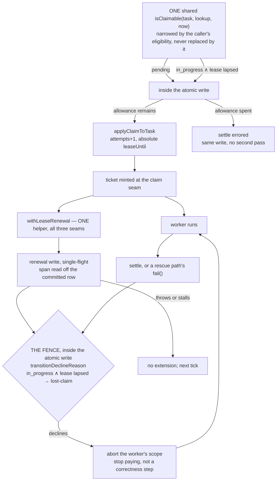

# FIX-1005: Reclamation joined to execution liveness — Implementation Spec

## Part I — The Case *(for the human)*

### 1. Problem — why it matters, why now

A worker picks up a durable job and its process dies — a deploy, a crash, an eviction.
The job stays marked "someone is working on this," and nobody is. No later worker will
ever touch it, because the queue only looks at jobs marked "not started." The job is
stranded permanently and the only recovery is a human editing storage by hand.

**Why now.** This is the epic's milestone 2 and its objective gate is held on it: a
stranded job must return to the queue *and a worker must actually start on it again*,
with no human in the loop. Nothing else in the epic delivers that.

**The trap, and it is the whole reason this is hard.** Every job carries a 30-second
lease, so the obvious fix is to take back anything whose lease expired. That is worse
than the bug. **Nothing renews a lease** — it is stamped once at claim time and never
extended — and a single model call routinely runs longer than 30 seconds. So an expired
lease is the *normal* condition of a perfectly healthy worker. Acting on it resets a live
worker's job, a second worker picks it up, and the model call and every side effect run
twice. That trades a loud hang for silent duplicate execution, which is strictly worse.

### 2. Solution in plain terms

**Make the lease tell the truth: have the worker keep it alive while it works.**

A worker that is running renews its own job's lease every so often. It is the only party
that can, and it is renewing a row it already proved it owns. Once that is true, an
expired lease stops being ambiguous — it means no live worker is holding this job — and
the queue can simply treat such a job as available again. Recovery needs no sweeper, no
timer to tune, and no second system to ask.

Two things follow. A worker that discovers it no longer holds its job stops immediately
rather than burning tokens on work it can no longer record. And the time a crashed job
sits stranded becomes a number we choose — the lease — instead of forever.

**Philosophy** — **tenet 2 (composition over features):** the board already holds the
lease, the ownership ticket, and the atomic write; renewal composes those three rather
than adding a liveness subsystem beside them. **Tenet 5 (fix at the owning layer):**
claimability has one convergence point and recovery goes there, so every dispatcher gets
it without knowing it exists. **Tenet 3 (earn every addition):** one write verb, one
existing knob, no new configuration.

### 3. Tradeoffs & alternatives

**The alternative this replaces: ask a registry whether the worker's request is alive.**
That was the previous spec's mechanism and it is rejected on evidence. Absence from that
registry has several indistinguishable causes, one of them the recovery sweeper deleting
the entry itself, so the design needed a growing enablement gate to say when the signal
could be believed at all. The gate is now written down in FIX-999 and has **four arms**,
and it refuses the signal on the default in-memory deployment, on any deployment with
sweeping turned off, and on any deployment that dispatches to an external worker
(`spec/FIX-999.md` §6 Decision 3, on `spec/FIX-999-respec`). Renewal needs none of that:
the signal rides the same store the board already needs to be durable at all, so it works
wherever a durable board works.

**The simpler approach, and why it loses: call `reclaim()` before each drain.** Three
lines, ships today. It is exactly the trap in §1 — it cannot tell gone from slow. That is
the epic's binding rule 1 and it is not available at any price.

**Where the genuine complexity is** — not the renewal write. It is being honest about
what renewal does and does not prove. A process that is *paused* rather than dead — a
suspended VM, a long stop-the-world stall — also stops renewing, so its job can be taken
while it is still, eventually, going to keep running. Its write-back is refused, but its
side effects already happened. §6 decision 8 states that plainly rather than designing
around it.

### 4. Focus practices (1–5)

1. **One convergence point for claimability (tenet 5), and there are three copies of it
   today.** The claim path (`isReady`), the board's wake predicate, and the ready-task
   selector each decide independently what is claimable. The change is to make them share
   one predicate, not to widen three — move a subset and a board recovers rows it never
   wakes for, or wakes for work it will not take.
2. **BP-035, and the second path is the *live* worker.** Every behaviour worth testing is
   asserted from the side of the worker that must **not** be disturbed — including the
   worker whose store has stopped answering, which is the sharpest one.
3. **BP-030, and round 3 inverted what it demands here.** Every write normalizes the whole
   row through the *writer's* schema (`resource-registry.ts:696` runs
   `stateSchema.safeParse` on the mutated row) and a Zod object drops a key it does not
   know. So **no new persisted field survives a mixed-version deploy** — that is a
   constraint on what a new field may be permitted to *mean*, not a hole re-assertion can
   patch. A new field is only safe if its stripped state is the *safe* state: the
   abandonment counter (decision 4) reads absent as zero, exactly as `readRetryLedger` does
   (`internal.ts:116-123`), which can never strand a row — it costs *recovery*, and a strip
   that **recurs** costs an unbounded amount of it rather than one (§13). A
   field whose *absence withholds recovery* fails that test in the one direction this issue
   exists to prevent, which is why the renewing-claimant marker is gone.
4. **Earn the addition (tenet 3) — and the honest count, which has now moved three times.**
   One write verb, one decline arm, one persisted counter, one `core` abort primitive;
   **no new knob and no new configuration surface.** Round 2 removed the attempts arm and a
   separate cadence floor. Round 3 removed more than it added: the renewing-claimant marker
   and its re-assertion, the independent abort clock, and the compute-the-deadline-early
   rule all came out, replaced by a single conditional arm on the write that already runs
   (decision 3). Each survivor exists because a specific failure has no other owner.
5. **A predicate answers one question.** Admission ("should the claim path look at this
   row?") and disposition ("what should happen to it?") are different questions with
   different readers, and folding the second into the first is what produced the round-1
   contradiction. The predicate admits; the atomic write decides.

### 5. What using it looks like

**A board recovers on its own** — no new call, no configuration:

```ts
const board = taskBoard({ collection: durableTasks, workers, concurrency: 4 });
// Worker on host A claims task "t1" and its process is killed.
// Any drain, on any host, claims "t1" again once its lease lapses — as attempt 2.
```

**The lease is the recovery-latency knob, and it is the one that already exists** —
`ClaimOptions.leaseDurationMs`, set by whatever claims. There is no board-level lease
option and this spec does not add one; the renewal helper reads the lease off the row the
claim committed, so it is always working from the real value rather than a configured one:

```ts
// Claiming by hand gets you no renewal — you hold the task, so you renew it.
const task = await collection.claim("worker-1", { leaseDurationMs: 120_000 });
// ...or size the lease to cover the whole job and accept that nobody takes it
// back until then.
```

**Before / after, for a worker whose process dies mid-task:**

```
before  t1 → in_progress forever; claim() never considers it; only a human clears it
after   t1 → in_progress, lease lapses, next claim() takes it as attempt 2 and runs it
```

**If you implement `TaskCollectionRef` yourself**, the obligation is *three*-sided and the
last two are the ones that are easy to miss. You implement the renewal write, fenced by the
same claim ticket every other worker-callable write already presents. **Your own `claim()`
must consider expired rows**, fence the takeover on the attempt, and settle a row whose
abandonment allowance is spent instead of running it — widening the built-in predicate
cannot reach your scan. **And every ticket-fenced write you accept must refuse a claimant
whose lease has already lapsed**, or a worker that lost its row can still write to it. A ref
that implements only the renewal write compiles, renews correctly, and silently never
recovers anything.

### 6. Decisions & rules — the sign-off surface

1. **A worker renews the lease on the row it holds, fenced by the claim ticket it already
   carries. Renewal is substrate-only and is never a model-facing tool.**
   *Rejected:* asking the engine's request registry whether the worker is alive (§3); a
   `renewLease` entry on `taskTools`.
   *Locks in:* the board is its own liveness substrate. No second store is consulted about
   work, recovery is available in every deployment a durable board is available in — and an
   agent cannot extend its own deadline, because renewal is bookkeeping about a process
   being alive and a model asking for more time is not evidence of that.

2. **Recovery happens inside `claim`, not in a sweeper.** An `in_progress` row whose lease
   has lapsed becomes a candidate, and the claim's atomic write resets and re-claims it in
   one step.
   *Rejected:* a periodic sweep pass, and sharing a sweep frame with FIX-982's reconciler.
   *Locks in:* nothing to schedule and no cadence to tune — but recovery only happens where
   something is asking for work. A board nobody drains stays stranded, which is what
   happens today and costs nothing, because nothing would run the task anyway.

3. **The lease is enforced inside the atomic write, not by a clock beside it. A
   ticket-fenced write on an `in_progress` row whose lease has already lapsed is declined —
   and that decline is what stops the worker.** One arm on `transitionDeclineReason`
   (`internal.ts:349-365`), which both backings already run inside their write.
   *Rejected — and this reverses two round-2 folds and one round-1 fold, because all three
   were client-side approximations of this one conditional write.* **Computing the renewal
   deadline before the request goes out:** it made a late write land with a past value, but
   a renewal that commits at `t=35` against a lease held to `t=30` still installed `t=40`
   and the shipped guards still passed — verified by running it. The fence refuses that
   write instead of hoping its payload is harmless. **A second, independent abort clock:**
   it existed so a worker whose store never answers would stop before another drain took
   the row, but with the fence that worker can record nothing anyway, so the clock bought
   no correctness and cost the defect below. **Recording "lease lost" so the rescue path
   skips settlement:** the same arm declines the rescue write, so there is nothing to
   record. Also rejected: a new decline reason — this is `lost-claim`, which is what it is.
   *Locks in:* a row is either still the claimant's or already the queue's, and **one
   predicate decides which**, evaluated against committed state inside the write —
   `isClaimable`'s recovery arm and this decline arm are two readings of the same fact, so
   they cannot drift apart. It closes the hole the abort itself opened: an abort at lease
   expiry used to flow into all three rescue paths (`record-result.ts:108`,
   `dispatch-and-execute.ts:195`, `routedSpecialists/index.ts:446`), which call `fail()`,
   and `transitionDeclineReason` had no lease arm — so **our own liveness mechanism
   terminalized a default task `errored` instead of leaving it recoverable.** Verified: that
   `fail()` returns no decline today.
   *Cost, stated:* a worker whose store stops answering keeps running until its own work
   finishes. Every write it attempts is refused, so it records nothing — but its side
   effects continue. That is decision 8's bound, not a new one. And a worker that finishes
   just after its lease lapses has its settlement refused and its work re-run; the lease is
   the promise, and this is what makes the promise true rather than likely.

4. **Recovery is bounded by an abandonment allowance, consulted inside the claim write, and
   counted in a field on the row. A row whose allowance is spent is settled `errored` in
   that same write rather than recovered.** The allowance is *not* read from the
   claimability predicate — the predicate admits the row and the write decides what to do
   with it.
   **The counter is specified here because round 3 proved it cannot be left to the
   implementer.** Neither existing counter can carry it: `attempts` advances on *every*
   claim, and `retryLedger.granted` counts authorized *failure* retries only
   (`task.ts:49-53`). One new non-negative integer on the task row, incremented in the same
   atomic write that recovers an abandoned row. **Absent reads as zero** (BP-030), the
   `readRetryLedger` posture exactly (`internal.ts:116-123`) — so a row persisted before the
   upgrade, or one whose counter an old process stripped, gets the full allowance rather
   than none. That direction is deliberate: over-recovery is in-policy (decision 8);
   withholding recovery is the bug this issue exists to fix. It is *in-policy* rather than
   *bounded* — a strip that recurs re-zeroes the counter and the allowance never exhausts,
   so the bound is only as durable as the field carrying it (§13).
   **And the `attempts` interaction is not optional.** Recovery advances `attempts` (§7 —
   it is what closes the displaced-worker window), and `shouldRetryOnFail` is
   `attempts < maxAttempts` (`internal.ts:89-92`). Measured: with `maxAttempts: 3`, **two
   crashes exhaust the whole failure budget without a single failure.** So if OQ-1 comes
   back "separate," the failure check must discount abandonments — `attempts - abandonments
   < maxAttempts` — or the budgets are separate in name only.
   *Rejected — and this reverses a round-1 fold of mine:* putting an "attempts remain" arm
   in the shared predicate. It was wrong twice. It **breaks the headline case**, because
   `maxAttempts` is optional and `shouldRetryOnFail` returns `false` when it is absent
   (`internal.ts:89-92`), so an ordinary task is already "exhausted" after attempt 1 and
   would be terminalized instead of recovered — the feature off by default unless every
   caller opts into retries. And it **contradicted itself**, because both backings filter
   candidates through eligibility *before* the atomic write
   (`resource-backed.ts:528`, `sequencer-backed.ts:423`), so a row the predicate excluded
   could never reach the settlement branch that was supposed to terminalize it.
   *Also rejected:* a three-valued classifier (`claim | terminalize-exhausted | skip`). Once
   the allowance moves inside the write, one boolean is enough — and `select-next-ready-task`
   is a **preview** that does not dispatch (`:36-54`), so admitting a row it will settle
   rather than run is correct rather than hazardous.
   *Locks in:* the deadlock this closes stays closed — no row is ever left `in_progress`
   with nobody on it, because `inFlightCount` counts that as active
   (`task-board/shared.ts:70-76`) and `boardQuiescence` would then never report `drained` or
   `blocked` (`quiescence.ts:48-62`). The settlement reuses the existing terminal path
   (`in_progress → errored` is already legal, `task-status.ts:33`). **Whether the allowance
   is its own budget or shares `maxAttempts` is the owner's call — OQ-1 in §12 — and this
   spec deliberately does not pick it.** What each policy costs is stated there, and it is
   not the same for both.

5. **One knob: `leaseDurationMs`, validated with a minimum. Everything else is derived from
   the row the claim committed — and the span is the *committed* span, not the time left
   on it.**
   *Rejected:* a separate renewal-interval option; a board-level lease option
   (`TaskBoardConfig` has none today, and adding one would mean the helper agrees with the
   dispatcher about a value instead of reading the committed truth); accepting the knob
   unvalidated, since `ClaimOptions.leaseDurationMs` is a bare `number`
   (`collection/types.ts:104`) flowing straight into `now + leaseDurationMs`
   (`internal.ts:439`). **And rejected: a separate cadence floor** — one minimum on the
   *lease* subsumes it, in the caller's own units, so there is one number to justify instead
   of two.
   **And rejected: deriving the span from the time *remaining* on the lease.** A helper that
   starts late then derives a tiny span: measured, a valid 1,000 ms claim whose helper
   starts 990 ms later derives a 10 ms span and a 3.33 ms cadence — the write storm the
   minimum exists to prevent, rebuilt out of a valid claim. `applyClaimToTask` stamps
   `leaseUntil` and `updatedAt` from the same `now` (`internal.ts:429-442`), so the
   committed span is `leaseUntil - updatedAt` and is exact.
   *Locks in:* a caller states one thing — how long they may be gone before the work is
   taken back — and a lease **below** the minimum is refused rather than normalized into a
   surprise. The helper is correct by construction rather than by agreement: it reads the
   span the claim actually committed, so no delay between the claim and the helper's first
   tick can shrink that span — though the same delay does move the first tick's *phase*,
   which §7 handles separately.
   **Stated so the bound is checkable: this is a floor, not a range.** Nothing bounds the
   lease from *above*, and a lease past `TIMEOUT_MAX × RENEWAL_DIVISOR` — 6,442,450,941 ms,
   about 74.5 days — overflows the timer delay and Node coerces it to 1 ms, rebuilding the
   write storm the floor exists to prevent. That upper bound is a live §13 note, decided
   together with the renewal verb's own numeric validation, not a second knob here.

6. **A caller's `eligibility` predicate *narrows* the substrate's candidate set; it does not
   replace it.**
   *Rejected:* today's replacement semantics, which are documented
   (`apps/docs/docs/orchestration/task-substrate.md:279-287`) and which make recovery
   unreachable for any dispatcher that asserts `status === "pending"` — including the recipe
   our own docs recommend. Widening the built-in predicate cannot reach a caller's, so
   without this the substrate's newest invariant is the one most easily opted out of by
   accident.
   *Locks in:* recovery is a substrate invariant composed *with* caller filtering rather
   than at its mercy, and the five built-in dispatchers get **simpler** — each drops its
   `isReady(...)` conjunct and its import (`priority.ts:21`, `topological.ts:16`,
   `event.ts:40`, `classifier.ts:40,47`).
   **The wake probe reads the shared predicate alone, so *any* narrowing can hold it true on
   a row that dispatcher will never take.** Round 5 corrected this: the rule below was
   written against `status`, but the mechanism behind it is general. Traced end to end on
   this branch — a predicate that is already true makes `waitForCondition` return without
   waiting (`sequencer.ts:2102`), a lapsed `in_progress` row keeps `inFlightCount` above zero
   (`task-board/shared.ts:73`), so `boardQuiescence` reports neither `drained` nor `blocked`
   (`quiescence.ts:49-62`) and the worker's `.loopBack` burns iterations with no sleep until
   `maxIterations` (`task-board/index.ts:926`). Nothing in that chain is specific to
   `status`, and the other dimensions are not hypothetical: two **built-in** dispatchers
   narrow on something else — `eventDispatcher` on a topic (`event.ts:39-41`) and
   `classifierDispatcher` on a single id (`classifier.ts:47`).
   **The divergence is pre-existing; this issue widens it rather than creating it.** Today
   `hasClaimableTask` already reports a `pending` row the board's own dispatcher will refuse:
   an `eventDispatcher` board whose topic matches nothing spins exactly this way on `main`.
   What changes here is the *set* of rows that can hold the probe true — lapsed `in_progress`
   rows join `pending` ones. So an earlier draft's claim that a non-status over-report is
   "transient, because the row it names is claimable by some drain" was **false** and is
   withdrawn: for a topic no dispatcher resolves, or an id no classifier picks, there is no
   such drain.
   **The `status` ban stays, on the reason that actually singles `status` out.** Every other
   narrowing *expresses* a caller's filter — recovery still runs on the rows that filter
   admits. Asserting `status === "pending"` instead **negates the widening itself**, turning
   recovery off for that dispatcher on every row, silently, including the recipe our own docs
   recommend. That is a caller error rather than a supported narrowing; the rest is a caller's
   choice we honour.
   **So the invariant is stated at the size it actually holds: recovery composes with a
   caller's narrowing over the rows that narrowing admits — not over every row.**
   *Cost, stated:* both the ban and the residual spin are contracts nothing enforces. The
   alternative — composing each dispatcher's effective predicate into wake and quiescence —
   means surfacing that predicate on the public `TaskDispatcher`, which today exposes only
   `claim()` (`dispatchers/types.ts:28-39`) and hides its `eligibility` inside it. That is a
   larger public change than this issue carries, and it would be repairing a defect older
   than this issue. The documented recipe changes (§11).

7. **This ships as one PR, and the halves are not separable.**
   *Rejected:* landing recovery-eligibility and renewal in sequence.
   *Locks in:* eligibility without renewal is exactly the trap in §1 with a wider blast
   radius than the defect that exists today. There is no intermediate state anyone should
   run. The decline arm (decision 3) is inside the same PR for the same reason.

8. **What we promise is bounded: at-most-once *settlement* for every write that presents
   `options`, at-least-once *side effects*, and recovery within one lease *plus the drain's
   idle-wake latency*.**
   *Rejected:* claiming detection "within one heartbeat" — the superseded mechanism's
   promise, which its own enablement gate could not deliver.
   *Locks in:* a *paused* process can still have its job taken and later keep running. Its
   write is refused, its side effects are not. Anything stronger requires the work itself to
   be idempotent, which is the caller's property and not a timer we can tune. **Decision 3 is
   what makes the settlement half true rather than merely likely** — before round 3 the bound
   was enforced by a timer the worker ran, so a slow store could settle a task whose lease had
   gone. Now the write refuses it.
   **Both bounds carry an additive term, and each is stated here because a reader cannot
   derive it from the lease alone.**
   - **Recovery is one lease *plus* up to one idle-wake period, not one lease.** A lease
     expiring writes nothing, so it emits no `task-change` item — and a spare worker already
     asleep in the board's idle wait re-evaluates the claimable predicate only when such an
     item arrives or when its timeout fires. That timeout is
     `Math.max(idlePollMs * 100, 50)` (`task-board/index.ts:873-895`), which at the default
     `idlePollMs = 50` (`:640`) is **5 seconds**, and scales 100× with the knob — 50 s at
     `idlePollMs: 500`. Measured. So the honest figure is `lease + up to ~5 s` by default.
     Whether to close that (wake at the nearest lease deadline) or document it is the
     implementer's — §13.
   - **At-most-once settlement holds for every write that presents an `options` object, and
     that is every settlement path we ship.** `transitionDeclineReason` returns early on
     `options === undefined` (`internal.ts:355`), so a caller passing *no options at all* is
     outside the advisory contract entirely and can overwrite a settlement already recorded.
     That is not "no ticket": measured, `{ ifAllowed: true }` **with no ticket** already
     declines `terminal` on a settled row, so the terminal arm alone closes it. Every shipped
     settlement — the board's `record-result` (`:63,:108`), `dispatch-and-execute`
     (`:188,:195`) and `routedSpecialists` (`:446,:475`) — passes `ifAllowed: true`, and the
     model-facing tools carry the worker's ticket exactly when one exists, because the claim
     seam has a single stamp site and "no ticket presented" and "not a claimed worker" are the
     same condition (`flow-policy-wiring.ts:298-312`). A displaced worker therefore always
     presents `options` and is always refused. The exposure is a *direct* caller that settles
     bare, which this design does not create — but it does make re-attempt routine where it
     previously required a manual `reclaim()`, so §11 documents the bare verb as opting out.

   **And a third promise carries a precondition, which round 5 added because the promise was
   stated as absolute: "a healthy worker is never disturbed, at any lease age" is true from
   the first renewal onward — but that first one is conditional.** It commits inside the
   lease only when the helper starts with more lease left than one store write takes to
   commit; §7 has the arithmetic and the measurements, and the first-tick floor is what buys
   back everything a timer's own jitter was costing. A helper that starts later than that
   loses its row and its work is re-run — inside this decision's bound rather than beside it,
   and the same outcome as a worker that misses two renewals in a row. What it is *not* is a
   guarantee we can widen with a bigger constant: no write beats a deadline that arrives
   sooner than the store can answer.

**What the rolling deploy costs, since decision 3 replaced the rule that covered it.** An
old-version worker cannot renew, so during the one upgrade that ships renewal, a task it
holds can lapse and be recovered while it is still running: that task's *side effects* run
twice. Its settlement is still refused — `attemptOwnsTask` sees the advanced counter
(`internal.ts:257-274`), shipped and unchanged — so at-most-once settlement holds
throughout. This is deliberately inside decision 8's bound rather than fenced off by a
marker on the row. **The marker is gone, and round 3 removed it rather than repairing it:**
it could not survive the deploy it existed for (a foreign write strips an unknown key —
measured), it is not derivable from the row (a renewed row and a freshly claimed row are
identical in `leaseUntil - updatedAt`), and it was the only mechanism in this design whose
failure was **permanent strandedness** — the exact defect §1 opens with. A one-time upgrade
note in the changeset (§11) covers a one-time cost; a permanent field that can silently
recreate the bug does not. As a direct consequence, rows stranded *before* the upgrade —
which the marker rule excluded forever — are now recovered too.

**Non-goals** — the never-claimed `pending` reconciler and any wake for a board with no
live drain (FIX-982's); task-scoped `reclaim()` (FIX-1023); any change to `reclaim()`'s
own contract; recording an execution coordinate on the task row (FIX-982 P2); any read of
the engine's request registry, and therefore any dependency on FIX-999.

**Size:** Medium (multi-file, one PR, ~300 LOC plus tests).

---

## Part II — The Build Plan *(for the implementing agent)*

Every `file:line` below was read on this branch, cut from `origin/main` at `4da657c20`.

### 7. Technical design

**No store contract changes**, and the atomic write this needs already exists — `claim` runs
its eligibility re-check inside `updateStateWith` today
(`tasks/collection/resource-backed.ts:536-546`). **Three packages are in scope**, and an
earlier draft of this line wrongly said none were: `orchestration` owns almost all of it,
`patterns` holds the third renewal seam, and `core` owns the cancellation primitive the
decline-driven abort needs — see "the abort has no public seam today", below.

**Admission and disposition are separate, and that separation is the round-2 correction.**
The shared predicate says only *"the claim path should look at this row."* What to **do**
with an admitted row is decided inside the atomic write, where the allowance can be read
against committed state. A predicate that also encoded the disposition excluded the very
rows the write was supposed to settle.

**Round 3's correction is one level under that: the lease is decided in the write too.**
The claim path asks "is this row available?" and the worker's writes ask "is this row still
mine?" Those are the *same question with opposite signs*, so they are one predicate on the
committed row, evaluated in the write both paths already run — not a predicate on one side
and a timer on the other. Every mechanism round 3 deleted was a timer trying to agree with
a predicate it could not see.



- **The lease is written in exactly one place today.** `applyClaimToTask`
  (`internal.ts:429-442`) is the only writer that sets `leaseUntil` to a future value;
  every other write clears it (`resource-backed.ts:565,604,620,661,676-677,716`,
  `sequencer-backed.ts:451,488,504,548,563-564,595`). The renewal write is the second, and
  it must set nothing else — not `attempts`, not `status`, not `updatedAt` semantics that
  a consumer reads as progress.
- **The fence is one arm on the shipped guard, not a new guard (decision 3).**
  `transitionDeclineReason` (`internal.ts:349-365`) is the one convergence point for the
  ownership guard and both backings already run it inside their atomic write
  (`resource-backed.ts:400`, `sequencer-backed.ts:277`), each with `now()` in scope. Add
  **one arm**: when a ticket is presented and the row it names is `in_progress` with
  `leaseUntil != null && leaseUntil <= now`, decline `lost-claim`. The reason is the
  existing one and the four-reason precedence is unchanged — `terminal → not-my-task →
  disallowed → lost-claim` (`collection/types.ts:44-48`).
  - It needs a `now`, which the function does not take today. That parameter is the whole
    signature change, and both call sites already have the clock.
  - `!= null`, not truthiness: a row persisted without a lease is not a lapsed one (BP-030).
  - **Scoped to `in_progress` on purpose.** `ATTEMPT_OWNED_STATUSES` also contains
    `awaiting_review` (`internal.ts:250-256`) and `awaitReview` does **not** clear
    `leaseUntil` (`resource-backed.ts:646-654`), so an unscoped arm would decline
    `resumeFromReview` on any task a human took more than a lease to review. A review park
    is an explicit park; the lease governs `in_progress` and nothing else. §9 already says
    the admission side reads it the same way, and that is the point — one fact, two readings.
  - Untouched: writes that present **no ticket**, since the arm is scoped to a presented
    ticket — so `reclaim()` and every unfenced write behave exactly as they do today.
    **"No ticket" and "no `options` at all" are different conditions and the difference
    matters** (decision 8): a write passing `{ ifAllowed: true }` without a ticket still runs
    the terminal and disallowed arms, whereas `transitionDeclineReason` returns early on
    `options === undefined` (`:355`) and runs *none* of them. Measured both ways.
- **The renewal write carries one field: the deadline.** It sets nothing else — not
  `attempts`, not `status`, not `updatedAt` semantics a consumer reads as progress. Round 2
  gave it a second field, a renewing-claimant marker re-asserted on every tick; round 3
  deleted both the marker and the re-assertion (decision 8's closing note). Nothing needs to
  be written to make a lapsed lease safe to recover, because the same write that would have
  read the marker now refuses the old holder's writes outright.
- **Claimability has THREE producers today, and the fix is one shared predicate — not three
  parallel edits.** Extract `isClaimable(task, lookup, now)` in `internal.ts` and make all
  three consume it. Widening them separately is the same defect this design exists to
  prevent, one layer up: three copies that can disagree.
  1. `isReady` (`internal.ts:394-400`) — requires `status === "pending"`. Used by the
     collection default (`internal.ts:406-410`) and by every dispatcher directly
     (`dispatchers/priority.ts:21`, `topological.ts:16`, `event.ts:40`,
     `classifier.ts:40,47`; `fifo.ts` delegates to the collection default).
  2. `hasClaimableTask` (`task-board/shared.ts:88-93`) — a separate copy, consumed by the
     board's wake predicate (`task-board/predicates.ts:50-58`) and by quiescence
     (`task-board/quiescence.ts:60`). It needs **more than predicate logic**: it queries
     `list({ status: ["pending"] })` and has no clock, so both the list query and an
     injected `now` change.
  3. `select-next-ready-task.ts:44` — `list({ status: "pending" })`, a **third** copy. An
     earlier draft of this section said there were two; there are three, and this is the one
     a reader would not go looking for.

  Move only the claim path and a board recovers rows it never wakes up to claim; move only
  the wake path and it wakes for work it will not take. This is the tenet-5 arithmetic and
  it is the most likely place to ship a half-fix.

  **`select-next-ready-task` is a preview, not a dispatch** (`:36-54`; the board's own test
  pins the split — *"selectNextReadyTask previews; claimTask actually claims"*,
  `test/task-board/task-board.test.ts:1134`). So admitting a row it will *settle* rather
  than run is correct, not hazardous — the preview says "there is something to do here" and
  the claim write does the right thing with it. That is why one boolean is enough and a
  three-valued classifier is not needed.
- **A caller's `eligibility` narrows this predicate rather than replacing it (decision 6).**
  `claim` composes `isClaimable(task, lookup, now) && callerEligibility(task)`. The five
  built-in dispatchers then **drop** their `isReady(...)` conjunct and its import — this
  step removes code from four files rather than adding it.
- **The driver is ONE helper, at three seams.** Export a single `withLeaseRenewal({
  collection, ticket, claimedTask, signal, run })` from `orchestration` and import it at all
  three ticket-mint sites: `task-board/index.ts:800-812` (the board's worker body),
  `tasks/helpers/dispatch-and-execute.ts:178` (the shared claim→execute→settle helper), and
  `patterns/routedSpecialists/index.ts:405`. Three hand-written drivers would each carry a
  timer, a single-flight guard and a decline→abort rule, and they would drift. **The third
  seam is in `@flow-state-dev/patterns`**, so `patterns` imports from `orchestration`, which
  it already depends on. The helper starts where the ticket is minted and stops when the
  worker's execution returns, on every path including the rescue one. **After round 3 it has
  one stop condition, not two** — a decline — because the fence, not the helper, is what
  makes a lapsed lease safe.
- **It takes the claimed task, not a duration — that is what makes it correct by
  construction.** `TaskBoardConfig` has no lease option (only `maxIterations`,
  `task-board/index.ts:466`), and adding one would put the helper in the position of
  *agreeing* with the dispatcher about a value rather than reading the committed truth. It
  derives its span once, at start, from the row the claim returned — **`leaseUntil -
  updatedAt`, the span the claim committed, not `leaseUntil - now`, the span left over.**
  `applyClaimToTask` stamps both from the same `now` (`internal.ts:429-442`), so the
  subtraction is exact. The distinction is not pedantic: measured, a helper starting 990 ms
  into a valid 1,000 ms claim reads a 10 ms span under the old rule and derives a 3.33 ms
  cadence from it. A dispatcher that passed a 5-second lease and a helper that assumed 120
  cannot disagree, because there is nothing to agree about.
  **But the span sets the *cadence*, not the *phase*, and those are two different numbers.**
  A helper that starts late and then waits a full `span / RENEWAL_DIVISOR` schedules its
  first renewal *after* the lease it is trying to extend: measured on the same case, a
  1,000 ms claim reached 990 ms late fires its first tick at `t = 1,323` against a lease that
  lapsed at `t = 1,000`, so the fence declines it `lost-claim` and a *healthy* worker is
  reclaimed. So: **the first tick is phased against the lease that is actually left
  (`(leaseUntil - now) / RENEWAL_DIVISOR`); every tick after it uses the committed span.**
  One early write, then the normal cadence — not the write storm the remainder-derived
  *span* would have produced, which is what decision 5 rejects and this does not reinstate.
  Measured: the same case then renews at `t = 993`, inside the lease, and the steady-state
  arithmetic below is unchanged.
  **But the phase alone does not make the promise true, and round 5 corrected the promise
  rather than the formula.** Phasing puts the first tick `2R/3` ahead of the deadline, where
  `R` is the lease left when the helper starts — so it commits inside the lease only while
  `2R/3` covers the timer's own lateness *plus* the store's round-trip to the commit point,
  i.e. while `R > 1.5 × (jitter + commit)`. Measured three ways on that rule: on a quiet loop
  with an instant commit it holds down to `R = 2 ms` and breaks at `R = 1 ms` (Node floors a
  sub-millisecond delay to 1 ms); with a 10 ms store round-trip it breaks at `R = 10 ms`;
  with one 15 ms synchronous burst on the event loop it breaks at `R = 10 ms` — the tick
  fires at `t = 15` against a lease dead at `t = 10`. The fence then declines a **healthy**
  worker, which is the defect the phase rule was added to fix, surviving at a smaller scale.
  **So the first tick carries a floor: when the phased delay falls below
  `MIN_RENEWAL_DELAY_MS`, the helper sets no timer at all and issues that renewal inline as
  it starts.** This is not the unconditional startup write the previous round rejected —
  at `MIN_RENEWAL_DELAY_MS = 50` the timer path is taken whenever `R ≥ 150 ms`, and a lease
  cannot be shorter than 1,000 ms (decision 5), so a helper that starts on time pays nothing.
  The inline write happens only when the helper reaches its first tick having already lost
  ~85% of its lease — the case that was broken anyway. Measured against the same 10 ms commit
  and 15 ms stall, the floor moves the boundary from `R > 15 ms` to `R > 10 ms`.
  **`R > 10 ms` there is one store round-trip, and that is the honest end of it — which is
  why the guarantee is stated with its condition rather than as an absolute. Renewal keeps a
  healthy worker's claim when the helper starts with more lease left than one write takes to
  commit; below that it does not, and nothing can make it.** No timer and no inline call
  beats a deadline that arrives sooner than the store can answer, and the substrate cannot
  know a custom store's latency to name the constant that would. Under that window the worker
  loses the row and its work is re-run: decision 8's bound, not a new failure mode. The
  inline write is also what makes that loss *prompt* — a lease already lapsed at startup is
  declined on the helper's first instruction and the worker aborts at once, instead of
  running another `2R/3` before finding out.
- **Three numbers, named, and only three — round 5 added the third and it is a real cost,
  not a free parameter.** `MIN_LEASE_DURATION_MS = 1_000`, enforced at the
  claim seam (decision 5); `RENEWAL_DIVISOR = 3`, so the cadence is `span /
  RENEWAL_DIVISOR`; and `MIN_RENEWAL_DELAY_MS = 50`, the first-tick floor above — below it
  the helper renews inline instead of scheduling. The engine's own heartbeat discipline is the precedent for the ratio — a
  stale threshold below `2×` the heartbeat interval fights healthy heartbeats
  (`engine/src/execution/stale-request-sweeper.ts`), and a divisor of 3 clears that bar.
  **The tolerance it buys is one missed renewal, not two — stated as arithmetic so the next
  reader can check it rather than trust it.** Ticks fall at `T/3`, `2T/3` and `T`; the fence
  is `leaseUntil <= now`, so the tick *on* the deadline is declined `lost-claim` and only the
  first two attempts can extend anything. Generally: `RENEWAL_DIVISOR - 1` attempts land
  strictly inside the lease and `RENEWAL_DIVISOR - 2` consecutive renewal failures are
  survived — one, here. A worker that misses two in a row loses its row and its work is
  re-run, which is decision 8's bound rather than a new failure; raising the divisor is the
  lever if that is too thin, and it costs one more renewal write per lease.
  **There is still deliberately no separate cadence floor, and `MIN_RENEWAL_DELAY_MS` is not
  one:** the rejected floor clamped the *repeating* interval, which the lease minimum already
  subsumes in the caller's own units. This one clamps the *first delay only*, and it clamps
  it to zero — below the floor there is no timer, so it can produce no extra ticks and no
  storm. Steady-state cadence is `span / RENEWAL_DIVISOR` and nothing floors it. (`MIN_LEASE_DURATION_MS`'s exact value is a
  near-zero-cost call and the implementer may move it; what is fixed is that the floor lives
  on the lease, not on the cadence.) A tick whose predecessor is still in flight is skipped,
  not queued.
- **The abort has no public seam today, and that is a real cost — say it rather than assume
  it.** `ctx.signal` reaches every model call (`core/blocks/generator.ts:1006,1838,2300,2439,3083`),
  and the substrate already substitutes a different signal onto a child execution scope for
  background work — `backgroundTaskCtx` builds `{ ...ctx, signal: bgSignal }` and threads a
  `signalOverride` through `_withExecutionScope` (`core/blocks/sequencer.ts:696-711`). **But
  `_withExecutionScope` is marked `@internal`** (`core/types/block.ts:513`), it is
  implemented in `engine` (`context/createExecutionContext.ts:3005`) and consumed only from
  `core` (`execution/executeBlock.ts:265`), and **no public per-step signal seam exists** —
  `.work(block, options?: { name?: string })` takes no signal (`sequencer-methods.ts:230`).
  In the board path the worker is a statically composed `.step(workerStep)` child, so
  `orchestration` cannot reach it. **The owning layer is `core`** (tenet 5): the sequencer
  is what dispatches the step, so running a step under an additional caller-supplied abort
  signal is its primitive to own, composed with the request's signal rather than replacing
  it. Adding it there is a small public addition and it is what makes the decline-driven
  abort buildable; an ad-hoc wrapper in `orchestration` reaching for an internal hook is the
  alternative and is rejected. **This is the scope the "where I'm unsure" note on the PR
  flagged, now answered.** Note what it is *for* after round 3: the abort is how a worker
  stops burning tokens once it has been told it lost the row. It is no longer load-bearing
  for correctness — the fence is — so if the `core` addition proves contentious, the design
  degrades to a slower, more expensive worker rather than an incorrect one.
- **Advancing `attempts` on recovery closes a window the substrate documents against
  itself.** `attemptOwnsTask`'s JSDoc records that `reclaim()` re-pends without advancing
  `attempts`, *"so in the window between a reclaim and the next claim a displaced worker
  matches the counter by construction"* (`internal.ts:257-274`). Recovering *through*
  `claim` advances the counter in the same atomic write that hands the row on, so the
  window has no duration. That is decision 4's real payoff, beyond bounding the loop.
- **Untouched:** the task status state machine, the claim ticket, `reclaim()`'s contract,
  every store adapter, the item/streaming layer, and `assignee` semantics.

**Sketch — pseudocode. Illustrative, not the contract. React to the shape.**

```
ONE FACT, TWO READINGS — both evaluated on the committed row, inside the atomic write.

    lapsed(task, now) =  task is in_progress
                         AND task.leaseUntil != null
                         AND task.leaseUntil <= now

    the QUEUE reads it as   "this row is available"      → admission, below
    the HOLDER reads it as  "this row is no longer mine" → the fence, below

    They are the same subtraction. Nothing schedules them, nothing has to agree
    with anything, and there is no window between them to get wrong.

ADMISSION — one boolean, shared by the claim path, the wake check and the preview.
It says only "the claim path should look at this row." It does NOT decide what happens.

    isClaimable(task, lookup, now) =
        deps satisfied AND ( task is pending OR lapsed(task, now) )

    note `now` is a parameter, not a captured clock — the wake check has none
    note NO attempts arm here. Round 1 put one in and it was wrong twice: it made
         ordinary tasks unrecoverable (maxAttempts is optional), and it excluded
         the rows the write below is supposed to settle.
    note NO renewing-claimant arm either. Round 2 put one in; round 3 removed it —
         it could not survive the deploy it existed for, and its absence was the
         one failure mode in this design that stranded a row forever (decision 8).

    claim() admits:  isClaimable(...) AND caller's eligibility(...)   ← decision 6
                     (narrowing, not replacing)

DISPOSITION — inside the atomic write, against committed state:

    if the abandonment allowance remains:                             ← decision 4
        claim it: attempts+1, stamp an absolute leaseUntil
        (recovering a row also increments its abandonment count)
    else:
        settle errored, right here, in this same write — no second pass
    (whether that allowance is its own budget or shares maxAttempts = OQ-1,
     the owner's. The counter itself is specified in decision 4 — it has to be,
     because neither attempts nor retryLedger can carry it.)

THE FENCE — the same subtraction, on the holder's side of it.       ← decision 3
One arm on transitionDeclineReason, which both backings already run in-write:

    if a ticket is presented AND lapsed(task, now) → decline "lost-claim"

    this covers EVERY ticket-fenced write, which is the point:
      · a renewal that commits after the lease it held → refused
        (30s span, tick at t=10 sends t=40, commits at t=35: without this arm
         it installs t=40 on a row nobody holds. Measured.)
      · a rescue path's fail() after an abort → refused, so the row stays
        recoverable instead of being terminalized `errored`. Measured: today
        that fail() returns no decline at all.
      · a settle from a worker that ran past its lease → refused. That IS the
        promise in decision 8, enforced rather than hoped for.

RENEWAL — one helper, three call sites, taking the claimed task:

    span ← committed leaseUntil - committed updatedAt   ← decision 5, the span the
                                                          claim COMMITTED, not what
                                                          is left of it
    first tick after (leaseUntil - now) / RENEWAL_DIVISOR   ← the PHASE, not the span.
        a helper that starts late and waits a full span/3 first tick lands AFTER
        the lease it is extending, and the fence then reclaims a healthy worker.
        One early write; the cadence below is unchanged.
        ...but if that delay is under MIN_RENEWAL_DELAY_MS, set NO timer — renew
        INLINE, right now. A timer whose margin is thinner than the store's own
        round-trip cannot be promised to land (measured), and on an already-dead
        lease the inline write is declined at once, so the worker stops now
        instead of 2/3 of a lease later.
        Below one store round-trip of lease left, neither path lands. Said out
        loud in decision 8 rather than papered over with a bigger constant.
    then every span / RENEWAL_DIVISOR:
        if a renewal is still in flight: skip this tick, don't stack
        write: set leaseUntil = now + span
        if it DECLINES → abort the worker's scope (stop paying for work it
                         can no longer record — not a correctness step)
        if it throws or never returns → nothing; try again next tick

    stop when the worker returns, on every path

    note there is no second clock and no heldUntil. Round 1 added one so a
         worker whose store never answers would stop before another drain took
         the row; the fence makes that worker harmless without it, and the
         abort it fired was what terminalized tasks through the rescue path.
```

What this asks a reviewer: *is the fence the right place for the lease?* Rounds 1 and 2
put the lease in the worker's hands — an independent clock, a deadline computed early, a
marker re-asserted on a timer — and each of those was a client-side approximation of a
conditional write this substrate already knows how to do (`resource-backed.ts:536-546`).
Moving it into the write is what lets one subtraction serve both the queue and the holder,
and it is why round 3 is subtraction rather than another layer.

### 8. Implementation sequence

One PR (decision 7). The steps are the order to build in, not shippable slices. Steps 1, 2,
4 and 5 each **mandate a single implementation** rather than parallel edits — that is the
point of them, not an aside. **Step 4 is admission only and step 5 is disposition**; keeping
them apart in the plan is what stops the round-1 contradiction being rebuilt in code.

1. **The fence — one arm on `transitionDeclineReason`** (decision 3), plus the `now`
   parameter it needs. Both backings already call it inside their atomic write and both
   already have the clock. Scope the arm to `in_progress`, guard `leaseUntil` with `!= null`.
   *Test:* a ticket-fenced write on a row whose lease has lapsed declines `lost-claim`; the
   same write inside the lease succeeds; a write presenting **no** ticket is unaffected —
   every existing `reclaim()` test passes untouched; **`resumeFromReview` on an
   `awaiting_review` row parked far longer than its lease still succeeds** (the arm is
   scoped, and this test is what keeps it scoped). *Depends on:* nothing. **Build this
   first** — steps 3 and 5 are only correct on top of it.
2. **The renewal write.** Add the lease-renewal verb to `TaskCollectionRef` and implement it
   on both backings, routed through `transitionDeclineReason` inside the atomic write. It
   writes **one** field: an absolute `leaseUntil` supplied by the caller. Enforce
   `MIN_LEASE_DURATION_MS` where the lease is stamped (decision 5).
   *Test:* it writes exactly that one field; it declines on each of the reasons, **including
   a renewal that commits after the lease it held** (step 1's arm, exercised through the verb
   that motivated it); a caller presenting no ticket is refused; a lease below the minimum
   and the boundary values (`0`, negative, `NaN`, `Infinity`) are refused. *Depends on:* 1.
3. **The public cancellation primitive in `core`** — run a step under an additional
   caller-supplied abort signal, composed with the request's. *Test:* a step aborts on the
   supplied signal, on the request signal, and on neither when both are clear. *Depends on:*
   nothing; parallel with 1 and 2.
4. **One `withLeaseRenewal` helper**, exported from `orchestration`, imported at all three
   mint seams. It takes the **claimed task**, derives its span from the committed row as
   `leaseUntil - updatedAt` (decision 5), and carries `RENEWAL_DIVISOR`, the first-tick
   floor `MIN_RENEWAL_DELAY_MS`, the single-flight skip, and **one stop condition: a
   decline.**
   *Test:* a healthy long worker whose renewals are landing is never disturbed at any lease
   age; a worker whose row moved is aborted; a store outage does not abort a worker inside
   its lease; **a helper started late in a valid lease still derives the committed span, not
   the remainder** (the 1,000 ms claim / 990 ms delay case); **and on that same case its
   *first* tick lands inside the lease rather than after it** — assert the renewal succeeds,
   not merely that the cadence is 333 ms, because the cadence is right and the phase is what
   was wrong; **a helper whose phased delay is under the floor sets no timer and renews
   inline**, and one started past the window is declined immediately rather than after
   two-thirds of what was left; a slow store does not stack renewals. *Depends on:* 2, 3.
5. **Admission — one `isClaimable(task, lookup, now)`** in `internal.ts`, consumed by
   `isReady`, `hasClaimableTask` (with its list-query and `now` changes) and
   `select-next-ready-task.ts`; and `claim` composes it with the caller's `eligibility`
   rather than being replaced by it (decision 6), which lets the five dispatchers **drop**
   their `isReady` conjunct and import. Its lapsed arm is step 1's predicate, shared — not a
   second copy of the subtraction.
   *Test:* an abandoned row is admitted by all three consumers; `deps` still gate it; an
   `awaiting_review` row with a lapsed lease is never admitted; a custom dispatcher narrowing
   on something other than status still recovers **the rows its narrowing admits** (decision
   6 — that is the whole invariant, and the rows outside it are the caller's own filter).
   *Depends on:* 4 — never merged ahead of it.
6. **Disposition — the allowance check, its persisted counter, and the terminal settlement**,
   all inside the claim write, against committed state. The counter increments in the same
   write that recovers a row, and reads absent as zero (decision 4). Structure the allowance
   so either OQ-1 policy drops in without touching admission — and if OQ-1 comes back
   "separate," the `attempts - abandonments < maxAttempts` discount ships with it.
   *Test:* a default task with no `maxAttempts` **is recovered** (the headline case, and the
   regression round 1 introduced); the counter survives a round-trip and a row missing it
   reads as zero; a row whose allowance is spent settles `errored` in the same write; the
   board then reaches `drained`. *Depends on:* 5.
7. **Docs and the goal check** (§10, §11). *Depends on:* 6.

**No PR plan** — this is Medium and decision 7 forbids splitting it.

### 9. Edge cases & error handling

| Case | Expected |
|---|---|
| Healthy worker, lease long expired under today's rules | Never disturbed **so long as its renewals are landing** — the helper has been extending it. The single most important behaviour here. |
| **Helper starts so late that a full cadence would overshoot the lease** | Its first tick is phased against the lease that is left, so it renews inside it (§7). Without that, the 1,000 ms / 990 ms case fires at `t = 1,323` against a lease dead at `t = 1,000` and the fence reclaims a *healthy* worker — the row above failing through the mechanism meant to uphold it. |
| **Helper starts so late that even the phased tick is thinner than the store's round-trip** | No timer: under `MIN_RENEWAL_DELAY_MS` the first renewal runs inline (§7), which removes the timer's own jitter from the tight case and buys back roughly a third of the window. Measured with a 10 ms commit and a 15 ms event-loop burst, that moves the last renewable lease from `R > 15 ms` to `R > 10 ms`. |
| **Helper starts with less lease left than one write takes to commit** | The renewal is refused and the worker aborts *immediately* — no waiting out a phased tick first. The row is recovered and the work re-runs. This is decision 8's bound, and it is the floor of what any timing rule can promise: no constant makes a write land before a deadline that arrives sooner than the store answers. |
| **Renewal write never settles** (a store that neither returns nor throws) | The worker keeps running and every write it attempts is refused, so it records nothing; the row lapses and is recovered normally. Round 1 aborted the worker here on a second clock; the fence makes that unnecessary, and its cost is stated in decision 3 — tokens, not correctness. |
| Renewal write throws (store unreachable) | Not a decline. Keep working; retry next tick. Inside the lease this is a non-event; past it the fence refuses whatever the worker tries to write. |
| Renewal still in flight when the next tick fires | Skip the tick. Never two concurrent renewals on one row. |
| Event loop starved past a full lease | The row is taken. The worker's next write is refused. Side effects already run are not undone (decision 8). |
| Worker settles in the same tick a renewal declines | Both are guarded by the same ticket at the same convergence point; the settle declines `lost-claim`. No new interleaving. |
| Two drains both find the same lapsed row | The claim CAS admits one (`resource-backed.ts:536-546`); the loser's re-check sees `attempts` advanced and skips. Unchanged from today's claim race. |
| Row deleted and recreated under the same id | The ticket's `createdAt` no longer names it → `not-my-task` (`claim-ticket.ts:92-102`). Renewal stops, worker aborts. |
| Task cancelled while a worker holds it | Renewal declines `terminal` → worker aborts. Today it runs to completion and the settle is silently refused. |
| **Abandoned row whose allowance is spent** | Settled `errored` inside the claim write, naming abandonment (decision 4). Not left `in_progress` — that would deadlock quiescence — and not recovered past the bound. |
| **Default task with no `maxAttempts`, worker died** | **Recovered**, as attempt 2. This is the headline case and the regression a round-1 fold introduced; §10 pins it. |
| **Renewal that stalls past its lease and then commits** | Refused by the fence (decision 3), so nothing is installed. Round 2 answered this by computing the deadline early; that left the write landing and the lease extended to a future value — 30 s span, tick at `t=10`, commit at `t=35` installs `t=40`. |
| **A rescue path calls `fail()` after the worker was stopped for losing its lease** | Refused by the same arm, so the row stays `in_progress`-and-lapsed and is recovered. Without it, our own liveness mechanism terminalizes a default task `errored` — verified against `transitionDeclineReason`, which returns no decline for that write today. |
| **A worker finishes just after its lease lapsed, nobody else has taken the row** | Settlement refused; the row is recovered and re-run. This is decision 8's promise being enforced rather than approximated, and it is the one case where the fence costs completed work. Sizing the lease to the job (§5) is the answer, not a grace period. |
| **Every worker is already idle when a lease lapses** | Recovery waits for the idle-wake timeout, because an expiring lease writes nothing and so emits no `task-change` item to wake on. Default `lease + up to 5 s`, scaling 100× with `idlePollMs` (decision 8). Correct, but it is *not* "within one lease" — say the real number rather than the tidy one. |
| **A direct caller settles with no `options` object at all** | Not refused — `transitionDeclineReason` returns early, so same-status `completed → completed` is legal and replaces the output and timestamp. Measured. Outside the advisory contract by construction, not reachable from any shipped drain (decision 8), and documented as such in §11. `{ ifAllowed: true }` alone is enough to opt back in. |
| **Rolling deploy: an old-version worker holding a lapsed, un-renewable lease** | Recovered, and its work runs twice. Its settlement is still refused (`attemptOwnsTask`, shipped), so at-most-once settlement holds. A one-time cost of the upgrade that ships renewal, stated in the changeset (§11) — see decision 8's closing note for why this replaced the marker that used to fence it. |
| Legacy row persisted before the upgrade, stranded `in_progress` | **Now recovered** — the marker rule used to exclude these forever. A pre-existing stranded job gets picked up with no migration and no backfill. |
| Row claimed directly by a caller outside the substrate | Nothing renews it, so it *is* recoverable after its lease — the claimant is the one that must renew. `leaseDurationMs` is that caller's declaration of how long they may be gone; §5 and §11 say so. |
| Lease below `MIN_LEASE_DURATION_MS`, or `0` / negative / `NaN` / `Infinity` | Refused at claim (decision 5). Never normalized silently into a near-continuous timer. |
| **Helper starts late in a valid lease** | Derives the span the claim committed (`leaseUntil - updatedAt`), not the remainder. A 1,000 ms claim reached 990 ms late still renews on a 333 ms cadence, not 3 ms. |
| **Custom dispatcher narrowing on `status === "pending"`** | **A caller error, not a supported narrowing** (decision 6) — it negates the widening itself, so recovery is off for that dispatcher on every row. It does *not* degrade to today's behaviour: the wake probe admits the lapsed row, `claim` refuses it, nothing settles it, and the already-true predicate skips the wait — so the worker spins to `maxIterations` and the drain completes over a stranded task. The documented recipe changes (§11). |
| **Dispatcher narrowing on anything else — a topic, an id** | Supported, and recovery runs on the rows that narrowing admits. A row *outside* it is not recovered by that dispatcher, and while it sits there lapsed the wake probe over-reports and the worker spins rather than sleeps. **Pre-existing and not transient:** the same board spins on `main` today over a `pending` row of a topic it does not resolve (`event.ts:39-41`); this issue only adds lapsed rows to the set that can trigger it. Closing it means putting the dispatcher's effective predicate on the public `TaskDispatcher` — decision 6 states why that is out of scope here. |
| A custom `TaskCollectionRef` that implements only the renewal write | Renews correctly and recovers nothing — its own `claim()` scan is untouched by the built-in predicate. Stated as an implementer obligation in §5 and §11, not silently assumed. |
| A detached worker once FIX-982's spawn lands | Renewal must run in the process doing the work. Coordination point, §12 — not built here. |
| `awaiting_review` row with a lapsed lease | Not admitted, **and not fenced** — `awaitReview` does not clear `leaseUntil` (`resource-backed.ts:646-654`), so the decline arm is scoped to `in_progress` or a slow human review would break `resumeFromReview`. Review is an explicit park; the lease governs `in_progress` only. |

**Taxonomy:** a decline is a value on the existing `TaskWriteOutcome`, never a throw. A
renewal transport failure — including one that never returns — is non-fatal and degrades to
"do not extend," with the fence doing the refusing. An invalid lease duration throws at
claim, because it is a programming error and not a runtime condition. The only other fatal
paths are the ones that already throw.

### 10. Testing strategy

**Goal — the epic's criterion 3 in its strict form.** A durable board on a shared store,
two processes; one claims a task and is **killed**; assert a worker in the other process
*starts on that task again and completes it*, with no human and no manual call. Asserting
only the status flip would test the write and nothing about liveness.
`goals/durable-reclamation/dead-worker-task-redelivered/`, real model.

**CI specs** (behaviours, not test names):

- **One behaviour per decision in §6**, in observable terms.
- **The second path is the live worker** (BP-035): a task whose lease would have expired
  minutes ago under today's rules is **not** taken, at any lease age, because its renewals
  are landing — from the first one onward, which is the one with a precondition (decision 8).
  If exactly one test in this suite survives a refactor, it is this one.
- **The headline case, and it is a regression test.** A task with **no `maxAttempts`** whose
  worker died is recovered as attempt 2. A round-1 fold made exactly this impossible; if one
  test guards against re-breaking the feature by tightening a bound, it is this one.
- **All three admission consumers**, asserted separately: a drain claims the recovered row,
  a parked board wakes for it, *and* the preview returns it. A suite that only exercises
  `claim()` directly passes against an implementation that never wakes.
- **Admission and disposition are separate**, asserted as such: a row whose allowance is
  spent is still *admitted* (the wake fires) and then *settled* rather than run. A suite
  that asserts only "it is not claimed" passes against the shape that deadlocks.
- **A caller's `eligibility` narrows rather than replaces**, pinned on the *composed* claim
  path rather than on the predicate: drive a board through a real `claim` with a narrowing
  dispatcher and assert a lapsed row **inside** that narrowing is recovered and run. Use a
  built-in narrowing dispatcher (`eventDispatcher`, `classifierDispatcher`) rather than a
  bespoke predicate, so the test covers the shape callers actually get. The built-in
  dispatchers behave unchanged after dropping their `isReady` conjunct.
- **And assert the residual honestly rather than not at all:** a lapsed row *outside* the
  narrowing is not recovered by that dispatcher, and the board does not report `drained`
  while it sits there. That is decision 6's stated cost, and a suite that never constructs
  the case lets a later reader believe the invariant is wider than it is.
- **The abort is real, not just a refused write:** after a decline, assert the worker's
  scope was aborted — not merely that its settle was declined, which was already true
  before this change and would pass against a helper that does nothing.
- **The fence tests are state tests, not timing tests, and that is the point.** Every
  behaviour below is asserted by putting a row in a committed state and issuing a write —
  no clock racing, no stalled promise, no "eventually." The three mechanisms round 3 removed
  could each only be tested by orchestrating a timing window, which is why their tests kept
  passing against broken shapes:
  - **A renewal that commits after the lease it held is refused.** Set the row's `leaseUntil`
    behind `now`, issue the renewal with the still-valid ticket, assert `lost-claim` **and
    that `leaseUntil` did not move.** Asserting only the decline passes against a write that
    declines and installs anyway.
  - **A rescue `fail()` after a lost lease is refused, and the row is then recovered.** Two
    assertions, and the second is the one that matters: the task is not `errored`, and the
    next `claim()` returns it. A suite that stops at the decline passes against a shape that
    leaves the row unclaimable.
  - **A settle inside the lease still succeeds.** The fence's own second path (BP-035) —
    without it the arm can be too broad and every test above still passes.
  - **`resumeFromReview` after a long review still succeeds**, with `leaseUntil` far behind
    `now`. This is what pins the arm to `in_progress`.
- **The unknown case is not the dead case:** a renewal that throws *inside* the lease does
  not abort, and the worker keeps running.
- **Exhaustion terminates rather than deadlocks:** a row whose allowance is spent settles
  `errored`, and the board then reports `drained` under `complete` and is not stuck under
  `complete-or-blocked`. Assert the board's own quiescence verdict, not just the row's
  status — the deadlock this closes is a board-level symptom, and a row-level assertion
  passes against exactly the half-fix that produced it.
- **The committed span, not the remainder — and the phase, not just the cadence.** Start the
  helper deep into a valid lease and assert *both*: the cadence it derives (the 1,000 ms
  claim reached 990 ms late gives 333 ms, not 3 ms) **and that its first renewal actually
  commits**. Those are separate failures with the same setup — a helper can derive the right
  333 ms cadence and still fire it at `t = 1,323` against a lease dead at `t = 1,000`, so a
  suite asserting only the cadence passes against a helper that gets a healthy worker
  reclaimed. A suite that only ever starts the helper immediately after the claim cannot
  distinguish any of these rules at all.
- **The first-tick floor, asserted as behaviour and not as a constant.** Start the helper
  with so little lease left that the phased delay falls under `MIN_RENEWAL_DELAY_MS` and
  assert the renewal **commits with no timer having run** — a store spy plus a fake clock
  that is never advanced, which fails against a helper that scheduled it. Then start one
  past the window entirely and assert the worker aborts on the *first* attempt rather than
  after a phased delay. Asserting the constant's value instead pins nothing: the whole point
  is that the number is a jitter budget and the behaviour is what the guarantee rests on.
- **The abandonment counter's absent state:** a row with no counter is recovered with the
  full allowance rather than none, and the counter it then carries round-trips. The BP-030
  direction is the assertion — absent must read as zero, never as exhausted.
- **Boundary lease durations** (below the minimum, `0`, negative, `NaN`, `Infinity`) are
  refused at claim, so the cadence never has to defend itself against them.
- **Ordering in the recovery tests.** Seed and claim the task, *then* start the second
  drain, then let the lease lapse. A suite that starts the drain first can pass against an
  implementation holding a stale candidate set.
- **One composed-path integration scenario, end to end through a rescue path** — not a unit
  test on the write. Drive a real worker on a board through the whole sequence: it loses its
  lease, its work throws, the rescue path calls `fail()`, and the assertion is on the
  *board* — the task is not terminal, the next drain runs it, and the board reaches
  `drained`. Run it at each of the three seams (`record-result.ts:108`,
  `dispatch-and-execute.ts:195`, `routedSpecialists/index.ts:446`), because they are three
  separate call sites of the same rescue shape and the defect was invisible at every unit
  boundary below them.
- **What must not change:** every existing `reclaim()` test passes unmodified — the
  `describe("reclaim")` block at `test/collection/collection.test.ts:343`, and its uses at
  `replay-safety.test.ts:154`, `retry-budget.test.ts:93` and `advisory-write.test.ts:453`.
  This change does not touch that verb.

**Discipline:** `tdd`. The seam is `TaskCollectionRef` and the board's worker body, both
reachable from a vitest spec with the mock context and an injected clock
(`ResourceBackedOptions.now`, `resource-backed.ts:168`), so every behaviour above is a
tracer bullet with no process kill involved. The kill lives only in the goal check.

### 11. Documentation plan

- **EXTEND** `apps/docs/docs/orchestration/task-substrate.md`. Two statements there become
  false and must be rewritten, not appended to: *"Nothing calls `reclaim` for you… call it
  yourself from a block that runs alongside the work"* (`:105`), and the claim contract's
  *"a task that runs twice because its first worker died is the intended behaviour"*
  (`:269`) — still true, but it now happens automatically and is bounded by the abandonment
  allowance. Add one short section on what the lease means and how to size it. *Voice risk:*
  describe the behaviour, never the defect or the milestone; no `FIX-` ids.
- **EXTEND** `apps/docs/docs/orchestration/task-substrate.md` a third time, at the
  dispatcher-eligibility contract (`:277-287`). It currently states that a custom predicate
  **replaces** the default and recommends `t.status === "pending"` in the worked example.
  Decision 6 makes it narrow instead, so both the sentence and the example change — and the
  page should say plainly that an eligibility predicate selects *among* candidates and must
  not assert `status`, because claimability is the substrate's to decide. It should also say
  what narrowing then *costs*, in one line: a lapsed task the predicate filters out is not
  taken back by that dispatcher, so a filter is a statement about which work this drain is
  for. This is a **documented contract changing**, not a wording fix.
- **EXTEND** `apps/docs/docs/orchestration/task-board.md` — the re-pend paragraph at `:238`
  says the paths that re-pend without advancing `attempts` can loop forever. Recovery is
  no longer one of them.
- **EXTEND** `apps/docs/docs/orchestration/task-substrate.md` again, at the
  *"Implementing this interface yourself"* contract (`collection/types.ts:221-239` is the
  source; the page mirrors it) — a custom ref owes **both** halves: the renewal write and an
  expired-row-aware `claim()` with attempt fencing and the allowance settlement. A ref that
  implements only the first renews correctly and recovers nothing, which is the failure
  mode a reader will otherwise hit silently.
- **EXTEND** `packages/orchestration/README.md` — the lifecycle list (`:37`) and the
  write-verdict note (`:115`) gain the renewal verb.
- **EXTEND** `packages/core/README.md` — the new per-step abort primitive (§7).
- **EXTEND** `docs/architecture/` wherever the claim lifecycle is described, with the
  claimability rule and the fact that it now has **one** shared predicate, so the next
  author cannot move a copy.
- **EXTEND** `apps/docs/docs/orchestration/task-substrate.md` once more, on the write
  contract: a worker's writes are valid **while it holds the lease**, and a write presented
  after the lease has lapsed is declined like any other lost claim. This is the user-visible
  half of decision 3 and the reason to size a lease to the job. **Say plainly that settling
  with no options at all opts out of these checks** — it is the one way to overwrite a result
  another attempt already recorded, and now that re-attempt is automatic rather than manual, a
  reader driving a collection directly needs to know `{ ifAllowed: true }` is what keeps the
  guarantee. Describe it as the contract it is, not as a caveat about a defect.
- **No new page.** This is one section under an existing concept, not a term users search
  for on its own.
- **Changeset:** `minor`, and **round 3 changed what its sentence has to say.**
  `TaskCollectionRef` gains a required member, `Task` gains a persisted counter, `core`
  gains a public primitive, and an expired lease now means something on every board rather
  than only on rows claimed under a new protocol. The operator-facing sentence is no longer
  "nothing is touched" — it is the opposite, and it has two halves, both good news and one
  with a cost:
  - **Jobs already stranded are picked up.** A row sitting `in_progress` with nobody on it
    becomes claimable on upgrade. No migration, no backfill — that is the bug being fixed,
    applied to the rows that already hit it.
  - **Across the upgrade itself, a job held by a not-yet-restarted worker can be retried
    while that worker is still running it.** It cannot record its result either way, so
    nothing is double-*recorded*; its side effects can run twice. One deploy, not an ongoing
    property — once every process renews, a live worker's lease never lapses. Say it plainly
    and say it once; do not describe it as a limitation of the feature.

### 12. Dependencies, open questions & follow-ups

**Dependencies: none.** Everything this needs has shipped.

| Issue | What was assumed | What is actually true |
|---|---|---|
| **FIX-981** | Consumed | **Done.** The 4-field ticket ships (`claim-ticket.ts:40-49`), `expectAttempt` is removed and throws (`internal.ts:288-297`), and the four-reason precedence is in place (`internal.ts:349-365`). Consumed unchanged. |
| **FIX-978** | Prerequisite — "converts `reclaim` to the fenced primitive" | **Not a prerequisite, and the premise is not in FIX-978's spec.** See below. |
| **FIX-999** | Linear's one live `blocked-by` edge | **Not needed.** FIX-999's seam exists to let a capability legally reach `stores` and `flow`; this design reaches neither — the renewal write goes through the collection ref the board already holds. The edge should be removed. (The `core` primitive in §7 is a different boundary and not FIX-999's.) |
| **FIX-982** | `claimedBy` coordination | **Not needed here.** The row records no execution coordinate and the schema is unchanged (`tasks/schema/task.ts:13-92` has no such field). `claimedBy` is FIX-982 P2's, for cancellation. |
| **FIX-1026** | A conditional field write might be needed | **Not needed.** That verb is on `RequestStore`. The task row's conditional write already exists and is what `claim` uses today. |
| **FIX-1023** | Overlap | **Independent, and no edge either way.** It narrows `reclaim()` to one task; this issue does not touch `reclaim()` and does not use it for recovery. |

**The FIX-978 prerequisite, settled: NO.** Two pieces of evidence, and they point the same
way. First, **this design's recovery path is `claim`, not `reclaim`** — the verb FIX-978
would change is not on it, and the write that does the recovering is already conditional
and already re-checked inside the atomic write (`resource-backed.ts:536-546`). Second,
**FIX-978 does not convert `reclaim` at all.** Its own Decision 4 reads: *"No automatic
reclamation, no lease renewal, and no model-facing `in_progress → pending` tool ships in
this issue… this issue ships no recovery path at all, and does not recommend one.
`collection.reclaim()` stays available and stays undocumented as a recipe"* — and it routes
lease renewal explicitly to *"FIX-939 milestone 2"*, which is this issue
(`docs/specs/FIX-978.md` §6 Decision 4, on `spec/FIX-978`). The epic's C3 row and this
issue's own history both carried "FIX-978 converts `reclaim` to the fenced primitive"; no
document owned by FIX-978 says it. The epic's C3 marks the prerequisite UNDECIDED pending
this re-spec; this settles it, and the row can be corrected to "no prerequisite."

**Open questions — two, both product calls, both still open. Nothing here picks either.**

> **Status.** Both await the owner, and **each lands as a numbered §6 decision when
> answered** — not as prose here. An implementer must not be left choosing.

---

> #### OQ-1. Should a crashed worker consume the same retry budget as a failed one?
>
> **Plain terms.** A job can stop for two different reasons. It can *fail* — the work ran
> and did not succeed. Or it can be *abandoned* — the machine running it died, and the work
> never got a verdict at all. Today we have one budget, `maxAttempts`, and it was written
> for the first. This spec has to say whether the second draws on it too.
>
> **The trade-off.** Sharing one budget is simpler to explain and gives one number to tune,
> but a run of infrastructure trouble — a bad deploy, a node cycling — silently eats the
> retries a customer's job was meant to have for real failures, and their work errors out
> having never actually been attempted. Separating them means a second allowance to
> understand, and a job whose worker dies repeatedly needs its own stopping rule or it
> re-dispatches forever.
>
> **What the shared option actually costs, measured — this is new in round 3 and it is not
> a detail.** Today a crash already consumes the failure budget: recovery goes through
> `claim`, `claim` advances `attempts`, and the failure check is `attempts < maxAttempts`.
> With `maxAttempts: 3`, **two crashes exhaust the whole budget without a single failure.**
> And for a job with no retry budget set — the default, and the great majority — the shared
> reading gives **zero** recoveries, which is the feature switched off for exactly the
> customers who never configured anything. So "share the budget" is not the do-nothing
> option: to be shippable it needs its own floor for default jobs, which is a second number
> arriving through the back door.
>
> **My recommendation, unchanged and now better supported: separate them, with a small
> default allowance for abandonment.** A dead machine is not a failed attempt, and charging
> the customer's retry budget for our infrastructure is the kind of thing that looks like a
> product defect from outside. It also keeps `maxAttempts` meaning exactly what it means
> today, which is worth something on its own.
>
> **What would change my mind:** if you'd rather ship one number than two — "your job gets N
> tries, whatever went wrong" is a sentence a customer understands immediately. If
> simplicity of the promise matters more than its fairness, I'd share the budget, give
> default jobs a floor so they still recover, and document the interaction plainly.
>
> **Cost of being wrong: low to answer, but no longer free to reverse — round 3 corrected
> this line.** It previously said either policy drops into the same seam with no other
> change. That was wrong, and a reviewer refuted it against the code. Separating the budgets
> needs a counted field on the job and needs the failure check to discount crashes from
> `attempts`; both are specified in decision 4 so the implementer is not left choosing, but
> they are real work that only one answer requires. Reversing later is cheap in code and not
> free in the world: jobs whose retries were already eaten by crashes cannot be credited
> back. It is still yours rather than mine because it is a promise about what a customer's
> retries *mean*.

---

> #### OQ-2. How long should a stranded job stay stranded before we take it back?
>
> **Plain terms.** When a worker's machine dies, its job is invisible to everyone else until
> its lease runs out. That wait is a number we pick. Short, and jobs come back fast — but a
> worker that merely froze for a moment can have its job taken and end up doing the work
> twice. Long, and nothing is taken by mistake — but a genuinely dead job sits idle for that
> whole time. Today it is 30 seconds, chosen when it meant nothing at all, because nothing
> was renewing it.
>
> **The trade-off.** At 30 seconds, a worker that stalls for half a minute — a slow disk, a
> paused container, a garbage-collection pause on a loaded host — loses its job and the work
> runs twice, including anything it already did to the outside world. At two minutes that
> essentially stops happening, and the cost is that a crashed job waits up to two minutes
> before anyone picks it up. Nobody watching a long-running job notices two minutes; a
> customer noticing their work ran twice is a trust problem that costs days to trace.
>
> **My recommendation: raise the default to about two minutes.** Duplicate side effects are
> the expensive failure and slow recovery is the cheap one, and this is the moment to set it
> — the number becomes load-bearing the day this ships, and today it is inert. Callers who
> want faster recovery pass a shorter lease per claim; the knob already exists and is
> unchanged.
>
> **What would change my mind:** if anything we are building or have promised needs a dead
> job back in seconds rather than minutes — an interactive surface where a person is waiting
> on a queue, or a throughput commitment measured in job-starts. Then I would keep the
> default short and say plainly in the docs that work must be idempotent.
>
> **The rolling deploy is back in this number's scope, and round 3 put it there.** Round 2
> fenced that window with a marker on the row; round 3 removed the marker because it could
> not survive the deploy it existed for and could strand a job permanently (decision 8). So
> a longer lease is once again the thing that shortens the window in which a not-yet-restarted
> worker's live job looks abandoned — one more reason the answer leans long, and one that
> applies to a single upgrade rather than forever.
>
> **Cost of being wrong: moderate, and it lands quietly.** Too short and we occasionally
> double-run work in production and it looks like a mystery, not a config choice. Too long
> and recovery feels sluggish. Cheap to change either way — one default, no data migration.

**Coordination, not a dependency — FIX-982's detached spawn.** Today every worker runs in
the process that claimed its task, so the driver and the claim are always co-located. Once
FIX-982's spawn lands (P3a), a Workstream runs the work in another process while the
dispatching request may already have returned. **Renewal has to travel with the claim to
whoever is doing the work**, or a live detached worker's lease lapses and this design takes
its task — the exact failure it exists to prevent. FIX-982 already carries the ticket
across that seam for settlement, so this is the same handoff and not a new one. Raised on
the epic PR rather than decided here.

**Corrections owed elsewhere, recorded not edited:**

- Linear's `FIX-999 blocks FIX-1005` edge is obsolete under this design (§12 table).
- `spec/FIX-999.md` §6 Decision 3 (on `spec/FIX-999-respec`) rejects *"lease renewal as
  the fallback signal — it stays a rejected alternative in FIX-1005 §3"*, and its §6
  Decision 3 commentary describes a *"FIX-1005 reconciler"* that corroborates a liveness
  read. Both were written against the superseded design. Nothing in FIX-999 depends on
  this issue, so neither is blocking — but the sentences are now false.
- `docs/specs/_epics/durable-jobs.md` C3 marks the FIX-978 prerequisite UNDECIDED pending
  this re-spec, and §7's "What needs the owner" item 1 says the dependency set is undecided.
  Both are answered above.

**Follow-ups (flagged, not built):** a board with no live drain still never recovers
(decision 2's stated cost) — that is FIX-982's executor question, not a gap here.

### 13. Review notes for the implementer

Below-the-bar spec-PR feedback, **recorded verbatim, not folded into the design**. All
five arrived after this spec converged; all five are implementation-level obligations that
live inside decisions already made (2, 4, 5 and 8), not direction changes. Notes 2 and 3 are one
convention seen twice — both are the renewal path taking a number from outside and both land
on the same numeric-domain posture, so decide them together.

> - "Either add the timestamp coupling to the custom-ref contract and tests or return the
>   committed lease span explicitly instead of inferring it from two fields." — codex
>   ([thread](https://github.com/fixpoint-labs/flow-state-dev/pull/1103#discussion_r3742639691))
>
>   Context worth keeping: §7 derives the renewal span as `leaseUntil - updatedAt`, which is
>   exact for the built-in ref because `applyClaimToTask` stamps both from one `now`
>   (`internal.ts:429-442`) — but that is an implementation fact, not something
>   `TaskCollectionRef` requires of a custom `claim()`. Of the two options offered, returning
>   the committed span removes an inference rather than adding an obligation a custom ref can
>   silently skip, which is the failure class FIX-964 exists for; it costs one field on the
>   claim result. §5's three-sided custom-ref obligation is where the other option would land.
>
> - "Validate this renewal input as a finite, permissible deadline and include its boundary
>   cases in the renewal-verb tests." — codex
>   ([thread](https://github.com/fixpoint-labs/flow-state-dev/pull/1103#discussion_r3742639688))
>
>   Context worth keeping: decision 5's validation is at the claim seam and cannot constrain
>   the absolute `leaseUntil` the renewal verb takes (§8 step 2). This repo already has a
>   stated posture for exactly this shape — a numeric `expectedVersion` outside its domain
>   (negative, fractional, `NaN`, `Infinity`) **throws**, "a programming error, not a lost
>   race, so it is never folded into a conflict" (`packages/engine/src/stores/types.ts:715`).
>   Reusing it beats inventing a second convention, and §9's taxonomy already says an invalid
>   lease duration throws for the same reason.
>
> - "Add an upper bound or schedule long cadences in bounded chunks before passing them to
>   the timer API." — codex
>   ([thread](https://github.com/fixpoint-labs/flow-state-dev/pull/1103#discussion_r3742790051))
>
>   Context worth keeping: a *valid* lease can still produce an invalid timer delay.
>   `MIN_LEASE_DURATION_MS` bounds the cadence from below and nothing bounds it from above,
>   so a lease past `TIMEOUT_MAX × RENEWAL_DIVISOR` — measured at 6,442,450,941 ms, about 74
>   days — makes `span / RENEWAL_DIVISOR` exceed a 32-bit signed integer, and Node coerces
>   the delay to **1 ms** with a `TimeoutOverflowWarning` (measured: requested
>   2,147,483,980 ms, fired after 1 ms). That is the renewal write storm the minimum exists
>   to prevent, rebuilt out of a lease nobody would call invalid. This is the same family as
>   the note above and lands on the same convention — the `stores/types.ts:715` numeric-domain
>   posture, where a number outside its permissible domain is a programming error that throws
>   rather than something normalized into a surprise. Decide the two together so the renewal
>   path ends up with one rule, not two.
>
> - "During a rolling deploy, each old-version priority, label, or metadata patch can
>   normalize the row through the old schema and strip this new counter again; if such patches
>   recur between worker crashes, every recovery reads zero and the advertised allowance never
>   becomes exhausted, permitting unbounded duplicate side effects instead of the terminal
>   settlement in Decision 4. Fresh evidence beyond the earlier rollout-marker thread is that
>   the replacement budget counter now occupies the same strip-prone top-level row while this
>   text assumes stripping costs only one extra recovery; use storage old writers preserve or
>   explicitly fence mixed-version writes." — codex
>   ([thread](https://github.com/fixpoint-labs/flow-state-dev/pull/1103#discussion_r3742906281))
>
>   Context worth keeping, in four parts. **The mechanism is real and it was measured.** The
>   five mutation verbs spread the whole row (`patchRef`, `resource-backed.ts:445-482`) and it
>   is normalized through the *writer's* `taskSchema` (`define-task-collection.ts:41,90-101`
>   → `resource-registry.ts` `persistNamespaceInstanceState`). Measured on a replica of that
>   path: an old-schema `setPriority` drops `abandonments` while the patch itself lands and
>   `safeParse` still succeeds — the strip is silent. With one such patch between each crash,
>   8 crashes produced 8 recoveries and the allowance was never reached; the control run
>   settled `errored` after 3. So the §4 and decision-4 sentences claiming the strip costs *an
>   extra recovery* were wrong, and both were corrected to say it costs recovery without a
>   bound. **What survives unchanged is the safe-direction test itself** — absent-reads-as-zero
>   still cannot strand a row, which is the property practice 3 exists to state.
>
>   **This is more reachable than an operator re-prioritizing by hand.** Those four verbs are
>   deliberately unfenced — no claim ticket, and they write to an `in_progress` row on purpose
>   (`types.ts:349-372`) — and one of them is *model-facing*: `taskUpdate` exposes priority,
>   metadata, and both label verbs to an agent (`task-tools-capability.ts:690-693`). A
>   supervisor labelling tasks mid-drain is the ordinary case, not the exotic one.
>
>   **It is independent of OQ-1, and an implementer must not read it as blocked.** The counter
>   is specified in decision 4 under either answer, because neither `attempts` nor
>   `retryLedger` can carry it — so the durability question is the same whichever budget policy
>   the owner picks. (Under "separate" there is a second effect worth knowing: a stripped
>   counter also collapses the `attempts - abandonments < maxAttempts` discount back to
>   `attempts < maxAttempts`, quietly re-charging the customer's retry budget for crashes,
>   which is the thing that answer exists to prevent.)
>
>   **The governing precedent is BP-030, and it favours codex's first shape — storage old
>   writers preserve.** BP-030's posture is to *tolerate* the old shape, not to refuse the old
>   writer; nothing in it licenses a write barrier, and its one "reject loudly" arm is about
>   dead keys in a public config, not about fencing a peer process. Fencing mixed-version
>   writes would also add a refusal path with its own failure mode, on the same surface where
>   decision 3 has just finished removing a marker for being unable to survive the deploy it
>   existed for. Worth noting only as evidence the first shape is achievable here: the old
>   schema already carries `metadata: z.record(z.unknown())`, which passes keys it does not
>   know rather than dropping them, and decision 4 says "on the task row" without fixing a
>   depth. Which field, and whether the counter is worth that placement at all versus accepting
>   the unbounded case as inside decision 8, is the implementer's call.

> - "Either schedule a wake at the nearest lease deadline or document and integration-test the
>   actual lease-plus-poll bound." — codex
>   ([thread](https://github.com/fixpoint-labs/flow-state-dev/pull/1103#discussion_r3743017074))
>
>   Context worth keeping: the *bound* is corrected in decision 8 — recovery is one lease plus
>   up to one idle-wake period, and the arithmetic is there so a reader can check it. What is
>   left here is the mechanism, and it is genuinely a choice. **Documenting it is free and
>   already done; scheduling a wake at the nearest lease deadline is not.** A lease deadline is
>   a per-row future time, so a board would have to track the minimum `leaseUntil` across
>   `in_progress` rows and re-arm the idle wait whenever it moves — a second scheduler beside
>   the wake predicate, which is the shape decision 2 rejected when it refused a sweeper. The
>   cheap middle is to clamp the idle timeout by the nearest lease deadline when one is known,
>   which needs no new state and no cadence to tune. Worth knowing before choosing: the 100×
>   multiplier means the knob that looks like "how often we poll" is really "how long recovery
>   can lag", which is itself an argument for the clamp. If it is documented rather than
>   closed, the integration test codex asks for is the thing that keeps it honest — assert the
>   real bound, not the tidy one.

**For the implementer:** these are *inputs, not instructions.* Adopt, adapt, or discard —
you owe no justification for discarding one (§6's Decisions bind you; these don't). The
exception: a note that turns out to reveal a genuine design problem is a spec blind spot —
surface it and fold it back.

---

## Spec evolution *(the change story, not an audit log)*

- **Spec drafted** — Re-spec after PR #1083 closed unmerged. Kept that spec's problem
  framing and the expired-lease trap, which took zero review findings across two rounds,
  and replaced its mechanism: liveness is no longer inferred from a request registry but
  *created* by the worker renewing the lease on the row it already owns. That inverted the
  rest of the design — recovery moved out of a sweeper and into `claim`, which removed the
  sweep cadence, the shared sweep frame, the enablement gate, the `claimedBy` schema field,
  and every cross-package dependency the previous version carried. Settled the epic's
  UNDECIDED FIX-978 prerequisite as **no**, from FIX-978's own Decision 4.
- **After spec review (round 1)** — Both reviewers approved the direction and every finding
  landed inside it, so nothing about the approach moved. Three closed real holes. **The
  abort now runs on a clock independent of the renewal write**, because a store
  whose write neither returns nor throws would never have reached the old check — the
  duplicate execution this design exists to prevent, reached through a slow store. **A row
  is recovered only if it was claimed by a renewing claimant**, because a
  rolling deploy leaves old-version workers holding lapsed leases they cannot renew; this
  closes that window with no operational step and subsumes the legacy-row migration note it
  replaces. **An abandoned row with no attempts left now settles `errored`** (decision 4),
  because gating it out of claimability would have left it `in_progress` forever and
  deadlocked board quiescence. Also folded: a third claimability producer nobody had listed
  (`select-next-ready-task.ts`), so the fix is one shared predicate rather than three edits;
  one shared renewal helper for the three seams; lease-duration validation; and the honest
  answer to the PR's own "where I'm unsure" — the abort has **no public seam today** and the
  primitive belongs in `core`, which widens the change beyond `orchestration` and retires
  this spec's wrong claim that no package boundary is crossed.
- **After spec review (round 2)** — Six findings, four of them attacking rules round 1 had
  added, and the round is a **net subtraction**. The worst was mine: round 1's "attempts
  remain" arm in the shared predicate **broke the headline case**, because `maxAttempts` is
  optional and an ordinary task therefore reads as exhausted after its first attempt — and
  it **contradicted itself**, since both backings filter candidates before the atomic write
  that was supposed to settle the rows it excluded. Both dissolve by *removing* the arm and
  splitting **admission from disposition**: the predicate admits, the write decides, and the
  three-valued classifier a fix would otherwise have needed is not built. The abandonment
  allowance that replaces it is deliberately unspecified — whether a crashed worker should
  spend the same budget as a failed one is a promise about customers' retries, so it went to
  the owner as OQ-1. Also **removed**: a separate cadence floor (one minimum on the lease
  subsumes it) and the phantom board-level lease option (the helper reads the committed row
  instead, which is what makes it correct by construction rather than by agreement).
  **Added, each closing a hole with no other owner:** renewals re-assert the
  renewing-claimant fact, because a Zod object strips an unknown field and a marker written
  once was silently removable; renewals write an **absolute** deadline computed before the
  request, so a late-landing write resurrects nothing — which *deleted* the expiry guard
  rather than adding one; and `eligibility` now narrows rather than replaces, which makes
  recovery a substrate invariant and removes the `isReady` conjunct from four dispatchers.
- **After spec review (round 3)** — Five findings, **three of them against rules round 2 had
  added.** Three rounds where the fix became the next round's bug is a design being propped
  up, so this round was run to find the one correction underneath rather than to patch five
  symptoms — and it is subtraction again, larger than round 2's. **The root: the lease was
  being enforced by the worker instead of by the write.** Every mechanism round 1 and round 2
  added — an independent abort clock, a deadline computed before the request, a marker
  re-asserted on a timer — was a client-side approximation of a conditional write this
  substrate already performs (`resource-backed.ts:536-546`). One arm on
  `transitionDeclineReason`, which both backings already run inside their atomic write,
  replaces all three: **a ticket-fenced write on an `in_progress` row whose lease has lapsed
  is declined.** `isClaimable`'s recovery arm and that decline arm are the same subtraction
  read from opposite sides, so they cannot drift.
  **Two decisions were deleted outright.** The independent clock is gone — with the fence, a
  worker whose store hangs can record nothing anyway, so the clock bought no correctness, and
  the abort it fired was itself a defect: it flowed into all three rescue paths, which call
  `fail()`, terminalizing a default task `errored` when the row should have stayed
  recoverable. **And the renewing-claimant marker is gone**, which the reviewer's finding
  invited by asking whether it needed to exist at all. It did not survive scrutiny: it is not
  derivable from the row, it *cannot* be stored durably (any write normalizes the row through
  the writer's schema and a Zod object drops an unknown key — measured), and it was the only
  mechanism here whose failure was a **permanently stranded row**, the exact defect §1 opens
  with. Its cost is a rolling-deploy window where an old worker's job may run twice, which
  decision 8 already promised as the bound; in exchange, rows stranded *before* the upgrade
  are now recovered too.
  **Two smaller corrections, both measured rather than argued.** The renewal helper derives
  its span from the *committed* claim (`leaseUntil - updatedAt`), not the time left on the
  lease — a valid 1,000 ms claim reached 990 ms late derived a 3 ms cadence under the old
  rule. And **decision 4 now specifies the abandonment counter**, because a reviewer refuted
  the premise OQ-1 rested on: neither `attempts` (a claim counter) nor `retryLedger`
  (authorized *failure* retries) can carry it, and recovery advances `attempts`, so with
  `maxAttempts: 3` two crashes exhaust the whole failure budget without a single failure.
  OQ-1's "either policy drops in with no other change" was false and is rewritten; the
  question itself is untouched and still the owner's.
- **After the post-convergence rounds — one defect class, swept rather than patched.** The
  design stopped moving after round 3, but the *claims about it* kept failing in one shape:
  **a guarantee stated as an absolute that turns out to have an unstated additive term.**
  Four instances, all measured: "tolerates two missed renewals" was one; "over-recovery is
  bounded" was bounded only as durably as the field carrying the counter; "never disturbed at
  any lease age" was false for a helper that starts late enough that a full cadence overshoots
  the lease it is extending; and "recovery within one lease" omitted the drain's idle-wake
  latency — `lease + up to 5 s` at the default, scaling 100× with `idlePollMs`. Each is now
  stated with its term and its arithmetic, because a guarantee a reader cannot check against
  the spec's own numbers is the thing that kept breaking. The sweep that found the last of
  them also caught decision 5 advertising a *range* where only a floor exists (nothing bounds
  the lease from above; past ~74.5 days the cadence overflows the timer), and decision 3
  conflating "no ticket" with "no `options` at all" — measured, `{ ifAllowed: true }` alone
  already declines a duplicate settlement. **No mechanism changed except one clause**: the
  first renewal tick is phased against the lease that is left, while the cadence stays the
  committed span. At-most-once settlement survived the sweep intact for every write that
  presents `options`, which is every settlement path we ship.
- **Round 5, and the last one — the same defect class, twice, and both were the sweep's own
  repairs.** Round 4 fixed four absolute guarantees by naming their additive terms; two of
  the replacements were themselves absolutes. **The phased first tick was one.** Phasing puts
  the tick `2R/3` ahead of the deadline, so it lands inside the lease only while `2R/3`
  covers the timer's lateness plus the store's round-trip — measured, it breaks at `R = 10 ms`
  with a 10 ms commit, and at `R = 1 ms` even on an idle loop, because Node floors a
  sub-millisecond delay to 1 ms. The correction is one clause and one constant: **below
  `MIN_RENEWAL_DELAY_MS` the first renewal runs inline instead of on a timer**, which is not
  the unconditional startup write round 3 rejected (at a 1,000 ms minimum lease, a helper
  starting on time never takes that path) and which moves the boundary to one store
  round-trip. That is where it stops, so the guarantee is now stated with its precondition in
  decision 8 rather than as an absolute: no write beats a deadline arriving sooner than the
  store can answer, and a constant that claimed otherwise would be a bigger lie, not a
  bigger margin.
  **The second was decision 6's `status` rule.** It was written against `status` while the
  mechanism under it — the wake probe reads the substrate predicate alone, so the worker
  spins instead of sleeping — is general to *every* narrowing, including two built-in
  dispatchers that narrow on a topic and on an id. The claim that non-status over-reports are
  "transient, because the row is claimable by some drain" was **false** and is withdrawn.
  What replaced it changes no mechanism: the divergence is **pre-existing** (an
  `eventDispatcher` board spins the same way on `main` over an unmatched `pending` row) and
  this issue only adds lapsed rows to the set that trips it, the `status` ban survives on the
  reason that actually singles it out — asserting `status` negates the widening itself rather
  than expressing a filter — and the invariant is restated at the size it holds: **recovery
  composes with a caller's narrowing over the rows that narrowing admits, not over every
  row.** Both corrections cost one paragraph, one constant and two tests; neither moved the
  design, which is the evidence that round 3's subtraction was the right one.
