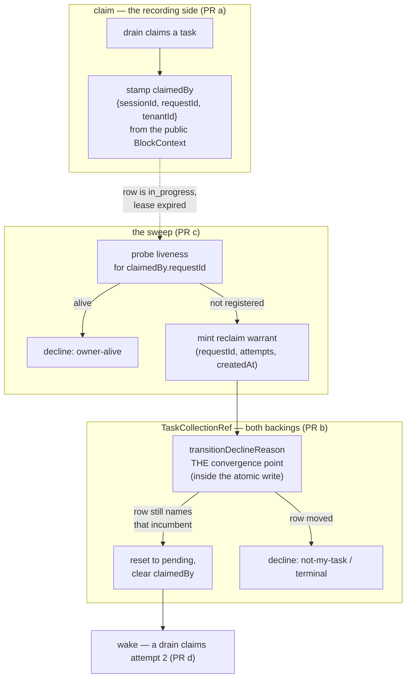

# FIX-1005: M2 is unowned — reclamation joined to execution liveness

> **Linear issue:** [FIX-1005](https://linear.app/fixpoint-labs/issue/FIX-1005) · **Epic:** [FIX-939](https://linear.app/fixpoint-labs/issue/FIX-939) — Durable jobs & detached-task substrate (M2 of 5; objective gate **APPROVED 2026-08-06**) · **Blocked by:** [FIX-981](https://linear.app/fixpoint-labs/issue/FIX-981) (In Development) · **Epic-spec:** `docs/specs/_epics/durable-jobs.md` on `epic/durable-jobs`
>
> Every `file:line` here was opened on `spec/FIX-1005`, branched from `origin/main` at **`86dfb70bc`**. That tree has FIX-981 **sub-PR a only** (#1077 — a falsification baseline of tests and a goal, no ticket implementation). **So this spec is written against FIX-981's *target* shape, not against `main`.** Where the two differ, §7 says which is which. FIX-982's spec was written against the pre-FIX-981 shape and carries a P0 defect for exactly this reason; this one does not repeat it.

## Part I — The Case *(for the human)*

### 1. Problem — why it matters, why now

A worker picks up a durable job, and its process dies — a deploy, a crash, a container
eviction. The job is now marked "someone is working on this," and nobody is. Nothing ever
notices, nothing takes it back, and no later worker will touch it: the queue only ever
looks at jobs marked "not started." The job is stranded permanently, and the only recovery
is a human editing storage by hand.

The recovery half of this was never built, and not by accident. The epic's milestone table
and [FIX-978](https://linear.app/fixpoint-labs/issue/FIX-978) each named the *other* as its
owner, so neither did it (epic finding N61). This issue is that half.

**Why now.** The epic's objective is gated on it — completion criterion 3 requires that a
stranded claim return to the queue *and a worker actually start on it again*, with no human
in the loop. And [FIX-982](https://linear.app/fixpoint-labs/issue/FIX-982), the epic's main
deliverable, now states in writing that a lost process strands a claimed task until this
issue ships.

**The trap, and it is the whole reason this issue is hard.** Every job carries a 30-second
lease. The obvious fix is to take back any job whose lease has expired. That is worse than
the bug. **Nothing renews a lease** — it is stamped once at claim time and never extended
— and a single model call routinely runs longer than 30 seconds. So *an expired lease is
the normal condition of a perfectly healthy worker.* Acting on expiry resets a live
worker's job, a second worker picks it up, and the model call and all its side effects run
twice. That trades a loud hang for silent duplicate execution, which is strictly worse.
The epic makes this binding on every issue in it (rule 1), and FIX-978 §3 measured it.

### 2. Solution in plain terms

**Record which execution is running a job, then ask whether that execution is still alive.
Take the job back only when the answer is a definite no.**

Today a job records who *should* do the work (`assignee`) and a timer (`leaseUntil`). It
records nothing about the execution that actually picked it up, so there is no one to ask
after. We add that fact at claim time. Recovery then stops being a guess about elapsed
time and becomes a question with a real answer: *is request R still running?* The engine
already answers it — every in-flight request heartbeats about every 10 seconds into a
registry built for exactly this.

That inverts the roles the issue was filed with. **Liveness decides; the lease only
narrows who to ask about.** A healthy worker is never reset no matter how long its model
call takes, because we never ask the timer. And death is noticed in about one heartbeat
instead of never.

**The reclaiming write is the delicate part**, and §6.1 is where to look. Every other
write to a job proves *"I own this."* A reclaim, by definition, writes to a row it does not
own — so it cannot prove ownership, and if we let it fake one, anyone can forge a takeover.
It instead proves something different and stronger: *"the current owner is provably gone,
and this row still names them."*

**Philosophy** — **tenet 5 (fix at the owning layer, convergence half):** reclamation's
precondition belongs at the one guard both backings already run inside their atomic write,
not at whichever caller happens to sweep. **Tenet 3 (earn every addition):** one nullable
field on the task row, no second liveness mechanism, no scheduler. **Tenet 7 (prove the
goal, not the mock):** the acceptance bar is a worker actually restarting on a real
process kill, not a status flip in a unit test.

### 3. Tradeoffs & alternatives

**The simpler approach, and why it loses: call `reclaim()` before each drain.** Three
lines, ships today. It is the failure §1 describes — it cannot tell gone from slow, so it
resets live workers. FIX-978 §3 establishes this with measurements and it is the epic's
rule 1. Not available at any price.

**The serious alternative: renew the lease.** Have the worker extend `leaseUntil` every few
seconds; expiry then genuinely means death, and the whole design stays inside
`@flow-state-dev/orchestration` with no package-boundary problem and no dependency on
[FIX-999](https://linear.app/fixpoint-labs/issue/FIX-999). This is the textbook answer and
it deserves a real hearing. **Rejected for coherence (tenet 1), not complexity:** it stands
up a *second* liveness timer for the same process, beside the request heartbeat that
already runs every 10s and is already swept. Two independent timers over one process can
disagree, and then neither is authoritative. FIX-978 §3 reached the same conclusion —
"rather than inventing a second notion of liveness." **It is the fallback if the seam
question in §12 OQ-1 goes the other way,** and it is cheap to switch to, because §6.2's
recorded fact is what both designs need.

**Where the genuine complexity is** — not the sweep, and not the write. Two things:

1. **"Not in the registry" is ambiguous.** Entries are removed on normal completion *and*
   by the existing stale-request sweeper, which deregisters what it marks interrupted
   (`engine/src/execution/request-recovery.ts:80`). Absence means "no live execution is
   registered," which is what we want — but only if the registry is one every claiming
   process shares.
2. **The in-memory registry is per-process.** Under two processes it reports every peer's
   healthy request as absent. Liveness-joined reclamation on that registry is rule 1's
   failure reached by a different road: confident, wrong, and duplicating work. §6.5 makes
   this a declared precondition rather than a footnote.

### 4. Focus practices (1–5)

1. **BP-031, and it is the spec's core (§6.1).** The reclaimer supplies the *target* of a
   takeover and never the *authority* for it. The authority is derived server-side from
   committed state plus a trusted probe. Anything else is a forgeable takeover.
2. **The epic's rule 1 as a design property, not a caution.** No code path in this change
   may reach "reclaim" from a clock alone. §10 pins it with a test that fails any
   implementation which does.
3. **BP-030.** `claimedBy` is a new nullable field on a persisted row. Dual-read legacy
   records; absent means "no coordinate," which §6.4 turns into a refusal to act rather
   than a guess.
4. **BP-035, where the second path is the *live* worker.** Every behaviour in §10 is
   asserted from the side of the worker that must **not** be disturbed.
5. **Refuse loudly.** A reclaim that declines says which precondition failed, on the same
   named-union surface FIX-981 establishes — never a silent no-op.

### 5. What using it looks like

**The fact recorded at claim time** — no caller writes it, and no model ever sees it:

```ts
const task = await tasks.claim("worker-1");
// task.claimedBy === { sessionId: "sess_42", requestId: "req_88", tenantId: "acme" }
```

**A dead worker's task coming back** — the sweep, and the outcome that matters:

```
before  request req_88 held task "a"; its process was killed 40s ago
        registry.get("req_88") → undefined   (no live execution)
        task "a" → status in_progress, claimedBy.requestId "req_88"

after   task "a" → status pending, claimedBy cleared, attempts unchanged
        a later drain claims it as attempt 2, and a worker starts on it
```

**The live worker that must not be touched** — the case the design exists to protect:

```
worker holds task "b", 4 minutes into one model call, lease expired 3.5 minutes ago
registry.get("req_91") → { lastHeartbeatAt: now - 6s }   (alive)
→ reclaim declines: { reason: "owner-alive" }
→ nothing written; the worker settles its own task normally
```

### 6. Decisions & rules — the sign-off surface

1. **A reclaim's authority is a liveness verdict, not a claim ticket. It presents a
   server-derived *reclaim warrant* naming the incumbent it displaces, and the guard
   accepts it only while the row still names that incumbent.**
   *Rejected:* **minting the incumbent's ticket from the row being written** — it matches
   by construction, so it is a tautology that checks nothing while looking like a fence,
   and any caller could mint the same one. Also rejected: **riding FIX-981's Decision 4
   no-ticket posture** (a call presenting no ticket is unguarded), which is *true* of
   reclaim but leaves it with no precondition whatsoever — the blind pre-drain reclaim of
   §3 wearing a new name.
   *Locks in:* reclaim stops being an ownership-*proving* write and becomes an
   ownership-*transferring* one, with its own precondition and its own named refusal
   (`owner-alive`). The caller names which board and which row; it can never supply the
   answer to "is the owner dead?"

2. **The task row records `claimedBy` — the execution coordinate — as fact at claim time.**
   Set by the substrate inside the claim write, cleared on settle, never written by a
   caller. Sourced from the public `BlockContext` the collection already holds
   (`ctx.request.identity.id`, `ctx.session.identity.id`, and `identity.tenantId`), so
   **recording it needs no new seam and no engine dependency.**
   *Rejected:* reusing `assignee` (it is the user-set routing key, and `reclaim` already
   preserves it deliberately); an opaque token (nothing can look it up).
   *Locks in:* **FIX-1005 owns this schema change and FIX-982 consumes it** — FIX-982's
   §12.4 asks for exactly this, and two issues writing one field is a collision otherwise.
   It is a *fact* (where attempt N ran), not *policy* (where work should run), so it does
   not reopen the epic's OQ-B.

3. **Liveness is the only thing that authorizes a reclaim. The lease narrows the candidate
   set and never authorizes anything.**
   *Rejected — and this is a deliberate departure from the issue's proposed direction:*
   "the lease still catches the case where the registry is unreachable or wrong." An
   unreachable registry is not evidence of death; it is absence of evidence. Reclaiming on
   it is duplicate execution at exactly the moment we are least able to detect it.
   *Locks in:* when liveness cannot be determined, **we do not reclaim.** The failure mode
   is a hang — which FIX-978 already makes loud and diagnosable — and that is the correct
   trade under rule 1. The lease survives only as a cheap pre-filter that shrinks the set
   of rows worth probing.

4. **A task with no `claimedBy` is never reclaimed by this path.**
   *Rejected:* backfilling a coordinate, or falling back to lease-only for legacy rows
   (Decision 3 forbids it).
   *Locks in:* rows claimed before the upgrade, and rows never claimed at all, are both
   invisible to the sweep — honestly and by construction (BP-030). Counting begins at
   upgrade, the same posture `retryLedger` already takes.

5. **Liveness-joined reclamation requires a registry shared by every process that can claim
   the board, and is off by default.**
   *Rejected:* on by default, or inferring shared-ness at runtime (nothing reports it).
   *Locks in:* with the flag off, `reclaim` behaves exactly as it does today — the
   off-state BP-035 asks for. Turning it on against the in-memory (per-process) registry in
   a multi-process deployment is rule 1's failure by another road, so the precondition is
   documented at the surface that enables it, not in a release note.

6. **The liveness probe runs outside the atomic write; the atomic write re-verifies the
   coordinate it was told about.**
   *Rejected:* probing inside the CAS mutator (it is synchronous, and an async probe inside
   a retry loop would re-probe per attempt).
   *Locks in:* the sequence is probe → CAS conditional on the row still carrying the same
   `(claimedBy.requestId, attempts, createdAt)`. If the row moved under us — re-claimed,
   settled, cancelled — the write declines. This is what makes a check-then-act sequence
   safe without holding anything.

7. **Scope: `in_progress`-after-process-loss only. `pending`-with-no-live-request is
   FIX-982's.**
   *Rejected:* one sweep covering both. They need different evidence and different
   recovery — a never-claimed row has no coordinate to probe and needs a re-dispatch
   envelope this issue does not build.
   *Locks in:* the boundary is stated identically from both sides — FIX-982's Decision 9
   says its reconciler "covers `pending`-with-no-live-request; `in_progress`-after-process-loss
   is FIX-1005's." Neither subsumes the other and neither gaps.

8. **The build ships as four PRs, and the field lands first, alone** (§8).
   *Rejected:* fencing first. The dispatch that commissioned this spec assumed FIX-982 was
   waiting on the fenced-`reclaim` conversion; **its approved spec says otherwise** — it
   drops the FIX-978 edge as gating nothing and states that nothing in its build plan
   depends on FIX-1005 landing. What it *does* consume is `claimedBy` (§12.4). Sequencing
   the field first unblocks FIX-982 for real; sequencing the fencing first unblocks nothing.

**Non-goals** — lease renewal (§3, unless OQ-1 flips); the `pending` reconciler and the
re-dispatch envelope (FIX-982); a scheduler or cron loop (FSD supplies none, by
architecture); cap admission (FIX-981 Decision 5); any change to what `claim` considers
eligible; and any re-litigation of FIX-981's ticket, which this consumes unchanged.

**Size:** Large (multi-package, multi-PR — see §8; the shape is Decision 8).

---

## Part II — The Build Plan *(for the implementing agent)*

### 7. Technical design



- **`@flow-state-dev/orchestration`** owns almost all of it. `claimedBy` joins the `Task`
  schema beside `retryLedger`, which is the precedent to copy: optional, nested,
  `== null`-guarded, explicitly not backfilled.
- **The guard, one place.** `reclaim` today hand-rolls its precondition twice inline —
  once on the mirror read and again inside the CAS (`tasks/collection/resource-backed.ts:660-676`,
  and its twin in `sequencer-backed.ts:552-590`). Those bespoke checks are what "convert
  `reclaim` to the fenced primitive" means: route it through `transitionDeclineReason`
  (`tasks/collection/internal.ts:298`), which both backings already run inside their atomic
  write, and give it a named refusal instead of a silent `continue`.
- **The refusal is a named union member.** `TaskWriteDeclineReason` gains **`owner-alive`**.
  Post-FIX-981 the precedence is `terminal → not-my-task → disallowed → lost-claim`;
  `owner-alive` sits with the target-binding arm, ahead of the `ifAllowed` arms, because a
  live owner is a fact about the row and not about the transition's legality.
- **The liveness read is the only thing that crosses a package boundary.**
  `ActiveRequestRegistry` (`engine/src/stores/types.ts:567-585`) is engine-only and
  `orchestration` has `engine` as a devDependency. This needs FIX-999's seam — see §12
  OQ-1, which is the one genuinely unsettled thing in this spec.
- **Untouched:** `claim`'s eligibility rules, the task status state machine, `assignee`
  (which `reclaim` preserves on purpose), every store adapter, and the item/streaming layer.

**The precedent to mirror, not reinvent.** The engine already runs exactly this pattern one
layer down: `createStaleRequestSweeper` reads the same registry on an interval, applies a
threshold, and hands stale entries to `detectInterruptedRequests`
(`engine/src/execution/stale-request-sweeper.ts`). It also carries the tuning rule this
sweep inherits — **a threshold below 2× the heartbeat interval fights healthy heartbeats
and produces false positives**, which is rule 1's failure in miniature. Reuse the shape and
the rule; do not stand up a second cadence concept.

**Sketch — pseudocode. Illustrative, not the contract. React to the shape.**

```
sweep(board):
    candidates ← rows where status = in_progress
                   and claimedBy is present          ← decision 4
                   and leaseUntil < now              ← cheap pre-filter only (decision 3)

    for each candidate:
        verdict ← liveness.probe(candidate.claimedBy.requestId)
        if verdict is "alive" or "unknown":           ← decision 3: unknown ⇒ do not act
            continue
        reclaim(candidate.id, warrant = {
            requestId:  candidate.claimedBy.requestId,
            attempt:    candidate.attempts,
            createdAt:  candidate.createdAt,
        })

at the one guard, inside the atomic write:
    if a reclaim warrant was presented:
        if row is terminal:                      decline "terminal"
        if row.claimedBy.requestId ≠ warrant.requestId
           or row.attempts ≠ warrant.attempt
           or row.createdAt ≠ warrant.createdAt: decline "not-my-task"   ← the row moved
        otherwise: reset to pending, clear claimedBy, leave attempts alone
```

What this asks a reviewer: *is the warrant's validity decided at the guard against
committed state, rather than trusted from the sweeper that assembled it?* Deciding it in
the sweeper would read the row a second time outside the lock — the check-then-act race
FIX-976 and FIX-981 both moved guards inside the CAS to eliminate.

### 8. Implementation sequence

1. **Record the coordinate.** Add `claimedBy` to the `Task` schema; populate it in
   `applyClaimToTask` from the collection's context; clear it on every settle path.
   *Test:* set on claim, cleared on each terminal transition, absent on legacy rows read
   back. *Depends on:* nothing. *(Decision 2.)*
2. **Fence `reclaim`.** Add `owner-alive` to `TaskWriteDeclineReason`; route both backings'
   `reclaim` through `transitionDeclineReason` with the warrant; **remove** the two
   hand-rolled inline precondition checks. Still no automatic caller. *Test:* the warrant
   refusals, from both backings. *Depends on:* 1, and FIX-981's guard landing.
   *(Decisions 1, 6.)*
3. **Join it to liveness.** The probe port, its wiring through FIX-999's seam, and the
   sweep. *Test:* §10's live-worker and dead-worker behaviours. *Depends on:* 2, FIX-999.
   *(Decisions 3, 5.)*
4. **Redelivery.** The wake so a reclaimed row is actually picked up again, and the goal
   check. *Depends on:* 3, and FIX-982's executor. *(Decision 7.)*

**PR plan.** Independent = no unmet `depends_on`.

| sub-PR | deliverables | depends_on |
|---|---|---|
| a | `claimedBy` on the schema, recorded at claim, cleared on settle (step 1) | — |
| b | fenced `reclaim` + `owner-alive`, bespoke checks removed (step 2) | a |
| c | liveness port, FIX-999 wiring, the sweep (step 3) | b |
| d | redelivery wake + criterion-3 goal check (step 4) | c |

**PR a is deliberately alone and first** — it is what FIX-982 consumes (Decision 8), it
needs neither FIX-981 nor FIX-999, and it can land while both are still moving.

### 9. Edge cases & error handling

| Case | Expected |
|---|---|
| Task cancelled in the gap between probe and CAS | Row is terminal → decline `terminal`. A cancelled task is never resurrected to `pending`. |
| Task re-claimed in the gap (attempt advanced) | `attempts` ≠ warrant → decline `not-my-task`. The new owner is untouched. |
| Two sweepers race the same row | CAS; one wins, the other declines `not-my-task`. Idempotent for free. |
| Row deleted and recreated under the same id (ABA) | `createdAt` ≠ warrant → decline. Same closure FIX-981 adopted for its ticket. |
| Registry unreachable / probe throws | Verdict `unknown` → **do not reclaim** (Decision 3). Log; never fall through to the lease. |
| `claimedBy` absent (legacy or never claimed) | Not a candidate (Decision 4). Never-claimed `pending` rows are FIX-982's reconciler. |
| Multi-tenant: `requestId` from another tenant | Compare `claimedBy.tenantId` against the board's own scope before probing; a coordinate that does not match is not probed. |
| Flag off (the default) | `reclaim` behaves byte for byte as today: manual, lease-only, no liveness read. |
| Worker resumes after its task was reclaimed | Its own write-back is refused by FIX-981's ticket guard — `attempts` has advanced. Unchanged by this issue; asserted here so the pair is pinned. |

**Taxonomy:** every decline is a value, never a throw — the FIX-976 contract. A probe
failure is non-fatal and degrades to "do nothing." The only fatal paths are the ones that
already throw (missing task, store failure, CAS exhaustion).

### 10. Testing strategy

**Goal:** the epic's criterion 3, and it is deliberately the strict form. Start a real
board, let a worker claim a task in a separate process, **kill that process**, and assert a
worker *starts on the task again* with no human and no manual dispatch. Asserting only the
status flip would test the write and nothing about liveness — the epic says so explicitly.
`goals/durable-reclamation/dead-worker-task-redelivered/`, real model.

**CI specs** (behaviours, not test names):

- **One behaviour per decision in §6**, in observable terms.
- **The second path is the live worker** (BP-035): a task whose lease expired minutes ago
  but whose request is still heartbeating is **not** reclaimed — at *any* lease age. This
  is the test that fails an implementation which quietly reintroduces expiry-as-evidence,
  and it is the most important one in the suite.
- **The unknown verdict is not the dead verdict.** Probe throws, or returns no entry on an
  unshared registry → no write. An implementation collapsing `unknown` into `dead` passes a
  naive suite and duplicates work in production.
- **Ordering matters in the sweep tests.** Seed the task, *then* start the sweep, then kill
  — a suite that seeds after starting can pass against an implementation holding a stale
  ref, the same trap FIX-982's §10.7 names.
- **What must not change:** with the flag off, every existing `reclaim` test passes
  unmodified.

**Discipline:** `tdd`. The seam is `TaskCollectionRef` in `@flow-state-dev/orchestration`,
reachable from a vitest spec with the mock context and a stub liveness port — so every
behaviour above is a tracer bullet with no process kill involved. The process kill lives
only in the goal check.

### 11. Documentation plan

- **EXTEND** `docs/architecture/orchestration.md` (or the task-board architecture doc that
  owns the claim lifecycle) — a subsection on reclamation: what `claimedBy` records, that
  liveness and not the lease decides, and the shared-registry precondition. This is the
  internal contract page; it is load-bearing for anyone who later touches `claim`.
- **EXTEND** `packages/orchestration/README.md` — the `reclaim` entry gains the
  precondition and the default-off note.
- **CREATE** nothing in `apps/docs` **in PRs a–c.** Reclamation is not an app-author
  surface until redelivery works end to end; a user-facing page before PR d would document
  a half-mechanism. PR d adds one section to the durable-jobs guide FIX-982 creates.
  *Voice risk:* no `FIX-` ids under `apps/docs`; describe the behaviour, never the bug or
  the milestone that prompted it.
- **Changeset:** `minor` on PR b (`TaskWriteDeclineReason` gains a member — a union
  widening callers may switch on) and PR a (`Task` gains a field); PR c/d per surface.
  Never `patch` on the grounds that it "only refuses bad writes."

### 12. Dependencies, open questions & follow-ups

**Blockers — must land first.**

| Issue | What this consumes | Settled enough to build against? |
|---|---|---|
| **FIX-981** | The guard convergence point, the `TaskWriteDeclineReason` union, and the ticket's ABA-closing `createdAt`. | **Yes for PR b** — Spec Approved, sub-PR a merged (#1077). `expectAttempt` is **removed** by it; nothing here names it. |
| **FIX-999** | A liveness verb reachable from `orchestration`. | **No — see OQ-1.** This is the one genuinely unsettled dependency. |
| **FIX-982** | The executor that makes redelivery observable (PR d only). | Yes — Spec Approved. PRs a–c do not depend on it. |

**Open questions — these need an answer before PR c.**

**OQ-1 (blocking PR c). FIX-999 as specced does not carry a liveness verb, and both this
issue and FIX-982 need one.** Its Decision 3 ships exactly two services — child-session
get-or-create, and request dispatch — and its Decision 1 forbids handles crossing the seam,
so `stores.activeRequests` cannot simply be exposed. Yet FIX-982's Decision 9 says its
reconciler reads `ActiveRequestRegistry.listAll()`. Three options:

  1. **FIX-999 adds a third service** — a narrow liveness probe (`isAlive(requestId)`, or a
     stale-set read), identity-bound like the other two. Cleanest, and it strengthens
     FIX-999's own four-consumer argument, which its Decision 5 flags as the call most worth
     disagreeing with. **Recommended.**
  2. **Fall back to lease renewal** (§3) and drop the engine dependency entirely. Costs a
     second liveness timer and the coherence objection; buys total independence.
  3. Some other seam. Not proposed here — inventing a parallel mechanism is what the epic
     and FIX-999 both exist to prevent.

**OQ-2 (non-blocking, worth an answer before PR c). One sweep or two?** FIX-982's Decision 9
builds a `pending` reconciler as a drain step, already walking the board and already reading
liveness, with a named scale breakpoint (its scan is O(global in-flight requests)). This
issue's sweep walks the same board for `in_progress` rows and needs the same liveness
snapshot. Landing them as two independent passes doubles a scan that is already the
expensive one. **Recommendation:** PR c adds an `in_progress` arm to the sweep frame
FIX-982 builds rather than standing up a sibling. That couples the two and is worth saying
out loud, which is why it is a question and not a decision.

**Corrections owed elsewhere — recorded here, not edited by this spec.** The epic's C3 row
was corrected (N71) to name FIX-1005 as owner of liveness-joined reclamation with FIX-978 as
prerequisite. Four surfaces still carry the old answer, and this is the sixth-plus instance
of the epic's own recurring "a decision moved and its restatements did not" class (tenet 5,
second half):

- `docs/specs/FIX-981.md:402` (on `spec/FIX-981`) — write-path row 14 reads *"Out of scope —
  FIX-978/FIX-1005."* Should read **FIX-1005**.
- `docs/specs/FIX-981.md:641` — already correct (*"Owned by FIX-1005"*); noted so the pair
  is seen to disagree with itself in one document.
- `docs/specs/_epics/durable-jobs.md:836` (on `epic/durable-jobs`) — §7's write-path table
  row 14 reads *"**FIX-978's**, per Decision 1."* Should read **FIX-1005**.
- `docs/specs/_epics/durable-jobs.md` Decision 6 — *"Binding on FIX-982: name the
  reclamation wake explicitly"* and its "hooking onto FIX-978's reclaim/sweeper pass"
  option both predate the C3 correction. The **reclamation** wake is this issue's (criterion
  3 requires a worker to restart); the **admission** wake stays FIX-982's.

**A citation correction for this spec's own commissioning brief.** The "an expired lease is
not evidence of abandonment" constraint is the epic's **binding rule 1**, argued in its
**Decision 1** — not Decision 3, which is about board lifetime and collection scope. The
substance is unchanged and is honoured throughout (§1, §3, §6.3, §10); only the citation
moved. Flagged so the wrong pointer does not propagate further.

**[FIX-978](https://linear.app/fixpoint-labs/issue/FIX-978) is frozen and was not touched.**
Its spec PR (#990, labels `spec` + `on hold`) is stopped by the repo owner pending FIX-989.
Its §3 is cited here as the measured source for the lease argument; nothing on that branch
was modified.

**Follow-ups (flagged, not built):** a narrower liveness read bounded by board size rather
than fleet concurrency — the same follow-up FIX-982 books against its Decision 9 scale
breakpoint, and the two should be taken together once OQ-2 is answered.

---

## Spec evolution *(the change story, not an audit log)*

- **Spec drafted** — Framed the issue around the one question that makes it hard: a reclaim
  writes to a row it does not own, so it cannot prove ownership and must not be allowed to
  fake it. Chose a server-derived **reclaim warrant** validated at FIX-981's existing guard
  over minting the incumbent's ticket (tautological) or riding the no-ticket unguarded
  posture (no precondition at all). Took a harder line than the issue proposed on the lease:
  it narrows the candidate set and **never** authorizes a reclaim, so an unreachable
  registry produces a hang rather than duplicate execution. Recorded `claimedBy` from the
  public `BlockContext`, which keeps the recording half free of any engine dependency and
  lets it land first, alone — **correcting the commissioning brief's sequencing**, since
  FIX-982's approved spec consumes that field and explicitly does *not* depend on the
  fenced-`reclaim` conversion. Surfaced one blocking unknown: FIX-999 as specced ships no
  liveness verb, and FIX-982's reconciler needs the same one.
