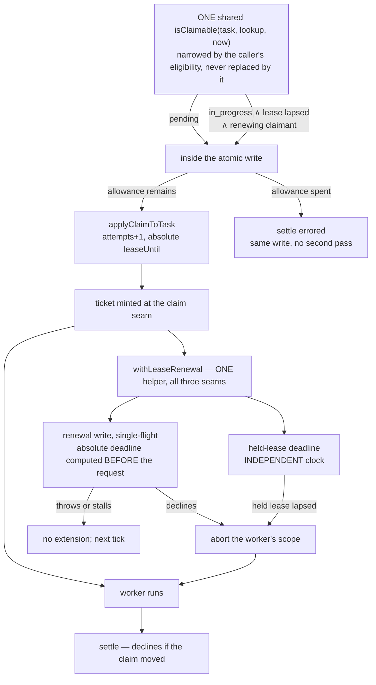

# FIX-1005: Reclamation joined to execution liveness — Implementation Spec

## Part I — The Case *(for the human)*

### 1. Problem — why it matters, why now

A worker picks up a durable job and its process dies — a deploy, a crash, an eviction.
The job stays marked "someone is working on this," and nobody is. No later worker will
ever touch it, because the queue only looks at jobs marked "not started." The job is
stranded permanently and the only recovery is a human editing storage by hand.

**Why now.** This is the epic's milestone 2 and its objective gate is held on it: a
stranded job must return to the queue *and a worker must actually start on it again*,
with no human in the loop. Nothing else in the epic delivers that.

**The trap, and it is the whole reason this is hard.** Every job carries a 30-second
lease, so the obvious fix is to take back anything whose lease expired. That is worse
than the bug. **Nothing renews a lease** — it is stamped once at claim time and never
extended — and a single model call routinely runs longer than 30 seconds. So an expired
lease is the *normal* condition of a perfectly healthy worker. Acting on it resets a live
worker's job, a second worker picks it up, and the model call and every side effect run
twice. That trades a loud hang for silent duplicate execution, which is strictly worse.

### 2. Solution in plain terms

**Make the lease tell the truth: have the worker keep it alive while it works.**

A worker that is running renews its own job's lease every so often. It is the only party
that can, and it is renewing a row it already proved it owns. Once that is true, an
expired lease stops being ambiguous — it means no live worker is holding this job — and
the queue can simply treat such a job as available again. Recovery needs no sweeper, no
timer to tune, and no second system to ask.

Two things follow. A worker that discovers it no longer holds its job stops immediately
rather than burning tokens on work it can no longer record. And the time a crashed job
sits stranded becomes a number we choose — the lease — instead of forever.

**Philosophy** — **tenet 2 (composition over features):** the board already holds the
lease, the ownership ticket, and the atomic write; renewal composes those three rather
than adding a liveness subsystem beside them. **Tenet 5 (fix at the owning layer):**
claimability has one convergence point and recovery goes there, so every dispatcher gets
it without knowing it exists. **Tenet 3 (earn every addition):** one write verb, one
existing knob, no new configuration.

### 3. Tradeoffs & alternatives

**The alternative this replaces: ask a registry whether the worker's request is alive.**
That was the previous spec's mechanism and it is rejected on evidence. Absence from that
registry has several indistinguishable causes, one of them the recovery sweeper deleting
the entry itself, so the design needed a growing enablement gate to say when the signal
could be believed at all. The gate is now written down in FIX-999 and has **four arms**,
and it refuses the signal on the default in-memory deployment, on any deployment with
sweeping turned off, and on any deployment that dispatches to an external worker
(`spec/FIX-999.md` §6 Decision 3, on `spec/FIX-999-respec`). Renewal needs none of that:
the signal rides the same store the board already needs to be durable at all, so it works
wherever a durable board works.

**The simpler approach, and why it loses: call `reclaim()` before each drain.** Three
lines, ships today. It is exactly the trap in §1 — it cannot tell gone from slow. That is
the epic's binding rule 1 and it is not available at any price.

**Where the genuine complexity is** — not the renewal write. It is being honest about
what renewal does and does not prove. A process that is *paused* rather than dead — a
suspended VM, a long stop-the-world stall — also stops renewing, so its job can be taken
while it is still, eventually, going to keep running. Its write-back is refused, but its
side effects already happened. §6 decision 9 states that plainly rather than designing
around it.

### 4. Focus practices (1–5)

1. **One convergence point for claimability (tenet 5), and there are three copies of it
   today.** The claim path (`isReady`), the board's wake predicate, and the ready-task
   selector each decide independently what is claimable. The change is to make them share
   one predicate, not to widen three — move a subset and a board recovers rows it never
   wakes for, or wakes for work it will not take.
2. **BP-035, and the second path is the *live* worker.** Every behaviour worth testing is
   asserted from the side of the worker that must **not** be disturbed — including the
   worker whose store has stopped answering, which is the sharpest one.
3. **BP-030 in both directions, and it is what makes the upgrade safe.** Reading: recovery
   keys off a fact recorded at claim time, so a row persisted before the upgrade — or held
   by an old process mid-deploy — is invisible to it; absent means "not mine to recover,"
   never "abandoned." Writing: an old process's normalized patch **strips** a field it does
   not know, so the fact has to be re-asserted rather than written once.
4. **Earn the addition (tenet 3) — and the honest count, since it moved twice.** One write
   verb, one persisted fact, one `core` abort primitive; **no new knob and no new
   configuration surface.** Round 2 took two things *out* — the attempts arm in the shared
   predicate, and a separate cadence floor — and declined to add a board-level lease option
   or a three-valued classifier. Each survivor exists because a specific failure has no
   other owner.
5. **A predicate answers one question.** Admission ("should the claim path look at this
   row?") and disposition ("what should happen to it?") are different questions with
   different readers, and folding the second into the first is what produced the round-1
   contradiction. The predicate admits; the atomic write decides.

### 5. What using it looks like

**A board recovers on its own** — no new call, no configuration:

```ts
const board = taskBoard({ collection: durableTasks, workers, concurrency: 4 });
// Worker on host A claims task "t1" and its process is killed.
// Any drain, on any host, claims "t1" again once its lease lapses — as attempt 2.
```

**The lease is the recovery-latency knob, and it is the one that already exists** —
`ClaimOptions.leaseDurationMs`, set by whatever claims. There is no board-level lease
option and this spec does not add one; the renewal helper reads the lease off the row the
claim committed, so it is always working from the real value rather than a configured one:

```ts
// Claiming by hand gets you no renewal — you hold the task, so you renew it.
const task = await collection.claim("worker-1", { leaseDurationMs: 120_000 });
// ...or size the lease to cover the whole job and accept that nobody takes it
// back until then.
```

**Before / after, for a worker whose process dies mid-task:**

```
before  t1 → in_progress forever; claim() never considers it; only a human clears it
after   t1 → in_progress, lease lapses, next claim() takes it as attempt 2 and runs it
```

**If you implement `TaskCollectionRef` yourself**, the obligation is *two*-sided and the
second half is the one that is easy to miss. You implement the renewal write, fenced by
the same claim ticket every other worker-callable write already presents — **and your own
`claim()` must consider expired rows**, fence the takeover on the attempt, and settle a row
whose abandonment allowance is spent instead of running it. Widening the built-in predicate
cannot reach your scan. A ref that implements only the renewal write compiles, renews
correctly, and silently never recovers anything.

### 6. Decisions & rules — the sign-off surface

1. **A worker renews the lease on the row it holds, fenced by the claim ticket it already
   carries. Renewal is substrate-only and is never a model-facing tool.**
   *Rejected:* asking the engine's request registry whether the worker is alive (§3); a
   `renewLease` entry on `taskTools`.
   *Locks in:* the board is its own liveness substrate. No second store is consulted about
   work, recovery is available in every deployment a durable board is available in — and an
   agent cannot extend its own deadline, because renewal is bookkeeping about a process
   being alive and a model asking for more time is not evidence of that.

2. **Recovery happens inside `claim`, not in a sweeper.** An `in_progress` row whose lease
   has lapsed becomes a candidate, and the claim's atomic write resets and re-claims it in
   one step.
   *Rejected:* a periodic sweep pass, and sharing a sweep frame with FIX-982's reconciler.
   *Locks in:* nothing to schedule and no cadence to tune — but recovery only happens where
   something is asking for work. A board nobody drains stays stranded, which is what
   happens today and costs nothing, because nothing would run the task anyway.

3. **Only a row claimed by a renewing claimant is ever recovered, and every renewal
   re-asserts that fact.** The claim write records it; the renewal write writes it again.
   *Rejected:* treating any lapsed lease as abandoned — unsafe for exactly the window a
   **rolling deploy** creates, where an old-version worker is executing a task it cannot
   renew. Also rejected: a rollout fence or a documented drain-before-upgrade, which make a
   correctness property depend on an operator following a procedure. **And rejected: writing
   the fact once at claim time** — an old process applying a permitted `setPriority` /
   `addLabel` / `patchMetadata` write normalizes the row through *its* `taskSchema`, and a
   Zod object strips a field it does not know, so a marker written once is silently
   removable and the row becomes permanently unrecoverable.
   *Locks in:* the upgrade is **self-healing and needs no operational step.** Re-asserting on
   renewal costs nothing — that write already happens and already touches this row — and it
   closes the stripping hole with no new storage location. The stripped window is harmless
   by construction: recovery needs a *lapsed* lease, and a row being renewed does not have
   one. The cost stays as it was: a task held by an old process across the deploy remains
   stranded exactly as today, and rows persisted before the upgrade are never recovered —
   the same posture `retryLedger` takes (`internal.ts:116-123`).

4. **Recovery is bounded by an abandonment allowance, consulted inside the claim write. A
   row whose allowance is spent is settled `errored` in that same write rather than
   recovered.** The allowance is *not* read from the claimability predicate — the predicate
   admits the row and the write decides what to do with it.
   *Rejected — and this reverses a round-1 fold of mine:* putting an "attempts remain" arm
   in the shared predicate. It was wrong twice. It **breaks the headline case**, because
   `maxAttempts` is optional and `shouldRetryOnFail` returns `false` when it is absent
   (`internal.ts:89-92`), so an ordinary task is already "exhausted" after attempt 1 and
   would be terminalized instead of recovered — the feature off by default unless every
   caller opts into retries. And it **contradicted itself**, because both backings filter
   candidates through eligibility *before* the atomic write
   (`resource-backed.ts:528`, `sequencer-backed.ts:423`), so a row the predicate excluded
   could never reach the settlement branch that was supposed to terminalize it.
   *Also rejected:* a three-valued classifier (`claim | terminalize-exhausted | skip`). Once
   the allowance moves inside the write, one boolean is enough — and `select-next-ready-task`
   is a **preview** that does not dispatch (`:36-54`), so admitting a row it will settle
   rather than run is correct rather than hazardous.
   *Locks in:* the deadlock this closes stays closed — no row is ever left `in_progress`
   with nobody on it, because `inFlightCount` counts that as active
   (`task-board/shared.ts:70-76`) and `boardQuiescence` would then never report `drained` or
   `blocked` (`quiescence.ts:48-62`). The settlement reuses the existing terminal path
   (`in_progress → errored` is already legal, `task-status.ts:33`). **What the allowance *is*
   is the owner's call — OQ-2 in §12 — and this spec deliberately does not pick it.** Both
   candidate policies drop into the same seam with no other change.

5. **A worker is stopped by an independent deadline, not by a branch inside the renewal
   write — and every renewal writes an absolute deadline computed *before* the request goes
   out.**
   *Rejected:* checking the lease as a step after the renewal write in the same tick. **A
   store whose write neither returns nor throws never reaches that check**, so the worker
   keeps running past the moment another drain takes the row. **Also rejected: writing
   `now + span` when the store responds, plus a guard refusing an already-expired held
   lease.** A renewal that stalls past the deadline and *then* commits would extend the
   lease of a worker the helper has already aborted — advertising liveness that no longer
   exists and delaying recovery until the stalled write happens to land. Computing the
   deadline before the request means a late write lands with an already-past value and the
   row is simply lapsed, so **the guard is deleted rather than added.**
   *Locks in:* the abort obligation is honoured against a wall clock a hung dependency
   cannot hold up, and a slow store can neither defeat the abort nor resurrect a dead lease.
   A renewal in flight when the next tick fires is skipped rather than stacked.

6. **One knob: `leaseDurationMs`, validated with a minimum. Everything else is derived from
   the row the claim committed.**
   *Rejected:* a separate renewal-interval option; a board-level lease option
   (`TaskBoardConfig` has none today, and adding one would mean the helper agrees with the
   dispatcher about a value instead of reading the committed truth); accepting the knob
   unvalidated, since `ClaimOptions.leaseDurationMs` is a bare `number`
   (`collection/types.ts:104`) flowing straight into `now + leaseDurationMs`
   (`internal.ts:439`). **And rejected: a separate cadence floor** — one minimum on the
   *lease* subsumes it, in the caller's own units, so there is one number to justify instead
   of two.
   *Locks in:* a caller states one thing — how long they may be gone before the work is
   taken back — and cannot configure a margin that cannot work, because a lease below the
   minimum is refused rather than normalized into a surprise. The helper is correct by
   construction rather than by agreement: it reads its span and its deadline off the
   committed row, so it can never hold a deadline past the real lease.

7. **A caller's `eligibility` predicate *narrows* the substrate's candidate set; it does not
   replace it.**
   *Rejected:* today's replacement semantics, which are documented
   (`apps/docs/docs/orchestration/task-substrate.md:279-287`) and which make recovery
   unreachable for any dispatcher that asserts `status === "pending"` — including the recipe
   our own docs recommend. Widening the built-in predicate cannot reach a caller's, so
   without this the substrate's newest invariant is the one most easily opted out of by
   accident.
   *Locks in:* recovery is a substrate invariant composed *with* caller filtering rather
   than at its mercy, and the five built-in dispatchers get **simpler** — each drops its
   `isReady(...)` conjunct and its import (`priority.ts:21`, `topological.ts:16`,
   `event.ts:40`, `classifier.ts:40,47`). Cost, stated: a caller who deliberately narrows on
   `status` opts out of recovery for that dispatcher, which is today's behaviour rather than
   a new failure, and the documented recipe changes (§11).

8. **This ships as one PR, and the halves are not separable.**
   *Rejected:* landing recovery-eligibility and renewal in sequence.
   *Locks in:* eligibility without renewal is exactly the trap in §1 with a wider blast
   radius than the defect that exists today. There is no intermediate state anyone should
   run. The stop-condition work (decision 5) is inside the same PR for the same reason.

9. **What we promise is bounded, and the bound is the lease: at-most-once *settlement*,
   at-least-once *side effects*.**
   *Rejected:* claiming detection "within one heartbeat" — the superseded mechanism's
   promise, which its own enablement gate could not deliver.
   *Locks in:* a crashed job is stranded for up to one lease, and a *paused* process can
   still have its job taken and later keep running. Its write is refused, its side effects
   are not. Anything stronger requires the work itself to be idempotent, which is the
   caller's property and not a timer we can tune.

**Non-goals** — the never-claimed `pending` reconciler and any wake for a board with no
live drain (FIX-982's); task-scoped `reclaim()` (FIX-1023); any change to `reclaim()`'s
own contract; recording an execution coordinate on the task row (FIX-982 P2); any read of
the engine's request registry, and therefore any dependency on FIX-999.

**Size:** Medium (multi-file, one PR, ~300 LOC plus tests).

---

## Part II — The Build Plan *(for the implementing agent)*

Every `file:line` below was read on this branch, cut from `origin/main` at `4da657c20`.

### 7. Technical design

**No store contract changes**, and the atomic write this needs already exists — `claim` runs
its eligibility re-check inside `updateStateWith` today
(`tasks/collection/resource-backed.ts:536-546`). **Three packages are in scope**, and an
earlier draft of this line wrongly said none were: `orchestration` owns almost all of it,
`patterns` holds the third renewal seam, and `core` owns the cancellation primitive
decision 5 needs — see "the abort has no public seam today", below.

**Admission and disposition are separate, and that separation is the round-2 correction.**
The shared predicate says only *"the claim path should look at this row."* What to **do**
with an admitted row is decided inside the atomic write, where the allowance can be read
against committed state. A predicate that also encoded the disposition excluded the very
rows the write was supposed to settle.



- **The lease is written in exactly one place today.** `applyClaimToTask`
  (`internal.ts:429-442`) is the only writer that sets `leaseUntil` to a future value;
  every other write clears it (`resource-backed.ts:565,604,620,661,676-677,716`,
  `sequencer-backed.ts:451,488,504,548,563-564,595`). The renewal write is the second, and
  it must set nothing else — not `attempts`, not `status`, not `updatedAt` semantics that
  a consumer reads as progress.
- **The renewal write is fenced by FIX-981's shipped guard, not by a new one.**
  `transitionDeclineReason` (`internal.ts:349-365`) is the one convergence point for the
  ownership guard and both backings already run it inside their atomic write. Renewal is
  a worker-callable write on a row the worker claimed, so it presents the same ticket and
  takes the same four-reason precedence — `terminal → not-my-task → disallowed →
  lost-claim` (`collection/types.ts:44-48`). No new decline reason is needed.
- **The renewal write carries two fields, not one: the absolute deadline, and the
  renewing-claimant fact re-asserted.** The second is what closes the schema-stripping hole
  in decision 3 — an old process's permitted patch normalizes the row through its own
  `taskSchema`, and a Zod object drops a key it does not know. Re-asserting costs nothing
  because this write already touches this row.
- **Claimability has THREE producers today, and the fix is one shared predicate — not three
  parallel edits.** Extract `isClaimable(task, lookup, now)` in `internal.ts` and make all
  three consume it. Widening them separately is the same defect this design exists to
  prevent, one layer up: three copies that can disagree.
  1. `isReady` (`internal.ts:394-400`) — requires `status === "pending"`. Used by the
     collection default (`internal.ts:406-410`) and by every dispatcher directly
     (`dispatchers/priority.ts:21`, `topological.ts:16`, `event.ts:40`,
     `classifier.ts:40,47`; `fifo.ts` delegates to the collection default).
  2. `hasClaimableTask` (`task-board/shared.ts:88-93`) — a separate copy, consumed by the
     board's wake predicate (`task-board/predicates.ts:50-58`) and by quiescence
     (`task-board/quiescence.ts:60`). It needs **more than predicate logic**: it queries
     `list({ status: ["pending"] })` and has no clock, so both the list query and an
     injected `now` change.
  3. `select-next-ready-task.ts:44` — `list({ status: "pending" })`, a **third** copy. An
     earlier draft of this section said there were two; there are three, and this is the one
     a reader would not go looking for.

  Move only the claim path and a board recovers rows it never wakes up to claim; move only
  the wake path and it wakes for work it will not take. This is the tenet-5 arithmetic and
  it is the most likely place to ship a half-fix.

  **`select-next-ready-task` is a preview, not a dispatch** (`:36-54`; the board's own test
  pins the split — *"selectNextReadyTask previews; claimTask actually claims"*,
  `test/task-board/task-board.test.ts:1134`). So admitting a row it will *settle* rather
  than run is correct, not hazardous — the preview says "there is something to do here" and
  the claim write does the right thing with it. That is why one boolean is enough and a
  three-valued classifier is not needed.
- **A caller's `eligibility` narrows this predicate rather than replacing it (decision 7).**
  `claim` composes `isClaimable(task, lookup, now) && callerEligibility(task)`. The five
  built-in dispatchers then **drop** their `isReady(...)` conjunct and its import — this
  step removes code from four files rather than adding it.
- **The driver is ONE helper, at three seams.** Export a single `withLeaseRenewal({
  collection, ticket, claimedTask, signal, run })` from `orchestration` and import it at all
  three ticket-mint sites: `task-board/index.ts:800-812` (the board's worker body),
  `tasks/helpers/dispatch-and-execute.ts:178` (the shared claim→execute→settle helper), and
  `patterns/routedSpecialists/index.ts:405`. Three hand-written drivers would each carry a
  timer, a single-flight guard, a decline→abort rule and an independent deadline, and they
  would drift — most likely on the two stop conditions, which is where drift is a
  correctness bug rather than an inconsistency. **The third seam is in `@flow-state-dev/patterns`**,
  so `patterns` imports from `orchestration`, which it already depends on. The helper starts
  where the ticket is minted and stops when the worker's execution returns, on every path
  including the rescue one.
- **It takes the claimed task, not a duration — that is what makes it correct by
  construction.** `TaskBoardConfig` has no lease option (only `maxIterations`,
  `task-board/index.ts:466`), and adding one would put the helper in the position of
  *agreeing* with the dispatcher about a value rather than reading the committed truth. It
  derives its span once, at start, from the row the claim returned — `leaseUntil - now` —
  and both its cadence and its deadline come from that. A dispatcher that passed a 5-second
  lease and a helper that assumed 120 cannot disagree, because there is nothing to agree
  about.
- **Two numbers, named, and only two.** `MIN_LEASE_DURATION_MS = 1_000`, enforced at the
  claim seam (decision 6), and `RENEWAL_DIVISOR = 3`, so the cadence is `span /
  RENEWAL_DIVISOR`. The engine's own heartbeat discipline is the precedent for the ratio — a
  stale threshold below `2×` the heartbeat interval fights healthy heartbeats
  (`engine/src/execution/stale-request-sweeper.ts`) — and a divisor of 3 tolerates two
  missed renewals. **There is deliberately no separate cadence floor:** it existed to stop a
  tiny lease producing a write storm, and the lease minimum subsumes it, in the caller's own
  units. One number to justify instead of two. (`MIN_LEASE_DURATION_MS`'s exact value is a
  near-zero-cost call and the implementer may move it; what is fixed is that the floor lives
  on the lease, not on the cadence.) A tick whose predecessor is still in flight is skipped,
  not queued.
- **The abort has no public seam today, and that is a real cost — say it rather than assume
  it.** `ctx.signal` reaches every model call (`core/blocks/generator.ts:1006,1838,2300,2439,3083`),
  and the substrate already substitutes a different signal onto a child execution scope for
  background work — `backgroundTaskCtx` builds `{ ...ctx, signal: bgSignal }` and threads a
  `signalOverride` through `_withExecutionScope` (`core/blocks/sequencer.ts:696-711`). **But
  `_withExecutionScope` is marked `@internal`** (`core/types/block.ts:513`), it is
  implemented in `engine` (`context/createExecutionContext.ts:3005`) and consumed only from
  `core` (`execution/executeBlock.ts:265`), and **no public per-step signal seam exists** —
  `.work(block, options?: { name?: string })` takes no signal (`sequencer-methods.ts:230`).
  In the board path the worker is a statically composed `.step(workerStep)` child, so
  `orchestration` cannot reach it. **The owning layer is `core`** (tenet 5): the sequencer
  is what dispatches the step, so running a step under an additional caller-supplied abort
  signal is its primitive to own, composed with the request's signal rather than replacing
  it. Adding it there is a small public addition and it is what makes decision 5 buildable;
  an ad-hoc wrapper in `orchestration` reaching for an internal hook is the alternative and
  is rejected. **This is the scope the "where I'm unsure" note on the PR flagged, now
  answered.**
- **Advancing `attempts` on recovery closes a window the substrate documents against
  itself.** `attemptOwnsTask`'s JSDoc records that `reclaim()` re-pends without advancing
  `attempts`, *"so in the window between a reclaim and the next claim a displaced worker
  matches the counter by construction"* (`internal.ts:257-274`). Recovering *through*
  `claim` advances the counter in the same atomic write that hands the row on, so the
  window has no duration. That is decision 4's real payoff, beyond bounding the loop.
- **Untouched:** the task status state machine, the claim ticket, `reclaim()`'s contract,
  every store adapter, the item/streaming layer, and `assignee` semantics.

**Sketch — pseudocode. Illustrative, not the contract. React to the shape.**

```
ADMISSION — one boolean, shared by the claim path, the wake check and the preview.
It says only "the claim path should look at this row." It does NOT decide what happens.

    isClaimable(task, lookup, now) =
        deps satisfied AND (
            task is pending
            OR ( task is in_progress
                 AND its lease has lapsed as of `now`
                 AND it was claimed by a renewing claimant )   ← decision 3
        )

    note `now` is a parameter, not a captured clock — the wake check has none
    note NO attempts arm here. Round 1 put one in and it was wrong twice: it made
         ordinary tasks unrecoverable (maxAttempts is optional), and it excluded
         the rows the write below is supposed to settle.

    claim() admits:  isClaimable(...) AND caller's eligibility(...)   ← decision 7
                     (narrowing, not replacing)

DISPOSITION — inside the atomic write, against committed state:

    if the abandonment allowance remains:                             ← decision 4
        claim it: attempts+1, stamp an absolute leaseUntil, record "I renew"
    else:
        settle errored, right here, in this same write — no second pass
    (what the allowance IS = OQ-2, the owner's. Both candidate policies fit here.)

RENEWAL — one helper, three call sites, taking the claimed task:

    span ← (committed leaseUntil) - now          ← decision 6, read, not configured
    heldUntil ← committed leaseUntil

    A. every span / RENEWAL_DIVISOR:
           if a renewal is still in flight: skip this tick, don't stack
           deadline ← now + span            ← computed BEFORE the request goes out
           write: set leaseUntil = deadline, re-assert "I renew"    ← decisions 3, 5
           on success: heldUntil ← deadline
           if it DECLINES → abort the worker's scope
           if it throws or never returns → nothing; B still runs
           (a write that lands late carries an already-past deadline, so it
            resurrects nothing — that is why there is no expiry guard here)

    B. on its OWN clock, independent of A:
           when now >= heldUntil → abort the worker's scope

    stop both when the worker returns, on every path
```

What this asks a reviewer: *is admission-vs-disposition the right split?* Round 1 encoded
the disposition in the predicate and the two contradicted each other. Moving it into the
write is what lets one boolean serve three consumers, lets the allowance be read against
committed state, and lets the owner pick the allowance policy without touching anything
else.

### 8. Implementation sequence

One PR (decision 8). The steps are the order to build in, not shippable slices. Steps 1, 3,
4 and 5 each **mandate a single implementation** rather than parallel edits — that is the
point of them, not an aside. **Step 4 is admission only and step 5 is disposition**; keeping
them apart in the plan is what stops the round-1 contradiction being rebuilt in code.

1. **The renewal write, and the fact that enables recovery.** Add the lease-renewal verb to
   `TaskCollectionRef` and implement it on both backings, routed through
   `transitionDeclineReason` inside the atomic write. It writes **two** fields: an absolute
   `leaseUntil` supplied by the caller (decision 5) and the renewing-claimant fact,
   re-asserted every time (decision 3). The claim write records that same fact. Enforce
   `MIN_LEASE_DURATION_MS` where the lease is stamped (decision 6).
   *Test:* it writes exactly those two fields; it declines on each of the four reasons; a
   caller presenting no ticket is refused; a lease below the minimum and the boundary values
   (`0`, negative, `NaN`, `Infinity`) are refused; **a row whose marker was stripped by a
   foreign write has it restored by the next renewal.** *Depends on:* nothing.
2. **The public cancellation primitive in `core`** — run a step under an additional
   caller-supplied abort signal, composed with the request's. *Test:* a step aborts on the
   supplied signal, on the request signal, and on neither when both are clear. *Depends on:*
   nothing; parallel with 1.
3. **One `withLeaseRenewal` helper**, exported from `orchestration`, imported at all three
   mint seams. It takes the **claimed task**, derives its span and deadline from the
   committed row, and carries `RENEWAL_DIVISOR`, the single-flight skip, and **both stop
   conditions on separate clocks** (decisions 5, 6).
   *Test:* a healthy long worker is never disturbed at any lease age; a worker whose row
   moved is aborted; a store outage does not abort a worker inside its held lease; **a
   renewal that never settles still aborts the worker at the held-lease deadline**; **a
   renewal that lands after that deadline does not extend the lease**; a slow store does not
   stack renewals. *Depends on:* 1, 2.
4. **Admission — one `isClaimable(task, lookup, now)`** in `internal.ts`, consumed by
   `isReady`, `hasClaimableTask` (with its list-query and `now` changes) and
   `select-next-ready-task.ts`; and `claim` composes it with the caller's `eligibility`
   rather than being replaced by it (decision 7), which lets the five dispatchers **drop**
   their `isReady` conjunct and import.
   *Test:* an abandoned row is admitted by all three consumers; `deps` still gate it; a row
   with no renewing-claimant fact is never admitted, at any lease age; a custom dispatcher
   narrowing on something other than status still recovers. *Depends on:* 3 — never merged
   ahead of it.
5. **Disposition — the allowance check and the terminal settlement**, both inside the claim
   write, against committed state. Structure the allowance as one seam so either OQ-2 policy
   drops in without touching admission.
   *Test:* a default task with no `maxAttempts` **is recovered** (the headline case, and the
   regression round 1 introduced); a row whose allowance is spent settles `errored` in the
   same write; the board then reaches `drained`. *Depends on:* 4.
6. **Docs and the goal check** (§10, §11). *Depends on:* 5.

**No PR plan** — this is Medium and decision 8 forbids splitting it.

### 9. Edge cases & error handling

| Case | Expected |
|---|---|
| Healthy worker, lease long expired under today's rules | Never disturbed — the helper has been extending it. The single most important behaviour here. |
| **Renewal write never settles** (a store that neither returns nor throws) | The held-lease deadline runs on its own clock and aborts the worker anyway (decision 5). The failure mode a check written *after* the write would have missed. |
| Renewal write throws (store unreachable) | Not a decline. Keep working; retry next tick; abort at the held-lease deadline. |
| Renewal still in flight when the next tick fires | Skip the tick. Never two concurrent renewals on one row. |
| Event loop starved past a full lease | The row is taken. The worker is aborted when it next runs. Side effects already run are not undone (decision 9). |
| Worker settles in the same tick a renewal declines | Both are guarded by the same ticket at the same convergence point; the settle declines `lost-claim`. No new interleaving. |
| Two drains both find the same lapsed row | The claim CAS admits one (`resource-backed.ts:536-546`); the loser's re-check sees `attempts` advanced and skips. Unchanged from today's claim race. |
| Row deleted and recreated under the same id | The ticket's `createdAt` no longer names it → `not-my-task` (`claim-ticket.ts:92-102`). Renewal stops, worker aborts. |
| Task cancelled while a worker holds it | Renewal declines `terminal` → worker aborts. Today it runs to completion and the settle is silently refused. |
| **Abandoned row whose allowance is spent** | Settled `errored` inside the claim write, naming abandonment (decision 4). Not left `in_progress` — that would deadlock quiescence — and not recovered past the bound. |
| **Default task with no `maxAttempts`, worker died** | **Recovered**, as attempt 2. This is the headline case and the regression a round-1 fold introduced; §10 pins it. |
| **Renewal that stalls past the deadline and then commits** | Writes an already-past `leaseUntil`, because the value was computed before the request went out (decision 5). It resurrects nothing and delays nothing. |
| **Rolling deploy: an old process patches a row a new worker holds** | The foreign write strips the renewing-claimant fact; the next renewal restores it (decision 3). The gap is harmless — recovery needs a lapsed lease, and this row's is being renewed. |
| **Rolling deploy: an old-version worker holding a lapsed, un-renewable lease** | Not recovered: its row carries no renewing-claimant fact (decision 3). It stays stranded exactly as today until a human clears it, and the window closes on its own as rows are re-claimed. |
| Legacy row persisted before the upgrade | Same — never recovered, by the same fact. No migration, no backfill, no release-day surprise. |
| Row claimed directly by a caller outside the substrate | Nothing renews it, so it *is* recoverable after its lease — the claimant is the one that must renew. `leaseDurationMs` is that caller's declaration of how long they may be gone; §5 and §11 say so. |
| Lease below `MIN_LEASE_DURATION_MS`, or `0` / negative / `NaN` / `Infinity` | Refused at claim (decision 6). Never normalized silently into a near-continuous timer. |
| **Custom dispatcher narrowing on `status === "pending"`** | Recovers nothing *for that dispatcher* — its predicate says what it says. Degrades to today's behaviour, not to a spin; the wake probe over-reporting a narrowed candidate set is pre-existing and bounded by `maxIterations`. The documented recipe changes (§11). |
| A custom `TaskCollectionRef` that implements only the renewal write | Renews correctly and recovers nothing — its own `claim()` scan is untouched by the built-in predicate. Stated as an implementer obligation in §5 and §11, not silently assumed. |
| A detached worker once FIX-982's spawn lands | Renewal must run in the process doing the work. Coordination point, §12 — not built here. |
| `awaiting_review` row with a lapsed lease | Not admitted. Review is an explicit park, not an abandonment. |

**Taxonomy:** a renewal decline is a value on the existing `TaskWriteOutcome`, never a
throw. A renewal transport failure — including one that never returns — is non-fatal and
degrades to "do not extend," with the deadline doing the stopping. An invalid lease
duration throws at claim, because it is a programming error and not a runtime condition.
The only other fatal paths are the ones that already throw.

### 10. Testing strategy

**Goal — the epic's criterion 3 in its strict form.** A durable board on a shared store,
two processes; one claims a task and is **killed**; assert a worker in the other process
*starts on that task again and completes it*, with no human and no manual call. Asserting
only the status flip would test the write and nothing about liveness.
`goals/durable-reclamation/dead-worker-task-redelivered/`, real model.

**CI specs** (behaviours, not test names):

- **One behaviour per decision in §6**, in observable terms.
- **The second path is the live worker** (BP-035): a task whose lease would have expired
  minutes ago under today's rules is **not** taken, at any lease age, because it is being
  renewed. If exactly one test in this suite survives a refactor, it is this one.
- **The headline case, and it is a regression test.** A task with **no `maxAttempts`** whose
  worker died is recovered as attempt 2. A round-1 fold made exactly this impossible; if one
  test guards against re-breaking the feature by tightening a bound, it is this one.
- **All three admission consumers**, asserted separately: a drain claims the recovered row,
  a parked board wakes for it, *and* the preview returns it. A suite that only exercises
  `claim()` directly passes against an implementation that never wakes.
- **Admission and disposition are separate**, asserted as such: a row whose allowance is
  spent is still *admitted* (the wake fires) and then *settled* rather than run. A suite
  that asserts only "it is not claimed" passes against the shape that deadlocks.
- **A caller's `eligibility` narrows rather than replaces:** a dispatcher that filters on
  something other than status still recovers, and the built-in dispatchers behave unchanged
  after dropping their `isReady` conjunct.
- **The abort is real, not just a refused write:** after a decline, assert the worker's
  scope was aborted — not merely that its settle was declined, which was already true
  before this change and would pass against a helper that does nothing.
- **The deadline is independent of the write** — the sharpest test here, and the one a
  naive suite omits. A renewal whose promise **never settles** must still abort the worker
  once the held lease lapses. A suite that only stubs a *throwing* store passes against the
  broken shape this spec first proposed.
- **A late-landing renewal does not resurrect the lease:** stall a renewal past the
  deadline, let it commit, and assert the row is still lapsed and still recoverable.
- **The marker survives a foreign write:** strip it (simulating an old process's normalized
  patch) and assert the next renewal restores it, and that the row stays recoverable.
- **The unknown case is not the dead case:** a renewal that throws *inside* the held lease
  does not abort.
- **Exhaustion terminates rather than deadlocks:** a row whose allowance is spent settles
  `errored`, and the board then reports `drained` under `complete` and is not stuck under
  `complete-or-blocked`. Assert the board's own quiescence verdict, not just the row's
  status — the deadlock this closes is a board-level symptom, and a row-level assertion
  passes against exactly the half-fix that produced it.
- **The upgrade window:** a row carrying no renewing-claimant fact is never recovered, at
  any lease age, even while a healthy renewing row beside it is.
- **Boundary lease durations** (below the minimum, `0`, negative, `NaN`, `Infinity`) are
  refused at claim, so the cadence never has to defend itself against them.
- **Ordering in the recovery tests.** Seed and claim the task, *then* start the second
  drain, then let the lease lapse. A suite that starts the drain first can pass against an
  implementation holding a stale candidate set.
- **What must not change:** every existing `reclaim()` test passes unmodified — the
  `describe("reclaim")` block at `test/collection/collection.test.ts:343`, and its uses at
  `replay-safety.test.ts:154`, `retry-budget.test.ts:93` and `advisory-write.test.ts:453`.
  This change does not touch that verb.

**Discipline:** `tdd`. The seam is `TaskCollectionRef` and the board's worker body, both
reachable from a vitest spec with the mock context and an injected clock
(`ResourceBackedOptions.now`, `resource-backed.ts:168`), so every behaviour above is a
tracer bullet with no process kill involved. The kill lives only in the goal check.

### 11. Documentation plan

- **EXTEND** `apps/docs/docs/orchestration/task-substrate.md`. Two statements there become
  false and must be rewritten, not appended to: *"Nothing calls `reclaim` for you… call it
  yourself from a block that runs alongside the work"* (`:105`), and the claim contract's
  *"a task that runs twice because its first worker died is the intended behaviour"*
  (`:269`) — still true, but it now happens automatically and is bounded by the abandonment
  allowance. Add one short section on what the lease means and how to size it. *Voice risk:*
  describe the behaviour, never the defect or the milestone; no `FIX-` ids.
- **EXTEND** `apps/docs/docs/orchestration/task-substrate.md` a third time, at the
  dispatcher-eligibility contract (`:277-287`). It currently states that a custom predicate
  **replaces** the default and recommends `t.status === "pending"` in the worked example.
  Decision 7 makes it narrow instead, so both the sentence and the example change — and the
  page should say plainly that a predicate asserting `status` opts that dispatcher out of
  recovery. This is a **documented contract changing**, not a wording fix.
- **EXTEND** `apps/docs/docs/orchestration/task-board.md` — the re-pend paragraph at `:238`
  says the paths that re-pend without advancing `attempts` can loop forever. Recovery is
  no longer one of them.
- **EXTEND** `apps/docs/docs/orchestration/task-substrate.md` again, at the
  *"Implementing this interface yourself"* contract (`collection/types.ts:221-239` is the
  source; the page mirrors it) — a custom ref owes **both** halves: the renewal write and an
  expired-row-aware `claim()` with attempt fencing and the allowance settlement. A ref that
  implements only the first renews correctly and recovers nothing, which is the failure
  mode a reader will otherwise hit silently.
- **EXTEND** `packages/orchestration/README.md` — the lifecycle list (`:37`) and the
  write-verdict note (`:115`) gain the renewal verb.
- **EXTEND** `packages/core/README.md` — the new per-step abort primitive (§7).
- **EXTEND** `docs/architecture/` wherever the claim lifecycle is described, with the
  claimability rule and the fact that it now has **one** shared predicate, so the next
  author cannot move a copy.
- **No new page.** This is one section under an existing concept, not a term users search
  for on its own.
- **Changeset:** `minor`. `TaskCollectionRef` gains a required member, `Task` gains a
  persisted field, `core` gains a public primitive, and the meaning of an expired lease
  changes for boards claimed under the new protocol. The sentence must say the part an
  operator cares about: **existing rows and in-flight work across the upgrade are not
  touched** — recovery starts applying to tasks claimed after it, so there is no
  drain-before-upgrade step and nothing to migrate.

### 12. Dependencies, open questions & follow-ups

**Dependencies: none.** Everything this needs has shipped.

| Issue | What was assumed | What is actually true |
|---|---|---|
| **FIX-981** | Consumed | **Done.** The 4-field ticket ships (`claim-ticket.ts:40-49`), `expectAttempt` is removed and throws (`internal.ts:288-297`), and the four-reason precedence is in place (`internal.ts:349-365`). Consumed unchanged. |
| **FIX-978** | Prerequisite — "converts `reclaim` to the fenced primitive" | **Not a prerequisite, and the premise is not in FIX-978's spec.** See below. |
| **FIX-999** | Linear's one live `blocked-by` edge | **Not needed.** FIX-999's seam exists to let a capability legally reach `stores` and `flow`; this design reaches neither — the renewal write goes through the collection ref the board already holds. The edge should be removed. (The `core` primitive in §7 is a different boundary and not FIX-999's.) |
| **FIX-982** | `claimedBy` coordination | **Not needed here.** The row records no execution coordinate and the schema is unchanged (`tasks/schema/task.ts:13-92` has no such field). `claimedBy` is FIX-982 P2's, for cancellation. |
| **FIX-1026** | A conditional field write might be needed | **Not needed.** That verb is on `RequestStore`. The task row's conditional write already exists and is what `claim` uses today. |
| **FIX-1023** | Overlap | **Independent, and no edge either way.** It narrows `reclaim()` to one task; this issue does not touch `reclaim()` and does not use it for recovery. |

**The FIX-978 prerequisite, settled: NO.** Two pieces of evidence, and they point the same
way. First, **this design's recovery path is `claim`, not `reclaim`** — the verb FIX-978
would change is not on it, and the write that does the recovering is already conditional
and already re-checked inside the atomic write (`resource-backed.ts:536-546`). Second,
**FIX-978 does not convert `reclaim` at all.** Its own Decision 4 reads: *"No automatic
reclamation, no lease renewal, and no model-facing `in_progress → pending` tool ships in
this issue… this issue ships no recovery path at all, and does not recommend one.
`collection.reclaim()` stays available and stays undocumented as a recipe"* — and it routes
lease renewal explicitly to *"FIX-939 milestone 2"*, which is this issue
(`docs/specs/FIX-978.md` §6 Decision 4, on `spec/FIX-978`). The epic's C3 row and this
issue's own history both carried "FIX-978 converts `reclaim` to the fenced primitive"; no
document owned by FIX-978 says it. The epic's C3 marks the prerequisite UNDECIDED pending
this re-spec; this settles it, and the row can be corrected to "no prerequisite."

**Open questions — two, both product calls, both still open. Nothing here picks either.**

> **Status.** Both await the owner, and **each lands as a numbered §6 decision when
> answered** — not as prose here. An implementer must not be left choosing.

---

> #### OQ-1. Should a crashed worker consume the same retry budget as a failed one?
>
> **Plain terms.** A job can stop for two different reasons. It can *fail* — the work ran
> and did not succeed. Or it can be *abandoned* — the machine running it died, and the work
> never got a verdict at all. Today we have one budget, `maxAttempts`, and it was written
> for the first. This spec has to say whether the second draws on it too.
>
> **The trade-off.** Sharing one budget is simpler to explain and gives one number to tune,
> but a run of infrastructure trouble — a bad deploy, a node cycling — silently eats the
> retries a customer's job was meant to have for real failures, and their work errors out
> having never actually been attempted. Separating them means a second allowance to
> understand, and a job whose worker dies repeatedly needs its own stopping rule or it
> re-dispatches forever.
>
> **My recommendation: separate them, with a small default allowance for abandonment.** A
> dead machine is not a failed attempt, and charging the customer's retry budget for our
> infrastructure is the kind of thing that looks like a product defect from outside. It also
> keeps `maxAttempts` meaning exactly what it means today, which is worth something on its
> own.
>
> **What would change my mind:** if you'd rather ship one number than two — the surface cost
> is real, and "your job gets N tries, whatever went wrong" is a sentence a customer
> understands immediately. If simplicity of the promise matters more than its fairness here,
> share the budget and I'd document the interaction plainly.
>
> **Cost of being wrong: low, and easy to revisit.** Either policy drops into the same seam
> with no other change (decision 4), so this is a default we can move. The reason it is
> yours rather than mine is that it is a promise about what a customer's retries *mean*, not
> a mechanism question.

---

> #### OQ-2. How long should a stranded job stay stranded before we take it back?
>
> **Plain terms.** When a worker's machine dies, its job is invisible to everyone else until
> its lease runs out. That wait is a number we pick. Short, and jobs come back fast — but a
> worker that merely froze for a moment can have its job taken and end up doing the work
> twice. Long, and nothing is taken by mistake — but a genuinely dead job sits idle for that
> whole time. Today it is 30 seconds, chosen when it meant nothing at all, because nothing
> was renewing it.
>
> **The trade-off.** At 30 seconds, a worker that stalls for half a minute — a slow disk, a
> paused container, a garbage-collection pause on a loaded host — loses its job and the work
> runs twice, including anything it already did to the outside world. At two minutes that
> essentially stops happening, and the cost is that a crashed job waits up to two minutes
> before anyone picks it up. Nobody watching a long-running job notices two minutes; a
> customer noticing their work ran twice is a trust problem that costs days to trace.
>
> **My recommendation: raise the default to about two minutes.** Duplicate side effects are
> the expensive failure and slow recovery is the cheap one, and this is the moment to set it
> — the number becomes load-bearing the day this ships, and today it is inert. Callers who
> want faster recovery pass a shorter lease per claim; the knob already exists and is
> unchanged.
>
> **What would change my mind:** if anything we are building or have promised needs a dead
> job back in seconds rather than minutes — an interactive surface where a person is waiting
> on a queue, or a throughput commitment measured in job-starts. Then I would keep the
> default short and say plainly in the docs that work must be idempotent.
>
> **One argument for a longer lease is gone since round 1.** A rolling deploy used to be a
> second reason to lengthen it, because an old-version worker cannot renew and a longer
> lease delayed the point at which its live work looked abandoned. Decision 3 closes that
> window structurally, so this is now purely recovery latency against a paused-but-alive
> process. Cleaner decision, same recommendation.
>
> **Cost of being wrong: moderate, and it lands quietly.** Too short and we occasionally
> double-run work in production and it looks like a mystery, not a config choice. Too long
> and recovery feels sluggish. Cheap to change either way — one default, no data migration.

**Coordination, not a dependency — FIX-982's detached spawn.** Today every worker runs in
the process that claimed its task, so the driver and the claim are always co-located. Once
FIX-982's spawn lands (P3a), a Workstream runs the work in another process while the
dispatching request may already have returned. **Renewal has to travel with the claim to
whoever is doing the work**, or a live detached worker's lease lapses and this design takes
its task — the exact failure it exists to prevent. FIX-982 already carries the ticket
across that seam for settlement, so this is the same handoff and not a new one. Raised on
the epic PR rather than decided here.

**Corrections owed elsewhere, recorded not edited:**

- Linear's `FIX-999 blocks FIX-1005` edge is obsolete under this design (§12 table).
- `spec/FIX-999.md` §6 Decision 3 (on `spec/FIX-999-respec`) rejects *"lease renewal as
  the fallback signal — it stays a rejected alternative in FIX-1005 §3"*, and its §6
  Decision 3 commentary describes a *"FIX-1005 reconciler"* that corroborates a liveness
  read. Both were written against the superseded design. Nothing in FIX-999 depends on
  this issue, so neither is blocking — but the sentences are now false.
- `docs/specs/_epics/durable-jobs.md` C3 marks the FIX-978 prerequisite UNDECIDED pending
  this re-spec, and §7's "What needs the owner" item 1 says the dependency set is undecided.
  Both are answered above.

**Follow-ups (flagged, not built):** a board with no live drain still never recovers
(decision 2's stated cost) — that is FIX-982's executor question, not a gap here.

---

## Spec evolution *(the change story, not an audit log)*

- **Spec drafted** — Re-spec after PR #1083 closed unmerged. Kept that spec's problem
  framing and the expired-lease trap, which took zero review findings across two rounds,
  and replaced its mechanism: liveness is no longer inferred from a request registry but
  *created* by the worker renewing the lease on the row it already owns. That inverted the
  rest of the design — recovery moved out of a sweeper and into `claim`, which removed the
  sweep cadence, the shared sweep frame, the enablement gate, the `claimedBy` schema field,
  and every cross-package dependency the previous version carried. Settled the epic's
  UNDECIDED FIX-978 prerequisite as **no**, from FIX-978's own Decision 4.
- **After spec review (round 1)** — Both reviewers approved the direction and every finding
  landed inside it, so nothing about the approach moved. Three closed real holes. **The
  abort now runs on a clock independent of the renewal write** (decision 5), because a store
  whose write neither returns nor throws would never have reached the old check — the
  duplicate execution this design exists to prevent, reached through a slow store. **A row
  is recovered only if it was claimed by a renewing claimant** (decision 3), because a
  rolling deploy leaves old-version workers holding lapsed leases they cannot renew; this
  closes that window with no operational step and subsumes the legacy-row migration note it
  replaces. **An abandoned row with no attempts left now settles `errored`** (decision 4),
  because gating it out of claimability would have left it `in_progress` forever and
  deadlocked board quiescence. Also folded: a third claimability producer nobody had listed
  (`select-next-ready-task.ts`), so the fix is one shared predicate rather than three edits;
  one shared renewal helper for the three seams; lease-duration validation; and the honest
  answer to the PR's own "where I'm unsure" — the abort has **no public seam today** and the
  primitive belongs in `core`, which widens the change beyond `orchestration` and retires
  this spec's wrong claim that no package boundary is crossed.
- **After spec review (round 2)** — Six findings, four of them attacking rules round 1 had
  added, and the round is a **net subtraction**. The worst was mine: round 1's "attempts
  remain" arm in the shared predicate **broke the headline case**, because `maxAttempts` is
  optional and an ordinary task therefore reads as exhausted after its first attempt — and
  it **contradicted itself**, since both backings filter candidates before the atomic write
  that was supposed to settle the rows it excluded. Both dissolve by *removing* the arm and
  splitting **admission from disposition**: the predicate admits, the write decides, and the
  three-valued classifier a fix would otherwise have needed is not built. The abandonment
  allowance that replaces it is deliberately unspecified — whether a crashed worker should
  spend the same budget as a failed one is a promise about customers' retries, so it went to
  the owner as OQ-1. Also **removed**: a separate cadence floor (one minimum on the lease
  subsumes it) and the phantom board-level lease option (the helper reads the committed row
  instead, which is what makes it correct by construction rather than by agreement).
  **Added, each closing a hole with no other owner:** renewals re-assert the
  renewing-claimant fact, because a Zod object strips an unknown field and a marker written
  once was silently removable; renewals write an **absolute** deadline computed before the
  request, so a late-landing write resurrects nothing — which *deleted* the expiry guard
  rather than adding one; and `eligibility` now narrows rather than replaces, which makes
  recovery a substrate invariant and removes the `isReady` conjunct from four dispatchers.
