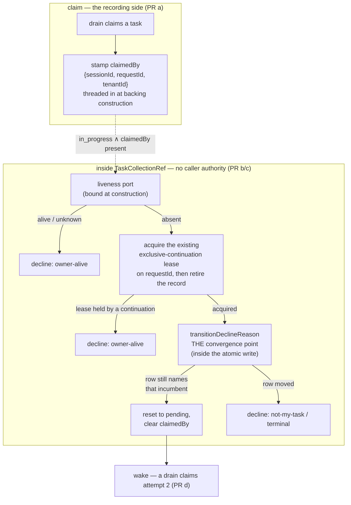

# FIX-1005: M2 is unowned — reclamation joined to execution liveness

> **Linear issue:** [FIX-1005](https://linear.app/fixpoint-labs/issue/FIX-1005) · **Epic:** [FIX-939](https://linear.app/fixpoint-labs/issue/FIX-939) — Durable jobs & detached-task substrate (M2 of 5; objective gate **APPROVED 2026-08-06**) · **Blocked by:** [FIX-981](https://linear.app/fixpoint-labs/issue/FIX-981) (In Development), [FIX-999](https://linear.app/fixpoint-labs/issue/FIX-999) (OQ-1, with the owner) · **Epic-spec:** `docs/specs/_epics/durable-jobs.md` on `epic/durable-jobs`
>
> Every `file:line` here was opened on `spec/FIX-1005`, branched from `origin/main` at **`86dfb70bc`**. That tree has FIX-981 **sub-PR a only** (#1077 — a falsification baseline of tests and a goal, no ticket implementation). **So this spec is written against FIX-981's *target* shape, not against `main`.** Where the two differ, §7 says which is which. FIX-982's spec was written against the pre-FIX-981 shape and carries a P0 defect for exactly this reason; this one does not repeat it.

## Part I — The Case *(for the human)*

### 1. Problem — why it matters, why now

A worker picks up a durable job, and its process dies — a deploy, a crash, a container
eviction. The job is now marked "someone is working on this," and nobody is. Nothing ever
notices, nothing takes it back, and no later worker will touch it: the queue only ever
looks at jobs marked "not started." The job is stranded permanently, and the only recovery
is a human editing storage by hand.

The recovery half of this was never built, and not by accident. The epic's milestone table
and [FIX-978](https://linear.app/fixpoint-labs/issue/FIX-978) each named the *other* as its
owner, so neither did it (epic finding N61). This issue is that half.

**Why now.** The epic's objective is gated on it — completion criterion 3 requires that a
stranded claim return to the queue *and a worker actually start on it again*, with no human
in the loop. And [FIX-982](https://linear.app/fixpoint-labs/issue/FIX-982), the epic's main
deliverable, now states in writing that a lost process strands a claimed task until this
issue ships.

**The trap, and it is the whole reason this issue is hard.** Every job carries a 30-second
lease. The obvious fix is to take back any job whose lease has expired. That is worse than
the bug. **Nothing renews a lease** — it is stamped once at claim time and never extended
— and a single model call routinely runs longer than 30 seconds. So *an expired lease is
the normal condition of a perfectly healthy worker.* Acting on expiry resets a live
worker's job, a second worker picks it up, and the model call and all its side effects run
twice. That trades a loud hang for silent duplicate execution, which is strictly worse.
The epic makes this binding on every issue in it (rule 1), and FIX-978 §3 measured it.

### 2. Solution in plain terms

**Record which execution is running a job, then ask whether that execution is still alive.
Take the job back only when the answer is a definite no.**

Today a job records who *should* do the work (`assignee`) and a timer (`leaseUntil`). It
records nothing about the execution that actually picked it up, so there is no one to ask
after. We add that fact at claim time. Recovery then stops being a guess about elapsed
time and becomes a question with a real answer: *is request R still running?* The engine
already answers it — every in-flight request heartbeats about every 10 seconds into a
registry built for exactly this.

That inverts the roles the issue was filed with. **Liveness decides; the lease plays no
part in the decision at all.** A healthy worker is never reset no matter how long its model
call takes, because we never ask the timer. And death is noticed in about one heartbeat
instead of never.

**The delicate part is who is allowed to answer the question.** Every other write to a job
proves *"I own this."* A reclaim, by definition, writes to a row it does not own — so it
cannot prove ownership, and if we let it fake one, anyone can forge a takeover. The answer
is not to hand the caller a better token: it is that **reclamation accepts no authority
from its caller at all.** The collection performs the liveness probe itself, through a port
wired at construction, and no caller can present a substitute for that verdict (§6.1).

**Philosophy** — **tenet 5 (fix at the owning layer, convergence half):** reclamation's
precondition belongs inside the collection, at the one guard both backings already run
inside their atomic write — not at whichever caller happens to sweep. **Tenet 3 (earn every
addition):** one nullable field on the task row, no second liveness mechanism, no scheduler.
**Tenet 7 (prove the goal, not the mock):** the acceptance bar is a worker actually
restarting on a real process kill, not a status flip in a unit test.

### 3. Tradeoffs & alternatives

**The simpler approach, and why it loses: call `reclaim()` before each drain.** Three
lines, ships today. It is the failure §1 describes — it cannot tell gone from slow, so it
resets live workers. FIX-978 §3 establishes this with measurements and it is the epic's
rule 1. Not available at any price.

**The serious alternative, weighed and rejected: renew the lease.** Have the worker extend
`leaseUntil` every few seconds; expiry then genuinely means death, and the whole design
stays inside `@flow-state-dev/orchestration` with no package-boundary problem and no
dependency on [FIX-999](https://linear.app/fixpoint-labs/issue/FIX-999). This is the
textbook answer and it deserved a real hearing. **Rejected for coherence (tenet 1), not
complexity:** it stands up a *second* liveness timer for the same process, beside the
request heartbeat that already runs every 10s and is already swept. Two independent timers
over one process can disagree, and then neither is authoritative. FIX-978 §3 reached the
same conclusion — "rather than inventing a second notion of liveness."

**The owner settled the seam question (OQ-1) in favour of the liveness route**, so this is
now a rejected alternative rather than a standing fallback. It is kept because it is the
argument that explains the choice, not because it is where we land if something slips.

**Where the genuine complexity is** — not the sweep, and not the write. Three things, and
round 1 found the third:

1. **"Not in the registry" is ambiguous.** Entries are removed on normal completion *and*
   by the existing stale-request sweeper, which deregisters what it marks interrupted
   (`engine/src/execution/request-recovery.ts:80`). Absence means "no live execution is
   registered," which is what we want — but only if the registry is one every claiming
   process shares, *and* only if heartbeats are actually running (§6.5).
2. **A dead request can come back under the same name.** `continueRequest` re-registers an
   interrupted request under the **same `requestId`**
   (`engine/src/execution/request-continuation.ts:122-139`). So absence is not even a
   durable fact about that id. §6.6 is entirely about this.
3. **The authority must not be expressible by a caller.** `tasks()` hands the full
   `TaskCollectionRef` to application and model-adjacent code as *"the escape hatch for the
   whole API"* (`task-board/capability.ts:151-152`), and every field a naive fence would
   compare is readable off a returned `Task`. §6.1 is entirely about this.

### 4. Focus practices (1–5)

1. **BP-031, and it is the spec's core (§6.1).** The reclaimer supplies the *target* of a
   takeover and never the *authority* for it. After round 1 this is structural rather than
   conventional: there is no parameter through which authority could be supplied.
2. **The epic's rule 1 as a design property, not a caution.** No code path in this change
   may reach "reclaim" from a clock alone. After round 1 the lease is gone from the
   liveness path entirely (§6.3), so the rule is enforced by absence rather than by care.
3. **BP-030.** `claimedBy` is a new nullable field on a persisted row. Dual-read legacy
   records; absent means "no coordinate," which §6.4 turns into a refusal to act rather
   than a guess.
4. **BP-035, where the second path is the *live* worker.** Every behaviour in §10 is
   asserted from the side of the worker that must **not** be disturbed — including the two
   round-1 paths (a continued request, and a healthy request with heartbeats disabled).
5. **Refuse loudly.** A reclaim that declines says which precondition failed, on the same
   named-union surface FIX-981 establishes — never a silent no-op.

### 5. What using it looks like

**The fact recorded at claim time** — no caller writes it, and no model ever sees it:

```ts
const task = await tasks.claim("worker-1");
// task.claimedBy === { sessionId: "sess_42", requestId: "req_88", tenantId: "acme" }
```

**Reclamation takes no authority from the caller** — this is the round-1 correction. There
is no warrant parameter to forge:

```ts
// The board's own sweep. The verdict comes from the port wired at construction,
// never from an argument.
const reclaimed = await tasks.reclaim();   // → number of tasks returned to pending
```

**A dead worker's task coming back:**

```
before  request req_88 held task "a"; its process was killed 40s ago
        registry says: no live execution, and the request record is not continuable
        task "a" → status in_progress, claimedBy.requestId "req_88"

after   task "a" → status pending, claimedBy cleared, attempts unchanged
        a later drain claims it as attempt 2, and a worker starts on it
```

**The live worker that must not be touched** — the case the design exists to protect:

```
worker holds task "b", 4 minutes into one model call, lease expired 3.5 minutes ago
registry.get("req_91") → { lastHeartbeatAt: now - 6s }   (alive)
→ reclaim declines: { reason: "owner-alive" }
→ nothing written; the worker settles its own task normally
```

### 6. Decisions & rules — the sign-off surface

1. **Reclamation accepts no authority from its caller. The collection performs the liveness
   probe itself through a port bound at construction, and there is no warrant parameter.**
   *Rejected — and this is the round-1 rewrite:* a **caller-presented reclaim warrant.**
   Both reviewers reached it independently and they are right. `requestId`, `attempts` and
   `createdAt` are all readable off a returned `Task`, and `tasks()` hands the full
   `TaskCollectionRef` to application code as *"the escape hatch for the whole API"*
   (`task-board/capability.ts:151-152`). A guard that only re-compares those values cannot
   tell a probed warrant from a fabricated one, so a caller could reset a **live** task with
   no probe ever performed — the same tautological authorization this decision exists to
   reject, re-entering through the public surface instead of through ticket-minting.
   *Also rejected:* minting the incumbent's ticket from the row being written (matches by
   construction); riding FIX-981's Decision 4 no-ticket posture (true of reclaim, but leaves
   it with no precondition at all).
   *Locks in:* the authority source is **wiring, not an argument** — structurally the rule
   FIX-999's Decision 2 already uses for identity ("closes over the running request's
   identity at construction; identity is never a parameter"). The warrant still exists, but
   only as an internal value between probe and CAS, which is what §6.6 fences. A board with
   no liveness port wired cannot reclaim at all; it falls back to today's manual behaviour.

2. **The task row records `claimedBy` — the execution coordinate — as fact at claim time.**
   Set by the substrate inside the claim write, cleared on settle, never written by a
   caller. Sourced from the `BlockContext` the collection factory already receives
   (`ctx.request.identity.id`, `ctx.session.identity.id`, `identity.tenantId`), so **it
   needs no new seam and no engine dependency** — though it does need an explicit threading
   point into the backings, which §8 names.
   *Rejected:* reusing `assignee` (the user-set routing key, which `reclaim` preserves
   deliberately); an opaque token (nothing can look it up). **Also rejected (round 1):
   dropping `sessionId` to narrow the field.** FIX-982 has a concrete consumer — its
   Decision 9 reconciler derives liveness from `ActiveRequestRegistry.listAll()` *"filtered
   by the derived session id"*, and its §7.6 says the row records `{sessionId, requestId}`
   and asks this issue to coordinate on it rather than adding a second field.
   *Locks in:* **FIX-1005 owns this schema change and FIX-982 consumes it** — FIX-982's
   §12.4 asks for exactly this. It is a *fact* (where attempt N ran), not *policy* (where
   work should run), so it does not reopen the epic's OQ-B.

3. **Liveness is the only input to the decision. The lease plays no part in the liveness
   path — not even as a pre-filter.**
   *Rejected:* the issue's own proposed direction, "the lease still catches the case where
   the registry is unreachable or wrong" — an unreachable registry is absence of evidence,
   not evidence of death. **Also rejected (round 1): keeping `leaseUntil < now` as a cheap
   candidate pre-filter.** It re-introduced lease vocabulary into the hot path and would
   have made "expired lease but alive worker" a scaffolding concern in every sweep test,
   for a narrowing the liveness read already does.
   *Locks in:* candidates are `in_progress` ∧ `claimedBy` present. When liveness cannot be
   determined, **we do not reclaim** — the failure mode is a hang, which FIX-978 already
   makes loud, and that is the correct trade under rule 1. `leaseUntil` survives only in the
   flag-off legacy `reclaim` path, untouched.

4. **A task with no `claimedBy` is never reclaimed by this path.**
   *Rejected:* backfilling a coordinate, or falling back to lease-only for legacy rows
   (Decision 3 forbids it).
   *Locks in:* rows claimed before the upgrade, and rows never claimed at all, are both
   invisible to the sweep — honestly and by construction (BP-030). Counting begins at
   upgrade, the same posture `retryLedger` already takes.

5. **Enablement is an enforced gate, not a documented precondition. It refuses unless the
   registry reports itself shared widely enough *and* the heartbeat configuration makes
   absence meaningful. Off by default.**
   *Rejected:* shared storage as the sole precondition (round 1 showed it insufficient);
   documenting the preconditions and trusting the operator (the first draft's posture, which
   the owner overruled); and the first draft's reason for that posture — *"nothing reports
   shared-ness"* — which is now fixed rather than accepted (see below).
   *Locks in — two checks, both real:*
   - **Sharing scope.** Each registry implementation declares how far it is shared:
     `"process"` | `"host"` | `"cluster"`. Verified at source: the default in-memory
     registry keeps `private readonly entries = new Map<…>()` on the instance
     (`engine/src/stores/memory/active-request-registry.ts:4`) — **per-process**, so every
     peer's healthy request reads as absent, which is rule 1's failure reached by
     configuration. Postgres is a real `active_requests` table and is `cluster`; SQLite and
     filesystem are `host` (and SQLite only if the DB file itself is shared). The operator
     states the deployment's claimant span when enabling, and the gate **refuses** when the
     declared scope is narrower than that span.
   - **Heartbeat compatibility.** `request.heartbeatIntervalMs: 0` is a **supported**
     configuration — `runAction` then creates no heartbeat timer (`runAction.ts:630-631`)
     while the global stale sweeper still deregisters the healthy request, and any interval
     at or above the stale threshold does the same. **This breaks the design even on
     Postgres**, so it is checked independently of sharing. Reuse the existing sweeper's own
     tuning rule: a threshold below 2× the heartbeat interval fights healthy heartbeats
     (`stale-request-sweeper.ts:78-96`). Incompatible settings are refused at enablement, or
     the verdict is `unknown` — which under Decision 3 means do not reclaim.

   With the gate off (the default), `reclaim` behaves exactly as it does today. **The
   sharing-scope declaration is a store-contract change across four adapters and is scoped
   to its own issue** (§12), not absorbed here.

6. **A reclaim takes the incumbent's request out of continuation before it touches the task,
   using the exclusive-continuation lease that already exists.**
   *The problem, found in round 1:* `continueRequest` re-registers an interrupted request
   under the **same `requestId`** with a fresh `startedAt`
   (`engine/src/execution/request-continuation.ts:122-139`). If recovery continues a request
   after the probe sees it absent but before the task write lands, every coordinate still
   matches, the reclaim succeeds against a **newly live execution**, and the later write-back
   fence cannot undo duplicated side effects. This is the failure the whole issue exists to
   prevent, reached by a path the first draft did not model.
   *Rejected:* re-probing immediately before the write (narrows the window, never closes
   it); an execution generation on the task row (continuation does not write the task, so
   the row cannot learn about it); **and inventing a new request-status protocol, which the
   round-1 draft of this decision proposed before the existing primitive was found.**
   *Locks in — reuse, not invention (tenet 2).* The continue route already acquires an
   **exclusive-continuation lease** keyed by `requestId`
   (`engine/src/routes/recovery-routes.ts:249-257`), for exactly this reason: *"two callers
   that both pass the status check above must not both re-enter and re-run the in-flight
   block twice under the same id."* It also refuses anything whose record is not
   `interrupted` (`:238-242`). So the counterparty **already participates** and needs no
   change: the reclaimer acquires the same lease, and a `null` return means a continuation
   holds it → decline `owner-alive`. While holding it, the reclaimer moves the record out of
   `interrupted` to a terminal status, which makes the exclusion durable past the lease's
   60s TTL; the continue route's existing status guard then refuses permanently. **No new
   `RequestStatus` value is required** — an existing terminal value carries it.

7. **Scope is `in_progress`-after-process-loss. The sweep is one drain-attached frame with
   two arms and one liveness snapshot per tick, shared with FIX-982's `pending` reconciler.**
   *(OQ-2, decided in round 1 rather than deferred to PR c.)*
   *Rejected:* two independent passes. FIX-982's Decision 9 already walks the board and
   reads liveness on a scan it names as O(*global* in-flight requests); a second independent
   pass doubles exactly the expensive part. Also rejected: one *arm* covering both, since a
   never-claimed row has no coordinate to probe and needs a re-dispatch envelope this issue
   does not build.
   *Locks in:* the boundary stays exactly where both specs already put it — FIX-982's
   Decision 9 covers `pending`-with-no-live-request, this covers
   `in_progress`-after-process-loss, neither subsumes the other and neither gaps. What
   changes is that they share a frame and a snapshot. Probes are deduped by `requestId` per
   tick, and the sweep prefers one batch/stale-set read over per-row round-trips. **Cost,
   stated:** this couples PR c to FIX-982's sweep frame landing first.

8. **The build ships as four PRs, and the `claimedBy` field lands first, alone.**
   *Rejected:* fencing first — the commissioning dispatch assumed FIX-982 was waiting on the
   fenced-`reclaim` conversion; its approved spec drops the FIX-978 edge as gating nothing
   and states nothing in its build plan depends on FIX-1005 landing. What it *does* consume
   is `claimedBy` (§12.4). **Also rejected (round 1): merging PR a into PR b.** PR b depends
   on FIX-981's guard, which is In Development; PR a depends on nothing. Merging them makes
   FIX-982's unblock wait on FIX-981's completion, which is the coupling Decision 8 exists to
   remove. A no-op middle PR is the cheaper problem.

**Non-goals** — lease renewal (§3, rejected outright now OQ-1 is settled); the `pending` reconciler and the
re-dispatch envelope (FIX-982); a scheduler or cron loop (FSD supplies none, by
architecture); cap admission (FIX-981 Decision 5); any change to what `claim` considers
eligible; and any re-litigation of FIX-981's ticket, which this consumes unchanged.

**Size:** Large (multi-package, multi-PR — see §8; the shape is Decision 8).

---

## Part II — The Build Plan *(for the implementing agent)*

### 7. Technical design



- **`@flow-state-dev/orchestration`** owns most of it. `claimedBy` joins the `Task` schema
  beside `retryLedger`, which is the precedent to copy: optional, nested, `== null`-guarded,
  explicitly not backfilled.
- **The authority is wiring, not an argument (Decision 1).** The liveness port is supplied
  when the collection is constructed. `reclaim`'s caller-facing signature carries nothing
  that could stand in for a verdict, so the forgery path round 1 found has no spelling. A
  board with no port wired cannot liveness-reclaim at all.
- **The guard, one place.** `reclaim` today hand-rolls its precondition twice inline —
  once on the mirror read and again inside the CAS (`tasks/collection/resource-backed.ts:660-676`,
  and its twin in `sequencer-backed.ts:552-590`). Those bespoke checks are what "convert
  `reclaim` to the fenced primitive" means: route it through `transitionDeclineReason`
  (`tasks/collection/internal.ts:298`), which both backings already run inside their atomic
  write, and give it a named refusal instead of a silent `continue`.
- **`owner-alive` is reachable, and only because of Decision 1.** Round 1 correctly flagged
  that under the first draft — where the sweeper probed and the guard saw only row
  coordinates — no path could ever emit it, so it would have widened a public union for
  nothing. Moving the probe inside the collection is what gives the decline a real
  producer: both the "still heartbeating" and the "a continuation won the record CAS" arms
  report it.
- **Liveness is its own store, not a view of request records.** `StoreRegistry` carries
  `request: RequestStore` and `activeRequests: ActiveRequestRegistry` as **separate members**
  (`engine/src/stores/types.ts:951` and `:954`). Worth stating because a reader reasonably
  assumes the liveness read is a request-record read; it is not, and the two answer
  different questions — the registry says *"is an execution running right now"*, the record
  says *"what happened to this request"*. Decision 6 needs both, plus `stores.leases`.
- **Three reads cross the package boundary, and they are the only things that do.** The
  liveness probe, the continuation lease, and the record retirement all live in `engine`
  (`types.ts:567-585` for the registry, `:928-947` for `LeaseStore`), and `orchestration` has
  `engine` as a devDependency only. All three arrive through FIX-999's seam — see §12, where
  OQ-1 is now **resolved** and the shape is a coordination item with FIX-999 rather than an
  open question.
- **Untouched:** `claim`'s eligibility rules, the task status state machine, `assignee`
  (which `reclaim` preserves on purpose), every store adapter, and the item/streaming layer.

**The precedent to mirror, not reinvent.** The engine already runs this pattern one layer
down: `createStaleRequestSweeper` reads the same registry on an interval, applies a
threshold, and hands stale entries to `detectInterruptedRequests`
(`engine/src/execution/stale-request-sweeper.ts`). It also carries the tuning rule Decision
5 inherits. Reuse the shape and the rule; do not stand up a second cadence concept.

**Sketch — pseudocode. Illustrative, not the contract. React to the shape.**

```
inside the collection's own reclaim — no caller supplies any of this:

    candidates ← rows where status = in_progress and claimedBy present   ← decision 3
    verdicts   ← liveness.snapshot(dedupe(candidates.claimedBy.requestId))

    for each candidate:
        if verdict is alive or unknown:  decline "owner-alive"           ← decision 3

        lease ← acquire the exclusive-continuation lease on that requestId
        if lease is null:  decline "owner-alive"   ← a continuation holds it (decision 6)
        retire the request record out of "interrupted"  ← durable past the lease TTL

        CAS the task, conditional on the row still carrying
            (claimedBy.requestId, attempts, createdAt)
        on match: reset to pending, clear claimedBy, leave attempts alone
        release the lease
```

What this asks a reviewer: *is the ordering right — verdict, then take the request out of
play, then write the task?* Reversing the last two would reset a task that a continuation
then resumes, which is the race Decision 6 exists to close. Note that the lease is the
**existing** primitive the continue route already acquires, so nothing new has to agree to
participate.

### 8. Implementation sequence

1. **Record the coordinate.** Add `claimedBy` to the `Task` schema; populate it in the claim
   write; clear it on every settle path. **Name the threading point explicitly:** the
   factory receives `ctx` (`get-or-create.ts` — every backing variant is
   `… & { ctx: BlockContext }`), but the backings take a narrowed options object and do not
   thread identity into `applyClaimToTask` today. PR a adds an identity option on the
   backing options, the same pattern `onChange` and the cap options already use — it does
   **not** hand `BlockContext` to the write path.
   *Test:* set on claim, cleared on each terminal transition, absent on legacy rows read
   back. *Depends on:* nothing. *(Decision 2.)*
2. **Fence `reclaim`.** Add `owner-alive` to `TaskWriteDeclineReason`; route both backings'
   `reclaim` through `transitionDeclineReason`; **remove** the two hand-rolled inline
   precondition checks. *Test:* the refusals, from both backings. *Depends on:* 1, and
   FIX-981's guard landing. *(Decisions 1, 6.)*
3. **Join it to liveness.** The port and its wiring through FIX-999's seam; the enablement
   gate; the continuation-lease + record-retirement step; the sweep arm. *Test:* §10's
   live-worker, continuation, gate-refusal and forgery behaviours. *Depends on:* 2, FIX-999's
   liveness capability, the registry sharing declaration (§12), and FIX-982's sweep frame.
   *(Decisions 3, 5, 6, 7.)*
4. **Redelivery.** The wake so a reclaimed row is actually picked up again, and the goal
   check. *Depends on:* 3, and FIX-982's executor. *(Decision 7.)*

**PR plan.** Independent = no unmet `depends_on`.

| sub-PR | deliverables | depends_on |
|---|---|---|
| a | `claimedBy` on the schema, recorded at claim, cleared on settle (step 1) | — |
| b | fenced `reclaim` + `owner-alive`, bespoke checks removed (step 2) | a |
| c | liveness port, FIX-999 wiring, enablement gate, continuation lease, sweep arm (step 3) | b |
| d | redelivery wake + criterion-3 goal check (step 4) | c |

**PR a is deliberately alone and first** — it is what FIX-982 consumes (Decision 8), it
needs neither FIX-981 nor FIX-999, and it can land while both are still moving.

### 9. Edge cases & error handling

| Case | Expected |
|---|---|
| **Caller fabricates a takeover** | No spelling for it — `reclaim` takes no authority argument (Decision 1). The probe is performed by the collection or not at all. |
| **Request continued under the same id mid-reclaim** | The continuation holds the exclusive-continuation lease → `acquire` returns null → decline `owner-alive`. Task untouched, continuation proceeds (Decision 6). |
| **Reclaimer wins the lease, continuation arrives just after** | The record is no longer `interrupted`, so the continue route's existing guard 409s (`recovery-routes.ts:238-242`). Durable past the lease's 60s TTL. |
| **Reclaimer crashes holding the lease** | The lease TTL expires and continuation becomes possible again; the task was either reset (record retired, so no continuation) or untouched. No state where both proceed. |
| **Heartbeats disabled (`heartbeatIntervalMs: 0`) or interval ≥ stale threshold** | Enablement **refuses** (Decision 5). Checked independently of sharing — it breaks the design even on Postgres. |
| **In-memory registry with more than one process** | Enablement **refuses**: declared sharing scope `process` is narrower than the claimant span (Decision 5). |
| Task cancelled in the gap between probe and CAS | Row is terminal → decline `terminal`. A cancelled task is never resurrected to `pending`. |
| Task re-claimed in the gap (attempt advanced) | `attempts` ≠ observed → decline `not-my-task`. The new owner is untouched. |
| Two sweepers race the same row | The record CAS admits one; the loser declines. Idempotent for free. |
| Row deleted and recreated under the same id (ABA) | `createdAt` ≠ observed → decline. Same closure FIX-981 adopted for its ticket. |
| Registry unreachable / probe throws | Verdict `unknown` → **do not reclaim** (Decision 3). Log; never fall through to the lease. |
| `claimedBy` absent (legacy or never claimed) | Not a candidate (Decision 4). Never-claimed `pending` rows are FIX-982's arm. |
| Multi-tenant: coordinate from another tenant | Compare `claimedBy.tenantId` against the board's own scope before probing. |
| Flag off (the default) | `reclaim` behaves byte for byte as today: manual, lease-only, no liveness read, no record CAS. |
| Worker resumes after its task was reclaimed | Its write-back is refused by FIX-981's ticket guard — `attempts` has advanced. Unchanged here; asserted so the pair is pinned. |

**Taxonomy:** every decline is a value, never a throw — the FIX-976 contract. A probe
failure is non-fatal and degrades to "do nothing." The only fatal paths are the ones that
already throw (missing task, store failure, CAS exhaustion).

### 10. Testing strategy

**Goal:** the epic's criterion 3, in its strict form. Start a real board, let a worker claim
a task in a separate process, **kill that process**, and assert a worker *starts on the task
again* with no human and no manual dispatch. Asserting only the status flip would test the
write and nothing about liveness — the epic says so explicitly.
`goals/durable-reclamation/dead-worker-task-redelivered/`, real model.

**CI specs** (behaviours, not test names):

- **One behaviour per decision in §6**, in observable terms.
- **The second path is the live worker** (BP-035): a task whose lease expired minutes ago
  but whose request is still heartbeating is **not** reclaimed — at *any* lease age. The
  most important test in the suite.
- **Forgery has no spelling** (Decision 1): a test written from application code holding the
  public ref cannot construct a call that resets a live task. If a future refactor adds an
  authority parameter, this test is what fails.
- **The continuation race** (Decision 6): continue a request under the same id between the
  probe and the write, and assert the task is **not** reset and the continued execution
  keeps its claim. Order the test so the continuation lands inside the window — a suite that
  continues before the probe passes against a broken implementation. Assert the mirror case
  too: when the reclaimer wins the lease first, a following continuation gets a 409 rather
  than re-entering.
- **The enablement gate refuses, rather than warning** (Decision 5), on each arm
  independently: `heartbeatIntervalMs: 0` on a *cluster-shared* registry, and a
  `process`-scoped registry with a multi-process claimant span. Both must fail closed — a
  test that only asserts a logged warning would pass the implementation this decision was
  written to prevent.
- **The unknown verdict is not the dead verdict.** Probe throws, or returns no entry on an
  unshared registry → no write.
- **Ordering matters in the sweep tests.** Seed the task, *then* start the sweep, then kill
  — a suite that seeds after starting can pass against an implementation holding a stale
  ref, the trap FIX-982's §10.7 names.
- **What must not change:** with the flag off, every existing `reclaim` test passes
  unmodified.

**Discipline:** `tdd`. The seam is `TaskCollectionRef` in `@flow-state-dev/orchestration`,
reachable from a vitest spec with the mock context and a stub liveness port — so every
behaviour above is a tracer bullet with no process kill involved. The process kill lives
only in the goal check.

### 11. Documentation plan

- **EXTEND** `docs/architecture/orchestration.md` (or the task-board architecture doc that
  owns the claim lifecycle) — a subsection on reclamation: what `claimedBy` records, that
  liveness and not the lease decides, that authority is wired rather than passed, and the
  enablement preconditions. Load-bearing for anyone who later touches `claim`.
- **EXTEND** `packages/orchestration/README.md` — the `reclaim` entry gains the
  preconditions and the default-off note.
- **CREATE** nothing in `apps/docs` **in PRs a–c.** Reclamation is not an app-author surface
  until redelivery works end to end. PR d adds one section to the durable-jobs guide
  FIX-982 creates. *Voice risk:* no `FIX-` ids under `apps/docs`; describe the behaviour,
  never the bug or the milestone that prompted it.
- **Changeset:** `minor` on PR a (`Task` gains a field) and PR b (`TaskWriteDeclineReason`
  gains a member — a union widening callers may switch on); PR c/d per surface. Never
  `patch` on the grounds that it "only refuses bad writes."

### 12. Dependencies, open questions & follow-ups

**Blockers — must land first.**

| Issue | What this consumes | Settled enough to build against? |
|---|---|---|
| **FIX-981** | The guard convergence point, the `TaskWriteDeclineReason` union, and the ticket's ABA-closing `createdAt`. | **Yes for PR b** — Spec Approved, sub-PR a merged (#1077). `expectAttempt` is **removed** by it; nothing here names it. |
| **FIX-999** | A liveness read, the continuation lease, and record retirement (Decisions 5–6). | **Direction yes — OQ-1 resolved (option A).** The *shape* is a live coordination item; this spec needs three verbs, not a bare `isAlive`. |
| **Registry sharing declaration** | The signal Decision 5's gate checks. | **No — unfiled.** Requested below; blocks PR c. |
| **FIX-982** | The shared sweep frame (PR c, per Decision 7) and the executor that makes redelivery observable (PR d). | Yes — Spec Approved. PRs a–b do not depend on it. |

**Open questions — both now closed.**

**OQ-1 — RESOLVED by the owner: FIX-999 adds a narrow liveness capability to its seam**
(option A), identity-bound, mirroring `ActiveRequestRegistry.get(requestId)`, not exposing
`stores.activeRequests` and not defaulting to `listAll()`. Lease renewal (§3) is therefore a
rejected alternative, not a standing fallback. What remains is **coordination with FIX-999
on the shape**, not a decision, and this spec needs three things across that seam rather
than one — do not build against a bare per-row `isAlive`:

1. **A liveness read**, preferably batch or stale-set shaped rather than per-row. Decision 7
   dedupes by `requestId` and takes one snapshot per tick, so a set-shaped read is the
   natural fit and avoids the N+1 that a per-row `isAlive` would create.
2. **The exclusive-continuation lease** on a `requestId` (acquire / release) — Decision 6.
   This is `stores.leases`, already used by the continue and resume routes, not a new
   primitive.
3. **Retiring a request record** out of `interrupted` — Decision 6's durable half.

Items 2 and 3 are a genuine widening of what the first draft implied the seam would carry,
and FIX-999 should hear it now rather than after it ships. They are composed entirely of
primitives that already exist, so it is a wider surface, not a new protocol.

**OQ-2 — decided in round 1** (see Decision 7): one drain-attached sweep frame, two arms,
one liveness snapshot per tick, shared with FIX-982's reconciler. PR c now depends on
FIX-982's frame.

**A new issue this spec needs, and deliberately does not absorb — the registry sharing
declaration.** Decision 5's gate can only check rather than trust if each registry
implementation declares how far it is shared (`"process"` | `"host"` | `"cluster"`). That
is a change to the `ActiveRequestRegistry` contract in `engine` plus its four
implementations (memory, filesystem, sqlite, postgres).

**Judgement, stated so neither spec assumes the other owns it: it belongs in its own
issue**, not in this spec and not in FIX-999's. Three reasons. It is a different boundary —
FIX-999's seam is `core` ↔ `engine`, while this is `engine` ↔ its store adapters, which
FIX-999's Decision 1 (*"no `core` type ever names a store"*) deliberately keeps out of
scope. It has **two consumers**, since FIX-982's Decision 9 reconciler reads the same
registry and has the same "does absence mean death" problem. And it is a four-adapter store
contract change, which is exactly the shape the epic already treats as its own unit of work.
**Requested: the coordinator files it.** It blocks this spec's PR c, and FIX-999 should
reserve room in the liveness capability to carry the declaration through — a capability that
returns a verdict with no trust signal would have to be widened later.

**Corrections owed elsewhere — recorded here, not edited by this spec.** The epic's C3 row
was corrected (N71) to name FIX-1005 as owner of liveness-joined reclamation with FIX-978 as
prerequisite. Four surfaces still carry the old answer, and this is another instance of the
epic's own recurring "a decision moved and its restatements did not" class (tenet 5, second
half):

- `docs/specs/FIX-981.md:402` (on `spec/FIX-981`) — write-path row 14 reads *"Out of scope —
  FIX-978/FIX-1005."* Should read **FIX-1005**.
- `docs/specs/FIX-981.md:641` — already correct (*"Owned by FIX-1005"*); noted so the pair
  is seen to disagree with itself in one document.
- `docs/specs/_epics/durable-jobs.md:836` (on `epic/durable-jobs`) — §7's write-path table
  row 14 reads *"**FIX-978's**, per Decision 1."* Should read **FIX-1005**.
- `docs/specs/_epics/durable-jobs.md` Decision 6 — *"Binding on FIX-982: name the
  reclamation wake explicitly"* and its "hooking onto FIX-978's reclaim/sweeper pass"
  option both predate the C3 correction. The **reclamation** wake is this issue's (criterion
  3 requires a worker to restart); the **admission** wake stays FIX-982's.

**A citation correction for this spec's own commissioning brief.** The "an expired lease is
not evidence of abandonment" constraint is the epic's **binding rule 1**, argued in its
**Decision 1** — not Decision 3, which is about board lifetime and collection scope. The
substance is unchanged and is honoured throughout; only the citation moved.

**[FIX-978](https://linear.app/fixpoint-labs/issue/FIX-978) is frozen and was not touched.**
Its spec PR (#990, labels `spec` + `on hold`) is stopped by the repo owner pending FIX-989.
Its §3 is cited here as the measured source for the lease argument; nothing on that branch
was modified.

**Follow-ups (flagged, not built):** a narrower liveness read bounded by board size rather
than fleet concurrency — the same follow-up FIX-982 books against its Decision 9 scale
breakpoint. Decision 7 makes the two share a snapshot, so this is now one follow-up rather
than two.

---

## Spec evolution *(the change story, not an audit log)*

- **Spec drafted** — Framed the issue around the one question that makes it hard: a reclaim
  writes to a row it does not own, so it cannot prove ownership and must not be allowed to
  fake it. Chose a server-derived **reclaim warrant** validated at FIX-981's existing guard
  over minting the incumbent's ticket (tautological) or riding the no-ticket unguarded
  posture (no precondition at all). Took a harder line than the issue proposed on the lease:
  it narrows the candidate set and never authorizes a reclaim. Recorded `claimedBy` from the
  public `BlockContext`, which keeps the recording half free of any engine dependency and
  lets it land first, alone — **correcting the commissioning brief's sequencing**, since
  FIX-982's approved spec consumes that field and explicitly does *not* depend on the
  fenced-`reclaim` conversion. Surfaced one blocking unknown: FIX-999 ships no liveness verb.
- **Review round 1** — Three changes that move the approach, and the first is a rewrite of
  the core mechanism. **Decision 1's warrant was forgeable and is gone:** both reviewers
  independently found that `requestId`/`attempts`/`createdAt` are readable off a returned
  `Task` and `tasks()` hands the full ref to application code, so a caller-presented warrant
  is the same tautology the decision rejects. Reclamation now accepts **no** authority from
  its caller — the collection probes through a port bound at construction, which is
  FIX-999's own identity rule applied to liveness, and which incidentally makes
  `owner-alive` reachable (round 1 correctly noted it was not). **Decision 6 is new:**
  `continueRequest` re-registers under the same `requestId`, so registry absence can be
  followed by a legitimate resume before the CAS — closed by taking the request out of
  continuation with a conditional write before the task is reset. **Decision 5 grew a real
  precondition:** `heartbeatIntervalMs: 0` is supported and makes a healthy request look
  dead, so shared storage alone was insufficient. Also folded: the lease pre-filter dropped
  from the liveness path entirely, OQ-2 decided as one shared sweep frame, probes deduped
  per tick, and PR a's threading point named. Rebutted with evidence: keeping `sessionId`
  (FIX-982's reconciler filters by it) and keeping PR a separate from PR b (merging would
  make FIX-982's unblock wait on FIX-981).
- **OQ-1 settled by the owner (option A), and two consequences** — FIX-999 adds a narrow
  liveness capability, so **lease renewal drops from standing fallback to rejected
  alternative** and §3 says so. **Decision 5 is upgraded from a documented precondition to an
  enforced gate** that refuses on two independent arms: a registry whose declared sharing
  scope is narrower than the deployment's claimant span (the default in-memory registry is a
  per-instance `Map`), and a heartbeat configuration that makes absence meaningless — which
  breaks the design even on Postgres. The first draft excused itself with *"nothing reports
  shared-ness"*; that is now fixed rather than accepted, via a registry sharing declaration
  scoped to **its own issue** (§12) because it is an `engine`↔adapter contract with two
  consumers, not part of FIX-999's `core`↔`engine` seam.
- **Decision 6 rewritten to reuse a primitive instead of inventing one** — found while
  verifying the owner's note. The continue route **already** acquires an
  exclusive-continuation lease on `requestId` for precisely this hazard
  (`recovery-routes.ts:249-257`) and already refuses a record that is not `interrupted`. So
  the counterparty participates with no change, and the new request-status protocol the
  round-1 draft proposed is gone (tenet 2). What the seam must carry grew — three verbs, not
  a bare `isAlive` — and that is now a coordination item with FIX-999 rather than an open
  question.
