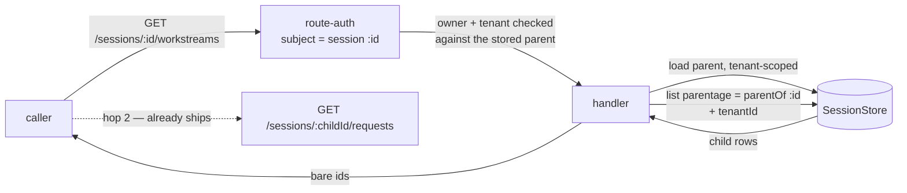

# FIX-1010: S1b — the parent-to-child read route and request metadata — Implementation Spec

**Linear:** [FIX-1010](https://linear.app/fixpoint-labs/issue/FIX-1010) · **Epic:** [FIX-939 — Durable jobs & detached-task substrate](https://linear.app/fixpoint-labs/issue/FIX-939) ([epic PR #993](https://github.com/fixpoint-labs/flow-state-dev/pull/993)) · **Follows:** [FIX-1009 (S1a, Done)](https://linear.app/fixpoint-labs/issue/FIX-1009), [FIX-982](https://linear.app/fixpoint-labs/issue/FIX-982) · **Blocks:** [FIX-1011 (S2)](https://linear.app/fixpoint-labs/issue/FIX-1011)

## Part I — The Case

### 1. Problem — why it matters, why now

An app can now start work that outlives the turn that asked for it — a long research job, a spec being written, an implementation running for an hour. That work runs in its own place, attached to the conversation that launched it. **The conversation cannot find it.**

Ask the server for a conversation's background jobs and there is no way to phrase the question. The pieces are all there: the database knows which jobs belong to which conversation, and once you have a job's id you can already read everything it did. What is missing is the first step — going from "this conversation" to "here are its jobs." Without it the user sees a turn that returned, and no trace of the hour of work it kicked off.

**Why now.** Two things arrive together. The substrate that creates these jobs is in development, and the moment it ships, every existing session list in the framework deliberately hides them (that was the previous change's whole point — background jobs must not pollute a user's list of conversations). So today the jobs are invisible to a caller and that is correct; from the day the substrate lands, they are invisible to a caller and that is a hole. Our own developer tool goes blind at the same moment. Everything downstream — the client library, the React hook, and the epic's end-to-end demo that gates its completion — is queued behind this one read.

There is no workaround an app can adopt. The query exists only inside the server process; nothing exposes it.

### 2. Solution in plain terms

Add one endpoint: **ask a conversation for its background jobs.** You address the conversation you already have, and you get back the jobs hanging off it. From there the endpoints that already exist take over — each job is itself readable, with its full history, exactly as a conversation is.

That is the whole shape: two hops. Not one flattened list of everything, because a background job is a first-class thing with its own history, not a filtered view of the conversation's messages. And we keep the promise the previous change made: nothing that lists conversations today starts returning jobs. Seeing them is something you ask for.

Each row also says which piece of work the job was for, stamped by the server when the job starts. Nothing a caller wrote is treated as fact.

**Each row also says whether the job is finished, and if so how it ended.** A job that is still going — queued, running, or paused waiting for someone — reads as one word: **active**. A job that is over reads as its actual outcome: finished, failed, cancelled, and so on. A job that has never run at all says nothing, because "hasn't started" is an absence, not an outcome.

That is deliberately less than an earlier draft promised. It used to say *running*, and review established that a job merely queued is recorded as running too — so the row claimed a worker was on the job when nothing had picked it up. **`active` is the honest version of that claim**: it says only *not finished*, which is true of queued, running and paused alike. A richer breakdown of what "active" means is a later question with its own shape, and the row is built so it can be added without changing what any of today's values mean.

**Philosophy** — tenet 2 (composition over features): this is one more read over a filter that already ships, sitting beside the endpoint that already lists a conversation's turns, and it composes with them rather than introducing a parallel "jobs API". Tenet 3 (earn every addition): the public surface grows by one endpoint and no new options on any existing one. Tenet 5 (fix at the owning layer): the tenant and ownership checks stay where routes already do them, so the new read cannot be the one that forgets.

> **§2 then §6 lead, and the rest is derivation.** Problem, then what we propose, then what you are signing. Everything from §3 down justifies it — read it if the sign-off is not obvious, skip it if it is.

### 6. Decisions & rules — the sign-off surface

1. **You reach a conversation's background jobs *through that conversation*, and you get them in two hops — the jobs, then each job's history.**
   *Rejected:* a "show me the jobs whose parent is X" filter on the flat list-conversations endpoint. It reads as the smaller change and it is the weaker one, because of **which permission check it lands in**. The flat listing is classified as a *host-wide* read: the framework authenticates the caller and then leaves the handler to narrow rows itself. A parent id arriving as a query string on that route is never loaded as a record, so it is never ownership-checked and never tenant-checked — it is only ANDed into a filter. Addressing the parent puts the read in the *session-addressed* class the sibling "list a conversation's turns" endpoint already uses, where the framework resolves the parent record and checks its owner before the handler runs.
   *Locks in:* background work permanently inherits its conversation's access rules — one conversation, one owner, one boundary — and that is what customers will build their UI against. The cost lands later and in one specific place: a "show me all my background work across every conversation" view is a second endpoint we would have to design, not a parameter we can add. We do not have a customer asking for that view, and we would rather owe them an endpoint than owe everyone an unchecked filter.
   *(An earlier draft justified this by saying the query-param route leaks whether a parent exists. Two reviewers independently showed that argument does not hold, for two different reasons: the addressed route answers 403 for a parent the caller does not own, which leaks existence too and deliberately; and the flat listing already forces the user filter to the authenticated caller and conjoins the tenant, so an absent parent and an unowned one would both come back as an empty list — no probe either way. The decision stands; the reason above is the one that survives.)*

2. **We do not ship a "list every conversation on the system" mode over the public API.** The database can do it, and in-process callers that genuinely need it — restart recovery, our own maintenance sweeps — keep using it. It is not reachable over HTTP.
   *Rejected:* exposing all three modes the database supports, on the argument that an operator will eventually want the god view.
   *Locks in:* no customer-facing endpoint can enumerate across ownership boundaries, so a mistake in a future auth change cannot turn one into a data leak. What it costs: an operator debugging a live system reads through the two hops like everyone else, which is more clicks. Our own developer tool is the first thing to feel that, and it is the case that convinced me the price is right — if the debug surface can live inside the boundary, a customer's admin panel can too. Reversible, but reversing it is a security review, not a patch.

3. **What a background job says about itself — which piece of work it was for — is stamped by the server when the job starts. Anything a caller wrote is display-only, and nothing in the product may act on it. This issue *guarantees* that; FIX-982 *writes* it.**
   *Rejected:* letting the launching call label its own jobs and treating that label as fact — it is one less moving part, and it makes the label a lie anyone signed in can tell, which matters the moment a UI groups, filters, or bills by it. Also rejected: this issue writing the stamp itself if FIX-982 has not. A conditional "if they didn't, we will" is two plans, it makes this issue's size unknowable at sign-off, and it puts two issues at one seam.
   *Locks in:* a customer's UI can label background work by the task it belongs to and trust that label; that promise is what we cannot cheaply take back once apps depend on it. What it costs is a hard dependency rather than a hedge — if the stamp is missing when this starts, that is a blocker to raise, not scope to absorb quietly.

4. **✅ ANSWERED by the owner. Status is terminal-or-active.** A row reports a real outcome only when the job is genuinely over; while anything is still in flight it reports one generic word.

   **The rule, in full.** When a Workstream has **no non-terminal run**, the row reports its terminal outcome, in the framework's own vocabulary — *completed*, *failed*, *aborted*, *incomplete*, *interrupted*. Otherwise the row reports **`active`**, which means one thing and only one thing: **not terminal.** A child with no runs at all reports **absence**, and absence is not a status.
   *Rejected:* reporting the last run's raw status. That is what the earlier draft said, and it made a merely-queued job read as *running* — a claim that a worker was on it. The vocabulary has no word for queued, so the distinction was not expressible; `active` is expressible and true. Also rejected: keeping a status copy on the conversation record so the listing is one query — a write on **every** request completion product-wide, foreground included, against the record already contended for conversation state. Also rejected: returning existence only and making the UI ask per job, which turns one page load into one request per job.
   *Locks in:* a customer's list can say "three finished, one failed, two still going" from a single call. What it costs: the list cannot distinguish *queued* from *running* from *waiting on me*, so a UI that needs that reads the task board or waits for the axis below.

   **`active` carries no sub-state, deliberately, and the field is built so one can be added later without moving anything.** The owner anticipates a sub-status axis — *running*, *waiting*, *scheduled*, and a state meaning *a user decision is needed* — and has explicitly deferred it. So: **do not build it and do not design it now**, and **do not encode a sub-state inside `status`.** When it arrives it arrives as a **separate optional field** beside `status`; every value `status` can take today keeps its meaning, and a client that only reads `status` is unaffected (BP-030). Adding a value to `status` itself, or splitting `active` into several, is the change this shape exists to prevent.

   **4b. Which statuses are terminal — and the engine ships two answers that disagree, so this is a choice, not a lookup.** Surfacing rather than averaging (CLAUDE.md §6):

   - **`isTerminalRequestStatus`** (`packages/engine/src/stores/subscribe-helpers.ts:15-24`) says terminal is *everything except `in_progress`*. It answers a **stream** question — should the SSE iterator stop.
   - **The durability sweeper** says terminal is *`completed`, `failed`, `aborted`* (`PRUNABLE_TERMINAL_STATUSES`, `packages/engine/src/durability/durability-sweeper.ts:104`), calls `interrupted` **"non-terminal"** in so many words (`:59`), and never prunes the checkpoints of `in_progress` or `suspended` because "their checkpoints are the resume points an active or paused run needs to continue" (`:52-53`, `:322-323`). It answers a **work** question — is there anything left to resume.

   **This row asks the work question, so the sweeper's line is the right ancestor and the stream helper must not be imported.** Concretely: **non-terminal = `in_progress`, `suspended`, `interrupted`. Terminal = `completed`, `failed`, `incomplete`, `aborted`.** Define it locally and name the divergence in a comment, or the next reader will "fix" it back to the shipped helper.

   *Why each of the two contested ones lands where it does, verified rather than inherited.* **`suspended`** is a run paused at a gate waiting for a person — "it carries a pending gate" (`packages/engine/src/routes/recovery-routes.ts:236-237`), resolved through `/resume` (`resume-routes.ts:130`). **`interrupted`** is a run whose **worker crashed** — "Continue is for crash-interrupted requests only" (`recovery-routes.ts:235`) — and it is resumable through `/continue`, with its checkpoints deliberately retained for exactly that. Neither is finished work. *(A reviewer offered both as "stopped, waiting for a person", citing the status union at `packages/contracts/src/types/request-status.ts:11-18`. **The conclusion is right and the citation is not** — that file is a bare union with no per-member documentation, so it cannot support a semantic claim about either. `interrupted` is a crash, not a decision. Recorded because §7's calibration axis 3 is about exactly this: a declaration is not a behaviour, and that cuts against evidence that agrees with me as much as against evidence that does not.)* **`incomplete`** is terminal: the run *ended*, having stopped short on a budget (`packages/engine/src/execution/runAction.ts:1467, 1488`). It is absent from the sweeper's prune list for want of a timestamp to age on, which is a gap in that sweep and not a statement about its lifecycle — do not read it as one.

   **What this costs, stated because it is a real wart and not a free win.** `active` now covers both *"this is grinding away"* and *"this is stopped until someone acts."* A job whose worker crashed, and a job waiting at an approval gate, are indistinguishable from a running one — **and neither settles on its own**, so such a row reads `active` indefinitely. That is the honest price of a two-value vocabulary, and it is the price the owner accepted. **The deferred sub-status axis must carry a waiting-for-a-human distinction as its first member** — the owner named it when deferring ("a status which indicates a user decision is needed"), and `suspended` and `interrupted` are the two states already sitting in the data waiting for it. Writing that down here is what keeps the deferral honest instead of losing the requirement.

   *One interaction, noted and deliberately not designed around:* a self-updating consumer cannot tell "working" from "stopped, waiting for you", so it cannot know when to stop polling. **Nothing in this spec may be built on the answer to that** — the read-timing model is the owner's open call, not this route's, and this route is the same read either way.

   *And what this status is **about**:* the job's **runs**, not the state of the work itself. Where a job is backed by a task, the task's own lifecycle is the richer and more authoritative account, and a UI that shows both must pick one as the row's status rather than merging them — see §12.

   **4a. The terminal reduction — for ratification at the gate, not a new question.** The owner settled the vocabulary and the active rule. One thing they did not settle, and it is a product call rather than a mechanical one: **when a Workstream has no active run and its terminal runs disagree — a failed attempt, then a completed retry — what does the row say?** Nothing specifies it today, so an implementer would invent public status semantics. **This spec owns the rule; S2 and S3 consume it and must not restate or re-derive it.**

   **The rule: the row reports the outcome of the most recent run. On an exact start-time tie, the non-success wins.** So *failed, then retried successfully* reads **`completed`**.

   **"No non-terminal run" is evaluated against 4b's classification, not against the engine's helper** — so a Workstream paused at an approval gate, or one whose worker crashed, **never reaches this rule at all**: it has a non-terminal run and is `active`. Getting that wrong is how a job waiting on the user reduces to a terminal outcome and disappears from their attention.

   *Why that side.* Both readings are defensible — "the work got done" and "something went wrong you should know about" — and the tiebreaker is what the user can *do*. A row that reads `failed` forever after the failure was fixed is a permanent alarm the user has no way to clear, and retry is a first-class path in this framework (`/retry`, `/continue`). A row that reads `completed` under-reports a transient failure, which the job's own history — one click away on hop 2, and the whole reason this is a two-hop design — reports in full. **Under-reporting into a place the detail still exists beats over-reporting into a place it cannot be dismissed.**

   *The alternative, named:* pure severity precedence — any failure ever ⇒ `failed`, regardless of when. Cheaper (no ordered read, no index), and it is exactly what loses the retry case.

   *The honest price, because the cheap rule was available and I did not take it.* "Most recent" **does** require an ordered read, and no shipped index carries the ordering column behind `session_id`, so it **does** require the composite index on `requests` on both persistent adapters. Severity precedence would have avoided both. I chose the rule and paid the index rather than picking semantics to dodge storage work — but the index is real, it is the one storage cost that survives the owner's answer, and §3 prices it rather than burying it. What it does *not* cost is the persisted enqueue-sequence and its migration: the tie among equals is broken by severity, which needs nothing stored (§7 rule 2).

   **What we are *not* promising: that an `active` job is alive.** A crashed worker reads `active`, and — under 4b — **it keeps reading `active` after reclamation corrects the record**, because reclamation writes `interrupted` and `interrupted` is not finished work. Earlier drafts of this line said the row settles once the system notices; **that is now false and is corrected here rather than left as a comfortable half-truth.** What reclamation changes is the job's own history on hop 2, not this row. Distinguishing a crashed job from a live one is the sub-status axis's job, and until it lands this row genuinely cannot do it.

> **Non-goals** — the client library and React hook that will wrap this (S2 / FIX-1011, S3 / FIX-1012); *creating* background jobs, and stamping what runs in them (FIX-982); the end-to-end demo (S4 / FIX-1013); filtering jobs by topic or worker, which nothing asks for yet.
>
> **And one non-goal worth stating precisely, because an earlier draft got it wrong: *liveness*.** This read never asks whether a worker process is alive right now — that needs the substrate's own liveness machinery, can be unavailable by construction, and is a separate question nobody has filed. Decision 4's status is what the request store already durably wrote, which is a different thing: **a job whose worker crashed reads as `active` until reclamation corrects the record.** The earlier wording excluded both together and would have ruled out the one the product actually needs.
>
> **Size:** Medium, and **the answer to decision 4 cut it back for the first time** — every prior round widened it. It is one PR. What it needs: the engine route; **one additive widening of `RequestListOptions.status` to accept a set** (§7 rule 2), which is four small `toWhere`/predicate edits; **an ordering option on `SessionListOptions`** so the child listing can sort on an immutable key (§7 rule 2b), same four sites; and **one composite index per persistent adapter** for the terminal-outcome read and one for the child listing. §7 rule 5 states the storage requirement as a measured property rather than a named index, because four review rounds each named one and each was wrong.
>
> **What the answer deleted, verified rather than assumed:** the new persisted enqueue-sequence field on `RequestRecord`, its schema migration on both persistent adapters, its legacy-row rule, and its write on the request-creation path — **all gone**, so §7's "every execution path untouched" is true again. The ordering change in all four stores for *runs* is gone too; only the child-listing half remains. §3 re-derives the cost against the two queries this answer actually produces, and keeps one risk: deploying an index against a populated Postgres blocks writes while it builds.

---

### 3. Tradeoffs & alternatives

**The main alternative: a query parameter on the existing list-conversations endpoint.** `GET /sessions?parentOf=…`. It is one line of handler code and no new route, and the previous change (S1a) built the database filter in a shape that would accept it directly. Rejected per decision 1, on **which authorization class the read lands in**: that endpoint is classified host-wide, so a parent id in the query string is never resolved to a record and therefore never ownership- or tenant-checked; the addressed route inherits the session-addressed model the sibling request listing already uses, where the parent is loaded and its owner verified before the handler runs. Ergonomics favour the query param; the trust boundary favours the sub-resource, and it wins.

**The simpler approach, genuinely considered: ship nothing and let apps reach the store directly.** Apps that host the engine themselves could call the session store's filter from their own route today. It is insufficient for two reasons that are not about convenience. The store is not part of the public surface, so an app doing this is coupled to internals we change without notice — and the two hops only line up if the second one also matches, which means every app re-deriving the tenant and ownership rules the framework already implements. More decisively, the whole downstream chain (client, React, the demo that gates the epic) has to go through *one* transport shape; leaving it undefined means each consumer invents one.

**Where the genuine complexity is.** Not the query — that filter already ships and is tested across all four storage adapters. It is in the two places the new read touches an existing contract. First, the ownership check: the route has to be classified as *addressed at the parent* rather than host-wide, or it silently inherits the weaker model and decision 1 is undone without anyone noticing. Second, the read has to stay correct across the tenant boundary in the same way the sibling endpoints do — the parent is resolved as a tenant-scoped record and the child query is tenant-filtered, and both halves have to be there because either alone is a hole. §9 is mostly those two.

**The cost of decision 4, re-derived against the query the owner's answer actually produces.** The answer converts a **selection** problem into an **existence** problem, and that is most of the cost. The old shape asked *which run is newest* — `where session, owner, flow, tenant · order by start time · limit 1` — so the database had to order the child's whole accumulated history before the limit applied. The new shape asks *is there a non-terminal run at all*, which has no ordering in it and cannot be inverted by a tie.

**The shipped index serves it, and here is the check rather than the assertion.** `idx_requests_session_status ON requests(session_id, status)` ships on both persistent adapters (`store-sqlite/src/schema.ts:56`, `store-postgres/src/schema.ts:58`). The existence check's two selective predicates are exactly `session_id =` and `status ∈`, which is that index's full key. The owner, tenant and flow-kind clauses are **not** in it and land as filters — including the tenant term, emitted `tenant_id IS NOT DISTINCT FROM $n` on Postgres (`store-postgres/src/request-store.ts:150`) and `tenant_id IS ?` on SQLite (`store-sqlite/src/request-store.ts:173`), which a plain btree cannot serve as an index condition. **That does not matter here, and the reason is the whole point:** the rows those filters can discard are non-terminal runs *of this one session id* under a colliding tenant, a different owner or a different flow — a set bounded by concurrent in-flight runs, not by history. The over-scan rule 5 exists to prevent is work proportional to the child's run history, and this shape has none.

**One thing the shipped contract does get wrong, and it is not visible from the DDL.** `RecordStore.list` appends `ORDER BY` **unconditionally** — `sql += \` ORDER BY ${resolveOrderBy?.(options) ?? "updated_at DESC"}\`` (`store-sqlite/src/sqlite-store.ts:404`, `store-postgres/src/pg-store.ts:504`). There is no way to issue an unordered list through it, so the existence check still carries a trailing sort on a column the index does not cover. **A gate that asserts "no `Sort` node" therefore fails against a correct implementation** — the mirror of the defect rule 5 has now been corrected for twice. The sorted set is one or two rows, so the sort is free; what must be measured is that it *stays* one or two rows as the child's history grows. §7 rule 5 restates the property and the gate on exactly that basis.

**What still costs an index, stated plainly rather than waved away.** The terminal-outcome read (§7 rule 2, second half) *is* ordered — `order by created_at desc`, bounded to a handful of rows — and no shipped index carries `created_at` behind `session_id`; the composites stop at `status` and at `tenant_id`. The child listing is ordered too, against a single-column `idx_sessions_parent_session_id` (`store-sqlite/src/schema.ts:33`). **So two composite indexes survive, one per table, on each persistent adapter.** §7 rule 5 states the requirement as a measured property rather than a key order, and the reason is worth the owner knowing: **four consecutive review rounds each named a key order, and each was wrong** — for a NULL-safe tenant predicate a btree cannot serve, for a leading column that changed when the owner filter was added, for a missing secondary sort. Every failure was something only a query planner could have reported.

**And what the answer deleted — verified against the tree, not assumed.** The new persisted enqueue-sequence field on `RequestRecord`, its `ALTER TABLE` on both persistent adapters, its legacy-row rule and its write on the request-creation path are **gone**, because nothing in the new design orders runs by enqueue time: the active check has no ordering, and the terminal tie is broken by severity rather than by sequence. The ordering change in all four store implementations for *runs* is gone with it — the terminal read reuses the shipped `orderBy: "startedAtMs"` path, which both SQL adapters already resolve to `created_at DESC` (`store-sqlite/src/request-store.ts:186-187`, `store-postgres/src/request-store.ts:163-164`) and both in-process adapters already sort on. **§7's "every execution path untouched" is true again.** What replaces it is two additive list-option widenings (§7 rules 2 and 2b), which touch the same four adapters but add no column and migrate no data.

**And "no downtime" was wrong.** An earlier draft said index creation is additive and idempotent, therefore free. Idempotent is not non-blocking: the Postgres schema path builds indexes with a plain create, which **holds a lock against writes for the duration of the build** — on exactly the large request and session histories this endpoint exists to page through. So deploying this against a populated database interrupts production writes unless the build is done concurrently or moved out of startup initialization. **Specify a non-blocking path or state the interruption as accepted** — but do not repeat the claim that there isn't one. Note the concurrent form cannot run inside a transaction, which constrains where it can live; that constraint is the implementer's to resolve, the requirement that it be resolved is not. This risk survives the owner's answer: it is now two indexes rather than three, but the blocking build is the same.

The bound is also **not universal**: the in-memory and filesystem adapters carry no indexes and scan by construction, so the no-sort property is a property of the production adapters rather than of the store contract.

**One risk that is real and is not priced away — but the answer shrank it.** The tenant clause is emitted NULL-safe by shared query-building code, and if the only way to make it indexable were to change how that clause is built, the fix would reach beyond this issue's indexes into code every store query goes through. **The existence check no longer needs it indexable at all** (above), so the risk now applies only to the two ordered reads, where the tenant clause can stay a filter provided the ordered scan stops early. It remains a blocker to raise rather than absorb if a planner says otherwise — the same rule decision 3 applies to its own dependency. It is named because the previous four attempts each discovered their obstacle after the estimate was given.

**The alternative to that cost, and why it loses.** Keeping a status copy on the conversation record would make the listing a single query. It would also put a write on the request-completion path for *every* request in the product, foreground included, against the record that is already the contention point for conversation state — and that record's existing start-of-request write is deliberately last-writer-wins, which is fine for a pointer and wrong for a status that must not move backwards. Paying a bounded, indexed read per row on one screen is the cheaper trade than a new system-wide writer.

**A note on sequencing, since it is a real cost.** This spec is written against work still in flight: the injection seam it relies on is in review, and the substrate that creates background jobs is in development. §12 lists exactly what is assumed and what happens if an assumption is wrong. The endpoint itself waits on none of it — it reads a filter that already ships and is testable against seeded records. Decision 3 is the one that does depend on the substrate, and it depends on it as a **prerequisite rather than a hedge**: if the substrate has not stamped a job's provenance by the time this starts, that is a blocker to raise against it, not work this issue quietly absorbs.

### 4. Focus practices (1–5)

1. **BP-031 (never authorize or route from caller-controllable input)** — this is decision 1 restated as an engineering rule, and it is the one thing that makes the route shape non-negotiable. The parent id must be resolved as a stored record under the caller's tenant, and the caller's identity must come from the resolved principal, never from a query parameter.
2. **BP-030 (tolerate the old shape)** — every existing caller of the conversation list must behave byte for byte as it does today. This change adds an endpoint; it must not alter one.
3. **BP-035 (walk the second-path checklist)** — the second path here is the *unowned* parent: a parent in another tenant, a parent belonging to another user, a parent that does not exist, and a parent that is itself a background job. A suite that only tests a parent the caller owns proves nothing about the boundary decision 1 exists to hold.
4. **Tenet 5 / one convergence point** — the new endpoint must go through the same route-authorization table and the same tenant-scoped session load the sibling reads use, not its own copy of the checks. A guard reimplemented per route is a guard that drifts.

### 5. What using it looks like (1–5 examples)

**Reading a conversation's background jobs, then one job's history** *(what this spec proposes; today the first call has no endpoint to hit).*

```
GET /api/flows/sessions/sess_abc/workstreams
→ 200 { "workstreams": [
    { "id": "ws_9f2…", "topic": "FIX-981", "status": "active",    … },
    { "id": "ws_1c7…", "topic": "FIX-982", "status": "aborted",   … },
    { "id": "ws_4b0…", "topic": "FIX-983", "status": "completed", … },
    { "id": "ws_7e1…", "topic": "FIX-984", "status": null,        … }
  ] }
      ↑ `topic` is what the UI labels the row with — the body of work, not an
        opaque derived id. `coordinate` rides alongside it (which worker).
        `status` is terminal-or-active (decision 4). `"active"` means only
        "not finished" — it covers queued, running, and paused-for-a-decision
        alike, and deliberately does not distinguish them. Anything else is a
        real terminal outcome in the framework's own vocabulary: completed ·
        failed · aborted · incomplete · interrupted. `null` means no run yet,
        and is deliberately not defaulted to anything (§9).
        Note `aborted` — someone cancelled that job. Collapsing the terminal
        outcomes to a friendly one would have shown it as "failed".

GET /api/flows/sessions/ws_9f2…/requests        ← already ships, unchanged
→ 200 { "requests": [ { "source": "taskboard", "metadata": { "taskId": "task_…" }, … } ] }
```

**What the boundary does** *(decision 1):*

```
parent the caller owns              → 200, that parent's jobs
parent in another tenant            → 404, indistinguishable from absent
parent owned by another user        → 403 — "not yours", the answer the
                                      framework already gives for a session
parent that has no jobs             → 200 with an empty list, not 404
```

**What does not change** *(decision 2, and BP-030):*

```
before  GET /sessions → the caller's top-level conversations
after   GET /sessions → the caller's top-level conversations, byte for byte
        (no new parameter; background jobs are never returned here)
```

---

## Part II — The Build Plan *(for the implementing agent)*

### 7. Technical design

One new read on the engine's flow API router, sitting beside `list_session_requests` and built from the same parts. Nothing else in the engine changes shape.



- **`@flow-state-dev/engine`** — a new route kind in the parse/route tables, classified in the route-authorization table as **session-addressed on the path's `:sessionId`** (the same subject the sibling session reads use, *not* the host subject `list_sessions` carries). A handler that resolves the parent as a tenant-scoped record, 404s when it is absent, queries children through S1a's parentage predicate with the tenant conjoined, then resolves each child's status — terminal-or-active, per decision 4 and §7 rule 2's two reads — before returning. Bare session ids on the way out, matching what the existing session reads surface.
- **`@flow-state-dev/store-sqlite` and `@flow-state-dev/store-postgres`** — whatever it takes for rule 5's ordered shapes to stop early rather than walk a child's history, measured on each. Expected to be one composite index per table; the shape is the implementer's, working against a planner rather than against this document. §3 names the risk that it reaches further than index lines.
- **All four store implementations — two additive list-option widenings, and nothing else.** Rule 2 needs `RequestListOptions.status` to accept a **set** rather than a single value; rule 2b needs `SessionListOptions` to offer an **immutable sort key**. Both are the same four sites — the two SQL adapters' `toWhere` / `resolveOrderBy`, the in-memory and filesystem predicates and comparators — and both are purely additive, so every existing caller is unchanged (BP-030). **No new column, no migration, no data rewrite.** An earlier draft of this bullet required a chronology-preserving persisted field with a schema migration on both persistent adapters; the owner's answer to decision 4 removed the need for it entirely, and §3 records the verification rather than the assumption.
- **Untouched:** the `SessionStore` *contract*'s parentage predicate (S1a shipped it), the existing list-conversations handler and its default, the request-completion path, the request-**creation** path, the `RequestRecord` schema, `client`, `react`, the DevTool, and **every execution path**. That last item was conditional in the previous draft and is now unconditional — see §3.

**Where the status comes from, and where it must not come from.** The conversation record carries no status — its only run-adjacent field, `latestRequestId` (`packages/engine/src/stores/types.ts:56`), records which request last *started*, written before the run (`packages/engine/src/execution/runAction.ts:717-733`) and never updated when one ends, so it cannot answer "did this finish." The status therefore comes from the request store, per child, under rule 2's two bounded reads. **Nothing on the request-completion path changes**, and no status is copied onto the conversation record; decision 4 rejected that and §3 prices why.

**Seven rules bind the two queries — the child listing and the per-child status resolution. They are not the implementer's to weigh: each is a defect if dropped, and most of them are silent.**

0. **Both queries conjoin the parent's owner *and* the parent's flow kind, read from the stored parent record.** Route authorization checks the *parent* only, and the parentage predicate matches on parentage and tenant alone. Two things leak through that gap, and they are the same defect twice:

   - **A child carrying a different `userId`** while naming this parent is returned with its status, across a user boundary nothing checked.
   - **A child carrying a different `flowKind`** is returned too — and that one crosses an *authentication* boundary. A public parent on the default resolver authorizes anonymously; a child stamped with a protected flow's kind is then handed to that anonymous caller, even though hop 2 on the same child rejects them. The route becomes a way to read summaries out of a flow that authenticates, through one that does not.
   - **And the same defect a level down: a *request* carrying a different `flowKind` inside a child whose flow kind matches.** The two bullets above are about the child *session*; this one is about what ran inside it, and the session-level conjunction does nothing for it. `RequestRecord` carries its own `flowKind` — the kind the action was *dispatched* under — and **nothing binds it to the session's.** Verified: the adopt-an-existing-session branch of `createExecutionContext` checks `userId` and `tenantId` (and `orgId`) and stops there; the three binding errors the engine defines are user, org and tenant, and there is **no flow-kind binding error at all**. The action route takes `sessionId` from the path or the body, so a request dispatched under a protected flow can be recorded inside a session stored under a public one. The status lookup would then report that protected run's status on a row an anonymous caller is reading.

   Nothing prevents any of the three records. `SessionRecord` constrains parentage to neither same-owner nor same-flow, the store contract does not either, and the only writer that happens to inherit both is a convention of one code path. §7 deliberately returns *every* generic child (below), which is exactly what makes them reachable — a second writer of `parentSessionId` inherits nothing by construction.

   Conjoin `userId` **and** `flowKind` from the **loaded parent record**, not from the principal: the parent is already resolved and tenant-checked, so both are trusted server-side values, and they work on the default resolver where no principal exists. **Both queries carry both clauses** — `SessionListOptions` and `RequestListOptions` each already expose `userId` and `flowKind`, so this is a query change on both and a store change on neither. On the status lookup the `flowKind` clause matches the *request's* recorded kind against the parent's, which is what closes the third bullet; rule 5's shapes carry it explicitly.

   **What this does and does not buy.** It makes *this route's* rows honest without depending on any writer's convention — that is the whole of what rule 0 claims. It does **not** repair the two levels below, which are outside this issue: `list_session_requests` (hop 2) applies no flow-kind filter, and dispatch enforces no flow binding, so a foreign-flow request inside a public-flow session is still readable in full through hop 2. See "the residual" below and §12.
1. **Every lookup is tenant-scoped, with the tenant key *present*.** The request-listing filter applies no tenant restriction at all when the key is **absent**, and the whole reason that asymmetry exists is that a tenanted record and an untenanted one can share a bare session id. A lookup that omits the tenant therefore reads across every tenant, and colliding child ids let one tenant's row display another tenant's job status. Pass the request context's tenant, **present and possibly `undefined`** — an explicit `undefined` exact-matches untenanted records and is *not* the same as leaving the key off. This is a data-isolation boundary, not a filter.
2. **Resolve the row's status as an *existence* question first, and only then as a selection. Never as a selection alone.** Decision 4's answer is what makes this possible, and it is the rule's whole load: `active` asks *does a non-terminal run exist*, which has no ordering in it and therefore cannot be inverted by a tie, a late write, or a clock collision.

   **Read 1 — the active check.** `exists(run where status ∈ {in_progress, suspended, interrupted})` — decision 4b's set, **not** `isTerminalRequestStatus`'s — with rule 0's owner and flow-kind and rule 1's tenant conjoined. Present ⇒ the row is `active`, and **read 2 does not run**. This is a set-membership predicate on `status`, and `RequestListOptions.status` is a single `RequestStatus` today (`packages/engine/src/stores/types.ts:239`) — **widen it to accept a set** rather than issuing one read per member. Additive; existing scalar callers unchanged (BP-030). Three members is also why the widening earns its place: a read per member would triple the per-row cost of the common case.

   **Read 2 — the terminal outcome, only when read 1 found nothing.** Every run is terminal, so the most recent run *is* the most recent terminal run and no status predicate is needed. Take the top few by start time — `orderBy: "startedAtMs"`, which both SQL adapters already resolve to `created_at DESC` (`store-sqlite/src/request-store.ts:186-187`, `store-postgres/src/request-store.ts:163-164`) and both in-process adapters already sort on — and resolve in memory: **take the maximum start time; among the runs sharing it, prefer any outcome that is not `completed`.** A small fixed bound (three is enough) satisfies rule 3 and resolves the ordinary tie.

   **Why that in-memory tie-break matters more than it looks: it is what deletes the migration.** An earlier version of this rule required a *persisted, chronology-preserving sequence* — for two runs with equal millisecond timestamps, the later-enqueued must sort first — because `startedAtMs` ties, `createdAt`/`updatedAt` are the same clock, and the id is caller-supplied or randomly suffixed and carries no chronology. That requirement was a new column on `RequestRecord`, an `ALTER TABLE` on both persistent adapters, a legacy-row rule, and a write on the request-creation path. **Decision 4's answer removes the need for it, on both sides.** The active case never orders anything, so a tie cannot arise. The terminal case has a tie-break the data already supports — **severity, not sequence** — because when two terminal runs collide at the same millisecond, *which finished microscopically later* is not information a user can act on, whereas *did anything go wrong* is. The column is deleted, not deferred.

   **A simpler mechanism was proposed and is still wrong — do not "simplify" back to it.** The conversation record's `latestRequestId` looks start-ordered by construction, which would make read 2 one keyed `get` with no tenant argument and no history to bound, collapsing rules 1 and 3 too. It does not hold, for three reasons, and the first is decisive because it is *specific to background work*:

   - **The request record is written at enqueue; `latestRequestId` is written when the run starts** (`packages/engine/src/execution/runAction.ts:717-733`). A queued request is materialized into the request store before it is allowed to run, while the session's pointer is only updated once execution actually begins. Detached work is the queued path, so between enqueue and start the pointer still names the *previous* run — the row would report a finished job while its next run sits queued. Read 1 sees that queued record; the pointer does not. **This is precisely the case decision 4 now answers as `active`**, and getting it right is the reason the pointer cannot be the source.
   - **The pointer is a read-modify-write with last-writer-wins** (`runAction.ts:730-734`). Two runs starting close together in one Workstream — the ordinary adopted case, a second task on the same topic — can interleave so the *earlier* starter writes last, leaving the pointer on the older request.
   - **The write is conditional and skipped silently** when the session is missing or its tenant does not match (`runAction.ts:728`), leaving the field stale with nothing to signal it.

   §10 asserts the behaviours, not the mechanism: an overlapping pair reads `active`; a queued-only child reads `active`; a failed-then-retried-successfully child reads `completed`; a same-millisecond `completed`/`failed` pair reads `failed`.
2b. **The child listing must be ordered on an *immutable* key, and its `offset` must be capped.** This is where rule 2's old problem really lives, and a review round showed the previous fix did not reach it.

   **The sort key mutates, which no tie-breaker can repair.** The listing orders by last-modified, and **a child starting a run rewrites its own `updatedAt`** — `runAction.ts:731` writes `{ ...session, latestRequestId, updatedAt: Date.now() }` on the child session record. So under `updated_at DESC` a child that starts a run between the caller's page 1 and page 2 **jumps to the front of the order**, shifting everything behind it down one slot: one child crosses the offset boundary and is never returned, and one at the boundary is returned twice. A tie-breaker stabilizes a *static* set and does nothing here, because the rows genuinely reorder. The caller cannot detect either failure, and retrying gives a different wrong answer.

   **Order on `createdAt DESC, id DESC`.** Both columns are immutable — `createdAt` is set once on `ScopeRecordBase` (`packages/engine/src/stores/types.ts:24`) and mapped to the `created_at` column on both SQL adapters — so a run starting mid-walk no longer moves anything. `SessionListOptions` has no sort key today, so **add one**, defaulting to `updatedAt` so the existing list-conversations endpoint is byte-for-byte unchanged (BP-030), and have this route pass `createdAt`. Newest-created-first is also the better product order for a job list: it is what a reader expects, and it does not shuffle under them while they read.

   **`id` as the tie-breaker is correct *here* and was correctly rejected in rule 2 — the difference is worth stating, because it looks like a contradiction.** Rule 2 rejected id-ordering because it needed **chronology** (pick the run that started later) and a request id carries none. Paging needs only a **stable total order**, and `id` supplies that on every adapter with nothing persisted and nothing migrated. Same mechanism, different property; only one of the two properties is still required, and it is the weaker one.

   **Cap the `offset`, which nothing does today.** `getPositiveInteger` (`packages/engine/src/routes/route-utils.ts:124-136`) enforces only "a non-negative safe integer", and both adapters emit the value straight into SQL `LIMIT … OFFSET …` (`store-sqlite/src/sqlite-store.ts:410`, `store-postgres/src/pg-store.ts:512`). A database walks and discards every row up to the offset, so a caller passing `offset=50000000` makes a nominally bounded read scan the parent's entire child history — **inside their own owner and tenant, so rule 5's over-scan gate passes while the abuse succeeds.** §9 already caps `limit`; cap `offset` the same way, 400 on excess, same as the resource-listing precedent.

   **What this still does not promise, stated rather than implied.** Ordering on an immutable key removes update-driven instability; it does not remove **insertion**. A child *created* during the walk lands at the front under `createdAt DESC` and shifts the remaining pages by one. That is accepted and is the ordinary concurrency answer §9 already gives — **but it must be documented on the endpoint and asserted, not left as folklore.** *The alternative, named and not taken:* keyset/cursor paging, which closes insertion too. It is not taken because a conversation's background jobs number in the handful-to-dozens, one page is the common case, and a cursor is a wire-contract addition S2 and S3 would have to carry for a guarantee nothing has asked for (tenet 3). If a consumer later needs exactness, a cursor is additive on top of this ordering — which is another reason the ordering must be immutable now.
3. **Bound each child's read to a small constant.** The page cap bounds how many children are read, not how much of each child's history comes back, and a Workstream accumulates runs over its life by design. Read 1 asks for one; read 2 asks for a small fixed few (rule 2). Neither may ask for a child's history.
4. **Map to `active` or pass the terminal outcome through unchanged — and nothing in between.** A run that is `in_progress`, `suspended` or `interrupted` collapses to the single value `active` (decision 4b); `completed`, `failed`, `incomplete` and `aborted` are terminal outcomes and are returned **as-is**, never mapped, collapsed or defaulted. A child with no runs reports absence, and absence is not a status.

   **Two ways to get this wrong, both silent.** First, do **not** reach for the engine's `isTerminalRequestStatus` (`packages/engine/src/stores/subscribe-helpers.ts:15-24`) — it counts `suspended` **and** `interrupted` as terminal, because it answers a question about the *stream* rather than the *work*. Using it makes a job paused at an approval gate, and a job whose worker crashed, both read as finished. The engine's own work-oriented classifier disagrees with it (decision 4b), and `endsRequestStream`'s `followThroughSuspend` option (`subscribe-helpers.ts:60-70`) is further evidence that suspension is a checkpoint. **Two shipped definitions of "terminal" disagree in this codebase; pick the work one deliberately and say so in a comment.** Second, do **not** collapse the terminal outcomes: merging `aborted` into `failed` tells a customer their work broke when they themselves cancelled it.
5. **No query's work may grow with the history it sits on — stated as a measured property, because a spec cannot validate an index and only a planner can.**

   **This rule is re-derived, not patched.** Decision 4's answer replaced an ordered limit-1 read with an existence check, and an existence check is a different plan shape. The previous formulation gated on "**no `Sort` node** and `Rows Removed by Filter` = 0", and **both halves are wrong for the new shapes** — the first is unsatisfiable and the second is unmeasurable. Carrying them over unexamined is exactly the failure the calibration note below records twice.

   **The three shapes, complete and current.** Each carries every clause rules 0–3 impose:

   ```
   child listing   where parent = :parentId
                     and owner  = :parentOwner            (rule 0)
                     and tenant NULL-safe-equals :tenant  (rule 1)
                   order by created-at desc, id desc      (rule 2b — immutable keys)
                   limit :pageSize offset :offset         (both capped, §9)

   read 1 (active) where session   = :childId
                     and status    in (in_progress, suspended,
                                       interrupted)              (rule 2 / decision 4b)
                     and owner     = :parentOwner                (rule 0)
                     and flow-kind = :parentFlowKind             (rule 0, third bullet)
                     and tenant    NULL-safe-equals :tenant      (rule 1)
                   limit 1                          ← no ordering is wanted here

   read 2 (terminal, only when read 1 is empty)
                   same predicates, no status clause
                   order by start-time desc
                   limit 3                          (rule 2's in-memory tie-break)
   ```

   **The property, restated so it survives a change of plan shape.** On **both** persistent adapters, each shape's **examined work is bounded independent of the history it sits on** — the child's accumulated runs for reads 1 and 2, the parent's accumulated children for the listing. That is the thing this rule has always been protecting; "no sort" and "zero rows filtered" were proxies for it, and proxies are what kept breaking.

   **Why "no `Sort` node" is now the wrong gate, and would fail a correct implementation.** `RecordStore.list` appends `ORDER BY` **unconditionally** — `sql += \` ORDER BY ${resolveOrderBy?.(options) ?? "updated_at DESC"}\`` (`store-sqlite/src/sqlite-store.ts:404`, `store-postgres/src/pg-store.ts:504`). There is no unordered list in the contract, so read 1 carries a trailing sort on a column its index does not cover, and a sort step will appear. **It does not matter**: the set being sorted is the non-terminal runs of one session id, which is bounded by concurrent in-flight runs and not by history. Gating on its absence would be a gate nothing correct can pass — the mirror of the defect this rule was corrected for last round, facing the other way. *(An implementer who wants it gone may add an unordered mode to the store; that is an option, not a requirement.)*

   **Why "`Rows Removed by Filter` = 0" is now unmeasurable, which is the `:224` finding and is not patchable.** With `limit 1` a partially covering ordered index stops at the first qualifying row, so excluded rows that sort *later* are never examined and the counter reads zero regardless. Making the counter meaningful would require the fixture to place excluded rows *ahead* of the qualifying one in index order — which the fixture cannot control, because it does not control the index. **So the absolute counter is abandoned as a gate.**

   **The gate that replaces both: a differential.** Measure the shape against a fixture, then **add history and measure again** — 500 further terminal runs to the child for reads 1 and 2, 500 further children to the parent for the listing — and assert **the measurement does not move**. This is the direct property, it is immune to where excluded rows sort, and it fails loudly on exactly the plan this rule exists to catch: an index-declined scan's cost grows with the history, a bounded plan's does not.

   - **Postgres** — `EXPLAIN (ANALYZE)` on both fixtures, comparing **actual rows at every node** and **`Rows Removed by Filter` at every node**, with `loops` multiplied in. Both must be unchanged by the added history. Absolute values are recorded, not asserted. **Never assert the scan node's output rows as if they were rows examined** — with `limit 1` a scan reports `rows=1` while discarding thousands, which is how this gate was wrong before.
   - **SQLite** — no `EXPLAIN ANALYZE`, and no row counters reach the driver, so the differential must be taken on what is observable: `EXPLAIN QUERY PLAN` must return the **same plan** on both fixtures, and that plan must be a **`SEARCH` (never `SCAN`) naming an index whose key covers the shape's selective equality predicates** — `(session_id, status)` for read 1, which `idx_requests_session_status` already is (`store-sqlite/src/schema.ts:56`). A plan that degrades to `SCAN` when history is added is the failure; a plan that is already `SCAN` is the same failure earlier.

   **What must *not* be gated on, because a correct implementation may not produce it.** Full `Index Cond` coverage of every equality predicate. The tenant clause is emitted NULL-safe — `tenant_id IS NOT DISTINCT FROM $n` on Postgres (`store-postgres/src/request-store.ts:150`), `tenant_id IS ?` on SQLite (`store-sqlite/src/request-store.ts:173`) — and a plain btree cannot serve the Postgres form as an index condition. The owner and flow-kind clauses will likewise sit outside the shipped index. **They may remain filters**, because the rows they discard are bounded by the same constant the property bounds. §3 keeps the risk that a planner disagrees on the two *ordered* shapes; that is a blocker to raise, not scope to absorb.

   **Not** an assertion that an index exists: Postgres is precisely the case where one exists and is declined, so an existence check passes while nothing improves.

   **The note.** Reads 1's selectivity is served by an index that already ships; the two ordered shapes are not, and are expected to need one composite index each (`requests` behind `session_id`, `sessions` behind `parent_session_id`). Whether that is a plain btree, a partial or an expression index is the implementer's, working against a planner rather than against this document — **four consecutive review rounds each named a key order and each was wrong.** The requirement is the spec's, and **it is not met by a query that returns the right answer slowly.** This endpoint is polled, and a wrong plan is invisible in a fixture with three rows.
6. **The response shape is a locked summary, not a spread of the stored record.** The sibling listing returns whole session records, which on this endpoint means every row carries the child's `state`, its `resources`, and its **append-only `journal`** — unbounded per row, multiplied by the page. Leaving narrowing "optional" (an earlier §13 note) is how that ships. **Name the fields the wire contract carries** — identity, parentage, `topic` and `coordinate`, timestamps, and the status — and return those, not `...record`. `topic` and `coordinate` are not droppable from that set (below); the point of the rule is that everything *outside* it is.

**What each row carries about *which* work it is — settled, so the client and React specs can stop hedging.** A Workstream's session record gains optional **`topic`** and **`coordinate`** fields, declared and written by FIX-982; this route returns the child records, so both arrive on every row for free and this issue builds nothing for them. `topic` is the useful label — it names the body of work — and `coordinate` names the worker. **`boardId` is *not* a field on the session record**: it participates in deriving the child's id and lives on the board's own config, but it is not persisted on the record and therefore is not on the row. A consumer that has pinned its row shape to `boardId` needs to drop it or get it added by FIX-982.

Both fields are **optional by design** (BP-030): an ordinary child session has neither, and a record carrying neither is by definition not a Workstream — which is the same signal a client needs to decide whether a row is labelable. **Both are inside the locked field set of rule 6 and may not be dropped from it** — without them a UI can only label background work by an opaque derived id, which is most of what makes the list unreadable.

**What this endpoint actually returns: every child session, not only detached ones.** The predicate is generic `{ parentOf }` — it selects on parentage, and nothing on a session record marks it as task-board work. Today every child *is* a Workstream, because the detached-start path is the only writer of `parentSessionId`, but that is a fact about the current tree and not a filter the route applies. **Neither the docs nor the response shape may imply otherwise.** The wire name is a product label over a parentage read, and if a second kind of child session is ever introduced this endpoint returns it — which is the correct behaviour and must not read as a bug. The name itself (`workstreams` versus the more literal `children`) is the implementer's call; §13 carries the reviewer's preference.

**The parentage predicate's third mode is not reachable from here.** S1a's contract is tri-state — `"top-level"` (the default), `"all"`, and `{ parentOf }`. This route only ever passes `{ parentOf }`, derived from the path. `"all"` stays an in-process capability (decision 2); no query parameter maps onto it, and the handler must not grow one.

**Request provenance — read here, written by FIX-982.** The relationship a caller reads is carried on two records, both server-written, and **this issue writes neither**. The child *session* records its parent (`SessionRecord.parentSessionId`, shipped in S1a, written by the detached-start path). The child *request* records which task it ran, on `RequestRecord.source` and `RequestRecord.metadata` — already persisted from the dispatch envelope and already returned by the requests endpoint. The one piece that does not exist yet is the slot that lets the *detached* start path set them: its start operation takes a session id, an input and an action name, with no provenance parameter. **That slot is FIX-982's** — its own testing contract asserts a detached request carries the task-board source and its task id in metadata, so it cannot ship without one. This issue reads the result and pins it; see §8 step 1 and §12.

**Hop 2 and the parent's authentication policy — one direction holds, the other does not, and an earlier draft of this paragraph asserted a check that does not exist.**

*The direction that holds: a protected parent.* A reviewer asked whether, in a mixed app where the parent's flow authenticates, the child could be served anonymously — route authorization picks the resolver from the *addressed* record's flow kind. It cannot. A Workstream is not a separately registered flow kind: the detached core is assembled per hosting flow and reached through a source-gated dispatch branch, so the child session carries the parent's `flowKind`, resolves the parent's resolver, and hop 2 refuses the anonymous caller exactly as hop 1 does. That is a **guard, not a fix** — the property holds, nothing states it, and rule 0 now makes it a property of hop 1's *query* rather than of the writer. **Constraint on FIX-982: a Workstream's flow kind is its parent's.** §10 asserts it from the outside.

*The direction that does not: a **public** parent with a protected **request** inside a child.* An earlier draft justified the paragraph above with "the adoption check refuses any record whose flow kind differs." **That check does not exist.** `createExecutionContext`'s adopt-an-existing-session branch validates `userId`, `tenantId` and `orgId`; the engine defines user, org and tenant binding errors and no flow-kind one. So nothing binds a *request's* flow kind to its *session's*, and three shipped behaviours compose into a leak:

1. the action route takes `sessionId` from the path or the body, so a caller authenticated to a protected flow can run it inside a session created under a public flow;
2. `list_session_requests` filters on `sessionId` and `tenantId` only — there is no flow-kind clause;
3. route authorization for a session-addressed route picks the resolver from the **session's** flow kind, and a public flow's default resolver returns early with no principal and no ownership check.

Result: hop 2 on that child hands the protected flow's request — items included — to an anonymous caller. It is a **pre-existing defect in `list_session_requests` and in dispatch adoption, not one this route introduces**, and its reach is narrowed but not closed by FIX-982's reservation of the `ws_` prefix at caller-supplied boundaries: this route deliberately returns *every* generic child (above), and an ordinary child session carries no reserved prefix.

**What this issue does about it: rule 0's third bullet, and nothing more.** Both status reads conjoin the parent's flow kind, so *this route's* rows never report a foreign-flow run — a child whose only runs are foreign-flow reports absent status, which is the honest answer and not a defect. **Fixing hop 2 or dispatch is out of scope and is filed rather than absorbed**: adding a flow-kind filter to `list_session_requests` changes an existing endpoint's results, and adding a flow-kind binding at adopt makes a dispatch that is accepted today start throwing. Both are real and both are wider than one route.

**That filing now has a number, and a release-scope question attached to it: [FIX-1046](https://linear.app/fixpoint-labs/issue/FIX-1046) (engine, High).** Whether it must land *before* this endpoint ships is §12's prerequisite judgment, and it is the one thing in this spec that could move the epic's release scope. Rule 0 closes the child-listing half; what remains is that this endpoint is a **discovery** surface for ids that hop 2 then over-serves. Read §12 before treating FIX-1046 as an unrelated follow-up.

**Calibration note — a partial fix has now recurred twice on this spec, along two different axes. Whoever reviews the next fix here should check both.**

*Axis 1 — altitude. Rule 0 was correct at the session level and left the request level open. The level below the one you checked is where this class keeps landing.*

*Axis 2 — symmetry. **When a rule is verified differently on two adapters, a fix to one half is not done until the other half has been re-checked against the same failure mode.** Rule 5's full-predicate-coverage clause was added to the **SQLite** proxy precisely because a partially covering index would slip through — and the **Postgres** half was left asserting actual rows, which has exactly the same hole. The asymmetry then inverted: the adapter whose behaviour can be measured directly ended up with the **weaker** gate, because the half that looked stronger was never re-read against the failure the other half had just been taught to catch. Rule 5 is now on its fifth formulation; four earlier rounds each named an index and each was wrong (§6's size note), and this fifth correction was not about an index at all — it was about the gate failing to measure what it claimed.*

*The generalization, stated once so it outlives this rule: a fix that lands on one of two symmetric halves is half a fix, and the surviving half is more dangerous than the original defect, because it now sits behind a gate that reads as green.*

*Axis 4 — **a gate is derived from a query shape, so when the shape changes the gate is re-derived, not carried.** Decision 4's answer replaced an ordered `limit 1` with an existence check. Rule 5's two assertions had been correct for the old shape and were, against the new one, one unsatisfiable and one unmeasurable — and both would have been carried over verbatim, because they read as settled and nothing in them mentioned ordering. **The tell is that a gate survives a change it should not have survived.** When a decision changes what a query asks, re-read every assertion that was written about the old question and ask what it is measuring now; the ones that still pass are the suspicious ones. This is also the fourth time the storage gate on this spec was wrong while the property behind it was right, which is the argument for stating properties and measuring differentials rather than pinning plan artifacts.*

*Axis 3 — **the declaration is not the behaviour**, and this one is recorded because it recurred **inside the round that wrote axis 2**. Correcting the cost claim above, I read the `requests` DDL, saw no `started_at` column, and concluded the ordering could not be served from an index at all. The DDL was not the place to look: both request stores resolve `orderBy: "startedAtMs"` to **`created_at DESC`** under a stated invariant that the two are set together and never mutated (`request-store.ts:183-187` sqlite, `:160-164` postgres), and `created_at` is an ordinary indexable column. **"The column is absent from the schema" and "the ordering is unservable" are two different claims, and only the second mattered** — it needed the store code that consumes the schema, which says the opposite. The overstatement would have inflated decision 4's cost at the exact moment the owner is pricing option 1 against it. **Before pricing anything from a schema, read the code that queries it.***

**No new verb on the injection seam.** The seam is deliberately closed at four verbs, and enumerating children is not one of them — nor should it be. This read is a route, reached by a client over HTTP, not a capability reaching the runtime from inside a block. Nothing here goes near `ctx.requestHost`, and nothing here casts.

*No solution sketch.* This extends an existing pattern almost exactly — `list_session_requests` is the same route shape, the same subject classification, and the same tenant-scoped parent load. Pointing at it is better than re-sketching it.

### 8. Implementation sequence

**The route work does not wait on anything.** Steps 2–4 build and test against **hand-seeded parent and child session records** — the parentage predicate ships, so a child session is two `store.set` calls in a fixture. No substrate, no flow, no detached dispatch. That is what keeps this issue one endpoint and roughly 200 lines.

1. **Check what FIX-982 landed on the provenance stamp** — a read, not a build. Does a detached request arrive with `source` set to the task-board value and its task id in `metadata`? **If it is missing, that is a blocker: raise it against FIX-982 and do not implement the write path here** (decision 3). Either way the route work continues — it does not depend on this. *Depends on:* nothing.
2. **Register the route** — parse table, route table, and the route-authorization subject. Handler returns an empty list. *Test:* the route resolves; the authorization table classifies it as session-addressed on the path id (this is the assertion that holds decision 1, and it belongs here, before the handler can mask it). *Depends on:* nothing.
3. **Implement the read.** Resolve the parent tenant-scoped, 404 on absent, list children with `{ parentOf }` conjoined with the tenant, apply the limit default and cap (§9), surface bare ids. *Test:* the §5 cases and the §9 table, all against seeded records. *Depends on:* 2.
3a. **Widen the two list-option shapes, before anything reads through them** (§7 rules 2 and 2b) — `RequestListOptions.status` accepts a set, `SessionListOptions` accepts an immutable sort key defaulting to today's. Four adapters each, purely additive. *Test:* each adapter's conformance suite gains the new option and the existing callers' behaviour is asserted unchanged (BP-030). *Depends on:* nothing. **Do this first** — steps 3b and 3c both read through it, and retrofitting an option under a working handler is how the in-memory and filesystem adapters get forgotten.
3b. **Make the child listing meet §7 rule 5's property on both persistent adapters** — examined work unchanged when 500 further children are added, for the listing shape rule 5 writes out, ordered on `createdAt DESC, id DESC` with `limit` and `offset` both capped. **Work against the planner, not against this document:** run `EXPLAIN`, see what it actually does, and change whatever it takes. Four rounds of this spec each named a key order and each was wrong for a reason only the planner could have surfaced, which is why the target here is a measured property. Expect the two adapters to answer with different evidence: Postgres compares actual rows and filtered rows under `EXPLAIN (ANALYZE)`, SQLite compares the plan (§7 rule 5). *Test:* the per-adapter assertions from §10, plus the paging assertions. *Depends on:* 3, 3a.
3c. **Resolve each row's status** (decision 4, §7 rules 2–4) — read 1 is the existence check for a non-terminal run, and only when it comes back empty does read 2 take the bounded ordered slice and resolve the terminal outcome in memory. Owner, tenant and flow kind conjoined on both. **The two reads are not interchangeable and read 2 must not be run unconditionally**: running it alone is the old design, and it is the one that reports a finished job while a queued run waits. **Define "non-terminal" locally as `in_progress | suspended | interrupted` and do not import `isTerminalRequestStatus`** (decision 4b, §7 rule 4) — the engine ships two disagreeing definitions and the shipped helper is the wrong one here. *Test:* a child that is running, one that is queued only, one paused suspended, one crash-interrupted, one whose runs all completed, one that failed, one cancelled, one that stopped incomplete, one that failed then completed on retry, one with no runs at all; the two-tenant case; the cross-owner case; the cross-flow-request case; the overlapping-run case; the same-millisecond disagreement; and the plan checks from §10. *Depends on:* 3, 3a, 3b.
4. **Pin the untouched default.** Assert the existing list-conversations endpoint is unchanged with a child session present in the store — no new parameter, no new rows. *Depends on:* 3.
5. **Pin the provenance round-trip** — a seeded `RequestRecord` carrying a server-stamped source and task id is returned intact by the requests endpoint, and caller-written metadata on an ordinary request is not treated as provenance. Seeded, so it needs no detached-start edit in this PR. *Depends on:* 3.
6. **Documentation** per §11.

**Nothing to remove.** This change is purely additive; S1a already deleted what it obsoleted, and no helper here supersedes an existing one. Stated explicitly rather than left silent (tenet 3): if the implementer finds a hand-rolled parent-to-child read anywhere in the tree — including in the DevTool — that is dead on arrival and should go with this change.

**Single PR.** One package, one coherent surface; no PR plan.

### 9. Edge cases & error handling

| Case | Expected |
|---|---|
| Parent does not exist | 404, same shape the sibling session reads emit |
| Parent exists in another tenant | 404 — the tenant-scoped load returns nothing on a tenant mismatch, so a cross-tenant probe is indistinguishable from absent |
| Parent owned by another user | 403, from the shared route-authorization path — deliberately not 404, because the caller authenticated and already holds the id. Do not add a second answer here |
| Parent exists, has no children | 200 with an empty list. Not 404 — "no background work" is an ordinary answer, and a client that has to branch on it will get it wrong |
| Parent is itself a Workstream | 200 with its own children. Nesting is legal; the routing key is per-parent, so a job that files sub-jobs is a tree and this read is one level of it |
| Caller is anonymous, in an app where some flow authenticates | Follows the existing cross-flow withholding rule for session reads. Do not invent a third policy |
| A child row written before the parentage field existed | Reads back as absent parentage and is therefore top-level, never a child (BP-030). It cannot appear under any parent |
| A child with **no request record at all** | Status is absent, not invented. Do not default it to `active`. Absent is also what a child reports when its only runs belong to another flow (row below) |
| A child whose run is **queued but not yet picked up** | Reads `active`. The record is written `in_progress` at enqueue, and `active` means only "not terminal", which is true of a queued run. **This row is why decision 4 says `active` rather than `running`** — the earlier design reported *running* here and claimed a worker was on it |
| A child whose only run is **suspended**, waiting on a human decision | Reads `active`, not a terminal outcome. The work is paused, not over — the record "carries a pending gate" (`recovery-routes.ts:236-237`). **The engine's `isTerminalRequestStatus` disagrees**; it answers a question about the SSE stream, not the work (decision 4b). Using it here reports a job awaiting the user's own decision as finished |
| A child whose only run is **interrupted** — its worker crashed | Reads `active`. The run is resumable through `/continue` ("Continue is for crash-interrupted requests only", `recovery-routes.ts:235`) and the durability sweeper calls the status **non-terminal** in so many words (`durability-sweeper.ts:59`) while retaining its checkpoints as resume points. Not finished work (decision 4b) |
| A child whose run stopped **incomplete** — it hit a budget | Terminal. The run *ended*; it just stopped short (`runAction.ts:1467, 1488`). Its absence from the sweeper's prune list is a missing timestamp, not a lifecycle claim — do not read it as one |
| A child whose runs are **all terminal and disagree** — one completed, one failed | The **most recent** outcome (decision 4a). A job that failed and was retried successfully reads `completed`; the failed attempt is still in the job's own history on hop 2. A row that says *failed* forever after the failure was fixed is an alarm the user cannot clear |
| Two terminal runs at the **same millisecond**, one completed and one failed | The non-success — `failed`. Severity breaks the tie, deliberately, because *which finished microseconds later* is not information a user can act on and *did anything go wrong* is. This is the tie-break that removed the persisted-sequence migration (§7 rule 2) |
| A child owned by a different user, naming this parent | Not returned. The listing conjoins the stored parent's owner (§7 rule 0); without it the row and its status cross a user boundary that route authorization never checks |
| A child stamped with a **different flow kind**, under a public parent, read anonymously | Not returned. The listing conjoins the stored parent's flow kind (§7 rule 0). Without it an anonymous caller reads summaries out of a flow that authenticates, by going through one that does not — hop 1 allows, hop 2 rejects, and the row has already been handed over |
| A child whose flow kind matches, containing a **request stamped with a different flow kind** | The row is returned; its **status is absent**, because the status lookup conjoins the parent's flow kind too (§7 rule 0, third bullet). Absent here means "no run belonging to this conversation's flow", which is the same answer a child with no runs gets. **Hop 2 on that same child still returns the foreign-flow request in full** — a pre-existing defect in `list_session_requests` and in dispatch adoption, out of scope and filed (§7, §12). Do not close it by widening this route's filter |
| A child whose worker crashed, **after** reclamation has corrected the record | Still `active`, because reclamation writes `interrupted` and `interrupted` is not finished work (decision 4b). **This row does not settle**, and an earlier draft wrongly promised it would. What reclamation changes is the job's own history on hop 2. Distinguishing it from a live job is the deferred sub-status axis's job |
| A child with several runs (a follow-up into the same job) | `active` if any is non-terminal; otherwise the most recent terminal outcome (§7 rule 2). Not an aggregate across runs, which would have to invent a merge rule |
| Two runs overlapping — an earlier one finishes after a later one starts | `active`. The existence check sees the live run regardless of order, so the inversion the old ordered read could produce (reading *completed* while a run is live) **cannot arise** — this is the case the answer to decision 4 dissolved rather than fixed |
| Two tenants whose child sessions share a bare id | Each sees only its own job's status. The status lookup carries the tenant key (§7 rule 1); omitting it reads across tenants and is a data-isolation defect, not a missing filter |
| A terminal outcome the UI did not anticipate — cancelled, interrupted, incomplete | Returned as-is. Every terminal state can reach a row and the route collapses none of them (§7 rule 4). Only the two non-terminal states collapse, into `active` |
| Mixed app: parent's flow authenticates, caller is anonymous | Both hops refuse identically, because a Workstream carries its parent's flow kind (§7). Assert it rather than assume it |
| Very many children, or `limit` omitted | **A server-side default applies, and an explicit `limit` is capped.** Do not copy the sibling handlers here: they forward `limit`/`offset` straight through, and the store adds no bound when `limit` is undefined — so an omitted `limit` is an unbounded read. That is tolerable on an endpoint a person opens; it is not on one a UI polls per conversation. Follow the resource-listing precedent instead, which pins a maximum and answers 400 above it. The numbers are the implementer's; having both is not |
| `limit` above the cap, or non-numeric | 400 naming the accepted range, matching the resource listing's behaviour. Not a silent clamp — a caller that asked for 5000 and got 200 back with no signal will page wrongly |
| A large `offset` | **Capped, and 400 above the cap.** Nothing bounds it today: `getPositiveInteger` (`route-utils.ts:124-136`) accepts any safe integer and both adapters emit it into SQL `OFFSET` (`sqlite-store.ts:410`, `pg-store.ts:512`), which walks and discards every row up to it. Those discarded rows are inside the caller's *own* owner and tenant, so §7 rule 5's gate passes while a "bounded" read scans the parent's whole child history (§7 rule 2b) |
| A child's run **starts while the caller is paging** | Every child still appears exactly once. Ordering is on immutable `createdAt, id`, so a run starting cannot reorder the page — under the shipped `updatedAt` ordering it would, because a run start rewrites the child session's `updatedAt` (`runAction.ts:731`), skipping one child and repeating another (§7 rule 2b) |
| A child is **created** while the caller is paging | May be missed or may shift a later page by one. Accepted and documented rather than fixed — a cursor closes it and is not worth its wire-contract cost here (§7 rule 2b). This is the only paging instability that remains, and §11 says so on the endpoint |

**Taxonomy:** every failure here is fatal-and-final for the request, and none is retryable — an unknown or unowned parent does not become known by trying again. There is no degraded mode: this read either answers within the boundary or it does not answer.

**Second-path checklist (BP-035), the rows that apply.** *Multi-tenant:* covered above, and it is the row most likely to be tested only in the happy direction. *Legacy:* the pre-parentage record row above. *Null boundary:* absent versus null parentage both mean top-level, per S1a's contract — guard with `== null`. *Concurrency:* a child created while the list is being read may or may not appear; that is acceptable and needs no locking, but it must not error. *Cancel/error and cost-observability:* not applicable to a read of this size, stated so the omission is deliberate.

### 10. Testing strategy

**Goal & goal check.** No standalone goal check applies at this issue's boundary, and the reason is the epic's own structure: the observable outcome a user cares about — launching background work and watching it be found from the conversation — is FIX-1013 (S4), which is the epic's BP-003 evidence path and gates its wrap. This issue's contribution to that goal is one endpoint, and the honest check for it is an integration test over the real route rather than a second demo. **Evidence path:** the engine's route-level test suite exercising the new endpoint against a store seeded with parent and child sessions, plus the round-trip in behaviour 5 below.

**CI specs** (the behaviours, not the test names):

- **One behaviour per decision in §6**, in observable terms — what a caller of the endpoint sees, not how it is computed.
- **The boundary, from the outside**: every row of §9's table, exercised as a request against the route rather than as a call to the store. Testing the predicate again would re-prove S1a; what is unproven is that the *route* reaches it correctly and refuses correctly.
- **The authorization classification itself**, asserted directly: the route's subject is the path's session id. This is the one test that fails loudly if a future refactor reclassifies the route as host-wide, which is how decision 1 would be silently undone.
- **What must not change**: the existing list-conversations endpoint, with a child session present in the store, returns exactly what it returns today.
- **The provenance round-trip**: a detached request's server-stamped `source` and task id survive to the requests endpoint. Pair it with the negative — caller-written metadata on an ordinary request is returned as data and is not treated as provenance by anything.
- **The invariant that is easy to state wrongly**: a child appears under exactly one parent, and *never* in a top-level listing. The tempting assertion is that the two result sets are disjoint, which is true but weak — it passes if both are empty. Assert the child is present in the parent's list *and* absent from the top-level list, in the same fixture.
- **Both hops refuse together in a mixed app** — a flow that authenticates, a Workstream under it, an anonymous caller: hop 1 and hop 2 must give the same answer. This is the guard on the flow-kind invariant in §7, and it is deliberately written as a behaviour of the *pair* rather than of either route, because the failure it catches is one route drifting away from the other. **Only this direction — protected parent — is asserted.** The inverse (a public parent holding a protected *request*) does not refuse today and is filed rather than fixed (§12); assert this route's half of it in the bullet below instead.
- **The status read scales with the page, not the parent** — a parent with many children, read one page at a time, must not read the request store once per child in the whole set. **Counting reads is not enough and would pass while each read returned an entire history**: assert the *bound on each read* as well as their number (§7 rule 3).
- **Each query shape's examined work does not grow with the history it sits on** (§7 rule 5) — asserted as a **differential**, which is the change this round made and the reason the old assertions are gone. Measure the shape against a fixture, add 500 further terminal runs to the child (reads 1 and 2) or 500 further children to the parent (the listing), measure again, and assert **the measurement is unchanged**. Postgres: `EXPLAIN (ANALYZE)`, comparing **actual rows and `Rows Removed by Filter` at every node**, `loops` multiplied in. SQLite: `EXPLAIN QUERY PLAN` must return **the same plan** on both fixtures, and that plan must be a **`SEARCH` (never `SCAN`) naming an index covering the shape's selective equality predicates**. The asymmetry is not laziness — SQLite has no `EXPLAIN ANALYZE` and surfaces no row counters, so the plan is its only observable.

  **Three assertions this deliberately drops, each because it is wrong for the new query shapes rather than because it is inconvenient.** *(a) "No `Sort` node"* — `RecordStore.list` appends `ORDER BY` unconditionally (`sqlite-store.ts:404`, `pg-store.ts:504`), so the existence check carries a trailing sort no index covers; gating on its absence fails a correct implementation. *(b) "`Rows Removed by Filter` = 0"* — with `limit 1` an ordered scan stops at the first qualifying row, so excluded rows sorting later are never examined and the counter reads zero regardless of the plan; the absolute value cannot be made to mean anything the fixture controls. *(c) "`Index Cond` covers every equality predicate"* — the NULL-safe tenant clause cannot be an index condition on Postgres, and the owner and flow-kind clauses sit outside the shipped index; all three may remain filters. **Also still not asserted:** that an index exists (Postgres is precisely the case where one exists and is declined), and anything timing-based. **Deliberately not asserted for the in-memory and filesystem stores**, which have no indexes and scan by construction.
- **Paging is stable against a child's run starting mid-walk** (§7 rule 2b) — the assertion that fails against the shipped ordering, and the one a caller can never detect. Seed enough children to need two pages; between fetching page 1 and page 2, **start a run on a child from page 2** — which rewrites that child's `updatedAt` (`runAction.ts:731`). Assert every child appears exactly once across the two pages and none appears twice. Under `updated_at DESC` that child jumps to the front and one of its neighbours is silently lost; under the immutable `createdAt, id` ordering nothing moves. **Do not substitute a fixture of equal timestamps read twice** — that passes on a static set and never exercises the mutation, which is the actual defect.
- **A child created mid-walk is the documented exception** — the same fixture with a *new* child created between pages: assert the call succeeds and does not error, and do **not** assert exactly-once. §7 rule 2b weakens the guarantee here deliberately; pinning it either way would make the weakening invisible.
- **`offset` above the cap is refused** (§7 rule 2b) — a 400 naming the range, not a silent clamp and not a successful deep read. The assertion is on the route, because the store will happily emit an unbounded `OFFSET`.
- **A same-tenant child owned by another user is not returned** (§7 rule 0) — seeded directly, since no shipped writer produces one, which is the point: the guard exists so the property does not depend on one writer's convention. Two accounts in one tenant, a child naming the first account's parent but owned by the second: absent from the listing, and its status never resolved.
- **Every member of the non-terminal set reads `active`, asserted one per status** (decision 4b, §7 rule 4) — queued-only, running, suspended-only, interrupted-only. The queued case fails against a design that reports the raw status; **the suspended and interrupted cases fail against a design that imports `isTerminalRequestStatus`**, which is the shipped helper an implementer will reach for first and which classifies both as terminal. Assert them separately rather than as a set: one loop over the union hides which member is misclassified.
- **A crash-interrupted child does not settle after reclamation** (decision 4b) — mark the request `interrupted` as reclamation would, and assert the row still reads `active`. This pins a behaviour the spec previously promised the opposite of, so it is the assertion most likely to be "corrected" by someone reading the older wording.
- **`incomplete` is terminal** — a budget-stopped run reads `incomplete`, not `active`. Paired with the two above, this is what fixes the boundary of the set rather than leaving it to a helper.
- **A child that failed and was retried successfully reads `completed`** (§7 rule 2, read 2) — the assertion that fails against a pure severity precedence, which is the cheaper alternative decision 4 names and rejects. Pair it with **two terminal runs at the same millisecond, one completed and one failed, reading `failed`** — the assertion that fails against taking whichever tied row storage returned. Assert both per adapter *and* identical across them. **Neither may be asserted as determinism alone**: "every adapter picks the same row" passes against a tie broken by request id, which selects arbitrarily.
- **A cross-flow child is not returned** (§7 rule 0) — a public parent on the default resolver, a same-tenant same-owner child stamped with a protected flow's kind, an anonymous caller: the child is absent from the listing. Pair it with hop 2 rejecting the same caller on that child, so the test shows the two routes agreeing rather than each being separately plausible.
- **A cross-flow *request* does not reach the row** (§7 rule 0, third bullet) — the same fixture one level down: a public parent, a public child that legitimately belongs to it, and a request record inside that child stamped with a protected flow's kind. The row is returned and its status is **absent**. This is the assertion that fails if the status lookup conjoins only owner and tenant, and it is written against the *request* record because the session-level assertion above passes while this one fails. **Do not extend it into an assertion about hop 2**, which still returns that request today — pinning that as correct is the opposite of what §12 files.
- **The response carries the locked field set and nothing else** (§7 rule 6) — in particular a child with a large `journal` returns a row that does not contain it. Asserting the shape, because "we narrowed it" is not observable from a test that only reads the fields it expects.
- **The overlapping-run case, explicitly** — R1 starts, R2 starts, R1 completes; the row reads `active`. Two reviewers reached this scenario independently, which is a good predictor that an implementer will too, after it ships. A fixture with one request per Workstream cannot catch it, so the fixture must have two. **This is now an assertion that the existence check is being used at all**: it passes trivially under the correct design and fails under any design that resolves the row from a single ordered read.
- **Two tenants, one bare child id** — each parent's listing shows only its own tenant's status. This is the assertion that fails if the status lookup drops the tenant key (§7 rule 1), and it must fail loudly in CI rather than rely on an implementer remembering.
- **Every terminal outcome the framework can produce survives the round trip** — including `aborted` and `interrupted`, which this epic's own background work generates. A test that only exercises `completed` and `failed` would pass against a route that silently collapses the rest. Pair it with the negative: **`in_progress`, `suspended` and `interrupted` never appear on the wire**, because all three are `active`. That is the assertion that fails if the route passes the raw status through, which is what the previous draft required.
- **`status` is a single field and gains no sub-state** (decision 4) — assert the wire shape carries `active` as an opaque value with no accompanying detail. This is the assertion that fails if an implementer helpfully encodes *running* / *waiting* into it, which the owner has explicitly deferred and which would make the later sub-status axis a breaking change instead of an additive one.

**Discipline:** `tdd`. The seam is the flow API router — reachable from vitest by constructing the router over an in-memory store and issuing `Request` objects, with no HTTP server and no live flow, so every behaviour above is a tracer bullet.

### 11. Documentation plan

- **EXTEND** `apps/docs/docs/server/setup.md` — add the endpoint to the HTTP route table, which already lists every session read. One row, next to `/sessions/:sessionId/state`.
- **EXTEND** `apps/docs/docs/server/authentication.md` — the page already distinguishes the two cross-flow endpoints from the addressed ones and explains what each scopes by. The new route is addressed, and saying so here is what keeps that section true. Also the place to state, once, that no endpoint lists across owners (decision 2).
- **CREATE** `apps/docs/docs/server/background-work.md` — the concept page. S1a deliberately deferred it: *"the concept page belongs to S1b, which is the issue that first gives a user something to call."* Covers, in plain terms, what a background job is (a child of a conversation, with its own history), the two hops, why a conversation list does not show them, and what the status on each row means — **specifically that `active` means "not finished" and nothing more**: it does not distinguish queued from running from paused, and a reader who needs that distinction should read the task board. Also the one thing a reader will otherwise get wrong: **a job shown as `active` is a job whose runs were recorded as unfinished, not a job proved to be alive** — it covers a job that is working, one paused waiting for a person, and one whose worker died. **Do not tell the reader a crashed job self-corrects into a different value; it does not** (decision 4b). Say instead what they can do — open the job and read its history, which is what the second hop is for. **And state the paging guarantee honestly**: rows are ordered newest-created first and a job whose run starts mid-walk will not shuffle, but a job *created* mid-walk may be missed on the next page.
  - **Sidebar:** `Server` category in `sidebars.ts`, after `setup` and before `authentication` — it is a concept a reader meets before they need the auth detail, and grouping it with the session reads it composes with beats a new category.
  - **Example:** the smallest one — the two calls from §5 and their shapes. Not a full app.
  - **Cross-links:** ← from `setup.md`'s route table and from `client/overview.md`'s session-management section; → to `authentication.md` and to `persistence/overview.md`.
  - **Voice risks:** do **not** use the internal term *Workstream* in prose — say "background job" or "background work"; the reader has no way to look the internal term up. No issue ids anywhere under `apps/docs` (the outsider rule). Resist "seamless" and "first-class". Introduce "session" in plain terms on first use, since this page is likely to be someone's entry point.
- **EXTEND** `packages/engine/README.md` — one line in the route surface. The README does not document `SessionListOptions` and should not start.
- **EXTEND** `docs/architecture/authentication.md` — its route-subject table maps every route kind to the owner it is checked against. Adding a route kind makes the table stale, and unlike the code the table has no compiler to force the update. One row.
- **EXTEND** `packages/store-sqlite/README.md` and `packages/store-postgres/README.md` — each documents its index set, and this change adds two: one on `requests` for the terminal-outcome read and one on `sessions` for the child listing (§7 rule 5). The existence check needs none — `idx_requests_session_status` already serves it, which is worth a sentence so a later reader does not add a third.
- **EXTEND** `packages/engine/README.md`'s store-options documentation — `RequestListOptions.status` now accepts a set and `SessionListOptions` gains a sort key (§7 rules 2 and 2b). Both are public list options on a documented contract, so a change that is invisible to existing callers is still one a consumer needs told about.
- **NOT here, and assigned rather than left silent: documenting `taskboard` as a request source.** The inbound-transports architecture doc and the store contract both enumerate the known source values, and neither lists it. That is a real staleness the moment the value ships (BP-034) — but **the issue that introduces a value documents it, and that is FIX-982**, which writes the stamp. This issue only reads it. Recorded as a constraint in §12 so it is owned rather than falling between the two.
- **No other `docs/architecture/` change.** This adds a route over an existing store contract; it changes no locked contract. S1a already updated the store-side documentation.
- **No blog post.**

*(A note on ordering: `client/overview.md` gets the inbound cross-link now, but the client **verb** is S2's. Do not document a client method this issue does not ship.)*

### 12. Dependencies, open questions & follow-ups

**Dependencies.**

- **FIX-1009 (S1a) — Done, merged.** The parentage predicate and `SessionRecord.parentSessionId` ship on `main` across all four adapters. This is a hard prerequisite and it is satisfied.
- **FIX-982 — In Development, P1 merged.** Linear-blocking, and a hard prerequisite for decision 3's guarantee (it writes the stamp). **Not a code prerequisite for the route**: the parentage predicate already ships, so steps 2–5 build and test against hand-seeded parent and child records with no substrate, no flow and no detached dispatch. It is what makes the route *useful*.
- **FIX-999 — In Review.** Supplies the detached-start path step 1 inspects. Nothing here adds a verb to it or reaches around it.

**Assumptions about work still in flight** — recorded because this spec was written in parallel with it. **None of them blocks the route**, which builds and tests against seeded records; assumption 1 is a hard dependency for the *guarantee* in decision 3, and a blocker rather than a hedge if it fails.

1. **FIX-982 stamps the provenance, and this issue does not.** Its own testing contract asserts that a detached request carries the task-board source and its task id in metadata, so it cannot ship without the slot. **If it is missing when this starts, raise it against FIX-982** — an earlier draft absorbed it here conditionally, which made this issue's size unknowable at sign-off and put two issues at one seam.
2. **The provenance the stamp writes is per-*request*, not per-session.** The seam's caller-supplied bookkeeping lands on the child *session* record, written on create and not on adopt. A topic-routed job handles many tasks over its life and a follow-up is another request into the same one, so a session-level field would report only the first. This constrains FIX-982's implementation, not this one, and it is worth its own line because a session-level stamp would satisfy a naive reading of the requirement and be wrong.
3. **FIX-999's seam stays closed at four verbs.** This spec needs no fifth, and if one is added for another reason it changes nothing here.
4. **Nothing renames or re-scopes the route-authorization subject table.** Decision 1 rests on it, and §10 asserts the classification directly so a rename cannot pass silently.
5. **A Workstream's flow kind is its parent's** — see §7. It holds by construction today; if FIX-982 ever routes one under a distinct flow kind, hop 2 in a mixed app silently stops being authenticated. §10 asserts it from the outside.
6. **S2 (FIX-1011) and S3 (FIX-1012) consume decision 4 and 4a; they do not restate or re-derive them.** The row's status vocabulary is `active` plus the terminal outcomes, `active` is opaque and carries no sub-state, and the terminal reduction is most-recent-wins with severity breaking an exact tie. **This spec owns the route, so it owns the rule** — a client or hook that invents its own reduction, or that maps `active` into something finer, produces a second public semantics for the same field. Named here because the alternative is each layer guessing, which is what happened to the status question the first time. **The deferred sub-status axis is not S2's or S3's to anticipate either**: when it lands it is a new optional field, and typing a placeholder for it now would make it a breaking change rather than an additive one.
7. **FIX-982 documents `taskboard` as a request source.** The inbound-transports architecture doc and the store contract each enumerate the known source values and neither carries it, so the authoritative contract goes stale the moment the stamp ships (BP-034). The issue that introduces a value owns documenting it; this one only reads it. Named here rather than in §11 so it is assigned rather than merely excluded — an unassigned doc deliverable between two issues is how the enumeration silently rots.

**Open questions: none. The one that was here is answered — see below for what the answer cost and what it deleted.**

---

### ⚠️ Release-scope judgment: is FIX-1046 a prerequisite of this issue?

**My answer: yes — sequence it before this endpoint ships. It is cheap, and it is not sufficient.** This is a judgment, not a fix, and it is the one thing in this spec that could move the epic's release scope. [FIX-1046](https://linear.app/fixpoint-labs/issue/FIX-1046) is currently **Backlog, priority High**; if the owner agrees, it moves.

**The decision, in plain terms.** In an app that runs some flows behind a login and some open to anyone, there is a known way for an anonymous visitor to read a logged-in flow's work. This endpoint is the first thing that hands out the *addresses* needed to do it — many of them, in one call, permanently. **The fork: ship the address book now and fix the leak after, or fix the leak first.**

**What I verified, rather than assumed.** All three legs of the leak are in the tree:

- **Nothing binds a run's flow to its conversation's.** `createExecutionContext`'s adopt-an-existing-session branch checks `userId`, `tenantId` and `orgId`; `binding-errors.ts` defines exactly those three and **no flow-kind error** (`packages/engine/src/context/binding-errors.ts`, `createExecutionContext.ts:607-620`).
- **Hop 2 applies no flow filter.** `handleListSessionRequests` lists on `sessionId` and `tenantId` only (`packages/engine/src/routes/session-routes.ts:288-297`).
- **Route authorization picks the resolver from the *session's* flow**, and on the default resolver a session-addressed route returns `ALLOWED` **with no ownership check at all** (`packages/engine/src/routes/route-auth.ts:239-241, 262-266`).

**And the thing that narrows it, which I would have missed by reading only the finding.** This endpoint is **not** the first way to learn a child's id. `handleListActiveRequests` (`packages/engine/src/routes/recovery-routes.ts:291-318`) already returns `sessionId` for every in-flight request across every flow and user, withholding from an anonymous caller only the entries whose **own** `flowKind` authenticates. A child carries its parent's public flow kind, so a child with a public-flow run in flight is **already disclosed today**, and hop 2 on it already over-serves. **The leak is reachable now, without this endpoint.**

**So what this endpoint actually changes** — and this is the whole of the judgment. It converts a **transient, conditional** disclosure into a **durable, complete** one. Today an attacker must catch a child during a live public-flow run. After this, one call against a parent they can address returns **every** child, finished or not, forever. Rule 0's flow-kind conjunction closes the child-*listing* half; it does nothing for the residual, because the vulnerable child legitimately carries the parent's flow kind and it is the *request inside it* that is foreign. §7 states that residual and §9 tabulates it.

*(A tempting further argument, and I am **not** making it: that child ids are guessable anyway, since the design derives them by hashing `(parentSessionId, boardId, coordinate, topic)` — three low-entropy app-authored strings plus an id the caller already holds (`packages/orchestration/src/task-board/index.ts:290-293`, `detached.ts:221-223`). **That derivation is documented and not implemented** — it is FIX-982's, still in development. It is a declaration, not a behaviour, and §7's calibration axis 3 exists because this spec has already made that mistake once. If FIX-982 lands it unsalted, guessability becomes a real and separate finding worth raising **against FIX-982**, and it would argue the same way.)*

**The trade-off.** Making FIX-1046 a prerequisite delays this endpoint by one small change — a flow-kind clause on an endpoint that already has the value to hand. Not making it one means knowingly shipping the discovery surface for an open High-severity cross-flow read, in the release that makes it worth using. Who feels it outside the room: any customer running a mixed public/protected app, which is the shape the epic's own DevTool story assumes.

**What would change my mind.** Evidence that no realistic app produces the vulnerable record — a request dispatched under a protected flow into a public-flow session. No shipped writer produces one today; if the owner judges that no app could, the residual is theoretical and the sequencing is unnecessary. I do not think that judgment is safe, because §7 already establishes that *this route deliberately returns every generic child* precisely so its correctness does not depend on one writer's convention.

**What being wrong costs, and it cuts both ways.** Wrong to block: one small change's delay on an endpoint everything downstream is queued behind — recoverable in days. Wrong to ship: a cross-flow data leak, in a framework, with a public enumerator pointed at it — recoverable only by a security advisory and a forced upgrade for every app that took the release. **The asymmetry is what drives the recommendation, more than the probability does.**

**And the honest caveat the owner should carry into that decision: FIX-1046 landing does not make a mixed app safe.** `/active-requests` still discloses child ids in the live window, and dispatch still accepts the cross-flow record. FIX-1046 closes the *read*, which is the half that matters most and the half that is one clause — but "prerequisite" here means correct sequencing, not a closed hole.

---

**Answered, and kept below as history because the derivation explains the shape of the answer.**

> ### ✅ ANSWERED — status is terminal-or-active. See §6 decision 4, which is binding; this block is the record of how the question arose and what the answer cost.
>
> **What the owner decided.** A row reports a terminal outcome only when no non-terminal run exists; otherwise it reports a single generic `active` meaning only *not terminal*. `active` carries no sub-state, and a sub-status axis — *running*, *waiting*, *scheduled*, *a decision is needed* — is explicitly anticipated and explicitly deferred, so the field is shaped to take it additively. A child with no runs reports absence, unchanged.
>
> **The question that produced it, kept because it is why `active` exists rather than `running`:**
>
> **A queued job reads as running, and today's lifecycle has no word for the difference. What should decision 4 promise?**
>
> **The finding.** A request record is persisted with status `in_progress` **at enqueue**, before any worker picks it up — the builder's own header says the host stamps the start time at enqueue rather than at worker-start, and that the worker then adopts the record as-is. Detached work *is* the queued path. So the status lookup selects a record no worker has touched, and the row reads **running**. That is the same fact used earlier in this spec to reject the `latestRequestId` shortcut; it cuts both ways and I did not follow it through.
>
> **Why a fold cannot fix it.** The status union has no queued or pending value — the seven states are `in_progress`, `completed`, `incomplete`, `failed`, `interrupted`, `aborted`, `suspended` — and rule 4 forbids inventing one. So the not-started/running distinction decision 4 promises is **not expressible against today's request lifecycle**, at any ordering, index or predicate. Absence of a status still means "no request record at all", which is a narrower and rarer case than "not started".
>
> **Three options, none picked here.**
>
> 1. **Drop status from this route.** The endpoint returns existence and labels; the UI gets progress elsewhere. Cleanest, and it un-does the work of two review rounds. Evidence for: this is the ninth finding on decision 4 and the first a fold cannot close, which is a strong signal about where the concept belongs.
> 2. **Narrow decision 4 to terminal states only.** The row says *finished*, *failed*, *cancelled*, or *nothing yet* — and says nothing about running, because that is the one it cannot say truthfully. Smallest change; keeps most of the product value; costs the live-progress half of what S3 wants.
> 3. **Add a truthful queued model to the request lifecycle.** A real state for admitted-but-unstarted, which makes the distinction expressible everywhere rather than only here. Largest, touches a contract well outside this issue, and becomes a new dependency and probably a new issue.
>
> **What I would want the owner to weigh alongside it, because it is corroboration rather than a fourth option.** I have twice said in this spec that the task board may be the right home for this: a task row carries a durable seven-state lifecycle of its own, `task-change` items are keyed, non-transient and client-visible, and the board is the epic's stated source of truth. §12's named alternative above argues that reading status from the board does not cover *every* row and moves work up a layer — both still true. But this finding is the first hard evidence that the **request** lifecycle cannot describe background work honestly, which is the strongest argument yet that the board's lifecycle, not the request's, is what the product should be reading. That does not make option 1 obviously right; it makes it materially more attractive than when I priced it two rounds ago.
>
> **What a later review round changed about the price — worth reading before choosing, because it moved one option.** When these three were first written the cost difference between them was small. It is not any more. Most of what this issue has grown under review exists **only to serve decision 4**, and would disappear with it:
>
> **↓ The final column is added now. It records what the owner's actual answer did — which sits near option 2 but is not it, because "terminal-or-active" keeps a truthful value for unfinished work where option 2 said nothing at all.**
>
> | Work | Exists for | Survived option 1? | **What the answer did** |
> |---|---|---|---|
> | The route, its two hops, the owner/tenant/flow-kind conjunction | the read itself | yes | **kept** |
> | Child-listing ordering + tie-breaker (rule 2b) | stable paging | yes | **kept and strengthened** — the sort key must now be *immutable*, not merely tie-broken |
> | Child-listing index | the listing | yes | **kept** |
> | Per-child status lookup, rules 2 and 4 | decision 4 | no | **kept, reshaped** — an existence check, plus a bounded ordered read only when it comes back empty |
> | **The run tie-breaker's chronology-preserving sequence — a new persisted field, with a migration** | decision 4 | no | **deleted.** The active half has nothing to order; the terminal half breaks its tie on severity. Verified against the tree, not assumed — §3 |
> | The request-table index, and the Postgres predicate problem | decision 4 | no | **shrunk, not deleted.** The existence check is served by `idx_requests_session_status`, which already ships; the ordered terminal read still needs a new composite, and its tenant clause may remain a filter |
> | **Ordering changes in all four stores for *runs*** | decision 4 | no | **deleted.** The terminal read reuses the shipped `orderBy: "startedAtMs"` path, which every adapter already implements |
>
> **The tie-breaker row is the one that got more expensive since it was written, and it is priced here rather than solved.** Rule 2 requires a sequence that preserves enqueue order across equal millisecond timestamps. **Nothing on the request record carries one**: `startedAtMs` is the millisecond that ties, `createdAt`/`updatedAt` are the same clock, and the id is a timestamp with a **random suffix**. So satisfying rule 2 means a **new persisted field on `RequestRecord`**, which is:
>
> - an `ALTER TABLE requests ADD COLUMN` on **both** persistent adapters (the pattern exists — `parent_session_id` shipped exactly this way in S1a), plus the in-memory and filesystem adapters carrying it too;
> - a **write on the request-*creation* path**, since the value has to be stamped where the record is first materialized. That contradicts §7's "Untouched: … every execution path", which is true for this issue **only if decision 4 does not survive as written**;
> - a **legacy rule** (BP-030): every request written before the column exists has no sequence, and the ordering has to stay sane for those rows rather than sorting them arbitrarily against new ones.
>
> This was **not solved here and should not have been** — it existed only to make decision 4's status truthful under concurrent enqueues. Pricing it was the point: when the three options were first written, rule 2's tie-breaker read as a sort-order detail. It was a schema migration on four adapters and a change to the request-creation path.
>
> **↑ And the answer removed it.** Not by choosing option 1, but by changing what the question asks: an existence check has no ordering to tie, and the one place ordering survives — picking among disagreeing *terminal* runs — breaks its tie on severity, which needs nothing persisted. **This is the single largest thing the owner's answer bought**, and it is why the size note in §6 records a scope *reduction* for the first time in this spec's life.
>
> **Picked, finally, and by the owner.** All three options changed what a customer sees, decision 4 was the sign-off surface, and I had been wrong about this decision's shape repeatedly enough that the move was rightly theirs. The answer is neither of the three verbatim — it keeps a truthful value for unfinished work, which option 1 dropped and option 2 left silent, without inventing the queued state option 3 would have built.

**Superseded during review — kept as history, binding on nothing:**

> ### ⛔ SUPERSEDED — first by the open question, and now by the owner's answer to it. This block carries no force.
>
> **Read this as the record of how decision 4 arose, not as a decision.** **Everything below is stated in the settled voice and none of it was settled**; the binding text is §6 decision 4 and 4a. In particular its headline — that a row carries its **last recorded status** — is the thing the owner's answer replaced: a row carries a *terminal outcome or `active`*, and passing the raw status through is precisely the behaviour that reported a queued job as running. Two of its factual claims were corrected while the question was open; both are marked inline, and a third is corrected here — its closing "one composite index per persistent adapter" line was written for the ordered read the answer has since made conditional, so the index is now needed only for the terminal half (§3).
>
> ---
>
> **~~Settled:~~ Proposed at the time: a background-job row carries its last recorded status.** The draft returned existence only. S2 types its Workstream summary as a session summary plus coordinates, and that summary carries no status field; S3 then promises a user watches background work appear, progress, and stay visible when it fails — none of which renders from a row that says only "this job exists." ~~Decision 4 resolves it: the route resolves status per row, in-process.~~ **← This is the sentence the supersession is about. Decision 4 resolves nothing; it is the open question. Note also what this paragraph is really recording: S2 and S3 were *drafted* expecting a status field, which is a reason the option matters to them — not evidence that the request lifecycle can supply one truthfully. Option 1 means S2 and S3 get progress from somewhere else.
>
> **The measurement the decision rests on**, taken against the tree so nobody re-derives it:
>
> - The conversation record carries **no status field**. Its only run-adjacent field records which request last *started* — written before the run, with a last-writer-wins update, and never touched again when the run ends. There is **no write to the conversation record on the request-terminal path at all**, so nothing there can answer "did it finish."
> - There is **no batched read**: the request listing filter takes a single conversation id, not a set. N jobs cost N reads wherever those reads happen.
> - ~~But those reads are **indexed on every adapter that has indexes** — `requests(session_id)`, `(session_id, status)` and `(session_id, tenant_id)` all exist on SQLite and Postgres — so each is a keyed lookup, and doing them in-process costs the browser one round trip instead of N.~~
>
>   **↑ Corrected, and this was the load-bearing cost claim.** The three indexes do exist (both adapter schemas carry them). The **"so each is a keyed lookup" conclusion does not** — the lookup is `order by start time · limit 1`, and **none of the nine `requests` indexes covers the ordering column**, so the database sorts the child's whole matching history before the limit applies. §3 retracted this in full; it is struck here rather than edited because this block is history. The in-process round-trip argument is unaffected.
>
>   **What this does *not* mean, because an earlier version of this correction overstated it.** The ordering is perfectly servable from an index. `startedAtMs` is not a column, but it **equals `created_at`, which is** — an ordinary `INTEGER`/`BIGINT` column on both adapters (`store-sqlite/src/schema.ts:47`, `store-postgres/src/schema.ts:46`) — and both request stores already order by it, under a stated invariant that the two are set together at creation and never mutated (`request-store.ts:183-187` and `:160-164` respectively: *"Order by created_at to honor `orderBy: \"startedAtMs\"`"*). So the storage cost of rule 2's **ordering** is **one composite index per persistent adapter** — something on the order of `(session_id, tenant_id, created_at)` — a `CREATE INDEX`, not a blob extraction and not a data migration. §3's risk that building it against a populated Postgres blocks writes still applies.
>
>   **Keep this separate from rule 2's tie-breaker, which is a genuinely different cost and stays as priced.** An index on `created_at` orders runs; it cannot *break a tie* between two runs created in the same millisecond, and the id's random suffix cannot either. The chronology-preserving persisted field in §12's option table is that second cost and is unaffected by this correction. **Do not let the two merge into one inflated line** — decision 4 is expensive enough without it, and overstating its cost biases the choice toward option 1 on a false premise.
>
> **Why the two branches split on cost, and why the cheap one won.** Copying the status onto the conversation record would make this a single query, and it would buy that with a write on every request completion product-wide against the record already contended for conversation state — rejected. Resolving at the route is N indexed in-process reads, bounded by the page cap. §3 prices both.
>
> **The alternative that would have avoided this whole class of problem: read status off the task board instead.** ~~Four~~ **(count stale — it was four when this was written; it is now ten, and the tenth is the one a fold could not close. That trend is itself the argument this paragraph was making.)** review findings landed on decision 4 — a tenant-widening lookup, an ordering inversion, an unbounded per-child read, and a truncated status vocabulary. All four exist because the row's status is *assembled by this route* from a second store. A task row carries its own durable seven-state lifecycle, and `task-change` items are keyed, non-transient and client-visible, so a UI could read progress from the board and this route could return existence only. **That is a real alternative and it is not the one taken**, for two reasons that are about scope rather than taste:
>
> - **It does not cover every row.** The board answers only for jobs backed by a task. This route returns *every* child session (§7), a row may legitimately carry no `topic` at all, and for those the board has nothing to say. A status axis that covers most rows is worse than one that covers all of them, because the gap is invisible until it isn't.
> - **It moves the work rather than removing it.** The board lives in the parent's own resource scope, so a consumer reading it needs the parent's items loaded — fine for the React layer, not for the isomorphic client this route exists to serve, and not for a bare HTTP caller. The four findings would reappear as four different findings one layer up.
>
> **What the board *is* better at, and where the line falls.** Its lifecycle is richer than a run's — *blocked*, *awaiting review* — and it describes the **work**, where this route describes the **last run of it**. So: a row's status here is the fallback and the first paint; where a row is task-backed, the task's own state is the authoritative account of the work, and a UI showing both must display one rather than merging them. Recorded because the merge is the tempting mistake and it produces a row that contradicts itself.
>
> **Two things this decision does *not* do.** It does not make the row a liveness signal (a crashed worker reads as running until reclamation corrects it — §6's non-goal now says so explicitly, where an earlier wording wrongly excluded recorded status along with liveness). And it is **not** a claim that the task board is the wrong place to read richer progress from: a task row carries a fuller seven-state lifecycle, and a UI that wants more than running/done/failed should read the board rather than ask this route to grow. Recorded so a later reviewer does not mistake decision 4 for a general job-status API.

**Follow-ups (flagged, not built):**

- **The DevTool's own opt-in.** S1a recorded that the DevTool session list loses visibility of background work the moment FIX-982 lands, and that this issue restores the *capability*. It does not change the DevTool, which needs its own small change to use the second hop. Worth filing when FIX-982 merges; it is the first real consumer and it is not this issue's scope.
- **Listing background work across conversations.** Ruled out here (decision 1's cost). If a customer asks for it, it is a new endpoint with its own ownership model — not a parameter on this one.
- **Liveness.** This read enumerates which jobs exist, never which are running. That question is real and separate, and it is not answered by adding a field to these rows.
- **The sub-status axis under `active`** — *running*, *waiting*, *scheduled*, and a state meaning a user decision is needed. Explicitly anticipated and explicitly deferred by the owner. Decision 4 shapes `status` so this arrives as a **separate optional field** rather than as new values on an existing one; nothing in this issue may pre-empt it. **Its first member is already required rather than speculative:** `active` currently cannot distinguish a job that is working from one stopped waiting on a person (`suspended`) or one whose worker died (`interrupted`), and neither of the latter two ever settles on its own (decision 4b). Two of the three members are therefore already sitting in the data with their write paths shipped. Recorded here so the deferral keeps the requirement instead of losing it.
- **Two shipped definitions of "terminal request status" disagree in the engine**, and this issue picks one rather than reconciling them: `isTerminalRequestStatus` (`stores/subscribe-helpers.ts:15-24`) counts everything but `in_progress`, while the durability sweeper counts only `completed`/`failed`/`aborted` and calls `interrupted` non-terminal (`durability/durability-sweeper.ts:59, 104`). Both are correct for their own question — one is about the stream ending, the other about work remaining — but they share a name and neither says which it means. **Worth filing as a coherence issue against the engine**: the fix is naming, not behaviour, and it is out of scope here.
- **A request's flow kind is not bound to its session's — now [FIX-1046](https://linear.app/fixpoint-labs/issue/FIX-1046) (engine, High), and see the prerequisite judgment above.** Found while checking whether hop 2 inherits the parent's authentication policy (§7). Three shipped behaviours compose: the adopt-an-existing-session branch of `createExecutionContext` validates user, org and tenant and **not** flow kind (there is no flow-kind binding error in the engine); `list_session_requests` filters on session and tenant only; and route authorization for a session-addressed route picks its resolver from the **session's** flow kind. So a request dispatched under a protected flow into a public-flow session is served, in full, to an anonymous caller on hop 2. **Not this issue's to fix, both because it predates it and because either fix is wider than one route** — a flow-kind filter on `list_session_requests` changes an existing endpoint's results, and a flow-kind binding at adopt makes a dispatch that is accepted today start throwing (BP-030 applies to both). Rule 0's third bullet closes only *this route's* half, by conjoining the parent's flow kind on the status lookup. Worth filing at P1 against the engine rather than against this epic.

### 13. Review notes for the implementer

Recorded verbatim from spec-PR review, not folded into the design. These are one reviewer's guess at code they haven't read — adopt, adapt, or discard; you owe no justification for discarding one. §6's Decisions bind you; these don't.

- "`/children` would be more literal to the store predicate; `/workstreams` is a product label. Either is fine if docs are clear; just don't imply the endpoint filters to detached sessions only." — cursor ([thread](https://github.com/fixpoint-labs/flow-state-dev/pull/1121#discussion_r3744262335)) *(the "don't imply" half was above the bar and is folded into §7; the name itself is yours)*
- "Consider deferring **CREATE** `background-work.md` to S2 (FIX-1011) when the client verb ships — §11 already warns against documenting client methods here. The concept page is valuable but adds sidebar/cross-link work disproportionate to a single route; `setup.md` + `authentication.md` extensions may suffice for S1b." — cursor ([thread](https://github.com/fixpoint-labs/flow-state-dev/pull/1121#discussion_r3744262342))
- "Clarify whether task identity goes in `metadata` only — today `source` is documented as inbound *transport* provenance (`http`/`mcp`/…), and overloading it with `\"taskboard\"` is a semantic stretch even if types allow it." — cursor ([thread](https://github.com/fixpoint-labs/flow-state-dev/pull/1121#discussion_r3744262336)) *(dropped as a design question — FIX-982 settled it on the shipped `webhook` / `chat` / `scheduled` precedent, which are transport sources resolved the same way; recorded here because the observation is a fair one to hold in mind when reading the field)*
- "`handleListSessions` spreads full `SessionRecord` including `journal`; a workstreams listing may want summary fields only — otherwise N children × full blobs is expensive." — cursor ([review](https://github.com/fixpoint-labs/flow-state-dev/pull/1121#pullrequestreview-4891709234)) *(**promoted out of §13 and folded** — a later reviewer showed that leaving it optional is how the journal ships on the wire. It is now §7 rule 6, a locked field set. Left here with its provenance because it was right the first time and I recorded it as a preference.)*
- "Trim spec duplication — §4 largely restates §6; §5 boundary cases overlap §9." — cursor ([review](https://github.com/fixpoint-labs/flow-state-dev/pull/1121#pullrequestreview-4891709234)) *(the overlap is the template's shape — §4 names the practices a decision leans on and §5 shows a caller's view of what §9 tabulates — so it is not folded, but a reader who finds it repetitive is worth knowing about)*

---

## Spec evolution

- **Spec drafted** — framed as the missing first hop from a conversation to its background work; chose a parent-addressed endpoint over a filter on the flat session list, on the trust boundary rather than on ergonomics; kept the unrestricted listing mode off the public API; and scoped the provenance half to the read contract rather than the write path.
- **After spec review (round 1)** — four folds. Decision 1's *reason* was replaced: the original argued that a query param leaks parent existence, which does not hold because the addressed route answers 403 for an unowned parent and leaks it too; the argument that survives is which authorization class the read lands in. Decision 3 and §8 step 1 dropped a conditional "if FIX-982 didn't stamp it, we will" — two plans in one issue, and unnecessary because FIX-982's own testing contract asserts the stamp; a missing stamp is now a blocker to raise, and the route work proceeds against seeded records either way. §9 pinned a listing default and cap, because the sibling handlers forward an omitted `limit` as an unbounded read and this endpoint is one a UI polls. §7 now says plainly that the endpoint returns every child session rather than filtering to detached work.
- **After spec review (round 1), cross-spec** — the liveness non-goal was too broad: it excluded coarse *recorded* status alongside live worker liveness, which are different questions with different costs, and S2/S3 need one of them. **Decision 4 added:** each row reports its last recorded status, resolved per row in-process. Measurement behind it — the conversation record carries no status and nothing writes to it when a request ends, and there is no batched read, so status costs N reads; but they are indexed on every adapter and bounded by the page cap §9 now requires, which is cheaper than adding a product-wide writer on the request-completion path. The non-goal is narrowed to worker liveness and now says outright that a crashed worker reads as running until reclamation corrects it.
- **After spec review (round 2)** — all four findings landed on decision 4, and none reversed it. Two were defects: the per-child status lookup omitted the tenant key, which reads across tenants because an absent key applies no tenant filter at all and bare child ids can collide; and it took the default ordering, which sorts by last-modified and would report a finished older run while a newer one is live. Both are now binding rules in §7 rather than notes, because an implementer who gets either wrong produces a silent failure. Two were gaps: each child's read is bounded to one record (the page cap bounds children, not each child's history), and the row now carries the framework's full seven-state status vocabulary rather than a four-state simplification that would have merged *cancelled* into *failed* and left the client and React specs unable to type their rows. §12 also answers the question the findings raised — whether reading status off the task board avoids the class entirely — as a named alternative with why it was not taken.
- **After spec review (round 2), on the mechanism** — a reviewer proposed dereferencing each row's `latestRequestId` instead of listing and sorting, on the premise that it is start-ordered by construction. Checked and rejected: the request record is materialized at *enqueue* while that pointer is only written when a run *starts*, so on the queued path — which is the background path — the pointer names the previous run while the new one is already queued. It is also a last-writer-wins read-modify-write that two near-simultaneous starts can invert, and its write is skipped silently on a tenant mismatch. Recorded in §7 so the smaller-looking mechanism is not reintroduced as a simplification.
- **After spec review (round 2), cross-spec** — confirmed for S2 and S3 that a row carries `topic` and `coordinate` (FIX-982 declares them on the session record; this route returns them for free) and **does not** carry `boardId`, which lives on the board config and in the id derivation but is never persisted on the record. §7 says so plainly and forbids any response projection from dropping the two that do ship.
- **After a self-directed sweep of the PR's threads** — four findings that had not reached me, all above the bar, and two of them showed a fix *from the previous round* was satisfiable without working. **Rule 0 now conjoins the parent's flow kind as well as its owner**: a child stamped with a protected flow's kind, hanging off a public parent, was returned to an anonymous caller that hop 2 would reject — the same leak as the owner one, across an authentication boundary, and it contradicted decision 1's promise that background work inherits its conversation's access rules. It also turns "hop 2 inherits the parent's policy" from an assumption about FIX-982's writer into a property of the query. **Rule 2's tie-breaker was underspecified**: "a persisted total order" is satisfied by request id, which is caller-supplied or randomly suffixed and carries no chronology, so the rule and its test both passed while still selecting the earlier run; it now requires a chronology-preserving sequence and §10 asserts the later-enqueued run wins rather than merely that adapters agree. **Two scope claims were wrong**: the ordering rules land inside all four store implementations rather than none, and "no downtime" ignored that a plain index build locks writes on a populated Postgres. §12's escalation gains the cost split those corrections exposed.
- **After spec review, the storage rules stopped naming indexes** — a deliberate change of approach, not another fix. Rule 0's owner conjunction invalidated the key orders specified one round earlier, and the child listing turned out to carry the same tie-ordering defect just fixed for the status lookup (where the symptom is worse: unstable paging duplicates one child and drops another, undetectably). That is four consecutive rounds where a storage correction was itself incomplete, each for a reason only a query planner could have reported. **A spec cannot validate an index.** Rule 5 now fixes the two query shapes in full, the property they must meet — no sort step, no rows scanned outside the caller's owner and tenant, on both persistent adapters — and the verification: `EXPLAIN` asserting plan *and* rows scanned, under a fixture with a cross-owner child and equal timestamps. Physical design moves to whoever can run the planner. Semantics stay here: both tie-breakers are pinned, because those are ordering guarantees rather than storage layout. §3 keeps the scope fact (two adapter packages are touched) and adds the risk that the fix reaches into shared query-building code.
- **After spec review, decision 4 marked conditional** — the spec was saying two things at once: §12 offered three options and picked none, while decision 4 and step 3c still *required* the enrichment, so an implementer following the binding text would ship exactly the false-*running* behaviour the open question exists to prevent. Both are now marked conditional and step 3c is blocked on the answer. **Nothing is chosen** — decision 4's proposed text is kept verbatim so the owner decides against the real thing.
- **After spec review, correctness pass** — five folds, none touching the direction. **A cross-user leak:** the child listing matched on parentage and tenant only, while route authorization checks the parent alone, so a same-tenant child owned by another user and naming this parent would be returned with its status; nothing in the record or the store contract enforces same-owner parentage, and §7's deliberate inclusion of every generic child is what makes it reachable. Both queries now conjoin the stored parent's owner (rule 0). **The index added in the previous fold does not work on Postgres:** the tenant predicate is emitted NULL-safe rather than as equality, which a btree cannot serve, so the planner uses the leading id column and sorts anyway — an index that exists and is declined. Rule 5 now requires an indexable predicate split or another plan, and §10 asserts the *plan* under `EXPLAIN` on Postgres, not the presence of an index. **The child listing needed an index too** — it orders by last-modified against a single-column parent index, so the page limit applied after sorting the parent's whole child set. **Ties:** millisecond start times collide on concurrent enqueues and every adapter sorts on that column alone, so `limit: 1` could return the older terminal run and undo the overlap guarantee; rule 2 now requires a persisted total-order tie-breaker. **The row shape is locked** rather than left optional, since the sibling listing spreads whole records and would have put each child's append-only journal on the wire.
- **After spec review, escalated rather than folded** — a queued request is persisted `in_progress` at enqueue and detached work is the queued path, so the row reads *running* for work no worker has started, and the status union has no queued value to repair it. Decision 4's not-started/running distinction is not expressible against today's request lifecycle. Recorded as §12's open question with three options and **no recommendation taken here**: it changes what a customer sees, decision 4 is the sign-off surface, and it is the ninth finding on that decision and the first a fold cannot close.
- **After spec review, closing folds** — two, both cost-free to the direction. §3 claimed the per-row status lookup was a keyed lookup on existing indexes; checked against both adapter schemas and it is not — the composite stops at the tenant and **nothing indexes the start-time column at all**, so the database sorts the child's whole matching history before the limit applies. `limit: 1` bounds the result, not the work. The fix at the time was a named index on the two persistent adapters, which made this issue touch two packages rather than one. *(That index was superseded two entries later — see the storage-rules entry below; the scope consequence stands.)* The claim was the third unbacked cost claim this epic has produced, which is why it is corrected rather than softened. Second: documenting `taskboard` as a request source is assigned to FIX-982 in §12 — the enumeration in the architecture doc and the store contract lacks it, and an unassigned doc deliverable between two issues is how it goes stale.
- **After spec review, the fix that was right one level up** — rule 0 conjoined the parent's flow kind on the *session* listing and left the *request* level open, and the paragraph asserting hop 2 was safe rested on a check that does not exist. Verified: `createExecutionContext`'s adopt branch validates user, org and tenant; the engine defines no flow-kind binding error; `list_session_requests` filters on session and tenant only; and route authorization picks its resolver from the **session's** flow kind. So a protected-flow request inside a public-flow session is served in full to an anonymous caller on hop 2. **Rule 0 gains a third bullet** — the status lookup conjoins the parent's flow kind against the *request's* recorded kind, so this route's rows never report a foreign-flow run (they report absence). **Hop 2 and dispatch are filed, not fixed**: either change is wider than one route, and §7 now states the residual instead of claiming the pair refuses identically. **Rule 5's verification splits per adapter** — SQLite has no `EXPLAIN ANALYZE` and no row counters through the driver, so "rows scanned" is unassertable there; its gate is a plan-shape proxy (`SEARCH` on an index covering every equality predicate, no temp b-tree for the order by) while Postgres asserts actual rows under `EXPLAIN (ANALYZE)`, and the spec says why the two differ. **And rule 2's tie-breaker is priced rather than solved**: nothing stored carries enqueue order, so it is a new persisted field with a migration on both persistent adapters and a stamp on the request-creation path — which contradicts §7's "every execution path untouched" and lands in §12's option table on the side of what option 1 deletes.
- **After spec review (round 3) — two findings, both about the spec misleading its own reader rather than about the design.** Nothing in the direction moved; decision 4 stays conditional and unanswered. **§12's "Settled: a background-job row carries its last recorded status" block was superseded**, not softened: it declared settled the exact thing at the owner's gate, and in the direction of one specific unpicked option (option 1 drops status entirely), so a reader could conclude the false queued-as-running behaviour had been approved while §8 step 3c sat blocked. It is kept as history with an explicit no-force banner, because how decision 4 arose is worth seeing while choosing between the three options. Two of its factual claims were struck inline: the "each status read is a keyed lookup" measurement (§3 had already retracted it — there is no start-time column to index at all, the timestamp lives in the `data` blob), and a finding count that was four when written and is ten now. **The settled voice was not confined to that block:** a sweep found fifteen further passages across §2, §3, §5, §6's non-goal, §7, §9, §10 and §11 speaking about status as if approved. Rather than hedge each one, decision 4's conditional marker now names every section its derivation reaches and states once that none of them is a second approval; the two an owner actually reads before signing — §2's plain-terms summary and §5's worked example — were corrected directly, since those are the ones that mislead at the gate. **And rule 5's Postgres gate had the same hole the SQLite clause was added to close:** a partially covering index scan emits no `Sort`, reports `rows=1` under `limit 1`, and discards thousands under `Rows Removed by Filter`, so the gate passed on exactly the over-scan it exists to catch. Postgres is now gated on **`Rows Removed by Filter` = 0** rather than on output rows, SQLite keeps its plan-shape proxy, and the fixture must carry a row that each predicate alone excludes — otherwise a zero proves nothing. **A follow-up correction inside the same round** fixed two things this first cut got wrong: gating Postgres on `Index Cond` coverage would have been unsatisfiable by a correct implementation, since the NULL-safe tenant clause may legitimately stay a `Filter` (a gate nothing can pass is the mirror of a gate everything passes); and the struck cost claim overstated itself — `startedAtMs` **equals `created_at`**, an ordinary indexable column, so the ordering costs **one composite index per persistent adapter**, not a blob extraction. Rule 2's tie-breaker remains a separate and still-real cost, since equal-millisecond runs still tie on `created_at`. **The generalization is the durable part** and is recorded in §7's calibration note as a second axis beside the existing one: a fix to one of two symmetric halves is half a fix, and the surviving half is worse than the original defect because it now sits behind a gate that reads green. Here the asymmetry inverted — the adapter that can be measured directly ended up with the weaker gate. **A third axis was added by the same round's own mistake**: the `requests` DDL has no `started_at` column, but the store code resolves the ordering to `created_at`, so reading the schema without reading the query that consumes it turned "no index on the ordering column" into the much larger and false "the ordering cannot be indexed." The declaration is not the behaviour.
- **Decision 4 ANSWERED by the owner — status is terminal-or-active, and the answer *reduced* this issue for the first time.** A row reports a terminal outcome only when no non-terminal run exists; otherwise one opaque `active` meaning only *not terminal*. The sub-status axis the owner anticipates (*running* / *waiting* / *scheduled* / *decision needed*) is explicitly deferred, so `status` is shaped to take it as a separate optional field later. **The answer converts a selection problem into an existence problem, and most of what review had piled onto this issue fell out with it** — verified against the tree rather than assumed. **Deleted:** the chronology-preserving persisted field on `RequestRecord`, its `ALTER TABLE` on both persistent adapters, its legacy-row rule, its write on the request-creation path (so §7's "every execution path untouched" is true again), and the run-ordering change in all four store implementations. **Kept, and honestly priced:** one composite index per persistent adapter for the ordered terminal read, and one for the child listing. **Verified rather than asserted, as instructed:** the existence check's selective predicates are exactly `(session_id, status)`, which `idx_requests_session_status` already ships on both adapters, and the owner/tenant/flow-kind clauses may remain filters because the rows they discard are bounded by concurrent in-flight runs rather than by history — the tenant term (`IS NOT DISTINCT FROM` on Postgres, `IS` on SQLite) therefore does not prevent index service *for this shape*. **And one thing the DDL could not have said:** `RecordStore.list` appends `ORDER BY` unconditionally, so there is no unordered read in the shipped contract and rule 5's old "no `Sort` node" gate would have failed a correct implementation.
- **Rule 5 re-derived rather than patched, which closed the standing `EXPLAIN` hole.** Both of the old assertions were wrong against the new query shapes — "no `Sort` node" is unsatisfiable (above) and "`Rows Removed by Filter` = 0" is unmeasurable, because with `limit 1` an ordered scan never examines excluded rows that sort later, so the counter reads zero regardless of the plan. Both are replaced by a **differential**: measure, add 500 rows of history, measure again, assert nothing moved. That is the property the old proxies were standing in for, it is immune to where excluded rows sort, and it works on both adapters with the evidence each can actually produce. Recorded in §7's calibration note as **axis 4** — *a gate is derived from a query shape, so when the shape changes the gate is re-derived, not carried; the tell is a gate that survives a change it should not have survived.* This is the fourth time the storage gate here was wrong while the property behind it was right.
- **Two paging defects folded, both verified.** The child listing orders by last-modified, and **a child starting a run rewrites its own `updatedAt`** (`runAction.ts:731`), so a child can jump the order between pages — one is returned twice and another never. A tie-breaker cannot fix a sort key that mutates; rule 2b now orders on immutable `createdAt, id`. Note `id` as the tie-breaker was correctly *rejected* in rule 2 and is correct here, because paging needs a stable total order where run-selection needed chronology. Separately, `limit` was capped and `offset` was not — `getPositiveInteger` accepts any safe integer and both adapters emit it into SQL `OFFSET`, so a "bounded" read could walk the parent's whole child history inside the caller's own tenant, passing rule 5's gate. Both capped now, with the residual insertion instability documented and asserted rather than implied.
- **Decision 4a added: the terminal reduction, which the owner's answer did not settle and a reviewer raised independently.** When every run is terminal and they disagree, the row reports the **most recent** outcome, with an exact tie going to the non-success — so *failed then retried successfully* reads `completed`. Chosen on what the user can act on: a permanent `failed` is an alarm they cannot clear, while an under-reported transient failure is still one click away in the job's own history, which is what the two-hop design is for. The alternative (pure severity precedence) is named and is cheaper. **Priced honestly rather than chosen to dodge storage:** most-recent *does* require the ordered read and therefore the composite index; severity precedence would not have. This spec owns the rule and S2/S3 consume it, recorded as a constraint so no layer invents a second public semantics for the same field.
- **Decision 4b added: which statuses are terminal, because the engine ships two answers and they disagree.** Raised by S3 for `suspended` and `interrupted`. **The conclusion held and the evidence did not** — S3 cited the status union (`contracts/src/types/request-status.ts:11-18`), which is a bare union with no per-member documentation and cannot support a semantic claim, and it described `interrupted` as "waiting for a person" when it is a **crash** ("Continue is for crash-interrupted requests only", `recovery-routes.ts:235`). Verified independently instead, and the real finding is better: `isTerminalRequestStatus` (`stores/subscribe-helpers.ts:15-24`) counts everything but `in_progress` as terminal, while the durability sweeper counts only `completed`/`failed`/`aborted` and calls `interrupted` **non-terminal** outright (`durability-sweeper.ts:59, 104`), never pruning `in_progress`/`suspended` checkpoints because they are live resume points. One answers a stream question, the other a work question; **this row asks the work question**, so non-terminal is `in_progress | suspended | interrupted` and the shipped helper is explicitly not to be imported. The disagreement is filed as an engine coherence issue rather than averaged. **And a promise was retracted:** §6 said a crashed job reads `active` "until reclamation corrects the record" — under this classification reclamation writes `interrupted`, which is still `active`, so the row never settles. Corrected rather than left, with the cost stated: `active` cannot tell working from stopped-waiting, neither waiting state resolves itself, and the deferred sub-status axis therefore has two required members already sitting in the data. Noted in one line that this interacts with a self-updating consumer's polling, and deliberately nothing is built on it — that call is the owner's and this route is the same read either way.
- **FIX-1046 escalated from follow-up to a release-scope judgment.** The finding was that this endpoint is the first public way to *discover* child session ids, turning an id-dependent cross-flow flaw into an enumerable one. All three legs of the flaw verified in the tree (no flow-kind binding at adopt, no flow-kind filter on hop 2, resolver picked from the session's flow kind with no owner check on the default resolver). **But the finding's premise needed correcting:** `handleListActiveRequests` already returns `sessionId` across every flow and user, so a child with a public-flow run in flight is disclosed *today* and the leak is reachable without this endpoint. What this endpoint changes is transient-and-conditional into durable-and-complete. **Judgment: prerequisite, on asymmetry rather than probability** — being wrong to block costs days, being wrong to ship costs a security advisory — with the caveat stated that FIX-1046 landing does not by itself make a mixed app safe. **Deliberately not argued from the child-id derivation** (a hash of four low-entropy inputs), because that derivation is documented and not yet implemented, and §7's calibration axis 3 exists because this spec has already mistaken a declaration for a behaviour once.
- **After spec review (round 1), second-order** — a reviewer read hop 2 as unauthenticated in a mixed app. It is not: a Workstream carries its parent's flow kind by construction, so both hops resolve the same authentication policy. Nothing was broken, but nothing stated the invariant either, so §7 names it, §12 records it as a constraint on FIX-982, and §10 asserts both hops refuse together — a guard rather than a fix.
