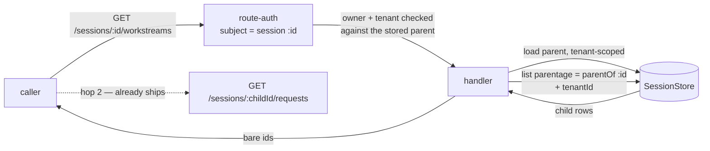

# FIX-1010: S1b — the parent-to-child read route and request metadata — Implementation Spec

**Linear:** [FIX-1010](https://linear.app/fixpoint-labs/issue/FIX-1010) · **Epic:** [FIX-939 — Durable jobs & detached-task substrate](https://linear.app/fixpoint-labs/issue/FIX-939) ([epic PR #993](https://github.com/fixpoint-labs/flow-state-dev/pull/993)) · **Follows:** [FIX-1009 (S1a, Done)](https://linear.app/fixpoint-labs/issue/FIX-1009), [FIX-982](https://linear.app/fixpoint-labs/issue/FIX-982) · **Blocks:** [FIX-1011 (S2)](https://linear.app/fixpoint-labs/issue/FIX-1011)

## Part I — The Case

### 1. Problem — why it matters, why now

An app can now start work that outlives the turn that asked for it — a long research job, a spec being written, an implementation running for an hour. That work runs in its own place, attached to the conversation that launched it. **The conversation cannot find it.**

Ask the server for a conversation's background jobs and there is no way to phrase the question. The pieces are all there: the database knows which jobs belong to which conversation, and once you have a job's id you can already read everything it did. What is missing is the first step — going from "this conversation" to "here are its jobs." Without it the user sees a turn that returned, and no trace of the hour of work it kicked off.

**Why now.** Two things arrive together. The substrate that creates these jobs is in development, and the moment it ships, every existing session list in the framework deliberately hides them (that was the previous change's whole point — background jobs must not pollute a user's list of conversations). So today the jobs are invisible to a caller and that is correct; from the day the substrate lands, they are invisible to a caller and that is a hole. Our own developer tool goes blind at the same moment. Everything downstream — the client library, the React hook, and the epic's end-to-end demo that gates its completion — is queued behind this one read.

There is no workaround an app can adopt. The query exists only inside the server process; nothing exposes it.

### 2. Solution in plain terms

Add one endpoint: **ask a conversation for its background jobs.** You address the conversation you already have, and you get back the jobs hanging off it. From there the endpoints that already exist take over — each job is itself readable, with its full history, exactly as a conversation is.

That is the whole shape: two hops. Not one flattened list of everything, because a background job is a first-class thing with its own history, not a filtered view of the conversation's messages. And we keep the promise the previous change made: nothing that lists conversations today starts returning jobs. Seeing them is something you ask for.

Each row also says which piece of work the job was for, stamped by the server when the job starts. Nothing a caller wrote is treated as fact.

**Whether the row also says how the job is *going* is the one thing still open.** The proposal was that each row carry its last run's status — running, finished, cancelled, failed. Review then established that a job merely *queued* is recorded as running, and the vocabulary has no word for the difference, so the row would say "running" about work nothing has started. That is decision 4, it is **not approved**, and §12 puts three options to you. Read §2 as: this endpoint definitely returns a conversation's jobs and what each is for; whether it also returns status is yours to settle.

**Philosophy** — tenet 2 (composition over features): this is one more read over a filter that already ships, sitting beside the endpoint that already lists a conversation's turns, and it composes with them rather than introducing a parallel "jobs API". Tenet 3 (earn every addition): the public surface grows by one endpoint and no new options on any existing one. Tenet 5 (fix at the owning layer): the tenant and ownership checks stay where routes already do them, so the new read cannot be the one that forgets.

> **§2 then §6 lead, and the rest is derivation.** Problem, then what we propose, then what you are signing. Everything from §3 down justifies it — read it if the sign-off is not obvious, skip it if it is.

### 6. Decisions & rules — the sign-off surface

1. **You reach a conversation's background jobs *through that conversation*, and you get them in two hops — the jobs, then each job's history.**
   *Rejected:* a "show me the jobs whose parent is X" filter on the flat list-conversations endpoint. It reads as the smaller change and it is the weaker one, because of **which permission check it lands in**. The flat listing is classified as a *host-wide* read: the framework authenticates the caller and then leaves the handler to narrow rows itself. A parent id arriving as a query string on that route is never loaded as a record, so it is never ownership-checked and never tenant-checked — it is only ANDed into a filter. Addressing the parent puts the read in the *session-addressed* class the sibling "list a conversation's turns" endpoint already uses, where the framework resolves the parent record and checks its owner before the handler runs.
   *Locks in:* background work permanently inherits its conversation's access rules — one conversation, one owner, one boundary — and that is what customers will build their UI against. The cost lands later and in one specific place: a "show me all my background work across every conversation" view is a second endpoint we would have to design, not a parameter we can add. We do not have a customer asking for that view, and we would rather owe them an endpoint than owe everyone an unchecked filter.
   *(An earlier draft justified this by saying the query-param route leaks whether a parent exists. Two reviewers independently showed that argument does not hold, for two different reasons: the addressed route answers 403 for a parent the caller does not own, which leaks existence too and deliberately; and the flat listing already forces the user filter to the authenticated caller and conjoins the tenant, so an absent parent and an unowned one would both come back as an empty list — no probe either way. The decision stands; the reason above is the one that survives.)*

2. **We do not ship a "list every conversation on the system" mode over the public API.** The database can do it, and in-process callers that genuinely need it — restart recovery, our own maintenance sweeps — keep using it. It is not reachable over HTTP.
   *Rejected:* exposing all three modes the database supports, on the argument that an operator will eventually want the god view.
   *Locks in:* no customer-facing endpoint can enumerate across ownership boundaries, so a mistake in a future auth change cannot turn one into a data leak. What it costs: an operator debugging a live system reads through the two hops like everyone else, which is more clicks. Our own developer tool is the first thing to feel that, and it is the case that convinced me the price is right — if the debug surface can live inside the boundary, a customer's admin panel can too. Reversible, but reversing it is a security review, not a patch.

3. **What a background job says about itself — which piece of work it was for — is stamped by the server when the job starts. Anything a caller wrote is display-only, and nothing in the product may act on it. This issue *guarantees* that; FIX-982 *writes* it.**
   *Rejected:* letting the launching call label its own jobs and treating that label as fact — it is one less moving part, and it makes the label a lie anyone signed in can tell, which matters the moment a UI groups, filters, or bills by it. Also rejected: this issue writing the stamp itself if FIX-982 has not. A conditional "if they didn't, we will" is two plans, it makes this issue's size unknowable at sign-off, and it puts two issues at one seam.
   *Locks in:* a customer's UI can label background work by the task it belongs to and trust that label; that promise is what we cannot cheaply take back once apps depend on it. What it costs is a hard dependency rather than a hedge — if the stamp is missing when this starts, that is a blocker to raise, not scope to absorb quietly.

4. **⚠️ CONDITIONAL — not approved, and not to be built until §12's open question is answered.** Review established that a queued job reads as *running* and that today's lifecycle has no word for the difference, so the distinction this decision promises is not currently expressible. The owner is choosing between dropping status from this route, narrowing to terminal states, and extending the request lifecycle. **The text below is what was proposed, kept unchanged so the owner is deciding against the real thing** — it is not a requirement an implementer may act on.

   **Everything in this spec that describes status is conditional on this same answer, and it is spread wider than one section.** Rules 1–5 and §8 step 3c describe *how* it would be built if it survives; §9's status rows and §10's status behaviours hang on the same answer.

   **A later round swept the rest of the document for the same voice and found fifteen further passages**, none of them a second approval: §2's plain-terms summary and §5's worked example (both show a `status` field — corrected directly, since those are what an owner reads at the gate); the liveness non-goal below, which describes what decision 4's status *is*; four in §3's cost derivation, including one that calls getting the storage there "part of this change"; six in §7 — the engine bullet, the "where the status comes from" prose, the "two queries" framing, rule 0's status-lookup half, rule 6's locked field set, and the flow-kind residual; and two doc deliverables in §11. **Where any of them still reads as settled it is stale, not binding.** The spec was written before this question opened and the settled voice was not retracted everywhere at once — this marker is the retraction, stated once rather than hedged fifteen times. §12's "Settled" block is the one that said so outright; it is now marked superseded and carries no force.

   **Each row reports the job's last recorded run status, and it reports the framework's real status vocabulary rather than a simplified one.** Seven states ship today — including *cancelled* and *interrupted*, which are exactly the outcomes this epic's background work produces — and the row passes them through unchanged.
   *Rejected:* keeping a copy of the status on the conversation record so the listing is a single query. That would add a write on **every** request completion across the whole product, foreground included, to a record already contended for conversation state — a system-wide cost to save reads on one screen. Also rejected: returning existence only and making the UI ask about each job separately, which turns one page load into one request per job. And rejected: collapsing the seven states into a friendly three, which would silently merge "someone cancelled this" with "this failed" and leave every downstream client unable to tell them apart.
   *Locks in:* the UI can show a customer whether their work is running, finished, cancelled or failed from a single call, and the client and React layers can type their rows against a vocabulary that already exists rather than one invented here. The cost is real and bounded: a little more server work per row, so the page has a ceiling and the view cannot be polled hard. **What we are *not* promising: that a job shown as running is alive.** A crashed worker reads as running until the system corrects it — the honest difference between this and true liveness.
   *And what this status is **about**:* the job's last **run**, not the state of the work itself. A job whose run finished may still have work outstanding for another attempt. Where a job is backed by a task, the task's own lifecycle is the richer and more authoritative account, and a UI that shows both must pick one as the row's status rather than merging them — see §12.

> **Non-goals** — the client library and React hook that will wrap this (S2 / FIX-1011, S3 / FIX-1012); *creating* background jobs, and stamping what runs in them (FIX-982); the end-to-end demo (S4 / FIX-1013); filtering jobs by topic or worker, which nothing asks for yet.
>
> **And one non-goal worth stating precisely, because an earlier draft got it wrong: *liveness*.** This read never asks whether a worker process is alive right now — that needs the substrate's own liveness machinery, can be unavailable by construction, and is a separate question nobody has filed. Decision 4's status is what the request store already durably wrote, which is a different thing: **a job whose worker crashed reads as running until reclamation corrects the record.** The earlier wording excluded both together and would have ruled out the one the product actually needs.
>
> **Size:** Medium, and **the scope has widened three times under review, always in the same direction** — worth knowing before signing it. It is one PR, but no longer "one package": beyond the engine route it now needs an ordering change in **all four** store implementations (rules 2 and 2b apply before the page is taken, so it cannot be done above them), plus index work in the two persistent ones — **and, if decision 4 survives as written, a new persisted field on the request record with a schema migration and a write on the request-creation path**, because nothing stored today can order two runs enqueued in the same millisecond (§12 prices it against the three options). §7 rule 5 states the storage requirement as a measured property rather than a named index, because four review rounds each named one and each was wrong. §3 carries two risks that are not priced in: the fix may reach into shared query-building code, and deploying the indexes against a populated Postgres blocks writes while they build.

---

### 3. Tradeoffs & alternatives

**The main alternative: a query parameter on the existing list-conversations endpoint.** `GET /sessions?parentOf=…`. It is one line of handler code and no new route, and the previous change (S1a) built the database filter in a shape that would accept it directly. Rejected per decision 1, on **which authorization class the read lands in**: that endpoint is classified host-wide, so a parent id in the query string is never resolved to a record and therefore never ownership- or tenant-checked; the addressed route inherits the session-addressed model the sibling request listing already uses, where the parent is loaded and its owner verified before the handler runs. Ergonomics favour the query param; the trust boundary favours the sub-resource, and it wins.

**The simpler approach, genuinely considered: ship nothing and let apps reach the store directly.** Apps that host the engine themselves could call the session store's filter from their own route today. It is insufficient for two reasons that are not about convenience. The store is not part of the public surface, so an app doing this is coupled to internals we change without notice — and the two hops only line up if the second one also matches, which means every app re-deriving the tenant and ownership rules the framework already implements. More decisively, the whole downstream chain (client, React, the demo that gates the epic) has to go through *one* transport shape; leaving it undefined means each consumer invents one.

**Where the genuine complexity is.** Not the query — that filter already ships and is tested across all four storage adapters. It is in the two places the new read touches an existing contract. First, the ownership check: the route has to be classified as *addressed at the parent* rather than host-wide, or it silently inherits the weaker model and decision 1 is undone without anyone noticing. Second, the read has to stay correct across the tenant boundary in the same way the sibling endpoints do — the parent is resolved as a tenant-scoped record and the child query is tenant-filtered, and both halves have to be there because either alone is a hole. §9 is mostly those two.

**The cost of decision 4, priced honestly — and it needs an index that does not exist yet.** Status is resolved per row, so a page of N jobs costs N extra reads on top of the one that finds them. An earlier draft of this paragraph claimed each of those was a keyed lookup because `session_id` and `(session_id, tenant_id)` are indexed. **That was wrong, and review caught it.** The lookup is `where session, tenant · order by start time · limit 1`, and **neither shipped adapter has any index on the start-time column at all** — the composite stops at the tenant, and the only time-ordered index is on a different column. So the database finds the child's matching rows, then **sorts that whole set** before the limit applies. `limit: 1` bounds what comes *back*, not the work done to produce it, and a Workstream accumulates runs over its life by design.

So the honest statement is conditional: **the cost claim holds only once the storage layer can serve these two query shapes without sorting, and getting it there is part of this change.** §7 rule 5 states that as a measured property rather than naming an index, and the reason is worth the owner knowing: **four consecutive review rounds each named a key order, and each was wrong** — for a NULL-safe tenant predicate a btree cannot serve, for a leading column that changed when the owner filter was added, for a missing secondary sort. Every failure was something only a query planner could have reported. A spec can fix the query shape and the requirement; it cannot validate an index, so it no longer pretends to.

What that costs, stated rather than waved through — and it has grown twice under review, both times wider. **It is a change in all four store implementations, not two.** Rules 2 and 2b need a secondary sort key applied before the page is taken, and that lives in the stores: the SQL adapters' `ORDER BY`, the in-memory and filesystem comparators. Indexes are on top of that, in the two persistent adapters. §7's "untouched" list shrank accordingly, and the size note says so.

**And "no downtime" was wrong.** An earlier draft said index creation is additive and idempotent, therefore free. Idempotent is not non-blocking: the Postgres schema path builds indexes with a plain create, which **holds a lock against writes for the duration of the build** — on exactly the large request and session histories this endpoint exists to page through. So deploying this against a populated database interrupts production writes unless the build is done concurrently or moved out of startup initialization. **Specify a non-blocking path or state the interruption as accepted** — but do not repeat the claim that there isn't one. Note the concurrent form cannot run inside a transaction, which constrains where it can live; that constraint is the implementer's to resolve, the requirement that it be resolved is not.

The bound is also **not universal**: the in-memory and filesystem adapters carry no indexes and scan by construction, so the no-sort property is a property of the production adapters rather than of the store contract.

**One risk that is real and is not priced away.** The tenant clause is emitted NULL-safe by shared query-building code, and if the only way to make it indexable is to change how that clause is built, the fix reaches beyond this issue's two indexes into code every store query goes through. That would be larger than described here and is a blocker to raise rather than absorb — the same rule decision 3 already applies to its own dependency. It is named because the previous four attempts each discovered their obstacle after the estimate was given.

**The alternative to that cost, and why it loses.** Keeping a status copy on the conversation record would make the listing a single query. It would also put a write on the request-completion path for *every* request in the product, foreground included, against the record that is already the contention point for conversation state — and that record's existing start-of-request write is deliberately last-writer-wins, which is fine for a pointer and wrong for a status that must not move backwards. Paying N indexed reads on one screen is the cheaper trade than a new system-wide writer.

**A note on sequencing, since it is a real cost.** This spec is written against work still in flight: the injection seam it relies on is in review, and the substrate that creates background jobs is in development. §12 lists exactly what is assumed and what happens if an assumption is wrong. The endpoint itself waits on none of it — it reads a filter that already ships and is testable against seeded records. Decision 3 is the one that does depend on the substrate, and it depends on it as a **prerequisite rather than a hedge**: if the substrate has not stamped a job's provenance by the time this starts, that is a blocker to raise against it, not work this issue quietly absorbs.

### 4. Focus practices (1–5)

1. **BP-031 (never authorize or route from caller-controllable input)** — this is decision 1 restated as an engineering rule, and it is the one thing that makes the route shape non-negotiable. The parent id must be resolved as a stored record under the caller's tenant, and the caller's identity must come from the resolved principal, never from a query parameter.
2. **BP-030 (tolerate the old shape)** — every existing caller of the conversation list must behave byte for byte as it does today. This change adds an endpoint; it must not alter one.
3. **BP-035 (walk the second-path checklist)** — the second path here is the *unowned* parent: a parent in another tenant, a parent belonging to another user, a parent that does not exist, and a parent that is itself a background job. A suite that only tests a parent the caller owns proves nothing about the boundary decision 1 exists to hold.
4. **Tenet 5 / one convergence point** — the new endpoint must go through the same route-authorization table and the same tenant-scoped session load the sibling reads use, not its own copy of the checks. A guard reimplemented per route is a guard that drifts.

### 5. What using it looks like (1–5 examples)

**Reading a conversation's background jobs, then one job's history** *(what this spec proposes; today the first call has no endpoint to hit).* **The `status` field below is decision 4 and is not approved** — under §12's option 1 it is absent from every row, under option 2 it is present but silent on running. Everything else in the shape is settled.

```
GET /api/flows/sessions/sess_abc/workstreams
→ 200 { "workstreams": [
    { "id": "ws_9f2…", "topic": "FIX-981", "status": "in_progress", … },
    { "id": "ws_1c7…", "topic": "FIX-982", "status": "aborted",     … },
    { "id": "ws_4b0…", "topic": "FIX-983", "status": null,          … }
  ] }
      ↑ `topic` is what the UI labels the row with — the body of work, not an
        opaque derived id. `coordinate` rides alongside it (which worker).
        `status` is the framework's own vocabulary, passed through: any of
        in_progress · completed · incomplete · failed · interrupted ·
        aborted · suspended. `null` means no run yet, and is deliberately
        not defaulted to "running" (§9).
        Note `aborted` — someone cancelled that job. Collapsing the union to
        a friendly three would have shown it as "failed".

GET /api/flows/sessions/ws_9f2…/requests        ← already ships, unchanged
→ 200 { "requests": [ { "source": "taskboard", "metadata": { "taskId": "task_…" }, … } ] }
```

**What the boundary does** *(decision 1):*

```
parent the caller owns              → 200, that parent's jobs
parent in another tenant            → 404, indistinguishable from absent
parent owned by another user        → 403 — "not yours", the answer the
                                      framework already gives for a session
parent that has no jobs             → 200 with an empty list, not 404
```

**What does not change** *(decision 2, and BP-030):*

```
before  GET /sessions → the caller's top-level conversations
after   GET /sessions → the caller's top-level conversations, byte for byte
        (no new parameter; background jobs are never returned here)
```

---

## Part II — The Build Plan *(for the implementing agent)*

### 7. Technical design

One new read on the engine's flow API router, sitting beside `list_session_requests` and built from the same parts. Nothing else in the engine changes shape.



- **`@flow-state-dev/engine`** — a new route kind in the parse/route tables, classified in the route-authorization table as **session-addressed on the path's `:sessionId`** (the same subject the sibling session reads use, *not* the host subject `list_sessions` carries). A handler that resolves the parent as a tenant-scoped record, 404s when it is absent, queries children through S1a's parentage predicate with the tenant conjoined, then resolves each child's last recorded status (decision 4) before returning. Bare session ids on the way out, matching what the existing session reads surface.
- **`@flow-state-dev/store-sqlite` and `@flow-state-dev/store-postgres`** — whatever it takes for rule 5's two query shapes to execute without a sort and without over-scanning, measured on each. Expected to be indexes; the shape is the implementer's, working against a planner rather than against this document. §3 names the risk that it reaches further than index lines.
- **All four store implementations — the ordering itself.** Rules 2 and 2b require a secondary sort key *before* the limit and offset are applied, and that happens inside the stores: the two SQL adapters build the `ORDER BY`, and the in-memory and filesystem adapters sort with comparators. **Neither the route nor an index can repair ordering after the page has been selected**, so this is store work in all four, with their tests. An earlier draft of this bullet said the four implementations were untouched and confined adapter work to schema additions; both were wrong.
- **Untouched:** the `SessionStore` *contract* (S1a shipped the predicate; the ordering change is in the implementations, not the interface), the existing list-conversations handler and its default, the request-completion path, `client`, `react`, the DevTool, and every execution path. **The last item is conditional on decision 4**: rule 2's chronology-preserving sequence has to be stamped where the request record is created, so if decision 4 survives as written, the request-*creation* path and the `RequestRecord` schema are touched too. §12 prices it.

**Where the status comes from, and where it must not come from.** The conversation record carries no status — its only run-adjacent field records which request last *started*, written before the run and never updated when one ends, so it cannot answer "did this finish." The status therefore comes from the request store, per child, under rule 5's property. **Nothing on the request-completion path changes**, and no status is copied onto the conversation record; decision 4 rejected that and §3 prices why.

**Seven rules bind the two queries — the child listing and the per-child status lookup. They are not the implementer's to weigh: each is a defect if dropped, and most of them are silent.**

0. **Both queries conjoin the parent's owner *and* the parent's flow kind, read from the stored parent record.** Route authorization checks the *parent* only, and the parentage predicate matches on parentage and tenant alone. Two things leak through that gap, and they are the same defect twice:

   - **A child carrying a different `userId`** while naming this parent is returned with its status, across a user boundary nothing checked.
   - **A child carrying a different `flowKind`** is returned too — and that one crosses an *authentication* boundary. A public parent on the default resolver authorizes anonymously; a child stamped with a protected flow's kind is then handed to that anonymous caller, even though hop 2 on the same child rejects them. The route becomes a way to read summaries out of a flow that authenticates, through one that does not.
   - **And the same defect a level down: a *request* carrying a different `flowKind` inside a child whose flow kind matches.** The two bullets above are about the child *session*; this one is about what ran inside it, and the session-level conjunction does nothing for it. `RequestRecord` carries its own `flowKind` — the kind the action was *dispatched* under — and **nothing binds it to the session's.** Verified: the adopt-an-existing-session branch of `createExecutionContext` checks `userId` and `tenantId` (and `orgId`) and stops there; the three binding errors the engine defines are user, org and tenant, and there is **no flow-kind binding error at all**. The action route takes `sessionId` from the path or the body, so a request dispatched under a protected flow can be recorded inside a session stored under a public one. The status lookup would then report that protected run's status on a row an anonymous caller is reading.

   Nothing prevents any of the three records. `SessionRecord` constrains parentage to neither same-owner nor same-flow, the store contract does not either, and the only writer that happens to inherit both is a convention of one code path. §7 deliberately returns *every* generic child (below), which is exactly what makes them reachable — a second writer of `parentSessionId` inherits nothing by construction.

   Conjoin `userId` **and** `flowKind` from the **loaded parent record**, not from the principal: the parent is already resolved and tenant-checked, so both are trusted server-side values, and they work on the default resolver where no principal exists. **Both queries carry both clauses** — `SessionListOptions` and `RequestListOptions` each already expose `userId` and `flowKind`, so this is a query change on both and a store change on neither. On the status lookup the `flowKind` clause matches the *request's* recorded kind against the parent's, which is what closes the third bullet; rule 5's shapes carry it explicitly.

   **What this does and does not buy.** It makes *this route's* rows honest without depending on any writer's convention — that is the whole of what rule 0 claims. It does **not** repair the two levels below, which are outside this issue: `list_session_requests` (hop 2) applies no flow-kind filter, and dispatch enforces no flow binding, so a foreign-flow request inside a public-flow session is still readable in full through hop 2. See "the residual" below and §12.
1. **Every lookup is tenant-scoped, with the tenant key *present*.** The request-listing filter applies no tenant restriction at all when the key is **absent**, and the whole reason that asymmetry exists is that a tenanted record and an untenanted one can share a bare session id. A lookup that omits the tenant therefore reads across every tenant, and colliding child ids let one tenant's row display another tenant's job status. Pass the request context's tenant, **present and possibly `undefined`** — an explicit `undefined` exact-matches untenanted records and is *not* the same as leaving the key off. This is a data-isolation boundary, not a filter.
2. **Select the latest run by *start time*, not by the default ordering.** The listing's default orders by last-modified, and the start-time ordering exists precisely so a late write cannot change which run is newest. Concurrent runs are ordinary here: R1 starts, R2 starts, R1 completes — under the default R1 sorts first and the row reads *completed* while R2 is still running. That is decision 4 reporting the opposite of the truth, and a fixture with one request per Workstream cannot catch it.

   **A simpler mechanism was proposed and is wrong — do not "simplify" back to it.** The conversation record's `latestRequestId` looks start-ordered by construction, which would make this one keyed `get` with no tenant argument and no history to bound, collapsing rules 1 and 3 too. It does not hold, for three reasons, and the first is decisive because it is *specific to background work*:

   - **The request record is written at enqueue; `latestRequestId` is written when the run starts.** A queued request is materialized into the request store before it is allowed to run, while the session's pointer is only updated once execution actually begins. Detached work is the queued path, so between enqueue and start the pointer still names the *previous* run — the row would report a finished job while its next run sits queued. The start-time listing sees that queued record; the pointer does not.
   - **The pointer is a read-modify-write with last-writer-wins.** Two runs starting close together in one Workstream — the ordinary adopted case, a second task on the same topic — can interleave so the *earlier* starter writes last, leaving the pointer on the older request. Same inversion, different direction.
   - **The write is conditional and skipped silently** when the session is missing or its tenant does not match, leaving the field stale with nothing to signal it.
   **Start time alone is not a total order, and `limit: 1` needs one — but a total order is not enough either.** The timestamp is milliseconds and every adapter sorts on it with no tie-breaker, so two runs enqueued in the same millisecond — the ordinary case when a coordinator files several tasks at once — tie, and the row that comes back is whichever the storage engine returned. That hands back the older terminal run instead of the newer live one.

   An earlier version of this rule asked for "a persisted tie-breaker that totally orders runs", and **that wording is satisfiable by something that does not fix the bug.** Sorting ties by request id is a total order, is persisted, and is identical on every adapter — so it would pass the determinism test this rule first asked for — while still selecting the *earlier* run, because request ids carry no chronology: they are **caller-supplied when the caller provides one**, and otherwise a timestamp with a **random suffix** that decides ties arbitrarily. Nothing on the record carries an enqueue sequence.

   So the requirement is **a persisted, chronology-preserving sequence**: for two runs with equal timestamps, the one enqueued *later* must sort first. Determinism is necessary and is not the property. An index cannot supply it — an index changes the plan, not the order. §10 asserts **that the later-enqueued tied run wins**, per adapter and identically across them; an assertion that merely pins "every adapter picks the same row" passes against the broken ordering.

   **This is a new persisted field, not a sort tweak, and it is deliberately not designed here.** No stored field carries enqueue order, so meeting the rule means a schema migration on both persistent adapters and a stamp on the request-creation path — which is why §12 prices it inside the open question rather than in this rule. It exists only to make decision 4 truthful, so it is one of the things option 1 deletes.
2b. **The child listing needs a total order too, and for a different reason: paging.** Same defect as rule 2, one level up and with a worse symptom. The listing orders by last-modified with no tie-breaker, and children updated in the same millisecond are ordinary — a coordinator files several jobs at once, or a sweep touches a batch. Under `limit`/`offset` paging, tied rows can be returned in a different order between page 1 and page 2, so **a child appears twice and another never appears at all**. That is worse than a wrong status: the caller cannot detect it, and retrying gives a different wrong answer. Sort on a persisted tie-breaker after the timestamp, exactly as rule 2 requires for runs, and assert stable paging across a tied boundary in §10.
3. **Bound each child's read to one record.** The page cap bounds how many children are read, not how much of each child's history comes back, and a Workstream accumulates runs over its life by design. Ask for one.
4. **Pass the status through unchanged.** Seven states ship; do not map, collapse, or default them (decision 4). A child with no runs reports absence, and absence is not a status. **See §12's open question before relying on what a non-terminal status means.**
5. **Both queries must execute without a sort and without over-scanning — stated as a property, because a spec cannot validate an index and only a planner can.**

   Four rounds of review each named a key order, and each time the reason it failed was something only `EXPLAIN` against a real adapter would have said: a NULL-safe tenant predicate a btree cannot serve, a leading column that changed when rule 0 added the owner, a missing secondary sort. Naming a fifth key order has no better odds than the last four. So this rule fixes **the query shapes, the property, and the verification** — and leaves the physical design to whoever can run the planner.

   **The two shapes, complete and current.** Both carry every clause rules 0–3 impose, and both are what the store must be able to serve:

   ```
   child listing   where parent = :parentId
                     and owner  = :parentOwner            (rule 0)
                     and tenant NULL-safe-equals :tenant  (rule 1)
                   order by last-modified desc, <tie-breaker> desc
                   limit :pageSize offset :offset

   status lookup   where session   = :childId
                     and owner     = :parentOwner           (rule 0)
                     and flow-kind = :parentFlowKind        (rule 0, third bullet)
                     and tenant    NULL-safe-equals :tenant (rule 1)
                   order by start-time desc, <tie-breaker> desc
                   limit 1
   ```

   **The property.** On **both** persistent adapters, each shape executes with **no sort step** and scans **no rows outside the caller's owner and tenant**. Both halves matter: a plan that uses an index and then filters most of what it read still costs what this rule exists to prevent.

   **The verification. One assertion is shared; only the evidence differs.** **Both adapters must assert that every equality predicate in the shape is served by the index** — that is the same requirement, written twice, and it is the half that actually catches over-scanning. What differs is only what each can be asked *beyond* it: Postgres can report what it actually did, SQLite cannot, and pretending otherwise makes the requirement unsatisfiable there. **An earlier version of this rule got that split backwards** — it demanded full predicate coverage on SQLite and let Postgres assert output rows instead, which left the directly-measurable adapter with the weaker gate (see the calibration note below):

   - **Postgres — assert the property directly, and assert predicate coverage the same way SQLite does.** `EXPLAIN (ANALYZE)`, asserting three things: **no `Sort` node**; **every equality predicate in the shape above appears as an `Index Cond`**, none of them left to a `Filter`; and **`Rows Removed by Filter` is zero (or accounted for), with `loops` multiplied in** when the node sits under a nested loop.

     **Why the first two are not enough on their own, which is how this gate was wrong until now.** A scan on a partially covering index pushes only the covered predicates into `Index Cond`, applies the rest as a `Filter`, and — because the index still supplies the ordering — produces **no `Sort` node at all**. `limit 1` then stops execution early, so the node reports **`rows=1`**. The gate passes while `Rows Removed by Filter` sits in the thousands. **Scan-node output rows are rows *returned*, not rows *examined*** — that is the whole trap, and it springs precisely when one owner and tenant has many unrelated sessions or requests, which is the shape this endpoint exists for. Rows examined is `Index Cond` coverage plus removed rows plus loops, never the `rows=` figure alone.
   - **SQLite — assert an observable proxy.** `EXPLAIN QUERY PLAN` reports the plan and nothing else: there is no `EXPLAIN ANALYZE`, and no row counters reach the driver, so "rows scanned" cannot be asserted. The proxy is the plan shape, pinned exactly: a **`SEARCH` (never `SCAN`) using an index that covers *every* equality predicate in the shape above**, and **no `USE TEMP B-TREE FOR ORDER BY`**. Requiring full equality coverage is what makes the proxy mean something — a `SEARCH` on a partially covering index reads more than it needs and looks identical otherwise.

   Both under a fixture that contains a same-tenant cross-owner child and equal timestamps. **Not** an assertion that an index exists: Postgres is precisely the case where one exists and is declined, so an existence check passes while nothing improves.

   **The note.** Satisfying this may need a different key order, a partial or expression index per predicate branch, or a rewrite of how the tenant clause is emitted. That choice is not the spec's — but the requirement is, and **it is not met by a query that returns the right answer slowly.** This endpoint is polled, and a wrong plan is invisible in a fixture with three rows.
6. **The response shape is a locked summary, not a spread of the stored record.** The sibling listing returns whole session records, which on this endpoint means every row carries the child's `state`, its `resources`, and its **append-only `journal`** — unbounded per row, multiplied by the page. Leaving narrowing "optional" (an earlier §13 note) is how that ships. **Name the fields the wire contract carries** — identity, parentage, `topic` and `coordinate`, timestamps, and the status — and return those, not `...record`. `topic` and `coordinate` are not droppable from that set (below); the point of the rule is that everything *outside* it is.

**What each row carries about *which* work it is — settled, so the client and React specs can stop hedging.** A Workstream's session record gains optional **`topic`** and **`coordinate`** fields, declared and written by FIX-982; this route returns the child records, so both arrive on every row for free and this issue builds nothing for them. `topic` is the useful label — it names the body of work — and `coordinate` names the worker. **`boardId` is *not* a field on the session record**: it participates in deriving the child's id and lives on the board's own config, but it is not persisted on the record and therefore is not on the row. A consumer that has pinned its row shape to `boardId` needs to drop it or get it added by FIX-982.

Both fields are **optional by design** (BP-030): an ordinary child session has neither, and a record carrying neither is by definition not a Workstream — which is the same signal a client needs to decide whether a row is labelable. **Both are inside the locked field set of rule 6 and may not be dropped from it** — without them a UI can only label background work by an opaque derived id, which is most of what makes the list unreadable.

**What this endpoint actually returns: every child session, not only detached ones.** The predicate is generic `{ parentOf }` — it selects on parentage, and nothing on a session record marks it as task-board work. Today every child *is* a Workstream, because the detached-start path is the only writer of `parentSessionId`, but that is a fact about the current tree and not a filter the route applies. **Neither the docs nor the response shape may imply otherwise.** The wire name is a product label over a parentage read, and if a second kind of child session is ever introduced this endpoint returns it — which is the correct behaviour and must not read as a bug. The name itself (`workstreams` versus the more literal `children`) is the implementer's call; §13 carries the reviewer's preference.

**The parentage predicate's third mode is not reachable from here.** S1a's contract is tri-state — `"top-level"` (the default), `"all"`, and `{ parentOf }`. This route only ever passes `{ parentOf }`, derived from the path. `"all"` stays an in-process capability (decision 2); no query parameter maps onto it, and the handler must not grow one.

**Request provenance — read here, written by FIX-982.** The relationship a caller reads is carried on two records, both server-written, and **this issue writes neither**. The child *session* records its parent (`SessionRecord.parentSessionId`, shipped in S1a, written by the detached-start path). The child *request* records which task it ran, on `RequestRecord.source` and `RequestRecord.metadata` — already persisted from the dispatch envelope and already returned by the requests endpoint. The one piece that does not exist yet is the slot that lets the *detached* start path set them: its start operation takes a session id, an input and an action name, with no provenance parameter. **That slot is FIX-982's** — its own testing contract asserts a detached request carries the task-board source and its task id in metadata, so it cannot ship without one. This issue reads the result and pins it; see §8 step 1 and §12.

**Hop 2 and the parent's authentication policy — one direction holds, the other does not, and an earlier draft of this paragraph asserted a check that does not exist.**

*The direction that holds: a protected parent.* A reviewer asked whether, in a mixed app where the parent's flow authenticates, the child could be served anonymously — route authorization picks the resolver from the *addressed* record's flow kind. It cannot. A Workstream is not a separately registered flow kind: the detached core is assembled per hosting flow and reached through a source-gated dispatch branch, so the child session carries the parent's `flowKind`, resolves the parent's resolver, and hop 2 refuses the anonymous caller exactly as hop 1 does. That is a **guard, not a fix** — the property holds, nothing states it, and rule 0 now makes it a property of hop 1's *query* rather than of the writer. **Constraint on FIX-982: a Workstream's flow kind is its parent's.** §10 asserts it from the outside.

*The direction that does not: a **public** parent with a protected **request** inside a child.* An earlier draft justified the paragraph above with "the adoption check refuses any record whose flow kind differs." **That check does not exist.** `createExecutionContext`'s adopt-an-existing-session branch validates `userId`, `tenantId` and `orgId`; the engine defines user, org and tenant binding errors and no flow-kind one. So nothing binds a *request's* flow kind to its *session's*, and three shipped behaviours compose into a leak:

1. the action route takes `sessionId` from the path or the body, so a caller authenticated to a protected flow can run it inside a session created under a public flow;
2. `list_session_requests` filters on `sessionId` and `tenantId` only — there is no flow-kind clause;
3. route authorization for a session-addressed route picks the resolver from the **session's** flow kind, and a public flow's default resolver returns early with no principal and no ownership check.

Result: hop 2 on that child hands the protected flow's request — items included — to an anonymous caller. It is a **pre-existing defect in `list_session_requests` and in dispatch adoption, not one this route introduces**, and its reach is narrowed but not closed by FIX-982's reservation of the `ws_` prefix at caller-supplied boundaries: this route deliberately returns *every* generic child (above), and an ordinary child session carries no reserved prefix.

**What this issue does about it: rule 0's third bullet, and nothing more.** The status lookup conjoins the parent's flow kind, so *this route's* rows never report a foreign-flow run — a child whose only runs are foreign-flow reports absent status, which is the honest answer and not a defect. **Fixing hop 2 or dispatch is out of scope and is filed rather than absorbed** (§12): adding a flow-kind filter to `list_session_requests` changes an existing endpoint's results, and adding a flow-kind binding at adopt makes a dispatch that is accepted today start throwing. Both are real, both are wider than one route, and decision 3 already sets the precedent — raise it, do not quietly grow this issue to cover it.

**Calibration note — a partial fix has now recurred twice on this spec, along two different axes. Whoever reviews the next fix here should check both.**

*Axis 1 — altitude. Rule 0 was correct at the session level and left the request level open. The level below the one you checked is where this class keeps landing.*

*Axis 2 — symmetry. **When a rule is verified differently on two adapters, a fix to one half is not done until the other half has been re-checked against the same failure mode.** Rule 5's full-predicate-coverage clause was added to the **SQLite** proxy precisely because a partially covering index would slip through — and the **Postgres** half was left asserting actual rows, which has exactly the same hole. The asymmetry then inverted: the adapter whose behaviour can be measured directly ended up with the **weaker** gate, because the half that looked stronger was never re-read against the failure the other half had just been taught to catch. Rule 5 is now on its fifth formulation; four earlier rounds each named an index and each was wrong (§6's size note), and this fifth correction was not about an index at all — it was about the gate failing to measure what it claimed.*

*The generalization, stated once so it outlives this rule: a fix that lands on one of two symmetric halves is half a fix, and the surviving half is more dangerous than the original defect, because it now sits behind a gate that reads as green.*

**No new verb on the injection seam.** The seam is deliberately closed at four verbs, and enumerating children is not one of them — nor should it be. This read is a route, reached by a client over HTTP, not a capability reaching the runtime from inside a block. Nothing here goes near `ctx.requestHost`, and nothing here casts.

*No solution sketch.* This extends an existing pattern almost exactly — `list_session_requests` is the same route shape, the same subject classification, and the same tenant-scoped parent load. Pointing at it is better than re-sketching it.

### 8. Implementation sequence

**The route work does not wait on anything.** Steps 2–4 build and test against **hand-seeded parent and child session records** — the parentage predicate ships, so a child session is two `store.set` calls in a fixture. No substrate, no flow, no detached dispatch. That is what keeps this issue one endpoint and roughly 200 lines.

1. **Check what FIX-982 landed on the provenance stamp** — a read, not a build. Does a detached request arrive with `source` set to the task-board value and its task id in `metadata`? **If it is missing, that is a blocker: raise it against FIX-982 and do not implement the write path here** (decision 3). Either way the route work continues — it does not depend on this. *Depends on:* nothing.
2. **Register the route** — parse table, route table, and the route-authorization subject. Handler returns an empty list. *Test:* the route resolves; the authorization table classifies it as session-addressed on the path id (this is the assertion that holds decision 1, and it belongs here, before the handler can mask it). *Depends on:* nothing.
3. **Implement the read.** Resolve the parent tenant-scoped, 404 on absent, list children with `{ parentOf }` conjoined with the tenant, apply the limit default and cap (§9), surface bare ids. *Test:* the §5 cases and the §9 table, all against seeded records. *Depends on:* 2.
3b. **Make the child listing meet §7 rule 5's property on both persistent adapters** — no sort step, no rows scanned outside the caller's owner and tenant, for the listing shape rule 5 writes out. **Work against the planner, not against this document:** run `EXPLAIN`, see what it actually does, and change whatever it takes — key order, a partial or expression index per predicate branch, or how the tenant clause is emitted. Four rounds of this spec each named a key order and each was wrong for a reason only the planner could have surfaced, which is why the target here is a measured property. Expect the two adapters to answer with different evidence: Postgres reports actual rows under `EXPLAIN (ANALYZE)`, SQLite reports a plan and nothing else (§7 rule 5). *Test:* the per-adapter assertions from §10. *Depends on:* 3. *(The status lookup's half of this belongs to 3c and waits with it.)*
3c. **⚠️ BLOCKED — do not build until §12's open question is answered.** Resolving last recorded status per row (decision 4) — owner and tenant conjoined, ordered by start time with the tie-breaker, one record per child, inside the page the cap bounds. **Building this as written ships the false-*running* behaviour the open question exists to prevent**, so it waits on the answer rather than proceeding on the assumption that decision 4 survives. If the answer drops status, this step and its tests disappear; if it narrows to terminal states, the shape stays and what the row may say changes. *Test (when unblocked):* a child whose last run completed, one that failed, one cancelled, one with no runs at all; the two-tenant case; the cross-owner case; the overlapping-run case; the equal-timestamp case; and the plan check from §10. *Depends on:* 3, 3b, **and the owner's answer.**
4. **Pin the untouched default.** Assert the existing list-conversations endpoint is unchanged with a child session present in the store — no new parameter, no new rows. *Depends on:* 3.
5. **Pin the provenance round-trip** — a seeded `RequestRecord` carrying a server-stamped source and task id is returned intact by the requests endpoint, and caller-written metadata on an ordinary request is not treated as provenance. Seeded, so it needs no detached-start edit in this PR. *Depends on:* 3.
6. **Documentation** per §11.

**Nothing to remove.** This change is purely additive; S1a already deleted what it obsoleted, and no helper here supersedes an existing one. Stated explicitly rather than left silent (tenet 3): if the implementer finds a hand-rolled parent-to-child read anywhere in the tree — including in the DevTool — that is dead on arrival and should go with this change.

**Single PR.** One package, one coherent surface; no PR plan.

### 9. Edge cases & error handling

| Case | Expected |
|---|---|
| Parent does not exist | 404, same shape the sibling session reads emit |
| Parent exists in another tenant | 404 — the tenant-scoped load returns nothing on a tenant mismatch, so a cross-tenant probe is indistinguishable from absent |
| Parent owned by another user | 403, from the shared route-authorization path — deliberately not 404, because the caller authenticated and already holds the id. Do not add a second answer here |
| Parent exists, has no children | 200 with an empty list. Not 404 — "no background work" is an ordinary answer, and a client that has to branch on it will get it wrong |
| Parent is itself a Workstream | 200 with its own children. Nesting is legal; the routing key is per-parent, so a job that files sub-jobs is a tree and this read is one level of it |
| Caller is anonymous, in an app where some flow authenticates | Follows the existing cross-flow withholding rule for session reads. Do not invent a third policy |
| A child row written before the parentage field existed | Reads back as absent parentage and is therefore top-level, never a child (BP-030). It cannot appear under any parent |
| A child with **no request record at all** | Status is absent, not invented. Do not default it to running. Note this is narrower than "not started" — see the row below and §12's open question. Absent is now also what a child reports when its only runs belong to another flow (row below) |
| A child whose run is **queued but not yet picked up** | Reads `in_progress`, because the record is written with that status at enqueue. **This is the subject of §12's open question and is not settled** — decision 4's not-started/running distinction is not expressible against today's lifecycle. Do not paper over it with an invented value |
| A child owned by a different user, naming this parent | Not returned. The listing conjoins the stored parent's owner (§7 rule 0); without it the row and its status cross a user boundary that route authorization never checks |
| A child stamped with a **different flow kind**, under a public parent, read anonymously | Not returned. The listing conjoins the stored parent's flow kind (§7 rule 0). Without it an anonymous caller reads summaries out of a flow that authenticates, by going through one that does not — hop 1 allows, hop 2 rejects, and the row has already been handed over |
| A child whose flow kind matches, containing a **request stamped with a different flow kind** | The row is returned; its **status is absent**, because the status lookup conjoins the parent's flow kind too (§7 rule 0, third bullet). Absent here means "no run belonging to this conversation's flow", which is the same answer a child with no runs gets. **Hop 2 on that same child still returns the foreign-flow request in full** — a pre-existing defect in `list_session_requests` and in dispatch adoption, out of scope and filed (§7, §12). Do not close it by widening this route's filter |
| Two runs whose start timestamps are equal | Resolved by the tie-breaker (§7 rule 2), deterministically and the same way on every adapter. Not left to storage order, which can return the older terminal run and silently undo the overlap guarantee |
| A child whose worker crashed | Reads as running until reclamation corrects the record. Correct per decision 4 and explicitly not a bug — this read reports what was recorded, not what is alive |
| A child with several runs (a follow-up into the same job) | The most recently **started** run's status (§7 rule 2). Not an aggregate across runs, which would have to invent a merge rule |
| Two runs overlapping — an earlier one finishes after a later one starts | The later run's status, so the row reads *running*. Under the default ordering this inverts and reads *completed*; §7 rule 2 exists for this case alone |
| A run queued but not yet started | It is the latest run and it counts. The request record exists from enqueue, so it is selected like any other |
| Two tenants whose child sessions share a bare id | Each sees only its own job's status. The status lookup carries the tenant key (§7 rule 1); omitting it reads across tenants and is a data-isolation defect, not a missing filter |
| A run in a state the UI did not anticipate — cancelled, interrupted, suspended, incomplete | Returned as-is. Seven states ship and all seven can reach a row; the route maps none of them (§7 rule 4) |
| Mixed app: parent's flow authenticates, caller is anonymous | Both hops refuse identically, because a Workstream carries its parent's flow kind (§7). Assert it rather than assume it |
| Very many children, or `limit` omitted | **A server-side default applies, and an explicit `limit` is capped.** Do not copy the sibling handlers here: they forward `limit`/`offset` straight through, and the store adds no bound when `limit` is undefined — so an omitted `limit` is an unbounded read. That is tolerable on an endpoint a person opens; it is not on one a UI polls per conversation. Follow the resource-listing precedent instead, which pins a maximum and answers 400 above it. The numbers are the implementer's; having both is not |
| `limit` above the cap, or non-numeric | 400 naming the accepted range, matching the resource listing's behaviour. Not a silent clamp — a caller that asked for 5000 and got 200 back with no signal will page wrongly |

**Taxonomy:** every failure here is fatal-and-final for the request, and none is retryable — an unknown or unowned parent does not become known by trying again. There is no degraded mode: this read either answers within the boundary or it does not answer.

**Second-path checklist (BP-035), the rows that apply.** *Multi-tenant:* covered above, and it is the row most likely to be tested only in the happy direction. *Legacy:* the pre-parentage record row above. *Null boundary:* absent versus null parentage both mean top-level, per S1a's contract — guard with `== null`. *Concurrency:* a child created while the list is being read may or may not appear; that is acceptable and needs no locking, but it must not error. *Cancel/error and cost-observability:* not applicable to a read of this size, stated so the omission is deliberate.

### 10. Testing strategy

**Goal & goal check.** No standalone goal check applies at this issue's boundary, and the reason is the epic's own structure: the observable outcome a user cares about — launching background work and watching it be found from the conversation — is FIX-1013 (S4), which is the epic's BP-003 evidence path and gates its wrap. This issue's contribution to that goal is one endpoint, and the honest check for it is an integration test over the real route rather than a second demo. **Evidence path:** the engine's route-level test suite exercising the new endpoint against a store seeded with parent and child sessions, plus the round-trip in behaviour 5 below.

**CI specs** (the behaviours, not the test names):

- **One behaviour per decision in §6**, in observable terms — what a caller of the endpoint sees, not how it is computed.
- **The boundary, from the outside**: every row of §9's table, exercised as a request against the route rather than as a call to the store. Testing the predicate again would re-prove S1a; what is unproven is that the *route* reaches it correctly and refuses correctly.
- **The authorization classification itself**, asserted directly: the route's subject is the path's session id. This is the one test that fails loudly if a future refactor reclassifies the route as host-wide, which is how decision 1 would be silently undone.
- **What must not change**: the existing list-conversations endpoint, with a child session present in the store, returns exactly what it returns today.
- **The provenance round-trip**: a detached request's server-stamped `source` and task id survive to the requests endpoint. Pair it with the negative — caller-written metadata on an ordinary request is returned as data and is not treated as provenance by anything.
- **The invariant that is easy to state wrongly**: a child appears under exactly one parent, and *never* in a top-level listing. The tempting assertion is that the two result sets are disjoint, which is true but weak — it passes if both are empty. Assert the child is present in the parent's list *and* absent from the top-level list, in the same fixture.
- **Both hops refuse together in a mixed app** — a flow that authenticates, a Workstream under it, an anonymous caller: hop 1 and hop 2 must give the same answer. This is the guard on the flow-kind invariant in §7, and it is deliberately written as a behaviour of the *pair* rather than of either route, because the failure it catches is one route drifting away from the other. **Only this direction — protected parent — is asserted.** The inverse (a public parent holding a protected *request*) does not refuse today and is filed rather than fixed (§12); assert this route's half of it in the bullet below instead.
- **The status read scales with the page, not the parent** — a parent with many children, read one page at a time, must not read the request store once per child in the whole set. **Counting reads is not enough and would pass while each read returned an entire history**: assert the *bound on each read* as well as their number (§7 rule 3).
- **Each query shape executes with no sort step and scans no rows outside the caller's owner and tenant** (§7 rule 5) — and **the two persistent adapters are asserted differently, on purpose**. **Both assert that every equality predicate in the shape is served by the index** — that requirement is shared, and it is the one that catches over-scanning. Postgres: `EXPLAIN (ANALYZE)`, asserting **no `Sort` node**, **every equality predicate as an `Index Cond`** (none demoted to a `Filter`), and **`Rows Removed by Filter` zero or accounted for, with `loops` multiplied in**. SQLite: `EXPLAIN QUERY PLAN` only, asserting a **`SEARCH` (never `SCAN`) on an index covering every equality predicate**, and **no `USE TEMP B-TREE FOR ORDER BY`**. The remaining asymmetry is not laziness — SQLite has no `EXPLAIN ANALYZE` and surfaces no row counters through the driver, so removed-row accounting is unassertable there and the plan shape is its observable proxy. **Do not assert the scan node's output rows as if they were rows examined**: with `limit 1` a partially covering index scan reports `rows=1`, emits no `Sort`, and still discards thousands under `Rows Removed by Filter` — the exact over-scan this rule exists to catch, passing the gate. Three things neither half is: not an assertion that an index exists (Postgres is precisely the case where one exists and is declined); not a plan check that merely looks for "index used, no sort", which passes while the plan reads most of the table and filters it; and not a timing assertion. Both fixtures must contain **a same-tenant cross-owner child and equal timestamps**, and enough rows that a sort would be visible — three rows proves nothing. **Deliberately not asserted for the in-memory and filesystem stores**, which have no indexes and scan by construction.
- **Paging over a tied boundary is stable** (§7 rule 2b) — children sharing a last-modified timestamp, read as two pages: every child appears exactly once across the pages, and none appears twice. This is the assertion that fails if the listing has no tie-breaker, and the failure is invisible to a caller, which is why it has to be caught here.
- **A same-tenant child owned by another user is not returned** (§7 rule 0) — seeded directly, since no shipped writer produces one, which is the point: the guard exists so the property does not depend on one writer's convention. Two accounts in one tenant, a child naming the first account's parent but owned by the second: absent from the listing, and its status never resolved.
- **On equal start timestamps, the later-enqueued run wins** (§7 rule 2) — asserted per adapter *and* asserted identical across them. **Do not assert determinism alone**: "every adapter picks the same row" passes against a tie broken by request id, which is a total order that carries no chronology and selects the earlier run. The behaviour under test is recency, not agreement.
- **A cross-flow child is not returned** (§7 rule 0) — a public parent on the default resolver, a same-tenant same-owner child stamped with a protected flow's kind, an anonymous caller: the child is absent from the listing. Pair it with hop 2 rejecting the same caller on that child, so the test shows the two routes agreeing rather than each being separately plausible.
- **A cross-flow *request* does not reach the row** (§7 rule 0, third bullet) — the same fixture one level down: a public parent, a public child that legitimately belongs to it, and a request record inside that child stamped with a protected flow's kind. The row is returned and its status is **absent**. This is the assertion that fails if the status lookup conjoins only owner and tenant, and it is written against the *request* record because the session-level assertion above passes while this one fails. **Do not extend it into an assertion about hop 2**, which still returns that request today — pinning that as correct is the opposite of what §12 files.
- **The response carries the locked field set and nothing else** (§7 rule 6) — in particular a child with a large `journal` returns a row that does not contain it. Asserting the shape, because "we narrowed it" is not observable from a test that only reads the fields it expects.
- **The overlapping-run case, explicitly** — R1 starts, R2 starts, R1 completes; the row reads *running*. Two reviewers reached this scenario independently, which is a good predictor that an implementer will too, after it ships. A fixture with one request per Workstream cannot catch it, so the fixture must have two.
- **Two tenants, one bare child id** — each parent's listing shows only its own tenant's status. This is the assertion that fails if the status lookup drops the tenant key (§7 rule 1), and it must fail loudly in CI rather than rely on an implementer remembering.
- **Every status the framework can produce survives the round trip** — including cancelled and interrupted, which this epic's own background work generates. A test that only exercises completed and failed would pass against a route that silently collapses the rest.

**Discipline:** `tdd`. The seam is the flow API router — reachable from vitest by constructing the router over an in-memory store and issuing `Request` objects, with no HTTP server and no live flow, so every behaviour above is a tracer bullet.

### 11. Documentation plan

- **EXTEND** `apps/docs/docs/server/setup.md` — add the endpoint to the HTTP route table, which already lists every session read. One row, next to `/sessions/:sessionId/state`.
- **EXTEND** `apps/docs/docs/server/authentication.md` — the page already distinguishes the two cross-flow endpoints from the addressed ones and explains what each scopes by. The new route is addressed, and saying so here is what keeps that section true. Also the place to state, once, that no endpoint lists across owners (decision 2).
- **CREATE** `apps/docs/docs/server/background-work.md` — the concept page. S1a deliberately deferred it: *"the concept page belongs to S1b, which is the issue that first gives a user something to call."* Covers, in plain terms, what a background job is (a child of a conversation, with its own history), the two hops, why a conversation list does not show them, what the status on each row means — and the one thing a reader will otherwise get wrong: **a job shown as running is a job whose last run was recorded as running, not a job proved to be alive.** Say what a reader should do about that (a crashed job self-corrects once the system notices) rather than only warning them.
  - **Sidebar:** `Server` category in `sidebars.ts`, after `setup` and before `authentication` — it is a concept a reader meets before they need the auth detail, and grouping it with the session reads it composes with beats a new category.
  - **Example:** the smallest one — the two calls from §5 and their shapes. Not a full app.
  - **Cross-links:** ← from `setup.md`'s route table and from `client/overview.md`'s session-management section; → to `authentication.md` and to `persistence/overview.md`.
  - **Voice risks:** do **not** use the internal term *Workstream* in prose — say "background job" or "background work"; the reader has no way to look the internal term up. No issue ids anywhere under `apps/docs` (the outsider rule). Resist "seamless" and "first-class". Introduce "session" in plain terms on first use, since this page is likely to be someone's entry point.
- **EXTEND** `packages/engine/README.md` — one line in the route surface. The README does not document `SessionListOptions` and should not start.
- **EXTEND** `docs/architecture/authentication.md` — its route-subject table maps every route kind to the owner it is checked against. Adding a route kind makes the table stale, and unlike the code the table has no compiler to force the update. One row.
- **EXTEND** `packages/store-sqlite/README.md` and `packages/store-postgres/README.md` — each documents its index set, and this change adds one (§7 rule 5). One line each.
- **NOT here, and assigned rather than left silent: documenting `taskboard` as a request source.** The inbound-transports architecture doc and the store contract both enumerate the known source values, and neither lists it. That is a real staleness the moment the value ships (BP-034) — but **the issue that introduces a value documents it, and that is FIX-982**, which writes the stamp. This issue only reads it. Recorded as a constraint in §12 so it is owned rather than falling between the two.
- **No other `docs/architecture/` change.** This adds a route over an existing store contract; it changes no locked contract. S1a already updated the store-side documentation.
- **No blog post.**

*(A note on ordering: `client/overview.md` gets the inbound cross-link now, but the client **verb** is S2's. Do not document a client method this issue does not ship.)*

### 12. Dependencies, open questions & follow-ups

**Dependencies.**

- **FIX-1009 (S1a) — Done, merged.** The parentage predicate and `SessionRecord.parentSessionId` ship on `main` across all four adapters. This is a hard prerequisite and it is satisfied.
- **FIX-982 — In Development, P1 merged.** Linear-blocking, and a hard prerequisite for decision 3's guarantee (it writes the stamp). **Not a code prerequisite for the route**: the parentage predicate already ships, so steps 2–5 build and test against hand-seeded parent and child records with no substrate, no flow and no detached dispatch. It is what makes the route *useful*.
- **FIX-999 — In Review.** Supplies the detached-start path step 1 inspects. Nothing here adds a verb to it or reaches around it.

**Assumptions about work still in flight** — recorded because this spec was written in parallel with it. **None of them blocks the route**, which builds and tests against seeded records; assumption 1 is a hard dependency for the *guarantee* in decision 3, and a blocker rather than a hedge if it fails.

1. **FIX-982 stamps the provenance, and this issue does not.** Its own testing contract asserts that a detached request carries the task-board source and its task id in metadata, so it cannot ship without the slot. **If it is missing when this starts, raise it against FIX-982** — an earlier draft absorbed it here conditionally, which made this issue's size unknowable at sign-off and put two issues at one seam.
2. **The provenance the stamp writes is per-*request*, not per-session.** The seam's caller-supplied bookkeeping lands on the child *session* record, written on create and not on adopt. A topic-routed job handles many tasks over its life and a follow-up is another request into the same one, so a session-level field would report only the first. This constrains FIX-982's implementation, not this one, and it is worth its own line because a session-level stamp would satisfy a naive reading of the requirement and be wrong.
3. **FIX-999's seam stays closed at four verbs.** This spec needs no fifth, and if one is added for another reason it changes nothing here.
4. **Nothing renames or re-scopes the route-authorization subject table.** Decision 1 rests on it, and §10 asserts the classification directly so a rename cannot pass silently.
5. **A Workstream's flow kind is its parent's** — see §7. It holds by construction today; if FIX-982 ever routes one under a distinct flow kind, hop 2 in a mixed app silently stops being authenticated. §10 asserts it from the outside.
6. **FIX-982 documents `taskboard` as a request source.** The inbound-transports architecture doc and the store contract each enumerate the known source values and neither carries it, so the authoritative contract goes stale the moment the stamp ships (BP-034). The issue that introduces a value owns documenting it; this one only reads it. Named here rather than in §11 so it is assigned rather than merely excluded — an unassigned doc deliverable between two issues is how the enumeration silently rots.

**Open questions: one, and it goes to the owner rather than to another review round.**

> **A queued job reads as running, and today's lifecycle has no word for the difference. What should decision 4 promise?**
>
> **The finding.** A request record is persisted with status `in_progress` **at enqueue**, before any worker picks it up — the builder's own header says the host stamps the start time at enqueue rather than at worker-start, and that the worker then adopts the record as-is. Detached work *is* the queued path. So the status lookup selects a record no worker has touched, and the row reads **running**. That is the same fact used earlier in this spec to reject the `latestRequestId` shortcut; it cuts both ways and I did not follow it through.
>
> **Why a fold cannot fix it.** The status union has no queued or pending value — the seven states are `in_progress`, `completed`, `incomplete`, `failed`, `interrupted`, `aborted`, `suspended` — and rule 4 forbids inventing one. So the not-started/running distinction decision 4 promises is **not expressible against today's request lifecycle**, at any ordering, index or predicate. Absence of a status still means "no request record at all", which is a narrower and rarer case than "not started".
>
> **Three options, none picked here.**
>
> 1. **Drop status from this route.** The endpoint returns existence and labels; the UI gets progress elsewhere. Cleanest, and it un-does the work of two review rounds. Evidence for: this is the ninth finding on decision 4 and the first a fold cannot close, which is a strong signal about where the concept belongs.
> 2. **Narrow decision 4 to terminal states only.** The row says *finished*, *failed*, *cancelled*, or *nothing yet* — and says nothing about running, because that is the one it cannot say truthfully. Smallest change; keeps most of the product value; costs the live-progress half of what S3 wants.
> 3. **Add a truthful queued model to the request lifecycle.** A real state for admitted-but-unstarted, which makes the distinction expressible everywhere rather than only here. Largest, touches a contract well outside this issue, and becomes a new dependency and probably a new issue.
>
> **What I would want the owner to weigh alongside it, because it is corroboration rather than a fourth option.** I have twice said in this spec that the task board may be the right home for this: a task row carries a durable seven-state lifecycle of its own, `task-change` items are keyed, non-transient and client-visible, and the board is the epic's stated source of truth. §12's named alternative above argues that reading status from the board does not cover *every* row and moves work up a layer — both still true. But this finding is the first hard evidence that the **request** lifecycle cannot describe background work honestly, which is the strongest argument yet that the board's lifecycle, not the request's, is what the product should be reading. That does not make option 1 obviously right; it makes it materially more attractive than when I priced it two rounds ago.
>
> **What a later review round changed about the price — worth reading before choosing, because it moved one option.** When these three were first written the cost difference between them was small. It is not any more. Most of what this issue has grown under review exists **only to serve decision 4**, and would disappear with it:
>
> | Work | Exists for | Survives option 1? |
> |---|---|---|
> | The route, its two hops, the owner/tenant/flow-kind conjunction | the read itself | yes |
> | Child-listing ordering + tie-breaker (rule 2b) | stable paging | yes |
> | Child-listing index | the listing | yes |
> | **Per-child status lookup, rules 2 and 4** | decision 4 | **no** |
> | **The run tie-breaker's chronology-preserving sequence — a new persisted field, with a migration** | decision 4 | **no** |
> | **The request-table index, and the Postgres predicate problem** | decision 4 | **no** |
> | **Ordering changes in all four stores for *runs*** | decision 4 | **no** (the child-listing half remains) |
>
> **The tie-breaker row is the one that got more expensive since it was written, and it is priced here rather than solved.** Rule 2 requires a sequence that preserves enqueue order across equal millisecond timestamps. **Nothing on the request record carries one**: `startedAtMs` is the millisecond that ties, `createdAt`/`updatedAt` are the same clock, and the id is a timestamp with a **random suffix**. So satisfying rule 2 means a **new persisted field on `RequestRecord`**, which is:
>
> - an `ALTER TABLE requests ADD COLUMN` on **both** persistent adapters (the pattern exists — `parent_session_id` shipped exactly this way in S1a), plus the in-memory and filesystem adapters carrying it too;
> - a **write on the request-*creation* path**, since the value has to be stamped where the record is first materialized. That contradicts §7's "Untouched: … every execution path", which is true for this issue **only if decision 4 does not survive as written**;
> - a **legacy rule** (BP-030): every request written before the column exists has no sequence, and the ordering has to stay sane for those rows rather than sorting them arbitrarily against new ones.
>
> This is **not solved here and should not be** — it exists only to make decision 4's status truthful under concurrent enqueues, so option 1 deletes it entirely and option 2 (terminal states only) mostly does, since a terminal run is far less likely to be the one contended in a tie. Pricing it is the point: when the three options were first written, rule 2's tie-breaker read as a sort-order detail. It is a schema migration on four adapters and a change to the request-creation path.
>
> So **option 1 is now materially cheaper than when I priced it two rounds ago** — it removes a storage problem that has consumed four review rounds and is still specified as a property nobody has measured, it drops the one place where this issue reaches into shared query-building code, and it drops a persisted-field migration on the request record. That is not an argument that option 1 is right: the coverage objection in the named alternative above still stands, and S3 still needs progress from somewhere. It is a correction to the trade-off, because I originally presented these as close in cost and they are not.
>
> **Not picked deliberately.** All three change what a customer sees, decision 4 is the sign-off surface, and I have been wrong about this decision's shape repeatedly enough that the next move should be the owner's rather than mine.

**Superseded during review — kept as history, binding on nothing:**

> ### ⛔ SUPERSEDED by the open question above. This block carries no force.
>
> **Read this as the record of how decision 4 arose, not as a decision.** It was written two rounds before the open question opened, and it is left in place only because the reasoning that produced decision 4 is worth seeing when you choose between the three options. **Everything below is stated in the settled voice and none of it is settled.** In particular its headline — that a row carries its last recorded status — is *exactly* what §12's open question puts to you, and option 1 deletes it outright. **Nothing here approves the false queued-as-running behaviour, and §8 step 3c stays blocked regardless of what this block says.** Two of its factual claims have since been corrected; both are marked inline.
>
> ---
>
> **~~Settled:~~ Proposed at the time: a background-job row carries its last recorded status.** The draft returned existence only. S2 types its Workstream summary as a session summary plus coordinates, and that summary carries no status field; S3 then promises a user watches background work appear, progress, and stay visible when it fails — none of which renders from a row that says only "this job exists." ~~Decision 4 resolves it: the route resolves status per row, in-process.~~ **← This is the sentence the supersession is about. Decision 4 resolves nothing; it is the open question. Note also what this paragraph is really recording: S2 and S3 were *drafted* expecting a status field, which is a reason the option matters to them — not evidence that the request lifecycle can supply one truthfully. Option 1 means S2 and S3 get progress from somewhere else.
>
> **The measurement the decision rests on**, taken against the tree so nobody re-derives it:
>
> - The conversation record carries **no status field**. Its only run-adjacent field records which request last *started* — written before the run, with a last-writer-wins update, and never touched again when the run ends. There is **no write to the conversation record on the request-terminal path at all**, so nothing there can answer "did it finish."
> - There is **no batched read**: the request listing filter takes a single conversation id, not a set. N jobs cost N reads wherever those reads happen.
> - ~~But those reads are **indexed on every adapter that has indexes** — `requests(session_id)`, `(session_id, status)` and `(session_id, tenant_id)` all exist on SQLite and Postgres — so each is a keyed lookup, and doing them in-process costs the browser one round trip instead of N.~~
>
>   **↑ Corrected, and this was the load-bearing cost claim.** The three indexes do exist (both adapter schemas carry them). The conclusion does not: the lookup is `order by start time · limit 1`, and **there is no start-time column to index** — the timestamp lives inside the `data` blob, so no adapter can serve that ordering from an index and the database sorts the child's whole matching history first. §3 retracted this in full; it is struck here rather than edited because this block is history. The in-process round-trip argument is unaffected; the "keyed lookup" half is not true.
>
> **Why the two branches split on cost, and why the cheap one won.** Copying the status onto the conversation record would make this a single query, and it would buy that with a write on every request completion product-wide against the record already contended for conversation state — rejected. Resolving at the route is N indexed in-process reads, bounded by the page cap. §3 prices both.
>
> **The alternative that would have avoided this whole class of problem: read status off the task board instead.** ~~Four~~ **(count stale — it was four when this was written; it is now ten, and the tenth is the one a fold could not close. That trend is itself the argument this paragraph was making.)** review findings landed on decision 4 — a tenant-widening lookup, an ordering inversion, an unbounded per-child read, and a truncated status vocabulary. All four exist because the row's status is *assembled by this route* from a second store. A task row carries its own durable seven-state lifecycle, and `task-change` items are keyed, non-transient and client-visible, so a UI could read progress from the board and this route could return existence only. **That is a real alternative and it is not the one taken**, for two reasons that are about scope rather than taste:
>
> - **It does not cover every row.** The board answers only for jobs backed by a task. This route returns *every* child session (§7), a row may legitimately carry no `topic` at all, and for those the board has nothing to say. A status axis that covers most rows is worse than one that covers all of them, because the gap is invisible until it isn't.
> - **It moves the work rather than removing it.** The board lives in the parent's own resource scope, so a consumer reading it needs the parent's items loaded — fine for the React layer, not for the isomorphic client this route exists to serve, and not for a bare HTTP caller. The four findings would reappear as four different findings one layer up.
>
> **What the board *is* better at, and where the line falls.** Its lifecycle is richer than a run's — *blocked*, *awaiting review* — and it describes the **work**, where this route describes the **last run of it**. So: a row's status here is the fallback and the first paint; where a row is task-backed, the task's own state is the authoritative account of the work, and a UI showing both must display one rather than merging them. Recorded because the merge is the tempting mistake and it produces a row that contradicts itself.
>
> **Two things this decision does *not* do.** It does not make the row a liveness signal (a crashed worker reads as running until reclamation corrects it — §6's non-goal now says so explicitly, where an earlier wording wrongly excluded recorded status along with liveness). And it is **not** a claim that the task board is the wrong place to read richer progress from: a task row carries a fuller seven-state lifecycle, and a UI that wants more than running/done/failed should read the board rather than ask this route to grow. Recorded so a later reviewer does not mistake decision 4 for a general job-status API.

**Follow-ups (flagged, not built):**

- **The DevTool's own opt-in.** S1a recorded that the DevTool session list loses visibility of background work the moment FIX-982 lands, and that this issue restores the *capability*. It does not change the DevTool, which needs its own small change to use the second hop. Worth filing when FIX-982 merges; it is the first real consumer and it is not this issue's scope.
- **Listing background work across conversations.** Ruled out here (decision 1's cost). If a customer asks for it, it is a new endpoint with its own ownership model — not a parameter on this one.
- **Liveness.** This read enumerates which jobs exist, never which are running. That question is real and separate, and it is not answered by adding a field to these rows.
- **A request's flow kind is not bound to its session's — file it as a bug, do not fix it here.** Found while checking whether hop 2 inherits the parent's authentication policy (§7). Three shipped behaviours compose: the adopt-an-existing-session branch of `createExecutionContext` validates user, org and tenant and **not** flow kind (there is no flow-kind binding error in the engine); `list_session_requests` filters on session and tenant only; and route authorization for a session-addressed route picks its resolver from the **session's** flow kind. So a request dispatched under a protected flow into a public-flow session is served, in full, to an anonymous caller on hop 2. **Not this issue's to fix, both because it predates it and because either fix is wider than one route** — a flow-kind filter on `list_session_requests` changes an existing endpoint's results, and a flow-kind binding at adopt makes a dispatch that is accepted today start throwing (BP-030 applies to both). Rule 0's third bullet closes only *this route's* half, by conjoining the parent's flow kind on the status lookup. Worth filing at P1 against the engine rather than against this epic.

### 13. Review notes for the implementer

Recorded verbatim from spec-PR review, not folded into the design. These are one reviewer's guess at code they haven't read — adopt, adapt, or discard; you owe no justification for discarding one. §6's Decisions bind you; these don't.

- "`/children` would be more literal to the store predicate; `/workstreams` is a product label. Either is fine if docs are clear; just don't imply the endpoint filters to detached sessions only." — cursor ([thread](https://github.com/fixpoint-labs/flow-state-dev/pull/1121#discussion_r3744262335)) *(the "don't imply" half was above the bar and is folded into §7; the name itself is yours)*
- "Consider deferring **CREATE** `background-work.md` to S2 (FIX-1011) when the client verb ships — §11 already warns against documenting client methods here. The concept page is valuable but adds sidebar/cross-link work disproportionate to a single route; `setup.md` + `authentication.md` extensions may suffice for S1b." — cursor ([thread](https://github.com/fixpoint-labs/flow-state-dev/pull/1121#discussion_r3744262342))
- "Clarify whether task identity goes in `metadata` only — today `source` is documented as inbound *transport* provenance (`http`/`mcp`/…), and overloading it with `\"taskboard\"` is a semantic stretch even if types allow it." — cursor ([thread](https://github.com/fixpoint-labs/flow-state-dev/pull/1121#discussion_r3744262336)) *(dropped as a design question — FIX-982 settled it on the shipped `webhook` / `chat` / `scheduled` precedent, which are transport sources resolved the same way; recorded here because the observation is a fair one to hold in mind when reading the field)*
- "`handleListSessions` spreads full `SessionRecord` including `journal`; a workstreams listing may want summary fields only — otherwise N children × full blobs is expensive." — cursor ([review](https://github.com/fixpoint-labs/flow-state-dev/pull/1121#pullrequestreview-4891709234)) *(**promoted out of §13 and folded** — a later reviewer showed that leaving it optional is how the journal ships on the wire. It is now §7 rule 6, a locked field set. Left here with its provenance because it was right the first time and I recorded it as a preference.)*
- "Trim spec duplication — §4 largely restates §6; §5 boundary cases overlap §9." — cursor ([review](https://github.com/fixpoint-labs/flow-state-dev/pull/1121#pullrequestreview-4891709234)) *(the overlap is the template's shape — §4 names the practices a decision leans on and §5 shows a caller's view of what §9 tabulates — so it is not folded, but a reader who finds it repetitive is worth knowing about)*

---

## Spec evolution

- **Spec drafted** — framed as the missing first hop from a conversation to its background work; chose a parent-addressed endpoint over a filter on the flat session list, on the trust boundary rather than on ergonomics; kept the unrestricted listing mode off the public API; and scoped the provenance half to the read contract rather than the write path.
- **After spec review (round 1)** — four folds. Decision 1's *reason* was replaced: the original argued that a query param leaks parent existence, which does not hold because the addressed route answers 403 for an unowned parent and leaks it too; the argument that survives is which authorization class the read lands in. Decision 3 and §8 step 1 dropped a conditional "if FIX-982 didn't stamp it, we will" — two plans in one issue, and unnecessary because FIX-982's own testing contract asserts the stamp; a missing stamp is now a blocker to raise, and the route work proceeds against seeded records either way. §9 pinned a listing default and cap, because the sibling handlers forward an omitted `limit` as an unbounded read and this endpoint is one a UI polls. §7 now says plainly that the endpoint returns every child session rather than filtering to detached work.
- **After spec review (round 1), cross-spec** — the liveness non-goal was too broad: it excluded coarse *recorded* status alongside live worker liveness, which are different questions with different costs, and S2/S3 need one of them. **Decision 4 added:** each row reports its last recorded status, resolved per row in-process. Measurement behind it — the conversation record carries no status and nothing writes to it when a request ends, and there is no batched read, so status costs N reads; but they are indexed on every adapter and bounded by the page cap §9 now requires, which is cheaper than adding a product-wide writer on the request-completion path. The non-goal is narrowed to worker liveness and now says outright that a crashed worker reads as running until reclamation corrects it.
- **After spec review (round 2)** — all four findings landed on decision 4, and none reversed it. Two were defects: the per-child status lookup omitted the tenant key, which reads across tenants because an absent key applies no tenant filter at all and bare child ids can collide; and it took the default ordering, which sorts by last-modified and would report a finished older run while a newer one is live. Both are now binding rules in §7 rather than notes, because an implementer who gets either wrong produces a silent failure. Two were gaps: each child's read is bounded to one record (the page cap bounds children, not each child's history), and the row now carries the framework's full seven-state status vocabulary rather than a four-state simplification that would have merged *cancelled* into *failed* and left the client and React specs unable to type their rows. §12 also answers the question the findings raised — whether reading status off the task board avoids the class entirely — as a named alternative with why it was not taken.
- **After spec review (round 2), on the mechanism** — a reviewer proposed dereferencing each row's `latestRequestId` instead of listing and sorting, on the premise that it is start-ordered by construction. Checked and rejected: the request record is materialized at *enqueue* while that pointer is only written when a run *starts*, so on the queued path — which is the background path — the pointer names the previous run while the new one is already queued. It is also a last-writer-wins read-modify-write that two near-simultaneous starts can invert, and its write is skipped silently on a tenant mismatch. Recorded in §7 so the smaller-looking mechanism is not reintroduced as a simplification.
- **After spec review (round 2), cross-spec** — confirmed for S2 and S3 that a row carries `topic` and `coordinate` (FIX-982 declares them on the session record; this route returns them for free) and **does not** carry `boardId`, which lives on the board config and in the id derivation but is never persisted on the record. §7 says so plainly and forbids any response projection from dropping the two that do ship.
- **After a self-directed sweep of the PR's threads** — four findings that had not reached me, all above the bar, and two of them showed a fix *from the previous round* was satisfiable without working. **Rule 0 now conjoins the parent's flow kind as well as its owner**: a child stamped with a protected flow's kind, hanging off a public parent, was returned to an anonymous caller that hop 2 would reject — the same leak as the owner one, across an authentication boundary, and it contradicted decision 1's promise that background work inherits its conversation's access rules. It also turns "hop 2 inherits the parent's policy" from an assumption about FIX-982's writer into a property of the query. **Rule 2's tie-breaker was underspecified**: "a persisted total order" is satisfied by request id, which is caller-supplied or randomly suffixed and carries no chronology, so the rule and its test both passed while still selecting the earlier run; it now requires a chronology-preserving sequence and §10 asserts the later-enqueued run wins rather than merely that adapters agree. **Two scope claims were wrong**: the ordering rules land inside all four store implementations rather than none, and "no downtime" ignored that a plain index build locks writes on a populated Postgres. §12's escalation gains the cost split those corrections exposed.
- **After spec review, the storage rules stopped naming indexes** — a deliberate change of approach, not another fix. Rule 0's owner conjunction invalidated the key orders specified one round earlier, and the child listing turned out to carry the same tie-ordering defect just fixed for the status lookup (where the symptom is worse: unstable paging duplicates one child and drops another, undetectably). That is four consecutive rounds where a storage correction was itself incomplete, each for a reason only a query planner could have reported. **A spec cannot validate an index.** Rule 5 now fixes the two query shapes in full, the property they must meet — no sort step, no rows scanned outside the caller's owner and tenant, on both persistent adapters — and the verification: `EXPLAIN` asserting plan *and* rows scanned, under a fixture with a cross-owner child and equal timestamps. Physical design moves to whoever can run the planner. Semantics stay here: both tie-breakers are pinned, because those are ordering guarantees rather than storage layout. §3 keeps the scope fact (two adapter packages are touched) and adds the risk that the fix reaches into shared query-building code.
- **After spec review, decision 4 marked conditional** — the spec was saying two things at once: §12 offered three options and picked none, while decision 4 and step 3c still *required* the enrichment, so an implementer following the binding text would ship exactly the false-*running* behaviour the open question exists to prevent. Both are now marked conditional and step 3c is blocked on the answer. **Nothing is chosen** — decision 4's proposed text is kept verbatim so the owner decides against the real thing.
- **After spec review, correctness pass** — five folds, none touching the direction. **A cross-user leak:** the child listing matched on parentage and tenant only, while route authorization checks the parent alone, so a same-tenant child owned by another user and naming this parent would be returned with its status; nothing in the record or the store contract enforces same-owner parentage, and §7's deliberate inclusion of every generic child is what makes it reachable. Both queries now conjoin the stored parent's owner (rule 0). **The index added in the previous fold does not work on Postgres:** the tenant predicate is emitted NULL-safe rather than as equality, which a btree cannot serve, so the planner uses the leading id column and sorts anyway — an index that exists and is declined. Rule 5 now requires an indexable predicate split or another plan, and §10 asserts the *plan* under `EXPLAIN` on Postgres, not the presence of an index. **The child listing needed an index too** — it orders by last-modified against a single-column parent index, so the page limit applied after sorting the parent's whole child set. **Ties:** millisecond start times collide on concurrent enqueues and every adapter sorts on that column alone, so `limit: 1` could return the older terminal run and undo the overlap guarantee; rule 2 now requires a persisted total-order tie-breaker. **The row shape is locked** rather than left optional, since the sibling listing spreads whole records and would have put each child's append-only journal on the wire.
- **After spec review, escalated rather than folded** — a queued request is persisted `in_progress` at enqueue and detached work is the queued path, so the row reads *running* for work no worker has started, and the status union has no queued value to repair it. Decision 4's not-started/running distinction is not expressible against today's request lifecycle. Recorded as §12's open question with three options and **no recommendation taken here**: it changes what a customer sees, decision 4 is the sign-off surface, and it is the ninth finding on that decision and the first a fold cannot close.
- **After spec review, closing folds** — two, both cost-free to the direction. §3 claimed the per-row status lookup was a keyed lookup on existing indexes; checked against both adapter schemas and it is not — the composite stops at the tenant and **nothing indexes the start-time column at all**, so the database sorts the child's whole matching history before the limit applies. `limit: 1` bounds the result, not the work. The fix at the time was a named index on the two persistent adapters, which made this issue touch two packages rather than one. *(That index was superseded two entries later — see the storage-rules entry below; the scope consequence stands.)* The claim was the third unbacked cost claim this epic has produced, which is why it is corrected rather than softened. Second: documenting `taskboard` as a request source is assigned to FIX-982 in §12 — the enumeration in the architecture doc and the store contract lacks it, and an unassigned doc deliverable between two issues is how it goes stale.
- **After spec review, the fix that was right one level up** — rule 0 conjoined the parent's flow kind on the *session* listing and left the *request* level open, and the paragraph asserting hop 2 was safe rested on a check that does not exist. Verified: `createExecutionContext`'s adopt branch validates user, org and tenant; the engine defines no flow-kind binding error; `list_session_requests` filters on session and tenant only; and route authorization picks its resolver from the **session's** flow kind. So a protected-flow request inside a public-flow session is served in full to an anonymous caller on hop 2. **Rule 0 gains a third bullet** — the status lookup conjoins the parent's flow kind against the *request's* recorded kind, so this route's rows never report a foreign-flow run (they report absence). **Hop 2 and dispatch are filed, not fixed**: either change is wider than one route, and §7 now states the residual instead of claiming the pair refuses identically. **Rule 5's verification splits per adapter** — SQLite has no `EXPLAIN ANALYZE` and no row counters through the driver, so "rows scanned" is unassertable there; its gate is a plan-shape proxy (`SEARCH` on an index covering every equality predicate, no temp b-tree for the order by) while Postgres asserts actual rows under `EXPLAIN (ANALYZE)`, and the spec says why the two differ. **And rule 2's tie-breaker is priced rather than solved**: nothing stored carries enqueue order, so it is a new persisted field with a migration on both persistent adapters and a stamp on the request-creation path — which contradicts §7's "every execution path untouched" and lands in §12's option table on the side of what option 1 deletes.
- **After spec review (round 3) — two findings, both about the spec misleading its own reader rather than about the design.** Nothing in the direction moved; decision 4 stays conditional and unanswered. **§12's "Settled: a background-job row carries its last recorded status" block was superseded**, not softened: it declared settled the exact thing at the owner's gate, and in the direction of one specific unpicked option (option 1 drops status entirely), so a reader could conclude the false queued-as-running behaviour had been approved while §8 step 3c sat blocked. It is kept as history with an explicit no-force banner, because how decision 4 arose is worth seeing while choosing between the three options. Two of its factual claims were struck inline: the "each status read is a keyed lookup" measurement (§3 had already retracted it — there is no start-time column to index at all, the timestamp lives in the `data` blob), and a finding count that was four when written and is ten now. **The settled voice was not confined to that block:** a sweep found fifteen further passages across §2, §3, §5, §6's non-goal, §7, §9, §10 and §11 speaking about status as if approved. Rather than hedge each one, decision 4's conditional marker now names every section its derivation reaches and states once that none of them is a second approval; the two an owner actually reads before signing — §2's plain-terms summary and §5's worked example — were corrected directly, since those are the ones that mislead at the gate. **And rule 5's Postgres gate had the same hole the SQLite clause was added to close:** a partially covering index scan emits no `Sort`, reports `rows=1` under `limit 1`, and discards thousands under `Rows Removed by Filter`, so the gate passed on exactly the over-scan it exists to catch. Both adapters now assert full equality-predicate coverage (`Index Cond` on Postgres, index coverage on SQLite); Postgres additionally accounts for removed rows and `loops`. **The generalization is the durable part** and is recorded in §7's calibration note as a second axis beside the existing one: a fix to one of two symmetric halves is half a fix, and the surviving half is worse than the original defect because it now sits behind a gate that reads green. Here the asymmetry inverted — the adapter that can be measured directly ended up with the weaker gate.
- **After spec review (round 1), second-order** — a reviewer read hop 2 as unauthenticated in a mixed app. It is not: a Workstream carries its parent's flow kind by construction, so both hops resolve the same authentication policy. Nothing was broken, but nothing stated the invariant either, so §7 names it, §12 records it as a constraint on FIX-982, and §10 asserts both hops refuse together — a guard rather than a fix.
