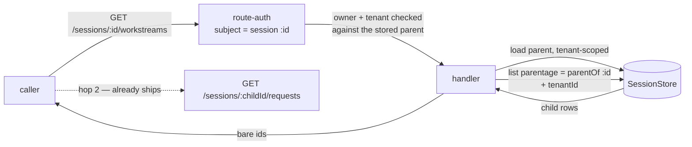

# FIX-1010: S1b — the parent-to-child read route and request metadata — Implementation Spec

**Linear:** [FIX-1010](https://linear.app/fixpoint-labs/issue/FIX-1010) · **Epic:** [FIX-939 — Durable jobs & detached-task substrate](https://linear.app/fixpoint-labs/issue/FIX-939) ([epic PR #993](https://github.com/fixpoint-labs/flow-state-dev/pull/993)) · **Follows:** [FIX-1009 (S1a, Done)](https://linear.app/fixpoint-labs/issue/FIX-1009), [FIX-982](https://linear.app/fixpoint-labs/issue/FIX-982) · **Blocks:** [FIX-1011 (S2)](https://linear.app/fixpoint-labs/issue/FIX-1011)

## Part I — The Case

### 1. Problem — why it matters, why now

An app can now start work that outlives the turn that asked for it — a long research job, a spec being written, an implementation running for an hour. That work runs in its own place, attached to the conversation that launched it. **The conversation cannot find it.**

Ask the server for a conversation's background jobs and there is no way to phrase the question. The pieces are all there: the database knows which jobs belong to which conversation, and once you have a job's id you can already read everything it did. What is missing is the first step — going from "this conversation" to "here are its jobs." Without it the user sees a turn that returned, and no trace of the hour of work it kicked off.

**Why now.** Two things arrive together. The substrate that creates these jobs is in development, and the moment it ships, every existing session list in the framework deliberately hides them (that was the previous change's whole point — background jobs must not pollute a user's list of conversations). So today the jobs are invisible to a caller and that is correct; from the day the substrate lands, they are invisible to a caller and that is a hole. Our own developer tool goes blind at the same moment. Everything downstream — the client library, the React hook, and the epic's end-to-end demo that gates its completion — is queued behind this one read.

There is no workaround an app can adopt. The query exists only inside the server process; nothing exposes it.

### 2. Solution in plain terms

Add one endpoint: **ask a conversation for its background jobs.** You address the conversation you already have, and you get back the jobs hanging off it. From there the endpoints that already exist take over — each job is itself readable, with its full history, exactly as a conversation is.

That is the whole shape: two hops. Not one flattened list of everything, because a background job is a first-class thing with its own history, not a filtered view of the conversation's messages. And we keep the promise the previous change made: nothing that lists conversations today starts returning jobs. Seeing them is something you ask for.

Alongside it, we pin down what the returned rows are allowed to say about themselves — which piece of work each job was for — and where that claim comes from. It comes from the server, stamped when the job starts. Nothing a caller wrote is treated as fact.

**Philosophy** — tenet 2 (composition over features): this is one more read over a filter that already ships, sitting beside the endpoint that already lists a conversation's turns, and it composes with them rather than introducing a parallel "jobs API". Tenet 3 (earn every addition): the public surface grows by one endpoint and no new options on any existing one. Tenet 5 (fix at the owning layer): the tenant and ownership checks stay where routes already do them, so the new read cannot be the one that forgets.

> **§2 then §6 lead, and the rest is derivation.** Problem, then what we propose, then what you are signing. Everything from §3 down justifies it — read it if the sign-off is not obvious, skip it if it is.

### 6. Decisions & rules — the sign-off surface

1. **You reach a conversation's background jobs *through that conversation*, and you get them in two hops — the jobs, then each job's history.**
   *Rejected:* a "show me the jobs whose parent is X" filter on the flat list-conversations endpoint. It reads as the smaller change and it is the weaker one: the parent is then just a string a caller types, so anyone signed in can probe for conversations that are not theirs and learn from the answer whether they exist. Addressing the parent means the permission that already governs reading a conversation governs reading its jobs, with nothing new to get right.
   *Locks in:* background work permanently inherits its conversation's access rules — one conversation, one owner, one boundary — and that is what customers will build their UI against. The cost lands later and in one specific place: a "show me all my background work across every conversation" view is a second endpoint we would have to design, not a parameter we can add. We do not have a customer asking for that view, and we would rather owe them an endpoint than owe everyone a probe.

2. **We do not ship a "list every conversation on the system" mode over the public API.** The database can do it, and in-process callers that genuinely need it — restart recovery, our own maintenance sweeps — keep using it. It is not reachable over HTTP.
   *Rejected:* exposing all three modes the database supports, on the argument that an operator will eventually want the god view.
   *Locks in:* no customer-facing endpoint can enumerate across ownership boundaries, so a mistake in a future auth change cannot turn one into a data leak. What it costs: an operator debugging a live system reads through the two hops like everyone else, which is more clicks. Our own developer tool is the first thing to feel that, and it is the case that convinced me the price is right — if the debug surface can live inside the boundary, a customer's admin panel can too. Reversible, but reversing it is a security review, not a patch.

3. **What a background job says about itself — which piece of work it was for — is stamped by the server when the job starts. Anything a caller wrote is display-only, and nothing in the product may act on it.**
   *Rejected:* letting the launching call label its own jobs and treating that label as fact. It is one less moving part and it makes the label a lie anyone signed in can tell, which matters the moment a UI groups, filters, or bills by it.
   *Locks in:* a customer's UI can label background work by the task it belongs to and trust that label; that promise is the thing we cannot cheaply take back once apps depend on it. The bill arrives during implementation rather than later — the stamping is written by the in-flight substrate work (FIX-982), and if it did not land there, this issue adds it. Either way the guarantee is tested here so it cannot quietly regress.

> **Non-goals** — the client library and React hook that will wrap this (S2 / S1011, S3 / FIX-1012); *creating* background jobs, and stamping what runs in them (FIX-982); telling you which jobs are **running** rather than which exist (a separate liveness question, deliberately not this read); the end-to-end demo (S4 / FIX-1013); filtering jobs by topic or worker, which nothing asks for yet.
>
> **Size:** Medium — one package, one PR, roughly 200 lines plus tests and docs.

---

### 3. Tradeoffs & alternatives

**The main alternative: a query parameter on the existing list-conversations endpoint.** `GET /sessions?parentOf=…`. It is one line of handler code and no new route, and the previous change (S1a) built the database filter in a shape that would accept it directly. Rejected on the trust boundary, per decision 1: that endpoint is authenticated but not *addressed* — the framework's own route-authorization table classifies it as a host-wide read and leaves the handler to narrow rows by caller. A parent id arriving as a query string is never loaded, never ownership-checked, and never tenant-checked as a record; it is only ANDed into a filter. The rows that come back are safe. The *existence* of the parent is what leaks, and building a new probe on purpose is worse than building a new route.

**The simpler approach, genuinely considered: ship nothing and let apps reach the store directly.** Apps that host the engine themselves could call the session store's filter from their own route today. It is insufficient for two reasons that are not about convenience. The store is not part of the public surface, so an app doing this is coupled to internals we change without notice — and the two hops only line up if the second one also matches, which means every app re-deriving the tenant and ownership rules the framework already implements. More decisively, the whole downstream chain (client, React, the demo that gates the epic) has to go through *one* transport shape; leaving it undefined means each consumer invents one.

**Where the genuine complexity is.** Not the query — that filter already ships and is tested across all four storage adapters. It is in the two places the new read touches an existing contract. First, the ownership check: the route has to be classified as *addressed at the parent* rather than host-wide, or it silently inherits the weaker model and decision 1 is undone without anyone noticing. Second, the read has to stay correct across the tenant boundary in the same way the sibling endpoints do — the parent is resolved as a tenant-scoped record and the child query is tenant-filtered, and both halves have to be there because either alone is a hole. §9 is mostly those two.

**A note on sequencing, since it is a real cost.** This spec is written against work still in flight: the injection seam it relies on is in review, and the substrate that creates background jobs is in development. §12 lists exactly what is assumed and what happens if an assumption is wrong. None of the three decisions above depends on either landing a particular way.

### 4. Focus practices (1–5)

1. **BP-031 (never authorize or route from caller-controllable input)** — this is decision 1 restated as an engineering rule, and it is the one thing that makes the route shape non-negotiable. The parent id must be resolved as a stored record under the caller's tenant, and the caller's identity must come from the resolved principal, never from a query parameter.
2. **BP-030 (tolerate the old shape)** — every existing caller of the conversation list must behave byte for byte as it does today. This change adds an endpoint; it must not alter one.
3. **BP-035 (walk the second-path checklist)** — the second path here is the *unowned* parent: a parent in another tenant, a parent belonging to another user, a parent that does not exist, and a parent that is itself a background job. A suite that only tests a parent the caller owns proves nothing about the boundary decision 1 exists to hold.
4. **Tenet 5 / one convergence point** — the new endpoint must go through the same route-authorization table and the same tenant-scoped session load the sibling reads use, not its own copy of the checks. A guard reimplemented per route is a guard that drifts.

### 5. What using it looks like (1–5 examples)

**Reading a conversation's background jobs, then one job's history** *(what this spec proposes; today the first call has no endpoint to hit):*

```
GET /api/flows/sessions/sess_abc/workstreams
→ 200 { "workstreams": [
    { "id": "ws_9f2…", "parentSessionId": "sess_abc", "flowKind": "coordinator", … },
    { "id": "ws_1c7…", "parentSessionId": "sess_abc", "flowKind": "coordinator", … }
  ] }

GET /api/flows/sessions/ws_9f2…/requests        ← already ships, unchanged
→ 200 { "requests": [ { "source": "taskboard", "metadata": { "taskId": "task_…" }, … } ] }
```

**What the boundary does** *(decision 1):*

```
parent the caller owns              → 200, that parent's jobs
parent in another tenant            → 404, indistinguishable from absent
parent owned by another user        → 403 — "not yours", the answer the
                                      framework already gives for a session
parent that has no jobs             → 200 with an empty list, not 404
```

**What does not change** *(decision 2, and BP-030):*

```
before  GET /sessions → the caller's top-level conversations
after   GET /sessions → the caller's top-level conversations, byte for byte
        (no new parameter; background jobs are never returned here)
```

---

## Part II — The Build Plan *(for the implementing agent)*

### 7. Technical design

One new read on the engine's flow API router, sitting beside `list_session_requests` and built from the same parts. Nothing else in the engine changes shape.



- **`@flow-state-dev/engine`** — a new route kind in the parse/route tables, classified in the route-authorization table as **session-addressed on the path's `:sessionId`** (the same subject the sibling session reads use, *not* the host subject `list_sessions` carries). A handler that resolves the parent as a tenant-scoped record, 404s when it is absent, then queries children through S1a's parentage predicate with the tenant conjoined. Bare session ids on the way out, matching what the existing session reads surface.
- **Untouched:** the session store and all four adapters (S1a shipped the predicate and its tests), the existing list-conversations handler and its default, `client`, `react`, the DevTool, and every execution path.

**The parentage predicate's third mode is not reachable from here.** S1a's contract is tri-state — `"top-level"` (the default), `"all"`, and `{ parentOf }`. This route only ever passes `{ parentOf }`, derived from the path. `"all"` stays an in-process capability (decision 2); no query parameter maps onto it, and the handler must not grow one.

**Request metadata.** The Workstream relationship a caller reads is carried on two records and both are server-written. The child *session* records its parent (`SessionRecord.parentSessionId`, shipped in S1a and written by the injection seam's detached-start path). The child *request* records which task it ran, on `RequestRecord.source` and `RequestRecord.metadata` — already persisted from the dispatch envelope, and already returned by the requests endpoint. What must be verified rather than assumed is that the **detached** start path can stamp them at all: the seam's start operation takes a session id, an input and an action name, with no provenance slot, so the stamp needs one. §8 step 1 checks whether FIX-982 landed it and §12 carries the assumption.

**No new verb on the injection seam.** The seam is deliberately closed at four verbs, and enumerating children is not one of them — nor should it be. This read is a route, reached by a client over HTTP, not a capability reaching the runtime from inside a block. Nothing here goes near `ctx.requestHost`, and nothing here casts.

*No solution sketch.* This extends an existing pattern almost exactly — `list_session_requests` is the same route shape, the same subject classification, and the same tenant-scoped parent load. Pointing at it is better than re-sketching it.

### 8. Implementation sequence

1. **Establish what FIX-982 landed on the provenance stamp.** Read the merged detached-start path: does a detached request arrive with `source` set to the task-board value and its task id in `metadata`? *If yes*, this step is a test only — pin it (§10) so it cannot regress. *If no*, add the provenance slot on the detached start path and stamp it server-side; the value stays FIX-982's to choose, the slot and the "server-written only" rule are decision 3's. *Test:* a detached request round-trips its stamped provenance to the requests endpoint. *Depends on:* nothing.
2. **Register the route** — parse table, route table, and the route-authorization subject. Handler returns an empty list. *Test:* the route resolves; the authorization table classifies it as session-addressed on the path id (this is the assertion that holds decision 1, and it belongs here, before the handler can mask it). *Depends on:* nothing.
3. **Implement the read.** Resolve the parent tenant-scoped, 404 on absent, list children with `{ parentOf }` conjoined with the tenant, surface bare ids. *Test:* the §5 cases and the §9 table. *Depends on:* 2.
4. **Pin the untouched default.** Assert the existing list-conversations endpoint is unchanged with a background job present in the store — no new parameter, no new rows. *Depends on:* 3.
5. **Documentation** per §11.

**Nothing to remove.** This change is purely additive; S1a already deleted what it obsoleted, and no helper here supersedes an existing one. Stated explicitly rather than left silent (tenet 3): if the implementer finds a hand-rolled parent-to-child read anywhere in the tree — including in the DevTool — that is dead on arrival and should go with this change.

**Single PR.** One package, one coherent surface; no PR plan.

### 9. Edge cases & error handling

| Case | Expected |
|---|---|
| Parent does not exist | 404, same shape the sibling session reads emit |
| Parent exists in another tenant | 404 — the tenant-scoped load returns nothing on a tenant mismatch, so a cross-tenant probe is indistinguishable from absent |
| Parent owned by another user | 403, from the shared route-authorization path — deliberately not 404, because the caller authenticated and already holds the id. Do not add a second answer here |
| Parent exists, has no children | 200 with an empty list. Not 404 — "no background work" is an ordinary answer, and a client that has to branch on it will get it wrong |
| Parent is itself a Workstream | 200 with its own children. Nesting is legal; the routing key is per-parent, so a job that files sub-jobs is a tree and this read is one level of it |
| Caller is anonymous, in an app where some flow authenticates | Follows the existing cross-flow withholding rule for session reads. Do not invent a third policy |
| A child row written before the parentage field existed | Reads back as absent parentage and is therefore top-level, never a child (BP-030). It cannot appear under any parent |
| Very many children | Paginated with the same limit/offset the sibling reads use. Do not return an unbounded list |

**Taxonomy:** every failure here is fatal-and-final for the request, and none is retryable — an unknown or unowned parent does not become known by trying again. There is no degraded mode: this read either answers within the boundary or it does not answer.

**Second-path checklist (BP-035), the rows that apply.** *Multi-tenant:* covered above, and it is the row most likely to be tested only in the happy direction. *Legacy:* the pre-parentage record row above. *Null boundary:* absent versus null parentage both mean top-level, per S1a's contract — guard with `== null`. *Concurrency:* a child created while the list is being read may or may not appear; that is acceptable and needs no locking, but it must not error. *Cancel/error and cost-observability:* not applicable to a read of this size, stated so the omission is deliberate.

### 10. Testing strategy

**Goal & goal check.** No standalone goal check applies at this issue's boundary, and the reason is the epic's own structure: the observable outcome a user cares about — launching background work and watching it be found from the conversation — is FIX-1013 (S4), which is the epic's BP-003 evidence path and gates its wrap. This issue's contribution to that goal is one endpoint, and the honest check for it is an integration test over the real route rather than a second demo. **Evidence path:** the engine's route-level test suite exercising the new endpoint against a store seeded with parent and child sessions, plus the round-trip in behaviour 5 below.

**CI specs** (the behaviours, not the test names):

- **One behaviour per decision in §6**, in observable terms — what a caller of the endpoint sees, not how it is computed.
- **The boundary, from the outside**: every row of §9's table, exercised as a request against the route rather than as a call to the store. Testing the predicate again would re-prove S1a; what is unproven is that the *route* reaches it correctly and refuses correctly.
- **The authorization classification itself**, asserted directly: the route's subject is the path's session id. This is the one test that fails loudly if a future refactor reclassifies the route as host-wide, which is how decision 1 would be silently undone.
- **What must not change**: the existing list-conversations endpoint, with a child session present in the store, returns exactly what it returns today.
- **The provenance round-trip**: a detached request's server-stamped `source` and task id survive to the requests endpoint. Pair it with the negative — caller-written metadata on an ordinary request is returned as data and is not treated as provenance by anything.
- **The invariant that is easy to state wrongly**: a child appears under exactly one parent, and *never* in a top-level listing. The tempting assertion is that the two result sets are disjoint, which is true but weak — it passes if both are empty. Assert the child is present in the parent's list *and* absent from the top-level list, in the same fixture.

**Discipline:** `tdd`. The seam is the flow API router — reachable from vitest by constructing the router over an in-memory store and issuing `Request` objects, with no HTTP server and no live flow, so every behaviour above is a tracer bullet.

### 11. Documentation plan

- **EXTEND** `apps/docs/docs/server/setup.md` — add the endpoint to the HTTP route table, which already lists every session read. One row, next to `/sessions/:sessionId/state`.
- **EXTEND** `apps/docs/docs/server/authentication.md` — the page already distinguishes the two cross-flow endpoints from the addressed ones and explains what each scopes by. The new route is addressed, and saying so here is what keeps that section true. Also the place to state, once, that no endpoint lists across owners (decision 2).
- **CREATE** `apps/docs/docs/server/background-work.md` — the concept page. S1a deliberately deferred it: *"the concept page belongs to S1b, which is the issue that first gives a user something to call."* Covers, in plain terms, what a background job is (a child of a conversation, with its own history), the two hops, why a conversation list does not show them, and the one thing a reader will otherwise get wrong — that this read tells you which jobs *exist*, not which are *running*.
  - **Sidebar:** `Server` category in `sidebars.ts`, after `setup` and before `authentication` — it is a concept a reader meets before they need the auth detail, and grouping it with the session reads it composes with beats a new category.
  - **Example:** the smallest one — the two calls from §5 and their shapes. Not a full app.
  - **Cross-links:** ← from `setup.md`'s route table and from `client/overview.md`'s session-management section; → to `authentication.md` and to `persistence/overview.md`.
  - **Voice risks:** do **not** use the internal term *Workstream* in prose — say "background job" or "background work"; the reader has no way to look the internal term up. No issue ids anywhere under `apps/docs` (the outsider rule). Resist "seamless" and "first-class". Introduce "session" in plain terms on first use, since this page is likely to be someone's entry point.
- **EXTEND** `packages/engine/README.md` — one line in the route surface. The README does not document `SessionListOptions` and should not start.
- **No `docs/architecture/` change.** This adds a route over an existing store contract; it changes no locked contract. S1a already updated the store-side documentation.
- **No blog post.**

*(A note on ordering: `client/overview.md` gets the inbound cross-link now, but the client **verb** is S2's. Do not document a client method this issue does not ship.)*

### 12. Dependencies, open questions & follow-ups

**Dependencies.**

- **FIX-1009 (S1a) — Done, merged.** The parentage predicate and `SessionRecord.parentSessionId` ship on `main` across all four adapters. This is a hard prerequisite and it is satisfied.
- **FIX-982 — In Development, P1 merged.** Linear-blocking. Not a *code* prerequisite for the route: the route reads a predicate that already ships, and it is correct and testable against hand-seeded child sessions with no substrate at all. It is a prerequisite for the route being *useful*, and for step 1's provenance check having something real to check.
- **FIX-999 — In Review.** Supplies the detached-start path this issue's step 1 inspects. Nothing here adds a verb to it or reaches around it.

**Assumptions about work still in flight** — recorded because this spec was deliberately written in parallel with it, and each has a stated fallback rather than a blocker:

1. **FIX-982 stamps the provenance.** Its own spec tests that a detached request carries the task-board source and its task id in metadata, so it should land there. If it does not, step 1 adds the slot — the work moves, the decision does not.
2. **FIX-999's seam stays closed at four verbs.** This spec needs no fifth, and if one is added for another reason it changes nothing here.
3. **The detached start path gains a per-request provenance slot somewhere.** Today's start operation carries a session id, an input and an action name only, and the seam's caller-supplied bookkeeping lands on the child *session* record — written on create and not on adopt. Per-task provenance has to be per-*request*, because a topic-routed job handles many tasks over its life and a follow-up is another request into the same one. Whoever builds it, it cannot be the session record.
4. **Nothing renames or re-scopes the route-authorization subject table.** Decision 1 rests on it, and §10 asserts the classification directly so a rename cannot pass silently.

**Open questions:** none. The one genuine fork — how the parent is addressed — is decision 1, settled on the trust boundary rather than left open.

**Follow-ups (flagged, not built):**

- **The DevTool's own opt-in.** S1a recorded that the DevTool session list loses visibility of background work the moment FIX-982 lands, and that this issue restores the *capability*. It does not change the DevTool, which needs its own small change to use the second hop. Worth filing when FIX-982 merges; it is the first real consumer and it is not this issue's scope.
- **Listing background work across conversations.** Ruled out here (decision 1's cost). If a customer asks for it, it is a new endpoint with its own ownership model — not a parameter on this one.
- **Liveness.** This read enumerates which jobs exist, never which are running. That question is real and separate, and it is not answered by adding a field to these rows.

---

## Spec evolution

- **Spec drafted** — framed as the missing first hop from a conversation to its background work; chose a parent-addressed endpoint over a filter on the flat session list, on the trust boundary rather than on ergonomics; kept the unrestricted listing mode off the public API; and resolved the overlap with FIX-982 by scoping this issue to the read contract and the server-stamped-provenance guarantee, with a conditional first step that adds the stamp only if FIX-982 did not.
