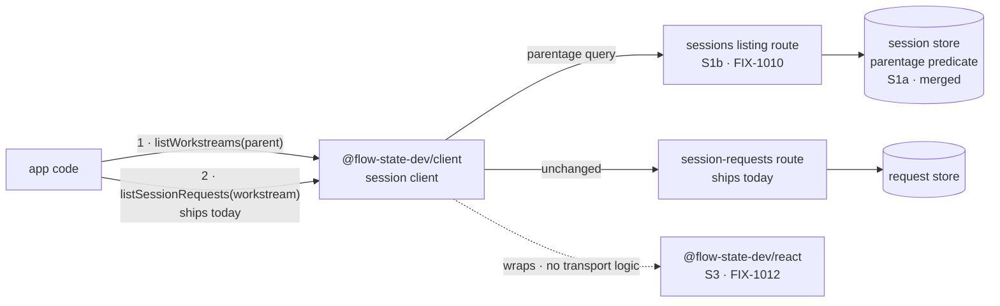

# Background work runs where the app that started it cannot see it — Implementation Spec

## Part I — The Case *(for the human)*

### 1. Problem — why it matters, why now

An app built on the framework can now start work that keeps running after the user's turn
comes back — a long job that takes minutes or an hour. The app's own front end cannot see any
of it. From the browser there is no way to ask *"what background work is running for this
conversation, and how far has it got?"* The work runs, finishes, and the person who asked for
it is shown nothing the whole time.

**Why now** — this is the last piece of plumbing before the demo that proves the background-work
feature works at all, and that demo is what the epic is gated on finishing. Every consumer goes
through this one client: the React hooks and the demo UI both sit on top of it.

**There is no workaround.** Background work runs in its own separate session, so every existing
"show me this conversation" call is structurally blind to it. It is not a filter somebody forgot
to pass — there is nothing in the parent to filter.

### 2. Solution in plain terms

**Two reads, in two hops.** Ask a conversation what background work it has, and get back one
entry per body of work — one per issue being worked, one per investigation. Then ask one of
those entries what it has done so far, using the call that already exists for reading a
conversation's turns. Nothing new is needed for the second hop.

**And one subtraction.** The client does *not* get a way to say "run this in the background."
Whether a piece of work detaches is decided by the app's flow author when they wire the flow up,
not by whoever makes the call. So the client's job here is discovery, not declaration. The issue
title asks for both; we are proposing to build one and drop the other, and decision 1 is where
that gets signed off.

**Philosophy** — tenet 2 (composition over features): background work *is* a session, so the
second hop is the session-request read that already ships, and we add one read rather than a
parallel API beside it. Tenet 3 (earn every addition): the declaration half is dropped rather
than built, because the substrate already decided who makes that call.

> **§2 then §6 lead, and the rest is derivation.** Problem, then what we propose, then what
> you are signing. Everything from §3 down justifies it.

### 6. Decisions & rules — the sign-off surface

1. **Whether work runs in the background stays the app's decision, never the caller's.**
   The client gets no "run this detached" flag. It can only discover what the app already
   chose to detach.
   *Rejected:* a per-call flag on the client's send-action call — the shape the issue title
   asks for.
   *Locks in:* a web page, a script, or anyone holding a user's credentials cannot make
   expensive long-running work start. The bill lands on app developers: an app that wants to
   offer its own end user a "run this in the background" toggle has to have its flow author
   wire a second entry point for that, rather than passing a flag from the browser. We can add
   caller-chosen detachment later behind an explicit server-side opt-in, so this is reversible —
   but shipping it now gives away a control we could not quietly take back.

2. **Background work is shown as completed steps, not as live typing.**
   Attaching to background work that is still running is supported, and returns each step as it
   finishes. It does not stream text as the model produces it.
   *Rejected:* building a live-tail surface for it, and the opposite — refusing to let anyone
   watch running work at all until it is done.
   *Locks in:* an end user watching background work sees results land a step at a time, where
   the same model in a foreground chat types out word by word. That difference is visible and
   we will be asked about it, so we tell developers at the point they would expect the other
   behaviour. Adding live text later is additive and breaks nobody, so the cost here is setting
   expectations now, not rework later.

3. **"Workstream" becomes a word app developers write.**
   The client gets its own named read for a conversation's background work, rather than a filter
   option bolted onto the generic "list this user's sessions" call.
   *Rejected:* reusing the generic session listing with a parentage option — a smaller surface,
   but a developer would have to know that "a child session" means background work.
   *Locks in:* the term ships in every app's code, our documentation and our support answers;
   renaming it later is a breaking change for everyone who built against it. It also means the
   ordinary "list this user's conversations" call can never return background work, so no
   existing session picker starts showing internal machinery by accident.

4. **A Workstream row says how the work ended, or that it hasn't. Nothing finer.** **Decided by
   the owner; not open.** When a Workstream has no run still going, the row reports the outcome
   its work reached, in the system's own word for it. Otherwise the row reports a single generic
   **`active`**, which means exactly *"not finished"* and nothing more. **A Workstream that has not
   run anything yet reports neither** — it carries no state at all, because calling work "active"
   before it has started is as wrong as calling it finished.
   *Rejected:* two things. A stateless row, which would make every consumer fetch one extra read
   per Workstream from the browser just to render a label, on a screen every conversation shows.
   And — separately — reporting *which* run a Workstream's state comes from, which an earlier
   draft of this decision promised and which no rule could deliver: a Workstream may have several
   runs going at once, so any rule that picks one is wrong about the others.
   *Locks in:* an app can render a list of background work **with its state in a single call**,
   which is what makes a "what's running" view cheap enough for a main screen rather than behind a
   click. The cost is that `active` is deliberately mute: an app cannot tell from the row whether
   background work is running, queued, or **stopped waiting for a person to answer something**.
   Those look identical, and telling them apart is the obvious next thing an app will want. **That
   distinction is deferred on purpose, not overlooked** — it arrives later as its own separate
   field beside this one, so adding it breaks nobody and no app has to rewrite what it already
   built. What we are buying now is that we never have to take a promise back: a row that said
   *running* would be a lie for work that is really waiting, and we would be the ones who told it.
   The honest caveat ships with it and must be documented, not buried: this is the **last
   recorded** state, not a health check. If a worker's process dies, its row keeps reading
   `active` until the substrate's reclamation notices and corrects it. An app can trust it to
   render; an app must not use it to conclude that something is stuck.
   *One follow-on you will be asked separately:* when a Workstream's runs have all finished but
   **disagree** — an attempt failed, a retry succeeded — which one the row reports is a rule S1b is
   specifying and will put to you. It does not change anything here: the vocabulary and the
   `active` rule above are settled either way, and this client carries whatever value comes back.

**Non-goals** — live in-flight text from background work (decision 2; this is the epic's
already-accepted limit, and building a live-tail or polling surface for it is out of scope, not
an option) · **true liveness** — "is this worker actually alive right now" is a different
question from decision 4's recorded status, is not answered here, and no wording in this change
may imply it is · the React hooks that sit on this (S3) · the demo UI (S4) · anything about *how*
work detaches server-side (FIX-982) · the HTTP route itself and the request metadata it returns
(S1b).

**Size:** Small (one package, one PR, ~150 LOC plus docs and tests).

---

### 3. Tradeoffs & alternatives

**Alternative: one flat list.** Ask a conversation for everything happening under it — its own
turns and its background work — in a single call. Rejected: background work is not a subset of
the conversation, it is a separate body of work that accumulates its own history over hours or
days. Flattening them means every app has to un-flatten them again to show them differently,
which every app would, and the "one entry per body of work" grouping becomes something each app
reinvents slightly differently.

**The simpler approach: ship nothing on the client and let apps call the HTTP route directly.**
Genuinely tempting — hop 1 is one GET, and the route exists once S1b lands. Insufficient because
the client is where transport shape gets decided once for every consumer, and there are already
two: the React hooks and the demo. The package boundary says React holds no transport logic, so
skipping the client means hand-rolling the same fetch in the two places that boundary exists to
keep clean.

**Where the complexity is:** not the read. It is decision 2's honesty. This surface makes it
*look* like you can watch background work the way you watch a chat, and you cannot, quite.
Getting that stated where a developer meets it is more of this issue's real work than the fetch
is.

### 4. Focus practices (1–5)

1. **BP-030 (tolerate the old shape)** — every field this surface reads is written by a newer
   server than most callers will be running against. A session that predates background work has
   no parent and no topic; guard with `== null`, and never let an absent field read as a
   Workstream with an empty name.
2. **BP-031 (never route on caller-controllable input)** — decision 1 is this practice stated as
   a product decision. The client sends nothing that changes where or how work runs.
3. **Tenet 3 (earn every addition)** — the second hop already works. Resist adding a
   Workstream-shaped variant of a call that needs no change.
4. **Document the limit where it is used, not only where it is true** (tenet 1) — decision 2's
   caveat belongs on the surface a developer reaches for, not filed once in a concepts page they
   may never open.

### 5. What using it looks like

**Finding and reading background work** *(what this spec proposes — today neither call exists
for this, and the parent's own reads cannot see background work at all):*

**Rendering the list — hop 1 only. This is the whole point of decision 4:** the row already
carries what a list needs, so a list makes exactly one request no matter how much background work
there is.

```ts
// Same-origin: the client's paths are already absolute from the root, so a
// base URL is only for pointing at a different host or a mount prefix.
const sessions = createSessionClient();

const workstreams = await sessions.listWorkstreams("sess_1");
// → [{ id: "ws_9f3a…", parentSessionId: "sess_1", topic: "FIX-981",
//      status: "active", … }]
//
// `status` is the outcome the work reached, or "active" meaning not finished
// yet. "active" says nothing about running vs. waiting — deliberately (§6.4).
// It is absent when the Workstream has not run anything yet — absence, not
// "active", and not a terminal value.

// A conversation with no background work is the ordinary case, not an error.
for (const ws of workstreams) {
  // `status` is optional: render no state rather than a placeholder (BP-030).
  renderRow(ws.topic ?? ws.id, ws.status ?? null);   // no second call, ever
}
```

**Drilling into one — hop 2, only when a person opens it.** This call already ships, unchanged.

```ts
const requests = await sessions.listSessionRequests(chosen.id, {
  includeItems: true   // the full log is for a drill-in, never for a list
});
// Returns the client-visible items — messages, tool output, and the
// `task-change` items that carry per-task detail. Internal execution traces
// (prompts, block inputs/outputs) are not client-visible and must not come
// back here; that is a route-side guarantee this spec requires of S1b
// (§12 constraint 7), not something the client filters.
```

**What the ordinary session list does (before / after):**

```
before  listSessions({ flowKind, userId }) → the user's own conversations
after   listSessions({ flowKind, userId }) → the user's own conversations, identical.
        Background work never appears here. You ask for it under its parent, or not at all.
```

**Watching work that is still running** *(decision 2 at the call site):*

```ts
// Pick the running request explicitly. The list is not ordered by what is
// live, so a request that just finished can sort ahead of one still going.
// Note this is a REQUEST status, which keeps its full vocabulary — unlike the
// Workstream row, which collapses every unfinished run to "active". A row
// reading "active" may have no `in_progress` request at all: it could be
// suspended, waiting on a person.
const live = requests.find((r) => r.status === "in_progress");

// Note the flow kind comes from the request, not from the conversation — a
// detached request runs under the substrate's own flow, and the stream route
// 404s on a mismatch.
if (live !== undefined) {
  createSSEClient({
    url: `/api/flows/${live.flowKind}/requests/${live.id}/stream`,
    onItemDone: (event) => render(event.item)   // each step, as it completes
    // onContentDelta does not fire for a generator running out of process.
    // Nothing types out character by character here.
  });
}
```

## Part II — The Build Plan *(for the implementing agent)*

### 7. Technical design

Hop 1 is a new read on the session client over the route S1b adds. Hop 2 is the session-request
read that ships today, called with a Workstream's id instead of a conversation's. No engine
change belongs to this issue, and no React change.



- **`@flow-state-dev/client`** — one new session-client read, plus the summary type that
  describes a Workstream. The single place hop 1's transport shape is decided, for every
  consumer.
- **`@flow-state-dev/engine`** — untouched here. S1a merged the store predicate; S1b owns the
  route and the request metadata.
- **`@flow-state-dev/react`** — untouched here. S3 consumes this; no transport logic crosses.

**What the API exposes**, at the level of what it does rather than its signature:

- A **named read**: given a conversation's id, the Workstreams under it. Tenant- and
  principal-scoped by the server — the client adds no **authorization or visibility** filtering of
  its own and must not appear to; what a caller may see is the server's call, never the client's
  (BP-031).
  - **It is authorized as a read *of the parent conversation*, not as a cross-flow session
    listing, and the distinction is load-bearing rather than pedantic.** An earlier revision said
    this read was scoped "exactly as the existing session listing already is." That listing is
    **host-scoped**, and in a mixed app — one flow authenticates, the host resolver stays at its
    default — it deliberately withholds every row belonging to an authenticating flow, so this
    feature would return an **empty list to precisely the apps it is built for.** The read must
    instead authorize on the **stored parent session's governing flow**, which is how this spec's
    own hop 2 is already authorized. That is a constraint on S1b, stated in full with its
    verification in **§12 constraint 6**, and it is the one place where "the client just calls the
    route" is not a safe thing for this spec to assume.
- **One carve-out, and it is a compatibility check rather than a filter: the client verifies each
  row's parentage against the parent it asked for, and drops rows that do not match.** An earlier
  revision of this spec forbade all client-side filtering while §9 simultaneously required this
  check, which is a contradiction an implementer would have had to resolve by guessing. They are
  different things and the distinction is the whole justification: deciding *what a caller may
  see* is authorization and stays the server's; refusing to **relabel as background work** rows a
  server never claimed were background work is neither — it is the client declining to invent a
  meaning. It exists because a pre-S1b server drops the parentage query and returns ordinary
  conversations (§9), and it is the **only** filtering the client performs. Cover it in the client
  tests.
- **It is a named alias, not a subsystem, and this is the sentence that keeps the change small.**
  S1a already merged the store predicate (`parentage: { parentOf }`), and S1b exposes it on the
  sessions listing route. `listWorkstreams(parent)` issues *that* query with that predicate filled
  in. No second route, no parallel response mapper, no client-side re-filtering. Decision 3 buys
  the vocabulary; it does not buy new plumbing. An implementer who finds themselves writing a
  second mapper has gone wrong.
- **One summary type, extended — not a parallel hierarchy.** A Workstream row *is* a session row,
  so the type extends the existing session summary with optional fields rather than standing
  beside it as a second shape that drifts as the first one grows. Two things make that concrete:
  - The client's session summary omits `parentSessionId` today, **but the server already sends
    it** — the sessions listing route returns the stored record, which has carried the field
    since S1a merged. So this is the client type catching up to the wire, not a new field on it.
  - The coordinates are **`topic` and the `coordinate` tagged union** (`assignee` / `uniform` /
    `floor`), taking orchestration's existing vocabulary rather than invented names. Both are
    declared on the session record at spawn and returned by S1b's listing, so they arrive on the
    row for free.
  - **`boardId` is not one of them, and an earlier draft of this spec wrongly named it.** It
    participates in *deriving* a Workstream's id and lives on the board config; it is never
    persisted on the record, so nothing returns it. Adding it would be a FIX-982 change — a new
    persisted field written at spawn, plus its own back-compat story for rows already written —
    and no consumer in this chain has asked for it. **Do not type it, and do not let a UI plan
    depend on grouping rows by board.**
  - Everything added is optional and `== null`-guarded (BP-030) — and that optionality is not
    just defensive: **the presence of the fields is itself the signal** a client uses to decide
    whether a row is labelable. The direction is extend, then narrow: a session summary becomes a
    Workstream when the parentage and coordinates are there.
- **The last recorded status, which nothing on a session record supplies today** (decision 4).
  Be exact about why, because "a session summary plus extras" reads as more than it is: a session
  summary is **identity and description only** — id, flow kind, user, title, description, tags,
  metadata, timestamps — and the one run-adjacent field anywhere on a session record is
  `latestRequestId`, which is *an id, not a status*, is written when a request **starts**, and is
  never updated when one finishes. A row carrying it can point at a request that failed an hour
  ago and say nothing about it.
  - **So the status is resolved, not read off the session.** The owner's rule (decision 4): *if any
    of the Workstream's runs is still non-terminal, the row is `active`; otherwise the row reports
    the terminal outcome.* **The first half is an existence check** — *is any run non-terminal?* —
    so it picks no representative run and needs no ordering, which is what makes it deliverable
    after four selection rules failed (§12).
    **The second half is not, and this spec does not settle it.** When every run is terminal but
    they *disagree* — a failed attempt followed by a completed retry — something must still reduce
    them to the one outcome the row reports. That reduction is **FIX-1010's (S1b), which owns the
    route that computes the row**; this spec consumes whatever it specifies. See §12 constraint 5.
    S1b resolves the whole field per row as part of the
    same listing, in-process, over indexes that already exist on both SQL adapters
    (`requests(session_id)`, `(session_id, status)`, `(session_id, tenant_id)` —
    `packages/store-sqlite/src/schema.ts:52-57`, `packages/store-postgres/src/schema.ts:54-59`).
    One indexed read per row on the server instead of one HTTP round trip per row from the browser.

  - **The union, stated plainly, because step 1 of §8 builds this type before the route exists.**
    A row's `status` is one of the four terminal request outcomes — `"completed"`, `"incomplete"`,
    `"failed"`, `"aborted"` — or the literal `"active"`. Five values, and `"active"` is opaque by
    contract: it asserts only *not terminal*.
    - **A sixth case, and it is absence rather than a value: a Workstream with no runs at all.**
      The owner's decision covers it — *a child with no runs reports absence, and absence is not a
      status* — so the field is **optional and simply not present**, never `"active"` and never a
      terminal value. `"active"` would be a lie (nothing is running) and any terminal value would
      be a bigger one (nothing ran). **The state is reachable, not theoretical:** a session record
      is persisted before its first request record exists
      (`packages/engine/src/context/createExecutionContext.ts:587-603` writes the session;
      `:1039-1062` writes the request), and a Workstream spawned but not yet picked up has the same
      shape. So `status?:` — optional, `== null`-guarded like every other field on this row
      (BP-030), and a consumer renders no state at all rather than a placeholder.
    - **Absence is deliberately not disambiguated from "an older server didn't send it."** Both
      mean *this row carries no state*, both are `== null`, and both render identically. Adding a
      discriminator would buy a distinction no consumer acts on, and §7's rule elsewhere is already
      that the presence of these fields is the signal.
    - **Do not type it as `RequestStatus`.** That union has seven members
      (`packages/contracts/src/types/request-status.ts:11-19`) and three of them —
      `"in_progress"`, `"suspended"`, `"interrupted"` — **must never appear on a row**, because
      each is a run state that decision 4 folds into `"active"`. Typing the field as
      `RequestStatus` would permit values the contract forbids and hand consumers an exhaustive
      switch over branches that can never fire. Declare a distinct type.
    - **Additive extension has a shape, and it is not "widen this union."** The owner has
      deliberately deferred a sub-status axis (running / waiting / scheduled / *a decision is
      needed*). When it lands it arrives as a **second, optional field beside `status`** — not as
      new members here. That is what keeps it additive: existing consumers ignore an unknown
      optional field, and `"active"` never has to narrow or change meaning. Adding members to this
      union instead would break every exhaustive switch built against it and silently redefine
      `"active"`. **Do not design that axis now, and do not leave a placeholder for it.**
    - **Which three statuses are non-terminal, and why the tree's existing predicate is the wrong
      one to ask.** `"in_progress"`, `"suspended"` and `"interrupted"` are all *leavable*: a
      suspended request resumes (`packages/engine/src/routes/resume-routes.ts:130`), an interrupted
      one continues (`packages/engine/src/routes/recovery-routes.ts:240`), and both transition back
      to `in_progress` (`packages/engine/src/execution/runAction.ts:1039`). The other four end the
      run — `"completed"` and `"incomplete"` are literally the two values of `runAction`'s
      `terminalStatus` (`packages/engine/src/execution/runAction.ts:1467`, `:1488`), and
      `"failed"`/`"aborted"` join them in the retention prune set
      (`packages/engine/src/durability/durability-sweeper.ts:104`). **The exported
      `isTerminalRequestStatus` does not encode this partition** — it is a *stream-termination*
      predicate ("past the in-flight phase") and counts `suspended` and `interrupted` as terminal
      (`packages/engine/src/stores/subscribe-helpers.ts:15-24`). It is the obvious thing to reach
      for and it is wrong here; see §12 constraint 5, which states the rule S1b is bound by.
  - **Deliberately not denormalized onto the session record.** There is no session write on the
    request-terminal path today, so a stored status would add one per request completion
    system-wide — plus a second writer to a record that is already the CAS target for session
    state. It buys a marginally cheaper read for a materially worse write path.
  - **It is recorded state, never liveness, and the distinction is load-bearing in the wording
    as well as the design.** It reports what the request store durably wrote; it asserts nothing
    about a process being alive. A crashed worker's row reads `"active"` until reclamation
    corrects it. Do not name it, type it, or document it as "live", "running", or "healthy" —
    `"active"` is the value's name and it means *not finished*, which is weaker than all three.
  - **The row's status is authoritative for the Workstream's state. Task items are enrichment, not
    a correction — and this inverts a rule two earlier revisions carried.** The previous rule, taken
    from S1b, was: *where a row is task-backed, the task's lifecycle is authoritative; the recorded
    status is the fallback and the first paint.* **That is now reversed**, because it rested on an
    assumption the tree does not support: that a Workstream's item log is complete.
    - **Retention makes the item log incomplete, and the incompleteness is biased.** A flow may
      configure `maxAge` / `maxItems`, and eviction operates at **request granularity** — entire
      old requests and their items are deleted, not individual items
      (`packages/engine/src/execution/retention.ts:35-40`). The eviction query selects
      **`status: "completed"`** only (`retention.ts:51-61`), which the architecture doc states as a
      rule: *"The current request is never evicted. Failed requests are not eviction candidates."*
      (`docs/architecture/server-and-client.md:143`).
    - **So the surviving items are skewed toward failure.** A task claimed in a request that
      **failed** emits a non-terminal `task-change` and that request is never an eviction
      candidate; the later request that **completed** it, carrying the terminal snapshot, is
      exactly what retention deletes first. A fold that trusted items would then read
      `in_progress` for finished work and **override a `completed` row with apparently live
      work.** No ordering rule fixes this — the authoritative snapshot is *gone*, not mis-sorted.
    - **Row-authoritative removes the problem rather than mitigating it**: the row is computed
      server-side from the request store in the same read, so the fold never has to prove a
      completeness it cannot prove. Items add per-task detail **when they are present** and are
      simply absent when they are not, which is the ordinary degradation this spec already
      specifies everywhere else.
    - **This is a cross-spec change and S1b must hear it, not discover it.** S1b set the shared
      rule; reversing it here without telling them is how two specs ship contradicting display
      contracts. Recorded as such in §12.
    - *One honest limit that stays:* the row is the **last recorded** state, and retention prunes
      what is recorded, so an aggressively pruned session can lose an old terminal request too.
      That does not break the row the way it breaks the items, because the row is *defined* as what
      the store durably holds rather than as ground truth — but it is a real input to S1b's terminal
      reduction, so it is named there rather than left for them to find.
  - **A hop-1 row on its own has no task detail** — `topic` and `coordinate` identify the
    body of work, not the task — **so a hop-1-only list renders the row's status and nothing is
    missing from it.** Under the previous rule this was a degraded "first paint"; under
    row-authoritative it is simply the answer.
  - **The lifecycle is read from `task-change` items, not looked up on the collection. This is
    the fourth specification of this correlation and the first that a browser can satisfy.**
    Three earlier revisions tried to deliver the display rule by carrying a task *correlation* on
    the request so a consumer could then go and read the collection. **That path is closed, and
    not by a detail — a browser cannot read a task collection at all:**
    - `defineTaskCollection()` accepts `id`, `scope`, `stateSchema`, `maxInstances` and nothing
      else, and constructs its resource without client config
      (`packages/orchestration/src/tasks/collection/define-task-collection.ts:54-73`, `:94-104`).
    - `handleListCollectionState` returns **403** unless `config.client?.state?.read === true`
      (`packages/engine/src/routes/resource-routes.ts:387`, `:410-411`). Resource collections
      *can* carry that config (`packages/core/src/types/resource-collection.ts:81`); task
      collections have no way to set it.
    - So the `ctx.resources` lookup key an earlier revision cited as the reason to require
      `collectionId` is **server-block-only**. S3's consumer is a browser, so a correctly
      persisted `collectionId` would still not have made the lifecycle readable.
  - **What replaces it is already in the stream, and carries more than the correlation would
    have.** Every collection mutation emits a `task-change` component item
    (`packages/orchestration/src/tasks/collection/get-or-create.ts:143-159`):
    - **It carries the pair, and is keyed by it.** `data` holds `collectionId` and `taskId`, and
      the emission key is literally `` `${collectionId}/${taskId}` ``. The composite identity three
      revisions tried to reconstruct is the item's own key.
    - **It carries the task itself, not a pointer to one.** `data.task` is the whole envelope,
      status included. There is nothing left to look up.
    - **It is client-visible and persistent.** A `component` item resolves to
      `{ client: true, history: false }` (`packages/contracts/src/items/resolve-visibility.ts:38`,
      `:47`) — and `history: false` means *LLM context*, not the item log. The registry states it
      outright: client ✓, **Persistent (keyed: upsert in place)**
      (`docs/architecture/items.md:177`).
    - **The `transient: true` on the emitting blocks does not reach it.** That flag governs only
      the auto-emitted `block_trace`; explicit emits default non-transient
      (`packages/engine/src/context/createExecutionContext.ts:230-247`). Worth stating because
      `claimTask` and `recordSuccess` both carry it, and reading it as covering their emissions is
      the same class of mistake this correction is undoing.
    - **Keyed plus persistent is the keyed-snapshot pattern** — `data` replaced wholesale, latest
      state replays on reload (`packages/contracts/src/items/types.ts:405-419`). But read the
      scope exactly: the persisted record holds one entry per **`(requestId, key)`**, not one per
      `key`. Within a single request a consumer gets one item per task carrying its current state,
      not an event log to fold. **Across requests it gets one per request**, and that is a rule a
      consumer needs — see the next bullet.
    - **Cross-request resolution — a Workstream has many requests, so the same task can arrive
      more than once.** `listSessionRequests(ws, { includeItems: true })` returns a **separate item
      log per request** (`SessionRequestSummary.items`,
      `packages/client/src/types/index.ts:176-182`; the route passes `withItems` straight to
      `stores.request.list({ sessionId, tenantId, … })`,
      `packages/engine/src/routes/session-routes.ts:289-301`). A Workstream that touched task T in
      two requests therefore hands the consumer **two `task-change` snapshots keyed
      `${collectionId}/${taskId}`**, each frozen at the end of its own request, and at most one is
      current. This is not a rare path: re-claims are explicitly modelled
      (`packages/contracts/src/items/task-attribution.ts:105-108`), and the claim and the
      write-back can run in different requests (§12 constraint 2). **So the rule, which is the
      whole of what a consumer must implement:**

      > Group every `task-change` item from every returned request by
      > `(data.collectionId, data.taskId)`. **First keep only the snapshots carrying the greatest
      > `data.task.createdAt` in the group — that is the task's current incarnation.** Then,
      > among those, **prefer a snapshot whose `data.task.status` is terminal over one that is
      > not**; then take the greatest `data.task.updatedAt`, breaking an exact tie on
      > `(requestId, itemIndex)` descending.

      **The incarnation clause comes first, and without it the rule reports a live task as
      finished.** A task id is not unique over time: a resource-backed task can be **deleted and
      recreated under the same id**, which the substrate explicitly supports and works to preserve
      — the cleanup retires "a specific **ref**, not an id", precisely so a same-id replacement is
      not destroyed (`packages/orchestration/src/tasks/collection/resource-backed.ts:233-243`) —
      and the collection's public `delete()` frees a slot, so "a delete-and-requeue loop" is a
      named, permitted pattern (`packages/orchestration/src/tasks/collection/task-caps.ts:73-80`).
      `(collectionId, taskId)` carries no incarnation identity, so with terminal preference applied
      first, a **dead incarnation's `completed` snapshot beats the live incarnation's `pending` or
      `in_progress` one** and a running task renders as already finished. That is a worse failure
      than the stale-metadata one the other clauses address, which is why it is resolved before
      them rather than after.

      **`createdAt` is the incarnation key, and it already exists — nothing new is invented here.**
      Every task is constructed with `createdAt: now` and `attempts: 0`
      (`packages/orchestration/src/tasks/collection/internal.ts:55-70`), so a recreated task under
      a reused id carries a **fresh** `createdAt`. It is also stable for the life of one
      incarnation: `applyTransition` spreads `{ ...task, ...patch, updatedAt: now }` and
      `applyClaimToTask` likewise, and no lifecycle or patch path writes `createdAt`
      (`internal.ts:429-441`, `:449-459`). Stable within an incarnation and different across
      incarnations is exactly what a partition key needs, and it is already on the envelope the
      consumer holds.

      **The substrate reached the same conclusion independently, which is the strongest evidence
      this is the right key.** `TaskClaimTicket` — the token a task write presents to prove it owns
      the row it is writing — carries four fields, and the fourth is `createdAt`, for exactly this
      case: *"the same id, but a **different task**: deleted and recreated under that id, which
      resets `attempts` to 0 and would otherwise let a stale ticket match again (the ABA case).
      `Task.createdAt` is already persisted, so this costs no schema change."*
      (`packages/orchestration/src/tasks/claim-ticket.ts:1-29`). So `createdAt` is already
      load-bearing as an incarnation discriminator in a **write guard**, which is a higher-stakes
      use than this read-side fold.

      **Its weakness is real and is deliberately not repaired here.** `buildInitialTask` stamps
      whatever the injected clock returns (`internal.ts:48-69`), so a later incarnation can carry a
      **lower or equal** `createdAt` after a clock rollback or when created on a host with a slower
      clock — an inversion, not merely a tie. Multi-writer is reachable: the durable backing "has
      no cross-process concurrency control to build anything stronger on (blind puts,
      last-write-wins)" (`resource-backed.ts:61-62`), and a detached worker is by construction not
      the process that claimed the task. **Three reasons this spec states the limit instead of
      demanding a stronger token:**
      - **Under row-authoritative it cannot cause the failure it used to.** An inversion now
        mis-picks *per-task detail*; it cannot make a live Workstream read as finished, because the
        row decides that.
      - **A stronger key would require a new emission**, which this spec does not own — it would be
        a fourth constraint on the emit path (`@flow-state-dev/orchestration`), and it is not
        earned by a defect whose worst outcome is stale labels on one task.
      - **The substrate would need it first.** If `createdAt` is too weak to separate incarnations,
        the claim ticket's ABA guard is wrong before this fold is, and it is wrong in a write path.
        Fixing it there fixes it here for free; fixing it only here would leave the more serious
        instance standing. **Recorded as a follow-up against the substrate in §12, not as a
        constraint on FIX-1010** — it is not S1b's to carry.

      **Two further clauses, because either alone is wrong.** The terminal preference comes next
      because
      terminal task statuses are *absorbing* — `completed`, `errored` and `cancelled` each have an
      empty transition list (`packages/orchestration/src/tasks/schema/task-status.ts:31-39`) — so a
      task that reached one can never leave it, and a non-terminal sibling snapshot is stale
      **whatever its stamp**. That is what makes the rule survive clock skew between a detached
      worker and the parent, which an `updatedAt` comparison alone would not.

      **But terminal does not win *outright*, and an earlier draft of this rule said it did.**
      A terminal task can still be patched: the `declineOnTerminal` guard is **assignment-only**,
      and the four sibling patch methods deliberately keep writing to terminal tasks because two
      first-party blocks depend on it — the supervisor's failure-category audit and
      `cascadeSkipDependents`' `skipped` label
      (`packages/orchestration/src/tasks/collection/sequencer-backed.ts:310-318`, `:339-341`;
      same guard and same comment on the other backing,
      `packages/orchestration/src/tasks/collection/resource-backed.ts:434-444`, `:461-463`).
      Same-status transitions are allowed outright
      (`packages/orchestration/src/tasks/schema/task-status.ts:50-52`). Each such patch runs
      `applyTransition`, which stamps a fresh `updatedAt`
      (`sequencer-backed.ts:350`; `packages/orchestration/src/tasks/collection/internal.ts:449-459`),
      and then emits another `task-change` (`sequencer-backed.ts:360`). The four callers that do
      this are the priority, both label, and metadata patches (`sequencer-backed.ts:627-655`) —
      only `setAssignee` passes the guard (`:618-624`). So **several terminal snapshots of one task
      are
      reachable, in different requests**, and "terminal wins" with no tie-break would select an
      arbitrary — possibly the oldest — one, carrying stale labels, priority or metadata. The
      `updatedAt` clause therefore applies *within* the terminal class too, which is why it is
      written as a second clause over the survivors rather than as a fallback for the non-terminal
      case.

      The field is on the snapshot: `data.task` is the whole `Task` envelope
      (`packages/orchestration/src/tasks/collection/change-event.ts:36-42`,
      `get-or-create.ts:143-159`) and `Task` declares `updatedAt`
      (`packages/orchestration/src/tasks/schema/task.ts:89`).

      **`updatedAt` is wall-clock, and there is nothing monotonic to use instead. Say so rather
      than implying the rule is exact.** `applyTransition` stamps whatever the collection's clock
      returns, which defaults to `Date.now` and is caller-injectable
      (`packages/orchestration/src/tasks/collection/sequencer-backed.ts:89`;
      `internal.ts:449-459`). So two committed patches in the same millisecond tie, and a writer
      with a lagging clock can invert. **I looked for a monotonic key and the task does not carry
      one:** the `Task` schema has `createdAt`, `updatedAt`, `startedAt` and `completedAt` — all
      wall-clock — and no version or sequence
      (`packages/orchestration/src/tasks/schema/task.ts:13-90`). `attempts` is monotonic but only
      moves on claims and retries, so it is identical across the post-terminal metadata patches
      that produce this tie. The collection's state record does have a CAS version, but it is
      **per collection, not per task, and is not carried on the item** — `data` is
      `{ collectionId, taskId, kind, task, prevStatus? }` and nothing version-shaped reaches a
      consumer (`get-or-create.ts:143-159`).

      **So the tie-break is deterministic, not authoritative, and the distinction is deliberate.**
      `(requestId, itemIndex)` descending is a total order over data every item already carries
      (`packages/contracts/src/items/types.ts:54-55`), so two consumers holding the same response
      always choose the same snapshot — which is the property that actually matters, since
      disagreement between two views of one Workstream is the visible bug. It does **not** claim to
      identify the later commit. **The blast radius is bounded and worth stating**: a tie here is
      two snapshots that are both terminal, and terminal is absorbing, so they carry the *same
      status* — what can differ is labels, priority or metadata on an already-finished task. A
      stale label is a much smaller wrong than a stale lifecycle state, which the terminal-first
      clause already prevents.

      **If that is ever not good enough, the fix is upstream, not here:** the `task-change`
      emission would need a monotonic per-task sequence, which is a substrate change in
      `@flow-state-dev/orchestration` and not something a consumer can synthesize. Flagged in §12
      follow-ups rather than built, because nothing in this chain has asked for it.

      **Do not resolve this by request order instead.** The request list is ordered by `updatedAt`
      descending by default (`packages/engine/src/stores/types.ts:239-247`), and "trust the first
      request that mentions the task" reimports the exact defect the owner's decision just removed
      from the row status — an earlier request finishing after a later one started sorts first.
      Resolve on the task's own state, never on the transport's ordering of the requests carrying it.
    - **The attribution helper is *not* the one to use for this, and an earlier draft of this spec
      said it was.** `extractTaskItems(items, collectionId, taskId)` answers a different question —
      *which items did the worker emit while holding this task* — and it **explicitly excludes
      `task-change` items as substrate scaffolding**
      (`packages/contracts/src/items/task-attribution.ts:44-54`, `:112-125`; the exclusion is
      documented in its own header at `:24-27`). Passing a Workstream's items through it returns
      the worker's output and **never the lifecycle snapshot the display rule needs.** What is
      exported and useful from `@flow-state-dev/orchestration/tasks` is the matching predicate
      `onTaskChangeFor(collectionId)`
      (`packages/orchestration/src/tasks/collection/predicates.ts:33-41`), the component-type
      constant `TASK_CHANGE_COMPONENT_TYPE`
      (`packages/orchestration/src/tasks/collection/get-or-create.ts:29`), the `TaskChangeEvent`
      type, and `isTerminalStatus` for the rule above
      (`packages/orchestration/src/tasks/schema/task-status.ts:24-29`) — all four from
      `packages/orchestration/src/tasks/index.ts:15-100`. **None of this adds a dependency to
      `@flow-state-dev/client`**, which depends only on `contracts` and `core` and keeps doing so;
      this is guidance for the consumers in S3/S4 and for §11's prose, not client code.
  - **What this costs, stated rather than buried.** Items ride hop 2, and §11 steers list paths
    away from fetching them. That is not a contradiction — it is the same split this section
    already draws: **hop 1 carries the row's state, which is the answer; per-task detail is a
    drill-down concern**, and a consumer drilling into one Workstream is fetching items anyway.
    A hop-1-only list is not missing anything it needs to render state.
  - **The fold above resolves *which task detail to show*, never whether the Workstream is
    finished.** That is the whole force of row-authoritative, and it is why the fold's residual
    imprecisions are affordable: an incarnation inversion or an `updatedAt` tie shows stale
    per-task detail, and neither can make finished work look live or live work look finished —
    the row answers that, from a different store, in the same read.
  - **One thing is still unverified, and this spec does not guess it.** Which session's item log
    carries these items for a *detached* run is not determined by the tree today — see §12
    constraint 2. A consumer must therefore treat absent `task-change` items as *no detail
    available* and render the row's state alone (BP-030) — which under row-authoritative is a
    loss of granularity rather than a loss of correctness.
- **No change** to the generic session listing's request, result, or default, and **no change**
  to the send-action surface (decision 1).

**Sketch — pseudocode. Illustrative, not the contract. React to the shape.**

```
on the session client, beside the existing session reads:

    listWorkstreams(parentSessionId, opts):
        ask the sessions listing for "the children of this parent"
        return each row as a workstream summary
        (a row IS a session row — the extra coordinates ride on it)

hop 2 needs nothing new:

    listSessionRequests(workstream.id, …)     ← the shipped call, unchanged

deliberately absent, and both are §6 decisions rather than gaps:

    sendAction(…, { detached: true })         ← decision 1
    a live-text tail on a running workstream  ← decision 2
```

What this asks a reviewer: **is a named read the right shape, or should this be one more option
on the generic session listing?** And: **is it right that hop 2 gets no Workstream-specific
variant at all** — that a Workstream is read with exactly the call a conversation is read with?

### 8. Implementation sequence

1. **Type the Workstream summary** and thread it through the client's public type surface.
   Additive only, no behaviour. The `status` field is **optional**, and when present is
   `"completed" | "incomplete" | "failed" | "aborted" | "active"` as its own declared type — **not**
   `RequestStatus`, and with no placeholder for the deferred sub-status axis (§7). Absent means the
   Workstream has no runs (§7); it is never `"active"` for that case.
   *Test:* a summary built from a server response carrying none of the new coordinates reads back
   as a plain session with those fields absent, and nothing throws — and one carrying a status
   reads it back without the caller reaching for a second request. *Depends on:* nothing.
   **This step is un-gated.** An earlier revision built the field while §12 simultaneously held
   open the possibility that the owner would remove it — a contradiction a reviewer rightly caught.
   The owner has now answered (decision 4): the field ships, and its shape is the union above.
2. **Add the parent-to-child read** on the session client, over S1b's route. *Test:* the request
   it issues names the parent and asks for children; a parent with no background work returns an
   empty list rather than an error; the generic session listing's request is byte-identical to
   today. *Depends on:* 1, and S1b landing.
3. **Confirm hop 2 needs nothing.** Drive a Workstream's id through the existing session-request
   read and assert it returns that Workstream's requests and not the parent's. If it turns out to
   need something, that is a finding to fold back into this spec, not a silent addition here.
   *Test:* the two hops composed end to end against the real routes (§10). *Depends on:* 2.
4. **Document the limit at the surface** (decision 2) — package README and the docs page, per
   §11, written through `docs-writer` then `docs-editor`. *Depends on:* 3.

5. **Add the changeset.** This adds a public method and type to a published package, so it is
   user-facing and needs a `.changeset/*.md` — pre-1.0, `patch` (BP-022). Named as a step rather
   than assumed, because a sequence that ends at "docs" is how a release goes out without one.

**Removals:** none — there is no existing client surface for background work to retire. The
subtraction in this change is decision 1, the half of the issue we are choosing not to build.
State that in the PR description rather than leaving a reader to notice an absence.

**PR plan:** none. Small, one PR.

### 9. Edge cases & error handling

| Case | Expected |
|---|---|
| A conversation with no background work | Empty list, not an error — "nothing running" is the ordinary state, not an exception |
| A Workstream's own id passed to hop 1 | Its children, which is empty today. No special-casing and no error; nesting is not this issue's to forbid |
| A server that predates the Workstream coordinates | Rows come back as plain sessions with those fields absent. `== null`, never a non-null assertion (BP-030) |
| A Workstream whose parent was deleted | Whatever the server returns. The parent-delete hole is recorded on the epic and belongs to the route, not here |
| Another tenant's conversation id | The server's existing tenant filter decides. The client adds no filtering of its own (BP-031) |
| A mixed app: the conversation flow authenticates, the host resolver is the default | **Must still return the owner's Workstreams.** Authorized on the stored parent session's flow (§12 constraint 6). If S1b instead leaves this on the host-scoped listing, the call returns an **empty list** — indistinguishable from "no background work", which is why this is a constraint and not a docs note |
| A Workstream request still in flight | Returned with an in-progress status; its item log is what has completed so far. Not an error, not empty |
| A drill-in from a browser | Returns **client-visible items only**. Execution traces (`block_trace`, `router_decision`, `state_snapshot`, `generator_step`) carry prompts, history and block I/O and are not client-visible — they must not appear. Route-side guarantee, §12 constraint 7; the client does no filtering (BP-031) |
| A Workstream that has no requests at all | The row's `status` is **absent**, not `"active"` and not a terminal value (§7). Reachable: the session record is written before its first request record, and a spawned-but-unstarted Workstream has the same shape. Render no state, not a placeholder |
| Attaching to a running Workstream's stream | Completed items arrive; no in-flight text (decision 2). Not a failure mode — the documented behaviour |
| An unknown but well-formed parent id | **Empty list, not a 404.** The listing never loads the parent, so an unknown parent and a parent with no background work are indistinguishable. Do not document a 404 here, and do not ask S1b to add parent-existence validation for this alone |
| A **pre-S1b server** that ignores the parentage query | The dangerous one. An older server silently drops the filter and returns the caller's ordinary conversations, which a client would then present as background work. **Verify parentage on every row before treating it as a Workstream** — a row whose parent does not match the requested one is not a Workstream, whatever the server meant (BP-030, and the reason §7 keeps the fields optional) |

**Taxonomy:** every case above is non-fatal and degrades to "nothing to show" — including the
unknown parent, which is an empty list rather than an error. There is no fatal path added by this
change.

### 10. Testing strategy

**Goal & goal check.** The composed two hops against the real routes, no model involved: seed a
conversation and a Workstream under it with one completed request, serve both through the real
flow API router, and assert hop 1 returns the Workstream and hop 2 returns that Workstream's
request and not the conversation's. **It must drive the real routes, not a stub fetcher** — a
stubbed transport proves the client builds a URL, which is not the thing S4 stands on.

*One placement constraint worth knowing before you start:* the client's own tests use a stub
fetcher and the client has no engine dependency, and `engine` may never depend on `client`. The
natural home is the private `integration-tests` package, which carries `engine` today and would
need `client` added. That addition is legal — the boundary rule constrains `engine`, not a
private test package — but it is a real change to make deliberately rather than notice halfway.

**CI specs** (the behaviours, not the test names):

- **One behaviour per decision in §6**, stated in observable terms — what a caller gets back,
  not how it is computed.
- **The second path** (BP-035): a server that returns no Workstream coordinates at all, and a
  conversation that has no background work. Both are the common case for the entire first
  release.
- **What must not change:** the generic session listing behaves exactly as today for every
  existing caller. The two live ones are the DevTool's session picker and `useFlow`'s.
- **The invariant that is easy to test wrongly:** hop 2 on a Workstream must return **only** that
  Workstream's requests. A test that seeds only the child passes even when the implementation
  ignores the id entirely — seed the conversation with a request of its own too, or the test
  cannot fail.
- **The assertion that must not overreach:** decision 4's status is what was last *recorded*, so
  the test seeds requests in known statuses and asserts the row reports the terminal outcome
  unmapped, or `"active"`. Four cases carry it, and the last two are the ones a naive
  implementation fails: a Workstream whose only request is `completed` reports `"completed"`; one
  with a `completed` request **and** an `in_progress` one reports `"active"` (the existence check,
  not a selection); one whose only request is **`suspended`** also reports `"active"` — not a
  terminal value — because that is the case the tree's exported `isTerminalRequestStatus` gets
  wrong (§7, §12 constraint 5); and one with **no requests at all** reports the field **absent**,
  which is neither `"active"` nor terminal (§7, §9). The absence case is the cheapest of the four
  to write and the easiest to forget, because a row with no runs looks like a row that has not
  loaded. Do **not** write a test asserting a row goes stale-to-correct on
  its own, or that a status tracks a live process — nothing in this change makes either true, and
  a test that encodes it would pin behaviour we deliberately did not build. Do **not** assert
  anything about *which* run an `"active"` row came from; there is no such fact. And do **not**
  assert an outcome for the **all-terminal-but-disagreeing** case (a failed attempt, then a
  completed retry) — that reduction is S1b's to specify (§12 constraint 5), and a test written here
  against a guess would pin a rule this spec does not own.
- **What this spec's tests must NOT claim to cover, because they cannot.** Tenant isolation on the
  per-row lookup (§12 constraint 5) and the terminal-or-`active` resolution itself are **route-side
  behaviour and belong in S1b's engine tests, or in the real-route integration check** — not here.
  This spec's client tests run against a stub fetcher, which can only echo a response the test
  itself fabricated: they cannot fail when S1b omits `tenantId` or classifies `suspended` as
  terminal. **Keep the fetcher tests to what the client actually does** — URL and query
  construction, and how a response is read back. The three status cases above are written where
  they can fail: in S1b, or in the real-route goal check.

  **This is the recurring failure class on this epic, and it is worth naming as one rather than
  filing as a test-placement note:** a rule is written in a spec, a test is written beside it, and
  both are green while the bug the rule exists to prevent is fully present — because the test
  exercises a stub of the component that would have the bug. It is the same shape as §12's four
  correlation attempts (a constraint that reads correct from the wrong side) and as this spec's
  hop-2 isolation trap above (a test that passes because it seeded only the happy case). The check
  is the one §11 now asks twice: **who actually executes the behaviour this assertion is about,
  and is that thing present in this test?**

  *(And the same rule applies to §7's cross-request task resolution, which is tempting to test
  here and must not be. This spec **states** that rule because it is the spec that put consumers
  on `task-change` items; it does not **implement** it — the client stays a transport, the folding
  happens in S3's hooks and S4's UI. A stub-fetcher test asserting the rule would be this failure
  class exactly: green in the package that does not run the code. It is tested where it is
  written, in S3.)*

**Discipline:** `tdd`. The seam is the client's session-client boundary, reachable from vitest with
a fetcher, so every behaviour **this spec owns** is a tracer bullet with no server involved — which
is exactly why the route-side assertions above cannot live here. The goal check is the one that
crosses the boundary, and it is where any cross-package claim gets made.

### 11. Documentation plan

- **EXTEND** `packages/client/README.md` — under the existing "Session management" section, the
  two hops in the code style already there, plus decision 2's limit stated at the call rather
  than filed elsewhere. Terse reference voice, matching its neighbours.
- **EXTEND** `apps/docs/docs/client/overview.md` — a new "Background work" section after
  "Session management" and before "State snapshots and clientData". Covers what a Workstream is,
  in one sentence, for a reader who has never met the term; the two hops with one minimal
  example; and the completed-steps-not-live-typing limit. Cross-link → `orchestration/task-board`
  (where detachment is declared) and ← from `client/react` once S3 lands.
  *Voice risks:* "seamless" and "real-time" are the two obvious words here and both are wrong.
  Introduce "Workstream" in plain terms on first use, and **disambiguate it from in-request
  background work** — a sequencer's `.work()` is request-scoped and dies with its request, a
  Workstream is a child session that outlives one; a reader meeting both words in one week will
  otherwise merge them. No issue ids anywhere under `apps/docs`.
  *Consumer guidance, not optional:* the example that lists many Workstreams must use a
  summary-only second hop and reserve full item logs for drill-down. Documenting the drill-down
  shape as the list shape is how the 1+N in §12 becomes every app's default loop.
  *And never describe the drill-in as "the full item log":* what a browser gets back is the
  **client-visible** items (§12 constraint 7). Prose promising "everything the request emitted"
  would be both wrong and an invitation to build on internal traces. Say what it carries —
  messages, tool output, and per-task detail — not "all items".
  *And the base URL:* new examples construct the client with no base URL for the same-origin case.
  The neighbouring examples in both files pass one that double-prefixes the path — see §12; match
  the corrected form, not the surrounding one.
  *And the status field:* describe it as **the answer to "how is this Workstream doing" — the row's
  last recorded state, and what a UI renders.** An earlier revision of this plan said the opposite
  (that a task-backed row's task lifecycle overrides it); that rule is reversed in §7 and the prose
  must not carry the old version. When documenting the drill-down, say the **`task-change` items
  returned with it** give **per-task detail when they are present** — which tasks the Workstream
  has and how each is doing — and say plainly that **they do not override the row's status and may
  be incomplete**, because a session's retention policy evicts old requests along with their items
  (§7, §12 constraint 2). Do not write prose that invites a reader to compute a Workstream's state
  from its tasks. The honest line is: *the row tells you the state; the tasks tell you what
  happened inside it, as far back as retention kept.*
  **Say what `active` does and does not mean, in one sentence, where the field is introduced.** It
  means the work is not finished. It does **not** distinguish running from queued from waiting on
  a person. A reader who assumes otherwise will build a "currently running" view on it and be
  wrong, so the limit belongs at the field, not in a note further down. Do not hint that a finer
  breakdown is coming — an unshipped field is not documentation.
  **And say that the field can be absent, meaning the Workstream has not run anything yet** — one
  clause, at the same place. An example that reads `ws.status` unguarded teaches the opposite, so
  the published snippet guards it (§7, §9).
  **And a reader who drills in needs §7's cross-request rule**, because it bites at exactly the
  moment the docs tell them to: the same task can appear in more than one request's item log, and
  only one of those snapshots is current (newest incarnation, then terminal, then latest). One
  sentence and the rule; do not derive it.
- **EXTEND** `apps/docs/docs/api/client.md` — the published API reference carries a
  `## Session Client` section listing the client's methods. Omitting it ships the new read and its
  type **undiscoverable in the reference**, which is where a developer looks for a method they
  half-remember. One entry alongside the existing session methods.
- **EXTEND** `docs/architecture/server-and-client.md` — the in-repo contract for the session
  client's surface. Not site-published, and easy to miss for that reason, but it is authoritative
  for framework developers and goes stale the moment the client gains a read. One entry for the
  new method and the status field it returns.
- **No new page.** At client altitude this is one section under an existing concept. The
  cross-package concept narrative belongs to S5, which the epic keeps deliberately separate.
- **Not here:** the orchestration-side page on declaring detachment (FIX-982's), and corpus
  navigation (S5's).

**Every published example gets checked against the tree before it ships — this is a required step,
not advice.** For each call in an example, answer **two** questions from the source:

1. **What does this call actually return, and in what order?** Then check that the surrounding
   code is safe if the answer is "nothing" or "not the order you assumed."
2. **Who can call it, and from where?** A call that works in a server block may be closed to a
   browser — the two are different reachability questions and the first does not answer the
   second.

**Apply both to constraints placed on other issues, not only to published examples.** A constraint
is a promise someone else has to keep from *their* position; it deserves the same verification as
code. §12 constraint 2 is why question 2 exists: it was specified four times, and the first three
were answers to question 1 that never asked question 2.

This spec produced **five** example-level defects that review had to catch — a base URL that
double-prefixed the path, a stream URL built from the wrong flow, a request picked by position
that could be the completed one, an unguarded index into a list §9 defines as legitimately empty,
and a list shape that made one request per row after the whole point of decision 4 was to avoid
that. Four of the five are exactly what question 1 surfaces. The rule is cheap and the corrections
were not.

All user-facing prose goes through `docs-writer` then `docs-editor`, per the repo rule.

### 12. Dependencies, open questions & follow-ups

**Dependencies:**

- **This spec is FIX-1011 (S2)**, under epic FIX-939, in the chain S1a → S1b → **S2** → S3 → S4.
  Recorded here rather than at the top: nothing precedes the problem statement, not a reference
  and not a label (`AGENTS.md`).
- **S1b / FIX-1010 — hard blocker.** It owns the route. S1a (FIX-1009) merged the parentage
  predicate into the session store, but nothing exposes it over HTTP, so hop 1 has nothing to
  call today.
- **FIX-982** must have shipped the spawn for a Workstream to exist at all. This issue reads
  nothing FIX-982 builds beyond what S1b returns.

**What this spec leans on from S1b.** These were written as assumptions while S1b was being
specced in parallel; S1b has since converged, so item 3 is now confirmed rather than assumed and
is struck through accordingly.

1. **S1b exposes the parentage predicate on the existing sessions listing route** as a query
   parameter, rather than adding a separate Workstreams route. If it takes the separate-route
   shape instead, this issue's method binds to that route and **nothing in Part I changes** — the
   client API is identical either way. Low risk.
2. **S1b preserves S1a's top-level default** when the parameter is absent, so existing callers
   keep seeing only the user's own conversations. This is what decision 3's "no picker starts
   showing internal machinery" rests on.
3. ~~The rows carry the coordinates that identify a Workstream.~~ **No longer an assumption —
   confirmed by S1b, which has converged.** `topic` and `coordinate` are declared on the session
   record at spawn by FIX-982 and returned by S1b's listing, so both arrive on the row for free.
   `topic` names the body of work, which is exactly the label decision 3 needs, so **a UI labels
   background work by what it is, and the opaque-id fallback is the degraded path rather than the
   expected one.** The fields stay optional (BP-030) and their presence is the signal a client
   uses to decide whether a row is labelable at all. **`boardId` is not among them** — see §7.
4. **S1b's listing resolves each row's state as terminal-or-`active`** — the mechanism decision 4
   rests on. *Is any run of this Workstream non-terminal?* If yes the row is `"active"`; if no it
   reports the terminal outcome. **Precisely what the owner settled is two things**: the
   **vocabulary** (the four terminal outcomes plus one opaque `"active"`) and the **active rule**
   (any non-terminal run ⇒ `"active"`). Both are closed.
5. **What S1b needs from the store, and the one rule that is S1b's to write.** Split these, because
   they are not the same kind of thing.

   **The active determination is an existence check over a set**, not a choice among its members,
   so the questions that sank four earlier attempts — which run represents the Workstream, and in
   what order — **do not arise for it.** Concretely:

   - **No ordering for the active check.** Not by start time, not by last update, not by anything.
     An existence check is order-independent. Any `orderBy` work, tie-breaking sequence, or
     query-plan requirement an earlier revision of this constraint placed on S1b **for this
     purpose** is withdrawn — it existed only to make a *selection* rule deterministic, and the
     active rule selects nothing.

   - **The terminal reduction is a real rule and it is S1b's, not this spec's.** A Workstream whose
     runs are *all* terminal can still have runs that **disagree** — the canonical case is a failed
     attempt followed by a completed retry, and reporting `"failed"` for work that succeeded is as
     wrong as any of the four attempts were. Something has to reduce a set of terminal outcomes to
     the one the row shows. **This spec does not invent that rule**, for exactly the reason the
     status question itself was not answered three times in three specs: FIX-1010 (S1b) owns the
     route that computes the row, so it specifies the reduction and recommends it to the owner, and
     this spec consumes it. **A narrow, named gap with an owner — not a reopened question**, and
     not a hole: the vocabulary and the active rule above are settled, and nothing in this spec's
     build waits on the reduction, because the client only carries the value through.
   - **No new index.** The three the check can run on already exist on both SQL adapters:
     `requests(session_id)`, `(session_id, status)`, `(session_id, tenant_id)`
     (`packages/store-sqlite/src/schema.ts:52-57`,
     `packages/store-postgres/src/schema.ts:54-59`).

   - **The determination must be atomic in effect, and three sequential probes are not. This is a
     reported defect, not a prescribed mechanism.** An earlier revision of this constraint offered
     "three `limit: 1` probes, one per non-terminal status, or one scan — S1b's call." **The
     three-probe option is wrong and must not
     be built**, because three sequential reads are not an existence check over a set: a request can
     change state *between* them. A request that is `suspended` when the `in_progress` probe runs,
     and has resumed to `in_progress` by the time the `suspended` probe runs, is missed by both —
     all three probes come back empty and the row reports a terminal outcome **while the job is
     still running.** That is the exact failure the owner's rule was chosen to eliminate,
     reintroduced in the mechanism instead of the rule. Probe order does not fix it; every order has
     a transition that escapes it.

     **An earlier revision of this constraint then demanded a specific mechanism — widening
     `RequestListOptions.status` to accept a set. That demand is WITHDRAWN.** It was overreach, and
     the check this spec itself carries is what exposes it: *who can call it, and from where?*
     **The client never performs this determination.** It happens inside S1b's route, against a
     store the client cannot reach; the client receives a finished `status` value on the row. So the
     defect above is genuinely ours to report — it surfaces through our contract — but **the shape
     of the fix is not ours to specify**, and naming a widening of another package's public store
     API was this spec doing from the outside exactly what it has twice been caught doing: choosing
     a mechanism from a position that cannot see the constraints on it.

     **What replaces it is the property, which is ours to require:**

     > A row must never report a terminal outcome while one of the Workstream's runs is
     > non-terminal. Any mechanism that holds this is acceptable; the row's value must have been
     > true at some instant inside the read window.

     **And the falsifying case, handed over as a test rather than a design:** a Workstream whose
     only run is `suspended` at the start of the determination and `in_progress` by the end must
     report `"active"`, not a terminal value. Three sequential single-status probes fail it. That
     case is worth keeping because it fails *even under the weaker "true at some instant" reading* —
     the run was non-terminal throughout, so no instant in the window makes "terminal" true.

     **One asymmetry S1b should check rather than assume, since it costs them a line and us
     nothing.** S1b has a self-classifying shape — an unfiltered most-recent read that classifies
     the returned row, with a filtered probe catching a non-terminal run that is not the most recent.
     Applied at *this* altitude the second half has to cover **three** non-terminal statuses
     (`in_progress`, `suspended`, `interrupted`), not one, and two properties of the store make that
     non-obvious: `status` filters a **single** value
     (`packages/engine/src/stores/types.ts:236`; adapters test it by equality,
     `packages/engine/src/stores/memory/request-store.ts:268-270`), and `orderBy` sorts
     **descending only** (`types.ts:239-247`), so there is no "oldest first" read that would surface
     a long-suspended run sitting behind a recently-completed one. A suspended run waiting on a
     person for an hour has a stale `updatedAt` and sorts *behind* a run that started and completed
     after it — which is the interleaving the probe half exists to catch, multiplied by three. **This
     is offered as a fact to check, not a constraint**: if a bounded shape covers it, nothing is
     needed from the store at all, and that is the better outcome.

     For the record, the two shapes available today and why neither was demanded: an unfiltered
     `list({ sessionId, tenantId })` classified in memory is atomic and correct but **unbounded**
     (`limit` has no default, `packages/engine/src/stores/shared.ts:7-15`), once per row on a screen
     every conversation renders; and `RequestStore` exposes no `count` or `exists` — `list` is the
     only read (`types.ts:438-459`). Whether that cost is acceptable, or whether a bounded shape
     beats it, is S1b's call on S1b's evidence.
   - **The right non-terminal set, which is the one real trap.** Non-terminal is exactly
     `"in_progress"`, `"suspended"`, `"interrupted"` — the three a request can *leave* (§7 carries
     the citations). **Do not implement this with the exported `isTerminalRequestStatus`**
     (`packages/engine/src/stores/subscribe-helpers.ts:15-24`): it is a stream-termination
     predicate, it counts `suspended` and `interrupted` as terminal, and it is the first thing an
     implementer will find. Using it makes a Workstream **stopped waiting for a person** report a
     finished outcome — which is not merely a wrong label. It is the precise sub-state the owner
     deferred to a later additive field, and folding it into `terminal` now would make that later
     addition a **breaking change** instead of an additive one, defeating the reason the field is
     typed the way §7 requires.
   - **Not the active-request registry.** `stores.activeRequests` looks like the right answer and
     is not: it is a heartbeat registry for liveness — the epic's declared non-goal — and the
     suspend path deregisters the run in the same block that writes `status: "suspended"`
     (`packages/engine/src/execution/runAction.ts:1408-1424`). A suspended Workstream is therefore
     absent from the registry while being non-terminal, so the registry reaches the trap above by a
     second route.

   **And the per-row lookup is keyed on the pair `{ sessionId, tenantId }`, never on the session
   id alone.** This is a security rule, not a performance one. A Workstream's session id is
   **bare** — two tenants' Workstreams can carry the same one, because tenant separation happens in the storage namespace
   rather than in the derived id — and the request listing's tenant filter is *present-vs-absent*:
   omitting the key does not mean "this tenant", it means **no tenant filtering at all**, which is
   the administrative read-everything mode. So a per-row status lookup that passes only the
   session id can make another tenant's run decide this tenant's row — reporting `"active"`
   because a *different* tenant's work is still going, or a terminal outcome that is not this
   tenant's. Pass the key explicitly, carrying the current request's tenant even when it is
   undefined. S1b has folded the same finding as a binding rule; this is the same rule, stated
   where this spec's readers will look for it. §10 covers it with two tenants sharing a bare
   Workstream id. **This survives the owner's answer unchanged** — it was never about selection,
   and an existence check leaks across tenants just as readily as a selection did.

6. **The listing must authorize through the stored parent session's flow, not as a host-scoped
   cross-flow read — or this feature returns an empty list to every authenticated app.** This is
   the largest constraint this spec places on S1b, and it was mis-triaged as route-side detail in
   an earlier round (§13 records the original note); it is not, because **this spec's client
   contract binds to that route unconditionally.** Verified end to end:

   - `list_sessions` resolves to the subject `{ kind: "host" }`
     (`packages/engine/src/routes/route-auth.ts:145-148`).
   - With the **default host resolver**, a host-scoped route is answered with
     `{ anonymousFlowKinds: unauthenticatedFlowKinds(ctx) }` — the set of flows that do **not**
     configure their own authentication (`route-auth.ts:262-282`, `:170-178`, `:157-163`).
   - `handleListSessions` then drops every row outside that set:
     `sessions.filter((s) => allowed.has(s.flowKind))`
     (`packages/engine/src/routes/session-routes.ts:69-77`).

   **So in a mixed app — the conversation flow configures a principal resolver, the host resolver
   stays at its default — the listing withholds exactly the rows this feature exists to return.**
   The behaviour is deliberate and correct for the route it was written for (the comment says why:
   serving an authenticating flow's sessions from a host-scoped listing "would hand them out
   through the back door"). It is simply the wrong authorization model for a **parent-addressed**
   read. And note there is no safe branch: if a Workstream instead carried a *non*-authenticating
   flow kind it would pass the filter and become enumerable by an anonymous caller, which is the
   leak that filter exists to prevent. Which of the two happens is **not determinable from the tree
   today** — the spawn that sets a Workstream's flow kind arrives in P3a
   (`packages/orchestration/src/task-board/detached.ts:14-19`) — but the contract must not be
   written to depend on finding out.

   **The repair: make the read parent-addressed and authorize on the stored parent session's
   governing flow.** This is not new machinery — it is the model the framework already implements
   and that **this spec's own hop 2 already uses**: `list_session_requests` resolves to
   `{ kind: "session", sessionId }` (`route-auth.ts:100-117`), which loads the **stored** session
   and takes `flowKind` and `owner` from the record before picking that flow's resolver
   (`route-auth.ts:218-229`). So today the two hops of one feature disagree about authorization:
   hop 2 works for an authenticated app and hop 1 cannot. Closing that is S1b's, and it is the
   same shape as the constraints above.

   **Rejected: "document that this API requires host-level authentication."** It would be cheaper
   and it is wrong here. §9 already specifies that an unknown parent returns an **empty list, not a
   404**, so a consumer cannot distinguish *"no background work"* from *"your app's authentication
   shape makes this API structurally blind."* That ships a feature that silently does nothing for a
   whole category of app — the exact failure class this epic was created to remove, and the one the
   substrate states in its own words: refusing on a fact you cannot see "is how a guard becomes a
   silent no-op" (`detached.ts:38-40`). If the owner ever does take that option, it belongs in §6 as
   a decision with that cost named, not in a docs note.

7. **Hop 2 must not hand a browser the raw item log. This spec makes that route the canonical
   drill-in, so the exposure is ours to report even though the route is S1b's.** Verified:

   - **The route applies no visibility filter.** `handleListSessionRequests` passes `withItems`
     straight to the store and returns the records as-is
     (`packages/engine/src/routes/session-routes.ts:289-305`). `resolveItemVisibility` is never
     imported there.
   - **The two sibling browser paths both filter.** The client-shaped state route drops
     non-client items (`packages/engine/src/routes/state-routes.ts:6`, `:110-116`), and the SSE
     transport suppresses them per connection
     (`packages/engine/src/streaming/client-filter.ts:11`, `:25-28`).
   - **What that leaks is not incidental.** `block_trace`, `router_decision`, `state_snapshot` and
     `generator_step` resolve to `TRACE_DEFAULT = { client: false, history: false }` — explicitly
     *not* client-visible (`packages/contracts/src/items/resolve-visibility.ts:29-47`). A
     `block_trace` carries the generator's **full `prompt`**, its **`user`** and **`history`**
     arrays, the raw `promptSource` `.md`, the block's `input` and `output`, `toolCall.arguments`
     and `error.message` (`packages/contracts/src/items/types.ts:196-261`). So an app following
     this spec's own drill-in ships system prompts and conversation history to the browser.

   **The repair is the framework's existing pattern, not a new design: filter by default, with an
   explicit trace opt-in.** The stream route already does exactly this — `?include=trace` keeps
   trace events, and its absence installs the client filter
   (`packages/engine/src/routes/stream-routes.ts:88`, `:142`, `:208`, `:254`), documented as
   "Devtools opts into trace items via the `?include=trace` query parameter"
   (`client-filter.ts:1-9`). **A blanket filter is the wrong repair** because the DevTool genuinely
   depends on the unfiltered log — `include_items: true` is set in
   `packages/devtool/src/react/hooks/use-session-requests.ts:34`, consumed as `req.items` in
   `DevToolPanel.tsx:309`, and the flag was added for it ("the DevTool sets it so historical
   requests render their full item tree on cold open — matching what a live-streamed request
   already shows", `.changeset/fix-733-list-requests-include-items.md`). Mirroring the stream's
   opt-in keeps the DevTool working **by using the same mechanism it already uses one route over**.

   **What this spec needs from it:** hop 2's default response is client-safe, so
   `listSessionRequests(ws, { includeItems: true })` from a browser returns the conversational and
   structural items — including the `task-change` items §7's fold depends on, which are `component`
   items and client-visible — and not the trace log.

   *One thing the repair does **not** buy, stated so nobody reads more into it than it gives:* the
   stream's opt-in is a **caller-supplied query parameter**. It bounds what an app gets *by
   default*; it is not an authorization boundary, and BP-031 is explicit that a decision about what
   a caller may see must not come from caller-controllable input. Mirroring it inherits that
   property. That is acceptable as the immediate repair — it turns an unavoidable exposure into an
   opted-into one — but whether trace access should be authorized at all is bigger than this route
   and belongs in the epic-level pass named below.

**Constraints on FIX-982 — numbered so they can be cited.** These are not assumptions: FIX-982's
spec already states both. They are recorded here because §7's display rule is undeliverable
without them, and a behaviour asserted in one spec's tests is not yet a contract another may rely
on.

1. **A detached request carries `source: "taskboard"`.** FIX-982 makes this the transport-set gate
   rather than caller-supplied, which is also what keeps the worker unreachable from HTTP/MCP.
   This spec only *reads* it, to tell a detached request from an ordinary one.
2. **A detached task's `task-change` items are readable from the Workstream a consumer is
   holding.** This replaces a request-metadata correlation that stood here through three
   revisions and was wrong the same way each time — the record is below. §7 carries what is
   verified: `task-change` items already key on `(collectionId, taskId)`, carry the full task
   envelope, are client-visible, and persist as keyed snapshots. **Nothing needs adding to request
   metadata.**

   > **This claim is now NARROWER than the version that was relayed to the owner, and the
   > narrowing is stated here rather than left to be noticed.** It was originally argued as: *the
   > lifecycle is read from the items, so nothing needs correlating and the task is authoritative
   > over the row.* **The second half is withdrawn.** Retention evicts entire **completed**
   > requests and their items while **failed requests are never eviction candidates**
   > (`packages/engine/src/execution/retention.ts:35-40`, `:51-61`;
   > `docs/architecture/server-and-client.md:143`), so the item log is not complete and its
   > incompleteness is **biased toward failure** — the terminal snapshot is the one retention
   > deletes first. Items therefore cannot be the lifecycle of record.
   >
   > **What survives, and it is still the thing that mattered:** the items carry the task identity
   > as their own key and the whole task as their data, so **there is still nothing to correlate
   > and no field to add** — which is what closed four rounds of correlation attempts. What changes
   > is their *authority*: they are **enrichment available when present**, not a correction to the
   > row (§7).
   >
   > **What it costs a consumer, in plain terms:** less granular progress than the earlier claim
   > advertised. A UI can show which tasks a Workstream has and how each is doing *when the items
   > are there*, but it cannot use them to contradict the row, and after retention has run it may
   > have detail for only some tasks — or none — on a Workstream that is genuinely finished. The
   > row still says how the work ended. **Nothing a consumer could correctly do before is broken;
   > a promise that the board would always explain the row is.**
   >
   > **Cross-spec:** S1b (FIX-1010) set the task-authoritative display rule that both specs carried.
   > **It must be told this is reversed** — two specs shipping contradicting display contracts is
   > exactly the failure `cross-spec-review` exists to prevent, and this reversal is ours to relay
   > rather than theirs to discover.

   **What is *not* verified, and is FIX-982's to settle.** Which session's item log receives those
   items for a detached run. Today `claimTask` runs in the board's drain — the parent's request —
   while the success write-back is wired into the *worker* pipeline as `.tap(recordSuccess)`, so it
   runs wherever the worker runs. For a detached worker those are two different sessions. The code
   that would settle it does not exist yet: detached dispatch is declaration-only, and "nothing in
   P1 dispatches anything out of the request — a worker declared `detached` is validated and then
   still runs inline, because the spawn arrives in P3a"
   (`packages/orchestration/src/task-board/detached.ts:14-19`).

   **So the ask is: when P3a lands, state which session's item log carries a detached task's
   `task-change` items** — and if it is the parent's, how a consumer holding only a Workstream
   reaches them. **Not to add a field.**

   **This is a cheaper ask than the one it replaces**, which is worth saying plainly because the
   previous one was priced as a genuine addition: `collectionId` at the spawn write site was a new
   key on a converged spec with its own back-compat story. This asks FIX-982 to *document a
   property of a mechanism it is already building*.

   **If the items land only in the parent's log, the display rule weakens rather than standing
   unmet:** the client does not correlate, §7's fallback applies, and the recorded status stands
   alone. Say that in the docs rather than shipping a rule with no producer.

   **Why this constraint has now moved four times, and what the pattern actually says.** Each
   revision was more precise than the last and each was still wrong — not about the identifier,
   but about what a *consumer* could do with it:

   1. **`taskId` alone** — unreachable: nothing types a task id on a request or a session.
   2. **The pair with either identity** — ambiguous across boards, and `boardId` has no public
      mapping to a collection.
   3. **The pair with `collectionId`** — addressable in principle, **server-block-only** in
      practice: the lookup key is a `ctx.resources` key, and a browser cannot read a task
      collection at all.
   4. **This one** — the lifecycle is not looked up; it is already in the items.

   The failure was identical every time, and **§11's check as written did not catch it.** That
   check asks *"what does this call actually return, and in what order?"* — a question about the
   callee. All four of these were wrong about the **caller**. So the check gains a second question,
   and it is the one that matters for anything placed on another issue:

   > **Who can call it, and from where?**

   A constraint is a promise someone else has to keep from *their* position, not yours. Verify it
   from the position of the consumer who has to satisfy it — which in this chain is a browser, not
   a server block.

**Settled — a Workstream row carries its state, and the state is terminal-or-`active`.** Raised by
cross-spec review over S1b / S2 / S3 and **decided by the owner, in two parts.** First the shape:
the listing returns each row's last recorded state, resolved per row in-process by S1b's route.
Then, after four selection rules failed, the rule itself: **a row with any non-terminal run reports
`"active"`; otherwise it reports its terminal outcome.** Decision 4 is the product face of both.
**This section is now a closed design.** The sub-status axis under `"active"` — running, waiting,
scheduled, *a decision is needed* — is explicitly deferred by the owner to a later additive field,
not left open here.

**Why the answer dissolves most of the problem — and exactly which part it leaves.** Every failed
attempt was trying to *select* a representative run, and the fourth failure showed no selection
could be right: with an earlier run still going and a later-started one finished, any rule picks one
and is wrong about the other. The owner's rule asks a different question — *is any run
non-terminal?* — which is an **existence check over the set**. For that question there is nothing to
select and nothing to order, so the ordering work, the tie-breakers and all four failure cases
become moot rather than resolved.

**What it does not dissolve is the all-terminal case.** When no run is active the row still has to
report *an* outcome, and terminal runs can disagree — a failed attempt, then a completed retry. That
reduction survives the owner's answer and belongs to S1b (constraint 5). It is a much smaller
question than the one that was closed: it ranges over finished runs only, so it has no race and no
concurrency, and the losing candidate is a historical fact rather than a live run being
misreported.

**The conflict it closed.** Left alone the three specs did not compose. This spec's row carried
identity and coordinates and no run state, S1b names liveness an explicit non-goal, and S3
promises a user watches work fill in step by step and that failed work stays visible as failed.
Neither is renderable from a stateless row, so S3 would have paid one extra browser read per
Workstream — on a screen every conversation renders — or dropped two of its three decisions.

**Why resolved at the route rather than stored on the session.** Nothing on a session record
supplies this today: the only run-adjacent field is `latestRequestId`, an id written when a
request *starts* and never updated when it ends, and there is no batched request read
(`RequestListOptions` takes a single `sessionId`, with no `sessionIds[]` or `ids[]`). So N
Workstreams cost N reads wherever those reads happen; the only real question was *where*.

- **Resolved at the route — taken.** One read per row, in-process: the client pays one round trip
  instead of N, no new write path, and no staleness beyond what the request record already
  carries.

  **What this costs S1b, priced against the owner's answer — and the price has come back down.**
  A previous revision corrected this pricing *upward*, because any rule that tried to be correct
  under overlapping requests pulled in index work across both SQL adapter packages, a query-plan
  requirement and possibly ordering changes in all four store implementations. **That entire cost
  was the cost of ordering a set of *live* runs to pick one, and the active rule picks none**, so
  the correction is withdrawn and the original pricing is restored: one indexed read per row over
  indexes that already exist, no schema change, no ordering guarantee required of any store for the
  active determination (constraint 5). This is stated plainly because the earlier revision was
  emphatic about the increase and a reader who saw only that would still be budgeting for it.
  **What the terminal reduction costs on top is S1b's to price**, and it ranges over finished runs
  only — no race, no concurrency — so it is a much smaller question than the one that was closed.

  **The four attempts at choosing *which run a row reports* are kept as the record of why the
  owner's answer took the shape it did** — not as an open problem, and not as options:

  1. **Order by last update** — the default. Wrong: an earlier request completing after a later
     one started sorts to the top, and the row reads *completed* while work runs.
  2. **Order by start time** — adopted to fix (1).
  3. **Start time ties.** Two requests starting in the same millisecond have no defined order, so
     (2) needed a chronology-preserving sequence to break the tie.
  4. **Inverse overlap, and this one is (1) in a mirror.** An earlier request is still in progress
     while a later-started one has completed. Start-time ordering selects the later run and the
     row reads *completed* while the Workstream is still running — the exact failure (2) was
     adopted to remove, reachable from the opposite direction.

  Each fix was right about the case in front of it and exposed the next. **What that pattern was
  evidence for is not "we need a better rule" but that a single run cannot represent a Workstream's
  state *while any of them is still going*** — and that is what the owner's answer accepts. There
  is no fifth attempt at picking a live representative, because the active rule picks none. **Do
  not reintroduce one**: an implementer who orders requests to decide whether a row is `"active"`,
  or reaches for `latestRequestId` to do it, has re-derived a problem the answer removed. Reducing
  *terminal* outcomes to one is a different and narrower question, is not any of the four above,
  and is S1b's (constraint 5).
- **Denormalized onto the session record — rejected.** There is no session write on the
  request-terminal path today, so this would add one per request completion system-wide,
  foreground included, and a second writer to a record that is already the CAS target for session
  state. A marginally cheaper read bought with a materially worse write path.

**Recorded status is not liveness, and that distinction is what made this cheap rather than scope
growth.** S1b's non-goal is liveness — *is this worker running right now*. Recorded status reads
what the request store already durably wrote and asserts nothing about a process being alive, so
it sidesteps that non-goal instead of violating it. **The limitation is real and ships stated
rather than buried:** a crashed worker's row reads `"active"` until the substrate's reclamation
corrects it, and this does not answer the epic's separate liveness question. Nothing in the type,
the method name, or the documentation may call it live or healthy. **`"active"` is the one word
that needs care here** — it is the value's name and it means *not finished*, so prose must never
gloss it as "running", which is a liveness claim the field cannot support (§11).

**And the 1+N goes away with it.** Under a stateless row, an app showing every Workstream with its
state would make one call for hop 1 plus one per child, scaling with how much background work a
user has. The status now arrives in the rows hop 1 already returned, and hop 2 becomes drill-down
rather than a render-time dependency. That is why §11 requires the list example to use a
summary-only second hop: the cost is gone from the surface, and only a careless example can put
it back.

**Open questions: none belonging to this spec. Two named gaps, each with a different owner.**

The question this section carried through the last revision — *can a single run represent a
Workstream's state at all* — **has been decided by the owner and is closed.** The answer is that it
cannot while any run is going, and that the row therefore reports no run in particular:
terminal-or-`active` (decision 4, §7). It was the same question in three places and it got one
answer. Settled precisely: the **vocabulary** and the **active rule**.

Neither gap below is this spec's to close, and neither gates its build.

> **1 · Which terminal outcome a row reports when its finished runs disagree — FIX-1010's (S1b).**
> The failed-then-succeeded case by name. S1b owns the route that computes the row, so it specifies
> the reduction and puts it to the owner; this spec consumes the result and the client carries the
> value through unchanged either way. Cross-referenced to S1b's §12 the same way the status
> question was before it was answered — **one rule, specified once, for the same reason three
> specs did not each answer the status question their own way.**

> **2 · Which session's item log carries a detached task's `task-change` items — FIX-982's.**
> Recorded in constraint 2 above; the code that would settle it does not exist until P3a. §7
> already states the degradation: absent items mean no correlation, and the row's own state stands
> alone.

Decision 1 is a genuine live fork and is asked in full on the spec PR, but it *narrows* scope
rather than gating the build — reversing it would be a separate, larger issue with its own
authorization design, not a variation of this one.

**Observation — this epic has produced three security-shaped findings and they are one pattern.**
Recorded here because the pattern is worth more than any of the three fixes, and because the next
browser-facing surface this epic adds will be written by someone who has not read these threads.

> **A surface built for the DevTool or for a server-side caller gets promoted to a browser-facing
> path without re-checking what it exposes.**

Three instances, all found in review rather than in design:

1. **FIX-1046** — the cross-flow request leak: a listing hands back another flow's history.
2. **`claimedBy` on FIX-1005** — a server-side coordinate riding on a client-visible item.
3. **This one (constraint 7)** — the unfiltered item log: a route whose `include_items` flag was
   added *for the DevTool* becomes, in this spec, the canonical drill-in for an app's browser.

The common root is not carelessness about security; it is that **each surface was correct for its
original caller.** The DevTool is a trusted local inspector, and a server block is inside the trust
boundary — so nothing was wrong until the caller changed. That is why review keeps catching these
and design keeps missing them: the defect is created by the *promotion*, not by the original code.

**So the check belongs at the moment of promotion, as a matter of course rather than as a review
finding:** when a surface becomes reachable from a browser, enumerate what it returns and confirm
every field is client-visible by intent — the same question §11 already asks of examples
(*who can call it, and from where?*), applied to a payload rather than a call. This spec is one of
the promotions, which is exactly why it is the one recording the pattern rather than pointing at it.

**Follow-ups (flagged, not built):**

- **The epic's consumer-surface table still says the client "declares detached work."** That
  phrase predates the epic's own Decision 0 and contradicts it. Worth one line on the epic-spec
  correction PR so the next reader of that table does not re-derive a client-side flag. Not this
  issue's to edit.
- ~~Reading a Workstream's requests is authorized by tenant, not by ownership.~~ **Withdrawn —
  checked, and the authentication contract already covers it.** Where authentication is
  configured, the session-request route is *session-addressed*: the guard loads the **stored**
  session owner and rejects a mismatched principal, so ownership is enforced from a record rather
  than from caller input (BP-031). Where it is not configured, the app is on the default resolver
  and has opted out of authorization on every management route, so this one is not special.
  Recorded as closed rather than deleted, so it is not re-raised on the next pass.
- ~~Promoting the task identity to typed fields on the request summary.~~ **Withdrawn — the
  premise is gone.** This assumed the correlation had to travel on the request summary so a
  consumer could look the task up. §12 constraint 2 no longer asks for that: the lifecycle is read
  from `task-change` items, which already carry the identity as their key and the task as their
  data. There is nothing left to promote. Recorded as closed rather than deleted so it is not
  re-raised.
- **No liveness read.** "Which Workstreams are running right now" is not answerable from this
  enumeration — decision 4 gives *recorded* status, which is a different question (the epic
  records the liveness one and routes it to FIX-982).
- **A stronger incarnation key than `task.createdAt` — against the substrate, not against S1b.**
  `createdAt` is a wall-clock stamp from an injectable provider, so a later incarnation can carry a
  lower value after a clock rollback or on a slower host (§7). **The substrate's own
  `TaskClaimTicket` uses the same field for the same ABA case in a write guard**
  (`packages/orchestration/src/tasks/claim-ticket.ts:1-29`), so if the key is too weak, the
  ownership guard is wrong before this read-side fold is. Fixing it there fixes it here; fixing it
  only here would leave the more serious instance standing. **Not built, and deliberately not a
  constraint on FIX-1010** — under row-authoritative the worst outcome is stale per-task detail,
  which does not earn a new emission.
- **A monotonic per-task sequence on `task-change`.** §7's cross-request rule breaks exact
  `updatedAt` ties deterministically rather than authoritatively, because nothing monotonic exists
  on the task or on the emitted snapshot. Making it authoritative means the substrate stamping a
  per-task sequence at emit time — an `@flow-state-dev/orchestration` change no consumer can
  synthesize. **Not built:** the tie needs two post-terminal patches in the same millisecond, both
  snapshots then carry the same status, and only metadata can differ. Recorded so a later reader
  finds the reasoning instead of re-deriving it.

  *One cross-spec note, so this is not read as inconsistency.* S1b (FIX-1010) has a same-shaped
  problem one layer up — terminal **requests** tied at a millisecond — and the two may honestly
  need different answers, because the records and the stores differ. `RequestRecord` carries a CAS
  `version` (`packages/engine/src/stores/types.ts:20-26`, `:60`) where `Task` carries nothing
  version-shaped at all; that version is per record, so it does not order two *different* requests
  either, but S1b's options are genuinely not ours. **Neither spec should copy the other's rule** —
  the shared part is the discipline of naming the limitation rather than implying exactness.
- **The published client examples pass a base URL that double-prefixes the path.** Pre-existing
  and not this issue's to fix, but the implementer will be editing directly beside it. Session
  and action client methods already build paths starting `/api/flows`, and the URL builder
  concatenates the base URL in front (it only trims a trailing slash), so the documented
  `createSessionClient({ baseUrl: "/api" })` resolves to `/api/api/flows/…`. It appears in
  `packages/client/README.md` twice and `apps/docs/docs/client/overview.md` twice. **Do not
  propagate the pattern into the new sections; do not silently fix the neighbours either** —
  it is a real docs bug in four places and deserves its own issue rather than a drive-by.

### 13. Review notes for the implementer

Below-the-bar spec-PR feedback, recorded verbatim and deliberately **not** folded into the design.

- "`listWorkstreams(parentSessionId, opts)` — `opts` undefined. Drop `opts` for v1 or mirror
  `ListSessionsOptions` (`limit`/`offset`/`flowKind`, minus `userId`)." — cursor
  ([review](https://github.com/fixpoint-labs/flow-state-dev/pull/1120#pullrequestreview-4891709687))
- "Canonical example uses `includeItems: true`. Fine for inspection; risky as the default pattern
  for polling dashboards. Docs should steer list/poll paths toward summary-only hop 2; reserve
  `includeItems` for drill-down." — cursor ([review](https://github.com/fixpoint-labs/flow-state-dev/pull/1120#pullrequestreview-4891709687))
  *(The docs half of this is folded into §11 because it shapes what ships to users; the choice of
  example in §5 is yours.)*
- "Testing plan adds `client` to `integration-tests`. Legal, but `engine/test` already has
  handler-level route patterns (`session-requests-list.test.ts`, `registry-routes.test.ts`).
  Consider that path before adding a new package dependency." — cursor
  ([review](https://github.com/fixpoint-labs/flow-state-dev/pull/1120#pullrequestreview-4891709687))
- "Example `ws_9f3a…` id prefix. Orchestration derives session ids from `(parentSessionId,
  boardId, coordinate, topic)` hash — use `sess_*` or opaque derived ids in examples." — cursor
  ([review](https://github.com/fixpoint-labs/flow-state-dev/pull/1120#pullrequestreview-4891709687))
  *(Recorded as received, but check before acting: the epic's own recommended derivation is
  literally `ws_${sha256(canonical).slice(0, 32)}`, so `ws_…` matches the substrate rather than
  contradicting it.)*
- "In a mixed app with per-flow authentication but the default host resolver, the existing
  `/sessions` listing is host-scoped and deliberately withholds every row belonging to an
  authenticated flow. Consequently, even the authenticated owner can receive an empty Workstream
  list. Make S1b resolve authorization from the stored parent session's governing flow, use a
  parent-addressed route, or explicitly require compatible host-level authentication." — codex
  ([thread](https://github.com/fixpoint-labs/flow-state-dev/pull/1120#discussion_r3744269492))
  **→ PROMOTED to §12 constraint 6. This triage was wrong and is corrected rather than deleted.**
  The original note read *"route-side and S1b's to answer, not this spec's — the client adds no
  filtering either way."* The first half is true and the conclusion does not follow: the fix is
  S1b's, but **this spec binds its client contract to that route unconditionally**, so a structural
  limit on the route is a limit on the API this spec is defining. "Someone else implements it" is
  not the same as "it does not constrain us" — kept visible because that is the reusable lesson,
  and because it is the second time on this epic that a finding about *another* issue's code turned
  out to be about this spec's contract.

**For the implementer:** these are *inputs, not instructions* — one reviewer's guess at code they
have not read. Adopt, adapt, or discard; §6's Decisions bind you, these do not.

---

## Spec evolution

- **Spec drafted** — framed as discovery rather than declaration; kept the epic's two-hop shape;
  proposed dropping the issue's "declare detached work" half as incompatible with the epic's
  decided model, where detachment is the flow author's call; sized the remainder at one new
  client read over S1b's route, with the second hop needing no change at all.
- **After cross-spec review** — stated plainly in §7 that a Workstream row carries identity and
  coordinates and no run state, and recorded the S1b/S2/S3 run-state conflict in §12 as a
  blocking dependency on the owner's call, because "a session summary plus extras" could be read
  as including a status and does not.
- **After spec review (round 1)** — settled the type story as *extend the session summary, don't
  fork it*, and said outright that the new read is a named alias over the parentage predicate S1a
  already shipped, because both were open enough to invite parallel plumbing the change does not
  need. Pinned the coordinates to orchestration's own names, answered the S1b-coordinates
  assumption with "ships with a labeling fallback, does not block", and connected the 1+N render
  cost to the run-state fork it is really an argument about.
- **After spec review (round 2)** — the run-state fork resolved: the owner took recorded status
  resolved per row at the route, so §6 gains decision 4, §7 carries the field, and §12 reads
  settled rather than blocking, with the crashed-worker limitation stated rather than implied.
  Also corrected §5's base URL, which double-prefixed the path — a wrong example the docs plan
  would have published.
- **After S1b converged (factual corrections, no decision changed)** — dropped `boardId` from the
  pinned coordinates, because it derives a Workstream's id from board config and is never
  persisted on the record, so nothing returns it; confirmed `topic` and `coordinate` do arrive,
  which makes labeling the expected path and the opaque-id fallback the degraded one; and adopted
  S1b's shared display rule, that a task-backed row's task lifecycle is authoritative and the
  recorded status is the fallback and first paint.
- **After the display rule was checked against the types** — the rule as adopted had no reachable
  correlation: nothing types a task id on a session or a request, and the only typed one is on
  items, which §11 tells consumers not to fetch on list paths. §7 now states where the correlation
  actually lives (hop 2's request metadata, which rides on the summary rather than behind the item
  log) and §12 pins `metadata.taskId` as a named constraint on FIX-982, which already writes that
  key. Also withdrew the ownership follow-up, which the authentication contract already covers.
- **After the correlation was checked for uniqueness** — a task id alone does not identify a task
  (ids are unique per collection, and the substrate's own claim ticket carries a collection id for
  that reason), so §12 constraint 2 now requires the complete pair and prices the collection half
  honestly as an addition FIX-982 does not currently make. Also aligned the status vocabulary to
  the full persisted set instead of the three states an earlier draft of decision 4 promised, and
  moved the issue reference below the fold so nothing precedes the problem.
- **After a sweep of the review threads that had not been relayed** — folded four more findings
  that were live rather than superseded: status resolution is not deterministic under overlapping
  requests and would report *completed* while work runs (§12 constraint 5, §10); the stream example
  built its URL from the conversation's flow rather than the request's, which would 404; a pre-S1b
  server silently drops the parentage filter and returns ordinary conversations, so parentage is
  verified per row (§9); and the plan was missing a changeset (§8) and the in-repo client contract
  doc (§11).
- **After the closing sweep** — resolved a contradiction this spec had created between §7's
  no-client-filtering rule and §9's parentage check, by carving the check out explicitly as a
  compatibility measure rather than a visibility filter; ruled out the latest-request pointer as a
  status anchor on two independent grounds (it races on concurrent starts, and S1b found it names
  the previous run on the queued path), following S1b rather than offering a choice it had already
  closed; made the stream example select the running request instead of the first one; and
  corrected §12's pricing of the route-side resolution, which quoted a cost from before S1b's
  scope grew.
- **After the fourth failed selection rule** — recorded in §12, as pricing rather than a fix, that
  choosing which run a row reports has now failed four ways (update-order, start-order, start-time
  ties, and inverse overlap where a completed later run hides a running earlier one). Deliberately
  did not write a fifth rule: the pattern is evidence that one run may not represent a
  Workstream's state at all, which is the owner's call. Also made the per-row lookup tenant-keyed
  (a security rule that stands either way), added the API reference page to the docs plan, and
  required every published example be checked against the tree — five example defects made that a
  cheaper fix than the corrections were.
- **After checking the correlation identifier against the code** — narrowed the FIX-982 constraint
  from "either board or collection identity" to **`collectionId`**, because the collection's id is
  its address (it forms the resource pattern and the `ctx.resources` lookup key) while `boardId`
  is a separate optional routing identity with no public mapping to a collection — so the earlier
  wording would have been satisfiable while still leaving a consumer unable to look the task up.
  Third specification of this correlation, and the constraint now names what the runtime exposes
  rather than what reads well.
- **After spec review (round 3) — the correlation was checked from the consumer's side, and the
  approach changed.** `collectionId` was the right *address* and the wrong *answer*: a task
  collection is not readable from a browser at all, because `defineTaskCollection()` exposes no
  client config and the collection-state route 403s without one, so the `ctx.resources` key the
  last revision rested on is server-block-only. §7 and §12 constraint 2 now derive the lifecycle
  from **`task-change` items**, which are keyed on `(collectionId, taskId)`, carry the whole task,
  and are client-visible and persistent — verified against the tree rather than reasoned about.
  That deletes the FIX-982 field addition entirely and replaces it with a documentation ask, and
  it retires the typed-fields follow-up whose premise is gone. **Fourth specification of this
  correlation**, and the first checked from the position of the consumer who has to use it; §11's
  example check gains that as a second standing question (*who can call it, and from where?*)
  because the first three failures were all answers to the wrong question.
  Also, **the overlapping-request status problem was recorded rather than solved**: after four
  failed selection rules it is now an explicit open question at the owner's gate, cross-referenced
  to S1b's (FIX-1010) §12 as the same underlying decision, with constraint 5, §10 and the docs
  plan made conditional and decision 4's settled half narrowed to the row's shape. And the
  route-side assertions were moved out of this spec's stub-fetcher tests, where they could not
  fail — named as the epic's recurring class, a rule and its test both green with the bug intact.
- **After the owner answered the status question — closed, and the conditionality removed.** The
  row's state is **terminal-or-`active`**: a Workstream with any non-terminal run reports a single
  generic `"active"`, otherwise its terminal outcome. That dissolves the selection problem instead
  of solving it — "is any run non-terminal?" is an existence check over the set, so there is
  nothing to select and nothing to order, and all four failed rules become moot. §12's open
  question and its cross-reference to S1b's are closed, §10 and the docs plan lose the
  "not authoritative while unresolved" hold, and §8 step 1 is un-gated with the union stated:
  four terminal outcomes plus `"active"`, as its own type rather than `RequestStatus`, with the
  deferred sub-status axis arriving later as a separate optional field so it stays additive.
  Constraint 5 drops every ordering requirement it had placed on S1b and **the pricing correction
  from the previous revision is withdrawn** — that cost was entirely the cost of ordering. It gains
  the one real trap: the exported `isTerminalRequestStatus` counts `suspended` and `interrupted` as
  terminal, so using it would report a Workstream waiting on a person as finished.
- **After checking the keyed-snapshot claim across requests (a P1 review finding).** Keyed items
  scope to `(requestId, key)`, and a Workstream's item logs arrive **one per request**, so a task
  touched in more than one request yields several snapshots of the same `(collectionId, taskId)`
  and at most one is current. §7 now carries the cross-request rule — terminal snapshot wins,
  else greatest `task.updatedAt` — grounded in task terminal statuses being absorbing, which makes
  it correct under clock skew as an `updatedAt` comparison alone would not be. Resolving by request
  order is explicitly ruled out; it would reimport the defect the owner's answer just removed. The
  same check also caught that **`extractTaskItems` is the wrong helper** and an earlier revision
  wrongly named it: it excludes `task-change` items as substrate scaffolding, so it returns the
  worker's output and never the lifecycle. The useful exports are named instead. This narrows
  nothing about repair (a) — the lifecycle is still read from the board — but it makes the read a
  rule rather than a lookup.
- **After two corrections to the round above, both from review.** First, *"nothing to select and
  nothing to order"* was **overstated** and is now scoped: it holds for the **active** determination
  only. When every run is terminal but they disagree — a failed attempt, then a completed retry —
  something must still reduce them to one outcome. That rule is **FIX-1010's (S1b)**, which owns
  the route that computes the row; this spec consumes it and says so, rather than inventing a
  fifth rule, for the same reason three specs did not each answer the status question their own
  way. What the owner settled is stated precisely instead: the **vocabulary** and the **active
  rule**. Second, **"terminal wins outright" was wrong** — a terminal task can still be patched,
  because `declineOnTerminal` is assignment-only and four sibling patch methods deliberately keep
  writing to terminal tasks (two first-party blocks depend on it), each stamping a fresh
  `updatedAt` and emitting another `task-change`. So several terminal snapshots of one task are
  reachable across requests. The §7 rule is now two clauses over the same set — prefer terminal,
  then greatest `updatedAt` among the survivors — which resolves the cross-request duplication and
  the terminal-patch case with one rule instead of two that could disagree.
- **After three more review findings, all verified before folding.** The **active determination was
  specified as three `limit: 1` probes**, which is not an existence check: a request that changes
  state between two probes is missed by both, and the row reports terminal while the job runs —
  the owner's failure case reintroduced in the mechanism. It needs one read with
  `status IN (<non-terminal set>)`, which **the store contract cannot express today**
  (`status` is single-valued, there is no `count`/`exists`, and an unfiltered list is unbounded
  because `limit` has no default). That is now a **named constraint on FIX-1010**, routed like the
  terminal reduction. The **zero-run case** was restored: a Workstream with no requests reports
  **absence**, not `"active"` and not a terminal value — reachable because the session record is
  written before its first request record — so the field is optional in §7, §8 and §9 and has its
  own test in §10. And the **`updatedAt` tie-break was itself non-monotonic**: the stamp is
  caller-supplied wall-clock, and a search found no version or sequence on the task or on the
  emitted snapshot (the collection's CAS version is per collection and never reaches the item). The
  rule now breaks exact ties on `(requestId, itemIndex)` and says plainly that this is
  deterministic rather than authoritative, with the blast radius bounded to metadata on an
  already-finished task; the authoritative fix is a substrate sequence, flagged as a follow-up.
- **After two findings that were new substance rather than the recurring classes.** First, **the
  listing cannot serve an authenticated conversation flow**, verified end to end: `list_sessions`
  is host-scoped, the default host resolver answers a host-scoped route with only the
  *unauthenticated* flow kinds, and the handler filters rows to that set — so in a mixed app the
  call returns an empty list to exactly the apps this feature is for, and an empty list is
  indistinguishable from "no background work" (§9). **§12 gains constraint 6:** authorize on the
  **stored parent session's governing flow**, which is not new machinery — it is how this spec's
  own hop 2 (`list_session_requests`) is already authorized, so today the two hops of one feature
  disagree. The alternative, documenting a host-authentication requirement, was rejected as
  shipping a silent no-op. **This finding sat in §13 as below-the-bar for two rounds**; the triage
  was wrong because the fix being S1b's does not stop the limit binding this spec's contract, and
  §13 now records the correction rather than hiding it. Second, **terminal preference picked a dead
  incarnation over a live one**: a task can be deleted and recreated under the same id — the
  substrate supports it explicitly and delete-and-requeue is a named permitted pattern — and
  `(collectionId, taskId)` carries no incarnation identity, so a finished old incarnation beat a
  running new one and a live task rendered as complete. **No key had to be invented:**
  `task.createdAt` is stamped fresh at construction and never rewritten by any lifecycle or patch
  path, so it is stable within an incarnation and different across them. §7's fold now partitions
  on it *before* applying terminal preference.
- **After hop 2's payload was checked rather than assumed — a third constraint on S1b, and a
  pattern recorded.** `handleListSessionRequests` applies **no** visibility filter, while both
  sibling browser paths do (the state route and the SSE transport). Verified what that exposes
  rather than taking it on trust: `block_trace` and the other trace types resolve to
  `{ client: false, history: false }`, and a `block_trace` carries the generator's full `prompt`,
  its `user` and `history` arrays, the raw prompt `.md`, block `input`/`output` and
  `toolCall.arguments` — so an app following **this spec's own drill-in** would ship system prompts
  and conversation history to a browser. **The repair is the framework's own pattern rather than a
  new design** — filter by default with an explicit trace opt-in, exactly as the stream route does
  with `?include=trace`. A blanket filter was rejected because the DevTool really does depend on the
  unfiltered log (it sets `include_items: true`, and the flag was added for it), and mirroring the
  stream keeps it working through the mechanism it already uses one route over. Noted honestly that
  the opt-in is a caller-supplied query parameter, so it bounds the default rather than enforcing a
  boundary (BP-031). And recorded the epic-level observation this is the **third** instance of:
  a surface built for the DevTool or a server-side caller, promoted to a browser-facing path
  without re-checking what it exposes.
- **After S1b reported a working shape for the same race — one constraint withdrawn.** S1b hit this
  spec's interleaving at its own altitude and resolved it without a set-valued predicate, by making
  the last read **self-classifying** rather than by ordering probes. That prompted the right
  question — *who performs this determination?* — and the answer withdraws the demand: **the client
  never performs it.** It happens in S1b's route, against a store the client cannot reach. The
  defect is ours to report because it surfaces through our contract; the mechanism was never ours to
  specify, and naming a widening of another package's public store API was this spec choosing a
  mechanism from a position that cannot see the constraints on it — the third time that pattern has
  cost a round. §12 constraint 5 now states the **property** plus the falsifying interleaving as a
  test, and hands S1b one fact to check rather than a shape to build: at this altitude the
  non-terminal set has **three** members, `status` filters a single value, and `orderBy` is
  descending-only, so a long-suspended run sorts behind a recently-completed one.
- **After retention was checked against repair (a)'s central assumption — the display rule is
  reversed.** Repair (a) rested on the item log being complete, and it is not: retention evicts
  entire **completed** requests together with their items, while **failed requests are never
  eviction candidates**, so the surviving items are **biased toward failure** and the terminal
  snapshot is the first thing deleted. A task-authoritative fold would then read `in_progress` for
  finished work and override a `completed` row — and no ordering rule repairs it, because the
  authoritative snapshot is gone rather than mis-sorted. **§7 now makes the row authoritative and
  task items enrichment**, which removes the problem instead of mitigating it: the fold never has
  to prove a completeness it cannot prove. Repair (a)'s claim is **narrowed accordingly and the
  narrowing is stated in §12 rather than left to be noticed** — the items still carry the identity
  as their key and the task as their data, so nothing needs correlating and no field needs adding
  (which is what closed four rounds), but they no longer outrank the row. The cost is less granular
  progress than the earlier version advertised. **S1b set the shared task-authoritative rule and is
  told, not left to discover it.** Also scoped the `createdAt` weakness rather than building a
  token for it: it is wall-clock and can invert across hosts, but the substrate's own
  `TaskClaimTicket` already uses the same field for the same ABA case in a *write* guard, so the
  stronger key is owed there first — and under row-authoritative an inversion costs stale detail,
  not a wrong lifecycle.
