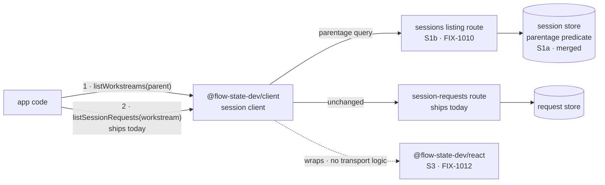

# FIX-1011: S2 — the client cannot declare detached work or enumerate a session's Workstreams — Implementation Spec

## Part I — The Case *(for the human)*

### 1. Problem — why it matters, why now

An app built on the framework can now start work that keeps running after the user's turn
comes back — a long job that takes minutes or an hour. The app's own front end cannot see any
of it. From the browser there is no way to ask *"what background work is running for this
conversation, and how far has it got?"* The work runs, finishes, and the person who asked for
it is shown nothing the whole time.

**Why now** — this is the last piece of plumbing before the demo that proves the background-work
feature works at all, and that demo is what the epic is gated on finishing. Every consumer goes
through this one client: the React hooks and the demo UI both sit on top of it.

**There is no workaround.** Background work runs in its own separate session, so every existing
"show me this conversation" call is structurally blind to it. It is not a filter somebody forgot
to pass — there is nothing in the parent to filter.

### 2. Solution in plain terms

**Two reads, in two hops.** Ask a conversation what background work it has, and get back one
entry per body of work — one per issue being worked, one per investigation. Then ask one of
those entries what it has done so far, using the call that already exists for reading a
conversation's turns. Nothing new is needed for the second hop.

**And one subtraction.** The client does *not* get a way to say "run this in the background."
Whether a piece of work detaches is decided by the app's flow author when they wire the flow up,
not by whoever makes the call. So the client's job here is discovery, not declaration. The issue
title asks for both; we are proposing to build one and drop the other, and decision 1 is where
that gets signed off.

**Philosophy** — tenet 2 (composition over features): background work *is* a session, so the
second hop is the session-request read that already ships, and we add one read rather than a
parallel API beside it. Tenet 3 (earn every addition): the declaration half is dropped rather
than built, because the substrate already decided who makes that call.

> **§2 then §6 lead, and the rest is derivation.** Problem, then what we propose, then what
> you are signing. Everything from §3 down justifies it.

### 6. Decisions & rules — the sign-off surface

1. **Whether work runs in the background stays the app's decision, never the caller's.**
   The client gets no "run this detached" flag. It can only discover what the app already
   chose to detach.
   *Rejected:* a per-call flag on the client's send-action call — the shape the issue title
   asks for.
   *Locks in:* a web page, a script, or anyone holding a user's credentials cannot make
   expensive long-running work start. The bill lands on app developers: an app that wants to
   offer its own end user a "run this in the background" toggle has to have its flow author
   wire a second entry point for that, rather than passing a flag from the browser. We can add
   caller-chosen detachment later behind an explicit server-side opt-in, so this is reversible —
   but shipping it now gives away a control we could not quietly take back.

2. **Background work is shown as completed steps, not as live typing.**
   Attaching to background work that is still running is supported, and returns each step as it
   finishes. It does not stream text as the model produces it.
   *Rejected:* building a live-tail surface for it, and the opposite — refusing to let anyone
   watch running work at all until it is done.
   *Locks in:* an end user watching background work sees results land a step at a time, where
   the same model in a foreground chat types out word by word. That difference is visible and
   we will be asked about it, so we tell developers at the point they would expect the other
   behaviour. Adding live text later is additive and breaks nobody, so the cost here is setting
   expectations now, not rework later.

3. **"Workstream" becomes a word app developers write.**
   The client gets its own named read for a conversation's background work, rather than a filter
   option bolted onto the generic "list this user's sessions" call.
   *Rejected:* reusing the generic session listing with a parentage option — a smaller surface,
   but a developer would have to know that "a child session" means background work.
   *Locks in:* the term ships in every app's code, our documentation and our support answers;
   renaming it later is a breaking change for everyone who built against it. It also means the
   ordinary "list this user's conversations" call can never return background work, so no
   existing session picker starts showing internal machinery by accident.

**Non-goals** — live in-flight text from background work (decision 2; this is the epic's
already-accepted limit, and building a live-tail or polling surface for it is out of scope, not
an option) · the React hooks that sit on this (S3) · the demo UI (S4) · anything about *how*
work detaches server-side (FIX-982) · the HTTP route itself and the request metadata it returns
(S1b).

**Size:** Small (one package, one PR, ~150 LOC plus docs and tests).

---

### 3. Tradeoffs & alternatives

**Alternative: one flat list.** Ask a conversation for everything happening under it — its own
turns and its background work — in a single call. Rejected: background work is not a subset of
the conversation, it is a separate body of work that accumulates its own history over hours or
days. Flattening them means every app has to un-flatten them again to show them differently,
which every app would, and the "one entry per body of work" grouping becomes something each app
reinvents slightly differently.

**The simpler approach: ship nothing on the client and let apps call the HTTP route directly.**
Genuinely tempting — hop 1 is one GET, and the route exists once S1b lands. Insufficient because
the client is where transport shape gets decided once for every consumer, and there are already
two: the React hooks and the demo. The package boundary says React holds no transport logic, so
skipping the client means hand-rolling the same fetch in the two places that boundary exists to
keep clean.

**Where the complexity is:** not the read. It is decision 2's honesty. This surface makes it
*look* like you can watch background work the way you watch a chat, and you cannot, quite.
Getting that stated where a developer meets it is more of this issue's real work than the fetch
is.

### 4. Focus practices (1–5)

1. **BP-030 (tolerate the old shape)** — every field this surface reads is written by a newer
   server than most callers will be running against. A session that predates background work has
   no parent and no topic; guard with `== null`, and never let an absent field read as a
   Workstream with an empty name.
2. **BP-031 (never route on caller-controllable input)** — decision 1 is this practice stated as
   a product decision. The client sends nothing that changes where or how work runs.
3. **Tenet 3 (earn every addition)** — the second hop already works. Resist adding a
   Workstream-shaped variant of a call that needs no change.
4. **Document the limit where it is used, not only where it is true** (tenet 1) — decision 2's
   caveat belongs on the surface a developer reaches for, not filed once in a concepts page they
   may never open.

### 5. What using it looks like

**Finding and reading background work** *(what this spec proposes — today neither call exists
for this, and the parent's own reads cannot see background work at all):*

```ts
const sessions = createSessionClient({ baseUrl: "/api" });

// Hop 1 — what background work is running under this conversation?
const workstreams = await sessions.listWorkstreams("sess_1");
// → [{ id: "ws_9f3a…", parentSessionId: "sess_1", topic: "FIX-981", … }]
// Identity and coordinates. No run state on this row today — whether it gains
// one is an open cross-spec dependency (§12).

// Hop 2 — what has that work done so far? This call already ships, unchanged.
const requests = await sessions.listSessionRequests(workstreams[0].id, {
  includeItems: true
});
```

**What the ordinary session list does (before / after):**

```
before  listSessions({ flowKind, userId }) → the user's own conversations
after   listSessions({ flowKind, userId }) → the user's own conversations, identical.
        Background work never appears here. You ask for it under its parent, or not at all.
```

**Watching work that is still running** *(decision 2 at the call site):*

```ts
// A Workstream request that has not finished yet.
createSSEClient({
  url: `/api/flows/${flowKind}/requests/${requests[0].id}/stream`,
  onItemDone: (event) => render(event.item)   // each step, as it completes
  // onContentDelta does not fire for a generator running out of process.
  // Nothing types out character by character here.
});
```

## Part II — The Build Plan *(for the implementing agent)*

### 7. Technical design

Hop 1 is a new read on the session client over the route S1b adds. Hop 2 is the session-request
read that ships today, called with a Workstream's id instead of a conversation's. No engine
change belongs to this issue, and no React change.



- **`@flow-state-dev/client`** — one new session-client read, plus the summary type that
  describes a Workstream. The single place hop 1's transport shape is decided, for every
  consumer.
- **`@flow-state-dev/engine`** — untouched here. S1a merged the store predicate; S1b owns the
  route and the request metadata.
- **`@flow-state-dev/react`** — untouched here. S3 consumes this; no transport logic crosses.

**What the API exposes**, at the level of what it does rather than its signature:

- A **named read**: given a conversation's id, the Workstreams under it. Tenant- and
  principal-scoped by the server exactly as the existing session listing already is — the client
  adds no filtering of its own and must not appear to.
- A **Workstream summary type**, and it is worth being exact about what that is rather than
  saying "a session summary plus extras." A session summary today is **identity and description
  only** — id, flow kind, user, title, description, tags, metadata, timestamps. **There is no run
  state on it.** The one run-adjacent field anywhere on a session record is `latestRequestId`,
  which is *an id, not a status*, is written when a request **starts**, and is never updated when
  one finishes — so a row carrying it can point at a request that failed an hour ago and say
  nothing about it. What this issue adds on top is the **coordinates** that make a Workstream
  identifiable to a UI — which body of work it is for, and which board dispatched it — every one
  optional and `== null`-guarded, because a server that predates them returns none (BP-030).
- **So a Workstream row tells you what exists, not how it is going.** A UI can list background
  work and label it; it cannot render "running / done / failed" from this row alone. Whether that
  changes is an open cross-spec dependency, not an implementer's call — see §12.
- **No change** to the generic session listing's request, result, or default, and **no change**
  to the send-action surface (decision 1).

**Sketch — pseudocode. Illustrative, not the contract. React to the shape.**

```
on the session client, beside the existing session reads:

    listWorkstreams(parentSessionId, opts):
        ask the sessions listing for "the children of this parent"
        return each row as a workstream summary
        (a row IS a session row — the extra coordinates ride on it)

hop 2 needs nothing new:

    listSessionRequests(workstream.id, …)     ← the shipped call, unchanged

deliberately absent, and both are §6 decisions rather than gaps:

    sendAction(…, { detached: true })         ← decision 1
    a live-text tail on a running workstream  ← decision 2
```

What this asks a reviewer: **is a named read the right shape, or should this be one more option
on the generic session listing?** And: **is it right that hop 2 gets no Workstream-specific
variant at all** — that a Workstream is read with exactly the call a conversation is read with?

### 8. Implementation sequence

1. **Type the Workstream summary** and thread it through the client's public type surface.
   Additive only, no behaviour. *Test:* a summary built from a server response carrying none of
   the new coordinates reads back as a plain session with those fields absent, and nothing
   throws. *Depends on:* **the §12 run-state fork being resolved** — the shape of this type is
   what the fork decides, so starting here first is the one ordering that wastes work.
2. **Add the parent-to-child read** on the session client, over S1b's route. *Test:* the request
   it issues names the parent and asks for children; a parent with no background work returns an
   empty list rather than an error; the generic session listing's request is byte-identical to
   today. *Depends on:* 1, and S1b landing.
3. **Confirm hop 2 needs nothing.** Drive a Workstream's id through the existing session-request
   read and assert it returns that Workstream's requests and not the parent's. If it turns out to
   need something, that is a finding to fold back into this spec, not a silent addition here.
   *Test:* the two hops composed end to end against the real routes (§10). *Depends on:* 2.
4. **Document the limit at the surface** (decision 2) — package README and the docs page, per
   §11, written through `docs-writer` then `docs-editor`. *Depends on:* 3.

**Removals:** none — there is no existing client surface for background work to retire. The
subtraction in this change is decision 1, the half of the issue we are choosing not to build.
State that in the PR description rather than leaving a reader to notice an absence.

**PR plan:** none. Small, one PR.

### 9. Edge cases & error handling

| Case | Expected |
|---|---|
| A conversation with no background work | Empty list, not an error — "nothing running" is the ordinary state, not an exception |
| A Workstream's own id passed to hop 1 | Its children, which is empty today. No special-casing and no error; nesting is not this issue's to forbid |
| A server that predates the Workstream coordinates | Rows come back as plain sessions with those fields absent. `== null`, never a non-null assertion (BP-030) |
| A Workstream whose parent was deleted | Whatever the server returns. The parent-delete hole is recorded on the epic and belongs to the route, not here |
| Another tenant's conversation id | The server's existing tenant filter decides. The client adds no filtering of its own (BP-031) |
| A Workstream request still in flight | Returned with an in-progress status; its item log is what has completed so far. Not an error, not empty |
| Attaching to a running Workstream's stream | Completed items arrive; no in-flight text (decision 2). Not a failure mode — the documented behaviour |

**Taxonomy:** every case above is non-fatal and degrades to "nothing to show." The only fatal
path is an unreadable conversation id, which the existing route already 404s and which this
issue does not change.

### 10. Testing strategy

**Goal & goal check.** The composed two hops against the real routes, no model involved: seed a
conversation and a Workstream under it with one completed request, serve both through the real
flow API router, and assert hop 1 returns the Workstream and hop 2 returns that Workstream's
request and not the conversation's. **It must drive the real routes, not a stub fetcher** — a
stubbed transport proves the client builds a URL, which is not the thing S4 stands on.

*One placement constraint worth knowing before you start:* the client's own tests use a stub
fetcher and the client has no engine dependency, and `engine` may never depend on `client`. The
natural home is the private `integration-tests` package, which carries `engine` today and would
need `client` added. That addition is legal — the boundary rule constrains `engine`, not a
private test package — but it is a real change to make deliberately rather than notice halfway.

**CI specs** (the behaviours, not the test names):

- **One behaviour per decision in §6**, stated in observable terms — what a caller gets back,
  not how it is computed.
- **The second path** (BP-035): a server that returns no Workstream coordinates at all, and a
  conversation that has no background work. Both are the common case for the entire first
  release.
- **What must not change:** the generic session listing behaves exactly as today for every
  existing caller. The two live ones are the DevTool's session picker and `useFlow`'s.
- **The invariant that is easy to test wrongly:** hop 2 on a Workstream must return **only** that
  Workstream's requests. A test that seeds only the child passes even when the implementation
  ignores the id entirely — seed the conversation with a request of its own too, or the test
  cannot fail.

**Discipline:** `tdd`. The seam is the client's session-client boundary, reachable from vitest
with a fetcher, so every behaviour above except the goal check is a tracer bullet with no server
involved.

### 11. Documentation plan

- **EXTEND** `packages/client/README.md` — under the existing "Session management" section, the
  two hops in the code style already there, plus decision 2's limit stated at the call rather
  than filed elsewhere. Terse reference voice, matching its neighbours.
- **EXTEND** `apps/docs/docs/client/overview.md` — a new "Background work" section after
  "Session management" and before "State snapshots and clientData". Covers what a Workstream is,
  in one sentence, for a reader who has never met the term; the two hops with one minimal
  example; and the completed-steps-not-live-typing limit. Cross-link → `orchestration/task-board`
  (where detachment is declared) and ← from `client/react` once S3 lands.
  *Voice risks:* "seamless" and "real-time" are the two obvious words here and both are wrong.
  Introduce "Workstream" in plain terms on first use. No issue ids anywhere under `apps/docs`.
- **No new page.** At client altitude this is one section under an existing concept. The
  cross-package concept narrative belongs to S5, which the epic keeps deliberately separate.
- **Not here:** the orchestration-side page on declaring detachment (FIX-982's), and corpus
  navigation (S5's).

All user-facing prose goes through `docs-writer` then `docs-editor`, per the repo rule.

### 12. Dependencies, open questions & follow-ups

**Dependencies:**

- **S1b / FIX-1010 — hard blocker.** It owns the route. S1a (FIX-1009) merged the parentage
  predicate into the session store, but nothing exposes it over HTTP, so hop 1 has nothing to
  call today.
- **FIX-982** must have shipped the spawn for a Workstream to exist at all. This issue reads
  nothing FIX-982 builds beyond what S1b returns.

**What this spec assumes about S1b — confirm before implementation.** S1b's own spec was being
written in parallel with this one and was not available; these are the four things this design
leans on.

1. **S1b exposes the parentage predicate on the existing sessions listing route** as a query
   parameter, rather than adding a separate Workstreams route. If it takes the separate-route
   shape instead, this issue's method binds to that route and **nothing in Part I changes** — the
   client API is identical either way. Low risk.
2. **S1b preserves S1a's top-level default** when the parameter is absent, so existing callers
   keep seeing only the user's own conversations. This is what decision 3's "no picker starts
   showing internal machinery" rests on.
3. **The rows the listing returns carry the coordinates that identify a Workstream** — at
   minimum, which body of work it is for. **This is the one assumption whose failure changes what
   this issue is worth:** hop 1 still works without it, but a UI can only label Workstreams by an
   opaque id, and decision 3 buys much less. Worth confirming first.
4. **A detached request's provenance and task id are readable on the request summaries hop 2
   returns.** These are existing fields on that shape, so this assumes they are *populated*, not
   that new surface exists. The epic's own pass criteria require both.

**Blocking dependency — does a Workstream row carry run state? (cross-spec, owner's call.)**
Raised by cross-spec review across S1b / S2 / S3; **the coordinator is putting this to the owner
and it is not resolved here.** Step 1 of §8 waits on it, because the answer *is* the shape of the
type.

The conflict, stated once: this spec's row carries identity and coordinates and **no run state**
(§7). S1b names liveness as an explicit non-goal. S3 promises a user watches work fill in step by
step and that failed work stays visible as failed — neither is renderable from a stateless row.
So S3 either pays one extra read per row, on a screen every conversation renders, or drops two of
its three decisions.

The two branches:

- **(a) The row carries coarse *recorded* state** — which in practice means S1b's route returns
  it and this spec types it. S3 renders from the row.
- **(b) It does not**, and S3 absorbs the cost — an extra read per Workstream from the browser,
  or two of its decisions go.

**What I could settle, and did — the pricing, measured against the tree.** The answer to *"is
recorded status already available per session without an extra query?"* is **no**, for two
independent reasons: the session record carries no status field at all (only `latestRequestId`,
written when a request **starts** and never updated when it ends), and there is no batched
request read — `RequestListOptions` takes a single `sessionId`, with no `sessionIds[]` or
`ids[]`. So N Workstreams cost N reads wherever those reads happen.

But **(a) splits into two variants with very different prices, and only one of them is
expensive:**

- **(a-1) Denormalize a status onto the session record. Not cheap, and not S1b-local.** There is
  no session write on the request-terminal path today, so this adds one per request completion
  for *every* request in the system, foreground included — a second writer to a record the
  execution context already holds and rewrites, and which is also the CAS target for session
  state. It also introduces a staleness class: a crashed worker leaves the row reading
  "in progress" with nothing correcting it, which is the failure the epic's reclamation milestone
  exists for.
- **(a-2) S1b's route resolves the last recorded status per row. This is the cheap one.** One
  indexed read per Workstream — the most recent request for that session id — and the indexes
  already exist on both SQL adapters (`requests(session_id)`, `(session_id, status)`,
  `(session_id, tenant_id)`). Still an N+1, but **in-process and indexed** rather than N HTTP
  round trips from a browser: the client pays one request instead of N. No schema change, no new
  write path, no staleness beyond what the request record already carries.

**And this reframes the fork rather than just pricing it.** S1b's non-goal is *liveness* — which
jobs are **running**. Last *recorded* status is a different question: it reads what the request
store already durably wrote, and asserts nothing about a worker being alive. It is exactly what
S3 needs to render running / done / failed, and it sidesteps S1b's stated non-goal instead of
violating it. **It must not be labelled as liveness**, because a crashed worker's row reads
in-progress until reclamation corrects it, and it does not answer the epic's N3.

*If it were mine to call I would take **(a-2)** — one indexed server-side read per row, no schema
change, and it converts the fork from "grow the scope" into "move an N+1 off the browser." It is
not mine to call, and I have not written it into the design.*

**Open questions:** none besides the fork above. Decision 1 is a genuine live fork and is asked in
full on the spec PR, but it *narrows* scope rather than gating the build — reversing it would be a
separate, larger issue with its own authorization design, not a variation of this one.

**Follow-ups (flagged, not built):**

- **The epic's consumer-surface table still says the client "declares detached work."** That
  phrase predates the epic's own Decision 0 and contradicts it. Worth one line on the epic-spec
  correction PR so the next reader of that table does not re-derive a client-side flag. Not this
  issue's to edit.
- **Reading a Workstream's requests is authorized by tenant, not by ownership.** The
  session-request route resolves a session by tenant and does not check that the caller owns it.
  Pre-existing and unchanged by this issue, but Workstream ids are derived from their parent's,
  so the shape is worth a look once background work is real. Route-side — S1b's or its own issue.
- **No liveness read.** "Which Workstreams are running right now" is not answerable from an
  enumeration (the epic records this and routes it to FIX-982). An app that wants a live/idle
  badge derives it from hop 2's request statuses for now.

---

## Spec evolution

- **Spec drafted** — framed as discovery rather than declaration; kept the epic's two-hop shape;
  proposed dropping the issue's "declare detached work" half as incompatible with the epic's
  decided model, where detachment is the flow author's call; sized the remainder at one new
  client read over S1b's route, with the second hop needing no change at all.
- **After cross-spec review** — stated plainly in §7 that a Workstream row carries identity and
  coordinates and no run state, and recorded the S1b/S2/S3 run-state conflict in §12 as a
  blocking dependency on the owner's call, because "a session summary plus extras" could be read
  as including a status and does not.
