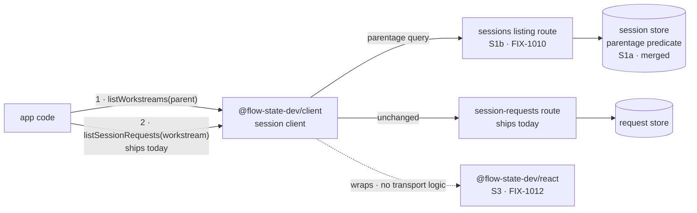

# Background work runs where the app that started it cannot see it — Implementation Spec

## Part I — The Case *(for the human)*

### 1. Problem — why it matters, why now

An app built on the framework can now start work that keeps running after the user's turn
comes back — a long job that takes minutes or an hour. The app's own front end cannot see any
of it. From the browser there is no way to ask *"what background work is running for this
conversation, and how far has it got?"* The work runs, finishes, and the person who asked for
it is shown nothing the whole time.

**Why now** — this is the last piece of plumbing before the demo that proves the background-work
feature works at all, and that demo is what the epic is gated on finishing. Every consumer goes
through this one client: the React hooks and the demo UI both sit on top of it.

**There is no workaround.** Background work runs in its own separate session, so every existing
"show me this conversation" call is structurally blind to it. It is not a filter somebody forgot
to pass — there is nothing in the parent to filter.

### 2. Solution in plain terms

**Two reads, in two hops.** Ask a conversation what background work it has, and get back one
entry per body of work — one per issue being worked, one per investigation. Then ask one of
those entries what it has done so far, using the call that already exists for reading a
conversation's turns. Nothing new is needed for the second hop.

**And one subtraction.** The client does *not* get a way to say "run this in the background."
Whether a piece of work detaches is decided by the app's flow author when they wire the flow up,
not by whoever makes the call. So the client's job here is discovery, not declaration. The issue
title asks for both; we are proposing to build one and drop the other, and decision 1 is where
that gets signed off.

**Philosophy** — tenet 2 (composition over features): background work *is* a session, so the
second hop is the session-request read that already ships, and we add one read rather than a
parallel API beside it. Tenet 3 (earn every addition): the declaration half is dropped rather
than built, because the substrate already decided who makes that call.

> **§2 then §6 lead, and the rest is derivation.** Problem, then what we propose, then what
> you are signing. Everything from §3 down justifies it.

### 6. Decisions & rules — the sign-off surface

1. **Whether work runs in the background stays the app's decision, never the caller's.**
   The client gets no "run this detached" flag. It can only discover what the app already
   chose to detach.
   *Rejected:* a per-call flag on the client's send-action call — the shape the issue title
   asks for.
   *Locks in:* a web page, a script, or anyone holding a user's credentials cannot make
   expensive long-running work start. The bill lands on app developers: an app that wants to
   offer its own end user a "run this in the background" toggle has to have its flow author
   wire a second entry point for that, rather than passing a flag from the browser. We can add
   caller-chosen detachment later behind an explicit server-side opt-in, so this is reversible —
   but shipping it now gives away a control we could not quietly take back.

2. **Background work is shown as completed steps, not as live typing.**
   Attaching to background work that is still running is supported, and returns each step as it
   finishes. It does not stream text as the model produces it.
   *Rejected:* building a live-tail surface for it, and the opposite — refusing to let anyone
   watch running work at all until it is done.
   *Locks in:* an end user watching background work sees results land a step at a time, where
   the same model in a foreground chat types out word by word. That difference is visible and
   we will be asked about it, so we tell developers at the point they would expect the other
   behaviour. Adding live text later is additive and breaks nobody, so the cost here is setting
   expectations now, not rework later.

3. **"Workstream" becomes a word app developers write.**
   The client gets its own named read for a conversation's background work, rather than a filter
   option bolted onto the generic "list this user's sessions" call.
   *Rejected:* reusing the generic session listing with a parentage option — a smaller surface,
   but a developer would have to know that "a child session" means background work.
   *Locks in:* the term ships in every app's code, our documentation and our support answers;
   renaming it later is a breaking change for everyone who built against it. It also means the
   ordinary "list this user's conversations" call can never return background work, so no
   existing session picker starts showing internal machinery by accident.

4. **A Workstream row carries the state its work reached — in the same words the rest of the
   system uses, not a friendlier summary of them.** The listing carries each Workstream's last
   *recorded* status alongside its identity, resolved server-side in the same read, and passes
   through the full set of states the system persists rather than mapping them.
   *Rejected:* two things. A stateless row, which would make every consumer fetch one extra read
   per Workstream from the browser just to render a label, on a screen every conversation shows.
   And — separately — collapsing the states into a tidy running / done / failed at this layer,
   which an earlier draft of this decision promised.
   *Locks in:* an app can render a list of background work **with its state in a single call**,
   which is what makes a "what's running" view cheap enough for a main screen rather than behind a
   click. It also means an app is handed the system's own status words — including the ones that
   are neither plainly running nor plainly finished, like work that was interrupted or is
   suspended awaiting input — and deciding how to group those for an end user is the app's call,
   not ours. That is a deliberate cost: a framework that picks three buckets for everyone makes
   "waiting for a person" and "killed" look identical to a user who needs to tell them apart, and
   we would be the ones who threw the distinction away. The honest caveat ships with it and must
   be documented, not buried: this is the **last recorded** status, not a health check. If a
   worker's process dies, its row keeps reading *in progress* until the substrate's reclamation
   notices and corrects it. An app can trust it to render; an app must not use it to conclude that
   something is stuck.

**Non-goals** — live in-flight text from background work (decision 2; this is the epic's
already-accepted limit, and building a live-tail or polling surface for it is out of scope, not
an option) · **true liveness** — "is this worker actually alive right now" is a different
question from decision 4's recorded status, is not answered here, and no wording in this change
may imply it is · the React hooks that sit on this (S3) · the demo UI (S4) · anything about *how*
work detaches server-side (FIX-982) · the HTTP route itself and the request metadata it returns
(S1b).

**Size:** Small (one package, one PR, ~150 LOC plus docs and tests).

---

### 3. Tradeoffs & alternatives

**Alternative: one flat list.** Ask a conversation for everything happening under it — its own
turns and its background work — in a single call. Rejected: background work is not a subset of
the conversation, it is a separate body of work that accumulates its own history over hours or
days. Flattening them means every app has to un-flatten them again to show them differently,
which every app would, and the "one entry per body of work" grouping becomes something each app
reinvents slightly differently.

**The simpler approach: ship nothing on the client and let apps call the HTTP route directly.**
Genuinely tempting — hop 1 is one GET, and the route exists once S1b lands. Insufficient because
the client is where transport shape gets decided once for every consumer, and there are already
two: the React hooks and the demo. The package boundary says React holds no transport logic, so
skipping the client means hand-rolling the same fetch in the two places that boundary exists to
keep clean.

**Where the complexity is:** not the read. It is decision 2's honesty. This surface makes it
*look* like you can watch background work the way you watch a chat, and you cannot, quite.
Getting that stated where a developer meets it is more of this issue's real work than the fetch
is.

### 4. Focus practices (1–5)

1. **BP-030 (tolerate the old shape)** — every field this surface reads is written by a newer
   server than most callers will be running against. A session that predates background work has
   no parent and no topic; guard with `== null`, and never let an absent field read as a
   Workstream with an empty name.
2. **BP-031 (never route on caller-controllable input)** — decision 1 is this practice stated as
   a product decision. The client sends nothing that changes where or how work runs.
3. **Tenet 3 (earn every addition)** — the second hop already works. Resist adding a
   Workstream-shaped variant of a call that needs no change.
4. **Document the limit where it is used, not only where it is true** (tenet 1) — decision 2's
   caveat belongs on the surface a developer reaches for, not filed once in a concepts page they
   may never open.

### 5. What using it looks like

**Finding and reading background work** *(what this spec proposes — today neither call exists
for this, and the parent's own reads cannot see background work at all):*

```ts
// Same-origin: the client's paths are already absolute from the root, so a
// base URL is only for pointing at a different host or a mount prefix.
const sessions = createSessionClient();

// Hop 1 — what background work is running under this conversation?
const workstreams = await sessions.listWorkstreams("sess_1");
// → [{ id: "ws_9f3a…", parentSessionId: "sess_1", topic: "FIX-981",
//      status: "in_progress", … }]
// Identity, coordinates, and the last recorded status — enough to render a
// list of background work with its state, in one call.

// Hop 2 — what has that work done so far? This call already ships, unchanged.
const requests = await sessions.listSessionRequests(workstreams[0].id, {
  includeItems: true
});
```

**What the ordinary session list does (before / after):**

```
before  listSessions({ flowKind, userId }) → the user's own conversations
after   listSessions({ flowKind, userId }) → the user's own conversations, identical.
        Background work never appears here. You ask for it under its parent, or not at all.
```

**Watching work that is still running** *(decision 2 at the call site):*

```ts
// A Workstream request that has not finished yet.
createSSEClient({
  url: `/api/flows/${flowKind}/requests/${requests[0].id}/stream`,
  onItemDone: (event) => render(event.item)   // each step, as it completes
  // onContentDelta does not fire for a generator running out of process.
  // Nothing types out character by character here.
});
```

## Part II — The Build Plan *(for the implementing agent)*

### 7. Technical design

Hop 1 is a new read on the session client over the route S1b adds. Hop 2 is the session-request
read that ships today, called with a Workstream's id instead of a conversation's. No engine
change belongs to this issue, and no React change.



- **`@flow-state-dev/client`** — one new session-client read, plus the summary type that
  describes a Workstream. The single place hop 1's transport shape is decided, for every
  consumer.
- **`@flow-state-dev/engine`** — untouched here. S1a merged the store predicate; S1b owns the
  route and the request metadata.
- **`@flow-state-dev/react`** — untouched here. S3 consumes this; no transport logic crosses.

**What the API exposes**, at the level of what it does rather than its signature:

- A **named read**: given a conversation's id, the Workstreams under it. Tenant- and
  principal-scoped by the server exactly as the existing session listing already is — the client
  adds no filtering of its own and must not appear to.
- **It is a named alias, not a subsystem, and this is the sentence that keeps the change small.**
  S1a already merged the store predicate (`parentage: { parentOf }`), and S1b exposes it on the
  sessions listing route. `listWorkstreams(parent)` issues *that* query with that predicate filled
  in. No second route, no parallel response mapper, no client-side re-filtering. Decision 3 buys
  the vocabulary; it does not buy new plumbing. An implementer who finds themselves writing a
  second mapper has gone wrong.
- **One summary type, extended — not a parallel hierarchy.** A Workstream row *is* a session row,
  so the type extends the existing session summary with optional fields rather than standing
  beside it as a second shape that drifts as the first one grows. Two things make that concrete:
  - The client's session summary omits `parentSessionId` today, **but the server already sends
    it** — the sessions listing route returns the stored record, which has carried the field
    since S1a merged. So this is the client type catching up to the wire, not a new field on it.
  - The coordinates are **`topic` and the `coordinate` tagged union** (`assignee` / `uniform` /
    `floor`), taking orchestration's existing vocabulary rather than invented names. Both are
    declared on the session record at spawn and returned by S1b's listing, so they arrive on the
    row for free.
  - **`boardId` is not one of them, and an earlier draft of this spec wrongly named it.** It
    participates in *deriving* a Workstream's id and lives on the board config; it is never
    persisted on the record, so nothing returns it. Adding it would be a FIX-982 change — a new
    persisted field written at spawn, plus its own back-compat story for rows already written —
    and no consumer in this chain has asked for it. **Do not type it, and do not let a UI plan
    depend on grouping rows by board.**
  - Everything added is optional and `== null`-guarded (BP-030) — and that optionality is not
    just defensive: **the presence of the fields is itself the signal** a client uses to decide
    whether a row is labelable. The direction is extend, then narrow: a session summary becomes a
    Workstream when the parentage and coordinates are there.
- **The last recorded status, which nothing on a session record supplies today** (decision 4).
  Be exact about why, because "a session summary plus extras" reads as more than it is: a session
  summary is **identity and description only** — id, flow kind, user, title, description, tags,
  metadata, timestamps — and the one run-adjacent field anywhere on a session record is
  `latestRequestId`, which is *an id, not a status*, is written when a request **starts**, and is
  never updated when one finishes. A row carrying it can point at a request that failed an hour
  ago and say nothing about it.
  - **So the status is resolved, not read off the session.** S1b's route resolves each row's most
    recent request as part of the same listing, in-process, over indexes that already exist on
    both SQL adapters (`requests(session_id)`, `(session_id, status)`, `(session_id, tenant_id)`).
    That keeps the cost one indexed read per row on the server instead of one HTTP round trip per
    row from the browser.
  - **Deliberately not denormalized onto the session record.** There is no session write on the
    request-terminal path today, so a stored status would add one per request completion
    system-wide — plus a second writer to a record that is already the CAS target for session
    state. It buys a marginally cheaper read for a materially worse write path.
  - **It is recorded status, never liveness, and the distinction is load-bearing in the wording
    as well as the design.** It reports what the request store durably wrote; it asserts nothing
    about a process being alive. A crashed worker's row reads *in progress* until reclamation
    corrects it. Do not name it, type it, or document it as "live", "active", or "healthy."
  - **It is not the single source of truth for a row's state, and this spec must not teach that
    it is.** S1b sets the display rule the two specs share: **where a row is task-backed, the
    task's lifecycle is authoritative; the recorded status is the fallback and the first paint.**
    So this field is what a UI renders immediately and what it falls back to when there is no task
    behind the row — not what it trusts over a task that says otherwise.
  - **Where the correlation lives, because the rule above is undeliverable without it.**
    Nothing types a task id on a session or a request: `RequestRecord` has none, and the only
    typed `taskId` in the tree is on *items* — which §11 tells consumers not to fetch on list
    paths. So state the reachable path rather than leaving a UI to find one:
    **a hop-1 row on its own has no task correlation** — `topic` and `coordinate` identify the
    body of work, not the task — **so for a hop-1-only list the recorded status is all there is,
    which is exactly what "first paint" means.** The correlation appears at hop 2: each request
    summary carries `source` and `metadata`, and **`metadata` rides on the summary — it is not
    behind the item log**, so reading it costs no over-fetch.
  - **And the correlation is a pair, not an id.** A task id does not identify a task on its own:
    task ids are unique *per collection*, two boards may legitimately hold the same id, and the
    substrate's own claim ticket carries a collection id for exactly this reason. So a parent
    running more than one detached board could associate a Workstream with the wrong board's task
    — **which is worse than no correlation, because it renders confidently and wrongly.**
    The identity a consumer needs is therefore **`(collection identity, taskId)` together, and a
    client must treat an incomplete pair as no correlation at all** — falling back to the recorded
    status rather than guessing. §12 constraint 2 states this as the requirement on FIX-982,
    including the part that is a genuine addition rather than a promise about what already ships.
- **No change** to the generic session listing's request, result, or default, and **no change**
  to the send-action surface (decision 1).

**Sketch — pseudocode. Illustrative, not the contract. React to the shape.**

```
on the session client, beside the existing session reads:

    listWorkstreams(parentSessionId, opts):
        ask the sessions listing for "the children of this parent"
        return each row as a workstream summary
        (a row IS a session row — the extra coordinates ride on it)

hop 2 needs nothing new:

    listSessionRequests(workstream.id, …)     ← the shipped call, unchanged

deliberately absent, and both are §6 decisions rather than gaps:

    sendAction(…, { detached: true })         ← decision 1
    a live-text tail on a running workstream  ← decision 2
```

What this asks a reviewer: **is a named read the right shape, or should this be one more option
on the generic session listing?** And: **is it right that hop 2 gets no Workstream-specific
variant at all** — that a Workstream is read with exactly the call a conversation is read with?

### 8. Implementation sequence

1. **Type the Workstream summary** and thread it through the client's public type surface.
   Additive only, no behaviour. *Test:* a summary built from a server response carrying none of
   the new coordinates reads back as a plain session with those fields absent, and nothing
   throws — and one carrying a status reads it back without the caller reaching for a second
   request. *Depends on:* nothing. The run-state question that gated this step is settled
   (decision 4, §12), so the type's shape is known.
2. **Add the parent-to-child read** on the session client, over S1b's route. *Test:* the request
   it issues names the parent and asks for children; a parent with no background work returns an
   empty list rather than an error; the generic session listing's request is byte-identical to
   today. *Depends on:* 1, and S1b landing.
3. **Confirm hop 2 needs nothing.** Drive a Workstream's id through the existing session-request
   read and assert it returns that Workstream's requests and not the parent's. If it turns out to
   need something, that is a finding to fold back into this spec, not a silent addition here.
   *Test:* the two hops composed end to end against the real routes (§10). *Depends on:* 2.
4. **Document the limit at the surface** (decision 2) — package README and the docs page, per
   §11, written through `docs-writer` then `docs-editor`. *Depends on:* 3.

**Removals:** none — there is no existing client surface for background work to retire. The
subtraction in this change is decision 1, the half of the issue we are choosing not to build.
State that in the PR description rather than leaving a reader to notice an absence.

**PR plan:** none. Small, one PR.

### 9. Edge cases & error handling

| Case | Expected |
|---|---|
| A conversation with no background work | Empty list, not an error — "nothing running" is the ordinary state, not an exception |
| A Workstream's own id passed to hop 1 | Its children, which is empty today. No special-casing and no error; nesting is not this issue's to forbid |
| A server that predates the Workstream coordinates | Rows come back as plain sessions with those fields absent. `== null`, never a non-null assertion (BP-030) |
| A Workstream whose parent was deleted | Whatever the server returns. The parent-delete hole is recorded on the epic and belongs to the route, not here |
| Another tenant's conversation id | The server's existing tenant filter decides. The client adds no filtering of its own (BP-031) |
| A Workstream request still in flight | Returned with an in-progress status; its item log is what has completed so far. Not an error, not empty |
| Attaching to a running Workstream's stream | Completed items arrive; no in-flight text (decision 2). Not a failure mode — the documented behaviour |

**Taxonomy:** every case above is non-fatal and degrades to "nothing to show." The only fatal
path is an unreadable conversation id, which the existing route already 404s and which this
issue does not change.

### 10. Testing strategy

**Goal & goal check.** The composed two hops against the real routes, no model involved: seed a
conversation and a Workstream under it with one completed request, serve both through the real
flow API router, and assert hop 1 returns the Workstream and hop 2 returns that Workstream's
request and not the conversation's. **It must drive the real routes, not a stub fetcher** — a
stubbed transport proves the client builds a URL, which is not the thing S4 stands on.

*One placement constraint worth knowing before you start:* the client's own tests use a stub
fetcher and the client has no engine dependency, and `engine` may never depend on `client`. The
natural home is the private `integration-tests` package, which carries `engine` today and would
need `client` added. That addition is legal — the boundary rule constrains `engine`, not a
private test package — but it is a real change to make deliberately rather than notice halfway.

**CI specs** (the behaviours, not the test names):

- **One behaviour per decision in §6**, stated in observable terms — what a caller gets back,
  not how it is computed.
- **The second path** (BP-035): a server that returns no Workstream coordinates at all, and a
  conversation that has no background work. Both are the common case for the entire first
  release.
- **What must not change:** the generic session listing behaves exactly as today for every
  existing caller. The two live ones are the DevTool's session picker and `useFlow`'s.
- **The invariant that is easy to test wrongly:** hop 2 on a Workstream must return **only** that
  Workstream's requests. A test that seeds only the child passes even when the implementation
  ignores the id entirely — seed the conversation with a request of its own too, or the test
  cannot fail.
- **The assertion that must not overreach:** decision 4's status is what was last *recorded*, so
  the test for it seeds a request in a known status and asserts the row reports **that exact
  value, unmapped** — cover at least one state outside running/completed/failed, since decision 4
  turns on the states a collapsing implementation would quietly lose. Do **not**
  write a test asserting a row goes stale-to-correct on its own, or that a status tracks a live
  process — nothing in this change makes either true, and a test that encodes it would pin
  behaviour we deliberately did not build.

**Discipline:** `tdd`. The seam is the client's session-client boundary, reachable from vitest
with a fetcher, so every behaviour above except the goal check is a tracer bullet with no server
involved.

### 11. Documentation plan

- **EXTEND** `packages/client/README.md` — under the existing "Session management" section, the
  two hops in the code style already there, plus decision 2's limit stated at the call rather
  than filed elsewhere. Terse reference voice, matching its neighbours.
- **EXTEND** `apps/docs/docs/client/overview.md` — a new "Background work" section after
  "Session management" and before "State snapshots and clientData". Covers what a Workstream is,
  in one sentence, for a reader who has never met the term; the two hops with one minimal
  example; and the completed-steps-not-live-typing limit. Cross-link → `orchestration/task-board`
  (where detachment is declared) and ← from `client/react` once S3 lands.
  *Voice risks:* "seamless" and "real-time" are the two obvious words here and both are wrong.
  Introduce "Workstream" in plain terms on first use, and **disambiguate it from in-request
  background work** — a sequencer's `.work()` is request-scoped and dies with its request, a
  Workstream is a child session that outlives one; a reader meeting both words in one week will
  otherwise merge them. No issue ids anywhere under `apps/docs`.
  *Consumer guidance, not optional:* the example that lists many Workstreams must use a
  summary-only second hop and reserve full item logs for drill-down. Documenting the drill-down
  shape as the list shape is how the 1+N in §12 becomes every app's default loop.
  *And the base URL:* new examples construct the client with no base URL for the same-origin case.
  The neighbouring examples in both files pass one that double-prefixes the path — see §12; match
  the corrected form, not the surrounding one.
  *And the status field:* describe it as the row's last recorded status and the first thing a UI
  paints — **not** as the authority on a row's state. Where a row is task-backed the task's
  lifecycle is authoritative (§7); prose that presents the field as the answer would contradict
  what the orchestration pages tell the same reader. When documenting how to reach the task, say
  the correlation rides on the request **metadata** returned with the summary — the summary-only
  guidance above and the task correlation are not in tension, because metadata is not the item
  log.
- **No new page.** At client altitude this is one section under an existing concept. The
  cross-package concept narrative belongs to S5, which the epic keeps deliberately separate.
- **Not here:** the orchestration-side page on declaring detachment (FIX-982's), and corpus
  navigation (S5's).

All user-facing prose goes through `docs-writer` then `docs-editor`, per the repo rule.

### 12. Dependencies, open questions & follow-ups

**Dependencies:**

- **This spec is FIX-1011 (S2)**, under epic FIX-939, in the chain S1a → S1b → **S2** → S3 → S4.
  Recorded here rather than at the top: nothing precedes the problem statement, not a reference
  and not a label (`AGENTS.md`).
- **S1b / FIX-1010 — hard blocker.** It owns the route. S1a (FIX-1009) merged the parentage
  predicate into the session store, but nothing exposes it over HTTP, so hop 1 has nothing to
  call today.
- **FIX-982** must have shipped the spawn for a Workstream to exist at all. This issue reads
  nothing FIX-982 builds beyond what S1b returns.

**What this spec leans on from S1b.** These were written as assumptions while S1b was being
specced in parallel; S1b has since converged, so item 3 is now confirmed rather than assumed and
is struck through accordingly.

1. **S1b exposes the parentage predicate on the existing sessions listing route** as a query
   parameter, rather than adding a separate Workstreams route. If it takes the separate-route
   shape instead, this issue's method binds to that route and **nothing in Part I changes** — the
   client API is identical either way. Low risk.
2. **S1b preserves S1a's top-level default** when the parameter is absent, so existing callers
   keep seeing only the user's own conversations. This is what decision 3's "no picker starts
   showing internal machinery" rests on.
3. ~~The rows carry the coordinates that identify a Workstream.~~ **No longer an assumption —
   confirmed by S1b, which has converged.** `topic` and `coordinate` are declared on the session
   record at spawn by FIX-982 and returned by S1b's listing, so both arrive on the row for free.
   `topic` names the body of work, which is exactly the label decision 3 needs, so **a UI labels
   background work by what it is, and the opaque-id fallback is the degraded path rather than the
   expected one.** The fields stay optional (BP-030) and their presence is the signal a client
   uses to decide whether a row is labelable at all. **`boardId` is not among them** — see §7.
4. **S1b's listing resolves each row's last recorded status** — the mechanism decision 4 rests on.
   Unlike the others this one is **settled, not assumed** (see below), but it is S1b's to build,
   so it is named here rather than left implicit.

**Constraints on FIX-982 — numbered so they can be cited.** These are not assumptions: FIX-982's
spec already states both. They are recorded here because §7's display rule is undeliverable
without them, and a behaviour asserted in one spec's tests is not yet a contract another may rely
on.

1. **A detached request carries `source: "taskboard"`.** FIX-982 makes this the transport-set gate
   rather than caller-supplied, which is also what keeps the worker unreachable from HTTP/MCP.
   This spec only *reads* it, to tell a detached request from an ordinary one.
2. **A detached request carries the *complete identity* of its task at named, documented keys in
   request metadata: the task id and the identity of the collection that task lives in.**
   This constraint has two halves and they are not the same ask — an earlier revision of this spec
   asked only for the first and was wrong to.

   - **The task id — a promise, not a field.** FIX-982 already writes `metadata.taskId`, in its
     usage example and in its §10 behaviour 2. Request metadata is an opaque bag, so absent a
     stated contract no consumer may depend on the key. The ask is to *pin what already happens*.
   - **The collection identity — a genuine addition, and priced as one.** FIX-982's spec states
     only `taskId` and the routing `coordinate` in request metadata; **nothing there persists the
     board or collection the task belongs to.** So this is a new key at the spawn write site, not
     a promise about existing behaviour. The value is already in hand at that moment — the spawn
     envelope carries the board identity — so it is cheap where it is written, but it is still a
     change to a converged spec and must be raised with FIX-982 as one, not slipped in.

   **Which value should carry it is FIX-982's call, not this spec's**, because board identity is
   the model FIX-982 owns. Two candidates, one relevant fact each: `boardId` is guaranteed present
   and stable for any detached board — FIX-982 refuses to construct one without an explicit
   boardId precisely because it is hashed into the Workstream id — while `collectionId` is the
   value the substrate's claim ticket and task attribution already key on. What this spec needs is
   only that the chosen value be **unique, stable across restarts, and usable by a client to
   address the collection it names**; FIX-982 should state which it is and why.

   **If FIX-982 declines the second half, the display rule weakens rather than standing unmet:**
   the client does not correlate at all, §7's fallback applies, and the recorded status stands
   alone. Say that outright in the docs rather than shipping a rule with no producer. **A rule
   nothing can satisfy is the failure this chain has now produced three times; this is the
   version of it that would render the wrong task's state, so it is the worst of the three.**

   *Why named metadata keys rather than typed fields on the request summary.* Typed fields would
   be cleaner and are what I would choose on a blank sheet — they survive a rename and are
   discoverable from the type. But that is a larger new surface on a converged spec, with its own
   back-compat story for rows already written, and documented keys are enough to make the
   correlation reliable. Promoting them later is additive — flagged in the follow-ups, not built
   here. Either way, rows written before this lack the keys, so a client reads them with `== null`
   and treats the correlation as absent (BP-030).

**Settled — a Workstream row carries its last recorded status.** Raised by cross-spec review over
S1b / S2 / S3 and **decided by the owner**: the listing returns each row's last recorded status,
resolved per row in-process by S1b's route. Decision 4 is the product face of it; this is the
mechanism and the reasoning, recorded so the next reader does not reopen it.

**The conflict it closed.** Left alone the three specs did not compose. This spec's row carried
identity and coordinates and no run state, S1b names liveness an explicit non-goal, and S3
promises a user watches work fill in step by step and that failed work stays visible as failed.
Neither is renderable from a stateless row, so S3 would have paid one extra browser read per
Workstream — on a screen every conversation renders — or dropped two of its three decisions.

**Why resolved at the route rather than stored on the session.** Nothing on a session record
supplies this today: the only run-adjacent field is `latestRequestId`, an id written when a
request *starts* and never updated when it ends, and there is no batched request read
(`RequestListOptions` takes a single `sessionId`, with no `sessionIds[]` or `ids[]`). So N
Workstreams cost N reads wherever those reads happen; the only real question was *where*.

- **Resolved at the route — taken.** One indexed read per row, over indexes that already exist on
  both SQL adapters (`requests(session_id)`, `(session_id, status)`, `(session_id, tenant_id)`).
  Still N+1, but in-process: the client pays one round trip instead of N. No schema change, no new
  write path, and no staleness beyond what the request record already carries.
- **Denormalized onto the session record — rejected.** There is no session write on the
  request-terminal path today, so this would add one per request completion system-wide,
  foreground included, and a second writer to a record that is already the CAS target for session
  state. A marginally cheaper read bought with a materially worse write path.

**Recorded status is not liveness, and that distinction is what made this cheap rather than scope
growth.** S1b's non-goal is liveness — *is this worker running right now*. Recorded status reads
what the request store already durably wrote and asserts nothing about a process being alive, so
it sidesteps that non-goal instead of violating it. **The limitation is real and ships stated
rather than buried:** a crashed worker's row reads *in progress* until the substrate's reclamation
corrects it, and this does not answer the epic's separate liveness question. Nothing in the type,
the method name, or the documentation may call it live, active, or healthy.

**And the 1+N goes away with it.** Under a stateless row, an app showing every Workstream with its
state would make one call for hop 1 plus one per child, scaling with how much background work a
user has. The status now arrives in the rows hop 1 already returned, and hop 2 becomes drill-down
rather than a render-time dependency. That is why §11 requires the list example to use a
summary-only second hop: the cost is gone from the surface, and only a careless example can put
it back.

**Open questions:** none. Decision 1 is a genuine live fork and is asked in full on the spec PR,
but it *narrows* scope rather than gating the build — reversing it would be a separate, larger
issue with its own authorization design, not a variation of this one.

**Follow-ups (flagged, not built):**

- **The epic's consumer-surface table still says the client "declares detached work."** That
  phrase predates the epic's own Decision 0 and contradicts it. Worth one line on the epic-spec
  correction PR so the next reader of that table does not re-derive a client-side flag. Not this
  issue's to edit.
- ~~Reading a Workstream's requests is authorized by tenant, not by ownership.~~ **Withdrawn —
  checked, and the authentication contract already covers it.** Where authentication is
  configured, the session-request route is *session-addressed*: the guard loads the **stored**
  session owner and rejects a mismatched principal, so ownership is enforced from a record rather
  than from caller input (BP-031). Where it is not configured, the app is on the default resolver
  and has opted out of authorization on every management route, so this one is not special.
  Recorded as closed rather than deleted, so it is not re-raised on the next pass.
- **Promoting the task identity to typed fields on the request summary** — §12 constraint 2
  settles for documented metadata keys, which is enough for the display rule. Typed fields would
  survive a rename and be discoverable from the type; additive whenever a consumer wants them.
- **No liveness read.** "Which Workstreams are running right now" is not answerable from this
  enumeration — decision 4 gives *recorded* status, which is a different question (the epic
  records the liveness one and routes it to FIX-982).
- **The published client examples pass a base URL that double-prefixes the path.** Pre-existing
  and not this issue's to fix, but the implementer will be editing directly beside it. Session
  and action client methods already build paths starting `/api/flows`, and the URL builder
  concatenates the base URL in front (it only trims a trailing slash), so the documented
  `createSessionClient({ baseUrl: "/api" })` resolves to `/api/api/flows/…`. It appears in
  `packages/client/README.md` twice and `apps/docs/docs/client/overview.md` twice. **Do not
  propagate the pattern into the new sections; do not silently fix the neighbours either** —
  it is a real docs bug in four places and deserves its own issue rather than a drive-by.

### 13. Review notes for the implementer

Below-the-bar spec-PR feedback, recorded verbatim and deliberately **not** folded into the design.

- "`listWorkstreams(parentSessionId, opts)` — `opts` undefined. Drop `opts` for v1 or mirror
  `ListSessionsOptions` (`limit`/`offset`/`flowKind`, minus `userId`)." — cursor
  ([review](https://github.com/fixpoint-labs/flow-state-dev/pull/1120#pullrequestreview-4891709687))
- "Canonical example uses `includeItems: true`. Fine for inspection; risky as the default pattern
  for polling dashboards. Docs should steer list/poll paths toward summary-only hop 2; reserve
  `includeItems` for drill-down." — cursor ([review](https://github.com/fixpoint-labs/flow-state-dev/pull/1120#pullrequestreview-4891709687))
  *(The docs half of this is folded into §11 because it shapes what ships to users; the choice of
  example in §5 is yours.)*
- "Testing plan adds `client` to `integration-tests`. Legal, but `engine/test` already has
  handler-level route patterns (`session-requests-list.test.ts`, `registry-routes.test.ts`).
  Consider that path before adding a new package dependency." — cursor
  ([review](https://github.com/fixpoint-labs/flow-state-dev/pull/1120#pullrequestreview-4891709687))
- "Example `ws_9f3a…` id prefix. Orchestration derives session ids from `(parentSessionId,
  boardId, coordinate, topic)` hash — use `sess_*` or opaque derived ids in examples." — cursor
  ([review](https://github.com/fixpoint-labs/flow-state-dev/pull/1120#pullrequestreview-4891709687))
  *(Recorded as received, but check before acting: the epic's own recommended derivation is
  literally `ws_${sha256(canonical).slice(0, 32)}`, so `ws_…` matches the substrate rather than
  contradicting it.)*

**For the implementer:** these are *inputs, not instructions* — one reviewer's guess at code they
have not read. Adopt, adapt, or discard; §6's Decisions bind you, these do not.

---

## Spec evolution

- **Spec drafted** — framed as discovery rather than declaration; kept the epic's two-hop shape;
  proposed dropping the issue's "declare detached work" half as incompatible with the epic's
  decided model, where detachment is the flow author's call; sized the remainder at one new
  client read over S1b's route, with the second hop needing no change at all.
- **After cross-spec review** — stated plainly in §7 that a Workstream row carries identity and
  coordinates and no run state, and recorded the S1b/S2/S3 run-state conflict in §12 as a
  blocking dependency on the owner's call, because "a session summary plus extras" could be read
  as including a status and does not.
- **After spec review (round 1)** — settled the type story as *extend the session summary, don't
  fork it*, and said outright that the new read is a named alias over the parentage predicate S1a
  already shipped, because both were open enough to invite parallel plumbing the change does not
  need. Pinned the coordinates to orchestration's own names, answered the S1b-coordinates
  assumption with "ships with a labeling fallback, does not block", and connected the 1+N render
  cost to the run-state fork it is really an argument about.
- **After spec review (round 2)** — the run-state fork resolved: the owner took recorded status
  resolved per row at the route, so §6 gains decision 4, §7 carries the field, and §12 reads
  settled rather than blocking, with the crashed-worker limitation stated rather than implied.
  Also corrected §5's base URL, which double-prefixed the path — a wrong example the docs plan
  would have published.
- **After S1b converged (factual corrections, no decision changed)** — dropped `boardId` from the
  pinned coordinates, because it derives a Workstream's id from board config and is never
  persisted on the record, so nothing returns it; confirmed `topic` and `coordinate` do arrive,
  which makes labeling the expected path and the opaque-id fallback the degraded one; and adopted
  S1b's shared display rule, that a task-backed row's task lifecycle is authoritative and the
  recorded status is the fallback and first paint.
- **After the display rule was checked against the types** — the rule as adopted had no reachable
  correlation: nothing types a task id on a session or a request, and the only typed one is on
  items, which §11 tells consumers not to fetch on list paths. §7 now states where the correlation
  actually lives (hop 2's request metadata, which rides on the summary rather than behind the item
  log) and §12 pins `metadata.taskId` as a named constraint on FIX-982, which already writes that
  key. Also withdrew the ownership follow-up, which the authentication contract already covers.
- **After the correlation was checked for uniqueness** — a task id alone does not identify a task
  (ids are unique per collection, and the substrate's own claim ticket carries a collection id for
  that reason), so §12 constraint 2 now requires the complete pair and prices the collection half
  honestly as an addition FIX-982 does not currently make. Also aligned the status vocabulary to
  the full persisted set instead of the three states an earlier draft of decision 4 promised, and
  moved the issue reference below the fold so nothing precedes the problem.
