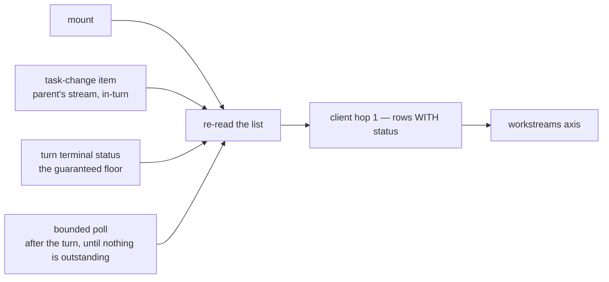

# FIX-1012: S3 — `useSession` cannot expose a parent's Workstreams — Implementation Spec

## Part I — The Case *(for the human)*

### 1. Problem — why it matters, why now

When an app hands off a long job — implement this ticket, research this question — the job now
runs somewhere the user cannot see. The conversation returns immediately, and the work carries on
in its own place. A UI built on us today has no way to ask "what is this conversation currently
working on in the background?", so the user gets no acknowledgement that anything is happening,
no progress, and no result unless the app builds its own bookkeeping outside the framework.

**Why now** — this is the last piece before the feature can be shown to anyone. The end-to-end demo
that proves the whole durable-jobs epic works is a screen that shows a conversation *and* its
background work side by side, and that screen cannot be built until this exists. There is no
workaround worth using: an app can poll for changes on a timer, but it has no idea when to poll,
so it either burns requests or shows results late.

### 2. Solution in plain terms

The conversation and its background work are two different things, so they become two different
things a UI can read. The existing session hook gains a second list beside the conversation's
messages: the bodies of background work this conversation has going, each with enough on it to
render a row and to open it.

Opening one needs nothing new. A body of background work *is* a session in its own right, so the
same hook that reads a conversation reads it — pass the id from the row. That is the whole
drill-in.

The part that has to live inside the framework is knowing *when* to refresh the list. The hook is
already connected to the conversation's live stream, so it already sees the moments that matter —
a turn finishing, the work ledger changing. An app outside the framework sees none of that and
would have to poll.

**Philosophy** — tenet 2 (composition over features): a background job is a session, so reading one
is the session hook we already have; we add a list, not a second reading stack. Tenet 6
(readability is an output): the reason this is a separate list rather than a filter over the
conversation is that background work genuinely is not part of the conversation, and a UI that
blends them would be lying about the model.

> **One thing to know before you read the decisions.** Three of the four below describe *state* a
> row shows — running, finished, failed. That state now arrives: a row carries the **last recorded
> status** of its work, resolved by S1b (settled across the three specs after this spec raised it;
> §12). It is deliberately **not** liveness — it reports what was durably written, not that a worker
> is alive. **The one visible catch:** a job whose worker crashed reads *in progress* until
> reclamation corrects it, so the panel can show a dead job as running for as long as that takes.
> That is the price of not building liveness here, it is named in §9 and documented, and reclamation
> is a separate decision of yours.

> **§2 then §6 lead, and the rest is derivation.** Problem, then what we propose, then what you are
> signing. Everything from §3 down justifies it — read it if the sign-off is not obvious, skip it
> if it is.

### 6. Decisions & rules — the sign-off surface

1. **While background work runs, the user sees it appear in a list and fill in step by step — never
   a live typing effect.**
   *Rejected:* a spinner plus timed polling that simulates live output.
   *Locks in:* what we promise a customer is *"you can see what it has finished"*, not *"you can
   watch it think"*. A long job will visibly sit still between steps, and that is the honest
   behaviour rather than a defect. Cheap to improve later — if live output ever arrives, the same
   list fills in more often and nothing about the screen changes — but expensive to have promised
   the other thing in the meantime.

2. **Finished background work stays in its own place; nothing is folded into the conversation
   automatically.**
   *Rejected:* appending a finished background result to the chat as if the assistant had just
   said it.
   *Locks in:* the product shape. Every app that wants *"and here's what came back"* to appear in
   the chat writes that itself, deliberately, and gets to choose the wording. This is the
   **expensive one to reverse**: apps will ship against the separation, and later merging results
   into the conversation by default would change the transcript of every one of them.

3. **One entry per body of work, not per attempt — and a job that fails stays visible as failed.**
   A job picked up again after a crash, or retried, stays the same single entry whose state
   changes; the user never sees the same work listed twice, and never sees work silently disappear.
   *Rejected:* one entry per attempt (shows the user our machinery), and dropping failed work from
   the list (the user is left believing it succeeded, or that they imagined starting it).
   *Locks in:* a stable list a customer can reason about, and a support story where "it failed" is
   something the user can see and report rather than something only logs know. The cost is that
   "how many times did it try?" is not answerable from the list itself — that question needs the
   entry opened.

4. **The panel keeps updating while the user sits and watches it, at a visible lag — and stops
   costing anything once the work is done.**
   *Rejected:* updating only when the user next sends a message, which is free but means a job that
   finished ten minutes ago still shows as running until they happen to type something.
   *Locks in:* a running background job costs a small trickle of background requests for as long as
   it runs and someone has the screen open — bounded, because it stops the moment nothing is
   outstanding, but not free. The alternative costs nothing and makes decision 1 untrue: a list that
   never fills in is not "fill in step by step". We are buying honesty about progress with request
   volume.

> **Non-goals** — showing a background job's *own* background jobs (the list is one level deep,
> and a nested view is a separate ask); and *declaring* work as background, which is the server
> and client side of this epic, already owned elsewhere. This change is the read side only.

> **Size:** Medium (one package plus docs, one PR, ~200 LOC and its tests).

---

### 3. Tradeoffs & alternatives

**Alternative: a separate hook that only lists background work.** Cleaner in isolation — the
session hook is already large. Rejected because the refresh signal lives in the session hook's
stream connection; a separate hook would either poll or reach into the other hook's internals, and
the first is wasteful while the second is worse than just putting it in one place. The precedent is
already here: mid-stream resource notices ride the same hook for exactly this reason.

**The simpler approach: let the app fetch the list itself.** Genuinely tempting, and after the
client work lands it is about five lines. **The original version of this argument was that the
framework has an event signal the app doesn't — and review showed that is only half true**, so it
is worth stating the weaker, honest version: while the launching turn is still open the framework
does see the change events, but once that turn ends there is no live channel at all (§7), and from
that point the framework polls exactly like the app would. What the framework still buys is the
part apps get wrong: knowing *when to start and when to stop*, and doing it once instead of in
every app. That is a real but smaller claim than the one this section made before.

**The cost of putting it on the shared hook, stated precisely — an earlier draft of this line said
"one read on mount" and the mechanism did not earn it.** Review found the gap: the change signal
this design listens to is emitted by *every* task board, including ordinary inline ones, so as
first written an app with a busy board and no background work at all would have been billed a
stream of reads. §7 now bounds it, and the honest figures are:

| The app | What it pays |
|---|---|
| Never uses a task board | One read on mount, **plus one per turn** |
| Uses inline boards, never launches background work | The same — the doorbell is silent because nothing is unfinished, so board traffic costs nothing however busy the board is |
| Ran background work earlier; nothing outstanding now | The same — the doorbell is gated on an *unfinished* row, not on a non-empty list, so finished work sitting on screen costs nothing forever after |
| Background work actually running | The above, plus coalesced refreshes while a turn is open, plus the poll — both stopping when the last row goes terminal |

**The per-turn read is the honest floor, and two earlier drafts of this line tried to avoid it.**
The first claimed "one read on mount, nothing per turn" while the mechanism billed per notice; the
second bought the claim back by only reading on turns that emitted a board event — which a
supported board option can hide, making the feature silently fail (§7). Removing it for real needs
a signal that distinguishes a detached board from an inline one, and inventing that marker in this
layer is what the package boundary forbids.

So the cost is one read per turn for every app, priced against what it buys: the panel works under
every supported configuration. It is bounded by *turns*, never by board activity, and it sits
beside a per-turn refresh the hook already performs. If it ever proves too expensive, the fix is a
session-scoped invalidation channel in `engine` — an optimization to buy back later, not a
correctness gap to carry.

**Where the per-row cost actually lands — moved, not removed.** An earlier draft of this spec
warned that showing each row's state would cost an extra read *per row, from the browser, on every
refresh*. That is no longer S3's shape: S1b resolves the last recorded status inside its own route,
in process, over indexes both SQLite and Postgres already have, so the panel gets rows-with-state
from **one** call and never reads per row. The fan-out still exists — it just happens server-side
on an indexed path instead of as N round trips over the network, which is the difference between a
query and a waterfall. Worth stating rather than dropping, because the poll makes whatever this
costs *recur*: it is paid on every refresh while work is outstanding, not once on mount.

**Where the complexity is:** not the list. It is the refresh, and specifically that it has to span
a boundary the framework's streaming model does not — the launching turn ends while the work
carries on. §7 is mostly about that boundary.

### 4. Focus practices (1–5)

1. **BP-010 (derive, don't effect)** — the list is a genuine fetch, so an effect is correct for it;
   anything computed *from* it is derived rather than stored alongside, and the refresh fires on a
   discrete notice rather than on every stream event. Getting this backwards is how the screen
   re-renders continuously for no change.
2. **BP-035 (second path)** — a conversation *with* background work is the new path; a conversation
   *without* is every existing app. Both get tested, and the second must behave exactly as today.
3. **BP-031 (never decide from caller-controllable input)** — which background work belongs to this
   conversation is the server's answer, filtered server-side. This layer renders what it is given
   and filters nothing itself.
4. **Package boundary: `react` wraps `client`** (tenet 1) — no transport shape is decided here. If
   this change finds itself choosing a URL or a query parameter, the piece it needs belongs one
   layer down.

### 5. What using it looks like

**Rendering the conversation and its background work** *(what this spec proposes — today the
second list does not exist and there is nothing to render):*

```tsx
const session = useSession(sessionId, { flowKind: "assistant" });

return (
  <>
    <Conversation items={session.items} />
    <aside>
      {session.workstreams.map((w) => (
        <BackgroundJob key={w.id} job={w} onOpen={() => setOpenJobId(w.id)} />
      ))}
    </aside>
  </>
);
```

**Opening one — the same hook, no new surface:**

```tsx
// A body of background work is a session, so the hook already reads it.
// The row carries its own flow, which is the worker's, not the conversation's.
// autoResume is REQUIRED here: it defaults to false, and without it this call
// loads one snapshot and never fills in while the job keeps working.
const job = useSession(openJobId, { flowKind: openJob.flowKind, autoResume: true });
// job.items — the steps it has finished. No in-flight text; see decision 1.
```

**What the drill-in actually delivers — corrected in review, and it is better than an earlier draft
of this spec claimed.** `autoResume` attaches to the child's own in-progress request, and that tail
is owned by `RequestStore.subscribeToEvents`; the in-process active-streams registry is gone
(`docs/architecture/streaming.md` → "Store-driven event subscriptions", FIX-569). **So completed
items do arrive live, cross-process** — a SQLite/Postgres/filesystem subscriber receives persisted
`item.added` / `item.done` events as they are written.

The gap is narrower than "nothing live out of process", which is what this spec said before: it is
**`content.delta` only**, because deltas are not persisted, so a cross-process subscriber snaps to
the next persisted item snapshot (same doc, "hidden invariants"). That is precisely OQ-C's
boundary and nothing more. An opened job therefore fills in step by step as its steps complete,
wherever it runs — it just never types. Worth stating correctly, because understating it here
would push the docs and the tests to promise less than the transport delivers.

**What an app that ignores it sees (before / after):**

```
before   session.items — the conversation
after    session.items — the conversation, unchanged, byte for byte
         session.workstreams — [] for every session that never launched background work
```

## Part II — The Build Plan *(for the implementing agent)*

### 7. Technical design

One new read, consumed from `client`, exposed as a second axis on the session view. Nothing is
merged into `items`, and no transport shape is decided in this package.



**The refresh has to cross a boundary the streaming model does not, and this is the part review
corrected.** An earlier draft derived the refresh from a digest over notices on the parent's
stream. That is wrong in the case the feature exists for, and it is wrong twice:

- **The parent's stream is request-scoped and closes when the turn ends.** The URL is
  `…/requests/{requestId}/stream` and `onRequestStatus` closes the handle on every terminal status
  including `completed` (`packages/react/src/hooks/useSession.ts` — the stream URL and the terminal
  branch); the live stream is keyed by `requestId`
  (`packages/engine/src/streaming/live-stream.ts`). **Detached work outliving its launching turn is
  the primary scenario** — it is the epic's own pass criterion 1 — so by the time the interesting
  transitions happen, there is nothing listening.
- **There is no session-level or user-level channel to fall back to.** The only other stream route
  is `/users/:userId/stream`, which returns **501** and is advertised as unsupported
  (`packages/engine/src/routes/http-handlers.ts` — the `user_stream` branch returns 501, and
  `capabilities` returns `userStream: false`). Verified, not assumed.

**Every trigger below names its producer, and that is the test this section has now failed twice.**
Two earlier drafts keyed the refresh off signals with no emitter — first a "work-ledger notice
digest", then "workstream invalidation notices". Neither exists: `grep -i workstream` finds nothing
in `core`, `contracts`, `engine/src/streaming` or `client`, `InvalidationItem` has exactly two
subtypes (`StateChangeItem`, `ResourceChangeItem` — `packages/contracts/src/items/types.ts`), and
S1b and S2 are read surfaces that emit nothing. **So the rule for this section: no trigger ships
without naming who emits it, in which package, and whether that is inside this epic's scope.**
Three triggers, all of them existing producers, no new dependency:

1. **On mount — the initial read.** The hook's existing session-load path fetches the list. This is
   what covers a reload while work is already running, and it is why a hook that mounts long after
   the launching turn still shows the work.
**The doorbell accelerates; it never discovers — and that separation is what stops it taxing apps
that do not use this feature.** `task-change` is emitted by the *general* task-board primitive, on
every board, including the ordinary inline boards `planAndExecute`, `supervisor` and `blackboard`
construct, and on every transition (added, claimed, terminal, metadata). It carries no marker
distinguishing a detached board from an inline one, and this layer must not invent one. So a
naive "one re-read per notice" bills an app with a busy inline board and **zero** Workstreams for a
stream of HTTP reads, each one invoking S1b's per-row status resolution — the app that does not use
the feature paying for it, which is exactly BP-035's second path. Two rules fall out, and together
they bound the cost:

- **The doorbell is ignored unless a row is *unfinished*.** Not "unless the list is empty" — that
  was this spec's first attempt and it is a gate that never closes: decision 3 retains completed and
  failed rows, so one finished job leaves the list non-empty forever, and every later turn's inline
  board would resume billing reads. Gating on outstanding work restores decision 4's promise that
  the cost stops when the work does, while decision 3 keeps the terminal rows on screen.
- **Notices coalesce to at most one in-flight read**, trailing edge. A burst from a busy board
  collapses into one refresh, not one per transition.

**One predicate governs everything that costs anything: *is any row unfinished?*** The accelerator
and the poll now share it, rather than each carrying its own condition. That is the structural
point, not a tidiness one — two conditions that are supposed to agree are exactly where the last
two defects in this section lived, and there is now one place for that question to be answered.

**Discovery is bounded by turns, and by nothing else. This is the invariant, and it is the one this
section has broken repeatedly:**

> **Every trigger the feature's *correctness* depends on must have a producer that no
> configuration can remove.** Suppressible signals may only make it faster.

Trigger 3 therefore fires **once per turn, unconditionally**. An earlier revision gated it on the
turn having emitted a `task-change` — cheaper, and wrong: `changeVisibility: { client: false }` is a
supported board option (`tasks/collection/get-or-create.ts`), and the SSE filter drops non-client
items before they reach the browser (`engine/src/streaming/client-filter.ts`), so a board can
legally make that evidence invisible. A suppressed board plus a mount read that landed before the
child existed left the list empty, no poll started, and the work was invisible until remount. That
put the floor on a removable producer, which is the same failure as naming a producer that never
existed — it inverts the rule that the doorbell may *accelerate, never discover*.

The cost this gives up is real and is priced in §3: one read per turn for every app, including
apps with no boards. It buys a feature that works under every supported configuration, which is
not a trade worth re-litigating. Note what it does **not** give back — the doorbell stays gated and
coalesced, so board traffic still costs nothing; discovery is bounded by *turns*, never by board
activity, which was the actual defect that gate was introduced to fix.

2. **While the launching turn is open — `task-change` component items, as pure invalidation.**
   These exist and ship today: the collection emits one on **every** lifecycle transition via
   `ctx.emit.component("task-change", …)` (`packages/orchestration/src/tasks/collection/change-event.ts`,
   `get-or-create.ts`), `addTask` emits `added` and the settlement path emits `completed` /
   `errored`. They are **client-visible by default** — `changeVisibility` is optional and only
   narrows when a board passes it — and the board runs in the parent's flow during the parent's
   turn, so they ride the very stream `useSession` is already attached to. Verified in-tree, not
   assumed.

   **Used as a doorbell, not as data.** The item says *something on the board changed*; the hook
   re-reads the list and renders the status from **S1b's row**. It does not read `task.status` off
   the item. This matters beyond tidiness: a task row carries a seven-state lifecycle and is a
   richer thing than a Workstream row, and rendering from it would quietly turn this hook into a
   general job-status API and move the seam the other two specs agreed on. It also means (c) — does
   the item identify *which* Workstream changed — never has to be answered, because invalidation
   needs no identity.

   **Best-effort by construction.** A board may pass `changeVisibility: { client: false }`, and the
   settlement transitions happen on the *child's* stream after the parent's turn has closed
   (Decision 7 — the Workstream settles its own task). So this trigger makes the in-turn case live;
   it is not a guarantee, and nothing below depends on it firing.
3. **The launching turn's terminal status — the guaranteed floor, once per turn, unconditional.**
   `onRequestStatus` already runs an unconditional `refreshLatestRequest()` on every terminal
   status (`packages/react/src/hooks/useSession.ts` — note the snapshot refresh beside it *is*
   conditional, this one is not). The workstream read joins it there, on the same terms. **Nothing
   about a board, a capability or an app setting can suppress `onRequestStatus`** — that is exactly
   why the floor sits here and not on an item. Detached work is started *during* a turn, so this
   bootstrap cannot be defeated, and it is what makes trigger 2 an accelerator rather than
   load-bearing.
4. **After the turn, while work is outstanding — the bounded poll.** Starts only when at least one
   row is unfinished, stops the moment none is. This is decision 4, and it is deliberately not
   dressed up as an event: past the turn boundary no producer exists at all, so the spec says
   polling rather than implying liveness it cannot deliver.

**No digest, at any of them.** One re-read per trigger, with the cancellation guard the hook
already uses. A digest was the first draft's answer and it invites hashing timestamps, which
rebuilds the re-render defect BP-010 exists to prevent.

**The stop condition is computable, and this is what settled it.** "At least one row is unfinished"
reads the row's **last recorded status**, which S1b now resolves per row (§12). One caveat the
implementer must not lose: that status is what was durably *written*, so a crashed worker's row
still reads unfinished and the poll keeps running until reclamation corrects it. The poll is
therefore bounded by *reclamation*, not by the worker actually stopping — correct, and slower than
it looks on a crash (§9).

- **`@flow-state-dev/react`** — `SessionView` gains a `workstreams` array **and one list-level
  staleness marker**. The fetch is wired into the hook's existing load path; trigger 2 into its
  existing stream callbacks; the poll is its own effect with an explicit stop condition. No new
  hook, no new client, no new context.

  **The staleness marker exists because §9 requires a behaviour the array alone cannot express.**
  When a refresh fails, the last known list is kept but must not be presented as current — and
  rows are S2's unchanged type, so nothing on them can say so, while the session's own `error`
  slot means "this session failed to load" and would change meaning if reused. So one boolean at
  the list level: set when a refresh fails, cleared on the next success. **This is the only
  list-level field**, and it is the exception to the same restraint that removed the derived flags
  ("is anything running?" and friends — no consumer in §5, so no export; tenet 3). The difference
  is that this one has a consumer the spec *requires*: without it, decision 3 inverts — a job that
  has since failed keeps rendering as running, indefinitely, if the failure is persistent rather
  than transient.
- **`@flow-state-dev/client`** — consumed, not changed. Hop 1 supplies the list. **Hop 2 is
  deliberately not wrapped**: drilling into a Workstream is `useSession(childId)`, because a
  Workstream is a session. Wrapping hop 2 would build a second, worse session reader beside the
  one we have.
- **Untouched:** the item taxonomy (no new item type — the epic decided background-ness is a
  request-level property), the transient filter, `items`, and every existing field on
  `SessionView`.

**The type of a row is `client`'s, re-exported.** This package names no field shapes of its own for
Workstream data; if a field the UI needs is missing, that is a change to S2, not a projection
invented here.

**Sketch — pseudocode. Illustrative, not the contract. React to the shape.**

```
re-read the list (an external read — an effect is correct here):
    ask the client for this session's Workstreams   → rows arrive WITH status
    guard against a late response from a previous session   ← the existing guard
    on failure: keep the last list, raise the stale marker
    on success: lower it

DISCOVERY — may find work not yet known. Producers must be UNSUPPRESSIBLE:
    mount                                      ← once
    this turn's terminal status                ← once per turn, unconditional.
                                                 NOT gated on having seen a
                                                 board event: a board can hide
                                                 those, and then nothing
                                                 discovers the work at all

ACCELERATION — refreshes work already known. Never discovers:
    a task-change item on this turn's stream
        ignored unless a row is UNFINISHED     ← not "unless the list is empty":
                                                  decision 3 keeps terminal rows,
                                                  so that gate never closes
        coalesced to one in-flight read, trailing edge

THE BACKSTOP:
    the poll, while any row is unfinished

    ^ one predicate, shared with the accelerator above — decision 4 is the
      promise that BOTH of them stop when the last row goes terminal
```

What this asks a reviewer: *is the turn's terminal status the right thing to guarantee, with
`task-change` as a live but optional accelerator on top?* The alternative — depending on
`task-change` alone — is one board config away from silence, and depending on the terminal status
alone means nothing appears until the launching turn ends. How the poll is scheduled, and what an
"unfinished" row is called, are the implementer's.

### 8. Implementation sequence

1. **Consume hop 1 behind a single read**, wired into the hook's existing session-load path. Nothing
   is exposed yet. *Test:* a session with no Workstreams costs one call and yields an empty result.
   *Depends on:* S2.
2. **Expose the axis** on `SessionView` — one entry per body of work, carrying the state the row
   renders (decisions 1 and 3). No derived flags. *Test:* the §5 cases. *Depends on:* 1.
3. **The refresh triggers**, in this order — the guaranteed one first so the feature works before
   the optimisation exists: the launching turn's **terminal status** (alongside the unconditional
   latest-request refresh already there), then **`task-change` items** on that turn's stream as a
   doorbell. One re-read per trigger, existing cancellation guard. *Test:* a terminal status
   triggers exactly one read; a `task-change` item triggers exactly one; an unrelated stream event
   triggers none; and — the one that pins the seam — the rendered status comes from the re-read,
   never from the item's task payload. *Depends on:* 2.
4. **The bounded poll** (decision 4), with its start and stop conditions. *Test:* it does not start
   when nothing is outstanding, it starts when something is, and — the one that matters — it
   **stops** when the last row reaches a terminal state. *Depends on:* 2.
5. **The staleness marker.** Raised when a re-read fails, lowered on the next success. *Test:* a
   failing refresh keeps the previous rows *and* raises it; the next success lowers it. *Depends
   on:* 2.
6. **Reset on session switch and unmount.** The hook's existing teardown clears every other
   session-scoped slot; this axis and the marker join them, and the poll must be torn down with it
   or a switched or closed conversation keeps polling forever. *Test:* switch sessions mid-poll,
   assert the axis clears and the interval is cleared. *Depends on:* 4.
7. **Docs and README in the same change set** (§11), including the plain statement that background
   work shows finished steps rather than live text (decision 1).

**Removals: none.** This change is purely additive — the `latestRequest`-is-singular gap the epic
once recorded here dissolved with the Workstream model, so there is no superseded path to delete.
Stated explicitly because tenet 3 expects the question asked, not because something is hiding.

*(Steps cite the decision they implement rather than restating it — §6 is the only copy.)*

### 9. Edge cases & error handling

**Named behaviour, not an edge case: a dead job reads as running until reclamation says otherwise.**
A row shows the **last recorded status** — what the request store durably wrote. If a worker
crashes, nothing writes a terminal status, so the row keeps reading *in progress* and the panel
keeps showing the job as running until reclamation corrects it. The lag is however long reclamation
takes, and reclamation is decided outside this issue.

This is stated as behaviour rather than buried as a failure mode because it is the deliberate price
of the resolution in §12: the row reports what was *written*, and does not claim a worker is alive.
Building liveness instead would have meant a second notion of aliveness in the read path. Three
things follow and all three are binding:

- **The UI must not present the status as proof of life.** "Running" means *last we heard, it was
  working*, not *it is working now*.
- **The poll is bounded by reclamation, not by the worker.** A crashed job keeps the panel polling
  until its row turns terminal (§7).
- **It gets one honest line in the docs** (§11). A user who watches a dead job spin forever with no
  explanation will report it as our bug, which is more expensive than saying so once.

| Case | Expected |
|---|---|
| Session has no Workstreams (every app today) | Empty axis, no extra renders, no polling ever started, `items` byte-identical to today (BP-030/BP-035) |
| No session id yet | Empty axis, no read attempted |
| Session switched, or component unmounts, while a read or poll is live | Late response discarded; axis cleared and the poll torn down by the existing teardown |
| A notice and a poll tick land together | One read wins; no torn list. Same cancellation guard the hook already uses |
| A Workstream on a flow the provider does not know | Fine — the row carries its own flow; the drill-in never assumes the parent's |
| A Workstream that itself has children | Not shown. One level, per §6 non-goals |
| **A refresh read fails while work is outstanding** | Keep the last known list, **raise the list-level staleness marker** (§7), and let the next successful read lower it. Silently retaining the list shows a job as still running after it has failed — decision 3 inverted — and this is the one error path that can actively mislead, which is why the marker is the one list-level field that earns its place |
| **An app runs a busy inline board and has no background work at all** | **No reads from the doorbell.** Nothing is unfinished, so notices are ignored; the per-turn discovery read is the only cost. This is the second path (BP-035) and the row worth testing hardest |
| **A session finished background work earlier, retains the rows, and now runs inline boards** | **Still no reads from the doorbell** — the gate is "a row is unfinished", not "the list is non-empty". The finished rows stay on screen (decision 3) and cost nothing (decision 4). Both must hold at once; the obvious gate satisfies only the first |
| A `task-change` burst arrives from a board this session does show | Coalesced to one in-flight re-read, trailing edge — not one per transition. Never used to identify or classify a row |
| **A board sets `changeVisibility: { client: false }`** | **The feature still works.** The doorbell goes silent, so the panel is late rather than wrong: the turn's terminal read still discovers the work and the poll still tracks it. This is a supported option (`get-or-create.ts`) and the SSE filter genuinely drops the item (`client-filter.ts`), so it is a configuration to survive, not a hypothetical |
| The launching turn never reaches a terminal status (connection dropped) | The bootstrap is missed; the next mount reads the list. Consistent with how the hook already treats a dropped stream |
| Poll runs while the tab is backgrounded | Acceptable and bounded — it still stops on terminal. Throttling to visibility is the implementer's call, not a decision |

**On a server without S1b's route:** not handled, deliberately. S1b is a hard dependency of this
issue, so a server missing the route is a misconfiguration rather than a supported deployment, and
an earlier draft's "treat a 404 as no background work" would convert that misconfiguration into a
screen that silently shows nothing forever. There is no gradual-rollout story here to justify it —
these ship in dependency order within one epic.

**Taxonomy:** every failure on this path is non-fatal and degrades to "no background work shown" or
"a list marked as stale". Nothing here can fail a conversation — the conversation's own reads and
stream are untouched, which is the property that makes this safe to add to a hook every app uses.
The one thing that is **not** allowed to fail quietly is a stale list presented as current, per the
row above.

**Multi-tenant:** this layer passes no tenant and performs no ownership filtering. The route is the
boundary (BP-031). A client-side filter here would be the bug, not the safeguard.

### 10. Testing strategy

**Goal check:** none applies to this issue alone, and inventing one would be dishonest. This is a
read surface with no model call in it. **Its real-path evidence is S4/FIX-1013** — the kitchen-sink
demo is exactly this axis rendered in a browser beside a conversation, and it is the epic's own
BP-003 evidence path. That is the pass criterion this change is ultimately measured by (§5 of the
epic-spec, criterion 5: *the UI renders the background request as a task, distinct from the
conversation*).

**CI specs** (the behaviours, not the test names). The react package has no DOM render harness by
convention, so the derivation and the signal logic are exported and unit-tested directly, the same
way suspension derivation already is:

- **one behaviour per decision in §6**, in observable terms — what a consumer of the hook sees
- **what must not change**: a session with no background work renders exactly as today, including
  the identity of everything already on the view. This is the test that protects every existing app
- **the second path** (BP-035): every case exercised on a session that *has* background work, not
  only on one that doesn't
- **the boundary the design turns on** (§7): work that finishes *after* the launching turn has
  ended still reaches the panel. This is the behaviour an earlier draft got wrong, and a suite that
  only exercises work finishing mid-turn would have passed against that broken design
- **the invariant that is easy to state wrongly**: assert on the **number of reads**, not on the
  resulting list. Two ways to fail it, and a list-only assertion catches neither — refetching on
  every stream event (the BP-010 defect), and a poll that never stops once the work is done
  (decision 4's cost becoming unbounded). The stop is the assertion most worth writing
- **the honest-status behaviour** (§9): a row whose status was last written as unfinished keeps
  reading unfinished, and the poll keeps running. Worth a test precisely because it looks like a
  bug — a suite written to "the poll stops when the job stops" would encode liveness we do not have
- **the seam** (§7): the rendered status comes from the re-read, never from a `task-change` item's
  task payload. Easy to violate and invisible once violated — reading status off the item would
  make the tests pass *faster* and quietly turn this hook into a job-status API
- **the floor holds with every optional signal silent** — the invariant in §7, and the assertion
  that has caught the most defects here. With `task-change` **never** observed (a board setting
  `changeVisibility: { client: false }`, which is supported), background work started during a turn
  is still **discovered** and still updates. Run the discovery case specifically, not just the
  update case: the failure this catches is a list that stays empty forever, and a test that seeds a
  known row before suppressing the signal will pass while the real defect is live
- **the non-user is not taxed** (BP-035, and the defect review caught here): a session with an
  inline board emitting many `task-change` items and **no** background work performs **no** reads
  from those items. Assert the read count, not the rendered list — the list is `[]` either way,
  so a list-only assertion passes while the app is billed for a feature it never used
- **the gate closes again** — the same case, but with **completed rows retained** from earlier work
  and a busy inline board: still no reads from the doorbell. This is the assertion that separates
  the correct gate from the obvious one, and a read-count assertion is the *only* thing that
  catches it: the list is non-empty and correctly rendered in both versions, so every
  state-based assertion passes while the wrong gate bills the app forever

**Discipline:** `tdd`. The seam is the exported refresh logic plus the poll's start/stop condition —
both reachable from a vitest spec with no DOM and no HTTP.

### 11. Documentation plan

- **EXTEND** `packages/react/README.md` — a `### SessionView.workstreams` entry placed beside the
  existing `### SessionView.resourceChanges` entry, which is the closest structural sibling (a second
  axis on the same view, surfaced independently of the items filter). Same length and register.
- **EXTEND** `apps/docs/docs/client/react.md` — one new section under `## Hooks`, immediately after
  the `useSession` subsection and before `useClientData`. Covers: what the second list is, the row →
  drill-in pattern, and one minimal example (the §5 one, trimmed). It must state plainly that
  background work surfaces finished steps rather than live text, and cross-link the canonical
  statement of that limit rather than restating it — that statement ships with FIX-982 and its
  corpus half is S5's.
- **EXTEND** `apps/docs/docs/api/react.md` — the API reference entry for the new field.
- **One line the docs must carry, wherever the status field is described** (§9): a row shows the
  last recorded status, so a job whose worker stopped unexpectedly reads as still running until the
  system reclaims it. Say it plainly and once — a reader who watches a dead job spin with no
  explanation files it as a bug. Phrase it as what the field means, not as a defect narrative or a
  reference to how it came about (the outsider rule in `docs/contributing/user-docs.md`); the word
  "reclamation" is internal vocabulary and should not appear.
- **Cross-links:** ← from `apps/docs/docs/orchestration/task-board.md` (where background dispatch is
  introduced, so a reader arrives from the concept); → to the client page for the underlying reads.
- **No new page.** This is one section under an existing concept, not a term users will search for
  on its own. A new page here would fragment the client sidebar for a single field.
- *Voice risks, specific to this topic:* "real-time", "live", and "seamless" are the obvious
  adjectives and all three would make the docs contradict decision 1. Also introduce the concept in
  plain terms on first use — a reader arriving at this page has met sessions, not background jobs.

### 12. Dependencies, open questions & follow-ups

**Dependencies:** S2/FIX-1011 (`client`), which depends on S1b/FIX-1010 (`engine` route), which
follows FIX-982. This issue starts when S2 lands and cannot start before. It blocks S4/FIX-1013,
the epic's wrap gate.

**SETTLED — the row carries last recorded status, and S1b owns resolving it.** This spec raised a
cross-spec conflict: it needed run state for decisions 1, 3 and 4, while S1b's non-goals excluded
liveness and S2's row carried coordinates rather than state. **Resolved across the three specs:**
a Workstream row now carries the **last recorded status** of its work — enough to answer running,
done or failed. S1b resolves it per row inside its own route, in process, over indexes that already
exist on both SQLite and Postgres, and narrows the non-goal that excluded it.

Two things this deliberately is not, and both bind S3:

- **It is not liveness.** It reports what the request store durably wrote, never that a worker is
  alive. The consequence — a crashed job reading *in progress* until reclamation corrects it — is
  §9's named behaviour and gets a line in the docs.
- **It is not S3's read.** The list comes back with state already on it; this issue never reads per
  row. The fan-out lives server-side on an indexed path (§3).

So decisions 1, 3 and 4 are deliverable as written, and the poll's stop condition is computable.
**Do not reopen this** — it was settled by the owner across S1b, S2 and S3 together.

**No new producer, and therefore no new dependency.** Round 3 asked who emits the refresh signal.
The answer is that nothing new has to: the launching turn's terminal status is an existing,
unconditional hook point, and `task-change` component items already ship and are already
client-visible. **This is not a scope finding and nothing is asked of FIX-982.** Had neither
existed, an engine-side producer would have been a new dependency on the detached-start path —
recorded because it is the thing a future reviewer will wonder was checked.

**Other assumptions of the parallel work, still assumptions:**

1. **S2 exposes the two hops separately**, and this issue consumes only the first. Nothing here
   wraps a Workstream's request list.
2. **S1b's route filters by tenant server-side** and returns one parent's children in a stable
   order. This layer adds no filtering and no defensive sort.
3. **Request metadata round-trips** so a Workstream's requests carry their task and their
   provenance. Read for display only here, never for a decision (BP-031).

**Open questions:** the blocker above, and the one live product fork — whether finished background
work stays out of the conversation (decision 2) — asked in full on the spec PR.

**Follow-ups (flagged, not built):**

- **Nested background work.** A Workstream that spawns its own is representable but not shown.
  Out of scope; file it if a demo needs it.
- **Already accepted, do not reopen:** no live in-flight text from detached work. That is the
  epic's OQ-C, decided by the owner on 2026-08-07 as a documented limit rather than a defect. This
  issue is designed *for* it (decision 1), not around it.

### 13. Review notes for the implementer

Below-the-bar spec-PR feedback, recorded rather than folded — real questions that are answered
better with the code in front of you than by another paragraph of design prose. Each was raised by
`codex` against `6871197`.

- **`:270` — the `items: false` bootstrap hole.** `useSession` accepts `items: false`, and several
  of this design's triggers hang off the item stream. Work out at build time what a consumer that
  has switched items off should get: the mount read and the poll are independent of items, but the
  doorbell and the terminal-status trigger are not equally so.
- **`:275` — refreshes should restart when terminal work is retried.** The poll stops when every
  row is terminal. If a row later leaves a terminal state (a retry, a resume from
  `awaiting_review`), the poll needs to start again — check that the start condition is evaluated
  on new data, not only on the transition that first stopped it.
- **`:321` — a failed empty bootstrap read should be retried.** If the first read fails, the list
  is empty and nothing is outstanding, so by the letter of §7 no poll starts and no further trigger
  may fire until the next turn. Decide whether the stale marker plus the next trigger is
  sufficient, or whether the bootstrap needs its own retry.

**For the implementer:** these are *inputs, not instructions.* Each is one reviewer's guess at code
they haven't read. Adopt, adapt, or discard — §6's Decisions bind you; these don't. The exception
is a note that turns out to reveal a genuine design problem: surface it and fold it back rather
than working around it.

---

## Spec evolution *(the change story, not an audit log)*

- **Spec drafted** — framed as "a conversation cannot show its own background work"; chose a second
  axis on the existing session hook over a separate hook, because the refresh signal only exists
  inside that hook; kept the drill-in as the same hook on the child id, so no second session reader
  is built.
- **After spec review (round 1)** — re-specced the refresh, because the parent's stream is
  request-scoped and closes when the launching turn ends, and no session- or user-level channel
  exists to replace it (`user_stream` returns 501). The digest over "work-ledger notices" was
  removed — it named a signal that is not in the codebase and invited the re-render defect it was
  meant to prevent — and replaced with a discrete notice while the turn is open plus a bounded,
  self-stopping poll after it. That trade became decision 4, since it is the user who pays for it.
- **After spec review (round 1)** — recorded the Workstream row's missing run state as a confirmed
  cross-spec blocker rather than an assumption, because S1b excludes liveness by design and S2's
  row carries coordinates rather than state, which leaves decisions 1, 3 and 4 unrenderable from
  one read.
- **After the owner settled the blocker** — the row gains a **last recorded status** resolved by
  S1b, so decisions 1, 3 and 4 stand and the poll's stop condition is computable. Because that
  status is what was durably written rather than proof a worker is alive, a crashed job reading as
  running until reclamation corrects it became a **named behaviour** in §9 with a required docs
  line, rather than an unstated consequence.
- **After spec review (round 3)** — replaced the invented refresh signal for the second time, and
  this time made "name the producer" the rule the section is written to. The floor is the launching
  turn's **terminal status** (an existing unconditional hook point) and the accelerator is the
  **`task-change`** component item, which already ships and is already client-visible; both are
  in-tree, so no engine-side producer and no new dependency. `task-change` is used as a doorbell
  only — the rendered status still comes from S1b's row, keeping the seam the other two specs
  agreed on. Added the one list-level **staleness marker**, because §9 required a behaviour the
  array alone could not express.
- **After spec review (round 4, triaged not re-opened)** — the batch was **split by the bar**
  rather than answered as a round. Folded one finding: the doorbell was billing apps that do not
  use this feature, because `task-change` comes from the general board primitive and fires on
  ordinary inline boards, which contradicted §3's own cost claim. The doorbell was barred from
  discovering work and coalesced, discovery capped at one read per board-running turn, and §3
  restated with the real per-app cost. Corrected one factual claim: the drill-in *does* receive
  completed items live cross-process — the live tail is store-driven and the in-process registry is
  gone (FIX-569), so only `content.delta` has the gap, which is exactly OQ-C and no wider. Three
  remaining items were recorded in §13 for the implementer.
- **After spec review (round 4, second pass)** — closed the gate the entry above opened. It keyed
  the accelerator on a *non-empty list*, and decision 3 retains terminal rows, so one finished job
  would have held the gate open forever and resumed billing every later inline board's traffic —
  breaking decision 4's promise that the cost stops when the work does. Re-gated on an **unfinished
  row**, which is the predicate the poll already used, so a single condition now governs everything
  that costs anything and decisions 3 and 4 hold together instead of trading off.

- **After spec review (round 4, third pass)** — removed the "only on a turn that ran a board" gate
  from the discovery read. A board may set `changeVisibility: { client: false }` and the SSE filter
  then drops the event, so that gate rested the floor on a producer a supported configuration
  removes — and background work started during such a turn was invisible until remount. Discovery
  is now unconditional once per turn, and §7 carries the rule the section kept breaking: **a
  trigger the feature's correctness depends on must have a producer no configuration can remove;
  suppressible signals may only make it faster.** The per-turn read this costs every app is now
  stated in §3 rather than optimized away.

*(Ordering note: entries are newest last. Two rounds' entries had drifted out of sequence, which
made a correction appear to precede the thing it corrected; restored here.)*
