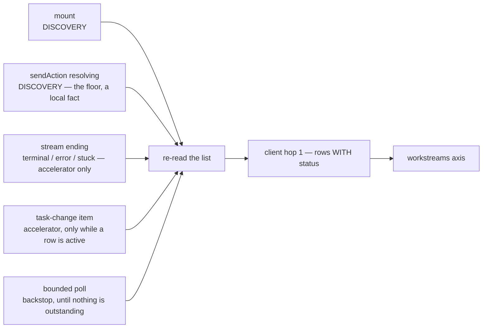

# FIX-1012: S3 — `useSession` cannot expose a parent's Workstreams — Implementation Spec

## Part I — The Case *(for the human)*

### 1. Problem — why it matters, why now

When an app hands off a long job — implement this ticket, research this question — the job now
runs somewhere the user cannot see. The conversation returns immediately, and the work carries on
in its own place. A UI built on us today has no way to ask "what is this conversation currently
working on in the background?", so the user gets no acknowledgement that anything is happening,
no progress, and no result unless the app builds its own bookkeeping outside the framework.

**Why now** — this is the last piece before the feature can be shown to anyone. The end-to-end demo
that proves the whole durable-jobs epic works is a screen that shows a conversation *and* its
background work side by side, and that screen cannot be built until this exists. There is no
workaround worth using: an app can poll for changes on a timer, but it has no idea when to poll,
so it either burns requests or shows results late.

### 2. Solution in plain terms

The conversation and its background work are two different things, so they become two different
things a UI can read. The existing session hook gains a second list beside the conversation's
messages: the bodies of background work this conversation has going, each with enough on it to
render a row and to open it.

Opening one needs nothing new. A body of background work *is* a session in its own right, so the
same hook that reads a conversation reads it — pass the id from the row. That is the whole
drill-in.

The part that has to live inside the framework is knowing *when* to refresh the list. The hook is
already connected to the conversation's live stream, so it already sees the moments that matter —
a turn finishing, the work ledger changing. An app outside the framework sees none of that and
would have to poll.

**Philosophy** — tenet 2 (composition over features): a background job is a session, so reading one
is the session hook we already have; we add a list, not a second reading stack. Tenet 6
(readability is an output): the reason this is a separate list rather than a filter over the
conversation is that background work genuinely is not part of the conversation, and a UI that
blends them would be lying about the model.

> **One thing to know before you read the decisions.** Three of the four below describe *state* a
> row shows, and you have now settled that state's shape (§12). A row reports either **how the work
> ended**, or — if any part of it has not ended — a single **`active`**, meaning *not finished* and
> nothing more. Work that has not started anything yet reports **nothing at all**. There is
> deliberately no *running / waiting / scheduled / needs-you* distinction: you have asked for that
> axis later, and it is not built or designed here.
>
> It is also deliberately **not** liveness — `active` reports what was durably written, never that a
> worker is alive. **The one visible catch:** a job whose worker crashed reads `active` until
> reclamation corrects it, so the panel can show a dead job as unfinished for as long as that takes.
> That is the price of not building liveness here, it is named in §9 and documented, and reclamation
> is a separate decision of yours.

> **Two decisions are still yours, not one — and an earlier version of this preamble said
> otherwise.** It described everything except decision 4's timing as settled, which quietly promoted
> **decision 2** from a live fork to a ratified call. It is not one, and it is the most expensive
> thing here to reverse.
>
> - **Decision 2 — provisional.** Whether finished background work stays out of the conversation.
>   Put to you as a real fork with a recommendation; §12 carries it.
> - **Decision 4b — provisional, and it carries decision 1b with it.** *When the panel re-reads.*
>   Decision 4 bundled *what a row says*, which you have now answered, with *when the panel
>   re-reads*, which is still open. It is the half that has carried every design defect this spec
>   has taken (§12). **It also fixes what we promise a customer about when a job appears** — an
>   earlier version of this page presented that promise as settled, which it is not (decision 1b).
>
> **Settled:** decision 3, decision 1's *no live typing* half, and decision 4's status half.
> **Implementation waits on both answers, not just 4b** (§8) — building against decision 2 before
> you have decided it would ship a transcript contract every app would then depend on.

> **§2 then §6 lead, and the rest is derivation.** Problem, then what we propose, then what you are
> signing. Everything from §3 down justifies it — read it if the sign-off is not obvious, skip it
> if it is.

### 6. Decisions & rules — the sign-off surface

1. **Background work shows finished steps, never a live typing effect.** ***Settled.***
   *Rejected:* a spinner plus timed polling that simulates live output.
   *Locks in:* what we promise a customer is *"you can see what it has finished"*, not *"you can
   watch it think"*. A long job will visibly sit still between steps, and that is the honest
   behaviour rather than a defect. Cheap to improve later — if live output ever arrives, the same
   list fills in more often and nothing about the screen changes — but expensive to have promised
   the other thing in the meantime.

   **1b. Provisional — *when* a job appears, and whether it changes while you watch. 4b decides
   this, so choosing 4b chooses this wording too.** An earlier version of decision 1 promised the
   user "sees it appear in a list and fill in step by step" and presented that as settled. **Under
   the answer now being recommended it is not true**, and softening it into something every answer
   satisfies would hide the trade rather than show it. The three honest versions:

   | If 4b is… | What we promise a customer |
   |---|---|
   | **Self-updating** | *"Start a long job and watch it appear, then fill in step by step as it finishes work — without touching anything."* |
   | **C1** (per-action read) | *"A job you start appears the **next** time you do something. From then on the panel is current as of the start of your most recent action. It never changes while you sit and watch."* |
   | **C2** (mount + manual refresh) | *"A job you start does not appear at all until the page is reloaded — or until the app itself asks for a refresh."* |

   *What is being locked in either way:* the customer-facing sentence in the docs and the demo
   script. Reversing it later is cheap in code and expensive in expectation, which is the whole
   reason it belongs on this page rather than in §7.

2. **Finished background work stays in its own place; nothing is folded into the conversation
   automatically.** ***PROVISIONAL — this is a live fork, not a ratified call.*** It has been put to
   you with a recommendation (§12); until you answer, nothing may be built against it.
   *Rejected:* appending a finished background result to the chat as if the assistant had just
   said it.
   *Locks in:* the product shape. Every app that wants *"and here's what came back"* to appear in
   the chat writes that itself, deliberately, and gets to choose the wording. This is the
   **expensive one to reverse**: apps will ship against the separation, and later merging results
   into the conversation by default would change the transcript of every one of them — which is
   exactly why it must not be settled by default while your attention is on 4b.

3. **One entry per body of work, not per attempt — and a job that fails stays visible as failed.**
   A job picked up again after a crash, or retried, stays the same single entry whose state
   changes; the user never sees the same work listed twice, and never sees work silently disappear.
   *Rejected:* one entry per attempt (shows the user our machinery), and dropping failed work from
   the list (the user is left believing it succeeded, or that they imagined starting it).
   *Locks in:* a stable list a customer can reason about, and a support story where "it failed" is
   something the user can see and report rather than something only logs know. The cost is that
   "how many times did it try?" is not answerable from the list itself — that question needs the
   entry opened.

4. **A row says either how the work ended, or just `active` — and nothing finer.** *(Settled by you;
   §12.)* One value covers everything unfinished, whether it is working, queued, or stopped waiting
   for a person. Work that has started nothing reports nothing.
   *Rejected:* reporting a chosen "current" attempt's state, which needed a rule for which attempt
   counts; and reporting *running / waiting / needs-you* now.
   *Locks in:* the panel can say *finished, failed, or still going* and no more — so a customer
   cannot tell a job that is thinking from one that is silently waiting on them. That gap is
   accepted deliberately and is the first thing the deferred sub-status axis would close. The shape
   is additive, so closing it later adds values rather than changing the ones here.

   **4b. Still open — how often the panel re-reads.** Whether it keeps updating on its own while the
   user watches, or is current only as of their interaction. This is the half of decision 4 you have
   not answered; **§12 puts it to you with a recommendation.** The status rule above holds either
   way — but **4b also fixes decision 1b's customer promise**, so it is one choice with two visible
   consequences, not one.

> **Non-goals** — showing a background job's *own* background jobs (the list is one level deep,
> and a nested view is a separate ask); and *declaring* work as background, which is the server
> and client side of this epic, already owned elsewhere. This change is the read side only.

> **Size:** Medium (one package plus docs, one PR, ~200 LOC and its tests).

---

### 3. Tradeoffs & alternatives

**Alternative: a separate hook that only lists background work.** Cleaner in isolation — the
session hook is already large. Rejected because the refresh signal lives in the session hook's
stream connection; a separate hook would either poll or reach into the other hook's internals, and
the first is wasteful while the second is worse than just putting it in one place. The precedent is
already here: mid-stream resource notices ride the same hook for exactly this reason.

**The simpler approach: let the app fetch the list itself.** Genuinely tempting, and after the
client work lands it is about five lines. **The original version of this argument was that the
framework has an event signal the app doesn't — and review showed that is only half true**, so it
is worth stating the weaker, honest version: while the launching turn is still open the framework
does see the change events, but once that turn ends there is no live channel at all (§7), and from
that point the framework polls exactly like the app would. What the framework still buys is the
part apps get wrong: knowing *when to start and when to stop*, and doing it once instead of in
every app. That is a real but smaller claim than the one this section made before.

**The cost of putting it on the shared hook, stated precisely — an earlier draft of this line said
"one read on mount" and the mechanism did not earn it.** Review found the gap: the change signal
this design listens to is emitted by *every* task board, including ordinary inline ones, so as
first written an app with a busy board and no background work at all would have been billed a
stream of reads. §7 now bounds it, and the honest figures are:

| The app | What it pays |
|---|---|
| Never uses a task board | One read on mount, **plus two per turn** in the default configuration — see below |
| Uses inline boards, never launches background work | The same — the doorbell is silent because nothing is active, so board traffic costs nothing however busy the board is |
| Ran background work earlier; nothing active now | The same — the doorbell is gated on an *active* row, not on a non-empty list, so finished work sitting on screen costs nothing forever after |
| Background work actually running | The above, plus coalesced refreshes while a turn is open, plus the poll — both stopping when the last row goes terminal |

**Two per turn, not one — corrected in review, and the obvious fix is barred.** An earlier version of
this table said one read per turn. With item streaming on (the default), a turn fires **two**:
`sendAction` resolves as soon as the response headers arrive and returns `status: "in_progress"`
(`packages/react/src/hooks/useSession.ts:1183-1199`), and the terminal status arrives later on
`onRequestStatus` (`:824-858`). Only the `task-change` doorbell is gated on an active row, so both
fire for an app with no background work at all. With `items: false` there is no stream to attach
(`:1187-1190`, `:1205-1207`) and the cost is one.

**Gating the terminal read on "any row active" — the obvious fix — would reopen a hole this spec
already closed.** Because `sendAction` resolves at header time, the discovery read it triggers can
run *before* the child exists and come back empty; nothing is then active, so a gated terminal read
would be suppressed and the child never discovered on the streaming path. The two reads are also
sequential rather than concurrent, so coalescing does not collapse them. What *would* collapse them
is making the turn — not the trigger — the unit, and reading once at the turn's end as this hook
observes it. That fix only exists under one answer to 4b and is deliberately left unapplied for the
same reason as the ordering fix in §12. **So the second read is priced here and pinned by a test
(§10) rather than optimized away.** Note the terminal branch already performs two refreshes of its
own (`:851`, `:857`), so the marginal cost lands on a path that is not otherwise quiet.

**The per-turn read is the honest floor, and two earlier drafts of this line tried to avoid it.**
The first claimed "one read on mount, nothing per turn" while the mechanism billed per notice; the
second bought the claim back by only reading on turns that emitted a board event — which a
supported board option can hide, making the feature silently fail (§7). Removing it for real needs
a signal that distinguishes a detached board from an inline one, and inventing that marker in this
layer is what the package boundary forbids.

So the cost is one or two reads per turn for every app, priced against what it buys: the panel works
under every supported configuration. It is bounded by *turns*, never by board activity, and it sits
beside per-turn refreshes the hook already performs. If it ever proves too expensive, the fix is a
session-scoped invalidation channel in `engine` — an optimization to buy back later, not a
correctness gap to carry.

**What the open 4b answers cost, so the comparison is honest.** The figures above price the
self-updating design. The alternatives do not fall to zero, and an earlier draft of this section
implied they did:

| Answer | Per-turn Workstream reads | What the panel promises |
|---|---|---|
| Self-updating (§7 as specced) | **2** — action-start plus terminal | Updates on its own, at a lag |
| Interaction-only, **C1** | **1** — action-start only | Current as of the *start* of your most recent interaction |
| Interaction-only, **C2** | **0** | Current as of mount, or whenever the app calls `refresh()` |

The action-start read is what *buys* C1's promise, so it cannot be gated away and still deliver it —
gating discovery on already knowing about a Workstream is the hole §7 spent three revisions closing.
Whichever answer lands, the number is asserted by a test (§10), not assumed.

**Where the per-row cost actually lands — moved, not removed.** An earlier draft of this spec
warned that showing each row's state would cost an extra read *per row, from the browser, on every
refresh*. That is no longer S3's shape: S1b resolves each row's status inside its own route, in
process, over indexes both SQLite and Postgres already have, so the panel gets rows-with-state from
**one** call and never reads per row. The fan-out still exists — it just happens server-side on an
indexed path instead of as N round trips over the network, which is the difference between a query
and a waterfall. **The owner's terminal-or-active rule (§12) makes that server-side work cheaper
still**, since the route answers *"is any run non-terminal?"* — an existence check that can stop at
the first hit — rather than selecting and ranking a representative run. Worth stating rather than
dropping, because the poll makes whatever this costs *recur*: it is paid on every refresh while work
is active, not once on mount.

**Where the complexity is:** not the list. It is the refresh, and specifically that it has to span
a boundary the framework's streaming model does not — the launching turn ends while the work
carries on. §7 is mostly about that boundary.

### 4. Focus practices (1–5)

1. **BP-010 (derive, don't effect)** — the list is a genuine fetch, so an effect is correct for it;
   anything computed *from* it is derived rather than stored alongside, and the refresh fires on a
   discrete notice rather than on every stream event. Getting this backwards is how the screen
   re-renders continuously for no change.
2. **BP-035 (second path)** — a conversation *with* background work is the new path; a conversation
   *without* is every existing app. Both get tested, and the second must behave exactly as today.
3. **BP-031 (never decide from caller-controllable input)** — which background work belongs to this
   conversation is the server's answer, filtered server-side. This layer renders what it is given
   and filters nothing itself.
4. **Package boundary: `react` wraps `client`** (tenet 1) — no transport shape is decided here. If
   this change finds itself choosing a URL or a query parameter, the piece it needs belongs one
   layer down.

### 5. What using it looks like

**Rendering the conversation and its background work** *(what this spec proposes — today the
second list does not exist and there is nothing to render):*

```tsx
const session = useSession(sessionId, { flowKind: "assistant" });
// Retain the ROW, not just its id: a job runs its worker's flow, which is
// usually not the conversation's, and opening it needs both.
const [openJob, setOpenJob] = useState<Workstream | null>(null);

return (
  <>
    <Conversation items={session.items} />
    <aside>
      {session.workstreams.map((w) => (
        <BackgroundJob key={w.id} job={w} onOpen={() => setOpenJob(w)} />
      ))}
    </aside>
    {/* The drill-in mounts only once a row is chosen — see below for why. */}
    {openJob !== null && <JobDrillIn job={openJob} />}
  </>
);
```

**Opening one — the same hook, no new surface:**

```tsx
// A body of background work is a session, so the hook already reads it.
// This is a CHILD component, mounted only after a row is selected, so `job`
// is a real row and never a partially-undefined one.
function JobDrillIn({ job }: { job: Workstream }) {
  // autoResume is REQUIRED here: it defaults to false, and without it this call
  // loads one snapshot and never fills in while the job keeps working.
  const view = useSession(job.id, { flowKind: job.flowKind, autoResume: true });
  // view.items — the steps it has finished. No in-flight text; see decision 1.
}
```

**Why the drill-in is a child rather than a hook call beside the list — corrected in review, and it
is a real throw, not a style point.** `useSession` resolves and validates the flow kind on its third
line, *before* it looks at the session id: `normalizeFlowKind(options?.flowKind ?? context.flowKind
?? "")` throws `useSession requires non-empty flow kind` on an empty result
(`packages/react/src/hooks/useSession.ts:229-236, 293`). So calling it with an unselected row —
`useSession(openJob?.id, { flowKind: openJob?.flowKind })` — throws outside a `FlowProvider`, where
`useFlowContext()` returns `{}` (`packages/react/src/context/FlowContext.ts:40, 109-110`). A
consumer following the older example could not render the list at all, so they could never select
the job the example was showing them how to open.

Inside a provider it does not throw, which is worse rather than better: the undefined flow kind
falls back to the *conversation's*, and a Workstream usually runs its worker's flow rather than its
parent's. Mounting after selection is the shape that is correct under both.

**What the drill-in actually delivers — corrected in review, and it is better than an earlier draft
of this spec claimed.** `autoResume` attaches to the child's own in-progress request, and that tail
is owned by `RequestStore.subscribeToEvents`; the in-process active-streams registry is gone
(`docs/architecture/streaming.md` → "Store-driven event subscriptions", FIX-569). **So completed
items do arrive live, cross-process** — a SQLite/Postgres/filesystem subscriber receives persisted
`item.added` / `item.done` events as they are written.

The gap is narrower than "nothing live out of process", which is what this spec said before: it is
**`content.delta` only**, because deltas are not persisted, so a cross-process subscriber snaps to
the next persisted item snapshot (same doc, "hidden invariants"). That is precisely OQ-C's
boundary and nothing more. An opened job therefore fills in step by step as its steps complete,
wherever it runs — it just never types. Worth stating correctly, because understating it here
would push the docs and the tests to promise less than the transport delivers.

**What an app that ignores it sees (before / after):**

```
before   session.items — the conversation
after    session.items — the conversation, unchanged, byte for byte
         session.workstreams — [] for every session that never launched background work
```

## Part II — The Build Plan *(for the implementing agent)*

### 7. Technical design

One new read, consumed from `client`, exposed as a second axis on the session view. Nothing is
merged into `items`, and no transport shape is decided in this package.



**The refresh has to cross a boundary the streaming model does not, and this is the part review
corrected.** An earlier draft derived the refresh from a digest over notices on the parent's
stream. That is wrong in the case the feature exists for, and it is wrong twice:

- **The parent's stream is request-scoped and closes when the turn ends.** The URL is
  `…/requests/{requestId}/stream` and `onRequestStatus` closes the handle on every terminal status
  including `completed` (`packages/react/src/hooks/useSession.ts` — the stream URL and the terminal
  branch); the live stream is keyed by `requestId`
  (`packages/engine/src/streaming/live-stream.ts`). **Detached work outliving its launching turn is
  the primary scenario** — it is the epic's own pass criterion 1 — so by the time the interesting
  transitions happen, there is nothing listening.
- **There is no session-level or user-level channel to fall back to.** The only other stream route
  is `/users/:userId/stream`, which returns **501** and is advertised as unsupported
  (`packages/engine/src/routes/http-handlers.ts` — the `user_stream` branch returns 501, and
  `capabilities` returns `userStream: false`). Verified, not assumed.

**Every trigger below names its producer, and that is the test this section has now failed twice.**
Two earlier drafts keyed the refresh off signals with no emitter — first a "work-ledger notice
digest", then "workstream invalidation notices". Neither exists: `grep -i workstream` finds nothing
in `core`, `contracts`, `engine/src/streaming` or `client`, `InvalidationItem` has exactly two
subtypes (`StateChangeItem`, `ResourceChangeItem` — `packages/contracts/src/items/types.ts`), and
S1b and S2 are read surfaces that emit nothing. **So the rule for this section: no trigger ships
without naming who emits it, in which package, and whether that is inside this epic's scope.**
All of them existing producers, no new dependency, in three roles — **discovery** (may find work
not yet known), **acceleration** (refreshes work already known), and the **backstop**. The sketch
at the end of this section is the authoritative enumeration; these paragraphs explain the two roles
that needed arguing.

**Discovery is mount plus `sendAction` resolving.** The hook's existing session-load path fetches
the list on mount, which covers a reload while work is already running and is why a hook mounting
long after the launching turn still shows the work. `sendAction` resolving is the floor, for the
reason given below. **Every stream signal — terminal status, `onError`, the stuck watchdog — is an
accelerator, never discovery**; an earlier revision of this section called the terminal status "the
guaranteed floor", and three separate findings showed why that was wrong.

**The doorbell accelerates; it never discovers — and that separation is what stops it taxing apps
that do not use this feature.** `task-change` is emitted by the *general* task-board primitive, on
every board, including the ordinary inline boards `planAndExecute`, `supervisor` and `blackboard`
construct, and on every transition (added, claimed, terminal, metadata). It carries no marker
distinguishing a detached board from an inline one, and this layer must not invent one. So a
naive "one re-read per notice" bills an app with a busy inline board and **zero** Workstreams for a
stream of HTTP reads, each one invoking S1b's per-row status resolution — the app that does not use
the feature paying for it, which is exactly BP-035's second path. Two rules fall out, and together
they bound the cost:

- **The doorbell is ignored unless a row is *active*.** Not "unless the list is empty" — that
  was this spec's first attempt and it is a gate that never closes: decision 3 retains completed and
  failed rows, so one finished job leaves the list non-empty forever, and every later turn's inline
  board would resume billing reads. Gating on outstanding work restores 4b's promise that
  the cost stops when the work does, while decision 3 keeps the terminal rows on screen.
- **Notices coalesce to at most one in-flight read**, trailing edge. A burst from a busy board
  collapses into one refresh, not one per transition.

**One predicate governs everything that costs anything: *is any row literally `active`?*** Since the
owner settled the status shape (§12), this is no longer a classification the hook performs over a
lifecycle — it is an equality test against one value. **Literal is load-bearing:** a row is treated
as holding refresh open only when it says `active`, never when it says something this package does
not recognise (§12). Read the other way round — "anything not known to be terminal keeps us
polling" — a future terminal outcome would poll forever after the work ended. The accelerator
and the poll now share it, rather than each carrying its own condition. That is the structural
point, not a tidiness one — two conditions that are supposed to agree are exactly where the last
two defects in this section lived, and there is now one place for that question to be answered.

**Discovery is bounded by turns, and by nothing else. This is the invariant, and three separate
findings were needed to state it correctly — earlier versions asked for a producer that no
*configuration* could remove, which kept admitting signals a dropped connection or a disabled
option could still take away:**

> **What the feature's correctness depends on must be a fact this hook holds locally — not a signal
> delivered to it.** Anything that arrives over a connection, or that a configuration can switch
> off, may only make the feature faster.

**The floor must not be a delivered signal at all — that is the correction, and it took three
findings to see.** This spec put the floor on a stream event three times and a supported
configuration removed it three times: `changeVisibility: { client: false }` hid the evidence a gate
depended on; a dropped connection means the terminal event never arrives (`onError` runs instead
and refreshes nothing); and with **`items: false`** the hook never calls `attachToStream` at all
(`useSession.ts` — both the inline-SSE and 202 branches gate on `itemConfig.enabled`), so
`onRequestStatus` cannot fire under any circumstances. Patching each hole added a trigger and left
the shape unchanged.

**So discovery rests on a local fact instead: the hook dispatched the turn itself.** `sendAction`
is this hook's own method, and its resolution is not delivered over anything — no connection, no
board setting, no visibility option can remove it. **The hook already works this way** when it has
no stream: with items disabled it calls `refreshSnapshot()` directly after the action. The
workstream read follows the same precedent.

| | Producer | Removable by |
|---|---|---|
| **Floor** | `sendAction` resolving · mount | nothing — both are local |
| Accelerators | terminal status · `onError` · stuck watchdog · `task-change` | a config or a dropped connection — all fine, they only add promptness |
| Backstop | the poll | — |

**The honest limit this leaves**, stated rather than patched: a turn started **outside this hook
instance** — another tab, another client, a server-side trigger — is not discovered until mount or
the next local action. No client-side design can do better without a push channel, which is the one
thing that would genuinely need `engine` work (§12). It is a real gap and a much smaller one than
the three above, because the common case is that the UI showing the panel is the UI that launched
the work.

Discovery therefore fires **once per turn, unconditionally**. An earlier revision gated it on the
turn having emitted a `task-change` — cheaper, and wrong, because `changeVisibility: { client:
false }` is a supported board option and the SSE filter drops non-client items before they reach the
browser (`client-filter.ts`), so a board can legally hide that evidence.

The cost is real and priced in §3: one read per turn for every app, including apps with no boards.
It buys a feature that works under every supported configuration. Note what it does **not** give
back — the doorbell stays gated on an active row and coalesced, so board traffic still costs
nothing; discovery is bounded by *turns*, never by board activity, which was the defect that gate
was introduced to fix.

2. **`sendAction` resolving — the floor, once per turn, transport-free.** The hook started the
   turn, so nothing has to tell it one happened. Fires whether items are enabled or disabled,
   whether the stream connects, drops or goes silent, and whatever a board declares.
3. **The turn's stream ending — an accelerator, not the floor.** `onRequestStatus` (clean
   terminal), `onError` (dropped) and the **stuck watchdog** (silent). Each gives a prompter read
   than waiting for a long `sendAction` to settle; none is required for correctness. All three
   already exist in the hook.
4. **`task-change` component items — the in-turn doorbell.** These ship today: the collection emits
   one on **every** lifecycle transition via `ctx.emit.component("task-change", …)`
   (`tasks/collection/change-event.ts`, `get-or-create.ts`), and they are client-visible unless a
   board narrows `changeVisibility`. Verified in-tree, not assumed.

   **Used as a doorbell, not as data.** The item says *something on the board changed*; the hook
   re-reads and renders status from **S1b's row**, never from `task.status`. A task row carries a
   seven-state lifecycle and is a richer thing than a Workstream row; rendering from it would turn
   this hook into a general job-status API and move the seam the other two specs agreed on. It also
   means "does the item identify *which* Workstream changed" never has to be answered — invalidation
   needs no identity.
5. **The bounded poll — the backstop.** Starts only when a row is `active`, stops the moment none
   is. This is 4b, and it is deliberately not dressed up as an event: past the turn boundary
   nothing pushes at all, so the spec says polling rather than implying liveness it cannot deliver.

**No digest, at any of them.** One re-read per trigger. A digest was the first draft's answer and
it invites hashing timestamps, which rebuilds the re-render defect BP-010 exists to prevent.

**This design needs a generation guard, and must build one — an earlier draft said it would reuse
"the cancellation guard the hook already uses", which does not exist in reachable form.** The only
`cancelled` flag is lexically scoped to the mount effect (`useSession.ts`), so nothing in a stream
callback or a polling timer can see it, and `refreshLatestRequest` carries no guard at all. Left as
written, a late response could repopulate a switched session with the previous one's rows, or
regress a terminal row to `active` and restart the poll against it. So: **every re-read is stamped
with a generation, and a response from a superseded generation is discarded.** It covers all four
triggers, since a poll tick in flight across a session switch is the same hazard as a late mount
read.

**What the generation is keyed to is the part review corrected: the whole read identity, not the
session id.** An earlier draft incremented it on *session change* alone. But `baseUrl` is an option
of this hook, and `sessionClient` is rebuilt when it changes
(`packages/react/src/hooks/useSession.ts:438-441`) — so pointing the same mounted session at a
different backend swaps the source of every read while the session id holds still. A read already in
flight against the old backend would pass a session-keyed guard and overwrite rows fetched from the
new one. **The generation therefore advances on any change to what is being read or where it is read
from — at minimum the session id and `baseUrl`.**

The hook's own precedent already works this way and is worth copying rather than re-deriving: the
mount effect's `cancelled` closure is re-created whenever `sessionClient` changes, because
`sessionClient` is in its dependency list (`:975`). Its guard boundary is the client, not the
session id. A session-keyed generation would have been *narrower* than the guard already in the file.

**A generation is necessary but not sufficient: reads must also be ordered *within* one session, and
this requirement is unconditional.** An earlier draft of §12 treated intra-session ordering as an
artefact of the polling design, on the reasoning that without a poll the remaining reads "cannot
overlap in normal use". **That is false, and it is false under every answer to 4b** — even the
smallest version of this feature has three read sources that can be in flight together:

- **the mount read**, which runs asynchronously and is not awaited by anything
  (`packages/react/src/hooks/useSession.ts:922-970`);
- **the action-start read**, since `sendAction` carries no in-flight or loading guard (`:1101`) and
  stays callable while the mount load is still running;
- **the manual `refresh()` read**, which is exposed on the view (`:1284-1286`) and can be called by
  the app at any moment, including during either of the above.

All three share one session and one `baseUrl`, so the generation never advances between them. An
older mount or `refresh()` response landing after a newer action-start read therefore passes the
guard and overwrites fresher rows — regressing a completed Workstream back to `active`, which under
the self-updating answer also restarts the poll against it. **So: every read carries a per-read
sequence, and a response is applied only if no newer read has already been applied.** The generation
decides *whether* a response is still relevant; the sequence decides *which of two relevant
responses wins*. Both are required, and neither is a polling concern.

**The stop condition is computable, and the owner's status decision is what made it trivial.** "At
least one row is `active`" is a direct read of the row's own field (§12) — no derived classification,
no list of terminal values kept in this package that a later status would invalidate.

Two caveats the implementer must not lose, and the second is the one that can make 4b's cost
unbounded:

- **`active` is what was durably *written*, not proof of life.** A crashed worker's row stays
  `active` and the poll keeps running until reclamation corrects it. The poll is bounded by
  *reclamation*, not by the worker actually stopping — correct, and slower than it looks on a crash
  (§9).
- **Where the terminal line falls is S1b's, and it decides whether the poll always stops.** Two of
  the seven request statuses — `suspended` and `interrupted`
  (`packages/contracts/src/types/request-status.ts:11-18`) — describe work that has *stopped and is
  waiting for a person*, and both are resumable from this very hook (`resumeSuspension`,
  `continueRequest`, `resumeLatestRequest` — `useSession.ts:1288, 1374, 1398`). If S1b counts them
  non-terminal, they report `active`, and **a job abandoned at an approval gate polls forever** —
  4b's promise that the cost stops when the work does no longer holds, because the work never
  ends. This is not S3's call to make, but it is S3's cost, so it is recorded against S1b in §12 and
  tested in §10.

- **`@flow-state-dev/react`** — `SessionView` gains a `workstreams` array **and one list-level
  staleness marker**. The fetch is wired into the hook's existing load path; trigger 2 into its
  existing stream callbacks; the poll is its own effect with an explicit stop condition. No new
  hook, no new client, no new context.

  **The staleness marker exists because §9 requires a behaviour the array alone cannot express.**
  When a refresh fails, the last known list is kept but must not be presented as current — and
  rows are S2's unchanged type, so nothing on them can say so, while the session's own `error`
  slot means "this session failed to load" and would change meaning if reused. So one boolean at
  the list level: set when a refresh fails, cleared on the next success. **This is the only
  list-level field**, and it is the exception to the same restraint that removed the derived flags
  ("is anything running?" and friends — no consumer in §5, so no export; tenet 3). The difference
  is that this one has a consumer the spec *requires*: without it, decision 3 inverts — a job that
  has since failed keeps rendering as running, indefinitely, if the failure is persistent rather
  than transient.
- **`@flow-state-dev/client`** — consumed, not changed. Hop 1 supplies the list. **Hop 2 is
  deliberately not wrapped**: drilling into a Workstream is `useSession(childId)`, because a
  Workstream is a session. Wrapping hop 2 would build a second, worse session reader beside the
  one we have.
- **Untouched:** the item taxonomy (no new item type — the epic decided background-ness is a
  request-level property), the transient filter, `items`, and every existing field on
  `SessionView`.

**The type of a row is `client`'s, re-exported.** This package names no field shapes of its own for
Workstream data; if a field the UI needs is missing, that is a change to S2, not a projection
invented here.

**Sketch — pseudocode. Illustrative, not the contract. React to the shape.**

```
re-read the list (an external read — an effect is correct here):
    stamp the read with the current generation
    ask the client for this session's Workstreams   → rows arrive WITH status
    discard the response if the generation has moved on  ← MUST BE BUILT;
                                                           the hook has no
                                                           reachable guard today
    on failure: keep the last list, raise the stale marker
    on success: lower it

DISCOVERY — may find work not yet known. Producers must be LOCAL FACTS:
    mount                                      ← once
    sendAction resolving                       ← once per turn. The hook started
                                                 the turn, so nothing has to
                                                 tell it one happened. Works
                                                 with items:false, with a
                                                 dropped stream, with a board
                                                 that hides its events
    stream ending (terminal / error / stuck)   ← accelerators only: prompter on
                                                 a long turn, never required

ACCELERATION — refreshes work already known. Never discovers:
    a task-change item on this turn's stream
        ignored unless a row is ACTIVE         ← not "unless the list is empty":
                                                  decision 3 keeps terminal rows,
                                                  so that gate never closes.
                                                  NOT applied to the stream-ending
                                                  accelerators — see §3: gating
                                                  those suppresses discovery when
                                                  the sendAction read ran early
        coalesced to one in-flight read, trailing edge

THE BACKSTOP:
    the poll, while any row is `active`

    ^ one predicate, shared with the accelerator above — 4b is the
      promise that BOTH of them stop when the last row goes terminal
```

What this asks a reviewer: *is `sendAction` resolving the right floor, with every stream signal
demoted to an optional accelerator on top?* The alternatives both failed in review — depending on
`task-change` is one board config away from silence, and depending on the terminal status is one
`items: false` away from never firing. How the poll is scheduled is the implementer's. What an
active row is *called* is no longer open: the owner settled it (§12).

**All of §7 is conditional on 4b.** Every trigger past mount and the read on user action exists only
to keep the panel updating on its own. If that half of decision 4 is dropped, this section collapses
to two reads and most of what is above is deleted rather than implemented — which is why the
outstanding fixes in §12 are priced rather than applied.

### 8. Implementation sequence

> **This sequence is gated on TWO outstanding answers, not one.** **4b** decides whether steps 4, 5
> and most of 7 exist at all. **Decision 2** decides whether anything folds a finished background
> result into the conversation — and it binds the transcript contract every consuming app would
> then depend on, which is the expensive-to-reverse one (§6). Do not start against either while it
> is open, and do not treat 4b's answer as licence to proceed on decision 2.

1. **Consume hop 1 behind a single read**, wired into the hook's existing session-load path. Nothing
   is exposed yet. *Test:* a session with no Workstreams costs one call and yields an empty result.
   *Depends on:* S2.
2. **Expose the axis** on `SessionView` — one entry per body of work, carrying the state the row
   renders (decisions 1 and 3). No derived flags. *Test:* the §5 cases. *Depends on:* 1.
2b. **Extend `refresh()` to cover the axis, and order every read.** Two things that belong together
   because both are about reads racing or missing.
   **`refresh()`** today composes `refreshSnapshot()` and nothing else
   (`packages/react/src/hooks/useSession.ts:1284-1286`), so a consumer's refresh button would leave
   this axis stale while refreshing everything beside it — incoherent under *any* answer to 4b, and
   under C it is **the only way a just-launched job reaches the screen without another action**.
   **Ordering:** every read carries a per-read sequence on top of the generation, so an older mount
   or `refresh()` response cannot overwrite a newer one (§7).
   *Test:* a Workstream created **after** mount appears after `refresh()` alone, with no action and
   no remount; and an older in-flight read resolving last does not overwrite newer rows or regress a
   terminal row to `active`. *Depends on:* 2.
3. **The floor first, so the feature is correct before it is prompt: a read when `sendAction`
   resolves**, independent of the stream and of `items`. *Test:* with `items: false` and with the
   stream never connecting, a turn that starts background work still discovers it. *Depends on:* 2.
4. **The accelerators**: the stream ending (terminal status, `onError`, stuck watchdog) and
   `task-change` items as a doorbell. One re-read per trigger, generation-guarded. *Test:* each
   triggers exactly one read; an unrelated stream event triggers none; and — the one that pins the
   seam — the rendered status comes from the re-read, never from the item's task payload. Then
   **remove each accelerator in turn and assert the feature still works**, which is what keeps them
   from silently becoming the floor again. *Depends on:* 3.
5. **The bounded poll** (4b), with its start and stop conditions. *Test:* it does not start
   when nothing is outstanding, it starts when something is, and — the one that matters — it
   **stops** when the last row reaches a terminal state. *Depends on:* 2.
6. **The staleness marker.** Raised when a re-read fails, lowered on the next success. *Test:* a
   failing refresh keeps the previous rows *and* raises it; the next success lowers it. *Depends
   on:* 2.
7. **Reset on session switch and unmount.** The hook's existing teardown clears every other
   session-scoped slot; this axis and the marker join them, and the poll must be torn down with it
   or a switched or closed conversation keeps polling forever. *Test:* switch sessions mid-poll,
   assert the axis clears and the interval is cleared. *Depends on:* 5.
8. **Docs and README in the same change set** (§11), including the plain statement that background
   work shows finished steps rather than live text (decision 1).

**Removals: none.** This change is purely additive — the `latestRequest`-is-singular gap the epic
once recorded here dissolved with the Workstream model, so there is no superseded path to delete.
Stated explicitly because tenet 3 expects the question asked, not because something is hiding.

*(Steps cite the decision they implement rather than restating it — §6 is the only copy.)*

### 9. Edge cases & error handling

**Named behaviour, not an edge case: a dead job reads `active` until reclamation says otherwise.**
A row reports either how the work ended or `active`, and `active` reflects what the request store
durably wrote. If a worker crashes, nothing writes a terminal status, so the row keeps reading
`active` and the panel keeps showing the job as unfinished until reclamation corrects it. The lag is
however long reclamation takes, and reclamation is decided outside this issue.

This is stated as behaviour rather than buried as a failure mode because it is the deliberate price
of the resolution in §12: the row reports what was *written*, and does not claim a worker is alive.
Building liveness instead would have meant a second notion of aliveness in the read path. Three
things follow and all three are binding:

- **The UI must not present `active` as proof of life.** It means *this has not finished*, not *this
  is working right now*.
- **The poll is bounded by reclamation, not by the worker.** A crashed job keeps the panel polling
  until its row turns terminal (§7).
- **It gets one honest line in the docs** (§11). A user who watches a dead job spin forever with no
  explanation will report it as our bug, which is more expensive than saying so once.

**The second named behaviour, and it follows from the same decision: `active` cannot distinguish
working from waiting.** A job stopped at an approval gate and a job mid-thought are the same value on
the row. This is the deferred sub-status axis (§6 decision 4, §12), and until it exists a UI built on
this axis **must not** word `active` as "running", "working", or "thinking" — all three claim
something the value does not carry. §11 carries the wording constraint.

| Case | Expected |
|---|---|
| Session has no Workstreams (every app today) | Empty axis, no extra renders, no polling ever started, `items` byte-identical to today (BP-030/BP-035) |
| No session id yet | Empty axis, no read attempted |
| Session switched, or component unmounts, while a read or poll is live | Late response discarded; axis cleared and the poll torn down by the existing teardown |
| A notice and a poll tick land together | One read wins; no torn list — via the generation guard §7 requires **building**. (An earlier version of this row said "the same cancellation guard the hook already uses"; §7 establishes that no such reachable guard exists, so this row was contradicting it) |
| **Two reads of the *same* session are in flight and resolve out of order** — e.g. the async mount read still running when the user acts, or the app calling `refresh()` mid-load | **The newer rows win.** The generation cannot separate them (same session, same `baseUrl`), so a per-read sequence decides it (§7). Without it the older response overwrites fresher rows and can regress a terminal row to `active`. **Reachable in the smallest version of this feature**, not only under polling: the mount read is unawaited (`useSession.ts:922-970`) and `sendAction` has no in-flight guard (`:1101`) |
| A Workstream on a flow the provider does not know | Fine — the row carries its own flow; the drill-in never assumes the parent's |
| A Workstream that itself has children | Not shown. One level, per §6 non-goals |
| **A refresh read fails while work is outstanding** | Keep the last known list, **raise the list-level staleness marker** (§7), and let the next successful read lower it. Silently retaining the list shows a job as still running after it has failed — decision 3 inverted — and this is the one error path that can actively mislead, which is why the marker is the one list-level field that earns its place |
| **An app runs a busy inline board and has no background work at all** | **No reads from the doorbell.** Nothing is `active`, so notices are ignored; the per-turn reads are the only cost. This is the second path (BP-035) and the row worth testing hardest |
| **A session finished background work earlier, retains the rows, and now runs inline boards** | **Still no reads from the doorbell** — the gate is "a row is `active`", not "the list is non-empty". The finished rows stay on screen (decision 3) and cost nothing (4b). Both must hold at once; the obvious gate satisfies only the first |
| **An ordinary turn on an app with no background work, items enabled (the default)** | **Two Workstream reads, not one** — one when `sendAction` resolves at header time, one at terminal status. Priced in §3 and pinned by a read-count test (§10). The obvious gate that would remove the second one suppresses discovery instead; §3 says why |
| **A Workstream row exists but has started no runs** | Reports **no status at all** — not `active`, not terminal (§12). It therefore does **not** hold the poll open: a row that may never get a run must not bill forever, which is 4b's promise. Render it as pending-with-nothing-known; do not synthesize `active` for it |
| **A row carries a status value this package does not recognise** | **Renders, and does not hold refresh open.** Refresh activity keys on the literal `active` (§7, §12) — so a future value neither throws nor polls forever. The tempting inverse (*"unknown means not terminal, so keep polling"*) is the failure: the realistic new value is a new terminal outcome |
| **A Workstream is stopped waiting for a person** (suspended at an approval gate, or interrupted) | Reports `active`, indistinguishable from working — that is the deferred sub-status axis. **The cost consequence is the live one:** if S1b counts these non-terminal, an abandoned job polls indefinitely (§7). Recorded against S1b in §12 |
| **The consumer changes `baseUrl` while the same session stays mounted** | The generation advances and any read in flight against the old backend is discarded. Keying the guard to the session id alone would let it overwrite the new backend's rows (§7) |
| A `task-change` burst arrives from a board this session does show | Coalesced to one in-flight re-read, trailing edge — not one per transition. Never used to identify or classify a row |
| **A board sets `changeVisibility: { client: false }`** | **The feature still works.** The doorbell goes silent, so the panel is late rather than wrong: discovery is `sendAction` resolving, which the board cannot touch, and the poll still tracks it. (An earlier version of this row credited "the turn's terminal read" with discovery — §7 demoted that to an accelerator.) This is a supported option (`get-or-create.ts`) and the SSE filter genuinely drops the item (`client-filter.ts`), so it is a configuration to survive, not a hypothetical |
| The launching turn's stream drops, goes silent, or never connects | Discovery still happens — the floor is `sendAction` resolving, not a stream event. The accelerators are missed, so the panel is later, not wrong |
| **A consumer passes `items: false`** | Works. `attachToStream` is never called in that configuration (`useSession.ts`, both branches), so **no** stream trigger fires at all — and none is needed. Mirrors the hook's existing behaviour of refreshing directly after an action when it has no stream |
| A turn is started outside this hook instance (another tab, a server-side trigger) | Not discovered until mount or the next local action. The one honest gap, named in §7 and §12 |
| Poll runs while the tab is backgrounded | Acceptable and bounded — it still stops on terminal. Throttling to visibility is the implementer's call, not a decision |

**On a server without S1b's route:** not handled, deliberately. S1b is a hard dependency of this
issue, so a server missing the route is a misconfiguration rather than a supported deployment, and
an earlier draft's "treat a 404 as no background work" would convert that misconfiguration into a
screen that silently shows nothing forever. There is no gradual-rollout story here to justify it —
these ship in dependency order within one epic.

**Taxonomy:** every failure on this path is non-fatal and degrades to "no background work shown" or
"a list marked as stale". Nothing here can fail a conversation — the conversation's own reads and
stream are untouched, which is the property that makes this safe to add to a hook every app uses.
The one thing that is **not** allowed to fail quietly is a stale list presented as current, per the
row above.

**Multi-tenant:** this layer passes no tenant and performs no ownership filtering. The route is the
boundary (BP-031). A client-side filter here would be the bug, not the safeguard.

### 10. Testing strategy

**Goal check:** none applies to this issue alone, and inventing one would be dishonest. This is a
read surface with no model call in it. **Its real-path evidence is S4/FIX-1013** — the kitchen-sink
demo is exactly this axis rendered in a browser beside a conversation, and it is the epic's own
BP-003 evidence path. That is the pass criterion this change is ultimately measured by (§5 of the
epic-spec, criterion 5: *the UI renders the background request as a task, distinct from the
conversation*).

**Test through the hook, and keep the helpers private.** An earlier draft of this section said the
react package has no DOM render harness and therefore exported the refresh and polling internals to
test them directly. **That premise is false**: `happy-dom` and `@testing-library/react` are already
devDependencies of `packages/react`, and `packages/react/test/useSession-continueRequest.test.ts`
drives `useSession` itself with `renderHook` under `// @vitest-environment happy-dom`. So the
exports were public surface bought with an unchecked claim about our own codebase — exactly the
kind of assertion that has produced most of this spec's defects.

Driving the hook is also the *stronger* test, not merely the cheaper one. Every defect review found
here lived in wiring — which effect runs, which callback is reachable, whether a timer is torn
down, whether a late response is discarded — and none of it is exercised by calling an exported
pure function. **So: no new exports, and the behaviours below are asserted through `renderHook`.**

**CI specs** (the behaviours, not the test names):

- **one behaviour per decision in §6**, in observable terms — what a consumer of the hook sees
- **what must not change**: a session with no background work renders exactly as today, including
  the identity of everything already on the view. This is the test that protects every existing app
- **the second path** (BP-035): every case exercised on a session that *has* background work, not
  only on one that doesn't
- **the boundary the design turns on** (§7): work that finishes *after* the launching turn has
  ended still reaches the panel. This is the behaviour an earlier draft got wrong, and a suite that
  only exercises work finishing mid-turn would have passed against that broken design
- **the invariant that is easy to state wrongly**: assert on the **number of reads**, not on the
  resulting list. Two ways to fail it, and a list-only assertion catches neither — refetching on
  every stream event (the BP-010 defect), and a poll that never stops once the work is done
  (4b's cost becoming unbounded). The stop is the assertion most worth writing
- **the per-turn read count is pinned, not assumed** (§3): an ordinary turn on a session with no
  background work performs **exactly** the number 4b's answer prices — two with items enabled under
  the self-updating design, one under C1, zero under C2 — and **exactly one** with `items: false`
  where a stream is never attached. Pin the number rather than a bound: this figure has now been
  stated wrongly twice (once for the specced design, once for C, which was priced as free), and a
  test asserting "at most a few" would have caught neither. Whichever answer lands, this is the
  assertion that keeps the pricing in §3 true rather than aspirational
- **the guard is keyed to the read source, not the session** (§7): with the session id held constant,
  change `baseUrl` while a read is in flight and assert the old backend's rows never land. A guard
  keyed to the session id passes every session-switch test and fails only this one
- **an unrecognised status renders, and does *not* hold refresh open** — two assertions, and they
  pull opposite ways on purpose (§12). Feed the hook a status value it has never seen: assert the row
  renders without throwing, **and** assert no poll starts or continues and no doorbell read fires for
  it. Writing only the first is how a future terminal outcome ends up polling forever after the work
  finished; writing only the second is how the hook throws on the day a value is added
- **a row with no status does not start the poll** (§9): assert no polling begins for a Workstream
  that has started no runs. Asserting the rendered list would pass either way
- **`refresh()` covers this axis** (§8 step 2b): a Workstream created **after** mount appears
  following a bare `refresh()` — no action sent, no remount. Under C this is the assertion that a
  just-launched job can reach the screen at all, so a passing suite without it means an advertised
  refresh button silently does nothing for the panel. Worth writing even under the self-updating
  answer, where it pins that `refresh()` refreshes the *whole* view rather than most of it
- **an older read cannot overwrite a newer one *within* one session** (§7): with the session id and
  `baseUrl` held constant, start a read, start a second read, and resolve them **out of order** —
  assert the newer rows survive and a terminal row is never regressed to `active`. The generation
  guard passes this scenario by construction, so a suite that only exercises session switches proves
  nothing here. Three sources can overlap in the smallest version of the feature: the async mount
  read, an action fired during it, and a concurrent `refresh()`
- **the honest-status behaviour** (§9): a row whose work was last written as unstarted-or-unfinished
  keeps reading `active`, and the poll keeps running. Worth a test precisely because it looks like a
  bug — a suite written to "the poll stops when the job stops" would encode liveness we do not have
- **the seam** (§7): the rendered status comes from the re-read, never from a `task-change` item's
  task payload. Easy to violate and invisible once violated — reading status off the item would
  make the tests pass *faster* and quietly turn this hook into a job-status API
- **the floor holds with every delivered signal removed** — the invariant in §7, and the assertion
  that has caught more defects here than all the others together. Run **discovery** (not just
  update) with the stream absent entirely (`items: false`), with it dropping before terminal, and
  with `task-change` never observed (`changeVisibility: { client: false }`). Each is a supported
  configuration and each broke an earlier draft. Two traps: a test that seeds a known row before
  removing the signal passes while the real defect — a list that stays empty forever — is live; and
  a test that leaves *one* accelerator wired proves nothing, so remove them one at a time and also
  all at once
- **the non-user is not taxed** (BP-035, and the defect review caught here): a session with an
  inline board emitting many `task-change` items and **no** background work performs **no** reads
  from those items. Assert the read count, not the rendered list — the list is `[]` either way,
  so a list-only assertion passes while the app is billed for a feature it never used
- **the gate closes again** — the same case, but with **completed rows retained** from earlier work
  and a busy inline board: still no reads from the doorbell. This is the assertion that separates
  the correct gate from the obvious one, and a read-count assertion is the *only* thing that
  catches it: the list is non-empty and correctly rendered in both versions, so every
  state-based assertion passes while the wrong gate bills the app forever

**Discipline:** `tdd`, driving the hook itself through `renderHook` under `happy-dom` — the harness
this package already uses. **No refresh or polling internals are exported to be tested directly**;
the wiring is the thing under test, and it is only reachable through the hook.

### 11. Documentation plan

- **EXTEND** `packages/react/README.md` — a `### SessionView.workstreams` entry placed beside the
  existing `### SessionView.resourceChanges` entry, which is the closest structural sibling (a second
  axis on the same view, surfaced independently of the items filter). Same length and register.
- **EXTEND** `apps/docs/docs/client/react.md` — one new section under `## Hooks`, immediately after
  the `useSession` subsection and before `useClientData`. Covers: what the second list is, the row →
  drill-in pattern, and one minimal example (the §5 one, trimmed). It must state plainly that
  background work surfaces finished steps rather than live text, and cross-link the canonical
  statement of that limit rather than restating it — that statement ships with FIX-982 and its
  corpus half is S5's.
- **EXTEND** `apps/docs/docs/api/react.md` — the API reference entry for the new field.
- **EXTEND** `docs/architecture/server-and-client.md` — **the one this plan was missing, and it is
  the authoritative one.** It declares itself *"authoritative for server and client contracts"*
  (`:316-318`) and carries the `useSession` contract as a destructured field list that names
  `refresh` (`:237-245`). This change adds an axis to `SessionView` and — under one answer to 4b —
  changes what `refresh` covers, so both halves of that snippet go stale on the day this ships. An
  authoritative doc describing the old hook surface is worse than an absent one, because the
  authority hierarchy in `CLAUDE.md` sends a reader there to settle disagreements. Internal
  architecture doc, so the outsider rule and the no-issue-IDs rule do not apply to it; the register
  is the contract, not the guide.
- **Two lines the docs must carry, wherever the status field is described** (§9). First: a row shows
  how the work ended, or that it has not ended, so a job whose worker stopped unexpectedly still
  reads as unfinished until the system picks it back up. Say it plainly and once — a reader who
  watches a dead job spin with no explanation files it as a bug. Second: the unfinished value means
  only *not finished* — it does not say whether the job is working or waiting on you. Both are
  phrased as what the field means, not as a defect narrative or a reference to how it came about
  (the outsider rule in `docs/contributing/user-docs.md`); "reclamation" is internal vocabulary and
  should not appear.
- **A naming constraint, not a style note:** whatever the docs and examples call the unfinished
  value, it must not be *running*, *working*, or *thinking*. All three assert the sub-state the
  field deliberately does not carry (§6 decision 4), and a doc that uses them makes the deferred
  sub-status axis a breaking change to the docs rather than an addition.
- **Cross-links:** ← from `apps/docs/docs/orchestration/task-board.md` (where background dispatch is
  introduced, so a reader arrives from the concept); → to the client page for the underlying reads.
- **No new page.** This is one section under an existing concept, not a term users will search for
  on its own. A new page here would fragment the client sidebar for a single field.
- *Voice risks, specific to this topic:* "real-time", "live", and "seamless" are the obvious
  adjectives and all three would make the docs contradict decision 1. Also introduce the concept in
  plain terms on first use — a reader arriving at this page has met sessions, not background jobs.

### 12. Dependencies, open questions & follow-ups

**Dependencies:** S2/FIX-1011 (`client`), which depends on S1b/FIX-1010 (`engine` route), which
follows FIX-982. This issue starts when S2 lands and cannot start before. It blocks S4/FIX-1013,
the epic's wrap gate.

**SETTLED by the owner — status is terminal-or-active.** This spec raised a cross-spec conflict: it
needed run state for decisions 1, 3 and 4, while S1b's non-goals excluded liveness and S2's row
carried coordinates rather than state. The owner settled it in two steps — first that a row carries
state at all, resolved by S1b inside its own route (in process, over indexes both SQLite and
Postgres already have); then, after this spec asked *which run the row reports*, the rule itself:

> **When a Workstream has no non-terminal run, its row reports the terminal outcome. Otherwise the
> row reports a single generic `active`, meaning only "not terminal." A child with no runs reports
> absence.**

**What this settles, stated precisely — an earlier version of this paragraph overclaimed and review
caught it on all three specs at once.** It said the decision removes any need for a
most-recent-attempt rule. **That holds for the *active* determination only.** Two things are
settled:

- **The vocabulary** — terminal outcomes, plus one opaque `active`, plus absence. No third category.
- **The active rule** — *any* non-terminal run makes the row `active`. This genuinely is an
  existence check over the set rather than a selection out of it, so here there is nothing to rank
  and no tie to break.

**What remains, and it is not S3's:** when a Workstream's runs are *all* terminal but do not agree,
something must still say which outcome the row reports. That case is reachable, not hypothetical — a
failed request is not continuable on the same id, and **`/retry` re-runs it as a fresh request**
(`docs/architecture/execution-and-errors.md:373`), while §6 decision 3 keeps both under one entry. So
a Workstream can hold a failed run *and* a completed retry, both terminal. (Resume and continue do
not produce this: both re-invoke on the **same** request id, so they mutate one record rather than
adding a second.)

**That terminal reduction is owned by S1b/FIX-1010**, which owns the route that computes the row and
has been asked to specify it and recommend it to the owner. This spec cross-references it and does
not restate it. S3 renders whatever the row carries either way — the reduction changes what one
field says, never the shape this package consumes.

Five things this binds, and all five bind S3:

- **`active` carries no sub-state, deliberately.** Not *running*, not *waiting*, not *scheduled*, not
  *needs a decision from you*. The owner has explicitly anticipated that axis and explicitly deferred
  it. **Design for additive extension; do not build it and do not design it here.** Concretely: this
  package must not enumerate the status values — no exhaustive match that throws on an unknown one,
  no placeholder field held open for the future axis. A value this package has never seen must
  **render** without a change here (BP-030).
- **But tolerance applies to rendering only — refresh activity keys on the literal `active`.**
  These pull in opposite directions and the split is deliberate. An earlier version of this spec
  required an unknown value to be *treated as non-terminal*, which is wrong: the deferred axis is a
  **separate field**, not new primary values, so the realistic new primary value is a new **terminal
  outcome** — and treating it as non-terminal would hold the poll and the doorbell open forever
  after the work ended, contradicting §7's own invariant. So: **anything that is not literally
  `active` — a terminal outcome, absence, or a value we do not recognise — does not hold refresh
  activity open.** It still renders. §10 pins both halves.
- **It is not liveness.** It reports what the request store durably wrote, never that a worker is
  alive. The consequence — a crashed job reading `active` until reclamation corrects it — is §9's
  named behaviour and gets a line in the docs.
- **It is not S3's read.** The list comes back with state already on it; this issue never reads per
  row. The fan-out lives server-side on an indexed path (§3).
- **Absence is a third state, not a synonym for `active`.** A row with no runs reports nothing, and
  §9 requires that such a row not hold the poll open.

**A second thing for S1b, not here — where the terminal line falls.** *(The first is the terminal
reduction above; both land on the route that computes the row.)* `RequestStatus` has
seven values (`packages/contracts/src/types/request-status.ts:11-18`), and two of them — `suspended`
and `interrupted` — mean *stopped, waiting for a person*, both resumable from this very hook
(`useSession.ts:1288, 1374, 1398`). Under terminal-or-active they collapse into `active` unless S1b
counts them terminal. Two consequences land on S3 either way, so they are recorded rather than
assumed:

1. **A job parked at an approval gate is indistinguishable from a job that is working.** That is the
   accepted cost of no sub-state, and it is the first thing the deferred axis would fix.
2. **If they are non-terminal, an abandoned job polls forever** (§7) — 4b's promise that the
   cost stops when the work does fails, because the work never ends. This is a live input to the
   open question below, and the reason §10 tests the stop rather than trusting it.

**No new producer is required for the design as specced — but the earlier version of this paragraph
overstated why, and review was right to catch it.** It claimed the launching turn's terminal status
was "an existing, unconditional hook point" and used that to rule out new engine work. **That is
false:** with `items: false` the hook never attaches a stream at all (`useSession.ts:1187-1190`,
`:1205-1207`), so `onRequestStatus` cannot fire under any circumstances, and a dropped connection
routes to `onError` (`:860`) instead. §7 has since demoted every stream signal to an accelerator for
exactly this reason; the paragraph asserting otherwise simply outlived the revision.

The corrected claim is narrower and option-dependent: **the design in §7 uses only producers that
already ship** — `sendAction`'s own resolution, the existing stream callbacks, and `task-change`
component items — **so nothing is asked of FIX-982 under either in-package answer to the open
question below.** The one answer that *does* need a new engine-side producer is the invalidation
channel, and it is priced as such there. Recorded because it is the thing a future reviewer will
wonder was checked.

**Other assumptions of the parallel work, still assumptions:**

1. **S2 exposes the two hops separately**, and this issue consumes only the first. Nothing here
   wraps a Workstream's request list.
2. **S1b's route filters by tenant server-side** and returns one parent's children in a stable
   order. This layer adds no filtering and no defensive sort.
3. **Request metadata round-trips** so a Workstream's requests carry their task and their
   provenance. Read for display only here, never for a decision (BP-031).

**OPEN — decision 4b: when the panel re-reads.** *(Not a bug report. The status half of decision 4
is settled above and nothing here reopens it.)*

Decision 4 originally bundled two things — *what a row says* and *when the panel re-reads*. The first
is answered. This is the second, re-posed on its own now that they are no longer entangled. The ask
is at the end of this section; the evidence comes first.

**What was found — four defects in the discovery floor, all verified in the tree. The first three
are left unfixed because their fix differs by answer; the fourth turned out not to depend on the
answer and is fixed in §7.**

1. **`sendAction` resolving does not mean the turn ran.** On the default streaming path it returns
   `status: "in_progress"` as soon as the response headers arrive (`useSession.ts:1183-1199`). A
   discovery read fired there can precede the child's creation and return nothing — and with
   `items: false`, where the hook cancels the SSE body and never attaches (`:1187-1190`), no
   accelerator or poll finds it later.
2. **Two entry points bypass `sendAction` entirely.** `resumeSuspension` (`:1374`) and
   `continueRequest` (`:1398`) both route through `performInlineReentry` (`:1329`), a separate path.
   So a floor tied to `sendAction` never runs for them — and **a parent that launches background work
   after a human approval gate is precisely that path**, which is the long-running case this feature
   exists to serve, not an exotic one.
3. **A lost `202` rejects after the work was accepted.** `sendAction`'s catch rethrows, so if an
   external-dispatch POST is accepted and enqueued but its response is lost in transit, `sendAction`
   rejects. The job runs to completion and is never discovered.
4. **The generation guard does not order reads within one session — and this one is now *fixed*,
   not priced, because it turned out not to depend on the answer at all.** A generation that
   advances on the read source still leaves every concurrent read inside one session sharing it, so
   an older response can land after a newer one, regress a terminal row to `active`, and (under the
   self-updating answer) restart polling — all while passing the guard. An earlier version of this
   entry claimed the fix shrinks to ordinary single-flight once the poll is gone, because the
   remaining reads "cannot overlap in normal use". **Review showed that is wrong:** the mount read
   is async and unawaited (`useSession.ts:922-970`), `sendAction` has no in-flight guard (`:1101`)
   so it stays callable during that load, and `refresh()` (`:1284-1286`) can run concurrently with
   either. Three overlapping sources exist in the *smallest* version of this feature. §7 now
   requires per-read sequencing unconditionally.

A fifth is folded rather than listed: the terminal accelerator bills a second read per turn to apps
that never use this feature, and the obvious gate for it reopens defect 1. It is priced in §3 and
pinned by a test, for the same reason — the collapse that would remove it exists under only one
answer.

**Why this is put to you rather than fixed.** Not severity — every one of these is a P2. It is
concentration and repetition.

**Concentration, in checkable terms.** Of the 27 badged review findings on this PR, **18 land in
§7's refresh machinery** — the mechanism that exists solely to keep the panel updating on its own.
The other nine are four example corrections, two test-plan notes, one docs-plan gap, one stale
conclusion, and one about `refresh()`. **Zero** have landed on the decisions, the edge cases, the
drill-in design, or the axis itself. *(The classification is mine and the threads are open for
anyone to re-draw it. It replaces the running "twelve" this section used to carry: that figure was
inherited rather than counted, it had already been wrong once, and a number nobody can re-derive is
worse than a ratio anyone can.)*

**Repetition, which is the sharper half.** The revision before this one established that the floor
must be **a fact this hook holds locally rather than a signal delivered to it**. That was a real
improvement and it closed the whole delivered-signal class. It did not close the problem — it moved
it one level in, because **"a local fact" is not one thing.** Several local entry points can start
background work and each has its own failure mode: one resolves too early, two are not on the path
at all, one rejects after the work was accepted. The invariant narrowed the surface; the same
enumeration problem reappeared inside the narrower surface.

**The last three fixes each introduced the next defect, and each was intended to be final.** That is
the evidence. Keeping the panel self-updating is what all of it is in service of, and how much that
is worth is a product question, not an engineering one.

**The three ways forward.** *(The fixes above are deliberately unapplied: they differ by answer, so
applying them would pre-empt your choice.)*

**A — keep the panel self-updating. Ship §7 as it stands.** §7 is directional; the timing is settled
against a running hook during implementation.
- *Survives:* everything. Every decision, the demo, the schedule.
- *Deleted:* nothing.
- *The customer notices:* nothing, if it works. If a hole ships, background work is intermittently
  invisible — the failure is silent, which is the shape this epic exists to remove.
- *Honest read on the risk, and it has hardened into evidence.* **The floor has been shown
  incomplete three times in a row, on three successive fixes each intended to be final.** Choosing
  this option is choosing to ship a mechanism with that track record and settle the remainder
  against real code. Two things make that less reckless than it sounds: some of these surface in
  the first hour of writing the `renderHook` tests §10 now requires, and the failure is *invisible
  work* rather than broken work — nothing renders wrongly, some jobs just never appear. Two things
  make it worse than it sounds: invisible-and-silent is the exact failure shape this epic exists to
  remove, and the defects found latest were the least obvious, not the most — an approval-gated
  parent and a lost `202` are not paths an implementer naturally probes.

**B — block on a session-scoped invalidation channel in `engine`.**
- *Survives:* every decision, and §7 collapses to "subscribe, re-read on notice" — no poll, no
  doorbell, no trigger taxonomy.
- *Deleted:* the poll, the accelerators, the coalescing, the active-row gate.
- *Cost and owner:* engine-side and net-new — a channel, a route, a client subscription, and
  plausibly the four store adapters. Comparable to S1a and S1b, which were each their own issue, so
  budget roughly two issues. Nobody owns it today; FIX-982 is already in implementation and this is
  not its scope.
- *What it delays:* S3, then S4, then the epic's wrap gate — the whole remaining chain, for work
  that is not needed to produce the demo the chain exists for.
- *Note:* it does not remove every question. It still has to decide what happens under
  `items: false` and on a dropped connection.

**C — the panel updates on mount and on user action, not on its own.**

> **Corrected in round 3, and the correction is the reason that round was opened. C does not deliver
> "current as of your last interaction." It delivers *current as of the **start** of your most recent
> interaction*** — which is one interaction behind. Reading at the start of an action means the work
> that action creates is not in that read, so **the panel structurally cannot show the job the user
> just launched.** It appears on their *next* action, on remount, or on a manual refresh. Two earlier
> bullets asserted otherwise and are rewritten below rather than softened.

- *Survives:* decisions 2 and 3 untouched, and decision 4's settled status half is unaffected — the
  list, the status values, the drill-in, and the staleness marker are all the same.
- *The demo, honestly.* The epic-spec's §5 pass criteria are (1) *a foreground turn returns while
  its background work is still running* and (5) *the UI renders the background request as a task,
  distinct from the conversation*. Criterion 1 is about the turn and is unaffected. **Criterion 5 is
  reachable but not in the same moment as criterion 1** — when the launching turn returns the panel
  is still empty, and the row appears only after a second interaction (or a remount, or a refresh
  the app calls). A demonstrator can show both; they cannot show them together in one beat. The
  earlier claim that "the demo survives" read as *unaffected*, and that was not true.
- *Deleted:* the poll, the doorbell, `task-change` entirely, the accelerators, the active-row
  predicate, the coalescing, and the **terminal** discovery read. **The machinery the 18 findings
  lived in is gone**, along with the abandoned-job-polls-forever exposure the terminal line creates
  (§7) — that cannot exist when nothing polls.
- ***Not* deleted: the per-action read — and an earlier version of this section priced C as though it
  were.** C's promise is *current as of the start of your most recent interaction*, and the only
  thing that delivers that promise is a list read at the start of an action. So C takes the per-turn
  cost from **two reads to one, not to zero** (§3). Every `useSession` consumer still pays it,
  including apps with no background work. **It cannot be gated away:** gating discovery on already
  knowing about a Workstream is the hole §7 spent three revisions closing — a gate on prior knowledge
  can never find the first one. If that read is unacceptable, the honest response is to drop the
  promise, which is **C2** below, not to gate the read.
- *It must cover every local entry point, not just `sendAction`.* `resumeSuspension` and
  `continueRequest` route through `performInlineReentry` (`useSession.ts:1329, 1374, 1398`), and a
  parent that launches background work after an approval gate is on that path. Wiring the read to
  `sendAction` alone repeats §12's defect 2 in a simpler mechanism.
- *The timing race does dissolve*, and this part stands: every read is about turns that have already
  finished, so there is no window in which the child might not exist yet. The cost of closing that
  window is the one-interaction offset above — the race is traded away, not eliminated for free.
- *It changes the customer promise, which is now on the sign-off page as **decision 1b** rather than
  buried here.* "Appears and fills in step by step" is not deliverable under C; the honest wording is
  *"a job you start appears the next time you do something"* (C1) or *"…not until a reload or an
  app-initiated refresh"* (C2). An earlier version of this spec noted the rewrite **only here**,
  while §6 still presented the original promise as settled — so the page the owner signs disagreed
  with the page pricing the options. Both now say the same thing.
- *The customer notices:* a long job shows as unfinished and stays that way until they do something —
  and, more sharply, **a job they just started does not appear at all** until they act again.
  Someone who starts a 40-minute job, walks away and comes back to a still-open tab sees stale
  status until they click.
- *`refresh()` is required work here, not an existing escape hatch.* Today `session.refresh()`
  composes `refreshSnapshot()` and nothing else (`packages/react/src/hooks/useSession.ts:1284-1286`),
  so it does not refresh this axis and wiring it to a button would do nothing. **Under C it stops
  being optional**: it is the only way a user sees the job they just launched without sending
  another message. Previously this was priced here and left out of the build plan; it is now
  **§8 step 2b with an assertion in §10**, because a cost named only in an options table is a cost
  an implementer never pays.
- *Reversibility:* adding self-updating later is additive and breaks nothing — and if B ever lands,
  it drops in cleanly.

**A sub-choice inside C, if you pick it — and it is a refinement, not a fourth option.** Once C is
priced honestly, there are two versions and they differ only in whether that per-action read exists.
**C1** reads at the start of every action: one Workstream read per action for every `useSession`
consumer, and the panel is current as of the start of the most recent interaction. **C2** drops the
read entirely: zero per-action cost, and the panel updates only on mount and when the app calls
`refresh()`. **I recommend C1**, and the reason is sharper than "C2 is stale". Under C2, a job
launched in *this* session was started after mount, so without app-side wiring it **never appears at
all** until the user reloads the page — which reproduces the exact complaint §1 opens with, in the
session that most needs it. C1 shows it one interaction late; C2 shows it never. C2's advantage is
real and worth naming — it is genuinely free for the majority of apps that never use background work
— and if that majority is the thing being optimised, C2 is defensible. But it makes `refresh()`
load-bearing for the basic case rather than a convenience, so the framework would ship a feature
that does nothing out of the box. Worth noting the cost *shape* differs from the poll that lost the
argument earlier today: a per-action read is bounded by user actions, where polling recurs on its own
and does not stop.

---

#### The ask — does the background panel refresh itself, or only when the user does something?

**In plain terms.** A customer opens a conversation, asks for something that takes 40 minutes, and
leaves the tab open.

- **Self-updating (A, or B after engine work):** the row appears as the job starts, and changes to
  finished on its own while they watch.
- **On interaction only (C):** the panel is current as of the *start* of their most recent action.
  The job they just asked for is **not on screen at all** until they do something else — send
  another message, reopen the conversation, or press a refresh button we would have to build. A job
  that finished ten minutes ago still shows as unfinished until they click.

Both give the same words on a row (that half is settled). The difference is purely *when* those
words change.

**The trade-off.** Self-updating buys the beat where you ask for a long job and watch it appear and
complete. It costs three things: a trickle of background requests while a job runs and someone is
watching; **two reads per turn charged to every app on `useSession`, including the ones that never
touch this feature** (§3); and a mechanism that has carried 18 of this spec's 27 review findings,
where the last three fixes each introduced the next defect. Interaction-only costs the beat — a
demonstrator can show a turn returning while work continues, and can show the panel rendering the
work, but **not in the same moment** — plus extending `refresh()` as real scope.

**Interaction-only is cheaper, not free, and an earlier version of this ask implied free.** Its
promise — *current as of the start of your most recent interaction* — is delivered by a read at the
start of an action, so the per-turn cost goes **from two reads to one**, not to zero. Dropping that
last read is possible (**C2** above) but changes the promise to *mount and manual refresh only*, and
that is a real product difference rather than an optimisation. My recommendation within C is **C1**,
which keeps the one read.

**Who feels it outside this room:** every app built on `useSession`, which is every app, pays the
per-turn reads whether or not it uses background work — **two under self-updating, one under
interaction-only, none only if you also drop the promise (C2)**. Under interaction-only the people
who additionally feel it are customers watching a long job, and whoever gives the demo.

**My recommendation: C, interaction-only** — and the status decision you just made moved me
slightly further toward it rather than away.

Three reasons stand from before. It deletes the defect class instead of patching it, which after
this record is the evidence-based move rather than the timid one. It does not block the epic's wrap
gate, which B cannot say. And it is the reversible direction — self-updating can be added later
without breaking anyone, whereas a mechanism that is quietly wrong is hard to un-ship once apps
depend on it.

The new reason comes from terminal-or-active. Because `active` has no sub-state, **a job parked at
an approval gate looks exactly like a job that is working** — and if S1b counts suspended and
interrupted as non-terminal, a self-updating panel polls such a job **forever** (§7). Approval-gated
background work is this feature's headline case, not an edge case. Self-updating now has a plausible
path to unbounded cost that did not exist when the options were first priced; interaction-only
cannot have it, because nothing polls.

**What would change my mind.** If the thing being sold is *"ask for something long, and see it
appear"*, C fails that beat without app-side wiring and A's risk becomes the trade worth taking.
Round 3 lowered this bar: I had judged the gap to be about *watching work progress*, but the
correction showed it is also about *seeing work start*, which is a more common expectation and
harder to explain away. If the demo's headline is that moment, say so and I will re-price A. I would
also revisit if you intend to fund the sub-status axis soon — it makes B's substrate worth more,
since one channel would serve both.

**What being wrong costs.** Asymmetric, which is most of why I land on C.

- **Wrong about C:** the panel feels dead, customers assume the feature is broken, and we hear about
  it immediately. The fix is additive and ships in a later release without breaking any app.
- **Wrong about A:** background work is *intermittently invisible* — nothing renders wrongly, some
  jobs simply never appear — which is the exact failure shape this epic exists to remove, and it is
  silent, so we learn about it from a customer rather than from CI. Plus a possible poll that never
  stops. And unshipping it later is a visible behaviour change for every app that built on it.
- **Wrong about B:** the epic's wrap gate slips by roughly two issues' worth of engine work that the
  demo does not need, and the question still has to be answered afterwards for `items: false` and
  dropped connections.

**OPEN — decision 2, and it is a fork rather than a ratification.** Whether finished background work
stays out of the conversation, or whether the framework folds a finished result into the transcript
by default. It has been asked in full, with a recommendation, on the spec PR; it is **not** repeated
here so there is one copy of the ask.

Flagged this prominently because it was drifting toward settled-by-omission: earlier revisions of
this spec's preamble described everything except 4b as decided, which would have let an
implementation proceed on the **most expensive contract here to reverse** — apps ship against the
separation, and changing it later rewrites the transcript of every one of them. **§8 is gated on
both answers**, not on 4b alone.

**Follow-ups (flagged, not built):**

- **A session-scoped invalidation channel in `engine`** — the one thing that would close §7's
  remaining gap (work started outside this hook instance, discovered only at mount or on the next
  local action) and would also let the poll go away. Deliberately **not** proposed as part of this
  issue: it is engine work, it is not needed for the demo this chain exists to produce, and every
  defect found in §7 turned out to be fixable in-package without it. Raise it if the per-turn read
  or the poll proves expensive in practice — as an optimization, not a correctness fix.
- **The sub-status axis** — *running / waiting / scheduled / needs a decision from you*, as a second
  field beside the terminal-or-active one. The owner named it and deferred it (§12). Flagged here so
  the next spec that wants it finds the shape already reserved: it is **additive**, so it does not
  reopen anything settled, and the one thing this issue owes it is to not enumerate status values
  (§10). The first thing it would buy is telling a customer that a job is waiting on *them*.
- **Nested background work.** A Workstream that spawns its own is representable but not shown.
  Out of scope; file it if a demo needs it.
- **Already accepted, do not reopen:** no live in-flight text from detached work. That is the
  epic's OQ-C, decided by the owner on 2026-08-07 as a documented limit rather than a defect. This
  issue is designed *for* it (decision 1), not around it.

### 13. Review notes for the implementer

Below-the-bar spec-PR feedback, recorded rather than folded — real questions that are answered
better with the code in front of you than by another paragraph of design prose. Each was raised by
`codex` against `6871197`.

*(A third note — the `items: false` bootstrap hole — was recorded here and has been **removed**: a
thread sweep showed it was the same defect as two findings that were folded, not an implementer
question, and §7 now handles it. Mis-triaging it into this section is worth knowing about, because
§13 is where a real finding goes to be quietly forgotten.)*

- **`:275` — refreshes should restart when terminal work is retried.** The poll stops when every
  row is terminal. If a row later leaves a terminal state (a retry, a resume from
  `awaiting_review`), the poll needs to start again — check that the start condition is evaluated
  on new data, not only on the transition that first stopped it.
- **`:321` — a failed empty bootstrap read should be retried.** If the first read fails, the list
  is empty and nothing is outstanding, so by the letter of §7 no poll starts and no further trigger
  may fire until the next turn. Decide whether the stale marker plus the next trigger is
  sufficient, or whether the bootstrap needs its own retry.

**For the implementer:** these are *inputs, not instructions.* Each is one reviewer's guess at code
they haven't read. Adopt, adapt, or discard — §6's Decisions bind you; these don't. The exception
is a note that turns out to reveal a genuine design problem: surface it and fold it back rather
than working around it.

---

## Spec evolution *(the change story, not an audit log)*

- **Spec drafted** — framed as "a conversation cannot show its own background work"; chose a second
  axis on the existing session hook over a separate hook, because the refresh signal only exists
  inside that hook; kept the drill-in as the same hook on the child id, so no second session reader
  is built.
- **After spec review (round 1)** — re-specced the refresh, because the parent's stream is
  request-scoped and closes when the launching turn ends, and no session- or user-level channel
  exists to replace it (`user_stream` returns 501). The digest over "work-ledger notices" was
  removed — it named a signal that is not in the codebase and invited the re-render defect it was
  meant to prevent — and replaced with a discrete notice while the turn is open plus a bounded,
  self-stopping poll after it. That trade became decision 4, since it is the user who pays for it.
- **After spec review (round 1)** — recorded the Workstream row's missing run state as a confirmed
  cross-spec blocker rather than an assumption, because S1b excludes liveness by design and S2's
  row carries coordinates rather than state, which leaves decisions 1, 3 and 4 unrenderable from
  one read.
- **After the owner settled the blocker** — the row gains a **last recorded status** resolved by
  S1b, so decisions 1, 3 and 4 stand and the poll's stop condition is computable. Because that
  status is what was durably written rather than proof a worker is alive, a crashed job reading as
  running until reclamation corrects it became a **named behaviour** in §9 with a required docs
  line, rather than an unstated consequence.
- **After spec review (round 3)** — replaced the invented refresh signal for the second time, and
  this time made "name the producer" the rule the section is written to. The floor is the launching
  turn's **terminal status** (an existing unconditional hook point) and the accelerator is the
  **`task-change`** component item, which already ships and is already client-visible; both are
  in-tree, so no engine-side producer and no new dependency. `task-change` is used as a doorbell
  only — the rendered status still comes from S1b's row, keeping the seam the other two specs
  agreed on. Added the one list-level **staleness marker**, because §9 required a behaviour the
  array alone could not express.
- **After spec review (round 4, triaged not re-opened)** — the batch was **split by the bar**
  rather than answered as a round. Folded one finding: the doorbell was billing apps that do not
  use this feature, because `task-change` comes from the general board primitive and fires on
  ordinary inline boards, which contradicted §3's own cost claim. The doorbell was barred from
  discovering work and coalesced, discovery capped at one read per board-running turn, and §3
  restated with the real per-app cost. Corrected one factual claim: the drill-in *does* receive
  completed items live cross-process — the live tail is store-driven and the in-process registry is
  gone (FIX-569), so only `content.delta` has the gap, which is exactly OQ-C and no wider. Three
  remaining items were recorded in §13 for the implementer.
- **After spec review (round 4, second pass)** — closed the gate the entry above opened. It keyed
  the accelerator on a *non-empty list*, and decision 3 retains terminal rows, so one finished job
  would have held the gate open forever and resumed billing every later inline board's traffic —
  breaking decision 4's promise that the cost stops when the work does. Re-gated on an **unfinished
  row**, which is the predicate the poll already used, so a single condition now governs everything
  that costs anything and decisions 3 and 4 hold together instead of trading off.

- **After spec review (round 4, third pass)** — removed the "only on a turn that ran a board" gate
  from the discovery read. A board may set `changeVisibility: { client: false }` and the SSE filter
  then drops the event, so that gate rested the floor on a producer a supported configuration
  removes — and background work started during such a turn was invisible until remount. Discovery
  is now unconditional once per turn, and §7 carries the rule the section kept breaking: **a
  trigger the feature's correctness depends on must have a producer no configuration can remove;
  suppressible signals may only make it faster.** The per-turn read this costs every app is now
  stated in §3 rather than optimized away.

- **After a full thread sweep (round 4, fourth pass)** — moved the discovery floor off the
  transport entirely. A sweep of every review thread, rather than the relayed batches, showed that
  the `items: false` hole had been mis-triaged into §13 as an implementer note when it was the
  **third instance of one defect**: with items disabled the hook never attaches a stream at all, so
  the floor could not fire — alongside a board hiding its events and a dropped connection. Each
  patch had added another trigger and left the shape unchanged. Discovery now rests on **`sendAction`
  resolving** — a fact the hook holds locally, which no connection, option or board config can take
  away — with every stream signal demoted to an accelerator. The invariant was restated to match:
  correctness may depend only on a local fact, never on a delivered signal. The remaining gap (a
  turn started outside this hook instance) is named rather than patched.

- **Escalated to the owner (round 4, fifth pass)** — stopped fixing §7 and put decision 4 itself to
  the owner. Three defects landed on the floor introduced one revision earlier: `sendAction`
  resolving means *the request was accepted* rather than *the turn ran*; `resumeSuspension` and
  `continueRequest` bypass it entirely via `performInlineReentry`, which is the approval-gated path
  this feature most exists for; and a lost `202` makes it reject after the work was accepted.
  Together they show that the round-3 invariant — depend on a local fact, not a delivered signal —
  narrowed the surface without closing it, because **"a local fact" is not one thing**: there are
  several local entry points and each has its own failure mode. Eleven defects, all in §7, all in
  service of decision 4, so §12 carries three priced options rather than a twelfth fix. The fixes
  are deliberately unapplied, since they differ by option.

- **After spec review (round 3 on the escalation)** — corrected option 3's own claims rather than
  the mechanism, because the two findings attacked the recommended option's premise. Option 3 was
  described as delivering a panel "current as of your last interaction"; reading at the *start* of
  an action means it is current as of the **start of the most recent** interaction, so it can never
  show the job that interaction just launched. And its escape hatch did not exist: `refresh()`
  composes `refreshSnapshot()` only (`useSession.ts:1284-1286`), so wiring it to a button would do
  nothing — extending it becomes scope under option 3 rather than a free fallback. The
  recommendation stays option 3, at a stated higher price and with the gap to option 1 narrowed.
  Also fixed the §5 drill-in example, which threw before a row was selected, and added
  `docs/architecture/server-and-client.md` — the authoritative client contract — to the docs plan.

- **After the owner settled the status shape (round 4)** — decision 4 split in two. The owner
  answered *what a row says*: **terminal-or-active** — the terminal outcome when no run is
  non-terminal, otherwise a single generic `active` with no sub-state, and absence for work that has
  started nothing. That dissolved "which run does the row report?" into an existence check, so §6's
  decision 4 became the settled status rule and the timing half was re-posed on its own as **4b**,
  with a six-part ask and a recommendation. The options were relabelled **A/B/C** (entries above
  keep the old *option 1/2/3* names, since renaming history would misreport it).

  Three consequences were folded rather than noted. The poll's stop condition became a literal field
  read instead of a derived classification, which removed a place to get it wrong — but it exposed
  a new one: `suspended` and `interrupted` mean *stopped, waiting for a person*, so if S1b counts
  them non-terminal an abandoned job polls forever, which is recorded against S1b and now argues
  against self-updating. And because `active` carries no sub-state, a job parked at an approval gate
  is indistinguishable from one that is working — named in §9, constrained in §11 (the docs may not
  call it *running*, *working* or *thinking*), and pinned in §10 by a test that the package does not
  enumerate status values, which is what keeps the deferred axis additive.

- **After spec review (round 4, sixth pass)** — three findings folded against the settled decision.
  The §12 conclusion that ruled out a new engine producer was still calling the turn's terminal
  status "an existing, unconditional hook point"; it is not — with `items: false` the hook never
  attaches a stream (`useSession.ts:1187-1190`, `:1205-1207`) — so the claim was narrowed to *the
  design uses only producers that already ship*, and made explicitly conditional on 4b. The generation
  guard was re-keyed from the session id to the whole read source: `sessionClient` is rebuilt when
  `baseUrl` changes (`:438-441`), so a session-keyed guard was **narrower than the `cancelled`
  closure already in the file** (`:975`), and a read against an old backend could overwrite the new
  one's rows. And §3's "one read per turn" was corrected to **two** in the default configuration —
  `sendAction` resolves at header time (`:1183-1199`) and the terminal status arrives later
  (`:824-858`), and only the doorbell is gated. **The obvious gate was rejected rather than applied**:
  gating the terminal read on an active row suppresses discovery precisely when the early
  `sendAction` read came back empty, which is defect 1. Priced and pinned by a read-count test
  instead. Two contradictions §7's earlier revisions had left in §9 were also fixed — a row citing "the
  cancellation guard the hook already uses", which §7 says does not exist, and one crediting the
  terminal read with discovery after §7 demoted it.

- **After spec review (round 4, seventh pass)** — three corrections, two of them to claims this spec
  had just made. **Decision 2 was drifting toward settled-by-omission:** the previous pass's preamble
  called everything except 4b settled, which quietly promoted a live product fork — the one that
  binds the transcript contract of every consuming app — into a ratified call. It is marked
  **provisional** in §6 and §12, and §8 is now gated on **both** outstanding answers rather than on
  4b alone, so answering 4b first cannot license building against decision 2.

  **The "nothing to select" claim was overreach and is withdrawn.** The owner's decision removes the
  selection question for the *active* determination only: any non-terminal run makes the row
  `active`, which is a genuine existence check. It does **not** remove the **terminal reduction** —
  when every run is terminal but they disagree, something must still say which outcome the row
  reports. That is reachable, not theoretical: `/retry` re-runs a failed request as a **fresh**
  request (`docs/architecture/execution-and-errors.md:373`) while §6 decision 3 keeps both under one
  entry, so one Workstream can hold a failed run and a completed retry. (Resume and continue don't
  produce it — both re-invoke on the same request id.) The rule is **S1b/FIX-1010's**, and this spec
  cross-references it rather than restating or dismissing it. What is settled is stated precisely
  instead: the **vocabulary** and the **active rule**.

  **And the additive-extension guidance was pointing the wrong way.** It required an unrecognised
  status to be *treated as non-terminal*, which would have held the poll and doorbell open forever
  after work ended, since the realistic new primary value is a new **terminal outcome** — the
  deferred sub-status axis is a separate field, not new primary values. Split into the two rules
  that actually apply: tolerate anything for **rendering**, and key **refresh activity** on the
  literal `active`. §10 now asserts both halves, because either alone is a defect.

- **After spec review (round 4, eighth pass)** — corrected the price of the *recommended* answer,
  which had been quoted as free. Interaction-only promises *current as of the start of your most
  recent interaction*, and the only thing delivering that promise is a list read at the start of an
  action. So it takes the per-turn cost from **two reads to one, not to zero**; §3 now carries a
  per-answer table and §10 pins whichever number lands. Two notes attached so the read is not
  "optimised" away later: it **cannot be gated** on already knowing about a Workstream (that is the
  discovery hole §7 spent three revisions closing), and it must cover `performInlineReentry` as well
  as `sendAction`, or the approval-gated path loses discovery exactly as it did before.

  That exposed a sub-choice, recorded **under** the interaction-only option rather than as a fourth
  option: **C1** keeps the per-action read (one read per action for every consumer); **C2** drops it
  for zero cost and a weaker promise — mount and manual refresh only. **C1 recommended.** Under C2 a
  job launched in the current session began *after* mount, so without app-side wiring it never
  appears at all until a page reload — which reproduces the complaint §1 opens with, in the session
  that most needs it. C2's advantage is real (free for the majority of apps that never use
  background work) and is stated rather than buried. Also noted: a per-action read is a different
  cost *shape* from the poll that lost the argument earlier — it is bounded by user actions, where
  polling recurs on its own.

- **After spec review (round 4, ninth pass)** — the settled-by-omission class reached the sign-off
  page itself, which is the worst place for it. **Decision 1 promised that a job "appears and fills
  in step by step"** while §12 conceded the recommended answer leaves it absent until another
  interaction — so §6 and §12 disagreed, and §6 is the page the owner signs. Split: the *no live
  typing* half is settled (that is the epic's OQ-C), and **decision 1b** now states the customer
  promise under each answer to 4b in a table, so choosing 4b visibly chooses the wording. It was
  deliberately **not** softened into a sentence every answer satisfies — that would have hidden the
  trade instead of showing it.

  **`refresh()` was priced but never planned.** Two passes running it was named as scope "moving
  into §8 and §10" without a step or an assertion existing, which under the interaction-only answer
  ships an advertised refresh button that does nothing for this axis. It is now **§8 step 2b** with
  a §10 assertion: a Workstream created *after* mount must appear following a bare `refresh()`.
  Written as unconditional work, since a `refresh()` that refreshes most of the view is incoherent
  under any answer.

  **And the ordering requirement was wrongly scoped to the polling design.** §12 had claimed that
  without a poll the remaining reads "cannot overlap in normal use". They do: the mount read is
  async and unawaited (`useSession.ts:922-970`), `sendAction` carries no in-flight guard (`:1101`)
  so it stays callable during that load, and `refresh()` (`:1284-1286`) can run concurrently with
  either — three sources in the *smallest* version of the feature. §7 now requires a per-read
  sequence on top of the generation **unconditionally**, with the division stated: the generation
  decides whether a response is still relevant, the sequence decides which of two relevant responses
  wins. That moved one of §12's four defects from *priced* to *fixed*.

*(Ordering note: entries are newest last. Two rounds' entries had drifted out of sequence, which
made a correction appear to precede the thing it corrected; restored here.)*

*(Standing check on the examples: **every code example is verified by asking what each call actually
returns and in what order it evaluates**, not by reading it for plausibility. The trigger is that
**the same six-line drill-in snippet has now been wrong three times, in three different ways** —
`autoResume` omitted so it never filled in; only the row's id retained while its `flowKind` was
read; and the call throwing before a row was selected. Each fault is invisible to a reader checking
that the example "looks right", because each is about evaluation order or argument shape rather
than intent. The pseudocode sketch in §7 is exempt by the spec-PR contract; it is not code and is
not reviewed at the line level.)*

*(Standing check on counts and rule names: **a figure or a rule is verified before it is written
into this spec, or it is replaced by something a reader can re-derive.** The trigger is that this
spec carried a running defect count — "twelve", before that "six of nine" — that was inherited from
an older total rather than counted, and separately was asked to satisfy a "§11 check" that does not
exist (§11 is the documentation plan). Both are the same fault: an authoritative-sounding number or
rule name that nobody re-checked, in a document whose job is to be trusted. Where a count is
genuinely load-bearing, state the denominator and the classification so it can be re-drawn — as §12
now does — rather than asserting a total.

**Same check, applied to conditional claims — "X is only needed under Y", "this cost disappears if
Z", "that only matters while W".** The question to ask is: **when the condition changes, does this
sentence still hold?** It is the same fault one level up, and it is harder to see: a conditional
claim is a claim about **two** designs — the one being written and the one being ruled out — and
only the first gets re-read when the design moves, so the second survives the revision that
falsifies it. Three examples from this spec, all caught by review rather than by the author. *"No new
producer is needed, because the terminal status is unconditional"* — true of a design that had
already been revised away. *"Interaction-only deletes the per-turn read tax"* — it halves it; the
promise it makes still needs a read. *"Without the poll, the remaining reads cannot overlap"* — three
of them can, in the smallest version of the feature. Each was written as a true statement about a
design nobody re-examined.

**Its worst form is a conditional that has quietly become unconditional:** decision 2 was described
as settled because attention was on 4b, and decision 1's customer promise was presented as holding
under both answers when it holds under one. Both landed on §6 — the page the owner signs — which is
where this fault is most expensive and least visible.)*
