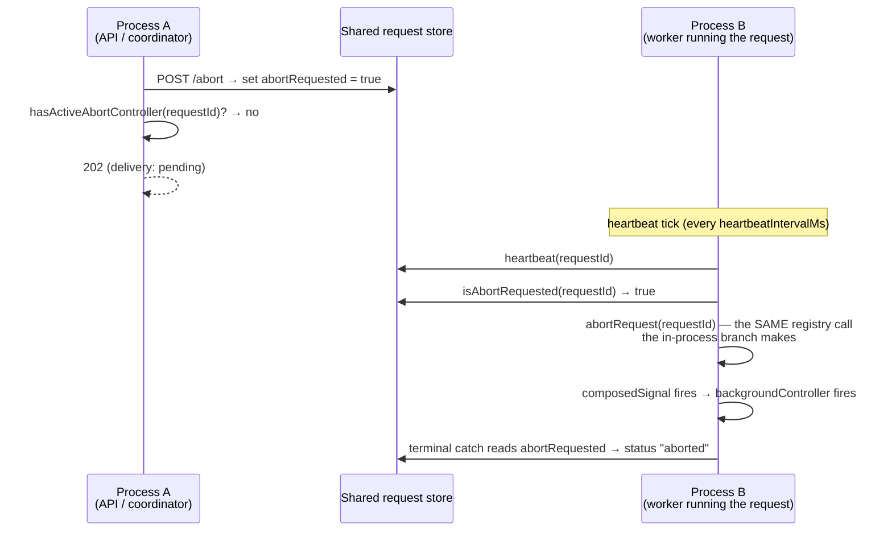

# FIX-1026: Cross-process interrupt does not deliver — a detached request on another worker cannot be cancelled — Implementation Spec

## Part I — The Case *(for the human)*

### 1. Problem — why it matters, why now

**Cancel does not stop a background job.** Press stop on a request that is running in another
worker process and the API says "accepted." Nothing stops. The job keeps calling the model,
keeps writing items, and keeps spending, until it finishes on its own.

The mechanism is three lines of code apart from working. `POST /abort` writes a durable
`abortRequested: true` onto the request record and then fires an **in-memory**
`AbortController` (`routes/abort-routes.ts:53-61`). That map is per-process by construction —
its own header says *"only works for single-server deployments"*
(`execution/abort-registry.ts:8-9`). When the request is running somewhere else, the flag is
written and **nobody ever reads it while the run is alive**: the running process's periodic
tick calls only `registry.heartbeat(requestId)` (`runAction.ts:630-639`), and `runAction`
reads the flag exclusively inside its terminal `catch`, *after* the signal has already fired,
to label an abort some other mechanism caused (`runAction.ts:1566-1572`). A flag with no
reader is not a delivery path.

For a request with a browser attached this is survivable — the client disconnects, the SSE
connection closes, and `request.signal` fires. **A detached request has no client and no SSE
connection.** It is dispatched fire-and-forget with `responseEmitter: null`, so there is
nothing to disconnect. The one path that would have stopped it does not exist.

**Why now.** The epic's objective is that work does not strand, and the owner has already
paid for this gap once: FIX-999 narrowed its interrupt verb to report `"recorded"` — intent
is durable, delivery is not promised — and shipped a fan-out ceiling as the spend brake
instead, on an explicit *"ceiling now, cancel later"* call. FIX-982's task-cancellation model
says a cancelled task interrupts its background request, and it may not claim that until this
lands. This is the "later." Every detached-worker feature downstream inherits a cancel button
that lies until it is fixed.

### 2. Solution in plain terms

**Have the running process check the flag on the tick it already runs.**

Every live request already wakes on a timer to write a heartbeat, by default every 10 seconds
(`runAction.ts:630`). That tick becomes the delivery path: it reads whether an abort has been
requested, and if so fires the **same** local `AbortController` the in-process `/abort`
already fires. From that point everything downstream is unchanged — the signal propagates to
background `.work()` tasks (`runAction.ts:889-912`), the terminal `catch` reads the flag,
classifies it as intentional, and writes status `aborted` exactly as it does today.

So the change is a **delivery mechanism, not a new behaviour**. No new request status, no new
item type, no new terminal path, no second cancellation model to keep in step with the first.
A cancel issued anywhere now stops a run anywhere, within one heartbeat interval.

One thing the obvious version of this gets wrong, and this spec does not: the poll must not
read the request *record*. `RequestStore.get()` materializes the request's entire item history
on every persistent adapter (`store-sqlite/src/request-store.ts:261-268`, `:192-194`), so
polling it every 10 seconds would re-deserialize a monotonically growing item array for the
life of a long job — quadratic work, on exactly the long-running detached requests this
feature exists for. The poll reads a **narrow projection** instead, following the precedent
already in the interface: `countItems` was added for the same reason, to answer a question
about a request without loading it (`stores/types.ts:410-419`).

**What this deliberately does not do:** it does not add a notification channel (Postgres
`LISTEN/NOTIFY`, Redis pub/sub). Store adapters advertise no capability surface today, and
adding one to buy sub-second cancel latency is a large new concept for a case nobody has
asked for. Polling an existing cadence is the restrained answer; an operator who needs faster
cancellation lowers `heartbeatIntervalMs`, which is already a per-flow setting
(`core/src/types/flow.ts:341`).

Tenets this leans on: **2** (the framework absorbs what serves apps broadly — cancellation is
not something an app can implement above the runtime, because the tick is inside `runAction`);
**3** (name the removals — this removes a documented limitation rather than adding surface
beside it); **5** (one convergence point — every delivery path funnels through
`abortRequest(requestId)`, so there is exactly one place that tears a run down).

### 3. Tradeoffs & alternatives

| Alternative | Why not |
|---|---|
| **Poll `stores.request.get(requestId)` on the tick.** Zero new store surface — the flag stays where it is and nothing else changes. | Reads the full record including `items` on every persistent adapter (`store-sqlite/src/request-store.ts:261-268`). Over a long detached run that is O(n²) deserialization on the item history, which is the precise workload this feature targets. Rejected on measured shape, not taste. |
| **Carry `abortRequested` on `ActiveRequestEntry` and widen `heartbeat()` to return it.** One round trip instead of two — the heartbeat write already touches that row, so `RETURNING` gets the bit free. | Creates **two sources of truth** for one invariant. The record's flag must stay, because the terminal `catch` reads it to classify aborted-vs-interrupted and it must survive process loss; so every writer would have to hit both stores non-atomically, and a partial write leaves intent durable but undeliverable. Tenet 5 says one convergence point. Paying one indexed primary-key read per tick to keep it is the right trade. |
| **A notification channel** (`LISTEN/NOTIFY`, pub/sub) for sub-second delivery. | Needs a capability surface the store adapters do not have — the epic established they advertise none (N66(b)). A new cross-adapter concept to shave 10 seconds off a cancel nobody has complained is slow. If sub-second cancel is ever a requirement, this poll is the fallback it degrades to, not work thrown away. |
| **A dedicated abort-poll interval, separate from the heartbeat.** Tune cancellation latency without changing liveness cadence. | A second knob for one deployment shape that hasn't appeared. `heartbeatIntervalMs` already tunes it, and the two cadences want the same answer anyway (both are "how fast does this deployment want to know things"). Named as a follow-up in §12 if a real case shows up. |
| **Do nothing; rely on the fan-out ceiling.** It is already shipping as the spend brake. | A ceiling bounds *how much* runs away; it does not stop a specific runaway job an operator is watching. The owner already scoped it as "ceiling now, cancel later." |

**The simpler version that was weighed and kept:** the whole change could have been the poll
plus nothing else, using `get()`. It was rejected only on the item-materialization cost — the
narrow read is the one piece of added surface, and it earns its place by making the poll cheap
enough to run unconditionally.

### 4. Focus practices (1–5)

1. **BP-030 — tolerate the old shape.** The new `RequestStore` read is **optional** on the
   interface with an engine-side `get()` fallback, so an out-of-tree adapter compiled against
   the old contract keeps building and behaves correctly (just slower). Read `abortRequested`
   with `=== true`, never truthily — it is `boolean | undefined` on the record today
   (`stores/types.ts:95`).
2. **Tenet 5 — enumerate every writer, converge on one point.** Three things write
   `abortRequested`: the HTTP abort route (`routes/abort-routes.ts:55`), the CLI's Ctrl-C path
   (`cli/src/chat/turn.ts:105-111`), and FIX-999's interrupt verb. The fix must not be applied
   per-writer; it is one new *reader* that covers all three, funnelling into the single
   existing `abortRequest(requestId)`.
3. **BP-035 — the second path.** Test the off state of the new behaviour: `heartbeatIntervalMs:
   0` (no timer, therefore no delivery), a per-process store, an already-terminal request, and
   a store read that throws mid-poll. A poll that can kill a healthy request on a transient
   store error is worse than the bug it fixes.
4. **BP-003 — evidence on the real path.** The claim is "a detached request in *another
   process* stops." A single-process vitest cannot show that. The goal check runs the BullMQ
   worker, which reaches `runAction` directly (`bullmq/src/worker.ts:81`).
5. **BP-022 — changeset.** User-facing: `/abort` gains a real guarantee. `patch`.

### 5. What using it looks like (1–5 examples)

Nothing about how an app is written changes — the public call sites are the ones that already
exist. What changes is what they *do*.

**A. Cancelling a detached worker (the case that was broken).**

```ts
// Coordinator process. The request is executing in a BullMQ worker elsewhere.
await session.abortRequest(requestId);

// Before: resolves, request record says abortRequested: true, worker runs to completion.
// After:  worker's next heartbeat tick (<= heartbeatIntervalMs) fires its local controller;
//         the run tears down and settles `aborted`, same as an in-process abort.
```

**B. Knowing whether the cancel will actually land** (Decision 5 — the one open fork).

```ts
const res = await fetch(`/api/flows/${flowKind}/requests/${requestId}/abort`, { method: "POST" });

// 204 — fired here, already tearing down.
// 202 — recorded; body says which kind of 202 it is:
//   { "delivery": "pending"       }  // a shared store + heartbeats on: it will stop
//   { "delivery": "recorded-only" }  // it will not stop by itself; intent is durable
```

**C. Tuning how fast cancel bites** — no new setting; the existing one now governs it.

```ts
defineFlow({
  kind: "researcher",
  request: { heartbeatIntervalMs: 2_000 }, // cancel lands within ~2s instead of ~10s
  // ...
});
```

### 6. Decisions & rules — the sign-off surface

1. **Delivery rides the heartbeat tick that already exists. No new cadence, no new setting,
   no notification channel.**
   *Rejected:* a dedicated abort-poll interval; `LISTEN/NOTIFY` or pub/sub.
   *Locks in:* worst-case cancellation latency equals `heartbeatIntervalMs` (default 10s), and
   is tuned by the setting that already exists. Sub-second cancel is not on offer.

2. **The poll reads a narrow projection, not the request record.** `RequestStore` gains an
   **optional** read that answers "is abort requested?" without materializing items, with an
   engine-side fallback to `get()` for adapters that do not implement it.
   *Rejected:* polling `get()` directly (quadratic on item history); moving the flag onto
   `ActiveRequestEntry` (two sources of truth for one invariant).
   *Locks in:* `abortRequested` stays on the request record as the single writable truth. The
   four shipped adapters implement the fast read; third-party adapters keep compiling and get
   correct-but-slower behaviour, named in the adapter docs.

3. **Delivery converges on the existing abort-registry controller. No new status, no new
   terminal path, no new item type.** The poll calls `abortRequest(requestId)` — the same call
   the same-process branch makes.
   *Rejected:* a separate cross-process teardown path.
   *Locks in:* a cross-process abort is indistinguishable downstream from a local one —
   background `.work()` tasks cancel, the terminal `catch` classifies it intentional, the
   record settles `aborted`. There is exactly one place a run is torn down.

4. **The poll is unconditional; only the *promise* is conditional.** No gate, no construction
   refusal. On a per-process store the poll is a harmless no-op (the local branch already
   fired). Delivery is *promised* only when the request store is shared across processes and
   `heartbeatIntervalMs` is non-zero.
   *Rejected:* gating the poll on FIX-999's registry sharedness declaration — that flag
   describes the **active-request registry**, and the flag we read lives in the **request
   store**. Reusing it would gate on the wrong thing.
   *Locks in:* zero behaviour change for single-process deployments; with `heartbeatIntervalMs:
   0` there is no timer and therefore no delivery, which is stated rather than worked around.

5. **`/abort` tells the caller which kind of "accepted" it got.** 202 gains a body naming
   `delivery: "pending" | "recorded-only"`; FIX-999's interrupt verb carries the same
   distinction on its `"recorded"` result. *(Asked in full on the PR — this is the one live
   fork.)*
   *Rejected:* leaving 202 opaque and documenting the requirement.
   *Locks in:* a small, backward-compatible addition to a response that is empty today.

6. **Non-goals.** Cancelling a **queued** request that has not started (no `runAction`, no
   tick — it aborts at start via the same flag, but this spec adds no admission-time
   machinery beyond firing the first poll at t=0). Cross-process delivery for anything other
   than abort. Any change to how `abortRequested` is written, or by whom. Sub-second
   cancellation. Changes to the fan-out ceiling.

**Size: Medium.** One PR — one engine seam, four adapters, one conformance section, docs.

---

## Part II — The Build Plan *(for the implementing agent)*

### 7. Technical design

#### 7.1 The delivery path



The only new arrow is `isAbortRequested`. Everything after `abortRequest(requestId)` is the
path that already runs today for a same-process abort.

#### 7.2 The narrow read

`RequestStore` gains one optional read that answers the abort question without materializing
items. It mirrors `countItems` (`stores/types.ts:410-419`) in motivation and shape: a question
about a request that persistent adapters answer with an indexed lookup instead of loading
payloads.

- **Optional on the interface**, so an out-of-tree adapter compiled against the old contract
  still builds (BP-030). The engine wraps the call: use the fast read when present, otherwise
  fall back to `get()` and check the record's flag.
- **Absent record ⇒ false.** A request that is gone is not abort-requested; it is finished, and
  the caller's timer is about to be cleared anyway.
- Read the flag with `=== true`. It is `boolean | undefined` (`stores/types.ts:95`).

Adapter shapes: memory and filesystem read the record they already hold; SQLite and Postgres
select the one column on the primary key.

#### 7.3 Where the poll lives

Inside `runAction`, in the interval callback that already exists at `runAction.ts:630-639` —
the same timer, the same `heartbeatIntervalMs`, the same failure posture (log a warning and
continue; a store error must never take down a healthy run).

Directional sketch — the shape, not the code:

```
// at the tick's existing site
let deliveredAbort = false;                    // latch: fire once, stop reading

const tick = async () => {
  await registry.heartbeat(requestId);          // unchanged
  if (deliveredAbort) return;
  if (!(await requestStore.abortRequestedFor(requestId))) return;
  deliveredAbort = true;
  abortRequest(requestId);                      // the one convergence point
  log("cross-process abort delivered", { requestId });
};

// t=0 tick, then every heartbeatIntervalMs — the t=0 read closes the
// window where the flag was set between admission and the run starting.
```

Two properties worth stating because they are load-bearing:

- **The latch.** After firing, stop reading. The controller's `abort()` is idempotent, but the
  read is not free and the teardown may take longer than one interval.
- **The t=0 tick.** Running the poll once when the timer is installed, not only after the
  first interval, catches a flag set before this process picked the request up. This is why
  §6 Decision 6 can say queued-request cancellation needs no admission-time machinery.

#### 7.4 What the abort route reports (Decision 5)

`handleAbortRequest` already branches on `hasActiveAbortController` to return 204 vs 202
(`abort-routes.ts:59-67`). Under Decision 5 the 202 branch additionally reports whether
delivery is coming — derived from (a) whether the store layer advertises itself as shared and
(b) whether a delivering tick can exist. Both are properties of the deployment, not of the
request. FIX-999's interrupt verb carries the same distinction on its `"recorded"` result;
coordinate the wording so the two surfaces say the same thing.

If the owner takes the alternative on Decision 5, this subsection collapses to a doc change
and the route is untouched.

### 8. Implementation sequence

1. **The narrow read on the contract.** Add the optional `RequestStore` method and its doc
   comment (BP-007). Before anything consumes it.
2. **The four adapters.** Memory, filesystem (`engine/src/stores/`), SQLite, Postgres. Each is
   a few lines.
3. **The conformance section.** Extend `stores/testing/request-store-conformance.ts` beside
   the `countItems` block (`:458`) — unknown request, flag absent, flag set, flag set on a
   record with many items (the case that proves the read is narrow). SQLite and Postgres pick
   it up through their existing `stores.test.ts`.
4. **The engine-side wrapper** with the `get()` fallback, so step 5 has one thing to call.
5. **The poll in `runAction`.** Latch, t=0 tick, failure posture, log line.
6. **The route's report** (Decision 5), plus the matching wording on FIX-999's interrupt verb
   result if that has landed; otherwise leave a §13-style note on its PR.
7. **Removals (tenet 3).** Delete the stale claims rather than leaving them beside the fix:
   `abort-registry.ts:8-9` (*"only works for single-server deployments … out of scope for Wave
   1"*), `abort-routes.ts:22-27` and `:65-67` (*"abort will happen when the client closes the
   SSE connection"* — no longer the only path), and the FIX-999 spec's "delivery is not
   promised" line where it survives into `docs/architecture/execution-and-errors.md`.
8. **Docs** (§11) and the changeset.

### 9. Edge cases & error handling

| Case | Behaviour |
|---|---|
| `heartbeatIntervalMs: 0` | No timer, therefore no poll and no delivery. In-process abort unchanged. Reported by the route under Decision 5; documented either way. |
| Store read throws mid-poll | Log a warning, leave the latch unset, continue. Identical posture to the existing heartbeat write failure (`runAction.ts:633-637`). **Never** let a transient store error abort or fail a healthy run. |
| Flag set after the run has gone terminal | The timer is already cleared on every terminal path (`runAction.ts:1104`, `:1282`, `:1412`, `:1559`), so no poll runs. The route already 409s on a terminal record. |
| Poll fires while the request is mid-teardown from a client disconnect | `abort()` is idempotent; the latch prevents a second read. The terminal `catch` reads `abortRequested: true` and classifies it `aborted` rather than `interrupted` — which is correct, an abort *was* requested. |
| Per-process store (default in-memory) | The local branch already fired the controller, so the poll finds a request that is already tearing down and the latch or the cleared timer ends it. No behaviour change. |
| Two processes both polling the same request | Cannot happen for delivery — only the process that owns the run holds a controller for it, and `abortRequest` on a process without one returns false harmlessly. |
| Request record deleted while running (retention, session delete) | Read returns false; no delivery. Not a regression — nothing delivered before either. |
| Out-of-tree adapter without the fast read | Falls back to `get()`. Correct, slower, and named in the adapter docs so the author knows what to implement. |

### 10. Testing strategy

**Goal check (BP-003) — the claim is cross-process, so the evidence must be.**
Run a request on the BullMQ worker (`bullmq/src/worker.ts:81` reaches `runAction` directly)
against a SQLite or Postgres store, with the action doing something long enough to observe.
From a *separate* process, `POST /abort`. Pass criteria: the worker's run settles `aborted`
within roughly `heartbeatIntervalMs`, materially before its natural completion, and the record
carries `abortedAt`. This is the behaviour the issue's verification section names, and no
single-process test substitutes for it.

**Behaviours to cover (vitest — extend `packages/engine/test/abort.test.ts`, which already
sets the flag directly at `:255` and `:494`):**

1. A run whose flag is set by *another* holder of the store (no local controller fired) tears
   down and settles `aborted` within one interval.
2. The same run with `heartbeatIntervalMs: 0` does **not** tear down — the off state (BP-035).
3. A store read that rejects on the poll leaves the run healthy and completes normally; a
   warning is logged.
4. Delivery fires **once** — a second tick does not re-read or re-fire (the latch).
5. A flag already set when the run starts is delivered by the t=0 tick, without waiting an
   interval.
6. Background `.work()` tasks cancel on a cross-process abort exactly as on a local one — the
   `backgroundController` path (`runAction.ts:889-912`), asserted through observable teardown,
   not by reaching into the controller.
7. A run aborted cross-process is indistinguishable in its terminal record and emitted items
   from one aborted in-process. This is the test that protects Decision 3.

**Conformance (all four adapters, via `request-store-conformance.ts`):** unknown request ⇒
false; flag absent ⇒ false; flag set ⇒ true; agreement with `get()`'s view of the same record,
including one with a large item set.

**Not tested here:** cancellation latency as a number (it is `heartbeatIntervalMs` by
construction, and asserting a wall-clock bound buys a flaky test).

### 11. Documentation plan

A change to a user-visible guarantee — cancel now works where it silently did not — so yes,
docs change.

| Surface | Action | Content |
|---|---|---|
| `apps/docs/docs/server/connection-resilience.md` | **Extend** | The page already documents `dismissRequest()` and the abort posture (`:83`). Add a short section under the existing abort material: stopping a request that is running on another server, what governs how fast it stops (`heartbeatIntervalMs`), and the two deployment requirements (a shared request store; heartbeats on). Written to the outsider rule — describe what it does, never that it used to be broken or which issue fixed it. No issue ids. |
| `apps/docs/docs/advanced/durable-execution.md` | **Extend** | One or two sentences where background/detached execution is described: a detached run is cancellable, and the same setting governs both its liveness heartbeat and how quickly a cancel reaches it. Cross-link to the resilience page. |
| `docs/architecture/execution-and-errors.md` | **Extend + correct** | Internal contract. `:186` and `:191` currently say `abortController` *"fires on the explicit `/abort` endpoint / `session.abortRequest()` only"* — now it also fires from the heartbeat poll. Add the poll to the signal diagram and state the single convergence point. This is a correction, not an addition; leaving it is how the next reader gets it wrong. |
| `packages/engine/README.md` | **Extend** | The new `RequestStore` read beside `countItems`, marked optional with its `get()` fallback, so adapter authors know it exists and what skipping it costs. |
| `packages/store-sqlite/README.md`, `packages/store-postgres/README.md` | **Extend** | One line each: the adapter implements the fast read. Both READMEs already document their store support, so it lands beside it. Note this is the same pair FIX-999 edits for its sharedness declaration — expect a hunk collision, not a conflict of meaning. |
| New pages | **None** | Nothing here introduces vocabulary a user would search for. Cancellation is already a documented concept; this makes an existing page accurate. Fragmenting the sidebar for a correctness fix would be wrong. |

**Voice risks to watch on the two published pages:** do not write "powerful" or "seamless";
introduce *heartbeat* in plain terms on first use (a periodic write that says the run is still
alive); keep em-dashes sparse; do not narrate the bug. Dispatch `docs-writer` then
`docs-editor` rather than writing this prose while holding the diff.

### 12. Dependencies, open questions & follow-ups

**Dependencies — none blocking.** This can be built and merged on its own.

- **FIX-999 (In Spec Review) — file overlap, not a dependency.** It edits
  `stores/types.ts` (a sharedness declaration on `ActiveRequestRegistry`) and `runAction.ts`
  (the construction bundle); this edits `stores/types.ts` (a `RequestStore` read) and
  `runAction.ts` (the tick). Different regions, additive both ways. Whichever lands second
  rebases. **The semantic coupling is the piece to carry:** FIX-999's interrupt verb reports
  `"recorded"` with *"delivery is not promised"*; once this lands that sentence is wrong.
  Update it wherever it survives, and align Decision 5's wording with the verb's result.
- **FIX-982** consumes this — its task-cancellation model needs cross-process interrupt before
  it can promise a cancelled task stops its background request. It is a consumer, not a
  blocker.

**Open questions.** One, carried as Decision 5 and asked in full on the PR: does `/abort`
report which kind of "accepted" the caller got, or stay opaque with the requirement
documented?

**Follow-ups (not in scope):**

- A dedicated abort-poll cadence, if a deployment ever wants cancellation latency decoupled
  from liveness cadence. No case for it today.
- A notification channel for sub-second delivery. Would need a store-adapter capability
  surface, which does not exist; the poll is what it would degrade to anyway.
- `heartbeatIntervalMs` is declared at `core/src/types/flow.ts:341` and appears nowhere in
  `apps/docs`. This spec documents it as the cancellation dial; a proper reference entry for
  the setting is a separate docs gap.
- **Deepening note:** `runAction.ts` is past 1700 lines and its tick, abort wiring, and
  terminal classification are interleaved with everything else. Not this spec's scope; a
  candidate for `improve-codebase-architecture`.

### 13. Review notes for the implementer

*(Empty at draft. Below-the-bar review feedback is recorded here verbatim.)*

---

## Spec evolution *(the change story, not an audit log)*

- **Spec drafted** — framed as a missing *delivery* path for a flag that is already durable and
  already read, rather than as new cancellation machinery: the running process polls the flag
  on the heartbeat tick it already runs and fires the same abort-registry controller the
  in-process path fires, so nothing downstream changes. The one piece of added surface is a
  narrow `RequestStore` read, taken because polling `get()` would re-materialize a growing item
  history every tick on exactly the long-running detached requests this targets. Medium, one PR.
