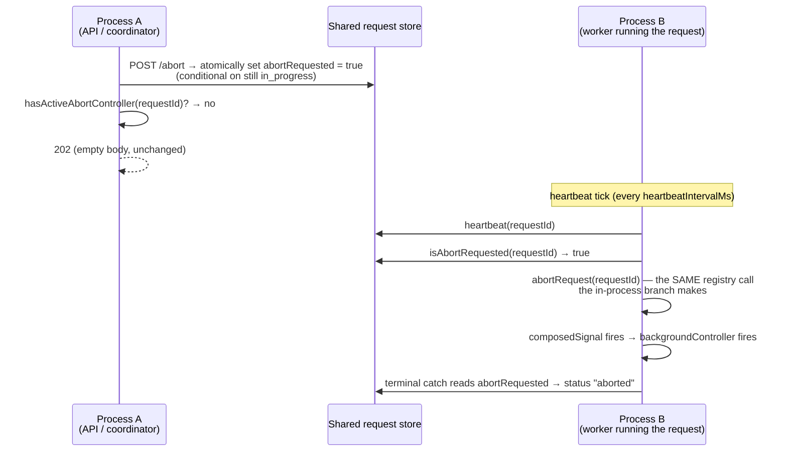

# FIX-1026: Cross-process interrupt does not deliver — a detached request on another worker cannot be cancelled — Implementation Spec

## Part I — The Case *(for the human)*

### 1. Problem — why it matters, why now

**Cancel does not stop a background job.** Press stop on a request that is running in another
worker process and the API says "accepted." Nothing stops. The job keeps calling the model,
keeps writing items, and keeps spending, until it finishes on its own.

The mechanism is three lines of code apart from working. `POST /abort` writes a durable
`abortRequested: true` onto the request record and then fires an **in-memory**
`AbortController` (`routes/abort-routes.ts:53-61`). That map is per-process by construction —
its own header says *"only works for single-server deployments"*
(`execution/abort-registry.ts:8-9`). When the request is running somewhere else, the flag is
written and **nobody ever reads it while the run is alive**: the running process's periodic
tick calls only `registry.heartbeat(requestId)` (`runAction.ts:630-639`), and `runAction`
reads the flag exclusively inside its terminal `catch`, *after* the signal has already fired,
to label an abort some other mechanism caused (`runAction.ts:1566-1572`). A flag with no
reader is not a delivery path.

For a request with a browser attached this is survivable — the client disconnects, the SSE
connection closes, and `request.signal` fires. **A detached request has no client and no SSE
connection.** It is dispatched fire-and-forget with `responseEmitter: null`, so there is
nothing to disconnect. The one path that would have stopped it does not exist.

**Why now.** The epic's objective is that work does not strand, and the owner has already
paid for this gap once: FIX-999 narrowed its interrupt verb to report `"recorded"` — intent
is durable, delivery is not promised — and shipped a fan-out ceiling as the spend brake
instead, on an explicit *"ceiling now, cancel later"* call. FIX-982's task-cancellation model
says a cancelled task interrupts its background request, and it may not claim that until this
lands. This is the "later." Every detached-worker feature downstream inherits a cancel button
that lies until it is fixed.

### 2. Solution in plain terms

**Have the running process check the flag on the tick it already runs.**

Every live request already wakes on a timer to write a heartbeat, by default every 10 seconds
(`runAction.ts:630`). That tick becomes the delivery path: it reads whether an abort has been
requested, and if so fires the **same** local `AbortController` the in-process `/abort`
already fires. From that point everything downstream is unchanged — the signal propagates to
background `.work()` tasks (`runAction.ts:889-912`), the terminal `catch` reads the flag,
classifies it as intentional, and writes status `aborted` exactly as it does today.

So the change is a **delivery mechanism, not a new behaviour**. No new request status, no new
item type, no new terminal path, no second cancellation model to keep in step with the first.
A cancel issued anywhere now stops a run anywhere, within one heartbeat interval.

One thing the obvious version of this gets wrong, and this spec does not: the poll must not
read the request *record*. `RequestStore.get()` materializes the request's entire item history
on every persistent adapter (`store-sqlite/src/request-store.ts:261-268`, `:192-194`), so
polling it every 10 seconds would re-deserialize a monotonically growing item array for the
life of a long job — quadratic work, on exactly the long-running detached requests this
feature exists for. The poll reads a **narrow projection** instead, following the precedent
already in the interface: `countItems` was added for the same reason, to answer a question
about a request without loading it (`stores/types.ts:410-419`).

The second thing it gets wrong is the *write*, and the honest answer is that the store is
missing a verb. `abortRequested` is set by one party — the abort route, the CLI's Ctrl-C path,
FIX-999's interrupt verb — and then carried as a passenger inside **full-record writes by
everyone else**. The worker never intends to touch it, but every request-record write it makes
is `{ ...heldRecord, ...patch }`, built from a snapshot taken before the flag existed. The
longest-lived of those snapshots lasts the whole run: `createExecutionContext` holds
`requestRef.current` for the request's lifetime and spreads it into a full `set` on every
request-state persist (`createExecutionContext.ts:1073`, `:1714-1721`).

There is no way to write that flag safely with what `RequestStore` has today. `set` takes a
whole record, and its `expectedVersion` CAS cannot express the condition that matters —
*"only if this request is still running"* — because terminal writes go through
`patchRequestRecord(..., "any")` and persist `version` **unchanged** (`runAction.ts:222-243`).
A version-checked write therefore validates against a version the terminal transition never
advanced, and resurrects a dead record.

So this spec adds the verb rather than simulating it: **a conditional field write** —
set named fields on a request record if a predicate on its current status holds, atomically,
with no read-modify-write of the whole record. `abortRequested` then leaves `set`'s surface
entirely: it is writable *only* through that operation. Every full-record writer stops being a
hazard structurally, because the field is no longer something they can carry.

**What this deliberately does not do:** it does not add a notification channel (Postgres
`LISTEN/NOTIFY`, Redis pub/sub). Store adapters advertise no capability surface today, and
adding one to buy sub-second cancel latency is a large new concept for a case nobody has
asked for. Polling an existing cadence is the restrained answer; an operator who needs faster
cancellation lowers `heartbeatIntervalMs`, which is already a per-flow setting
(`core/src/types/flow.ts:341`).

Tenets this leans on: **2** (the framework absorbs what serves apps broadly — cancellation is
not something an app can implement above the runtime, because the tick is inside `runAction`);
**3** (name the removals — this removes a documented limitation rather than adding surface
beside it); **5** (one convergence point — every delivery path funnels through
`abortRequest(requestId)`, so there is exactly one place that tears a run down).

### 3. Tradeoffs & alternatives

| Alternative | Why not |
|---|---|
| **Poll `stores.request.get(requestId)` on the tick.** Zero new store surface — the flag stays where it is and nothing else changes. | Reads the full record including `items` on every persistent adapter (`store-sqlite/src/request-store.ts:261-268`). Over a long detached run that is O(n²) deserialization on the item history, which is the precise workload this feature targets. Rejected on measured shape, not taste. |
| **Carry `abortRequested` on `ActiveRequestEntry` and widen `heartbeat()` to return it.** One round trip instead of two — the heartbeat write already touches that row, so `RETURNING` gets the bit free. | Creates **two sources of truth** for one invariant. The record's flag must stay, because the terminal `catch` reads it to classify aborted-vs-interrupted and it must survive process loss; so every writer would have to hit both stores non-atomically, and a partial write leaves intent durable but undeliverable. Tenet 5 says one convergence point. Paying one indexed primary-key read per tick to keep it is the right trade. |
| **A notification channel** (`LISTEN/NOTIFY`, pub/sub) for sub-second delivery. | Needs a capability surface the store adapters do not have — the epic established they advertise none (N66(b)). A new cross-adapter concept to shave 10 seconds off a cancel nobody has complained is slow. If sub-second cancel is ever a requirement, this poll is the fallback it degrades to, not work thrown away. |
| **Patch the six full-record writers individually** so each preserves the field. | Whack-a-mole. It leaves the seventh writer to rediscover the hazard, and doing it properly means touching `createExecutionContext`'s run-lifetime `requestRef` snapshot. *(Weighed in round 2.)* |
| **A monotonic merge rule on `set`** — "never lower a stored `true`" — so full-record writers can keep carrying the field harmlessly. | **This was round 2's answer and it is deleted.** It protects the flag by making it un-clearable, which turns a suspended request's undelivered intent into permanent state, and it puts a special case in `set` for exactly one field. With a real conditional write the field is not on `set`'s surface at all, so there is nothing to protect it from. Apparatus invented to stand in for a missing verb. |
| **`set` + `expectedVersion` as the conditional write.** No new store surface; the CAS already exists. | **It cannot express the predicate.** Terminal writes go through `patchRequestRecord(..., "any")` and persist `version` *unchanged* (`runAction.ts:222-243`), so the version a route reads is still current after a terminal commit: route reads v → worker stores terminal at v → route's `set(..., v)` validates and resurrects an `in_progress` record. The only way to make CAS work would be to change every status writer's version protocol — a far larger blast radius than one new store verb. |
| **A dedicated abort-poll interval, separate from the heartbeat.** Tune cancellation latency without changing liveness cadence. | A second knob for one deployment shape that hasn't appeared. `heartbeatIntervalMs` already tunes it, and the two cadences want the same answer anyway (both are "how fast does this deployment want to know things"). Named as a follow-up in §12 if a real case shows up. |
| **Do nothing; rely on the fan-out ceiling.** It is already shipping as the spend brake. | A ceiling bounds *how much* runs away; it does not stop a specific runaway job an operator is watching. The owner already scoped it as "ceiling now, cancel later." |

**The simpler version that was weighed and kept:** the whole change could have been the poll
plus nothing else, using `get()`. It was rejected on two counts — the item-materialization cost
above, and the fact that a flag written by a full-record `set` does not reliably survive to be
read. The added surface is two store verbs: a narrow read, and a conditional field write. Both
are things `RequestStore` should arguably have had before this issue existed, which is why they
are verbs rather than rules layered over the verbs that exist.

### 4. Focus practices (1–5)

1. **BP-030 — no migration; a compile-time break, made loudly; one dual-read.** `abortRequested`
   stays exactly where it is stored (`stores/types.ts:95`); only the *write path* changes, so
   **no data migration is required** and no in-flight record needs rewriting. What does change
   is the **adapter interface** — two required members (Decisions 2 and 6), so an out-of-tree
   adapter fails to typecheck rather than silently taking a slow or unsafe path. The one real
   dual-read is the filesystem adapter (§7.2): if it moves the flag out of the record file to
   keep the poll narrow, it must still report a legacy record that carries the flag inline.
   Read the flag with `=== true`, never truthily — it is `boolean | undefined`.
2. **Tenet 5 — enumerate every writer, converge on one point.** Three things write
   `abortRequested`: the HTTP abort route (`routes/abort-routes.ts:55`), the CLI's Ctrl-C path
   (`cli/src/chat/turn.ts:105-111`), and FIX-999's interrupt verb. The fix must not be applied
   per-writer; it is one new *reader* that covers all three, funnelling into the single
   existing `abortRequest(requestId)`. The *intentional* writer set does not change. The
   **unintentional** one is the real finding: six places write the whole request record and carry
   `abortRequested` as a passenger — `runAction.ts:239`, `createExecutionContext.ts:1717`,
   `createInboundTransportHost.ts:81`/`:252`/`:316`, `request-recovery.ts:61`. Enumerating them
   was the point; policing them was not. Taking the field off `set`'s surface (Decision 6) means
   none of them can touch it, including the seventh nobody has written yet — convergence by
   construction rather than by rule.
3. **BP-035 — the second path.** Test the off state of the new behaviour: `heartbeatIntervalMs:
   0` (no timer, therefore no delivery), a per-process store, an already-terminal request, and
   a store read that throws mid-poll. A poll that can kill a healthy request on a transient
   store error is worse than the bug it fixes. **A rejected heartbeat write must not take the
   poll down with it** — they share a tick but not a fate (§7.3). Two concurrency paths join
   that list, both §10 scenarios: a worker full-record write landing across the route's abort
   write (in both orders), and a tick that lands before `registerAbortController` has run.
4. **BP-003 — evidence on the real path.** The claim is "a detached request in *another
   process* stops." A single-process vitest cannot show that. The goal check runs the BullMQ
   worker, which reaches `runAction` directly (`bullmq/src/worker.ts:81`).
5. **BP-022 — changeset, and it is `minor`, not `patch`.** User-facing: `/abort` gains a real
   guarantee. But Decision 2 makes the narrow read a **required** `RequestStore` member and
   Decision 6 adds a rule to `set`'s contract — both break an out-of-tree adapter, and
   `AGENTS.md` is explicit that pre-1.0 a breaking change is `minor` (`patch` for non-breaking,
   `minor` for breaking, never `major`). Write the changeset so an adapter author reading the
   release notes learns they have work to do.

### 5. What using it looks like (1–5 examples)

Nothing about how an app is written changes — the public call sites are the ones that already
exist. What changes is what they *do*.

**A. Cancelling a detached worker (the case that was broken).**

```ts
// Coordinator process. The request is executing in a BullMQ worker elsewhere.
await session.abortRequest(requestId);

// Before: resolves, request record says abortRequested: true, worker runs to completion.
// After:  worker's next heartbeat tick (<= heartbeatIntervalMs) fires its local controller;
//         the run tears down and settles `aborted`, same as an in-process abort.
```

**B. Knowing whether the cancel will actually land** — from the deployment, not the response
(Decision 5).

```ts
await fetch(`/api/flows/${flowKind}/requests/${requestId}/abort`, { method: "POST" });

// 204 — fired here, already tearing down. (unchanged)
// 202 — recorded. Unchanged and still empty: it stops within one heartbeat interval
//       when the deployment meets the two documented requirements —
//         (1) the request store is shared across processes, and
//         (2) heartbeatIntervalMs > 0 on the flow.
//       Both are properties an operator configures, and both are in the docs (§11).
```

**C. Tuning how fast cancel bites** — no new setting; the existing one now governs it.

```ts
defineFlow({
  kind: "researcher",
  request: { heartbeatIntervalMs: 2_000 }, // cancel lands within ~2s instead of ~10s
  // ...
});
```

### 6. Decisions & rules — the sign-off surface

1. **Delivery rides the heartbeat tick that already exists. No new cadence, no new setting,
   no notification channel.**
   *Rejected:* a dedicated abort-poll interval; `LISTEN/NOTIFY` or pub/sub.
   *Locks in:* worst-case cancellation latency equals `heartbeatIntervalMs` (default 10s), and
   is tuned by the setting that already exists. Sub-second cancel is not on offer.

2. **The poll reads a narrow projection, not the request record — and the read is *required*
   on `RequestStore`, exactly as `countItems` is.** One boolean-returning method that answers
   "is abort requested?" without materializing items. No optional method, no runtime feature
   detection, no `get()` fallback.
   *Rejected:* polling `get()` directly (quadratic on item history); an **optional** method
   with an engine-side `get()` fallback (a permanent slow path in the one code path this spec
   exists to make cheap — and the `countItems` precedent the design cites is required, so an
   optional read contradicts it); widening `get(id, { withItems?: boolean })` (it hands a
   deliberately item-stripped `RequestRecord` to a codebase whose dominant write is a
   full-record `set` — see Decision 6 — so a partial record is one careless write-back from
   erasing an item history); moving the flag onto `ActiveRequestEntry` (two sources of truth
   for one invariant).
   *Locks in:* `abortRequested` stays on the request record as the single writable truth. All
   four shipped adapters implement the read in the same PR, and the conformance suite enforces
   it. An out-of-tree adapter **fails to typecheck** until it adds the method — see §7.2 for
   the upgrade story and why that break is the right one.

3. **Delivery converges on the existing abort-registry controller. No new status, no new
   terminal path, no new item type.** The poll calls `abortRequest(requestId)` — the same call
   the same-process branch makes.
   *Rejected:* a separate cross-process teardown path.
   *Locks in:* a cross-process abort is indistinguishable downstream from a local one —
   background `.work()` tasks cancel, the terminal `catch` classifies it intentional, the
   record settles `aborted`. There is exactly one place a run is torn down.

4. **The poll is unconditional; only the *promise* is conditional.** No gate, no construction
   refusal. On a per-process store the poll is a harmless no-op (the local branch already
   fired). Delivery is *promised* only when the request store is shared across processes and
   `heartbeatIntervalMs` is non-zero.
   *Rejected:* gating the poll on FIX-999's registry sharedness declaration — that flag
   describes the **active-request registry**, and the flag we read lives in the **request
   store**. Reusing it would gate on the wrong thing.
   *Locks in:* zero behaviour change for single-process deployments; with `heartbeatIntervalMs:
   0` there is no timer and therefore no delivery, which is stated rather than worked around.

5. **`/abort` stays opaque; the deployment requirement is documented instead.** *(Deferred by
   the owner in round 1 — no longer an open fork.)* Ship the delivery mechanism. The 202 body
   stays empty, and FIX-999's interrupt verb does **not** carry a delivery distinction on its
   `"recorded"` result. Two facts, verified against the tree, make reporting unbuildable today:
   `packages/client/src/action-client/executeAction.ts:61` types `abortRequest` as
   `(requestId: string) => Promise<void>` and discards the response body, so a field on the 202
   reaches no caller; and neither `RequestStore` nor `StoreRegistry` exposes whether the
   request store is shared across processes, so `delivery` would be a guess — which corroborates
   FIX-1005's Decision 5, already rejecting runtime inference of sharedness.
   *Rejected:* adding `delivery: "pending" | "recorded-only"` now, on either surface.
   *Locks in:* the public response surface is untouched. Operators learn the requirement — a
   shared request store and `heartbeatIntervalMs > 0` — from the docs (§11). Reporting returns
   as a §12 follow-up, gated on a real sharedness source existing; that primitive is most
   likely FIX-999's per-adapter declaration, and the client return contract is part of the same
   follow-up rather than a separate one.

6. **`RequestStore` gains a conditional field write, and `abortRequested` becomes writable only
   through it.** A general verb, not an abort-shaped one: *set these named fields on this
   request if its current status is one of these*, evaluated and applied atomically by the
   adapter, with a result that says whether the predicate held. `set` **structurally cannot
   carry `abortRequested`** — the field leaves the full-record write surface, stays readable on
   the record, and the two writers that set it (the abort route, the CLI's Ctrl-C path) move to
   the new verb.
   *Rejected:* `set` + `expectedVersion` as the conditional write — it cannot express
   `status === "in_progress"`, because terminal writes persist `version` unchanged
   (`runAction.ts:222-243`), so a version-checked write validates after a terminal commit and
   resurrects a dead record. *Rejected:* the monotonic "never lower a stored `true`" rule from
   round 2 — apparatus standing in for this verb, and it made undelivered intent permanent.
   *Rejected:* patching the six full-record writers individually.
   *Locks in:* **scope**, deliberately spent — the `RequestStore` interface, all four adapters,
   and the conformance suite. **No data migration:** the field stays where it is stored and only
   its write path changes. Three things collapse into this one verb rather than being handled
   separately: the six full-record writers stop being a hazard *structurally*, `set` keeps no
   per-field special cases, and the flag becomes clearable again — which is what lets a
   settled-or-suspended request stop carrying intent it never consumed. §12 records that
   FIX-1005's re-spec and FIX-999 both look like consumers, which is why it is general.

7. **Non-goals.** Cancelling a **queued** request that has not started (no `runAction`, no
   tick — it aborts at start via the same flag, but this spec adds no admission-time
   machinery beyond the first poll). Cross-process delivery for anything other than abort. Any
   change to **who intentionally writes** `abortRequested` — those three writers stay as they
   are, and no worker call site changes; what changes is the verb they write through
   (Decision 6). Migrating other fields onto the conditional write, or retrofitting it to
   `SessionStore`/`UserStore` — it lands on `RequestStore` for the caller that needs it.
   Sub-second cancellation. Changes to the fan-out ceiling.

**Size: Medium.** One PR — two `RequestStore` verbs (the narrow read, the conditional field
write), the poll, four adapters, one conformance section, docs. `minor` changeset.

---

## Part II — The Build Plan *(for the implementing agent)*

### 7. Technical design

#### 7.1 The delivery path



The only new arrow is `isAbortRequested`. Everything after `abortRequest(requestId)` is the
path that already runs today for a same-process abort. The route's first arrow is not new, but
its *write mode* is — see §7.4.

#### 7.2 The narrow read

`RequestStore` gains one **required** read that answers the abort question without
materializing items. It mirrors `countItems` (`stores/types.ts:410-419`) in motivation, shape,
*and* obligation: a question about a request that persistent adapters answer with a
primary-key lookup instead of loading payloads.

- **Required on the interface**, like `countItems`. Not optional, and no engine-side `get()`
  fallback — a fallback is a permanent slow path in the exact loop this spec exists to make
  cheap, and it re-materializes the item history every tick on the adapters least able to
  afford it.
- **Absent record ⇒ false.** A request that is gone is not abort-requested; it is finished, and
  the caller's timer is about to be cleared anyway.
- Read the flag with `=== true`. It is `boolean | undefined` (`stores/types.ts:95`).

**Narrow means O(1) in item count, on every adapter — this is the requirement, not the
implementation.** Memory holds the record in process, so reading it is already free. SQLite and
Postgres read the flag off the stored record on the primary key without touching the items
table. **Filesystem is the one that needs a different representation:** its items live inline on
the record file and `get()` delegates to `readRecord`
(`stores/filesystem/request-store.ts:173-175`) — `countItems` even documents that it must load
the whole record (`:307-310`). Reusing that read would parse a growing item array every tick,
which is the exact cost this method exists to remove. So the filesystem adapter stores the flag
somewhere it can answer cheaply — a per-request marker beside the record file is the obvious
shape, where existence *is* the flag and the read is a `stat` — with two duties attached:

- `get()` merges it back onto the returned record, so the terminal `catch`'s read
  (`runAction.ts:1570`) is unaffected.
- **BP-030 dual-read:** a record written before this change carries the flag inline. Report it
  as `true` when the record says so, marker or not. This is a dual-read, not a migration —
  nothing is rewritten.

The representation is the adapter's business; the O(1) requirement is the contract, and the
conformance suite's "flag set on a record with many items" case is what holds it.

**The BP-030 upgrade story, stated plainly.** BP-030's persisted-shape clause is not engaged —
nothing new is stored, so there is no old record to tolerate and no removed key to reject.
The change is to the *adapter contract*, and it is a typecheck break for any adapter outside
this repo:

- All four shipped adapters implement it in the same PR, and the conformance suite makes that
  non-optional going forward.
- An out-of-tree adapter fails to build with a missing-member error naming the method — the
  same break `countItems` made when it was added for the same reason (FIX-685), and the same
  fix: one method that reads a flag off the record it already knows how to load.
- The changeset and `packages/engine/README.md` call it out as a required addition for adapter
  authors, with the one-line implementation beside it.

The alternative — optional with a fallback — trades a compile error the author sees today for
a performance cliff they discover in production and cannot attribute. That is the wrong
direction for a break this small to fix.

#### 7.3 Where the poll lives

Inside `runAction`, in the interval callback that already exists at `runAction.ts:630-639` —
the same timer, the same `heartbeatIntervalMs`, the same failure posture (log a warning and
continue; a store error must never take down a healthy run).

Directional sketch — the shape, not the code:

```
// at the tick's existing site
let deliveredAbort = false;                    // latch: set on DELIVERY, not on detection

const tick = async () => {
  // The heartbeat keeps its own failure handling — today it is a `.catch()`
  // on the call (runAction.ts:632-637), and it must stay isolated. A rejected
  // heartbeat must not skip the poll below it.
  await registry.heartbeat(requestId).catch(warnAndContinue);
  if (deliveredAbort) return;
  if (!(await requestStore.abortRequestedFor(requestId))) return;
  // abortRequest returns false when no controller is registered yet
  // (abort-registry.ts:28-34). Latch only on a real delivery.
  if (!abortRequest(requestId)) return;         // the one convergence point
  deliveredAbort = true;
  log("cross-process abort delivered", { requestId });
};

// first poll, then every heartbeatIntervalMs — the first read closes the
// window where the flag was set between admission and the run starting.
```

Two properties worth stating because they are load-bearing:

- **The latch is on delivery, not on detection.** This is the fix for an ordering hazard in the
  first draft. `runAction` installs the heartbeat timer at `:630` but does not call
  `registerAbortController` until `:852`, with store and parse work in between. A tick landing
  in that window reads a pre-set flag, finds no controller, and `abortRequest` returns `false`
  (`abort-registry.ts:28-34`) — under a detection latch that first tick would have set
  `deliveredAbort` and **suppressed every later poll**, silently defeating the queued /
  pre-start cancellation this feature exists to provide.

  **Why latch-on-delivery rather than simply moving the first poll after registration:** the
  window is not just the first instant. A flow with a short `heartbeatIntervalMs` can take an
  ordinary interval tick inside it too, and moving only the t=0 poll leaves that one broken.
  One rule covers the whole window: a tick that cannot deliver changes nothing and tries again
  next interval. The cost is that a flag already set at start is delivered on the first tick
  *after* registration rather than exactly at t=0 — still bounded by `heartbeatIntervalMs`,
  which is the latency this spec promises everywhere else. The ordering is a §10 scenario, not
  an assumption.
- **After a real delivery, stop reading.** The controller's `abort()` is idempotent, but the
  read is not free and teardown may take longer than one interval.
- **The two halves of the tick share a timer, not a fate.** The heartbeat writes to the
  *active-request registry*; the poll reads the *request store*. They are different stores and
  fail independently, so the heartbeat keeps its own `.catch()` and a rejection from it must
  never skip the poll. Get this wrong and a deployment that satisfies both documented
  requirements — a shared request store and a non-zero interval — still cannot cancel, because
  an unrelated registry outage silently disabled delivery on every tick. Covered in §9 and
  tested as its own behaviour in §10.

#### 7.4 The conditional field write (Decision 6)

The route's response shape does not change (Decision 5): 204 when the local controller fired,
202 otherwise, both with an empty body. What changes is the verb underneath it.

**Why a new verb rather than a rule over the old ones.** `abortRequested` is set to `true` in
two places today — `abort-routes.ts:55` and the CLI's Ctrl-C path (`cli/src/chat/turn.ts:111`),
with FIX-999's interrupt verb to come — and the single reader is the terminal `catch`
(`runAction.ts:1570`, `=== true`). But six code paths write the *whole record* and carry the
field as a passenger:

| Writer | Shape |
|---|---|
| `runAction.ts:239` (`patchRequestRecord`) | re-reads, then `set({ ...current, ...patch }, "any")` |
| `createExecutionContext.ts:1717` (`buildSetRecord` for request state) | `set({ ...requestRef.current, state, version })` — from a **run-lifetime snapshot** (`:1073`) |
| `createInboundTransportHost.ts:81`, `:252`, `:316` | `set({ ...record, ...status fields }, "any")` |
| `request-recovery.ts:61` | `set({ ...requestRecord, status: "interrupted" }, "any")` |

Two things follow, and together they are why nothing short of a new verb works.

*The field cannot be written safely through `set`.* `createExecutionContext`'s snapshot is
captured once at context construction and lives for the whole run, and every request-state
persist that takes the `set` fallback writes it back wholesale (`scope-persist.ts`). Its CAS on
`version` does not save the flag, because a write that sets the flag spreads the record without
advancing `version`.

*And `set`'s CAS cannot express the condition the route needs.* The route must write only while
the request is still running. `expectedVersion` is the only predicate `set` has, and terminal
writes go through `patchRequestRecord(..., "any")`, which persists `version` **unchanged**
(`runAction.ts:222-243`). So: route reads version v → worker commits `completed` at version v →
route's `set(..., v)` validates and restores an `in_progress` record over a finished one. The
predicate the route needs is about *status*, and no amount of version arithmetic reaches it.

**The verb.** `RequestStore` gains a conditional field write: *apply these field values to this
request if its current status is one of these*, evaluated and applied atomically inside the
adapter, returning whether the predicate held (and the status it found, so a caller can pick its
own error). Shaped generally rather than as `markAborted()` — the predicate and the field set
are parameters — because §12 records two likely consumers beyond this issue.

`DeltaStoreOps.patchField` is **not** this: it addresses the record's `state` slice with a
version predicate, and `abortRequested` is a top-level field needing a status predicate. The new
verb sits beside it on `RequestStore`.

**`abortRequested` leaves `set`'s surface.** It stays on `RequestRecord` for reading, and `set`
ignores it: a full record handed to `set` cannot change the stored value in either direction.
Every writer in the table above is then harmless without changing a single call site, and so is
the seventh nobody has written. **No data migration** — the field is stored where it always was;
only the write path moved. (The filesystem adapter may relocate it for the narrow read's sake;
that is a dual-read, covered in §7.2.)

**What the route becomes.** The read-then-write disappears. One call — *set
`abortRequested: true` if status is `in_progress`* — and the result drives the response: the
predicate held → fire the local controller if present, 204 or 202; the request was absent → 404;
the status was terminal → the existing 409. No new error shape reaches callers, and the route no
longer holds a record copy across an await.

**What the verb does not close, stated plainly.** Both terminal paths clear the heartbeat timer
*before* they write the terminal status (`runAction.ts:1282-1291`, `:1411-1428`). An abort
accepted inside that window sees `in_progress`, so the write succeeds — but no poll remains to
deliver it on that leg. §9 carries what happens next for each terminal status; it needs no
guard, and adding one would be apparatus.

### 8. Implementation sequence

1. **Both verbs on the contract.** The **required** narrow read, and the conditional field
   write — each with its doc comment (BP-007), plus the statement that `set` ignores
   `abortRequested`. Before anything consumes them; they break the build until step 2 lands, and
   that is the point.
2. **The four adapters.** Memory, filesystem (`engine/src/stores/`), SQLite, Postgres. Memory
   and the SQL pair are a few lines each. **Filesystem is the one with real work** — the narrow
   representation, the `get()` merge, and the legacy dual-read (§7.2).
3. **The conformance section.** Extend `stores/testing/request-store-conformance.ts` beside
   the `countItems` block (`:458`). The narrow read: unknown request, flag absent, flag set,
   flag set on a record with many items (the case that proves the read is narrow). The
   conditional write: predicate holds → applied; predicate fails on a terminal status → not
   applied, and the returned status says so; unknown request → not applied; and a full `set`
   carrying `abortRequested` in either direction **does not** change the stored value. SQLite and
   Postgres pick all of it up through their existing `stores.test.ts`.
4. **The route and the CLI move to the new verb** (§7.4), before the poll — the poll is only as
   good as the flag being written safely. The route's read-then-write goes away. Includes the
   resurrection scenario from §10.
5. **The poll in `runAction`.** Delivery latch (not a detection latch), first poll, failure
   posture isolated from the heartbeat's, log line. Includes the pre-registration ordering
   scenario.
6. **Removals (tenet 3).** Delete the stale claims rather than leaving them beside the fix:
   `abort-registry.ts:8-9` (*"only works for single-server deployments … out of scope for Wave
   1"*), `abort-routes.ts:22-27` and `:65-67` (*"abort will happen when the client closes the
   SSE connection"* — no longer the only path), and the FIX-999 spec's "delivery is not
   promised" line where it survives into `docs/architecture/execution-and-errors.md`.
7. **Docs** (§11) and the changeset. The docs step is load-bearing under Decision 5 — with no
   response signal, the deployment requirement is the only place an operator learns whether a
   cancel will land.

### 9. Edge cases & error handling

| Case | Behaviour |
|---|---|
| `heartbeatIntervalMs: 0` | No timer, therefore no poll and no delivery. In-process abort unchanged. Not reported on the response (Decision 5) — documented as a deployment requirement (§11). |
| Store read throws mid-poll | Log a warning, leave the latch unset, continue. Identical posture to the existing heartbeat write failure (`runAction.ts:633-637`). **Never** let a transient store error abort or fail a healthy run. |
| **Heartbeat write rejects while the request store is healthy** | The heartbeat logs its warning as it does today; **the poll still runs on that tick.** The two halves share a timer, not a fate (§7.3) — they hit different stores. Without this, a registry outage silently disables cancellation on a deployment that meets every documented requirement. |
| A tick lands before `registerAbortController` (`runAction.ts:630` vs `:852`) | The read finds the flag, `abortRequest` returns `false`, and **the latch stays unset** — the next tick retries and delivers. Under a detection latch this silently killed every later poll (§7.3). |
| A worker full-record write lands after the route set the flag | Nothing happens to the flag — `set` cannot carry it (Decision 6). Covers all six writers in §7.4, including `createExecutionContext`'s run-lifetime snapshot. |
| Route's write races the worker going terminal | The predicate fails, so the write is not applied and the route returns the existing 409. No resurrection (§7.4). |
| **Abort accepted in the teardown window** — after the timer is cleared, before the terminal status is written (`runAction.ts:1282-1291`, `:1411-1428`) | The predicate holds (still `in_progress`) so the flag is written, but no poll remains on that leg. What follows depends on how the run settles, and neither case needs a guard: |
| ↳ …and the run settles `completed` / `failed` / `incomplete` | The record is terminal and never resumed. It carries `abortRequested: true`, which is **true** — an abort *was* requested; it arrived after the work finished. Nothing reads it on this path (the classification at `:1570` is the `catch`, which did not run). Cosmetic, and honest. |
| ↳ …and the run settles `suspended` | The same-request continuation (FIX-811) reads the flag on its first poll and tears down, settling `aborted`. **This is correct, not a leak.** The intent was recorded against this request, was never delivered, and the continuation is the same request — honouring it is what the operator asked for. It rides the pre-set-flag path the spec already has (§7.3, §10 case 6); nothing new is needed. |
| Flag set after the run has gone terminal | The timer is already cleared on every terminal path (`runAction.ts:1104`, `:1282`, `:1412`, `:1559`), so no poll runs. The route already 409s on a terminal record. |
| Poll fires while the request is mid-teardown from a client disconnect | `abort()` is idempotent; the latch prevents a second read. The terminal `catch` reads `abortRequested: true` and classifies it `aborted` rather than `interrupted` — which is correct, an abort *was* requested. |
| Per-process store (default in-memory) | The local branch already fired the controller, so the poll finds a request that is already tearing down and the latch or the cleared timer ends it. No behaviour change. |
| Two processes both polling the same request | Cannot happen for delivery — only the process that owns the run holds a controller for it, and `abortRequest` on a process without one returns false harmlessly. |
| Request record deleted while running (retention, session delete) | Read returns false; no delivery. Not a regression — nothing delivered before either. |
| Out-of-tree adapter without the two new verbs | Fails to typecheck against the new contract, naming the missing members (Decisions 2 and 6). No runtime fallback exists, deliberately — see §7.2 for the upgrade story. |

### 10. Testing strategy

**Goal check (BP-003) — the claim is cross-process, so the evidence must be.**
Run a request on the BullMQ worker (`bullmq/src/worker.ts:81` reaches `runAction` directly)
against a SQLite or Postgres store, with the action doing something long enough to observe.
From a *separate* process, `POST /abort`. Pass criteria: the worker's run settles `aborted`
within roughly `heartbeatIntervalMs`, materially before its natural completion, and the record
carries `abortedAt`. This is the behaviour the issue's verification section names, and no
single-process test substitutes for it.

**Behaviours to cover (vitest — extend `packages/engine/test/abort.test.ts`, which already
sets the flag directly at `:255` and `:494`):**

1. A run whose flag is set by *another* holder of the store (no local controller fired) tears
   down and settles `aborted` within one interval.
2. The same run with `heartbeatIntervalMs: 0` does **not** tear down — the off state (BP-035).
3. A store read that rejects on the poll leaves the run healthy and completes normally; a
   warning is logged.
4. **A heartbeat write that rejects does not stop delivery** — with `registry.heartbeat`
   failing on every tick and the request store healthy, a flag set by another holder is still
   delivered and the run settles `aborted`. The twin of case 3 on the other store, and the one
   that protects the promise Decision 4 makes.
5. Delivery fires **once** — a second tick does not re-read or re-fire (the latch).
6. A flag already set when the run starts is delivered on the first tick that can deliver,
   without waiting for the natural end of the run.
7. Background `.work()` tasks cancel on a cross-process abort exactly as on a local one — the
   `backgroundController` path (`runAction.ts:889-912`), asserted through observable teardown,
   not by reaching into the controller.
8. A run aborted cross-process is indistinguishable in its terminal record and emitted items
   from one aborted in-process. This is the test that protects Decision 3.

**Request-lifecycle scenarios — the three concurrency hazards, driven end-to-end rather than
asserted on a mock.** These protect Decision 6 and the delivery latch. Each one fails against
an earlier revision of this spec, which is what makes them worth writing rather than assuming:

- **A worker full-record write across the abort write.** The route sets the abort intent, the
  worker then writes its full record from a copy taken earlier: the flag survives and the next
  poll delivers. Drive it through the path that holds the longest snapshot — a `ctx.state`
  persist against `createExecutionContext`'s `requestRef`, not only `patchRequestRecord` — since
  that is the writer a round-1-shaped fix would have missed.
- **The route's write racing the worker going terminal.** The worker commits a terminal status,
  the route then attempts its write: the predicate fails, the route 409s, and the terminal
  record stands — no resurrection to `in_progress`. **Assert it with the version unchanged
  across the terminal commit**, which is what the real writer does and what makes a
  version-predicated implementation fail this test.
- **Abort accepted in the teardown window, into a suspend.** Set the intent after the timer is
  cleared but before the terminal write, and let the run settle `suspended`. Then continue the
  request under the same id: the continuation delivers on its first poll and settles `aborted`.
  This pins the §9 reading that undelivered intent survives a suspend *on purpose*.
- **A poll before the controller is registered.** Drive a run whose flag is already set and
  whose first tick lands before `registerAbortController`. The first tick must not latch; a
  later tick must deliver and settle `aborted`. Asserted through the terminal record, not by
  inspecting the latch.

**Conformance (all four adapters, via `request-store-conformance.ts`):**

- *The narrow read* — unknown request ⇒ false; flag absent ⇒ false; flag set ⇒ true; agreement
  with `get()`'s view of the same record, including one with a large item set. All four
  implement it; there is no fallback path to cover (Decision 2).
- *The conditional write* — predicate holds ⇒ applied; predicate fails on a terminal status ⇒
  not applied, with the found status returned; unknown request ⇒ not applied. And the pair that
  pins the field leaving `set`'s surface: a full `set` omitting `abortRequested` does not clear a
  stored `true`, and a full `set` carrying `abortRequested: true` does not set one. Both
  directions matter — one-directional preservation is the round-2 monotonic rule wearing a
  different hat.

**Not tested here:** cancellation latency as a number (it is `heartbeatIntervalMs` by
construction, and asserting a wall-clock bound buys a flaky test).

### 11. Documentation plan

A change to a user-visible guarantee — cancel now works where it silently did not — so yes,
docs change.

| Surface | Action | Content |
|---|---|---|
| `apps/docs/docs/server/connection-resilience.md` | **Extend** | The page already documents `dismissRequest()` and the abort posture (`:83`). Add a short section under the existing abort material: stopping a request that is running on another server, what governs how fast it stops (`heartbeatIntervalMs`), and the two deployment requirements (a shared request store; heartbeats on). **Under Decision 5 this is the only place an operator learns whether a cancel will land**, so state the requirements plainly rather than as an aside. Written to the outsider rule — describe what it does, never that it used to be broken or which issue fixed it. No issue ids. |
| `apps/docs/docs/advanced/durable-execution.md` | **Extend** | One or two sentences where background/detached execution is described: a detached run is cancellable, and the same setting governs both its liveness heartbeat and how quickly a cancel reaches it. Cross-link to the resilience page. |
| `docs/architecture/execution-and-errors.md` | **Extend + correct** | Internal contract. `:186` and `:191` currently say `abortController` *"fires on the explicit `/abort` endpoint / `session.abortRequest()` only"* — now it also fires from the heartbeat poll. Add the poll to the signal diagram and state the single convergence point. This is a correction, not an addition; leaving it is how the next reader gets it wrong. |
| `packages/engine/README.md` | **Extend** | Both new `RequestStore` verbs for adapter authors, beside `countItems`: the narrow read with its O(1)-in-items requirement, and the conditional field write with its predicate/result contract. State that `set` ignores `abortRequested` — the compiler will not say it, and an adapter that "helpfully" honours the field on `set` reintroduces the hazard. |
| `packages/store-sqlite/README.md`, `packages/store-postgres/README.md` | **Extend** | One line each: the adapter implements both verbs. Both READMEs already document their store support, so it lands beside it. Note this is the same pair FIX-999 edits for its sharedness declaration — expect a hunk collision, not a conflict of meaning. |
| `.changeset/*.md` | **Add** | **`minor`, not `patch`** — two breaking `RequestStore` contract changes (BP-022 and `AGENTS.md`: pre-1.0, breaking is `minor`). The sentence should tell an adapter author they have work to do, not just that cancel improved. |
| New pages | **None** | Nothing here introduces vocabulary a user would search for. Cancellation is already a documented concept; this makes an existing page accurate. Fragmenting the sidebar for a correctness fix would be wrong. |

**Voice risks to watch on the two published pages:** do not write "powerful" or "seamless";
introduce *heartbeat* in plain terms on first use (a periodic write that says the run is still
alive); keep em-dashes sparse; do not narrate the bug. Dispatch `docs-writer` then
`docs-editor` rather than writing this prose while holding the diff.

### 12. Dependencies, open questions & follow-ups

**Dependencies — none blocking.** This can be built and merged on its own.

- **FIX-999 (In Spec Review) — file overlap, not a dependency.** It edits
  `stores/types.ts` (a sharedness declaration on `ActiveRequestRegistry`) and `runAction.ts`
  (the construction bundle); this edits `stores/types.ts` (the `RequestStore` read plus the
  conditional field write) and `runAction.ts` (the tick). Different regions — theirs is the
  registry interface, ours is the request-store interface. Whichever lands second rebases. **The semantic coupling is the piece to carry:** FIX-999's interrupt verb reports
  `"recorded"` with *"delivery is not promised"*; once this lands that sentence is wrong under
  the documented deployment requirements. Correct it wherever it survives. Under Decision 5 the
  verb's **result shape does not change** — no delivery distinction rides it.
- **FIX-982** consumes this — its task-cancellation model needs cross-process interrupt before
  it can promise a cancelled task stops its background request. It is a consumer, not a
  blocker.
- **The conditional field write is built general because two other issues look like consumers.**
  FIX-1005's re-spec needs to write a claim onto a task row only while liveness says the
  incumbent is gone, and FIX-999 needs its interrupt verb to record intent under a status
  predicate — both are *"change these fields only if the record is still in this state,"* which
  is the verb this issue is adding. It lands on `RequestStore` for the caller that needs it now
  (§6.7 keeps other stores out of scope); if either of those issues wants it on another store,
  extending it is additive. **It stays in FIX-1026 rather than becoming its own issue** for the
  same reason FIX-999's Decision 10 kept its primitive: this issue cannot be correct without it,
  and the `RequestStore`-plus-four-adapters blast radius was already accepted here — this spends
  it on a mechanism that works instead of one that doesn't. **No data migration is involved**,
  which is what would have forced a split.

**Open questions.** None. The one that was open — whether `/abort` reports which kind of
"accepted" the caller got — was closed by the owner in round 1 as a deferral (Decision 5) and
is carried as the first follow-up below.

**Follow-ups (not in scope):**

- **Report delivery on `/abort` (deferred Decision 5).** Gated on a real source of truth for
  whether the request store is shared across processes — neither `RequestStore` nor
  `StoreRegistry` exposes one today, so the field would be a guess, and FIX-1005's Decision 5
  already rejects inferring sharedness at runtime. The likely primitive is the per-adapter
  sharedness declaration FIX-999 is introducing, extended from the active-request registry to
  the request store. **A second half comes with it:** `client`'s `abortRequest` is typed
  `(requestId: string) => Promise<void>` and discards the response body
  (`packages/client/src/action-client/executeAction.ts:61`), so any field on the 202 reaches no
  caller until the client return contract, its parsing, its tests, and its API docs land too.
  Both halves are the same follow-up; shipping either alone buys nothing.
- A dedicated abort-poll cadence, if a deployment ever wants cancellation latency decoupled
  from liveness cadence. No case for it today.
- A notification channel for sub-second delivery. Would need a store-adapter capability
  surface, which does not exist; the poll is what it would degrade to anyway.
- `heartbeatIntervalMs` is declared at `core/src/types/flow.ts:341` and appears nowhere in
  `apps/docs`. This spec documents it as the cancellation dial; a proper reference entry for
  the setting is a separate docs gap.
- **Deepening note:** `runAction.ts` is past 1700 lines and its tick, abort wiring, and
  terminal classification are interleaved with everything else. Not this spec's scope; a
  candidate for `improve-codebase-architecture`.

### 13. Review notes for the implementer

Recorded verbatim from spec review, not folded into the design. *(One reading aid, since the
quotes are untouched: the test-consolidation note below cites §10 cases "1, 6, and 7". Round 2
inserted a case, so those are now **1, 7 and 8** — same three behaviours.)*

> - **"Revisit carefully before locking in rejection.** The spec correctly rejects copying
>   `abortRequested` onto `ActiveRequestEntry` (two writable sources of truth). But a
>   one-round-trip variant that reads the flag from the **request record row** the heartbeat
>   already touches — without duplicating writable state — would halve store I/O per tick. Not
>   blocking at 10s cadence, but worth noting as a follow-up if tick cost matters at scale."
>   — cursor ([thread](https://github.com/fixpoint-labs/flow-state-dev/pull/1095#discussion_r3741978949))
> - **"Adapter implementation note:** `abortRequested` lives in the `requests.data` JSON blob,
>   not a dedicated column. The narrow read is `json_extract(data, '$.abortRequested')` on the
>   PK row — actually **simpler** than `countItems`, which still dual-reads legacy blob items +
>   `request_items` table. Worth stating explicitly so implementers don't over-build."
>   — cursor ([thread](https://github.com/fixpoint-labs/flow-state-dev/pull/1095#discussion_r3741978952))
> - **"Test consolidation opportunity.** Cases 1, 6, and 7 all assert variants of
>   "cross-process abort tears down like local abort" (status + background work + terminal
>   record parity). Could be 2–3 tests without losing BP-035 coverage. Also: existing
>   `abort.test.ts` sets the flag then **immediately fires the local controller** —
>   cross-process cases should explicitly invert that pattern (set flag via a second store
>   handle, no `registerAbortController`, no manual `abort()`)."
>   — cursor ([thread](https://github.com/fixpoint-labs/flow-state-dev/pull/1095#discussion_r3741978955))
> - **"Reuse gap — BullMQ already has abort pub/sub.** `bullmq/src/stream-bridge.ts` publishes
>   to `${prefix}:abort:${requestId}`, but the worker never subscribes — it only tears down the
>   web-side subscriber. Worth adding here: (1) `FlowDispatchHandle.abort()` should eventually
>   converge with `handleAbortRequest` (persist + deliver), and (2) a worker-side bridge
>   subscription → local `abortRequest()` is an optional fast-path follow-up, with store poll as
>   the portable fallback. No new Redis in `engine` needed."
>   — cursor ([thread](https://github.com/fixpoint-labs/flow-state-dev/pull/1095#discussion_r3741978962))

**For the implementer:** these are *inputs, not instructions.* Each is one reviewer's guess at
code they haven't read. Adopt, adapt, or discard — you owe no justification for discarding one
(§6's Decisions bind you; these don't). The exception: a note that turns out to reveal a
genuine design problem is a spec blind spot — surface it and fold it back, per the challenger
discipline in `issue-implement`.

---

## Spec evolution *(the change story, not an audit log)*

- **Spec drafted** — framed as a missing *delivery* path for a flag that is already durable and
  already read, rather than as new cancellation machinery: the running process polls the flag
  on the heartbeat tick it already runs and fires the same abort-registry controller the
  in-process path fires, so nothing downstream changes. The one piece of added surface is a
  narrow `RequestStore` read, taken because polling `get()` would re-materialize a growing item
  history every tick on exactly the long-running detached requests this targets. Medium, one PR.
- **After spec review, round 1** — three folds and one owner deferral. The abort *write* came
  into scope as Decision 6, because a full-record `set` racing the worker's status patches can
  erase the flag before any poll reads it (and can restore a terminal record to `in_progress`),
  which makes a flag-reading delivery path unreliable at its source; the first draft's
  "changes to the existing writer are out of scope" line moved to cover only *who* writes.
  The delivery latch moved from detection to delivery, because `runAction` registers the abort
  controller (`:852`) long after it installs the tick (`:630`), so a latch set on a read that
  could not deliver would have suppressed every later poll. The narrow read became **required**
  rather than optional-with-a-`get()`-fallback, matching the `countItems` precedent the design
  already cites and removing a permanent slow path from the one loop this spec exists to make
  cheap. And **Decision 5 was deferred by the owner**: `/abort` stays opaque, because the client
  discards the response body and nothing in the store layer can say whether the request store is
  shared — so a `delivery` field would be a guess with no reader. It returns as a §12 follow-up
  once a real sharedness source exists.
- **After spec review, round 2** — Decision 6 grew from the route to the store, because round
  1's fix was aimed at the wrong half of the race. Making the *route's* write atomic does
  nothing about the six paths that write the whole request record and carry `abortRequested`
  as a passenger — above all `createExecutionContext`'s run-lifetime `requestRef` snapshot,
  whose `version` CAS validates against a stale baseline and lands. So the field became
  owner-written and **store-protected**: `set` never lowers a stored `true`, one rule at the
  boundary instead of six patched call sites, following the merge-by-id duty `persistItems`
  already carries. Two smaller folds joined it: the poll no longer shares a fate with the
  heartbeat write (a rejected heartbeat would have skipped the poll on every tick, disabling
  cancellation on a deployment that met every documented requirement), and the changeset is
  `minor` rather than `patch`, because a required interface member and a new `set` duty both
  break out-of-tree adapters.
- **After spec review, round 3 — the owner called it: build the primitive.** Every finding since
  round 1 had attacked apparatus invented in a fold, while Decisions 1–5 drew none. The proof was
  that `set` + `expectedVersion` cannot express *"only while this request is running"*: terminal
  writes persist `version` unchanged, so a version-checked write validates after a terminal
  commit and resurrects a dead record. So `RequestStore` gains a real **conditional field
  write** — apply these fields if the status matches, atomically — and `abortRequested` leaves
  `set`'s write surface entirely. **Two pieces of apparatus were deleted, not carried alongside
  it:** the monotonic "never lower a stored `true`" rule (the field is no longer on `set`'s
  surface, so nothing needs protecting) and the CAS-as-predicate reading. With the flag clearable
  again, the suspended-continuation objection dissolved rather than needing a guard — undelivered
  intent surviving a suspend is the operator's cancel being honoured on the same request, not a
  leak. Also folded: the filesystem adapter needs a genuinely narrow representation, since its
  items live inline and any record read is O(items).
