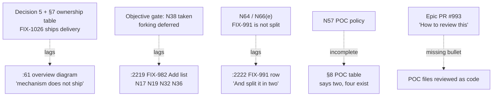

# FIX-1031: Epic FIX-939 spec — remaining stale restatements, and whether the surviving POC files stay — Implementation Spec

**Issue:** [FIX-1031](https://linear.app/fixpoint-labs/issue/FIX-1031) · **Epic:** [FIX-939](https://linear.app/fixpoint-labs/issue/FIX-939) — Durable jobs & detached-task substrate · **Epic PR:** [#993](https://github.com/fixpoint-labs/flow-state-dev/pull/993) · **Branch under edit:** `epic/durable-jobs`

---

## Part I — The Case

### 1. Problem — why it matters, why now

The epic-spec that coordinates eighteen issues tells implementers to build three things that
nobody should build: work another issue already owns, work already delivered, and work the
owner deliberately deferred. Each is a *restatement* that lagged behind a decision the
document made somewhere else and got right there. Six correction passes on 2026-08-09 fixed
the instances that could stall active work; three smaller ones remain.

**Why now.** FIX-982 is in development and is the issue all three point at. Someone scoping
its next PR reads these rows. The worst of them re-authorizes forking machinery the owner
explicitly deferred at the objective gate — roughly a milestone of work that was taken off
the table on purpose.

Alongside them sits a second, smaller irritant with the same root: two proof-of-concept test
files live on the epic branch, and every automated review of the never-merged epic PR reports
findings against them. The findings are reasonable as code review. The files are throwaway and
never ship, so the review is wasted on both sides — and it recurs on every pass.

### 2. Solution in plain terms

Apply the settled call in each of the three places, and stop the POC review noise by saying
out loud, on the epic PR, that POC files are not reviewed as code — which is what the
project's own spec-PR contract already says on every other spec PR.

Two things make this smaller than it looks. First, none of the three restatements is a
decision: the record settles all three, including the one the issue flagged as needing a
judgment call. Second, the POC question already has a policy — finding N57 decided it, and
explicitly rejected the "move them out of the test glob" option. What N57 could not have
foreseen is that its instruction ("delete them in the same PR that promotes them") is not
executable, because the files exist only on a branch that never merges.

**Philosophy** — tenet 2 (composition over features): the POC noise is fixed by the review
contract that already exists for exactly this, not by a new convention beside it. Tenet 3
(earn every addition): the change is almost entirely subtraction — four finding ids, one
self-contradicting clause, one obsolete note.

### 3. Tradeoffs & alternatives

**Alternative: retire both POC files the way three siblings were retired on 2026-08-09.**
Rejected on measurement. Those three were deleted because FIX-1009's listing-default change
had *broken* them — every failure was an empty result. These two still pass: 5/5 and 11/11,
run on this branch (§7). Deleting live evidence is a different act from deleting rot, and one
of the two is the only runnable characterization of a shipped data-loss path.

**The simpler approach: just fix the three lines and leave the POCs alone.** Tempting, and it
is most of the value. Insufficient because the review noise is the part that recurs — the
three lines get fixed once, the POC findings come back on every review pass, and each one costs
a triage decision by whoever is holding the epic.

**Where the complexity is:** not the edits. It is that fixing a restatement is exactly the
operation that has generated this defect eleven times in this document. Removing four finding
ids from a list while leaving the sentence that counts them is the same bug in a new place. §9
is mostly about that.

### 4. Focus practices (1–5)

1. **BP-039 (lead with the problem, fold the derivation)** — the surfaces being corrected are
   the ones a coordinator reads *first*: a diagram, a scope table, an index. N71(c) is on record
   that a correction reaches those last.
2. **One convergence point (tenet 5)** — a decision has one owning section; every other mention
   is a restatement. Each edit here removes a restatement rather than adding a second correct
   copy beside it.
3. **BP-003 (verification evidence)** — the POC disposition rests on whether the files still
   run. Measured, not assumed (§7).

### 5. What using it looks like

Skipped — no framework surface changes. The deliverable is edits to an internal coordination
document and one PR description.

### 6. Decisions & rules — the sign-off surface

1. **All three restatements are edits, not decisions — apply the call already on record.**
   This includes FIX-991, which the issue flagged as needing a judgment call on live scope: N64
   records it as *not split*, N66(e) records the surviving split clause as a defect, and the
   running index already carries it as one issue after FIX-982. The row contradicts itself, and
   the settled half is the one that stays.
   *Rejected:* re-opening any of the three.
   *Locks in:* nothing new — it spends the decisions the owner already made, and closes the
   window in which someone builds against the stale half.

2. **The POC files stay on the branch, and stop drawing review through the epic PR's reviewer
   contract.**
   *Rejected:* deleting them now (destroys live evidence — §3), and moving them out of the
   collected test paths (N57 rejects it by name: an unrun POC rots silently and then misleads).
   *Locks in:* the epic PR's contract becomes the place POC scope is declared, matching what
   `spec-template.md` already mandates for every spec PR. The cost is that the files keep
   running in CI until their owning issues promote them.

3. **N57's promote-then-delete stands, but "in the same PR" becomes two steps.**
   The files exist only on `epic/durable-jobs`; the promotion PRs branch off `main`, so a
   promotion PR has nothing to delete. Deletion becomes a commit on the epic branch when the
   promoting PR merges.
   *Rejected:* the literal same-PR instruction, which cannot be executed.
   *Locks in:* the epic branch carries one deletion commit per promotion, and the obligation
   stays visible in §8 of the epic-spec rather than depending on someone noticing.

4. **Narrow N57's recorded claim for `__poc-workstream-schema` rather than strengthening the
   throwaway test.**
   The recorded claim is that a same-key/different-shape collision is silent *at declaration, at
   `tsc`, and at write time*. The test asserts only the first. The other two are printed and
   never checked.
   *Rejected:* editing the POC to assert all three — it is throwaway, and the promoted
   regression test needs that assertion anyway.
   *Locks in:* the strong assertion gets written once, in FIX-982's promoted test.

5. **Recompute the finding count in the same edit that shortens the list it counts.**
   *Rejected:* editing the list alone.
   *Locks in:* nothing — but skipping it manufactures the next instance of the defect class
   this issue exists to close, in the row being corrected.

6. **§8's POC inventory is in scope, though the issue did not name it.** It states that two POCs
   live in the tree. Four do — the two the issue is about are absent from the table entirely.
   *Rejected:* holding to the issue's list.
   *Locks in:* the disposition in decisions 2–4 is recorded against a complete inventory
   instead of one that omits both of its subjects.

7. **Refreshing the running index is out of scope.** FIX-999 and FIX-1026 have moved to *In
   Review* since the index's 2026-08-09 verification.
   *Rejected:* folding a freshness sweep in.
   *Locks in:* this issue closes a defect class. Index freshness is a recurring job with no
   endpoint, and mixing them makes neither reviewable.

**Non-goals** — re-opening any epic decision; applying the proposed re-scopes to Linear (that
table is the owner's to approve); promoting either POC into a real regression test (that is
FIX-998's and FIX-982's, per N57).

**Size:** Small (one document, one PR description, ~40 lines changed).

---

## Part II — The Build Plan

### 7. Technical design

Four surfaces on `epic/durable-jobs`, plus the epic PR description. Nothing in any package
changes.



**The measurement behind decisions 2–4.** Both surviving POCs were checked out from
`epic/durable-jobs` and run on this branch:

| POC | Result |
|---|---|
| `packages/core/test/__poc-workstream-schema.test.ts` | **5/5 pass.** `[s4]` prints `router declaration=ok · workerD (declares shared:number) read "a-string" typeof=string` — the runtime half of N57's claim is true and observable, but the only assertion is `expect(declared).toBe("ok")` |
| `packages/tools/test/__poc-workspace-concurrency.test.ts` | **11/11 pass.** Q1a/Q1b are `it.fails` asserting desired behaviour; Q3/Q4/Q5 assert the proposed base-aware mechanism |

Neither has rotted. Contrast the three retired on 2026-08-09, whose every failure was an empty
result from FIX-1009's listing default. Commands:

```
cd packages/core  && npx vitest run test/__poc-workstream-schema.test.ts
cd packages/tools && npx vitest run test/__poc-workspace-concurrency.test.ts
```

**The exemption already exists.** `docs/contributing/spec-template.md` → "How to review this"
carries a bullet reading *"Any POC files on this branch, entirely… Read it to judge whether the
shape holds; do not review it as code."* The epic PR's contract block has three out-of-scope
bullets and this is not one of them — it predates that template change. The fix is to bring the
block into line, not to invent a convention.

### 8. Implementation sequence

All steps are on `epic/durable-jobs`, except 6 which edits the PR description and 7 which
mirrors to Linear.

1. **`:61` — the overview diagram.** The `interrupt` arrow's note says the mechanism does not
   ship. Replace with the ownership split Decision 5 and the §7 table already state: FIX-1026
   delivers cross-process interrupt, FIX-999 supplies the verb, FIX-982 requests it.
   *Test:* the diagram no longer contradicts Decision 5's `OWNERSHIP MOVED` block. *Depends on:*
   nothing.
2. **`:2219` — the FIX-982 `Add` list.** Remove `N17`, `N19`, `N32`, `N36` per decision 1. The
   row's own later sentence already records them as gone; the list is the lagging copy. Leave
   `N18` in place — the sentence immediately above the list disclaims it as consumption, which
   is a correct and deliberate pairing. *Test:* no finding id appears in the list that the same
   row later removes. *Depends on:* nothing.
3. **`:2219` — the count and the tally that follows it.** Recompute the "Fifty-two findings"
   clause against the shortened list per decision 5. Two clauses in the same sentence break with
   it: **"two security boundaries"** names N6 *and* N17's caller-writable fork cursor, and N17 is
   leaving — it becomes one; and **"one unbudgeted store cost (N36's N+1 cursor read)"** drops
   entirely, since N36 is leaving too. *Test:* every finding id named in the tally still appears
   in the list above it. *Depends on:* 2.
4. **`:2222` — the FIX-991 row.** Delete the `And split it in two:` sentence and the
   result-read-half sequencing it introduces. Reconcile the residue it leaves behind: the
   trailing `Carry N24 as a precondition of the accessor half` should read as a precondition of
   the issue, since there is no other half. *Test:* the row states one scope, once.
   *Depends on:* nothing.
5. **§8 — the POC inventory** (decision 6). Correct "Two POCs still live in the tree" to four,
   and add rows for `packages/core/test/__poc-workstream-schema.test.ts` and
   `packages/tools/test/__poc-workspace-concurrency.test.ts` with the §7 measurements and their
   owning issues (FIX-982 and FIX-998). Record decision 3's two-step deletion here, so the
   obligation is where a reader of the table will meet it. *Depends on:* nothing.
6. **N57 in `durable-jobs-findings.md`** (decision 4). Narrow the recorded claim for
   `__poc-workstream-schema` to what S4 asserts — silence at declaration — and note that the
   `tsc` and write-time halves are printed but unasserted, so the promoted regression test owes
   all three. Do **not** edit the POC. *Depends on:* nothing.
7. **Epic PR #993 description.** Add the POC bullet from `spec-template.md` → "How to review
   this" to the collapsed contract block's out-of-scope list, verbatim. *Test:* the block's
   out-of-scope list matches the template's. *Depends on:* nothing.
8. **Mirror to Linear.** The epic-spec's durable copy is FIX-939's attached document; every edit
   above lands there in the same change set. *Depends on:* 1–6.

**No PR plan** — Small, one PR.

### 9. Edge cases & error handling

| Case | Expected |
|---|---|
| Removing four ids changes the count sentence | Recomputed in the same edit (decision 5). This is the failure mode the issue exists to close |
| `N18` looks like it should leave the list too | It stays. The sentence above the list disclaims it as consumption, and that pairing is deliberate |
| The tally sentence names ids that are leaving | N17 is one of the "two security boundaries" and N36 is the whole "one unbudgeted store cost" clause. Both must move with the list (step 3) |
| The FIX-991 row is in a table headed "awaiting the owner's approval, not applied" | Correct and unchanged. Making the proposal coherent is not applying it (§6 non-goals) |
| `__poc-workstream-schema.test-d.ts` and `__poc-tsconfig.json` run nowhere | Out of scope here. N57 already records it, and deleting them belongs to FIX-982's promotion (decision 3) |
| The POC files fail CI later | They pass today (§7). If a future default rots them, that is the retirement trigger the three siblings met |

**Taxonomy:** every case is a documentation defect. None is retryable or fatal in the runtime
sense; the failure mode throughout is a reader acting on the stale half.

### 10. Testing strategy

**No goal check applies** — the deliverable is edits to an internal coordination document and a
PR description. No package, flow, or public surface changes.

**Verification** (BP-003), in place of CI specs:

- Both POC suites still pass, unchanged, after the edits — they are not touched by any step, so
  this is a regression check on the change, not on them. Commands in §7.
- No surface in `durable-jobs.md` still asserts a claim any step removed: search the document
  for `N17`, `N19`, `N32`, `N36` and confirm each remaining mention is the row *recording their
  departure*, not one assigning them; search for `split it in two`; search for the interrupt
  note near the §1 diagram.
- The §8 POC table's file list matches
  `git ls-tree -r --name-only epic/durable-jobs -- packages | grep -E "poc|spike"`.
- The epic PR's contract block's out-of-scope list matches `spec-template.md`'s.

**Discipline:** neither `tdd` nor `diagnose` — there is no code. The reviewing discipline is the
epic-spec's own: each edit cites the decision that settles it, and adds no new claim.

### 11. Documentation plan

**No `apps/docs` changes.** Everything edited is internal — `docs/specs/_epics/` is a process
artifact, not published documentation, and nothing user-facing changes. No package README
changes: no public API moves.

**No changeset** (BP-022) — the change is internal-only and does not reach `main`. The epic
branch is never merged.

### 12. Dependencies, open questions & follow-ups

**Dependencies:** none. Every decision this issue applies is already on record; no issue must
land first.

**Open questions:** none. The one question the Linear issue framed as open — whether the POC
files stay — is answered by decision 2, and the fork is put to the owner in full in the spec PR
description rather than left here as an unpriced menu.

**Follow-ups (flagged, not built):**

- **The running index has drifted again** — FIX-999 and FIX-1026 are *In Review*, recorded as
  *In Development* (decision 7). Not this issue's; worth a standing refresh at the next wake.
- **FIX-991's own Linear description is stale** — it still reasons about overlap with FIX-984
  (M5), which OQ-C dissolved. The epic-spec is being corrected here; the issue text is a
  different surface and belongs to whoever re-scopes FIX-991.
- **N57's obligation has no owner check.** It fires "when FIX-981 and FIX-982 begin
  implementation." FIX-981 is Done and the three POCs in its orbit were *deleted* rather than
  promoted, with findings kept as text. That may have been right, but nothing recorded the
  choice as discharging the obligation. Worth naming a discharge condition when FIX-982
  promotes.
- **`packages/core`'s two pre-existing `.test-d.ts` files are checked by nothing.** N57 notes it;
  it predates this epic and is nobody's here.

### 13. Review notes for the implementer

*(none yet — this spec has not been reviewed)*

---

## Spec evolution

- **Spec drafted** — framed as three settled-call restatements plus a POC disposition; found
  the third ("needs a judgment call") already settled by N64/N66, found a fourth stale surface
  in §8's POC inventory, and measured both surviving POCs as passing, which turns the POC
  question from retire-or-keep into keep-and-declare through the reviewer contract that already
  exists in `spec-template.md`.
