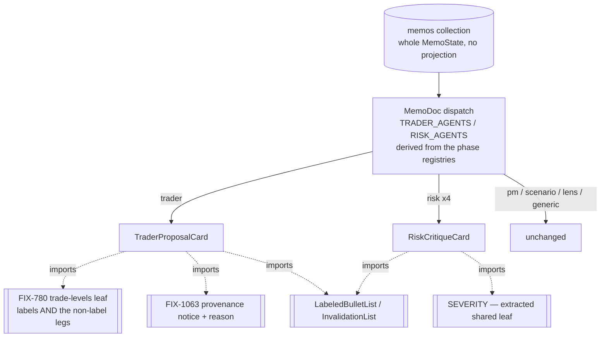

# FIX-1061: Trading-desk: the trader and risk memos have no dedicated renderer — Implementation Spec

**Linear:** [FIX-1061](https://linear.app/fixpoint-labs/issue/FIX-1061/trading-desk-trader-and-risk-persona-memos-have-no-dedicated-renderer) · **Epic:** [FIX-1067](https://github.com/fixpoint-labs/flow-state-dev/pull/1160) · **Branch:** `spec/FIX-1061`

## Part I — The Case *(for the human)*

### 1. Problem — why it matters, why now

Open a finished report on the Theses tab and click through the participants. The portfolio
manager gets a hero panel. The scenario forecaster gets a scenario panel. Each of the four
investor lenses gets its own card. Click the **trader** — the participant who proposed the
actual trade — and you get a headline, a five-cell grid of strings, and prose. Click any of
the three **risk officers**, or the consolidated **risk assessment**, and you get the same.

The desk stored more than that. The trader committed a stop, a target, a size, a holding
period, and a list of conditions that would kill the trade. Each risk persona committed the
risks it raised with severities, the adjustments it wants, and the risks it explicitly
dismissed with reasons. All of it reaches the browser already — the memos collection ships
whole memo state with no projection. It is then not drawn. What the reader sees instead is
whatever the generator happened to echo into free-text prose.

**Why now.** These two are the report's decision-critical middle: the trade proposal is the
thing being decided about, and the risk debate is the desk's own argument against it. Sitting
between the lens cards and the PM hero, they are the thinnest panels on the page, which reads
as the desk having thought least about exactly the parts it thought hardest about. That is
the epic's acceptance question — *does the report faithfully represent the analysis that
actually ran?* — and this is one of its clearest failures.

**What this does not change, said plainly.** This changes **what a reader sees on the Theses
tab**. It does not change the trade, the critiques, the severities, the gates, the sizing, or
any number the desk computed. No prompt, no schema, no commit handler, no stored field moves.
A run before and after this change produces byte-identical stored state.

### 2. Solution in plain terms

Two dedicated renderers, matching the ones the PM, the forecaster, and the lenses already
have.

**The trader memo** shows its proposal as a trade: direction and size, the price levels under
whatever names the run's own stance earned them, the holding period, what would invalidate
the trade, and what it depends on — then the written memo underneath.

**The risk memos** show each persona's critique as a critique: its posture, the risks it
raised with severities, the adjustments it wants on size / holding period / invalidation, and
— for the neutral persona — the risks it deliberately dismissed and why. The consolidated
assessment shows the same structure plus its confidence-calibration verdict.

Both stay honest about absence in the same direction as the rest of this surface: a field the
run did not publish contributes nothing, and a section with nothing in it renders nothing. An
empty dismissed-risks list is missing signal, not a desk that dismissed nothing.

**Price levels are not this renderer's to name.** [FIX-780](https://github.com/fixpoint-labs/flow-state-dev/pull/1190)
establishes one labeling rule for what a stored level is called, and this renderer reads it.
A legacy report discloses through the one marker [FIX-1063](https://github.com/fixpoint-labs/flow-state-dev/pull/1236)
already builds, carrying FIX-780's reason — not a second banner of its own. If that marker does
not survive its own review, the ambiguous levels are **hidden, not shown unexplained**. And
because a report saved before FIX-780 keeps the old level names in its stored display fields,
the trader card drops those too — otherwise reopening an old report shows the retired stop and
target sitting beside the new monitoring levels, which is the confusion this all exists to end.

**Philosophy** — tenet 1 (coherence): a report that renders a computed field on one surface
and drops it on another says two things about the same run. Tenet 5 (one convergence point):
the level names come from FIX-780's rule and the pre-fix disclosure from FIX-1063's marker;
this issue introduces neither vocabulary. Tenet 3 (earn every addition): no new stored field,
no new resource, no new transport — every value drawn is already on the client.

### 6. Decisions & rules — the sign-off surface

1. **Two dedicated renderers, routed by two registry-derived `Set`s.** `TRADER_AGENTS` and
   `RISK_AGENTS` sit beside `LENS_AGENTS` in `theses-pane.tsx`, each built from
   `PHASE_3_MEMO_KEYS` / `PHASE_4_MEMO_KEYS` the way `LENS_AGENTS` is already built from
   `LENS_IDS` + `PHASE_2B_MEMO_KEYS`. *Rejected:* one generic "structured memo" renderer
   parameterized by phase — the trader's shape (a trade) and the risk shape (a critique) have
   nothing in common but both being structured. *Also rejected, and this is the round-1
   correction:* promoting the dispatch to an exported `rendererForAgent(agent)` union. It was
   more mechanism than one and four registry entries earn, and `LENS_AGENTS` is the idiom this
   file already uses — conformance beats taste inside the codebase. **The property worth
   protecting survives the trim:** the routing is still *derived*, never hand-maintained, so a
   participant added to a phase registry is routed by construction rather than by somebody
   remembering. *Locks in:* one routing idiom in this file, not two.

2. **This renderer holds no level-label vocabulary.** It reads FIX-780's shared rule —
   [decision 2 of that spec](https://github.com/fixpoint-labs/flow-state-dev/pull/1190),
   approved at `c02a7559`, which establishes one rule for what a stored level is called and
   extends the guarantee to *"surfaces nobody has built yet, which matters because FIX-1061 is
   about to build one."* This is that surface. The clause quoted is the one that binds this
   issue; **which other surfaces FIX-780 converts is that spec's business and is not restated
   here**, since it is still open and that list can still move. *Rejected:* reading `stopPrice` / `targetPrice` and labeling them here, even "temporarily"
   until FIX-780 lands — that is the fourth spelling FIX-780 exists to prevent, and a
   temporary one is indistinguishable from a permanent one once it is merged. *Locks in:* the
   trader renderer cannot show a stop on a flat run, by construction rather than by care.

   **Round-2 correction — it must not *pass through* a stored level label either.** Holding no
   vocabulary is not the same as drawing none. The trader memo's stored `metrics` bag is a
   free-form `Record<string, string>` the generator wrote, and on any memo persisted before
   FIX-780 it still contains `stop` and `target`; handing that bag to the shared header draws
   those words on the card without this file ever spelling them. **FIX-780's schema change is
   forward-looking and stored records are not** — it stops the keys being written, it does not
   remove the ones already persisted. So the rule is the stronger one: *the card renders no
   level label it did not receive from FIX-780's rule, whatever the source* — authored, or
   inherited from a stored record. Concretely, the trader card owns its metrics row and filters
   the level-bearing keys out before rendering; the level rows come from `buildTradeLevelModel`
   alone, so levels appear exactly once on the card, under the one rule. *Rejected:* relabeling
   the stored entries through the rule — they are display strings under the model's own key
   names, not typed numbers, so re-deriving what a legacy flat run meant by "stop" is a guess,
   and guessing is what FIX-780's legacy reason exists to disclose instead. *Also rejected:* an
   allow-list of the three surviving non-level keys, which would silently drop any metric a
   later schema adds — the exact failure class this issue exists to fix. §7 has the mechanism
   and where the predicate lives.

3. **A legacy report discloses through the one existing marker, with the one existing
   reason.** FIX-1063 owns the marker component and the pre-fix flag; FIX-780 owns the
   legacy-flat reason string. This renderer contributes a call site, not a component and not a
   reason. *Rejected:* a trader-memo-specific "these levels predate the fix" note. *Locks in:*
   the EM decision recorded on the Linear issue — *"one marker, with the reason as detail"* —
   holds on the Theses surface too, and stays true when a fourth fix wants to mark a report.

   **Round-2 correction — the contingency is suppression, not silence.** The earlier draft read
   *"never a second marker"* as *"then no marker"*, and had this issue render the ambiguous
   legacy levels undisclosed if FIX-1063's shared component does not survive review. That
   inverts the honesty rule. **Two unlabeled numbers a reader cannot interpret, with nothing
   telling them why, is worse than not showing them** — it is the ambiguity FIX-780 exists to
   remove, shipped without even the disclosure that it is ambiguous. So the rule is: **a
   surviving shared marker, or suppression. Never expose-without-explanation.** If the marker
   is pulled, a record the rule reports as legacy renders **no level rows at all**, and the
   disclosure gap is filed. The rest of the card is unaffected. *Locks in:* the decision not to
   mint a second marker can never be read as licence to drop the disclosure instead — the two
   are different sentences, and round 2 is where they got confused.

4. **Absent stays absent, and empty renders nothing — by IMPORTING the existing behaviour,
   not by matching it.** A null field contributes no row; a section whose every field is
   absent does not render its heading; within a row that does render, an absent leg
   contributes no segment rather than a `—` placeholder. *Rejected:* a uniform `—` for every
   unpublished field, which fills the panel with dashes on exactly the partial runs a reader
   most needs to read quickly. **The mechanism is the decision, not a §7 detail:** "match
   `LabeledBulletList`" is how you get a fourth copy of a rule. §7 names the imports and the
   one extraction this requires. *Locks in:* the honesty rules — an empty dismissed-risks
   list is missing signal, never a dismissal that did not happen — live in exactly one place
   each, so a later fix to one is a fix to all of them.

5. **Pure helpers for the non-obvious rules; no `build…Model` ceremony.** *Rejected, and this
   is the round-1 correction:* a full `buildTraderProposalModel` / `buildRiskCritiqueModel`
   pair mirroring the lens card. The lens card earns its builder because it recovers fields by
   parsing body-section headings; these two mostly read typed fields straight off memo state,
   and a builder that copies fields one-to-one is ceremony. **The reason to keep helpers pure
   is not symmetry with the lens card — it is coverage.** §10 establishes that the JSX wiring
   is unreachable in this repo's node-env harness, so a rule that lives inside a component
   *cannot be tested at all*, while the same rule in a pure helper can. Every rule with an
   honesty consequence therefore sits in a pure helper. *Locks in:* the next reader trimming
   the helpers as ceremony loses CI coverage, and this decision is why they must not.

**Size:** Medium. One PR.

### 3. Tradeoffs & alternatives

**The simpler approach: enrich the generic renderer instead.** Teach `ThesisHeader` to draw a
richer metrics grid and let both memos keep falling through. Genuinely cheaper, and it would
improve every memo at once. Rejected because the generic renderer reads `metrics` — a
`Record<string, string>` of display strings the generator wrote — and the whole defect is that
the *typed* fields beside it are the real content. Making the string grid prettier renders the
echo more attractively and leaves the substance dropped.

**The other direction: one renderer for all four risk memos versus two.** The three personas
share `personaCritiqueOutputSchema`; the consolidated assessment does not. One component with
a branch would be smaller than two components. This spec takes one risk renderer with a
consolidated-assessment variant rather than two files, because the shapes overlap on raised
risks, adjustments, and dismissed risks — but the call is the implementer's, not a decision
here, provided both shapes render every field they carry.

**Where the complexity is:** not the drawing. It is the two contracts this renderer consumes
and must not fork — FIX-780's labeling rule and FIX-1063's marker — neither of which is on
`main` yet. §7 and §12 are mostly about that boundary.

### 4. Size and focus practices

**The whole change, in files.** It is smaller than the decision list suggests:

| File | What |
|---|---|
| `components/theses/theses-pane.tsx` | Two registry-derived `Set`s + two dispatch arms + the file-header update |
| `components/theses/trader-proposal-card.tsx` | **New** — the trader renderer + its pure helpers |
| `components/theses/risk-critique-card.tsx` | **New** — the risk renderer (personas + consolidated variant) |
| `components/summary/risk-panel.tsx` | Extract `SEVERITY` to a shared leaf and import it back (decision 4) |
| `labs/trading-desk/CLAUDE.md` | The Theses-view note (§11) |

Plus the specs in §10 and an `--empty` changeset. **Size:** Medium. One PR.

**Focus practices.** BP-035 is the one to actually walk: the second path here is the *partial*
run, and on this surface it is the normal case — FIX-1060's render-gate defect (a stored field
hidden by a condition belonging to a different participant) happened on this exact surface.
BP-010 applies to the derived state. Tenet 5 and the honesty rule are decisions 2–4 and are
not restated here.

### 5. What using it looks like

App-internal rendering. No public API, no schema, no stored field changes *in this issue* —
the trader schema change in the "before" column below is FIX-780's, and this issue waits for
it (§8 step 4). What changes here is what a reader sees, so the example is the rendered memo.

**The trader memo, before / after** (a directional run):

```
before   Trader · "Constructive entry on the pullback"
         direction  size  stop  target  conviction     ← five display strings
         <prose>

after    Trader · "Constructive entry on the pullback"
         LONG · 1.4% NAV · stop 132 · target 185 · months
         invalidated if
           · Q3 gross margin below 71%
           · the hyperscaler capex guide is cut
         depends on
           · the fundamentals memo's margin read
         <prose>
```

**A flat run** — the levels line reads whatever FIX-780's rule returns for a flat stance, and
this renderer never spells it:

```
after    FLAT · 0% NAV · reassess below 195 · invalidate above 320 · months
```

**A risk persona, before / after:**

```
before   Conservative Risk · "Size is too large for the invalidation distance"
         stance  structuralChange  scopeChange  exitDiscipline  stopMechanics  followOn
         <prose>

after    Conservative Risk · conservative · "Size is too large for the invalidation distance"
         raised
           ▲ HIGH  Invalidation sits inside one day's average range
           ● MED   The margin thesis depends on a single supplier disclosure
         wants   sizing smaller · holding period unchanged · invalidation tighter
         <prose>
```

**A persona that raised nothing and dismissed nothing** renders its header and its prose, and
no empty sections — not "raised: none".

---

## Part II — The Build Plan *(for the implementing agent)*

### 7. Technical design

Everything drawn is already on the client. The memos collection declares no projection, so
the identity default ships whole `MemoState` (verified — `resources.ts`). The work is a
dispatch change and two presentational components; there is no transport, resource, schema, or
flow edit anywhere in this issue.



**The dispatch.** Add `TRADER_AGENTS` and `RISK_AGENTS` beside `LENS_AGENTS`, each derived
from its phase registry, and two branches in `MemoDoc` beside the existing ones. That is the
whole change: no exported union, no new leaf module. The idiom is the one the file already
uses, and the derivation is what keeps the routing from being hand-maintained.

**The helpers.** Pure functions in each component module, exported and imported by `.spec.ts`
files. Keep one for every rule with an honesty consequence — which of the four adjustment axes
render, how a persona's raised/dismissed sections collapse when empty, how the trade legs
assemble. Do **not** write a field-copying `build…Model` for the fields that pass straight
through. Decision 5 has the reason: a rule inside JSX has no reachable test in this harness.

**The level line is delegated, not built — and FIX-780 has now landed it, so the symbols are
real.** `flows/analysis/lib/trade-levels.ts` on `origin/fix/FIX-780` exports
`buildTradeLevelModel(stored) → { rows: [{ kind, label, value }], predatesLabelingFix }`. The
trader card calls it and renders `row.label`. It must never map `row.kind` to a name — the
leaf's own header states that mapping `kind` to presentation (the chart picks a colour off it)
is allowed and mapping it to a *name* is the thing the rule exists to stop. The two monitoring
label constants are deliberately not exported, which is the guarantee: there is no way to
author the words in `components/theses/**`.

**Pass `direction`, not `stance`.** `StoredTradeLevels.direction` is the trader's own field.
`stance` is a *different* memo field — the Phase-2 research manager's bullish/bearish/neutral
verdict, `null` on a trader memo (verified in `resources.ts`, where the two are declared under
separate phase comments). Because the card receives whole memo state, passing `stance` compiles
and silently hands the rule a null or a wrong-semantic value: no labels, or wrong ones, with no
type error. Name `direction` explicitly at every call site.

**The metrics row is two problems wearing one name, and only one of them is a sequencing
hold.** `ThesisMetrics` renders whatever keys it is given, verbatim (`thesis-metrics.tsx:15` —
a bare `Object.entries(metrics)`, no filter). That makes the stored `metrics` bag a second
level-bearing render path beside the level line, and it fails in both time directions:

- **Forward — the unmerged schema.** On `origin/main` the trader's `metrics` object still
  carries model-written `stop` and `target` keys, so a trader card built before FIX-780 merges
  shows a stale `stop / target` grid *beside* the new reassess/invalidate rows: two
  contradictory readings of the same flat position on one card, the exact defect FIX-780 exists
  to remove, reintroduced by this issue. On `origin/fix/FIX-780` the schema drops both keys and
  derives level entries at commit instead. **Do not render the trader card's metrics row until
  that schema change is on `main`** (§8 step 4).
- **Backward — the records already written, and this is the round-2 finding.** That schema
  change is **forward-looking; stored records are not.** `memoStateSchema.metrics` is
  `z.record(z.string(), z.string()).nullable().default(null)` (`resources.ts:176`) — an
  unrestricted record, deliberately, because it is a display bag. Every memo persisted before
  FIX-780 keeps its `stop` and `target` entries forever, and reopening one is precisely what
  §10's manual step does. **So the sequencing hold is necessary and not sufficient**, and no
  amount of waiting fixes it.

**The rule, therefore:** the trader card owns its metrics row and **never hands a raw persisted
bag to `ThesisMetrics`**. It drops the level-bearing keys through a pure helper (decision 5 —
this is a rule with an honesty consequence, so it must be reachable from the node harness), and
renders levels only from `buildTradeLevelModel`.

**Where the predicate lives matters as much as the filter.** A `key === "stop" || key ===
"target"` literal in `components/theses/**` *is* level vocabulary, which decision 2 forbids —
the filter would violate the rule it enforces. The set of keys that count as levels belongs to
`flows/analysis/lib/trade-levels.ts`, which already owns the vocabulary and already derives
those very entries at commit through `tradeLevelMetricEntries`. **Import the predicate from
there; if FIX-780 exports no such symbol, add it there, not here** — a one-symbol addition to
the leaf that owns the rule, exactly the shape of the `SEVERITY` extraction in decision 4. This
keeps the guarantee whole: there is still no way to author or recognize a level name inside
`components/theses/**`.

**The non-label legs come from the same place as the labels.** Direction, size, and holding
period are formatted by `tradeLineParts`, which FIX-780 has made an **exported** function in
`components/summary/decision-header.tsx` taking `(trade, levels)`. Import it; do not
re-implement the legs. Per the EM ruling it is moving into `trade-levels.ts` alongside the
label rule — follow it there when it lands. If the labels converge and the legs are forked,
Theses and Summary still drift, just more quietly.

**The pre-fix disclosure is a call site.** Read `dataHonestyContractVersion` off session state
with `useClientData` (the pane already does this for `runComplete`), pass it through
`isPreDataHonestyFix`, and render `ReportProvenanceNotice` with the reason list — FIX-1063's
own reason when the stamp is absent, plus FIX-780's legacy-flat reason when its rule reports a
legacy record. The component takes a *list* of reasons precisely so a second reason is an entry
rather than a second banner — that property is the one this issue depends on; its exact prop
type is FIX-1063's and is pinned in the claims table, not restated here. It lives under
`components/summary/`; importing it from
`components/theses/**` is the right move — it is the app's one provenance marker, not a
Summary-local widget. If a later reader wants it moved to a shared location, that is a rename,
not a fork.

**And if the marker is not there, the levels do not render (decision 3, round 2).** The call
site and the legacy level rows are one unit, not two independent features: `buildTradeLevelModel`
already reports `predatesLabelingFix`, so the helper that assembles the level rows takes the
marker's availability as an input and returns no rows for a legacy record it cannot disclose.
That keeps the contingency a *pure-helper* rule rather than a JSX condition — testable in this
harness, per decision 5 — and makes "expose-without-explanation" unreachable by construction
rather than by the implementer remembering §12.

**The shared presentational rules are imported, and one has to be extracted first (decision
4).** Named explicitly, because "match the existing behaviour" is how this epic has produced
duplicate copies of one rule three times tonight:

| Rule | Where it lives | What this issue does |
|---|---|---|
| Empty list renders nothing | `LabeledBulletList` (exported) | Import |
| "invalidated if" + its criteria | `InvalidationList` (exported) | Import |
| Trade one-liner legs | `tradeLineParts` (exported by FIX-780) | Import; follow it into `trade-levels.ts` |
| Level names | `buildTradeLevelModel` (exported) | Import |
| **Which metric keys ARE level keys** | **`trade-levels.ts` — the leaf that owns the vocabulary** | **Import the predicate; add it *there* if FIX-780 exports none. Never a key literal here** |
| Pre-fix disclosure | `ReportProvenanceNotice` + both reason constants (exported) | Import |
| **Severity glyph + label + colour** | **`SEVERITY` in `risk-panel.tsx` — module-private (verified)** | **Extract to a shared leaf, import from both** |

The severity map is the one that cannot simply be imported. Extracting it edits
`components/summary/risk-panel.tsx`, which is FIX-1060's directory — a one-symbol move with no
behaviour change, and cheaper than the alternative, which is two glyph maps that diverge the
first time anyone restyles a severity.

**The jump-to-transcript control must be forwarded, or five memos silently lose it.** The
generic branch passes `onJumpToTranscript` into `ThesisHeader`, which renders the only
navigation affordance for a memo. Re-routing the trader and the four risk memos into new cards
deletes that control for all five unless both card contracts accept the callback and forward it
to the same header treatment. Nothing in this spec's test plan would notice: a view-model test
does not render a header, and a manual click-through confirms the new content is present rather
than that the old affordance survived. Both card prop types take it, and §10's manual step
checks for it.

**The coverage walker, and why a renderer needs one.** §10 specifies a test that walks the
three output schemas and requires every leaf to be rendered or explicitly excluded. That is
unusual for a renderer, so the reason is worth stating where the mechanism is designed rather
than only where it is tested: **the defect it prevents is the one that produced this issue.**
FIX-1061 exists because typed fields have been sitting in stored memo state that no surface
reads — a schema grew, the renderer did not, and nothing failed. That is the failure mode this
guard catches, and it is the hardest kind to notice, because nothing breaks; a reader simply
never learns something the desk computed.

**Not touched:** `aggregate.ts` and everything under `components/summary/**` except the
provenance-notice import and the severity extraction (FIX-1060's and FIX-1063's territory, per
the epic's ownership table); `mandate-panel.tsx` (FIX-1065's, per its spec §7's consumer
table); the generic `ThesisHeader` / `ThesisBody` / `ThesisMetrics` trio, which keeps serving
the analysts, the debaters, the research manager, and the thesis validator unchanged.

### 8. Implementation sequence

1. **Extract `SEVERITY` from `risk-panel.tsx`** into a shared leaf and import it back, with no
   behaviour change. *Test:* the existing risk-panel specs still pass. *Depends on:* nothing.
2. **Add `RISK_AGENTS` + the risk arm + `RiskCritiqueCard`** for the three personas and the
   consolidated assessment, forwarding `onJumpToTranscript`. *Test:* §10's risk cases,
   including the recursive coverage walker. *Depends on:* 1.
3. **Add `TRADER_AGENTS` + the trader arm + `TraderProposalCard`** — **without the metrics row
   and without the level line** (direction, size, holding period, invalidation criteria,
   depends-on, and the jump control). *Test:* §10's trader cases. *Depends on:* nothing.
4. **Once FIX-780 is on `main`: add the level line and the metrics row together**, routing
   levels through `buildTradeLevelModel`, the legs through `tradeLineParts`, and the stored
   `metrics` bag through the level-key filter (§7) before it reaches `ThesisMetrics`; add the
   provenance-notice call site, with the suppression fallback if the shared marker did not
   survive. *Test:* a flat, a directional, and a **legacy** record each render the labels the
   rule returns and no others — asserted on the **complete card**, so a stale metrics grid
   beside them fails; plus the marker-absent case rendering no level rows. *Depends on:* 3
   **and on FIX-780 having merged** (§12).
5. **Docs** — §11. *Depends on:* 4.

Steps 2 and 3 are independent. **Step 4 is the only one gated on another issue, and it carries
all three level-bearing surfaces deliberately** — the level line, the metrics bag, and the
disclosure. Splitting any of them out is what would let a half-migrated card ship the
contradiction: the filter without the merge still shows the schema's own `stop`, and the merge
without the filter still shows a legacy record's.

### 9. Edge cases & error handling

| Case | Expected |
|---|---|
| Trader memo `published`, PM has not | The trader card renders in full. It is gated on the trader's own status and nothing else — FIX-1060's render-gate defect, on this surface |
| Trader published no invalidation criteria | The invalidation section does not render. Never "nothing invalidates this trade" |
| Flat run with monitoring levels | Whatever FIX-780's rule labels them. This renderer asserts nothing about which is which |
| Legacy flat record | Unlabeled values + the ONE provenance notice carrying FIX-780's reason (decision 3) |
| Legacy flat record, **reopened after FIX-780 merged** | The stored `metrics` bag's `stop` / `target` entries are filtered out; levels appear once, from the rule. Never the obsolete grid beside the new monitoring rows — the schema change did not touch this record |
| Legacy record, **shared marker did not survive review** | **No level rows at all**, and the gap is filed. Never unlabeled numbers with nothing explaining them (decision 3, round 2). The rest of the card renders |
| Run with no levels of either pair | No levels line. The rest of the card renders |
| Persona memo `error` | Unchanged — the existing error branch owns the surface before any renderer is reached |
| Persona memo `writing` / `pending` | Unchanged — `WritingSkeleton` / `PendingDoc` |
| Persona raised `[]` risks (aggressive/conservative emit `[]` by prompt) | The raised section does not render. An empty list is the prompt's instruction, not a finding |
| `dismissedRisks: []` | Same. Never "dismissed: none" |
| Risk assessment with `confidenceCalibration: null` | The calibration line is omitted. Never defaulted to `"calibrated"` — the `RiskPanel` precedent |
| A memo whose typed fields are all null (a stopped run mid-phase) | The card degrades to header + prose, i.e. today's generic output. No empty chrome |
| A field added to any of the three output schemas later | Fails the coverage walker in §10 until it is rendered or excluded **with a reason** |
| A trader memo whose `stance` is non-null while `direction` differs | The levels follow `direction`. `stance` is the research manager's verdict and has no bearing on the trade |
| Any of the five re-routed memos, on a run with transcript items | The jump-to-transcript control renders exactly as it does today. Re-routing must not drop it |
| A trader card rendered before FIX-780 merges | No level rows **and** no metrics row — never one without the other (§8 step 4) |
| A metric key nobody anticipated (a later schema addition) | It renders. The filter drops level keys by the shared predicate; it is not an allow-list of the three known ones, so a new metric is never silently swallowed |

**Taxonomy:** every row is a display outcome. Nothing in this change can fail a run, alter a
stored value, or affect what the desk decides.

**Second path (BP-035):** the partial run is the second path and it is common — the Theses tab
is where a *streaming* run lives (the pane auto-opens Summary only when finished), so a
half-populated memo is the normal case here, not the edge.

### 10. Testing strategy

**No goal check and no fixture run applies, and the reason is specific.** Nothing about this
change reaches the flow: no generator, no commit, no resource, no session state. A `fsdev run`
would produce byte-identical stored output before and after, so a real run cannot distinguish
a working renderer from a broken one. It would also be the *wrong* evidence for a second
reason worth stating — a sibling POC on this epic found both committed fixtures are
period-symmetric, so a test that reads them can pass on broken code. These tests build their
memo objects inline and read no fixture.

**The pass condition each test has to survive:** *would it still pass if the code were broken
in the way it exists to catch?* The defect class here is **a stored field that reaches the
client and is never drawn**, and its two mechanisms are (a) the dispatcher not routing the
memo, and (b) the renderer not reading a field the schema carries. Both are addressed
directly:

- **The routing sets, asserted against the registries.** `TRADER_AGENTS` and `RISK_AGENTS` are
  asserted to equal the agent names in `PHASE_3_MEMO_KEYS` / `PHASE_4_MEMO_KEYS` exactly, and
  `LENS_AGENTS` keeps its existing coverage. A persona added to a phase registry and not routed
  fails. This is the `memo-step-coverage.spec.ts` precedent. **What it does not catch** is a
  deleted `MemoDoc` branch — the set can be correct while nothing reads it — which is why the
  residual below is stated rather than glossed.
- **Field coverage as a property, not a list — walked to the leaves.** A test walks
  `tradeProposalOutputSchema` (`flows/analysis/agents/trader/trader.ts`) and
  `personaCritiqueOutputSchema` / `riskAssessmentOutputSchema`
  (`flows/analysis/agents/risk/schemas.ts`) and asserts each leaf path is either rendered or
  excluded. **Recurse into nested objects and into array element shapes.** A top-level-only
  walk passes while `criticalRisks[].raisedBy`, `dismissedRisks[].dismissalCategory`, and
  `recommendedAdjustments.*.{rationale,attributedTo}` go undrawn — the attribution fields are
  most of what makes a critique readable, and a walker that misses them is a hand-maintained
  list wearing a walker's clothes. **Derive the paths from the schemas at test time; do not
  transcribe them.**
  - The **exclusion set stays small, and every entry carries a stated reason naming the field
    and why the report does not show it.** `label` / `headline` / `rating` / `body` /
    `citations` are excluded because the shared header and body draw them. `metrics` is
    excluded for a *different* reason now, and the reason is the point of the mechanism: on the
    risk cards the shared header draws it, but on the trader card **the card draws it itself,
    filtered** — its level-bearing keys are deliberately dropped because the level line is the
    one place levels appear (decision 2). Two exclusions of the same field name, two different
    reasons; a single unreasoned "excluded: metrics" would have hidden exactly that. An
    exclusion without a reason is how the list quietly degrades back into a hand-maintained
    one, one entry at a time — and the reason is what keeps "we decided not to show this"
    distinguishable from "nobody noticed this existed", which is the entire value of the
    mechanism.

**The behaviours (not the test names):**

- **one behaviour per decision in §6**, stated as what a reader sees
- **an absent field omits its row; an empty list renders nothing** — asserted on the raised,
  dismissed, invalidation, and depends-on lists specifically, because each is a place where a
  default would assert a judgement the desk did not make
- **the trader card authors no level label** — assert its level rows are exactly what
  `buildTradeLevelModel` returned, so a hard-coded "stop" anywhere in the component fails
- **the labeling rule is called with `direction`** — a case where the memo carries a non-null
  `stance` *and* a different `direction` fails if the wrong field is passed. Without this the
  mix-up is invisible: it type-checks, and on most memos `stance` is null so the levels merely
  vanish
- **a stored `metrics` bag carrying `stop` / `target` renders no level cells** — built as a
  memo whose `metrics` still holds the pre-FIX-780 keys (the legacy record this surface will
  actually be reopened against), asserting the filtered bag drops them and keeps every
  non-level key. This one has to be written as a *persisted-state* case, not a schema case:
  against the post-FIX-780 schema the keys cannot occur, so a test built from the schema
  passes on the broken code
- **the legacy record produces one provenance reason list, not a second notice**
- **with the marker unavailable, a legacy record yields no level rows** — the decision-3
  contingency, asserted on the helper. A version that returns unlabeled rows fails
- **what must not change:** an analyst memo, a debater memo, and the research-manager memo
  still fall through to the generic renderer; the PM, forecaster, and four lens memos still
  route to their existing renderers

**Residual, stated honestly:** the `MemoDoc` JSX that consumes the routing sets is not
reachable from a node-env suite. The *sets* are covered; the *wiring* is not, and no test in
this repo's current harness can cover it. Verify by opening a finished report in the running
app (`pnpm --filter @flow-state-dev/trading-desk dev`) and checking, for the trader and each
of the four risk entries:

1. the structured block renders (including one re-opened flat report for the legacy path);
2. **the "jump to transcript →" control is still there** — it is the affordance this
   re-routing can silently delete, and no automated test in scope would notice;
3. **on the trader card, that no `stop` / `target` metrics grid appears beside the level
   rows** — the step-4 gate, checked on the rendered card rather than on the view model. **The
   report you reopen for this must be one persisted before FIX-780**, not a fresh run: a fresh
   run's memo cannot carry the old keys, so checking it confirms nothing about the path that
   actually fails. This is the step that would have caught the round-2 defect.

**Discipline:** `tdd`. Every seam is a pure function reachable from vitest.

### 11. Documentation plan

- **EXTEND** `labs/trading-desk/components/theses/theses-pane.tsx`'s file header — its
  dispatch list (lines 4–9) enumerates the routing and will be stale the moment step 1 lands
  (BP-034: finish the provenance, not just the imports).
- **EXTEND** `labs/trading-desk/CLAUDE.md` — the guide describes the Summary view's renderers
  in detail and the Theses view's barely at all. Add a short "Theses view" note naming the
  dispatcher, the registry-derived routing, the rule that a memo renderer never authors a
  price-level label, and the list of shared presentational leaves a new memo renderer must
  import rather than reimplement (§7's table). Without it the next agent re-derives the wrong
  contract, which is exactly how the third spelling appears.
- **No `apps/docs` change.** The trading desk is a lab app; the site's outsider rule keeps
  app-internal rendering off it, and nothing published describes these memos.
- **Changeset:** `--empty` (BP-022). `@flow-state-dev/trading-desk` is `"private": true`
  (verified in its `package.json`) — no published surface changes.

### 12. Dependencies, open questions & follow-ups

**FIX-780 blocks step 4, and it blocks two surfaces on that step, not one — neither of which
the merge alone finishes.** The epic's §4
sequencing puts FIX-780 first, and its spec's decision 2 names this renderer as the surface the
guarantee has to hold for.

**This changed during round 1, and the earlier draft of this section was wrong.** It said
FIX-780 had landed no code, which was true when first checked and is not true now:
`origin/fix/FIX-780` is at `859d32219`, one commit ahead of `origin/main`, and that commit
ships the labeling leaf as real code. **The leaf's exports are enumerated once, in the claims
table, pinned to that sha — not restated here**, because FIX-780 is still open and its
inventory can still move. §7 names the two symbols this issue actually calls. It is still
**unmerged**, which is what step 4 waits on.

The two blocked surfaces:

1. **The level line** — needs the labeling rule's entry point (§7).
2. **The metrics row** — needs the schema change **and a filter, because the schema change is
   forward-looking**. FIX-780 removes the level keys from what the trader *writes*; it cannot
   reach what is already written. `memoStateSchema.metrics` is an unrestricted record, so every
   memo persisted before FIX-780 keeps its `stop` / `target` entries permanently and a reopened
   legacy report shows the obsolete grid no matter when this card ships. **Round 2's finding:
   the dependency stands, and it was never sufficient.** The mechanism, both directions, is §7;
   the code evidence for each half is in the claims table. The card must filter (decision 2).

Steps 1, 2, 3, and 5 touch neither and are unblocked today. If step 4 arrives before FIX-780
merges, hold **both** back rather than authoring a placeholder label or shipping the grid — a
card with no levels is honest; a card with two contradictory readings is the original bug.

**FIX-1063 supplies the marker, on a draft PR whose ownership is itself under review.** The
component, its reason constant, the pre-fix predicate, and the session field it reads are all
present on `fix/FIX-1063`, in **draft PR #1236** — named symbol by symbol in §7, where the call
site is wired, and evidenced in the claims table. Read that PR's *"One departure"* section
before wiring step 4's call site: the notice component was originally FIX-1063 decision 6's
work for FIX-1060, FIX-1060 merged without it, and #1236 shipped it while explicitly offering
to pull it back to flag-only if the owner disagrees. **So this spec depends on a component
that may not survive review.**

**If it is pulled, this issue suppresses the legacy levels — it does not ship them
undisclosed.** The earlier draft said the opposite, and round 2 was right to call it: it read
*"never a second marker"* as *"then no marker"*, which turns a rule about not duplicating a
disclosure into a licence to drop one. A legacy flat record's levels are two numbers whose
meaning nobody can recover; showing them with nothing saying why is strictly worse than showing
nothing, and it contradicts this spec's own §9 contract that a legacy record carries a
provenance notice. So the contingency is: **a surviving shared marker, or no level rows** — and
the disclosure gap gets filed either way. Decision 3 is about not *adding* a marker; it was
never about being willing to publish ambiguity without one.

Two markers cannot stack on one screen here in any case: the Theses and Summary tabs are
mutually exclusive in `ThesesPane` (verified — the tab branch renders one or the other, never
both), so this issue's call site and the Summary's are never simultaneously visible. That is
why the reuse is an engineering call and not an escalation; the *claim* a legacy report makes
was already settled by FIX-780 decision 3, which the owner approved.

**FIX-1065 does not collide.** Its spec's consumer table names `mandate-panel.tsx` as its only
`components/theses/**` file (verified). The Linear-recorded EM split — this issue owns the
memo renderers, FIX-1065 owns the decision panels — holds without further coordination.

**Deliberate skips, named rather than omitted:**

- **No spec POC.** The `spec-poc` triggers are an unchecked premise or a look that only
  becomes visible in code. Every premise here was checked directly in the files named in the
  claims table, and the visual direction has three in-repo precedents (`LensCard`, `PmHero`,
  `RiskPanel`) rather than being contested. A mockup would cost a session and settle nothing.
- **No test of the JSX wiring**, for the harness reason stated in §10, with the manual path
  named instead of the gap being left implicit.

**Calls made rather than escalated** (each near-zero cost either way, per BP-041's
don't-ask rule):

- One risk renderer with a consolidated-assessment variant rather than two components — the
  shapes overlap on three of four sections; the implementer may split them if the branch grows.
- The risk-assessment's calibration and recommended adjustments render on the Theses memo even
  though `RiskPanel` already shows them on the Summary tab. The PM's fields are already
  duplicated across `PmHero` and `DecisionHeader` by the same logic, the tabs are mutually
  exclusive, and a per-agent memo that omits the agent's own verdict to avoid repetition is
  the drop this epic exists to stop.
- Model-emitted severities and postures render attributed to the persona that claimed them,
  matching `RiskPanel`'s existing severity glyphs — consistent with epic decision 2, which
  bars presenting an invented input *as a measurement*, not showing a participant's own claim.

**Follow-ups (flagged, not built):** the research manager, the two debaters, and the thesis
validator also fall through to the generic renderer and carry structured fields
(`unresolvedDisagreements`, `blindSpots`, `supportingEvidence`, `contradictingEvidence`). The
issue scopes this to the trader and risk memos; the same treatment for the others is a
separate row, not a silent widening here.

---

## Claims verified in code this round

Every claim this spec makes about the codebase, and where it was read. Read at
`origin/main` = `780456064` unless a branch is named.

| Claim | File · symbol | What was read |
|---|---|---|
| Trader and risk memos fall through to the generic renderer | `components/theses/theses-pane.tsx` · `MemoDoc` | Dispatch branches on `scenarioForecaster`, `portfolioManager`, and `LENS_AGENTS`; every other agent returns `ThesisHeader` + `ThesisBody` |
| The routing set precedent is registry-derived | `theses-pane.tsx` · `LENS_AGENTS` | `new Set(LENS_IDS.map((id) => PHASE_2B_MEMO_KEYS[id].agentName))` |
| Whole memo state reaches the client — the fields are already there | `flows/analysis/resources.ts` · `memosCollection` | `client: { state: { read: true }, live: true }`, no projection; the comment states the identity default ships every field |
| The trader's typed fields exist on memo state | `resources.ts` · `memoStateSchema` | `direction`, `sizePct`, `stopPrice`, `targetPrice`, `holdingPeriod`, `invalidationCriteria`, `dependsOn`, all `.nullable().default(null)` |
| The risk fields exist on memo state | `resources.ts` · `memoStateSchema` | `posture`, `raisedRisks`, `proposedAdjustments`, `dismissedRisks`, `criticalRisks`, `recommendedAdjustments`, `confidenceCalibration`, `calibrationRationale` |
| The trader's output schema is the field list to cover | `flows/analysis/agents/trader/trader.ts` · `tradeProposalOutputSchema` | Declares `stopPrice` / `targetPrice` as `z.number().positive()` (non-nullable today — FIX-780 changes this) |
| The risk output schemas are the field lists to cover | `flows/analysis/agents/risk/schemas.ts` · `personaCritiqueOutputSchema`, `riskAssessmentOutputSchema` | Personas share one schema; `adjustmentShape` carries direction enums only, no rationale — rationale exists only on the consolidated `recommendedAdjustments` |
| Aggressive/conservative emit `dismissedRisks: []` by prompt | `agents/risk/schemas.ts` header comment | "aggressive and conservative emit `[]` per their prompts; neutral populates it" |
| The four risk agents and the trader are in the registry | `flows/analysis/registry.ts` · `PHASE_3_MEMO_KEYS`, `PHASE_4_MEMO_KEYS` | `trader`; `aggressive` / `conservative` / `neutral` / `riskAssessment` |
| The pure-view-model + node-spec pattern is established | `components/theses/lens-card.tsx` · `buildLensCardModel`; `test/lens-card.spec.ts` | A `.spec.ts` imports the builder from a `.tsx` and tests it without rendering |
| The suite is node-env, `.spec.ts` only — no JSX rendering | `labs/trading-desk/vitest.config.ts` | `include: ["test/**/*.spec.ts"]`, `environment: "node"` |
| The registry-coverage guard precedent exists | `test/memo-step-coverage.spec.ts` | Asserts placed keys equal `ALL_MEMO_KEYS` exactly |
| Empty lists already render nothing on this surface | `components/summary/invalidation-list.tsx`, `labeled-bullet-list.tsx` | `InvalidationList` delegates to `LabeledBulletList`; header comment states an empty list is missing signal |
| An absent leg contributes no segment (not `—`) | `components/summary/decision-header.tsx` · `tradeLineParts` | Each leg is pushed only when non-null; comment says an unpublished leg contributes no segment |
| `stop` / `target` are hard-coded on the Summary today | `decision-header.tsx` · `tradeLineParts` | `parts.push(\`stop ${trade.stopPrice}\`)` / `` `target ${...}` `` — one of the sites FIX-780 removes |
| Calibration is never defaulted | `components/summary/risk-panel.tsx` | Renders the calibration line only when non-null; header comment states defaulting to "calibrated" would assert a review nobody performed |
| FIX-780 spec is approved at the stated commit | GitHub PR #1190 | `spec approved` label present; `spec/FIX-780.md` read at `c02a75590b65d2ad972f21ada32df62b35ee150a`; §6 quotes only the clause that binds this issue (round 2 — the rest of decision 2 is FIX-780's and can still move) |
| ~~FIX-780 has landed no code~~ **— CORRECTED in round 1** | `git rev-parse origin/fix/FIX-780 origin/main` | Was true at drafting (both `780456064`); **now false.** `origin/fix/FIX-780` is `859d32219`, one commit ahead. The round-1 claim is struck rather than deleted so the correction is visible |
| FIX-780's labeling leaf exists, with these exports | `origin/fix/FIX-780` @ `859d32219` · `flows/analysis/lib/trade-levels.ts` | `buildTradeLevelModel` → `{ rows: [{kind,label,value}], predatesLabelingFix }`; `levelsForStance`; `tradeLevelMetricEntries`; `LEGACY_LEVELS_CAPTION`; `PRE_FLAT_STANCE_LABELING_FIX_REASON`. The two monitoring label strings are **deliberately not exported** |
| The trader `metrics` shape differs across the two trees | `flows/analysis/agents/trader/trader.ts` on `origin/main` vs `origin/fix/FIX-780` | `{ direction, size, stop, target, conviction }` → `{ direction, size, conviction }`; the FIX-780 comment says level keys are level names and are derived at commit |
| `ThesisMetrics` renders whatever keys it is handed | `components/theses/thesis-metrics.tsx:15` | `Object.entries(metrics).map(...)` — no key filter, so a stale `stop` key renders |
| **A persisted memo's `metrics` is an unrestricted record — the schema change cannot reach it** | `flows/analysis/resources.ts:176` · `memoStateSchema` | `metrics: z.record(z.string(), z.string()).nullable().default(null)`. No key constraint, by design (it is a display bag), so `stop` / `target` written before FIX-780 persist regardless of what `tradeProposalOutputSchema` declares afterwards. **This is the round-2 P1** |
| `tradeLineParts` is exported and takes the level model | `origin/fix/FIX-780` · `components/summary/decision-header.tsx` | `export function tradeLineParts(trade, levels)`; still in `decision-header.tsx`, not yet moved to `trade-levels.ts` |
| `stance` and `direction` are different fields; `stance` is null on a trader memo | `flows/analysis/resources.ts` · `memoStateSchema` | `stance` is declared under "Phase 2 InvestmentThesis extension … Only the research-manager memo populates these"; `direction` under "Phase 3 TradeProposal extension" |
| `SEVERITY` and `ADJUSTMENT_AXES` are module-private | `components/summary/risk-panel.tsx` | `const SEVERITY` / `const ADJUSTMENT_AXES` — no `export`, unlike `shownRationale` and `RiskPanel` beside them |
| The generic branch is what renders the jump control | `components/theses/theses-pane.tsx`, `thesis-header.tsx` | `MemoDoc` passes `onJumpToTranscript` to `ThesisHeader`, which renders the only "jump to transcript →" control |
| FIX-1063's marker exists and takes a reason list | `fix/FIX-1063` @ `9707ba6d6` · `components/summary/report-provenance-notice.tsx` | `ReportProvenanceNotice({ reasons })` renders null on an empty list; exports `PRE_DATA_HONESTY_FIX_REASON`; header states "ONE MARKER, NOT SEVERAL … a new reason is one entry in the caller's list, not a second banner" |
| **The marker is unmerged and its ownership is open** | GitHub PR #1236 (draft) | The description's "One departure" section: decision 6 assigned the notice to FIX-1060, FIX-1060 merged without it, #1236 shipped it here and offers to revert to flag-only |
| The pre-fix flag is readable from the client | `fix/FIX-1063` · `flows/analysis/state.ts`, `flow.ts`, `data-honesty-contract.ts` | `dataHonestyContractVersion` on session state, present in the flow's `client.expose` allow-list, read through `isPreDataHonestyFix` |
| The Theses and Summary tabs are mutually exclusive | `theses-pane.tsx` | `tab === "summary" ? <ReportSummary/> : … <MemoDoc/>` — one or the other, never both |
| The pane already reads session state client-side | `theses-pane.tsx` | `useClientData(session, { session: ["runComplete"] })` |
| FIX-1065 touches only `mandate-panel.tsx` under `components/theses/**` | `origin/spec/FIX-1065` · `spec/FIX-1065.md` §7 consumer table | Row 12 is `mandate-panel.tsx`; no other `components/theses/` entry |
| The package is private (changeset is `--empty`) | `labs/trading-desk/package.json` | `"private": true` |

---

## 13. Implementer notes

Recorded verbatim in intent, not folded into the design above — things to carry into the code.

- **A change that only re-routes rendering can still delete an affordance.** The jump control
  lives in the component being *replaced*, so a test suite written around the new components
  cannot notice its absence, and a manual check confirms the new content is present rather than
  that the old thing survived. Whenever a memo moves from one renderer to another, enumerate
  what the outgoing renderer provided, not just what the incoming one must provide.
- **The coverage walker had, nested inside it, the very blind spot it exists to close.** As
  first specified it checked top-level keys only, so it would have passed while
  `criticalRisks[].raisedBy` and `recommendedAdjustments.*.attributedTo` went undrawn — a
  completeness mechanism that was itself incomplete one level down. Worth remembering when
  writing any "walk the schema" guard: the walk has to reach where the fields actually are.
- **Two of round 1's findings were about a mechanism being over-built, and two about it being
  under-built, on the same spec.** The dispatch union and the `build…Model` pair were ceremony;
  the walker's recursion and the metrics-row hold were missing guards. "Is this the right
  amount of mechanism" is not a single dial.
- **A schema change is forward-looking; the records already written are not** (BP-030, and the
  round-2 P1). Round 1 closed the metrics-grid hole by waiting for FIX-780's schema to drop the
  `stop` / `target` keys — correct, and it only covers memos written afterwards. The stored
  field it feeds is an unrestricted record, so every legacy memo keeps those keys forever.
  Whenever a fix is "the producer stops writing X", ask separately what happens to the X
  already persisted, and check whether the consumer filters or just trusts the new shape.
- **A guard can violate the rule it enforces.** Filtering level keys out of the metrics bag
  requires knowing which keys are levels — and a `"stop"` literal in the renderer is exactly
  the level vocabulary decision 2 bans. The predicate has to live with the rule, not with the
  filter. Worth checking on any "reject the bad values" guard: does recognizing them re-create
  the thing you were trying not to own?

## Spec evolution

- **Spec drafted** — framed as a rendering-only change and held there deliberately: the
  signal/outcome line is that this alters what a reader sees, never what the desk decides.
  Delegated both the level vocabulary (FIX-780 decision 2) and the pre-fix disclosure
  (FIX-1063's one marker) rather than restating either. Stated the CI residual — the JSX wiring
  is unreachable in a node-env suite — instead of implying coverage the harness cannot give.
- **Round 1 (Cursor + Codex, folded together).** Mechanism trimmed where it exceeded what the
  codebase's own idioms earn: the exported `rendererForAgent` union became two registry-derived
  `Set`s beside `LENS_AGENTS`, and the `build…Model` pair became pure helpers for the rules
  with honesty consequences only — with the *reason* restated as coverage rather than symmetry,
  since decision 5 is the only thing stopping a later reader trimming them. Mechanism
  **added** where it was missing: shared rules are now *imported* and one (`SEVERITY`)
  *extracted*, because "match the existing behaviour" is what produced duplicate copies of one
  rule three times across this epic tonight; the coverage walker recurses to leaf paths and
  every exclusion carries a reason; the jump-to-transcript callback is required in both card
  contracts. The **schema-walker was kept over a reviewer's objection** — see the note in §7:
  the regression class it guards is the one that produced this issue. Two corrections of fact:
  FIX-780 has now landed its labeling leaf (the claims table's struck row), and the trader's
  `metrics` row is a second FIX-780-gated surface that the earlier step-3 hold did not cover.
- **Round 2 (Codex — two P1s, both folded; both were the *second half* of a round-1 fix).**
  Round 1 closed the metrics grid by waiting for FIX-780's schema change; round 2 showed that
  is necessary and not sufficient, because `memoStateSchema.metrics` is an unrestricted record
  and a memo persisted before the fix keeps `stop` / `target` forever — so the card must
  **filter** the stored bag, with the level-key predicate imported from FIX-780's leaf rather
  than spelled here (a literal would be the very vocabulary decision 2 bans). Round 1 also
  ruled "never a second marker" for the legacy disclosure; the contingency branch read that as
  "then no marker" and shipped ambiguous levels undisclosed. Corrected to **a surviving shared
  marker, or suppression — never expose-without-explanation**, with the fallback expressed as a
  pure-helper rule so it cannot be forgotten in JSX. Both corrections tightened an existing
  decision rather than adding one; §6 still holds five.
- **Round 2 also ran a restatement pass on the two in-flight boundaries**, before this document
  is big enough for it to hurt. A sibling spec in this epic restated one decision's parameters
  in six places and spent four rounds cleaning up after two decision changes — the per-copy
  staleness rate is constant, so size prices the defect rather than causing it, and a superseded
  rule reads as perfectly sensible in isolation. FIX-780 and FIX-1063 are both still open, so
  five places that re-encoded *their* parameters now name the rule and point at its owner:
  FIX-780's export inventory and its list of converted surfaces, the dual `metrics` shapes, the
  marker's prop type, and FIX-1063's wiring inventory. **The standing rule for later rounds:
  restate a number only where the number is the point** — a worked example, a pass condition, a
  value a test asserts. Everything an implementer merely needs to *find* gets a reference. The
  claims table is the deliberate exception: it is the evidence ledger, every row pinned to a
  file, symbol, and sha, and it is where the enumerations now live exactly once.
