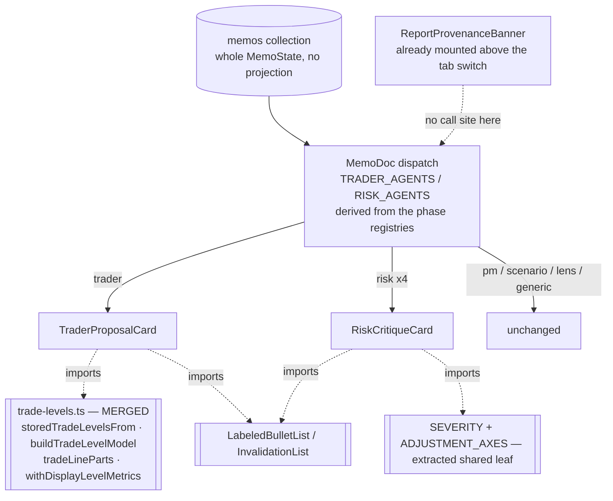

# FIX-1061: Trading-desk: the trader and risk memos have no dedicated renderer — Implementation Spec

**Linear:** [FIX-1061](https://linear.app/fixpoint-labs/issue/FIX-1061/trading-desk-trader-and-risk-persona-memos-have-no-dedicated-renderer) · **Epic:** [FIX-1067](https://github.com/fixpoint-labs/flow-state-dev/pull/1160) · **Branch:** `spec/FIX-1061`

## Part I — The Case *(for the human)*

### 1. Problem — why it matters, why now

Open a finished report on the Theses tab and click through the participants. The portfolio
manager gets a hero panel. The scenario forecaster gets a scenario panel. Each of the four
investor lenses gets its own card. Click the **trader** — the participant who proposed the
actual trade — and you get a headline, a five-cell grid of strings, and prose. Click any of
the three **risk officers**, or the consolidated **risk assessment**, and you get the same.

The desk stored more than that. The trader committed a stop, a target, a size, a holding
period, and a list of conditions that would kill the trade. Each risk persona committed the
risks it raised with severities, the adjustments it wants, and the risks it explicitly
dismissed with reasons. All of it reaches the browser already — the memos collection ships
whole memo state with no projection. It is then not drawn. What the reader sees instead is
whatever the generator happened to echo into free-text prose.

**Why now.** These two are the report's decision-critical middle: the trade proposal is the
thing being decided about, and the risk debate is the desk's own argument against it. Sitting
between the lens cards and the PM hero, they are the thinnest panels on the page, which reads
as the desk having thought least about exactly the parts it thought hardest about. That is
the epic's acceptance question — *does the report faithfully represent the analysis that
actually ran?* — and this is one of its clearest failures.

**What this does not change, said plainly.** This changes **what a reader sees on the Theses
tab**. It does not change the trade, the critiques, the severities, the gates, the sizing, or
any number the desk computed. No prompt, no schema, no commit handler, no stored field moves.
A run before and after this change produces byte-identical stored state.

### 2. Solution in plain terms

Two dedicated renderers, matching the ones the PM, the forecaster, and the lenses already
have.

**The trader memo** shows its proposal as a trade: direction and size, the price levels under
whatever names the run's own stance earned them, the holding period, what would invalidate
the trade, and what it depends on — then the written memo underneath.

**The risk memos** show each persona's critique as a critique: its posture, the risks it
raised with severities, the adjustments it wants on size / holding period / invalidation, and
— for the neutral persona — the risks it deliberately dismissed and why. The consolidated
assessment shows the same structure plus its confidence-calibration verdict.

Both stay honest about absence in the same direction as the rest of this surface: a field the
run did not publish contributes nothing, and a section with nothing in it renders nothing. An
empty dismissed-risks list is missing signal, not a desk that dismissed nothing.

**Price levels are not this renderer's to name.** [FIX-780](https://github.com/fixpoint-labs/flow-state-dev/pull/1238)
**has merged**; it establishes one labeling rule for what a stored level is called, and this
renderer reads it rather than spelling a label itself. A report saved before that fix keeps the
old level names in its stored display bag, and FIX-780 shipped the correction for that too — the
memo doc's bag is passed through `withDisplayLevelMetrics` before it is drawn, so a legacy flat
record's two numbers appear **once, captioned and unnamed** (`levels recorded: 195, 320`) rather
than as a retired stop and target beside the new monitoring rows. **That policy — captioned, not
suppressed and not renamed — is FIX-780's, already merged and already on the Summary tab.** This
renderer matches it; it does not re-decide it.

**Philosophy** — tenet 1 (coherence): a report that renders a computed field on one surface
and drops it on another says two things about the same run. Tenet 5 (one convergence point):
the level names come from FIX-780's rule and the pre-fix disclosure from FIX-1063's marker;
this issue introduces neither vocabulary. Tenet 3 (earn every addition): no new stored field,
no new resource, no new transport — every value drawn is already on the client.

### 6. Decisions & rules — the sign-off surface

1. **Two dedicated renderers, routed by two registry-derived `Set`s.** `TRADER_AGENTS` and
   `RISK_AGENTS` sit beside `LENS_AGENTS` in `theses-pane.tsx`, each built from
   `PHASE_3_MEMO_KEYS` / `PHASE_4_MEMO_KEYS` the way `LENS_AGENTS` is already built from
   `LENS_IDS` + `PHASE_2B_MEMO_KEYS`. *Rejected:* one generic "structured memo" renderer
   parameterized by phase — the trader's shape (a trade) and the risk shape (a critique) have
   nothing in common but both being structured. *Also rejected, and this is the round-1
   correction:* promoting the dispatch to an exported `rendererForAgent(agent)` union. It was
   more mechanism than one and four registry entries earn, and `LENS_AGENTS` is the idiom this
   file already uses — conformance beats taste inside the codebase. **The property worth
   protecting survives the trim:** the routing is still *derived*, never hand-maintained, so a
   participant added to a phase registry is routed by construction rather than by somebody
   remembering. *Locks in:* one routing idiom in this file, not two.

2. **This renderer holds no level-label vocabulary.** It reads FIX-780's shared rule —
   [decision 2 of that spec](https://github.com/fixpoint-labs/flow-state-dev/pull/1190),
   approved at `c02a7559` and **merged as [PR #1238](https://github.com/fixpoint-labs/flow-state-dev/pull/1238)**, which establishes one rule for what a stored level is called and
   extends the guarantee to *"surfaces nobody has built yet, which matters because FIX-1061 is
   about to build one."* This is that surface. The clause quoted is the one that binds this
   issue; **which other surfaces FIX-780 converts is that spec's business and is not restated
   here**, since it is still open and that list can still move. *Rejected:* reading `stopPrice` / `targetPrice` and labeling them here, even "temporarily"
   until FIX-780 lands — that is the fourth spelling FIX-780 exists to prevent, and a
   temporary one is indistinguishable from a permanent one once it is merged. *Locks in:* the
   trader renderer cannot show a stop on a flat run, by construction rather than by care.

   **Round-2 correction — it must not *pass through* a stored level label either.** Holding no
   vocabulary is not the same as drawing none. The trader memo's stored `metrics` bag is a
   free-form `Record<string, string>` the generator wrote, and on any memo persisted before
   FIX-780 it still contains `stop` and `target`; handing that bag to the shared header draws
   those words on the card without this file ever spelling them. **A schema change is
   forward-looking and stored records are not** — it stops the keys being written, it does not
   remove the ones already persisted. So the rule is the stronger one: *the card renders no
   level label it did not receive from FIX-780's rule, whatever the source* — authored, or
   inherited from a stored record.

   **Round-4 restatement, now that FIX-780 has merged: this half is BUILT, and the card's job is
   to carry it, not to rebuild it.** `withDisplayLevelMetrics(stored, metrics)` is exported from
   `flows/analysis/lib/trade-levels.ts` and is documented as the read-path twin for exactly this
   case — "a memo doc opened from a HISTORICAL report never runs a commit, so the stored map is
   whatever the run wrote". `theses-pane.tsx`'s `MemoDoc` already applies it, gated on
   `hasTradeStance(data?.direction)`, and the trader is **the only memo that carries `direction`**
   (`resources.ts`: "Only the trader memo"). **So re-routing the trader into its own card moves
   that correction's only live consumer, and the card must take it along** — otherwise this issue
   silently reverts a fix that merged an hour before it. §7 names the symbol. *Rejected:* a
   hand-written level-key predicate in `components/theses/**` — `LEVEL_METRIC_KEYS` is private in
   the leaf on purpose, and the earlier draft's instruction to "add a predicate there if FIX-780
   exports none" is now stale advice that would add a redundant export beside a function that
   already does the whole job.

   **Round-3 widening — beyond the levels, the filter is a DENYLIST of what the structured line
   already renders, never an allowlist of what may pass.** Levels are handled by the shared
   function above; they are not the only duplicated key. `direction` and `size` are in the
   metrics bag too, and the trade one-liner renders those same values from the *typed* fields. Nothing enforces that the free-form string and the typed field
   agree, so the card can show a reader two copies of its own position **that contradict each
   other**. So the denylist is *everything the structured trade line already draws* — the level
   keys, direction, size, holding period — and `conviction`, which nothing else renders, passes
   through. *Rejected, explicitly and permanently:* inverting this into an allowlist of the keys
   known today. An allowlist silently swallows a metric a later schema adds, which is **the
   exact defect this issue exists to fix**, rebuilt inside the fix. A denylist fails in the safe
   direction: an unrecognized new metric renders, and someone sees it.

3. **A legacy report discloses exactly as the rest of the report already does — and this issue
   contributes NOTHING to the disclosure.** Rewritten in round 4, because both dependencies
   merged and the previous draft would now build a defect.

   `ReportProvenanceBanner` is mounted in `theses-pane.tsx` **above the Theses/Summary switch**,
   so it is already on screen behind this card. Its own header states the rule: *"MOUNT THIS
   ABOVE THE TAB SWITCH, never inside a tab … It owns the read rather than taking `reasons` from
   a parent so the pre-fix predicate has ONE consumer-side home; a second mount point that
   re-derived it could drift."* **So the "contribute a call site" instruction of rounds 1–3 is
   now an instruction to build a forbidden second mount.** This issue reads no
   `dataHonestyContractVersion`, calls no `isPreDataHonestyFix`, and renders no
   `ReportProvenanceNotice`. *Locks in:* the one-marker rule, by this surface touching the marker
   not at all rather than by touching it carefully.

   **The legacy levels themselves are captioned, not suppressed.** `buildTradeLevelModel` returns
   a legacy flat record's numbers with `label: ""`, `tradeLineParts` renders them through
   `formatLegacyLevels` as one segment (`levels recorded: 195, 320`), and
   `withDisplayLevelMetrics` keeps the same captioned pair in the metrics bag. That is merged,
   owner-approved (FIX-780 decision 3) behaviour already visible on the Summary tab; this card
   matches it. **Round 2's "a surviving shared marker, or suppression" contingency is deleted** —
   its trigger was "if FIX-1063's component does not survive review", and it survived and merged
   (PR #1236). Keeping a dead branch that suppresses figures the approved rule says to show would
   be this spec disagreeing with merged code.

   **One gap, filed and NOT this issue's to close.**
   `PRE_FLAT_STANCE_LABELING_FIX_REASON` is exported by `trade-levels.ts` and documented as *"ONE
   ENTRY in the report's shared provenance-notice reason list"*, but on `main` its only consumer
   is `lib/format.ts` — the **prompt** path. `reasonsForProvenance` returns
   `[PRE_DATA_HONESTY_FIX_REASON]` and nothing else, and takes no legacy-levels input, so **a
   reader of a legacy flat report sees the caption but never the sentence explaining it.** That
   is a gap in FIX-780's own merged surface, not a decision for a memo renderer: closing it means
   changing `reasonsForProvenance`'s signature, which is FIX-1063's component. §12 files it.

4. **Absent stays absent, and empty renders nothing — by IMPORTING the existing behaviour,
   not by matching it.** A null field contributes no row; a section whose every field is
   absent does not render its heading; within a row that does render, an absent leg
   contributes no segment rather than a `—` placeholder. *Rejected:* a uniform `—` for every
   unpublished field, which fills the panel with dashes on exactly the partial runs a reader
   most needs to read quickly. **The mechanism is the decision, not a §7 detail:** "match
   `LabeledBulletList`" is how you get a fourth copy of a rule. §7 names the imports and the
   one extraction this requires. *Locks in:* the honesty rules — an empty dismissed-risks
   list is missing signal, never a dismissal that did not happen — live in exactly one place
   each, so a later fix to one is a fix to all of them.

   **Round-3 addition — the `—` placeholder also arrives through the DATA, and it is the same
   rule.** `personaCritiqueOutputSchema.metrics` is a uniform six-key object and, per the
   schema's own header, **personas fill the keys irrelevant to them with the literal string
   `"—"`** — a BP-016 consequence (every key required), not a mistake. Handing that bag to the
   shared header renders a grid of empty cells on every persona card. That is exactly the
   placeholder this decision rejects, and on this surface it is worse than cosmetic: **a
   rendered cell implies the desk had a slot for a measurement it never took**, which is this
   epic's subject in miniature. So the **persona** cards drop sentinel-valued entries and keep the
   populated ones, which are the metrics that actually distinguish one persona's read from
   another's. *Locks in:* decision 4's rule holds against a placeholder the renderer did not
   author and cannot see coming from the component's own code.

   **Round-4 addition — the CONSOLIDATED assessment needs the trader's denylist, not the
   personas' sentinel filter.** The three personas and the consolidated assessment do not share a
   metrics shape. `riskAssessmentOutputSchema.metrics` is `{ calibration, sizing, invalidation,
   holdingPeriod }` — **all four populated, and all four mirroring typed fields this same card is
   required to render**: `confidenceCalibration` and the three `recommendedAdjustments` axes. A
   sentinel-only filter keeps every one of them, so the assessment card shows each verdict twice,
   from two sources nothing forces to agree — the identical defect decision 2's round-3 widening
   fixed on the trader, one memo over. So the assessment variant carries a **denylist of what its
   structured sections already draw**, on the same never-an-allowlist rule; the personas keep the
   value-based sentinel filter, because their populated keys (`structuralChange`, `stopMechanics`,
   `followOn`, and `stance` — a free-form one-line summary, *not* the typed `posture` enum, so it
   is not a mirror) genuinely have no structured twin. *Locks in:* "one metrics bag, one rule" was
   never true — there are three bags on this surface and each needs its own answer to the same
   question.

   **The extraction is `SEVERITY` *and* `ADJUSTMENT_AXES`, for the same reason (round 3).**
   `ADJUSTMENT_AXES` in `risk-panel.tsx` is module-private too, and it encodes the three axis
   keys, their labels, and their order — precisely what the risk card must reproduce to render
   "wants sizing smaller · holding period unchanged · invalidation tighter". Extracting only the
   severity map leaves the card authoring a second axis mapping, which is the drift this
   decision exists to prevent, one field over. *The general lesson, worth stating because it
   cost a round:* **when you extract one shared constant, check what else that component holds
   privately that the new consumer also needs.** An extraction that stops at the first item just
   moves the drift.

5. **Pure helpers for the non-obvious rules; no `build…Model` ceremony.** *Rejected, and this
   is the round-1 correction:* a full `buildTraderProposalModel` / `buildRiskCritiqueModel`
   pair mirroring the lens card. The lens card earns its builder because it recovers fields by
   parsing body-section headings; these two mostly read typed fields straight off memo state,
   and a builder that copies fields one-to-one is ceremony. **The reason to keep helpers pure
   is not symmetry with the lens card — it is coverage.** §10 establishes that the JSX wiring
   is unreachable in this repo's node-env harness, so a rule that lives inside a component
   *cannot be tested at all*, while the same rule in a pure helper can. Every rule with an
   honesty consequence therefore sits in a pure helper. *Locks in:* the next reader trimming
   the helpers as ceremony loses CI coverage, and this decision is why they must not.

**Size:** Medium. One PR.

### 3. Tradeoffs & alternatives

**The simpler approach: enrich the generic renderer instead.** Teach `ThesisHeader` to draw a
richer metrics grid and let both memos keep falling through. Genuinely cheaper, and it would
improve every memo at once. Rejected because the generic renderer reads `metrics` — a
`Record<string, string>` of display strings the generator wrote — and the whole defect is that
the *typed* fields beside it are the real content. Making the string grid prettier renders the
echo more attractively and leaves the substance dropped.

**The other direction: one renderer for all four risk memos versus two.** The three personas
share `personaCritiqueOutputSchema`; the consolidated assessment does not. One component with
a branch would be smaller than two components. This spec takes one risk renderer with a
consolidated-assessment variant rather than two files, because the shapes overlap on raised
risks, adjustments, and dismissed risks — but the call is the implementer's, not a decision
here, provided both shapes render every field they carry.

**Where the complexity WAS:** the two contracts this renderer consumes and must not fork —
FIX-780's labeling rule and FIX-1063's marker. **Both merged (round 4), and that removed most of
this issue's difficulty rather than confirming it.** What is left is smaller and differently
shaped: carry the level correction `MemoDoc` already applies rather than reverting it, and drop
the free-form metric strings that mirror typed fields the cards now render structurally. §7 and
§12 are about that.

### 4. Size and focus practices

**The whole change, in files.** It is smaller than the decision list suggests:

| File | What |
|---|---|
| `components/theses/theses-pane.tsx` | Two registry-derived `Set`s + two dispatch arms + the file-header update, and **the `displayMetrics` memo moves with the trader** (round 4 — the trader is its only consumer) |
| `components/theses/trader-proposal-card.tsx` | **New** — the trader renderer + its pure helpers |
| `components/theses/risk-critique-card.tsx` | **New** — the risk renderer (personas + consolidated variant) |
| `components/summary/risk-panel.tsx` | Extract `SEVERITY` **and `ADJUSTMENT_AXES`** to one shared leaf and import them back (decision 4) |
| `labs/trading-desk/CLAUDE.md` | The Theses-view note (§11) |

Plus the specs in §10 and an `--empty` changeset. **Size:** Medium. One PR.

**Focus practices.** BP-035 is the one to actually walk: the second path here is the *partial*
run, and on this surface it is the normal case — FIX-1060's render-gate defect (a stored field
hidden by a condition belonging to a different participant) happened on this exact surface.
BP-010 applies to the derived state. Tenet 5 and the honesty rule are decisions 2–4 and are
not restated here.

### 5. What using it looks like

App-internal rendering. No public API, no schema, no stored field changes *in this issue* — the
trader schema change in the "before" column below is FIX-780's, and it has merged. What changes
here is what a reader sees, so the example is the rendered memo.

**The trader memo, before / after** (a directional run):

```
before   Trader · "Constructive entry on the pullback"
         direction  size  stop  target  conviction     ← five display strings
         <prose>

after    Trader · "Constructive entry on the pullback"
         LONG · 1.4% NAV · stop 132 · target 185 · months
         invalidated if
           · Q3 gross margin below 71%
           · the hyperscaler capex guide is cut
         depends on
           · the fundamentals memo's margin read
         <prose>
```

**A flat run** — the levels line reads whatever the rule returns for a flat stance, and this
renderer never spells it:

```
after    FLAT · 0% NAV · reassess below 195 · invalidate above 320 · months
```

**A legacy flat record** — the same one-liner, with the pair captioned and neither number named,
identical to what the Summary tab shows today:

```
after    FLAT · 0% NAV · levels recorded: 195, 320 · months
```

**A risk persona, before / after:**

```
before   Conservative Risk · "Size is too large for the invalidation distance"
         stance  structuralChange  scopeChange  exitDiscipline  stopMechanics  followOn
         <prose>

after    Conservative Risk · conservative · "Size is too large for the invalidation distance"
         raised
           ▲ HIGH  Invalidation sits inside one day's average range
           ● MED   The margin thesis depends on a single supplier disclosure
         wants   sizing smaller · holding period unchanged · invalidation tighter
         <prose>
```

**A persona that raised nothing and dismissed nothing** renders its header and its prose, and
no empty sections — not "raised: none".

---

## Part II — The Build Plan *(for the implementing agent)*

### 7. Technical design

Everything drawn is already on the client. The memos collection declares no projection, so
the identity default ships whole `MemoState` (verified — `resources.ts`). The work is a
dispatch change and two presentational components; there is no transport, resource, schema, or
flow edit anywhere in this issue.



**The dispatch.** Add `TRADER_AGENTS` and `RISK_AGENTS` beside `LENS_AGENTS`, each derived
from its phase registry, and two branches in `MemoDoc` beside the existing ones. That is the
whole change: no exported union, no new leaf module. The idiom is the one the file already
uses, and the derivation is what keeps the routing from being hand-maintained.

**The helpers.** Pure functions in each component module, exported and imported by `.spec.ts`
files. Keep one for every rule with an honesty consequence — which of the four adjustment axes
render, how a persona's raised/dismissed sections collapse when empty, how the trade legs
assemble. Do **not** write a field-copying `build…Model` for the fields that pass straight
through. Decision 5 has the reason: a rule inside JSX has no reachable test in this harness.

**The level line is delegated, not built — and FIX-780 is now MERGED, so every symbol below is
on `main` at `41b923bb1`.** `flows/analysis/lib/trade-levels.ts` exports
`buildTradeLevelModel(stored) → { rows: [{ kind, label, value }], predatesLabelingFix }`. The
trader card calls it and renders `row.label`. It must never map `row.kind` to a name — the
leaf's own header states that mapping `kind` to presentation (the chart picks a colour off it)
is allowed and mapping it to a *name* is the thing the rule exists to stop. The two monitoring
label constants are deliberately not exported, which is the guarantee: there is no way to
author the words in `components/theses/**`.

**Pack the input with `storedTradeLevelsFrom`, never a hand-written literal (round 4).** FIX-780
shipped `storedTradeLevelsFrom(source)` as *"the ONE way callers assemble the input to the read
half"*, precisely because *"every surface holds these five fields on some wider record, and
hand-assembling the literal at each one is how a surface comes to read three of the four
levels."* Both merged call sites use it — `buildTradeLevelModel(storedTradeLevelsFrom(trade))` in
`decision-header.tsx`, and the same in `theses-pane.tsx`. This card is the third; assembling the
five-field object by hand would be exactly the drift the helper exists to stop. Whole memo state
satisfies its parameter shape, so it takes `data` directly.

**It still has to receive `direction`, not `stance`.** `storedTradeLevelsFrom` normalizes through
`hasTradeStance`, so a record whose `direction` is missing or wrong-typed yields a stance of
`null` **silently** — no throw, no type error, just a card with no levels. `stance` is a
*different* memo field: the Phase-2 research manager's bullish/bearish/neutral verdict, `null` on
a trader memo (`resources.ts` declares them under separate phase comments, and says of
`direction`: *"Only the trader memo"*). Passing the wrong one still compiles. Name `direction`
explicitly.

**The metrics row is three bags wearing one name, and FIX-780 already solved the hardest of
them (rewritten in round 4).** `ThesisMetrics` renders whatever keys it is given, verbatim
(`thesis-metrics.tsx:15` — a bare `Object.entries(metrics)`, no filter). That makes a stored
`metrics` bag a second render path beside the structured content, and there are three of them on
this surface with three different answers:

| Card | Bag | Rule |
|---|---|---|
| Trader | `{ direction, size, conviction }` post-fix; **plus `stop` / `target` on any record persisted before FIX-780** | `withDisplayLevelMetrics` for the level half (**already built — see below**), then drop `direction` / `size` / holding period. `conviction` and **any unrecognized key** pass |
| Risk personas | six required keys, irrelevant ones filled with the literal `"—"` | Drop entries whose **value** is the sentinel. Every populated key renders — including `stance`, which is a free-form one-line summary, not the typed `posture` |
| Risk assessment | `{ calibration, sizing, invalidation, holdingPeriod }` — all four populated, all four mirroring typed fields | **Denylist of what the structured sections already draw** (decision 4, round 4). A sentinel filter keeps all four and prints every verdict twice |

**The level half is merged, and this issue's job is to CARRY it, not rebuild it.** The earlier
draft specified a homegrown filter plus "import the predicate from `trade-levels.ts`; if FIX-780
exports no such symbol, add it there". FIX-780 exports no predicate — `LEVEL_METRIC_KEYS` is
private — because it exports the finished transform instead:

- `withDisplayLevelMetrics(stored, metrics)` — *"the metrics map a RENDERED memo doc shows, the
  READ-path twin of `withDerivedLevelMetrics` … needed because a memo doc opened from a
  HISTORICAL report never runs a commit, so the stored map is whatever the run wrote."* It strips
  every level key, drops the stale copies, and puts the rule's own rows back **in place**.
- `withoutLevelMetrics(metrics)` — the same strip with nothing put back, for a participant whose
  memo has no business carrying levels at all.

**Use `withDisplayLevelMetrics`, matching what `MemoDoc` does today.** It keeps a legacy record's
pair under `LEGACY_LEVELS_CAPTION` rather than dropping it, which is FIX-780's approved policy and
what the Summary tab already shows — the trader card must not disagree with the report's other
half about the same two numbers. `withoutLevelMetrics` is the wrong choice here: it is documented
for the PM, whose levels were only ever copied in.

**This is a REGRESSION RISK, not an enhancement.** `MemoDoc` already computes
`displayMetrics = hasTradeStance(data?.direction) ? withDisplayLevelMetrics(storedTradeLevelsFrom(data), metrics) : metrics`
and hands it to the generic `ThesisHeader`. **The trader is the only memo that carries
`direction`** (`resources.ts`), so the trader is that memo's only live consumer. Routing the
trader into a card that reads the raw bag **reintroduces the defect FIX-780 merged to fix**. The
`displayMetrics` memo therefore moves into `TraderProposalCard` rather than being left behind as
dead code in `MemoDoc` (CLAUDE.md §3 — clean up the orphans your own change creates).

**What is still this issue's to build is the structured-mirror half**, on both the trader and the
assessment: the denylist of keys the card's own typed sections already render. That is a
**denylist, and it is load-bearing** (decision 2, round 3) — it removes what the structured line
already draws and lets everything else through, so a metric a later schema adds still reaches the
screen. Inverting it into an allowlist of today's keys would make this fix reproduce the defect it
fixes. The persona filter is value-based rather than key-based for the same reason: it drops
non-measurements, not unrecognized names.

Levels themselves come only from `buildTradeLevelModel`.

**Where a level name may be recognized still matters (round 4 — the rule survives, its mechanism
changed).** A `key === "stop" || key === "target"` literal in `components/theses/**` *is* level
vocabulary, which decision 2 forbids — the filter would violate the rule it enforces. Rounds 2–3
solved that by requiring an imported predicate. FIX-780 solved it better by never exposing one:
the recognition happens inside `withDisplayLevelMetrics`, so `components/theses/**` neither
authors nor recognizes a level name. **Do not add a predicate export to satisfy the older
wording** — the guarantee is already whole.

**The non-label legs come from the same place as the labels, and FIX-780 has now moved BOTH
there (round 4).** Direction, size, and holding period are formatted by `tradeLineParts`. Rounds
1–3 recorded it as module-private and single-argument in `decision-header.tsx`, reusable only on
FIX-780's branch — **all three of those facts are now stale.** On `main` it is
`export function tradeLineParts(trade: TradeLineFields, levels: TradeLevelModel)`, living in
`flows/analysis/lib/trade-levels.ts` beside the label rule, exactly where the EM ruling said it
would land. It renders a legacy record's pair through `formatLegacyLevels` itself, so the card
gets the captioned segment for free.

**So the step 3 / step 4 split has no reason left to exist.** It existed solely because the legs
and the labels could not be built before FIX-780 merged. FIX-780 merged. §8 collapses to one
linear sequence.

**The pre-fix disclosure is NOT a call site — this issue does not wire one (round 4, and this is
the instruction that changed most).** `ReportProvenanceBanner` is already mounted in
`theses-pane.tsx` above the tab switch, with the comment *"ABOVE the Theses/Summary conditional,
so the disclosure is gated only on the report being pre-fix."* It reads
`dataHonestyContractVersion` and the memo count itself and derives its reasons through
`reasonsForProvenance`; its header forbids a second mount point in as many words. **The
rounds-1-to-3 instruction to read the stamp with `useClientData` and render
`ReportProvenanceNotice` from the trader card would now build precisely the drift-prone second
consumer that component was shaped to prevent** — and it is the FIX-1060 render-gate lesson,
which this spec cites twice, arriving from the other direction. The card renders no notice, reads
no stamp, and imports nothing from `report-provenance-notice.tsx`.

`predatesLabelingFix` is still consumed — but by `tradeLineParts` and `withDisplayLevelMetrics`
inside the leaf, which caption the pair. The card never branches on it.

**The gap this leaves is real and is filed in §12, not closed here.**
`reasonsForProvenance` returns only `PRE_DATA_HONESTY_FIX_REASON`; it accepts no legacy-levels
input, so `PRE_FLAT_STANCE_LABELING_FIX_REASON` reaches the desk's own prompt (`lib/format.ts`)
and never reaches a reader. Closing it means changing that function's signature — FIX-1063's
component, on a surface this issue does not own.

**The shared presentational rules are imported, and one has to be extracted first (decision
4).** Named explicitly, because "match the existing behaviour" is how this epic has produced
duplicate copies of one rule three times tonight:

| Rule | Where it lives | What this issue does |
|---|---|---|
| Empty list renders nothing | `LabeledBulletList` (exported) | Import |
| "invalidated if" + its criteria | `InvalidationList` (exported) | Import |
| Trade one-liner legs **and the legacy caption** | `tradeLineParts` in `flows/analysis/lib/trade-levels.ts` — **exported, two-argument, already moved** | Import. Never re-implement |
| Packing the level input | `storedTradeLevelsFrom` (exported) | Import. Never hand-assemble the five-field literal |
| Level names | `buildTradeLevelModel` (exported) | Import |
| Correcting a stored bag's level keys | `withDisplayLevelMetrics` (exported); `LEVEL_METRIC_KEYS` stays private | **Import the transform. Do NOT add a predicate export — recognition lives inside the leaf, which is the guarantee** |
| Pre-fix disclosure | `ReportProvenanceBanner`, mounted above the tab switch | **Nothing. Already on screen; a second mount is forbidden** |
| **Severity glyph + label + colour** | **`SEVERITY` in `risk-panel.tsx` — module-private (verified)** | **Extract to a shared leaf, import from both** |
| **The three adjustment axes: keys, labels, and order** | **`ADJUSTMENT_AXES` in `risk-panel.tsx` — module-private (verified)** | **Extract to the SAME shared leaf, import from both** |

These two are the ones that cannot simply be imported. Extracting them edits
`components/summary/risk-panel.tsx`, which is FIX-1060's directory — a two-symbol move with no
behaviour change, and cheaper than the alternative, which is two glyph maps that diverge the
first time anyone restyles a severity and two axis lists that diverge the first time anyone
renames an axis. **They move together, in one leaf**: the risk card needs both, and an
extraction that stops at the first symbol just relocates the drift (round 3).

**The jump-to-transcript control must be forwarded, or five memos silently lose it.** The
generic branch passes `onJumpToTranscript` into `ThesisHeader`, which renders the only
navigation affordance for a memo. Re-routing the trader and the four risk memos into new cards
deletes that control for all five unless both card contracts accept the callback and forward it
to the same header treatment. Nothing in this spec's test plan would notice: a view-model test
does not render a header, and a manual click-through confirms the new content is present rather
than that the old affordance survived. Both card prop types take it, and §10's manual step
checks for it.

**The coverage walker, and why a renderer needs one.** §10 specifies a test that walks the
three output schemas and requires every leaf to be rendered or explicitly excluded. That is
unusual for a renderer, so the reason is worth stating where the mechanism is designed rather
than only where it is tested: **the defect it prevents is the one that produced this issue.**
FIX-1061 exists because typed fields have been sitting in stored memo state that no surface
reads — a schema grew, the renderer did not, and nothing failed. That is the failure mode this
guard catches, and it is the hardest kind to notice, because nothing breaks; a reader simply
never learns something the desk computed.

**Not touched:** `aggregate.ts` and everything under `components/summary/**` except the
`SEVERITY` / `ADJUSTMENT_AXES` extraction — the provenance-notice import is gone as of round 4
(FIX-1060's and FIX-1063's territory, per the epic's ownership table); `mandate-panel.tsx` (FIX-1065's, per its spec §7's consumer
table); the generic `ThesisHeader` / `ThesisBody` / `ThesisMetrics` trio, which keeps serving
the analysts, the debaters, the research manager, and the thesis validator unchanged.

### 8. Implementation sequence

1. **Extract `SEVERITY` and `ADJUSTMENT_AXES` from `risk-panel.tsx`** into one shared leaf and
   import them back, with no behaviour change. *Test:* the existing risk-panel specs still pass.
   *Depends on:* nothing.
2. **Add `RISK_AGENTS` + the risk arm + `RiskCritiqueCard`** for the three personas and the
   consolidated assessment, forwarding `onJumpToTranscript`, and filtering the `—` sentinel
   entries out of the metrics bag (decision 4). *Test:* §10's risk cases, including the
   recursive coverage walker and the sentinel case. *Depends on:* 1.
3. **Add `TRADER_AGENTS` + the trader arm + `TraderProposalCard`, whole.** The trade line
   (legs and levels together, via `tradeLineParts(trade, buildTradeLevelModel(storedTradeLevelsFrom(data)))`),
   the metrics row (`withDisplayLevelMetrics` moved over from `MemoDoc`, then the
   structured-mirror denylist), the invalidation criteria, depends-on, the header treatment, and
   the jump control. *Test:* §10's trader cases — a flat, a directional, and a **legacy** record
   each render the labels the rule returns and no others, asserted on the **complete card** so a
   stale metrics grid beside them fails; plus the duplicate-legs case and the unknown-key case.
   *Depends on:* nothing. **Round 4: this was steps 3 and 4, split because `tradeLineParts` and
   the labeling rule were unmerged. They merged (PR #1238), so the split has no reason left and
   the half-card state it protected against is unreachable.**
4. **Remove the now-orphaned `displayMetrics` memo from `MemoDoc`.** The trader was its only
   consumer (`resources.ts`: only the trader memo carries `direction`), so once step 3 lands it
   is dead code in the generic branch. *Test:* the generic-branch memos (analysts, debaters,
   research manager, thesis validator) still render their bags unchanged. *Depends on:* 3.
5. **Docs** — §11. *Depends on:* 4.

Steps 2 and 3 are independent and **nothing is gated on another issue any more** — both
dependencies are on `main`. What remains load-bearing about step 3's ordering is internal: the
trade line, the metrics row, and the denylist land together, because the filter without the trade
line hides values nothing else draws, and the trade line without the filter prints them twice.

### 9. Edge cases & error handling

| Case | Expected |
|---|---|
| Trader memo `published`, PM has not | The trader card renders in full. It is gated on the trader's own status and nothing else — FIX-1060's render-gate defect, on this surface |
| Trader published no invalidation criteria | The invalidation section does not render. Never "nothing invalidates this trade" |
| Flat run with monitoring levels | Whatever FIX-780's rule labels them. This renderer asserts nothing about which is which |
| Legacy flat record | The two numbers **once, captioned and unnamed** — `levels recorded: 195, 320`, from `formatLegacyLevels` via `tradeLineParts`. Exactly what the Summary tab shows. Never renamed, never suppressed (decision 3, round 4) |
| Legacy flat record, **reopened after FIX-780 merged** | `withDisplayLevelMetrics` replaces the stored `stop` / `target` entries with the captioned pair, in place. Never the obsolete grid beside the new rows |
| A legacy report's on-screen provenance | The report-level banner renders whatever `reasonsForProvenance` returns — today that does **not** include the legacy-levels reason. This card adds no notice of its own and does not close that gap (§12) |
| Run with no levels of either pair | No levels line. The rest of the card renders |
| Persona memo `error` | Unchanged — the existing error branch owns the surface before any renderer is reached |
| Persona memo `writing` / `pending` | Unchanged — `WritingSkeleton` / `PendingDoc` |
| Persona raised `[]` risks (aggressive/conservative emit `[]` by prompt) | The raised section does not render. An empty list is the prompt's instruction, not a finding |
| `dismissedRisks: []` | Same. Never "dismissed: none" |
| Risk assessment with `confidenceCalibration: null` | The calibration line is omitted. Never defaulted to `"calibrated"` — the `RiskPanel` precedent |
| A memo whose typed fields are all null (a stopped run mid-phase) | The card degrades to header + prose, i.e. today's generic output. No empty chrome |
| A field added to any of the three output schemas later | Fails the coverage walker in §10 until it is rendered or excluded **with a reason** |
| A trader memo whose `stance` is non-null while `direction` differs | The levels follow `direction`. `stance` is the research manager's verdict and has no bearing on the trade |
| Any of the five re-routed memos, on a run with transcript items | The jump-to-transcript control renders exactly as it does today. Re-routing must not drop it |
| The consolidated risk assessment's metrics bag | Its four keys (`calibration`, `sizing`, `invalidation`, `holdingPeriod`) all mirror typed fields the card renders structurally, so all four are dropped by the assessment denylist. Never each verdict twice from two sources nothing forces to agree (decision 4, round 4) |
| A persona's populated `stance` metric | It renders. It is a free-form one-line summary, not the typed `posture` enum — not a mirror, so the denylist rule does not reach it |
| A metric key nobody anticipated (a later schema addition) | It renders. The trader filter is a **denylist** of what the structured line already draws, not an allowlist of today's keys, so a new metric is never silently swallowed |
| Trader metrics carrying `direction` / `size` that disagree with the typed fields | Only the typed values render, once, via the trade line. The free-form copies are dropped, so the card cannot show a reader two contradictory readings of its own position |
| An aggressive or conservative persona whose irrelevant metric keys hold `"—"` | Those cells do not render. The schema requires all six keys and the prompts fill the unused ones with the sentinel; a rendered `—` cell would assert a slot for a measurement nobody took |
| A persona metric that is genuinely populated | It renders. The risk filter drops sentinel *values*, not unrecognized *keys* — the populated metrics are what distinguish one persona's read from another's |

**Taxonomy:** every row is a display outcome. Nothing in this change can fail a run, alter a
stored value, or affect what the desk decides.

**Second path (BP-035):** the partial run is the second path and it is common — the Theses tab
is where a *streaming* run lives (the pane auto-opens Summary only when finished), so a
half-populated memo is the normal case here, not the edge.

### 10. Testing strategy

**No goal check and no fixture run applies, and the reason is specific.** Nothing about this
change reaches the flow: no generator, no commit, no resource, no session state. A `fsdev run`
would produce byte-identical stored output before and after, so a real run cannot distinguish
a working renderer from a broken one. It would also be the *wrong* evidence for a second
reason worth stating — a sibling POC on this epic found both committed fixtures are
period-symmetric, so a test that reads them can pass on broken code. These tests build their
memo objects inline and read no fixture.

**The pass condition each test has to survive:** *would it still pass if the code were broken
in the way it exists to catch?* The defect class here is **a stored field that reaches the
client and is never drawn**, and its two mechanisms are (a) the dispatcher not routing the
memo, and (b) the renderer not reading a field the schema carries. Both are addressed
directly:

- **The routing sets, asserted against the registries.** `TRADER_AGENTS` and `RISK_AGENTS` are
  asserted to equal the agent names in `PHASE_3_MEMO_KEYS` / `PHASE_4_MEMO_KEYS` exactly, and
  `LENS_AGENTS` keeps its existing coverage. A persona added to a phase registry and not routed
  fails. This is the `memo-step-coverage.spec.ts` precedent. **What it does not catch** is a
  deleted `MemoDoc` branch — the set can be correct while nothing reads it — which is why the
  residual below is stated rather than glossed.
- **Field coverage as a property, not a list — walked to the leaves.** A test walks
  `tradeProposalOutputSchema` (`flows/analysis/agents/trader/trader.ts`) and
  `personaCritiqueOutputSchema` / `riskAssessmentOutputSchema`
  (`flows/analysis/agents/risk/schemas.ts`) and asserts each leaf path is either rendered or
  excluded. **Recurse into nested objects and into array element shapes.** A top-level-only
  walk passes while `criticalRisks[].raisedBy`, `dismissedRisks[].dismissalCategory`, and
  `recommendedAdjustments.*.{rationale,attributedTo}` go undrawn — the attribution fields are
  most of what makes a critique readable, and a walker that misses them is a hand-maintained
  list wearing a walker's clothes. **Derive the paths from the schemas at test time; do not
  transcribe them.**
  - The **exclusion set stays small, and every entry carries a stated reason naming the field
    and why the report does not show it.** `label` / `headline` / `rating` / `body` /
    `citations` are excluded because the shared header and body draw them. `metrics` is **not
    excluded at all any more** — as of round 3 both cards draw it themselves, each through its
    own filter, so it is covered rather than excluded: the trader card drops what the structured
    trade line already renders (decision 2), and the risk cards drop the `—` sentinel entries
    (decision 4). Round 2 had it excluded with two different reasons on the two cards, and that
    is what made round 3's placeholder defect findable — a single unreasoned "excluded:
    metrics" would have hidden it. An
    exclusion without a reason is how the list quietly degrades back into a hand-maintained
    one, one entry at a time — and the reason is what keeps "we decided not to show this"
    distinguishable from "nobody noticed this existed", which is the entire value of the
    mechanism.

**The behaviours (not the test names):**

- **one behaviour per decision in §6**, stated as what a reader sees
- **an absent field omits its row; an empty list renders nothing** — asserted on the raised,
  dismissed, invalidation, and depends-on lists specifically, because each is a place where a
  default would assert a judgement the desk did not make
- **the trader card authors no level label** — assert its level rows are exactly what
  `buildTradeLevelModel` returned, so a hard-coded "stop" anywhere in the component fails
- **the labeling rule is called with `direction`** — a case where the memo carries a non-null
  `stance` *and* a different `direction` fails if the wrong field is passed. Without this the
  mix-up is invisible: it type-checks, and on most memos `stance` is null so the levels merely
  vanish
- **a stored `metrics` bag carrying `stop` / `target` renders no level cells** — built as a
  memo whose `metrics` still holds the pre-FIX-780 keys (the legacy record this surface will
  actually be reopened against), asserting the filtered bag drops them and keeps every
  non-level key. This one has to be written as a *persisted-state* case, not a schema case:
  against the post-FIX-780 schema the keys cannot occur, so a test built from the schema
  passes on the broken code
- **the trade legs render once, from the typed fields** — a trader memo whose `metrics` carries
  a `direction` or `size` string *disagreeing* with the typed field asserts that only the typed
  value appears. The disagreement is what makes this test able to fail: with matching values a
  broken filter looks identical to a working one
- **an unknown metric key survives the trader filter** — the denylist property, asserted
  directly. A test that only checks the known keys are dropped passes on an allowlist, which is
  the implementation this decision rejects
- **a persona metrics bag whose irrelevant keys hold `"—"` renders no cells for them, and every
  populated key still renders** — both halves, because a filter that drops the sentinel by
  dropping the whole bag would pass the first half alone
- **the legacy record produces one provenance reason list, not a second notice**
- **a legacy record renders its pair once, captioned** — the merged policy, asserted through
  `tradeLineParts` output. A version that names either number, or drops both, fails
- **the assessment card renders each verdict once** — an assessment memo whose `metrics.calibration`
  *disagrees* with the typed `confidenceCalibration` asserts that only the typed value appears.
  The disagreement is what makes this test able to fail (round 4)
- **a persona's populated `stance` metric survives** — the sentinel filter drops values, not keys,
  and `stance` has no structured twin. A test that only checks the `"—"` keys vanish passes on a
  filter that dropped the whole bag
- **what must not change:** an analyst memo, a debater memo, and the research-manager memo
  still fall through to the generic renderer; the PM, forecaster, and four lens memos still
  route to their existing renderers

**Residual, stated honestly:** the `MemoDoc` JSX that consumes the routing sets is not
reachable from a node-env suite. The *sets* are covered; the *wiring* is not, and no test in
this repo's current harness can cover it. Verify by opening a finished report in the running
app (`pnpm --filter @flow-state-dev/trading-desk dev`) and checking, for the trader and each
of the four risk entries:

1. the structured block renders (including one re-opened flat report for the legacy path);
2. **the "jump to transcript →" control is still there** — it is the affordance this
   re-routing can silently delete, and no automated test in scope would notice;
3. **on the trader card, that no `stop` / `target` metrics grid appears beside the level
   rows**, checked on the rendered card rather than on the view model. **The report you reopen
   for this must be one persisted before FIX-780**, not a fresh run: a fresh run's memo cannot
   carry the old keys, so checking it confirms nothing about the path that actually fails. This
   is the step that would have caught the round-2 defect;
4. **that the trader card still shows what `MemoDoc` showed before the re-route** — the same
   captioned legacy pair, not a raw `stop` / `target` grid. The `displayMetrics` correction merged
   with FIX-780 and this issue moves it; a regression here looks like a *new* card working, so
   compare against the generic branch on `main` rather than against the spec (round 4).

**Discipline:** `tdd`. Every seam is a pure function reachable from vitest.

### 11. Documentation plan

- **EXTEND** `labs/trading-desk/components/theses/theses-pane.tsx`'s file header — its
  dispatch list (lines 4–9) enumerates the routing and will be stale the moment step 1 lands
  (BP-034: finish the provenance, not just the imports).
- **EXTEND** `labs/trading-desk/CLAUDE.md` — the guide describes the Summary view's renderers
  in detail and the Theses view's barely at all. Add a short "Theses view" note naming the
  dispatcher, the registry-derived routing, the rule that a memo renderer never authors a
  price-level label, and the list of shared presentational leaves a new memo renderer must
  import rather than reimplement (§7's table). Without it the next agent re-derives the wrong
  contract, which is exactly how the third spelling appears.
- **No `apps/docs` change.** The trading desk is a lab app; the site's outsider rule keeps
  app-internal rendering off it, and nothing published describes these memos.
- **Changeset:** `--empty` (BP-022). `@flow-state-dev/trading-desk` is `"private": true`
  (verified in its `package.json`) — no published surface changes.

### 12. Dependencies, open questions & follow-ups

**Both dependencies have MERGED, and this section is round 4's largest correction.** FIX-780
landed as PR #1238 and FIX-1063 as PR #1236; `origin/main` is `41b923bb1`. Rounds 1–3 were
written against an unmerged pair and treated that as the spec's central risk — §7 called it
"where the complexity is". **Nothing in this issue is blocked any more**, and three instructions
written for the unmerged world have been rewritten rather than left to read as sensible advice:

1. **"Import the level predicate, or add one to `trade-levels.ts`"** → FIX-780 exports the
   finished transform (`withDisplayLevelMetrics`) and keeps `LEVEL_METRIC_KEYS` private on
   purpose. Adding a predicate would be a redundant export beside a function that already does
   the job.
2. **"Hold the legs for step 4; `tradeLineParts` is module-private"** → it is exported,
   two-argument, and has moved into `trade-levels.ts`. The step split is gone.
3. **"Wire a `ReportProvenanceNotice` call site"** → `ReportProvenanceBanner` is already mounted
   above the tab switch and forbids a second mount. This issue wires nothing.

**The one thing the merges did NOT bring, filed here rather than closed:**
`PRE_FLAT_STANCE_LABELING_FIX_REASON` has **no reader-facing consumer on `main`**. It is exported
from `trade-levels.ts`, documented as *"ONE ENTRY in the report's shared provenance-notice reason
list"*, and consumed only by `flows/analysis/lib/format.ts` — the desk's own prompt.
`reasonsForProvenance` returns `[PRE_DATA_HONESTY_FIX_REASON]` and takes no legacy-levels input,
so a reader opening a legacy flat report sees `levels recorded: 195, 320` **and nothing telling
them why the numbers have no names.** That is a gap in FIX-780's merged surface, and closing it
means changing `reasonsForProvenance`'s signature — FIX-1063's component, not a memo renderer's.
**Flagged for the epic; not folded into this issue's scope, and not a reason to hold this spec.**
This card will show exactly what the Summary tab shows, which is the property that actually
matters here.

**A `metrics` bag is still a second, unconstrained copy of typed values, and the merges only
covered the levels.** `memoStateSchema.metrics` remains `z.record(z.string(), z.string())` with no
key constraint, deliberately — it is a display bag. FIX-780 corrected the *level* keys on both the
write and read paths. It did not, and could not, touch `direction` / `size` on the trader or the
four mirrored keys on the risk assessment, because those are not level names. That residue is what
decision 2's round-3 denylist and decision 4's round-4 assessment denylist exist for, and it is
this issue's own work.

**FIX-1065 does not collide — verdict unchanged, evidence corrected (round 4).** Its spec now
names *"the mandate and evidence panels under `components/theses/`"*, i.e. `mandate-panel.tsx`
**and** `evidence-panel.tsx`, not the single file rounds 1–3 recorded. Both are PM-decision
panels, neither is a memo renderer, and neither is touched here — so the Linear-recorded EM split
(this issue owns the memo renderers, FIX-1065 owns the decision panels) holds. FIX-1065's own §12
raises the same adjacency on the epic PR. Noted because the *citation* was stale even though the
conclusion was not, which is the failure this table exists to catch.

**Deliberate skips, named rather than omitted:**

- **No spec POC.** The `spec-poc` triggers are an unchecked premise or a look that only
  becomes visible in code. Every premise here was checked directly in the files named in the
  claims table, and the visual direction has three in-repo precedents (`LensCard`, `PmHero`,
  `RiskPanel`) rather than being contested. A mockup would cost a session and settle nothing.
- **No test of the JSX wiring**, for the harness reason stated in §10, with the manual path
  named instead of the gap being left implicit.

**Calls made rather than escalated** (each near-zero cost either way, per BP-041's
don't-ask rule):

- One risk renderer with a consolidated-assessment variant rather than two components — the
  shapes overlap on three of four sections; the implementer may split them if the branch grows.
- The risk-assessment's calibration and recommended adjustments render on the Theses memo even
  though `RiskPanel` already shows them on the Summary tab. The PM's fields are already
  duplicated across `PmHero` and `DecisionHeader` by the same logic, the tabs are mutually
  exclusive, and a per-agent memo that omits the agent's own verdict to avoid repetition is
  the drop this epic exists to stop.
- Model-emitted severities and postures render attributed to the persona that claimed them,
  matching `RiskPanel`'s existing severity glyphs — consistent with epic decision 2, which
  bars presenting an invented input *as a measurement*, not showing a participant's own claim.

**Follow-ups (flagged, not built):** the research manager, the two debaters, and the thesis
validator also fall through to the generic renderer and carry structured fields
(`unresolvedDisagreements`, `blindSpots`, `supportingEvidence`, `contradictingEvidence`). The
issue scopes this to the trader and risk memos; the same treatment for the others is a
separate row, not a silent widening here.

---

## Claims verified in code this round

Every claim this spec makes about the codebase, and where it was read. **Re-verified in round 4
at `origin/main` = `41b923bb1`, after FIX-780 (PR #1238) and FIX-1063 (PR #1236) merged.** Rows
that changed carry the correction inline rather than being deleted, so a reversal stays visible.

| Claim | File · symbol | What was read |
|---|---|---|
| Trader and risk memos fall through to the generic renderer | `components/theses/theses-pane.tsx` · `MemoDoc` | Dispatch branches on `scenarioForecaster`, `portfolioManager`, and `LENS_AGENTS`; every other agent returns `ThesisHeader` + `ThesisBody` |
| The routing set precedent is registry-derived | `theses-pane.tsx` · `LENS_AGENTS` | `new Set(LENS_IDS.map((id) => PHASE_2B_MEMO_KEYS[id].agentName))` |
| Whole memo state reaches the client — the fields are already there | `flows/analysis/resources.ts` · `memosCollection` | `client: { state: { read: true }, live: true }`, no projection; the comment states the identity default ships every field |
| The trader's typed fields exist on memo state | `resources.ts` · `memoStateSchema` | `direction`, `sizePct`, `stopPrice`, `targetPrice`, `holdingPeriod`, `invalidationCriteria`, `dependsOn`, all `.nullable().default(null)` |
| The risk fields exist on memo state | `resources.ts` · `memoStateSchema` | `posture`, `raisedRisks`, `proposedAdjustments`, `dismissedRisks`, `criticalRisks`, `recommendedAdjustments`, `confidenceCalibration`, `calibrationRationale` |
| The trader's output schema is the field list to cover | `flows/analysis/agents/trader/trader.ts` · `tradeProposalOutputSchema` | **Round-4 correction:** all four levels are now `z.number().positive().nullable()`, and `reassessBelowPrice` / `invalidateAbovePrice` are present. Rounds 1–3 recorded `stopPrice` / `targetPrice` as non-nullable with FIX-780 pending; FIX-780 merged, so the nullable shape is the current one and the spec's absent-stays-absent rule is what it was always written for |
| The risk output schemas are the field lists to cover | `flows/analysis/agents/risk/schemas.ts` · `personaCritiqueOutputSchema`, `riskAssessmentOutputSchema` | Personas share one schema; `adjustmentShape` carries direction enums only, no rationale — rationale exists only on the consolidated `recommendedAdjustments` |
| Aggressive/conservative emit `dismissedRisks: []` by prompt | `agents/risk/schemas.ts` header comment | "aggressive and conservative emit `[]` per their prompts; neutral populates it" |
| The four risk agents and the trader are in the registry | `flows/analysis/registry.ts` · `PHASE_3_MEMO_KEYS`, `PHASE_4_MEMO_KEYS` | `trader`; `aggressive` / `conservative` / `neutral` / `riskAssessment` |
| The pure-view-model + node-spec pattern is established | `components/theses/lens-card.tsx` · `buildLensCardModel`; `test/lens-card.spec.ts` | A `.spec.ts` imports the builder from a `.tsx` and tests it without rendering |
| The suite is node-env, `.spec.ts` only — no JSX rendering | `labs/trading-desk/vitest.config.ts` | `include: ["test/**/*.spec.ts"]`, `environment: "node"` |
| The registry-coverage guard precedent exists | `test/memo-step-coverage.spec.ts` | Asserts placed keys equal `ALL_MEMO_KEYS` exactly |
| Empty lists already render nothing on this surface | `components/summary/invalidation-list.tsx`, `labeled-bullet-list.tsx` | `InvalidationList` delegates to `LabeledBulletList`; header comment states an empty list is missing signal |
| An absent leg contributes no segment (not `—`) | `components/summary/decision-header.tsx` · `tradeLineParts` | Each leg is pushed only when non-null; comment says an unpublished leg contributes no segment |
| `stop` / `target` are hard-coded on the Summary today | `decision-header.tsx` · `tradeLineParts` | `parts.push(\`stop ${trade.stopPrice}\`)` / `` `target ${...}` `` — one of the sites FIX-780 removes |
| Calibration is never defaulted | `components/summary/risk-panel.tsx` | Renders the calibration line only when non-null; header comment states defaulting to "calibrated" would assert a review nobody performed |
| FIX-780 spec is approved at the stated commit | GitHub PR #1190 | `spec approved` label present; `spec/FIX-780.md` read at `c02a75590b65d2ad972f21ada32df62b35ee150a`; §6 quotes only the clause that binds this issue (round 2 — the rest of decision 2 is FIX-780's and can still move) |
| ~~FIX-780 has landed no code~~ **— corrected in round 1, CLOSED in round 4** | `git log origin/main` | Struck twice: it had landed a branch by round 1, and it **merged** as `41b923bb1` before round 4. Kept so the two-step reversal stays visible |
| **FIX-780's labeling leaf is MERGED, and exports more than rounds 1–3 recorded** | `origin/main` @ `41b923bb1` · `flows/analysis/lib/trade-levels.ts` | `hasTradeStance`; **`storedTradeLevelsFrom`** (the one packing rule); `buildTradeLevelModel`; `formatLegacyLevels`; `tradeLevelMetricEntries`; `withDerivedLevelMetrics`; **`withoutLevelMetrics`**; **`withDisplayLevelMetrics`** (the read-path twin for historical memo docs); `tradeLevelChips`; **`tradeLineParts(trade, levels)`**; `levelsForStance`; `LEGACY_LEVELS_CAPTION`; `PRE_FLAT_STANCE_LABELING_FIX_REASON`. `LEVEL_METRIC_KEYS` and the two monitoring label strings are **private** |
| The trader `metrics` shape is now `{ direction, size, conviction }` | `origin/main` · `trader.ts` · `tradeProposalOutputSchema.metrics` | The level keys are gone from what the trader writes; the comment says they are level names and are derived at commit. **Records written before the merge still carry `stop` / `target` — the schema change is forward-only** |
| `ThesisMetrics` renders whatever keys it is handed | `components/theses/thesis-metrics.tsx:15` | `Object.entries(metrics).map(...)` — no key filter, so a stale `stop` key renders |
| **A persisted memo's `metrics` is an unrestricted record — the schema change cannot reach it** | `flows/analysis/resources.ts` · `memoStateSchema` | `metrics: z.record(z.string(), z.string()).nullable().default(null)`. No key constraint, by design. **Round-2 P1, and still true — but FIX-780 shipped the answer**: `withDisplayLevelMetrics` corrects a stored bag's level keys on the read path, and `MemoDoc` already applies it |
| **`tradeLineParts` is exported, two-argument, AND has moved** | `origin/main` · `flows/analysis/lib/trade-levels.ts` | `export function tradeLineParts(trade: TradeLineFields, levels: TradeLevelModel)`, living beside the label rule — rounds 1–3 recorded it as "not yet moved to `trade-levels.ts`", which is now stale. It renders a legacy pair through `formatLegacyLevels` itself. `decision-header.tsx` imports it |
| ~~On the reviewed parent `tradeLineParts` is module-private and single-argument~~ **— SUPERSEDED in round 4** | `origin/main` @ `41b923bb1` | True at the reviewed parent `780456064`; **false now.** The round-3 P2 that split steps 3 and 4 was correct then and its cause is gone. Struck rather than deleted so the reversal is visible |
| **The persona metrics bag is required to carry `—` sentinels** | `flows/analysis/agents/risk/schemas.ts` · header + `personaCritiqueOutputSchema` | Header: *"The `metrics` shape is uniform across personas with every key required — personas fill irrelevant keys with `\"—\"`, explained in their prompts."* The shape is six required `z.string()` keys (`stance`, `structuralChange`, `scopeChange`, `exitDiscipline`, `stopMechanics`, `followOn`). A BP-016 consequence, not a defect — but it means an unfiltered bag renders empty cells. **Round-3 P2** |
| `stance` and `direction` are different fields; `stance` is null on a trader memo | `flows/analysis/resources.ts` · `memoStateSchema` | `stance` is declared under "Phase 2 InvestmentThesis extension … Only the research-manager memo populates these"; `direction` under "Phase 3 TradeProposal extension" |
| `SEVERITY` and `ADJUSTMENT_AXES` are module-private — **both are needed, so both are extracted** | `components/summary/risk-panel.tsx:29` | `const SEVERITY` / `const ADJUSTMENT_AXES` — no `export`, unlike `shownRationale` and `RiskPanel` beside them. `ADJUSTMENT_AXES` is `[{sizing},{holdingPeriod},{invalidation}]` with labels and order, and `RiskPanel` renders the adjustments by flat-mapping it — exactly what the risk card must reproduce. **Round 3 caught that extracting only `SEVERITY` left the second mapping to be re-authored** |
| The generic branch is what renders the jump control | `components/theses/theses-pane.tsx`, `thesis-header.tsx` | `MemoDoc` passes `onJumpToTranscript` to `ThesisHeader`, which renders the only "jump to transcript →" control |
| FIX-1063's marker exists and takes a reason list | `origin/main` @ `41b923bb1` · `components/summary/report-provenance-notice.tsx` | `ReportProvenanceNotice({ reasons })` renders null on an empty list; exports `PRE_DATA_HONESTY_FIX_REASON`; header states "ONE MARKER, NOT SEVERAL … a new reason is one entry in the caller's list, not a second banner" |
| ~~The marker is unmerged and its ownership is open~~ **— RESOLVED in round 4** | GitHub PR #1236, **merged** as `a1928f57a` | The component survived review. Decision 3's suppression contingency, which existed only for the outcome where it did not, is deleted |
| **The banner is already mounted on this surface, above the tab switch** | `origin/main` · `components/theses/theses-pane.tsx:318` | `<ReportProvenanceBanner session={session} />`, with the comment "ABOVE the Theses/Summary conditional, so the disclosure is gated only on the report being pre-fix". Its own header: "MOUNT THIS ABOVE THE TAB SWITCH, never inside a tab … a second mount point that re-derived it could drift" |
| **The legacy-levels reason has NO reader-facing consumer** | `origin/main` · `report-provenance-notice.tsx` · `reasonsForProvenance`; `flows/analysis/lib/format.ts:127` | `reasonsForProvenance({memoCount, contractVersion})` returns `[PRE_DATA_HONESTY_FIX_REASON]` or `[]` — no legacy-levels input, no second entry. The only consumer of `PRE_FLAT_STANCE_LABELING_FIX_REASON` is the prompt path. **The gap filed in §12** |
| **`MemoDoc` already corrects the trader's stored metrics, and the trader is its only consumer** | `origin/main` · `theses-pane.tsx` · `displayMetrics`; `resources.ts` | `hasTradeStance(data?.direction) ? withDisplayLevelMetrics(storedTradeLevelsFrom(data), metrics) : metrics`, passed to the generic `ThesisHeader`. `resources.ts` on `direction`: "Only the trader memo". **So re-routing the trader without carrying this reverts a merged fix — round-4 finding** |
| **The consolidated assessment's four metric keys all mirror typed fields** | `flows/analysis/agents/risk/schemas.ts` · `riskAssessmentOutputSchema` | `metrics: { calibration, sizing, invalidation, holdingPeriod }` — all `z.string()`, all populated, against typed `confidenceCalibration` and `recommendedAdjustments.{sizing,holdingPeriod,invalidation}`. **The round-4 P2**: a sentinel-only filter keeps all four |
| **A persona's `metrics.stance` is NOT the typed `posture`** | `agents/risk/prompts/{aggressive,conservative,neutral}.prompt.md` | Each says: populate `stance` (**one-line summary**). It is free-form prose with no structured twin, so the mirror denylist must not reach it — checked precisely because it looked like a mirror |
| FIX-1065 touches the mandate **and evidence** panels | `origin/spec/FIX-1065` · `spec/FIX-1065.md` | "the mandate and evidence panels under `components/theses/`" — **two files, not the one row rounds 1–3 recorded.** Neither is a memo renderer, so the no-collision verdict holds; the citation did not |
| The pre-fix flag is readable from the client | `origin/main` · `flows/analysis/state.ts`, `flow.ts`, `data-honesty-contract.ts` | `dataHonestyContractVersion` on session state, present in the flow's `client.expose` allow-list, read through `isPreDataHonestyFix` |
| The Theses and Summary tabs are mutually exclusive | `theses-pane.tsx` | `tab === "summary" ? <ReportSummary/> : … <MemoDoc/>` — one or the other, never both |
| The pane already reads session state client-side | `theses-pane.tsx` | `useClientData(session, { session: ["runComplete"] })` |
| The package is private (changeset is `--empty`) | `labs/trading-desk/package.json` | `"private": true` |

---

## 13. Implementer notes

Recorded verbatim in intent, not folded into the design above — things to carry into the code.

- **A change that only re-routes rendering can still delete an affordance.** The jump control
  lives in the component being *replaced*, so a test suite written around the new components
  cannot notice its absence, and a manual check confirms the new content is present rather than
  that the old thing survived. Whenever a memo moves from one renderer to another, enumerate
  what the outgoing renderer provided, not just what the incoming one must provide.
- **The coverage walker had, nested inside it, the very blind spot it exists to close.** As
  first specified it checked top-level keys only, so it would have passed while
  `criticalRisks[].raisedBy` and `recommendedAdjustments.*.attributedTo` went undrawn — a
  completeness mechanism that was itself incomplete one level down. Worth remembering when
  writing any "walk the schema" guard: the walk has to reach where the fields actually are.
- **Two of round 1's findings were about a mechanism being over-built, and two about it being
  under-built, on the same spec.** The dispatch union and the `build…Model` pair were ceremony;
  the walker's recursion and the metrics-row hold were missing guards. "Is this the right
  amount of mechanism" is not a single dial.
- **A schema change is forward-looking; the records already written are not** (BP-030, and the
  round-2 P1). Round 1 closed the metrics-grid hole by waiting for FIX-780's schema to drop the
  `stop` / `target` keys — correct, and it only covers memos written afterwards. The stored
  field it feeds is an unrestricted record, so every legacy memo keeps those keys forever.
  Whenever a fix is "the producer stops writing X", ask separately what happens to the X
  already persisted, and check whether the consumer filters or just trusts the new shape.
- **An extraction that stops at the first symbol just moves the drift.** Round 1 required
  `SEVERITY` to be extracted rather than matched; round 3 found `ADJUSTMENT_AXES` sitting
  private in the same component, needed by the same new consumer, and not extracted — so the
  card would have imported one shared constant and re-authored the other. When you pull one
  constant out of a component for a new consumer, read what else that component keeps private
  and ask which of it the consumer also needs.
- **A required field can be a placeholder.** BP-016 forces every key on a generator output to
  be present, so the risk personas spell "not applicable to me" as the literal `"—"`. A
  renderer that trusts "the field is present" to mean "the desk measured this" will draw empty
  cells that look like findings. Presence is not signal when the schema had no way to express
  absence.
- **Two copies of the same value can disagree, and the renderer is where that shows.** The
  trader's `metrics` bag carries model-written `direction` and `size` strings beside the typed
  fields the trade line renders. Nothing enforces agreement, so rendering both risks showing a
  reader two contradictory readings of one position. Whenever a display bag shadows a typed
  field, render the typed one and drop the echo.
- **A dependency landing does not make a spec more true — it makes parts of it false.** Rounds
  1–3 spent most of their mechanism on working safely around two unmerged PRs: a step split, a
  predicate to add, a call site to wire, a suppression contingency for the branch where one got
  pulled. All four were correct and all four became wrong the moment the PRs merged — and each
  still *reads* as careful engineering. The tell is that none of them mention a symbol you can
  `grep`. Whenever a spec waits on another PR, the merge is a re-verification trigger, not a
  green light: re-read the merged code and ask which of your workarounds are now the only thing
  standing between the implementer and the built answer.
- **The most dangerous staleness is the instruction that got BUILT for you.** `withDisplayLevelMetrics`
  and `storedTradeLevelsFrom` do what §7 spent three rounds specifying by hand. An implementer
  following the old §7 would have written a correct-looking second implementation and never
  noticed the first — and worse, re-routing the trader out of `MemoDoc` would have *removed* the
  merged fix while adding a new card that looks like an improvement. A regression that ships
  inside a feature is invisible in review, because the diff shows the feature.
- **Check whether the mirror is really a mirror.** The round-4 assessment finding is real: four
  metric keys against four typed fields. The persona `stance` key looks identical in shape and is
  not a mirror at all — the prompts define it as a one-line summary. Two minutes in the prompt
  files was the difference between a correct rule and confidently deleting a field the desk meant
  to show.
- **A guard can violate the rule it enforces.** Filtering level keys out of the metrics bag
  requires knowing which keys are levels — and a `"stop"` literal in the renderer is exactly
  the level vocabulary decision 2 bans. The predicate has to live with the rule, not with the
  filter. Worth checking on any "reject the bad values" guard: does recognizing them re-create
  the thing you were trying not to own?

## Spec evolution

- **Spec drafted** — framed as a rendering-only change and held there deliberately: the
  signal/outcome line is that this alters what a reader sees, never what the desk decides.
  Delegated both the level vocabulary (FIX-780 decision 2) and the pre-fix disclosure
  (FIX-1063's one marker) rather than restating either. Stated the CI residual — the JSX wiring
  is unreachable in a node-env suite — instead of implying coverage the harness cannot give.
- **Round 1 (Cursor + Codex, folded together).** Mechanism trimmed where it exceeded what the
  codebase's own idioms earn: the exported `rendererForAgent` union became two registry-derived
  `Set`s beside `LENS_AGENTS`, and the `build…Model` pair became pure helpers for the rules
  with honesty consequences only — with the *reason* restated as coverage rather than symmetry,
  since decision 5 is the only thing stopping a later reader trimming them. Mechanism
  **added** where it was missing: shared rules are now *imported* and one (`SEVERITY`)
  *extracted*, because "match the existing behaviour" is what produced duplicate copies of one
  rule three times across this epic tonight; the coverage walker recurses to leaf paths and
  every exclusion carries a reason; the jump-to-transcript callback is required in both card
  contracts. The **schema-walker was kept over a reviewer's objection** — see the note in §7:
  the regression class it guards is the one that produced this issue. Two corrections of fact:
  FIX-780 has now landed its labeling leaf (the claims table's struck row), and the trader's
  `metrics` row is a second FIX-780-gated surface that the earlier step-3 hold did not cover.
- **Round 2 (Codex — two P1s, both folded; both were the *second half* of a round-1 fix).**
  Round 1 closed the metrics grid by waiting for FIX-780's schema change; round 2 showed that
  is necessary and not sufficient, because `memoStateSchema.metrics` is an unrestricted record
  and a memo persisted before the fix keeps `stop` / `target` forever — so the card must
  **filter** the stored bag, with the level-key predicate imported from FIX-780's leaf rather
  than spelled here (a literal would be the very vocabulary decision 2 bans). Round 1 also
  ruled "never a second marker" for the legacy disclosure; the contingency branch read that as
  "then no marker" and shipped ambiguous levels undisclosed. Corrected to **a surviving shared
  marker, or suppression — never expose-without-explanation**, with the fallback expressed as a
  pure-helper rule so it cannot be forgotten in JSX. Both corrections tightened an existing
  decision rather than adding one; §6 still holds five.
- **Round 2 also ran a restatement pass on the two in-flight boundaries**, before this document
  is big enough for it to hurt. A sibling spec in this epic restated one decision's parameters
  in six places and spent four rounds cleaning up after two decision changes — the per-copy
  staleness rate is constant, so size prices the defect rather than causing it, and a superseded
  rule reads as perfectly sensible in isolation. FIX-780 and FIX-1063 are both still open, so
  five places that re-encoded *their* parameters now name the rule and point at its owner:
  FIX-780's export inventory and its list of converted surfaces, the dual `metrics` shapes, the
  marker's prop type, and FIX-1063's wiring inventory. **The standing rule for later rounds:
  restate a number only where the number is the point** — a worked example, a pass condition, a
  value a test asserts. Everything an implementer merely needs to *find* gets a reference. The
  claims table is the deliberate exception: it is the evidence ledger, every row pinned to a
  file, symbol, and sha, and it is where the enumerations now live exactly once.
- **Round 4 (staleness sweep after both dependencies merged, plus one unhandled P2).** FIX-780
  (#1238) and FIX-1063 (#1236) landed, and this round is mostly *subtraction*. Three instructions
  written for the unmerged world became wrong rather than merely unnecessary: the step 3 / step 4
  split (`tradeLineParts` is now exported, two-argument, and moved into `trade-levels.ts`), "add a
  level predicate to the leaf" (FIX-780 exports the finished transform and keeps the predicate
  private on purpose), and "wire a `ReportProvenanceNotice` call site" (`ReportProvenanceBanner`
  is already mounted above the tab switch and its header forbids a second mount — the old
  instruction would have built the drift-prone consumer this spec's own decision 3 exists to
  prevent). Decision 3's suppression contingency is deleted: its trigger was FIX-1063 being
  pulled, and it merged. **The legacy policy is inverted from what §2 said** — a legacy pair
  renders once, captioned and unnamed, matching the Summary tab; that is FIX-780 decision 3,
  owner-approved, and this card follows rather than re-decides it. **One live regression risk
  found:** `MemoDoc` already applies `withDisplayLevelMetrics` and the trader is its only
  consumer, so re-routing the trader without carrying it silently reverts a fix that merged the
  same day. **One unhandled review finding folded:** the consolidated assessment's four metric
  keys all mirror typed fields the card renders structurally, so it needs the trader's denylist,
  not the personas' sentinel filter — the round-3 defect one memo over. One false lead checked
  and rejected: a persona's `metrics.stance` looks like a mirror of the typed `posture` and is
  not — the prompts define it as a one-line summary. Two blast-radius citations corrected
  (FIX-1065 touches two `components/theses/` files, not one; the trader's levels are nullable
  now) with both verdicts unchanged. **One gap filed, not closed:**
  `PRE_FLAT_STANCE_LABELING_FIX_REASON` has no reader-facing consumer — a legacy report shows the
  caption and never the sentence explaining it. That is FIX-780's merged surface, not a memo
  renderer's.
- **Round 3 (four findings, all folded; one ruled directional).** *Directional:* **step 3 was
  specified where it could not be built.** `tradeLineParts` is module-private and
  single-argument on the reviewed parent and only becomes reusable on FIX-780's branch, so an
  implementer following the old step 3 could only fork the formatter or import a symbol that
  does not exist. The whole trade line — legs as well as labels — moved to step 4; step 3 got
  smaller and is now genuinely unblocked. *The other three were all one defect wearing three
  faces: a stored display bag handed to a renderer unfiltered.* The trader filter widened from
  level keys to **everything the structured line already draws**, because `direction` and `size`
  are duplicated as free-form strings that nothing forces to agree with the typed values — two
  copies on one card can contradict each other — and it is now stated as a **denylist, never an
  allowlist**, since an allowlist would silently swallow a later schema addition, which is this
  issue's own defect rebuilt inside the fix. The risk cards gained the same treatment for a
  different sentinel: `personaCritiqueOutputSchema` requires all six metric keys and the prompts
  fill the irrelevant ones with `"—"`, so an unfiltered bag draws empty cells that assert a slot
  for a measurement nobody took. And the round-1 `SEVERITY` extraction widened to include
  `ADJUSTMENT_AXES`, private in the same component and needed by the same card. Net effect on
  §10: `metrics` left the exclusion set entirely — both cards now draw it, filtered, so it is
  covered rather than waived.
