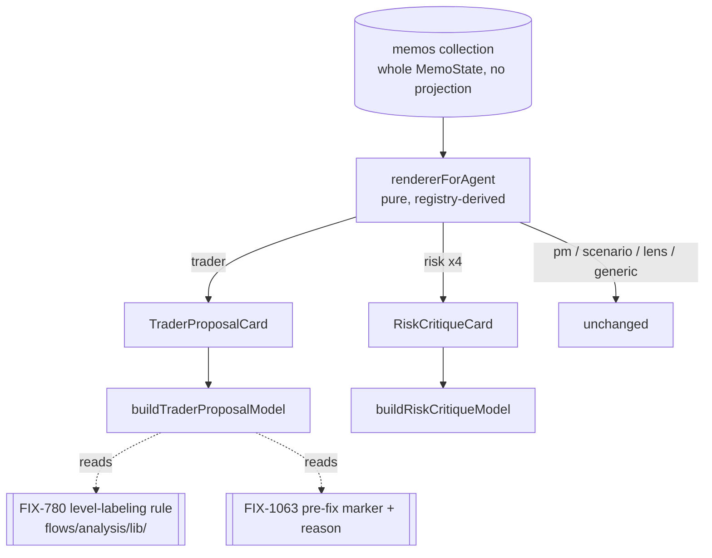

# FIX-1061: Trading-desk: the trader and risk memos have no dedicated renderer — Implementation Spec

**Linear:** [FIX-1061](https://linear.app/fixpoint-labs/issue/FIX-1061/trading-desk-trader-and-risk-persona-memos-have-no-dedicated-renderer) · **Epic:** [FIX-1067](https://github.com/fixpoint-labs/flow-state-dev/pull/1160) · **Branch:** `spec/FIX-1061`

## Part I — The Case *(for the human)*

### 1. Problem — why it matters, why now

Open a finished report on the Theses tab and click through the participants. The portfolio
manager gets a hero panel. The scenario forecaster gets a scenario panel. Each of the four
investor lenses gets its own card. Click the **trader** — the participant who proposed the
actual trade — and you get a headline, a five-cell grid of strings, and prose. Click any of
the three **risk officers**, or the consolidated **risk assessment**, and you get the same.

The desk stored more than that. The trader committed a stop, a target, a size, a holding
period, and a list of conditions that would kill the trade. Each risk persona committed the
risks it raised with severities, the adjustments it wants, and the risks it explicitly
dismissed with reasons. All of it reaches the browser already — the memos collection ships
whole memo state with no projection. It is then not drawn. What the reader sees instead is
whatever the generator happened to echo into free-text prose.

**Why now.** These two are the report's decision-critical middle: the trade proposal is the
thing being decided about, and the risk debate is the desk's own argument against it. Sitting
between the lens cards and the PM hero, they are the thinnest panels on the page, which reads
as the desk having thought least about exactly the parts it thought hardest about. That is
the epic's acceptance question — *does the report faithfully represent the analysis that
actually ran?* — and this is one of its clearest failures.

**What this does not change, said plainly.** This changes **what a reader sees on the Theses
tab**. It does not change the trade, the critiques, the severities, the gates, the sizing, or
any number the desk computed. No prompt, no schema, no commit handler, no stored field moves.
A run before and after this change produces byte-identical stored state.

### 2. Solution in plain terms

Two dedicated renderers, matching the ones the PM, the forecaster, and the lenses already
have.

**The trader memo** shows its proposal as a trade: direction and size, the price levels under
whatever names the run's own stance earned them, the holding period, what would invalidate
the trade, and what it depends on — then the written memo underneath.

**The risk memos** show each persona's critique as a critique: its posture, the risks it
raised with severities, the adjustments it wants on size / holding period / invalidation, and
— for the neutral persona — the risks it deliberately dismissed and why. The consolidated
assessment shows the same structure plus its confidence-calibration verdict.

Both stay honest about absence in the same direction as the rest of this surface: a field the
run did not publish contributes nothing, and a section with nothing in it renders nothing. An
empty dismissed-risks list is missing signal, not a desk that dismissed nothing.

**Price levels are not this renderer's to name.** [FIX-780](https://github.com/fixpoint-labs/flow-state-dev/pull/1190)
establishes one labeling rule for what a stored level is called, and this renderer reads it.
A legacy report discloses through the one marker [FIX-1063](https://github.com/fixpoint-labs/flow-state-dev/pull/1236)
already builds, carrying FIX-780's reason — not a second banner of its own.

**Philosophy** — tenet 1 (coherence): a report that renders a computed field on one surface
and drops it on another says two things about the same run. Tenet 5 (one convergence point):
the level names come from FIX-780's rule and the pre-fix disclosure from FIX-1063's marker;
this issue introduces neither vocabulary. Tenet 3 (earn every addition): no new stored field,
no new resource, no new transport — every value drawn is already on the client.

### 6. Decisions & rules — the sign-off surface

1. **Two dedicated renderers, dispatched by a pure function over the registry.** The
   `MemoDoc` dispatcher's routing becomes a pure `rendererForAgent(agent)` leaf whose
   trader/risk arms are derived from `PHASE_3_MEMO_KEYS` / `PHASE_4_MEMO_KEYS`, not from a
   hand-listed set of agent names. *Rejected:* one generic "structured memo" renderer
   parameterized by phase — the trader's shape (a trade) and the risk shape (a critique) have
   nothing in common but both being structured, and a parameterized renderer would become a
   union of two layouts with a discriminator. *Also rejected:* adding two more hand-listed
   `Set`s beside `LENS_AGENTS`. *Locks in:* a participant added to a phase registry is either
   routed or fails a test — the failure mode this issue exists to fix cannot recur silently.

2. **This renderer holds no level-label vocabulary.** It reads FIX-780's shared rule, which
   is [decision 2 of that spec](https://github.com/fixpoint-labs/flow-state-dev/pull/1190),
   approved at `c02a7559`, and states it as: *"One rule decides what a level is called, and
   the summary list, the chart legend, the decision one-liner, and the prompts the risk
   officers and PM read all follow it … the guarantee holds for surfaces nobody has built
   yet, which matters because FIX-1061 is about to build one."* This is that surface.
   *Rejected:* reading `stopPrice` / `targetPrice` and labeling them here, even "temporarily"
   until FIX-780 lands — that is the fourth spelling FIX-780 exists to prevent, and a
   temporary one is indistinguishable from a permanent one once it is merged. *Locks in:* the
   trader renderer cannot show a stop on a flat run, by construction rather than by care.

3. **A legacy report discloses through the one existing marker, with the one existing
   reason.** FIX-1063 owns the marker component and the pre-fix flag; FIX-780 owns the
   legacy-flat reason string. This renderer contributes a call site, not a component and not a
   reason. *Rejected:* a trader-memo-specific "these levels predate the fix" note. *Locks in:*
   the EM decision recorded on the Linear issue — *"one marker, with the reason as detail"* —
   holds on the Theses surface too, and stays true when a fourth fix wants to mark a report.

4. **Absent stays absent, and empty renders nothing.** A null field contributes no row; a
   section whose every field is absent does not render its heading. Within a row that does
   render, an absent leg contributes no segment rather than a `—` placeholder. *Rejected:*
   a uniform `—` for every unpublished field, which fills the panel with dashes on exactly the
   partial runs a reader most needs to read quickly. *Locks in:* the existing
   `LabeledBulletList` / `tradeLineParts` behaviour, extended rather than re-decided — and
   the real-money rule that an empty dismissed-risks list is missing signal, never a
   dismissal that did not happen.

5. **The load-bearing mapping is a pure view-model; the components stay dumb.** Each renderer
   exports a `build…Model(data)` function, and the components draw its output. *Rejected:*
   logic inside JSX. *Locks in:* the test seam. The suite is node-env with `test/**/*.spec.ts`
   — there is no jsdom and no JSX rendering — so a rule that lives in a component is a rule
   with no CI coverage at all. This follows `buildLensCardModel` exactly.

**Size:** Medium. One PR.

### 3. Tradeoffs & alternatives

**The simpler approach: enrich the generic renderer instead.** Teach `ThesisHeader` to draw a
richer metrics grid and let both memos keep falling through. Genuinely cheaper, and it would
improve every memo at once. Rejected because the generic renderer reads `metrics` — a
`Record<string, string>` of display strings the generator wrote — and the whole defect is that
the *typed* fields beside it are the real content. Making the string grid prettier renders the
echo more attractively and leaves the substance dropped.

**The other direction: one renderer for all four risk memos versus two.** The three personas
share `personaCritiqueOutputSchema`; the consolidated assessment does not. One component with
a branch would be smaller than two components. This spec takes one risk renderer with a
consolidated-assessment variant rather than two files, because the shapes overlap on raised
risks, adjustments, and dismissed risks — but the call is the implementer's, not a decision
here, provided both shapes render every field they carry.

**Where the complexity is:** not the drawing. It is the two contracts this renderer consumes
and must not fork — FIX-780's labeling rule and FIX-1063's marker — neither of which is on
`main` yet. §7 and §12 are mostly about that boundary.

### 4. Focus practices (1–5)

1. **One convergence point** (tenet 5) — the level names and the pre-fix disclosure both come
   from elsewhere. If either gets a local copy here, this surface is where the epic's
   "one rule, every surface" guarantee breaks first.
2. **BP-035 (second-path checklist)** — the second path here is the *partial* run: a Summary
   or Theses tab opened between Phase 3 and Phase 5, a persona that errored, a legacy record.
   FIX-1060's render-gate defect (a stored field hidden by a condition belonging to a
   different participant) happened on this exact surface and is the failure to walk for.
3. **BP-010 (derive with `useMemo`, not an effect)** — the view models are derived state.
4. **Real-money honesty (epic decision 2)** — a severity or a posture is a label the model
   emitted. It is shown as the persona's own claim, attributed, never as a measurement.

### 5. What using it looks like

App-internal rendering. No public API, no schema, no stored field changes. What changes is
what a reader sees, so the example is the rendered memo.

**The trader memo, before / after** (a directional run):

```
before   Trader · "Constructive entry on the pullback"
         direction  size  stop  target  conviction     ← five display strings
         <prose>

after    Trader · "Constructive entry on the pullback"
         LONG · 1.4% NAV · stop 132 · target 185 · months
         invalidated if
           · Q3 gross margin below 71%
           · the hyperscaler capex guide is cut
         depends on
           · the fundamentals memo's margin read
         <prose>
```

**A flat run** — the levels line reads whatever FIX-780's rule returns for a flat stance, and
this renderer never spells it:

```
after    FLAT · 0% NAV · reassess below 195 · invalidate above 320 · months
```

**A risk persona, before / after:**

```
before   Conservative Risk · "Size is too large for the invalidation distance"
         stance  structuralChange  scopeChange  exitDiscipline  stopMechanics  followOn
         <prose>

after    Conservative Risk · conservative · "Size is too large for the invalidation distance"
         raised
           ▲ HIGH  Invalidation sits inside one day's average range
           ● MED   The margin thesis depends on a single supplier disclosure
         wants   sizing smaller · holding period unchanged · invalidation tighter
         <prose>
```

**A persona that raised nothing and dismissed nothing** renders its header and its prose, and
no empty sections — not "raised: none".

---

## Part II — The Build Plan *(for the implementing agent)*

### 7. Technical design

Everything drawn is already on the client. The memos collection declares no projection, so
the identity default ships whole `MemoState` (verified — `resources.ts`). The work is a
dispatch change and two presentational components; there is no transport, resource, schema, or
flow edit anywhere in this issue.



**The dispatch.** `MemoDoc` currently branches on three inline conditions plus a `LENS_AGENTS`
set. Replace them with one pure `rendererForAgent(agent): "pm" | "scenario" | "lens" |
"trader" | "risk" | "generic"` leaf, its trader and risk arms derived from
`PHASE_3_MEMO_KEYS` and `PHASE_4_MEMO_KEYS` the way `LENS_AGENTS` is already derived from
`LENS_IDS` + `PHASE_2B_MEMO_KEYS`. `MemoDoc` switches on the result. This is the seam decision
1 buys: the mapping becomes assertable in a node-env test over every key in `AGENTS`.

**The two view models.** `buildTraderProposalModel(data)` and `buildRiskCritiqueModel(data)`,
pure, no React, exported from their component modules and imported by `.spec.ts` files — the
`buildLensCardModel` shape exactly. Absence collapses in the model, so the components carry no
null logic.

**The level line is delegated, not built.** The trader model does not read `stopPrice` /
`targetPrice` and attach names. It hands the memo's stance and its four level fields to
FIX-780's labeling leaf and renders the labeled rows it returns, including the legacy case
that leaf owns. **Name the contract, not the symbol:** FIX-780's implementation is in flight
and owns its own naming; consume whatever it exports, and if the shape it landed differs from
the sketch above, follow the code and note the difference. What must hold is that no string
naming a price level is authored in `components/theses/**`.

**The pre-fix disclosure is a call site.** Read `dataHonestyContractVersion` off session state
with `useClientData` (the pane already does this for `runComplete`), pass it through
`isPreDataHonestyFix`, and render `ReportProvenanceNotice` with the reason list — FIX-1063's
own reason when the stamp is absent, plus FIX-780's legacy-flat reason when its rule reports a
legacy record. The component takes `reasons: readonly string[]` precisely so a second reason
is an entry, not a second banner. It lives under `components/summary/`; importing it from
`components/theses/**` is the right move — it is the app's one provenance marker, not a
Summary-local widget. If a later reader wants it moved to a shared location, that is a rename,
not a fork.

**Not touched:** `aggregate.ts` and everything under `components/summary/**` except the
provenance-notice import (FIX-1060's and FIX-1063's territory, per the epic's ownership
table); `mandate-panel.tsx` (FIX-1065's, per its spec §7's consumer table); the generic
`ThesisHeader` / `ThesisBody` / `ThesisMetrics` trio, which keeps serving the analysts, the
debaters, the research manager, and the thesis validator unchanged.

### 8. Implementation sequence

1. **Extract the dispatch into `rendererForAgent`** and switch `MemoDoc` on it, with no
   behaviour change — trader and risk still land on `"generic"`. *Test:* the mapping over
   every `AGENTS` key is exactly today's routing. *Depends on:* nothing.
2. **Add the trader arm and `TraderProposalCard`**, minus the level line (render direction,
   size, holding period, invalidation criteria, depends-on). *Test:* §10's trader cases.
   *Depends on:* 1.
3. **Route the level line through FIX-780's rule**, including its legacy branch, and add the
   provenance-notice call site. *Test:* a flat record, a directional record, and a legacy
   record each render the labels that rule returns and no others. *Depends on:* 2 **and on
   FIX-780 having landed** — see §12.
4. **Add the risk arm and `RiskCritiqueCard`** for the three personas and the consolidated
   assessment. *Test:* §10's risk cases, including the coverage property. *Depends on:* 1.
5. **Docs** — §11. *Depends on:* 4.

Steps 2 and 4 are independent of each other; both depend only on 1. Step 3 is the only one
gated on another issue.

### 9. Edge cases & error handling

| Case | Expected |
|---|---|
| Trader memo `published`, PM has not | The trader card renders in full. It is gated on the trader's own status and nothing else — FIX-1060's render-gate defect, on this surface |
| Trader published no invalidation criteria | The invalidation section does not render. Never "nothing invalidates this trade" |
| Flat run with monitoring levels | Whatever FIX-780's rule labels them. This renderer asserts nothing about which is which |
| Legacy flat record | Unlabeled values + the ONE provenance notice carrying FIX-780's reason (decision 3) |
| Run with no levels of either pair | No levels line. The rest of the card renders |
| Persona memo `error` | Unchanged — the existing error branch owns the surface before any renderer is reached |
| Persona memo `writing` / `pending` | Unchanged — `WritingSkeleton` / `PendingDoc` |
| Persona raised `[]` risks (aggressive/conservative emit `[]` by prompt) | The raised section does not render. An empty list is the prompt's instruction, not a finding |
| `dismissedRisks: []` | Same. Never "dismissed: none" |
| Risk assessment with `confidenceCalibration: null` | The calibration line is omitted. Never defaulted to `"calibrated"` — the `RiskPanel` precedent |
| A memo whose typed fields are all null (a stopped run mid-phase) | The card degrades to header + prose, i.e. today's generic output. No empty chrome |
| A field added to any of the three output schemas later | Fails the coverage test in §10 until it is rendered or declared excluded |

**Taxonomy:** every row is a display outcome. Nothing in this change can fail a run, alter a
stored value, or affect what the desk decides.

**Second path (BP-035):** the partial run is the second path and it is common — the Theses tab
is where a *streaming* run lives (the pane auto-opens Summary only when finished), so a
half-populated memo is the normal case here, not the edge.

### 10. Testing strategy

**No goal check and no fixture run applies, and the reason is specific.** Nothing about this
change reaches the flow: no generator, no commit, no resource, no session state. A `fsdev run`
would produce byte-identical stored output before and after, so a real run cannot distinguish
a working renderer from a broken one. It would also be the *wrong* evidence for a second
reason worth stating — a sibling POC on this epic found both committed fixtures are
period-symmetric, so a test that reads them can pass on broken code. These tests build their
memo objects inline and read no fixture.

**The pass condition each test has to survive:** *would it still pass if the code were broken
in the way it exists to catch?* The defect class here is **a stored field that reaches the
client and is never drawn**, and its two mechanisms are (a) the dispatcher not routing the
memo, and (b) the view model not reading the field. Both are addressed directly:

- **The routing map, asserted over the whole registry.** `rendererForAgent` is checked for
  every key in `AGENTS` against the expected renderer derived from the phase registries. A
  deleted branch changes the function's output and fails; a persona added to
  `PHASE_4_MEMO_KEYS` and not routed fails. This is the `memo-step-coverage.spec.ts`
  precedent, and it is the only mechanism in this issue that catches (a).
- **Field coverage as a property, not a list.** A test walks the declared keys of
  `tradeProposalOutputSchema` (`flows/analysis/agents/trader/trader.ts`) and of
  `personaCritiqueOutputSchema` / `riskAssessmentOutputSchema`
  (`flows/analysis/agents/risk/schemas.ts`) and asserts each key is either read by the
  corresponding view model or present in a small, named, commented exclusion set (`label` /
  `headline` / `rating` / `body` / `metrics` / `citations` are drawn by the shared header and
  body, not the structured block). **Derive the list from the schemas at test time; do not
  transcribe it.** This is what catches (b), and it keeps catching it for fields nobody has
  written yet.

**The behaviours (not the test names):**

- **one behaviour per decision in §6**, stated as what a reader sees
- **an absent field omits its row; an empty list renders nothing** — asserted on the raised,
  dismissed, invalidation, and depends-on lists specifically, because each is a place where a
  default would assert a judgement the desk did not make
- **the trader model authors no level label** — assert the model's level rows are exactly what
  the stubbed labeling rule returned, so a hard-coded "stop" anywhere in this component fails
- **the legacy record produces one provenance reason list, not a second notice**
- **what must not change:** an analyst memo, a debater memo, and the research-manager memo
  still route to `"generic"`; the PM, forecaster, and four lens memos still route to their
  existing renderers

**Residual, stated honestly:** the JSX branch inside `MemoDoc` that consumes
`rendererForAgent`'s result is not reachable from a node-env suite. The *mapping* is covered;
the *wiring* of the mapping to the components is not, and no test in this repo's current
harness can cover it. Verify it by opening a finished report in the running app
(`pnpm --filter @flow-state-dev/trading-desk dev`), clicking the trader and each of the four
risk entries, and confirming the structured blocks render — including one re-opened flat
report for the legacy path. Do not claim CI coverage for that step.

**Discipline:** `tdd`. Every seam is a pure function reachable from vitest.

### 11. Documentation plan

- **EXTEND** `labs/trading-desk/components/theses/theses-pane.tsx`'s file header — its
  dispatch list (lines 4–9) enumerates the routing and will be stale the moment step 1 lands
  (BP-034: finish the provenance, not just the imports).
- **EXTEND** `labs/trading-desk/CLAUDE.md` — the guide describes the Summary view's renderers
  in detail and the Theses view's barely at all. Add a short "Theses view" note naming the
  dispatcher, the registry-derived routing, and the rule that a memo renderer never authors a
  price-level label. Without it the next agent re-derives the wrong contract, which is exactly
  how the third spelling appears.
- **No `apps/docs` change.** The trading desk is a lab app; the site's outsider rule keeps
  app-internal rendering off it, and nothing published describes these memos.
- **Changeset:** `--empty` (BP-022). `@flow-state-dev/trading-desk` is `"private": true`
  (verified in its `package.json`) — no published surface changes.

### 12. Dependencies, open questions & follow-ups

**FIX-780 blocks step 3 and only step 3.** The epic's §4 sequencing puts FIX-780 first, and
its spec's decision 2 names this renderer as the surface the guarantee has to hold for. As of
this spec, **FIX-780's spec PR #1190 carries the `spec approved` label and its implementation
branch `fix/FIX-780` is at the same commit as `origin/main` — nothing has landed yet**
(verified). So the contract this spec consumes is the approved spec text, not code. Steps 1,
2, 4, and 5 do not touch levels and are unblocked today; if step 3 arrives before FIX-780
merges, hold the level line out of the card rather than authoring a placeholder label — a
card with no levels is honest, and a placeholder is the fourth spelling.

**FIX-1063 supplies the marker, on a draft PR whose ownership is itself under review.**
`ReportProvenanceNotice` + `PRE_DATA_HONESTY_FIX_REASON` + `isPreDataHonestyFix` + the
`dataHonestyContractVersion` session field and its `client.expose` entry are all present on
`fix/FIX-1063` (verified), in **draft PR #1236**. Read that PR's *"One departure"* section
before wiring step 3's call site: the notice component was originally FIX-1063 decision 6's
work for FIX-1060, FIX-1060 merged without it, and #1236 shipped it while explicitly offering
to pull it back to flag-only if the owner disagrees. **So this spec depends on a component
that may not survive review.** If it is pulled, this issue renders the legacy levels unlabeled
with no notice on the Theses tab and files the disclosure gap rather than minting a second
marker — decision 3 is about not adding a marker, and that holds whether or not the shared one
exists.

Two markers cannot stack on one screen here in any case: the Theses and Summary tabs are
mutually exclusive in `ThesesPane` (verified — the tab branch renders one or the other, never
both), so this issue's call site and the Summary's are never simultaneously visible. That is
why the reuse is an engineering call and not an escalation; the *claim* a legacy report makes
was already settled by FIX-780 decision 3, which the owner approved.

**FIX-1065 does not collide.** Its spec's consumer table names `mandate-panel.tsx` as its only
`components/theses/**` file (verified). The Linear-recorded EM split — this issue owns the
memo renderers, FIX-1065 owns the decision panels — holds without further coordination.

**Deliberate skips, named rather than omitted:**

- **No spec POC.** The `spec-poc` triggers are an unchecked premise or a look that only
  becomes visible in code. Every premise here was checked directly in the files named in the
  claims table, and the visual direction has three in-repo precedents (`LensCard`, `PmHero`,
  `RiskPanel`) rather than being contested. A mockup would cost a session and settle nothing.
- **No test of the JSX wiring**, for the harness reason stated in §10, with the manual path
  named instead of the gap being left implicit.

**Calls made rather than escalated** (each near-zero cost either way, per BP-041's
don't-ask rule):

- One risk renderer with a consolidated-assessment variant rather than two components — the
  shapes overlap on three of four sections; the implementer may split them if the branch grows.
- The risk-assessment's calibration and recommended adjustments render on the Theses memo even
  though `RiskPanel` already shows them on the Summary tab. The PM's fields are already
  duplicated across `PmHero` and `DecisionHeader` by the same logic, the tabs are mutually
  exclusive, and a per-agent memo that omits the agent's own verdict to avoid repetition is
  the drop this epic exists to stop.
- Model-emitted severities and postures render attributed to the persona that claimed them,
  matching `RiskPanel`'s existing severity glyphs — consistent with epic decision 2, which
  bars presenting an invented input *as a measurement*, not showing a participant's own claim.

**Follow-ups (flagged, not built):** the research manager, the two debaters, and the thesis
validator also fall through to the generic renderer and carry structured fields
(`unresolvedDisagreements`, `blindSpots`, `supportingEvidence`, `contradictingEvidence`). The
issue scopes this to the trader and risk memos; the same treatment for the others is a
separate row, not a silent widening here.

---

## Claims verified in code this round

Every claim this spec makes about the codebase, and where it was read. Read at
`origin/main` = `780456064` unless a branch is named.

| Claim | File · symbol | What was read |
|---|---|---|
| Trader and risk memos fall through to the generic renderer | `components/theses/theses-pane.tsx` · `MemoDoc` | Dispatch branches on `scenarioForecaster`, `portfolioManager`, and `LENS_AGENTS`; every other agent returns `ThesisHeader` + `ThesisBody` |
| The routing set precedent is registry-derived | `theses-pane.tsx` · `LENS_AGENTS` | `new Set(LENS_IDS.map((id) => PHASE_2B_MEMO_KEYS[id].agentName))` |
| Whole memo state reaches the client — the fields are already there | `flows/analysis/resources.ts` · `memosCollection` | `client: { state: { read: true }, live: true }`, no projection; the comment states the identity default ships every field |
| The trader's typed fields exist on memo state | `resources.ts` · `memoStateSchema` | `direction`, `sizePct`, `stopPrice`, `targetPrice`, `holdingPeriod`, `invalidationCriteria`, `dependsOn`, all `.nullable().default(null)` |
| The risk fields exist on memo state | `resources.ts` · `memoStateSchema` | `posture`, `raisedRisks`, `proposedAdjustments`, `dismissedRisks`, `criticalRisks`, `recommendedAdjustments`, `confidenceCalibration`, `calibrationRationale` |
| The trader's output schema is the field list to cover | `flows/analysis/agents/trader/trader.ts` · `tradeProposalOutputSchema` | Declares `stopPrice` / `targetPrice` as `z.number().positive()` (non-nullable today — FIX-780 changes this) |
| The risk output schemas are the field lists to cover | `flows/analysis/agents/risk/schemas.ts` · `personaCritiqueOutputSchema`, `riskAssessmentOutputSchema` | Personas share one schema; `adjustmentShape` carries direction enums only, no rationale — rationale exists only on the consolidated `recommendedAdjustments` |
| Aggressive/conservative emit `dismissedRisks: []` by prompt | `agents/risk/schemas.ts` header comment | "aggressive and conservative emit `[]` per their prompts; neutral populates it" |
| The four risk agents and the trader are in the registry | `flows/analysis/registry.ts` · `PHASE_3_MEMO_KEYS`, `PHASE_4_MEMO_KEYS` | `trader`; `aggressive` / `conservative` / `neutral` / `riskAssessment` |
| The pure-view-model + node-spec pattern is established | `components/theses/lens-card.tsx` · `buildLensCardModel`; `test/lens-card.spec.ts` | A `.spec.ts` imports the builder from a `.tsx` and tests it without rendering |
| The suite is node-env, `.spec.ts` only — no JSX rendering | `labs/trading-desk/vitest.config.ts` | `include: ["test/**/*.spec.ts"]`, `environment: "node"` |
| The registry-coverage guard precedent exists | `test/memo-step-coverage.spec.ts` | Asserts placed keys equal `ALL_MEMO_KEYS` exactly |
| Empty lists already render nothing on this surface | `components/summary/invalidation-list.tsx`, `labeled-bullet-list.tsx` | `InvalidationList` delegates to `LabeledBulletList`; header comment states an empty list is missing signal |
| An absent leg contributes no segment (not `—`) | `components/summary/decision-header.tsx` · `tradeLineParts` | Each leg is pushed only when non-null; comment says an unpublished leg contributes no segment |
| `stop` / `target` are hard-coded on the Summary today | `decision-header.tsx` · `tradeLineParts` | `parts.push(\`stop ${trade.stopPrice}\`)` / `` `target ${...}` `` — one of the sites FIX-780 removes |
| Calibration is never defaulted | `components/summary/risk-panel.tsx` | Renders the calibration line only when non-null; header comment states defaulting to "calibrated" would assert a review nobody performed |
| FIX-780 spec is approved at the stated commit | GitHub PR #1190 | `spec approved` label present; `spec/FIX-780.md` read at `c02a75590b65d2ad972f21ada32df62b35ee150a`; decision 2 quoted verbatim in §6 |
| **FIX-780 has landed no code** | `git rev-parse fix/FIX-780 origin/main` | Both `780456064dfa8b8c847401d90b0373efc9495f26` — the branch carries zero commits beyond main |
| FIX-1063's marker exists and takes a reason list | `fix/FIX-1063` @ `9707ba6d6` · `components/summary/report-provenance-notice.tsx` | `ReportProvenanceNotice({ reasons })` renders null on an empty list; exports `PRE_DATA_HONESTY_FIX_REASON`; header states "ONE MARKER, NOT SEVERAL … a new reason is one entry in the caller's list, not a second banner" |
| **The marker is unmerged and its ownership is open** | GitHub PR #1236 (draft) | The description's "One departure" section: decision 6 assigned the notice to FIX-1060, FIX-1060 merged without it, #1236 shipped it here and offers to revert to flag-only |
| The pre-fix flag is readable from the client | `fix/FIX-1063` · `flows/analysis/state.ts`, `flow.ts`, `data-honesty-contract.ts` | `dataHonestyContractVersion` on session state, present in the flow's `client.expose` allow-list, read through `isPreDataHonestyFix` |
| The Theses and Summary tabs are mutually exclusive | `theses-pane.tsx` | `tab === "summary" ? <ReportSummary/> : … <MemoDoc/>` — one or the other, never both |
| The pane already reads session state client-side | `theses-pane.tsx` | `useClientData(session, { session: ["runComplete"] })` |
| FIX-1065 touches only `mandate-panel.tsx` under `components/theses/**` | `origin/spec/FIX-1065` · `spec/FIX-1065.md` §7 consumer table | Row 12 is `mandate-panel.tsx`; no other `components/theses/` entry |
| The package is private (changeset is `--empty`) | `labs/trading-desk/package.json` | `"private": true` |

---

## Spec evolution

- **Spec drafted** — framed as a rendering-only change and held there deliberately: the
  signal/outcome line is that this alters what a reader sees, never what the desk decides.
  Chose a registry-derived pure dispatch over two more hand-listed sets, because the failure
  this issue fixes is precisely a participant nobody routed. Delegated both the level
  vocabulary (FIX-780 decision 2) and the pre-fix disclosure (FIX-1063's one marker) rather
  than restating either. Stated the CI residual — the JSX wiring is unreachable in a node-env
  suite — instead of implying coverage the harness cannot give.
