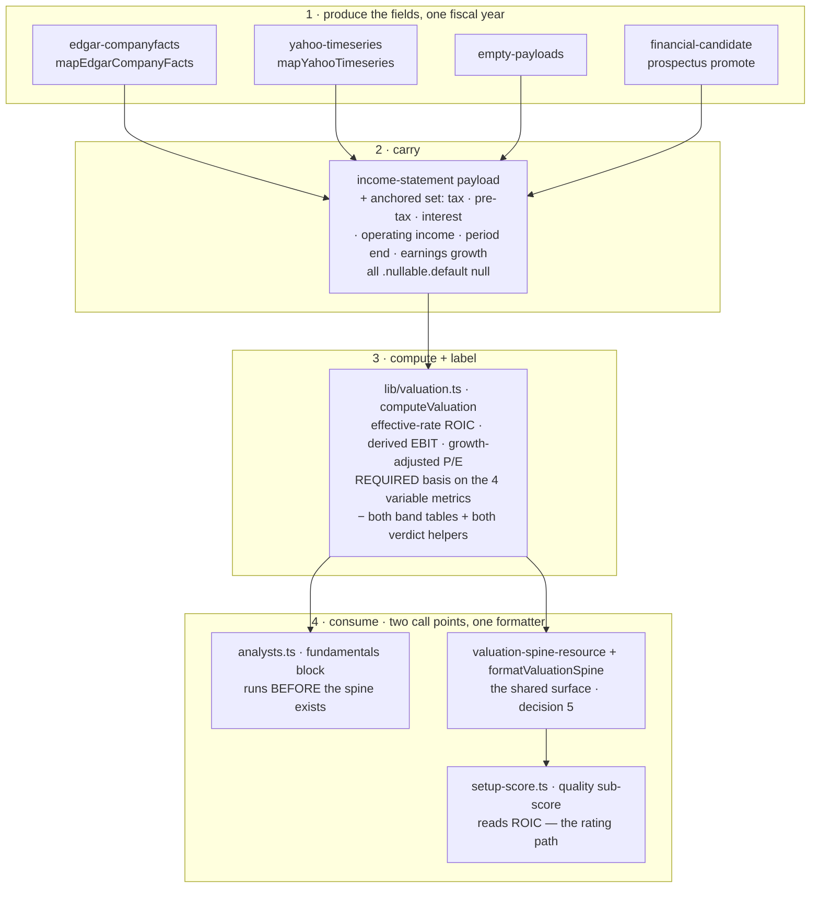

# FIX-1064: Valuation multiples rest on blunt proxies — Implementation Spec

## Part I — The Case *(for the human)*

### 1. Problem — why it matters, why now

Four of the numbers the desk reports about a company are not the numbers it says they are.

**Return on invested capital** is computed by taxing every company at 21%. Nvidia's last
full year reported a **15.1%** effective tax rate ($21.4B of income-tax expense on $141.5B
of pre-tax income). Taxing it at 21% understates its return on capital by about seven
percent of the figure — and that figure is one of three inputs to the quality score that
sets the rating band the portfolio manager is allowed to choose inside. This is the only one
of the four that moves a number the desk acts on.

**EV/EBIT** is not EV/EBIT; it divides by operating income. **PEG** is not PEG; it divides
the price/earnings ratio by *revenue* growth, so a company growing sales fast while earnings
go nowhere reads as reasonably priced.

And every multiple carries a **cheap / fair / expensive** verdict drawn from one hardcoded
table applied to every company on the market. The same "cheap below 2× sales" line is
applied to a utility and to a software company. Energy and industrials have traded four to
six times apart on the same multiple inside a single year, so a fixed threshold is not a
loose read — it is a coin flip wearing a label.

Each of these is documented in the code, and three of the four are labelled in the output.
So this is not concealment. It is a report presenting verdicts with more precision than its
inputs support, on a surface where someone is deciding whether to buy something.

**Why now.** Two issues in this epic are queued directly behind these four figures. The
lens work ([FIX-1066](https://linear.app/fixpoint-labs/issue/FIX-1066)) seats two new
investor perspectives whose entire methodology *is* these ratios, and it is blocked on this
issue precisely so it does not put blunt proxies in front of them. There is no workaround: a
reader cannot recompute return on capital from what the report shows them.

### 2. Solution in plain terms

**Compute the three measurable ones properly, and stop publishing the one we cannot
defend.**

Three numbers the company itself reports — its income-tax expense, its pre-tax income, and
its interest expense — are already inside the filing the desk downloads on every run. It has
simply never read them. Reading them turns the flat-tax return on capital into a return on
capital taxed at the rate the company's own filing reports, and turns "EV/EBIT" into an
actual EV/EBIT. Reading one more, the prior year's earnings, replaces "PEG" with a
growth-adjusted price multiple built on earnings rather than sales. **No new data provider,
no new request, no extra cost per run** — the numbers arrive in a response the desk already
pays for and throws most of away.

Two honesty rules carry the whole change. A derived figure is built **only from components
of the same fiscal year** — the desk's statement readers each take a field's *latest*
reported value, so without this rule an EBIT could silently pair one year's interest with
another year's income. And where a company does not report a figure for that year, the
metric says which basis it fell back to, or reports nothing and says why. It never quietly
substitutes.

**The cheap / fair / expensive verdict is removed rather than replaced.** There is no
defensible sector threshold available to us: the peer data the desk already fetches carries
peer *returns*, not peer *multiples*, so a sector median would mean six extra provider calls
per run, and a hand-written table of sector thresholds is seventy-odd numbers nobody can
source and nobody will notice going stale. Meanwhile the desk already produces a real answer
to "is this cheap" — a fair value derived from *this company's* own return on equity, growth
and required return, which abstains outright when its assumptions don't hold, and which
already drives the rating. The multiples go back to being inputs to that judgement instead of
delivering a competing verdict of their own.

**Philosophy** — tenet 3 (earn every addition): the sector-aware verdict is answered by
deleting the band tables, not by adding seventy numbers. Tenet 5 (one convergence point): a
metric whose computation can vary cannot be built without declaring which basis it ran on.
Tenet 1 (coherence): the desk already treats an unobserved statement figure as absent; a
computation that could not run now says so the same way.

> **§2 then §6 lead, and the rest is derivation.**

### 6. Decisions & rules — the sign-off surface

1. **Return on capital uses the effective tax rate the filing reports.** When the filing
   reports income-tax expense and pre-tax income *for the same fiscal year* and the resulting
   rate is plausible (§9 pins the bounds), that rate is used; otherwise the 21% assumption is
   kept and labelled as an assumption, exactly as today. This is the **provision** rate — the
   tax the filing charges against the year's earnings.
   *Rejected:* keeping the flat rate and labelling it harder — the label is already there and
   the number is still wrong. *Also rejected:* reading cash taxes paid instead. Cash tax
   differs from the provision through deferrals, credits and timing, and it is a defensible
   figure — but it changes what return on capital *means*, which is a bigger call than this
   issue carries, and it is a fact the desk does not read today.
   *Locks in:* **this changes ratings.** Low-tax companies score better on quality than they
   did last month and high-tax companies score worse, so a report re-run on the same data can
   land in a different rating band. That is a correction, not a regression, but published
   reports and the newer ones will disagree and we cannot restate the old ones.

2. **The growth-adjusted price multiple is renamed, not just recomputed, and is published
   only when earnings growth is observed.** PEG means price/earnings over *per-share*
   earnings growth. The desk holds no share count, so it cannot compute that — and
   company-level net-income growth diverges materially from per-share growth under buybacks
   or dilution. So the metric ships as **"Growth-adjusted P/E"** (and
   **"Growth-and-yield-adjusted P/E"** for the dividend variant), on a stated
   company-earnings basis, in the rendered label *and* the field name. Nothing in the desk
   publishes the letters PEG afterwards.
   *Rejected:* keeping today's revenue-growth version under an honest new name — a number
   invented to fill a slot, that no investor asked for and none would act on. *Also
   rejected:* sourcing diluted share counts to compute a real PEG — that needs data the
   epic's no-new-data fence excludes.
   *Locks in:* a reader loses a line named PEG, and gets a differently-named line that is not
   directly comparable to a PEG they read elsewhere. Some reports lose it entirely, with
   nothing in its place, and that will look like a downgrade.

3. **The cheap / fair / expensive verdict on each multiple is removed, not made
   sector-aware.** *(Owner's call — see §12.)* The desk's existing company-specific fair
   value stays the one place a cheap-or-expensive call is made.
   *Rejected:* a per-sector threshold table (undefendable, and stale within a year with
   nothing to catch it), and peer-derived medians (six extra provider calls per run, against
   the epic's no-new-data fence).
   *Locks in:* the desk makes **one** valuation call per company instead of fourteen. If we
   later want a per-multiple read, it has to come with a real comparison set, which means
   paying for peer fundamentals — a decision with a bill attached, deliberately deferred here.

4. **A figure whose computation can vary must declare which basis it ran on, and cannot be
   built without one.** That is the four variable metrics — return on capital, EV/EBIT, and
   the two growth-adjusted multiples — where a required basis descriptor replaces today's
   optional proxy string. The other ten are straight reported ratios with one possible
   computation, and carry a typed default (`reported-components`) rather than a hand-written
   sentence each.
   *Rejected:* today's optional label, which is why "EV/EBIT" could be shipped for years
   meaning something else. *Also rejected:* a hand-written basis on all fourteen — same
   compile-time guarantee, ten metrics' worth of boilerplate, and a wall of near-identical
   strings is how a real basis stops being read.
   *Locks in:* a new *variable* derived figure can never be added without declaring what it
   actually measures. That is a small permanent tax on adding metrics, and it is the point.

5. **These four figures are put on the shared evidence surface every downstream reader sees,
   which is work [FIX-1066](https://linear.app/fixpoint-labs/issue/FIX-1066)'s plan currently
   assigns to itself.** That surface is the valuation spine (§7 names the module and the
   renderer). Today the spine renders no multiple at all, so the lens pack and every other
   post-Phase-1 reader sees none. **The fundamentals analyst keeps computing its own copy
   before the spine exists — it runs earlier in the pipeline and there is no spine to read
   yet — but both go through one computation and one formatter, so the two cannot disagree.**
   *Rejected:* leaving the exposure to FIX-1066 — it would put proxy figures in front of two
   new lenses for however long the two issues are apart, which is the exact failure this epic
   is about. *Also rejected (and this was folded, then reversed, in review):* retiring the
   analyst's computation and re-pointing it at the spine. The analyst runs before the spine
   is written, so that reads an empty resource and silently drops the multiples from the
   fundamentals memo on every run. Re-ordering the pipeline to fix that is a bigger change
   than this issue is sized for.
   *Locks in:* two call sites remain, kept honest by one shared formatter rather than by
   review. And FIX-1066's second pull request loses a step and must be re-pointed. Somebody
   has to make that edit; if nobody does, the two issues will both try to add the same block.

6. **Ships as two pull requests: reading the new figures out of the filings first, then the
   valuation methodology.**
   *Rejected:* one change — it buries the part that needs judgement (what we compute and what
   we stop publishing) underneath two provider-mapping diffs that need none.
   *Locks in:* two reviews instead of one, and the methodology cannot land until the plumbing
   does.

7. **A derived figure combines statement components from one fiscal year only — including
   the operating income it falls back to.** Where the components for a year are not all
   present, the figure takes its labelled fallback or abstains; it never pairs a stale field
   with a current one. *(Added in review round 1, widened to operating income in round 2; it
   is what makes decisions 1 and 2 true rather than merely intended.)*
   *Rejected:* pairing each field's latest reported value, which is what the statement
   mappers do today. On Apple — whose interest expense stops under the standard tag after
   fiscal 2023 while pre-tax income keeps advancing — a plain non-null check would have
   derived EBIT from two different fiscal years and never reached the operating-income
   fallback this spec promises. *Also rejected:* anchoring only the newly-read fields.
   Operating income is what the effective tax rate is applied to and what the EBIT fallback
   reports, so leaving it on independent selection would keep both corrected paths mixing
   years while claiming a single one.
   *Locks in:* fewer derived figures than a naive reading would produce, on real large-cap
   names. An EV/EBIT that could have been assembled out of mismatched years now reports the
   operating-income basis instead, and says so. The published operating income is untouched;
   the anchored value travels beside it (§7).

> **Non-goals** — no new data provider, feed, or paid entitlement, and no additional request
> to an existing one (the epic's fence). No peer-relative or sector-median valuation. No
> change to the fair-value, DCF, triangulation, or rating-envelope math. **Nothing here
> touches the lens agreement score or the directional lean** — this issue does not open
> `convergence-math.ts`. No per-share figures of any kind: the desk holds no share count
> (`lib/dcf.ts` states the same constraint for intrinsic value), and that is why decision 2
> renames the metric rather than computing a real PEG. No recomputation of already-stored
> reports — the epic's forward-looking rule holds.
>
> **Size:** Large — 11 production files (enumerated in §8) · 2 fixture files hand-authored,
> 2 deliberately left alone · ~22 test behaviours · 2 documentation surfaces · 2 PRs.

---

### 3. Tradeoffs & alternatives

**Alternative: build the sector table anyway.** Eleven sectors across seven ratio metrics.
Rejected on two grounds, and the second is the one that decides it. It is undefendable —
there is no source we could cite for any single cell, so every number would be somebody's
recollection. And it has a decay clock with no alarm: sector multiples move materially within
a year, and nothing in the codebase would ever tell us a cell had gone wrong. We would have
replaced one blunt instrument with a bigger, more confident-looking one, which is the epic's
first failure shape at a finer grain.

**The simpler approach: label the proxies harder and change no math.** Genuinely tempting,
and it is roughly a one-file change. Three of the four figures already carry a label, so the
work would be adding one to the bands and sharpening the wording. Insufficient because it
concedes the actual complaint. A better caveat on a number computed with the wrong tax rate
still feeds the wrong number into the quality score, and a reader who trusts the caveat is
being asked to do arithmetic they cannot do — they do not have the tax rate.

**Where the complexity is:** not the arithmetic, which is four small formulas. It is
**coverage of the newly-read fields, per fiscal year**, and it is uneven in a way that
matters. Tax expense and pre-tax income are reported reliably and currently — a spot check of
Nvidia's filings returned both for the most recent fiscal year. Interest expense is the weak
one: Apple's filings stop reporting it under the standard tag after fiscal 2023. That is not
simply "sometimes missing" — it is **present but stale**, and the desk's statement readers
each take a field's latest value independently (§7 names them), so the naive check that a
field is non-null would have paired fiscal-2023 interest with fiscal-2025 pre-tax income and
called the result EBIT. Decision 7 is the rule that stops it; decision 4's always-on basis is
what tells the reader which of the two bases actually ran.

A second cost, smaller but real: the new fields have to be read by **four separate
producers** of the income statement (the filings mapper, the market-data mapper, the empty
payload, and the prospectus-recovery path — all four named in §7). Missing one produces a
figure that is honest for companies from three providers and silently wrong for companies
from the fourth.

### 4. Focus practices (1–5)

1. **BP-020 (never fabricate; live paths never fall back silently)** — the reason this issue
   exists. A tax rate we assumed and a tax rate we read are different claims, and only one of
   them may be presented as a measurement. It governs the guard as well as the figure: the
   plausibility check falls back to the labelled assumption, never to a clamped number (§9).
2. **One convergence point for the basis descriptor (tenet 5)** — the basis is part of the
   metric type for the four variable metrics, so the producers of a derived figure cannot
   each decide whether to attach one. This is the enforcement half of decision 4.
3. **BP-030 (tolerate the old shape)** — two persisted shapes change, not one. The valuation
   spine gains the new figures, and the `financialsData` resource embeds the income-statement
   tool schema as state, so both a stored report and a stored statement payload predating
   this must still open, must not render an absent figure as a computed one, and must not
   throw on a key that did not exist when they were written (§7's `.default(null)`).
4. **BP-034 (finish the rename)** — three of these figures are described in the fundamentals
   analyst's prompt and in two module headers by what they *used* to be, and decision 2's
   rename has to reach the field names too. Leaving that text is how the next reader
   re-derives the wrong metric.
5. **BP-035 (second-path checklist)** — the second path here is the **company that does not
   report the new field for the year being measured**, which includes the company that
   reports it for an *older* year. A suite that only covers the well-reported company proves
   nothing, and one that only covers the absent field misses the case that actually shipped
   wrong (§10).

### 5. What using it looks like

*(This is app code, so the surface a person meets is the evidence block a reader and the
downstream agents see, not a public API. **The tax figures below are real** — Nvidia's
reported fiscal-2026 income-tax expense of $21.383B on $141.450B of pre-tax income, read from
the filings API during research. **The metric levels are illustrative**, chosen to show the
shape and the direction of the change, not to predict a specific company's output. The label
text is also illustrative; the wording is the implementer's, the requirement to have one is
decision 4.)*

**Return on capital, before and after** *(the ratio between the two is the real part — taxing
at 15.1% instead of 21% raises the figure by ~7.5%):*

```
before  ROIC: 24.60% (proxy: approx — 21% tax assumption)
after   ROIC: 26.44% (tax basis: effective provision rate 15.1%, as reported FY2026)
```

**A company that does not report the tax fields for that year** — the honest fallback,
unchanged in value and sharper in label:

```
after   ROIC: 24.60% (tax basis: assumed 21%; company reports no tax provision for FY2026)
```

**The renamed and rebased figures:**

```
before  EV/EBIT: 31.20× (cheap/fair/expensive; proxy: operating income used as EBIT proxy)
after   EV/EBIT: 29.90× (basis: pre-tax income + interest expense, FY2026)
        …or, where interest expense is unreported for that year (the Apple case):
        EV/EBIT: 31.20× (basis: operating income — no interest expense reported for FY2026)

before  PEG: 1.42× (fair; proxy: revenue growth used in place of EPS growth)
after   Growth-adjusted P/E: 2.06× (basis: company earnings growth FY2025→FY2026 — not per share)
        …or, where prior-year earnings are unobserved:
        Growth-adjusted P/E: n/a — earnings growth unobserved
```

An abstention states its reason rather than rendering a bare `n/a`; a figure with no value
has no basis to declare, and "we could not compute this, here is why" is the honest form of
the same rule (decision 4, §9).

**What no longer appears anywhere:** the `cheap` / `fair` / `expensive` word on any
individual multiple, and the letters PEG. The desk's single valuation verdict — margin of
safety against its own fair value, and the rating band that follows — is unchanged and
remains where it is.

## Part II — The Build Plan *(for the implementing agent)*

### 7. Technical design

Four new statement fields enter at the two provider mappers **as a period-aligned read**,
travel the existing statement payload, and are consumed by one pure function. The verdict
machinery is deleted from that same function. The resulting figures are then carried onto the
valuation spine, which already receives the derived set as a build argument and keeps none of
it.



- **The income-statement schema** (`flows/analysis/tools/schemas.ts`,
  `incomeStatementSchema`) gains an **anchored component set**: income-tax expense, pre-tax
  income, interest expense, an operating income read *at the anchor year*, the anchor's
  period end, and a year-over-year *earnings* growth figure beside the `yoyRevenueGrowth`
  that already exists. Six fields, not four — round 2 added the anchored operating income
  (decision 7) and the period stamp the basis labels in §5 need in order to name a year.
  The existing published `operatingIncome` is untouched and keeps its own selection.

  **Each new field is `.nullable().default(null)`, not merely `.nullable()`.** A bare
  `.nullable()` leaves the key *required*, so a payload without it fails `.parse()` instead
  of taking the null fallback this spec promises — and two populations lack the keys: the
  `JPM` and `SPCX` fixtures, and every **persisted `financialsData` resource** from before
  this change, since `financialsDataStateSchema` embeds this exact tool schema as resource
  state and re-parses it on read. That second one is BP-030's case proper: the legacy record
  would throw on open rather than degrade. `.default(null)` fills the missing key on parse —
  the same remedy and the same reason as `valuation-spine-resource.ts`'s FIX-807 fields,
  which carry the comment verbatim. **`.default()` is available here:** this is a *tool*
  output schema, not a generator output, and it is not in `output-schemas-strict.spec.ts`'s
  walker (verified — that file lists four schemas from `tools/schemas.ts`, none of them the
  statements), so BP-016's strict-mode constraint does not bind. Do not add it to the walker.

- **The two provider mappers read them period-aligned, and this is the load-bearing part.**
  Today `mapEdgarCompanyFacts` reads each field through `latestDurationB`
  (`lib/providers/edgar-companyfacts.ts`), which sorts one tag's annual entries by period end
  and takes the last; `mapYahooTimeseries` reads each field through `latestB`
  (`lib/providers/yahoo-timeseries.ts`), which walks one series backwards to the first finite
  value. **Both select per field, independently, with no period agreement and no period
  carried out** — the payload's single `asOf` is derived from the revenue tag alone. So the
  new fields must be read at one anchor period: the latest fiscal year for which pre-tax
  income is reported, with tax expense and interest expense read *at that same period end* and
  `null` where absent there.
  **The aligned idiom already exists in both files** and does not need inventing — EDGAR's
  `annualByFy` + `buildPeriods` index facts by fiscal year and read every field at a chosen
  `fy`; Yahoo's `valueAtB` + `mapYahooTimeseriesHistory` do the same keyed on `asOfDate`. Both
  were built for the multi-period history path and are simply not used by the single-period
  statement mappers. Reuse them rather than adding a third selection idiom.
  *Scope guard, corrected in round 2:* the guard exists to avoid moving **published**
  numbers, not to limit which values the new calculation may consume. So the anchored set
  includes **operating income** — read at the anchor year, carried beside the published
  field, and consumed only by the new math. Revenue and net income stay as they are; nothing
  re-anchors a figure that is already rendered, so §10's byte-identical regression holds.

- **Earnings growth needs two *consecutive* fiscal years, not the latest two values.** The
  existing revenue derivation uses `latestTwoRaw` (`yahoo-timeseries.ts`), which collects
  every finite value and takes the last two — if a year is missing from the series those two
  are non-adjacent, and the growth is computed as though they were consecutive. Mirroring it
  verbatim would import that defect into a metric whose whole subject is a growth basis. The
  new derivation checks period adjacency and reports growth unobserved otherwise.

- **The empty-payload builder** (`tools/empty-payloads.ts`) **and the prospectus-recovery
  promote** (`lib/financial-candidate.ts`) emit nulls for all four. Both are producers of this
  payload; a missed one is a silent per-provider divergence (§3).

- **The derived-valuation function** (`flows/analysis/lib/valuation.ts`, `computeValuation`)
  is where the work is. Return on capital taxes the **anchored** operating income at the
  observed effective rate when pre-tax income is positive and the computed rate is inside the
  §9 band, and at the assumption otherwise. EBIT is derived from pre-tax income plus interest
  expense when both are observed **for the anchor year**, and falls back to the anchored
  operating income — so the fallback's basis label names a year it actually has. The
  growth-adjusted multiples
  read earnings growth and abstain with a reason without it. **Both band tables
  (`RATIO_BANDS`, `YIELD_BANDS`), both verdict helpers (`verdictForRatio`,
  `verdictForYield`), and the `MetricVerdict` argument threaded through `formatValuation` are
  removed** (decision 3).

- **The metric type gains a required basis descriptor on the four variable metrics**
  (`roic`, `evToEbit`, and the two renamed growth-adjusted fields), replacing the optional
  `proxy` string; the other ten declare a typed `reported-components` default. This is the
  convergence point for decision 4 — a producer that computes ROIC without saying which rate
  it used does not compile. A metric with a `null` value carries an abstention reason instead
  of a basis.

- **The shared surface is the valuation spine, and there are two computation points that
  cannot be collapsed into one.** `buildValuationSpine` (`lib/valuation-spine.ts`) already
  takes `valuation: DerivedValuation` and consumes it into the fair-value and setup-score
  inputs, but `valuationSpineStateSchema` (`valuation-spine-resource.ts`) stores none of the
  metrics and `formatValuationSpine` renders none of them — so every reader of
  `<valuationSpine>`, including the lens pack, sees no multiples at all. Meanwhile the
  fundamentals analyst calls `formatValuation(computeValuation(input))` inline
  (`agents/analysts/analysts.ts`, the generator's `valuation` context slot), which is the
  only place the multiples are rendered today.

  **The ordering forbids merging them.** In `orchestration/analyze.ts` the analyst fan-out is
  `.step(analystFanOut)` and the spine tap is `.tap(computeAndStoreSpine)` **after** it —
  necessarily, because the spine is built from the statement payloads Phase 1 fetches. So the
  fundamentals generator cannot read a spine that does not exist yet; re-pointing it there
  reads an empty resource and drops the multiples from the memo on every fresh run. (Round 1
  folded that re-point on a drift argument and round 2 reversed it — the drift concern was
  real, the proposed remedy was not available.)

  **So PR b does two things instead.** It puts the figures on the spine state and renders
  them in `formatValuationSpine`, which is what fixes the lens blindness and is the whole
  content of decision 5. And it makes both sites share **one** `computeValuation` and **one**
  metric formatter, so the labels, bases and abstention reasons cannot diverge even though
  the call happens twice. The two agree by construction on inputs as well: the analyst passes
  its own tool payloads and the spine passes the same payloads read back from
  `financialsData`. The spine state's new fields default per BP-030 — a stored report
  predating this must open and render the block as absent, never as computed.

- **Untouched:** the fair-value, DCF, triangulation, expected-return, discount-rate and
  rating-envelope math; the lens pack and its agreement math; every generator output schema;
  the sizing gates; and `expected-return.ts`'s separate consumption of `yoyRevenueGrowth`,
  which keeps reading revenue growth.

**Claims verified in code this round** *(file · symbol — the epic's standing rule; the round-1
review found the first of these missing, which is why the list is now explicit)*:

| Claim | Where it was read |
|---|---|
| Each field's period is selected independently, and no period travels with the value | `edgar-companyfacts.ts` · `latestDurationB`, `latestDurationAcrossB`; `yahoo-timeseries.ts` · `latestB`; the payload `asOf` comes from `latestEndDate`/`latestAsOf` on the revenue tag alone |
| A period-aligned reader already exists in both files | `edgar-companyfacts.ts` · `annualByFy`, `buildPeriods`; `yahoo-timeseries.ts` · `valueAtB`, `mapYahooTimeseriesHistory` |
| The growth pair is "last two finite values", not two consecutive years | `yahoo-timeseries.ts` · `latestTwoRaw`, consumed in `mapYahooTimeseries` |
| Exactly four producers write the income-statement payload | `edgar-companyfacts.ts` · `mapEdgarCompanyFacts`; `yahoo-timeseries.ts` · `mapYahooTimeseries`; `tools/empty-payloads.ts`; `lib/financial-candidate.ts` (prospectus promote) |
| ROIC is flat-taxed and reaches the rating path | `lib/valuation.ts` · `TAX_RATE = 0.21` in `computeValuation`; `lib/setup-score.ts` · quality sub-score, where ROIC is **one of three** averaged parts (Piotroski, ROIC, Altman) |
| The spine receives the derived set and stores none of it | `lib/valuation-spine.ts` · `buildValuationSpine` (uses it for fair value + setup score); `valuation-spine-resource.ts` · `valuationSpineStateSchema`; `formatValuationSpine` renders no multiple |
| There is a second, inline render path | `agents/analysts/analysts.ts` · fundamentals generator `context.valuation` → `formatValuation(computeValuation(input))` |
| That second path **cannot** read the spine — the analysts run first | `orchestration/analyze.ts` · `.step(analystFanOut)` precedes `.tap(computeAndStoreSpine)`, and the spine is built from what Phase 1 fetched |
| Operating income is selected independently of the new fields, and the new math consumes it | `lib/valuation.ts` · `computeValuation` (ROIC taxes `operatingIncome`; `evToEbit` falls back to it); selected by `latestDurationB(g, "OperatingIncomeLoss")` / `latestB(s, "annualOperatingIncome")` |
| A `.nullable()` key is still required, and the legacy record re-parses | `financials-data-resource.ts` · `financialsDataStateSchema` embeds `toolOutputSchemas.get_income_statement` as **resource state**; `get_income_statement.ts` declares the same schema as its `outputSchema` |
| `.default()` is permitted on this schema | `test/output-schemas-strict.spec.ts` · the walker's `cases` list carries four `tools/schemas.ts` schemas (`secFilings`, `analystEstimates`, `earningsTranscript`, `discoveryPayload`) — no statement schema; and the FIX-807 precedent in `valuation-spine-resource.ts` uses `.nullable().default(null)` for exactly this reason |
| Two fixtures already lack the keys | `fixtures/JPM/2026-05-06/income-statement.json` and `fixtures/SPCX/…` — six fields each, and neither carries `source` (the loader stamps it) |
| `formatValuationSpine`'s output is not a persisted artifact | `capability.ts` renders it into generator context at run time; `run-artifacts.ts` exposes the spine's **structured state**, not the formatted block (§10 depends on this) |
| `runSummary` cannot see the valuation change; `runArtifacts` can | `run-summary.ts` · `runSummaryStateSchema`; `run-artifacts.ts` · `runArtifactsStateSchema.valuationSpine`; the action is registered in `flow.ts` |
| Two module headers and the analyst prompt assert the retired proxies | `lib/dcf.ts` header (cites "operating income as EBIT proxy" / "21% tax assumption" as its own labelling precedent); `agents/analysts/prompts/fundamentals.prompt.md` (names the EBIT proxy, the revenue-growth PEG proxy, and instructs a cheap/expensive read) |
| The fixture corpus carries none of the new fields | `fixtures/{NVDA,AAPL}/2026-05-06/income-statement.json` — six fields, no tax / pre-tax / interest (§10 depends on this) |

**No solution sketch and no POC.** The change is four formulas, a period-aligned read that
already has a working example one function over, and a deletion inside one pure function that
already has a full unit suite. The premise worth checking was empirical rather than
structural, and was checked directly: **the tax, pre-tax and interest tags are present in the
filings response the desk already downloads, with the annual shape its existing readers
consume.** Confirmed for all three, and the check also surfaced the coverage asymmetry in §3.

### 8. Implementation sequence

**Production files touched (11).** PR a: `flows/analysis/tools/schemas.ts` ·
`lib/providers/edgar-companyfacts.ts` · `lib/providers/yahoo-timeseries.ts` ·
`flows/analysis/tools/empty-payloads.ts` · `flows/analysis/lib/financial-candidate.ts`.
PR b: `flows/analysis/lib/valuation.ts` · `flows/analysis/lib/valuation-spine.ts` ·
`flows/analysis/valuation-spine-resource.ts` ·
`flows/analysis/agents/analysts/analysts.ts` ·
`flows/analysis/agents/analysts/prompts/fundamentals.prompt.md` ·
`flows/analysis/lib/dcf.ts` (header only).

**PR a — the statement fields.** Provider-mapping work with no behavioural change; nothing
reads the new fields yet.

1. **Widen the income-statement schema** with the six anchored fields, each
   `.nullable().default(null)`. *Test:* **a payload that omits the keys entirely parses and
   yields null for each** — not a payload that passes explicit `null`, which parses fine
   against the broken shape and proves nothing. Plus: a number is accepted, a wrong type is
   still rejected, and a `financialsData` record in the pre-change shape re-parses (BP-030).
   *Depends on:* nothing.
2. **Read them period-aligned in the filings mapper.** Anchor on the latest fiscal year with
   a reported pre-tax income; read tax, interest **and operating income** at that same year
   via the existing `annualByFy` index, and stamp the anchor's period end; prior-year
   earnings from the same index. *Test:* a response carrying all tags at the anchor year maps
   them; a response whose interest expense stops two years earlier maps interest `null`
   (**not** the stale value) while pre-tax income still maps; a response whose operating
   income's latest year differs from the anchor maps the **anchor year's** operating income
   into the anchored field while the published `operatingIncome` is unchanged; a missing tag
   maps null, never zero. *Depends on:* 1.
3. **Read them period-aligned in the market-data mapper.** Add the annual series to
   `YAHOO_TIMESERIES_TYPES` (still one request), and read each anchored field at the anchor
   `asOfDate` via the existing `valueAtB`. Derive earnings growth from two **consecutive**
   fiscal years, not the latest two finite values. *Test:* as step 2, plus a series with a
   gap year reporting growth unobserved rather than a two-year growth rate labelled as one
   year. *Depends on:* 1.
4. **Null them in the other two producers** — the empty payload and the prospectus-recovery
   promote. *Test:* each emits null for all six. *Depends on:* 1.

**PR b — the valuation methodology.** Depends on PR a.

5. **Add the basis descriptor to the metric type** — required on the four variable metrics,
   typed `reported-components` default on the other ten. Lands first and alone because it is
   the compile-time gate the rest of the PR relies on (decision 4). *Test:* every rendered
   metric with a value carries a basis. *Depends on:* PR a.
   > **FIX-1063 composition.** FIX-1063's approved spec
   > (`f53195e7`) touches `lib/valuation.ts` as a **consumer** — it widens the fundamentals
   > payload to nullable and relies on `computeValuation`'s existing `sum()` / `ratio()`
   > null handling. It declares **no change to `DerivedMetric`**, and no implementation
   > branch exists on origin as of this round. So the two issues do not contest the type;
   > they contest the same *file*, which the hard sequencing dependency in §12 already
   > resolves (FIX-1063 lands first, this rebases on it). Narrowing decision 4 to the four
   > variable metrics shrinks this step's diff to the same four metrics FIX-1063 does not
   > touch, so the residual overlap is small and mechanical. If FIX-1063 *does* arrive
   > carrying a `DerivedMetric` change, stop and reconcile the two specs rather than merging
   > two shapes of the same type.
6. **Effective-rate return on capital** (decision 1), with the numeric plausibility guard
   (§9) falling back to the labelled assumption. *Test:* the §10 tax behaviours, both
   directions. *Depends on:* 5.
7. **Derived EBIT** from the period-aligned components, with the operating-income fallback,
   both bases labelled (decisions 1 and 7). *Test:* the §10 EBIT behaviours including
   stale-but-present interest. *Depends on:* 5.
8. **The renamed growth-adjusted multiples** (decision 2) — rename the fields and the
   rendered labels, compute on earnings growth, abstain with a reason when it is unobserved.
   *Test:* the §10 growth behaviours; no output contains "PEG". *Depends on:* 5.
9. **Remove** both band tables, both verdict helpers, the verdict argument threaded through
   `formatValuation`, and the verdict assertions in the existing suite (decision 3).
   *Test:* no rendered metric carries a cheap/fair/expensive word. *Depends on:* 5.
10. **Carry the figures onto the valuation spine and render them in `formatValuationSpine`**
    (decision 5), defaults-first, and route the fundamentals analyst's `valuation` context
    slot through the **same** metric formatter it now shares with the spine. Do **not**
    re-point the analyst at the spine resource: it runs before the spine is written (§7).
    *Test:* the §10 spine behaviours including the legacy read, and a formatter unit test
    asserting the analyst's block and the spine's block are identical for identical inputs.
    *Depends on:* 6–9.
11. **Update the prompt and the module headers** that describe the old metrics — the
    fundamentals prompt names both retired proxies and instructs a cheap/expensive read; the
    `valuation.ts` header advertises the proxy labels; the `dcf.ts` header cites them as its
    labelling precedent (BP-034). *Depends on:* 10.

**PR plan.**

| sub-PR | deliverables | depends_on |
|---|---|---|
| a | the four statement fields, period-aligned, across all four producers (steps 1–4) | — |
| b | the valuation methodology, the rename, the deletion, the spine exposure, and the prose (steps 5–11) | a |

### 9. Edge cases & error handling

| Case | Expected |
|---|---|
| A loss-making company — negative pre-tax income | The effective rate is not computed. Falls back to the labelled assumption. A negative rate is arithmetic, not a tax rate |
| A one-off tax benefit or valuation-allowance release — a computed rate outside `0 ≤ rate ≤ 1` | Outside the plausible band, so the labelled assumption is used. **The fallback is the labelled assumption, never a clamped number** — clamping would invent a rate the company never paid. The band is exactly `rate ≥ 0 && rate ≤ 1`, evaluated only when pre-tax income is strictly positive |
| A company reporting exactly zero tax on positive pre-tax income | A real 0% effective rate, inside the band. Used as observed. This is the over-application trap: the rule is *unobserved* → fall back, not *falsy* → fall back |
| Interest expense unreported for the anchor year (the Apple case in §3) | EBIT falls back to the operating-income basis, labelled as such. Not an error, and not rare |
| **Interest expense present but only for an earlier fiscal year** | Same as unreported: not used, operating-income basis, labelled. This is the case a non-null check passes and the period check catches (decision 7) |
| **Tax expense present for an earlier year than pre-tax income** | The effective rate is not computed; the labelled assumption is used |
| **Operating income's latest year differs from the anchor year** | The new math uses the anchored operating income, or falls back where the anchor year has none. The published `operatingIncome` is unchanged, so no existing figure moves |
| **A payload or persisted record that omits the new keys entirely** | Parses, and every new field reads null (`.nullable().default(null)`). A pre-change `financialsData` record opens and every dependent figure takes its labelled fallback. This is the case a bare `.nullable()` turns into a parse error (BP-030) |
| Interest expense reported net of interest income | Accepted as reported. The basis label says the figure is derived from reported components; the desk does not attempt to un-net it |
| Prior-year earnings present but zero or negative | Growth is uninterpretable as a divisor. The growth-adjusted multiples abstain with a reason rather than emitting a figure with a sign flip in it |
| **The two earnings periods are not consecutive fiscal years** | Growth is unobserved. A two-year change reported as a one-year growth rate is a wrong number, not a stale one |
| Earnings growth observed but negative | The multiples abstain. A growth-adjusted multiple on shrinking earnings is not a small number, it is a meaningless one |
| Both revenue growth and earnings growth present and disagreeing sharply | Only earnings growth is used by the multiples. `expected-return.ts` keeps consuming revenue growth, untouched |
| A company from the prospectus-recovery path | All four fields null; every dependent figure falls back or abstains, each labelled |
| A report stored before this change is re-opened | Opens. The new spine fields render as absent, never as computed (BP-030) |
| The fundamentals evidence block after the deletion | Renders every multiple with a value and a basis, or an abstention with a reason, and no verdict word. The prompt must no longer instruct the model to read one |
| A metric with a value but no determinable basis | Cannot occur — the basis is required by the type on the four variable metrics and defaulted on the rest (decision 4). A producer that cannot name one is a compile error, not a runtime fallback |
| A metric with no value | Carries an abstention reason instead of a basis. A figure that does not exist has no computation to describe |

**Taxonomy:** nothing here introduces a fatal path. Every case degrades to a labelled
fallback basis or to a reasoned abstention, both of which every downstream reader — prompts,
formatters, the quality sub-score, the evidence gate — already handles.

### 10. Testing strategy

**Goal check.** Run the analysis pipeline headlessly and read **`runArtifacts`**, not
`runSummary`. `runSummaryStateSchema` carries the decision, the gates and the memo statuses
and **no valuation spine, setup score, quality sub-score, ROIC or tax basis** — so a run that
produced a decision would pass it whether or not the valuation change executed at all, which
is an evidence path that cannot fail for the predicted reason (BP-003). `runArtifacts` is a
registered zero-model action exposing `valuationSpine`, and decision 5 puts the derived
figures on that spine — so the assertions below are executable **only once step 10 lands**,
which is the correct dependency to state rather than to hide.

Pass conditions, on the captured `runArtifacts` output. **Each states the defect that makes
it fail** — a criterion whose failure mode cannot be named is decoration, which is how this
spec's first two goal-check drafts went wrong:

- `summary.status === "completed"` with a decision present. *Fails when:* the pipeline breaks
  outright. This is a smoke condition and is not evidence about the valuation change — it is
  labelled as such rather than counted as one.
- `valuationSpine !== null`, and the spine's return-on-capital figure carries a **basis of
  the effective-rate kind**, with the rate equal to the fixture's reported tax ÷ pre-tax
  income. *Fails when:* the effective-rate path did not run, or read the wrong year's tax.
  **Assert the basis, not `setupScore.quality != null`** — the quality sub-score averages up
  to three parts (Piotroski, ROIC, Altman zone) in `lib/setup-score.ts`, so a non-null
  quality proves only that *one of them* ran. Asserting quality alone rebuilds the same hole
  one level down.
- The EV/EBIT figure carries the derived-components basis on the well-reported fixture and
  the operating-income basis on the stale-interest fixture, and the operating-income basis
  names the anchor year. *Fails when:* period alignment did not happen — the stale fixture
  would otherwise report derived components built from two fiscal years. **This is the
  strongest condition here**, because it is the one the round-1 defect would have broken.
- The legacy fixtures produce a spine whose four variable metrics all carry fallback bases.
  *Fails when:* the new fields' missing keys throw on parse rather than defaulting to null.

**What the goal check deliberately does *not* assert:** that the rendered block carries no
verdict word and no `PEG`. `formatValuationSpine`'s output is assembled into generator
context at run time and never persisted — `runArtifacts` exposes the spine's *structured*
state — so that assertion would either scan structured fields vacuously or scan model-authored
memo prose non-deterministically. It belongs in a **formatter unit test** (in the CI list
below), which is deterministic and is where the behaviour actually lives. Adding a read
surface just to observe it would be a worse trade.

**The fixture matrix — two authored, two left alone on purpose.** The corpus stores the
*mapped payload*, and none of the four income-statement fixtures carries the new fields, so a
fixture run today exercises only the fallback. Hand-author them onto two
(`fixtures/README.md` sanctions hand-authoring for edge cases): **NVDA** as the well-reported
case and **AAPL** as the stale-interest case from §3. **Leave `JPM` and `SPCX` untouched** —
an unmodified legacy fixture is a free, permanent regression case for the missing-key path,
and it is a better test than an authored one because nobody has to remember to keep it
missing. §10's fourth pass condition is what reads it. A one-time `dataSource: "record"` run
is the alternative to authoring and is more expensive and less deterministic. Use the headless
two-step in the trading-desk guide, driven by the `verify-trading-desk` skill; no new harness.
`goals/trading-desk-valuation/effective-tax-roic/`. This needs a model key, because the
generators still run; everything in the CI list below is deterministic and does not.

**CI specs** (the behaviours, not the test names):

- **one behaviour per decision in §6**, in observable terms — what the rendered figure and
  its basis say, not how the rate was computed.
- **the second path (BP-035), stated separately because it is the whole risk here:** for
  each of the four new figures, a company that does **not** report its input. All four
  fallbacks and abstentions exercised, each asserting the label as well as the value.
- **stale-but-present, in both mappers (decision 7):** a filings response and a timeseries
  response whose interest expense stops two fiscal years before pre-tax income. Assert the
  mapper emits interest `null` and the derived EV/EBIT takes the operating-income basis.
  **This is the pair that distinguishes the fix from a non-null check**, and the case that
  would otherwise ship a two-year EBIT on a real large-cap name.
- **non-consecutive growth periods:** a series with a gap year reports earnings growth
  unobserved rather than a two-year change presented as one year's growth.
- **what must not change:** a company reporting none of the four new fields produces
  byte-identical numbers to today for every metric except the removed verdicts and the
  renamed labels. This is the regression that proves the change is additive where it should
  be.
- **the over-application trap, both directions:** a company reporting a genuine 0% effective
  rate uses it; a company reporting nothing falls back. One test, both directions — the pair
  a naive "falsy means missing" implementation fails.
- **the invariant that is easy to state wrongly:** every metric *with a value* renders a
  basis, and every metric *without* one renders a reason, for every input combination
  including all-null. Assert it as a property over the whole metric set, not as a list of
  expected strings — pinning strings tests the wording, and the wording is the implementer's.
- **the plausibility guard fails to the labelled assumption**, never to a clamped rate. Feed
  a rate above 1 and assert the emitted rate **equals the assumption**, not merely that it is
  within bounds — a clamp would also pass a bounds check, which is how this ships wrong.
- **the persisted spine, both directions:** a record written after this change carries the
  figures; one written before opens and renders them absent.
- **the deletion and the rename, asserted on the formatter directly:** call the metric
  formatter and `formatValuationSpine` on a full metric set and assert the output contains no
  cheap / fair / expensive word and no "PEG". This is the deterministic home for the
  assertion the goal check cannot make.
- **one formatter, two call points:** the fundamentals analyst's block and the spine's block
  are identical for identical inputs (step 10). Asserts they cannot drift; it does **not**
  assert they are produced at the same time, because they are not.
- **the legacy shape (BP-030), as a missing-key test:** parse a pre-change income-statement
  payload — one that *omits* the new keys rather than passing them as `null` — and assert it
  succeeds with null for each. The `null`-passing variant passes against the broken schema
  too, so only the omitting variant reproduces the defect. Same for a persisted
  `financialsData` record in the old shape.

**Discipline:** `tdd`. The seam is `computeValuation` plus the two provider mappers — all
three reachable from a vitest spec with no runtime and no network, so every behaviour above
is a tracer bullet. Extend the existing valuation, valuation-spine, filings-mapper and
market-data-mapper suites rather than adding a parallel one.

### 11. Documentation plan

- **EXTEND** `labs/trading-desk/CLAUDE.md` — the live-mode paragraph describes what the three
  statement tools source and states the nullable-field discipline. Add one short paragraph
  naming the four new fields, where they come from (the same responses, no extra call), **the
  one-fiscal-year rule from decision 7**, and the basis-label rule from decision 4, so the
  next person adding a derived metric meets both requirements before they write one. *Voice
  risk:* this is the internal agent guide, so precision over warmth; do not soften
  "assumption" into "estimate", or "provision rate" into "tax paid".
- **EXTEND** the module headers on `lib/valuation.ts` and `lib/dcf.ts`, and the fundamentals
  analyst prompt (§8 step 11). Not a published docs surface, but they currently assert the
  retired proxies as current behaviour and the bands as the preferred fallback, which is
  exactly how a corrected metric gets un-corrected later (BP-034).
- **No `apps/docs` change.** The trading desk is a lab application, not published framework
  documentation, and nothing on any `@flow-state-dev/*` public surface changes.
- **No `docs/architecture/*` change.** No locked framework contract moves.
- **Changeset:** internal-only (`--empty`) per BP-022 — the desk is a private lab app.

### 12. Dependencies, open questions & follow-ups

**Dependencies:**

- **[FIX-1063](https://linear.app/fixpoint-labs/issue/FIX-1063) must land first, and it is a
  hard sequencing constraint, not a preference.** Its first pull request widens the
  fundamentals payload to nullable and rewrites consumers inside `lib/valuation.ts` — the same
  module this issue rewrites. Its approved spec declares **no `DerivedMetric` change** and no
  implementation branch exists on origin as of this round, so the collision is an edit
  collision in one file, not two specs evolving one type (§8 step 5 carries the check and the
  stop condition). **Where the two meet in substance:** FIX-1063's governing invariant is that
  a verdict or status field must only ever describe work that actually happened. Decision 4 is
  that invariant one layer down — the basis descriptor is a status field about *which
  computation ran* — and decision 7 is the same rule again at the input boundary.
- **[FIX-1066](https://linear.app/fixpoint-labs/issue/FIX-1066) is blocked on this and its
  plan needs one edit.** Decision 5 moves the four figures onto the valuation spine here,
  which its second pull request currently owns as its step 5; its GARP lens also needs to be
  told the metric is no longer called PEG (decision 2). **Nothing in this spec touches the
  lens agreement score, the directional lean, or `convergence-math.ts`** — the standing
  condition that the gap discount applies to agreement and classification only, and never to
  the lean, is untouched. The only overlap is the evidence-surface exposure, and it is a
  scope handoff rather than a design conflict.

**Open questions:** one, and it is the only genuine fork in this spec — **decision 3**,
whether the per-multiple cheap / fair / expensive read is deleted or kept as an explicitly
rough heuristic. It is asked in full on the spec PR, because it turns on how a reader uses a
labelled-blunt verdict, which the product owner knows and I do not.

**One note for the owner, not a fork.** Decision 2 keeps a growth-adjusted multiple on a
company-earnings basis, renamed. That is strictly better than today's revenue-growth version
and it is the most the no-new-data fence allows. I am not confident a company-level
growth-adjusted P/E is worth reading at all — it is not the ratio the literature or the GARP
lens is built on, and per-share is the only basis that makes it comparable to anything
published elsewhere. Dropping the metric family is a bigger claim than the evidence here
supports, so this spec renames rather than deletes. If it goes unread for a cycle, deleting
it is cheap and the rename makes that decision easy to revisit.

**Follow-ups (flagged, not built):**

- **Peer-relative multiples.** The honest version of a per-multiple valuation read needs a
  real comparison set, which means fundamentals for the peer group the desk already
  identifies — roughly six additional provider calls per run. A cost decision with a bill
  attached; it belongs in the data-and-providers lane.
- **Per-share metrics generally.** A real PEG, and per-share intrinsic value, both need a
  diluted share count the desk does not hold. One data addition would unblock both, and it
  should be decided once rather than per-metric.
- **The DCF's own unlabelled proxy.** The intrinsic-value model treats generic reported free
  cash flow as a free-cash-flow-to-firm figure, and says so in a code comment that reaches no
  reader. Decision 4's requirement stops at the derived-valuation metrics; extending it to the
  intrinsic-value block is the same argument one module over. Worth its own small issue.
- **The other unaligned periods.** Decision 7 aligns the new fields only. Free cash flow in
  the filings mapper is still `operating − capex` from two independently-selected latest
  values, and revenue / operating income / net income share one `asOf` derived from the
  revenue tag alone. Neither is known to be wrong today; both are the same shape as the defect
  this round found, and re-anchoring the whole statement is its own issue.
- **Dividend yield in the growth-adjusted denominator.** The dividend variant currently
  coerces an absent dividend yield to zero before adding it to the denominator. FIX-1063
  already tracks the underlying field's over-application as a follow-up; this consumer should
  be revisited with it rather than separately.
- **Deepening:** the derived-valuation module now carries fourteen metrics with per-metric
  fallback logic in one function. Still readable, but it is the shape that stops being
  readable at twenty. Out of scope; follow up via `improve-codebase-architecture`.

### 13. Implementer notes *(raised in review, below the direction bar)*

- **Field count for the growth inputs.** Whether the payload carries a derived
  `yoyEarningsGrowth` (mirroring `yoyRevenueGrowth`) or a stored prior-year earnings figure
  the pure function differences itself is the implementer's call. The derived field keeps
  `computeValuation` free of period logic; the stored figure keeps the derivation testable in
  one place and makes the adjacency check (§9) visible to the consumer. Either satisfies the
  spec, provided the non-consecutive case reports growth unobserved.

---

## Spec evolution

- **Spec drafted** — framed as four separate defects with one shared cause rather than as
  four fixes, because three are measurable from data already on hand and the fourth is not
  measurable at all. Chose to delete the sector-band verdict rather than replace it, after
  confirming the peer data the desk fetches carries returns and not multiples, and that the
  desk already produces a company-specific valuation verdict that abstains. Made the basis
  label a required part of the metric type rather than a convention, so decision 4 is enforced
  by the compiler rather than by review. Verified against the filings API that the three tax
  and interest tags are present in the response the desk already downloads — and that interest
  expense goes stale on at least one large current filer, which is why the basis label is
  always-on rather than a fallback marker. Split into two pull requests so the methodology
  call is reviewed on its own rather than under two provider-mapping diffs.
- **Review round 1** — four defects folded, all of them the spec asserting something its own
  mechanism did not deliver. **Added decision 7 (one fiscal year per derived figure)** after
  reading the two statement mappers: they select each field's latest value independently, so
  the promised operating-income fallback would never have fired on the spec's own Apple
  example. The aligned reader already exists in both files, so this reuses an idiom rather
  than adding one. **Renamed the growth-adjusted multiple** (decision 2) — publishing a
  company-level basis under the name PEG is the same "name outlived the basis" defect the spec
  exists to fix, one layer over. **Relabelled the tax input as the reported provision rate**
  throughout, in §1, §2, §5, §6 and the PR description — dividing tax expense by pre-tax
  income is not "the tax the company actually paid". **Moved the goal check from `runSummary`
  to `runArtifacts`** and pinned what it asserts: `runSummary` carries no valuation spine at
  all, and asserting the quality sub-score would have been the same unfalsifiable shape one
  level down, because ROIC is one of three averaged parts. Also, from the second reviewer:
  marked decision 3 as the owner's call so §6 and §12 stop reading as contradictory; resolved
  the basis-on-abstention contradiction (basis when there is a value, a reason when there is
  not); named decision 5's render surface and chose one render path over two; narrowed
  decision 4 to the four variable metrics with a typed default for the rest; pinned the tax
  plausibility band numerically; enumerated the eleven production files with real paths;
  cross-referenced FIX-1063's `DerivedMetric` contract; and trimmed the restated arguments
  across §3, §4, §9 and §12.
- **Review round 2** — four findings, three of them consequences of the round-1 fold rather
  than new ground. **Reversed round 1's re-point of the fundamentals analyst at the spine**:
  `orchestration/analyze.ts` runs the analyst fan-out *before* the spine tap, necessarily,
  because the spine is built from what Phase 1 fetched — so that re-point would have read an
  empty resource and dropped the multiples from the memo on every run. The drift concern
  behind it was real; the remedy is one shared computation and one shared formatter across
  two call points, not one call point. **Widened decision 7 to operating income**: the scope
  guard was drawn one field too narrow, because the corrected ROIC taxes operating income and
  the EBIT fallback reports it, so both still mixed years. An anchored copy travels beside the
  published field, which keeps the byte-identical regression true. **Made the new fields
  `.nullable().default(null)`**: a bare `.nullable()` leaves the key required, so the two
  legacy fixtures and every persisted `financialsData` record would have thrown on parse
  instead of taking the promised fallback (BP-030) — and the test has to omit the keys, not
  pass them as `null`, or it passes against the broken shape. **Dropped a third
  unfalsifiable assertion**: the no-verdict / no-PEG check moved from the goal check to a
  formatter unit test, because the rendered block is assembled into generator context and
  never persisted. §10's pass conditions now each name the defect that makes them fail.
