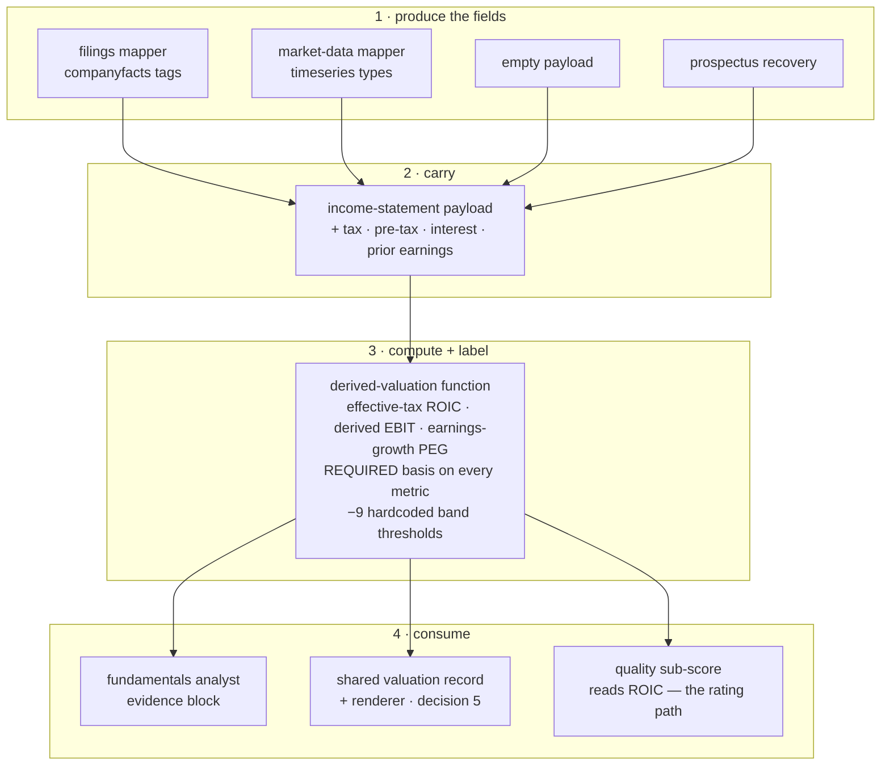

# FIX-1064: Valuation multiples rest on blunt proxies — Implementation Spec

## Part I — The Case *(for the human)*

### 1. Problem — why it matters, why now

Four of the numbers the desk reports about a company are not the numbers it says they are.

**Return on invested capital** is computed by taxing every company at 21%. Nvidia's last
full year actually paid **15.1%** ($21.4B of tax on $141.5B of pre-tax income). Taxing it at
21% understates its return on capital by about seven percent of the figure — and that figure
is one of three inputs to the quality score that sets the rating band the portfolio manager
is allowed to choose inside. This is the only one of the four that moves a number the desk
acts on.

**EV/EBIT** is not EV/EBIT; it divides by operating income. **PEG** is not PEG; it divides
the price/earnings ratio by *revenue* growth, so a company growing sales fast while earnings
go nowhere reads as reasonably priced.

And every multiple carries a **cheap / fair / expensive** verdict drawn from one hardcoded
table applied to every company on the market. The same "cheap below 2× sales" line is
applied to a utility and to a software company. Energy and industrials have traded four to
six times apart on the same multiple inside a single year, so a fixed threshold is not a
loose read — it is a coin flip wearing a label.

Each of these is documented in the code, and three of the four are labelled in the output.
So this is not concealment. It is a report presenting verdicts with more precision than its
inputs support, on a surface where someone is deciding whether to buy something.

**Why now.** Two issues in this epic are queued directly behind these four figures. The
lens work ([FIX-1066](https://linear.app/fixpoint-labs/issue/FIX-1066)) seats two new
investor perspectives whose entire methodology *is* these ratios, and it is blocked on this
issue precisely so it does not put blunt proxies in front of them. There is no workaround: a
reader cannot recompute return on capital from what the report shows them.

### 2. Solution in plain terms

**Compute the three measurable ones properly, and stop publishing the one we cannot
defend.**

Three numbers the company itself reports — the tax it paid, its pre-tax income, and its
interest expense — are already inside the filing the desk downloads on every run. It has
simply never read them. Reading them turns the flat-tax return on capital into the company's
real return on capital, and turns "EV/EBIT" into an actual EV/EBIT. Reading one more, the
prior year's earnings, turns "PEG" into a growth-adjusted multiple based on earnings rather
than sales. **No new data provider, no new request, no extra cost per run** — the numbers
arrive in a response the desk already pays for and throws most of away.

Where a company does not report one of those figures, the metric says which basis it fell
back to, or reports nothing at all. It never quietly substitutes.

**The cheap / fair / expensive verdict is removed rather than replaced.** There is no
defensible sector threshold available to us: the peer data the desk already fetches carries
peer *returns*, not peer *multiples*, so a sector median would mean six extra provider calls
per run, and a hand-written table of sector thresholds is seventy-odd numbers nobody can
source and nobody will notice going stale. Meanwhile the desk already produces a real answer
to "is this cheap" — a fair value derived from *this company's* own return on equity, growth
and required return, which abstains outright when its assumptions don't hold, and which
already drives the rating. The multiples go back to being inputs to that judgement instead of
delivering a competing verdict of their own.

**Philosophy** — tenet 3 (earn every addition): the sector-aware verdict is answered by
deleting nine hardcoded thresholds, not by adding seventy. Tenet 5 (one convergence point):
the basis label stops being an optional string a producer may forget and becomes a required
part of every metric, so a figure that cannot render its basis cannot compile. Tenet 1
(coherence): the desk already treats an unobserved statement figure as absent; a computation
that could not run now says so the same way.

> **§2 then §6 lead, and the rest is derivation.**

### 6. Decisions & rules — the sign-off surface

1. **Return on capital uses the tax the company actually paid.** When the filing reports tax
   and pre-tax income and the resulting rate is plausible, that rate is used; otherwise the
   21% assumption is kept and labelled as an assumption, exactly as today.
   *Rejected:* keeping the flat rate and labelling it harder — the label is already there and
   the number is still wrong.
   *Locks in:* **this changes ratings.** Low-tax companies score better on quality than they
   did last month and high-tax companies score worse, so a report re-run on the same data can
   land in a different rating band. That is a correction, not a regression, but published
   reports and the newer ones will disagree and we cannot restate the old ones.

2. **A growth-adjusted price multiple is published only when earnings growth is observed;
   otherwise it reports nothing.**
   *Rejected:* keeping today's revenue-growth version under an honest new name. It would be a
   number invented to fill a slot, that no investor asked for and none would act on.
   *Locks in:* some reports lose a line they have today, with nothing in its place. A reader
   who liked seeing a PEG will see fewer of them, and that will look like a downgrade.

3. **The cheap / fair / expensive verdict on each multiple is removed, not made
   sector-aware.** The desk's existing company-specific fair value stays the one place a
   cheap-or-expensive call is made.
   *Rejected:* a per-sector threshold table (undefendable, and stale within a year with
   nothing to catch it), and peer-derived medians (six extra provider calls per run, against
   the epic's no-new-data fence).
   *Locks in:* the desk makes **one** valuation call per company instead of fourteen. If we
   later want a per-multiple read, it has to come with a real comparison set, which means
   paying for peer fundamentals — a decision with a bill attached, deliberately deferred here.

4. **Every figure states the basis it was computed on, always — not only when it is a
   fallback.** A metric that cannot name its basis cannot be built.
   *Rejected:* today's optional label, which is why "EV/EBIT" could be shipped for years
   meaning something else.
   *Locks in:* a new derived figure can never be added without declaring what it actually
   measures. That is a small permanent tax on adding metrics, and it is the point.

5. **These four figures are put on the shared evidence surface every downstream reader sees,
   which is work [FIX-1066](https://linear.app/fixpoint-labs/issue/FIX-1066)'s plan currently
   assigns to itself.** Doing it here means the figures reach that surface already honest,
   rather than being exposed blunt and sharpened afterwards.
   *Rejected:* leaving the exposure to FIX-1066 — it would put proxy figures in front of two
   new lenses for however long the two issues are apart, which is the exact failure this epic
   is about.
   *Locks in:* FIX-1066's second pull request loses a step and must be re-pointed. Somebody
   has to make that edit; if nobody does, the two issues will both try to add the same block.

6. **Ships as two pull requests: reading the new figures out of the filings first, then the
   valuation methodology.**
   *Rejected:* one change — it buries the part that needs judgement (what we compute and what
   we stop publishing) underneath two provider-mapping diffs that need none.
   *Locks in:* two reviews instead of one, and the methodology cannot land until the plumbing
   does.

> **Non-goals** — no new data provider, feed, or paid entitlement, and no additional request
> to an existing one (the epic's fence). No peer-relative or sector-median valuation. No
> change to the fair-value, DCF, triangulation, or rating-envelope math. **Nothing here
> touches the lens agreement score or the directional lean** — this issue does not open
> `convergence-math.ts`. No per-share figures of any kind: the desk holds no share count, and
> that is why decision 2 says earnings growth rather than earnings-per-share growth. No
> recomputation of already-stored reports — the epic's forward-looking rule holds.
>
> **Size:** Large — 11 production files · 15 test behaviours · 2 documentation surfaces ·
> 2 PRs.

---

### 3. Tradeoffs & alternatives

**Alternative: build the sector table anyway.** Eleven sectors across seven ratio metrics.
Rejected on two grounds, and the second is the one that decides it. It is undefendable —
there is no source we could cite for any single cell, so every number would be somebody's
recollection. And it has a decay clock with no alarm: sector multiples move materially within
a year, and nothing in the codebase would ever tell us a cell had gone wrong. We would have
replaced one blunt instrument with a bigger, more confident-looking one, which is the epic's
first failure shape at a finer grain.

**The simpler approach: label the proxies harder and change no math.** Genuinely tempting,
and it is roughly a one-file change. Three of the four figures already carry a label, so the
work would be adding one to the bands and sharpening the wording. Insufficient because it
concedes the actual complaint. A better caveat on a number computed with the wrong tax rate
still feeds the wrong number into the quality score, and a reader who trusts the caveat is
being asked to do arithmetic they cannot do — they do not have the tax rate.

**Where the complexity is:** not the arithmetic, which is four small formulas. It is the
**coverage** of the newly-read fields, and it is uneven in a way that matters. Tax expense
and pre-tax income are reported reliably and currently — a spot check of Nvidia's filings
returned both for the most recent fiscal year. Interest expense is the weak one: Apple's
filings stop reporting it under the standard tag after fiscal 2023, so the derived EV/EBIT
will fall back to the operating-income basis on real, large, current names. That is precisely
why decision 4 makes the basis label mandatory and permanent rather than a fallback marker —
a metric that silently switches basis between companies is worse than one that never had the
better basis at all.

A second cost, smaller but real: the pre-tax income and interest fields have to be read by
**four separate producers** of the income statement (the filings mapper, the market-data
mapper, the empty payload, and the prospectus-recovery path). Missing one produces a figure
that is honest for companies from three providers and silently wrong for companies from the
fourth.

### 4. Focus practices (1–5)

1. **BP-020 (never fabricate; live paths never fall back silently)** — the reason this issue
   exists. A tax rate we assumed and a tax rate we read are different claims, and only one of
   them may be presented as a measurement. Applies equally to the *guard*: the plausibility
   check on a computed tax rate must fall back to the labelled assumption, never to a
   silently-clamped number.
2. **One convergence point for the basis label (tenet 5)** — the label becomes a required
   part of the metric type, so the four producers of a derived figure cannot each decide
   whether to attach one. This is the enforcement half of decision 4; without it, decision 4
   is another rule nothing checks.
3. **BP-030 (tolerate the old shape)** — the shared valuation record is persisted per report,
   and the new figures land on it. A report stored before this change must still open, and
   must not render an absent figure as a computed one.
4. **BP-034 (finish the rename)** — three of these figures are described in the fundamentals
   analyst's prompt and in the module headers by what they *used* to be. Leaving that text is
   how the next reader re-derives the wrong metric.
5. **BP-035 (second-path checklist)** — the second path here is the **company that does not
   report the new field**, not the provider that failed. Every one of these four figures has a
   fallback basis, and a test suite that only covers the well-reported company proves nothing.

### 5. What using it looks like

*(This is app code, so the surface a person meets is the evidence block a reader and the
downstream agents see, not a public API. **The tax rates below are real** — Nvidia's
reported fiscal-2026 tax of $21.383B on $141.450B of pre-tax income, read from the filings
API during research. **The metric levels are illustrative**, chosen to show the shape and
the direction of the change, not to predict a specific company's output. The label text is
also illustrative; the wording is the implementer's, the requirement to have one is
decision 4.)*

**Return on capital, before and after** *(what this spec proposes; the ratio between the two
is the real part — taxing at 15.1% instead of 21% raises the figure by ~7.5%):*

```
before  ROIC: 24.60% (proxy: approx — 21% tax assumption)
after   ROIC: 26.44% (tax basis: effective 15.1%, as reported)
```

**A company that does not report the tax fields** — the honest fallback, unchanged in value
and sharper in label:

```
after   ROIC: 24.60% (tax basis: assumed 21%; company does not report an effective rate)
```

**The three renamed or withdrawn figures:**

```
before  EV/EBIT: 31.20× (cheap/fair/expensive; proxy: operating income used as EBIT proxy)
after   EV/EBIT: 29.90× (basis: reported pre-tax income + interest expense)
        …or, where interest expense is unreported:
        EV/EBIT: 31.20× (basis: operating income — company does not report interest expense)

before  PEG: 1.42× (fair; proxy: revenue growth used in place of EPS growth)
after   PEG: 2.06× (basis: earnings growth, company-level — not per share)
        …or, where prior-year earnings are unobserved:
        PEG: n/a
```

**What no longer appears anywhere:** the `cheap` / `fair` / `expensive` word on any
individual multiple. The desk's single valuation verdict — margin of safety against its own
fair value, and the rating band that follows — is unchanged and remains where it is.

## Part II — The Build Plan *(for the implementing agent)*

### 7. Technical design

Four new statement fields enter at the two provider mappers, travel the existing statement
payload, and are consumed by one pure function. The verdict machinery is deleted from that
same function. The resulting figures are then carried onto the shared valuation record, which
already receives them as an argument and currently drops them.



- **The income-statement schema** gains four nullable fields: income-tax expense, pre-tax
  income, interest expense, and a year-over-year *earnings* growth figure beside the revenue
  growth figure that already exists. All nullable, matching the statement convention this
  epic's [FIX-1063](https://linear.app/fixpoint-labs/issue/FIX-1063) is hardening.
- **The two provider mappers** read them from responses they already fetch. The filings
  mapper reads three more tags from the same `companyfacts` payload — verified present with
  full-year duration entries in the exact shape its existing readers consume. The market-data
  mapper adds the corresponding annual series to the type list it already requests in one
  call, and derives earnings growth from the latest two the same way it already derives
  revenue growth.
- **The empty-payload builder and the prospectus-recovery mapper** emit nulls for all four.
  Both are producers of this payload; a missed one is a silent per-provider divergence (§3).
- **The derived-valuation function** is where the work is. Return on capital taxes at the
  observed effective rate when pre-tax income is positive and the computed rate is plausible,
  and at the assumption otherwise. EBIT is derived from pre-tax income plus interest expense
  when both are observed, and falls back to operating income. The growth-adjusted multiples
  read earnings growth and abstain without it. **The verdict helpers and both band tables are
  removed**, along with the verdict argument threaded through the renderer.
- **The metric type gains a required basis descriptor**, replacing the optional proxy string.
  This is the convergence point for decision 4: every one of the fourteen metrics declares
  what it was computed from, so a producer that forgets does not compile. Where a metric was
  always a straight reported ratio, that is what it declares.
- **The shared valuation record** gains the derived figures and a block in its prompt
  renderer (decision 5). It already receives them as a build argument and discards them; this
  keeps them. New fields default, per BP-030 — a stored report predating this must open and
  must render the block as absent rather than as computed.
- **Untouched:** the fair-value, DCF, triangulation, expected-return, discount-rate and
  rating-envelope math; the lens pack and its agreement math; every generator output schema;
  and the sizing gates.

**No solution sketch and no POC.** The change is four formulas and a deletion inside one pure
function that already has a full unit suite — sketching it would restate it. The single
premise worth checking was empirical rather than structural, and was checked directly during
research rather than built: **the tax, pre-tax and interest tags are present in the filings
response the desk already downloads, with the annual shape its existing readers consume.**
Confirmed for all three, and the check also surfaced the coverage asymmetry in §3 — interest
expense goes stale under the standard tag on at least one large current filer, which is what
made decision 4's always-on label mandatory rather than a fallback marker.

### 8. Implementation sequence

**PR a — the statement fields.** Provider-mapping work with no behavioural change; nothing
reads the new fields yet.

1. **Widen the income-statement schema** with the four nullable fields. *Test:* the schema
   accepts null and a number for each, and still rejects a wrong type. *Depends on:* nothing.
2. **Read them in the filings mapper** from the same response — the tax, pre-tax and interest
   tags, and prior-year earnings from the per-fiscal-year collection it already builds.
   *Test:* a response carrying the tags maps them; a response missing one maps it null, never
   zero. *Depends on:* 1.
3. **Read them in the market-data mapper** — add the annual series to the requested type list
   and derive earnings growth from the latest two, mirroring the existing revenue-growth
   derivation. *Test:* as step 2, plus the growth derivation with one period available.
   *Depends on:* 1.
4. **Null them in the other two producers** — the empty payload and the prospectus-recovery
   mapper. *Test:* each emits null for all four. *Depends on:* 1.

**PR b — the valuation methodology.** Depends on PR a.

5. **Make the basis descriptor required** on the metric type and declare it for all fourteen
   metrics, keeping today's values. This lands first and alone because it is the compile-time
   gate the rest of the PR relies on (decision 4). *Test:* the renderer emits a basis for
   every metric. *Depends on:* PR a.
6. **Effective-tax return on capital** (decision 1), with the plausibility guard falling back
   to the labelled assumption. *Test:* the §10 tax behaviours, both directions.
   *Depends on:* 5.
7. **Derived EBIT** with the operating-income fallback, both bases labelled. *Test:* the §10
   EBIT behaviours. *Depends on:* 5.
8. **Earnings-growth PEG and PEGY**, abstaining when earnings growth is unobserved
   (decision 2). *Test:* the §10 growth behaviours. *Depends on:* 5.
9. **Remove** both band tables, both verdict helpers, the verdict argument threaded through
   the renderer, and the verdict assertions in the existing suite (decision 3). *Test:* no
   rendered metric carries a cheap/fair/expensive word. *Depends on:* 5.
10. **Carry the figures onto the shared valuation record and render them** (decision 5),
    defaults-first. *Test:* the §10 record behaviours including the legacy read.
    *Depends on:* 6–9.
11. **Update the prompt and the module headers** that describe the old metrics — the
    fundamentals analyst's capital-structure guidance names both retired proxies and reads the
    removed verdicts; the module header advertises the bands as the preferred fallback; the
    DCF header cites them as its labelling precedent (BP-034). *Depends on:* 10.

**PR plan.**

| sub-PR | deliverables | depends_on |
|---|---|---|
| a | the four statement fields across all four producers (steps 1–4) | — |
| b | the valuation methodology, the deletion, the shared-record exposure, and the prose (steps 5–11) | a |

### 9. Edge cases & error handling

| Case | Expected |
|---|---|
| A loss-making company — negative pre-tax income | The effective rate is not computed. Falls back to the labelled assumption. A negative rate is arithmetic, not a tax rate |
| A one-off tax benefit or a valuation-allowance release — a rate that is negative or above 100% | Outside the plausible band, so the labelled assumption is used. **The fallback is the labelled assumption, never a clamped number** — clamping would invent a rate the company never paid |
| A company reporting exactly zero tax on positive pre-tax income | A real 0% effective rate. Used as observed. This is the over-application trap: the rule is *unobserved* → fall back, not *falsy* → fall back |
| Interest expense unreported (the Apple case in §3) | EBIT falls back to the operating-income basis, labelled as such. Not an error, and not rare |
| Interest expense reported net of interest income | Accepted as reported. The basis label says the figure is derived from reported components; the desk does not attempt to un-net it |
| Prior-year earnings present but zero or negative | Growth is uninterpretable as a divisor. The growth-adjusted multiples abstain rather than emitting a figure with a sign flip in it |
| Earnings growth observed but negative | The multiples abstain. A growth-adjusted multiple on shrinking earnings is not a small number, it is a meaningless one |
| Both revenue growth and earnings growth present and disagreeing sharply | Only earnings growth is used. The revenue figure keeps its existing separate consumers untouched |
| A company from the prospectus-recovery path | All four fields null; every dependent figure falls back or abstains, each labelled |
| A report stored before this change is re-opened | Opens. The new block renders as absent, never as computed (BP-030) |
| The fundamentals analyst's evidence block after the deletion | Renders every multiple with a value and a basis, and no verdict word. The prompt must no longer instruct the model to read one |
| A figure whose basis cannot be determined | Cannot occur — the basis is required by the type (decision 4). If a producer cannot name one, that is a design error surfaced at compile time, not a runtime fallback |

**Taxonomy:** nothing here introduces a fatal path. Every case degrades to a labelled
fallback basis or to an abstention, both of which every downstream reader — prompts,
formatters, the quality sub-score, the evidence gate — already handles.

### 10. Testing strategy

**Goal check:** run the analysis pipeline headlessly on a fixture ticker and read the
machine-readable run summary. The pass condition is that the run produces a decision and its
quality sub-score is computed — the point being that the rating path survives a return on
capital that has moved. Use the headless two-step in the trading-desk guide (`fsdev run` plus
the zero-model summary read), driven by the `verify-trading-desk` skill; no new harness.
`goals/trading-desk-valuation/effective-tax-roic/`. This needs a model key, because the
generators still run; everything in the CI list below is deterministic and does not.

**CI specs** (the behaviours, not the test names):

- **one behaviour per decision in §6**, in observable terms — what the rendered figure and
  its basis say, not how the rate was computed
- **the second path (BP-035), stated separately because it is the whole risk here:** for
  each of the four new figures, a company that does **not** report its input. All four
  fallbacks and abstentions exercised, each asserting the label as well as the value
- **what must not change:** a company reporting none of the four new fields produces
  byte-identical numbers to today for every metric except the removed verdicts. This is the
  regression that proves the change is additive where it should be
- **the over-application trap, both directions:** a company reporting a genuine 0% effective
  tax rate uses it; a company reporting nothing falls back. One test, both directions — this
  is the pair a naive "falsy means missing" implementation fails
- **the invariant that is easy to state wrongly:** every metric renders a basis, for every
  input combination including all-null. Assert it as a property over the whole metric set,
  not as a list of expected strings — pinning strings tests the wording, and the wording is
  the implementer's
- **the plausibility guard fails to the labelled assumption**, never to a clamped rate.
  Assert the emitted rate equals the assumption, not merely that it is within bounds — a
  clamp would also pass a bounds check, which is how this ships wrong
- **the persisted record, both directions:** a record written after this change carries the
  figures; one written before opens and renders them absent
- **the deletion:** no rendered multiple carries a cheap, fair, or expensive word

**Discipline:** `tdd`. The seam is the pure derived-valuation function plus the two provider
mappers — all three reachable from a vitest spec with no runtime and no network, so every
behaviour above is a tracer bullet. Extend the existing valuation, valuation-spine, filings-
mapper and market-data-mapper suites rather than adding a parallel one; the fixtures the
tests need are already there.

### 11. Documentation plan

- **EXTEND** `labs/trading-desk/CLAUDE.md` — the live-mode paragraph describes what the three
  statement tools source and states the nullable-field discipline. Add one short paragraph
  naming the four new fields, where they come from (the same responses, no extra call), and
  the basis-label rule from decision 4, so the next person adding a derived metric meets the
  requirement before they write one. *Voice risk:* this is the internal agent guide, so
  precision over warmth; do not soften "assumption" into "estimate".
- **EXTEND** the module headers on the derived-valuation module, the DCF module, and the
  fundamentals analyst prompt (§8 step 11). Not a published docs surface, but they currently
  assert the retired proxies as current behaviour and the bands as the preferred fallback,
  which is exactly how a corrected metric gets un-corrected later (BP-034).
- **No `apps/docs` change.** The trading desk is a lab application, not published framework
  documentation, and nothing on any `@flow-state-dev/*` public surface changes.
- **No `docs/architecture/*` change.** No locked framework contract moves.
- **Changeset:** internal-only (`--empty`) per BP-022 — the desk is a private lab app.

### 12. Dependencies, open questions & follow-ups

**Dependencies:**

- **[FIX-1063](https://linear.app/fixpoint-labs/issue/FIX-1063) must land first, and it is a
  hard sequencing constraint, not a preference.** Its first pull request widens the
  fundamentals payload to nullable and rewrites consumers inside the same derived-valuation
  module this issue rewrites — a direct file collision. It also changes the shape of what
  "unobserved" means for the market-cap-dependent multiples this issue's figures sit beside.
  **Where the two meet:** FIX-1063's governing invariant is that a verdict or status field
  must only ever describe work that actually happened. Decision 4 is that invariant applied
  one layer down — the basis descriptor is a status field about *which computation ran*, and
  making it required rather than optional is how this issue enforces the invariant rather
  than restating it. The plausibility guard in decision 1 is the same rule again: falling
  back to a labelled assumption is honest, falling back to a clamped number would be a figure
  describing a tax rate nobody paid.
- **[FIX-1066](https://linear.app/fixpoint-labs/issue/FIX-1066) is blocked on this and its
  plan needs one edit.** Decision 5 moves the four figures onto the shared evidence surface
  here, which its second pull request currently owns as its step 5. **Nothing in this spec
  touches the lens agreement score, the directional lean, or `convergence-math.ts`** — the
  standing condition that the gap discount applies to agreement and classification only, and
  never to the lean, is untouched and unaffected by anything here. The only overlap is the
  evidence-surface exposure, and it is a scope handoff rather than a design conflict.

**Open questions:** one, and it is the only genuine fork in this spec — decision 3, whether
the per-multiple cheap / fair / expensive read is deleted or kept as an explicitly rough
heuristic. It is asked in full on the spec PR, because it turns on how a reader uses a
labelled-blunt verdict, which the product owner knows and I do not.

**Follow-ups (flagged, not built):**

- **Peer-relative multiples.** The honest version of a per-multiple valuation read needs a
  real comparison set, which means fundamentals for the peer group the desk already
  identifies — roughly six additional provider calls per run. That is a cost decision with a
  bill attached and belongs in the data-and-providers lane, not here.
- **The DCF's own unlabelled proxy.** The intrinsic-value model treats generic reported free
  cash flow as a free-cash-flow-to-firm figure, and says so in a code comment that reaches no
  reader. Decision 4's requirement stops at the derived-valuation metrics; extending it to the
  intrinsic-value block is the same argument one module over. Worth its own small issue.
- **Dividend yield in the growth-adjusted denominator.** The dividend-and-growth variant
  currently coerces an absent dividend yield to zero before adding it to the denominator.
  FIX-1063 already tracks the underlying field's over-application as a follow-up; this
  consumer should be revisited with it rather than separately.
- **Deepening:** the derived-valuation module now carries fourteen metrics with per-metric
  fallback logic in one function. It is still readable, but it is the shape that stops being
  readable at twenty. Out of scope; follow up via `improve-codebase-architecture`.

---

## Spec evolution

- **Spec drafted** — framed as four separate defects with one shared cause rather than as
  four fixes, because three are measurable from data already on hand and the fourth is not
  measurable at all. Chose to delete the sector-band verdict rather than replace it, after
  confirming the peer data the desk fetches carries returns and not multiples, and that the
  desk already produces a company-specific valuation verdict that abstains. Made the basis
  label a required part of the metric type rather than a convention, so decision 4 is enforced
  by the compiler rather than by review. Verified against the filings API that the three tax
  and interest tags are present in the response the desk already downloads — and that interest
  expense goes stale on at least one large current filer, which is why the basis label is
  always-on rather than a fallback marker. Split into two pull requests so the methodology
  call is reviewed on its own rather than under two provider-mapping diffs.
</content>
</invoke>
